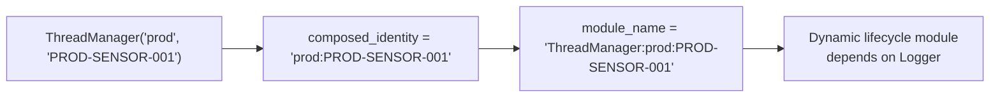

# HEP-CORE-0031: ThreadManager — Per-Owner Bounded-Join Thread Lifecycle

**Status**: Implemented (2026-04-15)
**Layer**: 2 (Service)
**Depends on**: Logger (lifecycle module dependency)

---

## 1. Purpose

`ThreadManager` is a value-composed utility owned by any component that spawns
background threads. It provides:

- Named thread tracking with per-thread join timeouts
- Bounded-join drain in reverse-spawn order (LIFO)
- Dynamic lifecycle module integration (topological teardown ordering)
- Process-wide detach-leak counter for test/exit-code policy

ThreadManager does NOT own the stop signal. The owner component keeps its own
stop atomic/cv and captures it into the thread body lambda. ThreadManager
handles only the join half of the shutdown.

---

## 2. API

> Verified against `src/include/utils/thread_manager.hpp` (2026-04-16).

```cpp
class ThreadManager {
public:
    struct SpawnOptions {
        std::chrono::milliseconds join_timeout{kMidTimeoutMs};  // 5s default
    };

    struct ThreadInfo {
        std::string name;
        bool alive;
        std::chrono::steady_clock::duration elapsed;
        std::chrono::milliseconds join_timeout;
    };

    // Identity required at construction — compile-time enforced (no default ctor).
    ThreadManager(std::string owner_tag,      // class/role: "prod", "ZmqQueue"
                  std::string owner_id,       // instance: uid, queue endpoint
                  std::chrono::milliseconds aggregate_shutdown_timeout
                      = std::chrono::milliseconds{2 * kMidTimeoutMs});
    ~ThreadManager();  // calls drain()

    // Non-copyable, non-movable (fixed identity + lifecycle module).

    bool spawn(const std::string &name, std::function<void()> body, SpawnOptions opts);
    bool spawn(const std::string &name, std::function<void()> body);

    // Per-slot bounded join in reverse-spawn order. Returns detach count.
    std::size_t drain();

    std::size_t detached_count_last_drain() const;
    std::size_t active_count() const;
    std::vector<ThreadInfo> snapshot() const;

    const std::string &owner_tag() const noexcept;
    const std::string &owner_id() const noexcept;
    const std::string &composed_identity() const noexcept;
    std::string module_name() const;

    static std::size_t process_detached_count() noexcept;
    static void reset_process_detached_count_for_testing() noexcept;
};
```

---

## 3. Identity and Lifecycle Module



At construction, ThreadManager registers a dynamic lifecycle module with:
- Name: `"ThreadManager:" + composed_identity`
- Dependency: `"pylabhub::utils::Logger"`
- Startup thunk: no-op (threads spawn lazily via `spawn()`)
- Shutdown thunk: **intentional no-op** (see §5)

---

## 4. drain() — Per-Slot Bounded Join

```
set closing = true  (under lock; rejects new spawn())
move all slots out of Impl (under lock)

for each slot in REVERSE spawn order (LIFO):
    if not joinable → skip (idempotent — already joined/detached)
    poll slot.done flag every 10ms up to slot.join_timeout
    if done → thread.join()    (instant — body already returned)
    else    → thread.detach()  (ERROR log + inc process_detached_count)
```

**`closing` flag**: set under the same lock as the slot-move, so a concurrent
`spawn()` either completes before drain sees its slot (safe — drain joins it),
or observes `closing=true` and rejects (safe — no orphaned joinable thread).

**No cross-cycle gate**: the old `join_all_done` atomic was removed. drain() is
naturally idempotent — `joinable()` returns false after join/detach, so repeat
calls walk an empty slot list and return 0.

---

## 4.1 Thread Shutdown Contract

> **The contract (added 2026-05-12).**
>
> **For every managed thread:**
> 1. The thread SHOULD minimize its touch on `pImpl` / shared
>    resources while running.
> 2. On shutdown, the thread SHOULD exit its active loop quickly.
> 3. As the thread leaves its active loop, it MUST mark the
>    per-slot `active_loop_exited` flag via
>    `SlotContext::mark_active_loop_exited()`.
> 4. After the active loop has returned, the thread MUST NOT touch
>    any `pImpl` or other shared resource the teardown caller might
>    destroy.  Only its own stack frame and its
>    `ThreadManager::SlotContext` are accessible from that point on.
>
> **For the teardown caller:**
> A. Honor each thread's `active_loop_exited` flag with a bounded
>    timeout (`wait_for_active_loop_exit(name, timeout)`).  Destroy
>    resources the thread had been using ONLY after that wait
>    returns.
> B. Once all `active_loop_exited` flags are set (or their
>    timeouts elapsed), join the threads (via `drain()` or
>    `join_named()`) and proceed with destruction of the rest of
>    the lifecycle objects.

The rest of §4.1 elaborates this contract — but the four thread-side
rules and two caller-side steps above are the load-bearing
specification.  Without rule 4 (no pImpl access after active loop),
no caller ordering can fix the race; every caller becomes a hostage
to the thread's implicit "extra" pImpl access.  With rule 4 plus
the synchronization primitive, the caller can deterministically
honor the contract.

### 4.1.1 Per-thread contracts

Every long-running thread declares (in code or by structural
property) which shared state it depends on during its own shutdown:

- **Stop-observation point**: the first instant the thread notices
  shutdown is requested.  This is typically a loop predicate
  checking an atomic `stop_requested` flag plus a wake-up via a
  signal socket or condition variable.
- **Loop-exit point**: the moment the thread's active loop function
  returns.  After this, the thread MUST be quiescent w.r.t. shared
  state — no further pImpl reads/writes, no further socket
  operations on a poll target the caller might close.
- The thread signals "I've reached my loop-exit point" by calling
  `SlotContext::mark_active_loop_exited()` (see §4.1.2 below) from
  inside its body.
- The teardown caller honors the contract by waiting for the
  per-slot flag via `ThreadManager::wait_for_active_loop_exit(...)`
  before destroying the resources the thread had been touching.

### 4.1.2 `SlotContext` and `active_loop_exited` — the primitive

`ThreadManager::spawn` passes a `SlotContext &` reference into the
spawned body as its first parameter.  The thread uses the context to
declare progress without coupling to its owner's pImpl:

```cpp
// Sketch of the API surface.

struct ThreadManager::SlotContext {
    /// Called from inside the thread body, immediately after its
    /// active loop function returns (or as the first action of any
    /// post-loop self-cleanup that does NOT touch external shared
    /// state).  Idempotent.  After this returns, the teardown
    /// caller is free to destroy any resources the thread declared
    /// it would no longer touch.
    void mark_active_loop_exited() noexcept;
};

class ThreadManager {
public:
    bool spawn(const std::string &name,
               std::function<void(SlotContext &)> body,
               SpawnOptions opts = {});

    bool is_active_loop_exited(std::string_view name) const noexcept;

    bool wait_for_active_loop_exit(std::string_view name,
                                   std::chrono::milliseconds timeout) noexcept;
};
```

**Distinction from the existing `done` flag:**

| Flag | Who sets it | When | What it means |
|---|---|---|---|
| `done` | Spawn wrapper | After body returns | Thread is gone; `std::thread::join()` will return immediately |
| `active_loop_exited` | Thread itself | Inside body, after active loop returns | External dependencies released; teardown caller may free them |

`active_loop_exited` is ALWAYS set BEFORE `done` (the thread sets it
just before returning).  The gap is whatever post-loop self-cleanup
the thread chooses to perform — none in the simplest case, possibly
flushing local diagnostics in more complex bodies.  The teardown
caller chooses which flag to wait on based on intent: waiting on
`active_loop_exited` is enough to honor the shutdown contract;
waiting on `done` (via `drain()` or `join_named`) is required to
treat the slot as fully terminated.

### 4.1.3 `drain()` / `join_named()` consult `active_loop_exited`

`drain()` and `join_named()` primarily synchronize on `done`, but
they use `active_loop_exited` as an intermediate landmark:

- **Two-stage wait.**  The per-slot `join_timeout` is split into two
  halves.  First half: wait for `active_loop_exited`.  Second half:
  wait for `done`.
- **Detach-timeout diagnostics.**  If the second-half wait
  times out, the error log says "stuck in active loop" (first half
  timed out — thread hasn't even exited its loop) or "stuck in
  post-loop cleanup" (first half succeeded but second half timed out
  — thread exited its loop but didn't return).  Today's drain logs
  conflate the two states.
- **Fast path for already-exited slots.**  If `active_loop_exited`
  is already true when drain starts polling a slot, drain knows
  body-return is imminent and skips the 10ms polling cadence.

### 4.1.4 Per-class pattern classification

This codebase has three patterns for lifecycle-managed classes that
own or are owned by threads:

| Pattern | Owns its threads? | How its API maps to the contract |
|---|---|---|
| **Externally-threaded** | No — caller's ThreadManager owns the thread(s).  Class's `stop()` is a fire-and-forget signal. | Class's `stop()` flips a stop flag and wakes the thread.  The thread's body (run on the caller's ThreadManager) is responsible for calling `mark_active_loop_exited()` after the active loop returns.  Class's `disconnect()` / `reset()` are the destructive operations that the teardown caller delays until `wait_for_active_loop_exit` returns. |
| **Self-threaded** | Yes — class owns a private ThreadManager.  `stop()` is self-contained (signal + drain of own threads). | The class's body internally calls `mark_active_loop_exited()` and the class's own `drain()` consumes it.  External callers treat the whole `stop()` as one atomic step. |
| **Inline / no thread** | No threads of its own — driven inline by the caller's thread. | No shutdown contract because there is no separate thread.  Resource cleanup happens whenever the caller chooses. |

Examples in the pylabhub codebase:

- `BrokerRequestComm` is **externally-threaded**.  Its ctrl thread is
  spawned into `RoleAPIBase::thread_manager()`, NOT BRC's own
  ThreadManager.  `BRC::stop()` is therefore a fire-and-forget
  signal that flips `stop_requested`.  `BRC::run_poll_loop` (the
  active loop function) takes `SlotContext &` and calls
  `mark_active_loop_exited()` after `loop.run()` returns.  The
  teardown caller (`do_role_teardown` Step 12.5) calls
  `wait_for_active_loop_exit("ctrl")` before allowing
  `teardown_infrastructure_` to destroy `broker_comm_`.
- `ZmqQueue` is **self-threaded**.  Owns its own ThreadManager; its
  recv/send threads run inside the queue's `Impl` and are joined by
  the queue's own `stop()`.  Callers treat `stop()` as one
  atomic step; the contract is internal.
- `InboxQueue` is **inline / no thread**.  `recv_one()` is called
  from the worker thread that runs `data_loop.hpp`.  No background
  thread exists; `stop()` is just resource cleanup, ordered by the
  caller's natural code flow.

### 4.1.5 Historical context

The contract was articulated 2026-05-12 in response to a captured
use-after-free race in role-side teardown.  `do_role_teardown`
(`role_host_lifecycle.cpp`) signaled `BrokerRequestComm::stop()`,
then immediately ran `teardown_infrastructure_` which destroyed
`broker_comm_`, before the BRC ctrl thread had finished its
post-loop work.  The post-loop store at
`broker_request_comm.cpp:594` dereferenced freed `pImpl` →
SIGSEGV (1/13 reproductions under `ctest -j2`).

The fix had THREE parts, each from this contract:
1. The thread's body acknowledged the rule explicitly — call
   `mark_active_loop_exited()` after `loop.run()`, then DO NOT
   touch `pImpl` again.  Pre-MD1 the body violated the rule by
   writing `pImpl->poll_loop_running` and
   `pImpl->active_loop_periodic_tasks` post-loop (both dead-code
   accesses; removed).
2. ThreadManager gained the `active_loop_exited` primitive so the
   thread's progress is observable without coupling to pImpl.
3. The teardown caller inserted a `wait_for_active_loop_exit("ctrl")`
   step between signaling stop and destroying `broker_comm_`,
   honoring the contract.

The historical placement of `teardown_infrastructure_` (BEFORE the
final `drain()` — see HEP-CORE-0011 §"Role Host worker_main_()
Steps") is deliberate and unchanged: it lets the role host release
its resources before potentially-hanging joins, leaving partial
cleanup possible if a thread eventually wedges and is detached.

### 4.1.6 Reviewer rules

When adding a new managed thread:
1. Choose whether the class is externally-threaded, self-threaded,
   or inline (per §4.1.4).  Document the choice in the class's
   docstring.
2. If the thread's body is the active loop directly: call
   `SlotContext::mark_active_loop_exited()` after the loop returns
   and BEFORE any further pImpl access.  If the body must do
   post-loop work that does NOT touch shared state (e.g., flush
   thread-local diagnostics), mark first.
3. At every site that destroys this class while a thread is
   potentially still running, verify the contract is honored:
   either via `wait_for_active_loop_exit` (if the destroy site is
   not in a `drain()`) or via the drain itself (if the slot is in
   the drained set).

When adding a new step to an existing teardown sequence:
1. Identify which thread's contract the step interacts with.
2. If the step destroys state any thread was touching, the step
   must run AFTER that thread's `active_loop_exited` mark.
3. Reviewers reject steps that destroy state without an
   `active_loop_exited` synchronization upstream.

---

## 5. Lifecycle Thunk Design

`tm_shutdown()` is a **safe no-op**. Rationale:

1. Teardown ownership is in `~ThreadManager`, not the lifecycle dispatch.
2. The lifecycle's `timedShutdown` wraps the thunk in a spawned thread with
   a timeout + detach fallback. Running `drain()` inside that wrapper would
   double-wrap the already-detaching flow.
3. A prior design set a `join_all_done` flag in the thunk, which caused the
   destructor's drain() to early-return and leave joinable `std::thread`
   objects in the slot vector → `std::terminate` on `~Impl`. This bug is
   the reason the thunk was made a no-op.

Normal teardown sequence:
```
~ThreadManager → drain() → join/detach all slots
              → impl_alive = false
              → UnloadModule (async — lifecycle thread picks it up)
              → tm_shutdown fires → validator sees impl_alive=false → skip
```

---

## 6. Logger NOT Migrated

Logger uses its own `std::thread` + `.join()` in `Impl::shutdown_()`.
Adding a ThreadManager dependency on Logger would create a circular
dependency: ThreadManager's lifecycle module depends on Logger, and
Logger can't depend on ThreadManager (it IS Logger). Accepted as-is.

---

## 7. Adoption

| Component | owner_tag | owner_id | Thread names |
|-----------|-----------|----------|--------------|
| ProducerRoleHost | `"prod"` | role uid | `"worker"`, `"ctrl"` |
| ConsumerRoleHost | `"cons"` | role uid | `"worker"`, `"ctrl"` |
| ProcessorRoleHost | `"proc"` | role uid | `"worker"`, `"ctrl"` |
| ZmqQueue | `"ZmqQueue"` | `instance_id` or `endpoint@ptr` | `"send"` or `"recv"` |

---

## 8. Test Infrastructure

- `ThreadLeakListener` (gtest event listener in `test_entrypoint.cpp`):
  fails any test where `process_detached_count()` grew during the test.
- `run_gtest_worker` / `run_worker_bare` (subprocess test helpers):
  check `process_detached_count()` post-body; return exit code 4 on leak.
- Tests that deliberately exercise timeout-detach call
  `reset_process_detached_count_for_testing()` in TearDown.

---

## 9. Source File Reference

| File | Description |
|------|-------------|
| `src/include/utils/thread_manager.hpp` | Public API |
| `src/utils/service/thread_manager.cpp` | Impl: lifecycle thunks, spawn, drain, counters |
| `tests/test_layer2_service/test_role_data_loop.cpp` | ThreadManagerTest suite (SpawnAndJoin, MultipleThreads, JoinInReverseOrder) |

---

## Document Status

| Version | Date | Change |
|---------|------|--------|
| 1.0 | 2026-04-16 | Initial HEP from tech draft merge. Verified against code. |
