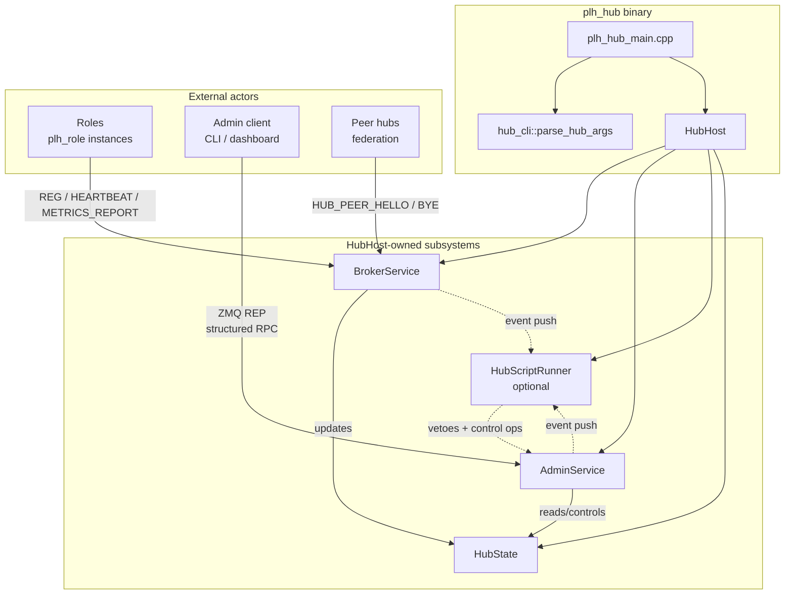
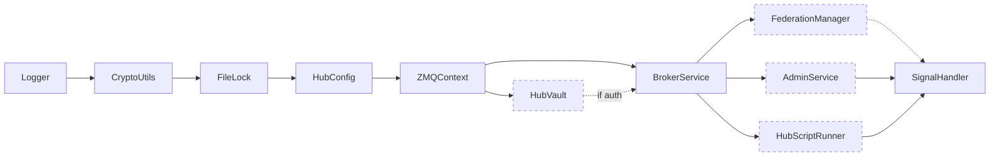
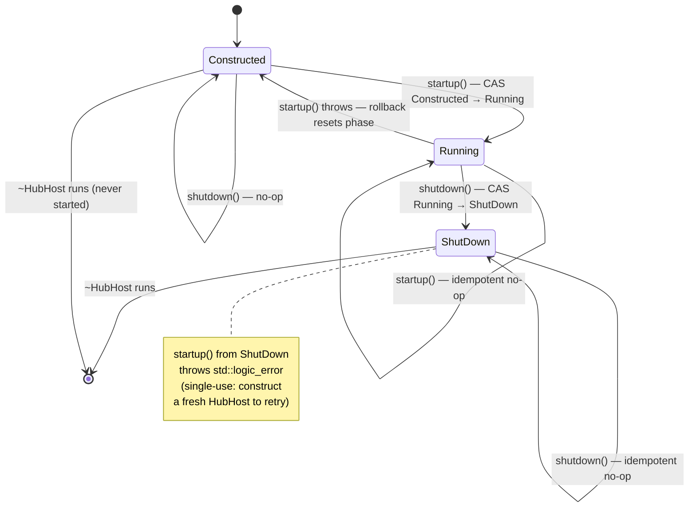
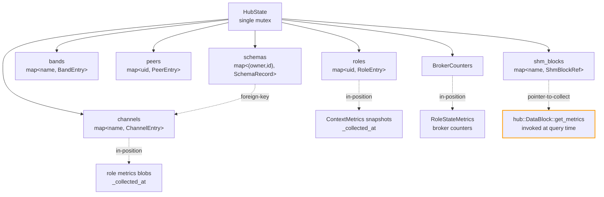
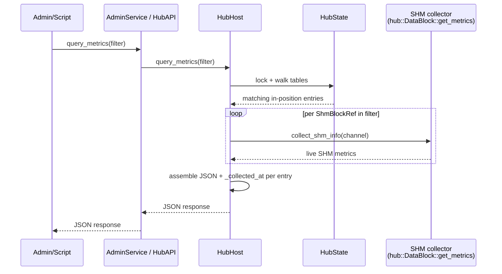
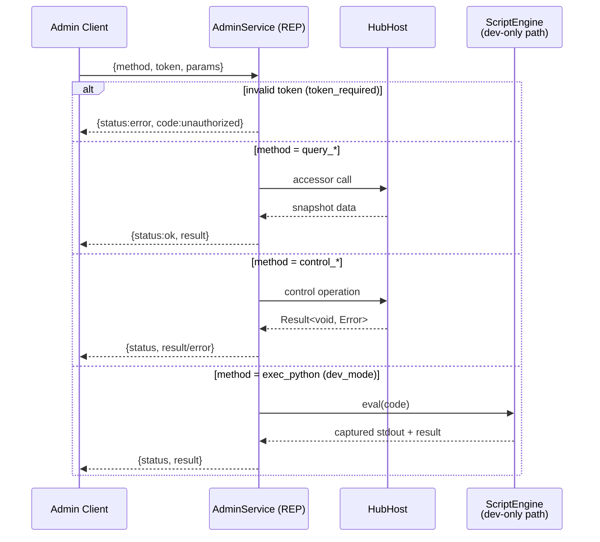
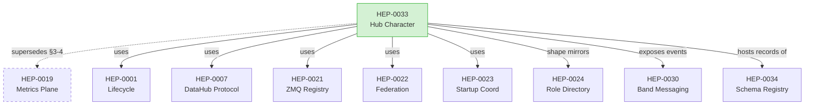
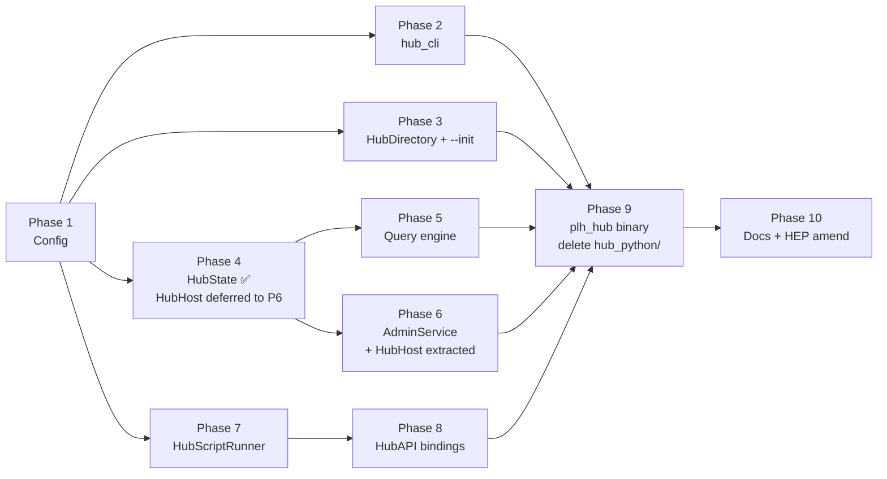

# HEP-CORE-0033: Hub Character

| Property       | Value                                                                                    |
|----------------|------------------------------------------------------------------------------------------|
| **HEP**        | `HEP-CORE-0033`                                                                          |
| **Title**      | Hub Character — Unified Hub Binary, Structured Admin RPC, Query-Driven Metrics, Scripting Parity |
| **Status**     | Draft (design ratified 2026-04-21; implementation not started)                           |
| **Created**    | 2026-04-21                                                                               |
| **Area**       | `pylabhub-utils`, `pylabhub-scripting`, `plh_hub` binary (new)                           |
| **Depends on** | HEP-CORE-0001 (Lifecycle), HEP-CORE-0007 (DataHub Protocol), HEP-CORE-0021 (ZMQ Registry), HEP-CORE-0022 (Federation), HEP-CORE-0023 (Startup Coordination), HEP-CORE-0024 (Role Directory Service), HEP-CORE-0030 (Band Messaging) |
| **Amends**     | HEP-CORE-0019 §3-4 — the periodic broker-pull metrics model is replaced by a query-driven model. HEP-CORE-0019 §3.2 (live SHM-derived block merge) is retained. |
| **Reference**  | Full design draft: `docs/tech_draft/HUB_CHARACTER_DESIGN.md`                             |

---

## 1. Motivation

The hub binary (`pylabhub-hubshell`) was built before several key abstractions that
have since been established on the role side:

| Capability        | Role side (HEP-0024, modern) | Hub side (`pylabhub-hubshell`, legacy) |
|-------------------|------------------------------|----------------------------------------|
| CLI parsing       | `role_cli::parse_role_args` (no-exit, stream-directed) | inline `argv` walking in `main()` |
| Config            | Composite `RoleConfig` with typed sub-configs + strict key whitelist | (legacy `pylabhub::HubConfig` lifecycle singleton — deleted 2026-04-29; superseded by `pylabhub::config::HubConfig` per §6.1) |
| Env setup         | `scripting::role_lifecycle_modules()` helper | inline `LifecycleGuard` wiring |
| Script engine     | `ScriptEngine` abstraction (Python + Lua + Native) | bespoke `PythonInterpreter` (CPython embed, Python-only) |
| Script API        | Modern pybind11 `ProducerAPI`/`ConsumerAPI`/`ProcessorAPI` | `HubScriptAPI` + `pylabhub_module` (pre-abstraction style) |
| Admin interface   | n/a | `AdminShell` ZMQ REP with "exec arbitrary Python" only |
| Metrics           | `ContextMetrics` hierarchical X-macros | scattered (`metrics_store_`, `RoleStateMetrics`, SHM live merge) |

The hub binary is additionally **currently disabled in the build** (`if(FALSE)` in
`src/CMakeLists.txt`) awaiting the `PythonEngine` migration. This HEP defines the
complete new design the hub binary must implement before re-enabling.

## 2. Design premises (ratified)

1. **`pylabhub-utils` is the primary product.** The hub binary is a thin consumer
   of library code.
2. **Hub is a single-kind automated binary, fully functional without any script.**
   No `HubHostBase`/`HubRegistry`. Extension comes from **config** and **script**,
   never from new binary kinds.
3. **Admin interface is structured RPC** (per-method, typed). Python `exec()` is a
   gated dev-mode backdoor, never the primary path.
4. **Script is a pure customization layer, optional.** Every callback has a
   sensible C++ default (no-op for events, accept for vetoes). Absent script =
   fully functional hub with default policies.
5. **Scripting uses the same `ScriptEngine` abstraction as roles.** `PythonEngine`
   and `LuaEngine` both supported. Bespoke `PythonInterpreter` retired.
6. **Metrics are query-driven.** A global table holds either in-position data
   (broker-internal counters, role-pushed metrics) or pointers to on-demand
   collectors (local SHM blocks). Queries walk the table, collect, format JSON,
   return. Broker never initiates network requests to roles for metrics.
7. **Admin queries never depend on role availability.** Query reads what is
   present; each entry carries a `_collected_at` timestamp; freshness is
   self-describing; no retries, no wait-for-update.

## 3. Hub functions (user-defined decomposition)

The hub binary performs seven functions. This HEP is organised around them.

| # | Function                   | Owner component                                           |
|---|----------------------------|-----------------------------------------------------------|
| 1 | Parse arguments            | `hub_cli::parse_hub_args` (mirrors `role_cli`)            |
| 2 | Config                     | `HubConfig` composite (mirrors `RoleConfig`)              |
| 3 | Set up environment         | `scripting::hub_lifecycle_modules()` + `LifecycleGuard`   |
| 4 | Manage communication       | `BrokerService` + `Messenger` (existing, unchanged)       |
| 5 | Maintain state tables      | `HubState` (new) with public read accessors on `HubHost`  |
| 6 | Maintain metrics           | Global table (part of `HubState`) + query engine          |
| 7 | Answer requests            | `AdminService` RPC + `HubAPI` script binding              |

## 4. `HubHost` class + start/stop

Single class owning the hub's runtime state and exposing read/write access to
`AdminService` and `HubAPI`.

> **Terminology note.**  HubHost is **not** a `LifecycleGuard` module —
> its `startup()` / `shutdown()` are invoked directly by `plh_hub_main`
> (or by tests).  The process-wide `LifecycleGuard` (Logger, FileLock,
> CryptoUtils, JsonConfig, ZMQContext, ThreadManager) wraps HubHost
> from the outside.  When this section says "start/stop" or "phase FSM"
> it means HubHost's own run-state machine (§4.3); when it says
> "LifecycleGuard module ordering" it means the surrounding modules.
> The two are distinct and the doc keeps them visibly separate.

> **Phasing note (added 2026-04-25).** The `HubHost` class is **not built
> in the early phases.**  When `plh_hub_main.cpp` first lands (§15
> Phase 5), it owns `BrokerService` directly — there is no second
> mutation client to justify a curated wrapper at that point, and
> a single-subsystem HubHost would be a wrapper-without-purpose
> (CLAUDE.md "no half-finished implementations").  The class is
> introduced at §15 Phase 6 alongside `AdminService`, when two
> mutation clients (admin RPC + script bindings) make a single
> curated surface load-bearing — centralized auth-context wrapping,
> audit logging, and encapsulation of broker-internal request queues.
> Until Phase 6, the §4 design below is normative for the eventual
> shape but not implemented.

### 4.0 Component architecture




```cpp
namespace pylabhub::hub_host {

class PYLABHUB_UTILS_EXPORT HubHost
{
public:
    explicit HubHost(config::HubConfig cfg,
                     std::unique_ptr<scripting::ScriptEngine> engine,  // optional
                     std::atomic<bool> *shutdown_flag);
    ~HubHost();

    void startup_();
    void run_main_loop();
    void shutdown_();

    // Read accessors (snapshots; thread-safe via internal state mutex).
    HubStateSnapshot     state_snapshot() const;
    nlohmann::json       query_metrics(const MetricsFilter &f) const;
    ChannelInfo          get_channel(std::string_view name) const;
    std::vector<RoleInfo> list_roles(const RoleFilter &f = {}) const;

    // Control operations (thread-safe).
    Result<void, Error>  close_channel(std::string_view name);
    Result<void, Error>  broadcast_channel(std::string_view name,
                                           const nlohmann::json &msg);
    Result<void, Error>  revoke_role(std::string_view uid,
                                     std::string_view reason);

    const config::HubConfig &config() const noexcept;

private:
    struct Impl;
    std::unique_ptr<Impl> impl_;
};

} // namespace pylabhub::hub_host
```

**`LifecycleGuard` module ordering** (driven by config toggles — disabled
subsystems are not constructed).  These are the **process-wide modules**
that wrap HubHost; HubHost itself is not in this graph (see §4.3 for
HubHost's own phase FSM):



Dashed modules are config-gated; a minimal hub (admin off, federation off, no
script, no auth) runs with only the solid-edge nodes.

### 4.1 Init protocol (ordered steps)

Pinned by `HubHost::startup()`.  Drives the phase FSM (§4.3) from
`Constructed → Running` via a CAS guard at the head of the method:
re-entry from `Running` is a no-op (idempotent); re-entry from
`ShutDown` throws `std::logic_error` (single-use after shutdown — see
§4.3).  Failure at any step rolls back the preceding ones (broker stop
+ ThreadManager drain + reset of unique_ptrs) and resets the phase to
`Constructed` so the caller may retry on a fixed config without
constructing a new `HubHost`.

1. **Read config.**  `HubConfig::load_from_directory(dir)` (caller-side,
   before HubHost ctor).
2. **Vault unlock** *(if `cfg.auth().keyfile` non-empty)*.
   `cfg.load_keypair(password)` populates `cfg.auth().client_pubkey/seckey`.
   Caller-side, BEFORE constructing HubHost — this is the **deliberate
   deviation from the §4 mermaid which shows HubVault as a peer
   subsystem**.  Rationale: vault unlock is a config-time concern
   (interactive password prompt, env-var fallback) and the resulting
   keypair is part of HubConfig once unlocked.  Subsystem-level
   HubVault wiring is required only when admin token validation
   (Phase 6.2) and key rotation (HEP-CORE-0035) come online; until
   then HubHost reads the unlocked keypair from `cfg.auth()`.
3. **Construct HubHost.**  `HubHost host(std::move(cfg))` — no
   threads, no sockets yet.  Allocates `Impl` with the value-owned
   `HubState`.
4. **Build `BrokerService::Config`** from `cfg`: endpoint, CURVE keys
   (from `cfg.auth()`), heartbeat-multiplier timeouts (HEP-CORE-0023
   §2.5), federation peers, `on_ready` callback that signals a
   ready_future inside HubHost.
5. **Construct BrokerService** bound to `HubHost::state_` by
   reference (HEP-0033 §4 ownership invariant).
6. **Construct ThreadManager** with `owner_tag="HubHost"`,
   `owner_id=cfg.identity().uid`.  Auto-registers as a dynamic
   `LifecycleGuard` module `"ThreadManager:HubHost:<uid>"` (this IS
   a `LifecycleGuard` interaction — distinct from HubHost's own
   phase FSM in §4.3).
7. **Spawn broker thread** via `thread_mgr.spawn("broker", broker.run)`.
   Thread enters `BrokerService::run()`, binds the ROUTER socket,
   fires `on_ready`, enters the poll loop.
8. **Wait on ready_future** with a 5-second deadline.  Timeout or
   exception from the future = startup failure (rollback above).
9. *(Phase 6.2)* **Construct AdminService** + spawn admin thread via
   the same ThreadManager.
10. *(Phase 7)* **Construct ScriptEngine + HubScriptRunner**, spawn
    script thread.
11. **Phase FSM commit.**  The CAS at step 0 already moved
    `phase = Running`.  Steps 1-10 ran under that phase; on success
    no further write is needed.  HubHost is now serving — `is_running()`
    returns `true` (it reads `phase == Phase::Running`).

After step 11: `host.broker_endpoint()` reflects the actual bound
address; `host.broker()` and `host.state()` are valid; the hub is
processing inbound traffic.

### 4.2 Shutdown protocol (ordered steps)

Pinned by `HubHost::shutdown()`.  Drives the phase FSM (§4.3) from
`Running → ShutDown` via a CAS guard at the head of the method.  Any
caller that observes a non-`Running` phase early-returns (idempotent
no-op for repeated `shutdown()` from any thread; harmless no-op when
the host was constructed but never started).  Synchronous: returns
only after all spawned threads have exited.

1. **Wake `run_main_loop()`** by flipping `shutdown_flag_` and
   notifying the condition variable.
2. *(Phase 7)* **Stop ScriptEngine** — `script.stop()`.  Allows
   in-flight callbacks to complete.
3. *(Phase 6.2)* **Stop AdminService** — `admin.stop()`.  Closes the
   REP socket; in-flight RPCs that have already entered a broker
   handler complete; new RPCs are rejected.
4. **Stop BrokerService** — `broker.stop()`.  Flips the broker's
   internal stop atomic, sends an inproc PAIR wake-up, broker's
   poll loop exits, broker drains outbound NOTIFY queue one final
   time then returns from `run()`.
5. **Drain ThreadManager** — `thread_mgr.drain()`.  Joins all spawned
   threads in **reverse spawn order** (LIFO): script first, admin
   second, broker last.  Per-thread bounded join timeout
   (`kMidTimeoutMs` = 5 s).  Any thread that fails to exit within
   its timeout is detached (logged); ThreadManager returns the
   detached count.
6. **Phase FSM commit.**  The CAS at step 0 already moved
   `phase = ShutDown`.  Steps 1-5 ran under that terminal phase;
   `is_running()` is now `false` and any further `startup()` will
   throw `std::logic_error` (single-use; see §4.3).  HubHost is no
   longer serving.

Subsystem destruction (when HubHost goes out of scope) runs in
reverse declaration order: ThreadManager (already drained — no-op)
→ BrokerService → HubState → HubConfig.  All threads have already
joined by step 5, so subsystem destruction touches no live threads.

`request_shutdown()` is the **async equivalent** of steps 1+4 only:
flips the flag, calls `broker.stop()`, returns immediately without
waiting for threads to join.  Typical use: signal handler / admin
RPC / broker error path → `request_shutdown()` → `run_main_loop()`
returns on the main thread → main thread drives `shutdown()` for
the synchronous wind-down.

`request_shutdown()` does **not** transition the phase FSM — it only
breaks `run_main_loop()`'s wait and stops the broker poll.  The
`Running → ShutDown` transition happens in `shutdown()` proper,
where the synchronous join is performed under the same CAS guard.

### 4.3 Phase FSM (start/stop run state)

`HubHost` carries a single atomic `Phase` field (defined in the
`Impl` struct in `hub_host.cpp`) that tracks the host's run state:



**Contract**:

1. **Monotonic across a successful run.**  Once `shutdown()` succeeds,
   the host is single-use; a subsequent `startup()` throws
   `std::logic_error` rather than racing ApiT/ThreadManager teardown.
   Construct a fresh `HubHost` to start a new run.

2. **Failed startup is reversible.**  If any step in §4.1 throws, the
   `catch` block in `startup()` resets the phase to `Constructed`
   (after running the rollback ops) so the caller may retry on a
   fixed config without constructing a new instance.  This is the
   only Running → Constructed edge; it requires a thrown exception
   from inside `startup()`.

3. **Idempotent on repeated calls.**  `startup()` from `Running` and
   `shutdown()` from `Constructed`/`ShutDown` are no-ops (the CAS
   fails and the method early-returns).  Repeated calls on the same
   thread are harmless; concurrent calls from different threads
   resolve to "first wins, others are no-ops" — but the single-driver
   assumption (§HubHost preconditions) still applies for everything
   beyond the FSM (subsystem state, run loop, etc.).

4. **Not a `LifecycleGuard` transition.**  The phase FSM is internal
   to HubHost.  `LifecycleGuard` modules (Logger, FileLock,
   CryptoUtils, JsonConfig, ZMQContext, ThreadManager) wrap HubHost
   from the outside; their init/teardown is independent of the phase
   FSM and runs at process scope.  ThreadManager IS registered as a
   dynamic LifecycleGuard module owned by HubHost, but that
   registration is about ensuring its drain runs in the correct
   process-shutdown order — it does not gate the phase FSM.

**Error-surface choice — `std::logic_error` vs `PLH_PANIC`**:

| Host         | Method      | `noexcept` | On startup-after-shutdown |
| ------------ | ----------- | ---------- | ------------------------- |
| `HubHost`    | `startup()` | no         | `throw std::logic_error`  |
| `HubHost`    | `shutdown()`| yes        | (n/a — terminal idempotent) |
| `EngineHost` | `startup_()`| no         | `PLH_PANIC` (see below)   |
| `EngineHost` | `shutdown_()`| yes       | (n/a — terminal idempotent) |

`HubHost::startup()` is non-`noexcept` and called from `plh_hub_main`
(or tests), so a thrown `std::logic_error` is recoverable by the
caller and surfaces the contract violation as a typed error.

`EngineHost::startup_()` (role side, see HEP-CORE-0024 §15 +
`engine_host.hpp`) panics instead of throwing, because role hosts
share the same FSM but are typically driven from `plh_role`'s main
loop where startup-after-shutdown almost certainly indicates a
test/regression bug rather than a recoverable user error.  Both
sides use the same `Constructed → Running → ShutDown` shape; the
difference is only in how the violation surfaces.

**Counterpart in role-side `EngineHost`**:

The same FSM lives in `EngineHost<ApiT>` (`src/include/utils/
engine_host.hpp`).  L2 tests in
`tests/test_layer2_service/test_role_host_base.cpp` and
`tests/test_layer2_service/test_hub_host.cpp` exercise the
single-use contract on both sides:

  - `RoleHostBaseLifecycleTest.StartupAfterShutdown_Aborts` —
    role-side panic via worker-process death test.
  - `HubHostTest.StartupAfterShutdown_Throws` — hub-side typed
    error via in-process check.
  - `HubHostTest.FailedStartupAllowsRetry` — rollback edge
    (busy port → throw → fresh host on patched config succeeds).

## 5. CLI (`plh_hub`)

Mirrors `plh_role` CLI shape and parser contract.

```
Usage:
  plh_hub --init [<hub_dir>]            # Create hub directory + template config
  plh_hub <hub_dir>                     # Run from directory
  plh_hub --config <path.json> [--validate | --keygen]
  plh_hub --dev                         # Dev/test mode; ephemeral keys, no vault
  plh_hub --help | -h

Init-only options:
  --name <name>      Hub name for --init
  --log-maxsize <MB> Rotate at (default 10)
  --log-backups <N>  Keep N (default 5; -1 = keep all)
```

**Parser contract** (identical to `role_cli::parse_role_args`):
- Returns `ParseResult { HubArgs args; int exit_code = -1; }`; never `std::exit`.
- `--help`/`-h` prints usage to stdout, returns `exit_code = 0`.
- Errors print to stderr, return `exit_code = 1`.
- Mode-exclusion and init-only-flag post-loop guards.

**Files**: `src/include/utils/hub_cli.hpp` (inline, mirrors `role_cli.hpp`).

## 6. Config — `hub.json`

### 6.1 Composite `HubConfig` (mirrors `RoleConfig`)

```cpp
class PYLABHUB_UTILS_EXPORT HubConfig
{
public:
    static HubConfig load(const std::string &path);
    static HubConfig load_from_directory(const std::string &dir);

    const HubIdentityConfig   &identity()   const;
    const AuthConfig          &auth()       const;   // reused from roles
    const ScriptConfig        &script()     const;   // reused; optional
    const LoggingConfig       &logging()    const;   // reused
    const HubNetworkConfig    &network()    const;
    const HubAdminConfig      &admin()      const;
    const HubBrokerConfig     &broker()     const;
    const HubFederationConfig &federation() const;
    const HubStateConfig      &state()      const;

    bool        load_keypair(const std::string &password);
    std::string create_keypair(const std::string &password);

    const nlohmann::json         &raw() const;
    bool                          reload_if_changed();
    const std::filesystem::path  &base_dir() const;
};
```

pImpl + `JsonConfig` backend (thread-safe, process-safe I/O + `reload_if_changed()`),
exactly as `RoleConfig` today. No directional `in_`/`out_` slots — the hub has no
asymmetric sides.

### 6.2 `hub.json` schema

```jsonc
{
  "hub": {
    "uid":       "HUB-MAIN-12345678",
    "name":      "MainHub",
    "log_level": "info",
    "auth":      { "keyfile": "vault/hub.vault" }
  },

  "script":              { "type": "python", "path": "." },
  "python_venv":         "",
  "stop_on_script_error": false,

  "logging": {
    "file_path":    "",
    "max_size_mb":  10,
    "backups":      5,
    "timestamped":  true
  },

  "network": {
    "broker_endpoint": "tcp://0.0.0.0:5570",
    "broker_bind":     true,
    "zmq_io_threads":  1
  },

  "admin": {
    "enabled":        true,
    "endpoint":       "tcp://127.0.0.1:5600",
    "dev_mode":       false,
    "token_required": true
  },

  "broker": {
    // Heartbeat-multiplier role-liveness timeouts — HEP-CORE-0023 §2.5.
    // Field-for-field parity with `BrokerService::Config`; Phase 9 wiring
    // is a literal copy.  `heartbeat_interval_ms` is the **maximum tolerated
    // silence** the hub will accept; roles may run faster (HEP-0023 §2.5.1
    // role-side preferred cadence vs. hub authority).  REG_ACK / CONSUMER_REG_ACK
    // surface these four multiplier fields to the registering role.
    "heartbeat_interval_ms":    500,
    "ready_miss_heartbeats":     10,
    "pending_miss_heartbeats":   10,
    "grace_heartbeats":           4,

    // Optional explicit overrides (null = derive from interval × miss).
    "ready_timeout_ms":   null,
    "pending_timeout_ms": null,
    "grace_ms":           null
  },
  // NOTE: `broker.known_roles[]` and `broker.federation_trust_mode` are
  // deferred to HEP-CORE-0035 (Hub-Role Authentication & Federation
  // Trust). They are NOT parsed in Phase 1; the placeholder
  // `ConnectionPolicy` machinery in `BrokerService::Config` is unaffected
  // by config (still settable directly on the service Config struct,
  // exercised only by `test_datahub_channel_access_policy.cpp`).

  "federation": {
    "enabled":           false,
    "peers":             [ { "uid": "...", "endpoint": "...", "pubkey": "..." } ],
    "forward_timeout_ms": 2000
  },

  "state": {
    "disconnected_grace_ms":   60000,
    "max_disconnected_entries": 1000
  }
}
```

### 6.3 Parsing rules

- **Strict key whitelist.** Unknown top-level keys and unknown keys inside every
  sub-object throw `std::runtime_error("<hub>: unknown config key '<name>'")` at
  parse time. Verbatim from role-side pattern.
- **Sub-object type enforcement.** `"logging"`/`"network"`/... if present must be
  JSON objects, else throw.
- **Sentinels documented in code.** `"backups": -1` → `kKeepAllBackups`
  (`numeric_limits<size_t>::max()`). `"disconnected_grace_ms": -1` → infinite.
- **Absent sections take defaults.** No `"federation"` → `enabled=false`; no
  `"script"` → hub runs without one.
- **UID auto-generation with diagnostic.** Absent `hub.uid` → generate
  `HUB-<NAME>-<hex8>`, print warning with the generated UID so the operator can
  paste it back for stability (same pattern as role identity).

### 6.4 New categorical sub-config headers (`src/include/utils/config/`)

- `hub_identity_config.hpp` — `HubIdentityConfig { uid, name, log_level }`.
- `hub_network_config.hpp` — broker endpoint/bind/io_threads.
- `hub_admin_config.hpp` — endpoint/enabled/dev_mode/token_required.
- `hub_broker_config.hpp` — heartbeat-multiplier role-liveness timeouts
  (HEP-CORE-0023 §2.5): `heartbeat_interval_ms`,
  `ready_miss_heartbeats`, `pending_miss_heartbeats`, `grace_heartbeats`,
  plus three optional explicit overrides (`ready_timeout_ms` /
  `pending_timeout_ms` / `grace_ms`).  Field-for-field parity with
  `BrokerService::Config`'s heartbeat block — Phase 9 wiring is a
  literal copy, no translation layer.  REG_ACK / CONSUMER_REG_ACK
  surface the four multiplier fields to the registering role for the
  cadence-negotiation contract in HEP-0023 §2.5.1.  Auth/access fields
  (`known_roles[]`, `federation_trust_mode`) deferred to **HEP-CORE-0035**;
  see that HEP for the full design and §5 for the eventual hub.json shape.
- `hub_federation_config.hpp` — enabled/peers/forward_timeout.
- `hub_state_config.hpp` — disconnected_grace / max_disconnected_entries.

Reused from role-side: `auth_config.hpp`, `script_config.hpp`, `logging_config.hpp`.

**Rename completed (2026-04-29, Phase 1)**: the role-facing
`src/include/utils/config/hub_config.hpp` (for `in_hub_dir`/`out_hub_dir`
references) was renamed to `hub_ref_config.hpp`, freeing the `HubConfig` name
for the hub-side composite config here. Class `HubConfig` →
`HubRefConfig`; function `parse_hub_config` → `parse_hub_ref_config`.

### 6.5 Vault + keygen (three-mode semantics)

Same overall pattern as the role side (HEP-CORE-0024 §11). The vault
stores the broker's stable CURVE keypair plus, optionally, the admin
token.

- **`plh_hub --keygen`** generates a CURVE25519 keypair, writes the
  secret half into `hub.auth.keyfile` encrypted with `PYLABHUB_HUB_PASSWORD`
  (env var → interactive prompt fallback per the same source-chain as
  role-side), prints the public key (for roles to pin via
  `in_hub_pubkey` / `out_hub_pubkey` in their own configs) and the
  `hub_uid`. Idempotent against the same vault file via the existing
  `HubVault` API.
- **Run mode** (without `--dev`) reads the vault, unlocks it via the
  same password source chain, loads the broker's stable CURVE keypair
  for the ROUTER socket. If `admin.token_required: true`, the vault
  also carries the admin token (separate slot, same KDF domain) — the
  `AdminService` (§11.3) compares against this token on each request.
  See `src/include/utils/hub_vault.hpp` for the existing storage shape;
  it already supports both keypair and token slots — no vault extension
  needed.
- **`plh_hub --dev`** generates an ephemeral CURVE keypair at startup,
  skips vault entirely, skips admin token. The `AdminService` endpoint
  is enforced to bind only to `127.0.0.1` in this mode, since there is
  no token to gate access. Use for local development and tests only.

## 7. Hub directory layout (`--init` output)

```
<hub_dir>/
├── hub.json
├── script/                     # OPTIONAL — absent = hub runs without scripting
│   └── python/                 #   (or lua/ or native/)
│       └── __init__.py
├── schemas/                    # OPTIONAL — hub-global schema definitions
│   └── lab/sensors/temperature.raw.v1.json   # (HEP-CORE-0034 §12)
├── vault/
│   └── hub.vault               # CURVE keypair + (optional) admin token
├── logs/
│   └── <hub_uid>-<ts>.log
└── run/
```

Mirrors HEP-CORE-0024 role layout. `HubDirectory` helper (new) mirrors
`RoleDirectory` accessors (`base_dir/vault/logs/script/run/schemas`,
`create_standard_layout()`, `has_standard_layout()`).

`schemas/` holds **hub-global** schema records (owner = `hub`) per
HEP-CORE-0034. Hub startup walks the tree and loads each `*.json` file into
`HubState.schemas`; failure to parse any file aborts startup with a precise
`<path>: <error>` diagnostic. An empty or absent `schemas/` directory is
valid — the hub then serves only producer-private schema records.

## 8. State tables — `HubState`

Read-mostly aggregate owned by `HubHost`. `BrokerService` updates as messages
arrive; `AdminService` and `HubAPI` read via `HubHost` accessors.



```cpp
struct HubState
{
    std::unordered_map<std::string, ChannelEntry>  channels;
    std::unordered_map<std::string, RoleEntry>     roles;
    std::unordered_map<std::string, BandEntry>     bands;
    std::unordered_map<std::string, PeerEntry>     peers;
    std::unordered_map<std::string, ShmBlockRef>   shm_blocks;  // pointer-to-collect
    std::map<std::pair<std::string, std::string>,
             schema::SchemaRecord>                 schemas;     // (owner_uid, schema_id)
    BrokerCounters                                  counters;   // in-position
};
```

| Entry | Updated by | Holds |
|---|---|---|
| `ChannelEntry` | REG_REQ / DISC_REQ / CHANNEL_CLOSING / broker-internal | name, **schema_owner**, **schema_id**, producer PID, consumers, created_at, status |
| `RoleEntry` | REG/HEARTBEAT/METRICS_REPORT/DISC/timeout | uid, name, role_tag, channels, state, first_seen, last_heartbeat, latest metrics, `metrics_collected_at`, pubkey |
| `BandEntry` | BAND_JOIN / BAND_LEAVE | name, members[], last_activity |
| `PeerEntry` | HUB_PEER_HELLO / HUB_PEER_BYE / federation heartbeat | uid, endpoint, state, last_seen |
| `ShmBlockRef` | channel registration with SHM transport | channel name, block path; metrics collected via `collect_shm_info(channel)` at query time |
| `SchemaRecord` | hub-startup (globals) / REG_REQ (private) / `_on_role_deregistered` (cascade evict) | owner_uid, schema_id, hash, packing, blds, registered_at — see HEP-CORE-0034 §4 |
| `BrokerCounters` | broker internal | `RoleStateMetrics` (HEP-0023 §2.5), ctrl queue depth, byte counts, per-msg-type counts, **schema counters (HEP-0034 §11.3)** |

**Retention**: disconnected roles linger `state.disconnected_grace_ms` (default
60s) with `status: "disconnected"` before eviction; LRU cap
`state.max_disconnected_entries` prevents unbounded growth. Closed channels
evict immediately.

**Consistency**: single internal mutex; accessors return snapshot structs. No
cross-field consistency guarantee; each metric entry carries `_collected_at`.

## 9. Message-Processing Contract

The broker's `process_message()` and the per-handler dispatch operate
under a fixed contract that defines: (i) what counter goes up when,
(ii) what happens on error/exception, (iii) what reply (if any) the
client receives, and (iv) where in the pipeline each side-effect
occurs.  This contract is the seam between the wire (ZMQ frames) and
the model (`HubState` mutations).  It is normative for any handler
added to `process_message()` and for any code that reads counters via
`HubState::counters()`.

### 9.1 Pipeline stages

Every inbound message traverses these stages in order:

```
S0  Socket recv         zmq::recv_multipart returns frames
S1  Frame validation    frame count, size cap (1 MB)
S2  Body parse          nlohmann::json::parse(frames[3])
S3  Dispatch            msg_type → handler branch in process_message()
S4  Handler execution   broker validation → HubState op → reply build
S5  Reply send          send_reply() (request-reply types only)
S6  Post-process        counters, hook
```

Stages S0–S2 happen in the recv loop, before `process_message()` is
invoked.  S3–S6 happen inside `process_message()`.

### 9.2 Reply-shape classification (per msg_type)

Each msg_type is **statically classified** at code-time as one of:

- **request-reply** — client always expects exactly one reply frame
  (`*_ACK` on success, `ERROR` on failure).  The protocol shape is
  fixed; the server's outcome does not change it.
- **fire-and-forget** — client never expects a reply.  Errors are
  handled entirely on the server side (counter + hook + log).  The
  client cannot distinguish "delivered" from "error" — that is the
  intentional contract of fire-and-forget messages.

Current classification (single source of truth: the dispatcher branch
that either calls `send_reply()` or does not):

```
Request-reply:
  REG_REQ, DISC_REQ, DEREG_REQ,
  CONSUMER_REG_REQ, CONSUMER_DEREG_REQ, CONSUMER_DEREG_ACK,
  ENDPOINT_UPDATE_REQ, SCHEMA_REQ,
  CHANNEL_LIST_REQ, METRICS_REQ, SHM_BLOCK_QUERY_REQ,
  ROLE_PRESENCE_REQ, ROLE_INFO_REQ,
  BAND_JOIN_REQ, BAND_LEAVE_REQ, BAND_MEMBERS_REQ,
  HUB_PEER_HELLO         (HUB_PEER_HELLO_ACK)

Fire-and-forget:
  HEARTBEAT_REQ, METRICS_REPORT_REQ,
  CHECKSUM_ERROR_REPORT,
  CHANNEL_NOTIFY_REQ, CHANNEL_BROADCAST_REQ,
  BAND_BROADCAST_REQ,
  HUB_PEER_BYE,
  HUB_RELAY_MSG (peer-DEALER inbound),
  HUB_TARGETED_MSG (peer-DEALER inbound)
```

When adding a new msg_type, the contributor MUST classify it
explicitly in the dispatcher, and the classification table above
MUST be updated.

### 9.3 Failure-mode disposition (per stage)

| Stage | Failure | Action | Counter | Hook fires? |
|---|---|---|---|---|
| S0 | recv error (`EAGAIN`, `EINTR`) | log at TRACE; continue loop | none | no |
| S1 | wrong frame count, oversized payload | `LOGGER_WARN`; drop; continue | `sys.malformed_frame` | yes (msg_type empty) |
| S2 | `nlohmann::json::parse_error` | `LOGGER_WARN`; drop; continue | `sys.malformed_json` | yes (msg_type empty) |
| S3 | unknown msg_type | `LOGGER_WARN`; ERROR reply (request-reply shape per the unknown name's lack of classification — falls to fire-and-forget by default; current dispatcher always replies ERROR for unknowns); continue | **only `sys.unknown_msg_type`** — the unknown msg_type string is NOT inserted into `msg_type_counts` (cardinality-attack mitigation, R1) | yes |
| S4 | broker-level validation rejected (e.g. missing required field) | request-reply: ERROR reply; fire-and-forget: log + counter only | `msg_type_counts[type]` | no — this is a normal protocol error, surfaced via the ERROR reply for request-reply types |
| S4 | HubState validator silent-drop (e.g. invalid uid) | reply built from POST-state read; client sees actual outcome | `msg_type_counts[type]` only; `sys.invalid_identifier_rejected` bumped inside HubState | no — HubState handles internally |
| S4 | unexpected exception (e.g. `zmq::error_t`, `std::bad_alloc`) | request-reply: best-effort ERROR reply (inner try/catch); fire-and-forget: NO reply (never confuse the client); always continue loop | `msg_type_counts[type]` + `msg_type_errors[type]` + `sys.handler_exception` | yes |
| S5 | reply send fails (DEALER closed, HWM hit) | inner try/catch; `LOGGER_WARN`; continue | none (this is a transport-layer issue, not a processing one) | no |
| S6 | counter bump | atomic increment; never fails | n/a | n/a |

### 9.4 Counter taxonomy

Three independent kinds; all live in `BrokerCounters` and are exposed
via `HubState::counters()`:

**Wire metrics** (broker dispatcher; bump policy: post-processing):

```
msg_type_counts[<known_msg_type>]   bumped at S6 if S0–S3 succeeded;
                                    counts every dispatch-completed message
                                    (success OR error) of a known type.

bytes_in_total                      bumped at S6 with frames[3].size().
bytes_out_total                     deferred — multi-target fan-out
                                    (broadcast/relay) makes per-message
                                    accounting ambiguous.

msg_type_errors[<known_msg_type>]   bumped at S6 alongside msg_type_counts
                                    if S4 hit an exception or validation
                                    rejection (request-reply types only).
```

**Operational metrics** (failure-point bump):

```
sys.malformed_frame             — S1 failure (count, size limits).
sys.malformed_json              — S2 failure (JSON parse).
sys.unknown_msg_type            — S3 failure (no handler matched).
sys.handler_exception           — S4 uncaught exception.
sys.invalid_identifier_rejected — bumped INSIDE HubState capability ops
                                  when an _on_* op silent-drops on validator.
                                  (Independent of the dispatcher; counts
                                  state-mutation rejects, not message arrivals.)
```

**Semantic metrics** (HubState capability op; bump atomic with state change):

```
ready_to_pending_total          HEP-CORE-0023 §2.5
pending_to_ready_total
pending_to_deregistered_total
close:<reason>                  per ChannelCloseReason enum value

schema_registered_total         HEP-CORE-0034 §11.3
schema_evicted_total              bumped per record removed by cascade
schema_citation_rejected_total    bumped on _validate_schema_citation NACK
```

These are triggered by **state transitions**, which include but are
not limited to message arrivals (the heartbeat-timeout sweep fires
`ready_to_pending_total` from a timer, no inbound message; producer
deregistration fires both `pending_to_deregistered_total` and any
number of `schema_evicted_total` bumps inside the same mutator
section).  They remain inside the capability ops because the dispatcher
cannot detect a transition without state-diff introspection.

### 9.5 Exception-safety contract

> `process_message()` MUST NOT propagate exceptions to its caller (the
> recv loop).  Any `std::exception` from any stage S3–S5 is caught,
> logged at ERROR, the appropriate counters and hook are fired, a
> best-effort ERROR reply is sent **only for request-reply types**, and
> the broker continues to the next message.

Implementation: outer try/catch in `process_message()`; inner try/catch
around the best-effort ERROR reply send (R11); inner try/catch around
the hook invocation (R2 — the user-supplied hook may throw, broker
must survive).

The recv loop's existing outer `try/catch (nlohmann::json::exception)`
remains as-is for S2 protection; the new contract removes the broader
exception class from escaping past `process_message()`.

### 9.6 `on_processing_error` hook

Opt-in callback on `BrokerService::Config`:

```cpp
struct ProcessingError {
    std::string                msg_type;       // empty for S1/S2 errors
    std::string                error_kind;     // "malformed_frame" | "malformed_json" |
                                               // "unknown_msg_type"  | "exception"
    std::string                detail;         // exception what() / parse error / etc.
    std::optional<std::string> peer_identity;  // ROUTER routing identity if available
};

std::function<void(const ProcessingError &)> on_processing_error;
```

Fired AFTER counter bumps (so a hook handler reading
`HubState::counters()` sees fresh state).  Invoked under broker thread,
synchronously — handler must be fast; for slow work, enqueue and
return.  Hook may throw; broker swallows.

The struct is **append-only** for ABI stability: future fields may be
added at the end; existing fields may not be removed or reordered.
(R6.)

### 9.7 Mutation-vs-reply ordering (request-reply handlers)

```
1. Parse + broker-level field validation
       if invalid → ERROR reply, return

2. Call HubState capability op
       op may silent-drop on internal validator failure; that is fine

3. Build reply from POST-state read
       e.g. `auto entry = hub_state_.channel(name);`
       if op silent-dropped, the entry is absent → reply reflects reality

4. send_reply(...)
```

This rule eliminates the bug class where the broker reports success
but HubState silently dropped the mutation: because the reply is
constructed from observed state, a silent drop surfaces as a NOT_FOUND
or empty-payload reply rather than a misleading ACK.

### 9.8 Cross-reference

This contract is exercised in:
- `src/utils/ipc/broker_service.cpp` — `process_message()` is the
  single dispatch entrypoint that conforms to this contract.
- `src/utils/ipc/hub_state.cpp` — capability ops bump only **semantic**
  counters; **wire** counter bumps were moved to the dispatcher in
  HEP-CORE-0033 G2.2.4.

## 10. Metrics model (supersedes HEP-CORE-0019 §3-4)

### 10.1 Ingress — role→hub push only (unchanged from today)

- `HEARTBEAT_REQ` with `metrics` field, iteration-gated, stops when role stalls.
- `METRICS_REPORT_REQ`, time-only, configurable via role's `cfg.report_metrics`.

No broker-initiated metrics pull exists or will exist.

```mermaid
sequenceDiagram
    participant Role as plh_role
    participant Broker as BrokerService
    participant State as HubState

    loop Heartbeat tick (iteration-gated — stops if role stalls)
        Role->>Broker: HEARTBEAT_REQ{channel, metrics, pid}
        Broker->>State: update_producer_metrics(ch, metrics, pid)
    end

    loop Metrics report tick (time-only; if cfg.report_metrics)
        Role->>Broker: METRICS_REPORT_REQ{channel, uid, metrics}
        Broker->>State: update_consumer_metrics(ch, uid, metrics)
    end

    Note over Broker,Role: Broker NEVER sends METRICS_REQ to Role
```


### 10.2 Entry types

- **In-position**: role-pushed metrics, broker counters, federation peer states.
- **Pointer-to-collect**: SHM block metrics (invoke `hub::DataBlock::get_metrics(channel)` at query time). Future extensions (system CPU/RSS, etc.) use this pattern.

### 10.3 Query flow



1. Accept a `MetricsFilter` (role uids, channel names, band names, peer uids,
   category tags: `"channel"`, `"role"`, `"band"`, `"peer"`, `"broker"`, `"shm"`,
   `"all"`).
2. Walk `HubState` under the state mutex; select matching entries.
3. Read in-position data directly; invoke pointer-to-collect callbacks.
4. Build single JSON response:
   ```jsonc
   {
     "status": "ok",
     "queried_at": "ISO-8601",
     "filter":    { ... },
     "channels":  { "<ch>": { "producer": {..., "_collected_at": "..."},
                               "consumers": {...},
                               "shm":      {..., "_collected_at": "..."} } },
     "roles":     { "<uid>": { ..., "_collected_at": "...", "_status": "ready" } },
     "bands":     { ... },
     "peers":     { ... },
     "broker":    { ... }
   }
   ```
5. Return. No retry, no wait-for-update.

### 10.4 Relation to existing `BrokerService::query_metrics_json_str`

Existing impl (`broker_service.cpp:2336`, `2523`, `2534`) already has this shape
for channels + shm_blocks. Refactor extends it with role/band/peer/broker
categories, `_collected_at` per entry, and plumbs through `HubHost` (not
directly on `BrokerService`).

## 11. Admin RPC surface — `AdminService`

Replaces legacy `AdminShell` which only offered `{token, code}` → `exec(code)`.

### 11.1 Transport

- ZMQ REP socket at `admin.endpoint` (default `tcp://127.0.0.1:5600`).
- Request: `{ "method": "<name>", "token": "<admin_token>", "params": { ... } }`.
- Response: `{ "status": "ok|error", "result": ..., "error": {"code": ..., "message": ...} }`.




### 11.2 Methods (v1)

**Query**: `list_channels`, `get_channel`, `list_roles`, `get_role`,
`list_bands`, `list_peers`, `query_metrics`, `list_known_roles`.

**Control**: `close_channel`, `broadcast_channel`, `revoke_role`,
`add_known_role`, `remove_known_role`, `reload_config`, `request_shutdown`.

**Dev-only** (gated by `admin.dev_mode: true`): `exec_python` — runs in the
hub script engine's namespace via `ScriptEngine::eval`.

### 11.3 Authorization

- `admin.token_required: true` → request `"token"` must match vault's
  admin token (KDF-derived, same-vault different slot). Mismatch →
  `{"status": "error", "error": {"code": "unauthorized"}}`.
- `admin.token_required: false` → token ignored; endpoint MUST bind to
  `127.0.0.1` (enforced at construction).
- `exec_python` always requires token when gated, plus `dev_mode: true`.

### 11.4 Files

- `src/include/utils/admin_service.hpp`, `src/utils/ipc/admin_service.cpp`.

  Implementation lives under `src/utils/ipc/` (not `src/utils/service/`)
  so that the two REP-socket-owning hub subsystems — `BrokerService`
  and `AdminService` — sit side-by-side.  `src/utils/service/` is
  reserved for owned-services that are not transport-bound (HubHost,
  HubVault, ThreadManager, etc.).  Decision recorded in
  `docs/code_review/REVIEW_AdminService_2026-05-01.md` §2.4.

### 11.5 Error code catalog

Every non-`ok` admin RPC response carries `error.code` from this
finite set.  Codes are stable wire constants — once shipped, a code
NEVER changes meaning across versions.  New codes append-only.

| Code               | When                                                                                            | Per-method                                     |
|--------------------|-------------------------------------------------------------------------------------------------|------------------------------------------------|
| `unauthorized`     | `token_required` is on AND `token` is missing / wrong size / mismatched                         | Any method when token gate is active           |
| `unknown_method`   | Method name is not in §11.2                                                                     | Any                                            |
| `invalid_request`  | Top-level frame is not a JSON object, or `method` field missing/non-string                      | Any                                            |
| `invalid_params`   | `params` is missing a required field, has the wrong type, or fails validation                   | All `get_*` (missing key); control methods     |
| `not_found`        | The requested entity (channel, role, band, peer) does not exist in `HubState`                   | `get_channel`, `get_role`, `close_channel`, `broadcast_channel`, `revoke_role` |
| `conflict`         | Operation refused because the target is in a state that disallows it (e.g. close on draining)   | `close_channel`, `request_shutdown` (already shutting down) |
| `policy_rejected`  | A veto hook (script callback or connection policy) refused the operation                        | `close_channel`, `add_known_role`, `revoke_role` |
| `script_error`     | `exec_python` (dev-mode) — Python raised, traceback included in `error.message`                 | `exec_python` only                             |
| `not_implemented`  | Method is on the §11.2 list but not yet wired in this build (deferred per §16 / HEP-0035 / Phase 7) | `revoke_role`, `reload_config`, `add/remove/list_known_roles`, `exec_python` |
| `internal`         | Caught exception in dispatch path that is not one of the above                                  | Any (last-resort)                              |

All response bodies follow the §11.1 envelope:
```json
{ "status": "error", "error": { "code": "<one-of-above>", "message": "<human readable>" } }
```

The `message` field is for diagnostics only; tooling matches on
`code`.  Tests pin `code` first, then optionally a substring of
`message` per the audit Class A path-discrimination rule (`CLAUDE.md`
§ "Testing Practice (Mandatory)").

## 12. Script callbacks + `HubAPI`

### 12.1 Engine

`HubHost` owns `std::unique_ptr<scripting::ScriptEngine>` (null if no script).
Runs on its own thread with the cross-thread dispatch pattern roles use.
Engine factory: `scripting::make_engine_from_script_config(cfg.script())`.

### 12.2 Callbacks (all optional; C++ defaults = no-op / accept)

**Lifecycle**: `on_start(api)`, `on_tick(api)`, `on_stop(api)`.

**Role events**: `on_role_registered(api, role_info)`,
`on_role_closed(api, uid, reason)`.

**Channel events**: `on_channel_opened(api, channel_info)`,
`on_channel_closed(api, name)`.

**Band events** (HEP-0030): `on_band_joined(api, band, member_uid)`,
`on_band_left(api, band, member_uid)`.

**Federation events**: `on_peer_connected(api, peer_uid)`,
`on_peer_disconnected(api, peer_uid, reason)`.

**Veto hooks** (sync, bool return, default accept):
`on_channel_close_request(api, channel) → bool`,
`on_role_register_request(api, info) → bool`.

Script exceptions caught; `stop_on_script_error: true` promotes to fatal (same
as role side).

### 12.3 `HubAPI` surface (bound into Python + Lua)

Read: `list_channels`, `get_channel`, `list_roles`, `get_role`, `list_bands`,
`list_peers`, `query_metrics`, `config`, `uid`, `name`.

Control: `close_channel`, `broadcast_channel`, `revoke_role`, `add_known_role`,
`remove_known_role`, `request_shutdown`.

All methods resolve via `HubHost` accessors; scripts never touch
`BrokerService` directly. Pybind11 bindings live in
`src/scripting/hub/hub_api.cpp`.

## 13. Protocol — additions / unchanged

- **Role→broker protocol**: unchanged. REG_REQ, DISC_REQ, HEARTBEAT_REQ,
  METRICS_REPORT_REQ, notifies, etc. No wire-format break.
- **Role-side headers, config, lifecycle**: unchanged.
- **New admin RPC on the admin socket**: methods above (§11).
- **Internal callbacks**: `BrokerService` gains event hooks into `HubHost`
  (which fans out to script events). Replaces ad-hoc `pylabhub_module`
  callback wiring.

## 14. Relationship to existing HEPs



| HEP | Relationship |
|---|---|
| HEP-CORE-0001 | Used verbatim for lifecycle ordering. |
| HEP-CORE-0007 | Used verbatim for channel-level semantics. |
| HEP-CORE-0019 | **This HEP supersedes §3-4** (periodic broker-pull). §3.2 (live SHM merge) retained. |
| HEP-CORE-0021 | Used verbatim. |
| HEP-CORE-0022 | Used verbatim; federation config is factored into `HubFederationConfig`. |
| HEP-CORE-0023 | Used verbatim (Phase 2 multiplier included). |
| HEP-CORE-0024 | Shape mirrored: hub gets `HubDirectory`, `hub_cli`, `--init/--validate/--keygen`, directory layout. |
| HEP-CORE-0034 | Schema records live in `HubState.schemas`. Hub-globals loaded from `<hub_dir>/schemas/`; private records owned by registering producers; hub is the single mutator (HEP-0033 §G2 invariant). |
| HEP-CORE-0030 | Band events surface via script callbacks; admin RPC includes `list_bands`. |

## 15. Implementation phases

Phases should each land in a build-green, test-green checkpoint.



Phase numbering reflects dependency order; independent phases (e.g. P2, P3, P4)
can land in parallel once P1 lands.


- **Phase 1** — ✅ **Shipped 2026-04-29.**  Config: renamed role-facing
  `hub_config.hpp` → `hub_ref_config.hpp` (class `HubConfig` → `HubRefConfig`,
  function `parse_hub_config` → `parse_hub_ref_config`); created 6 new
  hub-side sub-configs (§6.4) — `hub_identity_config.hpp`,
  `hub_network_config.hpp`, `hub_admin_config.hpp`, `hub_broker_config.hpp`,
  `hub_federation_config.hpp`, `hub_state_config.hpp`; created
  `pylabhub::config::HubConfig` composite class with pImpl + JsonConfig
  backend, strict-key whitelist, vault hooks, `reload_if_changed()`.  The
  legacy `pylabhub::HubConfig` lifecycle singleton + its self-test
  (`test_datahub_hub_config_script.cpp`) were deleted in the same change.
  Covered by 9 L2 Pattern-3 tests in
  `tests/test_layer2_service/test_hub_config.cpp`. No behavior change for
  any live binary (hub binary remains disabled).
  **Auth/access fields (`broker.known_roles[]`,
  `broker.federation_trust_mode`, per-channel overrides) deliberately
  omitted from `HubBrokerConfig` — see HEP-CORE-0035** for the design that
  must land before they are added.  The legacy `ConnectionPolicy` placeholder
  remains in `BrokerService::Config` (settable by tests + future Phase 9
  code, not by hub.json) until HEP-0035 Phase 6 retires it.

  **Heartbeat alignment with HEP-CORE-0023 §2.5 (2026-04-29 follow-up).**
  `HubBrokerConfig` now carries the four heartbeat-multiplier fields
  (`heartbeat_interval_ms`, `ready_miss_heartbeats`,
  `pending_miss_heartbeats`, `grace_heartbeats`) plus three optional
  explicit overrides — field-for-field parity with `BrokerService::Config`.
  REG_ACK / CONSUMER_REG_ACK now carry a `heartbeat` block surfacing
  these four multiplier fields so the registering role can validate
  its configured cadence against the hub's max (HEP-0023 §2.5.1
  "Role-side preferred cadence vs. hub authority"); a slower role logs
  a WARN and resets to the hub's value to avoid liveness reaping.
  `BrokerRequestComm::set_periodic_task` is now post-startup-callable
  (routes through the cmd queue) so the role's heartbeat task is
  installed *after* REG_ACK with the negotiated effective interval.
- **Phase 2** — ✅ **Shipped 2026-04-25** (commit `9ba6ac1`).
  `hub_cli::parse_hub_args` + `HubArgs` + `ParseResult` in
  `src/include/utils/hub_cli.hpp`; mirrors the `role_cli`
  no-`std::exit` stream-directed parser contract.  Generic CLI helpers
  (`is_stdin_tty`, password input, init-name resolution) subsequently
  factored out of `role_cli` into `pylabhub::cli` namespace
  (`utils/cli_helpers.hpp`, 2026-04-29) so role and hub CLIs share a
  peer rather than depending on each other.  Covered by L2 tests in
  `tests/test_layer2_service/test_hub_cli.cpp` (parser) and
  `test_role_directory.cpp` (`CliHelpersTest.*`).
- **Phase 3** — ✅ **Shipped 2026-04-29.**  `HubDirectory` value-class
  in `src/include/utils/hub_directory.hpp` + impl in
  `src/utils/config/hub_directory.cpp`; mirrors `RoleDirectory`'s
  shape (open/from_config_file/create + path accessors + script_entry
  + has_standard_layout) but is single-kind — no registration
  builder.  `init_directory(dir, name, log_overrides)` writes the
  HEP-0033 §6.2 hub.json template (minus the auth/access fields
  deferred to HEP-0035) and creates `logs/run/vault/schemas/script/python`
  with vault/ at 0700 on POSIX.  schemas/ is created but optional in
  `has_standard_layout()` per §7.  Covered by 13 L2 tests in
  `tests/test_layer2_service/test_hub_directory.cpp` (path accessors,
  create-idempotent, layout-with/without-optionals, script_entry
  python+lua, init writes parseable template, log overrides land,
  empty-name/pre-existing-hub.json error paths, generated UID
  validates as PeerUid).
- **Phase 4** — `HubState` struct + accessors. ✅ **Already complete** —
  HubState landed via the HEP-CORE-0033 G2.0–G2.2 absorption sequence
  (sole owner of channel/role/band/peer/shm/counter state; capability ops;
  HEP-CORE-0033 §9 Message-Processing Contract).  The `HubHost` class
  originally scoped here is **deferred to Phase 6** — see §4 phasing
  note.  Until then, future `plh_hub_main.cpp` (Phase 9) owns
  `BrokerService` directly and reads `HubState` via
  `BrokerService::hub_state()`.
- **Phase 5** — Query engine over `HubState` + existing `collect_shm_info`.
  L2 tests for filter coverage + `_collected_at`.  (Originally scoped as
  `HubHost::query_metrics`; pending the §4 deferral, exposed as a free
  function or on `BrokerService` until Phase 6 introduces `HubHost`.)
- **Phase 6** — split into 6.1 (HubState ownership + HubHost lifecycle
  owner) and 6.2 (AdminService).
  - **Phase 6.1a — HubState ownership refactor** ✅ shipped 2026-04-30
    (commit `e59bb90`).  `BrokerService` ctor takes `HubState&` by
    reference; `BrokerServiceImpl` stores a non-owning pointer; test
    fixtures (`LocalBrokerHandle` etc.) own the HubState alongside the
    broker.  Behavior unchanged; 1663/1663 tests stay green.  Aligns
    with §4 component diagram (HubState is a peer subsystem of
    BrokerService, not nested inside it).
  - **Phase 6.1b — HubHost lifecycle owner** ✅ shipped 2026-04-30.
    Single concrete class (no template hierarchy — hubs are
    singletons) owning `HubState` (value), `BrokerService` and
    `ThreadManager` (unique_ptrs).  Public surface: `startup()` /
    `run_main_loop()` / `shutdown()` / `request_shutdown()` /
    `is_running()` plus const accessors `config()`, `broker()`,
    `state()`, `broker_endpoint()`, `broker_pubkey()`.  No
    state-changing API — the broker is the curated state-accessor
    surface; HubHost just owns and sequences subsystems.  ThreadManager
    auto-registers as the dynamic lifecycle module
    `"ThreadManager:HubHost:<uid>"` (same pattern as role-side).
    `shutdown()` is synchronous: drains the ThreadManager so the
    broker thread has actually exited by the time the call returns —
    no in-flight protocol traffic slips through after shutdown.
    Covered by 9 L2 tests (phase FSM — Constructed/Running/ShutDown,
    incl. single-use after shutdown + failed-startup rollback per
    §4.3 — and HEP §4 ownership invariant
    `&host.state() == &host.broker().hub_state()`) and 3
    L3 integration tests (broker reachable, REG_REQ round-trip with
    HubBrokerConfig values reflected in REG_ACK heartbeat block,
    shutdown breaks client connection).
  - **Phase 6.2 — AdminService structured RPC (§11)** — ✅ COMPLETE 2026-05-02.
    Token-validated REP socket; thin wrapper that calls
    `host.broker()` mutators directly (acceptance gate at the RPC
    entry point per §11.3).  Retires the legacy `AdminShell`.
    Sub-phases:
      - **6.2a** ✅ `db9f8f9` — skeleton: REP socket bind, JSON envelope,
        token gate, localhost-bind enforcement, `ping` round-trip,
        ThreadManager registration, HubHost lifecycle integration.
      - **6.2b** ✅ `c0408a8` — 7 query methods (`list_channels`,
        `get_channel`, `list_roles`, `get_role`, `list_bands`,
        `list_peers`, `query_metrics`).  HubState entry-type
        serializers promoted from `broker_service.cpp` to shared
        `utils/hub_state_json.{hpp,cpp}` so admin RPC and metrics
        path emit identical JSON.
      - **6.2c** ✅ `38591dc` — 3 control methods (`close_channel`,
        `broadcast_channel`, `request_shutdown`).  Each delegates
        to an existing fire-and-forget mutator; admin response is
        the accept-ack, not completion.
    23 L2 AdminService tests; mutation-verified per sub-phase.
    10 of 16 §11.2 methods wired; 6 deferred with explicit
    upstream-HEP citations (revoke_role / reload_config /
    add/remove/list_known_roles / exec_python — see §16 #1, #9,
    HEP-0035, Phase 7 respectively).
- **Phase 7** — `HubScriptRunner` + per-engine `build_api_(HubAPI&)`
  bindings.  Retires `PythonInterpreter`/`HubScript`/`hub_script_api`/
  `pylabhub_module` (already deleted in the post-G2 cleanup; Phase 7
  is greenfield).
  Sub-commits:
    - **A/B/C** ✅ shipped 2026-05-03 — `script_host_traits<ApiT>`
      template + sibling `build_api_(HubAPI&)` virtual on
      `ScriptEngine`; `HubConfig::timing()` accessor; `HubAPI` class
      declared with `script_host_traits<HubAPI>` specialization;
      explicit `template class EngineHost<HubAPI>;` and private
      `HubScriptRunner final : EngineHost<HubAPI>` with
      `worker_main_()` event-and-tick loop reusing `RoleHostCore`
      message queue + `hub_state_json` serializers.
    - **D1 / D1.5** ✅ shipped 2026-05-03 — `HubAPI::log` /
      `metrics` / `uid` (Phase 7 minimum surface mirroring
      `RoleAPIBase`).  L2 unit tests with affirmative path-
      discrimination on log levels.  `LogCaptureFixture` gained
      strict `ExpectLogWarnMustFire` / `ExpectLogErrorMustFire`
      variants (13 framework self-tests).
    - **D2 (D2.1–D2.5)** ✅ shipped 2026-05-03 — `HubHost` wires
      `HubScriptRunner` into startup/shutdown ordering (§4.1
      step 10 / §4.2 step 2); `host.eval_in_script(code)` wrapper
      added (full RPC plumbing deferred to Commit E).  Review
      fixes folded in: `subscribe_*` made `const` on `HubState`
      (handler-list mutex was already `mutable`, removing the prior
      const_cast smell); `request_shutdown` adopts the role-side
      dumb-signal pattern (flag + cv.notify_all; main thread drives
      ordered shutdown).  D2.2 test rigor pass added timing bounds
      and a mutation sweep.
    - **D3.1 / D3.2 / D3.3** ✅ shipped 2026-05-03 —
      `HubScriptRunner::worker_main_` runs the engine setup
      sequence inline (initialize → load_script → build_api),
      mirroring role-side phase ordering.  `LuaEngine::build_api_(HubAPI&)`
      adds 3 hub closures (`api.log` / `api.uid` / `api.metrics`)
      + `on_pcall_error_` null-safe across role/hub paths.  L3
      integration test `HubLuaIntegrationTest` runs a real `init.lua`
      against a real `LuaEngine` end-to-end; 2 tests (happy path +
      script-syntax-error startup-throws).
    - **D4.1 / D4.2** ✅ shipped 2026-05-04 —
      `PythonEngine::build_api_(HubAPI&)` + new
      `src/scripting/hub_api_python.cpp` defining
      `PYBIND11_EMBEDDED_MODULE(pylabhub_hub, m)` exposing
      `pylabhub_hub.HubAPI`.  Force-link symbol
      (`plh_register_hub_api_python_module`) keeps the static-archive
      linker from dropping the .o (no other referenced symbol there
      — analogous role files implicitly survive because they also
      host the role-API class impls).  L3 integration test
      `HubPythonIntegrationTest` (single TEST_F by design — pybind11
      `scoped_interpreter` re-init in one process is unsafe; L2
      Python tests use Pattern 3 subprocess workers for the same
      reason).
    - **Static review S1/S2/S5/S7** ✅ shipped 2026-05-04 —
      `script_error_count()` made null-safe across role/hub paths
      in both engines (S1).  L3 integration test timing bounds
      tightened from 5–8 s to 1.5–2.5 s based on observed steady-
      state ~110–140 ms (S2).  `json_to_py` / `py_to_json` extracted
      from `python_engine.cpp` to private header
      `src/scripting/json_py_helpers.hpp` (`pylabhub::scripting::detail`
      namespace) and adopted by all 4 `metrics()` bindings, replacing
      the `json.loads(dump())` round-trip (S5).  Lua-hub redundant
      callback-ref re-extract in `build_api_(HubAPI&)` removed
      (S7) — `load_script` is the single extraction site.
  - **Commit E pending** — `AdminService::exec_python` admin RPC:
    wires `host.eval_in_script(code)` through to engine `eval()`
    with serialization w.r.t. the worker thread's invoke path
    (mutex-in-runner or queue-through-worker; design TBD).
    Closes one of the 6 deferred §11.2 methods.
- **Phase 8** — Rich `HubAPI` callback surface beyond log/uid/metrics
  (§12.3): channel/role/band/peer mutators, scoped event-callback
  registration, etc.  L3 tests via each engine.
- **Phase 9** — `plh_hub` binary; new build target.  (Legacy
  `src/hubshell.cpp` + `src/hub_python/*` already deleted in the post-G2
  cleanup pass — Phase 9 is now greenfield.)  L4 test infrastructure:
  new `tests/test_layer4_plh_hub/` directory paralleling
  `tests/test_layer4_plh_role/` with its own `plh_hub_fixture.h` reusing
  the existing fixture-pattern conventions (subprocess spawn, no
  external broker dependency).
- **Phase 10** — HEP-0019 amendment finalised; README + deployment docs
  updated.

## 16. Open items (deferred to implementation)

1. `add_known_role`/`remove_known_role` persistence — in-memory only by default;
   `persist_known_role_changes: false` toggle for opt-in disk write.
2. `script.tick_interval_ms` location — `ScriptConfig` vs new `HubScriptConfig`.
   Recommendation: a new `HubScriptConfig` wrapping `ScriptConfig` + the
   tick field; keeps `ScriptConfig` clean for the role side which has no
   tick concept.
3. Band event hooks — `BandRegistry` currently broker-thread-internal; needs
   hook point for `HubState` updates.
4. Graceful-vs-fast shutdown semantics for `request_shutdown`.
5. Timestamp precision (ms vs µs) and clock source alignment.
6. `_collected_at` semantics for pointer-to-collect entries.
7. Script engine thread lifetime ordering vs `BrokerService` teardown.
8. Dev-mode admin token behaviour.
9. **`reload_config` runtime-tunable whitelist.**  §11.2 lists
   `reload_config` as an admin RPC but most config fields cannot change
   safely at runtime (endpoints, vault paths, admin port).  Tunable
   subset (heartbeat timeouts, state-retention values, federation peer
   list contents) vs frozen subset (everything else) must be enumerated
   before Phase 6 wires the RPC.
10. ✅ **CLOSED 2026-05-02** — Admin RPC error-code catalog now
    enumerated in §11.5.  Catalog: `unauthorized`, `unknown_method`,
    `invalid_request`, `invalid_params`, `not_found`, `conflict`,
    `policy_rejected`, `script_error`, `not_implemented`, `internal`.
    Stable wire constants, append-only.

## 17. Out of scope

- Hub-side HA / replication.
- Hub script hot-reload mid-run.
- Binary variants (`--kind`) — subsystems toggled via config only.
- Role-side rewrites.
- HEP-CORE-0019 periodic broker-pull (explicitly replaced by query-driven
  model; §10).

---

## Appendix G2.2.0b — Naming grammar for hub identifiers

**Ratified 2026-04-23.** Every identifier that enters `HubState` from
the wire, from scripts, or from admin input follows this grammar.  One
validator (`utils/naming.hpp`) is the single enforcement point.  HubState
is the strong boundary — any identifier that reaches a `_on_*` op is
guaranteed to match these rules.

This grammar was originally drafted in
`docs/tech_draft/HUB_CHARACTER_PREREQUISITES.md` §G2.2.0b (now archived
under `docs/archive/transient-2026-04-30/`).  It moved here on
2026-04-30 to make HEP-0033 the single source of truth.

### G2.2.0b.1 Grammar per identifier kind

```
channel    := NameComponent ('.' NameComponent)*
              // first component NOT in {prod, cons, proc, hub, sys}
band       := '!' NameComponent ('.' NameComponent)*
role.uid   := ('prod'|'cons'|'proc') '.' NameComponent '.' NameComponent ('.' NameComponent)*
              // MINIMUM 3 components: tag . name . unique_suffix
role.name  := NameComponent ('.' NameComponent)*
              // plain identifier; tag may or may not be included;
              // no reserved-word restriction since names are paired
              // with role_tag in every structured output
peer.uid   := 'hub' '.' NameComponent '.' NameComponent ('.' NameComponent)*
              // same tag.name.unique shape as role.uid — a federated
              // hub is conceptually a role-like participant with the
              // reserved tag 'hub'
schema     := '$' NameComponent ('.' NameComponent)* '.' 'v' [0-9]+
              // ≥2 components after the sigil; the LAST component MUST be
              // 'v' followed by one or more decimal digits — the schema's
              // version.  Examples: "$foo.v1", "$lab.sensors.temp.v42".
              // The '@<version>' form used before G2.2.0b is REJECTED —
              // one canonical form, no fallback parser (migrated configs
              // produce the new format; misconfigured ones fail early).
sys.key    := 'sys' ('.' NameComponent)+
              // broker-internal counter / event keys; user input is
              // rejected at the wire boundary for this namespace

NameComponent := [A-Za-z][A-Za-z0-9_-]{0,63}
                 // first char must be a letter;
                 // interior chars: alphanumeric + '_' + '-'
```

### G2.2.0b.2 Universal constraints

| Rule | Value |
|---|---|
| Charset (interior of a name component) | `[A-Za-z0-9_-]` |
| Charset (first char of a name component) | `[A-Za-z]` |
| Max length per name component | 64 |
| Max total identifier length (sigil + body) | 256 |
| Hierarchy separator | `.` (dot) |
| Sigils (position 0 only) | `!` (band), `$` (schema) |
| Role tag prefix (first component of role.uid) | closed set `{prod, cons, proc}` |
| Peer tag prefix (first component of peer.uid) | closed set `{hub}` |
| Reserved first components for channel | `{prod, cons, proc, hub, sys}` |
| Case | preserved; comparisons case-sensitive |
| Whitespace | forbidden |
| Dot at start / end | forbidden (grammar excludes) |
| Adjacent dots (`..`) | forbidden (grammar excludes) |

The 256-char total applies to a **single identifier** as a
parsing-boundary DoS defense.  It is NOT a cap on composite or
federated references.  When a query joins two identifiers (e.g. "role
X on hub Y"), the composite is expressed as a structured reference —
two JSON fields, two protocol slots, or two function arguments — not a
concatenated string.  Each constituent identifier must individually
satisfy the 256 cap; the composite can exceed that bound without
issue because the composite is not itself an identifier.

### G2.2.0b.3 UID construction (role)

`role.uid` is composed of three mandatory parts:

```
role.uid ::= <role_tag> . <name> . <unique_suffix>
```

- **`role_tag`** — closed enum `{prod, cons, proc}`.  Identifies the
  role's kind (producer / consumer / processor).
- **`name`** — the role's human-readable display component.  Free-form
  within `NameComponent`.  User-chosen.
- **`unique_suffix`** — one or more dotted components that
  disambiguate this role instance from others sharing the same name.
  Must have at least one component.

### G2.2.0b.4 Numeric-token prefix convention

Every `NameComponent` must start with `[A-Za-z]` — so raw numeric
tokens (PID, random hex, timestamps, counters) embedded as distinct
components need a letter prefix.  The project uses a **full-word**
convention that is self-documenting in logs:

| Prefix | Meaning | Example component |
|---|---|---|
| `pid` | process id (typically for test-fixture isolation) | `pid104577` |
| `uid` | opaque random unique suffix (uid_utils auto-gen) | `uid3a7f2b1c` |
| `v`   | schema version — short, matches industry convention (semver, git tags) | `v2`, `v42` |

These are conventions, not grammar rules — the validator only enforces
`NameComponent` shape.  But every *new* site that embeds a numeric
token should pick the conventional prefix for clarity.

Examples (all valid):
- `prod.cam1.pid42`
- `cons.logger.host-lab1.pid9876`
- `proc.filter.uid8f3a2c7b`
- `prod.main.uid3a7f2b1c`                 (shape produced by uid_utils)

Invalid (insufficient parts):
- `prod.uid3a7f2b1c` — only 2 components; missing the `<name>` middle component.
- `prod` — only the tag; missing name and unique.

### G2.2.0b.5 Helpers (`utils/naming.hpp`)

```cpp
enum class IdentifierKind { Channel, Band, RoleUid, RoleName, PeerUid, Schema, SysKey };

bool is_valid_identifier(std::string_view, IdentifierKind) noexcept;
void require_valid_identifier(std::string_view, IdentifierKind,
                              std::string_view context);   // PLH_PANIC on invalid

struct TaggedUidParts {
    std::string_view tag;     // "prod" / "cons" / "proc" (role) or "hub" (peer)
    std::string_view name;    // second component
    std::string_view unique;  // third + onward, joined by dots
};
std::optional<TaggedUidParts>   parse_role_uid(std::string_view uid) noexcept;
std::optional<TaggedUidParts>   parse_peer_uid(std::string_view uid) noexcept;
std::optional<std::string_view> extract_role_tag(std::string_view uid) noexcept;

std::string format_role_ref(std::string_view uid,
                            std::string_view name = {},
                            std::string_view tag  = {});
```

### G2.2.0b.6 Classification from a bare identifier

Every identifier string is classifiable from its leading characters alone:

| Prefix | Kind |
|---|---|
| `!…` | band |
| `$…` | schema |
| `sys.…` | broker-internal |
| `prod.…` / `cons.…` / `proc.…` (exact match of first component) | role (uid) |
| `hub.…` (exact match of first component) | peer (uid) |
| Any other `[A-Za-z]…` | channel |

`role.name` is deliberately not self-classifying — it is free-form
display text, always paired with `role_tag` in structured output (JSON,
metrics), so it never stands alone.

### G2.2.0b.7 Logging / output policy

Since `role.uid` carries tag, name, and unique suffix by construction,
**logging `role.uid` alone is self-describing** and does not need
redundant `role_tag` / `role_name` fields next to it.

| Output context | Include `role_tag` separately? |
|---|---|
| Log line that prints `role.uid` | No — redundant |
| Log line that prints `role.name` only | Yes — or prefix as `[tag] name` |
| JSON admin response where both `uid` and `name` appear | Include `role_tag` for explicitness |
| JSON NOTIFY that carries only `uid` | `role_tag` optional (parsable from uid) |

`naming.hpp::format_role_ref()` applies this policy: prefers `uid` if
present (self-describing), else falls back to `[tag] name`.

### G2.2.0b.8 Enforcement points

1. **HubState `_on_*` ops** (strong boundary): call
   `require_valid_identifier()` at entry.  Invalid → silent drop +
   bump `sys.invalid_identifier_rejected` counter.  No exceptions
   thrown into the broker's handler thread.
2. **Broker wire handlers**: call `is_valid_identifier()` before
   calling the HubState op, and return an explicit error reply to the
   client on failure.  This gives the UX path (clients see error)
   while the HubState silent-drop is the backstop.
3. **Role-side config parsers**: validate at `plh_role --validate`
   time so misconfigured role UIDs fail early, not at first REG_REQ.

### G2.2.0b.9 Consistency-check rule

If future work discovers an identifier in code, tests, or docs that
**does not match this spec**, the policy is:

1. Treat this spec as authoritative.
2. Correct the violating identifier to match the spec.
3. Do **not** relax the spec to match drifting code, unless the drift
   represents a ratified design change recorded here first.
