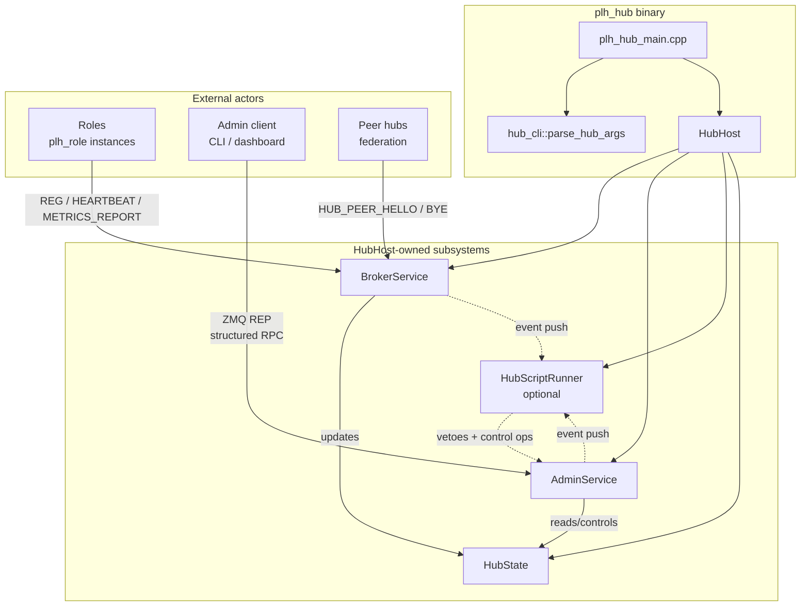
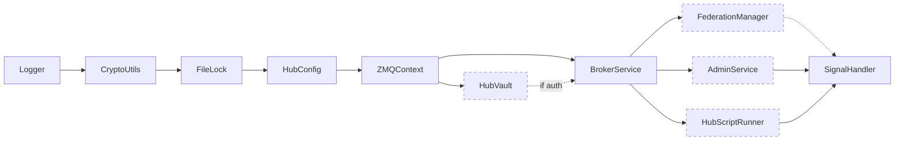
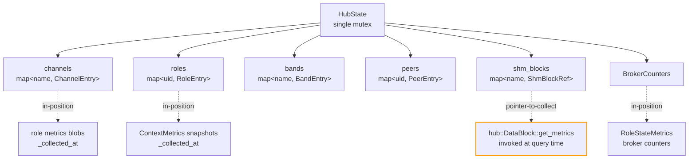
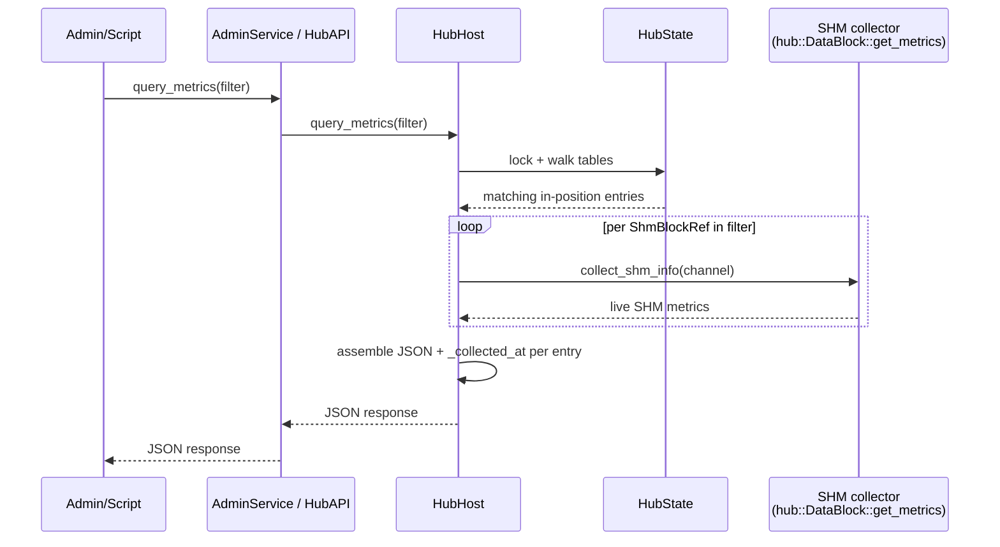
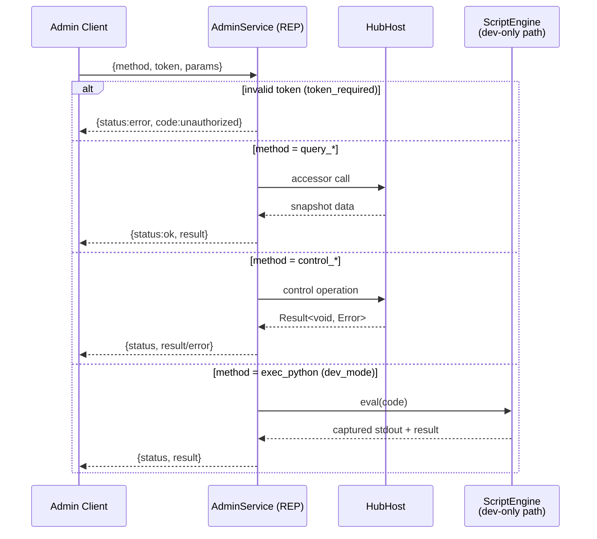
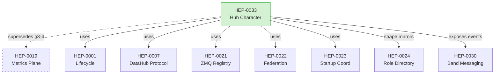
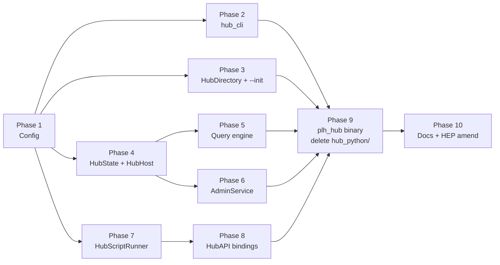

# HEP-CORE-0033: Hub Character

| Property       | Value                                                                                    |
|----------------|------------------------------------------------------------------------------------------|
| **HEP**        | `HEP-CORE-0033`                                                                          |
| **Title**      | Hub Character — Unified Hub Binary, Structured Admin RPC, Query-Driven Metrics, Scripting Parity |
| **Status**     | Draft (design ratified 2026-04-21; implementation not started)                           |
| **Created**    | 2026-04-21                                                                               |
| **Area**       | `pylabhub-utils`, `pylabhub-scripting`, `plh_hub` binary (new)                           |
| **Depends on** | HEP-CORE-0001 (Lifecycle), HEP-CORE-0007 (DataHub Protocol), HEP-CORE-0021 (ZMQ Registry), HEP-CORE-0022 (Federation), HEP-CORE-0023 (Startup Coordination), HEP-CORE-0024 (Role Directory Service), HEP-CORE-0030 (Band Messaging) |
| **Amends**     | HEP-CORE-0019 §3-4 — the periodic broker-pull metrics model is replaced by a query-driven model. HEP-CORE-0019 §3.2 (live SHM-derived block merge) is retained. |
| **Reference**  | Full design draft: `docs/tech_draft/HUB_CHARACTER_DESIGN.md`                             |

---

## 1. Motivation

The hub binary (`pylabhub-hubshell`) was built before several key abstractions that
have since been established on the role side:

| Capability        | Role side (HEP-0024, modern) | Hub side (`pylabhub-hubshell`, legacy) |
|-------------------|------------------------------|----------------------------------------|
| CLI parsing       | `role_cli::parse_role_args` (no-exit, stream-directed) | inline `argv` walking in `main()` |
| Config            | Composite `RoleConfig` with typed sub-configs + strict key whitelist | monolithic `HubConfig` singleton; whitelist status unverified |
| Env setup         | `scripting::role_lifecycle_modules()` helper | inline `LifecycleGuard` wiring |
| Script engine     | `ScriptEngine` abstraction (Python + Lua + Native) | bespoke `PythonInterpreter` (CPython embed, Python-only) |
| Script API        | Modern pybind11 `ProducerAPI`/`ConsumerAPI`/`ProcessorAPI` | `HubScriptAPI` + `pylabhub_module` (pre-abstraction style) |
| Admin interface   | n/a | `AdminShell` ZMQ REP with "exec arbitrary Python" only |
| Metrics           | `ContextMetrics` hierarchical X-macros | scattered (`metrics_store_`, `RoleStateMetrics`, SHM live merge) |

The hub binary is additionally **currently disabled in the build** (`if(FALSE)` in
`src/CMakeLists.txt`) awaiting the `PythonEngine` migration. This HEP defines the
complete new design the hub binary must implement before re-enabling.

## 2. Design premises (ratified)

1. **`pylabhub-utils` is the primary product.** The hub binary is a thin consumer
   of library code.
2. **Hub is a single-kind automated binary, fully functional without any script.**
   No `HubHostBase`/`HubRegistry`. Extension comes from **config** and **script**,
   never from new binary kinds.
3. **Admin interface is structured RPC** (per-method, typed). Python `exec()` is a
   gated dev-mode backdoor, never the primary path.
4. **Script is a pure customization layer, optional.** Every callback has a
   sensible C++ default (no-op for events, accept for vetoes). Absent script =
   fully functional hub with default policies.
5. **Scripting uses the same `ScriptEngine` abstraction as roles.** `PythonEngine`
   and `LuaEngine` both supported. Bespoke `PythonInterpreter` retired.
6. **Metrics are query-driven.** A global table holds either in-position data
   (broker-internal counters, role-pushed metrics) or pointers to on-demand
   collectors (local SHM blocks). Queries walk the table, collect, format JSON,
   return. Broker never initiates network requests to roles for metrics.
7. **Admin queries never depend on role availability.** Query reads what is
   present; each entry carries a `_collected_at` timestamp; freshness is
   self-describing; no retries, no wait-for-update.

## 3. Hub functions (user-defined decomposition)

The hub binary performs seven functions. This HEP is organised around them.

| # | Function                   | Owner component                                           |
|---|----------------------------|-----------------------------------------------------------|
| 1 | Parse arguments            | `hub_cli::parse_hub_args` (mirrors `role_cli`)            |
| 2 | Config                     | `HubConfig` composite (mirrors `RoleConfig`)              |
| 3 | Set up environment         | `scripting::hub_lifecycle_modules()` + `LifecycleGuard`   |
| 4 | Manage communication       | `BrokerService` + `Messenger` (existing, unchanged)       |
| 5 | Maintain state tables      | `HubState` (new) with public read accessors on `HubHost`  |
| 6 | Maintain metrics           | Global table (part of `HubState`) + query engine          |
| 7 | Answer requests            | `AdminService` RPC + `HubAPI` script binding              |

## 4. `HubHost` class + lifecycle

Single class owning the hub's runtime state and exposing read/write access to
`AdminService` and `HubAPI`.

### 4.0 Component architecture




```cpp
namespace pylabhub::hub_host {

class PYLABHUB_UTILS_EXPORT HubHost
{
public:
    explicit HubHost(config::HubConfig cfg,
                     std::unique_ptr<scripting::ScriptEngine> engine,  // optional
                     std::atomic<bool> *shutdown_flag);
    ~HubHost();

    void startup_();
    void run_main_loop();
    void shutdown_();

    // Read accessors (snapshots; thread-safe via internal state mutex).
    HubStateSnapshot     state_snapshot() const;
    nlohmann::json       query_metrics(const MetricsFilter &f) const;
    ChannelInfo          get_channel(std::string_view name) const;
    std::vector<RoleInfo> list_roles(const RoleFilter &f = {}) const;

    // Control operations (thread-safe).
    Result<void, Error>  close_channel(std::string_view name);
    Result<void, Error>  broadcast_channel(std::string_view name,
                                           const nlohmann::json &msg);
    Result<void, Error>  revoke_role(std::string_view uid,
                                     std::string_view reason);

    const config::HubConfig &config() const noexcept;

private:
    struct Impl;
    std::unique_ptr<Impl> impl_;
};

} // namespace pylabhub::hub_host
```

**Lifecycle module ordering** (driven by config toggles — disabled subsystems
are not constructed):



Dashed modules are config-gated; a minimal hub (admin off, federation off, no
script, no auth) runs with only the solid-edge nodes.

## 5. CLI (`plh_hub`)

Mirrors `plh_role` CLI shape and parser contract.

```
Usage:
  plh_hub --init [<hub_dir>]            # Create hub directory + template config
  plh_hub <hub_dir>                     # Run from directory
  plh_hub --config <path.json> [--validate | --keygen]
  plh_hub --dev                         # Dev/test mode; ephemeral keys, no vault
  plh_hub --help | -h

Init-only options:
  --name <name>      Hub name for --init
  --log-maxsize <MB> Rotate at (default 10)
  --log-backups <N>  Keep N (default 5; -1 = keep all)
```

**Parser contract** (identical to `role_cli::parse_role_args`):
- Returns `ParseResult { HubArgs args; int exit_code = -1; }`; never `std::exit`.
- `--help`/`-h` prints usage to stdout, returns `exit_code = 0`.
- Errors print to stderr, return `exit_code = 1`.
- Mode-exclusion and init-only-flag post-loop guards.

**Files**: `src/include/utils/hub_cli.hpp` (inline, mirrors `role_cli.hpp`).

## 6. Config — `hub.json`

### 6.1 Composite `HubConfig` (mirrors `RoleConfig`)

```cpp
class PYLABHUB_UTILS_EXPORT HubConfig
{
public:
    static HubConfig load(const std::string &path);
    static HubConfig load_from_directory(const std::string &dir);

    const HubIdentityConfig   &identity()   const;
    const AuthConfig          &auth()       const;   // reused from roles
    const ScriptConfig        &script()     const;   // reused; optional
    const LoggingConfig       &logging()    const;   // reused
    const HubNetworkConfig    &network()    const;
    const HubAdminConfig      &admin()      const;
    const HubBrokerConfig     &broker()     const;
    const HubFederationConfig &federation() const;
    const HubStateConfig      &state()      const;

    bool        load_keypair(const std::string &password);
    std::string create_keypair(const std::string &password);

    const nlohmann::json         &raw() const;
    bool                          reload_if_changed();
    const std::filesystem::path  &base_dir() const;
};
```

pImpl + `JsonConfig` backend (thread-safe, process-safe I/O + `reload_if_changed()`),
exactly as `RoleConfig` today. No directional `in_`/`out_` slots — the hub has no
asymmetric sides.

### 6.2 `hub.json` schema

```jsonc
{
  "hub": {
    "uid":       "HUB-MAIN-12345678",
    "name":      "MainHub",
    "log_level": "info",
    "auth":      { "keyfile": "vault/hub.vault" }
  },

  "script":              { "type": "python", "path": "." },
  "python_venv":         "",
  "stop_on_script_error": false,

  "logging": {
    "file_path":    "",
    "max_size_mb":  10,
    "backups":      5,
    "timestamped":  true
  },

  "network": {
    "broker_endpoint": "tcp://0.0.0.0:5570",
    "broker_bind":     true,
    "zmq_io_threads":  1
  },

  "admin": {
    "enabled":        true,
    "endpoint":       "tcp://127.0.0.1:5600",
    "dev_mode":       false,
    "token_required": true
  },

  "broker": {
    "heartbeat_timeout_ms":   15000,
    "heartbeat_multiplier":   5,
    "default_channel_policy": "open",
    "known_roles": [
      { "uid": "PROD-SRC-...", "name": "Source", "pubkey": "z85..." }
    ]
  },

  "federation": {
    "enabled":           false,
    "peers":             [ { "uid": "...", "endpoint": "...", "pubkey": "..." } ],
    "forward_timeout_ms": 2000
  },

  "state": {
    "disconnected_grace_ms":   60000,
    "max_disconnected_entries": 1000
  }
}
```

### 6.3 Parsing rules

- **Strict key whitelist.** Unknown top-level keys and unknown keys inside every
  sub-object throw `std::runtime_error("<hub>: unknown config key '<name>'")` at
  parse time. Verbatim from role-side pattern.
- **Sub-object type enforcement.** `"logging"`/`"network"`/... if present must be
  JSON objects, else throw.
- **Sentinels documented in code.** `"backups": -1` → `kKeepAllBackups`
  (`numeric_limits<size_t>::max()`). `"disconnected_grace_ms": -1` → infinite.
- **Absent sections take defaults.** No `"federation"` → `enabled=false`; no
  `"script"` → hub runs without one.
- **UID auto-generation with diagnostic.** Absent `hub.uid` → generate
  `HUB-<NAME>-<hex8>`, print warning with the generated UID so the operator can
  paste it back for stability (same pattern as role identity).

### 6.4 New categorical sub-config headers (`src/include/utils/config/`)

- `hub_identity_config.hpp` — `HubIdentityConfig { uid, name, log_level }`.
- `hub_network_config.hpp` — broker endpoint/bind/io_threads.
- `hub_admin_config.hpp` — endpoint/enabled/dev_mode/token_required.
- `hub_broker_config.hpp` — heartbeat timeouts/policy/known_roles.
- `hub_federation_config.hpp` — enabled/peers/forward_timeout.
- `hub_state_config.hpp` — disconnected_grace / max_disconnected_entries.

Reused from role-side: `auth_config.hpp`, `script_config.hpp`, `logging_config.hpp`.

**Rename required**: the existing `src/include/utils/config/hub_config.hpp` is
role-facing (for `in_hub_dir`/`out_hub_dir` references). Renamed to
`hub_ref_config.hpp` to free the `HubConfig` name for the hub-side config here.

### 6.5 Vault + keygen (three-mode semantics)

Same overall pattern as the role side (HEP-CORE-0024 §11). The vault
stores the broker's stable CURVE keypair plus, optionally, the admin
token.

- **`plh_hub --keygen`** generates a CURVE25519 keypair, writes the
  secret half into `hub.auth.keyfile` encrypted with `PYLABHUB_HUB_PASSWORD`
  (env var → interactive prompt fallback per the same source-chain as
  role-side), prints the public key (for roles to pin via
  `in_hub_pubkey` / `out_hub_pubkey` in their own configs) and the
  `hub_uid`. Idempotent against the same vault file via the existing
  `HubVault` API.
- **Run mode** (without `--dev`) reads the vault, unlocks it via the
  same password source chain, loads the broker's stable CURVE keypair
  for the ROUTER socket. If `admin.token_required: true`, the vault
  also carries the admin token (separate slot, same KDF domain) — the
  `AdminService` (§10.3) compares against this token on each request.
  See `src/include/utils/hub_vault.hpp` for the existing storage shape;
  it already supports both keypair and token slots — no vault extension
  needed.
- **`plh_hub --dev`** generates an ephemeral CURVE keypair at startup,
  skips vault entirely, skips admin token. The `AdminService` endpoint
  is enforced to bind only to `127.0.0.1` in this mode, since there is
  no token to gate access. Use for local development and tests only.

## 7. Hub directory layout (`--init` output)

```
<hub_dir>/
├── hub.json
├── script/                     # OPTIONAL — absent = hub runs without scripting
│   └── python/                 #   (or lua/ or native/)
│       └── __init__.py
├── vault/
│   └── hub.vault               # CURVE keypair + (optional) admin token
├── logs/
│   └── <hub_uid>-<ts>.log
└── run/
```

Mirrors HEP-CORE-0024 role layout. `HubDirectory` helper (new) mirrors
`RoleDirectory` accessors (`base_dir/vault/logs/script/run`,
`create_standard_layout()`, `has_standard_layout()`).

## 8. State tables — `HubState`

Read-mostly aggregate owned by `HubHost`. `BrokerService` updates as messages
arrive; `AdminService` and `HubAPI` read via `HubHost` accessors.



```cpp
struct HubState
{
    std::unordered_map<std::string, ChannelEntry>  channels;
    std::unordered_map<std::string, RoleEntry>     roles;
    std::unordered_map<std::string, BandEntry>     bands;
    std::unordered_map<std::string, PeerEntry>     peers;
    std::unordered_map<std::string, ShmBlockRef>   shm_blocks;  // pointer-to-collect
    BrokerCounters                                  counters;   // in-position
};
```

| Entry | Updated by | Holds |
|---|---|---|
| `ChannelEntry` | REG_REQ / DISC_REQ / CHANNEL_CLOSING / broker-internal | name, schema, producer PID, consumers, created_at, status |
| `RoleEntry` | REG/HEARTBEAT/METRICS_REPORT/DISC/timeout | uid, name, role_tag, channels, state, first_seen, last_heartbeat, latest metrics, `metrics_collected_at`, pubkey |
| `BandEntry` | BAND_JOIN / BAND_LEAVE | name, members[], last_activity |
| `PeerEntry` | HUB_PEER_HELLO / HUB_PEER_BYE / federation heartbeat | uid, endpoint, state, last_seen |
| `ShmBlockRef` | channel registration with SHM transport | channel name, block path; metrics collected via `collect_shm_info(channel)` at query time |
| `BrokerCounters` | broker internal | `RoleStateMetrics` (HEP-0023 §2.5), ctrl queue depth, byte counts, per-msg-type counts |

**Retention**: disconnected roles linger `state.disconnected_grace_ms` (default
60s) with `status: "disconnected"` before eviction; LRU cap
`state.max_disconnected_entries` prevents unbounded growth. Closed channels
evict immediately.

**Consistency**: single internal mutex; accessors return snapshot structs. No
cross-field consistency guarantee; each metric entry carries `_collected_at`.

## 9. Metrics model (supersedes HEP-CORE-0019 §3-4)

### 9.1 Ingress — role→hub push only (unchanged from today)

- `HEARTBEAT_REQ` with `metrics` field, iteration-gated, stops when role stalls.
- `METRICS_REPORT_REQ`, time-only, configurable via role's `cfg.report_metrics`.

No broker-initiated metrics pull exists or will exist.

```mermaid
sequenceDiagram
    participant Role as plh_role
    participant Broker as BrokerService
    participant State as HubState

    loop Heartbeat tick (iteration-gated — stops if role stalls)
        Role->>Broker: HEARTBEAT_REQ{channel, metrics, pid}
        Broker->>State: update_producer_metrics(ch, metrics, pid)
    end

    loop Metrics report tick (time-only; if cfg.report_metrics)
        Role->>Broker: METRICS_REPORT_REQ{channel, uid, metrics}
        Broker->>State: update_consumer_metrics(ch, uid, metrics)
    end

    Note over Broker,Role: Broker NEVER sends METRICS_REQ to Role
```


### 9.2 Entry types

- **In-position**: role-pushed metrics, broker counters, federation peer states.
- **Pointer-to-collect**: SHM block metrics (invoke `hub::DataBlock::get_metrics(channel)` at query time). Future extensions (system CPU/RSS, etc.) use this pattern.

### 9.3 Query flow



1. Accept a `MetricsFilter` (role uids, channel names, band names, peer uids,
   category tags: `"channel"`, `"role"`, `"band"`, `"peer"`, `"broker"`, `"shm"`,
   `"all"`).
2. Walk `HubState` under the state mutex; select matching entries.
3. Read in-position data directly; invoke pointer-to-collect callbacks.
4. Build single JSON response:
   ```jsonc
   {
     "status": "ok",
     "queried_at": "ISO-8601",
     "filter":    { ... },
     "channels":  { "<ch>": { "producer": {..., "_collected_at": "..."},
                               "consumers": {...},
                               "shm":      {..., "_collected_at": "..."} } },
     "roles":     { "<uid>": { ..., "_collected_at": "...", "_status": "ready" } },
     "bands":     { ... },
     "peers":     { ... },
     "broker":    { ... }
   }
   ```
5. Return. No retry, no wait-for-update.

### 9.4 Relation to existing `BrokerService::query_metrics_json_str`

Existing impl (`broker_service.cpp:2336`, `2523`, `2534`) already has this shape
for channels + shm_blocks. Refactor extends it with role/band/peer/broker
categories, `_collected_at` per entry, and plumbs through `HubHost` (not
directly on `BrokerService`).

## 10. Admin RPC surface — `AdminService`

Replaces legacy `AdminShell` which only offered `{token, code}` → `exec(code)`.

### 10.1 Transport

- ZMQ REP socket at `admin.endpoint` (default `tcp://127.0.0.1:5600`).
- Request: `{ "method": "<name>", "token": "<admin_token>", "params": { ... } }`.
- Response: `{ "status": "ok|error", "result": ..., "error": {"code": ..., "message": ...} }`.




### 10.2 Methods (v1)

**Query**: `list_channels`, `get_channel`, `list_roles`, `get_role`,
`list_bands`, `list_peers`, `query_metrics`, `list_known_roles`.

**Control**: `close_channel`, `broadcast_channel`, `revoke_role`,
`add_known_role`, `remove_known_role`, `reload_config`, `request_shutdown`.

**Dev-only** (gated by `admin.dev_mode: true`): `exec_python` — runs in the
hub script engine's namespace via `ScriptEngine::eval`.

### 10.3 Authorization

- `admin.token_required: true` → request `"token"` must match vault's
  admin token (KDF-derived, same-vault different slot). Mismatch →
  `{"status": "error", "error": {"code": "unauthorized"}}`.
- `admin.token_required: false` → token ignored; endpoint MUST bind to
  `127.0.0.1` (enforced at construction).
- `exec_python` always requires token when gated, plus `dev_mode: true`.

### 10.4 Files

- `src/include/utils/admin_service.hpp`, `src/utils/service/admin_service.cpp`.

## 11. Script callbacks + `HubAPI`

### 11.1 Engine

`HubHost` owns `std::unique_ptr<scripting::ScriptEngine>` (null if no script).
Runs on its own thread with the cross-thread dispatch pattern roles use.
Engine factory: `scripting::make_engine_from_script_config(cfg.script())`.

### 11.2 Callbacks (all optional; C++ defaults = no-op / accept)

**Lifecycle**: `on_start(api)`, `on_tick(api)`, `on_stop(api)`.

**Role events**: `on_role_registered(api, role_info)`,
`on_role_closed(api, uid, reason)`.

**Channel events**: `on_channel_opened(api, channel_info)`,
`on_channel_closed(api, name)`.

**Band events** (HEP-0030): `on_band_joined(api, band, member_uid)`,
`on_band_left(api, band, member_uid)`.

**Federation events**: `on_peer_connected(api, peer_uid)`,
`on_peer_disconnected(api, peer_uid, reason)`.

**Veto hooks** (sync, bool return, default accept):
`on_channel_close_request(api, channel) → bool`,
`on_role_register_request(api, info) → bool`.

Script exceptions caught; `stop_on_script_error: true` promotes to fatal (same
as role side).

### 11.3 `HubAPI` surface (bound into Python + Lua)

Read: `list_channels`, `get_channel`, `list_roles`, `get_role`, `list_bands`,
`list_peers`, `query_metrics`, `config`, `uid`, `name`.

Control: `close_channel`, `broadcast_channel`, `revoke_role`, `add_known_role`,
`remove_known_role`, `request_shutdown`.

All methods resolve via `HubHost` accessors; scripts never touch
`BrokerService` directly. Pybind11 bindings live in
`src/scripting/hub/hub_api.cpp`.

## 12. Protocol — additions / unchanged

- **Role→broker protocol**: unchanged. REG_REQ, DISC_REQ, HEARTBEAT_REQ,
  METRICS_REPORT_REQ, notifies, etc. No wire-format break.
- **Role-side headers, config, lifecycle**: unchanged.
- **New admin RPC on the admin socket**: methods above (§10).
- **Internal callbacks**: `BrokerService` gains event hooks into `HubHost`
  (which fans out to script events). Replaces ad-hoc `pylabhub_module`
  callback wiring.

## 13. Relationship to existing HEPs



| HEP | Relationship |
|---|---|
| HEP-CORE-0001 | Used verbatim for lifecycle ordering. |
| HEP-CORE-0007 | Used verbatim for channel-level semantics. |
| HEP-CORE-0019 | **This HEP supersedes §3-4** (periodic broker-pull). §3.2 (live SHM merge) retained. |
| HEP-CORE-0021 | Used verbatim. |
| HEP-CORE-0022 | Used verbatim; federation config is factored into `HubFederationConfig`. |
| HEP-CORE-0023 | Used verbatim (Phase 2 multiplier included). |
| HEP-CORE-0024 | Shape mirrored: hub gets `HubDirectory`, `hub_cli`, `--init/--validate/--keygen`, directory layout. |
| HEP-CORE-0030 | Band events surface via script callbacks; admin RPC includes `list_bands`. |

## 14. Implementation phases

Phases should each land in a build-green, test-green checkpoint.



Phase numbering reflects dependency order; independent phases (e.g. P2, P3, P4)
can land in parallel once P1 lands.


- **Phase 1** — Config: rename role-facing `hub_config.hpp` → `hub_ref_config.hpp`;
  create new hub-side sub-configs (§6.4); create `HubConfig` composite class.
  No behavior change (hub binary still disabled). Covered by L2 tests.
- **Phase 2** — `hub_cli::parse_hub_args` (§5). Covered by L2 tests mirroring
  `role_cli` test shape.
- **Phase 3** — `HubDirectory` + `--init` template output. L2 tests for dir
  layout + template validation.
- **Phase 4** — `HubState` struct + accessors on a new `HubHost` class (wraps
  existing `BrokerService` without changing broker behavior). L2 tests for
  snapshot accessors.
- **Phase 5** — Query engine (`HubHost::query_metrics`) over `HubState` +
  existing `collect_shm_info`. L2 tests for filter coverage + `_collected_at`.
- **Phase 6** — `AdminService` structured RPC (§10); retire `AdminShell`
  dependency. L3 tests for each RPC method.
- **Phase 7** — `scripting::hub_lifecycle_modules()` + `HubScriptRunner` using
  `ScriptEngine`; retire `PythonInterpreter`/`HubScript`/`hub_script_api`/
  `pylabhub_module`. L3 tests for each callback + default no-op behavior.
- **Phase 8** — `HubAPI` pybind11 + Lua bindings (§11.3). L3 tests via each
  engine.
- **Phase 9** — `plh_hub` binary; re-enable build; delete `src/hubshell.cpp` +
  `src/hub_python/*`. L4 no-hub tier tests (parallel `test_layer4_plh_role/`).
- **Phase 10** — HEP-0019 amendment finalised; README + deployment docs
  updated.

## 15. Open items (deferred to implementation)

1. `add_known_role`/`remove_known_role` persistence — in-memory only by default;
   `persist_known_role_changes: false` toggle for opt-in disk write.
2. `script.tick_interval_ms` location — `ScriptConfig` vs new `HubScriptConfig`.
3. Band event hooks — `BandRegistry` currently broker-thread-internal; needs
   hook point for `HubState` updates.
4. Graceful-vs-fast shutdown semantics for `request_shutdown`.
5. Timestamp precision (ms vs µs) and clock source alignment.
6. `_collected_at` semantics for pointer-to-collect entries.
7. Script engine thread lifetime ordering vs `BrokerService` teardown.
8. Dev-mode admin token behaviour.

## 16. Out of scope

- Hub-side HA / replication.
- Hub script hot-reload mid-run.
- Binary variants (`--kind`) — subsystems toggled via config only.
- Role-side rewrites.
- HEP-CORE-0019 periodic broker-pull (explicitly replaced by query-driven
  model; §9).
