# HEP-CORE-0033: Hub Character

| Property       | Value                                                                                    |
|----------------|------------------------------------------------------------------------------------------|
| **HEP**        | `HEP-CORE-0033`                                                                          |
| **Title**      | Hub Character — Unified Hub Binary, Structured Admin RPC, Query-Driven Metrics, Scripting Parity |
| **Status**     | Draft (design ratified 2026-04-21; implementation not started)                           |
| **Created**    | 2026-04-21                                                                               |
| **Area**       | `pylabhub-utils`, `pylabhub-scripting`, `plh_hub` binary (new)                           |
| **Depends on** | HEP-CORE-0001 (Lifecycle), HEP-CORE-0007 (DataHub Protocol), HEP-CORE-0021 (ZMQ Registry), HEP-CORE-0022 (Federation), HEP-CORE-0023 (Startup Coordination), HEP-CORE-0024 (Role Directory Service), HEP-CORE-0030 (Band Messaging) |
| **Amends**     | HEP-CORE-0019 §3-4 — the periodic broker-pull metrics model is replaced by a query-driven model. HEP-CORE-0019 §3.2 (live SHM-derived block merge) is retained. |
| **Reference**  | This HEP is the authoritative design.                                                    |

> **Amendment (2026-07-08) — topology migration.**  `ChannelEntry`
> gains `topology` (ChannelTopology enum), `data_endpoint`
> (`std::optional<std::string>` — `has_value()` conveys the "binding
> side has published its endpoint" bit, previously carried by a
> separate `data_endpoint_resolved` bool), `channel_version`, and
> `confirmed_version` fields.  `ProducerEntry::zmq_node_endpoint`
> retires — its role is subsumed by the channel-scope `data_endpoint`.
> Channel teardown
> rule generalizes from "last producer disconnects" to "BINDING side
> disconnects" (per topology).  Four wire retirements at §18.2:
> `GET_CHANNEL_PRODUCERS_REQ`, `CHANNEL_PRODUCERS_CHANGED_NOTIFY`,
> `CONSUMER_ATTACH_REQ_ZMQ/_ACK_ZMQ`, `CONSUMER_ATTACH_REQ_SHM`.
> Six new error codes at HEP-CORE-0007 §12.4a.  See tech draft
> `docs/tech_draft/DRAFT_topology_singular_side_2026-07.md` (status:
> DESIGN LOCKED) for the full design; §11.4 lists all nine
> coordinated HEP amendments.

---

> **REG-family wire authority (2026-07-12):** REG_REQ / CONSUMER_REG_REQ / DEREG_REQ / ENDPOINT_UPDATE_REQ / GET_CHANNEL_AUTH_REQ / CHANNEL_AUTH_APPLIED_REQ / CHANNEL_AUTH_CHANGED_NOTIFY / CHECK_PEER_READY_REQ wire format, admission-gate ordering, and retirement policy are owned by **HEP-CORE-0046 (REG Protocol Redesign)**.  This HEP references these wires only where behavior specific to its own subsystem is described; the wire authority always resolves to HEP-CORE-0046, and any new REG-family field / message / gate MUST be added there first.  See `docs/IMPLEMENTATION_GUIDANCE.md § "REG Protocol Wire Discipline (HEP-CORE-0046)"` for the rule that binds this to code.

## 1. Motivation

The hub binary (`pylabhub-hubshell`) was built before several key abstractions that
have since been established on the role side:

| Capability        | Role side (HEP-0024, modern) | Hub side (`pylabhub-hubshell`, legacy) |
|-------------------|------------------------------|----------------------------------------|
| CLI parsing       | `role_cli::parse_role_args` (no-exit, stream-directed) | inline `argv` walking in `main()` |
| Config            | Composite `RoleConfig` with typed sub-configs + strict key whitelist | (legacy `pylabhub::HubConfig` lifecycle singleton — deleted 2026-04-29; superseded by `pylabhub::config::HubConfig` per §6.1) |
| Env setup         | `scripting::role_lifecycle_modules()` helper | inline `LifecycleGuard` wiring |
| Script engine     | `ScriptEngine` abstraction (Python + Lua + Native) | bespoke `PythonInterpreter` (CPython embed, Python-only) |
| Script API        | Modern pybind11 `ProducerAPI`/`ConsumerAPI`/`ProcessorAPI` | `HubScriptAPI` + `pylabhub_module` (pre-abstraction style) |
| Admin interface   | n/a | `AdminShell` ZMQ REP with "exec arbitrary Python" only |
| Metrics           | `ContextMetrics` hierarchical X-macros | scattered (`metrics_store_`, `RoleStateMetrics`, SHM live merge) |

The hub binary is additionally **currently disabled in the build** (`if(FALSE)` in
`src/CMakeLists.txt`) awaiting the `PythonEngine` migration. This HEP defines the
complete new design the hub binary must implement before re-enabling.

## 2. Design premises (ratified)

1. **`pylabhub-utils` is the primary product.** The hub binary is a thin consumer
   of library code.
2. **Hub is a single-kind automated binary, fully functional without any script.**
   No `HubHostBase`/`HubRegistry`. Extension comes from **config** and **script**,
   never from new binary kinds.
3. **Admin interface is structured RPC** (per-method, typed). Python `exec()` is a
   gated dev-mode backdoor, never the primary path.
4. **Script is a pure customization layer, optional.** Every callback has a
   sensible C++ default (no-op for events, accept for vetoes). Absent script =
   fully functional hub with default policies.
5. **Scripting uses the same `ScriptEngine` abstraction as roles.** `PythonEngine`
   and `LuaEngine` both supported. Bespoke `PythonInterpreter` retired.
6. **Metrics are query-driven.** A global table holds either in-position data
   (broker-internal counters, role-pushed metrics) or pointers to on-demand
   collectors (local SHM blocks). Queries walk the table, collect, format JSON,
   return. Broker never initiates network requests to roles for metrics.
7. **Admin queries never depend on role availability.** Query reads what is
   present; each entry carries a `_collected_at` timestamp; freshness is
   self-describing; no retries, no wait-for-update.

## 3. Hub functions (user-defined decomposition)

The hub binary performs seven functions. This HEP is organised around them.

| # | Function                   | Owner component                                           |
|---|----------------------------|-----------------------------------------------------------|
| 1 | Parse arguments            | `hub_cli::parse_hub_args` (mirrors `role_cli`)            |
| 2 | Config                     | `HubConfig` composite (mirrors `RoleConfig`)              |
| 3 | Set up environment         | `scripting::hub_lifecycle_modules()` + `LifecycleGuard`   |
| 4 | Manage communication       | `BrokerService` + `Messenger` (existing, unchanged)       |
| 5 | Maintain state tables      | `HubState` (new) with public read accessors on `HubHost`  |
| 6 | Maintain metrics           | Global table (part of `HubState`) + query engine          |
| 7 | Answer requests            | `AdminService` RPC + `HubAPI` script binding              |

## 4. `HubHost` class + start/stop

Single class owning the hub's runtime state and exposing read/write access to
`AdminService` and `HubAPI`.

> **Terminology note.**  HubHost is **not** a `LifecycleGuard` module —
> its `startup()` / `shutdown()` are invoked directly by `plh_hub_main`
> (or by tests).  The process-wide `LifecycleGuard` (Logger, FileLock,
> CryptoUtils, JsonConfig, ZMQContext, ThreadManager) wraps HubHost
> from the outside.  When this section says "start/stop" or "phase FSM"
> it means HubHost's own run-state machine (§4.3); when it says
> "LifecycleGuard module ordering" it means the surrounding modules.
> The two are distinct and the doc keeps them visibly separate.

### 4.0 Component architecture

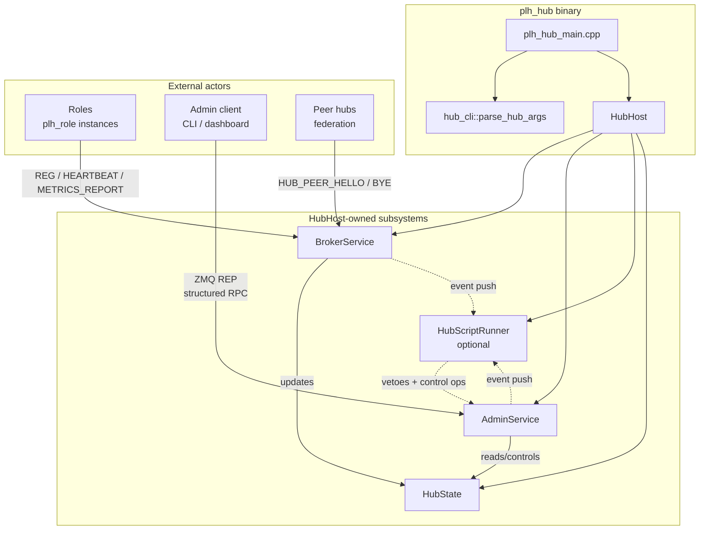


```cpp
namespace pylabhub::hub_host {

class PYLABHUB_UTILS_EXPORT HubHost
{
public:
    explicit HubHost(config::HubConfig cfg,
                     std::unique_ptr<scripting::ScriptEngine> engine,  // optional
                     std::atomic<bool> *shutdown_flag);
    ~HubHost();

    void startup_();
    void run_main_loop();
    void shutdown_();

    // Read accessors (snapshots; thread-safe via internal state mutex).
    HubStateSnapshot     state_snapshot() const;
    nlohmann::json       query_metrics(const MetricsFilter &f) const;
    ChannelInfo          get_channel(std::string_view name) const;
    std::vector<RoleInfo> list_roles(const RoleFilter &f = {}) const;

    // Control operations (thread-safe).
    Result<void, Error>  close_channel(std::string_view name);
    Result<void, Error>  broadcast_channel(std::string_view name,
                                           const nlohmann::json &msg);
    Result<void, Error>  revoke_role(std::string_view uid,
                                     std::string_view reason);

    const config::HubConfig &config() const noexcept;

private:
    struct Impl;
    std::unique_ptr<Impl> impl_;
};

} // namespace pylabhub::hub_host
```

**`LifecycleGuard` module ordering** (driven by config toggles — disabled
subsystems are not constructed).  These are the **process-wide modules**
that wrap HubHost; HubHost itself is not in this graph (see §4.3 for
HubHost's own phase FSM):

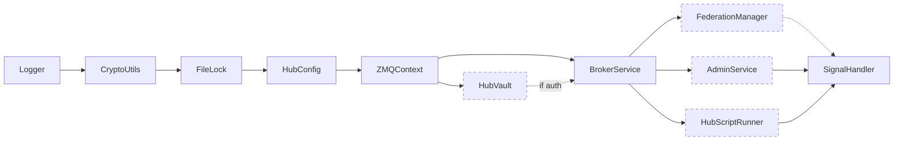

Dashed modules are config-gated; a minimal hub (admin off, federation off, no
script, no auth) runs with only the solid-edge nodes.

### 4.1 Init protocol (ordered steps)

Pinned by `HubHost::startup()`.  Drives the phase FSM (§4.3) from
`Constructed → Running` via a CAS guard at the head of the method:
re-entry from `Running` is a no-op (idempotent); re-entry from
`ShutDown` throws `std::logic_error` (single-use after shutdown — see
§4.3).  Failure at any step rolls back the preceding ones (broker stop
+ ThreadManager drain + reset of unique_ptrs) and resets the phase to
`Constructed` so the caller may retry on a fixed config without
constructing a new `HubHost`.

1. **Read config.**  `HubConfig::load_from_directory(dir)` (caller-side,
   before HubHost ctor).
2. **Vault unlock** (mandatory, no exceptions).
   `cfg.load_keypair(password)` populates `cfg.auth().client_pubkey/seckey`.
   Caller-side, BEFORE constructing HubHost — this is the **deliberate
   deviation from the §4 mermaid which shows HubVault as a peer
   subsystem**.  Rationale: vault unlock is a config-time concern
   (interactive password prompt, env-var fallback) and the resulting
   keypair is part of HubConfig once unlocked.  Subsystem-level
   HubVault wiring is required only for admin token validation and
   key rotation (HEP-CORE-0035); until those land, HubHost reads
   the unlocked keypair from `cfg.auth()`.  Per HEP-CORE-0035 §2 +
   §4.6.5, `HubHost::startup()` MUST reject an empty
   `auth().client_pubkey` — there is no in-memory CURVE mode and no
   production path that constructs `BrokerService` without CURVE +
   admission.  Tests that want a non-CURVE broker go through
   HEP-CORE-0035 §4.6.5 (separate factory on `BrokerService`), not
   through HubHost.
3. **Construct HubHost.**  `HubHost host(std::move(cfg))` — no
   threads, no sockets yet.  Allocates `Impl` with the value-owned
   `HubState`.
4. **Build `BrokerService::Config`** from `cfg`: endpoint, CURVE keys
   (from `cfg.auth()`), heartbeat-multiplier timeouts (HEP-CORE-0023
   §2.5), federation peers, `on_ready` callback that signals a
   ready_future inside HubHost.
5. **Construct BrokerService** bound to `HubHost::state_` by
   reference (HEP-0033 §4 ownership invariant).
6. **Construct ThreadManager** with `owner_tag="HubHost"`,
   `owner_id=cfg.identity().uid`.  Auto-registers as a dynamic
   `LifecycleGuard` module `"ThreadManager:HubHost:<uid>"` (this IS
   a `LifecycleGuard` interaction — distinct from HubHost's own
   phase FSM in §4.3).
7. **Spawn broker thread** via `thread_mgr.spawn("broker", broker.run)`.
   Thread enters `BrokerService::run()`, binds the ROUTER socket,
   fires `on_ready`, enters the poll loop.
8. **Wait on ready_future** with a 5-second deadline.  Timeout or
   exception from the future = startup failure (rollback above).
9. **Construct AdminService** + spawn admin thread via the same
   ThreadManager (skipped if `cfg.admin().enabled == false`).
10. **Construct ScriptEngine + HubScriptRunner**, spawn script thread
    (skipped if no engine was injected at HubHost construction).
11. **Phase FSM commit.**  The CAS at step 0 already moved
    `phase = Running`.  Steps 1-10 ran under that phase; on success
    no further write is needed.  HubHost is now serving — `is_running()`
    returns `true` (it reads `phase == Phase::Running`).

After step 11: `host.broker_endpoint()` reflects the actual bound
address; `host.broker()` and `host.state()` are valid; the hub is
processing inbound traffic.

### 4.2 Shutdown protocol (ordered steps)

Pinned by `HubHost::shutdown()`.  Drives the phase FSM (§4.3) from
`Running → ShutDown` via a CAS guard at the head of the method.  Any
caller that observes a non-`Running` phase early-returns (idempotent
no-op for repeated `shutdown()` from any thread; harmless no-op when
the host was constructed but never started).  Synchronous: returns
only after all spawned threads have exited.

1. **Wake `run_main_loop()`** by flipping `shutdown_flag_` and
   notifying the condition variable.
2. **Drain AdminService** — `admin.stop()` (atomic flag flip)
   followed by `thread_mgr.join_named("admin")` (synchronous
   bounded join).  This pair is the **synchronous "stop accepting
   + drain in-flight"** step for admin.  Once `join_named` returns,
   the admin thread is no longer alive; any RPC that reached into
   `HubAPI::augment_*` has either completed or been cleaned up via
   the engine's pending-future cancellation.  REQUIRED before step 3
   destroys HubAPI — see §4.2.1 for the rationale.
3. **Stop ScriptEngine + destroy HubAPI** — `runner->shutdown_()`.
   Drains pending events, runs `on_stop` (broker still alive for
   `api.broadcast_channel`), finalizes the engine (cancels any
   pending `invoke_returning` futures with
   `InvokeStatus::EngineShutdown` — empty in normal operation
   because step 2 already drained admin), destroys the HubAPI
   instance.
4. **Stop BrokerService** — `broker.stop()`.  Flips the broker's
   internal stop atomic, sends an inproc PAIR wake-up, broker's
   poll loop exits, broker drains outbound NOTIFY queue one final
   time then returns from `run()`.
5. **Drain ThreadManager** — `thread_mgr.drain()`.  Joins remaining
   spawned threads in **reverse spawn order** (LIFO): broker last
   (admin already removed by step 2's `join_named`).  Per-thread
   bounded join timeout (`kMidTimeoutMs` = 5 s).  Any thread that
   fails to exit within its timeout is detached (logged);
   ThreadManager returns the detached count.
6. **Phase FSM commit.**  The CAS at step 0 already moved
   `phase = ShutDown`.  Steps 1-5 ran under that terminal phase;
   `is_running()` is now `false` and any further `startup()` will
   throw `std::logic_error` (single-use; see §4.3).  HubHost is no
   longer serving.

Subsystem destruction (when HubHost goes out of scope) runs in
reverse declaration order: ThreadManager (already drained — no-op)
→ BrokerService → HubState → HubConfig.  All threads have already
joined by step 5, so subsystem destruction touches no live threads.

> **Thread Shutdown Contract (HEP-CORE-0031 §4.1) — hub side honors
> it via its existing shutdown sequence.**  Steps 1-5 map cleanly to
> the per-thread shutdown contract:
>
> - **Signaling phase:** Step 1 (`shutdown_flag_` + `wake_cv`),
>   Step 2's `admin.stop()`, Step 4's `broker.stop()`.  All are
>   fire-and-forget signal atoms — they flip stop flags and wake
>   the threads' poll loops; they do not destroy any shared state.
> - **Honoring per-thread contracts (waits / joins):** Step 2's
>   `join_named("admin")` synchronizes on admin thread exit
>   *before* Step 3 destroys HubAPI (which admin's in-flight
>   `augment_*` calls may reach into).  Step 5's
>   `thread_mgr.drain()` joins the broker thread after Step 4's
>   signal.  Two synchronization points because admin must be
>   joined before the runner shutdown in Step 3 — see §4.2.1.
> - **Resource destruction:** Step 3's `runner->shutdown_()`
>   destroys HubAPI *after* admin is drained.  Subsystem
>   destruction in the dtor destroys BrokerService / HubState /
>   HubConfig *after* `thread_mgr.drain()`.
>
> Hub-side threads (admin, broker) currently rely on `done` (set by
> the spawn wrapper after the body returns) rather than the new
> `active_loop_exited` primitive — but their bodies are written to
> rule 4 of the contract (they don't access shared state after
> their loops return), so the existing sequence is safe.  Adopting
> `active_loop_exited` for these threads is a post-MD1 hardening
> opportunity that would make the contract observation explicit
> instead of implicit.
>
> **`BrokerService::stop()` is fire-and-forget by design** — same
> externally-threaded pattern documented in HEP-CORE-0031 §4.1.4.
> The broker's `run()` loop lives on a thread spawned into
> `HubHost::thread_mgr`, not into a BrokerService-owned manager.
> `stop()` therefore signals only; the synchronous join is the
> caller's responsibility (Step 5 above).
>
> See HEP-CORE-0031 §4.1 for the canonical contract,
> `docs/IMPLEMENTATION_GUIDANCE.md` "Thread Shutdown Contract" for
> the cross-cutting reference, and HEP-CORE-0011 §"Role Host
> worker_main_() Steps" for the role-side application (where the
> contract required Step 12.5 — `wait_for_active_loop_exit("ctrl")` —
> to honor BRC ctrl thread's contract before destroying
> `broker_comm_`).

`request_shutdown()` is the **async equivalent** of steps 1+4 only:
flips the flag, calls `broker.stop()`, returns immediately without
waiting for threads to join.  Typical use: signal handler / admin
RPC / broker error path → `request_shutdown()` → `run_main_loop()`
returns on the main thread → main thread drives `shutdown()` for
the synchronous wind-down.

`request_shutdown()` does **not** transition the phase FSM — it only
breaks `run_main_loop()`'s wait and stops the broker poll.  The
`Running → ShutDown` transition happens in `shutdown()` proper,
where the synchronous join is performed under the same CAS guard.

#### 4.2.1 Rationale — admin drain ordering

The §12.2.2 augmentation hooks invoked by AdminService handlers
make admin in-flight RPCs reach into the script-side HubAPI
mid-call.  If the runner were torn down first (which destroys
HubAPI as part of `EngineHost::shutdown_`), an admin RPC parked
between `recv()`'ing the request and finishing the augment hook
would deref a destroyed HubAPI → undefined behaviour.

The fix in step 2 above follows the universal subsystem-shutdown
pattern (**stop accepting → drain in-flight → tear down**) at finer
granularity:

- `admin.stop()` is the "stop accepting" half — non-blocking flag
  flip; the admin recv loop polls it on the next iteration.
- `thread_mgr.join_named("admin")` is the "drain in-flight" half —
  bounded synchronous join; any in-flight handler completes before
  this returns.

Two designs were considered and **rejected**:

- *(b) `shared_ptr<HubAPI>` with weak refs in callbacks.*  Refcount
  ownership would let teardown happen in any order ("HubAPI lives
  until the last admin caller drops its weak ref"), but it masks
  the dependency in the type system instead of expressing it in the
  shutdown ordering.  Lifetime-by-ordering is the C++ idiom that
  scales; pessimistic refcounting is the language fallback when
  ordering is too costly to express.  Here ordering is cheap (one
  bounded join), so it wins.
- *(c.alt) AdminService owning its own thread.*  Would let
  `AdminService::stop()` block-and-join internally.  Rejected:
  ThreadManager is the single source of truth for thread lifecycle
  in this codebase; introducing a parallel thread-owner would
  fragment the model and require AdminService to replicate
  bounded-join + detach-on-timeout semantics that ThreadManager
  already provides.  The alternative — `ThreadManager::join_named`
  (HEP-0033 §4.2 step 2 dependency) — keeps thread lifecycle in one
  place and exposes a precise "drain just this thread" primitive.

The same pattern will extend to the broker side when
`HUB_TARGETED_ACK` lands and `BrokerService::Config::on_peer_message_augment`
becomes load-bearing — broker will gain a `stop_inbound + join_named`
step BEFORE step 3, while keeping its outbound queue alive for
`on_stop` broadcasts.

### 4.3 Phase FSM (start/stop run state)

`HubHost` carries a single atomic `Phase` field (defined in the
`Impl` struct in `hub_host.cpp`) that tracks the host's run state:

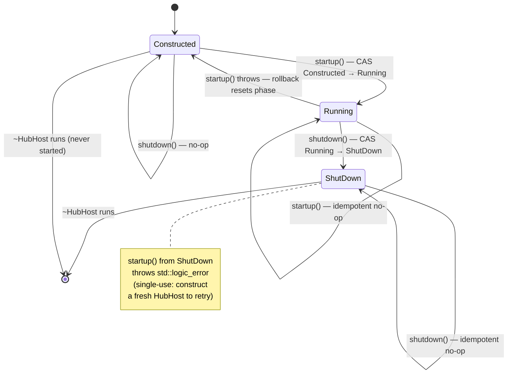

**Contract**:

1. **Monotonic across a successful run.**  Once `shutdown()` succeeds,
   the host is single-use; a subsequent `startup()` throws
   `std::logic_error` rather than racing ApiT/ThreadManager teardown.
   Construct a fresh `HubHost` to start a new run.

2. **Failed startup is reversible.**  If any step in §4.1 throws, the
   `catch` block in `startup()` resets the phase to `Constructed`
   (after running the rollback ops) so the caller may retry on a
   fixed config without constructing a new instance.  This is the
   only Running → Constructed edge; it requires a thrown exception
   from inside `startup()`.

3. **Idempotent on repeated calls.**  `startup()` from `Running` and
   `shutdown()` from `Constructed`/`ShutDown` are no-ops (the CAS
   fails and the method early-returns).  Repeated calls on the same
   thread are harmless; concurrent calls from different threads
   resolve to "first wins, others are no-ops" — but the single-driver
   assumption (§HubHost preconditions) still applies for everything
   beyond the FSM (subsystem state, run loop, etc.).

4. **Not a `LifecycleGuard` transition.**  The phase FSM is internal
   to HubHost.  `LifecycleGuard` modules (Logger, FileLock,
   CryptoUtils, JsonConfig, ZMQContext, ThreadManager) wrap HubHost
   from the outside; their init/teardown is independent of the phase
   FSM and runs at process scope.  ThreadManager IS registered as a
   dynamic LifecycleGuard module owned by HubHost, but that
   registration is about ensuring its drain runs in the correct
   process-shutdown order — it does not gate the phase FSM.

**Error-surface choice — `std::logic_error` vs `PLH_PANIC`**:

| Host         | Method      | `noexcept` | On startup-after-shutdown |
| ------------ | ----------- | ---------- | ------------------------- |
| `HubHost`    | `startup()` | no         | `throw std::logic_error`  |
| `HubHost`    | `shutdown()`| yes        | (n/a — terminal idempotent) |
| `EngineHost` | `startup_()`| no         | `PLH_PANIC` (see below)   |
| `EngineHost` | `shutdown_()`| yes       | (n/a — terminal idempotent) |

`HubHost::startup()` is non-`noexcept` and called from `plh_hub_main`
(or tests), so a thrown `std::logic_error` is recoverable by the
caller and surfaces the contract violation as a typed error.

`EngineHost::startup_()` (role side, see HEP-CORE-0024 §15 +
`engine_host.hpp`) panics instead of throwing, because role hosts
share the same FSM but are typically driven from `plh_role`'s main
loop where startup-after-shutdown almost certainly indicates a
test/regression bug rather than a recoverable user error.  Both
sides use the same `Constructed → Running → ShutDown` shape; the
difference is only in how the violation surfaces.

**Counterpart in role-side `EngineHost`**:

The same FSM lives in `EngineHost<ApiT>` (`src/include/utils/
engine_host.hpp`).  L2 tests in
`tests/test_layer2_service/test_role_host_base.cpp` and
`tests/test_layer2_service/test_hub_host.cpp` exercise the
single-use contract on both sides:

  - `RoleHostBaseLifecycleTest.StartupAfterShutdown_Aborts` —
    role-side panic via worker-process death test.
  - `HubHostTest.StartupAfterShutdown_Throws` — hub-side typed
    error via in-process check.
  - `HubHostTest.FailedStartupAllowsRetry` — rollback edge
    (busy port → throw → fresh host on patched config succeeds).

## 5. CLI (`plh_hub`)

Mirrors `plh_role` CLI shape and parser contract.

```
Usage:
  plh_hub --skeleton <hub_dir>               # Layout only; hub.json INVALID until edited
                                              # (no identity yet; not a runnable hub).
  plh_hub --init [opts] <hub_dir>            # One-shot: skeleton + identity + keygen.
                                              # Prompts for required fields on a TTY;
                                              # fails fast on a non-TTY without them.
  plh_hub --config <path.json> --keygen      # Mint vault (manual path; refuses overwrite).
  plh_hub --config <path.json> --validate    # Clearance: unlock + startup + shutdown.
  plh_hub <hub_dir>                          # Run from a provisioned directory.
  plh_hub --help | -h

--init options (required-at-init resolved via flag / env / TTY prompt):
  --uid  <uid>       Hub UID, validated against §G2.2.0b PeerUid grammar
                     (env fallback: PYLABHUB_HUB_UID).  REQUIRED.
  --name <name>      Hub display name, validated against RoleName grammar
                     (env fallback: PYLABHUB_HUB_NAME).  REQUIRED.
  --vault-path <p>   Vault file path; default vault/<uid>.vault inside hub_dir.
                     If inside hub_dir, §7.2 security warning fires.
  --broker <ep>      network.broker_endpoint; default tcp://0.0.0.0:5570.
  --no-prompt        Force fail-fast on missing required fields even on a TTY.

--init/--skeleton-only options:
  --log-maxsize <MB> Rotate at (default 10).
  --log-backups <N>  Keep N (default 5; -1 = keep all).
```

**Parser contract** (identical to `role_cli::parse_role_args`):
- Returns `ParseResult { HubArgs args; int exit_code = -1; }`; never `std::exit`.
- `--help`/`-h` prints usage to stdout, returns `exit_code = 0`.
- Errors print to stderr, return `exit_code = 1`.
- Mode-exclusion and init-only-flag post-loop guards.

**Files**: `src/include/utils/hub_cli.hpp` (inline, mirrors `role_cli.hpp`).

## 6. Config — `hub.json`

### 6.1 Composite `HubConfig` (mirrors `RoleConfig`)

```cpp
class PYLABHUB_UTILS_EXPORT HubConfig
{
public:
    static HubConfig load(const std::string &path);
    static HubConfig load_from_directory(const std::string &dir);

    const HubIdentityConfig   &identity()   const;
    const AuthConfig          &auth()       const;   // reused from roles
    const ScriptConfig        &script()     const;   // reused; optional
    const LoggingConfig       &logging()    const;   // reused
    const HubNetworkConfig    &network()    const;
    const HubAdminConfig      &admin()      const;
    const HubBrokerConfig     &broker()     const;
    const HubFederationConfig &federation() const;
    const HubStateConfig      &state()      const;

    bool        load_keypair(const std::string &password);
    std::string create_keypair(const std::string &password);

    const nlohmann::json         &raw() const;
    bool                          reload_if_changed();
    const std::filesystem::path  &base_dir() const;
};
```

pImpl + `JsonConfig` backend (thread-safe, process-safe I/O + `reload_if_changed()`),
exactly as `RoleConfig` today. No directional `in_`/`out_` slots — the hub has no
asymmetric sides.

### 6.2 `hub.json` schema

```jsonc
{
  "hub": {
    "uid":       "hub.main.uid12345678",
    "name":      "MainHub",
    "log_level": "info",
    "auth":      { "keyfile": "vault/hub.main.uid12345678.vault" }
  },

  "script":              { "type": "python", "path": "." },
  "python_venv":         "",
  "stop_on_script_error": false,

  "logging": {
    "file_path":    "",
    "max_size_mb":  10,
    "backups":      5,
    "timestamped":  true
  },

  "network": {
    // The same string is used as the broker's BIND address by the hub
    // AND as the CONNECT target string roles read via HubRefConfig.
    // Default `tcp://127.0.0.1:5570` works for single-machine setups;
    // cross-host deployments must change this to an externally-
    // visible address (`tcp://10.0.0.5:5570`, `tcp://0.0.0.0:5570`
    // for bind-all + manual rewrite of the published endpoint per
    // operator policy, etc.).
    "broker_endpoint": "tcp://127.0.0.1:5570",
    "broker_bind":     true,
    "zmq_io_threads":  1
  },

  "admin": {
    "enabled":  true,
    "endpoint": "tcp://127.0.0.1:5600"
    // CURVE-secured + token always required (§11.1 / §11.3); loopback
    // is the default, a network endpoint is an explicit opt-in.
  },

  "broker": {
    // Heartbeat-multiplier role-liveness timeouts — HEP-CORE-0023 §2.5.
    // Field-for-field parity with `BrokerService::Config`; the wiring
    // from `HubBrokerConfig` to `BrokerService::Config` is a literal
    // copy.  `heartbeat_interval_ms` is the **maximum tolerated
    // silence** the hub will accept; roles may run faster (HEP-0023 §2.5.1
    // role-side preferred cadence vs. hub authority).  REG_ACK / CONSUMER_REG_ACK
    // surface these three multiplier fields to the registering role.
    "heartbeat_interval_ms":    500,
    "ready_miss_heartbeats":     10,
    "pending_miss_heartbeats":   10,

    // Optional explicit overrides (null = derive from interval × miss).
    "ready_timeout_ms":   null,
    "pending_timeout_ms": null
  },
  // NOTE: `broker.federation_trust_mode` is deferred to HEP-CORE-0035.
  // `broker.known_roles[]` is not parsed from hub.json — it is loaded
  // from the encrypted hub vault (§4.8) and feeds the ZAP pubkey
  // allowlist.  The legacy `RoleIdentityPolicy` string gate was deleted
  // 2026-07-20 (HEP-0035 §4.5 / §8 Phase 6).

  "federation": {
    "enabled":           false,
    "peers":             [ { "uid": "...", "endpoint": "...", "pubkey": "..." } ],
    "forward_timeout_ms": 2000
  },

  "state": {
    "disconnected_grace_ms":   60000,
    "max_disconnected_entries": 1000
  }
}
```

### 6.3 Parsing rules

- **Strict key whitelist.** Unknown top-level keys and unknown keys inside every
  sub-object throw `std::runtime_error("<hub>: unknown config key '<name>'")` at
  parse time. Verbatim from role-side pattern.
- **Sub-object type enforcement.** `"logging"`/`"network"`/... if present must be
  JSON objects, else throw.
- **Sentinels documented in code.** `"backups": -1` → `kKeepAllBackups`
  (`numeric_limits<size_t>::max()`). `"disconnected_grace_ms": -1` → infinite.
- **Absent sections take defaults.** No `"federation"` → `enabled=false`; no
  `"script"` → hub runs without one.
- **UID is required at config load (finalized 2026-06-04).** Empty or
  absent `hub.uid` is a hard config-load error citing the §G2.2.0b
  PeerUid grammar.  Auto-generation is NOT a parser fallback — the
  silent-auto-gen behavior was retired alongside the §6.5 gatekeeper
  model because a hub whose identity was minted by a silent fallback
  (rather than explicitly committed by the operator) is the exact
  failure mode `--skeleton`/`--init` were designed to prevent.
  Auto-generation survives as a UX feature in the `--init` interactive
  prompt helper (§6.5 "Validator wiring"): when stdin is a TTY and the
  operator hits ENTER on the uid prompt, the helper offers a generated
  default *visible inline* (`Hub uid [default: hub.<name>.uid<8hex>]:`).
  The operator either accepts (ENTER) or types an override.  No silent
  generation on any non-TTY path.  Same model on the role side
  (HEP-CORE-0024 §3.4).

### 6.4 New categorical sub-config headers (`src/include/utils/config/`)

- `hub_identity_config.hpp` — `HubIdentityConfig { uid, name, log_level }`.
- `hub_network_config.hpp` — broker endpoint/bind/io_threads.
- `hub_admin_config.hpp` — endpoint/enabled (CURVE-secured + token
  always required per §11.1 / §11.3; no `token_required` toggle).
- `hub_broker_config.hpp` — heartbeat-multiplier role-liveness timeouts
  (HEP-CORE-0023 §2.5): `heartbeat_interval_ms`,
  `ready_miss_heartbeats`, `pending_miss_heartbeats`, plus two
  optional explicit overrides (`ready_timeout_ms` /
  `pending_timeout_ms`).  Field-for-field parity with
  `BrokerService::Config`'s heartbeat block — the `HubBrokerConfig` →
  `BrokerService::Config` wiring is a literal copy, no translation
  layer.  REG_ACK / CONSUMER_REG_ACK
  surface the three multiplier fields to the registering role for the
  cadence-negotiation contract in HEP-0023 §2.5.1.  Auth/access fields
  (`known_roles[]`, `federation_trust_mode`) deferred to **HEP-CORE-0035**;
  see that HEP for the full design and §5 for the eventual hub.json shape.
- `hub_federation_config.hpp` — enabled/peers/forward_timeout.
- `hub_state_config.hpp` — disconnected_grace / max_disconnected_entries.

Reused from role-side: `auth_config.hpp`, `script_config.hpp`, `logging_config.hpp`.

**Rename note**: the role-facing `src/include/utils/config/hub_config.hpp`
(for `in_hub_dir`/`out_hub_dir` references) was renamed to
`hub_ref_config.hpp`, freeing the `HubConfig` name for the hub-side
composite config here.  Class `HubConfig` →
`HubRefConfig`; function `parse_hub_config` → `parse_hub_ref_config`.

### 6.5 Vault + keygen — finalized 2026-05-31

The hub vault stores the broker's stable CURVE keypair plus the admin
token (separate slot, same KDF domain).  The broker keypair does
double duty: it secures the control ROUTER *and* `curve_server`s the
admin socket (§11.1); the admin token is the mandatory admin-request
authority (§11.3).  Both items are sealed inside one libsodium AEAD
blob keyed by an Argon2id derivation of the operator's password.  See
`src/include/utils/hub_vault.hpp` for the storage shape.

#### Vault filename — UID-keyed (revised 2026-05-31)

The hub vault filename embeds the hub UID:

```
<hub_uid>.vault
```

— symmetric with the role-side convention (HEP-CORE-0024 §3.4).
This is a deliberate change from the prior fixed `hub.vault`
name: the fixed name would silently collide when multiple hubs
shared a per-user vault directory.  Two `plh_hub --init` runs
under the same `$HOME` would both write `~/.pylabhub/vault/hub.vault`;
the second `--keygen` would destroy the first hub's keypair and
admin token without any warning.  Embedding the UID makes the
filename per-hub regardless of placement and lets multiple hubs
coexist in one vault directory without collision.

`HubDirectory::hub_vault_file(hub_uid)` returns
`<base>/vault/<hub_uid>.vault` and takes the hub UID as a
parameter; the caller is responsible for validating the UID
against the §G2.2.0a grammar before passing.

#### `plh_hub --keygen` — what it does

1. Reads `hub.json`; requires `hub.auth.keyfile` per §7.1.
2. Resolves `hub.auth.keyfile` (relative → against `hub_dir`).
3. **No-silent-overwrite check** (added 2026-05-31): if the
   resolved path already exists, refuses with an actionable
   diagnostic and exits non-zero.  The operator must remove the
   file explicitly (`rm '<path>'`) before re-running `--keygen`.
   Refusal text names the path, explains what would be destroyed
   (CURVE keypair + admin token), provides the exact `rm`
   command, and cites this HEP.
4. Generates a CURVE25519 keypair and an admin token.
5. Encrypts the pair with `PYLABHUB_HUB_PASSWORD` (env var →
   interactive prompt fallback per the same source-chain as
   role-side), writes the sealed blob to the resolved path at
   mode 0600.
6. Publishes the public key to `<hub_dir>/hub.pubkey` (HEP-0033
   §7) so roles can read it via
   `HubRefConfig::parse_hub_ref_config`.
7. Prints `hub_uid` + `public_key` to stdout for operator
   confirmation and for paste-into-allowlist flows.

#### Run mode

Reads the vault from the resolved `hub.auth.keyfile` path,
unlocks it via the same password source chain as `--keygen`,
loads the broker's stable CURVE keypair — used both for the control
ROUTER socket and to `curve_server` the admin socket (§11.1).  The
`AdminService` (§11.3) compares the inbound `admin_token` field
against the vault token on every request (mandatory).

#### No in-memory mode

Empty `hub.auth.keyfile` is a config-load error (§7.1).  There
is no "no-vault" or "ephemeral" or `--dev` mode — those were all
rejected during the 2026-05-31 contract finalization for the
reasons in §17.1 "No remote code injection" and the
"pylabhub is a vault" framing this HEP carries throughout.

#### Lifecycle: gatekeeper + clearance model (finalized 2026-06-04)

##### State diagram

The CLI is grounded in three directory states.  Vault creation is
the gatekeeper boundary between *inert* and *provisioned*; two
CLI verbs reach it (`--keygen` for the manual path, `--init` for
the one-shot path).  Once provisioned, `--validate` is the
clearance check and `run` is production.

```
   (nothing)
       │
       │ --skeleton <hub_dir>            ← layout only;
       │                                   hub.json INVALID on load
       │                                   (uid="") until edited
       │   ────── or ──────
       │
       │ --init [--uid X --name Y ...] <hub_dir>
       │                                ← one-shot: bundles
       │                                   --skeleton + identity-field
       │                                   commit + --keygen;
       │                                   prompts for required fields
       │                                   on a TTY; fails fast on a
       │                                   non-TTY without all
       │                                   required values
       ▼
   ┌──────────────────────────────┐
   │ [ inert ]   layout only;     │  ← reached by --skeleton or
   │             not yet a hub    │    transiently by --init
   └──────────────────────────────┘
       │
       │ (manual path only)
       │ operator edits hub.json
       │   (sets uid; optionally moves
       │    vault path outside hub_dir
       │    per §7.2; sets federation
       │    peers etc.)
       │
       │ --keygen <hub_dir>              ← GATEKEEPER:
       ▼                                   mints vault; refuses to
   ┌──────────────────────────────┐        overwrite; publishes
   │ [ provisioned ]              │        hub.pubkey
   │   vault file exists;         │
   │   hub_dir is a valid hub home│
   └──────────────────────────────┘
       │
       ├── --validate <hub_dir>          ← CLEARANCE:
       │                                   prompts for vault password
       │                                   (env-fallback);
       │                                   load_keypair + startup() +
       │                                   shutdown();
       │                                   exits "Validation passed";
       │                                   idempotent.
       │
       └── plh_hub <hub_dir>             ← PRODUCTION:
                                           same load_keypair + startup
                                           path; keeps running.
```

##### Required-field source priority (`--init`)

`--init` resolves each required field through the same priority
chain as `cli::get_password`; the same chain extends to every new
required field via shared helpers in `utils/cli/`:

```
1. CLI flag (e.g. --uid X)                    ← always wins
2. Environment variable (PYLABHUB_HUB_UID)    ← scripted CI
3. Interactive prompt (only when isatty)      ← guided deployment
4. else: hard error                           ← never hang on stdin
```

Every required field — across hub and role binaries — uses this
priority chain.  Optionals (vault path, broker endpoint, etc.)
take their defaults silently and are editable later via direct
hub.json edit; only fields that cannot reach a sensible default
are required.

| Binary                | Required at `--init`    | Source priority                  | Validator                       |
|-----------------------|-------------------------|----------------------------------|---------------------------------|
| `plh_hub --init`      | `hub.uid`               | `--uid` / `PYLABHUB_HUB_UID`     | `IdentifierKind::PeerUid`       |
| `plh_hub --init`      | `hub.name`              | `--name` / `PYLABHUB_HUB_NAME`   | `IdentifierKind::RoleName`      |
| `plh_hub --init`      | vault password          | `PYLABHUB_HUB_PASSWORD`          | length minimum                  |
| `plh_role --init`     | `role` (prod/cons/proc) | `--role` / `PYLABHUB_ROLE`       | enum                            |
| `plh_role --init`     | `role.uid`              | `--uid` / `PYLABHUB_ROLE_UID`    | `IdentifierKind::RoleUid`       |
| `plh_role --init`     | `role.name`             | `--name` / `PYLABHUB_ROLE_NAME`  | `IdentifierKind::RoleName`      |
| `plh_role --init`     | vault password          | `PYLABHUB_ROLE_PASSWORD`         | length minimum                  |

Headless deploy: set all env vars; `--init` runs without prompts.
Guided deploy: attach a TTY; `--init` walks the operator through
each missing required field, re-prompting on validation failure.
Mixed: pass some via flag, env-supply others, leave the rest to
prompt — the chain handles each field independently.

Optional `--no-prompt` flag forces fail-fast even when stdin is
a TTY (useful when piping the binary inside automation that
shouldn't accept interactive input).

##### Why `--skeleton` and `--init` both exist

Three fields in `hub.json` are coupled to the vault and cannot
be freely edited after the vault is minted:

| Field              | Coupling                                                       |
|--------------------|----------------------------------------------------------------|
| `hub.uid`          | Argon2id KDF domain separator; edit after keygen ⇒ vault won't decrypt |
| `hub.auth.keyfile` | Vault file path; edit after keygen ⇒ vault not found at new path |
| (derived) `hub.pubkey` | Federation peers pin it; re-keygen destroys all peer pin bindings |

`--skeleton` is the manual-deployment verb name (HEP-CORE-0033
§6.5 design).  For now (as of commit `c684776a`), it dispatches to
the same template-writer as `--init` — both produce a hub.json with
an auto-generated uid + placeholder vault keyfile, then the
operator runs `--keygen` separately.  The "writes a deliberately-
invalid template (uid='')" behavior is the §6.5 design target but
ships in a follow-up alongside the one-shot `--init` bundling so
the two semantics land coherently.

`--init` is currently the same as `--skeleton`: template-write only
(auto-gen uid; operator runs `--keygen` next).  The §6.5-designed
one-shot bundling (accept `--uid` / `--name` via source-priority
chain, write them straight in, run `--keygen` in the same command)
is staged: the CLI surface (`--uid`, `--name`, `--no-prompt`,
`--vault-path` flags) and the `get_required_uid` helper land in
this commit, but the `do_init` body is unchanged.  Wiring the
helper into `do_init` is the remaining slice — deferred so the 24
L4 test sites that currently call bare `plh_hub --init <dir>` can
be migrated coherently rather than piecemeal.

When fully landed the two paths will produce identical end-states;
the manual path will force explicit edit of identity-shaping
fields, and the one-shot path will accept those fields via flag /
env / TTY prompt.

##### Why each ordering step exists

1. `--keygen` reads `hub.json` to learn the vault path and uses
   `hub.uid` as the Argon2id KDF domain separator.  `--skeleton`
   (or `--init`) produces the file with those fields settled.
2. `--validate` and `run` both call `HubConfig::load_keypair`
   which unlocks the vault.  Without a vault file at the resolved
   path, `load_keypair` throws `"vault file '<path>' does not
   exist — run --keygen (or --init) first"`.  This is the §4.6.2
   vault-presence gate firing naturally; no CLI-mode-specific
   logic is needed.
3. The HEP-CORE-0035 §2 invariant **"HubHost startup requires a
   loaded keypair"** forbids any path that calls `startup()`
   without a loaded keypair, including a hypothetical
   "validate-without-vault" carve-out.  Such a carve-out would
   require either (a) constructing `HubHost` with empty CURVE
   keys (rejected at §2), or (b) calling something less than
   `startup()` from the validate path (defeats validate's
   purpose, which is to dry-run the production code path).

##### Validator wiring (CLI ↔ canonical)

Every CLI path that accepts a UID-shaped field calls the same
canonical validator from `utils/naming.hpp`:

```cpp
// utils/cli/get_required_uid.hpp  (new, shared hub + role)
[[nodiscard]] std::optional<std::string>
get_required_uid(std::string_view side,        // "hub" / "prod" / "cons" / "proc"
                 std::string_view env_var,     // e.g. "PYLABHUB_HUB_UID"
                 std::string_view prompt,      // e.g. "Hub uid:"
                 IdentifierKind   kind,        // PeerUid / RoleUid
                 std::string_view cli_flag,    // value passed via --uid (may be empty)
                 bool             no_prompt);  // honor --no-prompt
```

The helper:
- Returns the CLI flag value if non-empty.
- Otherwise reads the env var; if non-empty, validates via
  `is_valid_identifier(value, kind)` and returns or errors.
- Otherwise, if `isatty(STDIN_FILENO) && !no_prompt`, prompts;
  re-prompts on validation failure.
- Otherwise: error with the canonical format ("invalid uid '...':
  must match HEP-CORE-0033 §G2.2.0b PeerUid grammar
  'tag.name.unique', e.g. 'hub.main.uid3a7f2b1c'").

Same validator function (`is_valid_identifier`) runs regardless
of source — no parallel format-checking code lives in the CLI
layer.  Adding a new required field is one line: call
`get_required_uid(...)`.

Defense-in-depth structure:
- **Parse-time:** CLI helper rejects malformed uid before any
  disk write.
- **Config-load-time:** `parse_hub_identity_config` /
  `parse_role_identity_config` re-validate via the same function.
- **Vault-write time:** consumes already-validated uid; no
  redundant check.

##### Idempotency contract summary

| Command            | Idempotent? | On re-run on the same state                          |
|--------------------|-------------|------------------------------------------------------|
| `--skeleton`       | no          | refuses to overwrite existing hub.json                |
| `--init`           | no          | refuses to overwrite existing hub.json                |
| `--keygen`         | no          | refuses to overwrite existing vault (HEP §4.6.3)     |
| `--validate`       | yes         | runs startup → shutdown again; no state change       |
| run                | n/a         | production                                            |

##### Equivalent role-side workflow

`plh_role` follows the same gatekeeper/clearance model with the
same shared helper.  `plh_role --skeleton` scaffolds the role
home; `plh_role --keygen` mints the role's CURVE keypair into
the role vault; `plh_role --init --role X --uid Y --name Z` is
the one-shot equivalent.  `plh_role --validate` unlocks the vault
and runs the engine-load smoke test (broker connection skipped
via `RoleHost::set_validate_only` — a separate concern that gates
infrastructure, not a CURVE opt-out).  See HEP-CORE-0024 §3.4
for the role-side deployment authority.

## 7. Hub directory layout (`--skeleton` / `--init` output)

```
<hub_dir>/
├── hub.json
├── script/                     # OPTIONAL — absent = hub runs without scripting
│   └── python/                 #   (or lua/ or native/)
│       └── __init__.py
├── schemas/                    # OPTIONAL — hub-global schema definitions
│   └── lab/sensors/temperature.raw.v1.json   # (HEP-CORE-0034 §12)
├── vault/
│   └── <hub_uid>.vault         # CURVE keypair + (optional) admin token
│                                 # Filename embeds the hub UID per §6.5
│                                 # (revised 2026-05-31) so multiple hubs
│                                 # sharing a vault dir do not collide.
├── logs/
│   └── <hub_uid>-<ts>.log
└── run/
```

Mirrors HEP-CORE-0024 role layout. `HubDirectory` helper (new) mirrors
`RoleDirectory` accessors (`base_dir/vault/logs/script/run/schemas`,
`create_standard_layout()`, `has_standard_layout()`).

### 7.1 Vault path resolution (`hub.auth.keyfile`) — finalized 2026-05-31

`hub.auth.keyfile` is the source of truth for the vault file
location.  The runtime does NOT hardcode any path; it resolves
the configured value and obeys.  Semantics are fully symmetric
with HEP-CORE-0024 §3.4 — there is **no asymmetry** between hub
and role.

#### `hub.auth.keyfile` contract

| `hub.auth.keyfile` value | Behavior at load time | Behavior at `--keygen` time | Behavior at runtime |
|---|---|---|---|
| Non-empty, relative (e.g. `"vault/<hub_uid>.vault"`) | Resolved against `hub_dir`. | `--keygen` creates the resolved path; if file already exists → HARD ERROR (no silent overwrite). | Vault opened at resolved path.  HEP-CORE-0035 §4.6.2 ACL check applies to the file + parent directory.  `HubConfig::load()` emits the §7.2 SECURITY WARNING when the resolved path is inside `hub_dir`. |
| Non-empty, absolute (e.g. `"/srv/secrets/<hub_uid>.vault"`) | Used as-is. | `--keygen` creates the absolute path; if file already exists → HARD ERROR. | Vault opened at the absolute path.  ACL check applies.  No warning (outside `hub_dir`). |
| Non-empty, resolved path absent at runtime | Resolved path stored. | (See above.) | HARD ERROR.  Binary refuses to fall back silently. |
| Empty `""` | HARD ERROR at config-load.  No in-memory CURVE mode exists. | (Never reached.) | (Never reached.) |
| Field missing entirely | HARD ERROR at config-load. | (Never reached.) | (Never reached.) |
| `auth` object missing | HARD ERROR at config-load. | (Never reached.) | (Never reached.) |
| `auth.keyfile` non-string type | HARD ERROR at config-load. | (Never reached.) | (Never reached.) |

#### Diagnostic surface

All config-load failures cite HEP-CORE-0024 §3.4 / HEP-CORE-0033
§7.1 in their error text.  The `--keygen` overwrite-refusal
diagnostic names the offending path, explains what would be
destroyed (CURVE keypair + admin token), provides the exact
`rm '<path>'` command, and cites this HEP.

#### Path resolution semantics

JSON values are read literally — `~` is NOT shell-expanded.
Relative paths resolve against `hub_dir`.  No `..` normalization
is performed.

#### Canonical `--init` template

`plh_hub --init` writes:

```jsonc
"hub": {
    ...
    "auth": { "keyfile": "vault/<hub_uid>.vault" }
}
```

into the generated hub config.  The filename embeds the hub UID
per §6.5 (revised 2026-05-31) so multiple hubs sharing a vault
directory do not collide.

The relative path makes the dev / CI / smoke-test path zero-
configuration.  For production deployments the operator edits
`hub.auth.keyfile` to a path outside `hub_dir` before running
`--keygen` — the §7.2 SECURITY WARNING fires at every startup
when the resolved path is inside `hub_dir` to make the choice
visible.

### 7.2 Vault placement security model

Symmetric with HEP-CORE-0024 §3.4.1 for the role side.  The
script-write attack vector applies on the hub too: hub-side
scripts run through `HubAPI` (§12) and execute with the hub
binary's euid.  Hostile scripts can write any file the binary
can write, including the vault file.  Encryption-at-rest
protects content from reads; it does not protect against
truncation or replacement.

#### The load-bearing SECURITY WARNING

`HubDirectory::warn_if_keyfile_in_hub_dir(base_dir, keyfile)`
is called from `HubConfig::load()` immediately after parsing
`hub.auth.keyfile`.  When the resolved path lies inside
`hub_dir`, the binary writes a `*** PYLABHUB SECURITY WARNING ***`
banner to stderr.  The text identifies `hub.auth.keyfile`, quotes
the operator's literal path, explains the §12 hub-side scripting
attack vector, and recommends:

```
/etc/pylabhub/vault/<hub_uid>.vault   (system-managed)
~/.pylabhub/vault/<hub_uid>.vault     (single-user)
```

#### Recommended deployment shapes

- **Dev / CI / smoke test** — leave the `--init` template
  default; accept the warning; convenient out-of-the-box.
- **Single-user laptop** — edit `hub.auth.keyfile` to
  `~/.pylabhub/vault/<hub_uid>.vault` written as
  `/home/<user>/.pylabhub/vault/<hub_uid>.vault`.
- **System-managed service** — `hub.auth.keyfile` =
  `/etc/pylabhub/vault/<hub_uid>.vault`.  Hub daemon runs under
  a service user; vault owned by that user.
- **Custom storage** — operator-supplied absolute path.

#### Mode + ownership discipline (separate concern)

HEP-CORE-0035 §4.6.1 enforces 0700 on the vault directory and
0600 on the vault file regardless of placement.  Mode discipline
is orthogonal to placement.

`schemas/` holds **hub-global** schema records (owner = `hub`) per
HEP-CORE-0034. Hub startup walks the tree and loads each `*.json` file into
`HubState.schemas`; failure to parse any file aborts startup with a precise
`<path>: <error>` diagnostic. An empty or absent `schemas/` directory is
valid — the hub then serves only producer-private schema records.

## 8. State tables — `HubState`

Read-mostly aggregate owned by `HubHost`. `BrokerService` updates as messages
arrive; `AdminService` and `HubAPI` read via `HubHost` accessors.

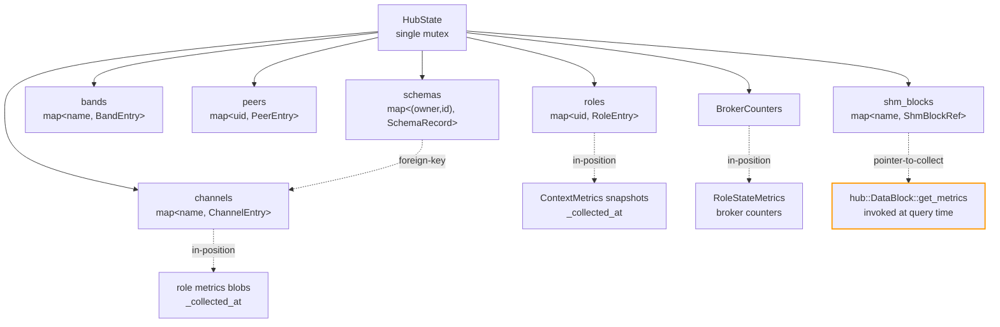

```cpp
struct HubState
{
    std::unordered_map<std::string, ChannelEntry>  channels;
    std::unordered_map<std::string, RoleEntry>     roles;
    std::unordered_map<std::string, BandEntry>     bands;
    std::unordered_map<std::string, PeerEntry>     peers;
    std::unordered_map<std::string, ShmBlockRef>   shm_blocks;  // pointer-to-collect
    std::map<std::pair<std::string, std::string>,
             schema::SchemaRecord>                 schemas;     // (owner_uid, schema_id)
    BrokerCounters                                  counters;   // in-position
};
```

| Entry | Updated by | Holds |
|---|---|---|
| `ChannelEntry` | REG_REQ / CONSUMER_REG_REQ / CONSUMER_DEREG_REQ / ENDPOINT_UPDATE_REQ / CHANNEL_CLOSING / broker-internal | **Channel-wide invariants only**: name, schema_owner/schema_id/schema_hash/blds/packing (HEP-CORE-0023 §2.1.1 — all producers must agree), data_transport, channel_pattern, has_shared_memory, shm_name, created_at.  **Amendment 2026-07-08 (topology migration)**: gains four new fields — `topology` (ChannelTopology enum: FanIn / FanOut / OneToOne, declared at channel creation and immutable — tech draft §4.1), `data_endpoint` (`std::optional<std::string>` owned by the BINDING side per topology — `has_value()` indicates the binding side has published its endpoint via `ENDPOINT_UPDATE_REQ` per HEP-CORE-0021 §16.4), `channel_version` (uint64, bumped on allowlist changes), and `confirmed_version` (scalar per channel — collapsed from the pre-migration `[K][P]` per-producer map since the binding side is unique per channel).  **Per-party rows**: `producers[]` (vector of `ProducerEntry`; 1..N per HEP-CORE-0023 §2.1.1), `consumers[]` (vector of `ConsumerEntry`).  **Per-producer attributes live on `ProducerEntry`**, NOT at channel scope (Wave M2.5): `metadata`, `inbox_*` (HEP-CORE-0027), plus identity (`role_uid` / `role_name` / `producer_pid` / `producer_hostname` / `zmq_identity`).  The pre-migration `ProducerEntry::zmq_node_endpoint` field retires 2026-07-08 — its role is subsumed by `ChannelEntry::data_endpoint` (single per-channel endpoint owned by whichever side is BINDING under the declared topology).  DISC_REQ_ACK aggregates per-producer metadata into a tree keyed by `role_uid` (HEP-CORE-0007 §12.4); post-migration DISC_REQ_ACK carries the scalar `data_endpoint` instead of per-producer endpoints.  **Does NOT store FSM state** — both channel **observability** (HEP-CORE-0023 §2.2) and channel **existence** (HEP-CORE-0023 §2.1.1) are derived queries over the producer-presences across roles.  Channel teardown is atomic on the BINDING side's transition to Disconnected (generalized from the pre-migration "last producer" rule — see HEP-CORE-0023 §2.1.1); no separate channel FSM.  Fields with non-trivial invariants (idempotent endpoint set; monotonic version writes) are exposed via member functions (`set_data_endpoint`, `bump_channel_version`, `set_confirmed_version`, `add_producer` / `remove_producer` for the vector's cardinality boundary); the struct's own fields are public and mutated by `HubState`'s admission machinery under its writer lock — no compiler-enforced encapsulation, but a single-mutator convention (only `HubState` mutates; the broker calls only the typed capability ops). |
| `RoleEntry` | REG / per-presence HEARTBEAT_NOTIFY / DISC / role-side timeout | uid, name, role_tag, first_seen, **`presences[]`** — one row per `(channel, role_type)` carrying the FSM `state` (Connected / Pending / Disconnected per HEP-CORE-0023 §2.1), `last_heartbeat`, `state_since`, `latest_metrics`, `metrics_collected_at`.  Each heartbeat refreshes only its matching presence row.  `MetricsStore` is keyed `(channel_name, uid, role_type)` — see §18.4. |
| `BandEntry` | BAND_JOIN / BAND_LEAVE | name, members[], last_activity |
| `PeerEntry` | HUB_PEER_HELLO / HUB_PEER_BYE / federation heartbeat | uid, endpoint, state, last_seen |
| `ShmBlockRef` | channel registration with SHM transport | channel name, block path; metrics collected via `collect_shm_info(channel)` at query time |
| `SchemaRecord` | hub-startup (globals) / REG_REQ (private) / `_on_role_deregistered` (cascade evict) | owner_uid, schema_id, hash, packing, blds, registered_at — see HEP-CORE-0034 §4 |
| `BrokerCounters` | broker internal | `RoleStateMetrics` (HEP-0023 §2.5), ctrl queue depth, byte counts, per-msg-type counts, **schema counters (HEP-0034 §11.3)** |
| `ChannelAccessEntry` (per channel) | REG_REQ / CONSUMER_REG_REQ / CONSUMER_DEREG / heartbeat-timeout / CHANNEL_AUTH_UPDATE emitter | **NEW (HEP-CORE-0036 §4.1, locked 2026-05-28; SHM portion amended 2026-06-16 per HEP-CORE-0041)**: `authorized_consumer_pubkeys` set (Z85) — used for ZMQ Layer-3 + as the broker-side allowlist that HEP-CORE-0041 §9 D4 "pre-attach broker confirmation" reads on SHM consumer `CONSUMER_ATTACH_REQ_SHM`.  This is the **SOURCE OF TRUTH for both transports** per HEP-CORE-0036 §I11.1 cache architecture; all producer-side caches (script-observable `allowlist_cache` + ZMQ ZAP cache) flow downstream from here via REG_ACK + `CHANNEL_AUTH_CHANGED_NOTIFY`.  The historical `shm_secret` field (HEP-0036 draft) is SUPERSEDED by HEP-CORE-0041's capability-transport model (FD/HANDLE handoff; no uint64 token); the broker no longer mints or stores per-channel SHM secrets — see HEP-CORE-0036 §1 Amendment 2026-06-16 + HEP-CORE-0041 §1 + §9 D1-D8.  Producer pubkey is NOT duplicated here — it lives on `ChannelEntry::producers[i].zmq_pubkey` (the existing Wave M2.5 per-producer field).  Held in `HubState::channel_access_index_` map keyed by channel name.  Owned by the broker handler thread (single-threaded dispatch); no external synchronization needed. |

**Retention**: a `RoleEntry` whose presences are all `Disconnected`
lingers `state.disconnected_grace_ms` (default 60s) before eviction
from the `roles` map (so that a brief reconnect can recover its
metrics history); LRU cap `state.max_disconnected_entries` prevents
unbounded growth. Closed channels evict immediately on producer-
presence Disconnected (HEP-CORE-0023 §2.1).

**Consistency**: single internal mutex; accessors return snapshot structs. No
cross-field consistency guarantee; each metric entry carries `_collected_at`.

**Snapshot type (per HEP-CORE-0039).**  `HubState::snapshot()` returns
a value-typed `HubStateSnapshot` that mirrors the maps above and
adds four metadata fields for capture provenance:

| Field | Meaning |
|---|---|
| `captured_at` | Wall-clock capture timestamp (system_clock) |
| `captured_mono` | Monotonic capture timestamp (steady_clock) for `age_seconds()` math that survives NTP jumps |
| `hub_uid` | Origin hub identifier; disambiguates dual-hub-processor snapshots |
| `snapshot_seq` | Per-hub monotonic counter; first live snapshot has `seq == 1`; `seq == 0` is reserved for default-constructed values |

See HEP-CORE-0039 §3.1 for the canonical struct definition + lifetime
contract + query helpers that consume it.

## 9. Message-Processing Contract

The broker's `process_message()` and the per-handler dispatch operate
under a fixed contract that defines: (i) what counter goes up when,
(ii) what happens on error/exception, (iii) what reply (if any) the
client receives, and (iv) where in the pipeline each side-effect
occurs.  This contract is the seam between the wire (ZMQ frames) and
the model (`HubState` mutations).  It is normative for any handler
added to `process_message()` and for any code that reads counters via
`HubState::counters()`.

### 9.1 Pipeline stages

Every inbound message traverses these stages in order:

```
S0  Socket recv         zmq::recv_multipart returns frames
S1  Frame validation    frame count, size cap (1 MB)
S2  Body parse          nlohmann::json::parse(frames[3])
S3  Dispatch            msg_type → handler branch in process_message()
S4  Handler execution   broker validation → HubState op → reply build
S5  Reply send          send_reply() (request-reply types only)
S6  Post-process        counters, hook
```

Stages S0–S2 happen in the recv loop, before `process_message()` is
invoked.  S3–S6 happen inside `process_message()`.

### 9.2 Reply-shape classification (per msg_type)

Each msg_type is **statically classified** at code-time as one of:

- **request-reply** — client always expects exactly one reply frame
  (`*_ACK` on success, `ERROR` on failure).  The protocol shape is
  fixed; the server's outcome does not change it.
- **fire-and-forget** — client never expects a reply.  Errors are
  handled entirely on the server side (counter + hook + log).  The
  client cannot distinguish "delivered" from "error" — that is the
  intentional contract of fire-and-forget messages.

Current classification (single source of truth: the dispatcher branch
that either calls `send_reply()` or does not):

```
Request-reply:
  REG_REQ, DISC_REQ, DEREG_REQ,
  CONSUMER_REG_REQ, CONSUMER_DEREG_REQ, CONSUMER_DEREG_ACK,
  SCHEMA_REQ,
  GET_CHANNEL_AUTH_REQ, GET_CHANNEL_PRODUCERS_REQ,
  CHANNEL_LIST_REQ, METRICS_REQ, SHM_BLOCK_QUERY_REQ,
  ROLE_PRESENCE_REQ, ROLE_INFO_REQ,
  BAND_JOIN_REQ, BAND_LEAVE_REQ, BAND_MEMBERS_REQ,
  HUB_PEER_HELLO         (HUB_PEER_HELLO_ACK)

Fire-and-forget:
  HEARTBEAT_NOTIFY,
  CHECKSUM_ERROR_REPORT,
  CHANNEL_BROADCAST_SEND_NOTIFY,
  BAND_BROADCAST_SEND_NOTIFY,
  HUB_PEER_BYE,
  HUB_RELAY_MSG (peer-DEALER inbound),
  HUB_TARGETED_MSG (peer-DEALER inbound)
  (CHANNEL_NOTIFY_REQ retired — audit R3.6, 2026-05-17)

  Retired (M1.4, 2026-05-11): METRICS_REPORT_REQ — metrics piggyback
  on HEARTBEAT_NOTIFY per HEP-CORE-0019 §2.3 Phase 6.

  Un-retired (2026-07-08): ENDPOINT_UPDATE_REQ — post-bind
  endpoint publish per HEP-CORE-0021 §16 (adopted 2026-07-08,
  closes task #94).  The pre-REG bind variant retired 2026-06-12
  stays retired; the new variant binds at S3 and publishes the
  resolved port over the CURVE-authenticated CTRL.

  Retired (2026-07-08 topology migration) — companion set to
  the §18.2 wire-catalog retirement rows for
  `GET_CHANNEL_PRODUCERS_REQ` + `CHANNEL_PRODUCERS_CHANGED_NOTIFY`:
    - GET_CHANNEL_PRODUCERS_REQ — consumers no longer maintain a
      dial-target producer set (fan-in consumers are BINDING;
      fan-out and 1-to-1 consumers dial one endpoint from
      CONSUMER_REG_ACK.data_endpoint).
    - CHANNEL_PRODUCERS_CHANGED_NOTIFY — symmetric retirement;
      producer_joined / producer_left semantics collapse into
      CHANNEL_AUTH_CHANGED_NOTIFY(phase, role_type="producer")
      under fan-in.
    - CONSUMER_ATTACH_REQ_ZMQ + _ACK_ZMQ (HEP-CORE-0042 §5) —
      pre-attach coordination protocol collapses into the R6-gated
      REG_REQ path per tech draft §5.7.  See HEP-CORE-0042 for the
      full scope narrowing (§5 + §7.1 retire).
    - CONSUMER_ATTACH_REQ_SHM — retired symmetric with the ZMQ
      variant.  SHM consumer's attach coordination is now the
      REG_REQ path + AttachProtocol handshake (HEP-CORE-0044)
      inside the resulting data-plane session.

  New (2026-07-08 topology migration):
    - CHANNEL_AUTH_CHANGED_NOTIFY gains phase field (admitted /
      live / left) + role_uid + role_type.  See HEP-CORE-0007
      §12.5 for schema.  Direction inverted: broker → BINDING
      side of the channel per topology.
    - REG_REQ / CONSUMER_REG_REQ gain channel_topology field
      (REQUIRED).  See HEP-CORE-0007 §12.3.
    - Six new error codes for topology + cardinality validation.
      See HEP-CORE-0007 §12.4a.
```

When adding a new msg_type, the contributor MUST classify it
explicitly in the dispatcher, and the classification table above
MUST be updated.

### 9.3 Failure-mode disposition (per stage)

| Stage | Failure | Action | Counter | Hook fires? |
|---|---|---|---|---|
| S0 | recv error (`EAGAIN`, `EINTR`) | log at TRACE; continue loop | none | no |
| S1 | wrong frame count, oversized payload | `LOGGER_WARN`; drop; continue | `sys.malformed_frame` | yes (msg_type empty) |
| S2 | `nlohmann::json::parse_error` | `LOGGER_WARN`; drop; continue | `sys.malformed_json` | yes (msg_type empty) |
| S3 | unknown msg_type | `LOGGER_WARN`; ERROR reply (request-reply shape per the unknown name's lack of classification — falls to fire-and-forget by default; current dispatcher always replies ERROR for unknowns); continue | **only `sys.unknown_msg_type`** — the unknown msg_type string is NOT inserted into `msg_type_counts` (cardinality-attack mitigation, R1) | yes |
| S4 | broker-level validation rejected (e.g. missing required field) | request-reply: ERROR reply; fire-and-forget: log + counter only | `msg_type_counts[type]` | no — this is a normal protocol error, surfaced via the ERROR reply for request-reply types |
| S4 | HubState validator silent-drop (e.g. invalid uid) | reply built from POST-state read; client sees actual outcome | `msg_type_counts[type]` only; `sys.invalid_identifier_rejected` bumped inside HubState | no — HubState handles internally |
| S4 | unexpected exception (e.g. `zmq::error_t`, `std::bad_alloc`) | request-reply: best-effort ERROR reply (inner try/catch); fire-and-forget: NO reply (never confuse the client); always continue loop | `msg_type_counts[type]` + `msg_type_errors[type]` + `sys.handler_exception` | yes |
| S5 | reply send fails (DEALER closed, HWM hit) | inner try/catch; `LOGGER_WARN`; continue | none (this is a transport-layer issue, not a processing one) | no |
| S6 | counter bump | atomic increment; never fails | n/a | n/a |

### 9.4 Counter taxonomy

Three independent kinds; all live in `BrokerCounters` and are exposed
via `HubState::counters()`:

**Wire metrics** (broker dispatcher; bump policy: post-processing):

```
msg_type_counts[<known_msg_type>]   bumped at S6 if S0–S3 succeeded;
                                    counts every dispatch-completed message
                                    (success OR error) of a known type.

bytes_in_total                      bumped at S6 with frames[3].size().
bytes_out_total                     deferred — multi-target fan-out
                                    (broadcast/relay) makes per-message
                                    accounting ambiguous.

msg_type_errors[<known_msg_type>]   bumped at S6 alongside msg_type_counts
                                    if S4 hit an exception or validation
                                    rejection (request-reply types only).
```

**Operational metrics** (failure-point bump):

```
sys.malformed_frame             — S1 failure (count, size limits).
sys.malformed_json              — S2 failure (JSON parse).
sys.unknown_msg_type            — S3 failure (no handler matched).
sys.handler_exception           — S4 uncaught exception.
sys.invalid_identifier_rejected — bumped INSIDE HubState capability ops
                                  when an _on_* op silent-drops on validator.
                                  (Independent of the dispatcher; counts
                                  state-mutation rejects, not message arrivals.)
```

**Semantic metrics** (HubState capability op; bump atomic with state change):

```
ready_to_pending_total          HEP-CORE-0023 §2.5
pending_to_ready_total
pending_to_deregistered_total
close:<reason>                  per ChannelCloseReason enum value

schema_registered_total         HEP-CORE-0034 §11.3
schema_evicted_total              bumped per record removed by cascade
schema_citation_rejected_total    bumped on _validate_schema_citation NACK
```

These are triggered by **state transitions**, which include but are
not limited to message arrivals (the heartbeat-timeout sweep fires
`ready_to_pending_total` from a timer, no inbound message; producer
deregistration fires both `pending_to_deregistered_total` and any
number of `schema_evicted_total` bumps inside the same mutator
section).  They remain inside the capability ops because the dispatcher
cannot detect a transition without state-diff introspection.

### 9.5 Exception-safety contract

> `process_message()` MUST NOT propagate exceptions to its caller (the
> recv loop).  Any `std::exception` from any stage S3–S5 is caught,
> logged at ERROR, the appropriate counters and hook are fired, a
> best-effort ERROR reply is sent **only for request-reply types**, and
> the broker continues to the next message.

Implementation: outer try/catch in `process_message()`; inner try/catch
around the best-effort ERROR reply send (R11); inner try/catch around
the hook invocation (R2 — the user-supplied hook may throw, broker
must survive).

The recv loop's existing outer `try/catch (nlohmann::json::exception)`
remains as-is for S2 protection; the new contract removes the broader
exception class from escaping past `process_message()`.

### 9.6 `on_processing_error` hook

Opt-in callback on `BrokerService::Config`:

```cpp
struct ProcessingError {
    std::string                msg_type;       // empty for S1/S2 errors
    std::string                error_kind;     // "malformed_frame" | "malformed_json" |
                                               // "unknown_msg_type"  | "exception"
    std::string                detail;         // exception what() / parse error / etc.
    std::optional<std::string> peer_identity;  // ROUTER routing identity if available
};

std::function<void(const ProcessingError &)> on_processing_error;
```

Fired AFTER counter bumps (so a hook handler reading
`HubState::counters()` sees fresh state).  Invoked under broker thread,
synchronously — handler must be fast; for slow work, enqueue and
return.  Hook may throw; broker swallows.

The struct is **append-only** for ABI stability: future fields may be
added at the end; existing fields may not be removed or reordered.
(R6.)

### 9.7 Mutation-vs-reply ordering (request-reply handlers)

```
1. Parse + broker-level field validation
       if invalid → ERROR reply, return

2. Call HubState capability op
       op may silent-drop on internal validator failure; that is fine

3. Build reply from POST-state read
       e.g. `auto entry = hub_state_.channel(name);`
       if op silent-dropped, the entry is absent → reply reflects reality

4. send_reply(...)
```

This rule eliminates the bug class where the broker reports success
but HubState silently dropped the mutation: because the reply is
constructed from observed state, a silent drop surfaces as a NOT_FOUND
or empty-payload reply rather than a misleading ACK.

### 9.8 Cross-reference

This contract is exercised in:
- `src/utils/ipc/broker_service.cpp` — `process_message()` is the
  single dispatch entrypoint that conforms to this contract.
- `src/utils/ipc/hub_state.cpp` — capability ops bump only **semantic**
  counters; **wire** counter bumps were moved to the dispatcher in
  HEP-CORE-0033 G2.2.4.

## 10. Metrics model (supersedes HEP-CORE-0019 §3-4)

### 10.1 Ingress — role→hub push only (post-Wave M1.4)

- `HEARTBEAT_NOTIFY` with optional `metrics` field — the SOLE ingress path.
  Every presence (producer + consumer) emits its own heartbeat with
  `role_type` distinguishing the row.  Heartbeat tick is iteration-
  gated for producers and processors; consumers use the same tick
  cadence.

`METRICS_REPORT_REQ` is **RETIRED** (Wave M1.4, 2026-05-11) — wire
message, role-side sender, broker handler, and the broker's
`metrics_store_` are all deleted.  See HEP-CORE-0019 §9 Phase 6 for
the full rationale.  No broker-initiated metrics pull exists or will exist.

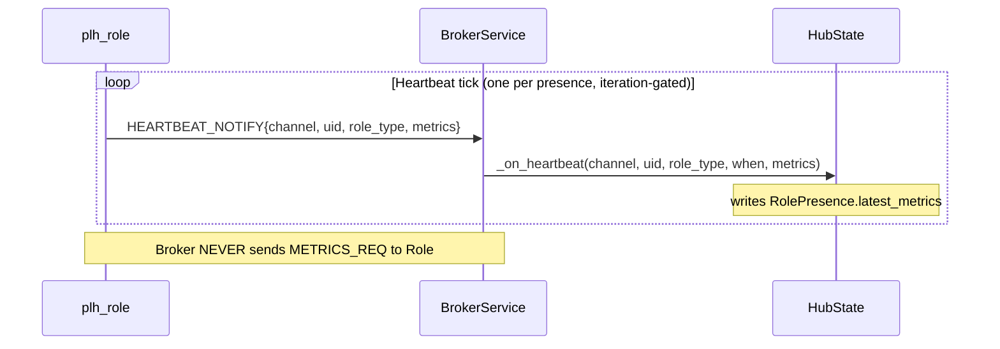


### 10.2 Entry types

- **In-position**: role-pushed metrics, broker counters, federation peer states.
- **Pointer-to-collect**: SHM block metrics (invoke `hub::DataBlock::get_metrics(channel)` at query time). Future extensions (system CPU/RSS, etc.) use this pattern.

### 10.3 Query flow

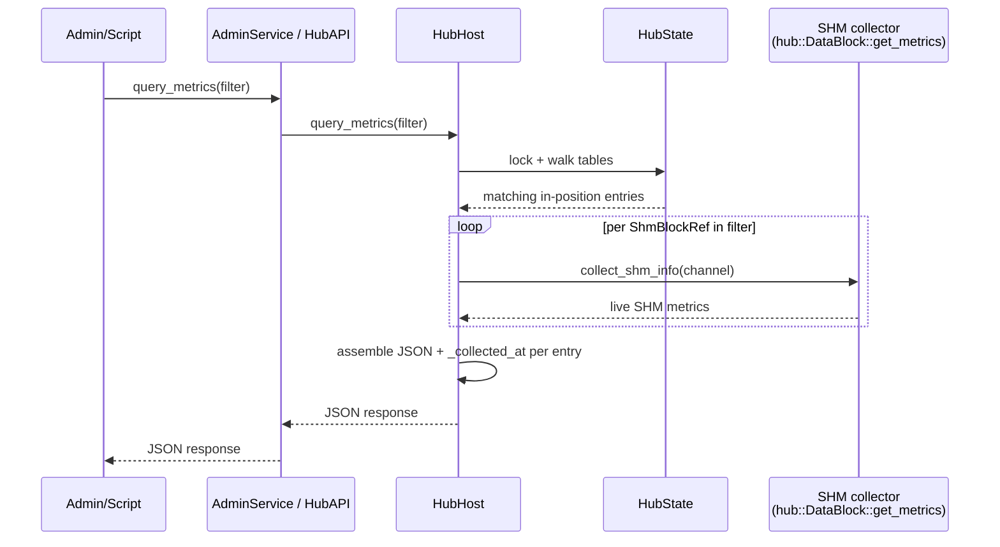

1. Accept a `MetricsFilter` (role uids, channel names, band names, peer uids,
   category tags: `"channel"`, `"role"`, `"band"`, `"peer"`, `"broker"`, `"shm"`,
   `"all"`).
2. Walk `HubState` under the state mutex; select matching entries.
3. Read in-position data directly; invoke pointer-to-collect callbacks.
4. Build single JSON response:
   ```jsonc
   {
     "status": "ok",
     "queried_at": "ISO-8601",
     "filter":    { ... },
     "channels":  { "<ch>": { "producer": {..., "_collected_at": "..."},
                               "consumers": {...},
                               "shm":      {..., "_collected_at": "..."} } },
     "roles":     { "<uid>": { ..., "_collected_at": "...", "_status": "ready" } },
     "bands":     { ... },
     "peers":     { ... },
     "broker":    { ... }
   }
   ```
5. Return. No retry, no wait-for-update.

### 10.4 Relation to existing `BrokerService::query_metrics_json_str`

Existing impl (`broker_service.cpp:2336`, `2523`, `2534`) already has this shape
for channels + shm_blocks. Refactor extends it with role/band/peer/broker
categories, `_collected_at` per entry, and plumbs through `HubHost` (not
directly on `BrokerService`).

## 11. Admin RPC surface — `AdminService`

Replaces legacy `AdminShell` which only offered `{token, code}` → `exec(code)`.

### 11.0 The admin path — end to end

The role plane (producers, consumers, processors) has a fully specified
message flow — every request has a defined ingress socket, wire envelope,
handler, and actuation. The admin plane is the operator's equivalent, and
this section gives it the same top-down treatment: where a command enters,
which thread handles each stage, how it is authorized, how it turns into an
actual change in hub state, and what the caller is promised in return.

The one idea that ties it together: **two front doors, one engine room.**
An operator command (over the network) and a hub-side script command
(in-process) are two *ingress* paths, but they converge on the *same*
actuation machinery — the broker's request queues, drained by the broker's
own main loop. The admin socket never mutates hub state directly; it only
*hands work to the broker thread*.

#### 11.0.1 Logical layers

An admin command passes through five forward layers; a sixth reverse layer
carries notifications back. Each layer has a single responsibility and a
defined hand-off to the next.

1. **Ingress** — the command enters the hub.
   - *Operator (external):* a `DEALER` console holds a persistent CURVE
     session to the `AdminService` `ROUTER` socket (§11.1) and sends command
     envelopes over it. This is the only networked admin entry point.
   - *Hub script (internal):* a script running in the hub process calls a
     `HubAPI` method directly (no socket, no wire). §12 owns this surface;
     it is named here only because it feeds the same actuation layer.
2. **Dispatch + authorization** — the admin worker validates the envelope,
   verifies the session id against the connection facts (§11.0.5), and
   routes the method name through a static table to a handler. Malformed or
   unauthorized requests are rejected here and never reach a handler.
3. **Query / Control fork** — every method is exactly one of two kinds:
   - *Query* reads a consistent snapshot of hub state and returns it
     inline, synchronously, on the admin worker thread.
   - *Control* does **not** act; it enqueues a request record (stamped with
     the session's `origin_uid`) onto a broker request queue and returns
     `{status:ok}` = accepted, immediately.
4. **Actuation** — the broker's main loop, on its own thread, drains the
   request queues in its post-poll phase and performs the real state
   change (close a channel and tear it down; fan out a broadcast).
5. **Egress to roles** — actuation emits wire `NOTIFY` frames to the
   affected roles over the broker `ROUTER` — i.e. it re-enters the role
   plane's downstream.
6. **Console notification (reverse path)** — actuation completion and hub
   events are enqueued onto an admin-thread-owned notification queue; the
   admin worker drains it and pushes `{notify, origin_uid, …}` frames to the
   operator console. A script may also emit console notifications via
   `HubAPI`. This is what makes the plane a *console* rather than a
   request/reply RPC.

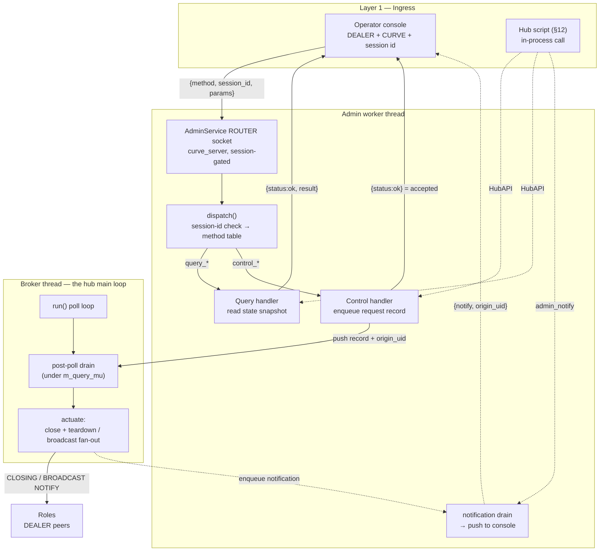

#### 11.0.2 Why a separate plane — operator console vs role plane

The hub exposes **two** `ROUTER` planes, and they are deliberately separate
sockets serving different callers. Both are `ROUTER`/`DEALER`, but that
shared socket *type* is where the similarity ends: the admin plane is not
"the broker plane with different messages" — it is a different kind of
channel with a different trust model, session model, and purpose.

| | **Broker `ROUTER`** (role plane) | **Admin `ROUTER`** (operator console) |
|---|---|---|
| Peers | Many roles, each a `DEALER`, admitted continuously | One operator `DEALER` console, one persistent session |
| Who talks | Data-plane roles — producers / consumers / processors | The operator (a human or a CLI tool) |
| Session model | Stateless per-request admission of many peers | A single stateful session: establish once, stream commands + notifications |
| Message form | Typed `WireEnvelope` (`REG_REQ`, `ATTACH_REQ`, …) | Typed `WireEnvelope` (`ADMIN_HELLO_REQ`, `ADMIN_*`, …) — same envelope, admin `msg_type`s (§11.1) |
| Auth model | CURVE **+ ZAP key allowlist** — only known roles are admitted | CURVE crypto-only **+ sealed session id** — token once at establishment, no key gating |
| Traffic profile | Continuous, high-volume control for the data plane | Rare, low-volume operator commands + event notifications |

Three reasons the hub keeps these as distinct planes rather than one:

1. **Different trust model.** Roles are gatekept by *key*: the broker's ZAP
   handler admits only pubkeys on the known-role allowlist (HEP-CORE-0036 §7.4,
   HEP-CORE-0035). The operator is gatekept by *secret*: any well-formed
   CURVE client may connect, and authority is the admin token (once, at
   session establishment) and thereafter the sealed session id (§11.0.5). A
   single socket cannot cleanly enforce both a key allowlist and a
   session-secret gate.
2. **Different session and purpose.** The role plane admits many
   independent data-plane peers with no per-peer session state. The console
   is one long-lived operator session with server-minted identity and a
   bidirectional command+notification stream. Folding operator control onto
   the role `ROUTER` would entangle operator session identity with role
   admission and interleave operator commands with the data-plane fan-out.
3. **Isolation from the single-pumper handler.** The broker owns exactly
   one inproc ZAP handler (HEP-CORE-0036 §7.4 single-pumper). Placing the operator surface
   on its own `ROUTER` socket, authenticated by CURVE crypto alone (§11.1),
   keeps admin traffic entirely off that handler — an operator command can
   neither be gated by nor perturb the role data plane's ZAP pump.

The two planes **diverge at ingress and transport but converge at
actuation** (§11.0.1): a role-driven channel close and an operator-driven
`close_channel` end up in the same broker request queue, drained by the
same broker loop. Two front doors, one engine room.

#### 11.0.3 Thread model

Three threads participate; the hand-offs between them are the load-bearing
part of the contract.

| Thread | Owns | Admin-path responsibility |
|---|---|---|
| **Admin worker** (`"admin"`, spawned by `HubHost` via `ThreadManager`) | the `AdminService` `ROUTER` socket | Layers 1–3 + 6: recv, dispatch, session-id check, **query reads**, **control enqueue**, and **drains the reverse notification queue** to push console notifications. Never actuates. |
| **Broker** (`"broker"`, spawned by `HubHost` via `ThreadManager`) | the broker `ROUTER` + hub registry | Layers 4–5: drains the request queues in its post-poll phase and actuates. The only thread that mutates channel/registry state; enqueues completion notifications back to the admin thread. |
| **Script worker** (`HubScriptRunner`, present only when a script is loaded, §12) | the script engine | An *alternate* ingress: its `HubAPI` calls enqueue to the same broker queues (control), read snapshots (query augmentation), or enqueue console notifications (`admin_notify`). |

Hand-off rules — the load-bearing invariant is **one thread owns each
socket; every other thread reaches it only through a queue**:

- **Control is a cross-thread enqueue (forward).** A control handler on the
  admin thread pushes a record onto a broker-owned queue guarded by that
  queue's mutex, then returns. The broker thread drains it on its next loop
  iteration. The admin thread and broker thread never touch each other's
  sockets.
- **Notification is a cross-thread enqueue (reverse).** The broker thread
  (on actuation) and the script worker (`admin_notify`) push notification
  records onto an **admin-thread-owned** queue; the admin worker drains it
  and pushes over its `ROUTER`. Symmetric to the forward path — the admin
  thread owns the console socket, so all notification senders enqueue rather
  than write the socket directly.
- **Query is a cross-thread snapshot read.** A query handler on the admin
  thread takes a consistent snapshot of hub state; the broker serializes
  registry reads/writes under `m_query_mu` so the snapshot is coherent
  against concurrent broker mutation.
- **Actuation latency is bounded by one poll interval.** Enqueue does not
  wake the broker poll; queued work is actuated on the next tick. This is
  acceptable for operator-cadence commands and is an explicit property, not
  an accident.

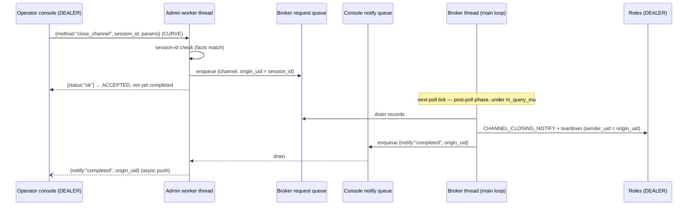

#### 11.0.4 Data-format contract

The admin path uses **two** representations: the typed `WireEnvelope`
(HEP-CORE-0046 §14) on the wire, and a typed record on the internal queue.
They are deliberately distinct — the wire form is the operator contract; the
queue form is the broker's internal work item. Every wire message travels
CURVE-encrypted (§11.1).

The JSON shown below is the **logical field content** of each message, not a
raw JSON wire frame: on the wire each is a typed envelope whose `msg_type` is
the admin verb (e.g. `ADMIN_CLOSE_CHANNEL_REQ`) and whose typed body carries
these fields, with `correlation_id` matching a response to its command and
`_NOTIFY`-suffixed types exempt from correlation. Concrete admin `msg_type`s
and `wire_bodies` bodies are defined during implementation (the first typed
pathway, §11.1).

**Wire — establish (operator → console, once per session):**

```json
{ "token": "<64-hex admin token>", "label": "<operator label>" }
→ { "status": "ok", "session_id": "<opaque sealed id>" }
```

The raw token appears only here; every later message presents the
`session_id` instead (§11.0.5).

**Wire — command (operator → console):**

```json
{ "method": "<name>", "session_id": "<opaque sealed id>", "params": { ... } }
```

`method` and `session_id` are required; `params` is method-specific and may
be absent.

**Wire — response (console → operator):**

```json
{ "status": "ok",    "result": <any> }
{ "status": "error", "error": { "code": "<catalog code>", "message": "<text>" } }
```

`error.code` is drawn from the finite, wire-stable catalog in §11.5.

**Wire — notification (console → operator, unsolicited):**

```json
{ "notify": "<topic>", "origin_uid": "<stamp>", ... }
```

Pushed by the reverse path (§11.0.1 layer 6): control-command completion and
hub events. `origin_uid` names what caused it (§11.0.5).

**Internal — queue record (admin/script thread → broker thread):** a
control method translates its `params` into a minimal typed record and
enqueues it. Every record carries an `origin_uid` — the provenance stamp of
the issuing session (§11.0.5) — which the broker uses as the `sender_uid` on
the resulting `NOTIFY` and as the log tag for the whole actuation cascade.

| Control method | Queue record |
|---|---|
| `close_channel` | `{ channel, origin_uid }` |
| `broadcast_channel` | `{ channel, message, data, origin_uid }` |

**Actuation output (broker → roles, over `ROUTER`):** the drained record
becomes a role-plane `NOTIFY` — `CHANNEL_CLOSING_NOTIFY` + teardown for a
close, `CHANNEL_BROADCAST_SEND_NOTIFY` for a broadcast — stamped with
`sender_uid = origin_uid` (the issuing session for an operator command; the
`script:` or hub tag otherwise, §11.0.5).

**Response semantics — the key promise.** The two method kinds mean
different things by `{"status":"ok"}`:

- **Query `ok`** — the `result` is the answer, computed synchronously; the
  read has already happened.
- **Control `ok`** — the command **passed synchronous validation** (target
  exists, params well-formed) and the actuation was **accepted and
  enqueued**; it has **not** necessarily *completed* (there is no completion
  acknowledgement — observe the effect via a subsequent query or the
  role-plane `NOTIFY`). Commands the hub can reject up front do so
  synchronously with a typed `ADMIN_ERROR`: e.g. `close_channel` on an
  unregistered channel returns `not_found` (§11.5), never `ok`. So `ok` is
  a promise of *acceptance*, not completion — but it is never returned for a
  request the hub already knows it cannot satisfy.

#### 11.0.5 Provenance & session identity

Every admin action carries a provenance stamp — *who caused this* — that
flows onto the actuation, the resulting `NOTIFY`, and every log line the
action produces. Provenance is not decorative: it is the audit record of
who changed the hub, and it is the identity a future privilege model will
attach permissions to.

**Session identity — minted at the auth gate, bound to the connection.**
When an operator console establishes its session, the token is verified
**once** (constant-time, §11.3). On success the hub **mints a session id**
and returns it to the operator. The session id:

- Embeds a human label (operator-supplied, e.g. `alice-laptop`) plus the
  hub-observed connection facts: peer address, routing identity, and connect
  time.
- Is **sealed — encrypted *and* authenticated in one AEAD operation
  (libsodium `secretbox`) — with the hub's own per-instance secret key**
  (held in the security subsystem, HEP-CORE-0043; never leaves the hub). The
  seal makes the id **fully opaque**: only this hub instance can decode it,
  no one else can read the embedded facts, and it cannot be forged or
  tampered with. The key is per-instance, so a session id is meaningless to
  any other hub and is naturally invalidated when the hub restarts.
  - *Key home + use-not-export.* The sealing key is a 32-byte symmetric
    secret minted at admin-console startup via `secure().random_bytes` and
    stored in the KeyStore under the canonical name **`admin.session.seal`**
    (`add_raw`). Because `secretbox` takes a raw key (unlike the
    name-citing `box_*_using`), the seal/unseal paths obtain the key with
    `KeyStore::lookup_raw` and pass the span **directly** into
    `secretbox_encrypt`/`_decrypt` within the same statement — the bytes are
    never copied into an owning buffer, logged, or retained past the call, so
    the use-not-export contract (HEP-CORE-0043 §1.4) holds even for this
    raw-key path.
- **Replaces the token on every subsequent message** — the raw admin token
  crosses the wire exactly once, at establishment; thereafter the operator
  presents only the opaque sealed session id.

On every message the hub opens the seal (decrypt + authenticate) **and**
checks that the facts it embeds match the facts the message actually arrived
with (routing identity + peer address). A tampered or foreign-hub id fails
to open; a genuine id replayed from a different connection opens but fails
the fact match. Either way the message is rejected. This is
defence-in-depth over the transport, which already binds each connection to
the client's CURVE keypair — the ROUTER rejects a duplicate routing-id
claim, so cross-connection injection is impossible at the wire level before
the id check even runs.

The client CURVE public key is deliberately **not** part of the fact set:
libzmq surfaces it to the application only through a ZAP handler, and the
admin plane runs crypto-only, off the HEP-CORE-0036 §7.4 single-pumper (§11.0.2, §11.1).
Peer address + routing identity are sufficient because the transport already
guarantees connection-to-keypair binding. Making the pubkey itself an
admin *identity* means giving admin its own ZAP domain — a coupled future
step (with the `known_admins` allowlist), not a free addition.

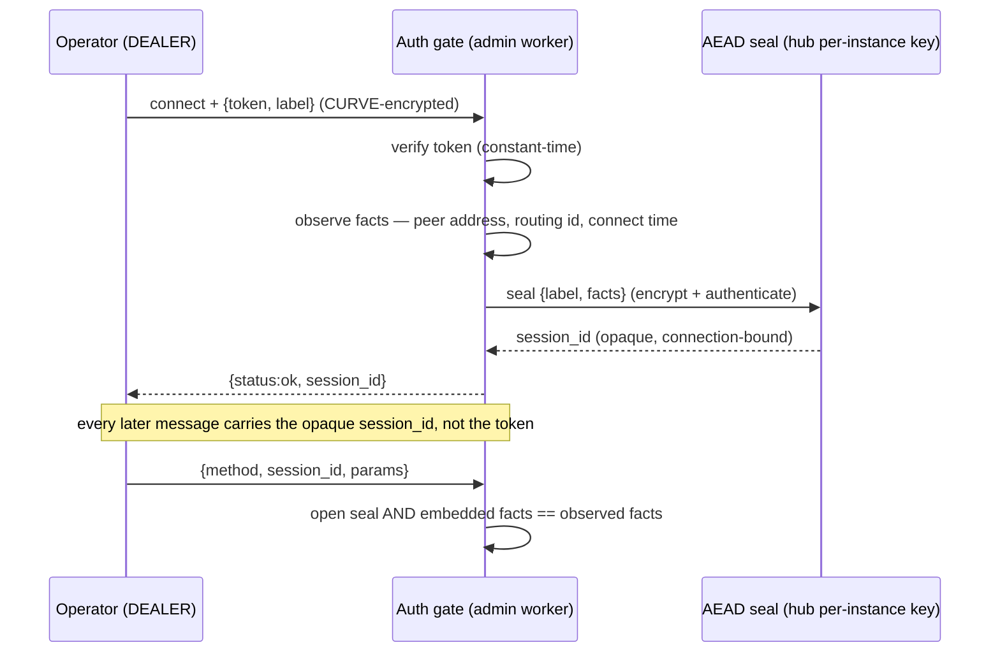

**Provenance stamping — the whole causal cascade is attributed.** A control
command's queue record (§11.0.4) carries an `origin_uid` field, set to the
issuing session id on the admin thread. When the broker begins actuating
that record it sets a scoped "current actuation origin" for the duration, so
every log line and every `NOTIFY` in the resulting cascade inherits the
origin automatically — without threading the id through every teardown call.
When the record is finished, the origin reverts to hub-internal.

Concretely: an operator close of a channel with pending consumers stamps the
*whole* teardown — the `CHANNEL_CLOSING_NOTIFY`, the producer-disconnect,
and the denials of every pending attach — with that operator's session id.
The audit trail reads "operator *alice* closed the channel, which denied
consumers *X* and *Y*," not an anonymous "channel closed."

**Origin taxonomy.** Every stamp resolves to exactly one of:

| Origin | Stamp | Meaning |
|---|---|---|
| Operator | the session id | an external console command (self-identifying, connection-bound) |
| Hub script | `script:<name>@<hub_uid>` | a §12 script action; the `hub_uid` disambiguates when several hubs share one log stream |
| Framework | `<hub_uid>` | a hub-internal action with no external cause |

**Authorization is flat today.** Any operator holding the admin token, once
authenticated, is a full admin — every §11.2 method is permitted. A
privilege model — *which* operator may perform *which* actions — is future
work (§11.0.6). It builds directly on the session identity above: the
per-session operator identity is precisely the subject a capability or role
check will be evaluated against. Provenance is therefore a prerequisite that
is being laid now, ahead of the authorization layer that will consume it.

#### 11.0.6 Deferred refinements

These are intentionally out of scope for the current surface and layer on
top of the framework above without changing it:

- **Per-operator privilege (authorization).** Any authenticated operator is
  a full admin today (§11.0.5). A capability/role model — *which* operator
  may invoke *which* method — is future work that evaluates against the
  per-session operator identity already established by provenance. It layers
  on without changing the flow.
- **Pubkey-based operator identity.** Binding operator identity to the
  client CURVE public key (a `known_admins` allowlist) requires giving admin
  its own ZAP domain, which re-touches the HEP-CORE-0036 §7.4 single-pumper (§11.0.5).
  Coupled future step, not free.
(The "typed wire envelope" that earlier drafts listed here as deferred is no
longer deferred — the console is built native on the typed `WireEnvelope`
from the start (§11.1), making the admin path the first fully-typed pathway
and the reference for task #57.)

### 11.1 Transport

The admin plane is a **CURVE-secured operator console**: a persistent,
bidirectional session over which the operator sends commands and the hub
returns both replies *and* unsolicited notifications. It is CURVE-secured
like every other hub interface (broker↔role, role↔role); it is not a
plaintext exception.

- **`ROUTER` socket** at `admin.endpoint` (default `tcp://127.0.0.1:5600`),
  configured as a **`curve_server`** keyed with the hub's **broker CURVE
  keypair** — the same server identity every role already trusts
  (`HubVault::broker_curve_secret_key()` / `_public_key()`). The admin
  transport reuses the hub's existing keypair; there is no separate admin
  keypair. The operator connects a **`DEALER`** console that stays connected
  for the life of the session. `ROUTER`/`DEALER` — not `REQ`/`REP` — because
  the hub must push notifications to the console at any time, not only in
  reply to a command (the reverse path, §11.0.1).
- The operator connects with its own (ephemeral) CURVE keypair and pins the
  hub's broker public key as `curve_serverkey`. This authenticates the
  *server* to the operator — an impostor lacking the broker secret key fails
  the CURVE handshake — and **encrypts the entire exchange**, so the admin
  token (§11.3) and the session id (§11.0.5) never cross the wire in
  cleartext, on loopback or network.
- The admin socket is **not ZAP-gated**: client identity is not gatekept by
  key (any well-formed CURVE client obtains an encrypted channel; authority
  is the token at establishment, then the sealed session id per message,
  §11.0.5). To keep it off the broker's single inproc ZAP handler (HEP-CORE-0036 §7.4
  single-pumper), it sets **`ZMQ_ZAP_ENFORCE_DOMAIN = 1`** with an empty
  `zap_domain`. An empty domain *alone* does not suffice: libzmq's
  `zap_enforce_domain` defaults to `false`, so `curve_server` still invokes
  ZAP for an empty domain (`zap_required() || !zap_enforce_domain`), and the
  in-process ZapRouter would reject the handshake ("no domain registered for
  `''`"). Setting `zap_enforce_domain=1` short-circuits the ZAP path so the
  socket authenticates by CURVE crypto alone — preserving the HEP-CORE-0036 §7.4
  invariant. This is a socket property, independent of socket type: it holds
  identically for the `ROUTER` console.
- **Bidirectional message set**, all over the one console session:
  - *establish* — `{ "token", "label" }` → `{ "status":"ok", "session_id" }`
    (§11.0.5). The raw token is sent only here.
  - *command* — `{ "method", "session_id", "params" }` →
    `{ "status", "result"|"error" }`.
  - *notification* (hub → console, unsolicited) —
    `{ "notify":"<topic>", "origin_uid", ... }`. Completion of a control
    command and hub events arrive this way (§11.0.3).
- The console carries the **typed `WireEnvelope`** (HEP-CORE-0046 §14) — the
  same 5-frame control-plane envelope the role plane uses — with **new admin
  `msg_type`s and `wire_bodies` bodies**. There is no JSON
  `{method,token,params}` REP surface. The admin path is deliberately the
  **first fully-typed pathway** in the hub: it is built native on the typed
  envelope with no `to_legacy` down-conversion, so it doubles as the
  reference implementation for the broader JSON→typed migration
  (**task #57 / HEP-CORE-0046 Phase B**, which converts the broker REG-family
  handlers). Commands, responses, and notifications are all typed envelopes;
  the logical field content is as shown in §11.0.4.

> **Implementation status.** The `ROUTER` typed console is **shipped**:
> `AdminService::run()` binds a `curve_server` `ROUTER` (`zap_enforce_domain=1`,
> off the HEP-CORE-0036 §7.4 single-pumper, armed via the shared `arm_curve_server` helper),
> receives typed `WireEnvelope`s, dispatches by `msg_type` after
> `verify_session_id` against the observed connection facts, and replies with
> `build_router_send`. The sealed session identity (§11.0.5) is in
> `admin_session.{hpp,cpp}`; the typed bodies for all methods are in
> `wire_bodies.hpp`; the operator side is exercised by `AdminWireClient`
> (`test_admin_service`, 8/8 over a real started hub). The old `REP` +
> `{method,token,params}` surface is retired.
>
> **Not yet implemented** (tracked in `docs/todo/AUTH_TODO.md` Line E):
> the **reverse notification path** (§11.0.1 layer 6 — command-completion and
> hub-event pushes; the console currently answers commands but does not yet
> push notifications), and **`origin_uid` provenance** (§11.0.5 — the session
> id is minted and used for the session gate, but is not yet threaded into the
> broker request records, so actuations are not yet stamped with it).
>
> **Control-command semantics — resolved 2026-07-19** (CURVE-integration
> review): control commands **validate synchronously** — `close_channel` on
> an unregistered channel returns `not_found`, not a silent `ok` — and `ok`
> means *accepted*, not completed. §11.0.4 now states this; the handler and
> the console test match it.

```mermaid
sequenceDiagram
    participant OP as Operator console<br/>(DEALER, ephemeral CURVE key)
    participant AD as AdminService<br/>(ROUTER, curve_server = broker key)
    participant HB as Hub (broker / state)

    OP->>AD: CURVE handshake (serverkey = broker pubkey)
    note over OP,AD: fails silently if serverkey wrong;<br/>channel encrypted once established

    OP->>AD: establish {token, label}  (encrypted)
    AD-->>OP: {status:ok, session_id}  (sealed, connection-bound)

    OP->>AD: {method, session_id, params}  (encrypted)
    alt bad session id / facts mismatch
        AD-->>OP: {status:error, code:unauthorized}
    else query_*
        AD->>HB: snapshot read
        HB-->>AD: data
        AD-->>OP: {status:ok, result}
    else control_*
        AD->>HB: enqueue {…, origin_uid = session_id}
        AD-->>OP: {status:ok}  (accepted)
        HB--)OP: {notify:"completed", origin_uid, …}  (async, after actuation)
    end
```


### 11.2 Methods (v1)

**Query**: `list_channels`, `get_channel`, `list_roles`, `get_role`,
`list_bands`, `list_peers`, `query_metrics`, `list_known_roles`.

**Control**: `close_channel`, `broadcast_channel`, `revoke_role`,
`add_known_role`, `remove_known_role`, `reload_config`, `request_shutdown`.

**No remote eval surface.** Earlier drafts of this section listed an
`exec_python` admin RPC for arbitrary script-side code execution.
That entry was removed entirely — the hub deliberately accepts no
arbitrary executable code over the wire.  Operator scripting access
is provided via the future Python SDK (composes structured admin
RPCs locally on the operator's host); see §17 "No remote code
injection" for the policy.

### 11.3 Authorization

The admin token is the sole authority for **establishing** an admin session,
and it is **mandatory** — there is no token-less admin path.  The token is a
random 256-bit secret minted at vault creation (`generate_admin_token()`)
and held in the vault in a slot distinct from the broker CURVE keypair.

- At session establishment the presented `"token"` is compared
  **constant-time** against the vault admin token; missing / wrong-size /
  mismatched → `{"status": "error", "error": {"code": "unauthorized"}}`.
  On success the hub mints the sealed session id (§11.0.5); **every
  subsequent message authorizes by that session id, not the token**, so the
  raw token crosses the wire only once.
- Because the §11.1 transport is CURVE-encrypted, both the token (at
  establishment) and the session id (thereafter) travel encrypted end to
  end; a network eavesdropper cannot capture either.  A non-loopback bind is
  therefore no longer a security hazard.  **Loopback remains the default**
  bind (defense-in-depth); a network bind is an explicit operator opt-in.

This is a **shared-secret** authority model: any operator holding the admin
token can establish a session, and revocation is token rotation (which
invalidates all consoles at once).  The session establishes a per-operator
*identity* (§11.0.5); what that model does **not** yet carry is per-operator
*privilege* and per-operator *revocation* — a capability model (§11.0.6) and
a client-pubkey `known_admins` allowlist (admitted via a dedicated
`zap_domain`, which re-touches the HEP-CORE-0036 §7.4 single-pumper) are the future
expansions that layer on top *without* removing the token gate.

### 11.4 Files

- `src/include/utils/admin_service.hpp`, `src/utils/ipc/admin_service.cpp`.

  Implementation lives under `src/utils/ipc/` (not `src/utils/service/`)
  so that the two REP-socket-owning hub subsystems — `BrokerService`
  and `AdminService` — sit side-by-side.  `src/utils/service/` is
  reserved for owned-services that are not transport-bound (HubHost,
  HubVault, ThreadManager, etc.).

### 11.5 Error code catalog

Every non-`ok` admin RPC response carries `error.code` from this
finite set.  Codes are stable wire constants — once shipped, a code
NEVER changes meaning across versions.  New codes append-only.

| Code               | When                                                                                            | Per-method                                     |
|--------------------|-------------------------------------------------------------------------------------------------|------------------------------------------------|
| `unauthorized`     | `token` is missing / wrong size / mismatched (the token gate is mandatory, §11.3)               | Any method                                     |
| `unknown_method`   | Method name is not in §11.2                                                                     | Any                                            |
| `invalid_request`  | Top-level frame is not a JSON object, or `method` field missing/non-string                      | Any                                            |
| `invalid_params`   | `params` is missing a required field, has the wrong type, or fails validation                   | All `get_*` (missing key); control methods     |
| `not_found`        | The requested entity (channel, role, band, peer) does not exist in `HubState`                   | `get_channel`, `get_role`, `close_channel`, `broadcast_channel`, `revoke_role` |
| `conflict`         | Operation refused because the target is in a state that disallows it (e.g. close on draining)   | `close_channel`, `request_shutdown` (already shutting down) |
| `policy_rejected`  | A veto hook (script callback or connection policy) refused the operation                        | `close_channel`, `add_known_role`, `revoke_role` |
| `not_implemented`  | Method is on the §11.2 list but not yet wired in this build (deferred per §16 / HEP-0035)         | `revoke_role`, `reload_config`, `add/remove/list_known_roles` |
| `internal`         | Caught exception in dispatch path that is not one of the above                                  | Any (last-resort)                              |

All response bodies follow the §11.1 envelope:
```json
{ "status": "error", "error": { "code": "<one-of-above>", "message": "<human readable>" } }
```

The `message` field is for diagnostics only; tooling matches on
`code`.  Tests pin `code` first, then optionally a substring of
`message` per the audit Class A path-discrimination rule (`CLAUDE.md`
§ "Testing Practice (Mandatory)").

## 12. Script callbacks + `HubAPI`

### 12.1 Engine

`HubHost` owns `std::unique_ptr<scripting::ScriptEngine>` (null if no script).
Runs on its own thread with the cross-thread dispatch pattern roles use.
Engine factory: `scripting::make_engine_from_script_config(cfg.script())`.

### 12.2 Callbacks (all optional; default = no-op / unmodified response)

**Design principle.**  The hub's default protocol is complete on its own.
Internal bookkeeping (channel maps, role tables, broker counters,
default response building) always runs to completion on the receiving
thread (admin/broker) before any script callback fires.  Script
callbacks are purely additive: they observe events that have already
happened, or they augment a response that has already been built.
Scripts cannot veto, reject, or modify the underlying action —
without any script provided (even with the engine running) the hub
operates correctly under its default protocol.

#### 12.2.1 Event observers (fire-and-forget)

Posted from the receiving thread as `IncomingMessage` after bookkeeping
completes; drained on the worker thread's main loop and dispatched as
`engine.invoke("on_" + event, details)`.  No reply path; the
receiving thread never blocks.

The signatures below are conceptual — they list the data each event
carries.  Per §12.4.1 the engines pass it differently:

- **Python**: kwargs unpack (`fn(**details)`).  `api` is a module
  global (NOT a positional arg) for these callbacks.  Script
  signature is the keys verbatim, e.g.
  `def on_channel_closed(name): ...`.
- **Lua**: one positional table arg.  `api` is a Lua global.
  Script signature `function on_channel_closed(args) ... end` and
  the data is reachable as `args.name`.
- **Special-cased lifecycle pair**: `on_init(api)` and `on_stop(api)`
  receive `api` as a positional argument (matches the role-side
  convention via `engine.invoke_on_init` / `_on_stop`).  `on_tick`
  is dispatched via `engine.invoke("on_tick")` with no args, so its
  Python signature is `def on_tick():` (api as module global).

Conceptual signatures (data contract — see above for actual call shape):

- **Lifecycle**: `on_start(api)`, `on_tick()`, `on_stop(api)`.
- **Role events**: `on_role_registered(role_info)`,
  `on_role_closed(role_info)`.
- **Channel events**: `on_channel_opened(channel_info)`,
  `on_channel_closed(name)`.
- **Band events** (HEP-0030): `on_band_joined(band, member_uid)`,
  `on_band_left(band, member_uid)`.
- **Federation events**: `on_peer_connected(peer_uid)`,
  `on_peer_disconnected(peer_uid, reason)`.

#### 12.2.2 Response augmentation hooks (sync; mutate prepared response)

For request/response RPCs the receiving thread:

1. Builds the default response from `HubState` / broker state (existing
   inline path — unchanged).
2. If a script handler is registered for the method, calls
   `engine.invoke_returning("on_" + method, {params, response})`.
   The engine routes the call to the worker thread's main-loop drain
   (§12.4).  The worker invokes the callback, which mutates `response`
   in place; the call returns the (possibly mutated) response back to
   the receiving thread via `std::future`.
3. Ships the response on the wire.

Without a registered handler step 2 is skipped; the default response
goes out unchanged.

Augmentation hooks defined in this phase.  The "callback args" column
lists the JSON keys the engine passes; per §12.4.1 Python unpacks
these as kwargs (so the script signature is the keys verbatim, no
positional `api` — it's a module global), Lua receives them as one
positional table.

| Callback name | Trigger | Callback args (JSON keys) | Mutable response shape | Status |
|---|---|---|---|---|
| `on_query_metrics` | admin `query_metrics` RPC | `params`, `response` | metrics dict | ✅ wired |
| `on_list_roles` | admin `list_roles` RPC | `response` | role list | ✅ wired |
| `on_get_channel` | admin `get_channel` RPC | `name`, `response` | channel dict / `null` | ✅ wired |
| `on_peer_message` | broker `HUB_TARGETED_MSG` peer wire | `peer_uid`, `msg`, `response` | reply payload | ⏸  Deferred — requires `HUB_TARGETED_ACK` wire frame addition (§13).  C++ surface (`HubAPI::augment_peer_message` + `BrokerService::Config::on_peer_message_augment`) is in place; the broker-side wiring is a one-line follow-up when the wire frame lands. |

The set is open to extension per RPC as needed; each addition is a
new row here plus a wiring point in `HubAPI::augment_*`.

**Mutation contract — script MUST return the response.**  The
engine captures the script function's *return value* (not the post-
call state of any kwarg).  Mutating the response argument in place
WITHOUT returning it is a footgun: the mutation lands on the
engine-side transient copy, but C++ ships the *default* response
because the function returned `None`/`nil` (treated as "keep the
default").

```python
# ✅ CORRECT — return the (possibly mutated) response
def on_query_metrics(params, response):
    response["custom"] = compute()
    return response

# ✅ ALSO CORRECT — build a new response object
def on_query_metrics(params, response):
    return {**response, "custom": compute()}

# ❌ WRONG — mutation is silently lost; default response ships
def on_query_metrics(params, response):
    response["custom"] = compute()
    # missing return — implicit None means "keep the default"
```

Lua follows the same rule:

```lua
function on_query_metrics(args)
    args.response.custom = compute()
    return args.response                  -- MUST return
end
```

`on_tick`-cached state is the natural source for augmentation
callbacks: heavy periodic computation runs on the worker thread on its
own pace, the augmentation hook does only the cheap merge.  Both
callbacks fire on the same worker thread → same `lua_State` / same
Python globals → no synchronization needed.

#### 12.2.3 User-posted events (`api.post_event`)

Scripts may inject their own events into the worker's queue via
`api.post_event(name, data)` — callable from **any thread**
(`on_tick`, an event observer, an out-of-band server thread, etc.).
The worker drains the event in its main loop and dispatches it as
`engine.invoke("on_app_" + name, data)`.  No reply path; the caller
returns immediately after enqueue (fire-and-forget, identical
semantics to broker-posted built-in events).

Naming rules:
- The `name` argument is the suffix only — `app_` is prepended by
  the hub.  Calling `api.post_event("my_event", ...)` fires
  `on_app_my_event(api, data)`.  Reserved namespace prevents
  collision with built-in event handlers (`on_channel_closed`,
  `on_role_registered`, …).
- `name` must satisfy the identifier grammar in Appendix G2.2.0b
  (alphanumeric + underscore, leading letter/underscore).  Invalid
  names raise on the call site; the queue is never polluted.

Use cases:
- Out-of-band server (Flask, etc.) signaling that a request needs
  W-side handling — see §12.5.3.
- Internal cross-thread fan-out from a script-spawned worker.
- Self-scheduling: a callback posts `app_followup` to itself for
  deferred processing on the next loop iteration.

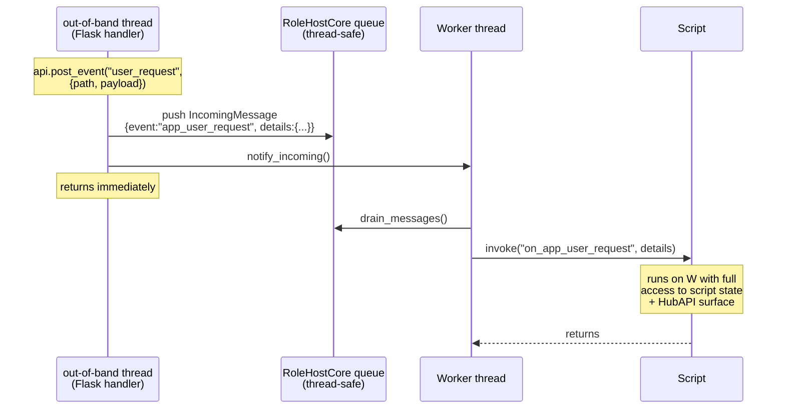

`post_event` is fire-and-forget. If the caller needs a response
(e.g. Flask wants to wait for W to finish processing before replying
to its HTTP client), the script must build that handshake in script
code — for example, the Flask handler creates a `threading.Event`,
stashes it in a dict keyed by a request id, posts the event, and
waits on the `threading.Event`; `on_app_user_request` does its work
and signals the `threading.Event` to wake Flask.  This kind of
hand-built handshake is encouraged to live entirely in script code,
not as a hub primitive — it keeps the engine API surface small and
keeps the engine re-entry rule (§12.5.2) intact (Flask never calls
back into the engine; it only waits on a Python primitive).

#### 12.2.4 Error handling

Script exceptions caught; `stop_on_script_error: true` promotes to fatal
(same as role side).  For augmentation hooks specifically, an
exception in the callback leaves the prepared default response
unchanged and the wire reply ships normally; the error is logged and
counted under `script_errors_`.

### 12.3 `HubAPI` surface (bound into Python + Lua)

**Primary read primitive (per HEP-CORE-0039):** `snapshot()` —
returns a `std::shared_ptr<HubSnapshot>` (a point-in-time wrapper
over `HubStateSnapshot`).  The wrapper exposes per-aspect queries
(`list_channels`, `get_channel`, `list_roles`, `get_role`,
`list_bands`, `get_band`, `list_peers`, `get_peer`, `list_shm_blocks`,
`get_shm_block`), aggregates (`health_summary`,
`channel_state_distribution`), counts (`count_channels_in_state`),
and metrics (`query_metrics(filter)`).  Scripts that need a
coherent multi-aspect view obtain one snapshot and query it
multiple times — guaranteed self-consistent.  See HEP-CORE-0039 §3
for the full Layer-3 method set.

Single-aspect convenience read methods: `list_channels`,
`get_channel`, `list_roles`, `get_role`, `list_bands`, `get_band`,
`list_peers`, `get_peer`, `query_metrics`.  Each takes its own
internal snapshot and is suitable when the caller only wants one
aspect; for multi-aspect coherence, prefer `snapshot()`.

Non-snapshot read: `config`, `uid`, `name`.

Control: `close_channel`, `broadcast_channel`, `revoke_role`, `add_known_role`,
`remove_known_role`, `request_shutdown`.

Events: `post_event(name, data)` — fire-and-forget enqueue of a user
event onto the worker's queue (§12.2.3); thread-safe, callable from
any context.

All methods resolve via `HubHost` accessors; scripts never touch
`BrokerService` directly. Pybind11 bindings live in
`src/scripting/hub/hub_api.cpp`.

### 12.4 Dispatch model — single worker thread, event + tick gated by `LoopTimingPolicy`

Implementation: `HubScriptRunner::worker_main_` (`src/utils/service/hub_script_runner.cpp`).

**One worker thread per hub instance.** Owns the engine's primary state
(GIL for Python, primary `lua_State` for Lua). All script callbacks
dispatched from the loop run on this thread, synchronously,
sequentially. There is no side-thread, worker pool, or timer thread —
`on_tick` is just another sequential callback inside the loop body.

The loop body, post-Phase-7-D-track:

```cpp
// Initialize once before the loop (period from cfg.timing()).
deadline = is_max_rate
    ? Clock::time_point::max()
    : Clock::now() + period;

while (is_running() && !shutdown_requested()) {
    cycle_start = Clock::now();

    // 1. Drain & dispatch events (channel/role/band/peer/...).
    auto events = core().drain_messages();
    for (auto &e : events)
        api().dispatch_event(e);  // engine.invoke("on_" + e.event, e.details)

    // 2. Drain pending augmentation requests queued by admin/broker
    //    threads via engine.invoke_returning(name, {params, response}).
    //    Each pending request: invoke callback, set caller's future
    //    with the (possibly mutated) response.
    engine().process_pending();

    // 3. Tick gate — uses post-events `now`, NOT cycle_start.
    const auto now = Clock::now();
    if (is_max_rate || (deadline != max && now >= deadline)) {
        api().dispatch_tick();    // engine.invoke("on_tick")
        // Advance deadline ONLY when the tick fires.
        deadline = compute_next_deadline(policy, deadline, cycle_start, period_us);
    }

    // 4. Wait until next event, augmentation request, or deadline.
    wait_for_incoming(remain_to_deadline_or_zero);  // CV wait with timeout
}
```

**Wakeup sources** for `wait_for_incoming`:
- `notify_incoming()` from broker thread (an event was enqueued onto
  `RoleHostCore`'s message queue).
- `notify_incoming()` from admin/broker thread (an augmentation request
  was enqueued via `engine.invoke_returning`).
- `notify_incoming()` from `request_shutdown()`.
- Timeout — `remain_us / 1000 ms` until the deadline.

**`on_tick` contract:**

> `on_tick` fires once per period, deterministically, whenever the
> deadline has been crossed. The check is `now() >= deadline` *after*
> event-handler dispatch, so a long-running event handler that pushes
> past the deadline still triggers `on_tick` in the same iteration
> ("beyond timeout but called"). Events alone do not shift the
> `on_tick` schedule — they may extend the wait but cannot suppress
> ticks.

This required two changes from the literal role-side data-loop pattern
(which advances `compute_next_deadline` every iteration and gates on
`cycle_start`):

1. **Gate uses post-events `now`** rather than the pre-events
   `cycle_start`. A slow event handler that crossed the deadline
   mid-cycle still triggers `on_tick`.
2. **`compute_next_deadline` is invoked only when the tick fires.**
   Event-driven wakes that don't cross the deadline keep the schedule
   intact — the loop returns to wait for the original deadline.

**Policy interaction:**

| Policy | Behavior under bursty events |
|---|---|
| `MaxRate` | Tick fires every iteration unconditionally; `wait_for_incoming(0)` polls. CPU-bound. |
| `FixedRate` | Tick fires once per period. Long event handler pushing past the deadline → tick fires immediately after handler; `compute_next_deadline` resets to `now + period` (no catch-up). |
| `FixedRateWithCompensation` | Tick fires once per period, on the absolute grid (`prev_deadline + period`). After a long stall, missed slots fire in tight succession on resume — `wait_for_incoming(0)` returns immediately, gate fires, advance, gate fires, advance, … until `deadline > now` and the loop returns to normal pacing. |

**`on_<event>` callbacks** dispatch synchronously inside the
event-drain loop, before the tick gate. A burst arriving on the
broker thread is processed serially in one wake; the tick gate
evaluates exactly once per iteration after all events have run.

**No external eval surface.** Hub script callbacks fire only from
the worker thread's main loop — events, augmentation drain, and
tick.  No admin RPC, no network surface, no operator command can
inject code into the engine — see §17 "No remote code injection"
for the policy.  The engine's internal `eval` virtual remains a
C++ extensibility point but has no external trigger.

**Augmentation request transport.**  Admin and broker threads call
`engine.invoke_returning(name, {params, response}, timeout_ms)`; the
engine enqueues the request onto its internal pending-queue (PythonEngine
and LuaEngine both have a `request_queue_` + `std::future` pending-
drain shape — augmentation hooks share state with `on_tick` / event
observers via the worker thread's primary state).
The worker thread drains via `process_pending()` between the event
dispatch and tick gate (see loop body above).  The receiving thread
blocks on the future up to `timeout_ms` (default
`kDefaultAugmentTimeoutHeartbeats * kDefaultHeartbeatIntervalMs`,
overridable via `api.set_augment_timeout(ms)`); on expiry, status is
`InvokeStatus::TimedOut` and the receiver ships the default response.

#### 12.4.1 Engine-specific threading models for `invoke` family

The two production engines differ in how they handle non-owner-thread
calls into `invoke` / `eval` / `invoke_returning`.  This matters when
designing scripts and reasoning about state visibility, latency, and
GIL/lock contention.

**PythonEngine — single-state, queue + GIL.**

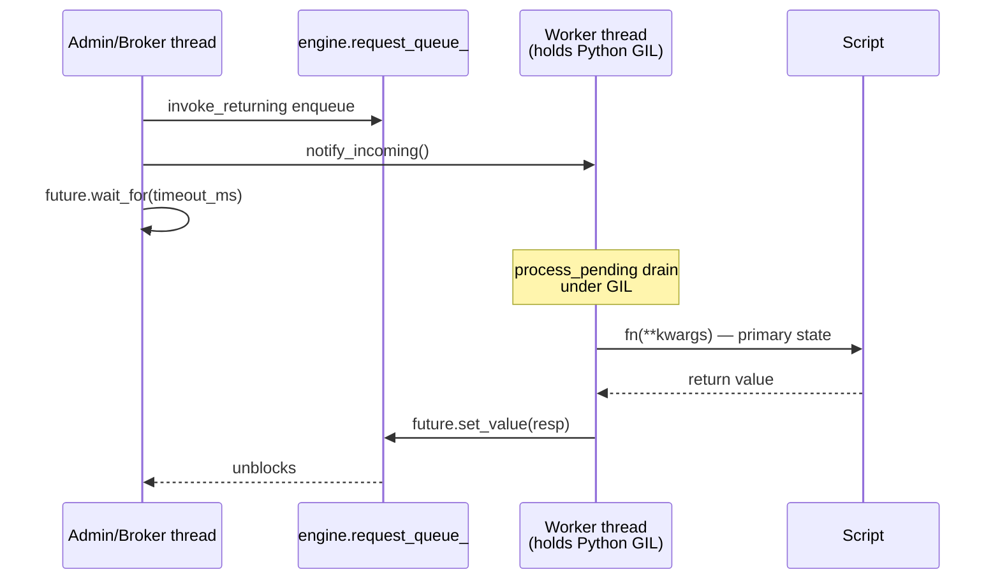

- **One** `py::scoped_interpreter`, one `lua_State`-equivalent global
  state for the whole engine.  All callbacks run on the worker
  thread; the GIL is held by the worker and only released during
  `wait_for_incoming`.
- Non-owner calls to `invoke`, `eval`, or `invoke_returning` queue
  to `request_queue_` and block on a `std::future`.  Worker drains
  them in `process_pending_()` after every owner-thread invoke (and
  in §12.4 step 2 of the main loop).
- All script state (module globals, `on_tick`-cached caches,
  user-spawned Flask threads' module references) live in a single
  Python interpreter — fully consistent.
- Latency cost: cross-thread call adds one CV wake + one queue +
  one future round-trip (≈100s of µs idle, ≈ event-loop iteration
  worst case).
- **Script signature convention**: the engine unpacks JSON `args`
  as Python keyword arguments (`fn(**kwargs)`).  The hub-side `api`
  object is exposed as a **module global** (set by
  `PythonEngine::build_api_(HubAPI&)` via `setattr(module, "api", …)`),
  so script callbacks omit `api` from their signature:
  ```python
  def on_query_metrics(params, response):
      response["custom"] = compute()  # api looked up as global
      return response
  ```
  The exception is `on_init` / `on_stop`, which receive `api` as a
  positional argument (matching the role-side convention) — see
  `hub_api_python.cpp` header.

**LuaEngine — multi-state for `invoke`, single-state for `invoke_returning`.**

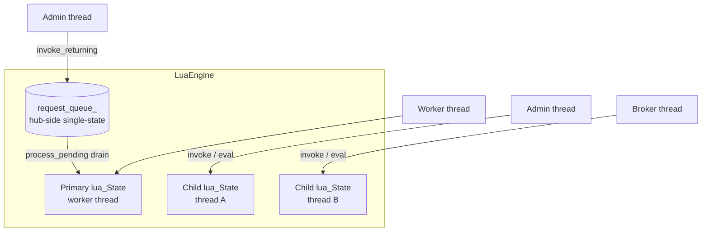

LuaEngine has two non-owner-thread paths, intentionally divergent
because role-side and hub-side use cases want different semantics:

- **`invoke(name)` / `invoke(name, args)` / `eval(code)`**: when
  called from a non-owner thread, LuaEngine creates a *child*
  `lua_State` (lazy, cached per `std::thread::id`) and runs the
  script in that isolated state.  This is the role-side hot path
  — admin RPCs / broker control frames hitting role engines need
  per-thread state isolation to avoid serializing on the worker.
  Each child state runs `load_script` independently, so the script
  body executes there as if the engine were single-threaded but
  per-thread.
- **`invoke_returning(name, args, timeout_ms)`**: hub-side
  augmentation hooks need to share state with `on_tick` / event
  observers running on the worker.  Child states have isolated
  globals — they can't see `custom_cache` populated by `on_tick`.
  So `invoke_returning` ALWAYS queues to the worker thread's
  primary state (same shape as PythonEngine's
  `request_queue_`).  Worker drains via `process_pending`.
- **Script signature convention**: invoke pushes `args` as a single
  positional Lua table; the script callback signature is one
  argument:
  ```lua
  function on_query_metrics(args)
      args.response.custom = compute()
      return args.response
  end
  ```
  The `api` table is exposed as a Lua **global** (set by
  `LuaEngine::build_api_(HubAPI&)` via `lua_setglobal(L, "api")`),
  so the callback can call `api.log(...)` / `api.list_roles()` from
  any context where the global is visible (worker thread sees the
  primary table; child states get their own copy via the same
  `build_api_` path during their own `load_script`).

**Consequences for script design.**

| Concern | Python | Lua |
|---|---|---|
| Worker-thread state visible to non-owner-thread `invoke`? | Yes (same interpreter, same module globals) | **No** — child state is fully isolated |
| Worker-thread state visible to `invoke_returning` augmentation hook? | Yes (same interpreter) | Yes (queued to worker thread, runs in primary state) |
| Out-of-band server (Flask, etc.)? | §12.5 supported pattern: spawn server thread in `on_start`, share state via module globals under GIL | Not supported — `lua_State` is single-thread; child-state path provides isolation, not sharing |
| Heavy `on_tick` work blocks `invoke_returning`? | Yes (GIL held) | Yes (worker thread is sole drain) |
| Heavy `on_tick` work blocks `invoke` from a non-owner thread? | Yes (GIL held) | **No** — child state runs independently in the calling thread |

The asymmetry is deliberate: roles and hub have different concurrency
profiles.  Roles benefit from per-thread isolation (parallel admin
queries on a producer); hub benefits from single-state coherence
(consistent view for augmentation hooks reading `on_tick` caches).
The dual-mode is implemented by routing `invoke_returning` through
a primary-state queue while plain `invoke` keeps its child-state
behaviour.

### 12.5 Out-of-band script-managed services (HTTP / WebSocket / etc.)

A hub script may spawn its own threads inside `on_start` to run
in-process services — most commonly an HTTP server (Flask, FastAPI,
aiohttp) for custom REST endpoints, but the same pattern applies to
any framework that runs under the Python GIL.  This is **not** a hub
feature; it is a documented and supported usage of the script
sandbox built on the existing thread-safety guarantees of `HubAPI`.

#### 12.5.1 Why this works without new hub plumbing

The script's threads end up structurally equivalent to the admin /
broker threads from the hub's point of view: non-W threads that read
shared script-side state and call into the thread-safe `HubAPI`
surface.  No new cross-thread invoke path is added, no future/queue
machinery is involved on the Flask path — the request handler is just
ordinary Python under the GIL doing dict reads and pybind11-bound
HubAPI calls.

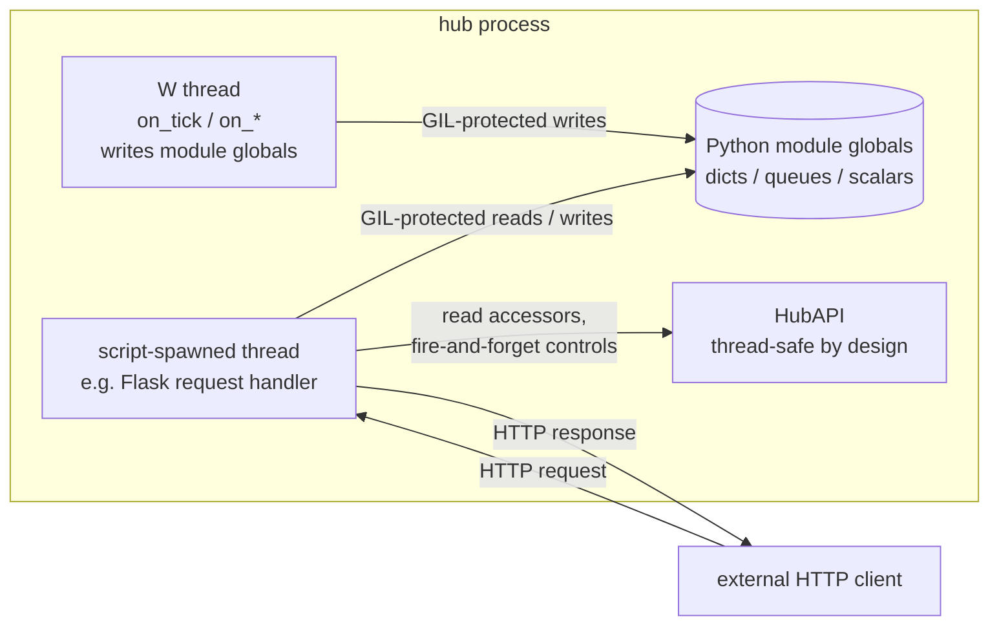

#### 12.5.2 The four-rule design contract

A script enabling out-of-band services accepts these rules:

1. **No engine re-entry from out-of-band threads.**  Out-of-band
   request handlers must not call any path that re-enters the
   engine — no `engine.eval` (it has no script-facing binding
   anyway), no hypothetical `dispatch_to_self`, no recursive
   `invoke_returning`.  Only `HubAPI` methods and ordinary Python
   reads/writes on shared state.

2. **W → out-of-band hand-off via atomic rebind.**  When `on_tick`
   or an event observer publishes new state, build the full new
   object and rebind the global in one statement.  Do not mutate
   in-place where an out-of-band reader could see a partial update.

   ```python
   # GOOD
   new_cache = build_cache(api)        # complete fresh dict
   global custom_cache
   custom_cache = new_cache            # atomic rebind

   # BAD — readers can observe a half-cleared dict
   custom_cache.clear()
   for k, v in build_cache(api).items():
       custom_cache[k] = v
   ```

3. **Out-of-band → W flow.**  Three patterns, picked by latency
   requirement and the kind of work needed.

   **3a. Direct broker control** — call `HubAPI` control delegates
   straight from the out-of-band handler.  Fire-and-forget on the
   broker queue; the broker's own subsequent state mutation will
   surface to the script as a normal event observer
   (`on_channel_closed` etc.).  Lowest latency, no script-side
   work needed.

   ```python
   @app.post("/control/close/<name>")
   def close(name):
       api.close_channel(name)         # thread-safe, returns immediately
       return "", 204
   ```

   **3b. `api.post_event` — script-side W-thread handler** (§12.2.3).
   Use when the request requires logic that belongs in the script
   (custom domain rules, access to script-only cached state,
   computations that should run under W's serialization
   guarantees).  W picks up the event on the next loop iteration
   — no tick-interval delay; the loop wakes on the
   `notify_incoming()` issued by `post_event`.

   ```python
   # Flask thread
   @app.post("/process")
   def process():
       api.post_event("process_request", {"payload": request.get_json()})
       return "", 202                   # accepted; processed asynchronously

   # W thread
   def on_app_process_request(payload):
       # runs on W with full script-state access; can call any HubAPI
       # method.  `api` is a module global (see §12.4.1); the kwargs
       # are unpacked from the dict the Flask handler posted.  `payload`
       # matches the key passed to api.post_event above.
       result = run_domain_logic(payload)
       global last_result
       last_result = result             # publish for /result endpoint to read
   ```

   **3c. `queue.Queue` drained in `on_tick`** — use only when
   batching is desirable (e.g. coalescing many commands into one
   tick's worth of work).  Otherwise prefer 3b: lower latency,
   one callback per event, no batching code in `on_tick`.

   ```python
   import queue
   _cmd_q = queue.Queue()

   @app.post("/cmd")
   def cmd():
       _cmd_q.put(request.get_json())
       return "", 204

   def on_tick():
       # `api` is a module global (see §12.4.1) — no positional arg.
       batch = []
       while True:
           try:    batch.append(_cmd_q.get_nowait())
           except queue.Empty: break
       if batch:
           handle_batch(batch, api)     # api resolved as module global
   ```

4. **Lifecycle: spawn in `on_start`, shut down in `on_stop`.**  The
   server thread must be joinable before `on_stop` returns; a
   stale daemon thread that outlives the engine will crash on its
   next `HubAPI` call.  Production-grade ASGI servers
   (uvicorn / hypercorn) expose `should_exit` flags; Flask's dev
   server doesn't, so the recommended production pattern is
   uvicorn + a `Flask`-compatible ASGI shim, or hypercorn directly.

#### 12.5.3 Anti-patterns — what *not* to do

```python
# ANTI-PATTERN 1 — re-entering the engine from an out-of-band thread.
# Even if invoke_returning routes to W, this couples HTTP latency to
# W's main-loop drain cadence, risks deadlock under HTTP-loopback
# callback chains, and breaks symmetry with Lua (no equivalent).
@app.get("/decorated")
def decorated():
    return jsonify(api.dispatch_to_self("compute_decoration", {}))   # DON'T

# RIGHT WAY — pre-compute on W, read atomically from Flask.
def on_tick():
    global decoration_cache
    decoration_cache = compute_decoration(api)   # api is module global

@app.get("/decorated")
def decorated():
    return jsonify(decoration_cache)
```

```python
# ANTI-PATTERN 2 — mutating shared state in place from W while an
# out-of-band reader can see partial state.
def on_tick():                                        # api is module global
    custom_cache.clear()                                # BAD
    for k, v in build_cache(api).items():
        custom_cache[k] = v

@app.get("/health")
def health():
    return jsonify(custom_cache)        # may observe an empty dict mid-update

# RIGHT WAY — build new object, single atomic rebind.
def on_tick():
    global custom_cache
    custom_cache = build_cache(api)
```

```python
# ANTI-PATTERN 3 — long-blocking call inside an event observer or
# augmentation hook.  Holds the GIL on W; every Flask request stalls
# behind it.
def on_query_metrics(params, response):              # api is module global
    response["heavy"] = pure_python_aggregate(huge_dataset)   # BAD — seconds-long
    return response

# RIGHT WAY — heavy work runs on `on_tick` cadence (or a script-spawned
# worker thread that releases GIL via numpy/IO), augmentation hook
# does only the cheap merge.
def on_tick():
    global heavy_cache
    heavy_cache = pure_python_aggregate(huge_dataset)

def on_query_metrics(params, response):
    response["heavy"] = heavy_cache
    return response                       # MUST return — see §12.2.2
```

```python
# ANTI-PATTERN 4 — leaking the server thread past on_stop.
def on_start(api):
    threading.Thread(target=app.run, daemon=True).start()   # works in dev,
                                                            # leaks in prod
def on_stop(api):
    pass                                                    # BAD

# RIGHT WAY — shutdown signal + join.
import uvicorn

_server = None
def on_start(api):
    global _server
    config = uvicorn.Config(app, host="0.0.0.0", port=8080)
    _server = uvicorn.Server(config)
    threading.Thread(target=_server.run, daemon=False).start()

def on_stop(api):
    _server.should_exit = True
    # join in the launcher thread — omitted for brevity
```

#### 12.5.4 Lua parity

Lua (LuaJIT) does not ship with a thread-safe in-process HTTP
server, and `lua_State` is not multi-thread-safe.  Out-of-band
services in Lua scripts are not supported by this section; if a
Lua-side hub needs to expose HTTP, the recommended path is the
hub-managed `on_web_request` augmentation hook (deferred — symmetric
to §12.2.2 but with an HTTP wire surface in front, hub owns the
listener).

#### 12.5.5 Security model unchanged

Out-of-band services live entirely inside the script that was loaded
from disk at hub startup (§17.1).  No code is accepted over the wire
from any direction.  Operator-provided routes, handler logic, and
auth schemes are all part of the on-disk script and subject to the
same review process as any other hub-side configuration artefact.
The hub itself does not know or care that the script chose to
expose Flask.

### 12.6 Design rationale — rejected alternatives

This subsection records the designs that were considered for the
script-callback surface (§12.2 / §12.3 / §12.4) and **rejected**, plus
the load-bearing rationale behind the choices that shipped.  Future
readers tempted to "improve" any of these should consult this
section first — the reasoning here represents costed alternatives,
not first-draft preferences.

#### 12.6.1 Why no veto pattern

An earlier draft proposed `on_channel_close_request(channel) → bool`
and `on_role_register_request(info) → bool` — sync veto hooks where
the script could reject a channel-close or role-register request.

**Rejected.**  The hub's default protocol must be complete on its
own; without a script provided (even with the engine running) the
hub has to operate correctly under the role/admin protocols.  Veto
hooks invert that: the protocol becomes *partial* until a script
fills in the policy gates.  Diagnosis becomes harder ("did the
broker reject this, or did the script veto it?"), and operators
pay the script-thread latency on every state mutation regardless
of whether they wrote a veto handler.

The shipped model (§12.2 design principle) is purely additive: the
broker performs all bookkeeping, then notifies the script of what
happened.  Scripts can decorate responses, log, side-effect — but
cannot modify or reject the underlying action.  The state-mutation
half of the protocol is the broker's, full stop.

#### 12.6.2 Why no `IConsultationHost` / `ConsultationRequest` / `ConsultationReply` / `encode_request_id` / `api.respond`

The pre-implementation tech draft proposed a full
script-mediated request/response infrastructure:

- A `script_consultation.hpp` header with `ConsultationRequest`
  and `ConsultationReply` structs.
- An abstract `IConsultationHost` that AdminService and BrokerService
  would each implement to receive script replies.
- An `encode_request_id(subsystem, counter)` scheme that packed the
  subsystem identity into the high bits of a 64-bit request ID so
  the engine could route replies back without a registry lookup.
- Per-subsystem reply queues (`reply_mu_`, `reply_queue_`,
  `pending_consultations_`) on each subsystem.
- A new `api.respond(request_id, body)` method scripts would call
  to deliver replies.

**Rejected** during the design review (the user's "we are not
reinventing wheels" feedback).  Existing wheels suffice:

- `ScriptEngine` already has cross-thread pending-queue + future
  machinery in PythonEngine's `request_queue_`.  Adding one virtual
  `invoke_returning` reuses that whole machinery instead of
  inventing a parallel one.
- `BrokerService::Config::on_*` callback shape (used by
  `on_hub_message`, `on_hub_connected`, `on_hub_disconnected`,
  `on_processing_error`) is the established pattern for giving
  the broker external functionality without hard coupling.
  Adding `on_peer_message_augment` reuses the same pattern.
- `nlohmann::json` is the established args-and-result type at the
  engine boundary.  No new struct needed.
- `std::future` is the established cross-thread sync primitive.
  No new identifier-routing scheme needed — the future itself is
  the routing.

The shipped surface is one pure virtual on `ScriptEngine`
(`invoke_returning(name, args, timeout_ms)`), one no-op virtual
(`process_pending`), four `HubAPI::augment_*` methods, one
`std::function` field on `BrokerService::Config`, and `post_event`.
No new abstraction classes; no new identifier encoding; no new
script-side `respond` method.

#### 12.6.3 Why scripts MUST return the response (not mutate-in-place)

The augmentation hook signature is "callback receives params +
prepared response, returns result."  The engine captures the
function's *return value*, not the post-call state of any kwarg.

A more permissive design ("if return is None / nil, capture
`kwargs["response"]` instead") was considered.  **Rejected** because:

- The two engines use different argument-passing shapes (Python
  kwargs vs Lua single positional table).  Mutate-in-place semantics
  rely on dict/table reference behaviour, but the recovery logic
  on the C++ side would be different per language.  Forcing
  symmetric return-value capture keeps the contract identical
  across engines.
- The "must return" rule makes "build new response" and "mutate
  existing" symmetric.  The permissive version made one shape
  (mutate-no-return) silently the same as the no-script case
  ("default response shipped"), which is a subtle footgun (see
  §12.2.2 anti-pattern).

The cost is a one-line discipline rule for script authors,
documented with explicit ✅/❌ examples in §12.2.2.

#### 12.6.4 Why `invoke_returning` takes a timeout (and the heartbeat-multiplier default)

A buggy script callback (`while True: pass`) on the worker thread
would otherwise block the admin thread indefinitely on
`future.get()`.  The admin REP socket has no clock; a single slow
`query_metrics` RPC freezes admin forever.

**Default:** `kDefaultAugmentTimeoutHeartbeats *
kDefaultHeartbeatIntervalMs` (currently 30 × 1000 ms = 30 s).
Heartbeat-multiplier convention matches the rest of the broker
liveness math (HEP-CORE-0023 §2.5: ready-miss, pending-miss,
grace-window) — single tunable per environment, not a separate
ms-value the operator has to keep in sync.

**Override:** `api.set_augment_timeout(ms)` from `on_start` — the
script knows whether its callbacks are "milliseconds" or "many
seconds" work.  `-1` is the project-wide infinite-wait sentinel
(matches `SharedSpinLock::try_lock_for(-1)`); `0` is non-blocking
(disables augmentation in practice — useful as a temporary
bypass).

Why a script-side knob and not a config field:

- The right value depends on the script's own callback latency,
  which the operator writing `hub.json` doesn't know.  Operators
  set the default; scripts override.
- An atomic field on HubAPI is read by admin/broker threads under
  acquire ordering, written by the worker thread under release —
  no lock needed, no contention.
- A config field would freeze the value at startup; the script
  knob can be retuned mid-run if the workload changes.

#### 12.6.5 Why per-RPC `augment_*` methods (not one generic `augment`)

Each `augment_*` is a 4-line forwarder:

```cpp
void HubAPI::augment_query_metrics(const json &params, json &response) {
    json args = json::object();
    args["params"]   = params;
    args["response"] = response;
    run_augment(impl_->engine, "on_query_metrics", args, response,
                augment_timeout_ms());
}
```

A single generic method `augment(rpc_name, args, response)` would
let callers build the args dict inline, saving ~20 lines of
HubAPI surface.

**Per-RPC kept.**  The args structure is the *callback contract*:
`on_query_metrics` expects `params` and `response`,
`on_get_channel` expects `name` and `response`, etc.  Encapsulating
the args build inside HubAPI keeps the contract in one place — if
we ever change the args shape (rename a key, add a new one), only
HubAPI changes; admin call sites stay.  Generic-with-inline-args
would couple the caller to the callback contract.

The 20-line overhead also gives the AdminService call sites
self-documenting names (`api->augment_query_metrics(params,
response)` reads better than `api->augment("on_query_metrics",
{{"params", params}, {"response", response}}, response)`).

#### 12.6.6 Why `post_event` reuses the existing event queue

`api.post_event(name, data)` posts an `IncomingMessage` onto
`RoleHostCore::incoming_queue_` — the same queue broker-posted
events (channel_opened, role_registered, etc.) use.

A separate "user event queue" was briefly considered but offered
no benefit: same drain cadence, same dispatch path, same
thread-safety guarantees.  The single-queue model means W's main
loop has one place to look for work, not two.

The `app_` prefix on the event name reserves the user-event
namespace away from built-in events (an event name `channel_closed`
posted by a script would otherwise fire `on_channel_closed` —
confusing; the prefix prevents it).

#### 12.6.7 Why `on_peer_message` ships with declared-but-unwired surface

`HubAPI::augment_peer_message` and
`BrokerService::Config::on_peer_message_augment` are part of the
C++ surface even though the broker doesn't call them yet.  The
reason: the existing `HUB_TARGETED_MSG` peer wire frame is
fire-and-forget (no ACK).  Adding response augmentation requires
a new `HUB_TARGETED_ACK` wire frame — protocol-surface work
(§13) outside the script-callback scope of §12.

Shipping the C++ surface declared but unwired:

- Lets the four `augment_*` methods be a uniform set on HubAPI
  (no "and there's also peer_message coming later" caveat in the
  surface diagram).
- Documents the design intent clearly in the C++ types so the
  HEP-§13 wire-frame slice can wire it in a single line:
  ```cpp
  cfg.on_peer_message_augment =
      [&host](const std::string &peer, const json &msg, json &resp) {
          if (auto *api = host.hub_api()) api->augment_peer_message(peer, msg, resp);
      };
  ```
- Costs one unused `std::function` field on `BrokerService::Config`
  and one method on HubAPI — both trivial, both consistent with
  the rest of the surface.

#### 12.6.8 Why dual-mode LuaEngine (multi-state for `invoke`, single-state for `invoke_returning`)

LuaEngine has `supports_multi_state() == true`: non-owner-thread
`invoke` calls create a child `lua_State` per calling thread.
This is right for role-side use (parallel admin queries on a
producer don't serialize on the worker).

Hub use breaks the assumption.  Augmentation hooks need to share
state with `on_tick`-cached data, but child states have isolated
globals — the cache populated by the worker thread's `on_tick`
isn't visible to a child state spawned by the admin thread.

Three options:

- **Force single-state in LuaEngine** — would change role-side
  behavior; rejected.
- **Add a "mode" flag to LuaEngine** that the binary toggles —
  more configuration, more places things can go wrong; rejected.
- **Path-specific routing** (shipped) — `invoke` keeps child-state
  for backward compat; `invoke_returning` always queues to the
  primary state.  No flag, no mode — the contract is per-method.

The shipped design adds one queue + future to LuaEngine (mirroring
PythonEngine's existing `request_queue_`) and routes only
`invoke_returning` through it.  See §12.4.1 for the full
side-by-side treatment vs PythonEngine.

#### 12.6.9 Why `process_pending` is engine-agnostic in the worker loop

`HubScriptRunner::worker_main_` calls `engine().process_pending()`
between the event-drain phase and the tick gate.  This is a no-op
for PythonEngine (its `execute_direct_` already drains pending at
the end of every owner-thread invoke) but **required** for
LuaEngine (Lua's `invoke` doesn't auto-drain).  The call is here
to give a single, engine-agnostic invariant ("between events and
tick the pending queue is empty") rather than relying on per-engine
implicit drain points.  The marginal cost on Python is one mutex
lock + empty-queue check — acceptable for the cross-engine
uniformity.

## 13. Protocol — additions / unchanged

- **Role→broker protocol**: REG_REQ, DISC_REQ, HEARTBEAT_NOTIFY, notifies,
  etc.  Wave M1.4 (2026-05-11) retired METRICS_REPORT_REQ; metrics
  piggyback on HEARTBEAT_NOTIFY per HEP-CORE-0019 §2.3 Phase 6.  This
  was a wire-protocol break — `broker_proto_major` bumped 1 → 2.
- **Role-side headers, config, lifecycle**: unchanged.
- **New admin RPC on the admin socket**: methods above (§11).
- **Internal callbacks**: `BrokerService` gains event hooks into `HubHost`
  (which fans out to script events). Replaces ad-hoc `pylabhub_module`
  callback wiring.

## 14. Relationship to existing HEPs

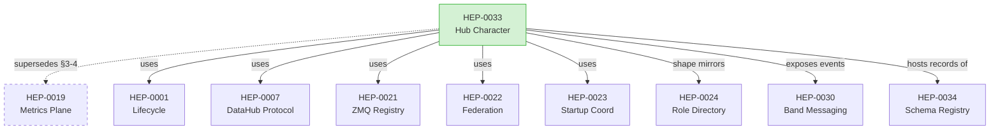

| HEP | Relationship |
|---|---|
| HEP-CORE-0001 | Used verbatim for lifecycle ordering. |
| HEP-CORE-0007 | Used verbatim for channel-level semantics. |
| HEP-CORE-0019 | **This HEP supersedes §3-4** (periodic broker-pull). §3.2 (live SHM merge) retained. |
| HEP-CORE-0021 | Used verbatim. |
| HEP-CORE-0022 | Used verbatim; federation config is factored into `HubFederationConfig`. |
| HEP-CORE-0023 | Used verbatim (Phase 2 multiplier included). |
| HEP-CORE-0024 | Shape mirrored: hub gets `HubDirectory`, `hub_cli`, `--init/--validate/--keygen`, directory layout. |
| HEP-CORE-0034 | Schema records live in `HubState.schemas`. Hub-globals loaded from `<hub_dir>/schemas/`; private records owned by registering producers; hub is the single mutator (HEP-0033 §G2 invariant). |
| HEP-CORE-0030 | Band events surface via script callbacks; admin RPC includes `list_bands`. |

## 15. Implementation phases

Phases should each land in a build-green, test-green checkpoint.

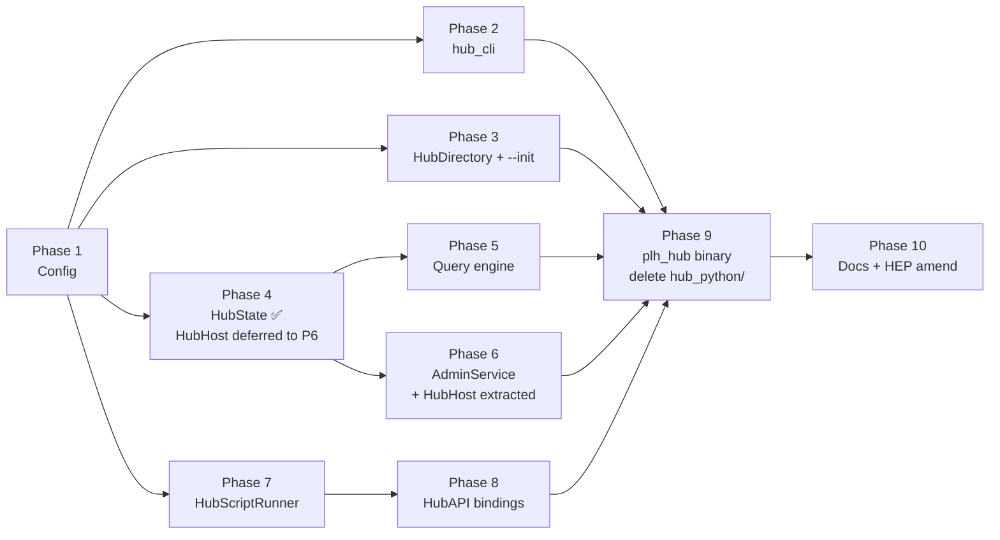

Phase numbering reflects dependency order; independent phases (e.g. P2, P3, P4)
can land in parallel once P1 lands.


- **Phase 1** — ✅ **Shipped 2026-04-29.**  Config: renamed role-facing
  `hub_config.hpp` → `hub_ref_config.hpp` (class `HubConfig` → `HubRefConfig`,
  function `parse_hub_config` → `parse_hub_ref_config`); created 6 new
  hub-side sub-configs (§6.4) — `hub_identity_config.hpp`,
  `hub_network_config.hpp`, `hub_admin_config.hpp`, `hub_broker_config.hpp`,
  `hub_federation_config.hpp`, `hub_state_config.hpp`; created
  `pylabhub::config::HubConfig` composite class with pImpl + JsonConfig
  backend, strict-key whitelist, vault hooks, `reload_if_changed()`.  The
  legacy `pylabhub::HubConfig` lifecycle singleton + its self-test
  (`test_datahub_hub_config_script.cpp`) were deleted in the same change.
  Covered by 9 L2 Pattern-3 tests in
  `tests/test_layer2_service/test_hub_config.cpp`. No behavior change for
  any live binary (hub binary remains disabled).
  **Auth/access fields (`broker.federation_trust_mode`) deliberately
  omitted from `HubBrokerConfig` — see HEP-CORE-0035** for the design that
  must land before they are added.  `broker.known_roles[]` is loaded from
  the encrypted vault (§4.8), not hub.json.  The legacy `RoleIdentityPolicy`
  placeholder was deleted from `BrokerService::Config` on 2026-07-20
  (HEP-CORE-0035 §4.5 / §8 Phase 6).

  **Heartbeat alignment with HEP-CORE-0023 §2.5 (2026-04-29 follow-up;
  reduced from four to three multiplier fields 2026-05-07 — `Closing`
  state and `grace_heartbeats` removed in HEP-0023 §2 rewrite).**
  `HubBrokerConfig` now carries the three heartbeat-multiplier fields
  (`heartbeat_interval_ms`, `ready_miss_heartbeats`,
  `pending_miss_heartbeats`) plus two optional explicit overrides —
  field-for-field parity with `BrokerService::Config`.
  REG_ACK / CONSUMER_REG_ACK now carry a `heartbeat` block surfacing
  these three multiplier fields so the registering role can validate
  its configured cadence against the hub's max (HEP-0023 §2.5.1
  "Role-side preferred cadence vs. hub authority"); a slower role logs
  a WARN and resets to the hub's value to avoid liveness reaping.
  `BrokerRequestComm::set_periodic_task` is now post-startup-callable
  (routes through the cmd queue) so the role's heartbeat task is
  installed *after* REG_ACK with the negotiated effective interval.
- **Phase 2** — ✅ **Shipped 2026-04-25** (commit `9ba6ac1`).
  `hub_cli::parse_hub_args` + `HubArgs` + `ParseResult` in
  `src/include/utils/hub_cli.hpp`; mirrors the `role_cli`
  no-`std::exit` stream-directed parser contract.  Generic CLI helpers
  (`is_stdin_tty`, password input, init-name resolution) subsequently
  factored out of `role_cli` into `pylabhub::cli` namespace
  (`utils/cli_helpers.hpp`, 2026-04-29) so role and hub CLIs share a
  peer rather than depending on each other.  Covered by L2 tests in
  `tests/test_layer2_service/test_hub_cli.cpp` (parser) and
  `test_role_directory.cpp` (`CliHelpersTest.*`).
- **Phase 3** — ✅ **Shipped 2026-04-29.**  `HubDirectory` value-class
  in `src/include/utils/hub_directory.hpp` + impl in
  `src/utils/config/hub_directory.cpp`; mirrors `RoleDirectory`'s
  shape (open/from_config_file/create + path accessors + script_entry
  + has_standard_layout) but is single-kind — no registration
  builder.  `init_directory(dir, name, log_overrides)` writes the
  HEP-0033 §6.2 hub.json template (minus the auth/access fields
  deferred to HEP-0035) and creates `logs/run/vault/schemas/script/python`
  with vault/ at 0700 on POSIX.  schemas/ is created but optional in
  `has_standard_layout()` per §7.  Covered by 13 L2 tests in
  `tests/test_layer2_service/test_hub_directory.cpp` (path accessors,
  create-idempotent, layout-with/without-optionals, script_entry
  python+lua, init writes parseable template, log overrides land,
  empty-name/pre-existing-hub.json error paths, generated UID
  validates as PeerUid).
- **Phase 4** — `HubState` struct + accessors. ✅ **Already complete** —
  HubState landed via the HEP-CORE-0033 G2.0–G2.2 absorption sequence
  (sole owner of channel/role/band/peer/shm/counter state; capability ops;
  HEP-CORE-0033 §9 Message-Processing Contract).  The `HubHost` class
  originally scoped here is **deferred to Phase 6** — see §4 phasing
  note.  Until then, future `plh_hub_main.cpp` (Phase 9) owns
  `BrokerService` directly and reads `HubState` via
  `BrokerService::hub_state()`.
- **Phase 5** — Query engine over `HubState` + existing `collect_shm_info`.
  L2 tests for filter coverage + `_collected_at`.  (Originally scoped as
  `HubHost::query_metrics`; pending the §4 deferral, exposed as a free
  function or on `BrokerService` until Phase 6 introduces `HubHost`.)
- **Phase 6** — split into 6.1 (HubState ownership + HubHost lifecycle
  owner) and 6.2 (AdminService).
  - **Phase 6.1a — HubState ownership refactor** ✅ shipped 2026-04-30
    (commit `e59bb90`).  `BrokerService` ctor takes `HubState&` by
    reference; `BrokerServiceImpl` stores a non-owning pointer; test
    fixtures (`LocalBrokerHandle` etc.) own the HubState alongside the
    broker.  Behavior unchanged; 1663/1663 tests stay green.  Aligns
    with §4 component diagram (HubState is a peer subsystem of
    BrokerService, not nested inside it).
  - **Phase 6.1b — HubHost lifecycle owner** ✅ shipped 2026-04-30.
    Single concrete class (no template hierarchy — hubs are
    singletons) owning `HubState` (value), `BrokerService` and
    `ThreadManager` (unique_ptrs).  Public surface: `startup()` /
    `run_main_loop()` / `shutdown()` / `request_shutdown()` /
    `is_running()` plus const accessors `config()`, `broker()`,
    `state()`, `broker_endpoint()`, `broker_pubkey()`.  No
    state-changing API — the broker is the curated state-accessor
    surface; HubHost just owns and sequences subsystems.  ThreadManager
    auto-registers as the dynamic lifecycle module
    `"ThreadManager:HubHost:<uid>"` (same pattern as role-side).
    `shutdown()` is synchronous: drains the ThreadManager so the
    broker thread has actually exited by the time the call returns —
    no in-flight protocol traffic slips through after shutdown.
    Covered by 9 L2 tests (phase FSM — Constructed/Running/ShutDown,
    incl. single-use after shutdown + failed-startup rollback per
    §4.3 — and HEP §4 ownership invariant
    `&host.state() == &host.broker().hub_state()`) and 3
    L3 integration tests (broker reachable, REG_REQ round-trip with
    HubBrokerConfig values reflected in REG_ACK heartbeat block,
    shutdown breaks client connection).
  - **Phase 6.2 — AdminService structured RPC (§11)** — ✅ COMPLETE 2026-05-02.
    Token-validated REP socket; thin wrapper that calls
    `host.broker()` mutators directly (acceptance gate at the RPC
    entry point per §11.3).  Retires the legacy `AdminShell`.
    Sub-phases:
      - **6.2a** ✅ `db9f8f9` — skeleton: REP socket bind, JSON envelope,
        token gate, localhost-bind enforcement, `ping` round-trip,
        ThreadManager registration, HubHost lifecycle integration.
      - **6.2b** ✅ `c0408a8` — 7 query methods (`list_channels`,
        `get_channel`, `list_roles`, `get_role`, `list_bands`,
        `list_peers`, `query_metrics`).  HubState entry-type
        serializers promoted from `broker_service.cpp` to shared
        `utils/hub_state_json.{hpp,cpp}` so admin RPC and metrics
        path emit identical JSON.
      - **6.2c** ✅ `38591dc` — 3 control methods (`close_channel`,
        `broadcast_channel`, `request_shutdown`).  Each delegates
        to an existing fire-and-forget mutator; admin response is
        the accept-ack, not completion.
    23 L2 AdminService tests; mutation-verified per sub-phase.
    10 of 16 prior-draft §11.2 methods wired; 5 remain deferred
    (`revoke_role` / `reload_config` / `add/remove/list_known_roles`
    — see §16 #1, #9, HEP-0035 respectively).  `exec_python` was
    removed entirely 2026-05-04 — see §17 "No remote code injection".
- **Phase 7** — `HubScriptRunner` + per-engine `build_api_(HubAPI&)`
  bindings.  Retires `PythonInterpreter`/`HubScript`/`hub_script_api`/
  `pylabhub_module` (already deleted in the post-G2 cleanup; Phase 7
  is greenfield).
  Sub-commits:
    - **A/B/C** ✅ shipped 2026-05-03 — `script_host_traits<ApiT>`
      template + sibling `build_api_(HubAPI&)` virtual on
      `ScriptEngine`; `HubConfig::timing()` accessor; `HubAPI` class
      declared with `script_host_traits<HubAPI>` specialization;
      explicit `template class EngineHost<HubAPI>;` and private
      `HubScriptRunner final : EngineHost<HubAPI>` with
      `worker_main_()` event-and-tick loop reusing `RoleHostCore`
      message queue + `hub_state_json` serializers.
    - **D1 / D1.5** ✅ shipped 2026-05-03 — `HubAPI::log` /
      `metrics` / `uid` (Phase 7 minimum surface mirroring
      `RoleAPIBase`).  L2 unit tests with affirmative path-
      discrimination on log levels.  `LogCaptureFixture` gained
      strict `ExpectLogWarnMustFire` / `ExpectLogErrorMustFire`
      variants (13 framework self-tests).
    - **D2 (D2.1–D2.5)** ✅ shipped 2026-05-03 — `HubHost` wires
      `HubScriptRunner` into startup/shutdown ordering (§4.1
      step 10 / §4.2 step 2).  Review fixes folded in:
      `subscribe_*` made `const` on `HubState` (handler-list mutex
      was already `mutable`, removing the prior const_cast smell);
      `request_shutdown` adopts the role-side dumb-signal pattern
      (flag + cv.notify_all; main thread drives ordered shutdown).
      D2.2 test rigor pass added timing bounds and a mutation sweep.
      (D2.2's `host.eval_in_script` wrapper was retired 2026-05-04
      when `exec_python` was removed — see §17.)
    - **D3.1 / D3.2 / D3.3** ✅ shipped 2026-05-03 —
      `HubScriptRunner::worker_main_` runs the engine setup
      sequence inline (initialize → load_script → build_api),
      mirroring role-side phase ordering.  `LuaEngine::build_api_(HubAPI&)`
      adds 3 hub closures (`api.log` / `api.uid` / `api.metrics`)
      + `on_pcall_error_` null-safe across role/hub paths.  L3
      integration test `HubLuaIntegrationTest` runs a real `init.lua`
      against a real `LuaEngine` end-to-end; 2 tests (happy path +
      script-syntax-error startup-throws).
    - **D4.1 / D4.2** ✅ shipped 2026-05-04 —
      `PythonEngine::build_api_(HubAPI&)` + new
      `src/scripting/hub_api_python.cpp` defining
      `PYBIND11_EMBEDDED_MODULE(pylabhub_hub, m)` exposing
      `pylabhub_hub.HubAPI`.  Force-link symbol
      (`plh_register_hub_api_python_module`) keeps the static-archive
      linker from dropping the .o (no other referenced symbol there
      — analogous role files implicitly survive because they also
      host the role-API class impls).  L3 integration test
      `HubPythonIntegrationTest` (single TEST_F by design — pybind11
      `scoped_interpreter` re-init in one process is unsafe; L2
      Python tests use Pattern 3 subprocess workers for the same
      reason).
    - **Static review S1/S2/S5/S7** ✅ shipped 2026-05-04 —
      `script_error_count()` made null-safe across role/hub paths
      in both engines (S1).  L3 integration test timing bounds
      tightened from 5–8 s to 1.5–2.5 s based on observed steady-
      state ~110–140 ms (S2).  `json_to_py` / `py_to_json` extracted
      from `python_engine.cpp` to private header
      `src/scripting/json_py_helpers.hpp` (`pylabhub::scripting::detail`
      namespace) and adopted by all 4 `metrics()` bindings, replacing
      the `json.loads(dump())` round-trip (S5).  Lua-hub redundant
      callback-ref re-extract in `build_api_(HubAPI&)` removed
      (S7) — `load_script` is the single extraction site.
  - **Commit E ✅ rejected by design 2026-05-04** — the previously
    drafted scope (`AdminService::exec_python` admin RPC wiring
    `host.eval_in_script(code)` through to `engine.eval()`) was
    REMOVED ENTIRELY rather than shipped.  Security review found
    that arbitrary-code-over-wire would be the first non-curated
    state-affecting RPC on the hub — every other admin mutator
    has a fixed schema and a code-reviewable effect site, and we
    decided not to introduce a new threat class.  Operator
    scripting access is provided via the future Python SDK that
    composes structured admin RPCs locally on the operator's
    host (see §17).  Phase 7 D-track
    is the closure point for Phase 7 — there is no Phase 7
    Commit E follow-up.
- **Phase 8** — Rich `HubAPI` callback surface beyond log/uid/metrics
  (§12.3): channel/role/band/peer mutators, scoped event-callback
  registration, etc.  L3 tests via each engine.
  - **8a** read accessors (✅), **8b** control delegates (✅).
  - **8c** response augmentation hooks (§12.2.2).  Adds
    `ScriptEngine::invoke_returning(name, args) → InvokeResponse` —
    one new pure virtual; PythonEngine extends existing
    `request_queue_` + future drain, LuaEngine adds the analogous
    pending-queue path so hub-side single-state semantics hold.
    `HubAPI::augment_query_metrics / augment_list_roles /
    augment_get_channel / augment_peer_message` wired by AdminService
    + a new `BrokerService::Config::on_peer_message_augment`
    callback (same `std::function` shape as the existing
    `on_hub_message`, `on_hub_connected` Config fields).  No
    veto semantics — bookkeeping always completes before the
    script is consulted.
- **Phase 9** — `plh_hub` binary; new build target.  (Legacy
  `src/hubshell.cpp` + `src/hub_python/*` already deleted in the post-G2
  cleanup pass — Phase 9 is now greenfield.)  L4 test infrastructure:
  new `tests/test_layer4_plh_hub/` directory paralleling
  `tests/test_layer4_plh_role/` with its own `plh_hub_fixture.h` reusing
  the existing fixture-pattern conventions (subprocess spawn, no
  external broker dependency).
- **Phase 10** — HEP-0019 amendment finalised; README + deployment docs
  updated.

## 16. Open items (deferred to implementation)

1. `add_known_role`/`remove_known_role` persistence — in-memory only by default;
   `persist_known_role_changes: false` toggle for opt-in disk write.
2. `script.tick_interval_ms` location — `ScriptConfig` vs new `HubScriptConfig`.
   Recommendation: a new `HubScriptConfig` wrapping `ScriptConfig` + the
   tick field; keeps `ScriptConfig` clean for the role side which has no
   tick concept.
3. Band event hooks — `BandRegistry` currently broker-thread-internal; needs
   hook point for `HubState` updates.
4. Graceful-vs-fast shutdown semantics for `request_shutdown`.
5. Timestamp precision (ms vs µs) and clock source alignment.
6. `_collected_at` semantics for pointer-to-collect entries.
7. Script engine thread lifetime ordering vs `BrokerService` teardown.
8. Dev-mode admin token behaviour.
9. **`reload_config` runtime-tunable whitelist.**  §11.2 lists
   `reload_config` as an admin RPC but most config fields cannot change
   safely at runtime (endpoints, vault paths, admin port).  Tunable
   subset (heartbeat timeouts, state-retention values, federation peer
   list contents) vs frozen subset (everything else) must be enumerated
   before Phase 6 wires the RPC.
10. ✅ **CLOSED 2026-05-02** — Admin RPC error-code catalog now
    enumerated in §11.5.  Catalog: `unauthorized`, `unknown_method`,
    `invalid_request`, `invalid_params`, `not_found`, `conflict`,
    `policy_rejected`, `script_error`, `not_implemented`, `internal`.
    Stable wire constants, append-only.
11. ✅ **CLOSED 2026-05-05; SUPERSEDED by §6.5 revision 2026-05-31.**
    Vault directory layout discrepancy.  As of 2026-05-05,
    `HubVault::{create,open}` used `<hub_dir>/vault/hub.vault` —
    matching the then-current HEP §7 and the `--init` template's
    `auth.keyfile = "vault/hub.vault"`.  Bundled with the F4
    follow-up (HubNetworkConfig struct default also changed to
    `tcp://127.0.0.1:5570` to converge with the init-template
    default fixed earlier in the audit cycle).
    **Superseded:** §6.5 was revised on 2026-05-31 (E′-2b) to
    embed the hub UID in the vault filename
    (`<hub_dir>/vault/<hub_uid>.vault`).  See §6.5 / §7.1 for the
    current contract.  The fixed-filename invariant this close-out
    references no longer holds; the file-layout convergence work
    described here remains valid, only the filename shape changed.

## 17. Out of scope

- Hub-side HA / replication.
- Hub script hot-reload mid-run.
- Binary variants (`--kind`) — subsystems toggled via config only.
- Role-side rewrites.
- HEP-CORE-0019 periodic broker-pull (explicitly replaced by query-driven
  model; §10).
- **Remote code injection.**  See the "Design tenet" subsection below.

### 17.1 Design tenet — no remote code injection

The hub deliberately accepts **no arbitrary executable code over the
wire**.  All hub-state mutation is provided through structured admin
RPCs (§11.2) with bounded schema and bounded effect.  Threat surface
scales with the curated method count, not with what an operator could
think to type into an eval prompt.

**What this excludes:**
- `exec_python` / `exec_lua` / `exec_<lang>` — operator REPLs over the
  admin REP socket.  An earlier draft of §11.2 reserved an
  `exec_python` slot for Phase 7 wiring; that entry was removed
  entirely 2026-05-04 after security review.  See §15 Phase 7
  Commit-E rejection note.
- Stored-procedure-style admin RPCs that take code as a parameter
  and execute it server-side.
- `engine.eval(code)`-equivalent surfaces routed from any external
  network protocol (admin, federation, role-broker).

**What's still allowed:**
- The hub script loaded at startup from `script/<lang>/...` per
  `script.path` config — operator-controlled, on the hub host's disk,
  loaded once during `HubHost::startup`.  This is the *only* path by
  which user code runs in the hub process.
- Curated state-mutating admin RPCs (`close_channel`,
  `broadcast_channel`, `request_shutdown`, future `revoke_role` /
  `reload_config` / known-roles management) — fixed JSON schema, fixed
  effect.
- Future structured admin RPCs added as the protocol grows.  Each
  addition gets a §11.2 row, a §11.5 error-code mapping, and a
  reviewable handler.

**External scripting access — the supported path:**
- Provided by a Python SDK (Phase 8+; deferred until external
  scripting demand is concrete).
- SDK runs on the operator's host, composes structured admin RPCs,
  sends only JSON envelopes over the wire.
- Same pattern as `boto3` over the AWS HTTP API or
  `kubernetes-client/python` over the K8s REST API: SDK methods are
  thin wrappers around documented RPC methods; user code is local.
- Operators write Python locally, never transmit Python to the hub.

**Why this matters:**
- Every admin mutator is a code-reviewable effect site.
  `exec_python(code)` would have made the effect site `code` — i.e.,
  unbounded.  The threat model would have changed from "trust the
  operator to call our methods correctly" to "trust the operator to
  not type anything malicious into a string".
- Audit logging an `exec_python` call gives you a code blob; audit
  logging a `close_channel` call gives you the channel name.  The
  latter is forensically useful; the former is only useful if you
  can also re-parse the code, which defeats the audit guarantee.
- The "operator REPL" use case is real (diagnose live state, custom
  queries) but is fully covered by curated query RPCs (§11.2 query
  block) plus the SDK composing them locally.

---

## 18. Broker message routing classes

**Status:** Normative.  Added 2026-05-06 to consolidate the routing
taxonomy that was previously implicit across HEP-CORE-0007 (wire
protocol), HEP-CORE-0019 §2.3 (per-presence heartbeats), HEP-CORE-0023
(presence-coordination), and HEP-CORE-0027 (inbox).  This is the
canonical home — other HEPs cross-reference here rather than restate.

### 18.1 The four classes

Every broker request/response/notification belongs to exactly one of
four routing classes.  The class determines how the role-side
abstraction routes the message in both directions and how the broker
processes it.

```
Class A — Channel-bound.    Bound by `channel_name` in the payload.
                            Routing: send/receive via the
                            BrokerRequestComm connected to the hub
                            that owns `channel_name`.
Class B — Role-bound.       Asks "is uid X alive / where's its inbox".
                            Routing: send via any connection;
                            fall-through over connections; first hit
                            wins.  No per-asker affinity.
Class C — Hub-bound.        Asks "what does THIS hub know" (channel
                            list, aggregated metrics, SHM blocks).
                            Routing: caller picks hub explicitly
                            (script API: `api.in_hub.*` /
                            `api.out_hub.*`).
Class D — Band-bound.       Bound by `band_name`; bands live on one
                            hub at a time.  Routing: send/receive
                            via the connection where the band was
                            joined (band_index in the role-side
                            handler records the choice).
```

The four classes are exhaustive: every existing broker message fits
exactly one, and new messages classify into one of these four.  The
classes are also disjoint — no message dual-classifies.

### 18.2 Full message inventory (classified)

#### Outbound: role → hub

| Message | Class | Notes |
|---|---|---|
| `REG_REQ` | A | Producer presence registers its channel. |
| `CONSUMER_REG_REQ` | A | Consumer presence joins a channel. |
| `DEREG_REQ` | A | Producer voluntary close. |
| `CONSUMER_DEREG_REQ` | A | Consumer voluntary leave. |
| `DISC_REQ` | A | Discover channel's connection info. |
| `ENDPOINT_UPDATE_REQ` | A | Post-bind endpoint publish per **HEP-CORE-0021 §16** (adopted 2026-07-08; closes task #94).  Producer sends after S3 bind resolves (may involve port 0 → OS-assigned).  Broker transitions `ProducerEntry.zmq_node_endpoint_resolved` to true; consumer admission gated on this per §16.7.  Idempotent for fixed-port producers.  The pre-REG bind variant retired 2026-06-12 stays retired — see HEP-CORE-0021 §16.2. |
| `SCHEMA_REQ` | A (owner-bound) | Routes via the connection where the owning record lives — see HEP-CORE-0034 §10.3. |
| ~~`CHANNEL_NOTIFY_REQ`~~ | — | **RETIRED** (audit R3.6, 2026-05-17).  Was a fire-and-forget channel-targeted event; role-side surface dead, handler deleted → `UNKNOWN_MSG_TYPE`. |
| `CHANNEL_BROADCAST_SEND_NOTIFY` (was `CHANNEL_BROADCAST_REQ`) | A | Fan-out broadcast on a channel; broker delivers `CHANNEL_BROADCAST_DELIVER_NOTIFY` to members. |
| `CHECKSUM_ERROR_REPORT` | A | Consumer-detected; routes by channel. |
| `HEARTBEAT_NOTIFY` (was `HEARTBEAT_REQ`; per-presence — HEP-CORE-0019 §2.3) | A | Refreshes the `(uid, role_type)` presence row in `RoleEntry` (§2.1 of HEP-CORE-0023) and writes the matching `MetricsStore` row.  Each heartbeat refreshes only its own presence row — channel observability is derived from the producer-presence's state. |
| `GET_CHANNEL_AUTH_REQ` | A | Producer pulls current consumer allowlist for a channel it produces; triggered by CHANNEL_AUTH_CHANGED_NOTIFY doorbell.  Broker checks caller is registered producer; reply carries `allowlist[]` (HEP-CORE-0036 §6.5 notify-then-pull). |
| ~~`GET_CHANNEL_PRODUCERS_REQ`~~ | — | **RETIRED 2026-07-08 (topology migration)**.  Under the binding/dialing model (tech draft §5.8), consumers no longer maintain a dial-target producer set: fan-in consumers are BINDING (producers dial in; consumer's ZAP allowlist is synced via `CHANNEL_AUTH_CHANGED_NOTIFY` with the new `phase` field); fan-out and 1-to-1 consumers dial one endpoint from `CONSUMER_REG_ACK.data_endpoint`.  See HEP-CORE-0007 §12.3 (retirement schema) + HEP-CORE-0017 §3.3 (new architecture) + §9.2 code-catalog retirement block below for the full 2026-07-08 topology-migration retirement set. |
| `BAND_JOIN_REQ` / `BAND_LEAVE_REQ` / `BAND_BROADCAST_SEND_NOTIFY` / `BAND_MEMBERS_REQ` | D | Band lives on the hub the role chooses at join time. |
| `ROLE_PRESENCE_REQ` | B | "Is uid X alive?" — fall-through. |
| `ROLE_INFO_REQ` | B | Inbox-discovery — fall-through (HEP-CORE-0027 §4.2). |
| `CHANNEL_LIST_REQ` | C | This-hub-only channel inventory. |
| `METRICS_REQ` | C | This-hub-only `MetricsStore` query (HEP-CORE-0019 §4.2). |
| `SHM_BLOCK_QUERY_REQ` | C | This-hub-only diagnostic. |
| ~~`METRICS_REPORT_REQ`~~ | — | **RETIRED 2026-05-11** (Wave M1.4).  Wire handler + role-side sender deleted; metrics piggyback on HEARTBEAT_NOTIFY per HEP-CORE-0019 §2.3 Phase 6.  Old clients emitting this message receive UNKNOWN_MSG_TYPE; `broker_proto_major` bumped 1 → 2. |

#### Inbound: hub → role

| Notification | Class | Notes |
|---|---|---|
| `CHANNEL_CLOSING_NOTIFY` | A | To every member; receiver is the BRC connected to the channel's hub. |
| `CHANNEL_EVENT_NOTIFY` | A | Producer of channel (or all members for broadcast events). |
| `CHANNEL_BROADCAST_DELIVER_NOTIFY` (was `CHANNEL_BROADCAST_NOTIFY`) | A | Fan-out result of `CHANNEL_BROADCAST_SEND_NOTIFY`. |
| `CHANNEL_ERROR_NOTIFY` | A | Schema mismatch, etc. |
| `CONSUMER_DIED_NOTIFY` | A | Producer of channel (when broker detects a consumer process is dead). |
| `CHANNEL_AUTH_CHANGED_NOTIFY` | A | To the **BINDING side** of the channel (fan-in: consumer; fan-out / 1-to-1: producer).  Direction inverted 2026-07-08 (topology migration); pre-migration was "to every kLive producer."  Gains three REQUIRED payload fields: `role_uid`, `role_type`, `phase` ("admitted" \| "live" \| "left").  Doorbell that triggers `GET_CHANNEL_AUTH_REQ` pull ONLY on `phase=admitted` and `phase=left` (allowlist-changing); `phase=live` is a lightweight local update to the binding side's `live_peers` map that feeds `api.consumer_count()` / `api.producer_count()` per HEP-CORE-0028.  See HEP-CORE-0007 §12.5 for the new payload schema and HEP-CORE-0036 §6.5 for the semantics.  Old `reason` field ({consumer_joined, consumer_left, consumer_timeout, federation_peer_death}) is retired; the semantics collapse into phase + role_type. |
| ~~`CHANNEL_PRODUCERS_CHANGED_NOTIFY`~~ | — | **RETIRED 2026-07-08 (topology migration)**.  Symmetric to the retirement of `GET_CHANNEL_PRODUCERS_REQ` above.  Under the binding/dialing model, the producer_joined / producer_left semantics collapse into `CHANNEL_AUTH_CHANGED_NOTIFY(phase=..., role_type="producer")` sent to the fan-in consumer (binding side).  See HEP-CORE-0007 §12.5 (retirement schema) + §9.2 code-catalog retirement block for the full 2026-07-08 topology-migration retirement set.  Historical payload: {channel_name, reason} where reason ∈ {producer_joined, producer_left, heartbeat_timeout, process_dead}. |
| ~~`FORCE_SHUTDOWN`~~ | — | **Removed 2026-05-07** — the prior design used this to force-close lingering consumers after a `Closing` grace window expired; that whole grace path was removed when the channel-FSM was retired (HEP-CORE-0023 §2.1).  Channel teardown is now atomic on producer-presence Disconnected; consumers learn via `CHANNEL_CLOSING_NOTIFY` (best-effort) and any subsequent `DISC_REQ` returns `CHANNEL_NOT_FOUND`. |
| `BAND_JOIN_NOTIFY` / `BAND_LEAVE_NOTIFY` / `BAND_BROADCAST_DELIVER_NOTIFY` | D | Band members. |

(`HUB_TARGETED_MSG`, `HUB_RELAY_MSG`, `HUB_PEER_HELLO`, `HUB_PEER_BYE`
are federation-internal — hub-to-hub only — and not part of the
role-side surface; see HEP-CORE-0022.)

### 18.3 Role-side handler dispatch

The role-side `RoleHandler` (HEP-CORE-0033 §19, planned — Wave A
item A7) builds three indexes once at startup:

```
channel_index : map<channel_name, Presence*>
band_index    : map<band_name,    Presence*>     // populated lazily on band_join
connections   : vector<HubConnection>             // dedup of presences by (endpoint, pubkey)
```

Outbound dispatch is then constant-time:

| Class | Outbound dispatch | Cost |
|---|---|---|
| A | `channel_index[channel_name]->connection.brc.send(msg, body)` | O(1) hashmap |
| B | for each `connection`: `connection.brc.query(msg, body)`; first non-empty answer wins | O(connections) — typically 1 or 2 |
| C | caller picks `connection` explicitly via `api.in_hub.*` / `api.out_hub.*` | O(1) once picked |
| D | `band_index[band_name]->connection.brc.send(msg, body)` | O(1) hashmap |

Inbound dispatch is per-`HubConnection`'s `on_notification` callback;
each callback tags the incoming `IncomingMessage` with its
originating presence (resolved from `body.channel_name` for Class A,
`body.band_name` for Class D, `sender_uid` for inbox messages)
before enqueueing into `RoleHostCore::incoming_queue_`.  Scripts
that care about origin filter by the tag; scripts that don't ignore
it.

### 18.4 Broker-side handling implications

For Class A messages that carry a `(uid, role_type)` tuple in the
payload (notably `HEARTBEAT_NOTIFY` per HEP-CORE-0019 Phase 6), the
broker handler looks up the matching presence row in
`RoleEntry(uid)`, refreshes that presence's `last_heartbeat` and
advances its Connected/Pending/Disconnected FSM, and writes
metrics under `MetricsStore[(channel_name, uid, role_type)]`.  No
heartbeat ever touches another presence's bookkeeping; channel
observability is derived from the producer-presence's state, not
from a separate `ChannelEntry` field.  See HEP-CORE-0023 §2.1 +
§2.5.2 + §2.6 for the full handler model.

For Class B messages, the broker walks its local `HubState.channels`
+ `HubState.roles` and answers from its own view.  No cross-hub
federation is involved at this layer — the asker handles cross-hub
fall-through on the role side.

For Class C messages, the broker exposes its local view only.
Aggregating across hubs is the admin tool's responsibility (or a
future federation feature, out of scope here).

For Class D messages, the broker maintains `HubState.bands` keyed by
band name.  Bands are local to one hub; cross-hub bands would need
hub-to-hub federation (HEP-CORE-0022 — out of scope here).

### 18.5 Why this taxonomy

Three concrete payoffs:

1. **No special-case dispatch logic spreads across the role host.**
   The four classes have four well-defined routing functions over
   the three indexes; every message fits, and adding a new message
   classifies into one of the four.
2. **Multi-hub topologies are first-class.**  Class A routes by
   channel name → presence → connection, regardless of how many
   physical connections the role has.  Class B's fall-through
   handles cross-hub role-presence queries automatically.
3. **The taxonomy is also a checklist for new messages.**  Any
   future broker message must classify; if it doesn't fit, the
   design needs review (e.g., a "broadcast across all hubs" message
   would be Class C-prime — not a current message — and would
   require hub federation).

### 18.6 Cross-references

- HEP-CORE-0019 §2.3 — Phase 6 per-presence heartbeats: the
  HEARTBEAT_NOTIFY wire format that makes per-presence keying possible.
- HEP-CORE-0019 §4.2 — METRICS_REQ / METRICS_ACK: the canonical
  Class C example.
- HEP-CORE-0023 §2.5.2 — per-presence heartbeat contract from the
  broker-side perspective.
- HEP-CORE-0023 §2.6 — `HubState` channel/role/consumer split that
  this section's keying assumes.
- HEP-CORE-0027 §4.2 — inbox discovery: the canonical Class B
  example.
- §19 below — the role-side abstraction that materialises the
  channel_index + band_index + connections lookups described in
  §18.3.

---

## 19. Multi-presence roles

**Status:** Normative.  Added 2026-05-06.  Absorbs the dual-broker
processor design previously documented in HEP-CORE-0015 §83-84
(SUPERSEDED), and generalises it to a per-role presence-list model
that fits producer / consumer / processor / future N-input roles
under one abstraction.

This section is the canonical home for the role-side multi-hub
control-plane architecture.

### 19.1 The presence model

A role's relationship with the hub system is a **list of registered
presences**.  Each presence is one tuple:

```
Presence ::= ( hub: HubRefConfig,
               channel: string,
               role_kind: producer | consumer,
               schemas: { slot, fz, inbox },
               inbox_meta: { endpoint, schema, packing, checksum } )
```

The `hub` field carries a fully-resolved broker endpoint + CURVE
public key (the operator's `in_hub_dir` / `out_hub_dir` config
resolves to these at startup).

Per-role cardinality:

| Role | Presences | Wave-B trait class |
|---|---|---|
| Producer | 1 — `{ out_hub, out_channel, producer }` | `role_host_traits<ProducerHost>` |
| Consumer | 1 — `{ in_hub, in_channel, consumer }` | `role_host_traits<ConsumerHost>` |
| Processor | 2 — `{ in_hub, in_channel, consumer }` + `{ out_hub, out_channel, producer }` | `role_host_traits<ProcessorHost>` |
| Future N-input router (illustrative) | N — one per input channel + 1 per output | new trait specialisation |

The presence list is declared at startup via the role's trait
specialisation; it does not change during the role's lifetime.

### 19.2 HubConnection — per-broker DEALER

Multiple presences may target the same physical broker (`in_hub ==
out_hub` is the common single-hub processor case).  The role-side
runtime materialises a `HubConnection` per **unique** broker — keyed
on the resolved `(broker_endpoint, broker_pubkey)` pair:

```
HubConnection ::= ( brc: BrokerRequestComm,    // owns the DEALER socket
                    ctrl_thread: ThreadHandle, // runs the BRC's poll loop
                    ztmp_monitor: ZmqMonitor ) // hub-dead detection
```

Two presences resolve to the same `HubConnection` iff their
`(broker_endpoint, broker_pubkey)` pair is bitwise-equal.  This makes
the optimisation operator-invisible:

| Topology | Presences | HubConnections |
|---|---|---|
| Producer | 1 | 1 |
| Consumer | 1 | 1 |
| Processor, single-hub (`in_hub == out_hub`) | 2 | **1** (dedup collapses both presences onto one DEALER) |
| Processor, dual-hub (`in_hub != out_hub`) | 2 | 2 |

Each `HubConnection`:
- Owns a single `BrokerRequestComm` (DEALER socket + cmd queue).
- Spawns a single ctrl thread that runs the BRC poll loop.
- Owns a single ZMTP socket monitor (hub-dead detection — fires
  `core.set_stop_reason(HubDead)` on disconnect).
- Receives notifications via a single `on_notification` callback;
  outgoing messages route via the role-side handler's three indexes
  (§18.3).

### 19.3 Per-presence registration + heartbeat

At startup, the role's `RoleHandler` walks the presence list and:

1. **For each unique `HubConnection`** (after dedup): connect the
   BRC, spawn the ctrl thread, wire the hub-dead callback + the
   notification callback, register the periodic-task scheduler.
2. **For each presence**: send the appropriate registration message
   over its connection (`REG_REQ` for producer-kind,
   `CONSUMER_REG_REQ` for consumer-kind) — including the inbox
   metadata block (HEP-CORE-0027 §4.1).
3. **For each presence**: install a periodic heartbeat tick on its
   connection, emitting `HEARTBEAT_NOTIFY` with `(channel, uid,
   role_type)` per HEP-CORE-0019 §2.3.

Heartbeat counts per cycle:

| Topology | Heartbeats per cycle | Channel-FSM heartbeats (= producer-kind) |
|---|---:|---:|
| Producer | 1 | 1 |
| Consumer | 1 | 0 |
| Processor, single-hub | 2 (over the same DEALER) | 1 (out_channel) |
| Processor, dual-hub | 2 (one per DEALER) | 1 (on out_hub) |

### 19.4 Routing — defers to §18

Outbound and inbound message routing follows the four-class taxonomy
in §18.  The `RoleHandler` builds three indexes once at startup
(§18.3) — `channel_index`, `band_index`, `connections` — and every
dispatch is a constant-time lookup.

For Class B fall-through specifically (role-bound queries like
`ROLE_PRESENCE_REQ` / `ROLE_INFO_REQ`): the handler walks
`connections` in declaration order; first hub that returns a
non-empty answer wins.  This is what makes `wait_for_roles`
(HEP-CORE-0023 §5.5) work for dual-hub processors — the asker can
wait for prerequisites registered on either hub without operator-side
broker selection.

### 19.5 InboxQueue — per-role, not per-presence

The `InboxQueue` (HEP-CORE-0027) is a **per-role** facility — one
ROUTER bound at a single endpoint, regardless of how many presences
the role has.  The same `inbox_endpoint` string is advertised in
every presence's registration payload, so any hub the role
participates in can answer `ROLE_INFO_REQ` with the same endpoint
(see HEP-CORE-0027 §4.1 + §4.5).

The receiver-as-authority schema model (HEP-CORE-0034 §11.4) is
unaffected: the inbox schema record lives under
`(role_uid, "inbox")` in `HubState.schemas`, with the same hash
across hubs because every advertisement carries the same canonical
schema bytes.

### 19.6 Hub-dead detection

Each `HubConnection` runs its own ZMTP socket monitor.  Configured:
`ZMQ_HEARTBEAT_IVL=5s`, `ZMQ_HEARTBEAT_TIMEOUT=30s` (keep-alive),
`ZMQ_RECONNECT_IVL=-1` (auto-reconnect DISABLED — see HEP-CORE-0023
§2.5.3 "Disconnection is terminal" for the policy rationale).  On
disconnect, the role-side ctrl-thread `on_hub_dead` lambda
(installed in `role_api_base.cpp` Phase 2 of `start_handler_threads`):

  1. Clears the per-connection liveness bit in
     `connection_alive_mask_` (relaxed atomic).
  2. Transitions every presence rooted on the dead connection out
     of `Registered` via `handler.mark_connection_disconnected(...)`
     (audit R3.3, 2026-05-17).
  3. Enqueues a synthetic `HUB_DEAD` `IncomingMessage` carrying
     `source_hub_uid = broker_endpoint` and
     `details["is_master"]` for the worker-thread dispatcher.

The worker dispatcher (`kNotificationTable[HubDead]` in
`cycle_ops.hpp`) then applies the unified
"user-override-or-native-default" model (audit D1/D2, 2026-05-18 —
matches `on_channel_closing`; full taxonomy in HEP-CORE-0011
§"Notification dispatch"):

  * **If the script defines `on_hub_dead(source_hub_uid, api)`**,
    it REPLACES the framework's default action.  The script may:
    - call `api.stop()` to exit cleanly;
    - keep the role alive with internal state mutation (zombie
      mode — useful for best-effort reconnection logic in later
      iterations);
    - check `api.is_connection_alive(i)` /
      `api.connections_alive_count()` to disambiguate master vs
      peer and decide per-hub policy;
    - do nothing.
  * **If the script does NOT define `on_hub_dead`**, the framework
    applies the default action:
    - Master died (`is_master=true`) → `core.set_stop_reason(HubDead)`
      + `core.request_stop()`.  The master ctrl thread drives the
      heartbeat timer; without it the broker reaps the role.
    - Peer died (`is_master=false`) → no-op.  Role keeps running on
      the master per HEP-CORE-0023 §2.5.  Scripts wishing to exit
      on peer-death must define `on_hub_dead` and call
      `api.stop()` inside it.

The notify is consumed from `msgs` in both paths (callback fired,
or framework took the default).  Multi-presence implication: if the
script defines `on_hub_dead`, EACH hub-death enqueues an independent
HUB_DEAD msg with its own `source_hub_uid` — the script sees every
event and may stop, mutate, or ignore on a per-hub basis.  Without a
callback, only master-death stops the role (peer-deaths log+continue),
matching pre-D1 behavior for scripts that haven't opted into the
callback.

See HEP-CORE-0011 §"Notification dispatch" for the Pattern-A/B
taxonomy that unifies this with `on_channel_closing`.

### 19.7 What was wrong before this section

Pre-Phase-6 code (current as of 2026-05-06) had a single implicit
assumption — "each role talks to one broker via a single
`BrokerRequestComm`" — which silently created five distinct bugs:

1. Consumer's heartbeat refreshes the producer-role's liveness
   bookkeeping (the broker derives the producer uid from the channel
   and treats every heartbeat for the channel as producer-
   attribution), masking producer-death so the producer's presence
   row never demotes Connected → Pending.
2. Consumer's metrics are written into the producer's `RoleEntry`
   row (same root cause).
3. Dual-hub processor is invisible on its `in_hub`: today's
   processor sends `CONSUMER_REG_REQ` via the `out_hub` BRC, going
   to the wrong hub.
4. Dual-hub processor cannot discover its `in_channel` via DISC_REQ
   (single BRC routes to `out_hub`).
5. Dual-hub processor never receives `CHANNEL_*_NOTIFY` for
   `in_channel` (BRC isn't connected to `in_hub`).

The presence-list model + §18 routing classes resolve all five with
one architectural change.

### 19.8 Implementation references

Wave B shipped 2026-05-26 (Wave-B M9, task #72).  Current file map:

- `src/include/utils/role_presence.hpp` — `Presence`, `HubConnection`, `RoleHandler` types
- `src/utils/service/role_handler.cpp` — implementation
- Per-role hosts: `src/{producer,consumer,processor}/{producer,consumer,processor}_role_host.{hpp,cpp}`
- `src/include/utils/role_host_frame.hpp` — `RoleHostFrame` plain class (not template; CRTP form retired in M9 per task #97-#100; producer/consumer/processor RoleHosts inherit directly)
- L4 dual-hub processor test: `tests/test_layer4_plh_hub/test_plh_hub_dual_hub_processor.cpp`

### 19.9 Cross-references

- §18 — Broker message routing classes (the four-class taxonomy this
  section's `RoleHandler` dispatches against).
- HEP-CORE-0019 §2 + §4.1 — Phase 6 per-presence heartbeats (design
  principles + `HEARTBEAT_NOTIFY` wire format including
  `(uid, role_type)`).
- HEP-CORE-0023 §2.1, §2.5.2 — channel-FSM is producer-only;
  per-presence heartbeat contract.
- HEP-CORE-0023 §5.5 — `wait_for_roles` post-Wave-A: Class B
  fall-through across all hub connections.
- HEP-CORE-0027 §4.1 + §4.5 — inbox per-presence advertisement +
  reachability requirements for multi-hub deployment.
- HEP-CORE-0015 §83-84 (SUPERSEDED — content moved here):
  historical dual-broker processor design.

---

## Appendix G2.2.0b — Naming grammar for hub identifiers

**Ratified 2026-04-23.** Every identifier that enters `HubState` from
the wire, from scripts, or from admin input follows this grammar.  One
validator (`utils/naming.hpp`) is the single enforcement point.  HubState
is the strong boundary — any identifier that reaches a `_on_*` op is
guaranteed to match these rules.

This grammar was promoted into this HEP on 2026-04-30 as the
single source of truth (previously held in an in-flight prereqs
draft that has since been archived).

### G2.2.0b.1 Grammar per identifier kind

```
channel    := NameComponent ('.' NameComponent)*
              // first component NOT in {prod, cons, proc, hub, sys}
band       := '!' NameComponent ('.' NameComponent)*
role.uid   := ('prod'|'cons'|'proc') '.' NameComponent '.' NameComponent ('.' NameComponent)*
              // MINIMUM 3 components: tag . name . unique_suffix
role.name  := NameComponent ('.' NameComponent)*
              // plain identifier; tag may or may not be included;
              // no reserved-word restriction since names are paired
              // with role_tag in every structured output
peer.uid   := 'hub' '.' NameComponent '.' NameComponent ('.' NameComponent)*
              // same tag.name.unique shape as role.uid — a federated
              // hub is conceptually a role-like participant with the
              // reserved tag 'hub'
schema     := '$' NameComponent ('.' NameComponent)* '.' 'v' [0-9]+
              // ≥2 components after the sigil; the LAST component MUST be
              // 'v' followed by one or more decimal digits — the schema's
              // version.  Examples: "$foo.v1", "$lab.sensors.temp.v42".
              // The '@<version>' form used before G2.2.0b is REJECTED —
              // one canonical form, no fallback parser (migrated configs
              // produce the new format; misconfigured ones fail early).
sys.key    := 'sys' ('.' NameComponent)+
              // broker-internal counter / event keys; user input is
              // rejected at the wire boundary for this namespace

NameComponent := [A-Za-z][A-Za-z0-9_-]{0,63}
                 // first char must be a letter;
                 // interior chars: alphanumeric + '_' + '-'
```

### G2.2.0b.2 Universal constraints

| Rule | Value |
|---|---|
| Charset (interior of a name component) | `[A-Za-z0-9_-]` |
| Charset (first char of a name component) | `[A-Za-z]` |
| Max length per name component | 64 |
| Max total identifier length (sigil + body) | 256 |
| Hierarchy separator | `.` (dot) |
| Sigils (position 0 only) | `!` (band), `$` (schema) |
| Role tag prefix (first component of role.uid) | closed set `{prod, cons, proc}` |
| Peer tag prefix (first component of peer.uid) | closed set `{hub}` |
| Reserved first components for channel | `{prod, cons, proc, hub, sys}` |
| Case | preserved; comparisons case-sensitive |
| Whitespace | forbidden |
| Dot at start / end | forbidden (grammar excludes) |
| Adjacent dots (`..`) | forbidden (grammar excludes) |

The 256-char total applies to a **single identifier** as a
parsing-boundary DoS defense.  It is NOT a cap on composite or
federated references.  When a query joins two identifiers (e.g. "role
X on hub Y"), the composite is expressed as a structured reference —
two JSON fields, two protocol slots, or two function arguments — not a
concatenated string.  Each constituent identifier must individually
satisfy the 256 cap; the composite can exceed that bound without
issue because the composite is not itself an identifier.

### G2.2.0b.3 UID construction (role)

`role.uid` is composed of three mandatory parts:

```
role.uid ::= <role_tag> . <name> . <unique_suffix>
```

- **`role_tag`** — closed enum `{prod, cons, proc}`.  Identifies the
  role's kind (producer / consumer / processor).
- **`name`** — the role's human-readable display component.  Free-form
  within `NameComponent`.  User-chosen.
- **`unique_suffix`** — one or more dotted components that
  disambiguate this role instance from others sharing the same name.
  Must have at least one component.

### G2.2.0b.4 Numeric-token prefix convention

Every `NameComponent` must start with `[A-Za-z]` — so raw numeric
tokens (PID, random hex, timestamps, counters) embedded as distinct
components need a letter prefix.  The project uses a **full-word**
convention that is self-documenting in logs:

| Prefix | Meaning | Example component |
|---|---|---|
| `pid` | process id (typically for test-fixture isolation) | `pid104577` |
| `uid` | opaque random unique suffix (uid_utils auto-gen) | `uid3a7f2b1c` |
| `v`   | schema version — short, matches industry convention (semver, git tags) | `v2`, `v42` |

These are conventions, not grammar rules — the validator only enforces
`NameComponent` shape.  But every *new* site that embeds a numeric
token should pick the conventional prefix for clarity.

Examples (all valid):
- `prod.cam1.pid42`
- `cons.logger.host-lab1.pid9876`
- `proc.filter.uid8f3a2c7b`
- `prod.main.uid3a7f2b1c`                 (shape produced by uid_utils)

Invalid (insufficient parts):
- `prod.uid3a7f2b1c` — only 2 components; missing the `<name>` middle component.
- `prod` — only the tag; missing name and unique.

### G2.2.0b.5 Helpers (`utils/naming.hpp`)

```cpp
enum class IdentifierKind { Channel, Band, RoleUid, RoleName, PeerUid, Schema, SysKey };

bool is_valid_identifier(std::string_view, IdentifierKind) noexcept;
void require_valid_identifier(std::string_view, IdentifierKind,
                              std::string_view context);   // PLH_PANIC on invalid

struct TaggedUidParts {
    std::string_view tag;     // "prod" / "cons" / "proc" (role) or "hub" (peer)
    std::string_view name;    // second component
    std::string_view unique;  // third + onward, joined by dots
};
std::optional<TaggedUidParts>   parse_role_uid(std::string_view uid) noexcept;
std::optional<TaggedUidParts>   parse_peer_uid(std::string_view uid) noexcept;
std::optional<std::string_view> extract_role_tag(std::string_view uid) noexcept;

std::string format_role_ref(std::string_view uid,
                            std::string_view name = {},
                            std::string_view tag  = {});
```

### G2.2.0b.6 Classification from a bare identifier

Every identifier string is classifiable from its leading characters alone:

| Prefix | Kind |
|---|---|
| `!…` | band |
| `$…` | schema |
| `sys.…` | broker-internal |
| `prod.…` / `cons.…` / `proc.…` (exact match of first component) | role (uid) |
| `hub.…` (exact match of first component) | peer (uid) |
| Any other `[A-Za-z]…` | channel |

`role.name` is deliberately not self-classifying — it is free-form
display text, always paired with `role_tag` in structured output (JSON,
metrics), so it never stands alone.

### G2.2.0b.7 Logging / output policy

Since `role.uid` carries tag, name, and unique suffix by construction,
**logging `role.uid` alone is self-describing** and does not need
redundant `role_tag` / `role_name` fields next to it.

| Output context | Include `role_tag` separately? |
|---|---|
| Log line that prints `role.uid` | No — redundant |
| Log line that prints `role.name` only | Yes — or prefix as `[tag] name` |
| JSON admin response where both `uid` and `name` appear | Include `role_tag` for explicitness |
| JSON NOTIFY that carries only `uid` | `role_tag` optional (parsable from uid) |

`naming.hpp::format_role_ref()` applies this policy: prefers `uid` if
present (self-describing), else falls back to `[tag] name`.

### G2.2.0b.8 Enforcement points

1. **HubState `_on_*` ops** (strong boundary): call
   `require_valid_identifier()` at entry.  Invalid → silent drop +
   bump `sys.invalid_identifier_rejected` counter.  No exceptions
   thrown into the broker's handler thread.
2. **Broker wire handlers** (audit R3.5b, 2026-05-19 — broker_proto
   4→5): call `is_valid_identifier()` on `channel_name`, `role_uid`,
   and `role_name` (when non-empty) at handler entry, BEFORE any
   HubState op.  An empty or malformed identifier returns
   `INVALID_REQUEST` with `LOGGER_WARN`; fire-and-forget messages
   (HEARTBEAT_NOTIFY, BAND_BROADCAST_SEND_NOTIFY) are dropped with WARN log
   instead.  In addition, each gate constrains the role-tag set
   embedded in the uid:

   | Gate | Allowed tag set |
   |---|---|
   | `REG_REQ`, `DEREG_REQ` | `{prod, proc}` |
   | `CONSUMER_REG_REQ`, `CONSUMER_DEREG_REQ` | `{cons, proc}` |
   | `HEARTBEAT_NOTIFY` | derived from `role_type` field |
   | `ROLE_PRESENCE_REQ`, `ROLE_INFO_REQ`, `BAND_*_REQ` | `{prod, cons, proc}` |

   Wrong-side tags return `INVALID_ROLE_TAG`.  Processor roles
   carry a `proc.*` uid and are accepted on both sides per
   HEP-CORE-0011's dual-presence model.  Implementation: `gate_grammar`
   in `src/utils/ipc/admission_gates.cpp` (wire_dispatch admission
   pipeline, HEP-CORE-0046 §14.5); the legacy
   `validate_identity_fields` / `validate_role_uid_only` on
   `BrokerServiceImpl` were retired 2026-07-14 (task #46).
   Grammar enforcement at the gate is **unconditional**.  Role-identity
   (CURVE pubkey) is enforced separately and earlier by the ZAP handler
   at the handshake against the `known_roles` allowlist (HEP-CORE-0035
   §4.1); the legacy `RoleIdentityPolicy` string gate was deleted
   2026-07-20 (HEP-0035 §4.5).  HubState silent-drop remains the
   defense-in-depth backstop.  See HEP-CORE-0023 §2.5.4 for the
   wire-format table.
3. **Role-side config parsers**: validate at `plh_role --validate`
   time so misconfigured role UIDs fail early, not at first REG_REQ.

### G2.2.0b.9 Consistency-check rule

If future work discovers an identifier in code, tests, or docs that
**does not match this spec**, the policy is:

1. Treat this spec as authoritative.
2. Correct the violating identifier to match the spec.
3. Do **not** relax the spec to match drifting code, unless the drift
   represents a ratified design change recorded here first.
