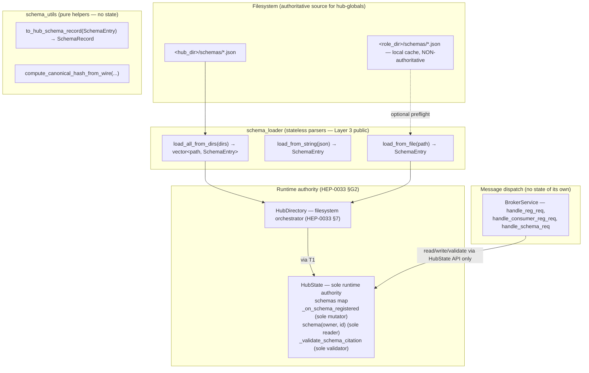
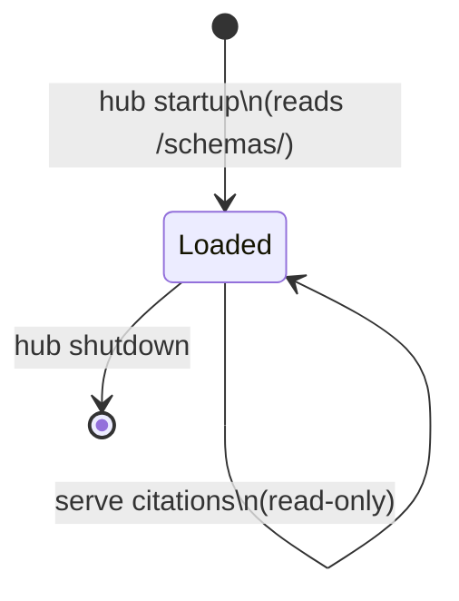
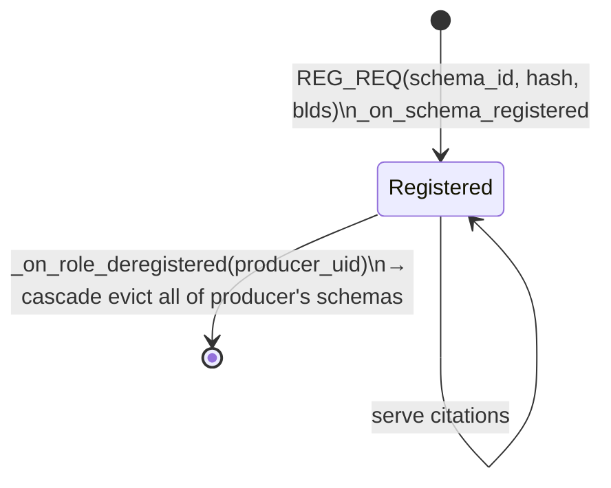

# HEP-CORE-0034: Schema Registry — Owner-Authoritative Model

| Property      | Value                                                                   |
|---------------|-------------------------------------------------------------------------|
| **HEP**       | `HEP-CORE-0034`                                                         |
| **Title**     | Schema Registry — Owner-authoritative records, owner-bound lifecycle    |
| **Status**    | Ratified — pending implementation (2026-04-26)                          |
| **Created**   | 2026-04-26                                                              |
| **Area**      | Schema system (`pylabhub-utils`, broker, hub, all role binaries)         |
| **Supersedes**| `HEP-CORE-0016` (Named Schema Registry)                                  |
| **Depends on**| HEP-CORE-0002 (DataHub), HEP-CORE-0023 (Startup Coordination), HEP-CORE-0024 (Role Directory), HEP-CORE-0033 (Hub Character) |

### Source file reference

Module ownership is fixed by **§2.4** (Module ownership and runtime invariants).
The table below names the files; the binding rules live in §2.4.

| File | Layer | Description |
|------|-------|-------------|
| `src/include/utils/schema_types.hpp` | L3 (public) | `FieldDef`, `SchemaSpec`, `FieldType` — pure data |
| `src/include/utils/schema_blds.hpp` | L3 (public) | HEP-0002 BLDS string generation, `SchemaRegistry<T>` template traits, `SchemaInfo::hash` (SHM-header form, **not** registry form — §2.4 I6) |
| `src/include/utils/schema_def.hpp` | L3 (public) | `SchemaDef`, `SchemaLayoutDef`, `SchemaEntry` — file-record types |
| `src/include/utils/schema_field_layout.hpp` | L3 (public) | `compute_field_layout()` — packing-aware field offsets |
| `src/include/utils/schema_utils.hpp` | L3 (public) | HEP-0034 wire form: `canonical_fields_str`, `compute_canonical_hash_from_wire`, `to_hub_schema_record` (the only sanctioned bridge into the registry — §2.4 I2), `WireSchemaFields` + `apply_*_schema_fields` |
| `src/include/utils/schema_loader.hpp` | L3 (public) | Stateless parsers — `load_from_file`, `load_from_string`, `load_all_from_dirs`, `default_search_dirs`. No class state, no maps, no caches (§2.4 I5). Renamed from `schema_library.hpp` by Phase 4. |
| `src/utils/schema/schema_loader.cpp` | impl | Parser implementation |
| `src/include/utils/hub_state.hpp` | L3 (public) | `SchemaRecord`, `schemas` map; sole runtime authority (§2.4 I1+I3+I4) |
| `src/utils/ipc/hub_state.cpp` | impl | `_on_schema_registered` (sole mutator), `schema(owner, id)` (sole reader), `_validate_schema_citation` (sole validator), `_on_role_deregistered` cascade |
| `src/utils/ipc/broker_service.cpp` | impl | `handle_reg_req` / `handle_consumer_reg_req` / `handle_schema_req` / `load_hub_globals_` — message dispatch only, no schema state of its own |

**Removed by this HEP:**

| Element | Reason |
|---------|--------|
| `src/include/utils/schema_registry.hpp` (was HEP-0016 Phase 4 design) | `SchemaStore` lifecycle module, file watcher, broker query fallback — replaced by hub-as-mutator + `HubState.schemas`. Deleted Phase 4a. |
| `src/utils/schema/schema_registry.cpp` | (same) |
| `class SchemaLibrary` state surface (`by_id_`, `by_hash_`, `register_schema`, `get`, `identify`, `list`, `load_all` member) | Parallel registry that violated §2.4 I1+I3+I5. Replaced by stateless free functions in `pylabhub::schema` + `HubState.schemas`. Deleted Phase 4. |
| `validate_named_schema<T,F>(id, lib)` and `validate_named_schema_from_env<T,F>` | Zero production callers; cited a `Producer::create<F,D>` API that was retired with HEP-0024. Broker NACK on REG_REQ is the validator (§2.4 I4). Deleted Phase 4. |
| Legacy HEP-0016 Cases A and B in `handle_reg_req` (auto-annotate by id, reverse-lookup by hash) | Compared HEP-0034 wire-form `attempted_schema` against HEP-0002 `SchemaInfo::hash` — different canonical forms (§2.4 I6). Reverse-by-hash also forbidden under namespace-by-owner (§2.4 I7). Deleted Phase 4. |
| `BrokerServiceImpl::schema_lib_` member + `get_schema_library()` accessor | Lazy-init parser-state held inside dispatcher. After demotion `schema_loader` is stateless, so the accessor has no purpose. Replaced by direct free-function call in `load_hub_globals_`. Deleted Phase 4. |

---

## 1. Motivation

HEP-CORE-0016 defined a schema registry on the assumption that **the hash is the
truth** — a name is just a human-readable alias for a checksum, and any party
with the same hash holds an equally valid claim to the schema's identity. That
model is incompatible with two realities that emerged after HEP-0016 was
implemented:

| Reality | Conflict with HEP-0016 |
|---|---|
| **Hub is the single mutator** (HEP-CORE-0033 §G2). All authoritative state lives in `HubState`. There is no neutral "library" that can speak for a schema independently of the hub. | HEP-0016's `SchemaLibrary` + `SchemaRegistry` two-class split has no place to live in a hub-mutator architecture. |
| **Schemas describe channel data**, and channels have a single producer-owner (HEP-CORE-0013, HEP-CORE-0023). | A floating "anyone with the hash wins" registry creates a class of identity dispute that the channel model does not have. The channel's authority should also be the schema's authority. |
| **Fingerprint omits packing** (`compute_schema_hash` today). Two schemas with the same fields and different packing produce identical hashes but distinct memory layouts. | Hash-as-truth fails on this case — two layouts are conflated under one identity. |

This HEP redefines the schema registry around three principles that fit the
post-HEP-0033 architecture: **owners are explicit, lifetime is owner-bound, and
citations are ownership claims, not bag-of-bytes lookups.**

---

## 2. Core principles

### 2.1 Schemas are owned

Every schema record in the hub has exactly one owner — either a registered
producer, or the hub itself. There is no "ownerless" or "shared" record. This
gives every schema a clear answer to "who can change me?", "when do I die?",
and "who is authoritative on disagreement?".

### 2.2 Hash + packing is the fingerprint

The fingerprint of a schema is `BLAKE2b-256(canonical(fields) || packing)`.
Two schemas have the same memory layout if and only if their fingerprints are
equal. This corrects the HEP-0016-era hash, which omitted packing and could
collide unrelated layouts.

### 2.3 Citation is an ownership claim

When a participant cites a schema for a channel, it asserts "this channel's
data conforms to **owner X's** schema with id `id`". The hub validates that
owner X is the channel's authority — which is either the producer of that
channel, or the hub itself for hub-globals adopted by the channel. Hash
equality alone does **not** authorise a third-party citation.

### 2.4 Module ownership and runtime invariants

This section is the **design contract** for every module that touches schemas.
Code that violates any rule below is a defect; doc-comments in `schema_loader.hpp`,
`hub_state.hpp`, and `broker_service.cpp` reference this section by name as
the binding rules.



**Invariants:**

1. **Single mutator** *(I1)* — `HubState::_on_schema_registered(SchemaRecord)` is the
   sole entry-point that mutates the schema registry. No other module may insert,
   remove, or modify entries. This follows HEP-CORE-0033 §G2 (hub as single
   mutator); schemas are not exempt.

2. **Single load pipeline** *(I2)* — schemas enter `HubState` through exactly one
   path: `schema_loader::load_from_file` (or `load_all_from_dirs`) →
   `to_hub_schema_record` → `HubState::_on_schema_registered`. No module may
   construct `SchemaRecord` values directly from a `.json` file without going
   through `to_hub_schema_record`. The translation step is what makes the
   canonical-form rule (I6) automatic.

3. **Single reader** *(I3)* — code that needs to look up a schema by
   `(owner, id)` calls `HubState::schema(owner, id)`. There is no parallel
   in-memory map elsewhere. Consumers of the schema registry never hold their
   own copy keyed by id or by hash.

4. **Single validator** *(I4)* — citation validation goes through
   `HubState::_validate_schema_citation(channel_owner, channel_id, cited_owner,
   cited_id, cited_hash, cited_packing)`. The broker's only job is to extract
   wire fields and forward them to this method. Stage-2 fingerprint
   recomputation (`compute_canonical_hash_from_wire` vs claimed `schema_hash`)
   is a producer-side check that runs in `handle_reg_req` before the validator
   is reached; it is not a separate validator.

5. **Stateless parser** *(I5)* — `schema_loader` holds **no state**: no maps,
   no caches, no in-memory registry. Each parser function takes input, returns
   a parsed value, and forgets. The historical class `SchemaLibrary` (HEP-0016)
   carried `by_id_` / `by_hash_` maps; those maps are deleted by HEP-0034
   Phase 4. A parser that grew internal state would be a defect; review
   should reject any reintroduction.

6. **Canonical-form rule** *(I6)* — two distinct canonical forms exist by design:
   - **HEP-0002 BLDS form** (`name:tok[count]` joined by `;`), computed by
     `compute_layout_info()`, populates `SchemaInfo::hash`. Used by the
     **SHM-header self-description** so a memory-mapped block can be
     introspected without external metadata. Internal to a single process
     image.
   - **HEP-0034 wire form** (`slot:name:type:count:length|...|pack:...|fz:...|fzpack:...`),
     computed by `compute_canonical_hash_from_wire()`, populates
     `SchemaRecord::hash`. Used by the **cross-process schema registry** for
     citation, adoption, and Stage-2 verification.

   These two hashes are **different by design** for the same logical schema.
   Cross-comparison is a category error: it cannot succeed for a non-trivial
   schema. Code that mixes the two is a defect — see HEP-0034 Phase 4 commit
   log for the prior incident this rule prevents.

7. **No reverse-by-hash lookup** *(I7)* — under namespace-by-owner (§2.1, §5),
   the same canonical bytes can legitimately exist as `(role_uid, "frame")` and
   `(hub, "frame")` simultaneously. A `hash → schema_id` reverse lookup
   collapses owners and is therefore **ambiguous by construction**. Broker code
   must not perform such lookups; auto-annotation (HEP-0016 Case B) is removed
   by HEP-0034 Phase 4. Citers must always carry an explicit `(owner, id)` —
   absent that, the citation is anonymous and creates no record.

8. **Filesystem is hub-authoritative only** *(I8)* — schema files at
   `<hub_dir>/schemas/*.json` are the only filesystem-authoritative source.
   `<role_dir>/schemas/*.json` is a local cache for offline development and
   debugging; it is **not** consulted by the broker and may be stale. Per
   HEP-CORE-0024 §3.5, on disagreement the hub wins.

9. **HubDirectory absorbs filesystem orchestration** *(I9, future)* — when
   `HubDirectory` is built per HEP-CORE-0033 §7, it owns the call to
   `schema_loader::load_all_from_dirs` and the chain of `_on_schema_registered`
   calls at startup. Until then, `BrokerServiceImpl::load_hub_globals_()` is
   the temporary host. The substitution is a pure ownership move with no
   behavioural change because `schema_loader` is stateless and `to_hub_schema_record`
   is pure.

**Forbidden patterns** (review must reject):

- Construction of `SchemaRecord` outside `to_hub_schema_record` or test
  fixtures.
- Any field of `SchemaInfo` (HEP-0002) used as input to citation logic, or any
  field of `SchemaRecord` used to populate a SHM header. The two forms do not
  interoperate.
- Lazy initialisation of a parser-side map keyed on schema_id or hash.
- Validation logic in any class other than `HubState`.

**Permitted patterns:**

- A producer parsing `<role_dir>/schemas/foo.json` locally with
  `schema_loader::load_from_file()` and comparing struct size or BLDS against
  `compute_layout_info(struct_fields)` for **its own** preflight check (no
  registry interaction). This is local-only and creates no record anywhere.

---

## 3. Terminology

| Term | Definition |
|------|-----------|
| **Schema record** | Hub-side entry: `(owner_uid, schema_id) → {hash, packing, blds, registered_at}` |
| **Owner** | Either a registered role uid (`prod.<name>.uid<8hex>`) or the literal `hub` |
| **Public / global schema** | Schema record whose owner is the hub (loaded from `<hub_dir>/schemas/`) |
| **Private schema** | Schema record whose owner is a producer role |
| **Citation** | Reference of the form `(owner_uid, schema_id)` carried in a registration message |
| **Adoption** | A producer chooses a hub-global as its channel schema, by citing `(hub, id)` in REG_REQ |
| **Fingerprint** | `BLAKE2b-256` over canonical field list + packing — bytewise-equal layout iff fingerprint equal |
| **BLDS** | Basic Layout Description String — canonical text form of the field list (from HEP-CORE-0002 §11) |

---

## 4. Schema record model

### 4.1 Hub-side record

```cpp
namespace pylabhub::schema {

struct SchemaRecord
{
    std::string                  owner_uid;     // "hub" or "prod.<name>.uid<8hex>"
    std::string                  schema_id;     // "frame", "lab.sensors.temperature.raw@1", ...
    std::array<uint8_t, 32>      hash;          // BLAKE2b-256(canonical || packing)
    std::string                  packing;       // "aligned" | "packed"
    std::string                  blds;          // canonical BLDS text (for reconstruction)
    std::chrono::system_clock::time_point registered_at;
};

} // namespace pylabhub::schema
```

### 4.2 Stored in `HubState`

```cpp
struct HubState {
    // ... existing fields ...
    std::map<std::pair<std::string, std::string>, SchemaRecord>  schemas;
    //         owner_uid          schema_id
};
```

### 4.3 Channel reference

`ChannelEntry` (HEP-0033 §8) gains a strongly-typed reference to its schema
record:

```cpp
struct ChannelEntry {
    // ... existing fields ...
    std::string                  schema_owner;  // "hub" or producer uid
    std::string                  schema_id;
};
```

The pair `(schema_owner, schema_id)` is a foreign key into `HubState.schemas`.
The hub guarantees referential integrity at mutation time (a channel's
`schema_owner` is always either `hub` or the producer of that channel).

---

## 5. Schema ID format and namespacing

A schema record key is the pair `(owner_uid, schema_id)`. Two records with the
same `schema_id` but different `owner_uid` are distinct, parallel records.

### 5.1 `schema_id` form

```
{namespace}.{name}@{version}     ── namespaced (recommended for hub-globals)
{name}                           ── flat (acceptable for private schemas)
```

- **Namespaced** form (e.g. `lab.sensors.temperature.raw@1`) is required for
  hub-globals, since they live in a shared filesystem tree. Version `@N` is a
  positive integer; `@latest` is reserved for tooling and never appears on the
  wire.
- **Flat** form (e.g. `frame`) is acceptable for private schemas, since
  `(owner_uid, "frame")` is already qualified by the owner. Encouraged for
  short-lived dev producers; large deployments should still use namespaces.

### 5.2 Namespace examples

| Owner | Schema id | Full key |
|---|---|---|
| `hub` | `lab.sensors.temperature.raw@1` | `(hub, lab.sensors.temperature.raw@1)` |
| `hub` | `io.camera.frame.rgb@1`         | `(hub, io.camera.frame.rgb@1)`         |
| `prod.cam_left.uid01234567` | `frame` | `(prod.cam_left.uid01234567, frame)` |
| `prod.cam_right.uid89abcdef`| `frame` | `(prod.cam_right.uid89abcdef, frame)` |

The two `frame` records are parallel, independent, and may have different
fingerprints. They never collide.

---

## 6. Schema JSON file format

Hub globals and (optionally) role-side caches load schemas from JSON files of
this form. The format is unchanged from HEP-0016 §6 except that `packing` is
now part of the fingerprint and is therefore mandatory.

```json
{
  "id":      "lab.sensors.temperature.raw",
  "version": 1,
  "description": "Raw temperature measurement — ADC values + timestamp",

  "slot": {
    "packing": "aligned",
    "fields": [
      {"name": "ts",        "type": "float64", "unit": "s"},
      {"name": "samples",   "type": "float32", "count": 8},
      {"name": "sensor_id", "type": "uint16"},
      {"name": "_pad",      "type": "uint16"}
    ]
  },

  "flexzone": {
    "packing": "aligned",
    "fields": [
      {"name": "cal_factors", "type": "float64", "count": 8},
      {"name": "sensor_uid",  "type": "uint64"}
    ]
  },

  "metadata": {
    "author":  "lab-instruments-team",
    "created": "2026-04-26",
    "tags":    ["temperature", "raw"]
  }
}
```

### 6.1 Field type system

Mirrors `schema_blds.hpp` exactly. No new tokens.

| JSON `"type"` | BLDS | C++ | Bytes |
|---|---|---|---|
| `float32` / `float64` | `f32` / `f64` | `float` / `double` | 4 / 8 |
| `int8` … `int64`      | `i8` … `i64` | `int8_t` … `int64_t`| 1…8 |
| `uint8` … `uint64`    | `u8` … `u64` | `uint8_t` … `uint64_t`| 1…8 |
| `bool` / `char`       | `b` / `c`    | `bool` / `char`      | 1 / 1 |

`"count": N` (N ≥ 1) renders as `tok[N]` in BLDS. Strings and structs are not
permitted; schemas describe a fixed-size flat layout only.

### 6.2 Packing modes

| `"packing"` | Semantics |
|---|---|
| `"aligned"` | Natural alignment (C-struct rules) — default for ctypes interop |
| `"packed"`  | No padding (`_pack_=1`) — explicit byte layout |

**`"packing"` is required.** The JSON loader rejects schemas with neither
explicit packing nor an explicit default. (Today's loader silently defaults to
`"aligned"` — this HEP makes the field mandatory because it is part of the
fingerprint.)

### 6.3 Fingerprint canonical form

```
canonical(slot, fz)
  = "slot:" + canon_fields(slot.fields) + "|pack:" + slot.packing
  + ( "|fz:"  + canon_fields(fz.fields)  + "|fzpack:" + fz.packing  if fz present )

canon_fields(fields) = "name:type:count:length" joined with "|"

fingerprint = BLAKE2b-256(canonical_bytes)
```

**Type token convention:** `type` is the **JSON type name** as it appears in the
schema file's `"type"` field — `"float32"`, `"float64"`, `"int8"`, `"int16"`,
`"int32"`, `"int64"`, `"uint8"`, `"uint16"`, `"uint32"`, `"uint64"`, `"bool"`,
`"char"`, `"string"`, `"bytes"`. This is **not** the HEP-0002 BLDS token form
(`f32`, `f64`, `i8`, …); the BLDS token form is reserved for `SchemaInfo::blds`
in the SHM-header self-description (HEP-0002 §11). The wire form and the
SHM-header form are deliberately distinct (§2.4 I6) and a producer building
the wire payload by hand MUST emit the JSON type name to match what the hub
recomputes from its globals at startup.

`length` is `0` for fixed-width primitives; for `string`/`bytes` it is the
byte length declared in the schema (HEP-0002 §11.1). `count` is the array
arity (`1` for scalar, `>1` for array; HEP-0002 §11.2).

Worked example for `[{"name":"v","type":"float32"}]` with `packing="aligned"`:

```
canon_fields = "v:float32:1:0"
canonical    = "slot:v:float32:1:0|pack:aligned"
fingerprint  = BLAKE2b-256("slot:v:float32:1:0|pack:aligned")
```

This corrects the HEP-0016 fingerprint, which omitted both packing strings.
Migration: see §15 Phase 1.

---

## 7. Lifecycle — owner-bound

### 7.1 Hub-globals

Loaded from `<hub_dir>/schemas/**/*.json` at hub startup. Owner is the literal
string `"hub"`. Lifetime equals the hub process. Globals are read-only at
runtime (no producer can replace or evict them).



### 7.2 Private schemas

Created by `REG_REQ` from a producer. Owner is the producer's uid. Evicted
atomically when the producer deregisters (any reason: explicit DISC,
heartbeat-timeout, hub-initiated FORCE_SHUTDOWN).



### 7.3 No refcount

There is deliberately no consumer/processor refcount on schema records.
Justification:

1. A consumer reading from producer P uses P's channel; if P deregisters, the
   channel itself closes. The consumer's loss of the schema record is already
   covered by channel teardown — no separate "schema unavailable" event is
   needed.
2. A consumer wanting a schema independent of any producer must use a hub
   global. Globals never evict.
3. Refcount would re-introduce bookkeeping (per-citer references, leak hunts
   on role crashes) for a problem cases (1) and (2) already solve.

### 7.4 Mutator surface

All mutations are `HubState` capability ops, called by `BrokerService` under
the HubState mutex (HEP-0033 §G2):

```cpp
class HubState {
public:
    // Registers (owner, id) → record. Idempotent if (owner, id, hash, packing)
    // matches an existing record exactly. Reject on (owner, id) collision with
    // different hash or packing.
    SchemaRegOutcome _on_schema_registered(const SchemaRecord& rec);

    // Cascade-evict all schemas owned by uid. Called from
    // _on_role_deregistered for producer roles. No-op for non-producers.
    size_t _on_schemas_evicted_for_owner(const std::string& owner_uid);

    // Validate citation. Returns CitationOutcome { ok, reason }.
    CitationOutcome _validate_schema_citation(
        const std::string& citer_uid,
        const std::string& channel_producer_uid,
        const std::string& cited_owner,
        const std::string& cited_id,
        const std::array<uint8_t, 32>& expected_hash,
        const std::string& expected_packing);
};
```

---

## 8. Conflict policy — namespace-by-owner

Records are keyed `(owner_uid, schema_id)`. Two producers may both register
`schema_id="frame"`; they live under separate keys and never collide.

| Scenario | Outcome |
|---|---|
| `prod.A.uidXX` registers `frame` (hash H1) | Record `(prod.A.uidXX, frame)` created |
| `prod.B.uidYY` registers `frame` (hash H2) | Record `(prod.B.uidYY, frame)` created — independent |
| `prod.A.uidXX` re-registers `frame` (same hash H1, same packing) | Idempotent — accepted |
| `prod.A.uidXX` re-registers `frame` (different hash) | **Rejected** with `SCHEMA_REG_NACK reason=hash_mismatch_self` |
| Two producers want the same logical schema | Promote it to `<hub_dir>/schemas/`, both adopt `(hub, id)` |

The "two producers want the same schema" case is intentionally pushed onto the
hub-global mechanism. Trying to share a private schema across producers is the
exact thing refcount would have to track; promoting it to a hub-global makes
the lifetime simple and the citation unambiguous.

---

## 9. Citation rules

### 9.1 The citation invariant

> A connection's schema reference must resolve to a record whose owner is
> either (i) the producer of the channel being connected to, or (ii) the hub
> itself. Cross-citation of a third role's schema is rejected even when the
> hash matches.

```mermaid
flowchart TB
    REG[REG_REQ / CONSUMER_REG_REQ / PROC_REG_REQ\nwith schema_owner, schema_id, hash, packing]
    REG --> Q1{cited owner = hub?}
    Q1 -- yes --> Lookup1[lookup hub.schemas&#91;hub,id&#93;]
    Q1 -- no --> Q2{cited owner = channel.producer_uid?}
    Q2 -- yes --> Lookup2[lookup hub.schemas&#91;owner,id&#93;]
    Q2 -- no --> Reject[SCHEMA_REG_NACK\nreason=cross_citation]
    Lookup1 --> Q3{hash + packing match?}
    Lookup2 --> Q3
    Q3 -- no  --> Reject2[SCHEMA_REG_NACK\nreason=fingerprint_mismatch]
    Q3 -- yes --> Accept[register / consume / process]
```



### 9.2 Three legitimate citation paths

**Path A — cite by id (record must already exist).**
Citer sends `schema_owner` + `schema_id` + (optionally) expected hash. Hub
validates.

**Path B — register-and-cite (producer only).**
Producer's REG_REQ carries `schema_owner=<self>` + `schema_id` + full BLDS +
hash + packing. Hub creates the record under the producer's ownership, then
treats subsequent consumer/processor citations of `(producer_uid, schema_id)`
as path A.

**Path C — adopt a hub global (producer only).**
Producer's REG_REQ carries `schema_owner=hub` + `schema_id`. Hub validates
that `(hub, schema_id)` exists with a hash that matches what the producer
publishes, then sets `ChannelEntry.schema_owner=hub`. Subsequent
consumer/processor citations of `(hub, schema_id)` are accepted by §9.1
clause (ii).

### 9.3 Why hash equality is not enough

Bytewise compatibility (equal fingerprint) is a **necessary** condition for a
working channel — it is not a **sufficient** condition for citation:

| Concern | Why hash-only would fail |
|---|---|
| Lifetime | Cited record might evict (its owner deregisters) while the actual channel is alive — citer's schema reference dangles |
| Authority | Producer may publish v2 in the future; cross-citer's intent was tied to a different role's evolution path |
| Namespace truth | `prod.X/frame` *is* X's `frame` — citing it while connected to Y mislabels the connection |
| Diagnostics | Hub has no way to explain channel/schema mismatch if the cited owner is unrelated to the channel |

---

## 10. Wire protocol

### 10.1 `REG_REQ` (producer → hub)

Schema fields:

```
schema_id      : string   ""  = anonymous; non-empty triggers path B / C
schema_hash    : hex(32)  required when schema_id is non-empty
schema_blds    : string   required when schema_id is non-empty
                          (canonical wire form — see below)
schema_packing : string   required when schema_id is non-empty;
                          one of "aligned" | "packed"
schema_owner   : string   "" = self (path B) | "hub" (path C; Phase 4+)
```

**Wire-form `schema_blds`** is the **canonical fields string** of the slot
schema (HEP-CORE-0034 §6.3): `name:type:count:length` joined by `|`,
where `type` is the **JSON type name** (e.g. `"float32"`), NOT the
HEP-0002 BLDS token form (`"f32"`).  Example:
`ts:float64:1:0|value:float32:1:0`.  The broker recomputes
`BLAKE2b-256(canonical(blds, packing))` and verifies it equals
`schema_hash` (Stage-2 fingerprint check) — a mismatch returns
`FINGERPRINT_INCONSISTENT`.

Path resolution:
- `schema_id=""` → anonymous channel; the channel's `schema_hash` /
  `schema_blds` / `schema_packing` are stored at the channel level only.
  No SchemaRecord is created.
- `schema_id="X"`, `schema_owner=""` → **path B**. Owner becomes the
  producer's role uid; Stage-2 hash verification is enforced.
- `schema_owner="hub"` and `schema_id="X"` → **path C** (Phase 4+).
  Hub validates that `(hub, X)` exists with matching fingerprint.
- `schema_owner=<other producer>` → **Rejected** with
  `SCHEMA_FORBIDDEN_OWNER`. Producers cannot register against another
  producer's namespace.

### 10.2 `CONSUMER_REG_REQ` and `PROC_REG_REQ`

Two citation modes per HEP-CORE-0034 §10.3:

| Mode | Wire fields | Semantics |
|---|---|---|
| **Named** | `expected_schema_id` + `expected_schema_hash` (required); `expected_schema_blds` + `expected_schema_packing` (optional) | Citer asserts knowledge of the schema by name. Broker checks id and hash match the channel's stored values. If the citer also supplies the structure, the broker verifies it hashes to the channel's hash (defense-in-depth — catches consumer-local blds drift). |
| **Anonymous** | `expected_schema_blds` + `expected_schema_packing` (required); `expected_schema_hash` (optional) | Citer has no name claim. Must supply the full structure; broker recomputes the fingerprint and compares to the channel's hash. If `expected_schema_hash` is present, the broker also verifies the citer's claimed hash equals the recomputed one (Stage-2 self-consistency). |
| **Empty** | none of the above | No validation; backward-compat path for legacy clients. |

All consumer-side wire fields carry the `expected_schema_*`
or `expected_flexzone_*` prefix to mirror the producer's
`schema_*` / `flexzone_*` fields (Phase 4d naming alignment,
2026-04-28).  The form `expected_blds` / `expected_packing` (no
`schema_` infix) was used in pre-Phase-4d code and is no longer
accepted.

A request with `expected_schema_id` but no `expected_schema_hash` is
rejected with `MISSING_HASH_FOR_NAMED_CITATION`.  A request with no
`expected_schema_id` and no full structure is rejected with
`MISSING_BLDS_FOR_ANONYMOUS_CITATION` /
`MISSING_PACKING_FOR_ANONYMOUS_CITATION` (the codes refer to the
`expected_schema_blds` / `expected_schema_packing` fields
respectively; the codes themselves are kept short for stability).

### 10.3 `SCHEMA_REQ` / `SCHEMA_ACK`

Owner+id keying:

```
SCHEMA_REQ  { owner: string, schema_id: string }
SCHEMA_ACK  { owner: string, schema_id: string,
              schema_hash: hex(32), packing: string, blds: string }
```

Allows any participant (post-handshake) to fetch a record by owner+id.
Unknown record → `SCHEMA_UNKNOWN`.

**Legacy form** (HEP-CORE-0016 era) is retained: `SCHEMA_REQ
{ channel_name }` returns `{ channel_name, schema_id, schema_owner,
schema_hash, blds }` — note the legacy form does **not** include the
`packing` field (it was inferred from `aligned` pre-Phase-1).
New clients should prefer the owner+id form.

### 10.4 Error codes

All schema-related errors are emitted via the standard error envelope
`{ status: "error", error_code: <code>, error_message: <detail> }`;
they are **not** a separate wire frame.

| Code | Where | Meaning |
|---|---|---|
| `MISSING_PACKING`                          | REG_REQ                              | `schema_id` set but `schema_packing` missing |
| `MISSING_BLDS`                             | REG_REQ / CONSUMER_REG_REQ           | `schema_id` set but `schema_blds` missing (REG); or partial structure on consumer named-citation defense-in-depth |
| `MISSING_HASH`                             | REG_REQ                              | `schema_id` set but `schema_hash` missing |
| `MISSING_ROLE_UID`                         | REG_REQ                              | `schema_id` set but no `role_uid` for owner attribution |
| `FINGERPRINT_INCONSISTENT`                 | REG_REQ / CONSUMER_REG_REQ           | producer's claimed `schema_hash` does not equal `BLAKE2b(canonical(blds) || "\|pack:" + packing)`; or consumer-side equivalent |
| `SCHEMA_HASH_MISMATCH_SELF`                | REG_REQ                              | producer re-registers own `(owner, id)` with different fingerprint |
| `SCHEMA_FORBIDDEN_OWNER`                   | REG_REQ                              | producer attempts to register under another owner uid |
| `SCHEMA_CITATION_REJECTED`                 | CONSUMER_REG_REQ                     | citation fails id-match, hash-match, or cross-citation rule |
| `MISSING_HASH_FOR_NAMED_CITATION`          | CONSUMER_REG_REQ                     | named mode: `expected_schema_id` present but `expected_schema_hash` missing |
| `MISSING_BLDS_FOR_ANONYMOUS_CITATION`      | CONSUMER_REG_REQ                     | anonymous mode: `expected_schema_blds` missing |
| `MISSING_PACKING_FOR_ANONYMOUS_CITATION`   | CONSUMER_REG_REQ                     | anonymous mode: `expected_schema_packing` missing |
| `SCHEMA_UNKNOWN`                           | SCHEMA_REQ                           | `(owner, id)` lookup found no record |
| `INBOX_SCHEMA_INVALID`                     | REG_REQ                              | `inbox_schema_json` could not be parsed as a JSON array of fields |
| `INVALID_INBOX_PACKING`                    | REG_REQ                              | `inbox_packing` is neither `"aligned"` nor `"packed"` |

---

## 11. Hub-side state and mutators

### 11.1 New fields in `HubState`

```cpp
struct HubState {
    // ... existing ...
    std::map<std::pair<std::string, std::string>, SchemaRecord>  schemas;
};

struct ChannelEntry {
    // ... existing ...
    std::string schema_owner;   // "hub" or producer uid
    std::string schema_id;      // empty only if anonymous (legacy)
};
```

### 11.2 Capability ops (broker calls)

```cpp
class HubState {
public:
    SchemaRegOutcome _on_schema_registered(const SchemaRecord&);
    size_t           _on_schemas_evicted_for_owner(const std::string& owner_uid);
    CitationOutcome  _validate_schema_citation(/* see §7.4 */);
};
```

`_on_role_deregistered` (already exists) gains a single line: if the
deregistered role is a producer, call `_on_schemas_evicted_for_owner(uid)`
inside the same mutex section. Atomic with channel teardown.

### 11.3 Counters (HEP-0033 §9.4)

Three counters added to `BrokerCounters`:

| Counter | Bumped when |
|---|---|
| `schema_registered_total`        | `_on_schema_registered` returns Created |
| `schema_evicted_total`           | each record removed by `_on_schemas_evicted_for_owner` |
| `schema_citation_rejected_total` | `_validate_schema_citation` returns non-ok |

### 11.4 Inbox schemas (HEP-CORE-0027 integration)

The inbox messaging protocol (HEP-CORE-0027) is receiver-authoritative — the
inbox owner provides schema, packing, and checksum policy at REG_REQ time, and
senders adopt these values via `ROLE_INFO_REQ` (HEP-0027 §4.1, line 132-133;
checksum policy explicitly receiver-dictated, §4.1 step 7-8). This maps
directly onto HEP-0034's owner model.

**Record key.** Inbox schemas live in `HubState.schemas` under
`(receiver_uid, "inbox")`. The schema_id is the literal string `"inbox"`; one
inbox per role uid. A role that owns both a producer-channel schema and an
inbox schema gets two records: `(role_uid, "frame")` and `(role_uid, "inbox")`
— no collision (§8 namespace-by-owner).

**Lifecycle.** Identical to private producer schemas. Created from the
receiver's REG_REQ when the inbox-config block is present and non-empty;
cascade-evicted from `_on_role_deregistered` along with the role's other
schema records, in the same mutator section. No special path.

**Citation by senders.** Senders cite via path A `(receiver_uid, "inbox")` in
`CONSUMER_REG_REQ` / `PROC_REG_REQ` (or in any other message that establishes
an inbox connection). The §9.1 invariant remains intact: senders are
connecting to the inbox owner, so the cited owner equals the channel
authority. Cross-citation — e.g., a sender citing role A's `inbox` while
connecting to role B's inbox — is rejected with `cross_citation`.

**Wire-protocol mapping.** The existing inbox fields in REG_REQ
(`inbox_endpoint`, `inbox_schema_json`, `inbox_packing`, `inbox_checksum` —
HEP-0027 §4.1 line 140) carry the equivalent of schema_id=`"inbox"`, BLDS,
packing, and checksum policy. Phase 3 implementation routes these fields
through `_on_schema_registered({owner: receiver_uid, id: "inbox", ...})`
inside the same handler that processes the rest of REG_REQ. The wire-format
field names are retained for HEP-0027 compatibility; only the broker-side
storage is unified into `HubState.schemas`.

**Discovery.** HEP-0027's `ROLE_INFO_REQ` flow (§4.1 step 5) for fetching
inbox metadata remains supported and is the recommended path for
sender-side configuration. `SCHEMA_REQ(receiver_uid, "inbox")` is an
equivalent lower-level fallback that returns just the schema record;
`ROLE_INFO_REQ` additionally returns the endpoint and checksum policy.

---

## 12. Hub directory — `<hub_dir>/schemas/`

Hub globals live under `<hub_dir>/schemas/` in the same namespace tree HEP-0016
described:

```
<hub_dir>/schemas/
├── lab/sensors/temperature.raw.v1.json
├── lab/sensors/pressure.differential.v2.json
├── io/camera/frame.rgb.v1.json
└── control/motor/setpoint.v1.json
```

ID ↔ path mapping unchanged: dots become path separators; `@N` becomes `.vN`
filename suffix.

`HubDirectory` (per HEP-0033 §7) gains an accessor for the schemas root:

```cpp
class HubDirectory {
public:
    std::filesystem::path schemas_dir() const;  // <base_dir>/schemas
};
```

`--init` of the hub creates an empty `schemas/` subdir. Operators populate it
manually. The hub recursively scans on startup; failure to parse any file
fails hub startup with a precise `<path>: <error>` message.

---

## 13. Role-side cache — `<role_dir>/schemas/`

Roles **may** carry a local `<role_dir>/schemas/` directory. This is purely a
local cache used to construct registration messages — it is **not**
authoritative.

Allowed role uses:

| Role | Use of local schemas dir |
|---|---|
| Producer | Source of truth for path-B registration: producer reads its own JSON, sends BLDS + hash to hub |
| Consumer | Optional pre-flight: read local file to compute expected hash before connecting; never authoritative |
| Processor | Same as consumer for input; same as producer for output |

A role with no local schemas dir is fully valid:

- Producer that uses path C (adopts a hub global) needs no local file.
- Producer using compile-time C++ schema (`PYLABHUB_SCHEMA` macros) generates
  the BLDS in code, no file needed.
- Consumer/processor can resolve via `SCHEMA_REQ` after handshake.

Role-side schema files do **not** participate in conflict resolution. If a
local file disagrees with the hub's record, the hub wins (causes
`fingerprint_mismatch` REG_NACK, fixable by updating the local file).

---

## 14. C++ integration

### 14.1 `ProducerOptions` / `ConsumerOptions`

```cpp
struct ProducerOptions {
    // ... existing fields ...
    std::string schema_owner;   // "" = self; "hub" = adopt global
    std::string schema_id;      // record id under chosen owner
    // schema_hash, schema_packing inferred from <F>/<D> + opts.packing
};

struct ConsumerOptions {
    // ... existing fields ...
    std::string expected_schema_owner;
    std::string expected_schema_id;
    std::string expected_schema_packing;   // default "aligned"
};
```

### 14.2 Compile-time fingerprint

The C++ template path provides two macros — one per packing mode — and
`SchemaInfo::compute_hash()` folds packing into the canonical form
(HEP-CORE-0034 §6.3) so the fingerprint matches what `compute_schema_hash`
produces for an equivalent JSON schema.

```cpp
// Natural-aligned struct (the common case). Existing call sites do not
// change; the macro now sets `SchemaRegistry<T>::packing == "aligned"`.
struct RawTempSlot { double ts; float samples[8]; uint16_t sensor_id; uint16_t _pad; };
PYLABHUB_SCHEMA_BEGIN(RawTempSlot)
  PYLABHUB_SCHEMA_MEMBER(ts)
  PYLABHUB_SCHEMA_MEMBER(samples)
  PYLABHUB_SCHEMA_MEMBER(sensor_id)
  PYLABHUB_SCHEMA_MEMBER(_pad)
PYLABHUB_SCHEMA_END(RawTempSlot)

// Explicitly-packed struct.  The struct itself MUST be declared packed
// (`#pragma pack(push,1)` or `__attribute__((packed))`); the
// `_PACKED` macro records that intent in `SchemaRegistry<T>::packing`
// so the fingerprint reflects the actual layout.
#pragma pack(push, 1)
struct PackedFrame { double ts; uint8_t flags; int32_t value; };
#pragma pack(pop)
PYLABHUB_SCHEMA_BEGIN_PACKED(PackedFrame)
  PYLABHUB_SCHEMA_MEMBER(ts)
  PYLABHUB_SCHEMA_MEMBER(flags)
  PYLABHUB_SCHEMA_MEMBER(value)
PYLABHUB_SCHEMA_END(PackedFrame)
```

Two separate macros (rather than a single macro with a packing argument)
were chosen so existing call sites do not need to add `, aligned` to every
schema declaration, and so the call site reads as documentation: `_PACKED`
in the macro name is a visible signal that the struct's layout deviates
from the C++ default.

> **Implementation note (Phase 1, 2026-04-27).** A compile-time
> `static_assert` that verifies `sizeof(T)` matches the size implied by the
> declared packing is desirable but deferred — the BLDSBuilder is a runtime
> string accumulator, so there is no constexpr field-size info available at
> macro-expansion time. Today the failure mode is "hash mismatch at
> REG_REQ" rather than "compile error", which is correct but less friendly.
> A future revision may add the assertion via a parallel constexpr
> accumulator.

### 14.3 Validation at `create<F,D>()`

When `opts.schema_id` is set:

1. If `opts.schema_owner == "hub"` — hub-global adoption (path C). `create()`
   issues `SCHEMA_REQ(hub, id)`, verifies hash/packing match `<F>/<D>` + opts,
   throws `SchemaValidationException` on mismatch.
2. Otherwise — self-registration (path B). `create()` constructs a `SchemaRecord`
   from `<F>/<D>` traits, sends it in `REG_REQ`, handles `REG_NACK
   reason=hash_mismatch_self` as a hard error.

### 14.4 Anonymous mode (legacy)

`opts.schema_id = ""` continues to work. The producer registers without a
schema record; consumers can still validate via raw hash equality on the wire
(today's behaviour). One release cycle of deprecation; removed when all
in-tree code migrates.

---

## 15. Phased delivery

### Phase 1 — Fingerprint correction (foundation) — ✅ shipped 2026-04-27

- `compute_schema_hash()` (SchemaSpec runtime path) includes packing in
  canonical form per §6.3.
- `SchemaInfo::compute_hash()` (C++ template path) includes packing
  (`SchemaInfo` gained a `packing` field; `SchemaRegistry<T>::packing`
  is set by the macro and propagated through `generate_schema_info<T>()`).
- `compute_inbox_schema_tag()` (HEP-0027 inbox queue) includes packing
  in its 8-byte tag — the same fingerprint-correction principle applied
  to the inbox wire path.
- `SchemaSpec` and `SchemaLayoutDef` both carry per-section packing.
- `parse_schema_json()` and the file loader's `parse_layout()` reject
  schemas / layout sections without explicit packing.
- New macro `PYLABHUB_SCHEMA_BEGIN_PACKED` for opt-in packed structs;
  `PYLABHUB_SCHEMA_BEGIN` defaults to `packing="aligned"` (unchanged
  call-site syntax).
- All in-tree configs, role `--init` templates, and test fixtures
  updated to declare packing explicitly.
- Tests: same-fields-different-packing → distinct hashes (slot,
  flexzone, and inbox paths); macro path verified separately.
- **Wire-incompatible** with pre-Phase-1 binaries; pre-1.0, no migration
  burden.

### Phase 2 — `HubState` schema records + cascade eviction — ✅ shipped 2026-04-27

- `SchemaRecord` defined in `src/include/utils/schema_record.hpp`;
  outcomes (`SchemaRegOutcome`, `CitationOutcome`) live there too so the
  schema layer doesn't depend on hub_state.
- `HubState.schemas`: `std::map<SchemaKey, SchemaRecord>` (deterministic
  iteration; small table).
- `ChannelEntry.schema_owner` foreign-key field added (the existing
  `schema_id` field is the rest of the key; together they reference
  `HubState.schemas`).
- Capability ops: `_on_schema_registered`, `_on_schemas_evicted_for_owner`,
  `_validate_schema_citation`.
- Cascade integration: `_set_role_disconnected` evicts the role's
  schemas inside the same writer-lock section as the state transition,
  so snapshots taken after `Disconnected` never see orphan records.
  Hub-globals (owner=="hub") are immune.
- Counters wired (HEP-0033 §9.4 / HEP-0034 §11.3):
  `schema_registered_total`, `schema_evicted_total`,
  `schema_citation_rejected_total`.
- Tests: 15 new in `test_hub_state.cpp` covering: registration outcomes
  (Created/Idempotent/HashMismatchSelf/ForbiddenOwner), namespace-by-owner
  conflict policy, eviction (per-owner + cascade-on-disconnect), hub-global
  immunity, citation validation across all reasons including
  cross-citation-rejected-on-hash-equality.

### Phase 3 — Wire protocol + broker dispatch — ✅ shipped 2026-04-27

Sliced into two commits for review manageability:

**Phase 3a** (commit `92775ac`):
- `REG_REQ` with new `schema_packing` field constructs a SchemaRecord
  under `(role_uid, schema_id)` (path B) and calls `_on_schema_registered`.
  Outcomes mapped to NACK reasons SCHEMA_HASH_MISMATCH_SELF /
  SCHEMA_FORBIDDEN_OWNER.  On success, `entry.schema_owner = role_uid`
  so subsequent consumer citation can resolve the record.
- `CONSUMER_REG_REQ` with new `expected_packing` field validates via
  `_validate_schema_citation` against `(channel.schema_owner,
  channel.schema_id)`.  Non-ok outcome → NACK reason
  SCHEMA_CITATION_REJECTED with the validator's detail string.
- Backward compat: REG_REQs without `schema_packing` skip the new
  block entirely; legacy HEP-0016 library annotation on
  `entry.schema_id` and the old SCHEMA_MISMATCH path still fire for
  pre-Phase-3 clients.

**Phase 3b** (commit `87390c8`):
- `SCHEMA_REQ` accepts `(owner, schema_id)` keying — direct lookup in
  `HubState.schemas`, returns
  `{owner, schema_id, packing, blds, schema_hash}`.  Unknown record →
  SCHEMA_UNKNOWN.  Legacy `channel_name` form retained and now also
  surfaces `schema_owner`.
- Inbox path-A integration (HEP-0034 §11.4): when REG_REQ carries
  inbox metadata, the broker validates `inbox_packing`, parses
  `inbox_schema_json`, computes the canonical form (matches
  `compute_inbox_schema_tag` so `SchemaRecord.hash[0..7] == wire
  schema_tag`), hashes BLAKE2b-256, and registers under
  `(role_uid, "inbox")`.  Same outcome mapping as path B; new error
  codes INBOX_SCHEMA_INVALID and INVALID_INBOX_PACKING.
- Defensive null-payload handling in `handle_schema_req` (DoS hardening
  surfaced by the new SCHEMA_REQ-Invalid test).

**Tests** (Pattern 3, in `test_datahub_broker.cpp`): 13 new scenarios
covering path B creation + idempotency + hash-mismatch-self, consumer
citation match/mismatch, backward compat, SCHEMA_REQ owner+id round
trip and unknown record, inbox path-A end-to-end, inbox hash-mismatch
across two channels of same uid, inbox idempotent re-registration,
inbox invalid JSON, two-owners namespace-by-owner, SCHEMA_REQ no-keys
INVALID_REQUEST, inbox invalid packing.

**Deferred** to later phases:
- Path C (hub-global adoption) — requires Phase 4 to populate
  `(hub, *)` records at startup.
- `forbidden_owner` enforcement against cross-owner claims —
  requires Phase 5 client API populating `schema_owner` on the wire.
- Cross-citation test coverage — same Phase 5 dependency (consumers
  need to be able to cite explicitly).

### Phase 4 — `SchemaLibrary` demotion + hub-globals + legacy purge

Sliced into three sub-phases for review manageability:

**Phase 4a** (commit `4b83636`, 2026-04-28) — ✅ shipped:
- Deleted `SchemaStore` lifecycle module (`schema_registry.hpp` /
  `.cpp`) and its lifecycle-singleton tests.  External references
  consolidated to `schema_record.hpp` + `schema_utils.hpp`.
- Added `to_hub_schema_record(SchemaEntry)` bridge helper that
  produces a `SchemaRecord` keyed under `(owner_uid="hub", schema_id)`,
  computing the wire-form canonical hash via
  `compute_canonical_hash_from_wire(canonical_fields_str(slot_spec),
  ...)`.  Critical: this is NOT the same hash as
  `SchemaEntry::slot_info.hash` — the SHM-header hash uses the
  HEP-0002 BLDS format (`name:tok[count];...`) while the wire/registry
  hash uses the HEP-0034 canonical form (`name:type:count:length|...`).
  Consumer citations against `(hub, id)` recompute the wire form, so
  the stored record must use that form (§2.4 I6).
- Folded in a Phase 3 follow-up bug fix surfaced while writing the
  helper: broker REG_REQ Stage-2 verification was passing only
  `slot_blds` + `slot_packing` to `compute_canonical_hash_from_wire`,
  so any producer with a flexzone would NACK
  `FINGERPRINT_INCONSISTENT`.  Broker now reads `flexzone_blds` +
  `flexzone_packing` from the wire and includes them in the
  recomputation.  +2 tests (`WireForm_HashMatchesSchemaSpecHash`,
  `WireForm_FlexzoneIncluded`).
- **Note (2026-04-28 correction):** the original Phase 4a writeup
  claimed "SchemaLibrary was already stateless".  That was inaccurate
  — the class held `by_id_` and `by_hash_` maps populated by
  `register_schema` / `load_all`.  The true stateless demotion lands
  in Phase 4c below.

**Phase 4b** (this commit, 2026-04-28) — ✅ shipped:
- `BrokerServiceImpl::load_hub_globals_()` invoked from `BrokerService::run()`
  walks `cfg.schema_search_dirs` (or `default_search_dirs()` when empty),
  parses each `.json` file via the stateless free function
  `pylabhub::schema::load_all_from_dirs`, translates each entry via
  `to_hub_schema_record`, and inserts into `HubState.schemas` via
  `_on_schema_registered`.  Path C (producer adopts hub-global) is
  reachable from the very first inbound REG_REQ.
- Outcome handling: `kCreated` and `kIdempotent` count as success;
  `kHashMismatchSelf` logs WARN with the offending file path (the
  `(path, SchemaEntry)` pair returned by the walker is what makes
  this diagnostic possible); `kForbiddenOwner` is defensively logged
  ERROR (translator sets owner="hub" itself, so this branch
  indicates an invariant violation).
- This shipped via `BrokerServiceImpl` directly rather than waiting
  for a `plh_hub` binary; when `HubDirectory` (HEP-CORE-0033 §7) is
  built, ownership of this load step moves there per §2.4 I9 — pure
  ownership move with no behavioural change.
- Tests (Pattern 3, in `test_datahub_broker.cpp`): 5 new scenarios
  covering: hub globals loaded at startup (round-trip via SCHEMA_REQ);
  path-C adoption succeeds; path-C fingerprint mismatch →
  FINGERPRINT_INCONSISTENT; path-C citing unknown id → SCHEMA_UNKNOWN;
  cross-owner attempt → SCHEMA_FORBIDDEN_OWNER.

**Phase 4c** (this commit, 2026-04-28) — ✅ shipped: legacy purge +
`SchemaLibrary` demotion to stateless parser-shell.

Removed (HEP-CORE-0034 §2.4 I1+I3+I5+I6+I7 enforcement):

- `SchemaLibrary` non-static state: `by_id_` map, `by_hash_` map,
  `search_dirs_` member, the `(vector<string>)` constructor, and
  members `load_all`, `register_schema`, `get`, `identify`, `list`.
  All deleted-with-prejudice copy/move constructors so the class
  shell can no longer be instantiated; only static parsers remain.
- Templated `validate_named_schema<T,F>(id, lib)` and
  `validate_named_schema_from_env<T,F>(id)` — zero production
  callers; cited a `Producer::create<F,D>` API that retired with
  HEP-0024.  Broker NACK on REG_REQ is now the validator (§2.4 I4).
  When the typed RAII addon needs an analogous primitive, it uses
  `make_wire_schema_fields_from_types<>` (Phase 5d) — different
  shape, different output, written fresh.
- Legacy HEP-0016 Cases A and B in `handle_reg_req` (broker REG_REQ
  schema annotation): Case A (lookup-by-id against SchemaLibrary
  comparing producer's `attempted_schema` against
  `slot_info.hash`) used HEP-0002 BLDS form vs HEP-0034 wire form
  (different by design — §2.4 I6), so always rejected real path-C
  REG_REQs with `SCHEMA_ID_MISMATCH`.  Case B (reverse-by-hash
  auto-annotation) is forbidden under namespace-by-owner (§2.4 I7).
  Replaced by the channel-mismatch gate alone (`entry.schema_blds =
  req_schema_blds` line preserved for that gate); schema record
  authority lives in the HEP-CORE-0034 path B/C block.
- `BrokerServiceImpl::schema_lib_` member and
  `get_schema_library()` accessor: lazy-init parser-state held inside
  the dispatcher.  After demotion, `schema_loader` is stateless
  (§2.4 I5) and `load_hub_globals_()` calls the free function
  directly.

Added:

- Free function
  `pylabhub::schema::load_all_from_dirs(dirs) →
   vector<pair<string, SchemaEntry>>` — pure walker; first-match-wins
  by `schema_id` across directories; returns `(file_path, parsed_entry)`
  pairs so diagnostics on `kHashMismatchSelf` can name the offending
  file.  This is the §2.4 I2 entry-point.
- `resolve_named_schema` in `schema_utils.hpp` rewritten to use
  `load_all_from_dirs` + linear scan (was using
  `SchemaLibrary::load_all` + `lib.get(id)`); §2.4 I8 note added
  documenting that role-side cache is non-authoritative.

Tests:

- `test_datahub_schema_loader.cpp` rewritten (renamed from
  `test_datahub_schema_library.cpp`): 12 parser tests retained
  (load_from_string variants, BLDS / hash / size / flexzone / all
  primitive types / determinism / C++ struct ↔ JSON parity); 4 new
  `load_all_from_dirs` tests (single file, nested path, broken JSON
  skipped, first-match-wins across dirs).  Removed: 5 registry-state
  tests (RegisterAndGetForwardLookup, GetUnknownReturnsNullopt,
  IdentifyReverseLookup, ListReturnsAllIDs, CppHashIdentifiesNamedSchema)
  + 7 `validate_named_schema*` tests — all targeted surfaces deleted by
  this phase.

Documentation:

- HEP-0034 §2.4 (Module ownership and runtime invariants) added —
  binding rules I1-I9 with module-flow Mermaid diagram, forbidden
  patterns, permitted patterns.  Header doc-comments in
  `schema_loader.hpp`, broker_service.cpp, and hub_state.hpp
  reference §2.4 by invariant id.
- §3 file list rewritten to reflect post-Phase-4c state with §2.4
  cross-refs.
- `docs/tech_draft/raii_layer_redesign.md` §6.15 added — reference
  design for the typed RAII addon's schema integration; resolves §9
  Q3; aligns RAII implementer expectations with the broker-as-validator
  invariant (§2.4 I4).

**Phase 4d** (2026-04-28) — ✅ shipped: wire-field naming alignment +
canonical-form pinning.  Two related corrections surfaced by static
review of Phase 4c:

1. **Consumer wire-field naming asymmetry** — Phase 3a defined the
   consumer-side wire fields as `expected_blds` / `expected_packing`
   (no `schema_` infix), while keeping `expected_schema_id` /
   `expected_schema_hash` (with infix).  The asymmetry served no
   purpose and was a documentation hazard.  All consumer wire fields
   now carry the `expected_schema_*` (or `expected_flexzone_*`) prefix
   to mirror the producer side:
   - `expected_blds` → `expected_schema_blds`
   - `expected_packing` → `expected_schema_packing`

   Touched: `apply_consumer_schema_fields` (`schema_utils.hpp`),
   `handle_consumer_reg_req` (`broker_service.cpp`), all CONSUMER_REG_REQ
   error messages, ~5 Pattern-3 worker tests, 2 unit tests.  NACK error
   *codes* are unchanged (`MISSING_BLDS_FOR_ANONYMOUS_CITATION` /
   `MISSING_PACKING_FOR_ANONYMOUS_CITATION`) — they're stable
   identifiers; only their description text references the new field
   names.

2. **Canonical-form type-token convention pinned** — §6.3 was silent
   on whether the wire `type` token was the JSON name (`"float32"`)
   or the BLDS short token (`"f32"`).  Real production code emits
   the JSON name (via `canonical_fields_str(spec)` →
   `f.type_str` ← `parse_schema_json` ← JSON `"type"`); hand-crafted
   tests previously emitted the BLDS form and were self-consistent
   only because both sides used the same form.  Phase 4b's path-C
   `Sch_PathC_AdoptionSucceeds` failure exposed the gap (broker's
   JSON-loaded global mismatched the test's BLDS-form payload).
   §6.3 + §10.1 now pin the JSON name as the wire form with worked
   examples; HEP-0002 BLDS short form remains in `SchemaInfo::blds`
   for SHM-header self-description (§2.4 I6) and is not used on the
   wire.

1631/1631 tests passing after rename + canonical-form fix.

### Phase 5 — Client-side citation API + role-host refactors

Sliced into four sub-phases:

**Phase 5a** (commit `dc8b517`, 2026-04-28) — ✅ shipped:
- `WireSchemaFields` struct + three helpers in `schema_utils.hpp`:
  - `make_wire_schema_fields(slot_json, slot_spec, fz_spec)` builds
    the wire fields once from the role's resolved schema state.
  - `apply_producer_schema_fields(reg_opts, w)` pastes the fields
    into a REG_REQ payload using producer-side keys.
  - `apply_consumer_schema_fields(reg_opts, w)` pastes the fields
    using consumer-side `expected_*` keys.  Includes
    `expected_flexzone_blds` / `expected_flexzone_packing`, which
    the broker now reads in `handle_consumer_reg_req` (mirror of
    Phase 4a's REG_REQ flexzone fix).
- Producer / consumer / processor role hosts wire up the helpers in
  their REG_REQ / CONSUMER_REG_REQ construction.  Wire payloads now
  carry the full HEP-0034 §10 field set; broker-side gates (Stage-2
  verification, schema records, citation rules) become reachable
  from real `plh_role` processes for the first time.
- +7 unit tests covering the helpers (named/inline schema, flexzone,
  empty-payload backward-compat, key-prefix isolation).
- New `PYLABHUB_SCHEMA_BEGIN_PACKED` macro for explicitly-packed
  C++ structs landed earlier as part of Phase 1 follow-up
  (`PYLABHUB_SCHEMA_BEGIN` retains its existing one-argument form
  defaulting to `packing="aligned"`).

**Phase 5b** (commit `900fe23`, 2026-04-28) — ✅ shipped:
- `build_producer_reg_payload(ProducerRegInputs)` /
  `build_consumer_reg_payload(ConsumerRegInputs)` in
  `role_reg_payload.hpp`.  Inputs: channel, role uid/name, role tag,
  has_shm, optional ZMQ endpoint.  Producer/consumer/processor hosts
  call them in place of ~50 lines of inline JSON-key population.

**Phase 5c** (commit `2e52319`, 2026-04-28) — ✅ shipped (smaller-scope
variant):
- `make_broker_comm_config(hub, auth, uid, name)` —
  `BrokerRequestComm::Config` builder (HEP-0007 §12 + HEP-0021 keys).
- `do_role_teardown(engine, api, core, broker_comm, has_api,
  teardown_cb)` — runs the worker_main epilogue Steps 9-14 (stop
  accepting → deregister → invoke_on_stop → finalize → notify →
  drain).  Role-specific `teardown_infrastructure_()` is the only
  varying piece, passed in as a callback.
- ~75 LOC removed across the three hosts.

**Phase 5c-large** — pending: full `RoleHostBase<CycleOps>` template
absorbing Steps 1-8 (schema setup, infrastructure setup, ctrl-thread
launch, `run_data_loop`).  Larger refactor — needs a `CycleOps`
shape covering all three roles, careful movement of the differing
slot/flexzone/inbox spec members, consistent validate-only
early-exit.  Defer until other Phase 5/6 work stabilizes the
surface.

**Phase 5d** — pending: typed C++ API surface for the RAII addon
(`SimpleProducerHost<SlotT, FzT>`, `SimpleConsumerHost<SlotT, FzT>`,
`SimpleProcessorHost<InT, OutT>`). Today producers populate the wire
from config JSON via the Phase 5a helpers; Phase 5d adds the C++-only
helpers for the same fields driven by struct types:

- `make_wire_schema_fields_from_types<SlotT, FzT>(...)` in
  `schema_utils.hpp` — produces a `WireSchemaFields` for REG_REQ from
  a PYLABHUB_SCHEMA-registered struct. Path B (self-register) and
  path C (adopt hub-global) selected via `schema_owner` argument.
- `make_consumer_citation_fields_from_types<SlotT, FzT>(...)` —
  symmetric, for CONSUMER_REG_REQ. Anonymous and named citation
  selected via `expected_schema_id`.

Both helpers are stateless wrappers over the existing
`canonical_fields_str` + `compute_canonical_hash_from_wire` primitives
(§2.4 I5+I6); they consult no registry (§2.4 I3) and perform no
client-side validation (§2.4 I4).

**Implementer reference**: see
[`docs/tech_draft/raii_layer_redesign.md` §6.15](../tech_draft/raii_layer_redesign.md)
for the full design, call-site map, compile-time check inventory,
and what NOT to add. That section is the canonical specification for
Phase 5d implementation; this paragraph is the index entry.

**Tests** for the full citation lifecycle (producer adopts
hub-global, consumer cites it, all three paths round-trip) wait for
Phase 4b (hub-globals from `<hub_dir>/schemas/`) so they have a
real `(hub, id)` record to cite.  Phase 5a's tests pin the
producer/consumer wire-construction layer; Phase 3 tests pin the
broker-side gates.  The end-to-end story is gated on Phase 4b's
`plh_hub` binary.

### Phase 6 — Docs sweep + HEP-0016 closure

- This HEP marks ratified and Phase-1..5 complete.
- HEP-0016 marked Superseded.
- HEP-0033 §7/§8/§9.4 cross-reference HEP-0034.
- HEP-0024 references local `<role_dir>/schemas/` as cache-only.
- Code review of HEP-0034 implementation.

---

## 16. Relationship to existing HEPs

| HEP | Relationship |
|---|---|
| HEP-CORE-0002 (DataHub) | BLDS canonical form unchanged. Fingerprint inputs gain packing. |
| HEP-CORE-0013 (Channel Identity) | Channel still has one producer authority. Schema authority now follows: producer or hub. |
| HEP-CORE-0016 (Named Schema Registry) | **Superseded by this HEP.** |
| HEP-CORE-0023 (Startup Coordination) | `_on_role_deregistered` cascade extended to schemas. State machine unchanged. |
| HEP-CORE-0024 (Role Directory Service) | Role-side `<role_dir>/schemas/` is local cache only — see §13. |
| HEP-CORE-0027 (Inbox Messaging) | Inbox schemas integrated as `(receiver_uid, "inbox")` records owned by the inbox receiver — see §11.4. Existing HEP-0027 wire fields retained; broker-side storage unified into `HubState.schemas`. |
| HEP-CORE-0030 (Band Messaging) | Band payloads are free-form JSON (HEP-0030 §1, §326, §413); no schema records, no HEP-0034 integration. |
| HEP-CORE-0033 (Hub Character) | Schema records live in `HubState.schemas`. §G2 hub-as-mutator invariant covers schema mutations. §9 message-processing contract applies to schema messages. |

---

## 17. Open questions

| # | Question | Status |
|---|----------|--------|
| 1 | Should hub support hot-reload of `<hub_dir>/schemas/`? | Deferred — operationally rare; hub restart is acceptable for v1 |
| 2 | Should consumer cache hub-global hashes in `<role_dir>/schemas/` automatically on first SCHEMA_REQ? | Deferred — manual operator copy is acceptable for v1 |
| 3 | Should `(owner, id)` allow owner=`band` for HEP-0030 broadcast schemas? | Deferred to HEP-0030 v2 — not currently needed |
| 4 | Should the hub persist `HubState.schemas` across restarts? | No — globals come from filesystem, private records die with their owners |
| 5 | Should there be a per-producer record cap? | Deferred — unbounded for v1; revisit if abuse observed |
