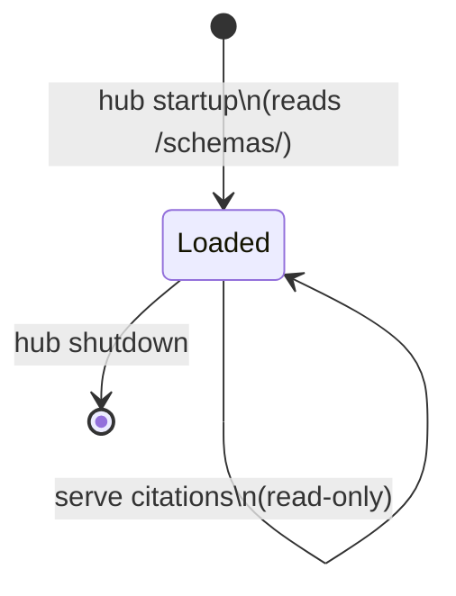
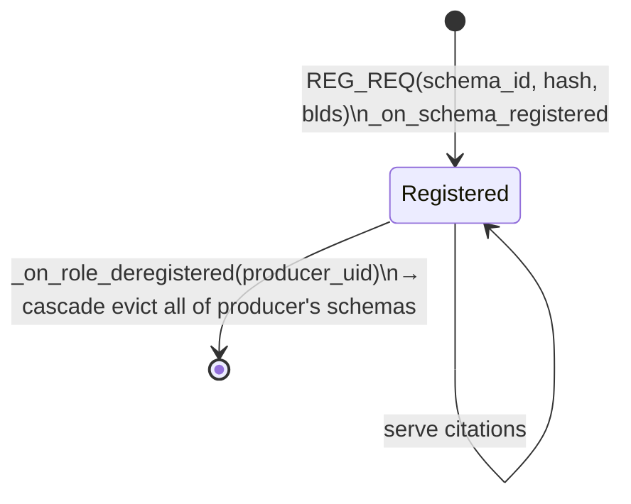

# HEP-CORE-0034: Schema Registry — Owner-Authoritative Model

| Property      | Value                                                                   |
|---------------|-------------------------------------------------------------------------|
| **HEP**       | `HEP-CORE-0034`                                                         |
| **Title**     | Schema Registry — Owner-authoritative records, owner-bound lifecycle    |
| **Status**    | Ratified — pending implementation (2026-04-26)                          |
| **Created**   | 2026-04-26                                                              |
| **Area**      | Schema system (`pylabhub-utils`, broker, hub, all role binaries)         |
| **Supersedes**| `HEP-CORE-0016` (Named Schema Registry)                                  |
| **Depends on**| HEP-CORE-0002 (DataHub), HEP-CORE-0023 (Startup Coordination), HEP-CORE-0024 (Role Directory), HEP-CORE-0033 (Hub Character) |

### Source file reference

Existing files (refactored by this HEP):

| File | Layer | Description |
|------|-------|-------------|
| `src/include/utils/schema_types.hpp` | L3 (public) | `FieldDef`, `SchemaSpec`, `FieldType` — pure data |
| `src/include/utils/schema_blds.hpp` | L3 (public) | BLDS string generation, `SchemaRegistry<T>` template traits |
| `src/include/utils/schema_def.hpp` | L3 (public) | `SchemaDef`, `SchemaLayoutDef`, `SchemaEntry` — file-record types |
| `src/include/utils/schema_field_layout.hpp` | L3 (public) | `compute_field_layout()` — packing-aware field offsets |
| `src/include/utils/schema_utils.hpp` | L3 (public) | `parse_schema_json()`, `compute_schema_hash()`, `resolve_schema()` — fingerprint includes packing (Phase 1) |
| `src/include/utils/schema_library.hpp` | L3 (public) | `SchemaLibrary` — file loader (no authority; produces records for REG_REQ) |
| `src/utils/schema/schema_library.cpp` | impl | File loader implementation |
| `src/include/utils/hub_state.hpp` | L3 (public) | `SchemaRecord`, `schemas` map added to `HubState` (Phase 2) |
| `src/utils/ipc/hub_state.cpp` | impl | `_on_schema_registered`, `_on_schema_evicted`, `_on_role_deregistered` cascade (Phase 2) |
| `src/utils/ipc/broker_service.cpp` | impl | `REG_REQ` / `SCHEMA_REQ` extended; `SCHEMA_REG_NACK` reasons (Phase 3) |

Removed by this HEP (was HEP-0016 Phase 4 design, never relied upon):

| File | Reason |
|------|--------|
| `src/include/utils/schema_registry.hpp` | `SchemaStore` lifecycle module, file watcher, broker query fallback — replaced by hub-as-mutator + `HubState.schemas` |
| `src/utils/schema/schema_registry.cpp` | (same) |

---

## 1. Motivation

HEP-CORE-0016 defined a schema registry on the assumption that **the hash is the
truth** — a name is just a human-readable alias for a checksum, and any party
with the same hash holds an equally valid claim to the schema's identity. That
model is incompatible with two realities that emerged after HEP-0016 was
implemented:

| Reality | Conflict with HEP-0016 |
|---|---|
| **Hub is the single mutator** (HEP-CORE-0033 §G2). All authoritative state lives in `HubState`. There is no neutral "library" that can speak for a schema independently of the hub. | HEP-0016's `SchemaLibrary` + `SchemaRegistry` two-class split has no place to live in a hub-mutator architecture. |
| **Schemas describe channel data**, and channels have a single producer-owner (HEP-CORE-0013, HEP-CORE-0023). | A floating "anyone with the hash wins" registry creates a class of identity dispute that the channel model does not have. The channel's authority should also be the schema's authority. |
| **Fingerprint omits packing** (`compute_schema_hash` today). Two schemas with the same fields and different packing produce identical hashes but distinct memory layouts. | Hash-as-truth fails on this case — two layouts are conflated under one identity. |

This HEP redefines the schema registry around three principles that fit the
post-HEP-0033 architecture: **owners are explicit, lifetime is owner-bound, and
citations are ownership claims, not bag-of-bytes lookups.**

---

## 2. Core principles

### 2.1 Schemas are owned

Every schema record in the hub has exactly one owner — either a registered
producer, or the hub itself. There is no "ownerless" or "shared" record. This
gives every schema a clear answer to "who can change me?", "when do I die?",
and "who is authoritative on disagreement?".

### 2.2 Hash + packing is the fingerprint

The fingerprint of a schema is `BLAKE2b-256(canonical(fields) || packing)`.
Two schemas have the same memory layout if and only if their fingerprints are
equal. This corrects the HEP-0016-era hash, which omitted packing and could
collide unrelated layouts.

### 2.3 Citation is an ownership claim

When a participant cites a schema for a channel, it asserts "this channel's
data conforms to **owner X's** schema with id `id`". The hub validates that
owner X is the channel's authority — which is either the producer of that
channel, or the hub itself for hub-globals adopted by the channel. Hash
equality alone does **not** authorise a third-party citation.

---

## 3. Terminology

| Term | Definition |
|------|-----------|
| **Schema record** | Hub-side entry: `(owner_uid, schema_id) → {hash, packing, blds, registered_at}` |
| **Owner** | Either a registered role uid (`prod.<name>.uid<8hex>`) or the literal `hub` |
| **Public / global schema** | Schema record whose owner is the hub (loaded from `<hub_dir>/schemas/`) |
| **Private schema** | Schema record whose owner is a producer role |
| **Citation** | Reference of the form `(owner_uid, schema_id)` carried in a registration message |
| **Adoption** | A producer chooses a hub-global as its channel schema, by citing `(hub, id)` in REG_REQ |
| **Fingerprint** | `BLAKE2b-256` over canonical field list + packing — bytewise-equal layout iff fingerprint equal |
| **BLDS** | Basic Layout Description String — canonical text form of the field list (from HEP-CORE-0002 §11) |

---

## 4. Schema record model

### 4.1 Hub-side record

```cpp
namespace pylabhub::schema {

struct SchemaRecord
{
    std::string                  owner_uid;     // "hub" or "prod.<name>.uid<8hex>"
    std::string                  schema_id;     // "frame", "lab.sensors.temperature.raw@1", ...
    std::array<uint8_t, 32>      hash;          // BLAKE2b-256(canonical || packing)
    std::string                  packing;       // "aligned" | "packed"
    std::string                  blds;          // canonical BLDS text (for reconstruction)
    std::chrono::system_clock::time_point registered_at;
};

} // namespace pylabhub::schema
```

### 4.2 Stored in `HubState`

```cpp
struct HubState {
    // ... existing fields ...
    std::map<std::pair<std::string, std::string>, SchemaRecord>  schemas;
    //         owner_uid          schema_id
};
```

### 4.3 Channel reference

`ChannelEntry` (HEP-0033 §8) gains a strongly-typed reference to its schema
record:

```cpp
struct ChannelEntry {
    // ... existing fields ...
    std::string                  schema_owner;  // "hub" or producer uid
    std::string                  schema_id;
};
```

The pair `(schema_owner, schema_id)` is a foreign key into `HubState.schemas`.
The hub guarantees referential integrity at mutation time (a channel's
`schema_owner` is always either `hub` or the producer of that channel).

---

## 5. Schema ID format and namespacing

A schema record key is the pair `(owner_uid, schema_id)`. Two records with the
same `schema_id` but different `owner_uid` are distinct, parallel records.

### 5.1 `schema_id` form

```
{namespace}.{name}@{version}     ── namespaced (recommended for hub-globals)
{name}                           ── flat (acceptable for private schemas)
```

- **Namespaced** form (e.g. `lab.sensors.temperature.raw@1`) is required for
  hub-globals, since they live in a shared filesystem tree. Version `@N` is a
  positive integer; `@latest` is reserved for tooling and never appears on the
  wire.
- **Flat** form (e.g. `frame`) is acceptable for private schemas, since
  `(owner_uid, "frame")` is already qualified by the owner. Encouraged for
  short-lived dev producers; large deployments should still use namespaces.

### 5.2 Namespace examples

| Owner | Schema id | Full key |
|---|---|---|
| `hub` | `lab.sensors.temperature.raw@1` | `(hub, lab.sensors.temperature.raw@1)` |
| `hub` | `io.camera.frame.rgb@1`         | `(hub, io.camera.frame.rgb@1)`         |
| `prod.cam_left.uid01234567` | `frame` | `(prod.cam_left.uid01234567, frame)` |
| `prod.cam_right.uid89abcdef`| `frame` | `(prod.cam_right.uid89abcdef, frame)` |

The two `frame` records are parallel, independent, and may have different
fingerprints. They never collide.

---

## 6. Schema JSON file format

Hub globals and (optionally) role-side caches load schemas from JSON files of
this form. The format is unchanged from HEP-0016 §6 except that `packing` is
now part of the fingerprint and is therefore mandatory.

```json
{
  "id":      "lab.sensors.temperature.raw",
  "version": 1,
  "description": "Raw temperature measurement — ADC values + timestamp",

  "slot": {
    "packing": "aligned",
    "fields": [
      {"name": "ts",        "type": "float64", "unit": "s"},
      {"name": "samples",   "type": "float32", "count": 8},
      {"name": "sensor_id", "type": "uint16"},
      {"name": "_pad",      "type": "uint16"}
    ]
  },

  "flexzone": {
    "packing": "aligned",
    "fields": [
      {"name": "cal_factors", "type": "float64", "count": 8},
      {"name": "sensor_uid",  "type": "uint64"}
    ]
  },

  "metadata": {
    "author":  "lab-instruments-team",
    "created": "2026-04-26",
    "tags":    ["temperature", "raw"]
  }
}
```

### 6.1 Field type system

Mirrors `schema_blds.hpp` exactly. No new tokens.

| JSON `"type"` | BLDS | C++ | Bytes |
|---|---|---|---|
| `float32` / `float64` | `f32` / `f64` | `float` / `double` | 4 / 8 |
| `int8` … `int64`      | `i8` … `i64` | `int8_t` … `int64_t`| 1…8 |
| `uint8` … `uint64`    | `u8` … `u64` | `uint8_t` … `uint64_t`| 1…8 |
| `bool` / `char`       | `b` / `c`    | `bool` / `char`      | 1 / 1 |

`"count": N` (N ≥ 1) renders as `tok[N]` in BLDS. Strings and structs are not
permitted; schemas describe a fixed-size flat layout only.

### 6.2 Packing modes

| `"packing"` | Semantics |
|---|---|
| `"aligned"` | Natural alignment (C-struct rules) — default for ctypes interop |
| `"packed"`  | No padding (`_pack_=1`) — explicit byte layout |

**`"packing"` is required.** The JSON loader rejects schemas with neither
explicit packing nor an explicit default. (Today's loader silently defaults to
`"aligned"` — this HEP makes the field mandatory because it is part of the
fingerprint.)

### 6.3 Fingerprint canonical form

```
canonical(slot, fz)
  = "slot:" + canon_fields(slot.fields) + "|pack:" + slot.packing
  + ( "|fz:"  + canon_fields(fz.fields)  + "|fzpack:" + fz.packing  if fz present )

canon_fields(fields) = "name:type:count:length" joined with "|"

fingerprint = BLAKE2b-256(canonical_bytes)
```

This corrects the HEP-0016 fingerprint, which omitted both packing strings.
Migration: see §15 Phase 1.

---

## 7. Lifecycle — owner-bound

### 7.1 Hub-globals

Loaded from `<hub_dir>/schemas/**/*.json` at hub startup. Owner is the literal
string `"hub"`. Lifetime equals the hub process. Globals are read-only at
runtime (no producer can replace or evict them).



### 7.2 Private schemas

Created by `REG_REQ` from a producer. Owner is the producer's uid. Evicted
atomically when the producer deregisters (any reason: explicit DISC,
heartbeat-timeout, hub-initiated FORCE_SHUTDOWN).



### 7.3 No refcount

There is deliberately no consumer/processor refcount on schema records.
Justification:

1. A consumer reading from producer P uses P's channel; if P deregisters, the
   channel itself closes. The consumer's loss of the schema record is already
   covered by channel teardown — no separate "schema unavailable" event is
   needed.
2. A consumer wanting a schema independent of any producer must use a hub
   global. Globals never evict.
3. Refcount would re-introduce bookkeeping (per-citer references, leak hunts
   on role crashes) for a problem cases (1) and (2) already solve.

### 7.4 Mutator surface

All mutations are `HubState` capability ops, called by `BrokerService` under
the HubState mutex (HEP-0033 §G2):

```cpp
class HubState {
public:
    // Registers (owner, id) → record. Idempotent if (owner, id, hash, packing)
    // matches an existing record exactly. Reject on (owner, id) collision with
    // different hash or packing.
    SchemaRegOutcome _on_schema_registered(const SchemaRecord& rec);

    // Cascade-evict all schemas owned by uid. Called from
    // _on_role_deregistered for producer roles. No-op for non-producers.
    size_t _on_schemas_evicted_for_owner(const std::string& owner_uid);

    // Validate citation. Returns CitationOutcome { ok, reason }.
    CitationOutcome _validate_schema_citation(
        const std::string& citer_uid,
        const std::string& channel_producer_uid,
        const std::string& cited_owner,
        const std::string& cited_id,
        const std::array<uint8_t, 32>& expected_hash,
        const std::string& expected_packing);
};
```

---

## 8. Conflict policy — namespace-by-owner

Records are keyed `(owner_uid, schema_id)`. Two producers may both register
`schema_id="frame"`; they live under separate keys and never collide.

| Scenario | Outcome |
|---|---|
| `prod.A.uidXX` registers `frame` (hash H1) | Record `(prod.A.uidXX, frame)` created |
| `prod.B.uidYY` registers `frame` (hash H2) | Record `(prod.B.uidYY, frame)` created — independent |
| `prod.A.uidXX` re-registers `frame` (same hash H1, same packing) | Idempotent — accepted |
| `prod.A.uidXX` re-registers `frame` (different hash) | **Rejected** with `SCHEMA_REG_NACK reason=hash_mismatch_self` |
| Two producers want the same logical schema | Promote it to `<hub_dir>/schemas/`, both adopt `(hub, id)` |

The "two producers want the same schema" case is intentionally pushed onto the
hub-global mechanism. Trying to share a private schema across producers is the
exact thing refcount would have to track; promoting it to a hub-global makes
the lifetime simple and the citation unambiguous.

---

## 9. Citation rules

### 9.1 The citation invariant

> A connection's schema reference must resolve to a record whose owner is
> either (i) the producer of the channel being connected to, or (ii) the hub
> itself. Cross-citation of a third role's schema is rejected even when the
> hash matches.

```mermaid
flowchart TB
    REG[REG_REQ / CONSUMER_REG_REQ / PROC_REG_REQ\nwith schema_owner, schema_id, hash, packing]
    REG --> Q1{cited owner = hub?}
    Q1 -- yes --> Lookup1[lookup hub.schemas&#91;hub,id&#93;]
    Q1 -- no --> Q2{cited owner = channel.producer_uid?}
    Q2 -- yes --> Lookup2[lookup hub.schemas&#91;owner,id&#93;]
    Q2 -- no --> Reject[SCHEMA_REG_NACK\nreason=cross_citation]
    Lookup1 --> Q3{hash + packing match?}
    Lookup2 --> Q3
    Q3 -- no  --> Reject2[SCHEMA_REG_NACK\nreason=fingerprint_mismatch]
    Q3 -- yes --> Accept[register / consume / process]
```



### 9.2 Three legitimate citation paths

**Path A — cite by id (record must already exist).**
Citer sends `schema_owner` + `schema_id` + (optionally) expected hash. Hub
validates.

**Path B — register-and-cite (producer only).**
Producer's REG_REQ carries `schema_owner=<self>` + `schema_id` + full BLDS +
hash + packing. Hub creates the record under the producer's ownership, then
treats subsequent consumer/processor citations of `(producer_uid, schema_id)`
as path A.

**Path C — adopt a hub global (producer only).**
Producer's REG_REQ carries `schema_owner=hub` + `schema_id`. Hub validates
that `(hub, schema_id)` exists with a hash that matches what the producer
publishes, then sets `ChannelEntry.schema_owner=hub`. Subsequent
consumer/processor citations of `(hub, schema_id)` are accepted by §9.1
clause (ii).

### 9.3 Why hash equality is not enough

Bytewise compatibility (equal fingerprint) is a **necessary** condition for a
working channel — it is not a **sufficient** condition for citation:

| Concern | Why hash-only would fail |
|---|---|
| Lifetime | Cited record might evict (its owner deregisters) while the actual channel is alive — citer's schema reference dangles |
| Authority | Producer may publish v2 in the future; cross-citer's intent was tied to a different role's evolution path |
| Namespace truth | `prod.X/frame` *is* X's `frame` — citing it while connected to Y mislabels the connection |
| Diagnostics | Hub has no way to explain channel/schema mismatch if the cited owner is unrelated to the channel |

---

## 10. Wire protocol

### 10.1 `REG_REQ` (producer → hub)

Adds two optional fields:

```
schema_owner : string   default = "" → interpreted as self (producer's uid)
schema_id    : string   default = ""
schema_hash  : bytes32  (existing field, semantics unchanged)
schema_blds  : string   (existing — present for path B; empty for path C)
schema_packing : string  default = "aligned"  (NEW — needed for fingerprint)
```

Path resolution:
- `schema_owner=""` and `schema_id=""` → no schema record created (anonymous channel,
  legacy mode; deprecated, kept for one release cycle for migration ease).
- `schema_owner=""` and `schema_id="X"` → path B. Owner becomes self.
- `schema_owner="hub"` and `schema_id="X"` → path C. Hub validates global exists.
- `schema_owner=<other producer>` → **Rejected**. Producers cannot register against
  another producer's namespace.

### 10.2 `CONSUMER_REG_REQ` and `PROC_REG_REQ`

Add `schema_owner` + `schema_id` + `schema_hash` + `schema_packing`. Hub runs
§9.1 validation. No `schema_blds` — consumers and processors do not register
schemas.

### 10.3 `SCHEMA_REQ` / `SCHEMA_ACK`

Generalised from HEP-0016's channel-keyed lookup to owner+id keyed lookup:

```
SCHEMA_REQ  { owner: string, schema_id: string }
SCHEMA_ACK  { owner: string, schema_id: string,
              hash: bytes32, packing: string, blds: string }
```

Allows any participant (post-handshake) to fetch a record by owner+id. The
HEP-0016-era "what schema does channel X carry?" query is replaced by reading
`ChannelEntry.{schema_owner, schema_id}` from the existing channel listing
RPC, then issuing `SCHEMA_REQ` on the result.

### 10.4 `SCHEMA_REG_NACK` reasons

A new error class for schema-related registration failures. Reasons:

| reason | Meaning |
|---|---|
| `cross_citation`        | cited owner is neither hub nor channel's producer |
| `unknown_owner`         | cited owner uid not registered as a producer (and not `hub`) |
| `unknown_schema`        | `(owner, id)` record does not exist |
| `fingerprint_mismatch`  | record exists but hash or packing differs from cited |
| `hash_mismatch_self`    | producer re-registers own id with different fingerprint |
| `forbidden_owner`       | producer attempts to register under another producer's owner uid |
| `missing_packing`       | REG_REQ omitted packing (now mandatory) |
| `missing_blds`          | path B used but BLDS string not provided |

These are emitted via the standard `REG_NACK` envelope with a structured
`reason` field; they are **not** a separate wire frame.

---

## 11. Hub-side state and mutators

### 11.1 New fields in `HubState`

```cpp
struct HubState {
    // ... existing ...
    std::map<std::pair<std::string, std::string>, SchemaRecord>  schemas;
};

struct ChannelEntry {
    // ... existing ...
    std::string schema_owner;   // "hub" or producer uid
    std::string schema_id;      // empty only if anonymous (legacy)
};
```

### 11.2 Capability ops (broker calls)

```cpp
class HubState {
public:
    SchemaRegOutcome _on_schema_registered(const SchemaRecord&);
    size_t           _on_schemas_evicted_for_owner(const std::string& owner_uid);
    CitationOutcome  _validate_schema_citation(/* see §7.4 */);
};
```

`_on_role_deregistered` (already exists) gains a single line: if the
deregistered role is a producer, call `_on_schemas_evicted_for_owner(uid)`
inside the same mutex section. Atomic with channel teardown.

### 11.3 Counters (HEP-0033 §9.4)

Three counters added to `BrokerCounters`:

| Counter | Bumped when |
|---|---|
| `schema_registered_total`        | `_on_schema_registered` returns Created |
| `schema_evicted_total`           | each record removed by `_on_schemas_evicted_for_owner` |
| `schema_citation_rejected_total` | `_validate_schema_citation` returns non-ok |

### 11.4 Inbox schemas (HEP-CORE-0027 integration)

The inbox messaging protocol (HEP-CORE-0027) is receiver-authoritative — the
inbox owner provides schema, packing, and checksum policy at REG_REQ time, and
senders adopt these values via `ROLE_INFO_REQ` (HEP-0027 §4.1, line 132-133;
checksum policy explicitly receiver-dictated, §4.1 step 7-8). This maps
directly onto HEP-0034's owner model.

**Record key.** Inbox schemas live in `HubState.schemas` under
`(receiver_uid, "inbox")`. The schema_id is the literal string `"inbox"`; one
inbox per role uid. A role that owns both a producer-channel schema and an
inbox schema gets two records: `(role_uid, "frame")` and `(role_uid, "inbox")`
— no collision (§8 namespace-by-owner).

**Lifecycle.** Identical to private producer schemas. Created from the
receiver's REG_REQ when the inbox-config block is present and non-empty;
cascade-evicted from `_on_role_deregistered` along with the role's other
schema records, in the same mutator section. No special path.

**Citation by senders.** Senders cite via path A `(receiver_uid, "inbox")` in
`CONSUMER_REG_REQ` / `PROC_REG_REQ` (or in any other message that establishes
an inbox connection). The §9.1 invariant remains intact: senders are
connecting to the inbox owner, so the cited owner equals the channel
authority. Cross-citation — e.g., a sender citing role A's `inbox` while
connecting to role B's inbox — is rejected with `cross_citation`.

**Wire-protocol mapping.** The existing inbox fields in REG_REQ
(`inbox_endpoint`, `inbox_schema_json`, `inbox_packing`, `inbox_checksum` —
HEP-0027 §4.1 line 140) carry the equivalent of schema_id=`"inbox"`, BLDS,
packing, and checksum policy. Phase 3 implementation routes these fields
through `_on_schema_registered({owner: receiver_uid, id: "inbox", ...})`
inside the same handler that processes the rest of REG_REQ. The wire-format
field names are retained for HEP-0027 compatibility; only the broker-side
storage is unified into `HubState.schemas`.

**Discovery.** HEP-0027's `ROLE_INFO_REQ` flow (§4.1 step 5) for fetching
inbox metadata remains supported and is the recommended path for
sender-side configuration. `SCHEMA_REQ(receiver_uid, "inbox")` is an
equivalent lower-level fallback that returns just the schema record;
`ROLE_INFO_REQ` additionally returns the endpoint and checksum policy.

---

## 12. Hub directory — `<hub_dir>/schemas/`

Hub globals live under `<hub_dir>/schemas/` in the same namespace tree HEP-0016
described:

```
<hub_dir>/schemas/
├── lab/sensors/temperature.raw.v1.json
├── lab/sensors/pressure.differential.v2.json
├── io/camera/frame.rgb.v1.json
└── control/motor/setpoint.v1.json
```

ID ↔ path mapping unchanged: dots become path separators; `@N` becomes `.vN`
filename suffix.

`HubDirectory` (per HEP-0033 §7) gains an accessor for the schemas root:

```cpp
class HubDirectory {
public:
    std::filesystem::path schemas_dir() const;  // <base_dir>/schemas
};
```

`--init` of the hub creates an empty `schemas/` subdir. Operators populate it
manually. The hub recursively scans on startup; failure to parse any file
fails hub startup with a precise `<path>: <error>` message.

---

## 13. Role-side cache — `<role_dir>/schemas/`

Roles **may** carry a local `<role_dir>/schemas/` directory. This is purely a
local cache used to construct registration messages — it is **not**
authoritative.

Allowed role uses:

| Role | Use of local schemas dir |
|---|---|
| Producer | Source of truth for path-B registration: producer reads its own JSON, sends BLDS + hash to hub |
| Consumer | Optional pre-flight: read local file to compute expected hash before connecting; never authoritative |
| Processor | Same as consumer for input; same as producer for output |

A role with no local schemas dir is fully valid:

- Producer that uses path C (adopts a hub global) needs no local file.
- Producer using compile-time C++ schema (`PYLABHUB_SCHEMA` macros) generates
  the BLDS in code, no file needed.
- Consumer/processor can resolve via `SCHEMA_REQ` after handshake.

Role-side schema files do **not** participate in conflict resolution. If a
local file disagrees with the hub's record, the hub wins (causes
`fingerprint_mismatch` REG_NACK, fixable by updating the local file).

---

## 14. C++ integration

### 14.1 `ProducerOptions` / `ConsumerOptions`

```cpp
struct ProducerOptions {
    // ... existing fields ...
    std::string schema_owner;   // "" = self; "hub" = adopt global
    std::string schema_id;      // record id under chosen owner
    // schema_hash, schema_packing inferred from <F>/<D> + opts.packing
};

struct ConsumerOptions {
    // ... existing fields ...
    std::string expected_owner;
    std::string expected_schema_id;
    std::string expected_packing;   // default "aligned"
};
```

### 14.2 Compile-time fingerprint

The C++ template path provides two macros — one per packing mode — and
`SchemaInfo::compute_hash()` folds packing into the canonical form
(HEP-CORE-0034 §6.3) so the fingerprint matches what `compute_schema_hash`
produces for an equivalent JSON schema.

```cpp
// Natural-aligned struct (the common case). Existing call sites do not
// change; the macro now sets `SchemaRegistry<T>::packing == "aligned"`.
struct RawTempSlot { double ts; float samples[8]; uint16_t sensor_id; uint16_t _pad; };
PYLABHUB_SCHEMA_BEGIN(RawTempSlot)
  PYLABHUB_SCHEMA_MEMBER(ts)
  PYLABHUB_SCHEMA_MEMBER(samples)
  PYLABHUB_SCHEMA_MEMBER(sensor_id)
  PYLABHUB_SCHEMA_MEMBER(_pad)
PYLABHUB_SCHEMA_END(RawTempSlot)

// Explicitly-packed struct.  The struct itself MUST be declared packed
// (`#pragma pack(push,1)` or `__attribute__((packed))`); the
// `_PACKED` macro records that intent in `SchemaRegistry<T>::packing`
// so the fingerprint reflects the actual layout.
#pragma pack(push, 1)
struct PackedFrame { double ts; uint8_t flags; int32_t value; };
#pragma pack(pop)
PYLABHUB_SCHEMA_BEGIN_PACKED(PackedFrame)
  PYLABHUB_SCHEMA_MEMBER(ts)
  PYLABHUB_SCHEMA_MEMBER(flags)
  PYLABHUB_SCHEMA_MEMBER(value)
PYLABHUB_SCHEMA_END(PackedFrame)
```

Two separate macros (rather than a single macro with a packing argument)
were chosen so existing call sites do not need to add `, aligned` to every
schema declaration, and so the call site reads as documentation: `_PACKED`
in the macro name is a visible signal that the struct's layout deviates
from the C++ default.

> **Implementation note (Phase 1, 2026-04-27).** A compile-time
> `static_assert` that verifies `sizeof(T)` matches the size implied by the
> declared packing is desirable but deferred — the BLDSBuilder is a runtime
> string accumulator, so there is no constexpr field-size info available at
> macro-expansion time. Today the failure mode is "hash mismatch at
> REG_REQ" rather than "compile error", which is correct but less friendly.
> A future revision may add the assertion via a parallel constexpr
> accumulator.

### 14.3 Validation at `create<F,D>()`

When `opts.schema_id` is set:

1. If `opts.schema_owner == "hub"` — hub-global adoption (path C). `create()`
   issues `SCHEMA_REQ(hub, id)`, verifies hash/packing match `<F>/<D>` + opts,
   throws `SchemaValidationException` on mismatch.
2. Otherwise — self-registration (path B). `create()` constructs a `SchemaRecord`
   from `<F>/<D>` traits, sends it in `REG_REQ`, handles `REG_NACK
   reason=hash_mismatch_self` as a hard error.

### 14.4 Anonymous mode (legacy)

`opts.schema_id = ""` continues to work. The producer registers without a
schema record; consumers can still validate via raw hash equality on the wire
(today's behaviour). One release cycle of deprecation; removed when all
in-tree code migrates.

---

## 15. Phased delivery

### Phase 1 — Fingerprint correction (foundation) — ✅ shipped 2026-04-27

- `compute_schema_hash()` (SchemaSpec runtime path) includes packing in
  canonical form per §6.3.
- `SchemaInfo::compute_hash()` (C++ template path) includes packing
  (`SchemaInfo` gained a `packing` field; `SchemaRegistry<T>::packing`
  is set by the macro and propagated through `generate_schema_info<T>()`).
- `compute_inbox_schema_tag()` (HEP-0027 inbox queue) includes packing
  in its 8-byte tag — the same fingerprint-correction principle applied
  to the inbox wire path.
- `SchemaSpec` and `SchemaLayoutDef` both carry per-section packing.
- `parse_schema_json()` and the file loader's `parse_layout()` reject
  schemas / layout sections without explicit packing.
- New macro `PYLABHUB_SCHEMA_BEGIN_PACKED` for opt-in packed structs;
  `PYLABHUB_SCHEMA_BEGIN` defaults to `packing="aligned"` (unchanged
  call-site syntax).
- All in-tree configs, role `--init` templates, and test fixtures
  updated to declare packing explicitly.
- Tests: same-fields-different-packing → distinct hashes (slot,
  flexzone, and inbox paths); macro path verified separately.
- **Wire-incompatible** with pre-Phase-1 binaries; pre-1.0, no migration
  burden.

### Phase 2 — `HubState` schema records + cascade eviction

- Add `SchemaRecord` and `HubState.schemas` map.
- Add `ChannelEntry.{schema_owner, schema_id}`.
- Implement `_on_schema_registered`, `_on_schemas_evicted_for_owner`,
  `_validate_schema_citation` capability ops.
- Wire `_on_role_deregistered` cascade for producers.
- Tests: producer dereg evicts schemas atomically with channel close;
  re-register idempotency; conflict-policy (a) two-producer same id.

### Phase 3 — Wire protocol + broker dispatch

- Extend `REG_REQ`, `CONSUMER_REG_REQ`, `PROC_REG_REQ` with schema fields.
- New `SCHEMA_REG_NACK` reasons in `REG_NACK` envelope.
- `SCHEMA_REQ`/`SCHEMA_ACK` generalised to owner+id keying.
- Broker dispatcher routes through §9.1 validation.
- Inbox handler (HEP-0027 REG_REQ inbox-config block) calls
  `_on_schema_registered({owner: receiver_uid, id: "inbox", ...})` inline;
  inbox sender REG_REQ (CONSUMER_REG_REQ / PROC_REG_REQ that bind an inbox)
  routes through `_validate_schema_citation` against `(receiver_uid, "inbox")`.
  Wire field names from HEP-0027 retained for compatibility — only the
  broker-side storage is unified into `HubState.schemas` (§11.4).
- Tests: cross-citation rejected, fingerprint mismatch rejected, hub-global
  adoption succeeds, path A/B/C round-trips, inbox citation A round-trip,
  inbox cross-citation rejected.

### Phase 4 — `SchemaLibrary` refactor

- Remove `SchemaRegistry` lifecycle module + file watcher (HEP-0016 Phase 4).
- `SchemaLibrary` becomes a stateless file loader returning `SchemaRecord`
  values. No singleton, no broker query.
- Hub-side: hub startup walks `<hub_dir>/schemas/` and calls
  `_on_schema_registered({owner: "hub", ...})` for each file.
- Tests: hub startup loads all globals; malformed file fails startup with path.

### Phase 5 — Client-side citation API

- `ProducerOptions::{schema_owner, schema_id}`, `ConsumerOptions::expected_*`.
- `create<F,D>()` issues `SCHEMA_REQ` for path C; sends BLDS for path B.
- New `PYLABHUB_SCHEMA_BEGIN_PACKED` macro for explicitly-packed C++ structs;
  `PYLABHUB_SCHEMA_BEGIN` retains its existing one-argument form (defaults
  to `packing="aligned"`).
- Tests: producer adopts hub-global, consumer cites it, all paths round-trip.

### Phase 6 — Docs sweep + HEP-0016 closure

- This HEP marks ratified and Phase-1..5 complete.
- HEP-0016 marked Superseded.
- HEP-0033 §7/§8/§9.4 cross-reference HEP-0034.
- HEP-0024 references local `<role_dir>/schemas/` as cache-only.
- Code review of HEP-0034 implementation.

---

## 16. Relationship to existing HEPs

| HEP | Relationship |
|---|---|
| HEP-CORE-0002 (DataHub) | BLDS canonical form unchanged. Fingerprint inputs gain packing. |
| HEP-CORE-0013 (Channel Identity) | Channel still has one producer authority. Schema authority now follows: producer or hub. |
| HEP-CORE-0016 (Named Schema Registry) | **Superseded by this HEP.** |
| HEP-CORE-0023 (Startup Coordination) | `_on_role_deregistered` cascade extended to schemas. State machine unchanged. |
| HEP-CORE-0024 (Role Directory Service) | Role-side `<role_dir>/schemas/` is local cache only — see §13. |
| HEP-CORE-0027 (Inbox Messaging) | Inbox schemas integrated as `(receiver_uid, "inbox")` records owned by the inbox receiver — see §11.4. Existing HEP-0027 wire fields retained; broker-side storage unified into `HubState.schemas`. |
| HEP-CORE-0030 (Band Messaging) | Band payloads are free-form JSON (HEP-0030 §1, §326, §413); no schema records, no HEP-0034 integration. |
| HEP-CORE-0033 (Hub Character) | Schema records live in `HubState.schemas`. §G2 hub-as-mutator invariant covers schema mutations. §9 message-processing contract applies to schema messages. |

---

## 17. Open questions

| # | Question | Status |
|---|----------|--------|
| 1 | Should hub support hot-reload of `<hub_dir>/schemas/`? | Deferred — operationally rare; hub restart is acceptable for v1 |
| 2 | Should consumer cache hub-global hashes in `<role_dir>/schemas/` automatically on first SCHEMA_REQ? | Deferred — manual operator copy is acceptable for v1 |
| 3 | Should `(owner, id)` allow owner=`band` for HEP-0030 broadcast schemas? | Deferred to HEP-0030 v2 — not currently needed |
| 4 | Should the hub persist `HubState.schemas` across restarts? | No — globals come from filesystem, private records die with their owners |
| 5 | Should there be a per-producer record cap? | Deferred — unbounded for v1; revisit if abuse observed |
