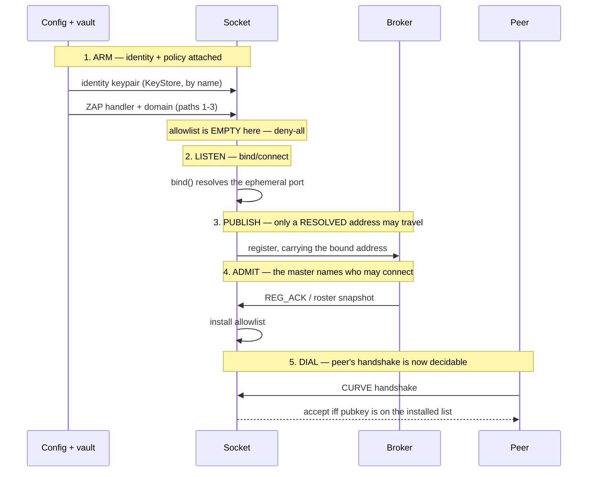

# HEP-CORE-0035: Hub-Role Authentication and Federation Trust

| Property        | Value                                                                                              |
|-----------------|----------------------------------------------------------------------------------------------------|
| **HEP**         | `HEP-CORE-0035`                                                                                    |
| **Title**       | Hub-Role Authentication and Federation Trust                                                       |
| **Status**      | 🚧 **PARTIAL — implementation in flight.** Authoritative design; supersedes the legacy `RoleIdentityPolicy` placeholder documented in HEP-CORE-0009 §2.7.  Subsection state (updated 2026-08-07): §4.1 Layer 1 — ZAP on the CTRL ROUTER ✅ (broker-side gate against `known_roles[]` ∪ `peers[].pubkey_z85`); §4.2 pubkey index — single source of truth ✅ (`PeerAuthority` / `PubkeyOrigin` in `src/include/utils/security/pubkey_origin.hpp`; the broker arms its ZAP allowlist from `zap_allowlist()` at startup); §4.3 federation-trust policy modes ⏳ — the Layer-2 gate is designed, not built, and lands with the federation design, not before it; §4.6 (file-ACL discipline) ✅; §4.6.5 (test-only bypass discipline — production has no CURVE/admission knob) ⏳ landing phase; §4.7 (runtime key handling) ⚠ **mechanisms ship elsewhere — do not build §4.7.4's module; see the note below this table**; §4.8 (vault + CLI + bootstrap) ✅; legacy placeholder retirement ✅ (`RoleIdentityPolicy` enum + `check_role_identity` + `channel_policy_overrides` + their L2/L3 tests deleted; `broker::KnownRole` retained as the ZAP pubkey carrier).  Step-by-step in `docs/todo/AUTH_TODO.md`. |
| **Created**     | 2026-04-29                                                                                         |
| **Area**        | Framework Architecture (`BrokerService` socket layer, `HubConfig`, `BrokerService::Config`, federation) |
| **Depends on**  | HEP-CORE-0022 (Federation), HEP-CORE-0024 (Role Directory), HEP-CORE-0033 (Hub Character)          |
| **Related**     | HEP-CORE-0036 (Authenticated Connection Establishment) — adds Layer-3 data-plane peer authentication for ZMQ on top of HEP-0035's Layer-1+2 (see §4.1).  HEP-0036 also adds §4.6 (file-ACL discipline) and §4.7 (runtime key handling) to this HEP.  **HEP-0036 §3.6 is the load-bearing diagram for control-plane symmetry across transports**; **HEP-0036 §I11.1 is the load-bearing diagram for the cache architecture (who writes, who reads, who is the authority)** — both are referenced from HEP-0041, HEP-0017, HEP-0023, and HEP-0033.  HEP-CORE-0041 (SHM Channel Auth) — counterpart to HEP-0036 for the SHM data plane; SUPERSEDES the `shm_secret` model that earlier HEP-0035 + HEP-0036 drafts described (any `shm_secret` reference in this HEP — §4.1 boundary note, §6.1 §4.6.5 §4.7 reference paragraphs, §8.1 Phase 6 ZAP-pubkey scope, task #79 — is informational-historical pending the HEP-0041 Phase 1 implementation; the active SHM auth contract lives in HEP-0041 §9 D1-D8 + §10 phasing). |
| **Supersedes**  | HEP-CORE-0009 §2.7 (`RoleIdentityPolicy` reference) — see §6                                         |
| **Blocks**      | HEP-CORE-0033 §15 Phase 1 re-introduction of `broker.{known_roles, role_identity_policy, channel_policy_overrides}` in `HubBrokerConfig` |

---

> **§4.7 runtime key handling — the mechanisms exist, the module in §4.7.4
> must not be built.** §4.7.2 requires three measures. All three ship today,
> in facilities that postdate this section and own the subject properly:
> page-locking is `LockedKey` (`sodium_malloc` — mlock, guard pages, canary)
> inside the **KeyStore**, HEP-CORE-0040 §5; core-dump suppression
> (`setrlimit(RLIMIT_CORE, 0)`, `prctl(PR_SET_DUMPABLE, 0)`) and
> compiler-proof zeroing (`memzero`) are the **secure memory subsystem**,
> HEP-CORE-0043. The separate `src/utils/security/runtime_key_handling.{hpp,cpp}`
> utility that §4.7.4 prescribes does **not** exist and building it would add a
> second security surface beside the one that already carries the contract —
> read §4.7.4 as superseded, not as pending work.
> *What is genuinely unverified is coverage, not mechanism:* whether every
> in-memory copy of a secret named in §4.7.2 actually routes through those
> facilities has not been traced end to end.

> **REG-family wire authority (2026-07-12):** REG_REQ / CONSUMER_REG_REQ / DEREG_REQ / ENDPOINT_UPDATE_REQ / GET_CHANNEL_AUTH_REQ / CHANNEL_AUTH_APPLIED_REQ / CHANNEL_AUTH_CHANGED_NOTIFY / CHECK_PEER_READY_REQ wire format, admission-gate ordering, and retirement policy are owned by **HEP-CORE-0046 (REG Protocol Redesign)**.  This HEP references these wires only where behavior specific to its own subsystem is described; the wire authority always resolves to HEP-CORE-0046, and any new REG-family field / message / gate MUST be added there first.  See `docs/IMPLEMENTATION_GUIDANCE.md § "REG Protocol Wire Discipline (HEP-CORE-0046)"` for the rule that binds this to code.

## 1. Status banner

**This HEP is the design contract — implementation is in flight.**  As
of 2026-06-03 the file-ACL discipline (§4.6, task #101), the vault +
CLI + bootstrap (§4.8, PeerAdmission Phase B), and the Layer-1 ZAP
handler on the broker CTRL ROUTER (§4.1, PeerAdmission Phase D step
D2) are shipped.  See the status banner in the metadata table above
for the per-subsection ✅/⏳ map and `docs/todo/AUTH_TODO.md` for
step-by-step.

The legacy placeholder code
(`role_identity_policy.hpp::RoleIdentityPolicy`,
`BrokerServiceImpl::check_role_identity`,
`BrokerService::Config::{role_identity_policy, channel_policy_overrides}`,
and its L2/L3 tests) pre-dated the CURVE-required model and the
HEP-CORE-0022 federation model.  It did string-matching on JSON
identity fields without consulting any pubkey, and was never
load-bearing for the security story this HEP describes.

**Retired 2026-07-20 (§8 Phase 6).**  The enum, the gate, the
`role_identity_policy` / `channel_policy_overrides` config fields, and
the tests are deleted.  What remains — and is load-bearing — is
`BrokerService::Config::known_roles` (a `std::vector<broker::KnownRole>`
loaded from the encrypted vault): it is the input for the §4.1 Layer-1
ZAP allowlist (D2), `KnownRolesStore::as_peer_allowlist()`.  The ZAP
handler keyed on `known_roles[].pubkey_z85` is the sole role-identity
gate.  `broker::KnownRole` therefore stays (contrary to the original §8
Phase 6 line that listed it for deletion — that predated the §4.8 vault
migration that made it the pubkey carrier).

---

## 1.5. What the placeholder really is (addendum, 2026-05-13)

> ⚠ **Historical (retired 2026-07-20).**  The placeholder described in
> this section — `RoleIdentityPolicy`, `check_role_identity`,
> `ChannelPolicyOverride` — was **deleted** per §8 Phase 6.  Present-tense
> descriptions below refer to the code as it stood before deletion; they
> are retained to explain *why* it was retired.  Live enforcement is the
> ZAP pubkey allowlist (§4.1).
>
> Added 2026-05-13 in response to "what is this *channel access*
> policy really doing?"  The placeholder code was named for its
> historical role at REG_REQ time and for the per-channel glob
> override list, but neither label captures the subject of
> verification.  This section grounds the placeholder in the code as it
> was, so a reader knows precisely what was retired.

### 1.5.1. Subject, action, and selector

The placeholder is a **role-identity verification policy applied at
broker registration time**:

- **Subject:** the role's self-asserted identity strings `role_name`
  + `role_uid` placed in the REG_REQ / CONSUMER_REG_REQ body by the
  registering role itself.
- **Action gated:** the broker's acceptance of a channel registration
  (`BrokerServiceImpl::check_role_identity` is called from
  `handle_reg_req` and the consumer-registration handler; see
  `src/utils/ipc/broker_service.cpp` `check_role_identity` definition
  and call sites).
- **Selector:** the channel name being registered — used only to look
  up which strictness mode applies (`channel_policy_overrides[]`
  list, first-glob-match wins, falling back to the hub-wide default).

The legacy `ConnectionPolicy` / "channel access policy" names
misdescribed the subject in two ways: (a) the gate has nothing to do
with the ZMQ connection layer (CURVE handles handshake; this gate
runs at the *application* protocol layer after a message arrives);
(b) "channel access" suggested the channel itself is being gated,
when the channel is the lookup key for *which role-identity rule*
applies.  Renamed to `RoleIdentityPolicy` + `ChannelPolicyOverride`
on 2026-05-13 to reflect this.

### 1.5.2. The four configuration surfaces involved

A future implementer touching this gate will navigate four surfaces.
Their relationship today (post-rename, pre-HEP-0035):

| Surface                       | Owns                                                                                                                                            | Today's wiring to the gate                                                                                                                              |
|-------------------------------|-------------------------------------------------------------------------------------------------------------------------------------------------|----------------------------------------------------------------------------------------------------------------------------------------------------------|
| **Role directory + RoleConfig** (per-role JSON parsed by `pylabhub::config::RoleConfig`) | `IdentityConfig{uid, name}` for the role binary                                                                                                | Role copies `identity().uid` / `identity().name` into `BrokerRequestComm::Config` → REG_REQ body (`role_uid` / `role_name`).  This is what the gate reads. |
| **Hub directory + HubConfig** (per-hub JSON parsed by `pylabhub::config::HubConfig` → `HubBrokerConfig`)                                       | Broker endpoint, heartbeat fields, checksum policy, federation peers                                                                            | **Deliberately omits** `role_identity_policy`, `known_roles`, `channel_policy_overrides` per `hub_broker_config.hpp:13-15`.  The gate's config fields therefore cannot be set from hub.json today. |
| **`BrokerService::Config`** (C++ struct constructed by `HubHost`)                                                                              | `role_identity_policy` (default `Open`), `known_roles`, `channel_policy_overrides` — the gate's actual inputs                                   | Set to defaults by `HubHost` (because `HubConfig` doesn't carry these).  **Only callers that construct `BrokerService::Config` directly** (i.e., this HEP's L3 test) can set non-default values. |
| **`HubState`** (in-memory state owned by `HubHost`)                                                                                            | Channel registry, schema registry, producer/consumer entries with their CURVE pubkeys, federation peers                                         | Today: holds CURVE pubkeys on entries but has **no pubkey-provenance index** — the `PubkeyOrigin` index this HEP designs (§4.2) is unimplemented.  Gate does **not** consult HubState. |

Net consequence today:
1. The check function runs at every REG_REQ in production.
2. It always evaluates `policy == Open` (because nothing sets it
   otherwise from hub.json).
3. The Tracked / Required / Verified branches are unreachable from
   production callers; only the L3 test exercises them via direct
   `BrokerService::Config` construction.

### 1.5.3. Why the placeholder cannot be production-wired by simply re-adding the fields

`HubBrokerConfig`'s comment ("Auth/access fields deliberately
omitted ... See HEP-CORE-0035 for the design that must land before
they return") is precise.  Re-introducing the auth fields into the
parser *without* the rest of this HEP would re-enable the legacy
string-match enforcement at the application layer — but production
roles can claim any `role_name` + `role_uid` they like in REG_REQ
(the strings are self-asserted), so re-adding the fields alone would
provide no actual authentication.  The CURVE socket-layer guarantee
that "this connection comes from a key the operator authorized"
requires the ZAP handler designed in §4.1, not anything in the
placeholder.

---

## 1.6. Premise for this HEP's implementation (added 2026-05-13)

This HEP cannot be implemented in isolation.  Two foundation pieces
must land first, in order:

### 1.6.1. HubState completion

`PubkeyOrigin` (§4.2) is an index inside `HubState`.  Both the ZAP
handler (Layer 1) and the federation-trust gate (Layer 2) read from
that single index.  HubState's data model needs to stabilize before
the index can be added without inviting churn:

- The shape of `ChannelEntry` / `ProducerEntry` / `ConsumerEntry` /
  federation peer entries determines what pubkey-bearing records the
  index covers.
- The thread-safety contract for HubState reads/writes determines
  whether the ZAP handler (running on a separate `inproc` socket
  per RFC 27) needs lock-free read paths into the index.
- The lifecycle of pubkey-bearing entries (when do they get added /
  removed) determines the index's update protocol.

These questions belong to the broader HubState refactor work, not to
this HEP.  Adding pubkey provenance to a HubState model still in
flux would conflate concerns and likely require rework.

### 1.6.2. `plh_hub` binary completion

The hub binary (`plh_hub`) is what owns the hub config + HubHost
composite end-to-end: it loads hub.json, constructs `HubConfig` →
`HubBrokerConfig`, hands it to `HubHost::startup()`, and runs the
main loop.  Today the binary is still finding its shape (D2.3 +
ongoing work).  Auth concerns — hot-reloading the allowlist, AdminService
RPCs for `add_known_role` / `remove_known_role` (currently deferred
per `admin_service.cpp:315-326`), federation-peer hot-add/remove,
audit logging — all live in the binary.  Adding auth list management
to a binary whose shape is still moving would be premature; the
authorization machinery is mounted *on top of* the binary's
established lifecycle.

### 1.6.3. Then: auth-list propagation + management design

Once the foundations are in place, the open questions in §7 become
addressable, plus:

- **Source of truth for `known_roles`.** Static (hub.json) only?
  Hot-reloadable via SIGHUP + file watch?  AdminService RPC
  (`add_known_role` / `remove_known_role`) over an
  operator-authenticated channel?  Some hybrid?
- **Propagation from a hub to its own roles.**  Resolved — §4.9.
  Eventual, over the periodic work a role already performs, with the
  hub's snapshot replicated whole and roles confirming the version they
  hold.
- **Propagation across a federation.**  Still open.  When Hub-A adds a
  role pubkey, does Hub-B learn about it automatically (via augmented
  HUB_PEER_HELLO per §4.4)?  This is agreement *between* hubs, which
  §4.9 deliberately does not address — it defines replication from one
  hub to the roles that hub owns.
- **Audit log model.**  Which Layer-1 + Layer-2 decisions get logged
  at what level?  Where do the logs live (per-hub stdout, central
  syslog, structured admin event stream)?
- **Operator workflow for key rotation.**  Resolved 2026-07-20 —
  hard-cut, no grace window (§7 open question #1).  Edit the
  `known_roles` vault, hard-reload the broker, role re-REGs with its
  new key; enforced by `PUBKEY_MISMATCH` (HEP-CORE-0046
  I-KEY-ROTATION-VIA-DEREG).

None of these are blockers for *this HEP's design* — they are
prerequisites for *implementation* of Phase 1.  Until they're
answered, the placeholder stays in place as the only role-identity
gate; the L3 test guards it against accidental regressions during
the wait.

---

## 2. Invariants (the architectural decision being formalized)

These were ratified prior to this HEP (decision logged 2026-04-29
during Phase 1 review of `HubBrokerConfig`):

- **CURVE is required.** Every role↔hub interaction is encrypted +
  authenticated by ZMQ CURVE. NULL-mech connections to the broker
  ROUTER are not supported in production. There is no operator or
  config knob that disables CURVE — see §4.6.5 for the test-only
  bypass and its strict scope.

  **Enforcement point — `ZmqQueue::start()` guard (AUTH_TODO §C5,
  #161).**  After all CURVE setsockopts and bind/connect have
  completed, `start()` queries libzmq directly via
  `zmq_getsockopt(ZMQ_MECHANISM)` and refuses to succeed if the
  answer is not `ZMQ_CURVE`.  The queue cannot return from `start()`
  in a state where data flows on a non-CURVE socket; a regression
  that loses the CURVE wiring surfaces immediately at the start()
  call site.  The negotiated state is observable to any caller via
  the public `ZmqQueue::mechanism()` accessor — a thread-safe
  atomic read returning the `Mechanism` enum
  (`Uninitialized` / `Curve`; a "started without CURVE" state is not
  representable — it surfaces as a failed start, not as a mechanism
  value).  Scripts, telemetry,
  and tests use this single observation point to assert the
  invariant:

  ```cpp
  EXPECT_EQ(queue.mechanism(), pylabhub::hub::Mechanism::Curve);
  ```
- **Admission gating is unconditional on every ROSTERED plane.** The
  Layer-1 ZAP allowlist (§4.1) is not a separable policy layer that
  operators or callers can toggle. Whenever a CURVE-server socket is
  bound on a plane whose peers are named by a roster — broker CTRL
  ROUTER per §4.1, producer-side data ROUTER per HEP-CORE-0036 §7,
  role inbox ROUTER per HEP-CORE-0027 §3.5 — a `PeerAdmission` handler
  MUST be installed on the shared ZAP inproc REP and MUST enforce
  against the relevant allowlist. Empty allowlist = deny-all (§4.8.4
  bootstrap); there is no permissive-mode runtime flag.

  **The admin plane is the one CURVE-server socket that is NOT
  rostered, and this is deliberate** (§4.10.4).  An operator is not a
  role and appears in no roster, so there is no list to enforce
  against; client authority is the session token instead.  Stated as a
  scope here because the earlier wording said "whenever a CURVE-server
  socket is bound", which the admin ROUTER contradicts — it sets
  `zap_enforce_domain` with no domain, deliberately short-circuiting
  ZAP.  The invariant was always about rostered planes; it now says so.
- **Identity comes from the handshake, never from the message.**
  The CURVE handshake proves which key is on the other end of a
  connection.  That answer is captured at ingress and carried to
  every handler.  No control-plane handler may derive a caller's
  identity from a wire field, from the frame-0 routing id, or from
  the peer's network address — those are all values the caller
  chooses for itself.  A message field naming an identity is a
  *claim*, and a claim is only ever checked against the connection's
  proven identity, never trusted in its place.
- **Exactly one structure answers "what does this key mean to this
  hub."**  The pubkey origin index (§4.2) is that structure.  Both
  the Layer-1 ZAP handler and every Layer-2 consumer read it.  A
  second lookup table over the same vault data — an allowlist built
  by iterating the config, a per-handler scan of `known_roles` — is
  a duplicate that will drift, and is forbidden.
- **The routing id is a reply address, not a trust claim.**  The
  frame-0 identity a DEALER sets at connect exists so a ROUTER can
  address the reply.  It is chosen by the client and carries no
  authority.  No gate may accept, reject, or attribute a message
  based on it, and nothing keyed for security purposes — replay
  windows, per-sender sequence state, audit attribution — may be
  indexed by it.
- **Speaking for another identity is a declared property of a link.**
  A caller normally acts for itself: the identity it claims must be
  the identity it authenticated as.  The one exception is a
  federation peer relaying messages authored by roles on its own
  side, where the carried identity cannot equal the connection's by
  construction.  That exception is legitimate only across a link the
  index classifies as `FederationPeer`, and only under a declared
  trust mode (§4.3).  It is never implicit.
- **HubHost startup requires a loaded keypair.** `HubHost::startup()`
  MUST reject startup if the hub identity key is not loaded.
  Today's check tests `auth().client_pubkey` is non-empty (no
  in-memory CURVE mode; see §4.6.2 and HEP-CORE-0033 §7.1).  Under
  the HEP-CORE-0040 migration (#171), `AuthConfig` drops the
  `client_pubkey/_seckey` fields entirely; the same invariant is
  satisfied by `key_store().has("hub_identity")` returning true
  before broker bind, with `with_seckey` / `pubkey` throwing
  `std::out_of_range` at the use site if the key is missing.  Either
  shape: every production-path `BrokerService` instance is
  constructed with CURVE on (and therefore admission on per the
  previous invariant).  Tests that need a HubHost without CURVE do
  not exist — the test bypass lives one layer down at
  `BrokerService` (§4.6.5), not at HubHost.
- **Vault is the gatekeeper; validate is the clearance.** The vault
  file at `auth().keyfile` is what transitions a directory from
  *inert* (scaffolded but unrunnable) to *valid hub/role home*
  (cryptographic identity exists).  Vault creation is the
  gatekeeper boundary.  Two CLI paths cross it; both are equivalent
  end-to-end:

  - **Manual:** `--skeleton` (layout only) → operator edits hub.json
    (commits uid, optionally moves vault outside hub_dir per §7.2)
    → `--keygen` (mints vault).
  - **One-shot:** `--init` (bundles skeleton + identity-shaping
    fields + keygen in one command).  Required fields not supplied
    via CLI/env are prompted interactively when stdin is a TTY;
    non-TTY without all required fields is a hard error.

  Both `--validate` and `run` operate only on a valid home: each
  prompts for the vault password, unlocks the keypair, and calls
  `HubHost::startup()` / `RoleHost::startup_()`.  `--validate` exits
  after startup completes (clearance check); `run` keeps running
  (production).  There is no validate-without-vault carve-out;
  running either command on an inert directory hits the §4.6.2
  vault-presence check and exits non-zero with "vault not found —
  run `--keygen` (or `--init`) first".  See HEP-CORE-0033 §6.5 for
  the full lifecycle diagram + helper API.
- **Mutual pubkey knowledge is an invariant.** Every role knows its
  hub's pubkey (via `<role_dir>/<direction>_hub_dir/hub.json` →
  `network.broker_endpoint` + the hub's pubkey distributed alongside).
  Every hub knows its roles' pubkeys (via `broker.known_roles[].pubkey`
  in hub.json).
- **Identity is the pubkey, not the JSON-asserted name.** A role's
  `role_name` + `role_uid` strings in REG_REQ are *labels*, not *proofs*.
  The pubkey at the CURVE handshake is the proof.
- **Federation peers are mutually CURVE-trusted hubs.** A federation peer
  entry (`hub.json::federation.peers[]`) carries the peer hub's pubkey;
  CURVE handshake at federation socket establishment verifies the peer.
- **Federation does not transitively expose every peer's roles.** Cross-hub
  role acceptance is a per-hub policy decision (§4), not an automatic
  consequence of peering.

---

## 3. Gap analysis — HISTORICAL SNAPSHOT, not current state

> ⚠ **READ THIS FIRST.**  This section was written to catalogue what
> the code did *at the time the HEP was drafted*, and it still says
> "today".  It is now out of date and at least one of its findings is
> the opposite of the truth.  Do not read §3 as a description of the
> running system.
>
> | Sub | Claim | Status verified 2026-08-12 |
> |---|---|---|
> | §3.1 | Broker ROUTER has no pubkey allowlist | **CLOSED.**  `broker_service.cpp` installs `BrokerCtrlAdmission : PeerAdmission`, arms `arm_curve_server(router, kHubIdentityName)`, and sets `zap_domain = "broker.ctrl." + self_hub_uid` |
> | §3.2 | Application gate is a string match with no provenance | **CLOSED.**  The pubkey origin index (§4.2) resolves the handshake key to a principal; §2's "identity comes from the handshake" is enforced |
> | §3.3 | Federation socket rejects peers by string match | **Not re-verified.**  Federation work is parked, so this one may still hold |
> | §3.4 | Net effect | Follows from the above; recompute rather than trust |
>
> Kept rather than deleted because the *reasoning* about why each gap
> mattered is still the clearest statement of what the design is for.
> The per-claim re-verification is the remaining work.

This section catalogs what the code did when this HEP was drafted, so
that future implementers don't read the placeholder as authoritative
design.

### 3.1 Broker ROUTER — no pubkey allowlist

`BrokerServiceImpl::run_loop` (`src/utils/ipc/broker_service.cpp:434-439`)
configures the ROUTER as a CURVE server:

```cpp
if (cfg.use_curve)
{
    router.set(zmq::sockopt::curve_server, 1);
    router.set(zmq::sockopt::curve_secretkey, server_secret_z85);
    router.set(zmq::sockopt::curve_publickey, server_public_z85);
}
```

> Note: under the HEP-CORE-0040 migration (#172), `BrokerService::Config`
> drops `server_secret_key` / `server_public_key`; the bind site becomes
> `key_store().with_seckey("hub_identity", [&](auto sec) { router.set(curve_secretkey, sec); }); router.set(curve_publickey, key_store().pubkey("hub_identity"));` — see HEP-CORE-0040 §8.2 / §8.3.

There is **no ZAP handler** attached. ZMQ accepts any cryptographically
valid CURVE handshake — i.e., any client that knows *any* secret key
matching *any* pubkey. The broker has no opportunity to reject a
handshake based on the client's pubkey before the application layer
runs. `known_roles[].pubkey` is parsed but never consulted at the
CURVE layer.

**Consequence**: today, the CURVE-required invariant (§2) is enforced
*encryption-wise* but not *authorization-wise*. Anyone with broker
network access and the broker's pubkey can complete a handshake and
issue REG_REQ.

### 3.2 Application gate — string match, no provenance

`BrokerServiceImpl::check_role_identity` (`broker_service.cpp:2118-2170`)
runs at the REG_REQ / CONSUMER_REG_REQ handler. The four levels:

| Mode      | What it checks                                                                |
|-----------|-------------------------------------------------------------------------------|
| `Open`    | Nothing.                                                                      |
| `Tracked` | Nothing; logs identity if present.                                            |
| `Required`| `role_name` + `role_uid` are non-empty in the JSON.                           |
| `Verified`| `(role_name, role_uid)` matches an entry in `cfg.known_roles[]` (string match)|

All four operate on **self-asserted JSON fields** the role itself put in
the request body. None inspects the connecting socket's CURVE pubkey. None
consults `cfg.peers` for federation provenance. `KnownRole::pubkey_z85`
is parsed but never read.

### 3.3 Federation socket — string-based peer rejection

`BrokerService` rejects inbound HUB_PEER_HELLO messages whose `hub_uid`
is not in `cfg.peers` (`broker_service.cpp:3239-3254`). Same pattern:
self-asserted string match, not pubkey check.

### 3.4 Net effect

The mechanism the operator configures (`RoleIdentityPolicy` + `known_roles[].pubkey`)
*looks* like an auth design but the runtime never actually uses pubkeys
for access decisions. This HEP's job is to close that gap.

---

## 4. Design

### 4.1 Layered enforcement

Two distinct layers cooperate. They are independent and each is
mandatory in production:

```
┌─────────────────────────────────────────────────────────────────┐
│  Layer 1 — ZAP authentication (broker socket layer)             │
│                                                                 │
│  Broker ROUTER attaches a ZAP handler that consults             │
│  HubState's role + peer pubkey index (built from hub.json's     │
│  broker.known_roles[] and federation.peers[]).                  │
│                                                                 │
│  • Handshake from a known role pubkey  → accept.                │
│  • Handshake from a known peer hub pubkey → accept (this is     │
│    a federation-peer DEALER connecting in).                     │
│  • Handshake from any other pubkey → reject at ZAP. The         │
│    application dispatcher never sees the message.               │
│                                                                 │
│  Effect: layer 1 enforces "every connecting socket belongs to   │
│  someone the operator has explicitly listed."                   │
└─────────────────────────────────────────────────────────────────┘
                                ↓
┌─────────────────────────────────────────────────────────────────┐
│  Layer 2 — Federation-trust gate (broker registration layer)    │
│                                                                 │
│  The key Layer 1 verified is captured at ingress and resolved   │
│  through the pubkey origin index (§4.2) into the caller's       │
│  PRINCIPAL — the subject this hub knows that key to be.  Every  │
│  identity the handler acts on is that principal.                │
│                                                                 │
│  A registration body still NAMES a role_uid; that name is a     │
│  claim, and the gate's job is to check the claim against the    │
│  principal (UNKNOWN_ROLE if the key resolves to nothing;        │
│  identity rejection if the claim is not the principal's own     │
│  subject).  The claim is never accepted in the principal's      │
│  place — see §2, "Identity comes from the handshake."           │
│                                                                 │
│  Layer-1 ZAP/CURVE remains the cryptographic prerequisite: the  │
│  handshake must have succeeded before any body is parsed, which │
│  is what makes a principal available at all.                    │
│                                                                 │
│  • If the pubkey matches a local known_roles entry → local      │
│    role; accept.                                                │
│  • If the pubkey matches a federation peer's hub pubkey →       │
│    apply the hub's federation-trust policy (§4.3).              │
│  • Otherwise → reject (this case shouldn't be reachable if      │
│    Layer 1 is enforcing, but defense in depth).                 │
│                                                                 │
│  Layer 2 is where federation-delegated trust is decided.        │
└─────────────────────────────────────────────────────────────────┘
                                ↓
┌─────────────────────────────────────────────────────────────────┐
│  Layer 3 — Data-plane peer authentication (HEP-CORE-0036)       │
│                                                                 │
│  Each producer attaches a per-context ZAP handler to its ZMQ     │
│  data PUSH socket.  SHM transport has no ZAP and no CURVE: the   │
│  segment travels as an fd over SCM_RIGHTS, where possession IS   │
│  authorization (§4.10.5).  The `shm_secret` this text once named │
│  is RETIRED — it gated lookup, never attach (HEP-CORE-0041 §7).  │
│  The handler reads from a per-channel allowlist                  │
│  (`ChannelAccessIndex::authorized_consumer_pubkeys` in HubState  │
│  per HEP-CORE-0036 §4.1) populated by the broker via             │
│  `CHANNEL_AUTH_CHANGED_NOTIFY` doorbell +                        │
│  `GET_CHANNEL_AUTH_REQ` pull (HEP-CORE-0036 §6.5 amendment        │
│  2026-06-04 retired the snapshot-push design).                   │
│                                                                 │
│  • Consumer handshake with a pubkey on the producer's            │
│    channel allowlist → accept.                                   │
│  • Consumer handshake with any other pubkey → reject at ZAP.     │
│                                                                 │
│  Effect: layer 3 enforces "this consumer is authorized to        │
│  connect to this specific channel" at the producer's data        │
│  socket — the per-channel scope that layers 1+2 don't cover.     │
│  Per HEP-CORE-0036 I6 (T1 lock-in), neither side uses            │
│  broker-minted CURVE keys — both use their identity keypairs;    │
│  the allowlist is the gating mechanism.                          │
└─────────────────────────────────────────────────────────────────┘
```

**Layer 3 lifecycle (normative — added 2026-06-12 per HEP-CORE-0036
§3.5 alignment).**  The producer-side ZAP handler attach AND the
initial allowlist install happen at **S3 inside
`apply_master_approval(REG_ACK)`** — NOT at queue construction (S1)
and NOT before REG_REQ is accepted (S2).  Concretely:

- **S1 (queue construction).**  The framework's queue abstraction
  builds the data PUSH socket in **Standby** (HEP-CORE-0036 §6.7
  queue state machine).  No PUSH bind, no ZAP handler attach, no
  socket option mutation that would expose any data-plane footprint.
  This honors HEP-CORE-0036 §3.5.1 "nothing happens behind the auth
  door before auth" — symmetric Option-α producer side.
- **S2 (REG_REQ sent / accepted).**  Producer wire-frames its
  config-determined `zmq_node_endpoint` + identity `zmq_pubkey` in
  REG_REQ; broker validates and replies REG_ACK with
  `initial_allowlist` (the broker's snapshot of authorized consumer
  pubkeys at REG_REQ-handling time).  No data-plane wiring yet.
- **S3 (`apply_master_approval(REG_ACK)`).**  The framework
  consumes `initial_allowlist` and installs it into the per-context
  ZAP cache; attaches the per-context ZAP handler to the producer's
  data PUSH socket; performs the PUSH bind.  Only after these three
  steps does Layer 3 enforcement become active.  Subsequent
  allowlist drift arrives via `CHANNEL_AUTH_CHANGED_NOTIFY` (notify-
  then-pull, HEP-CORE-0036 §6.5).

The S1/S2/S3 split is mandatory.  Layer 3 attached at S1 (queue
ctor) or before REG_REQ accept would violate the "nothing behind
the auth door before auth" invariant and create a window where the
PUSH socket is bound with no ZAP enforcement.

Cross-reference: HEP-CORE-0036 §3.5 (consolidated invariants),
§3.5.1 (no data-plane footprint before auth), §3.5.3 (REG_ACK
carries `initial_allowlist`), §3.5.5 (Layer 3 wiring sequence),
§6.5 (notify-then-pull allowlist drift), §6.7 (queue state machine
Standby → Active).

### 4.2 Pubkey index — single source of truth

`HubState` (HEP-0033 §8) gains an index built at config-load time and
maintained by capability ops:

```cpp
// HEP-CORE-0035 — what a CURVE key means to this hub.
// src/include/utils/security/pubkey_origin.hpp
struct PubkeyOrigin                        // INTERNAL — never a return type
{
    enum class Kind { LocalRole, FederationPeer };
    Kind        kind;
    std::string subject_uid;               // role uid OR peer hub uid
};

class PeerAuthority
{
  public:
    class Builder                          // the only thing that can fill one in
    {
        void add_local_role(const KnownRole &);
        void add_federation_peer(std::string_view uid, std::string_view pubkey);
        PeerAuthority build() &&;          // rvalue-only: consumes the builder
    };

    // Authorization — a verdict, never a subject
    ClaimVerdict check_registration_claim(const std::optional<AttestedKey> &,
                                          std::string_view claimed_uid,
                                          std::string_view announced_pubkey) const;
    // Attribution — the minimum datum, local roles only
    std::optional<std::string> local_role_uid(const AttestedKey &) const;
    // Federation classification — this structure's whole share of §4.3
    bool is_federation_peer(const AttestedKey &) const;

    // Transport projections
    PeerAllowlist         zap_allowlist() const;
    std::set<RosterEntry> local_role_roster() const;   // {uid, pubkey} pairs

  private:
    std::unordered_map<Z85PublicKey, PubkeyOrigin> by_pubkey_;
};
```

**Four properties of this shape are normative, and each replaced something
that was tried and found wanting.**

1. **Keyed on `Z85PublicKey`, not `std::string`.** The key type validates the
   Z85 alphabet, so an unvalidated string can neither be stored nor used as a
   lookup.

2. **Immutable by construction.**  `Builder` holds the only mutators and
   `build()` is rvalue-qualified, so a published authority has no mutator to
   reach and a builder cannot hand out one authority and keep editing for the
   next.  An earlier revision put the mutators on the queried class and relied
   on publishing it as `shared_ptr<const>` — immutability by keyword on the
   handle rather than by the type.

3. **No `resolve()`.**  Questions return answers.  Handing a caller the
   principal so it can compare for itself invites every call site to compare
   slightly differently — a forgotten kind test, a laxer string rule, a missing
   absent-case — and it returned a pointer into a snapshot the caller had to
   remember to keep alive.  `attribute_sender` is the one query returning an
   identity, because attribution genuinely needs a name (§4.2.2); it returns
   the uid by value and nothing else, alongside the verdict that says whether
   there is a name at all.

4. **The roster carries `{uid, pubkey}` pairs, not bare keys.**  A role that
   receives only keys can see that a message came from some key and has no way
   to learn whose — so it cannot name the sender to the application, keep
   per-sender sequence state, or key replay tracking (HEP-CORE-0027 §3.6).
   The REG_ACK wire field carries {uid, key} pairs plus a version; see the inbox
   slice's protocol change across broker and role.

**Where it lives — DECIDED 2026-08-02.**  Owned by `BrokerServiceImpl`, as
broker-scoped configuration, published as an atomically-swapped immutable
snapshot.

**Not `HubState`.**  `HubState` is what is *happening* — channels, roles, shm
blocks, access records, instance counters, every entry a consequence of the hub
running.  The authority is not a consequence of anything: it is loaded from the
vault before the hub does anything, and does not change because the hub ran.
Filing it there would make the aggregate mean two things at once, and the next
contributor would reasonably add an `_on_authority_changed` capability op
alongside the other `_on_*` mutators — dissolving the immutability the
`Builder`/`build() &&` split exists to guarantee.  That objection stands
whatever else is decided, and nothing below weakens it.

**Why the broker, and not one level up.**  The deciding question is who reads
this structure.  Every consumer is inside the broker:

| Consumer | Reads the authority? |
|---|---|
| Role registration | Yes — the claim check (§4.2.2) |
| ZAP door admission | Yes — via `zap_allowlist()` |
| Federation ingress | Yes — `is_federation_peer()` |
| Admin console | **No.** An operator is not in the roster; the admin plane binds to the key its own handshake verified (§4.2.2) |
| Role-to-role inbox | **No.** That is a *different* authority, built by the role process from `REG_ACK.known_roles`, and owned there |

The ZAP door list is not a peer of the authority — it is **derived from it**
(`peer_authority()->zap_allowlist()`), stored in the broker, read by the
broker's own ZAP pump thread, under a domain unique per `BrokerService`
instance.  Roster → door list → ZAP thread is one chain that must never
disagree with itself.  Moving only the head of that chain to an outer object
puts a lifetime and ownership boundary in the middle of a derivation, which is
the divergence hazard §4.2 exists to prevent, not a fix for it.

**On role/hub unification.**  A role does hold its own authority, so "the
process owner holds running state and identity roster separately" is a real
symmetry — but the role's authority is a *distinct instance from a distinct
source* (`REG_ACK`, not the vault).  The symmetry says each process owns the
roster it uses; it does not require the hub's roster to sit above the only
component that uses it.

**What would change this.**  A consumer outside the broker.  If a later plane
needs to resolve a key to a principal without going through the broker, the
roster belongs one level up and the move is mechanical.  Until such a consumer
exists, hoisting it buys nothing and costs the derivation chain above.

**Publication stays replacement-not-mutation.**  The owner holds the snapshot
pointer; publishing swaps it atomically.  Readers on the ZAP pump thread and
the broker router thread each take a `shared_ptr` to a frozen view.  A roster
change builds a fresh authority and swaps — there is no writer to exclude, and
the authority must never be dragged into the mutate-under-lock discipline of an
aggregate whose other members are edited in place.

**Malformed entries are fatal — DECIDED 2026-08-01.**  The `Builder` is the one
place operator text becomes a recognised principal, so it is the one place that
can refuse.  A `known_roles` or `peers` entry that does not parse — wrong type,
missing field, a key that is not 40 valid Z85 characters — aborts hub startup
with the offending entry named.  It is NOT skipped with a warning.

Skipping is silent corruption: the hub comes up with every log green while a
role it was configured to recognise has quietly lost its identity, and the
first symptom is that device failing to connect for a reason buried in a
startup line nobody re-reads.  This is a CURVE-authenticated,
integrity-critical system with no partial-deployment story; a config the
operator cannot trust to be loaded whole is worse than a hub that refuses to
start.

Both the ZAP handler (Layer 1) and the federation-trust gate (Layer 2)
read from this single index. There is exactly one structure that
answers "what does this pubkey mean to this hub."

**Relation to HEP-CORE-0036 `ChannelAccessIndex`**: HEP-0036's
Layer-3 enforcement (data-plane peer ZAP on the producer side) uses
a SEPARATE per-channel structure (`HubState::channel_access_index_`,
keyed by channel name; HEP-0036 §4.1) that holds the per-channel
authorized-consumer-pubkey allowlist + the SHM secret.  That
structure CONSUMES this `PubkeyOrigin` index (the producer's identity
pubkey looked up at REG time is mirrored into the broker's per-channel
`ChannelEntry::producers[].zmq_pubkey`).  The two indices have
different scopes and are not interchangeable: `PubkeyOrigin` answers
"is this a known role at all?"; `ChannelAccessIndex` answers "is this
consumer authorized for THIS channel?"

#### 4.2.1 Getting the verified key to the handler

The index is only useful if the handler knows which key to look up.
That is a transport fact, and it is available for free.

When the ZAP handler admits a handshake it returns the peer's public
key as the ZAP user id (§4.1).  ZeroMQ records that value and attaches
it to **every message subsequently received from that peer**, readable
as the `User-Id` property on a received frame.  The identity is
therefore established **once per connection**, at handshake time, and
inherited by every message on that connection for its lifetime — no
per-message cryptography, and no way for a caller's identity to change
mid-conversation.

The value is minted into an `AttestedKey` by `AttestedKey::from_message(sock,
msg)`, which reads the ZAP domain off the **socket** and the proven key off the
**message**.  Neither is named by the caller: an earlier signature took the
domain as a string, which meant code reading from an unenforced socket could
pass an enforced domain's name and receive a valid-looking attestation for a
message nobody vouched for.  The type exists so that mistake cannot be
written, so the argument that could disagree was removed.

Ingress captures that value and puts it on the envelope:

- Every ROUTER ingress reads `User-Id` from the received message and
  stores it on the `WireEnvelope` at parse time, alongside the
  routing id and correlation id.  Handlers read it through an
  accessor; they never touch frames or transport metadata.
- Resolution through the index yields the **principal**: the subject
  this hub knows that key to be, together with its `Kind`
  (`LocalRole` or `FederationPeer`).
- A message whose key resolves to nothing is rejected before any
  handler runs.  Under Layer-1 enforcement this is unreachable — an
  unlisted key never completes a handshake — so it is a defence-in-
  depth check and an alarm, not an expected path.

Because the principal rides the envelope, **no handler ever needs to
re-derive identity**, and the typed-envelope rule that handlers trust
shared gates rather than re-implementing them (HEP-CORE-0046 §14.7)
extends naturally to identity.

#### 4.2.2 What each plane does with the principal

One mechanism, five consumers.  The point of the index is that these
stop being five different notions of "who sent this."

| Plane | Uses the principal for |
|---|---|
| Role registration | The claimed `role_uid` must be the principal's own subject; the principal's key is what gets recorded on the role's entry and mirrored into the per-channel allowlist |
| Post-registration control | Every message acting under a role's name — deregistration, endpoint update, applied-auth, heartbeat, band join/leave/broadcast — must come from the connection that owns that name |
| Message attribution | The name the broker STAMPS on a message it forwards, where nobody claimed one: the channel-broadcast fan-out's `sender_uid` |
| Inbox messaging | The sender identity delivered to the application, the replay-guard key, and the per-sender sequence state (HEP-CORE-0027 §3.6, §8) |
| Admin console | The *captured key only* — the admin plane is deliberately not key-gated, so an operator resolves to no index entry.  The session binds to the connection's verified key at establishment, and later commands must present the same one (HEP-CORE-0033 §11) |
| Federation ingress | Classification of the link as `FederationPeer`, which is the precondition for any delegated identity (§4.3) |

**Claiming and attributing are the same question asked two ways.**  A
message that names its sender is asking "is this claim true?" and gets a
verdict; a message that names nobody is asking "who is this?" and gets a
name.  Both resolve the same key through the same table
(`check_role_ownership` / `attribute_sender`), so a principal cannot be
refused as a claimant and accepted as an author, or the reverse.

**A message the broker cannot attribute is refused, not sent anonymously.**
Recipients read a stamped sender as fact.  An unnameable connection —
unattested, unknown key, or a federation peer, which relays identities other
than its own and so is never a local author — yields no name, and no name
means no delivery.

**Threading.** Read from the ZAP pump and from the handler paths.  It is
never mutated after publication: a roster change builds a fresh authority and
swaps the pointer, so readers hold a snapshot that cannot change under them
and old readers drain naturally.  This is stronger than the reader-writer
discipline originally specified here — there is no writer to exclude.

**Why not compare the claim against the vault instead.**  A
claim-and-compare check ("look up the claimed uid, require its stored
key to equal the connection's key") is sufficient for registration and
nothing else: an inbox frame carries no claimed uid to compare
against, and "is this connection a peer hub or a role?" is a property
of the key, not of any claim.  Choosing it would leave two of the four
consumers above needing a second, different mechanism — which is the
per-plane divergence this index exists to prevent.

### 4.3 Federation-trust policy modes

The hub.json field is `broker.federation_trust_mode` — *not* the legacy
`default_channel_policy`. Naming reflects what it actually controls.

| Mode             | Layer-2 rule for a connecting role with peer-pubkey origin                              |
|------------------|------------------------------------------------------------------------------------------|
| `local_only`     | Reject every cross-hub role registration. Federation peers may only relay broadcasts (HEP-0022). |
| `peer_delegated` | Accept any role registration arriving via a known peer's pubkey, provided the peer's `hub.json` itself listed that role (proven via `HUB_PEER_HELLO` augmenting the peer's role list — see §4.4). |
| `peer_announced` | Accept any role registration arriving via a known peer's pubkey, no further check; treat the peer's pubkey as transitive trust. (Less strict; intended for tightly-coupled hub clusters.) |

`local_only` is the default — federations are explicit opt-in for cross-hub
role acceptance.

### 4.4 Augmenting HEP-0022 peer handshake

To support `peer_delegated`, the federation handshake (HEP-0022 §6.1
HUB_PEER_HELLO) is extended with an optional `roles[]` array carrying
the peer's `(role_uid, role_pubkey)` list. The receiving hub stores
this in `PeerEntry.delegated_roles` and consults it at Layer 2.

`peer_announced` does not need this extension — it accepts on peer-pubkey
alone.

### 4.5 Removed concepts

The following from the legacy placeholder are **dropped, not renamed**:

- `RoleIdentityPolicy::Required` — string-presence check; with CURVE+ZAP,
  the connecting socket's pubkey is mandatory and verified, so a
  separate "did you put a name in your JSON" gate adds nothing.
- `RoleIdentityPolicy::Verified` — string allowlist; redundant with ZAP
  pubkey allowlist.
- `RoleIdentityPolicy::Tracked` / `Open` — operator-observability concerns
  belong in audit logging, not in the gate enum.
- `ChannelPolicyOverride` per-channel glob overrides — no use case has been
  identified that the per-role + per-peer policy can't address. Revisit
  only if a concrete scenario emerges.

---

## 4.6 Key-file storage discipline

The cryptographic strength of the layered enforcement in §4.1 rests on
**two operational trust anchors**:

1. **Secret-key file confidentiality** — `<role|hub_uid>.sec` files MUST
   not be readable by anyone other than the file owner.  A leaked
   secret key lets the holder impersonate the role / hub.
2. **Allowlist file integrity** — `known_roles/` (or whichever directory
   holds the operator-authorized pubkeys) MUST not be writable by
   anyone other than the file owner.  A tampered allowlist lets an
   attacker add arbitrary pubkeys, bypassing the I1 "role known" gate
   in HEP-0036 §3.

This is the same discipline OpenSSH enforces on `~/.ssh/id_*` and
`authorized_keys`.  HEP-0035 mandates equivalent enforcement at two
points: (a) at file creation time, the `--keygen` / `--init` tooling
SETS modes correctly without depending on the operator's `umask`;
(b) at every binary startup, before any secret is read, the binary
VERIFIES modes and refuses to start with a clear, actionable error.

### 4.6.1 Required modes (set by `--keygen` / `--init`)

The pylabhub vault is the canonical home for encrypted-at-rest
secrets — it adds password-derived encryption on top of the file-mode
discipline below.  The file format itself is specified in §4.6.6.  The
vault format and `vault/` directory are designed for extension (see
§4.8 for known-roles allowlist storage inside the vault;
HEP-CORE-0038 for script-managed per-role secrets).
The `0700` mode on `vault/` therefore applies to the whole vault
scope, not just current contents.

| Created by | Path | Mode | Owner |
|---|---|---|---|
| `plh_hub --keygen` | `<hub_dir>/vault/<hub_uid>.vault` (encrypted: broker CURVE keypair + admin token + `known_roles` per §4.8; password-derived key.  Filename embeds the hub UID per HEP-CORE-0033 §6.5 revised 2026-05-31.) | `0600` | current user |
| `plh_hub --keygen` | `<hub_dir>/hub.pubkey` (plaintext broker CURVE pubkey; operator-distributable) | `0644` | current user |
| `plh_hub --init` | `<hub_dir>/vault/` (encrypted-secrets directory) | `0700` | current user |
| `plh_hub --init` | `<hub_dir>/` (hub config directory) | `0700` | current user |
| `plh_role --keygen` | `<role_dir>/vault/<role_uid>.vault` (encrypted: role CURVE keypair + per HEP-CORE-0038 a `scripts` map for script-managed secrets; password-derived key) | `0600` | current user |
| `plh_role --init` | `<role_dir>/vault/` | `0700` | current user |
| `plh_role --init` | `<role_dir>/` (role config directory) | `0700` | current user |
| `plh_role --init` | `<role_dir>/hub.pubkey` (locally-cached hub pubkey copy; plaintext) | `0644` | current user |

**No `known_roles/` directory.** Earlier drafts of this HEP listed a
plaintext `<hub_dir>/known_roles/` directory holding one `.pub` file
per authorized role.  That design was rejected because file-mode
discipline alone cannot protect the allowlist against an attacker
who obtains file-write on the hub directory.  Allowlist storage
moves INSIDE the vault per §4.8.  The vault's password+mode
protection composes; neither alone is sufficient.

**Vault directory placement is operator-controlled, NOT pinned to
`<hub_dir>` / `<role_dir>`.**  The `vault/` directory path is
derived from `auth.keyfile` at runtime — see HEP-CORE-0033 §7.1 +
HEP-CORE-0024 §3.4.  This enables the system-managed-config +
user-owned-vault deployment model: `<hub_dir>` / `<role_dir>` may
live under a root-owned global install while the vault lives in a
user-writable directory.  Mode 0700 + euid-owner match apply to
the vault directory wherever it lives.  Mode discipline is
independent of placement.

Implementation: use `open(O_CREAT | O_EXCL, <mode>)` followed by an
explicit `fchmod(fd, <mode>)` at write time, then `fsync` before
close.  Do NOT rely on the process `umask`.  Never `chmod` a path —
a symlink planted at that path would have the mode applied to its
target, tightening someone else's file while leaving this one
unprotected.  Operate on a descriptor obtained with `O_NOFOLLOW`.

**This recipe has exactly one implementation:
`security::write_keyfile(path, contents, role, policy)`.  Protected
files are written through it; nothing re-implements it.**

The mode comes from `KeyFileRole` — the enum form of the table above
— so a caller states *what kind of file* it is writing and cannot
choose a mode that contradicts this section.  `policy` selects
between refusing to overwrite (vault payloads: a vault holds the
only copy of an identity keypair, so clobbering one is
unrecoverable) and atomic replace via `rename(2)` (files a CLI
operation legitimately republishes, such as `hub.pubkey` on
re-keygen).

The single-implementation rule is not tidiness.  While this
paragraph was prose alone, three call sites each typed it out, and
they drifted: only one called `fsync`, so the **vault** — the file
whose loss costs an identity keypair — was the least durable of the
three; and one Windows branch used a truncating `ofstream`, so the
refuse-to-overwrite guarantee its POSIX branch enforced with
`O_EXCL` did not exist on that platform at all.  Neither divergence
was intended by anyone; both were the ordinary result of a rule that
had to be retyped to be obeyed.

Windows: `Refuse` is enforced by an existence check before the
write rather than atomically, so a racing creator between check and
write is not detected.  This is a stated limitation, not an
oversight; closing it needs `CreateFileW(CREATE_NEW)` and is tracked
with the rest of the Windows hardening under task #120.

### 4.6.2 Startup verification (every `plh_hub` / `plh_role` invocation)

**The vault file path is resolved from `auth.keyfile`** per HEP-
CORE-0033 §7.1 (hub side) and HEP-CORE-0024 §3.4 (role side).  The
runtime verification has two tiers:

1. **Unconditional checks** — run on every invocation.  Cover the
   config file (config-injection prevention is needed independent of
   vault setup — a tampered config can flip endpoints or admin flags
   before the vault is ever opened).
2. **Vault-file checks** — run on every invocation as well, because
   `auth.keyfile` is required and non-empty per §4.6.3 / HEP-CORE-0024
   §3.4 / HEP-CORE-0033 §7.1 (finalized 2026-05-31; no in-memory CURVE
   mode exists).  Cover the vault file + its parent directory at the
   resolved path.  **The parent-dir check is load-bearing for the
   §4.6.4 symlink threat model** — without it the verify-then-read
   window for the vault file could be redirected by a directory-
   entry rewrite.  Any future auth surface that calls
   `verify_keyfile_acl(VaultFile)` MUST pair it with
   `verify_keyfile_acl(VaultDir)` on `path.parent_path()`; see
   §4.6.4 "Read path (verify + open) uses `stat(2)` …
   Precondition (load-bearing)" for the threat-model derivation.

`auth.keyfile` value semantics:

- Non-empty relative `auth.keyfile` → resolved against `base_dir`
  (hub_dir or role_dir).
- Non-empty absolute `auth.keyfile` → used as-is.
- Non-empty + file absent at the resolved path → hard error
  (the operator configured a vault; no silent fallback).
- Empty `auth.keyfile` `""` → **HARD ERROR at config-load**
  (HEP-CORE-0024 §3.4 / HEP-CORE-0033 §7.1, finalized
  2026-05-31).  pylabhub is a vault; there is no in-memory
  CURVE mode.  No silent fallback that does not actually help
  with security would be misleading.
- Field missing entirely OR `auth` object missing OR
  `auth.keyfile` non-string → config-load error before this
  section runs (closes task #78 via E′-2a).

Before any secret material is read OR any config-derived behavior
is committed, every binary MUST run the verification below.  **Tier
1 runs before Tier 2** — the config file determines `auth.keyfile`
and therefore Tier 2's resolved path; a tampered config could
redirect Tier 2 to an attacker-controlled file if the integrity of
the config itself were not verified first.

```
# ── Tier 1: unconditional checks ──────────────────────────────────
# Run on every invocation.

check hub.json / role config (the file pointed to by --config or
auto-discovered from --hub-dir / --role-dir).
  - (st_mode & 0002) != 0       → ERROR  (world-writable config = config
                                  injection — a tampered config can
                                  redirect the binary to malicious
                                  endpoints or flip admin flags before
                                  the vault is ever read).
  - (st_mode & 0040) != 0 AND file references a vault path
                                → WARN

# ── Tier 2: vault file checks ─────────────────────────────────────
# Always runs — empty auth.keyfile is rejected at config-load
# (HEP-CORE-0024 §3.4 / HEP-CORE-0033 §7.1), so by the time we
# reach Tier 2 there is always a vault path to check.

check vault file at <resolved_keyfile_path>
  - (st_mode & 0077) != 0       → ERROR  "vault file <path> is
                                  group/world-accessible (mode 0NNN).
                                  Run: chmod 0600 <path>"
  - st_uid != geteuid()         → ERROR  "vault file <path> owned
                                  by uid N; expected uid M.  Check file
                                  ownership."
  - parent dir (st_mode & 0022) != 0 AND NOT (st_mode & S_ISVTX)
                                → ERROR  "parent directory <path> is
                                  group/world-WRITABLE (mode 0NNN) and not
                                  sticky — any such user can rename(2) or
                                  unlink the vault file and substitute
                                  their own.  Run: chmod go-w <path>"
  - parent dir writable WITH sticky bit (e.g. /tmp, 01777)
                                → OK.  The sticky bit restricts rename and
                                  unlink to the file's owner, the
                                  directory's owner, or root, which closes
                                  the substitution vector the ERROR above
                                  exists to catch.
  - parent dir (st_mode & 0055) != 0
                                → WARN   (a READABLE parent leaks only the
                                  file's existence and name, which is
                                  recoverable; some operators want
                                  group-readable parents for shared host
                                  setups)

> **Amended 2026-07-30 (review S-1).**  The parent-directory rule was
> previously a single `(st_mode & 0077) != 0 → WARN`, justified by the
> "some operators want group-readable parents" note now attached to the
> read bits.  That rationale is about VISIBILITY and does not cover the
> WRITE bits, which `0077` also matched.  Permission to replace a
> directory entry comes from the directory, not the file: with a
> group- or world-writable parent, any such user can `rename(2)` or
> `unlink`+recreate the vault and substitute the hub's identity key,
> and the file's own `0600` is irrelevant to that operation.  The rule
> is therefore split — read stays advisory, write is an error.  Note
> this also removes a disagreement with the vault-DIRECTORY rule
> below, which already hard-failed on the same mask.
>
> The sticky-bit carve-out is load-bearing and was missed on the first
> attempt: `/tmp` is mode `01777`, and a rule that rejected it would
> have been a false positive on the single most common scratch
> location.  `S_ISVTX` restricts rename/unlink to the file's owner,
> the directory's owner, or root — which is exactly the vector the
> write-bit ERROR exists to catch, so with sticky set there is
> nothing to reject.

check vault directory at <resolved_keyfile_path>.parent_path()
  - (st_mode & 0077) != 0       → ERROR  "vault directory <path> is
                                  group/world-accessible.  Run:
                                  chmod 0700 <path>"
  - st_uid != geteuid()         → ERROR

# Public key files (hub.pubkey, cached role pubkey copies): NO
# permission check — public keys are intentionally distributable and
# may legitimately be group-/world-readable.
#
# No plaintext known_roles/ directory exists; the allowlist lives
# inside the vault (§4.8) and is gated by the master password.
```

Error messages MUST name the offending path, the observed mode, the
required mode, and the exact `chmod` command to fix it.  This matches
OpenSSH's failure-message style (which works well operationally).

The verification function lives in a shared utility under
`src/utils/security/` (e.g. `key_file_acl.{hpp,cpp}`) so that both
binaries call into the same code.

### 4.6.3 Interaction with `--init` / `--keygen` (closed 2026-05-31)

This requirement layers on top of work that has now landed:

- **B3 (task #78) — CLOSED 2026-05-31 via commits 42e0a873
  (C′-1), 51f76d55 (E′-2a), 2e730fa6 (E′-2b).**  Original scope:
  hard-error empty `hub.auth.keyfile`.  Final shipped scope:
  unified `auth.keyfile` semantics across hub and role per
  HEP-CORE-0024 §3.4 / HEP-CORE-0033 §7.1.  Empty `""` is a
  config-load error (no in-memory CURVE mode); missing field is
  a config-load error; missing `auth` object is a config-load
  error; non-string keyfile is a config-load error.  Diagnostics
  cite HEP-CORE-0024.
- **`--keygen` symmetric contract (closed 2026-05-31).**  Both
  `plh_hub --keygen` and `plh_role --keygen` refuse to overwrite
  an existing vault file (`HubConfig::create_keypair` /
  `RoleConfig::create_keypair` check `fs::exists(vault_path)`).
  Diagnostic names the path, explains what would be destroyed
  (CURVE keypair + admin token on hub; CURVE keypair on role),
  provides the exact `rm '<path>'` command, and cites the HEP.
  No `--force` flag.
- **Symmetric `warn_if_keyfile_in_hub_dir` (closed 2026-05-31).**
  `HubDirectory::warn_if_keyfile_in_hub_dir(base, keyfile)` is
  the hub-side mirror of
  `RoleDirectory::warn_if_keyfile_in_role_dir`.  Called from
  `HubConfig::load()`; emits the standard
  `*** PYLABHUB SECURITY WARNING ***` block when the resolved
  path is inside `hub_dir`.  Closes the hub-vs-role asymmetry
  flagged in the 2026-05-31 holistic review (Finding #6).
- **Hub vault filename UID-keyed (closed 2026-05-31).**  Hub
  vault filename is now `<hub_uid>.vault` (HEP-CORE-0033 §6.5
  revised), eliminating the prior fixed-`hub.vault` collision
  hazard when multiple hubs share a vault directory.
- B4 (task #79) — `plh_role --init` non-zero SHM secret remains
  open.  Same `--init` pass SHOULD also generate the role's
  CURVE keypair (or invoke `--keygen` internally), with the
  modes from §4.6.1 applied at write time.  The operator should
  not have to remember a separate keygen step.
- §4.6 closure → **CLOSED 2026-06-01** in commit `4f3fb077`
  + #101 review chain through commit `eb6d0bbe` (task #101,
  absorbed deferred S1/S2/S3).  Implementation arrived in 4f3fb077;
  4 follow-up fresh-eye review rounds closed compounding doc/code
  drift (`40f6320c` docs+comments, `b8a51e96` test fixes,
  `50b93f23` production hardening incl. M1 atomic `publish_public_key`
  + L6 `ConfigFileReferencingVault` advisory wire, `165afdf8`
  round-2 cleanup, `eb6d0bbe` round-3 cleanup incl. H1 `AclVerdict`
  docstring contract + B2 keygen note observability).  Shared
  `key_file_acl` utility in `src/utils/security/key_file_acl.cpp`
  is wired at: vault create (`HubVault::create` + `RoleVault::create`
  enforce 0700 on the parent dir via `set_keyfile_mode`); atomic
  vault write (`vault_crypto::write_secure_file` uses POSIX
  `O_CREAT|O_EXCL|O_WRONLY|O_NOFOLLOW|O_CLOEXEC` + `fchmod 0600`,
  closing TOCTOU + symlink-redirect attacks at the kernel layer);
  atomic pubkey publish (`HubVault::publish_public_key` uses the
  same flag set + `O_TRUNC` semantics via unlink-then-create, with
  stderr `note:` on pre-existing-file removal for tamper
  observability); and binary startup (`HubConfig::load_keypair` +
  `RoleConfig::load_keypair` call `verify_keyfile_acl` for both
  `VaultFile` and `VaultDir` BEFORE reading the secret, refusing
  to load with an OpenSSH-style actionable diagnostic on
  violation; advisory ConfigFileReferencingVault warnings on
  group-readable hub.json / role config surfaced at config-load
  via the `!v.diagnostic.empty()` gate).  Task #120 tracks the
  Windows pathway hardening follow-up (out of scope for the Linux
  cryptographic floor).

### 4.6.4 Out of scope

- File-system-level ACLs (POSIX ACLs / SELinux contexts / Linux
  capabilities) — not addressed.  Operators in hardened environments
  may layer those on top.  HEP-0035 enforces the baseline UNIX mode
  bits; richer ACL schemes are operator-discretion.
- Cipher details for the encryption-at-rest layer are out of §4.6
  scope (covered by `src/utils/service/vault_crypto.{hpp,cpp}` —
  Argon2id KDF + XSalsa20-Poly1305 secretbox); §4.6 governs only
  the on-disk file ACLs that protect the vault container.
- Symlink handling — refined scope (2026-06-01):
  - **Write path (vault create) IS symlink-gated.**
    `vault_crypto::write_secure_file` (POSIX branch) uses
    `O_NOFOLLOW` so a symlink at the final `auth.keyfile`
    component causes `open(2)` to fail with `ELOOP` and refuse
    to write — the secret never leaves the process.  This
    closes the symlink-redirect attack at vault create time.
  - **Read path (verify + open) uses `stat(2)` (symlink-
    following).**  By the time read happens the file is already
    owner-owned + mode 0600 (write path enforced).  A symlink
    planted between verify and read would point to a file the
    attacker must also own + 0600 to satisfy verify — i.e.,
    a self-redirect to attacker's own secret, which is
    no different from configuring the keyfile path there.
    **Precondition (load-bearing).**  This argument is sound ONLY
    while §4.6.2 also enforces the *parent dir* contract
    (`VaultDir` = 0700 + euid-owned).  Parent-dir 0700 + owner-
    only is what prevents an attacker from rewriting the
    `auth.keyfile` directory entry to swap the symlink in between
    verify and read.  Any future caller that uses
    `verify_keyfile_acl(VaultFile)` without the matching
    `verify_keyfile_acl(VaultDir)` on `path.parent_path()`
    inherits a strictly weaker guarantee.  The §4.6.2
    `HubConfig::load_keypair` + `RoleConfig::load_keypair` call
    sites pair the two; HEP-0036 surfaces that add new auth
    surfaces MUST do the same.
  - Non-regular files (FIFO / device) — not separately gated.
    Operators pointing `auth.keyfile` at a path under a
    directory they do not own (e.g., `/tmp`) still accept
    symlink-injection risk for read; the encryption-at-rest
    layer (vault password) remains the primary integrity
    defense in that operator-chosen-risk configuration.

### 4.6.5 No-bypass discipline — tests use real CURVE too

§2 invariant "CURVE is required" + §2 invariant "Admission gating is
unconditional whenever CURVE is on" together mean that **no code
path — production OR test — constructs a `BrokerService` without
CURVE + admission**.  There is no test-only bypass factory.  There
is no runtime knob.  Test code uses the same authenticated wire
path production uses.

The rationale:

- The cost of "real CURVE" in a test is trivial.  Generating a CURVE
  keypair (libsodium underneath `zmq::curve_keypair()`) costs
  ~100 μs.  The vault layer's Argon2id KDF is what's expensive, but
  **the vault is a persistence concern, not a runtime concern**.
  In-memory CURVE keys live in HEP-CORE-0040 KeyStore-owned locked
  memory (post-migration); tests skip the vault entirely and call
  `key_store().add_identity("hub_identity", buf)` (and the
  corresponding allowlist entries) directly via a shared test
  helper.  (Pre-migration legacy: populate `auth().client_pubkey/seckey`
  — same shape, different storage location.)
- Any test that goes through a no-CURVE code path is testing a
  scenario that **cannot happen in production** by §2 + the §4.6.2
  startup-verification contract.  Coverage of the no-CURVE path is
  therefore coverage of dead code, not coverage of behavior.
- Concretely: a test that wants to verify broker REG_REQ handling,
  fan-out, metrics, admin RPC, schema gate, script-engine
  integration, or HubHost lifecycle stands up real CURVE keys
  (~4 LOC via the helper) and a populated `known_roles` allowlist
  containing the test's role pubkey.  The test exercises the
  production wire path; CURVE is never optional.

Concrete consequences for the implementation:

- `BrokerService::Config` MUST NOT carry any field that disables
  CURVE, disables admission, or relaxes either.  No `use_curve`,
  no `enforce_ctrl_admission`, no equivalent.  The legacy
  `BrokerService::Config::use_curve` and the close-out-2
  `enforce_ctrl_admission` field are HEP-0035 violations and are
  removed in the landing phase.
- `HubHost::startup()` rejects startup if the hub identity key is
  not loaded — today via empty-`auth().client_pubkey` check, under
  HEP-CORE-0040 migration (#171) via `key_store().has("hub_identity")`
  + `with_seckey`/`pubkey` throwing at the use site.  Either shape
  makes "HubHost without CURVE" structurally impossible.
- The broker installs ZAP admission whenever it binds a
  CURVE-server socket, unconditionally.  No permissive-mode runtime
  flag exists on the `PeerAdmission` handler.
- Tests requiring a broker provide their CURVE setup via
  `tests/test_framework/curve_test_setup.h` (shared helper:
  generate hub keypair, generate one role keypair per test client,
  populate `known_roles` allowlist).  Tests do not go through the
  vault.  Tests do not bypass admission.

Tests that exercise *legacy* code paths — the `RoleIdentityPolicy`
enum, `check_role_identity()`, `KnownRole`-with-strings (without
pubkey), `ChannelPolicyOverride`, the L3 fixture
`test_datahub_role_identity_policy.cpp` — are deleted alongside the
production code per §8 Phase 6.  Those tests pin behavior that is
explicitly being retired; their failure under HEP-0035 invariants
is the expected outcome of retirement, not a regression to chase.

Algorithm-level coverage that does not require a broker stays at
L2 against the relevant subsystem (metrics aggregator + handcrafted
`HubState`, schema validator, etc.) per the test layering doctrine
in `docs/README/README_testing.md` § "Choosing a test pattern".
"At L3 because we already had a broker handy" is not a layering
justification.

---

### 4.6.6 Vault file format

A vault file is one encrypted file holding one identity's secrets.  A
hub keeps its broker keypair and admin token in one; a role keeps its
CurveZMQ keypair in one.  A password opens it; nothing else does.

#### What the format promises

**V1 — Confidentiality.**  Without the password, the file yields
nothing.  The password is stretched with Argon2id, salted from the
owning uid, so the same password on two vaults produces two unrelated
encryption keys and cracking one buys nothing on the other.

**V2 — Integrity, including the parts that are not encrypted.**  Any
edit to any byte of the file is detected on open.  This covers the
cleartext header as well as the ciphertext: a header that steered the
reader without being authenticated would be a way to change what the
reader computes.

**V3 — A vault says what it is.**  A reader learns the file's kind and
the exact key-derivation cost *from the file*, before deriving anything.
It never assumes its own build settings match the writer's.  A file that
is not a vault, a file from an unknown writer, and a wrong password are
three distinguishable outcomes.

**V4 — A secret is never a string.**  Secrets travel as raw bytes
between locked memory and the file.  They are never a value in a
structured document, because a document's string node is ordinary heap
memory that is freed without being wiped.

#### Layout

```
  ┌─────────────────────────────────────────┐
  │ HEADER — cleartext, authenticated       │   12 bytes
  │   magic        "PLHVAULT"      8 bytes  │
  │   version      format number   1 byte   │
  │   kdf_profile  cost selector   1 byte   │
  │   vault_kind   hub | role      1 byte   │
  │   reserved     zero            1 byte   │
  ├─────────────────────────────────────────┤
  │ NONCE — cleartext              24 bytes │
  ├─────────────────────────────────────────┤
  │ CIPHERTEXT                              │
  │   ┌───────────────────────────────────┐ │
  │   │ secret section   raw, fixed length│ │  ← offset 0
  │   │ metadata         JSON, no secret  │ │  ← the remainder
  │   └───────────────────────────────────┘ │
  ├─────────────────────────────────────────┤
  │ TAG                            16 bytes │
  └─────────────────────────────────────────┘
```

The tag follows the ciphertext; that is where the AEAD's combined mode
places it.

**There is no length field.**  The secret section's length is fixed by
`vault_kind`, so it sits at a constant offset and the metadata is
simply whatever follows.  A stored length would be derivable from the
plaintext size, and a derivable field that is also stored is a field
that can disagree with reality.  Its absence also means the metadata —
which for a hub carries the whole known-roles allowlist — has no
arbitrary size ceiling.

The secret comes **first**, at a fixed offset, so that no variable-length
field can move it.  A defect in metadata handling cannot relocate the
secret.

The header is not encrypted — a reader must act on it before it has a
key — but it **is** covered by the authentication tag as associated
data.  That pairing is what makes V3 possible without giving up V2.

The cipher is XChaCha20-Poly1305 (IETF), chosen because it accepts
associated data.  `crypto_secretbox` cannot authenticate a header, so a
design that needs a readable-before-decryption header cannot use it.

#### Secret sections

| `vault_kind` | Secret section (at offset 0) | Metadata (JSON) |
|---|---|---|
| `role` | secret key — 32 raw bytes | `role_uid`, `public_key` |
| `hub` | broker secret key 32 ‖ admin token 32 | `broker.curve_public_key`, `known_roles` |

#### Key-derivation profiles

`kdf_profile` selects Argon2id cost.  The byte values are part of the
format — a reader maps the byte to the cost, and MUST NOT substitute its
own build-time choice:

| Value | Name | Operations | Memory |
|---|---|---|---|
| `1` | interactive | 2 | 64 MiB |
| `2` | sensitive | 4 | 1 GiB |
| `3` | minimal | 1 | 8 KiB |

`minimal` exists so an automated test environment can create throwaway
vaults without Argon2id's memory cost exhausting a constrained runner.
It is cryptographically weak and is a **write-time** choice only:
because the value is recorded and honoured on read, a binary built to
write `minimal` vaults still opens `sensitive` ones, and vice versa.

Secrets are raw bytes, not Z85 text.  That is the form the key store
holds (HEP-CORE-0040 §8.5.2), so the secret crosses the file boundary
without an encoding step that would materialise it as text.

Public keys stay in the metadata deliberately: they are not secret, and
keeping them addressable there means an operator or a tool can read a
vault's public half without the secret section being touched.

#### Example — a role vault

Metadata, the only part that is a document:

```json
{ "role_uid":   "prod.sensor1.uid3a7f2b1c",
  "public_key": "rq:rM>}U?@Lns47E1%kR.o@%&BqW=Ib!r]Gv:{)}" }
```

The secret key is not in that document.  It is the 32 raw bytes that
follow it, written straight from locked memory.

#### How a vault is opened

```mermaid
sequenceDiagram
    participant R as Role startup
    participant V as Vault reader
    participant S as Security module
    participant D as Disk

    R->>V: open(path, uid, password)
    V->>D: read file
    V->>V: check magic, version, kind
    Note over V: not a vault → distinct refusal,<br/>never "wrong password"
    V->>S: derive key (Argon2id at the file's kdf_profile, salt from uid)
    V->>S: decrypt, header as associated data
    alt tag fails
        S-->>V: rejected
        Note over V: wrong password OR tampering —<br/>indistinguishable by design
    else tag verifies
        S-->>V: plaintext
        V->>V: check length covers the secret section, parse metadata
        V->>S: deposit raw secret section under a key name
        Note over V,S: secret goes locked-memory → locked-memory;<br/>no string is ever built
        V-->>R: metadata only
    end
```

The role receives metadata.  It never receives the secret, and never
needs to: everything that uses the key names it (HEP-CORE-0043 §2.5).

#### Contract

| | Invariant |
|---|---|
| **VF-1** | A reader MUST verify `magic` and `version` before deriving a key.  An unknown value is refused with an error naming the mismatch. |
| **VF-2** | A reader MUST derive using the `kdf_profile` recorded in the file, never its own build-time setting.  A binary built for any profile can open a vault written under any other.  An unrecognised profile value is refused, not defaulted. |
| **VF-3** | The header MUST be passed as associated data.  A file whose header has been altered MUST fail to open. |
| **VF-4** | The decrypted plaintext MUST be at least the secret-section length for its `vault_kind` before any slicing.  A shorter plaintext is a corrupt file, not a parse to attempt. |
| **VF-5** | `reserved` MUST be zero on read.  A non-zero byte means a writer this reader does not understand; refuse rather than guess. |
| **VF-6** | The secret section MUST NOT appear in the metadata document, in any form or encoding. |
| **VF-7** | Writing MUST take the secret directly from the key store; reading MUST deposit it directly into the key store.  Neither path may construct a string, an owning container, or any copy the security module does not wipe. |
| **VF-8** | The secret section length is fixed by `vault_kind` and MUST be tied to the key store's sizes by a compile-time assertion. |

#### What this does not defend against

An attacker who can read the memory of a live role process still
obtains the key.  The format removes the secret from freed heap and from
pages that may reach swap or a hibernation image; it is not a defence
against a debugger attached to a running process, and it does not
survive an operator who leaks the password.

---

## 4.7 Runtime key handling — swap, core dumps, plaintext zeroing

§4.6 covers secret material **at rest** on disk.  §4.7 covers the
same material **at runtime** while it's loaded into the process.

**Implementation lives in HEP-CORE-0040 (Locked Key Memory).** §4.7
states the threat model + consumer requirement + ordering invariant;
HEP-CORE-0040 defines the framework primitives that satisfy them.
Implementers reading this section MUST consult HEP-CORE-0040 — do not
implement against the historical utility-only sketch below; that
content is preserved as the design rationale, not as the spec to
implement.

### 4.7.1 Threats addressed

| # | Leak channel | What an attacker gets without §4.7 |
|---|---|---|
| 1 | OS pages memory to swap | seckey bytes carved from the swap partition |
| 2 | Process crashes → core dump | seckey bytes in the dump file |
| 3 | Lingering plaintext in heap buffers after key has been handed to libsodium / libzmq | seckey bytes recoverable via heap forensics on a still-running or recently-stopped process |

§4.7 does NOT defend against an attacker who can read the process's
LIVE memory (debugger, malicious in-process script, ptrace).  Per
HEP-0036 I8 (trust model), that's an out-of-scope insider threat
requiring HSM/TEE — not a software-only solution.

### 4.7.2 Three measures (all three are mandatory)

1. **Lock secret pages into RAM** — prevent the OS from swapping
   them.  Apply to: in-memory copies of `<role|hub>.sec`, broker's
   in-memory copy of any cached secret bytes.
2. **Disable core dumps** on `plh_role` and `plh_hub` binaries —
   prevent crash-driven memory dumps from landing on disk.
3. **Zero plaintext buffers as soon as the key is consumed** —
   minimize the window between loading the key from disk and
   handing it to libsodium / libzmq.  Use a memory-zero primitive
   the compiler cannot optimize away.

### 4.7.3 Cross-platform mechanism table

The implementation lives in `src/utils/security/runtime_key_handling.{hpp,cpp}`
and is compiled into both `plh_role` and `plh_hub`.

| Measure | Linux | macOS / BSD (POSIX) | Windows |
|---|---|---|---|
| Lock memory pages | `mlock()` (POSIX) | `mlock()` (POSIX) | `VirtualLock()` |
| Lock memory (preferred wrapper) | `sodium_mlock()` | `sodium_mlock()` | `sodium_mlock()` |
| Hardened allocator (mlock + guard pages + canary + auto-wipe) | `sodium_malloc()` / `sodium_free()` | `sodium_malloc()` / `sodium_free()` | `sodium_malloc()` / `sodium_free()` |
| Disable core dumps (resource-limit form, portable POSIX) | `setrlimit(RLIMIT_CORE, {0,0})` | `setrlimit(RLIMIT_CORE, {0,0})` | n/a |
| Disable core dumps (defence-in-depth, Linux-only) | `prctl(PR_SET_DUMPABLE, 0)` (also blocks `ptrace`) | n/a | n/a |
| Exclude key pages from core dump (page-granular) | `madvise(addr, len, MADV_DONTDUMP)` | n/a (mlock + rlimit alone) | n/a (locked pages don't appear in minidumps) |
| Suppress Windows Error Reporting crash dialog + minidump | n/a | n/a | `SetErrorMode(SEM_NOGPFAULTERRORBOX \| SEM_FAILCRITICALERRORS)` + `WerAddExcludedApplication(L"plh_role.exe")` |
| Compiler-safe memory zero | `sodium_memzero()` | `sodium_memzero()` | `sodium_memzero()` |
| Compiler-safe memory zero (system-provided fallback) | `explicit_bzero()` (glibc 2.25+) | `explicit_bzero()` (BSD) | `SecureZeroMemory()` (Win32) |

**libsodium wraps all three measures cross-platform.**  Pylabhub
already depends on libsodium (HEP-0035 §13 q1 + HEP-0036
broker keygen), so `sodium_mlock` / `sodium_memzero` / `sodium_malloc`
are the canonical wrappers and §4.7.4's utility uses them
unconditionally.  System fallbacks are listed for reference
(when reviewing platform behavior) but the impl does not
conditionally fall back to them.

### 4.7.4 Shared utility (`src/utils/security/runtime_key_handling.{hpp,cpp}`)

The utility exposes a small surface that both binaries call:

```cpp
namespace pylabhub::security {

/// Call ONCE during `main()`, before any secret material is loaded.
/// On POSIX: setrlimit(RLIMIT_CORE, 0); on Linux also prctl PR_SET_DUMPABLE=0;
/// on Windows: SetErrorMode + WerAddExcludedApplication.
/// Returns false (and writes a diagnostic to `err`) only on systems
/// where the call unexpectedly fails (very rare).  Callers MUST treat
/// failure as a fatal startup error — refuse to proceed.
bool disable_core_dumps(std::string *err);

/// RAII wrapper around a key-sized buffer (typically 32 or 64 bytes).
/// Construction: allocates via sodium_malloc (mlock + guard pages + canary).
/// Destruction: sodium_memzero + sodium_free.
/// Copy/move: disabled.  Pass by reference.
class SecureKeyBuffer {
public:
    explicit SecureKeyBuffer(std::size_t len);
    ~SecureKeyBuffer() noexcept;
    SecureKeyBuffer(const SecureKeyBuffer&)            = delete;
    SecureKeyBuffer& operator=(const SecureKeyBuffer&) = delete;
    SecureKeyBuffer(SecureKeyBuffer&&)                 = delete;
    SecureKeyBuffer& operator=(SecureKeyBuffer&&)      = delete;

    [[nodiscard]] std::byte *data() noexcept;
    [[nodiscard]] const std::byte *data() const noexcept;
    [[nodiscard]] std::size_t size() const noexcept;

private:
    std::byte   *buf_;
    std::size_t  len_;
};

/// One-shot zero of an externally-owned buffer.  Compiler-safe via
/// sodium_memzero.  Use for buffers the caller allocated themselves
/// (e.g. a `std::vector<std::byte>` populated by file I/O before
/// the bytes are copied into a `SecureKeyBuffer`).
void zero_buffer(void *addr, std::size_t len) noexcept;

}  // namespace pylabhub::security
```

### 4.7.5 Integration points

| Site | What changes |
|---|---|
| `plh_hub` `main()` (very early) | Call `disable_core_dumps()`.  Fatal if it fails. |
| `plh_role` `main()` (very early) | Same. |
| Key-loading code (load `.sec` from disk) | Read into a stack buffer; copy into `SecureKeyBuffer`; `zero_buffer()` the stack buffer immediately.  Pass `SecureKeyBuffer::data()` to libsodium / libzmq. |
| ZMQ socket CURVE config | Already passes the bytes by value into libzmq, which keeps its own copy.  Our `SecureKeyBuffer` lifetime can shrink to "until libzmq has accepted the key"; `~SecureKeyBuffer()` then zeros our copy. |
| Broker per-channel allowlist (HEP-0036 §4.1) | Allowlist holds PUBLIC keys only; no secret material to lock.  No §4.7 work needed. |

### 4.7.6 Order with respect to §4.6

`disable_core_dumps()` MUST be called BEFORE the §4.6 file-ACL
verification, because if the file-ACL check fails and the binary
calls `std::abort()`/`exit(1)` while a core-dump policy is still
permissive, a partial dump could leak whatever the binary loaded
before the check.  Canonical order in both binaries' `main()`:

```
1. security::disable_core_dumps()        // §4.7
2. security::verify_key_file_acls(...)   // §4.6
3. security::load_keypair(...)           // returns SecureKeyBuffer
4. ... start sockets, etc. ...
```

### 4.7.7 Limitations (explicit, so operators are not misled)

- **Live-memory attackers are not defended against.**  A debugger
  attached to the running process can still read the seckey from
  RAM.  Linux `prctl(PR_SET_DUMPABLE, 0)` blocks `ptrace` from
  non-root users; root can still attach.  Windows offers similar
  but not identical protections via `SetProcessMitigationPolicy`.
  This is the same scope statement as HEP-0036 §3 I8.
- **ZeroMQ holds its own copy.**  Once we pass a key to a
  CURVE-configured socket, libzmq stores it internally for the
  socket's lifetime.  Our `SecureKeyBuffer` can be destroyed after
  the socket is configured, but libzmq's copy lives until the
  socket closes.  We do NOT have access to libzmq's internal
  storage for mlock/zeroing purposes; we accept this as a known
  limitation.
- **System swap policy still matters.**  Even with `sodium_mlock`,
  if the operator has configured an aggressive `vm.overcommit`
  policy or running under memory pressure, the OS may reject
  `mlock` (returns `ENOMEM`).  The utility logs a WARN and
  continues; this is operator-visible.  Hardened deployments
  should size RAM such that `mlock` never fails.
- **macOS sandbox / iOS-style restrictions.**  Not target
  platforms; if pylabhub ever ships there, additional entitlements
  may be required for `mlock`.

### 4.7.8 Test coverage

- L1 unit tests for `SecureKeyBuffer` lifecycle (allocate → write
  → destroy → verify post-destruction memory pattern is zeroed)
  on Linux, macOS, Windows CI runners.
- L2 platform-conditional test that verifies `disable_core_dumps`
  takes effect: trigger a deliberate `SIGSEGV` in a subprocess
  after disabling core dumps; assert no core file is produced
  (POSIX) or no minidump appears in `%LOCALAPPDATA%\CrashDumps`
  (Windows).

---

## 4.8 Known-roles allowlist storage (in vault)

The hub's `known_roles[]` allowlist — the set of CURVE public keys
authorized to register on this hub (Layer-1 ZAP gate per §4.1) — is
stored INSIDE the hub vault, NOT as plaintext `.pub` files in a
dedicated directory.

### 4.8.1 Why in the vault

File-permission discipline alone does not protect the allowlist
against an attacker who obtains file-write on the hub directory: that
attacker can drop arbitrary `.pub` files to grant themselves
admission.  Storing the allowlist inside the vault adds
encryption-at-rest — modifying the allowlist requires the master
password, even with full filesystem access.  The two protections
compose; neither alone is sufficient against a determined local
attacker.

A second reason is **script isolation**, the same principle that keeps
the role's secret material out of script reach.  The vault is the
single system-level secrets file; its location is operator-controlled
via `auth.keyfile` (§4.6, HEP-CORE-0033 §7.1) and may be relocated to
a root-owned directory (`/etc/pylabhub/vault/<hub_uid>.vault`)
completely separate from the `hub_dir` the script engine reads and
writes (`base_dir/logs/script/run/schemas`).  A plaintext
`known_roles.json` sidecar in `hub_dir` would leave the authorization
allowlist inside the script's reach and behind at its old location
when the vault is relocated.  Carrying the allowlist **inside the one
vault file** makes it inherit that isolation automatically: the script
engine has no path to it, and there is a single artifact to protect,
relocate, and back up.  This is why the allowlist rides the existing
`HubVault` payload rather than a second file — the crypto is the
shared `vault_crypto` engine either way; co-locating avoids
fragmenting the isolation boundary across two files.

### 4.8.2 Storage layout

The hub vault payload (`HubVault` JSON; HEP-CORE-0035 §4.6 + the file
header at `src/include/utils/hub_vault.hpp`) gains a new top-level
key `known_roles`.  Its value is the `KnownRolesStore` document —
`{version, roles:[…]}`, the same schema the store's `from_json` /
`to_json` codec produces — so the allowlist keeps its full per-entry
shape (`name`, `uid`, `role`, `pubkey_z85`), not just a pubkey map.
`HubVault` holds the document **opaquely**: it never interprets the
`{version, roles}` schema (that is `KnownRolesStore`'s concern),
keeping the crypto store free of any dependency on the role model —
one model, one storage medium.

```json
{
  "broker":      { "curve_secret_key": "...", "curve_public_key": "..." },
  "admin":       { "token": "..." },
  "known_roles": {
    "version": 1,
    "roles": [
      { "name": "lab.daq.sensor1", "uid": "prod.sensor1.uid3a7f2b1c",
        "role": "producer", "pubkey_z85": "<Z85 40-char pubkey>" },
      { "name": "lab.logger",      "uid": "cons.logger.uid8c4e1f9a",
        "role": "consumer", "pubkey_z85": "<Z85 40-char pubkey>" }
    ]
  }
}
```

**Load path.**  The hub already opens the vault once at startup to
load the broker keypair, so the allowlist rides that same decrypted
payload — no second open, no second password prompt.  Concretely:
`HubConfig::load_keypair` extracts `known_roles` from the opened
vault and validates it through `KnownRolesStore::from_json`, exposing
it as `HubConfig::known_roles()`; `HubHost` copies it into
`BrokerConfig::known_roles`, from which the broker populates its
in-memory Layer-1 ZAP allowlist (§4.1).  An empty object (`{}`) is
the §4.8.4 deny-all bootstrap.

### 4.8.3 Operator CLI

Four `plh_hub` CLI commands manage allowlist contents.  Each loads the
hub config, unlocks the vault (prompts for the master password, or
reads `PYLABHUB_HUB_PASSWORD`), and reads the `known_roles` document
from the decrypted payload; the mutating commands then change it and
re-encrypt the vault in place (`HubVault::set_known_roles` +
`HubVault::save`).

| Command | Action |
|---|---|
| `plh_hub --config <hub.json> --add-known-role <name> <uid> <role> <pubkey_z85>` | Add — or, for an existing `uid`, rotate the pubkey of — an allowlist entry.  `<role>` ∈ {producer, consumer, processor, any}, enum-validated at the input boundary.  `<pubkey_z85>` is the role's 40-char Z85 CURVE pubkey; the operator obtains it from the `plh_role --keygen` output, which prints the public key to stdout at vault creation (the sole shipped source — there is no `--print-pubkey` flag and roles publish no `.pub` file). |
| `plh_hub --config <hub.json> --revoke-known-role <uid>` | Remove the entry by `uid`.  Exit 0 even if absent; on a no-op the vault is left untouched (not re-encrypted), preserving its audit mtime. |
| `plh_hub --config <hub.json> --list-known-roles` | Print the allowlist (`uid`, `name`, `role`, `pubkey`) to stdout.  Pubkeys are not secret (§4.8.1), so the raw Z85 is shown. |
| `plh_hub --config <hub.json> --migrate-known-roles` | One-shot hard-cutover import (§4.8.7): read a legacy plaintext `<hub_dir>/vault/known_roles.json`, write it into the vault, and delete the file.  Refuses if the vault already holds entries (the operator reconciles manually). |

### 4.8.4 Bootstrap

- `plh_hub --keygen` creates the vault with an empty `known_roles`
  map (`{}`).  The hub starts up with no admitted roles; every
  `REG_REQ` is rejected by Layer-1 ZAP until the operator adds at
  least one.
- Operator runs `--add-known-role` for each authorized role before
  the role binary attempts to connect.
- The role-side workflow is unchanged: each role still has its own
  vault holding its CURVE keypair; the operator captures the pubkey
  from the `plh_role --keygen` stdout output (the command prints the
  Z85 public key at vault creation) and conveys it to the hub operator
  via the operator's existing channel (manual, signed messaging, etc.).
  Unlike `plh_hub --keygen` (which publishes `<hub_dir>/hub.pubkey`,
  §4.6.1), roles publish NO `.pub` sidecar and there is no
  `--print-pubkey` flag — stdout capture at keygen time is the shipped
  path.  (A role-side `--print-pubkey` / `.pub` publish, mirroring the
  hub's `publish_public_key`, is a candidate convenience if the
  stdout-only flow proves operationally brittle.)

### 4.8.5 Hot reload (running hub) — DEFERRED

> **Status: not yet implemented (deferred follow-up).**  The current
> behaviour is that a running `plh_hub` holds the allowlist in memory
> from startup; a CLI mutation re-encrypts the vault file but does NOT
> reach the running process, so the change takes effect on the next
> hub restart.  This is no regression from the pre-vault plaintext
> flow, which also required a restart.

The intended design: CLI commands that mutate the vault signal the
running hub (admin RPC reload command, HEP-CORE-0033 §11.2) to re-read
its allowlist from the freshly-rewritten vault.  Detection: the CLI
command checks for the hub PID file (`<hub_dir>/run/plh_hub.pid` per
HEP-CORE-0033 §7) and, if present, sends the reload RPC.  If absent,
the next hub startup picks up the new contents.

**Reload has a second half, and it is §4.9.**  Re-reading the vault
updates the hub's own gate and nothing else: roles hold their own copy
of the list, so a reload that stops at the hub leaves every running
role deciding on the roster it was given at registration.  A key
revoked in the vault would still be admitted by every role's inbox, and
a key added would still be refused by them.  Replication is therefore
not an enhancement to reload — it is the difference between reload
meaning "this hub changed its mind" and "the system changed its mind."
Implement §4.9 first, or reload ships a guarantee it does not have.

### 4.8.6 Out of scope

- Federation-delegated role propagation (HEP-CORE-0035 §4.4
  `HUB_PEER_HELLO.roles[]` augmentation) is unaffected.  The
  operator-managed `known_roles[]` is per-hub local truth; federation
  extends it at runtime with peer-attested entries that are NOT
  written to the local vault (they're held in `PeerEntry.delegated_roles`
  in memory per §4.4).
- Bulk-import of an existing OpenSSH `authorized_keys` file is not
  supported; pylabhub pubkeys are CURVE Z85, not OpenSSH format.
- Audit logging of allowlist mutations is covered separately under
  §7 audit-log scope (when that question resolves).

### 4.8.7 Hard cutover from the plaintext file

The move into the vault is a **hard cutover**: the plaintext
`<hub_dir>/vault/known_roles.json` is no longer read at startup, and
the hub **refuses to start** if that file still exists.  This is
deliberate — a silent "read the vault, else fall back to the file"
would let an operator who believes the plaintext file is authoritative
run with a stale or empty allowlist, and would defeat the isolation
and tamper-resistance §4.8.1 buys.  There is no fallback and no grace
period.

- **Refuse-to-start** (`HubConfig::load_keypair`, the run/validate
  path): if the legacy file exists, vault load throws with a diagnostic
  naming the file and the one-shot migration command.  The allowlist
  CLI ops open the vault directly (not via `load_keypair`), so they are
  exempt — `--migrate-known-roles` can still read and remove the file.
- **`--migrate-known-roles`** (§4.8.3): reads the legacy file, imports
  it into the vault (re-encrypting the payload), and deletes the file.
  It refuses to overwrite a vault that already holds entries, so an
  operator who has already populated the vault cannot silently clobber
  it — they reconcile and remove the stale file by hand.

The operator runbook for this migration lives in
`docs/README/README_Deployment.md`.

## 4.9 Auth-list replication — how a role keeps a hub-owned key list current

### 4.9.1 What this is, in plain terms

The hub owns the answer to "which keys may reach a role's inbox, and
whose are they."  Roles need that answer locally, because a role gates
its own inbox and must decide about a connecting peer without asking
anyone.  So the answer is copied to every role.

That answer has two halves and both are the hub's to give.  A key is
legitimate because the operator put it in the vault.  It is worth
admitting *right now* because the role holding it is currently
registered with this hub.  A role that is not here cannot be the peer
dialling in, so admitting its key buys nothing and costs something —
§4.9.2 makes that precise.

A copy of an answer that can change is only useful if it can be
corrected.  This section defines how a role gets a hub-owned list, how
it learns the list changed, and what it is allowed to assume in
between.

The list is replicated, not summarised: a role holds the same key-to-
name index the hub holds, so it can both admit a peer and name the peer
it admitted.  These are two questions about one fact, and answering
them from two different structures is how they drift apart.

### 4.9.2 The unit of replication is an authority snapshot

`PeerAuthority` (§4.2) is the whole abstraction, on both ends.

It is immutable, published by pointer swap, indexed by public key, and
already answers every question either side asks of a key list: the ZAP
projection for building an admission gate, `attribute_sender` for
turning a proven key into a name, and the roster projection for
carrying entries over the wire.  It depends on nothing above the
security layer, so a role can hold one exactly as the hub does.

**The hub and the role therefore hold the same type.**  The hub builds
its snapshot from the vault; a role builds one per side from what that
side's hub sent.  Both then ask the same questions and get answers that
cannot disagree in shape, because there is only one shape.

The count differs, not the kind: a hub holds one, a single-sided role
holds one, a processor spanning two hubs holds two.  §4.9.6 covers how a
role with more than one answers a single question.

Also worth naming, because the word "snapshot" invites the wrong
picture: this is not a point-in-time copy that ages into uselessness. It
is the current answer, replaced whole when a newer one arrives. Nothing
reads a stale one alongside a fresh one, because there is only ever the
published one.

This is the reason the mechanism is defined once here rather than per
consumer: the second list to be replicated adds a snapshot, not a
protocol.

**What the snapshot contains.**  The vault says who may ever exist on
this hub.  The registration registry says who is here at this moment.
Admission wants both, and the roster is where the two meet.

**I-ROSTER-PRESENT.**  A replicated entry names a role whose key the
operator configured AND whose registration this hub currently holds.
Membership is the intersection; neither half alone is sufficient.

A hub configured with forty roles and running three would otherwise
tell every mailbox to accept forty keys.  Thirty-seven of them cannot
legitimately be the peer dialling in, because the roles holding them
are not running.  Keeping that surface open permanently costs
something and buys nothing — it is the difference between "this key is
allowed to exist" and "this key can plausibly be knocking."

What the intersection changes, stated precisely so it is not oversold:

- **It does not stop a stolen key.**  The credential that lets an
  attacker send also lets them register, and a registered attacker is
  present by definition.  Nothing here defeats possession of a private
  key.
- **It forces the attempt through a place the hub is watching.**  Inbox
  traffic is role-to-role and never reaches the broker, so a key leaked
  from a decommissioned role is otherwise usable against every mailbox
  on the hub, indefinitely, leaving no record anywhere.  Requiring
  presence means the holder must first register — an event the hub
  authenticates, records, and can refuse.  The attack stops being
  invisible.
- **It shrinks the window rather than closing it.**  Between a role
  stopping and every other role noticing, that role's key is still
  admitted.  §4.9.7 bounds the interval; §4.9.10 states what a role may
  assume inside it.

**The keys come from the vault, not from the registry.**  The roster is
built by taking the vault's `{uid, key}` entries and keeping those whose
uid is currently registered.  It is NOT built by reading keys off the
registration records.  The vault is the only place key material is
authoritative; the registry contributes exactly one thing — the set of
uids that are present.  Built the other way, the roster would replicate
whatever key a registration happened to carry, which is a weaker claim
wearing the same shape.

The intersection's first half needs no separate test.  Registration is
already refused for a key this hub has no record of (§4.2), so a
registered role is necessarily a known role.  The roster is therefore
assembled from the live registry against vault keys, and the
intersection is maintained upstream rather than re-checked here.
Re-checking it would be a second gate free to disagree with the first.

**The cost is that membership now moves.**  Before this rule the list
changed only when an operator edited the vault, which is rare.  Now it
changes whenever any role starts or stops.  Everything downstream that
assumed a nearly-static list has to hold under one that moves: §4.9.7
covers how a role notices, §4.9.8 covers why it still asks rather than
being told.

### 4.9.3 Entries carry names, not only keys

Replicated entries are `{uid, pubkey}` pairs (`RosterEntry`).

A key-only list can admit a peer and cannot name it.  A receiver that
admits `BBBB` and cannot learn that `BBBB` is `alice` has no way to
name the sender to the application, key per-sender state, or key replay
tracking — it must fall back on whatever the sender chose to call
itself, which is not a fact about the sender.

The key-only form remains available as a *projection* for the ZAP
layer, which genuinely needs only keys.  It is derived on demand and
never stored as the authority; a projection that becomes the stored
form is how the name gets lost.

**I-ROSTER-MINIMAL.**  A replicated entry carries the uid and the
public key, and nothing else.  The operator's record (`KnownRole`) also
holds a human label and a role-type field; neither is replicated.

This is a rule, not an accident of the current shape.  Replication is
the one place where information the operator gave the hub is handed to
every role on it, so the set of fields that travel must be chosen
rather than inherited.  A field added to the operator's record must not
reach roles by default — widening the projection is a disclosure
decision and should read like one in the diff.

What replication does disclose, and why it is accepted: every role
learns the identity behind every key it may admit, including roles it
will never exchange a message with.  That follows from the
inbox being hub-wide (HEP-CORE-0027 §3.5) — any role may message any
other, so each role's gate must be able to recognise and name any of
them.  A per-role subset would be narrower but would reintroduce the
question this section exists to answer, one audience at a time.

The audience is bounded by I-ROSTER-PRESENT rather than by the vault:
what travels is the roles currently registered, not every role the
operator ever configured.  A role that has never run, or has stopped,
is not named to anyone.  That is a narrowing of disclosure and it comes
free — it is the same rule admission already needs, not a second
mechanism added for privacy.

No secret material is involved at any point.  A CURVE public key is
public by construction: a peer presents it during the handshake, so
anything it connects to already holds it.  Replicating keys tells a
role what it would learn anyway from a connection; replicating names is
the part that is genuinely new, and the part this invariant bounds.

### 4.9.4 Versions and confirmation use the admission ledger

`VersionedAdmissionLedger` already expresses "an authorization set that
changes, whose consumers confirm what they have applied," including
revocation and monotonic versions, and it is already tested.  Channel
allowlists hold one instance per channel; the hub-wide key list is one
more instance, hub-scoped.

**What moves the roster ledger.**  A role becoming present is admitted;
a role ceasing to be present is revoked.  Both halves of the ledger are
therefore live: this is not a counter that only counts up, and
revocation is the ordinary case rather than a capability held in
reserve.

**The ledger tracks role identities, not keys.**  Presence is a property
of the role; the key that identity maps to is the vault's to supply
(§4.9.2).  Keeping the two apart means a departure needs nothing looked
up — the hub is told which role left, and that is exactly what the
ledger is keyed on — and it leaves the vault as the single place a key
is ever resolved.

Two properties of the ledger carry real weight here rather than being
incidental:

- **Admission is idempotent and does not advance the version.**  A role
  that registers a second presence — a processor holding one on each of
  its two hubs, or a reconnect that arrives before the old registration
  is reaped — re-admits an identity already admitted.  The ledger returns
  its original version and does not move.  Roles holding the list stay
  current instead of being told to re-fetch something identical to what
  they have.
- **A revoke followed by a re-admit issues a NEW, higher version.**  A
  role that stops and starts again is not silently restored to where it
  was; every other role sees a version it has not seen and adopts.  This
  is what makes a restart converge rather than depend on nobody having
  noticed the gap.

Both cases ask the ledger the same two questions, for the same reasons.

*Is this holder current?* — answered from the version alone.  For a
roster that is what a role's periodic report resolves, and it is why
being current is cheap.

*Has this holder confirmed a version that includes this subject?* —
the filtered question.  Channel admission asks it because a producer
must not see a consumer before that consumer has confirmed.  The roster
asks the identical question for a different actor: a sender must not be
given a receiver's inbox address before that receiver has confirmed a
list naming the sender (§4.9.7).  One primitive, one query, two callers.

That is also why the confirmation half is not decoration.  A role's
reported version *is* its confirmation — the same message serves both —
so the map is maintained by traffic that already flows, and the gate in
§4.9.7 reads it without adding a protocol.

Reusing the structure keeps one mental model: a reader who understands
channel admission already understands this.  Re-implementing the half
you use, untested, to avoid carrying the half you do not, is how one
idea becomes two implementations that drift.

The per-entry versions this case does not currently need are also what
a delta would require — *since version 5: these added, these removed* —
if the full-snapshot reply below ever becomes too coarse.  Building on
the ledger leaves that open; building on a bare counter would foreclose
it.

A role reports the version it holds.  The hub answers with nothing when
the role is current, and with a replacement snapshot when it is not.
Being current is therefore cheap, which is what allows the check to run
often.

**I-ROSTER-VERSION-IN-SNAPSHOT.**  The version is carried *inside* the
snapshot, not beside it.

A version held in its own variable next to the snapshot is a second
publication, and the two can be read out of step: a reader that loads
the version and then the snapshot can pair version N with the contents
of N-1, and report itself current while holding stale entries.  Since
the snapshot is published by pointer swap, putting the version in it
makes "which version am I holding" unanswerable-in-a-wrong-way — there
is one load, and it yields both.  This is the same reason the authority
index and its ZAP projection are one object rather than two.

Confirmation is a side effect of that report, not extra machinery: the
role must send its version to ask the question, so the hub learns which
version each role holds by answering.  What the hub *stores* is a
narrower question — it is worth recording only to answer the operator's
"has this revocation taken effect everywhere yet," which is a real
question during key rotation and unanswerable without it.  Storing it
for any other purpose would be speculative; nothing in the hub's own
decisions depends on a role's convergence, unlike channel admission
where confirmation gates visibility.

### 4.9.5 Convergence is replacement

**I-ROSTER-REPLACE.**  A **side's** snapshot is replaced whole.  It is
never edited in place, never merged into, and a replacement on one side
never touches another side's.

Merge cannot express removal.  A merged list grows monotonically, so a
revoked key survives in every role that already held it, for as long as
that role runs — the revocation reaches the hub and stops there.
Replacement makes removal ordinary rather than a special case that must
be remembered.

**I-ROSTER-VERSION.**  Versions are monotonic **within one hub**, start
at **1**, and **0 means "no roster"**.  A side adopts a snapshot only
when it is strictly newer than the one it holds, so a delayed or
reordered reply cannot roll it backwards — and an unchanged one cannot
cost anything.

The zero is the point of the rule rather than a detail of it.  "I hold
nothing" and "I hold revision zero" are different states, and letting
one number mean both forces the comparison to carry an exemption for
the case it cannot distinguish — which is how a guard ends up admitting
what it exists to reject.  Reserving 0 makes the sentinel *be* the
version: a side holding nothing reports 0, any real version beats it,
and the first adoption needs no special case.

**Equal is not adopted.**  The same version denotes the same list, so
re-applying it would reparse, rebuild, republish and report back to
produce a duplicate of what the side already holds.  That is what a
version is for, and it is not a hypothetical saving: a hub sends the
roster whenever a sender asks about a target that has not confirmed
(§4.9.7), so several senders asking about one target push the same
version repeatedly.

A role never legitimately receives 0.  A hub's count reaches 1 on its
first admission, and a registration answer is assembled *after* the
role it answers has been admitted — so the version on it always names a
list containing at least that role.  A 0 on the wire therefore means
the sender had no roster to give, and is refused rather than adopted as
an empty one.

Two consequences that are easy to get wrong:

**Versions from different hubs are not comparable.**  Each hub counts
its own, starting from its own beginning.  Hub A at version 7 and hub B
at version 3 says nothing about which is newer or better informed; they
are answers to different questions that happen to be spelled with
integers.  A side compares only against what that same hub told it
before.

**A hub restart resets its count, and that is safe only because a lost
hub is terminal for the role.**  A restarted hub begins counting again
near zero, so a role still holding version 7 would refuse version 2 as
"older" and never converge again — it would sit permanently on a roster
from a hub instance that no longer exists.  That cannot happen today
because losing the hub tears the role's connection down and the role
does not silently re-establish it (§2.5.3); a role that comes back comes
back with no prior version at all.

This is a dependency between two decisions that look unrelated, so it is
recorded here: **if a role is ever given the ability to reconnect in
place, this rule breaks and needs a hub-instance identity alongside the
version.**  Comparing versions across hub lifetimes is only meaningful
if something distinguishes the lifetimes.

**I-ROSTER-NAMED.**  Every replicated entry carries both uid and key.
Key-only forms are derived views.

**I-ROSTER-ONE-HOLDER.**  A role publishes exactly one snapshot per
**side** — the input side holds what its hub sent, the output side holds
what its hub sent.  Consumers derive views; they do not keep private
copies.  Two copies of one side's list is two answers to one question.

A role may be connected to more than one hub: a processor consumes from
its input hub and produces to its output hub, and each side registers
with, and heartbeats to, its own.  Each hub owns its own roster, so each
side holds the roster its own hub sent, replaced whole and independently
of the other.  A role with one side holds one list; nothing special is
needed for the common case.

Replacement is therefore per side, never per role.  A role-wide replace
would let one hub's roster erase the other's, and the role would begin
refusing legitimate senders from a hub that had told it nothing —
a failure caused entirely by bookkeeping, on a connection that never
changed.

**I-ROSTER-COMBINE-ADMIT.**  Where a role has more than one side, a
peer is admitted if **any** side's hub vouches for it.

Admission is a question each hub may legitimately answer for itself: a
processor's input hub and output hub are separate authorities, and a
sender recognised by either is a sender this role is meant to talk to.
Requiring both to agree would make each hub's roster silently dependent
on the other's.

**I-ROSTER-COMBINE-NAME.**  Attribution combines the same way: a key is
named by any side whose hub recognises it.  Sides are consulted in a
fixed order — input before output — so the answer is deterministic.

If two hubs recognise one key under different names, both answers are
legitimate: each hub is the authority for its own roster, and a role
holding two rosters is not entitled to overrule either.  The
disagreement is an operator's, created by configuring one key under two
names across two hubs, and it belongs in a log where an operator can see
it — not in a refusal that drops a message the hub said to accept.

This is a mailbox.  A delivered message carrying a name one of the hubs
vouched for is the correct outcome; a message discarded because two
authorities disagreed about a label would trade a real delivery for a
bookkeeping objection.  Within a single hub the stricter rule still
holds — the authority builder refuses one key claimed by two subjects —
because there a contradiction means that hub's own configuration is
broken.

**I-ROSTER-ASK-DONT-COPY.**  Consumers ask the published snapshots; no
consumer is handed its own copy of the list.

Both questions a role asks about a key — may this peer connect, and who
is it — resolve through one call against the current snapshots, applying
the combine rules above.  The connection-time check the transport
performs is that same call; it is not a separate list that has to be
kept in step.

The alternative is to push a copy of the keys into whatever performs the
connection check, and re-push it on every replacement.  That makes
replacement two operations with a window between them, and the window
has a direction: publish first and the check is briefly more permissive
than the snapshot; re-seed first and it briefly refuses a peer the
snapshot still recognises, turning a legitimate sender away with no
record of why.  Ordering rules can make that window survivable, but the
rule then has to be remembered at every future call site.

Asking removes the window rather than managing it.  There is one list
per side, one answer at any instant, and nothing to sequence — so no
invariant is needed here at all, which is the best outcome an invariant
can have.

The volume permits it: these are connection-time and message-time
lookups against an in-memory index, not a per-byte cost.

### 4.9.6 What a role holds, and how it answers

A role holds one list per side, and answers both of its questions by
asking those lists.  Nothing else keeps a copy.

```
   ROLE (a processor, connected to two hubs)

   input side  ── from in_hub  ──►  list  (in_hub's version 7)
   output side ── from out_hub ──►  list  (out_hub's version 3)
                                     │
              ┌──────────────────────┴──────────────────────┐
              ▼                                             ▼
      "may this key connect?"                     "whose key is this?"
       ask each side that exists                   ask each side that exists
       YES if any says yes                         first one that knows, wins
```

A producer or a consumer has one side, and the same code runs — it just
has one list to ask instead of two.

```
admits(key):
    for side in [input, output] where side exists:
        if side.list.admits(key): return ALLOW
    return DENY                      // no list yet == DENY, see below

name_of(key):
    for side in [input, output] where side exists:    // input first
        who = side.list.attribute(key)
        if who.recognised:
            if another side also recognises it as someone else:
                log the disagreement                  // operator's to fix
            return who.uid
    return (unattributed)
```

**Before the first list arrives, everything is denied.**  A side that
has not yet received a roster has an empty list, and an empty list
recognises nobody.  This is the same bootstrap rule the hub itself uses
(§4.8.4): a gate with no configuration admits no one, rather than
admitting everyone until told otherwise.  It matters most at the moment
a role starts, which is exactly when a mistake here would be least
visible.

### 4.9.7 When a role checks

Replication rides the periodic work a role already does.  A role runs
one periodic task, installed once on its control thread, which fans out
to its presences internally (HEP-CORE-0023 §2.5).  The freshness check
is a step in that task, so this adds no timer, no thread, and no
cadence of its own.

**The check runs on every tick.**  Each presence reports the version it
holds for its own side; the hub answers "you are current," or sends a
replacement.  In the common case that is one integer out and one word
back, on a timer the role was going to fire anyway.

Every tick rather than every Nth, because under I-ROSTER-PRESENT the
interval is no longer a freshness preference.  It is how long a role
that has stopped keeps being admitted at every other role's inbox
(§4.9.10).  Checking every Nth tick multiplies that exposure by N to
save a message whose payload is an integer.

The bound is expressed in beats: a deployment that slows its heartbeat
lengthens the window by the same factor, keeping list freshness
proportional to how live the system is.

**Nothing is triggered from inside the admission gate.**  A refusal is
evidence that a list may be behind, which invites a design where the
gate flags it so the role checks early.  Two things are wrong with that.
A flag consumed by the next tick cannot make anything happen sooner than
the tick already would, so it buys nothing.  A flag acted on promptly
hands an unauthenticated stranger a lever on a role's outbound traffic,
which then needs a limiter of its own.

The hub-initiated send under I-INBOX-REACHABLE is not that trigger and
must not be read as one.  It is initiated by the hub, on behalf of a
role that is already connected and asking a legitimate question, and
only while that role's target is unconfirmed — once confirmed there is
nothing to send, so repeating the question costs nothing.  It is bounded
by real membership changes rather than by a rate limit, which is the
stronger property and is why no limiter appears anywhere in this
section.

**The gate never consults the hub.**  It answers from the list the role
holds, and a key that is not on it gets `no`.  It does not hold the
connection open to check first.  Three reasons, of which the first is
decisive:

- The ZAP handler is a **process-wide singleton served by one pump
  thread** (`src/include/utils/security/zap_router.hpp`).  A hub
  round-trip inside an admission decision would stall not this
  mailbox's handshakes but *every handshake in the process* — data
  channels, control plane, every other socket — for its duration.
- The admission contract requires the decision synchronously on that
  thread, so "answer later from a worker" is not available either: a
  worker calling back into the router defeats its reentrance guard.
- It would make an unauthenticated stranger the trigger for outbound
  hub traffic.

**A refusal is terminal, which is why the hub does not allow one to
happen.**  A denied handshake is not a retryable condition.  The
receiving peer answers the authentication request with an error and
tears the connection down, and the sender's session is terminated rather
than retried — at the transport layer, and independently by this
project's own socket policy, which stops retrying a connection whose
handshake failed.  Nothing reconnects at any layer.  A sender refused
once stays refused until something above the socket dials again.

That makes the ordering window real rather than cosmetic.  A role that
starts after another has already converged is absent from that peer's
list, and a first knock in that state is not merely late — it is lost,
along with whatever it was carrying.  So the window is closed at the one
place that can see both sides of it.

**I-INBOX-REACHABLE.**  A hub discloses a role's inbox coordinates only
to a sender that role can already admit.

*This section states the rule and why it exists.  What it looks like from
a caller — the two phases of opening, the four distinct refusals and which
of them clear, what the framework retries (nothing) and what a script
therefore owes, and the interleaved application/transport sequence — is
HEP-CORE-0027 §4.2 and §4.3.1.*

A sender cannot dial an inbox it cannot locate, and it locates one by
asking the hub: the address, the message schema, and the receiver's
public key all arrive in that answer.  The hub therefore already stands
between the two at exactly the moment that matters, holding both facts —
which version admitted the sender, and which version the receiver has
confirmed.  When the receiver is behind, the hub sends it the current
list and tells the sender to ask again.  When it is not, the sender
dials and is admitted on its first attempt.

Two consequences follow, and both are deliberate:

- **A receiver confirms when it adopts, not at its next tick.**
  Reporting only on the tick would leave the hub unable to learn that a
  receiver had converged for up to a full interval — reintroducing the
  delay this rule exists to remove.  Adoption is acknowledged
  immediately, and the acknowledgement is the same version report the
  tick already sends.
- **Failure surfaces where the caller is prepared for it.**  A sender
  that cannot yet reach a peer learns so from the request that locates
  it, which can already fail for several reasons, rather than from a
  message that leaves and is never spoken of again.

**The gate fails closed.**  Every branch that cannot establish
reachability withholds.  A hub whose presence record is empty — for any
reason, including one that has not started serving — therefore discloses
no inbox at all rather than disclosing every inbox.  Inbox messaging
stops, loudly and per request, instead of quietly admitting strangers.
That is the same direction §4.8.4 takes for the hub's own gate, and the
same direction §4.9.6 takes for a role holding no list yet: absence of
information denies.

**The scope of the guarantee, stated exactly.**  The hub takes the
asking role's identity from its own claim on that request, which is not
proof.  This is a reachability mechanism, not an access control: the
control is the receiver's own gate, which decides on the key the sender
proved during the handshake.  A caller that misidentifies itself
receives a reachability answer about someone else and is then refused on
dialling — gaining nothing and spending its own first attempt.  The
guarantee is therefore: **the first dial succeeds for a caller that
identified itself honestly.**  It must not be read, or implemented, as a
statement about callers that did not.

```mermaid
sequenceDiagram
    participant O as Vault + registry
    participant H as Hub
    participant R as Receiving role
    participant G as R's admission gate
    participant S as Sending role

    O->>H: a role registers or stops,<br/>or the operator edits the vault
    Note over H: rebuild snapshot,<br/>version moves

    rect rgb(240,240,240)
    Note over R,H: staying current — every tick
    R->>H: "I hold version N"
    H-->>R: nothing if current,<br/>else a replacement snapshot
    Note over R: publish whole; never merge
    end

    rect rgb(240,240,240)
    Note over S,H: reaching an inbox — I-INBOX-REACHABLE
    S->>H: "where is R's inbox?"
    alt R has confirmed a version naming S
        H-->>S: address + schema + R's public key
        S->>G: CURVE handshake
        G->>R: "may this key connect?"
        R-->>G: yes — from the held list,<br/>never by asking the hub
        Note over S,G: admitted on the first attempt
    else R has not
        H->>R: replacement snapshot
        R->>H: "I now hold version N+1" (on adopt, not on tick)
        H-->>S: not reachable yet — ask again
        Note over S: no dial attempted,<br/>so nothing is lost
    end
    end
```

### 4.9.8 Relation to per-channel admission

Two lists exist and they stay two lists.  They carry different data,
move in opposite directions, and are alike only in how they are
versioned.  Reading one as a variant of the other is the mistake this
section exists to prevent.

|                    | Per-channel admission                                     | Hub-wide roster                                     |
|--------------------|-----------------------------------------------------------|-----------------------------------------------------|
| Scope              | One list per channel                                      | One list per hub                                    |
| Contents           | Which peers may attach to *this* channel                  | Every role the hub knows, as uid + key              |
| Audience           | The roles on that channel                                 | Every registered role                               |
| Direction          | Hub **pushes** when it changes                            | Role **asks** on its own schedule; hub sends when a sender needs it to |
| Per-role answers   | Yes — a peer is visible only once that role confirmed     | The list, no — everyone gets the same one.  Reachability, yes |
| Changes when       | A role attaches or detaches (often)                       | A role registers or stops; the vault is edited (often) |
| Versioning         | `VersionedAdmissionLedger`                                | The same type, its own instance                     |
| Confirmation means | The hub may now let a producer see this consumer          | This role can now be reached — the hub may disclose its inbox |

**Why the directions differ, and why that is not an inconsistency.**

The channel list is pushed because the hub has something to *withhold*.
A producer must not be shown a consumer before that consumer has
confirmed it is ready, so the hub holds the peer back and releases it on
confirmation.  That makes it a coordination protocol: the hub is the
party that must not act early, so the hub drives, and confirmation is
what unblocks it.

The roster withholds something too, and it is not the list.  Every role
is entitled to the whole list and gets it by asking, because no hub
decision waits on a role holding it.  What the hub holds back is one
role's inbox *address*, from a sender that role cannot yet admit
(§4.9.7).

So one rule produces both arrangements: **the party that must not act
early is the party that drives.**  On a channel the hub must not show a
producer an unconfirmed consumer, so the hub pushes and waits for
confirmation.  For the roster the *sender* must not dial an unprepared
receiver, so the hub withholds the address until the receiver has
confirmed.  The list itself, which nobody waits on, is simply asked for
on a schedule — and the hub keeps no delivery state, no per-role timers,
and no fan-out for it.

Direction follows from who must wait.  Two answers, one rule.

**Change frequency does not decide the direction — cost does.**  Both
lists now move often: channel membership when a role attaches, the
roster when a role registers or stops (I-ROSTER-PRESENT).  So "the
roster changes rarely, therefore asking is enough" is not the argument
and must not be relied on.

The argument is that the two costs scale differently.  A check rides a
message the role already sends and carries one integer, so its cost is
set by the heartbeat cadence and is **independent of how often the list
changes** — a hub whose membership is churning answers "you are
current" exactly as cheaply as one that is idle.  A push, by contrast,
costs a full roster to every registered role on every membership event,
and membership events cluster precisely when the system is busiest: a
deployment starting N roles would send on the order of N² rosters
during bring-up, when nothing yet depends on any of them being
delivered.  The hub also stays free of delivery state — no per-role
timers, no fan-out bookkeeping, no retry for a push that failed to a
role that just died.

**A consequence to accept deliberately:** a role that stops is still
admitted at other roles' inboxes until they next check — one tick, not
immediately.

That bound is the point rather than a regret.  Without I-ROSTER-PRESENT
a departed role's key is admitted **indefinitely**, until an operator
edits the vault and the hub is restarted.  Trading unbounded for
one-poll-interval is the substance of the rule.  If that interval is
ever too long for a deployment, the answer is to add a push on change
and keep the poll as the backstop for a missed push — not to reverse
the direction, which would put the hub in the business of guaranteeing
delivery to roles that may already be gone.

### 4.9.9 Roles that hold no list

A role's roster exists to gate its own inbox.  A role that runs no inbox
has nothing to gate, and does not ask for the list at all — it neither
polls nor holds a snapshot.

Stated because the omission is easy to miss and the failure is quiet:
such a role would otherwise poll forever for data it never reads, and
the cost would show up as unexplained traffic rather than as anything
identifiable.

### 4.9.10 What a role may assume between checks

A role's list is a snapshot of what the hub believed when the role last
converged.  Between checks it may be stale in either direction: missing
a key that is now admissible, or holding one that no longer is.

The two directions are not equally consequential, because only one of
them is reachable.  A key **missing** from the list cannot cost anything
at the gate: a sender is not given this role's address until this role
has confirmed a list naming it (§4.9.7), so no dial arrives that the
list would wrongly refuse.  That direction is stale in bookkeeping only.
A key **retained** after it ceased to be admissible is the direction
that matters, and the rest of this section is about it.

Under I-ROSTER-PRESENT "no longer admissible" has two causes and they
behave differently.  An operator revoking a key from the vault is rare
and deliberate.  A role stopping is ordinary and happens constantly —
so the stale-in-the-holding-direction case is now the common one, not
the exotic one.  Concretely: a role that exits keeps being admitted at
every other role's inbox until each of them next checks.

That window is the cost of a local decision, and it is deliberate — the
alternative is asking the hub per handshake, which makes every
connection depend on the hub being responsive at that instant, on a
process-wide authentication thread that would then be blocked for
everyone (§4.9.7).

What a role must NOT do with this window is treat admission as proof of
liveness.  Being on the list means the hub believed this role was
present at the last check; it does not mean the peer is running now, and
nothing downstream may infer a channel, a session, or a delivery
guarantee from it.  Admission answers "may this key connect," and that
is the whole of what it answers.

No special behaviour is defined for a hub a role cannot reach.  A role
that has lost its hub has lost more than roster freshness, and that
condition is already terminal for the connection (HEP-CORE-0023
§2.5.3).  Inventing a degraded mode here would add a state that only
occurs when the system is already failing.

### 4.9.11 What this enables

Two things change a hub's roster, and they arrive separately.

**Presence changes are live.**  A role registering or stopping moves the
roster today, under I-ROSTER-PRESENT, so every part of this section —
the version, the monotonic guard, replacement-not-merge, the periodic
check — does real work from the moment it exists.  None of it is
scaffolding waiting for a feature.

**Vault edits still require a reload** (§4.8.5), which is deferred, not
refused.  A hub can change its own roster the moment it is asked; until
roles can notice, that change reaches the hub's own gate and no
further.  This section is the missing half: with it, a reloaded roster
converges everywhere; without it, reload is a hub-local edit wearing a
system-wide name.

Because presence already exercises the whole path continuously, reload
arrives as one more reason to rebuild a snapshot — not as new
machinery, and not as the first real test of machinery that has never
run.

The inbox plane (HEP-CORE-0027 §3.5) is the first consumer, and gains
the ability to name a sender from the key it proved rather than from
the string it wrote (§4.2.2).

The federation propagation question in §1.6.3 is a different problem
and is not answered here: this section defines replication from a hub
to the roles it owns, not agreement between hubs.

## 4.10 Every communication path, and how each one authenticates

### 4.10.1 The question this answers

A reader who has followed §4.1 knows the broker socket is
CURVE-authenticated and the data socket is CURVE-authenticated.  What
§4.1 does not say is that this system carries **five** distinct
conversations, that they do **not** all authenticate the same way, and
that the differences are deliberate.

The differences are not inconsistency.  Each path authenticates
according to **what it is able to know about its peer at the moment it
must decide**, and those situations genuinely differ.  A path that can
consult a roster uses the roster.  A path whose peer is not in any
roster cannot, and must derive authority from something else.  Naming
that principle is the point of this section, because the alternative —
"make them all the same" — would either weaken the strict paths or
demand a roster where none can exist.

> **The governing rule.**  Authority comes from what the *transport*
> proved, never from what the *payload* claims.  Every path below
> obeys this.  They differ only in what the transport is able to prove.

### 4.10.2 The five paths

| # | Path | Sockets | What proves the peer | Authority scope |
|---|---|---|---|---|
| 1 | **Broker control** — role ↔ hub | DEALER → ROUTER | CURVE + ZAP against the vault's `known_roles` roster | Hub-wide: "you are a role this operator listed" |
| 2 | **Channel data** — role ↔ role | PUSH/PULL, PUB/SUB | CURVE + ZAP against a **per-channel** allowlist the broker installs | One channel: "you may join *this* channel" |
| 3 | **Inbox** — role ↔ role | DEALER → ROUTER | CURVE + ZAP under domain `<uid>:inbox`, against the hub-wide roster of **currently registered** roles | Hub-wide: "you are a role of this hub that is running now" |
| 4 | **Admin** — operator ↔ hub | DEALER → ROUTER | CURVE (hub key) **with no ZAP domain** — authority is the session token | Per session: "you presented the admin secret" |
| 5 | **SHM capability** — producer ↔ consumer | UNIX socket + `SCM_RIGHTS` | Kernel `SO_PEERCRED` uid; the fd itself is the capability | One segment: "you hold a descriptor only I could have sent you" |

Paths 1–3 are CURVE with a roster.  Path 4 is CURVE without one.  Path
5 uses no CURVE at all.  The next three subsections say why.

### 4.10.3 Why paths 1–3 differ from each other, though all three use ZAP

All three check a public key against a list.  The lists differ, and so
does the moment the list becomes knowable.

**Path 1 (broker control)** checks against the operator's `known_roles`,
which is on disk in the encrypted vault (§4.8) before the hub starts.
The list is knowable at bind time, so the ROUTER is armed and correct
from its first byte.

**Path 2 (channel data)** cannot work that way.  Who may join a channel
is not an operator's static list — it is the broker's live decision,
made per channel and revised as roles come and go.  A binding queue
therefore arms with an **empty** allowlist and receives its contents
from `apply_master_approval(REG_ACK)`.  This is the reason the queue
has a state machine at all (HEP-CORE-0036 §6.7): the socket must not
accept traffic between "bound" and "told who may connect", so it does
not bind until it has been told.

**Path 3 (inbox)** looks like path 2 — role to role — but authenticates
like path 1, and the distinction matters.  An inbox is not scoped to a
channel; any registered role of the hub may send to any other.  So its
list is hub-wide rather than per-channel, replicated to the role by
§4.9.

It is **not identical** to path 1's list, and the difference is worth
being exact about.  Path 1 admits against `known_roles` — everything
the operator configured.  Path 3 admits against the roles **currently
registered** (I-ROSTER-PRESENT, §4.9.2): a role that has never run, or
has stopped, is named to nobody.  A configured-but-not-running role is
therefore admitted by the broker and unknown to every inbox.  That is
narrower on purpose, and it comes free — it is the same rule admission
already needs.

Because the roster is hub-wide rather than per-channel, the
inbox does **not** need a queue state machine: it binds its own
configured endpoint on its own authority, starting deny-all, and the
roster arrives afterwards.  A four-state machine there would model an
approval nobody grants.

> **Consequence worth stating, because it is easy to get backwards.**
> A role's data queue may refuse a peer the inbox would accept.  That is
> correct: registration makes you reachable, admission to a channel is a
> further decision.

### 4.10.4 Why the admin plane has no ZAP domain

The admin ROUTER is armed with the hub's own identity so the operator's
client can verify *it is talking to the real hub* — CURVE is doing
server authentication, not client authentication.  There is deliberately
**no** `zap_domain` and no client roster, because an operator is not a
role: they are not in `known_roles`, they may connect from anywhere, and
enrolling every operator key would make the roster an access-control
list for humans, which it is not.

There is a second, structural reason.  ZAP on this hub is served by a
single inproc pumper (HEP-CORE-0036 §7.4 single-pumper invariant).
Giving the admin ROUTER a domain would put operator traffic on the same
pumper that gates role registration and channel admission, coupling an
interactive, human-paced plane to the one that must stay responsive for
the data path.  Setting `zap_enforce_domain` with no domain keeps the
socket CURVE-encrypted, server-authenticated, and off that pumper.

Client authority instead comes from the admin secret, proven per session
and compared without the secret leaving the security module (§"use, not
export").  The trade is explicit: this path's client authentication is
**as strong as the token and its storage**, not as strong as CURVE key
possession.  It is the one path where compromising a shared secret is
sufficient, which is why the token is sealed in the vault and why a
replayed session id from a second connection is refused.

### 4.10.5 Why the SHM capability path uses no CURVE

Two processes on one host exchanging a shared-memory segment do not need
a cryptographic handshake, because the kernel already provides a
stronger primitive: a file descriptor passed over a UNIX socket cannot
be forged or guessed.  Possession *is* authorization.  The receiver
additionally checks `SO_PEERCRED` so the sender is the same uid.

A CURVE handshake here would add ceremony without adding a guarantee —
and, historically, adding one *appeared* to.  An earlier design carried
a `shm_secret` in the segment header and was widely read as the SHM
auth gate.  It never gated attach; it gated lookup only.  It has been
removed (HEP-CORE-0041 §7), and the retired config keys reject with a
message saying so.  The lesson is recorded here because the failure mode
was not a weak mechanism but a **misread** one: a value that looks like
a credential, in a path that never checked it as one.

### 4.10.6 Sequence — the order is the security property

For every path, the same shape holds: **arm before you listen, listen
before you publish, publish before you are dialed.**  Getting the order
wrong opens a window in which the socket is reachable and unguarded, and
no later check closes it.



Step 3 is where the endpoint contract bites.  A bind **request** may say
`tcp://host:0`, meaning "any free port".  A bound **address** is what
the OS chose.  Only the second may be published — nothing can connect to
port 0 — which is why step 2 must complete before step 3.  HEP-CORE-0036
§6.7.2 makes this a type distinction rather than a convention.

Each path satisfies the shape differently:

| Path | Arm | Listen | Publish | Admit |
|---|---|---|---|---|
| 1 broker control | hub key + roster at startup | ROUTER binds configured endpoint | hub endpoint is operator config | roster already loaded |
| 2 channel data | identity key at construction; **no** ZAP yet | deferred — queue is in Standby | after `apply_master_approval` binds it | `REG_ACK.initial_allowlist`, then drift via notify-then-pull |
| 3 inbox | identity key + `<uid>:inbox` domain **before** `start()` | binds immediately, deny-all | resolved endpoint in REG_REQ | roster seeded at REG_ACK (§4.9) |
| 4 admin | hub key, no domain | ROUTER binds | operator config | per-session token |
| 5 SHM capability | — | UNIX socket | endpoint on the ACK | `SO_PEERCRED` + fd possession |

Path 2 is the only one that cannot bind at arm time, and that is exactly
why it is the only one with a state machine.

### 4.10.7 Format — what travels, and what must never

Independent of path, three rules hold:

1. **Keys on the wire are public keys, Z85-encoded, and always
   40 characters.**  A secret key never appears in any message, any log,
   or any config file; it lives in the process `KeyStore` in locked
   memory and is used by *name* (§4.7, HEP-CORE-0040).
2. **An endpoint on the wire is a bound address.**  See §4.10.6.
3. **A `role_uid` in a body is a claim, never an identity.**  The
   identity is the principal the handshake proved (§4.1 Layer 2).  A
   handler that trusts `body["sender_uid"]` has reintroduced the exact
   defect §4.2's origin index exists to remove.

Rule 3 is the one that keeps being violated, because a claim is
convenient and looks authoritative.  The typed envelope
(HEP-CORE-0046) exists partly to make the distinction structural: the
proven principal is a field of the envelope, filled by the transport
layer; anything the sender wrote is body content.

### 4.10.8 What is NOT a difference between the planes

Recorded so the table above is not over-read:

- **No path has an unauthenticated mode.**  There is no development
  bypass, no "CURVE off" switch, and no empty-key fallback — `start()`
  panics rather than arm a socket with no identity.  Tests use real
  CURVE (§4.6.5).
- **No path mints keys for its peers.**  Every participant presents its
  own identity keypair on every plane; the broker never issues
  per-channel credentials (HEP-CORE-0036 I6).
- **No path treats absence of a list as permission.**  An empty
  allowlist denies everyone.  This was once violated by a
  `PeerAllowlist::unrestricted` helper, which is deleted.


## 5. hub.json fields when HEP-0035 lands

```json
"broker": {
  "heartbeat_timeout_ms": 15000,
  "heartbeat_multiplier": 5,
  "federation_trust_mode": "local_only",  // local_only | peer_delegated | peer_announced
  "known_roles": [
    {
      "uid":    "prod.cam.uid01234567",
      "name":   "Camera",
      "pubkey": "<Z85 40-char>"           // REQUIRED — Layer-1 allowlist key
    }
  ]
}
```

`known_roles[].pubkey` becomes **required** (empty string is not allowed).
A role without a configured pubkey cannot connect once HEP-0035 ships;
the operator must run `plh_role --keygen` (HEP-0024 §11) and paste the
resulting pubkey into the hub's `known_roles` entry.

---

## 6. Cleanup of existing HEPs

When HEP-0035 ships:

- **HEP-CORE-0009 §2.7** is fully retracted. The replacement section is
  a one-paragraph stub pointing to HEP-0035 as the authoritative source.
  Content lives here, in one place. Until HEP-0035 ships, HEP-0009 §2.7
  carries a "🚧 superseded by HEP-0035 (in design)" banner.
- **HEP-CORE-0022 §6.1** (HUB_PEER_HELLO) gains the optional `roles[]`
  field per §4.4, with a forward-reference to HEP-0035 for semantics.
- **HEP-CORE-0033 §6.4** broker sub-config description drops
  `policy/known_roles` mentions; the hub.json example in §6.2 drops
  `default_channel_policy` and shows `known_roles[].pubkey` as required;
  §15 Phase 1 marks the auth fields as deferred to HEP-0035.
- **HEP-CORE-0036** (Authenticated Connection Establishment, locked
  2026-05-28) builds Layer-3 on top of this HEP's Layers 1+2.
  HEP-0036 is the AUTHORITATIVE source for data-plane peer
  authentication (per-producer ZAP cache + `ChannelAccessIndex` +
  `CHANNEL_AUTH_CHANGED_NOTIFY` doorbell + `GET_CHANNEL_AUTH_REQ`
  pull flow per HEP-CORE-0036 §6.5; the prior `CHANNEL_AUTH_UPDATE`
  snapshot-push was retired in the 2026-06-04 amendment),
  inbox CURVE wiring (§9.3), band
  CURVE inheritance (§9.4), and the role-side `RegistrationState`
  FSM `Authorized` state (§4.3).  HEP-0035 stays scoped to Layer-1
  (broker ROUTER ZAP) + Layer-2 (federation trust modes) +
  §4.6 file-ACL discipline + §4.7 runtime key handling.

---

## 7. Open questions (resolve before implementation)

1. **Pubkey rotation semantics.** ~~When an operator rotates a role's
   keypair, hub.json is hot-reloaded (HEP-0033 §6.5 vault). What's the
   transition period? Allow both old + new pubkey for a grace window,
   or hard-cut?~~ **Closed 2026-07-20 — hard-cut, no grace window.**
   A role's pubkey is immutable for the broker's lifetime
   (HEP-CORE-0046 I-KEY-ROTATION-VIA-DEREG).  Rotation is an off-line
   operator action: edit the `known_roles` vault, hard-reload the
   broker (which drops all registrations), and the role re-REGs with
   its new key.  There is no dual-pubkey window and no in-band
   rotation; an on-the-fly re-REG with a mismatched pubkey is rejected
   as `PUBKEY_MISMATCH` by `gate_known_role_binding`.
2. **ZAP handler lifetime + threading.** ZAP handlers run on a separate
   inproc socket bound to `inproc://zeromq.zap.01`. Decide: hub-owned
   thread, or share with broker poll loop?
3. **`peer_delegated` consistency.** If Hub-A and Hub-B both have role
   X in their respective `known_roles` (with different pubkeys —
   misconfiguration), what does Hub-A do when Hub-B's HELLO advertises
   X? Reject the HELLO, accept Hub-B's view, or warn-and-prefer-local?
4. **Audit log requirements.** Which Layer-1/Layer-2 decisions get
   logged at what level? Per-handshake INFO is too noisy in dev; rejection
   needs WARN with enough context to diagnose.
5. **Dev-mode escape hatch.** ~~Today `cfg.use_curve = false` disables CURVE
   entirely. With HEP-0035, dev-mode should remain "no auth at all" but
   *only* on loopback endpoints — should this be enforced at config-parse
   time (reject `tcp://0.0.0.0:*` if `use_curve=false`)?~~ **Closed
   2026-06-04 by §2 + §4.6.5.** No dev-mode escape hatch exists — neither
   in production nor in tests.  `BrokerService::Config::use_curve` and the
   close-out-2 `enforce_ctrl_admission` field are HEP-0035 violations
   and are removed in the landing phase.  Tests requiring a broker use
   real CURVE keys via `tests/test_framework/curve_test_setup.h`
   (~4 LOC per fixture, ~100 μs keypair-gen cost).

---

## 8. Implementation phases (when work begins)

| Phase | Scope                                                                        |
|-------|------------------------------------------------------------------------------|
| 1     | ZAP handler skeleton; pubkey index in `HubState`; reject-all-by-default mode |
| 2     | Layer-1 enforcement against `known_roles[].pubkey`                           |
| 3     | Re-add `broker.known_roles[]` to `HubBrokerConfig` with `pubkey` required    |
| 4     | Layer-2 federation-trust gate; `federation_trust_mode` field                 |
| 5     | HEP-0022 HUB_PEER_HELLO `roles[]` augmentation; `peer_delegated` support     |
| 6 ✅ 2026-07-20 | Cleanup: deleted `RoleIdentityPolicy` enum, `check_role_identity`, `effective_role_identity_policy`, `ChannelPolicyOverride`, the `role_identity_policy` / `channel_policy_overrides` config fields, and the L2/L3 tests.  **`broker::KnownRole` is RETAINED** — it is the vault-backed ZAP pubkey carrier (`as_peer_allowlist`), not legacy (this corrects the original line, which predated the §4.8 vault migration). |
| 7     | HEP-0009 §2.7 retraction; HEP-0022 §6.1 update; HEP-0033 §6.2/§6.4/§15 cleanup |

---

## 9. References

- HEP-CORE-0009 §2.7 — legacy `RoleIdentityPolicy` (superseded by this HEP).
- HEP-CORE-0022 — Hub Federation (peer handshake, federation peer config).
- HEP-CORE-0024 §11 — Role keygen + vault (source of `known_roles[].pubkey`).
- HEP-CORE-0033 §6 — Hub config (where `broker.known_roles` lives).
- HEP-CORE-0033 §8 — `HubState` (where the pubkey index lives).
- ZeroMQ ZAP RFC 27 — http://rfc.zeromq.org/spec:27/ZAP
- ZeroMQ CURVE security — http://api.zeromq.org/master:zmq-curve
