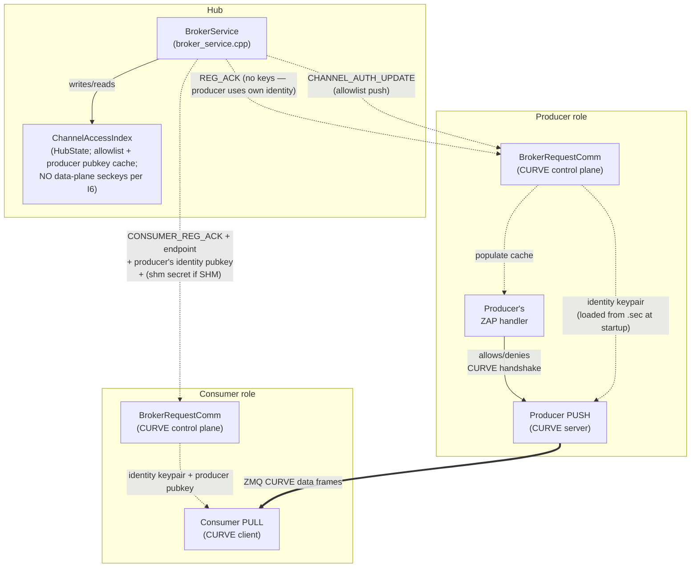

# HEP-CORE-0036: Authenticated Connection Establishment

| Property        | Value                                                                                                       |
|-----------------|-------------------------------------------------------------------------------------------------------------|
| **HEP**         | `HEP-CORE-0036`                                                                                             |
| **Title**       | Authenticated Connection Establishment — Single-Gate Access Control for Control + Data Planes               |
| **Status**     | 🚧 **DRAFT — DESIGN UNDER REVIEW.** Cross-references HEP-CORE-0021, HEP-CORE-0035, HEP-CORE-0023.            |
| **Created**     | 2026-05-26                                                                                                  |
| **Last revised** | 2026-05-28 — T1 RESOLVED: symmetric identity-keypair design (broker mints nothing on data plane; both sides reuse their identity keys; SHM keeps broker-generated `shm_secret`).  Prior revision 2026-05-27 — two-conditions gate explicit; revocation reframed as passive (no force-close); inbox/bands inheritance; channels-are-dynamic non-goal; manual pubkey distribution MVP. |
| **Area**        | Framework Architecture (broker access control, role-side CURVE wiring, data-plane peer authentication)      |
| **Depends on**  | HEP-CORE-0021 (ZMQ Endpoint Registry — endpoint discovery via broker), HEP-CORE-0035 (Hub-Role Authentication — broker-side ZAP + pubkey index), HEP-CORE-0023 (Startup Coordination — presence FSM) |
| **Blocks**      | Production deployment (data plane currently unauthenticated; see §3 gap analysis)                            |

---

## 1. Status banner

**This HEP is design-only — no part is implemented.**  It exists because
the 2026-05-26 holistic audit revealed that the data plane (PUSH/PULL
between producer ↔ consumer ↔ processor on ZMQ; SHM attach between
producer ↔ consumer on SHM) has no peer-level authentication: any
process able to reach a producer's TCP endpoint can connect and consume
the data stream without involvement from the broker.  HEP-CORE-0021
designed the **broker-mediated endpoint discovery** mechanism;
HEP-CORE-0035 designed the **broker-side admission policy**; neither
covers the **data peer authentication** layer required to make the
broker's access decisions actually enforce.

This HEP completes the picture by establishing the **two-conditions
gate** (I1): the broker authorizes a role only if (1) the role's CURVE
handshake succeeded AND (2) the role's pubkey is in the hub's
`known_roles[]` allowlist.  Every other enforcement point in the system
(producer-side ZAP handler, SHM secret release, consumer-side data-
socket setup) is a **cache** of that decision — they refuse to act on
artifacts they never received from the broker, but they do not make
independent admission decisions.

Lifetime alignment (I3) ties data-plane access to control-plane state:
control link dies → data loop exits.  Revocation (I5) is passive — it
prevents NEW connections, but existing authenticated sessions are
trusted for their lifetime (the consumer's own role host closes its
data socket when the control link tears down).  This collapses what
earlier drafts contemplated as separate "broker-initiated eviction"
machinery into the natural shutdown path that already exists.

---

## 2. Motivation

The 2026-05-26 dual-hub-processor-zmq demo run exposed four concrete gaps,
each verified against the current code:

1. **ZMQ data sockets have zero authentication.** `hub_zmq_queue.cpp:581-584`
   does `socket.bind(endpoint)` / `socket.connect(endpoint)` with no
   CURVE configuration. Grep across `src/utils/hub/` returns zero hits
   for `curve|CURVE` — confirmed exhaustive.
2. **Consumer can receive data even when broker registration fails.**
   The demo's consumer logged `CONSUMER_REG_REQ timed out after 5000ms`
   yet still received 767 of 1000 messages, because the data plane
   (consumer's PULL on tcp:5583) opens during `setup_infrastructure_`
   well before broker handshake is attempted.
3. **Endpoint is in the role's config file**, not in the broker. Any
   process with read access to `consumer.json` (or a port scanner) has
   the endpoint pre-positioned for connection attempts.
4. **Three separate enforcement points without a single source of
   truth.** Per the current sketch: broker decides admission
   (HEP-0035), broker mediates endpoint discovery (HEP-0021), and the
   data-plane peer would need its own ZAP allowlist. Without explicit
   coordination, these can diverge.

The fix is not "wire CURVE on more sockets." The fix is to make the
broker's decisions **load-bearing** — peers act only on broker-issued
artifacts (keys, endpoint, allowlist membership), and any deviation
becomes mechanically impossible (the connection literally cannot
complete).

### 2.1 Non-goals (explicit)

The following are deliberately OUT of HEP-0036 scope:

- **Channel pre-declaration in hub config.** Hubs do NOT manage a
  static `channels[]` list.  Channels are created dynamically when
  a producer's `REG_REQ` arrives carrying a new `out_channel` name.
  Per-channel auth state (`ChannelAccessIndex` entry) is created
  alongside on producer REG; destroyed on producer DEREG.
- **Force-closing existing CURVE sessions on revocation.** ZeroMQ
  has no API for this.  Lifetime alignment (I3) makes it
  unnecessary: when a role loses its control link, the role's own
  data loop exits.  External force-close is incident response, not
  protocol (see I5).
- **Per-consumer ACL enforced inside the data path.** A consumer
  that holds a valid CURVE session OR a valid SHM secret is trusted
  for that session's lifetime.  ACL is enforced at the artifact
  release boundary (broker's CONSUMER_REG_ACK / CHANNEL_AUTH_UPDATE),
  not at every data frame / SHM read.
- **Automated public-key distribution.**  For MVP, hub and role
  public keys are distributed manually by the operator (copy
  `*.pub` files to the appropriate config dirs).  Automated
  distribution (e.g. via a federation control channel) is deferred
  until federation development is further along.
- **Mid-session identity-key rotation.**  Roles' long-term identity
  keys live for the role's deployment lifetime.  Rotation is an
  operator workflow: re-run `plh_role --keygen`, redistribute the
  new `.pub` to every hub's `known_roles/`, restart the role.
  CURVE's per-session ephemeral keys (Curve25519 ECDH) provide
  forward secrecy automatically — past sessions stay
  un-decryptable even if a long-term key is later compromised.
- **Defense against a compromised broker.**  See I8 trust model.

---

## 3. Invariants (the architectural decisions being formalized)

These invariants are non-negotiable for any implementation:

### I1 — Two conditions gate every connection

**Both must hold at the broker before any data-plane artifact
(endpoint, producer's identity pubkey for ZMQ, SHM secret for
SHM, or allowlist-entry push to the producer) is released:**

1. **Auth success** — the role's CURVE handshake to the broker's
   ROUTER socket completed successfully (cryptographic proof of
   identity matching a pubkey).
2. **Role known** — that pubkey is in the hub's `known_roles[]`
   configuration (operator-authorized allowlist).

Either condition fails → broker refuses to issue the artifact → the
role cannot establish a data connection.  Both pass → broker issues
the artifact + the role can establish the data connection.

These two conditions are the **single gate**.  Every downstream
enforcement point (producer-side ZAP handler, consumer-side socket
config, SHM attach) is a CACHE of the broker's decision — it
enforces by refusing to act on artifacts it never received, not by
performing an independent authorization check.

> **Note on existing code + HEP-0035 alignment.**  Today's codebase
> has a string-based placeholder for condition (2) at
> `broker_service.cpp:2674` (`BrokerServiceImpl::check_role_identity`
> with `RoleIdentityPolicy::Verified` mode + `KnownRole` allowlist),
> but HubHost deliberately does NOT wire `known_roles` from hub.json
> into `BrokerService::Config` (per `hub_broker_config.hpp:13-14`
> comment).  Per **HEP-CORE-0035 §4.5**, that string-name machinery
> is being **dropped, not wired** — once HEP-0035 lands, condition (2)
> is enforced at the SOCKET LAYER via the ZAP-pubkey allowlist
> (HEP-0035 §4.1 Layer 1), not by `check_role_identity()`.  HEP-0036
> therefore inherits condition (2) from HEP-0035's Layer-1
> implementation; HEP-0036 itself does NOT add new role-admission
> code — it adds the per-channel data-plane CURVE + allowlist
> management that sits on top of the (then-implemented) broker ZAP.

### I2 — Single source of truth

**The broker's `ChannelAccessIndex` (§4.1) is the canonical decision
record.**  When a consumer's CONSUMER_REG passes both conditions,
broker mutates this index (records artifact issuance + tracks
allowlist for producer's cache).  Producer-side caches are
synchronized via broker push (`CHANNEL_AUTH_UPDATE`) but never make
independent admission decisions.

The producer's ZAP handler reads the cache to **gate new handshakes**
— rejecting incoming CURVE handshakes whose pubkey isn't in the
cached allowlist.  The cache is updated by broker push for the
NEXT handshake; existing CURVE sessions are not affected by cache
updates (see I5).

### I3 — Lifetime alignment (control gates data)

**Data link is downstream of control link.  Control dies → data
dies.**  The role host enforces this on its own side:

- Proactive quit: role stops the data loop FIRST, closes data
  sockets, THEN sends DEREG.  By the time broker ACKs, the role is
  already off the data path.
- Passive failure (BRC heartbeat lost, control disconnect): the
  data loop's outer guard observes `brc_is_connected() == false`
  and exits.  Data sockets close.
- Process crash: TCP cleanup on process death; SHM consumer slot
  is reclaimed by recovery code (PID liveness check).

The data loop's outer guard reads:
```cpp
while (core.is_running() &&
       !core.is_shutdown_requested() &&
       brc_is_connected() &&            // control → data dependency
       any_presence_authorized()) {
  ...
}
```

This is the role's own contract.  A compromised role that ignores
its contract (keeps reading data after losing control) is outside
the auth model's scope — that's incident response, not protocol.

### I4 — No data artifact before authorization

**A peer that has not passed both I1 conditions cannot obtain the
data-plane connection artifacts**, so cannot establish a data
connection:

- ZMQ consumer: doesn't know the producer's data endpoint or the
  producer's identity pubkey (which the consumer needs as
  `curve_serverkey`) until `CONSUMER_REG_ACK` carries them.
  Without these, no connection attempt is meaningful.
- SHM consumer: doesn't know the channel's `shm_secret` until
  `CONSUMER_REG_ACK` carries it.  Without it, SHM attach fails
  (existing DataBlock secret check, HEP-CORE-0002).

The "artifact issuance gate" mirrors the "two conditions" gate.
This is the architectural symmetry: both ZMQ and SHM transports
go through the SAME broker-side gate; the artifact differs by
transport but the decision is the same.

### I5 — Revocation prevents NEW connections; existing connections are trusted

**Once authenticated, a connection is trusted for its lifetime.**
Revocation removes the role's pubkey from the broker's allowlist
and pushes the removal to the producer's ZAP cache.  This means:

- The next CURVE handshake from that pubkey fails (cache hit ≠ in
  allowlist → ZAP DENY).
- The next CONSUMER_REG_REQ from that pubkey returns ERROR (broker
  doesn't issue secret).
- The next SHM attach attempt by a process that didn't get the
  current secret fails.

Existing CURVE sessions and SHM attaches **continue**.  ZeroMQ does
not provide a mechanism to forcibly close an existing CURVE session
by peer pubkey; the consumer's role host is responsible for closing
the data loop when its own control link signals revocation (via
CHANNEL_CLOSING_NOTIFY or BRC disconnect — both per I3).

This is sufficient for the authentication model.  A consumer that
was authenticated, then later compromised (key leak, malicious code
injection), is outside the auth model's scope — operator response
is to kill the compromised process out-of-band.  The architecture
defends against UNAUTHENTICATED peers, not against trusted peers
that turn malicious mid-session.

### I6 — Identity keys reused on the data plane; broker mints nothing

**The role's identity keypair (from `plh_role --keygen`, HEP-0035)
is used on BOTH the control plane (BRC DEALER → broker ROUTER) AND
the data plane** (PUSH on the producer side; PULL on the consumer
side).  The broker does NOT generate or hold any data-plane
keypairs.  Its job on the data plane is purely allowlist
management — tracking which consumer pubkeys are authorized to
connect to which channel.

Consequences:

- One keypair per role to manage at deployment.  Operator workflow
  per HEP-0035 §11.3 is the only key-distribution path.
- Producer's PUSH socket binds with the role's identity pubkey
  (curve_server=1, secretkey + publickey both from `<role_uid>.sec`
  / `<role_uid>.pub`).
- Consumer's PULL socket connects with the role's identity keypair;
  `curve_serverkey` is the producer's identity pubkey (cached in the
  hub's `PubkeyOrigin` index from HEP-0035 §4.2; delivered to the
  consumer via `CONSUMER_REG_ACK`).
- Per-channel revocation works at the **allowlist** layer, not the
  key layer: removing a consumer's pubkey from channel A's allowlist
  prevents future handshakes to A; the consumer keeps its identity
  for any other channel it's authorized on (per-channel scope is
  enforced by what's IN the allowlist, not by separate keypairs).
- Producer/broker restart is recoverable because the producer's
  identity pubkey doesn't change across restarts (it's loaded from
  disk).  Consumers' cached `curve_serverkey` stays valid.

The earlier draft of HEP-0036 specified per-channel broker-minted
keypairs.  Design review (2026-05-28) concluded that the
"isolation" benefit was illusory under HEP-0036's threat model (I8):
both keypairs would live in the same process memory and be exposed
together, so the additional minting and key-distribution machinery
added complexity without measurable security gain.  Identity
reuse is the simpler, sound design.

The ONE exception is SHM: the broker DOES generate a per-channel
`shm_secret` (uint64 token, not a CURVE key) because SHM
authentication uses the existing DataBlock guard-secret mechanism
(HEP-CORE-0002), which is unrelated to CURVE.  See §5.6.

### I7 — Endpoint disclosure follows authorization

**The data-plane endpoint is broker-state, not role-state.**  Role
configs declare a channel name (`in_channel` / `out_channel`) and
optionally a port range / bind interface hint; the **actual endpoint
string** (`tcp://host:port`) is computed at producer bind time (per
HEP-0021 §16 ephemeral port resolution) and lives only on the broker
+ in the role's runtime memory.  It does not appear in any persisted
config file.

A consumer learns the endpoint only via `CONSUMER_REG_ACK` after
broker authorization.  Pre-authorization port scanning yields a CURVE
socket that rejects all handshakes (empty allowlist + ZAP active).

### I8 — Trust model assumption

**HEP-0036 trusts the broker as the sole admission authority.**  The
broker holds no data-plane secret keys (per I6), so a broker
compromise doesn't directly leak any data-plane CURVE seckey.  But a
compromised broker can:

- Authorize arbitrary pubkeys (forge allowlist entries; falsely
  attest a malicious role's identity pubkey is in `known_roles[]`).
- Distribute a malicious "producer's identity pubkey" to consumers
  via CONSUMER_REG_ACK, redirecting traffic to an attacker-controlled
  endpoint.

CURVE's per-session ephemeral keys (Curve25519 ECDH) provide
forward secrecy at the transport layer: traffic captured by a
passive observer cannot be decrypted later even if a long-term
seckey is compromised.  This holds regardless of the broker's
state.

The threat model HEP-0036 defends against is **unauthenticated +
unknown external peers**, not a compromised broker.  Operator
responsibility: secure the broker host (HEP-0035 §4.6 file ACLs +
§4.7 runtime hardening + OS hardening + restricted access + audit
logging).  Beyond-MVP enhancements (HSM-backed identity keys for
the broker, multi-broker quorum) are tracked as follow-up work in
§13 open questions.

---

## 4. Architecture

### 4.1 `ChannelAccessIndex` — the canonical decision record

A new in-memory structure inside `HubState`, indexed by `channel_name`.
Under the I6 symmetric design, this structure holds NO data-plane
secret keys — only the per-channel allowlist + a cached pointer to
the producer's identity pubkey (which already lives in HEP-0035
§4.2's `pubkey_to_origin` index) + the SHM-only guard secret:

```cpp
struct ChannelAccessEntry
{
    // Allowed consumer identity-pubkeys for this channel.
    // Producer's ZAP handler enforces; updated via CHANNEL_AUTH_UPDATE pushes.
    std::unordered_set<std::string>  authorized_consumer_pubkeys;

    // Producer's identity pubkey for this channel (cached for distribution
    // to consumers via CONSUMER_REG_ACK).  In MVP this is exactly one
    // pubkey per channel; in multi-producer fan-in (§9.1) the broker
    // tracks one entry per producer in the channel's ProducerEntry list
    // (HEP-0021 §16.3 + hub_state.hpp ProducerEntry).
    std::string  authorized_producer_pubkey;

    // SHM-only: broker-generated guard secret for the DataBlock
    // (HEP-CORE-0002).  Unrelated to CURVE; SHM auth uses this secret
    // token, not pubkey allowlists.  Zero when transport=zmq.
    uint64_t     shm_secret{0};
};

// In HubState:
std::unordered_map<std::string, ChannelAccessEntry>  channel_access_index_;
```

**Per I2** this is the broker's canonical record of the two-condition
gate decision (I1).  The handlers that read + write it:

- **REG handler** (broker): writes — creates entry on producer REG
  after I1 passes; deletes on DEREG.
- **CONSUMER_REG handler** (broker): reads + writes — gates admission
  via I1 (using `zmq_msg_gets("User-Id")` to recover the consumer's
  CURVE-proved identity pubkey from the BRC socket — no self-claims),
  writes that pubkey to the allowlist on accept, reads the
  producer's identity pubkey + endpoint from the `ChannelAccessEntry`
  to return in CONSUMER_REG_ACK.
- **`CHANNEL_AUTH_UPDATE` emitter** (broker): reads — computes
  diff vs. producer's cache, sends sync `add` / best-effort `remove`.
- **Heartbeat / hub-dead handler** (broker): writes — removes a
  failed peer from the allowlist; emits `CHANNEL_AUTH_UPDATE remove`.

No producer-side or consumer-side code computes admission decisions
independently; they execute artifacts (keys, endpoint, secret,
cached allowlist) the broker handed them.

### 4.2 Component overview



Every arrow that crosses a process boundary is either:
- **CURVE-authenticated control plane** (BRC ↔ Broker, already CURVE per HEP-0035 control-plane scope), or
- **CURVE-authenticated data plane** (Producer PUSH ↔ Consumer PULL, NEW; both sides use their identity keys per I6), or
- **SHM attach gated by broker-issued secret** (NEW for SHM transport).

### 4.3 Lifetime FSM — extends HEP-0023's RegistrationState

HEP-0023 defines a per-presence `RegistrationState` enum (today 4
values: `Unregistered`, `RegRequestPending`, `Registered`,
`Deregistered`).  HEP-0036 adds **`Authorized`** between
`Registered` and the heartbeat-tick start.  The data loop may run
only when at least one presence is `Authorized` (§8.2).

The key insight reconciled in design review (2026-05-28): the broker
ALREADY has a "producer is operational" signal via
`first_heartbeat_seen` (HEP-CORE-0023 §2.6 + `hub_state.hpp:107`;
`kRegistering → kLive` observable).  HEP-0036's role-side `Authorized`
transition is the local gate that controls when the role calls
`install_heartbeat`; the first heartbeat tick then drives the broker
into `kLive`.  No new wire message is needed for the broker to learn
that a producer is ready to take consumers.

#### 4.3.1 Per-presence `RegistrationState` (role-side)

```mermaid
stateDiagram-v2
    [*]               --> Unregistered: role process start
    Unregistered      --> RegRequestPending: send REG_REQ<br/>(BRC CURVE handshake to broker<br/>already succeeded — HEP-0035 Layer 1)
    RegRequestPending --> Registered: REG_ACK ok<br/>(producer: initial_allowlist=[];<br/>consumer: endpoint + producer's identity pubkey;<br/>SHM: shm_secret)
    RegRequestPending --> Failed: REG_ACK error / timeout<br/>(I1 cond 2 failed → role not in known_roles)
    Registered        --> Authorized: setup_infrastructure_ done<br/>(see entry conditions below)
    Registered        --> Failed: setup_infrastructure_ failure<br/>(bind / ZAP / ENDPOINT_UPDATE)
    Authorized        --> Authorized: brief BRC blip<br/>(within hub_dead_grace — stay)
    Authorized        --> Unregistered: hub-dead detected<br/>(sustained heartbeat loss<br/>→ tear down data infra<br/>→ await BRC reconnect)
    Authorized        --> Deregistered: DEREG_REQ sent + DEREG_ACK<br/>(data loop already exited per I3)
    Deregistered      --> [*]
    Failed            --> [*]
```



#### 4.3.2 Entry condition for `Authorized` differs by side

**Producer presence — synchronous trigger:**
- ZAP handler installed on the role's ZMQ context (per-context, not
  per-channel; once before the first CURVE-server bind).
- PUSH socket configured `curve_server=1` with role's IDENTITY
  keypair (loaded from `<role_uid>.sec` at process startup, per
  HEP-0035 §4.6 + §4.7).
- PUSH socket bound (`tcp://*:0` → ephemeral port resolved).
- `ENDPOINT_UPDATE_REQ` sent and ACK'd (sync per HEP-0021 §16.3 +
  audit C2, 2026-05-21).
- After all four: `Registered → Authorized`; then call
  `install_heartbeat`; first heartbeat tick fires; broker
  transitions `kRegistering → kLive` (existing
  `first_heartbeat_seen` mechanism).

**Consumer presence — async trigger:**
- PULL socket configured with consumer's IDENTITY keypair (per I6)
  AND producer's identity pubkey (carried in `CONSUMER_REG_ACK`'s
  `data_server_pubkey` field).
- `socket.connect(endpoint)` returns immediately; CURVE handshake
  runs in background.
- ZMQ socket monitor observes `ZMQ_EVENT_HANDSHAKE_SUCCEEDED` →
  `Registered → Authorized`.
- `ZMQ_EVENT_HANDSHAKE_FAILED_AUTH` → critical error (consumer is
  not in producer's allowlist; should be impossible after broker's
  CHANNEL_AUTH_UPDATE_ACK serialization, but surfaces broker-side
  bugs immediately rather than via timeout).

#### 4.3.3 Recovery path — hub-dead → Unregistered

Per HEP-CORE-0023 §2.6 + task #59 ("Hub-dead must transition
presences out of Registered"), sustained loss of broker heartbeat
ACKs past `hub_dead_grace` triggers presence teardown.  HEP-0036
extends this:

- Close PUSH/PULL data sockets.  Under T1 / I6 the identity keys
  themselves are NOT stale (loaded fresh from `.sec` on every
  startup; survive broker restart), but the broker's view of the
  channel — `ChannelAccessIndex` entry, allowlist, endpoint cache —
  is lost on broker restart and must be re-established from
  scratch via a fresh REG_REQ + CONSUMER_REG_REQ cycle.  Tearing
  down the data sockets is the clean way to drop in-flight CURVE
  sessions whose ZAP allowlist on the producer side is about to
  be re-populated (and may differ from the pre-restart allowlist).
  T3 covers the broker-restart recovery sequence end-to-end.
- Clear the producer-side ZAP cache entry for the channel.
- Stop heartbeat tick.
- Transition `Authorized → Unregistered`.
- On BRC reconnect (TCP recovery + CURVE handshake retry), the
  role re-enters the flow from `Unregistered → RegRequestPending`.

Brief network blips WITHIN `hub_dead_grace` keep the presence in
`Authorized`: data sockets stay open, CURVE sessions are intact,
recovery is invisible to the data loop.

---

## 5. Sequence diagrams

### 5.1 Producer registration (ZMQ, port-0 ephemeral binding)

Under T1's symmetric design, the producer already holds its
identity keypair (loaded from `<role_uid>.sec` at process startup,
per HEP-0035 §4.6 + §4.7).  No broker round-trip is needed before
the PUSH socket can be configured + bound.  The producer's
`worker_main_` ordering can therefore stay close to the existing
code: bind PUSH (with identity keypair + empty ZAP allowlist) →
REG_REQ (carries the resolved endpoint) → install_heartbeat.

The ONE new ordering constraint vs pre-HEP-0036 code: the ZAP
handler must be installed BEFORE the CURVE-server PUSH socket
binds, because a CURVE-server socket bound without a ZAP handler
accepts every handshake by default (libzmq behavior).

```mermaid
sequenceDiagram
    autonumber
    participant P as Producer role<br/>(worker_main_)
    participant B as Broker (handler thread)
    participant AI as ChannelAccessIndex<br/>(HubState)
    participant OBS as Channel observable<br/>(HubState — derived)

    Note over P,B: BRC control plane established<br/>(BRC DEALER ↔ Broker ROUTER, HEP-0035 Layer 1).<br/>I1 cond 1 (CURVE auth) + cond 2 (User-Id ∈ known_roles[])<br/>both already passed for this producer's BRC.<br/>Producer's identity keypair already loaded from .sec.

    rect rgba(220,240,210,0.4)
        Note over P: == worker_main_ step: setup_infrastructure_ ==
        P->>P: install ZAP handler on ZMQ context<br/>(empty allowlist cache; will be populated<br/>by CHANNEL_AUTH_UPDATE pushes later)
        P->>P: configure PUSH socket<br/>curve_server=1<br/>curve_secretkey=&lt;producer's identity seckey&gt;<br/>curve_publickey=&lt;producer's identity pubkey&gt;
        P->>P: socket.bind("tcp://*:0")<br/>→ resolved = "tcp://127.0.0.1:54891"
    end

    rect rgba(200,220,255,0.4)
        Note over P: == worker_main_ step: register_producer_channel ==
        P->>B: REG_REQ {channel="lab.raw",<br/>transport="zmq",<br/>zmq_endpoint="tcp://127.0.0.1:54891",<br/>role_uid, role_name}
        Note over B: I1 cond 2 already enforced at ZAP (Layer 1).<br/>Broker reads producer's identity pubkey via<br/>zmq_msg_gets("User-Id") from this REG_REQ frame.
        B->>AI: create ChannelAccessEntry["lab.raw"]<br/>authorized_producer_pubkey = &lt;User-Id pubkey&gt;<br/>authorized_consumer_pubkeys = {}<br/>(NO key minting — broker holds no data-plane secrets)
        B->>OBS: kAbsent → kRegistering<br/>(producer REG'd; first_heartbeat_seen=false)
        B->>P: REG_ACK {status="ok",<br/>initial_allowlist=[]}
        Note over P: state Unregistered → RegRequestPending → Registered<br/>→ Authorized<br/>(socket bound + ZAP installed + REG_ACK ok)
    end

    rect rgba(255,235,210,0.4)
        Note over P: == worker_main_ step: install_heartbeat ==
        P->>P: BRC.set_periodic_task(on_heartbeat_tick_, interval)
        Note over P: ... time passes (first tick) ...
        P->>B: HEARTBEAT_REQ {channel="lab.raw",<br/>role_uid, role_type="producer", metrics}
        B->>B: presence.first_heartbeat_seen = true
        B->>OBS: kRegistering → kLive<br/>(channel now admits consumers)
    end

    Note over P,OBS: From this point forward, the broker will admit<br/>CONSUMER_REG_REQ for "lab.raw" (§5.2 picks up here).
```

**Ordering invariants captured by the diagram:**

1. **ZAP install before bind.**  A CURVE-server socket bound
   without ZAP accepts all handshakes by default.  In the diagram:
   `install ZAP` → `configure CURVE on PUSH` → `bind`, in that
   order.  The empty allowlist cache at install time means every
   handshake DENIES until broker pushes the first
   `CHANNEL_AUTH_UPDATE add`.
2. **Bind before REG_REQ.**  The producer needs the resolved
   port to put in REG_REQ's `zmq_endpoint`.  This matches the
   existing code order and HEP-0021's wire shape.
3. **Broker reads pubkey from socket, not message body.**  See
   the diagram's `Note over B` right after `REG_REQ` arrives.
   I1 cond 2 is enforced cryptographically at the ZAP layer
   (HEP-0035 §4.1 Layer 1); broker uses `zmq_msg_gets("User-Id")`
   to recover the authenticated identity pubkey for the
   per-channel allowlist.
4. **install_heartbeat after Authorized.**  The diagram shows
   `state Registered → Authorized` complete BEFORE the
   `install_heartbeat` block opens.  First heartbeat fires only
   after the data infrastructure is fully wired; the
   `kRegistering → kLive` transition at the end of the
   `install_heartbeat` block is the gating signal for consumer
   admission.

**Single-gate property** (T1 symmetric design): the broker mints
no data-plane keypairs (per I6).  Its admission control on the
data plane is purely allowlist management — the producer's own
identity pubkey is cached as the channel's
`authorized_producer_pubkey` at REG time (the
`B->>AI: create ChannelAccessEntry[...]` arrow in the diagram),
and `authorized_consumer_pubkeys` grows/shrinks as
CONSUMER_REG_REQs arrive (§5.2).  The producer's PUSH socket
binds with its identity key + empty allowlist; the ZAP cache
fills incrementally via broker pushes.

### 5.2 Consumer registration + data connect (ZMQ)

Picks up from §5.1's final state: producer is `Authorized` (role-
local), broker's channel observable is `kLive`.

Per T1 lock-in: the consumer's data-plane keypair IS its identity
keypair (same one used on its BRC).  The broker reads the
consumer's CURVE-authenticated identity pubkey via
`zmq_msg_gets("User-Id")` on the BRC socket — there is NO
`consumer_pubkey` field in the wire message (we don't accept
self-claimed identities, same model as SSH `authorized_keys`).

The producer's data-plane pubkey distributed to the consumer is
the producer's IDENTITY pubkey (already in the hub's
`PubkeyOrigin` index from HEP-0035 §4.2; copied into
`ChannelAccessEntry.authorized_producer_pubkey` at REG time per
§5.1).

```mermaid
sequenceDiagram
    autonumber
    participant C as Consumer role
    participant B as Broker (handler thread)
    participant AI as ChannelAccessIndex
    participant OBS as Channel observable
    participant P as Producer (running)
    participant MON as Consumer's ZMQ<br/>socket monitor

    Note over C,B: BRC control plane established<br/>(I1 cond 1 + 2 already passed for consumer on its BRC;<br/>consumer's identity pubkey is the User-Id on the BRC socket).

    C->>B: CONSUMER_REG_REQ {channel="lab.raw"}<br/>(NO pubkey field; broker uses BRC User-Id)
    B->>B: cons_pub = zmq_msg_gets("User-Id")<br/>(CURVE-proved consumer identity pubkey)
    B->>OBS: observe(channel) — kAbsent / kRegistering / kStalled / kLive

    alt kAbsent (channel not registered)
        B->>C: ERROR {error_code="CHANNEL_NOT_FOUND"}
    else kRegistering (producer REG'd, no first heartbeat yet — R6 gate)
        B->>C: CHANNEL_NOT_READY {reason="awaiting_first_heartbeat"}
        Note over C: Consumer retries after backoff.<br/>Endpoint never disclosed.
    else kStalled (producer heartbeat stalled)
        B->>C: CHANNEL_NOT_READY {reason="heartbeat_stalled"}
    else kLive AND cons_pub NOT in known_roles[] (federation policy fail)
        B->>C: ERROR {error_code="UNAUTHORIZED_CONSUMER_PUBKEY"}
        Note over B: I1 cond 2 already enforced at BRC ZAP (Layer 1);<br/>this branch covers federation-trust cases where Layer 1<br/>let the BRC connect but Layer 2 rejects channel-scope.
    else kLive AND cons_pub authorized
        B->>AI: add cons_pub to authorized_consumer_pubkeys
        B->>P: CHANNEL_AUTH_UPDATE {channel="lab.raw",<br/>allowlist_add=[cons_pub]} (sync per §6.5)
        Note over P: BRC poll thread serially updates<br/>ZAP cache: { cons_pub }
        P->>B: CHANNEL_AUTH_UPDATE_ACK {status="ok"}
        B->>C: CONSUMER_REG_ACK {status="ok",<br/>endpoint="tcp://127.0.0.1:54891",<br/>data_server_pubkey=&lt;producer's identity pubkey&gt;}
        Note over C: state Unregistered → RegRequestPending → Registered

        rect rgba(220,240,210,0.4)
            Note over C: == setup_infrastructure_ ==
            C->>MON: install socket monitor on PULL<br/>(events: HANDSHAKE_SUCCEEDED / FAILED_AUTH)
            C->>C: configure PULL<br/>curve_serverkey=&lt;producer's identity pubkey&gt;<br/>curve_publickey=&lt;consumer's identity pubkey&gt;<br/>curve_secretkey=&lt;consumer's identity seckey&gt;
            C->>P: socket.connect(endpoint)<br/>(returns immediately;<br/>CURVE handshake runs in background)
            P->>P: ZAP request: peer pubkey = consumer's identity<br/>→ cache hit → ALLOW
            P-->>MON: HANDSHAKE_SUCCEEDED event
            MON->>C: notify Authorized transition
            Note over C: state Registered → Authorized
        end

        rect rgba(255,235,210,0.4)
            Note over C: == install_heartbeat (after Authorized) ==
            C->>C: BRC.set_periodic_task(on_heartbeat_tick_)
            Note over C: first tick fires
            C->>B: HEARTBEAT_REQ {channel, role_uid, role_type="consumer"}
            B->>B: consumer presence.first_heartbeat_seen = true
        end

        P-->>C: ZMQ data frames (CURVE-encrypted)
    end
```

**Gating points (single-gate property)**:

- **Broker observable check** (the `B->>OBS: observe(channel)`
  arrow): if the producer hasn't sent its first heartbeat, the
  channel is `kRegistering` and consumer is told to retry.  This
  is **R6** — the broker's CONSUMER_REG_REQ handler at
  `broker_service.cpp:1959-1971` currently checks
  endpoint-port-not-zero but does NOT check `first_heartbeat_seen`.
  HEP-0036 implementation extends the check to also gate on
  `first_heartbeat_seen` (~5 lines), matching DISC_REQ's behavior
  at `broker_service.cpp:1720`.
- **Sync `CHANNEL_AUTH_UPDATE` before `CONSUMER_REG_ACK`** (the
  `B->>P: CHANNEL_AUTH_UPDATE` and `P->>B:
  CHANNEL_AUTH_UPDATE_ACK` arrows, both BEFORE `B->>C:
  CONSUMER_REG_ACK`): the broker MUST receive the ACK from the
  producer BEFORE returning CONSUMER_REG_ACK to the consumer.
  This guarantees the producer's ZAP cache is updated before
  the consumer attempts the CURVE handshake — no race window
  between cache install and first handshake.
- **`HANDSHAKE_SUCCEEDED` event** (the `P-->>MON: HANDSHAKE_SUCCEEDED`
  arrow in the `setup_infrastructure_` block): the consumer's
  `Authorized` transition is event-driven by the ZMQ socket
  monitor.  The alternative event `HANDSHAKE_FAILED_AUTH`
  surfaces broker-side serialization bugs immediately rather than
  via slow read timeouts.  This is **R3** — without socket-monitor
  wiring, a consumer whose handshake silently fails would hang in
  `Registered` until heartbeat timeout reaped it.

**No endpoint disclosure on rejection**: in EVERY rejection
branch (`kAbsent`, `kRegistering`, `kStalled`, `kLive` +
`UNAUTHORIZED_CONSUMER_PUBKEY`), the broker returns an error/
CHANNEL_NOT_READY without the endpoint or producer pubkey
fields.  The consumer never learns the endpoint or the
producer's identity pubkey.  A consumer that tries random ports
+ random pubkeys fails at the producer's ZAP gate (empty
allowlist for that pubkey → DENY).

### 5.3 Multi-consumer fan-out: second consumer joins a running channel

```mermaid
sequenceDiagram
    autonumber
    participant C2 as Consumer #2 (new)
    participant B as Broker
    participant AI as ChannelAccessIndex
    participant P as Producer (running)
    participant C1 as Consumer #1<br/>(already Authorized)

    Note over P,C1: existing data flow continues uninterrupted

    C2->>B: CONSUMER_REG_REQ {channel="lab.raw"}
    B->>B: c2_pub = zmq_msg_gets("User-Id") on BRC
    B->>AI: add c2_pub to authorized_consumer_pubkeys
    B->>P: CHANNEL_AUTH_UPDATE {channel="lab.raw",<br/>allowlist_add=[c2_pub]}
    P->>P: ZAP cache updated:<br/>{c1_pub, c2_pub}
    P->>B: CHANNEL_AUTH_UPDATE_ACK
    B->>C2: CONSUMER_REG_ACK {endpoint,<br/>data_server_pubkey=&lt;producer's identity pubkey&gt;}
    C2->>P: connect + CURVE handshake (C2's identity) → ACCEPT
    P-->>C2: ZMQ data frames (independent of C1's flow)
```

**Property**: producer's existing CURVE session with C1 is unaffected.
The ZAP allowlist add is incremental; no socket re-bind, no key
rotation, no disruption.

### 5.4 Consumer deregistration (cooperative close)

```mermaid
sequenceDiagram
    autonumber
    participant C1 as Consumer #1 (leaving)
    participant B as Broker
    participant AI as ChannelAccessIndex
    participant P as Producer
    participant C2 as Consumer #2 (continuing)

    Note over C1: Per I3, role stops data loop FIRST.
    C1->>C1: data loop exits;<br/>close PULL socket
    C1->>B: CONSUMER_DEREG_REQ {channel="lab.raw"}
    B->>B: c1_pub = zmq_msg_gets("User-Id") on BRC
    B->>AI: remove c1_pub from authorized_consumer_pubkeys
    B->>P: CHANNEL_AUTH_UPDATE {channel="lab.raw",<br/>allowlist_remove=[c1_pub]}
    P->>P: ZAP cache updated: {c2_pub}<br/>(future C1 reconnect handshakes → REJECT)
    P->>B: CHANNEL_AUTH_UPDATE_ACK
    B->>C1: CONSUMER_DEREG_ACK
    C1->>C1: transition Authorized → Deregistered

    Note over P,C2: C2's data flow continues uninterrupted
```

**Property** (per I3 + I5): C1 closes its OWN data socket as part of
its proactive quit, BEFORE the broker even ACKs the deregistration.
Allowlist removal on the producer side is forward-looking only —
it prevents any future handshake from C1's pubkey, but does not
need to (and cannot, in ZeroMQ) tear down the now-closed-from-the-
client-side TCP session.  This is the architectural simplification
agreed on review: there is no "broker-initiated eviction" path
because there is no need for one.

### 5.5 Heartbeat timeout — passive deregistration

```mermaid
sequenceDiagram
    autonumber
    participant C as Consumer (crashed / partitioned)
    participant B as Broker
    participant AI as ChannelAccessIndex
    participant P as Producer

    Note over C: process crash OR network partition OR BRC stall

    par On the consumer side (if process still alive)
        Note over C: BRC connection lost (heartbeat fail / TCP RST).
        C->>C: data loop guard observes<br/>brc_is_connected() == false → exit (per I3).
        C->>C: close PULL socket (data session torn down by client side).
    and On the broker side
        B->>B: heartbeat timeout fires for consumer C
        B->>AI: remove C's pubkey; clear C from presence table.
        B->>P: CHANNEL_AUTH_UPDATE {channel,<br/>allowlist_remove=[C's identity pubkey]}
        P->>P: ZAP cache updated.
        P->>B: CHANNEL_AUTH_UPDATE_ACK
    end

    Note over C,P: If C process eventually recovers, it must restart from<br/>the beginning of §5.2 (new BRC CURVE handshake → CONSUMER_REG_REQ).<br/>Mid-incident reconnect of an old session is not supported.
```

**Property**: this is the SAME architecture as §5.4 (cooperative
close), just driven by failure detection on both sides instead of
explicit DEREG.  Per I3 the consumer's data loop tears down its
own end; per I5 the broker side updates the allowlist so any
future handshake from that pubkey is denied.  There is no
broker-initiated force-disconnect.

### 5.6 SHM consumer attach

```mermaid
sequenceDiagram
    autonumber
    participant P as Producer
    participant B as Broker
    participant AI as ChannelAccessIndex
    participant C as Consumer
    participant SHM as DataBlock<br/>(in shared memory)

    P->>B: REG_REQ {channel="lab.raw", transport="shm"}
    B->>AI: lookup/create entry
    B->>B: generate per-channel shm_secret<br/>(uint64 random)
    B->>AI: store shm_secret in ChannelAccessEntry
    B->>P: REG_ACK {status="ok", shm_secret}
    P->>SHM: create DataBlock with shm_secret as the<br/>guard secret (HEP-CORE-0002)

    C->>B: CONSUMER_REG_REQ {channel="lab.raw"}
    B->>B: cons_pub = zmq_msg_gets("User-Id") on BRC
    B->>AI: lookup; check cons_pub admission (kLive + known_roles)
    alt authorized
        B->>AI: add cons_pub to authorized_consumer_pubkeys
        B->>C: CONSUMER_REG_ACK {transport="shm",<br/>shm_name, shm_secret}
        C->>SHM: attach with shm_secret → ACCEPT
        C-->>SHM: ring buffer reads
    else unauthorized
        B->>C: ERROR {error_code="UNAUTHORIZED_CONSUMER_PUBKEY"}
        Note over C: Consumer does not receive shm_secret.<br/>Attach attempts without secret → REJECT.
    end
```

**Property**: SHM's existing secret-based attach gate (HEP-CORE-0002)
remains the underlying mechanism. The change is: the secret is
**generated by the broker** (not configured by the producer), and is
**released to consumers conditional on broker authorization**. The
config field `out_shm_secret` is retired; if present in old configs,
it is logged as a warning and ignored.

### 5.7 Producer deregistration — cascading consumer notification

```mermaid
sequenceDiagram
    autonumber
    participant P as Producer
    participant B as Broker
    participant AI as ChannelAccessIndex
    participant C1 as Consumer #1
    participant C2 as Consumer #2

    P->>B: DEREG_REQ {channel="lab.raw"}
    B->>AI: clear ChannelAccessEntry["lab.raw"]<br/>(allowlist + producer-pubkey-cache + endpoint all gone;<br/>no broker-held keys to clear per I6)
    B->>C1: CHANNEL_CLOSING_NOTIFY {channel="lab.raw"}
    B->>C2: CHANNEL_CLOSING_NOTIFY {channel="lab.raw"}
    B->>P: DEREG_ACK
    P->>P: close PUSH socket
    C1->>C1: transition Authorized → Deregistered;<br/>close PULL; data loop exits
    C2->>C2: same
```

**Property**: cascade is broker-driven; no peer-to-peer signaling
required. Consumers receive a single notification message via the
existing CHANNEL_CLOSING_NOTIFY infrastructure (already implemented
per HEP-CORE-0023). Their data-loop FSM transitions are local
responses to that notification.

---

## 6. Wire format extensions

These extensions add fields to existing message schemas. All additions
are backward-compatible at the protocol level (broker can detect
absence and reject with a typed ERROR), but no production deployment
should run with peers that lack the auth fields once this HEP ships.

### 6.1 `REG_REQ` (producer → broker) — additions

Per T1 lock-in (I6 symmetric design), there is NO key-minting
request — the producer uses its own identity keypair on the PUSH
socket.  Only one new field is added:

| Field | Type | Description |
|---|---|---|
| `wants_shm_secret` | bool | (transport=shm only) Producer requests broker to generate a per-channel SHM secret (uint64 guard token for the DataBlock).  Default: `true` post-HEP-0036.  Not applicable to ZMQ transport. |

The legacy `shm_secret` field (producer-supplied) is deprecated
and ignored when `wants_shm_secret=true`.

### 6.2 `REG_ACK` (broker → producer) — additions

| Field | Type | Description |
|---|---|---|
| `shm_secret` | uint64 | (transport=shm only) Broker-generated guard secret for the DataBlock.  Unrelated to CURVE (HEP-CORE-0002 mechanism). |
| `initial_allowlist` | array<string> | Consumer identity-pubkeys already authorized for this channel (federation pre-registration scenarios).  Usually empty on a fresh channel. |

No data-plane CURVE keypair appears in `REG_ACK` — the producer
uses its identity keypair, already loaded from `<role_uid>.sec`
at process startup.

### 6.3 `CONSUMER_REG_REQ` (consumer → broker) — additions

**No new fields.**  The consumer's identity pubkey is recovered by
the broker via `zmq_msg_gets("User-Id")` from the BRC socket
(CURVE-proved identity from Layer-1 ZAP authentication, per
HEP-0035 §4.1).  Self-claimed pubkeys in the message body are
NOT accepted — same model as SSH's `authorized_keys`.

### 6.4 `CONSUMER_REG_ACK` (broker → consumer) — additions

| Field | Type | Description |
|---|---|---|
| `data_server_pubkey` | string (Z85, 40 chars) | (transport=zmq only) The producer's IDENTITY pubkey, looked up from the hub's `PubkeyOrigin` index (HEP-0035 §4.2) at the time CONSUMER_REG_ACK is built.  The consumer uses this as `curve_serverkey` on its PULL socket. |
| `shm_secret` | uint64 | (transport=shm only) The per-channel SHM guard secret. |

The existing `zmq_endpoint` field (already in HEP-0021 §5.2) carries
the producer's endpoint.

### 6.5 `CHANNEL_AUTH_UPDATE` (broker → producer) — NEW message

**Purpose**: keep the producer's local ZAP cache in sync with the
broker's `ChannelAccessIndex.authorized_consumer_pubkeys`.  This
message gates ONLY future CURVE handshakes from the affected pubkeys
(I5).  It does NOT instruct the producer to disconnect any existing
session; existing CURVE sessions are unaffected by allowlist updates.

Sync request-reply per HEP-CORE-0007 §12.2.1 — on `allowlist_add`
the broker MUST receive `CHANNEL_AUTH_UPDATE_ACK` from the producer
BEFORE returning `CONSUMER_REG_ACK` to the consumer, so that the
consumer's first handshake attempt cannot race the cache install
and be denied due to a stale cache.

On `allowlist_remove` the broker may proceed without waiting for
the ACK (the security guarantee is "no NEW handshake from the
removed pubkey"; existing session continues regardless).

| Field | Type | Description |
|---|---|---|
| `channel_name` | string | Channel whose allowlist is updated. |
| `allowlist_add` | array<string> | Consumer pubkeys to add to the producer's ZAP cache.  Producer must install these BEFORE ACKing. |
| `allowlist_remove` | array<string> | Consumer pubkeys to remove from the producer's ZAP cache.  Best-effort; no effect on existing sessions. |

Producer responds with `CHANNEL_AUTH_UPDATE_ACK { status }`.

### 6.6 Error codes

Added to HEP-CORE-0007 §12.4a Error Code Taxonomy:

| Code | When |
|---|---|
| `UNAUTHORIZED_CONSUMER_PUBKEY` | CONSUMER_REG_REQ from a consumer whose CURVE-proved User-Id pubkey is not in `cfg.known_roles[]` (HEP-0035 §4.1 Layer 2).  Should be unreachable when Layer-1 ZAP is enforcing, but kept as defence-in-depth. |
| `CHANNEL_NOT_READY` | CONSUMER_REG_REQ for a channel whose producer either (a) hasn't completed ENDPOINT_UPDATE (HEP-0021 §16.4 — unresolved port 0), OR (b) hasn't sent its first heartbeat (channel observable is `kRegistering`, T2 R6).  `reason` field distinguishes: `awaiting_endpoint` vs `awaiting_first_heartbeat` vs `heartbeat_stalled`. |
| `ALLOWLIST_PUSH_FAILED` | Broker tried to push CHANNEL_AUTH_UPDATE to producer but didn't get ACK; consumer's CONSUMER_REG_REQ rolls back (broker removes the consumer from the allowlist). |

No `KEYPAIR_GENERATION_FAILED` error — broker mints no data-plane
keys (per I6).

---

## 7. Producer-side ZAP handler

The ZAP handler is the producer-side enforcement of allowlist
membership.  It is a CACHE of the broker's decision (per I2),
not an independent admission authority.  Its only job: take a
ZAP request, look up the consumer pubkey in the local cache,
return ALLOW or DENY.

### 7.1 Placement and lifetime

- One ZAP socket per ZMQ context (libzmq invariant —
  `inproc://zeromq.zap.01`).  The producer role host installs the
  handler on its existing context **before** any CURVE-server
  socket binds (per the §5.1 ordering note).
- Handler runs on the BRC poll thread.  Rationale: (a) cache reads
  and `CHANNEL_AUTH_UPDATE` writes happen on the same thread, no
  synchronization needed; (b) BRC poll thread already exists.

### 7.2 Cache contract

```cpp
struct PerChannelAllowlist {
    std::unordered_set<std::string>  authorized_consumer_pubkeys_z85;
};
std::unordered_map<std::string, PerChannelAllowlist>  zap_cache_;
```

- Initial population: from `REG_ACK.initial_allowlist`.
- Incremental updates: from `CHANNEL_AUTH_UPDATE` requests.
- Per-channel entry destroyed when the producer DEREGs that channel.

ZAP request → look up by (destination-endpoint → channel-name reverse
map → allowlist set) → ALLOW iff pubkey ∈ set; else DENY.

### 7.3 Failure modes

| Failure | Behavior |
|---|---|
| Pubkey not in allowlist | DENY.  Expected path — keeps unknown peers out. |
| Endpoint not in producer's bind table | DENY.  Defensive; shouldn't happen if broker is sole endpoint authority. |
| Handler thread dead | All CURVE handshakes time out at the peer.  Detectable via libzmq socket monitor; producer transitions to critical-error. |

---

## 8. Lifecycle gating in the data loop

The data loop (`run_data_loop` in `data_loop.hpp:101`) currently checks
only `core.is_running() && !is_shutdown_requested() && !is_critical_error()`.
This HEP adds an Authorized-state gate. **No data-plane operation may
run unless at least one Presence is in `Authorized`.**

### 8.1 Gate function

```cpp
// On RoleAPIBase or HEP-0023's role-handler accessor:
[[nodiscard]] bool any_presence_authorized() const noexcept;
```

Returns `true` iff at least one of the role's presences has
`registration_state.load() == RegistrationState::Authorized`.

### 8.2 Outer-loop guard

```cpp
while (core.is_running() &&
       !core.is_shutdown_requested() &&
       !core.is_critical_error() &&
       any_presence_authorized())   // NEW
{
    // ... existing body ...
}
```

**Relation to I3.**  The `any_presence_authorized()` clause is the
mechanism that implements I3 (control gates data).  When the BRC
loses connection (heartbeat fail / TCP RST / hub-dead), the BRC poll
thread transitions every affected presence out of `Authorized` —
that's the single point where data and control are coupled.  No
separate `brc_is_connected()` check is needed in the guard; the
presence FSM is the bridge.

**Spin vs block:** the loop should not spin-wait pre-Authorized — that
would burn CPU during startup. Implementation: the role host blocks
on a condition variable signaled by the BRC poll thread when ANY
presence reaches Authorized; the data loop wait-and-resume from
there.

### 8.3 Per-presence gating for multi-side roles (processor)

A processor with one Consumer + one Producer presence may be in a
state where the Consumer side is `Authorized` but the Producer side
is `Registered` (because the broker hasn't yet pushed the producer's
allowlist update). The data loop's per-iteration `ops.acquire(ctx)`
should consult the SPECIFIC presence being read/written, not the
aggregate. Per-presence gating is implemented in the `ops` impl
(`ProcessorCycleOps`), which already has per-presence visibility via
the api's `has_tx_side()` / `has_rx_side()` accessors.

---

## 9. Multi-producer / multi-consumer scenarios

Combination matrix from the 2026-05-26 audit, expanded with HEP-0036
auth semantics:

| Scenario | ZMQ behavior under HEP-0036 | SHM behavior under HEP-0036 |
|---|---|---|
| 1 producer, 1 consumer | Standard flow (§5.1 + §5.2). Single CURVE keypair, allowlist size 1. | Single shm_secret. Single consumer in admission allowlist. |
| 1 producer, N consumers (fan-out) | Single keypair; allowlist grows incrementally per §5.3.  Each consumer's PULL socket independently CURVE-authenticated. | All N consumers receive the same shm_secret from broker; broker individually authorizes each via CONSUMER_REG check.  Revocation = broker stops releasing the secret on future REGs and removes the consumer from its presence table; already-attached consumers continue (per I5; trusted once authenticated). |
| N producers, 1 consumer (fan-in) | Each producer uses its OWN identity keypair on PUSH (no broker key minting per I6).  Broker caches each producer's identity pubkey in the per-producer `ProducerEntry` (HEP-0021 §16.3 already established per-producer endpoint scope).  Allowlist gates which consumers can connect across the whole channel; producer enforcement happens per-PUSH-socket.  Consumer registers separately per producer (current REG protocol); receives N (producer-identity-pubkey, endpoint) pairs in CONSUMER_REG_ACK. | **Not supported on SHM** — already rejected with `MULTI_PRODUCER_NOT_SUPPORTED_FOR_SHM`. No HEP-0036 work needed. |
| N producers, N consumers | ZMQ: cross-product handled — each consumer registers per producer; broker pushes allowlist updates to each producer's ZAP cache.  Each producer's PUSH uses its own identity keypair; consumers use their own identity keypair as PULL CURVE-client; M consumers × P producers = M+P registrations + M×P CURVE sessions, NO broker-minted keypairs. | N/A — SHM doesn't support multi-producer. |

### 9.1 Per-producer fan-in nuance

In a Fan-In channel today (HEP-0021 §16.3), each producer registers
its own endpoint via `ENDPOINT_UPDATE_REQ`.  Each producer's
`ProducerEntry` carries its own endpoint.  Under HEP-0036, each
producer ALSO carries its own identity pubkey on `ProducerEntry`
(cached at REG time from `zmq_msg_gets("User-Id")` on the BRC
socket — per T1 / I6 the broker mints nothing; the producer uses
its own identity keypair from `<role_uid>.sec`).

`CONSUMER_REG_ACK` returns an ARRAY of `(producer's identity pubkey,
endpoint)` pairs — one per registered producer.  The consumer
iterates and opens one PULL socket per producer, configuring
`curve_serverkey` per peer.

### 9.2 SHM per-consumer authorization

SHM today: producer creates DataBlock with `shm_secret`; any process
holding the secret can attach.  There is no per-consumer ACL inside
the DataBlock itself.

Under HEP-0036: the broker enforces per-consumer authorization at
**secret release time** (CONSUMER_REG_ACK).  Once a consumer holds
the secret, the existing SHM machinery allows attach — and that
session is trusted for its lifetime per I5.  This matches the ZMQ
side exactly: the cryptographic artifact (CURVE pubkey on the
allowlist; or shm_secret) IS the trust token; once a peer holds a
valid token, the peer is trusted until it tears down its end.

Revocation symmetry with ZMQ:

- Broker removes the consumer from its presence table → no future
  CONSUMER_REG_REQ from that role gets a fresh secret.
- Producer's PUSH socket (ZMQ) / DataBlock (SHM) is unaffected for
  already-attached peers.
- Per I3, a revoked consumer's role host exits its data loop on
  control-link teardown — the same code path that handles process
  exit, so the SHM detach happens naturally.

### 9.3 Inbox messaging — inherits channel auth

The inbox messaging path (HEP-CORE-0027) opens between two roles
that are already connected via a data channel — there is no inbox
without an underlying data channel.  Therefore:

- Inbox CURVE wiring uses the role's identity keypair (same one
  bound on the data socket, per T1 / I6 — there is no separate
  per-channel or per-inbox keypair).  The inbox socket on the
  producer side reuses the SAME process-wide ZAP handler that
  guards the data PUSH; allowlist set defaults to the data
  channel's allowlist (T4 covers whether inbox should have a
  distinct allowlist scope; under MVP they're shared).
- No separate broker-side admission decision for inbox.  If the
  consumer is in the channel's allowlist, the inbox handshake
  succeeds.
- Inbox lifetime ⊆ data channel lifetime.  When the data channel
  closes (cascade per §5.7 or BRC death per I3), the inbox closes
  with it.

This collapses inbox into the same single-gate model as data:
broker decides (at REG time, for the data channel); inbox enforces
by inheriting that decision.

### 9.4 Bands — inherit hub-level admission

Per the codebase (`src/include/utils/hub_state.hpp:1101`), bands are
**hub-wide**, not channel-scoped — they live alongside roles, peers,
and shm_blocks in `HubState`, not as children of `ChannelEntry`.
Therefore band admission follows the hub-level "role known +
authenticated" gate (I1), not a per-channel gate.

- A role that has reached `Registered` on a hub (passed both I1
  conditions) MAY band-join any band that hub hosts, subject to the
  band's own per-band policy (HEP-CORE-0030 §4 band ownership /
  band creation rules).
- CURVE for band sockets: role uses its identity keypair (per T1 /
  I6 — the same one bound on the BRC and the data PUSH/PULL); the
  hub-wide allowlist that gates BRC handshakes (HEP-0035 §4.1
  Layer 1 ZAP on the broker ROUTER) ALSO gates band-socket
  handshakes by the same mechanism.  No per-band keypair, no
  per-band allowlist.
- Band lifetime is independent of any single data channel.  Band
  membership ends when the role deregisters from the hub (DEREG
  cascade clears band memberships per HEP-CORE-0030 §6).

If a future requirement emerges for per-band ACL (subset of
hub-known roles), it can be added on top of this baseline — but
nothing in MVP requires it.

---

## 10. Lifetime alignment — full role lifecycle

Combines HEP-0023's startup sequence + HEP-0035 §4.1 Layer-1 ZAP +
§4.6 file ACLs + §4.7 runtime hardening + HEP-0036 T1 symmetric
authorization (both sides use identity keys; broker mints nothing
on the data plane) + T2 first-heartbeat readiness model.

```mermaid
sequenceDiagram
    autonumber
    participant R as Role process
    participant B as Broker
    participant DL as Data loop
    participant DS as Data socket
    participant MON as Socket monitor<br/>(consumer / PULL side)

    Note over R: Process start (plh_role binary main)
    R->>R: HEP-0035 §4.7: disable_core_dumps()<br/>HEP-0035 §4.6: verify_key_file_acls()<br/>load identity keypair (into SecureKeyBuffer)<br/>setup ZMQ context

    rect rgba(220,210,250,0.4)
        Note over R,B: == BRC control plane (HEP-0035 Layer 1) ==
        R->>R: start_handler_threads → BRC DEALER opens
        R->>B: CURVE handshake using IDENTITY keypair (I1 cond 1)
        B->>B: ZAP handler: User-Id ∈ known_roles[]? (I1 cond 2)
        Note over R,B: Both cond 1 + cond 2 pass → control link authenticated
    end

    rect rgba(220,240,210,0.4)
        Note over R: == setup_infrastructure_ (producer-side; same keypair on data plane) ==
        alt ZMQ producer
            R->>R: install ZAP handler on ZMQ context<br/>(empty allowlist cache)
            R->>DS: PUSH curve_server=1<br/>secretkey + publickey = IDENTITY keypair (per I6)
            R->>DS: bind(port=0) → resolved port
        else ZMQ consumer
            Note over R: PULL socket configured AFTER REG_REQ<br/>(needs producer's identity pubkey from CONSUMER_REG_ACK)
        else SHM consumer
            Note over R: DataBlock attach AFTER REG_REQ<br/>(needs shm_secret from CONSUMER_REG_ACK)
        end
    end

    rect rgba(200,220,255,0.4)
        Note over R: == REG_REQ phase ==
        R->>B: REG_REQ (no self-claimed pubkeys; broker reads<br/>identity via zmq_msg_gets("User-Id"))
        B->>R: REG_ACK<br/>(producer: initial_allowlist=[];<br/>consumer: endpoint + producer's identity pubkey;<br/>SHM: shm_secret)
        Note over R: state Unregistered → RegRequestPending → Registered
    end

    rect rgba(220,240,210,0.4)
        Note over R: == setup_infrastructure_ (consumer-side; uses values from REG_ACK) ==
        alt ZMQ consumer
            R->>MON: install socket monitor on PULL
            R->>DS: PULL curve_serverkey = producer's identity pubkey<br/>publickey + secretkey = consumer's IDENTITY keypair (per I6)
            R->>DS: connect(endpoint) — handshake async
            DS-->>MON: HANDSHAKE_SUCCEEDED
            MON-->>R: notify
            Note over R: Authorized (async trigger via monitor)
        else SHM consumer
            R->>DS: attach DataBlock with shm_secret → ACCEPT
            Note over R: Authorized (sync trigger)
        else ZMQ producer
            Note over R: Authorized (sync trigger, after REG_ACK + earlier bind)
        end
    end

    rect rgba(255,235,210,0.4)
        Note over R: == install_heartbeat (only after Authorized) ==
        R->>R: BRC.set_periodic_task(heartbeat_tick)
        Note over R: ... first tick ...
        R->>B: HEARTBEAT_REQ
        B->>B: presence.first_heartbeat_seen = true
        Note over B: For producer: kRegistering → kLive<br/>(broker can now admit consumers via §5.2)
    end

    R->>DL: condvar signal: any_presence_authorized() == true
    DL->>DL: while (running && !shutdown && !critical_error<br/>        && any_presence_authorized()) { ... }
    Note over DL: data flow active

    Note over R: ... role runs for its lifetime ...

    alt Brief BRC blip (within hub_dead_grace)
        Note over R,B: TCP-level reconnect; CURVE session preserved.<br/>Authorized state retained; data loop continues.
    else Sustained heartbeat loss (hub_dead_grace exceeded)
        R->>R: hub-dead detected
        R->>DL: shutdown_requested = true → loop exits
        R->>DS: close data sockets<br/>(identity keys still valid, but broker's<br/>ChannelAccessIndex + allowlist will be re-built<br/>from scratch on reconnect — clean slate)
        R->>R: state Authorized → Unregistered<br/>(awaiting BRC reconnect for re-REG)
    else Proactive DEREG (SIGTERM / explicit close)
        R->>DL: shutdown_requested = true → loop exits (per I3)
        R->>DS: close data sockets
        R->>B: DEREG_REQ
        B->>R: DEREG_ACK
        B->>B: push CHANNEL_AUTH_UPDATE allowlist_remove to peers
        Note over R: state Authorized → Deregistered
        R->>R: process exit
    end
```

**Properties guaranteed by this lifecycle**:

1. **No data flow without broker awareness.**  The data loop starts
   only after `Authorized`; the first heartbeat (which broker
   observes as `kLive`) happens AFTER `Authorized`.  Consumers can
   be admitted only AFTER `kLive` (broker R6 gate at CONSUMER_REG_REQ).
2. **No data infrastructure without broker-issued artifacts.**  PUSH
   binds with the role's IDENTITY keypair (per I6) but its ZAP cache
   starts empty — no consumer can handshake until broker pushes the
   first `CHANNEL_AUTH_UPDATE add`.  PULL connects only with
   broker-issued endpoint + producer's identity pubkey.  SHM attaches
   only with broker-generated `shm_secret`.  Self-claimed identities
   in message bodies are not accepted.
3. **No surprising data loops on partial failure.**  Hub-dead tears
   down data sockets BEFORE the role attempts to re-REG; the ZAP
   cache is cleared so a fresh broker can re-populate it from scratch.
4. **The role's identity keypair is the ONLY long-lived secret
   touching the data plane.**  Broker holds no data-plane CURVE
   secrets (per I6).  HEP-0035 §4.6 file ACLs + §4.7 runtime
   hardening protect the identity keypair at rest and at runtime.

---

## 11. Backward compatibility and dev-mode

### 11.1 Backward compatibility

There is none. HEP-0036 makes auth required. Roles built against
pre-HEP-0036 configs (e.g., those with `out_shm_secret` set in JSON,
or those without a `keyfile`) MUST be rebuilt against new configs
that omit those fields and provide the role's CURVE keypair via
`plh_role --keygen`.

The codebase explicitly accepts the breaking change because the
pre-HEP-0036 state is a security hole; backward compatibility with an
insecure deployment is not a design goal.

### 11.2 Dev-mode escape hatch

For local development and unit testing:

- `hub.dev_mode = true` in hub.json disables Layer-1 ZAP authentication
  (HEP-0035) AND data-plane CURVE wiring (HEP-0036). Sockets fall back
  to NULL handshake.
- Dev-mode is rejected at config-load time if the broker endpoint is
  not loopback (`127.0.0.1` or `localhost`). Production deployments
  cannot accidentally ship with dev-mode enabled on a routable address.
- Tests that exercise the auth path must run with `dev_mode = false`
  and supply CURVE keypairs.

### 11.3 Deployment workflow (MVP — manual pubkey distribution)

For the MVP, public keys (hub identity, role identities) are
distributed manually by the operator.  Per T1 / I6, these same
identity keypairs are used on BOTH the control plane (BRC) AND
the data plane (PUSH / PULL); there is no separate data-plane
key distribution.  A typical deployment workflow:

1. **Hub keygen.**  Operator runs `plh_hub --keygen <hub_uid>`,
   producing `<hub_uid>.pub` (CURVE Z85, distributable) and
   `<hub_uid>.sec` (operator-protected; stays on the hub host).
2. **Role keygen.**  Each role's operator runs
   `plh_role --keygen <role_uid>`, producing `<role_uid>.pub` /
   `<role_uid>.sec`.
3. **Distribute role pubkeys to hub config.**  Copy each
   `<role_uid>.pub` into the hub's `known_roles[]` directory
   (e.g. `hub_keys/known_roles/`).  This wires condition (2) of I1
   (role known by hub).
4. **Distribute hub pubkey to roles.**  Copy `<hub_uid>.pub` into
   each role's config dir; the role uses it as
   `curve_serverkey` on its BRC socket so it can authenticate the
   hub (mutual auth).
5. **Bootstrap.**  Start the hub; start the roles; CURVE handshakes
   succeed using the manually-distributed keys.

**Key-file ACL discipline is mandatory** — all `*.sec`, `*.pub`,
`known_roles/`, and config-directory permissions are set by
`--keygen` / `--init` and verified at every binary startup per
**HEP-CORE-0035 §4.6**.  The binary refuses to start on loose ACLs
with an actionable `chmod` hint in the error message.  The
two-conditions gate in §3 I1 is only as strong as the file-system
trust anchors HEP-0035 §4.6 protects.

Per-channel CURVE data keys do not exist under T1 (I6) — both
sides reuse their identity keypairs on the data plane.  The role's
identity pubkey is operator-distributed (the `.pub` file copied
into each hub's `known_roles/`); the seckey stays local to the
role host.

The ONE broker-generated artifact on the data path is the per-
channel SHM `shm_secret` (uint64 guard token; SHM transport only;
HEP-CORE-0002 mechanism, unrelated to CURVE).  Operators never see
it; it lives in broker memory and is delivered to authorized
consumers in CONSUMER_REG_ACK.

**Future (post-federation):** automated public-key distribution
via federation control channels.  Out of MVP scope; tracked as
follow-up.

---

## 12. Implementation phases

Implementation lands as a chained sequence — each phase is small,
testable, and individually shippable.  Drop disconnect_peer / force-
eviction work from earlier draft scope per I5 (revocation is passive).

| Phase | Scope | Notes |
|---|---|---|
| 0 | **Prerequisites — HEP-0035 §4.1 Layer-1 ZAP + §4.6 file ACLs + §4.7 runtime hardening.**  Broker ROUTER installs a ZAP handler; `hub.known_roles[]` from hub.json populates the pubkey allowlist; ZAP rejects unknown pubkeys at handshake.  Legacy `check_role_identity()` + `RoleIdentityPolicy` enum REMOVED (HEP-0035 §4.5).  Both binaries verify key-file ACLs (§4.6, task #101) and apply runtime hardening (§4.7, task #102).  Tracked under tasks #74 + #101 + #102; HEP-0036 phases below depend on these being live. | Not HEP-0036 work proper, but listed here as the prerequisite that closes I1 condition (2).  HEP-0036's data-plane wiring is meaningless without it. |
| 0.7 | **Add `RegistrationState::Authorized`** (T2).  5th enum value between `Registered` and `Deregistered`.  Producer presence transitions Registered → Authorized at the end of `setup_infrastructure_` (sync); consumer presence transitions via ZMQ socket-monitor on `HANDSHAKE_SUCCEEDED` (T2 R3).  Data loop's outer guard adds `any_presence_authorized()` (HEP-0036 §8.2). | Per-presence FSM is independent across multi-presence roles (processor). |
| 0.8 | **Broker CONSUMER_REG_REQ gates on `first_heartbeat_seen`** (T2 R6, ~5 LOC).  Match DISC_REQ's existing check at `broker_service.cpp:1720`.  Return `CHANNEL_NOT_READY{reason="awaiting_first_heartbeat"}` if producer presence hasn't been observed as `kLive`. | Pre-existing inconsistency between DISC_REQ and CONSUMER_REG_REQ becomes symmetric.  Standalone fix; doesn't depend on later phases. |
| 1 | `ChannelAccessIndex` skeleton in HubState.  Broker creates entries on REG_REQ; stores allowlist + producer's identity pubkey (looked up from `PubkeyOrigin` index via `zmq_msg_gets("User-Id")`).  **No data-plane keypair minting** — per T1 / I6, broker holds no data-plane secrets. | Replaces the earlier draft's "broker mints keypair on REG_REQ" with allowlist-only management. |
| 2 | Producer side: install ZAP handler on ZMQ context BEFORE binding PUSH (per §5.1 ordering); PUSH configured `curve_server=1` with ROLE'S IDENTITY KEYPAIR (loaded from `<role>.sec` per HEP-0035 §4.6 + §4.7).  ZAP cache starts empty; all incoming handshakes DENY until broker pushes allowlist. | No new key distribution needed — producer already has its identity keypair from startup. |
| 3 | Broker side: on CONSUMER_REG_REQ, derive consumer pubkey via `zmq_msg_gets("User-Id")` (NOT from message body — no self-claims); check I1 cond 2; on pass, add to allowlist; emit `CHANNEL_AUTH_UPDATE add` sync to producer (wait for ACK per §6.5); return CONSUMER_REG_ACK with `data_server_pubkey` = producer's identity pubkey + endpoint. | Closes the loop: consumer can now connect after auth.  Per-handshake race resolved by sync-before-ACK ordering. |
| 4 | Consumer side: read producer's identity `data_server_pubkey` + endpoint from CONSUMER_REG_ACK; configure PULL with `curve_serverkey` = producer's identity pubkey AND own identity keypair as `curve_publickey`/`curve_secretkey`; install ZMQ socket monitor for `HANDSHAKE_SUCCEEDED`/`HANDSHAKE_FAILED_AUTH` events (T2 R3); data-loop gate on `Authorized` state per §8. | End-to-end ZMQ auth working; auth failures surface immediately via monitor rather than via heartbeat timeout. |
| 5 | SHM parallel: broker generates `shm_secret` per channel (uint64 guard token; unrelated to CURVE per I6); `CONSUMER_REG_ACK` releases it only on auth.  Retire config-supplied `out_shm_secret`. | SHM secret stays broker-generated because the DataBlock attach mechanism (HEP-0002) is secret-based, not CURVE-based. |
| 6 | Passive revocation paths: on CONSUMER_DEREG, on heartbeat timeout, on hub-dead cascade — broker emits `CHANNEL_AUTH_UPDATE remove` (best-effort) and removes from allowlist.  Role-side hub-dead handling (T2 R4 / R5): `Authorized → Unregistered` after `hub_dead_grace`; tear down data sockets + clear ZAP cache; await BRC reconnect.  No force-disconnect (per I5). | Closes lifetime-alignment loop; no new socket-level APIs. |
| 7 | Multi-producer fan-in: each producer uses its OWN identity keypair (no broker key minting); `CONSUMER_REG_ACK` returns array of (producer-identity-pubkey, endpoint) pairs; consumer opens N PULL sockets. | Touches HEP-0021 §16.3's per-producer endpoint scope.  Simpler than the earlier broker-minted variant. |
| 8 | Inbox + bands: inbox inherits the data channel's allowlist (no new wiring on top of §7); bands inherit the hub's `known_roles[]` allowlist (already enforced by HEP-0035 §4.1 Layer-1 ZAP on the broker ROUTER for any CURVE handshake — control plane and data plane alike per T1 / I6).  Verification only — no new code. | Sanity-check §9.3 + §9.4 hold at runtime. |
| 9 | Dev-mode escape hatch + loopback-enforcement; manual key-distribution workflow doc per §11.3. | Operator-facing surface. |
| 10 | Test coverage: L2 unit tests for ZAP handler cache, broker allowlist updates; L3 for end-to-end auth on dual-hub-processor scenarios; demo framework verification (the regression in the 2026-05-26 demo run becomes the regression test). | Sign-off gate. |
| 11 | HEP-0021 + HEP-0035 + HEP-0023 cross-reference updates; retire legacy `RoleIdentityPolicy` placeholder docs; HEP-0009 §2.7 retraction. | Doc closeout. |

---

## 13. Open questions

Several questions from earlier drafts have been resolved through
review; this section keeps only what's still genuinely open.

### 13.1 Still open

1. **Federation (HEP-0022 cross-hub).** When Hub-A's consumer
   registers on a channel hosted by Hub-B, the allowlist push must
   reach Hub-B's producer.  Today HEP-0022 uses `HUB_RELAY_MSG`
   broker↔broker for unsolicited relay; HEP-0036 needs to ensure
   `CHANNEL_AUTH_UPDATE` rides this path.  Cross-hub trust mode
   (HEP-0035 §4.3 `federation_trust_mode`) gates the allowlist
   propagation.  Open question: when federation trust mode is
   "weak," should Hub-A vouch for the consumer to Hub-B or must
   the consumer present its pubkey to Hub-B directly?

2. **Audit log shape.**  HEP-0035 §7 question 4 (audit logging
   policy) covers Layer-1 + Layer-2 decisions; HEP-0036 adds Layer-3
   (data-plane CURVE accept/reject from ZAP).  Same logging policy
   should apply; coordinate with HEP-0035 implementation.

### 13.2 Resolved (kept for traceability)

- **T1: Per-presence vs per-role keypair.**  Resolved per T1 / I6:
  a role has ONE identity keypair (from `--keygen`) shared by all
  its presences and all its sockets (BRC + data plane).  Per-
  presence revocation is enforced at the allowlist level (per-
  channel `authorized_consumer_pubkeys`), not by minting separate
  keypairs.
- **T1: Broker-side key generation for the data plane.**
  Resolved per T1 / I6: the broker mints NO data-plane CURVE keys.
  Roles use their identity keypairs on PUSH / PULL.  The broker
  generates ONLY the per-channel `shm_secret` (uint64 SHM guard
  token; HEP-0002 mechanism; not a CURVE key).
- **Identity-key rotation.**  Out of scope for HEP-0036 protocol
  (§2.1 non-goal).  Operator workflow: re-`--keygen`, redistribute
  the new `.pub`, restart the role.  CURVE per-session ephemeral
  keys provide automatic forward secrecy at the transport layer.
- **`CHANNEL_AUTH_UPDATE` ordering.**  Resolved in §6.5: sync ACK
  required on `allowlist_add` before broker returns
  `CONSUMER_REG_ACK`; `allowlist_remove` is best-effort.
- **SHM revocation of already-attached consumer.**  Resolved per I5:
  trusted for session lifetime; revocation is forward-looking
  (no new attaches from removed pubkey).  Matches ZMQ semantics.
- **Force-closing existing CURVE sessions.**  Resolved per I3 + I5:
  not needed; lifetime alignment makes the consumer's own role
  host close its data socket when control link dies.
- **Per-channel ACL beyond hub-known-role.**  Out of scope (§2.1
  non-goals; hub doesn't manage channels in config).
- **Inbox auth surface.**  Resolved §9.3: inherits channel auth;
  no separate gate.
- **Bands auth surface.**  Resolved §9.4: inherits hub-level
  admission; no per-band CURVE.

---

## 14. Updates to other HEPs

This HEP requires synchronized updates to three sibling HEPs. The
updates are minimal — pointers / scope clarifications, not redesign.

### 14.1 HEP-CORE-0021 (ZMQ Endpoint Registry)

- **§5.1 REG_REQ schema** — add `wants_shm_secret` (transport=shm
  only) per HEP-0036 §6.1.  No data-plane CURVE keypair fields are
  added — per HEP-0036 T1 / I6 the producer uses its identity
  keypair, broker mints no data-plane keys.
- **§5.2 CONSUMER_REG_ACK schema** — add `data_server_pubkey`
  (cross-reference HEP-0036 §6.4); note that this value is the
  producer's IDENTITY pubkey (already in the hub's `PubkeyOrigin`
  index from HEP-0035 §4.2), not a broker-minted per-channel key.
  Note existing `shm_secret` is now broker-generated (HEP-0036
  §6.4), not echoed from config.
- **§16.5 production path** — note that the auth wiring (HEP-0036
  Phase 1-4) lands together with §16.5 ephemeral-binding completion;
  these were always intended to be the same wire-format change.
- **New §17** — one-paragraph stub pointing to HEP-0036 for the auth
  layer.

### 14.2 HEP-CORE-0035 (Hub-Role Authentication)

- **§4.1 Layered enforcement** — add Layer-3 "Data-plane peer
  authentication," covered by HEP-0036 (cross-reference).
- **§4.2 Pubkey index** — clarify that HEP-0036's `ChannelAccessIndex`
  is a separate per-channel structure that consumes the same
  `PubkeyOrigin` index that gates ALL CURVE handshakes (control
  plane via BRC + data plane via PUSH/PULL, per T1 / I6 — there is
  no separate "control-plane index" and "data-plane index").
- **§7 Open questions** — answer question 4 (audit log) coordinated
  with HEP-0036 §13.1 Q2 (the audit log question).
- **§8 Implementation phases** — HEP-0035 Phases 1-5 (broker ZAP +
  federation gate) remain prerequisite; HEP-0036 Phases land after
  HEP-0035 Phase 5.

### 14.3 HEP-CORE-0023 (Startup Coordination)

- **§2 Per-presence FSM** — add `Authorized` state per HEP-0036 §4.3;
  update state diagram; update transition table.
- **§6 Complete Startup Sequence** — integrate HEP-0036 §10 sequence
  diagram into the role's overall startup picture.

---

## 15. References

- HEP-CORE-0021 — ZMQ Endpoint Registry (endpoint discovery; per-producer scope).
- HEP-CORE-0035 — Hub-Role Authentication and Federation Trust (broker ZAP + pubkey index).
- HEP-CORE-0023 — Startup Coordination (presence FSM).
- HEP-CORE-0007 §12 — Wire format / message categories / error code taxonomy.
- HEP-CORE-0002 — DataBlock SHM (existing shared_secret attach mechanism).
- HEP-CORE-0022 — Hub Federation Broadcast (cross-hub relay for allowlist updates).
- ZeroMQ ZAP RFC 27 — http://rfc.zeromq.org/spec:27/ZAP
- ZeroMQ CURVE security — http://api.zeromq.org/master:zmq-curve
