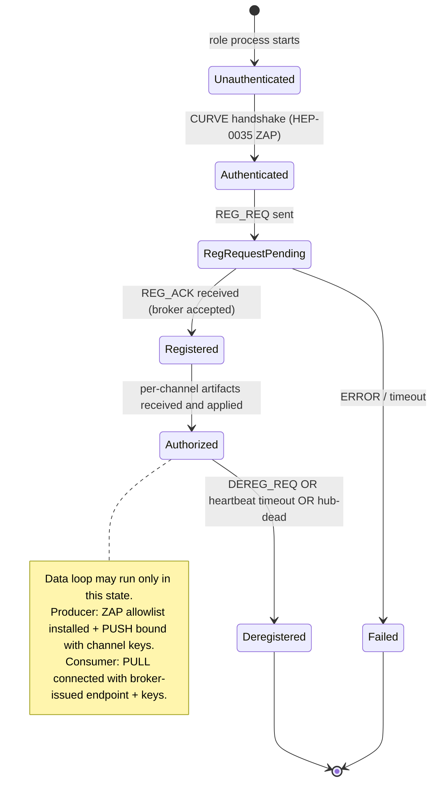
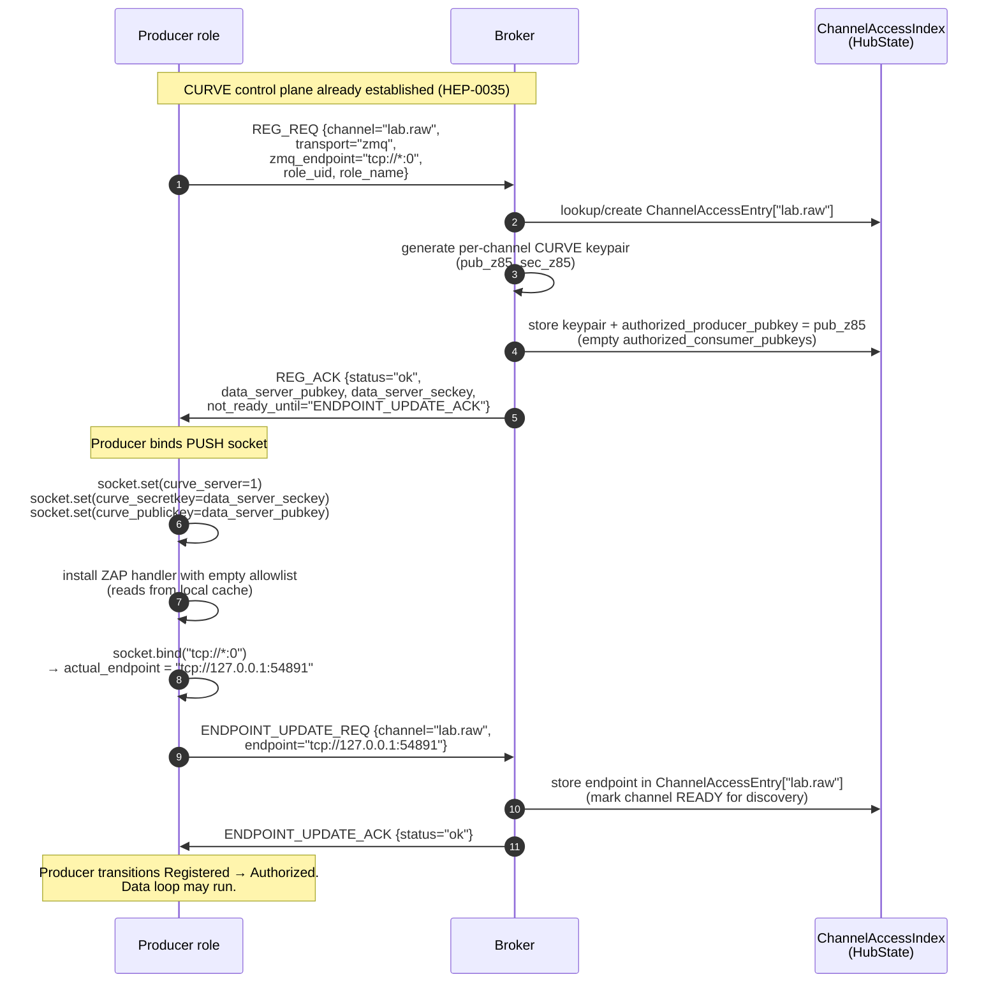
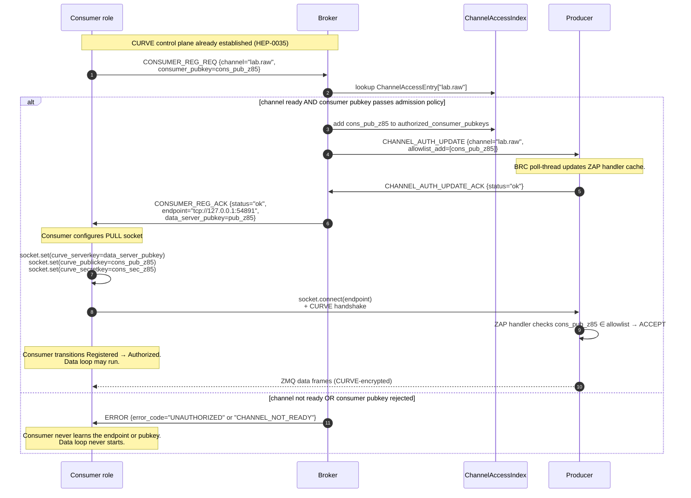
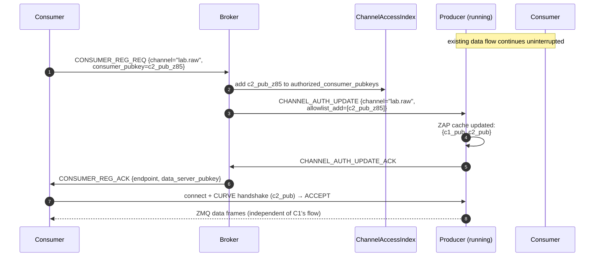

# HEP-CORE-0036: Authenticated Connection Establishment

| Property        | Value                                                                                                       |
|-----------------|-------------------------------------------------------------------------------------------------------------|
| **HEP**         | `HEP-CORE-0036`                                                                                             |
| **Title**       | Authenticated Connection Establishment — Single-Gate Access Control for Control + Data Planes               |
| **Status**     | 🚧 **DRAFT — DESIGN UNDER REVIEW.** Cross-references HEP-CORE-0021, HEP-CORE-0035, HEP-CORE-0023.            |
| **Created**     | 2026-05-26                                                                                                  |
| **Area**        | Framework Architecture (broker access control, role-side CURVE wiring, data-plane peer authentication)      |
| **Depends on**  | HEP-CORE-0021 (ZMQ Endpoint Registry — endpoint discovery via broker), HEP-CORE-0035 (Hub-Role Authentication — broker-side ZAP + pubkey index), HEP-CORE-0023 (Startup Coordination — presence FSM) |
| **Blocks**      | Production deployment (data plane currently unauthenticated; see §3 gap analysis)                            |

---

## 1. Status banner

**This HEP is design-only — no part is implemented.** It exists because the
2026-05-26 holistic audit revealed that the data plane (PUSH/PULL between
producer ↔ consumer ↔ processor on ZMQ; SHM attach between producer ↔
consumer on SHM) has no peer-level authentication: any process able to
reach a producer's TCP endpoint can connect and consume the data stream
without involvement from the broker. HEP-CORE-0021 designed the
**broker-mediated endpoint discovery** mechanism; HEP-CORE-0035 designed
the **broker-side admission policy**; neither covers the **data peer
authentication** layer required to make the broker's access decisions
actually enforce.

This HEP completes the picture by establishing the **single gate
principle**: the broker is the sole authority for "who may communicate
with whom"; every other enforcement point in the system (producer-side
ZAP handler, SHM secret release, consumer-side data-socket setup) is a
**cache** of the broker's decision, not an independent gate.

---

## 2. Motivation

The 2026-05-26 dual-hub-processor-zmq demo run exposed four concrete gaps,
each verified against the current code:

1. **ZMQ data sockets have zero authentication.** `hub_zmq_queue.cpp:581-584`
   does `socket.bind(endpoint)` / `socket.connect(endpoint)` with no
   CURVE configuration. Grep across `src/utils/hub/` returns zero hits
   for `curve|CURVE` — confirmed exhaustive.
2. **Consumer can receive data even when broker registration fails.**
   The demo's consumer logged `CONSUMER_REG_REQ timed out after 5000ms`
   yet still received 767 of 1000 messages, because the data plane
   (consumer's PULL on tcp:5583) opens during `setup_infrastructure_`
   well before broker handshake is attempted.
3. **Endpoint is in the role's config file**, not in the broker. Any
   process with read access to `consumer.json` (or a port scanner) has
   the endpoint pre-positioned for connection attempts.
4. **Three separate enforcement points without a single source of
   truth.** Per the current sketch: broker decides admission
   (HEP-0035), broker mediates endpoint discovery (HEP-0021), and the
   data-plane peer would need its own ZAP allowlist. Without explicit
   coordination, these can diverge.

The fix is not "wire CURVE on more sockets." The fix is to make the
broker's decisions **load-bearing** — peers act only on broker-issued
artifacts (keys, endpoint, allowlist membership), and any deviation
becomes mechanically impossible (the connection literally cannot
complete).

---

## 3. Invariants (the architectural decisions being formalized)

These invariants are non-negotiable for any implementation:

### I1 — Single gate

**The broker's `ChannelAccessIndex` (defined in §4) is the sole source
of truth for "who can talk to whom on which channel."**

Every other component that gates data flow reads from this index (via
broker push, never independent computation):

- The producer-side ZAP handler reads its consumer allowlist from
  CHANNEL_AUTH_UPDATE messages pushed by the broker.
- The consumer's data socket CURVE config is populated from
  `CONSUMER_REG_ACK` fields issued by the broker.
- The SHM secret a consumer uses to attach is issued by the broker on
  `CONSUMER_REG_ACK`, generated by the broker per-channel (not
  configured by the producer).

No component performs an independent authorization decision. There is
exactly one gate; the rest are caches.

### I2 — Lifetime alignment

**A peer's data-plane access is co-extensive with its broker
registration state.** Specifically:

- Access is **granted** only after the peer reaches `Registered` AND
  the broker has issued the per-channel artifacts (key, endpoint,
  allowlist membership).
- Access is **revoked** when the peer transitions to `Deregistered`
  (via explicit `DEREG_REQ`, heartbeat timeout, or hub-dead detection),
  via broker push to all affected peers' caches.
- The data loop does not run while the peer's authorization-bearing
  state is anything other than `Authorized` (new FSM state per §4.3).

There is no "data flow without broker awareness" window. The race
between data-socket opening and broker handshake is eliminated by
ordering, not papered over by best-effort gating.

### I3 — No data before authorization

**A peer that has not been authorized by the broker cannot complete a
data-plane connection.** Specifically:

- ZMQ: the consumer does not know the producer's data endpoint until
  `CONSUMER_REG_ACK` carries it. Even with the endpoint, the
  consumer's CURVE handshake fails unless the producer's ZAP handler
  has received the consumer's pubkey in an authorized allowlist (via
  broker push).
- SHM: the consumer does not know the per-channel SHM secret until
  `CONSUMER_REG_ACK` carries it. The producer's DataBlock was created
  with that secret; attach fails for any consumer that didn't get the
  secret from the broker.

### I4 — Per-channel keys (not per-role keys)

**CURVE keypairs used for data-plane sockets are per-channel, not
per-role.** Consequences:

- A consumer revoked from channel A does not lose access to channel B
  (separate keypairs).
- A producer's key rotation affects exactly one channel (no
  cross-channel blast radius).
- The keypair lifetime is bound to the channel's existence on the
  broker (created on producer's REG_REQ; destroyed on DEREG).

The role's identity keypair (broker-control-plane CURVE, HEP-0035)
remains long-lived and operator-managed via `plh_role --keygen`.

### I5 — Endpoint disclosure follows authorization

**The data-plane endpoint is broker-state, not role-state.** Role
configs declare a channel name (`in_channel` / `out_channel`) and
optionally a port range / bind interface hint; the **actual endpoint
string** (`tcp://host:port`) is computed at producer bind time (per
HEP-0021 §16 ephemeral port resolution) and lives only on the broker
+ in the role's runtime memory. It does not appear in any persisted
config file.

---

## 4. Architecture

### 4.1 The single gate — `ChannelAccessIndex`

A new in-memory structure inside `HubState`, indexed by `channel_name`:

```cpp
struct ChannelAccessEntry
{
    // Per-channel CURVE keypair — broker-minted at producer REG_REQ time.
    std::string  data_server_pubkey_z85;     // Producer's PUSH ZAP server pubkey.
    std::string  data_server_seckey_z85;     // Broker holds; pushed to producer.

    // Per-channel SHM secret — broker-generated; replaces config-supplied secret.
    uint64_t     shm_secret;                 // Used only when transport=shm.

    // Allowed consumer pubkeys — broker-maintained allowlist.
    // Producer's ZAP handler enforces; updated via CHANNEL_AUTH_UPDATE pushes.
    std::unordered_set<std::string>  authorized_consumer_pubkeys;

    // Authorized producer pubkey (always exactly one in MVP; per-producer
    // in multi-producer fan-in — see §9).
    std::string  authorized_producer_pubkey;
};

// In HubState:
std::unordered_map<std::string, ChannelAccessEntry>  channel_access_index_;
```

**Single source of truth.** Read by: REG handler (decides whether to
allow REG), CONSUMER_REG handler (decides whether to admit and what
artifacts to return), CHANNEL_AUTH_UPDATE emitter (decides what to
push to producers). Written by: REG handler (creates entry on
producer REG; deletes entry on producer DEREG), CONSUMER_REG handler
(adds/removes consumer pubkeys).

### 4.2 Component overview

```mermaid
graph TB
    subgraph Hub
        Broker["BrokerService<br/>(broker_service.cpp)"]
        AccessIndex["ChannelAccessIndex<br/>(HubState, single gate)"]
        Broker -- writes/reads --> AccessIndex
    end

    subgraph "Producer role"
        ProdBRC["BrokerRequestComm<br/>(CURVE control plane)"]
        ProdZap["Producer's<br/>ZAP handler"]
        ProdPush["Producer PUSH<br/>(CURVE server)"]
        ProdZap -- "allows/denies<br/>CURVE handshake" --> ProdPush
    end

    subgraph "Consumer role"
        ConsBRC["BrokerRequestComm<br/>(CURVE control plane)"]
        ConsPull["Consumer PULL<br/>(CURVE client)"]
    end

    Broker -. "REG_ACK + per-channel keys" .-> ProdBRC
    Broker -. "CHANNEL_AUTH_UPDATE<br/>(allowlist push)" .-> ProdBRC
    ProdBRC -. "configure" .-> ProdZap
    ProdBRC -. "configure" .-> ProdPush

    Broker -. "CONSUMER_REG_ACK + endpoint<br/>+ producer pubkey + (shm secret)" .-> ConsBRC
    ConsBRC -. "configure" .-> ConsPull

    ProdPush == "ZMQ CURVE data frames" ==> ConsPull
```



Every arrow that crosses a process boundary is either:
- **CURVE-authenticated control plane** (BRC ↔ Broker, already CURVE per HEP-0035 control-plane scope), or
- **CURVE-authenticated data plane** (Producer PUSH ↔ Consumer PULL, NEW), or
- **SHM attach gated by broker-issued secret** (NEW for SHM transport).

### 4.3 Lifetime FSM — extends HEP-0023's RegistrationState

HEP-0023 defines a per-presence `RegistrationState` FSM:
`Unregistered → RegRequestPending → Registered → Deregistered`. This
HEP adds the **`Authorized`** state to represent the post-REG window
during which the broker has issued the per-channel artifacts and the
data loop may run:



**Producer transitions:**
- `Registered → Authorized` when the producer has bound its PUSH socket
  with the broker-issued per-channel keypair AND installed its ZAP
  handler with the initial (possibly empty) allowlist.
- `Authorized → Deregistered` on DEREG. ZAP allowlist cleared; PUSH
  socket closed.

**Consumer transitions:**
- `Registered → Authorized` when the consumer has connected its PULL
  socket with the broker-issued endpoint + keys AND completed the
  CURVE handshake (allowlist match confirmed).
- `Authorized → Deregistered` on DEREG or producer-deregistered cascade.

---

## 5. Sequence diagrams

### 5.1 Producer registration (ZMQ, port-0 ephemeral binding)



**Single-gate property**: at step 4 the broker is the sole entity that
generates the per-channel keypair. Producer cannot start its data
socket with any other key. At step 8 the producer's PUSH socket is
CURVE-server configured but allowlist is empty — no consumer can
connect yet. The Authorized transition gates the data loop's start.

### 5.2 Consumer registration + data connect (ZMQ)



**Single-gate property**: the broker is the sole entity that decides
(step 3) whether to admit the consumer AND the sole entity that pushes
the allowlist update to the producer (step 5). If the broker rejects,
the consumer never receives the endpoint or pubkey (step 14) — there
is no way for the consumer to attempt a connection. If the broker
accepts but the push to the producer fails, the broker MUST not
return the endpoint to the consumer until the push succeeds (or it
must roll back the allowlist add).

### 5.3 Multi-consumer fan-out: second consumer joins a running channel



**Property**: producer's existing CURVE session with C1 is unaffected.
The ZAP allowlist add is incremental; no socket re-bind, no key
rotation, no disruption.

### 5.4 Consumer deregistration (consumer leaves, other consumers continue)

```mermaid
sequenceDiagram
    autonumber
    participant C1 as Consumer #1 (leaving)
    participant B as Broker
    participant AI as ChannelAccessIndex
    participant P as Producer
    participant C2 as Consumer #2 (continuing)

    C1->>B: CONSUMER_DEREG_REQ {channel="lab.raw"}
    B->>AI: remove c1_pub_z85 from authorized_consumer_pubkeys
    B->>P: CHANNEL_AUTH_UPDATE {channel="lab.raw",<br/>allowlist_remove=[c1_pub_z85]}
    P->>P: ZAP cache updated: {c2_pub}<br/>(any future C1 reconnect attempt → REJECT)
    P->>B: CHANNEL_AUTH_UPDATE_ACK
    B->>C1: CONSUMER_DEREG_ACK
    C1->>C1: close PULL socket; transition Deregistered

    Note over P,C2: C2's data flow continues uninterrupted
```

**Property**: removing C1's pubkey from the allowlist does NOT close
C1's existing TCP connection (ZAP only gates new handshakes). To
forcibly disconnect C1, the producer would need to close the
connection at the socket level — explicit teardown out of scope for
MVP; rely on C1's cooperative close.

### 5.5 Heartbeat timeout — broker-initiated revocation

```mermaid
sequenceDiagram
    autonumber
    participant C as Consumer (dead/stalled)
    participant B as Broker
    participant AI as ChannelAccessIndex
    participant P as Producer

    Note over C: heartbeats stop (process crash, network partition, etc.)
    B->>B: heartbeat timeout detected for consumer C
    B->>AI: remove C's pubkey from authorized_consumer_pubkeys
    B->>P: CHANNEL_AUTH_UPDATE {channel="lab.raw",<br/>allowlist_remove=[c_pub_z85]}
    P->>P: ZAP cache updated; future reconnects from C → REJECT
    P->>B: CHANNEL_AUTH_UPDATE_ACK

    Note over C,P: If C recovers and attempts to reconnect:<br/>CURVE handshake fails (pubkey not in allowlist).<br/>C must re-register via control plane to be re-authorized.
```

**Property**: the broker is the sole entity that detects liveness and
the sole entity that mutates access. Producer's enforcement is
reactive — it does what the broker says.

### 5.6 SHM consumer attach

```mermaid
sequenceDiagram
    autonumber
    participant P as Producer
    participant B as Broker
    participant AI as ChannelAccessIndex
    participant C as Consumer
    participant SHM as DataBlock<br/>(in shared memory)

    P->>B: REG_REQ {channel="lab.raw", transport="shm"}
    B->>AI: lookup/create entry
    B->>B: generate per-channel shm_secret<br/>(uint64 random)
    B->>AI: store shm_secret in ChannelAccessEntry
    B->>P: REG_ACK {status="ok", shm_secret}
    P->>SHM: create DataBlock with shm_secret as the<br/>guard secret (HEP-CORE-0002)

    C->>B: CONSUMER_REG_REQ {channel="lab.raw",<br/>consumer_pubkey=cons_pub_z85}
    B->>AI: lookup; check consumer pubkey ∈ admission policy
    alt authorized
        B->>C: CONSUMER_REG_ACK {transport="shm",<br/>shm_name, shm_secret}
        C->>SHM: attach with shm_secret → ACCEPT
        C-->>SHM: ring buffer reads
    else unauthorized
        B->>C: ERROR {error_code="UNAUTHORIZED"}
        Note over C: Consumer does not receive shm_secret.<br/>Attach attempts without secret → REJECT.
    end
```

**Property**: SHM's existing secret-based attach gate (HEP-CORE-0002)
remains the underlying mechanism. The change is: the secret is
**generated by the broker** (not configured by the producer), and is
**released to consumers conditional on broker authorization**. The
config field `out_shm_secret` is retired; if present in old configs,
it is logged as a warning and ignored.

### 5.7 Producer deregistration — cascading consumer notification

```mermaid
sequenceDiagram
    autonumber
    participant P as Producer
    participant B as Broker
    participant AI as ChannelAccessIndex
    participant C1 as Consumer #1
    participant C2 as Consumer #2

    P->>B: DEREG_REQ {channel="lab.raw"}
    B->>AI: clear ChannelAccessEntry["lab.raw"]<br/>(keys, allowlist, endpoint all gone)
    B->>C1: CHANNEL_CLOSING_NOTIFY {channel="lab.raw"}
    B->>C2: CHANNEL_CLOSING_NOTIFY {channel="lab.raw"}
    B->>P: DEREG_ACK
    P->>P: close PUSH socket
    C1->>C1: transition Authorized → Deregistered;<br/>close PULL; data loop exits
    C2->>C2: same
```

**Property**: cascade is broker-driven; no peer-to-peer signaling
required. Consumers receive a single notification message via the
existing CHANNEL_CLOSING_NOTIFY infrastructure (already implemented
per HEP-CORE-0023). Their data-loop FSM transitions are local
responses to that notification.

---

## 6. Wire format extensions

These extensions add fields to existing message schemas. All additions
are backward-compatible at the protocol level (broker can detect
absence and reject with a typed ERROR), but no production deployment
should run with peers that lack the auth fields once this HEP ships.

### 6.1 `REG_REQ` (producer → broker) — additions

| Field | Type | Description |
|---|---|---|
| `wants_data_keypair` | bool | Producer requests broker to mint a per-channel CURVE keypair. Default: `true` post-HEP-0036. |
| `wants_shm_secret` | bool | (transport=shm only) Producer requests broker to generate a per-channel SHM secret. Default: `true` post-HEP-0036. |
| `endpoint_hint_range` | string | Optional: `tcp://*:49152-65535` or `tcp://0.0.0.0:0`. Specifies bind interface + port range; producer still uses port-0 binding within range. |

The legacy `shm_secret` field is deprecated and ignored when
`wants_shm_secret=true`.

### 6.2 `REG_ACK` (broker → producer) — additions

| Field | Type | Description |
|---|---|---|
| `data_server_pubkey` | string (Z85, 40 chars) | Per-channel CURVE public key the producer must set as `curve_publickey` on its PUSH socket. |
| `data_server_seckey` | string (Z85, 40 chars) | Per-channel CURVE secret key the producer must set as `curve_secretkey` on its PUSH socket. |
| `shm_secret` | uint64 | (transport=shm only) Broker-generated secret for the DataBlock. |
| `initial_allowlist` | array<string> | Pubkeys already authorized for this channel (if any consumers pre-registered). Usually empty on fresh channel. |

### 6.3 `CONSUMER_REG_REQ` (consumer → broker) — additions

| Field | Type | Description |
|---|---|---|
| `consumer_pubkey` | string (Z85, 40 chars) | The consumer's CURVE public key that will be used on its PULL data socket. May equal the consumer's control-plane pubkey or be a per-channel-derived key. |

### 6.4 `CONSUMER_REG_ACK` (broker → consumer) — additions

| Field | Type | Description |
|---|---|---|
| `data_server_pubkey` | string (Z85, 40 chars) | (transport=zmq only) The producer's per-channel public key for CURVE handshake. |
| `shm_secret` | uint64 | (transport=shm only) The per-channel SHM secret. |

The existing `zmq_endpoint` field (already in HEP-0021 §5.2) carries
the producer's endpoint.

### 6.5 `CHANNEL_AUTH_UPDATE` (broker → producer) — NEW message

Sync request-reply per HEP-CORE-0007 §12.2.1 (the producer must
confirm the cache update before the broker can release the consumer
to connect):

| Field | Type | Description |
|---|---|---|
| `channel_name` | string | Channel whose allowlist is updated. |
| `allowlist_add` | array<string> | Consumer pubkeys to add to the producer's ZAP cache. |
| `allowlist_remove` | array<string> | Consumer pubkeys to remove from the producer's ZAP cache. |

Producer responds with `CHANNEL_AUTH_UPDATE_ACK { status }`.

### 6.6 Error codes

Added to HEP-CORE-0007 §12.4a Error Code Taxonomy:

| Code | When |
|---|---|
| `UNAUTHORIZED_CONSUMER_PUBKEY` | CONSUMER_REG_REQ from a pubkey not in `cfg.known_roles[]` (HEP-0035 L2). |
| `CHANNEL_NOT_READY` | CONSUMER_REG_REQ for a channel whose producer hasn't completed ENDPOINT_UPDATE (HEP-0021 §16.4). |
| `ALLOWLIST_PUSH_FAILED` | Broker tried to push CHANNEL_AUTH_UPDATE to producer but didn't get ACK; consumer's CONSUMER_REG_REQ rolls back. |
| `KEYPAIR_GENERATION_FAILED` | Broker libsodium / CURVE keygen failure on REG_REQ. Operator should check entropy / libsodium installation. |

---

## 7. Producer-side ZAP handler

ZeroMQ's ZAP (RFC 27) requires a single inproc socket at
`inproc://zeromq.zap.01` per process. Pylabhub roles already establish
ZMQ contexts at startup (one per process); this HEP adds the ZAP
handler thread within the same context.

### 7.1 Handler placement

The ZAP handler runs on the BRC poll thread (or a sibling thread
sharing the role's ZMQ context). Rationale:

- The ZAP handler must answer handshake requests within libzmq's
  internal timeout (default 10s; configurable). The BRC poll thread
  is already running and handles fast turn-around messages.
- Co-location with the BRC means the ZAP cache and the
  CHANNEL_AUTH_UPDATE consumer are in the same thread; no cross-thread
  synchronization needed for cache reads.

### 7.2 Cache contract

```cpp
struct PerChannelAllowlist
{
    std::unordered_set<std::string>  authorized_consumer_pubkeys_z85;
};

// One per channel the producer publishes on.
std::unordered_map<std::string, PerChannelAllowlist>  zap_cache_;
```

**Cache update protocol:**
- Initial population: from `REG_ACK.initial_allowlist`.
- Incremental updates: from `CHANNEL_AUTH_UPDATE` requests.
- Clear on `DEREG`: the channel's entry is removed.

**Cache read protocol** (in the ZAP handler):
- ZAP request includes the consumer's pubkey + the destination
  endpoint (which producers can map to a channel name via reverse
  lookup from their bind table).
- Handler returns ALLOW iff pubkey is in the channel's authorized set;
  else DENY.

### 7.3 Failure modes

| Failure | Behavior |
|---|---|
| Cache miss for a known channel | DENY (handshake fails). |
| ZAP request before initial REG_ACK installed cache | DENY. (Race window: broker must serialize CONSUMER_REG_ACK after CHANNEL_AUTH_UPDATE_ACK from producer.) |
| Producer's ZAP handler thread dead | All handshakes fail. Detectable via libzmq's monitor; should trigger a role-level critical-error transition. |

---

## 8. Lifecycle gating in the data loop

The data loop (`run_data_loop` in `data_loop.hpp:101`) currently checks
only `core.is_running() && !is_shutdown_requested() && !is_critical_error()`.
This HEP adds an Authorized-state gate. **No data-plane operation may
run unless at least one Presence is in `Authorized`.**

### 8.1 Gate function

```cpp
// On RoleAPIBase or HEP-0023's role-handler accessor:
[[nodiscard]] bool any_presence_authorized() const noexcept;
```

Returns `true` iff at least one of the role's presences has
`registration_state.load() == RegistrationState::Authorized`.

### 8.2 Outer-loop guard

```cpp
while (core.is_running() &&
       !core.is_shutdown_requested() &&
       !core.is_critical_error() &&
       any_presence_authorized())   // NEW
{
    // ... existing body ...
}
```

**Spin vs block:** the loop should not spin-wait pre-Authorized — that
would burn CPU during startup. Implementation: the role host blocks
on a condition variable signaled by the BRC poll thread when ANY
presence reaches Authorized; the data loop wait-and-resume from
there.

### 8.3 Per-presence gating for multi-side roles (processor)

A processor with one Consumer + one Producer presence may be in a
state where the Consumer side is `Authorized` but the Producer side
is `Registered` (because the broker hasn't yet pushed the producer's
allowlist update). The data loop's per-iteration `ops.acquire(ctx)`
should consult the SPECIFIC presence being read/written, not the
aggregate. Per-presence gating is implemented in the `ops` impl
(`ProcessorCycleOps`), which already has per-presence visibility via
the api's `has_tx_side()` / `has_rx_side()` accessors.

---

## 9. Multi-producer / multi-consumer scenarios

Combination matrix from the 2026-05-26 audit, expanded with HEP-0036
auth semantics:

| Scenario | ZMQ behavior under HEP-0036 | SHM behavior under HEP-0036 |
|---|---|---|
| 1 producer, 1 consumer | Standard flow (§5.1 + §5.2). Single CURVE keypair, allowlist size 1. | Single shm_secret. Single consumer in admission allowlist. |
| 1 producer, N consumers (fan-out) | Single keypair; allowlist grows incrementally per §5.3. Each consumer's PULL socket independently CURVE-authenticated. | All N consumers receive the same shm_secret from broker; broker individually authorizes each via CONSUMER_REG check. Revocation: broker stops releasing secret to new attaches AND (future) integrates per-consumer ACL on attach (out of MVP scope; SHM today doesn't enforce per-consumer ACL post-attach). |
| N producers, 1 consumer (fan-in) | Per-producer keypair + per-producer allowlist (HEP-0021 §16.3 already established per-producer endpoint scope). Consumer registers separately per producer (current REG protocol); receives N (pubkey, endpoint) pairs in CONSUMER_REG_ACK. | **Not supported on SHM** — already rejected with `MULTI_PRODUCER_NOT_SUPPORTED_FOR_SHM`. No HEP-0036 work needed. |
| N producers, N consumers | ZMQ: cross-product handled — each consumer registers per producer; broker pushes per-producer allowlist updates. M consumers × P producers = M+P registrations + M×P CURVE sessions. | N/A — SHM doesn't support multi-producer. |

### 9.1 Per-producer fan-in nuance

In a Fan-In channel today (HEP-0021 §16.3), each producer registers
its own endpoint via `ENDPOINT_UPDATE_REQ`. Each producer's
`ProducerEntry` carries its own endpoint. Under HEP-0036, each
producer also carries its own per-channel keypair (broker generates
one keypair per `ProducerEntry`, not one per `ChannelEntry`).

`CONSUMER_REG_ACK` returns an ARRAY of `(producer_pubkey, endpoint)`
pairs — one per registered producer. The consumer iterates and opens
one PULL socket per producer.

### 9.2 SHM per-consumer authorization

SHM today: producer creates DataBlock with `shm_secret`; any process
with the secret can attach. There is no per-consumer access control
on attach.

Under HEP-0036 MVP: broker enforces per-consumer authorization at
**secret release time** (CONSUMER_REG_ACK). Once a consumer holds the
secret, the existing SHM machinery allows attach. Revocation of an
already-attached consumer is **out of MVP scope** — would require
adding application-layer per-consumer ACL on attach, which is a
significant DataBlock change. Tracked as a follow-up if a concrete
revocation requirement emerges.

---

## 10. Lifetime alignment — full role lifecycle

Combining HEP-0023's existing startup sequence with HEP-0036's
authorization layer:

```mermaid
sequenceDiagram
    autonumber
    participant R as Role process
    participant B as Broker
    participant DL as Data loop
    participant DS as Data socket

    Note over R: Process start (plh_role binary main)
    R->>R: load config + setup ZMQ context
    R->>B: CURVE handshake (HEP-0035 L1 ZAP)
    Note over R,B: state: Authenticated

    R->>B: REG_REQ
    B->>R: REG_ACK + per-channel keys/secret
    Note over R: state: Registered

    R->>DS: configure socket with broker-issued artifacts
    alt ZMQ producer
        R->>DS: bind PUSH(port=0); ENDPOINT_UPDATE_REQ; install ZAP
    else ZMQ consumer
        R->>DS: configure PULL with received endpoint + key
        R->>DS: connect + CURVE handshake (gated by producer's ZAP)
    else SHM consumer
        R->>DS: attach DataBlock with received shm_secret
    end
    Note over R: state: Authorized<br/>(condvar signaled to data loop)

    R->>DL: signal: enter data loop
    DL->>DL: while (any_presence_authorized()) { ... }
    Note over DL: data flow active

    Note over R: ... role runs for its lifetime ...

    Note over R: Shutdown initiated (SIGTERM, explicit close, or hub-dead cascade)
    R->>B: DEREG_REQ
    B->>R: DEREG_ACK
    B->>B: push CHANNEL_AUTH_UPDATE allowlist_remove to peers
    Note over R: state: Deregistered
    DL->>DL: any_presence_authorized() == false → exit loop
    R->>DS: close socket
    R->>R: process exit
```

**Property**: there is no "data flow without broker awareness" window
in either direction. The data loop starts only after Authorized;
exits when no presence remains Authorized. The data socket is
configured only with broker-issued artifacts (never config-supplied).
The role's identity (control-plane CURVE keypair) is the only
operator-managed long-lived secret.

---

## 11. Backward compatibility and dev-mode

### 11.1 Backward compatibility

There is none. HEP-0036 makes auth required. Roles built against
pre-HEP-0036 configs (e.g., those with `out_shm_secret` set in JSON,
or those without a `keyfile`) MUST be rebuilt against new configs
that omit those fields and provide the role's CURVE keypair via
`plh_role --keygen`.

The codebase explicitly accepts the breaking change because the
pre-HEP-0036 state is a security hole; backward compatibility with an
insecure deployment is not a design goal.

### 11.2 Dev-mode escape hatch

For local development and unit testing:

- `hub.dev_mode = true` in hub.json disables Layer-1 ZAP authentication
  (HEP-0035) AND data-plane CURVE wiring (HEP-0036). Sockets fall back
  to NULL handshake.
- Dev-mode is rejected at config-load time if the broker endpoint is
  not loopback (`127.0.0.1` or `localhost`). Production deployments
  cannot accidentally ship with dev-mode enabled on a routable address.
- Tests that exercise the auth path must run with `dev_mode = false`
  and supply CURVE keypairs.

---

## 12. Implementation phases

| Phase | Scope | Notes |
|---|---|---|
| 1 | `ChannelAccessIndex` skeleton in HubState; broker mints per-channel keys on REG_REQ; REG_ACK carries them. **No enforcement** yet — keys are issued but data sockets still plain TCP. | Smallest behavior change; verifies the wire format. |
| 2 | Producer side: wire CURVE on PUSH socket using REG_ACK keys; install ZAP handler with empty allowlist; **reject all incoming connections** until allowlist populated. | Producers go offline for any unconfigured consumer; intentional. |
| 3 | Broker side: per-channel CURVE-server-key validation on CONSUMER_REG_REQ; **add admitted consumer to allowlist**; emit `CHANNEL_AUTH_UPDATE` to producer (sync per HEP-0007 §12.2.1). | Closes the loop: consumer can now connect after auth. |
| 4 | Consumer side: read `data_server_pubkey` + endpoint from CONSUMER_REG_ACK; configure PULL with CURVE; data-loop gate on Authorized state. | End-to-end ZMQ auth working. |
| 5 | SHM parallel: broker generates `shm_secret` per channel; `CONSUMER_REG_ACK` releases it only on auth. Retire config-supplied `shm_secret`. | SHM secret moves from config to broker. |
| 6 | Heartbeat-timeout revocation: broker pushes allowlist removal on heartbeat timeout; producer ZAP cache updates. | Closes lifetime-alignment loop for dead consumers. |
| 7 | Multi-producer fan-in: per-producer keypair generation; `CONSUMER_REG_ACK` returns array of (pubkey, endpoint) pairs; consumer opens N PULL sockets. | Touches HEP-0021 §16.3's per-producer endpoint scope. |
| 8 | Dev-mode escape hatch + loopback-enforcement; documentation refresh. | Operator-facing surface. |
| 9 | Test coverage: L2 unit tests for ZAP handler cache, broker access index, allowlist update; L3 for end-to-end auth on dual-hub-processor scenarios; demo framework verification. | Sign-off gate. |
| 10 | HEP-0021 + HEP-0035 + HEP-0023 cross-reference updates; retire legacy `RoleIdentityPolicy` (HEP-0035 §4.5 already calls for this); HEP-0009 §2.7 retraction. | Doc closeout. |

---

## 13. Open questions

1. **Key generation source.** Broker mints CURVE keypair via libsodium
   `crypto_box_keypair()`. Acceptable for MVP. For HSM-backed
   deployments, broker keygen would be replaced with HSM call —
   future extension.

2. **Per-channel key rotation.** Today: keys are minted at REG_REQ
   and live until DEREG. No mid-lifetime rotation. If long-lived
   producers want forward secrecy, rotation requires (a) broker
   minting new keys, (b) cascade re-auth of all consumers. Out of
   MVP scope; tracked as enhancement.

3. **`CHANNEL_AUTH_UPDATE` ordering.** When broker accepts a consumer
   AND must push to producer AND must return endpoint to consumer,
   the ordering MUST be: broker accepts → push to producer →
   PRODUCER_ACK → return endpoint to consumer. If the
   producer-push fails (timeout / error), broker MUST roll back the
   allowlist add and return ERROR to consumer (avoiding "consumer
   has key but producer doesn't allow it" state).

4. **Federation (HEP-0022 cross-hub).** When Hub-A's consumer
   registers on a channel hosted by Hub-B, the allowlist push must
   reach Hub-B's producer. Today HEP-0022 uses `HUB_RELAY_MSG`
   broker↔broker for unsolicited relay; HEP-0036 needs to ensure
   `CHANNEL_AUTH_UPDATE` rides this path. Cross-hub trust mode
   (HEP-0035 §4.3 `federation_trust_mode`) gates the allowlist
   propagation.

5. **Per-presence vs per-role keypair on consumer side.** A
   processor with 2 presences (in + out) could use one consumer
   keypair for both REG paths or distinct keypairs per side. MVP:
   per-presence keypair (clean teardown semantics; processor's
   in-side revocation doesn't affect out-side). Trade-off: more
   keypairs to manage; acceptable.

6. **SHM revocation of already-attached consumer.** Out of MVP per
   §9.2. Concrete trigger to reopen: a use case where a once-
   authorized consumer's attach must be forcibly closed. None
   identified yet.

7. **Audit log shape.** HEP-0035 §7 question 4 (audit logging
   policy) covers Layer-1 + Layer-2 decisions; HEP-0036 adds Layer-3
   (data-plane CURVE accept/reject from ZAP). Same logging policy
   should apply; coordinate with HEP-0035 implementation.

---

## 14. Updates to other HEPs

This HEP requires synchronized updates to three sibling HEPs. The
updates are minimal — pointers / scope clarifications, not redesign.

### 14.1 HEP-CORE-0021 (ZMQ Endpoint Registry)

- **§5.1 REG_REQ schema** — add `wants_data_keypair`,
  `wants_shm_secret`, `endpoint_hint_range` (cross-reference HEP-0036
  §6.1).
- **§5.2 CONSUMER_REG_ACK schema** — add `data_server_pubkey`
  (cross-reference HEP-0036 §6.4); note existing `shm_secret` is now
  broker-issued, not echoed from config.
- **§16.5 production path** — note that the auth wiring (HEP-0036
  Phase 1-4) lands together with §16.5 ephemeral-binding completion;
  these were always intended to be the same wire-format change.
- **New §17** — one-paragraph stub pointing to HEP-0036 for the auth
  layer.

### 14.2 HEP-CORE-0035 (Hub-Role Authentication)

- **§4.1 Layered enforcement** — add Layer-3 "Data-plane peer
  authentication," covered by HEP-0036 (cross-reference).
- **§4.2 Pubkey index** — clarify that HEP-0036's `ChannelAccessIndex`
  is a separate per-channel structure consuming the same control-plane
  pubkey index as its foundation.
- **§7 Open questions** — answer question 4 (audit log) coordinated
  with HEP-0036 §13 question 7.
- **§8 Implementation phases** — HEP-0035 Phases 1-5 (broker ZAP +
  federation gate) remain prerequisite; HEP-0036 Phases land after
  HEP-0035 Phase 5.

### 14.3 HEP-CORE-0023 (Startup Coordination)

- **§2 Per-presence FSM** — add `Authorized` state per HEP-0036 §4.3;
  update state diagram; update transition table.
- **§6 Complete Startup Sequence** — integrate HEP-0036 §10 sequence
  diagram into the role's overall startup picture.

---

## 15. References

- HEP-CORE-0021 — ZMQ Endpoint Registry (endpoint discovery; per-producer scope).
- HEP-CORE-0035 — Hub-Role Authentication and Federation Trust (broker ZAP + pubkey index).
- HEP-CORE-0023 — Startup Coordination (presence FSM).
- HEP-CORE-0007 §12 — Wire format / message categories / error code taxonomy.
- HEP-CORE-0002 — DataBlock SHM (existing shared_secret attach mechanism).
- HEP-CORE-0022 — Hub Federation Broadcast (cross-hub relay for allowlist updates).
- ZeroMQ ZAP RFC 27 — http://rfc.zeromq.org/spec:27/ZAP
- ZeroMQ CURVE security — http://api.zeromq.org/master:zmq-curve
