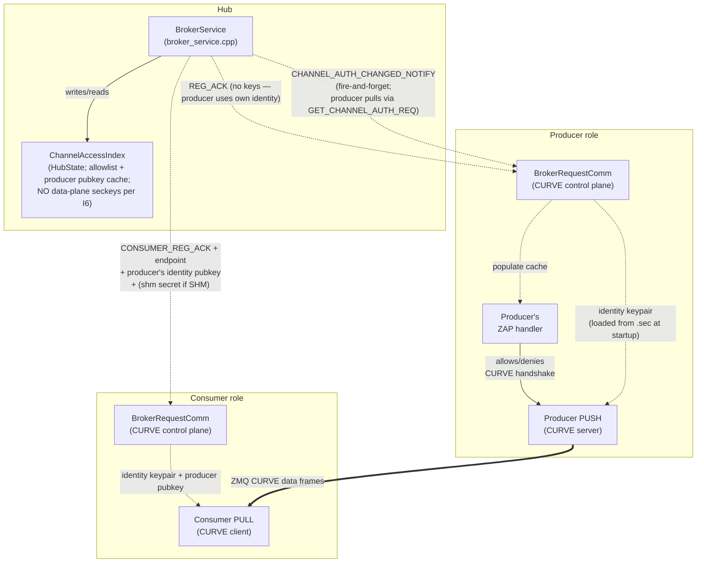
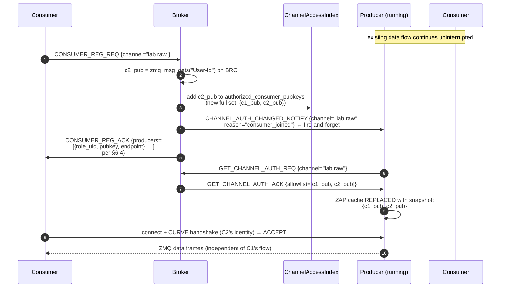

# HEP-CORE-0036: Authenticated Connection Establishment

| Property        | Value                                                                                                       |
|-----------------|-------------------------------------------------------------------------------------------------------------|
| **HEP**         | `HEP-CORE-0036`                                                                                             |
| **Title**       | Authenticated Connection Establishment — Single-Gate Access Control for Control + Data Planes               |
| **Status**     | 🚧 **DESIGN FINAL; IMPLEMENTATION IN FLIGHT** — T1 / T2 / I9 LOCKED 2026-05-28; DP-Q1 (skip-disconnected push) RETRACTED 2026-06-04 along with the snapshot-push-with-ACK design it gated; D1 (`ChannelAccessIndex` in HubState, commit `cacea477`) + D2 (broker CTRL ROUTER ZAP + federation peer pubkey union, commit `d18d2e91` + close-out) shipped 2026-06-03.  §6.5 channel-auth synchronization wire AMENDED 2026-06-04 from snapshot-push-with-ACK to notify-then-pull (`CHANNEL_AUTH_CHANGED_NOTIFY` + `GET_CHANNEL_AUTH_REQ`/`_ACK`); see §6.5 Amendment block.  Remaining auth chain restructured 2026-06-09 from D3-D7 → AUTH-1..7 numbering in `docs/todo/AUTH_TODO.md` (see §1 Status banner) ⏳; sibling tasks #74 / #94 / #101 ✅ / #102 / #103 + Phase 0-11 in §12.  Open items in §13.1 (federation Q1, audit log Q2) are post-MVP. |
| **Created**     | 2026-05-26                                                                                                  |
| **Last revised** | 2026-06-04 — §6.5 wire-frame **AMENDED: snapshot-push-with-ACK → notify-then-pull.**  The retired design (2026-06-02) had the broker push a full-allowlist snapshot and synchronously wait for `CHANNEL_AUTH_UPDATE_ACK` per producer, making the broker for the first time a sync-request initiator on the same ROUTER socket it serves as responder.  The new design splits into a fire-and-forget `CHANNEL_AUTH_CHANGED_NOTIFY` (broker→producer; same shape as existing `CHANNEL_CLOSING_NOTIFY` etc.) plus a standard `GET_CHANNEL_AUTH_REQ`/`GET_CHANNEL_AUTH_ACK` request-reply (producer pulls when it cares).  No new protocol patterns; broker stays a pure responder; producer-offline becomes the same code path as the existing `REG_ACK.initial_allowlist` reconnect re-sync.  Drift window honestly equivalent.  See §6.5 "Amendment 2026-06-04" block for the full rationale.  Prior revision 2026-06-02 (delta→snapshot; now superseded) preserved in git history.  Prior revision 2026-05-28 — T1 RESOLVED: symmetric identity-keypair design (broker mints nothing on data plane; both sides reuse their identity keys; SHM keeps broker-generated `shm_secret`).  Prior revision 2026-05-27 — two-conditions gate explicit; revocation reframed as passive (no force-close); inbox/bands inheritance; channels-are-dynamic non-goal; manual pubkey distribution MVP. |
| **Area**        | Framework Architecture (broker access control, role-side CURVE wiring, data-plane peer authentication)      |
| **Depends on**  | HEP-CORE-0021 (ZMQ Endpoint Registry — endpoint discovery via broker), HEP-CORE-0035 (Hub-Role Authentication — broker-side ZAP + pubkey index), HEP-CORE-0023 (Startup Coordination — presence FSM) |
| **Blocks**      | Production deployment (data plane currently unauthenticated; see §3 gap analysis)                            |

---

## 1. Status banner

**This HEP is the design contract — implementation is in flight as of
2026-06-03.**  D1 (`ChannelAccessIndex` in HubState — §4.1; commit
`cacea477`) and D2 (broker CTRL ROUTER ZAP with the union of
`known_roles[]` + `peers[].pubkey_z85` — §4.2 Layer-1; commit
`d18d2e91` + close-out) are shipped.  Remaining work was restructured
2026-06-09 from the D3-D7 ad-hoc labels into the AUTH-1..7
critical-path numbering inside `docs/todo/AUTH_TODO.md`: AUTH-1
(`CONSUMER_REG_ACK.producers[]` + BRC notify dispatch + consumer-side
switch — closes the D4+D5 work), AUTH-2 (producer-side ZAP pump on
BRC poll thread), AUTH-3 (`RegistrationState::Authorized` + data-loop
outer guard), AUTH-4 (broker-issued random `shm_secret` end-to-end),
AUTH-5 (sibling-HEP doc sync per §14), AUTH-6 (L3 broker tests),
AUTH-7 (L4 end-to-end auth-gated data flow).  See
`docs/todo/AUTH_TODO.md` for the per-task tracking IDs and current
status.

**§3.5 added 2026-06-12 (symmetric Option-α consolidation).**  The
new §3.5 ("The AUTH-gate principle and role coordination") states
the principle "nothing happens behind the auth door before auth"
and locks in symmetric POST-REG bind for both producer's PUSH and
consumer's PULL (driven by polymorphic `apply_*_reg_ack`),
fatal-on-failure registration, heartbeat at S3, broker
producer-joined notify on `kRegistering → kLive` (channel observable;
first heartbeat received).  Companion
edits applied to §I3 / §I4 / §I7 / §4.3.2 / §5.1 / §6.7 / §8.3 /
§9.1 / §10 / Phase 0.7 / Phase 2 / Phase 3 / Phase 4 / §13.2 / §14,
plus HEP-CORE-0027 §4.1 inbox-bind ordering.  Other sibling HEPs
(0017, 0021, 0023, 0033, 0035, 0040, 0007, 0030, 0031) audited
clean against §3.5 invariants at consolidation time.

The original 2026-05-26 motivation follows:
the 2026-05-26 holistic audit revealed that the data plane (PUSH/PULL
between producer ↔ consumer ↔ processor on ZMQ; SHM attach between
producer ↔ consumer on SHM) has no peer-level authentication: any
process able to reach a producer's TCP endpoint can connect and consume
the data stream without involvement from the broker.  HEP-CORE-0021
designed the **broker-mediated endpoint discovery** mechanism;
HEP-CORE-0035 designed the **broker-side admission policy**; neither
covers the **data peer authentication** layer required to make the
broker's access decisions actually enforce.

This HEP completes the picture by establishing the **two-conditions
gate** (I1): the broker authorizes a role only if (1) the role's CURVE
handshake succeeded AND (2) the role's pubkey is in the hub's
`known_roles[]` allowlist.  Every other enforcement point in the system
(producer-side ZAP handler, SHM secret release, consumer-side data-
socket setup) is a **cache** of that decision — they refuse to act on
artifacts they never received from the broker, but they do not make
independent admission decisions.

Lifetime alignment (I3) ties data-plane access to control-plane state:
control link dies → data loop exits.  Revocation (I5) is passive — it
prevents NEW connections, but existing authenticated sessions are
trusted for their lifetime (the consumer's own role host closes its
data socket when the control link tears down).  This collapses what
earlier drafts contemplated as separate "broker-initiated eviction"
machinery into the natural shutdown path that already exists.

---

## 2. Motivation

The 2026-05-26 dual-hub-processor-zmq demo run exposed four concrete gaps,
each verified against the current code:

1. **ZMQ data sockets have zero authentication.** `hub_zmq_queue.cpp:581-584`
   does `socket.bind(endpoint)` / `socket.connect(endpoint)` with no
   CURVE configuration. Grep across `src/utils/hub/` returns zero hits
   for `curve|CURVE` — confirmed exhaustive.
2. **Consumer can receive data even when broker registration fails.**
   The demo's consumer logged `CONSUMER_REG_REQ timed out after 5000ms`
   yet still received 767 of 1000 messages, because the data plane
   (consumer's PULL on tcp:5583) opens during `setup_infrastructure_`
   well before broker handshake is attempted.
3. **Endpoint is in the role's config file**, not in the broker. Any
   process with read access to `consumer.json` (or a port scanner) has
   the endpoint pre-positioned for connection attempts.
4. **Three separate enforcement points without a single source of
   truth.** Per the current sketch: broker decides admission
   (HEP-0035), broker mediates endpoint discovery (HEP-0021), and the
   data-plane peer would need its own ZAP allowlist. Without explicit
   coordination, these can diverge.

The fix is not "wire CURVE on more sockets." The fix is to make the
broker's decisions **load-bearing** — peers act only on broker-issued
artifacts (keys, endpoint, allowlist membership), and any deviation
becomes mechanically impossible (the connection literally cannot
complete).

### 2.1 Non-goals (explicit)

The following are deliberately OUT of HEP-0036 scope:

- **Channel pre-declaration in hub config.** Hubs do NOT manage a
  static `channels[]` list.  Channels are created dynamically when
  a producer's `REG_REQ` arrives carrying a new `out_channel` name.
  Per-channel auth state (`ChannelAccessIndex` entry) is created
  alongside on producer REG; destroyed on producer DEREG.
- **Force-closing existing CURVE sessions on revocation.** ZeroMQ
  has no API for this.  Lifetime alignment (I3) makes it
  unnecessary: when a role loses its control link, the role's own
  data loop exits.  External force-close is incident response, not
  protocol (see I5).
- **Per-consumer ACL enforced inside the data path.** A consumer
  that holds a valid CURVE session OR a valid SHM secret is trusted
  for that session's lifetime.  ACL is enforced at the artifact
  release boundary (broker's CONSUMER_REG_ACK + producer-pulled
  `GET_CHANNEL_AUTH_ACK` per §6.5), not at every data frame / SHM
  read.
- **Automated public-key distribution.**  For MVP, hub and role
  public keys are distributed manually by the operator (copy
  `*.pub` files to the appropriate config dirs).  Automated
  distribution (e.g. via a federation control channel) is deferred
  until federation development is further along.
- **Mid-session identity-key rotation.**  Roles' long-term identity
  keys live for the role's deployment lifetime.  Rotation is an
  operator workflow: re-run `plh_role --keygen`, redistribute the
  new `.pub` to every hub's `known_roles/`, restart the role.
  CURVE's per-session ephemeral keys (Curve25519 ECDH) provide
  forward secrecy automatically — past sessions stay
  un-decryptable even if a long-term key is later compromised.
- **Defense against a compromised broker.**  See I8 trust model.

---

## 3. Invariants (the architectural decisions being formalized)

These invariants are non-negotiable for any implementation:

### I1 — Two conditions gate every connection

**Both must hold at the broker before any data-plane artifact
(endpoint, producer's identity pubkey for ZMQ, SHM secret for
SHM, or allowlist-entry push to the producer) is released:**

1. **Auth success** — the role's CURVE handshake to the broker's
   ROUTER socket completed successfully (cryptographic proof of
   identity matching a pubkey).
2. **Role known** — that pubkey is in the hub's `known_roles[]`
   configuration (operator-authorized allowlist).

Either condition fails → broker refuses to issue the artifact → the
role cannot establish a data connection.  Both pass → broker issues
the artifact + the role can establish the data connection.

These two conditions are the **single gate**.  Every downstream
enforcement point (producer-side ZAP handler, consumer-side socket
config, SHM attach) is a CACHE of the broker's decision — it
enforces by refusing to act on artifacts it never received, not by
performing an independent authorization check.

> **Note on existing code + HEP-0035 alignment.**  Today's codebase
> has a string-based placeholder for condition (2) at
> `broker_service.cpp:2674` (`BrokerServiceImpl::check_role_identity`
> with `RoleIdentityPolicy::Verified` mode + `KnownRole` allowlist),
> but HubHost deliberately does NOT wire `known_roles` from hub.json
> into `BrokerService::Config` (per `hub_broker_config.hpp:13-14`
> comment).  Per **HEP-CORE-0035 §4.5**, that string-name machinery
> is being **dropped, not wired** — once HEP-0035 lands, condition (2)
> is enforced at the SOCKET LAYER via the ZAP-pubkey allowlist
> (HEP-0035 §4.1 Layer 1), not by `check_role_identity()`.  HEP-0036
> therefore inherits condition (2) from HEP-0035's Layer-1
> implementation; HEP-0036 itself does NOT add new role-admission
> code — it adds the per-channel data-plane CURVE + allowlist
> management that sits on top of the (then-implemented) broker ZAP.

### I2 — Single source of truth

**The broker holds the only authoritative record of who is
authorized for what.**  That record lives in a structure called
`ChannelAccessIndex` inside the broker process (§4.1).  When a
consumer's CONSUMER_REG_REQ passes the two conditions of §I1, the
broker updates the index to record the issued authorization and
to add the consumer to the channel's allowlist (the set of
consumer pubkeys that the producers of that channel may send
data to).

Producers keep a local copy of the allowlist on their own side
so that the producer's ZAP callback — the function ZeroMQ calls
to decide whether to admit a CURVE handshake — can answer
quickly without a round-trip to the broker.  That local copy is
a **cache**, not an independent decision: the broker is always
the source of truth, and the producer's cache mirrors the
broker's record.

When the broker's record changes (a consumer joins, leaves, or
its heartbeats time out), the broker tells the producer using a
two-step doorbell-then-pull protocol (§6.5):

- The broker fires a small **doorbell** message,
  `CHANNEL_AUTH_CHANGED_NOTIFY`, to the producer.  The doorbell
  carries only the channel name — no allowlist data.
- The producer responds by **pulling** the current allowlist
  with `GET_CHANNEL_AUTH_REQ` and applies the reply to its
  local cache.

This doorbell-then-pull pattern keeps the broker's outbound
traffic small (the doorbell is tiny), and it guarantees that
the producer's cache is always brought into agreement by a
fresh request the producer initiated — not by a possibly-stale
broadcast.  The pattern also means there is no separate
"independent admission decision" anywhere on the producer side:
the cache mirrors what the broker most recently said, and that
is the entire admission logic.

Cache updates affect only *new* CURVE handshakes.  In-progress
sessions continue (see §I5 for why that matters and what it
implies for revocation).

### I3 — Lifetime alignment (control gates data)

**The data plane must shut down when the control plane shuts
down.**  If the role loses its connection to the broker, it must
stop sending and receiving data.  The role is responsible for
enforcing this on its own side; nothing outside the role's process
can force it to stop.

Why does this matter?  A role's authorization comes from the
broker.  If the broker disappears or revokes the role's
authorization, any data the role keeps producing is, by
definition, unauthorized.  An honest role should notice the
control link is gone and stop on its own.

The role's runtime achieves this by tying the data loop's running
condition to a single function that reads the broker's view of
this role's authorization status:

```cpp
while (core.is_running() &&
       !core.is_shutdown_requested() &&
       any_presence_authorized()) {
  ... data loop body ...
}
```

`any_presence_authorized()` returns true as long as at least one
of this role's broker-side registrations is in the `Authorized`
state.  When the control link drops or the broker times out the
role's heartbeats, the role host's own background thread (the
"BRC poll thread", which manages the connection to the broker)
notices and transitions every affected presence out of
`Authorized`.  On the data loop's next iteration, the guard
returns false and the loop exits cleanly.

This is why §I3 does NOT include a separate "is the control
connection up?" check.  The presence FSM is the bridge: control
status changes update presence state, presence state gates the
data loop.  One condition does both jobs.

Three concrete shutdown paths follow from this invariant:

- **The role decides to quit (clean shutdown).**  The role stops
  the data loop first.  Then it closes its data sockets.  Only
  after that does it send DEREG to the broker.  By the time the
  broker acknowledges, the role has already left the data path.
- **The control link goes down (passive failure).**  The BRC poll
  thread observes the disconnect, marks every presence
  unauthorized, and the data loop exits as described above.  Data
  sockets close as part of the teardown that follows.
- **The role's process crashes.**  The operating system reclaims
  the TCP sockets when the process dies.  Shared-memory consumer
  slots are reclaimed by the broker's recovery code, which uses
  a PID-liveness check to detect dead roles.

What §I3 does NOT defend against is a role whose code has been
modified to ignore the contract — keeping the data loop running
after authorization has been revoked.  Such a role is operating
outside the authentication model.  The defense against that is
the producer-side ZAP cache that the broker maintains on the
other side of the connection (§I5): the broker mutates the
producer's allowlist as part of revocation, which closes new
handshakes from a compromised consumer even if that consumer's
own data loop refuses to stop.  Killing a compromised process is
incident response, not protocol.

### I4 — No data artifact before authorization

**A peer that has not passed both I1 conditions cannot obtain the
data-plane connection artifacts**, so cannot establish a data
connection.  Per §3.5.1 this is strengthened to "no data-plane
footprint" — sockets stay unbound / unconnected on the role's own
side until authorization completes, even when the role's *config*
already contains everything physically necessary to act.  The
following bullets enumerate the per-side application of this rule:

- **ZMQ consumer** doesn't know the producer's data endpoint or the
  producer's identity pubkey (which the consumer needs as
  `curve_serverkey`) until `CONSUMER_REG_ACK` carries them.  Without
  these, no connection attempt is meaningful.  The role host
  enforces this by constructing the PULL socket in Standby (§6.7)
  and deferring connect to `apply_consumer_reg_ack` (§3.5.5 S3).
- **ZMQ producer** doesn't know which consumers are authorized
  (allowlist) until `REG_ACK.initial_allowlist` arrives.  Pushing
  pre-auth would be pointless: ZAP would drop every consumer.  Even
  though the config endpoint is physically known at S1, the role
  host defers the PUSH bind to `apply_master_approval` (§3.5.5 S3)
  — the bind itself is the data-plane footprint that §3.5.1
  prohibits before authorization.  The broker-issued artifact for
  the producer side is the `initial_allowlist`; binding pre-REG
  would be a footprint without authorization.
- **SHM consumer** doesn't know the channel's `shm_secret` until
  `CONSUMER_REG_ACK` carries it.  Without it, SHM attach fails
  (existing DataBlock secret check, HEP-CORE-0002).
- **SHM producer** has no broker-issued artifact gating the write
  side per se, but follows the same symmetric pattern: queue stays
  in Standby (§6.7) until `apply_producer_reg_ack` runs and starts
  the writer.

The "artifact issuance gate" mirrors the "two conditions" gate.
This is the architectural symmetry: both ZMQ and SHM transports go
through the SAME broker-side gate, and BOTH role sides (writer and
reader) defer their data-plane footprint until that gate passes.
The artifact differs by transport but the decision is the same.

### I5 — Revocation prevents NEW connections; existing connections are trusted

**Once a connection has been authenticated, it is trusted for the
rest of its lifetime.**  Revoking authorization stops future
connections from succeeding, but it does not close connections
that are already running.

The mechanics:

- The operator removes the role's pubkey from the broker's
  allowlist (for one channel, or for the hub as a whole).
- The broker updates its `ChannelAccessIndex` record.
- The broker fires `CHANNEL_AUTH_CHANGED_NOTIFY` to every
  producer of the affected channel.  Each producer pulls the
  updated allowlist (per §I2's doorbell-then-pull pattern) and
  applies the new set to its ZAP cache.

After that, three things become impossible:

- Any new CURVE handshake from the revoked pubkey will fail —
  the producer's ZAP callback looks up the pubkey, doesn't find
  it in the cache, and tells ZeroMQ to deny the handshake.
- Any new `CONSUMER_REG_REQ` from the revoked pubkey returns an
  error from the broker — the SHM secret is not issued.
- Any new SHM attach by a process that doesn't already hold the
  current SHM secret will fail the DataBlock guard check.

What this does NOT do is force-close sessions that are already
authenticated and running.  ZeroMQ does not provide an API to
"close all current CURVE sessions where the peer pubkey equals
X" — sessions, once established, live until either side closes
its socket.  On the consumer side, the consumer's own role host
is responsible for closing the data loop when its control link
tells it the authorization is gone (either through a
`CHANNEL_CLOSING_NOTIFY` from the broker, or through a BRC
disconnect — both are the §I3 mechanism in action).

This is the threat model HEP-0036 commits to defending against:
**unauthenticated, unknown peers attempting to connect**.  The
threat model does NOT include a previously-authenticated peer
that turns malicious mid-session — for example, an attacker who
steals a long-lived secret key from a running process.  Once a
role's seckey is in attacker hands, ZeroMQ cannot tell the
attacker apart from the legitimate role's process.  Operator
response in that case is incident response, not protocol: kill
the compromised process, rotate the key, redeploy.

### I6 — Identity keys reused on the data plane; broker mints nothing

**The role's identity keypair (from `plh_role --keygen`, HEP-0035)
is used on BOTH the control plane (BRC DEALER → broker ROUTER) AND
the data plane** (PUSH on the producer side; PULL on the consumer
side).  The broker does NOT generate or hold any data-plane
keypairs.  Its job on the data plane is purely allowlist
management — tracking which consumer pubkeys are authorized to
connect to which channel.

Consequences:

- One keypair per role to manage at deployment.  Operator workflow
  per HEP-0035 §11.3 is the only key-distribution path.
- Producer's PUSH socket binds with the role's identity pubkey
  (curve_server=1, secretkey + publickey both from `<role_uid>.sec`
  / `<role_uid>.pub`).
- Consumer's rx queue (ZmqQueue PULL side; HEP-CORE-0017 §3.3)
  uses the role's identity keypair for CURVE-client config;
  `curve_serverkey` per peer is the producer's identity pubkey
  (cached in the hub's `PubkeyOrigin` index from HEP-0035 §4.2;
  delivered to the consumer via `CONSUMER_REG_ACK.producers[]` per
  §6.4).
- Per-channel revocation works at the **allowlist** layer, not the
  key layer: removing a consumer's pubkey from channel A's allowlist
  prevents future handshakes to A; the consumer keeps its identity
  for any other channel it's authorized on (per-channel scope is
  enforced by what's IN the allowlist, not by separate keypairs).
- Producer/broker restart is recoverable because the producer's
  identity pubkey doesn't change across restarts (it's loaded from
  disk).  Consumers' cached `curve_serverkey` stays valid.

The earlier draft of HEP-0036 specified per-channel broker-minted
keypairs.  Design review (2026-05-28) concluded that the
"isolation" benefit was illusory under HEP-0036's threat model (I8):
both keypairs would live in the same process memory and be exposed
together, so the additional minting and key-distribution machinery
added complexity without measurable security gain.  Identity
reuse is the simpler, sound design.

The ONE exception is SHM: the broker DOES generate a per-channel
`shm_secret` (uint64 token, not a CURVE key) because SHM
authentication uses the existing DataBlock guard-secret mechanism
(HEP-CORE-0002), which is unrelated to CURVE.  See §5.6.

### I7 — Endpoint disclosure follows authorization

**The data-plane endpoint is broker-mediated, not directly
config-discoverable to consumers.**  Two production paths exist:

- **MVP / current path** — operator-pinned endpoints.  Producer
  config declares a full `tcp://host:port` string for its PUSH
  endpoint; the role's REG_REQ carries that string in
  `zmq_node_endpoint`; broker stores it on
  `ChannelEntry::producers[i]`; consumers learn it via
  `CONSUMER_REG_ACK.producers[]` only after their CONSUMER_REG_REQ
  is accepted.  Under §3.5.1 the producer's PUSH socket binds at
  S3 (`apply_producer_reg_ack`), not at S1, so the endpoint string
  is a *claim* in REG_REQ that becomes *live* at S3 — pre-S3 the
  endpoint is unbound and any external probe meets connection
  refused.
- **Post-task-#94 (future)** — ephemeral binding.  Producer config
  declares a channel name + port-0 hint; the actual endpoint is
  resolved at producer bind time per HEP-CORE-0021 §16 (RESERVED — task #94).  This path
  reintroduces a pre-REG bind requirement (port-0 must resolve
  before REG_REQ); §3.5 carves out task #94 as the migration
  vehicle.

In both paths, a consumer learns the endpoint only via
`CONSUMER_REG_ACK` after broker authorization.  Pre-authorization
port scanning of a producer's endpoint meets either connection
refused (pre-S3 under §3.5.1) or a CURVE socket that rejects all
handshakes (S3+, empty allowlist → ZAP DENY).

### I8 — Trust model assumption

**HEP-0036 trusts the broker as the sole admission authority.**  The
broker holds no data-plane secret keys (per I6), so a broker
compromise doesn't directly leak any data-plane CURVE seckey.  But a
compromised broker can:

- Authorize arbitrary pubkeys (forge allowlist entries; falsely
  attest a malicious role's identity pubkey is in `known_roles[]`).
- Distribute a malicious "producer's identity pubkey" to consumers
  via CONSUMER_REG_ACK, redirecting traffic to an attacker-controlled
  endpoint.

CURVE's per-session ephemeral keys (Curve25519 ECDH) provide
forward secrecy at the transport layer: traffic captured by a
passive observer cannot be decrypted later even if a long-term
seckey is compromised.  This holds regardless of the broker's
state.

The threat model HEP-0036 defends against is **unauthenticated +
unknown external peers**, not a compromised broker.  Operator
responsibility: secure the broker host (HEP-0035 §4.6 file ACLs +
§4.7 runtime hardening + OS hardening + restricted access + audit
logging).  Beyond-MVP enhancements (HSM-backed identity keys for
the broker, multi-broker quorum) are tracked as follow-up work in
§13 open questions.

### I9 — Three-tier separation: broker → framework → queue → script

**Scripts never call ZeroMQ socket APIs directly.**  All
transport-level work — opening sockets, binding or connecting,
maintaining the ZAP cache, fair-queueing across multiple
producers — happens inside the framework's queue abstraction
(HEP-CORE-0017 §3.3 + §4.6.1).  Scripts see only a higher-level
API for reading and writing data, plus an observable list of
peers.

The system is organized into four tiers, each with a bounded job:

| Tier | What it owns | API visible to the next tier up |
|---|---|---|
| **Broker** (`HubState`) | The authoritative record of who is on each channel — `ChannelEntry::producers[]`, `consumers[]`.  Sends doorbell notifications when channel membership changes (`CHANNEL_AUTH_CHANGED_NOTIFY` for the producer side, `CHANNEL_PRODUCERS_CHANGED_NOTIFY` for the consumer side; see §6.5 / §6.5.1). | REG_REQ / DEREG_REQ + the two doorbell-and-pull wire families |
| **Role-host framework** | Receives broker doorbells over the BRC (the role's control-plane connection).  Pulls the updated membership list.  Calls the queue's `add_producer_peer` / `remove_producer_peer` (HEP-CORE-0017 §3.3) or `set_peer_allowlist` to apply the change. | Internal C++; not visible to scripts |
| **Queue** (`ZmqQueue` / `ShmQueue`) | All transport plumbing — sockets, bind vs. connect direction, the ZAP cache, fair-queueing.  Hides the fact that a channel may have multiple producers behind a single `QueueReader` (HEP-CORE-0017 §4.6 fan-in). | `QueueReader::read_acquire` / `release` + the membership mutators (`add_producer_peer`, `remove_producer_peer`, `set_peer_allowlist`, etc.) |
| **Script** | Application logic — what to do with the data and how to coordinate with other roles. | `api.rx.acquire()` / `commit`, band callbacks, inbox via `api.list_producers(channel)` |

Communication channels OTHER than the bulk-data queue follow the
same three-tier separation but with different patterns:

- **Band** — a broadcast pattern.  When a script broadcasts on
  a band, the routing layer delivers it to whichever roles are
  currently joined to that band.  The script does not enumerate
  target roles.
- **Inbox** — a point-to-point pattern.  Before sending, the
  script asks the hub which roles exist (e.g.
  `api.list_producers(channel)`), then sends to a chosen one.

For the bulk-data queue, the framework reacts to broker
notifications automatically.  When a consumer joins or leaves,
the framework updates the producer's allowlist before the script
sees anything; the script's `read`/`write` loop continues
running over the new membership without any churn-handling
code.

The reason this invariant is load-bearing is that it preserves
a clean separation between protocol logic (broker + framework)
and policy logic (script).  HEP-0036 does add wire messages to
this layering — four of them in §6.5 / §6.5.1 (the two doorbells
and the two pull request/reply pairs) — but they all live below
the queue layer.  Scripts do not see them; queues react to them
through the framework.  The script-facing API is unchanged.

### I10 — One pubkey per role uid (separation of duties)

**Every entry in `known_roles.json` MUST have a `pubkey_z85` value unique across all entries in the file.**  Equivalently: the broker's `KnownRolesStore` enforces an injective mapping `uid → pubkey`.  Two distinct role uids that share the same pubkey is a configuration error and must be rejected at load / insert time.

**Security rationale** — sharing a pubkey across uids breaks four independent guarantees:

1. **Credential blast radius.**  A single seckey compromise grants the attacker every uid mapped to that pubkey.  Each shared-pubkey entry multiplies the impact of one compromise by the count of associated uids.
2. **Privilege confusion.**  The holder of a shared seckey can select which uid to claim at registration time, effectively self-selecting whichever uid carries the most authority for the action they want to take.
3. **Accountability gap.**  Audit logs showing "uid_a did X" and "uid_b did Y" cannot prove these are separate actors when both authenticate with the same pubkey.  The attribution chain collapses; forensic analysis cannot distinguish "one process pretending to be multiple roles" from "multiple processes each acting as one role."
4. **Separation-of-duties violation.**  Roles that should be mutually exclusive by design (e.g., writer / reader, producer / auditor) can be held simultaneously by a single secret holder, defeating the security policy the operator encoded by giving them distinct uids in the first place.

**Enforcement point.**  `pylabhub::utils::security::KnownRolesStore::add()` and `::load_from_file()` validate the invariant.  Insertion of a duplicate-pubkey entry throws; loading a file containing duplicates throws and rejects the entire file (no "skip bad entry and continue" — operator intent must not be silently downgraded, matching the strict validation policy in the same store's existing entry-shape checks).

**Test-fixture bypass — RELEASE BUILDS CANNOT BE CONFIGURED TO ALLOW THIS.**

> ⚠ **WARNING.**  The bypass for this invariant exists ONLY in builds compiled with BOTH `CMAKE_BUILD_TYPE=Debug` AND the CMake option `PYLABHUB_WITH_TEST=ON`.  In RELEASE builds the `NDEBUG` macro is defined and the bypass code is physically absent from the compiled library — no runtime configuration, no environment variable, no admin command can re-enable it.  A binary built with `cmake -DCMAKE_BUILD_TYPE=Release` will reject every shared-pubkey configuration unconditionally.
>
> The bypass exists for the narrow purpose of L3 in-process multi-BRC test fixtures (multiple `BrokerRequestComm` instances within one subprocess sharing one CURVE keypair to test broker fan-out behavior without launching real binaries).  Tests built with `PYLABHUB_WITH_TEST=ON` may legitimately seed `known_roles.json` with multiple `(uid_i, shared_pubkey)` entries — the fixture trades fixture-side keypair-per-process production-mirror for fast wire-protocol coverage, while leaving the LIBRARY API identical between test and production builds.
>
> Operators MUST NOT ship binaries built with `PYLABHUB_WITH_TEST=ON`.  CI is responsible for verifying production builds use RELEASE configuration.  When in doubt: a quick check is that `nm` on the shipped binary should not reveal any symbols related to the bypass code path.

**Cross-references.**
- HEP-CORE-0035 §4.6 (file ACL discipline) — pubkey file integrity is the prerequisite for this invariant; tampering with `known_roles.json` defeats it regardless of code-level enforcement.
- HEP-CORE-0040 §5 (KeyStore) — the *process-private* identity store; orthogonal to this invariant.  KeyStore holds at most one entry per role kind (production constraint); KnownRolesStore enforces the symmetric broker-side constraint that no two role entries share a pubkey.

### I11 — Framework provides protocol; scripts provide coordination

**The framework guarantees a robust, confirmed, consistent protocol for membership state.  It does NOT synchronize scripts' decisions on top of that state.**  Roles coordinate themselves through the observable list.

**What the framework guarantees:**

1. **Identity validation at admission** (per I1 + §6.1 / §6.3): every joining role's `(role_uid, pubkey)` is checked against `known_roles[]` before any data-plane artifact is issued.  An unauthorized peer never appears in the producer's allowlist.
2. **Asynchronous notification of every membership change** (§6.5): when the authorized-set for a channel changes (consumer joins, deregisters, heartbeat-times-out), the broker fires `CHANNEL_AUTH_CHANGED_NOTIFY` to every kLive producer of the channel.
3. **Producer-side allowlist update is atomic** (§6.5 producer-side flow below): `ZmqQueue::set_peer_allowlist` mutates the ZAP cache under the queue's internal mutex.  The ZAP handler reads under the same mutex.  A handshake either sees the pre-update set or the post-update set in full — never a torn intermediate.
4. **Observable + event-driven script surface (engine-parity)**.  Two read-only surfaces, identical across the Lua / Python / Native engines:
   - **Polling**: `api.allowed_peers(channel)` (producer-side) and `api.producers(channel)` (consumer-side) return a list of `{role_uid, pubkey}` entries — the current authoritative snapshot.  Cheap.  Suitable for per-cycle "do we have enough peers" checks.
   - **Callback**: scripts may optionally define `on_allowlist_changed(channel, allowlist, reason)` (producer-side script) to react immediately when the framework applies a new list.  The framework invokes the callback **after** `set_peer_allowlist` has succeeded, so the script observation is consistent with what the ZAP cache will admit on the next handshake.  `reason` is the wire string from the triggering NOTIFY (producer-side enum per §6.5.0: `"consumer_joined"`, `"consumer_left"`, `"consumer_timeout"`, `"federation_peer_death"`, `"manual"`).
   Both surfaces return the SAME data shape and have the SAME safety property: the script cannot mutate the framework's state.  Engines bind the same `(channel, allowlist, reason)` signature, with allowlist as a list of records the host language exposes naturally (Lua table-of-tables, Python list-of-dicts, Native struct array).

**What scripts are responsible for:**

- Deciding whether enough peers are present to begin emitting / consuming.  Common patterns: "wait for N consumers before emitting first frame", "do not consume until producer is on the allowlist", "switch to backup channel if allowlist drops below threshold".  All of these are implementable from either surface (polling for per-cycle gating, callback for event-driven side effects).
- Coordinating cross-role agreement when more is needed than membership observation.  Use `band` (broadcast) or `inbox` (point-to-point) per HEP-CORE-0030 + HEP-CORE-0027.  The framework provides the channels; the script provides the protocol-on-top-of-the-channel.

**What the framework explicitly does NOT do:**

- Block data emission until a particular peer count is reached.  A producer's data loop runs whenever it has at least one Authorized presence (§8.2 outer guard); whether the consumer set is "enough" is a script decision.
- Synchronize join/start across roles.  If a script wants barrier semantics ("everyone starts at frame 0 together"), it implements that on band or inbox.
- Smooth over protocol-level eventual consistency between broker decision and producer cache update (the window discussed in §6.5 producer-side flow below).  Within that window, the ZAP cache is the previous-correct state — the producer continues serving handshakes against the cache it has.  A new consumer's CURVE retry covers the convergence; if the script wants stricter behavior, it gates emission on the observable allowlist.
- Expose any mutator on the allowlist to scripts.  There is no `api.set_allowed_peers(...)` and there never will be (audit finding S3 — a guardrail, not a TODO).  All mutation goes through the framework's broker-pull → atomic-apply flow.

**Rationale.**  Coordination requirements vary widely across applications (lab-instrument streaming, federated processors, multi-tenant scientific workflows).  Hardcoding a coordination policy into the framework would either be too restrictive for most uses or too generic to be useful.  The framework's job is to make the membership truth available, atomically and observably; the script's job is to apply the policy.

This invariant is what makes the system composable: any coordination logic a user can describe in terms of "who's a member right now" can be written in script, on top of the framework's membership contract, without the framework needing to grow new APIs.

**Example A — Producer waits for at least one consumer before emitting (polling).**

```lua
-- Producer script: skip cycles when no consumer is on the allowlist.
function on_cycle(api)
    local peers = api:allowed_peers(api:channel())
    if #peers == 0 then return end          -- no audience yet; skip
    api:emit(compute_frame())
end
```

The framework keeps the allowlist converged with the broker; the
script reads it and decides whether to emit.  Once a consumer's
CURVE handshake completes (after the producer pulls the new
allowlist), `#peers > 0`, and the next cycle emits.

**Example B — Producer waits for a specific expected consumer set (polling).**

```lua
-- Producer script: barrier on a specific list of consumers.
local EXPECTED = { "cons.viewer.uid1", "cons.viewer.uid2" }

function on_cycle(api)
    local peers   = api:allowed_peers(api:channel())
    local present = {}
    for _, p in ipairs(peers) do present[p.role_uid] = true end

    for _, uid in ipairs(EXPECTED) do
        if not present[uid] then return end     -- not yet ready
    end
    api:emit(compute_frame())
end
```

The framework never knew about `EXPECTED` — it's an application-level
policy.  The script polls the framework-maintained allowlist each
cycle.

**Example C — Event-driven reaction to membership change (callback).**

```lua
-- Producer script: log every membership change immediately, without
-- waiting for the next cycle.  Mark "ready_to_emit" once the expected
-- consumer set is fully present.
local EXPECTED = { "cons.viewer.uid1", "cons.viewer.uid2" }
local ready_to_emit = false

function on_allowlist_changed(api, channel, allowlist, reason)
    api:log(string.format("channel '%s' membership changed (reason=%s): "
                          .. "%d peers now authorized",
                          channel, reason, #allowlist))
    local present = {}
    for _, p in ipairs(allowlist) do present[p.role_uid] = true end
    ready_to_emit = true
    for _, uid in ipairs(EXPECTED) do
        if not present[uid] then ready_to_emit = false; break end
    end
end

function on_cycle(api)
    if not ready_to_emit then return end
    api:emit(compute_frame())
end
```

`on_allowlist_changed` fires AFTER the framework has applied the new
list — the snapshot the script sees IS what the producer's ZAP cache
will admit on the next handshake.  Equivalent to polling but reacts
without a one-cycle delay.

**Example D — Cross-role agreement via band (more complex coordination).**

```lua
-- Producer script: emit only after every band member has signalled "ready".
local ready = {}

function on_init(api)
    api:band_join("warmup_coordination")
end

function on_band_message(api, msg)
    if msg.text == "ready" then ready[msg.sender_uid] = true end
end

function on_cycle(api)
    local peers = api:allowed_peers(api:channel())
    for _, p in ipairs(peers) do
        if not ready[p.role_uid] then return end
    end
    api:emit(compute_frame())
end
```

Membership comes from the framework (`allowed_peers`); readiness
agreement comes from the script's band-level protocol.  HEP-0036
provides the channels; the script defines the protocol carried over
them.

**Example E — Consumer logs the producer set it sees.**

```lua
function on_init(api)
    for _, p in ipairs(api:producers(api:channel())) do
        api:log("producer on channel: " .. p.role_uid
                .. " @ " .. p.endpoint)
    end
end
```

`producers` is the consumer-side view of the channel's authorized
producers, populated from `CONSUMER_REG_ACK.producers[]` (§6.4).
The consumer-side analog of the producer's allowlist.

These examples are illustrative of the I11 division of labour, not
exhaustive — applications can compose any policy they can express
in terms of "who's a member" plus the existing band / inbox channels.

### I12 — Fresh master approval gates every authority application

**Every action against the data plane requires the master's "yes" at
action-time, not at some earlier remembered time.**  The framework's
local artifacts (cached pubkeys, cached endpoints, cached
`shm_secret`, cached allowlist) are never enough on their own to
authorize an action — they are the framework's record of what the
master most recently said, and they may be stale.

> *You can't push the door to enter just because you think you have
> a ticket.  The master must say "yes" before you are allowed to
> enter.*

This invariant is the operational discipline that makes I2 (single
source of truth) load-bearing.  Without it, a framework that holds a
stale artifact could "remember" an old approval and act on it after
the broker has revoked.  With it, every action — every queue start,
every peer-set update, every allowlist replacement — pairs with a
fresh broker-reply that authorized it.

**The pattern, made concrete.**  For every authority-coupled action
the framework can take, there is exactly one master-reply that
authorizes that specific action.  The framework's mutator call IS
the act of applying that just-received approval; it is NOT the act
of trusting a remembered prior approval.

| Action | The master's "yes" (request → reply) | Framework applies via |
|---|---|---|
| Consumer enters ZMQ channel (first time) | `CONSUMER_REG_REQ` → `CONSUMER_REG_ACK.producers[]` | `apply_master_approval(ACK)` — single mutator drives Standby → Active (spawns worker under ThreadManager scope per §3.5.4 INV4) |
| Consumer enters SHM channel (first time) | `CONSUMER_REG_REQ` → `CONSUMER_REG_ACK.shm_secret` | `apply_master_approval(ACK)` (spawns worker under ThreadManager scope per §3.5.4 INV4) |
| Producer opens ZMQ channel (first time) | `REG_REQ` → `REG_ACK.initial_allowlist` | `apply_master_approval(ACK)` (spawns worker under ThreadManager scope per §3.5.4 INV4) |
| Producer reacts to consumer-join / -leave on running channel | `CHANNEL_AUTH_CHANGED_NOTIFY` (doorbell) → `GET_CHANNEL_AUTH_REQ` → `GET_CHANNEL_AUTH_ACK.allowlist` | `set_peer_allowlist` on Active queue |
| Consumer reacts to producer-join / -leave on running channel | `CHANNEL_PRODUCERS_CHANGED_NOTIFY` (doorbell) → `GET_CHANNEL_PRODUCERS_REQ` → `GET_CHANNEL_PRODUCERS_ACK.producers[]` | `set_producer_peers` on Active queue |
| Producer receives runtime allowlist update **while queue is still in Standby** (notify raced REG_ACK in S2 → S3 window) | `CHANNEL_AUTH_CHANGED_NOTIFY` → `GET_CHANNEL_AUTH_REQ` → `GET_CHANNEL_AUTH_ACK.allowlist` | `set_peer_allowlist` BUFFERED (Option B); merged into `apply_master_approval(REG_ACK)` at S3 (REG_ACK payload wins overlap per §6.7) |
| Consumer receives runtime producer-set update while queue is still in Standby | `CHANNEL_PRODUCERS_CHANGED_NOTIFY` → pull | `set_producer_peers` BUFFERED; merged into `apply_master_approval(CONSUMER_REG_ACK)` at S3 |

The last two rows are the §3.5.4 INV3 buffering case.  Both still
honor I12: the buffered mutator IS in direct response to its OWN
master's reply (a GET_*_ACK), but the queue defers application
until `apply_master_approval` runs at S3.  The Standby state is the
"stash" — args accepted now, transition driven later by the single
canonical S3 trigger.

**What the doorbell does NOT do.**  The `*_CHANGED_NOTIFY` family
fires on every membership mutation, but the notify itself is *just
the doorbell* — it tells the framework "the master may say
something different now."  The notify carries the minimum
identifying payload (channel name + reason); it does NOT carry the
authority artifact.  The framework cannot use the notify to act; it
must pull.

**What stale artifacts CANNOT do.**  After hub-dead → re-register
recovery (HEP-CORE-0023 §2.6 + §I3), the framework's local cache may
contain artifacts the broker no longer authorizes (revocations that
arrived after disconnect).  The framework MUST NOT re-apply cached
artifacts — it must re-pull from the freshly-issued ACK.  The
re-registration ACK is itself a master "yes" replacing whatever the
framework had cached.

**Why this matters even when artifacts come from the broker either
way.**  Both NOTIFY and ACK are broker-emitted.  Either could carry
the authority payload at the wire level — but `pull = approval`
gives the framework an explicit per-action confirmation timestamp,
while `push = informational` would let the framework act on whatever
it last received without re-checking.  Under push semantics, a
spoofed or replayed NOTIFY could inject false artifacts.  Under pull
semantics, the framework's authority comes from a fresh
request-reply round-trip the framework initiated — replayed NOTIFYs
just trigger more pulls, never grant authority on their own.

**Consequence: queue-level state machine** (formalized in §6.7).
Every queue moves through Standby → Configured → Active.  Under
Option B (chosen 2026-06-12) `apply_master_approval(ACK)` is the
SINGLE polymorphic mutator that drives the full `Standby → Active`
arc: it consumes the master's just-received artifacts (merging
with any args buffered from runtime notifies that raced in S2 →
S3), then dispatches to the transport-specific setup (PUSH bind +
ZAP arm + allowlist seed; or PULL connect + producer-set seed; or
SHM attach), and spawns the worker thread under ThreadManager
scope.  Bare `set_*` mutators (e.g. `set_peer_allowlist`,
`set_producer_peers`, `set_shm_secret`) on a Standby queue BUFFER
their args only — they never transition the queue.  This is the
queue-layer enforcement of I12: every authority application is
gated by a fresh master reply, and `apply_master_approval` is the
single point that consumes it.

---

## 3.5 The AUTH-gate principle and role coordination

§3 (I1–I12) states twelve point invariants.  This section synthesizes
them into the operational story that ties them together — the
principle a role's runtime obeys, how roles become Ready, how
producer and consumer coordinate data flow without ever talking to
each other, the load-bearing implementation invariants, and the
init/shutdown sequences that satisfy all of the above.

§3.5 is normative.  Where it appears to refine or constrain a §3
invariant, it does so in the same spirit (§I3 + §I4 already prohibit
data flow without authorization; §3.5 makes that prohibition
symmetric across producer and consumer sides and lifts it from "no
data artifact" to "no data-plane footprint").

### 3.5.1 Principle — nothing happens behind the auth door before auth

The simplest way to state the principle is: **a role does not open
any data-plane socket — bind, connect, or attach — until the broker
has explicitly authorized it for the channel that socket serves.**

Concretely, every action a role's runtime takes belongs to one of
three categories:

1. **Authentication itself.**  The role's control-plane connection
   to the broker (a CURVE-encrypted handshake, defined by
   HEP-CORE-0035 Layer 1), followed by the role's registration
   request and the broker's reply.  The relevant wire messages are
   `REG_REQ` / `REG_ACK` for producers and `CONSUMER_REG_REQ` /
   `CONSUMER_REG_ACK` for consumers.
2. **Setup local to the role's own process.**  The role can do
   anything that touches only its own memory: initialize its
   scripting engine, load schemas, construct a queue object in
   Standby state (§6.7 — built but not yet bound, connected, or
   attached), invoke the script's `on_init` callback.  None of
   this is observable to other processes, so none of it needs
   broker authorization.
3. **Actions authorized by a prior successful authentication.**
   Once the broker has accepted the registration, the role may
   bind its PUSH socket (producer), connect its PULL socket
   (consumer), install the ZAP allowlist that gates the
   data-plane CURVE handshake, start the heartbeat task, run the
   data loop, and apply runtime updates that arrive from the
   broker via §6.5 / §6.5.1.

There is no fourth category.  A role that has not yet registered
with the broker for a channel has no data-plane presence on that
channel at all: no socket bound, no socket connected, no allowlist
installed, no heartbeat task ticking, no in-flight messages.  This
is symmetric across all three role types — producer, consumer, and
processor.

#### Registration failure is fatal

If the broker refuses the registration (rejects REG_REQ /
CONSUMER_REG_REQ with an error status), or if the broker cannot be
reached and the registration call times out, the role aborts its
startup.  It does not retry indefinitely on its own.  It does not
fall back to a "degraded" mode in which the data loop runs without
the broker's blessing.  It does not silently continue with a
half-built data plane.

This is a deliberate choice.  Earlier reviews of the codebase
accepted a "registration failure is non-fatal — the producer can
still operate locally" fallback as a convenience for unit tests
and ad-hoc debugging.  Under §3.5 this fallback is removed.  A
producer that the broker has not registered has no authorized
consumers, by definition: its allowlist is empty, so its data
plane drops every consumer's handshake at the ZAP layer.  All it
would do is hold a TCP port open with no peers — a "zombie
producer" that wastes resources and creates the false impression
of liveness in operational dashboards.  Fatal-on-failure makes
this category of error impossible by construction.

### 3.5.2 Role readiness — the broker decides when a role is live

A role doesn't get to decide when it's ready to participate on a
channel.  The broker decides.  And the broker's decision rests on
a single, simple test: **has this role's first heartbeat arrived?**

Here is why the first heartbeat is the right test, and not (for
example) the moment registration is accepted.  Registration only
proves that the role spoke to the broker once.  It does not prove
the role's data-plane socket is bound and reachable.  A producer
that successfully registers but then crashes before binding its
PUSH socket is in a half-built state that registration alone
cannot detect.  The first heartbeat, by contrast, fires AFTER the
role finishes its post-auth activation (S3 in §3.5.5).  So the
broker hearing the first heartbeat is direct evidence that the
role's data plane is actually up.

**A short vocabulary** (used through the rest of §3.5):

- **Presence**.  The broker-side record of one role on one
  channel.  HEP-CORE-0023 §2.1 calls the presence's lifecycle
  states `Connected`, `Pending`, and `Disconnected`.  A presence
  becomes `Connected` the moment the broker accepts REG_REQ.
- **First-heartbeat flag**.  A boolean (`first_heartbeat_seen` in
  HEP-CORE-0023 §2.6 + `hub_state.hpp`) that the broker sets when
  it first receives a heartbeat from the role.  The presence
  state does not change — the presence stays `Connected` — but
  this flag goes from `false` to `true`.
- **Channel-level view**.  A four-value summary the broker
  computes from its producer presences on a channel:
  - `kAbsent` — no producer presence exists.
  - `kRegistering` — at least one producer presence is
    `Connected`, but none has its first-heartbeat flag set yet.
  - `kLive` — at least one producer presence is `Connected` with
    its first-heartbeat flag set.  This is the state in which
    the channel is admissible to new consumers.
  - `kStalled` — a previously-live channel whose producer
    presences have all lost their heartbeats.
  These names come from HEP-CORE-0023 §2.6; they are not
  presence states, they are a derived summary.

**The sequence, in concrete terms.**  When a producer comes up:

1. The producer finishes post-auth activation (S3 in §3.5.5):
   it binds its PUSH socket and seeds its ZAP allowlist from
   the broker's REG_ACK.
2. The producer starts sending heartbeats at the cadence
   negotiated in REG_ACK.
3. The broker receives the first heartbeat.  It flips the
   producer presence's `first_heartbeat_seen` flag to `true`.
   The presence itself stays `Connected`.  The channel-level
   view, which had been `kRegistering`, now reads `kLive`.
4. At that moment — and only at that moment — the broker tells
   the consumers of the channel that a new producer has joined.
   It does this by firing `CHANNEL_PRODUCERS_CHANGED_NOTIFY`
   with `reason="producer_joined"` (HEP-0036 §6.5.1) to every
   consumer of the channel.  Each consumer responds by pulling
   the current producer set and connecting to the new producer.

Producers do not get notified about each other.  Producers on a
channel do not track other producers in the authorization model
(see §6.5.1 "producer-side scope").  The notification fan-out is
broker → consumers only.

#### Why the first heartbeat is the trigger, not REG_REQ accept

This is §3.5.4 invariant 2.  It is the load-bearing rule of §3.5
on the producer side, and it is worth stating in plain language
twice.

If the broker fired the notification when it accepted REG_REQ, it
would be telling consumers "go connect to producer P at endpoint
E" while P's PUSH socket might not yet be bound.  Consumers would
attempt a TCP connect, get "connection refused", and ZMQ would
silently retry.  From the outside, the symptom would look like
"producer is up but data isn't flowing" — frustrating to debug
because both the producer log and the broker log would say "all
good", while the actual problem is a timing race between
broker-published endpoints and producer-bound sockets.

Tying the notification to the first-heartbeat instead guarantees,
by construction, that the producer's data plane is reachable
before any consumer learns about it.  By the time the heartbeat
reaches the broker, the bind has succeeded and the worker thread
is running.

The first-heartbeat flag is also the same gate the broker
already uses to admit new consumers: Phase 0.8 (§12) makes
CONSUMER_REG_REQ wait for `kLive` before returning the
producer's endpoint.  Invariant 2 simply extends the same gate
to the producer-joined notification fan-out.

### 3.5.3 Producer/consumer coordination — through the broker

Producer and consumer never talk to each other during setup.
They never exchange "I am ready" messages.  All the coordination
that lets a consumer find and connect to a producer happens
through the broker.  This subsection walks through what each
side needs from the broker and how the two sides end up
exchanging data on the wire without ever having communicated
directly.

#### The producer's side

A producer's job during a registration is to publish its
identity and endpoint to the broker, and to receive back the
list of consumers it is allowed to send to.  That list is the
producer's **allowlist**: a set of consumer public keys that the
producer's data-plane socket will accept handshakes from.  Any
consumer NOT on the list is rejected at the socket layer (the
ZAP authentication callback), before the application code ever
sees the connection.

When the producer registers (sends REG_REQ, receives REG_ACK):

- The broker's reply (REG_ACK) carries `initial_allowlist`, the
  set of consumer pubkeys that were authorized at the moment the
  broker handled the REG_REQ.  This becomes the producer's
  starting allowlist.
- After the registration completes, the producer binds its PUSH
  socket and installs the ZAP authentication callback that
  enforces the allowlist.

When new consumers join the channel later, the broker informs
the producer using a two-step pattern:

- A **doorbell** message — `CHANNEL_AUTH_CHANGED_NOTIFY` — tells
  the producer "your allowlist has changed".  The doorbell
  carries only the channel name; it does not carry the new
  allowlist.
- In response, the producer **pulls** the current allowlist by
  sending `GET_CHANNEL_AUTH_REQ` to the broker and receiving the
  full current set in `GET_CHANNEL_AUTH_ACK`.

This doorbell-then-pull design is intentional.  The wire format
catalogue (§6.5) explains why: it keeps the broker's outbound
traffic small (just a notification), forces the producer to
re-query (so a lost notification does not result in stale state),
and gives the broker a single canonical state to serve rather
than a delta stream.

#### The consumer's side

A consumer's job during a registration is symmetric: publish its
identity to the broker, receive the list of producers it should
connect to.  That list arrives in CONSUMER_REG_ACK as
`producers[]`: an array of `(role_uid, pubkey, endpoint)` tuples,
one per producer of the channel.

When the consumer registers (sends CONSUMER_REG_REQ, receives
CONSUMER_REG_ACK):

- The broker's reply carries the current producers list.
- The consumer opens a PULL socket per producer and connects to
  the producer's endpoint, using the producer's pubkey as the
  CURVE server key (so the consumer is sure it is talking to the
  intended producer, not an impostor).

When new producers join the channel later, the same
doorbell-then-pull pattern applies, on a different wire family:

- The doorbell is `CHANNEL_PRODUCERS_CHANGED_NOTIFY`.
- The pull is `GET_CHANNEL_PRODUCERS_REQ` /
  `GET_CHANNEL_PRODUCERS_ACK`.

#### How the two sides meet on the wire

The producer never knows the consumer's endpoint; it only knows
the consumer's pubkey, because the consumer is the one that
initiates the TCP connection.  The consumer never knows the
producer's allowlist; it only knows the producer's endpoint and
pubkey.  Both sides have what they need from the broker, and
neither needs to know what the other side has.

Data flows when both halves are in place:

- The consumer's PULL socket has connected to the producer's
  endpoint with the right CURVE server key.
- The producer's allowlist contains the consumer's pubkey.

If either half is missing — for example, the consumer joined
just now and the producer's allowlist update is still in flight
— ZMQ's underlying CURVE handshake fails, and ZMQ retries the
handshake automatically on a short timer.  Within a few hundred
milliseconds, the broker's notification reaches the producer,
the producer pulls the new allowlist, the consumer's retry
succeeds, and data flows.  There is no need for a coordinated
handshake between producer and consumer because ZMQ already
implements the retry layer that makes the transient mismatch
invisible to the application.

The broker is the rendezvous.  There is no application-level "I
am ready" handshake on the wire.

### 3.5.4 The four load-bearing invariants

These four invariants are what make §3.5.1 actually work in code.
If an implementation violates one of them, the result is either
a zombie role (registered with the broker but unreachable on the
data plane), a race window the wire protocol does not paper over,
or a thread-safety violation during shutdown.  Each invariant is
small, but each closes a specific failure mode that I have seen
go wrong in practice.

**Invariant 1 — Start the heartbeat AFTER the data plane is up.**

The role's heartbeat is the broker's evidence that the role is
operational.  It must not fire until the role's data-plane socket
is actually bound (producer) or actually connected (consumer).
If the heartbeat fires earlier — for example, started during
`setup_infrastructure_` before registration — then the broker
will mark the role "live" while the data plane is still being
built.  That is the exact race condition §3.5.1 is designed to
prevent.

Concretely: `install_heartbeat` runs at stage S3 (the
post-registration activation stage in §3.5.5), AFTER
`apply_master_approval` has bound the PUSH socket or connected
the PULL socket.  It does not run at stage S1 (the pre-auth build
stage) or in the gap between S2 (the registration round-trip) and
S3.

**Invariant 2 — Notify other roles when the first heartbeat
arrives, not when registration is accepted.**

When a producer joins a channel, the broker must wait for that
producer's first heartbeat before telling the channel's consumers
about it.  The notification wire frame is
`CHANNEL_PRODUCERS_CHANGED_NOTIFY` with `reason="producer_joined"`
(see §6.5.1 for the frame; see §3.5.2 for the full rationale).
The first heartbeat is direct evidence that the producer's PUSH
socket is bound; REG_REQ accept is not.

This invariant is the broker-side companion to Invariant 1: the
broker must wait for what Invariant 1 produces.

**Invariant 3 — A Standby queue must accept mutator calls and
remember their arguments.**

A "Standby" queue (§6.7) is one that has been built as an object
but whose underlying socket has not yet been bound, connected,
or attached.  Between the moment the broker accepts the role's
registration and the moment the role's `apply_master_approval`
finishes — a short window, but a real one — the broker's
notification fan-out may already be firing.  A notification from
the broker will arrive on the role's BRC control thread and call
a mutator (`set_peer_allowlist`, `set_producer_peers`, or
`set_shm_secret`, depending on side and transport) on the queue.

That mutator call must succeed silently — record the new
arguments, leave the queue in Standby — even though the queue
cannot yet apply them.  When `apply_master_approval` finally runs
at S3, it merges the buffered arguments with the artifacts in
REG_ACK and applies the combined set as the queue's initial
state.  See §6.7 for the merge rule (REG_ACK wins overlaps).

The failure mode this prevents: silently dropping a runtime
update that arrived a few milliseconds too early, then leaving
the queue with stale state until the next notification cycle.

**Invariant 4 — Worker threads must register with ThreadManager
when they are spawned, not when the queue is built.**

Every long-lived thread the role-host spawns at S3 — the
heartbeat task on the BRC poll thread, the PUSH worker, the PULL
worker — must enter ThreadManager scope (the `with_active_loop`
bracket from HEP-CORE-0031 §4.1) at the moment the thread starts
running, which is inside `apply_master_approval`.  It must NOT
enter ThreadManager scope at queue-construction time (which is
S1, inside `setup_infrastructure_`), because no thread has been
spawned yet.

The failure mode this prevents: at shutdown, the role host's
`wait_for_quiescence` (Step 12.5 in §3.5.6) waits for every
ThreadManager-tracked thread to leave its bracket.  If a thread
was started without entering ThreadManager scope, the wait will
return early, and the next step (infrastructure teardown) will
try to destroy queues whose worker threads are still running.
That is an undefined-behavior crash, not a clean shutdown.

### 3.5.5 Canonical init sequence (normative)

The role's runtime brings itself up in four stages.  The stages
are not just bookkeeping — they encode the principle from §3.5.1
directly: stages S1 and S2 do everything that can be done either
before talking to the broker or as part of talking to the broker;
stage S3 does everything that requires the broker to have said
yes first; stage S4 is the running state.  Putting a single line
of code in the wrong stage breaks the principle.

The four stages are:

- **Stage S1 — Pre-auth.**  The role does whatever it can do
  inside its own process.  This means: initialize the script
  engine, load the keypair into memory, build the queue objects
  in their dormant "Standby" state (no sockets bound, no
  connections opened), and run the script's `on_init` callback.
  The role also opens its control-plane connection to the
  broker (the BRC) and completes the encrypted CURVE handshake.
  S1 ends with the role authenticated to the broker but not yet
  registered for any channel.
- **Stage S2 — Auth gate.**  The role sends its registration
  request to the broker and waits for the reply.  This is the
  fatal-on-failure boundary defined in §3.5.1: if the broker
  rejects the registration, or if the registration call times
  out, the role aborts startup right here.  S2 ends with either
  (a) the broker holding a fresh registration record for this
  role on this channel, or (b) the role gone.
- **Stage S3 — Post-auth activation.**  Only now do data-plane
  sockets open.  The role applies the artifacts the broker just
  sent back in REG_ACK (the producer's initial allowlist or the
  consumer's producer list), binds or connects its data-plane
  socket, installs the data-plane CURVE authentication callback
  (ZAP), spawns the worker thread that will drive the socket,
  and starts the heartbeat task.  S3 is also where the queue
  state machine transitions from Standby through Configured to
  Active (§6.7); a single call, `apply_master_approval`, does
  all of that as one indivisible step.
- **Stage S4 — Runtime.**  The role's data loop is now running.
  The broker observes the role's first heartbeat, which is what
  the broker uses to mark the role "live" and notify other roles
  on the channel (§3.5.2 + §3.5.4 INV2).  Runtime updates from
  the broker — new consumers joining, producers leaving —
  arrive as doorbell-and-pull pairs (§6.5 / §6.5.1) and apply
  atomically to the live data plane.

The pseudocode that follows is a one-page summary keyed to call
sites in `producer_role_host.cpp`, `consumer_role_host.cpp`,
`processor_role_host.cpp`, and the shared frame code in
`role_host_frame.cpp` / `role_api_base.cpp`.  It is normative —
deviation from this order is a breaking change.

```
Stage S1 — PRE-AUTH (build local, control plane only)
  • engine.initialize()
  • RoleAPIBase loads identity keypair (HEP-0035 §4.6 + HEP-0040)
  • setup_infrastructure_:
      - Build queues in Standby (§6.7).  NO socket bound on either
        side.  ZmqQueue PUSH: no bind, no ZAP arm.  ZmqQueue PULL:
        no connect.  ShmQueue: no segment attach.
      - Start handler ctrl threads → BRC CURVE handshake to broker's
        ROUTER (HEP-0035 Layer 1 — authenticates this role to this
        hub; gates condition (2) of §I1 cryptographically).
  • engine.invoke_on_init() — script may call control-plane APIs
    (api.is_channel_ready, api.band_join, etc.).  Script-direct
    data-plane calls (api.push, api.pull) on a Standby queue MUST
    return an error indicating the queue is not yet active.

Stage S2 — AUTH GATE (fatal on failure)
  • register_producer_channel / register_consumer (and BOTH for
    processor — in-channel as consumer + out-channel as producer):
      - On nullopt (no broker response within timeout) → ABORT
        role startup.  Skip teardown of presences (none exist on
        broker yet).
      - On status != "success" → ABORT role startup.  No DEREG
        needed — REG_REQ wasn't accepted.
      - On status == "success" → proceed to S3.
  • At broker side: presence created in Connected state with
    first_heartbeat_seen=false; channel observable is kRegistering
    (HEP-CORE-0023 §2.1 + §2.6).  Producer's REG_REQ carries the
    config-determined endpoint + identity pubkey (HEP-0036 §6.1 +
    §6.4); broker stores them on ChannelEntry::producers[i] and
    will emit them to consumers via CONSUMER_REG_ACK.producers[].
  • Failure aborts the worker; do_role_teardown (§3.5.6) cleans up
    queue objects and BRC ctrl threads.

Stage S3 — POST-AUTH ACTIVATION (behind the door)
  • apply_consumer_reg_ack (rx side) / apply_producer_reg_ack (tx
    side) — polymorphic mutators on QueueReader / QueueWriter
    (§6.7).  (`apply_producer_reg_ack` / `apply_consumer_reg_ack`
    are side-specific aliases for the same polymorphic mutator;
    `apply_master_approval` is the canonical umbrella name used
    throughout §6.7 and beyond.):
      - ZMQ producer: seed allowlist from REG_ACK.initial_allowlist;
        bind PUSH endpoint (from config); arm ZAP/CURVE with
        identity keypair (§I6); spawn push worker thread under
        ThreadManager scope (§3.5.4 invariant 4); transition Standby
        → Configured → Active (§6.7).
      - ZMQ consumer: seed producer set from
        CONSUMER_REG_ACK.producers[]; per-producer PULL connect
        with curve_serverkey = producer.pubkey (§I6); spawn pull
        worker thread under ThreadManager scope; Standby →
        Configured → Active.
      - SHM consumer: receive shm_secret from CONSUMER_REG_ACK;
        attach segment; start reader.  SHM producer: start writer
        (built in Standby per §6.7; activated at S3).
  • install_heartbeat — heartbeat cadence task installed on the
    BRC poll thread.  HB interval negotiated from REG_ACK.heartbeat
    block (HEP-0023 §2.5).  Cadence starts ticking from this point.
  • wait_for_role (consumer/processor only, optional) — block on
    peer-role presence per HEP-0023 §3.

Stage S4 — RUNTIME (data loop)
  • Promise signalled ready.  Worker enters the data loop.
  • First heartbeat reaches broker → presence stays Connected,
    first_heartbeat_seen flips false → true, channel observable
    transitions kRegistering → kLive → broker fires
    CHANNEL_PRODUCERS_CHANGED_NOTIFY to every kLive consumer of the
    channel (§3.5.4 invariant 2).
  • Runtime mutations arrive via §6.5 / §6.5.1 notifies and apply
    through set_peer_allowlist / set_producer_peers on Active
    queues (§6.7 "Active" column of mutator table).
```

**Failure semantics at each boundary:**

| Boundary | Failure | Consequence | Cleanup |
|---|---|---|---|
| S1 internal | Queue ctor fails / BRC handshake fails | Role aborts startup | Plain RAII teardown; no broker state to undo |
| S1 → S2 | invoke_on_init throws | Role aborts startup | Same; no broker state |
| S2 internal | REG_REQ timeout / status != success | Role aborts startup (fatal-on-failure) | Either no presence on broker (timeout / not accepted) OR DEREG via do_role_teardown |
| S2 → S3 | Processor: in-side REG ok, out-side REG fails | Role aborts startup | do_role_teardown walks presences, DEREGs the in-side cleanly |
| S3 internal | apply_*_reg_ack fails (port collision on bind; ZAP install fails) | Role aborts startup | do_role_teardown DEREGs; broker observes missing heartbeat later if DEREG races |
| S3 → S4 | install_heartbeat fails (rare) | Role aborts startup | Same as S3 |
| S4 internal | Data loop critical_error | Role exits loop, runs teardown | do_role_teardown DEREGs; broker fans `producer_left` notify |

### 3.5.6 Canonical shutdown sequence (normative)

Shutdown is the mirror of startup, but the ordering matters in a
different way.  At startup, the principle is "don't open sockets
before the broker says yes."  At shutdown, the principle is
"tell the broker you're leaving before you tear down the things
the broker is still routing messages to."

The shutdown sequence is implemented by a function called
`do_role_teardown` (defined in `engine_host.hpp`).  It runs in
two situations:

- The data loop exited on its own — either because the script
  decided to stop, or because a critical error broke the loop.
- An external shutdown signal arrived (SIGTERM, container stop).
  In this case `do_role_teardown` runs after the worker thread
  notices the signal and exits its data loop.

The function's job is to take a role that is fully running and
return it to a state where the process can exit cleanly.  It
does that in seven steps.  The ordering of those steps is what
§3.5.6 specifies.

The two non-obvious ordering choices are:

1. **Deregistration goes BEFORE the script's `on_stop`
   callback.**  This is so the broker learns the role is
   leaving as soon as possible — which means the broker can
   stop routing notifications and discovery responses to this
   role within milliseconds, instead of waiting for the next
   heartbeat-timeout cycle (typically several seconds).  The
   data sockets stay alive across this boundary, so the script's
   `on_stop` can still drain any in-flight reads or writes; only
   the broker's view of the role has been cleaned up.
2. **Worker threads are drained BEFORE infrastructure is torn
   down.**  This is what Invariant 4 (§3.5.4) exists to make
   possible: every worker thread spawned at S3 has registered
   with ThreadManager, so `wait_for_quiescence` can block
   until every one of them has finished its current iteration
   and exited.  Only then is it safe to destroy the queue
   objects.

The pseudocode that follows shows the seven steps in order, with
notes on each.  The step numbers (9, 9a, 10, …) come from the
historical numbering in `engine_host.hpp` and are preserved so
that grep matches across the codebase still work.

```
do_role_teardown (driven by worker_main_ on data-loop exit
                  OR by an external shutdown signal)

  Step 9.    engine.stop_accepting()
             — Script can't accept new callbacks; in-flight ones
               complete.

  Step 9a.   api.deregister_from_broker()
             — Walks handler_->presences(), sends DEREG_REQ per
               channel for any presence whose registration_state
               is Registered or RegRequestPending.  Sync REQ/REP
               on BRC (HEP-CORE-0007 §12).
             — DEREG fires BEFORE invoke_on_stop.  Broker learns
               of departure ASAP while data sockets are still up.
             — Broker timeout / disconnect: DEREG returns nullopt;
               teardown continues.  Broker self-heals via missing
               heartbeat.

  Step 10.   engine.invoke_on_stop()
             — Last script-side I/O.  Data sockets are still alive
               (closed at Step 13).  Script may drain in-flight
               reads/writes here.

  Step 11.   engine.finalize()
             — Free script resources.

  Step 12.   api.stop_ctrl_for_teardown()
             — Signal every BRC poll loop to exit.
             — core.set_running(false) + core.notify_incoming().

  Step 12.5  thread_manager().request_shutdown_all()
             + wait_for_quiescence()
             — HEP-CORE-0031 §4.1 bracket contract.  Flips every
               peer's per-slot shutdown flag and blocks until every
               managed thread is outside with_active_loop.
             — §3.5.4 invariant 4 ensures S3-spawned data threads
               are in scope here.

  Step 13.   teardown_infrastructure_()
             — inbox_queue_->stop(), api.stop_handler_threads(),
               api.close_queues().  Queue dtors run RAII teardown
               (§6.7 "destructor: safe from ANY state").
```

**Why DEREG before on_stop?**  Two reasons:

1. Broker should learn of the departure as soon as possible so it
   can stop routing notifies / data-channel discovery to this role.
2. Data sockets remain alive (closed at Step 13), so on_stop's
   script-side I/O can drain in-flight reads/writes.  Closing
   sockets before on_stop would force scripts to handle "send to a
   closed socket" mid-callback, which is harder to reason about.

**What about shutdown initiated mid-S2 or mid-S3?**

- **Mid-S2 (REG_REQ in flight):** worker is blocked in
  `register_*` waiting for REG_ACK.  External `shutdown_()` waits
  on worker exit.  REG_REQ times out (BRC default 5 s); worker
  returns nullopt; fatal-on-failure aborts; teardown runs.  Worst
  case: 5 s shutdown delay.  No deadlock.
- **Mid-S3 (post-REG_ACK, mid-activation):** presence is Registered
  on broker side; `apply_*_reg_ack` is partway through.  Worker
  aborts; teardown runs; `deregister_from_broker` finds the
  Registered presence and DEREGs cleanly.  Broker emits
  `producer_left` to consumers (§6.5.1).
- **Mid-S3 bind failure (port collision):** producer's PUSH bind
  fails; allowlist was seeded but socket isn't alive.  Worker
  aborts; teardown DEREGs.  Consumers received this producer's
  endpoint via §6.5.1 `producer_joined` notify (if first HB had
  fired) OR don't know about it yet (more likely — bind failure
  precedes first HB).  In the latter case, consumers learn nothing
  about the failed producer.  In the former, `producer_left` notify
  closes the loop.

**Hub-dead recovery interaction (§I3 + §4.3.3):** the data loop's
outer guard reads `any_presence_authorized()`; sustained heartbeat
loss past `hub_dead_grace` transitions presences out of `Authorized`
which exits the loop and enters teardown via the normal path.  No
separate hub-dead shutdown path.

### 3.5.7 Trace — which part of §3.5 enforces which §3 invariant

§3.5 does not introduce new §3-level invariants.  It is the
operational story that ties the existing twelve invariants
together — telling the implementer which line of code, which
wire frame, or which stage in §3.5.5 enforces each one.  This
table reads each §3 invariant in turn and points to the spot in
§3.5 where that invariant is made operational.

| §3 invariant | Where §3.5 enforces it |
|---|---|
| I1 (registration requires CURVE auth + known-role check) | §3.5.5 stage S1 (the BRC's CURVE handshake) and stage S2 (the broker's body-claim verification — `role_uid` looked up in `known_roles[]`, `zmq_pubkey` compared to the stored pubkey, per §6.1 + §6.3). |
| I2 (broker is the single source of truth) | §3.5.3 — both sides receive their authorization artifacts from the broker; runtime updates are pulled from the broker via §6.5 / §6.5.1. |
| I3 (control plane gates data plane) | §3.5.5 — the data plane activates only at stage S3, after stage S2's control-plane registration succeeds.  §3.5.6 — at shutdown, DEREG goes to the broker before the data sockets close. |
| I4 (no data artifact before authorization) | §3.5.1 — extends I4 from "no broker-issued artifact" to "no data-plane footprint at all" (no socket bound on either side until the broker accepts the registration). |
| I5 (revocation prevents new connections, not current ones) | §3.5.3 — runtime allowlist updates apply only to future handshakes; the producer-side ZAP cache enforces this at the socket layer. |
| I6 (data plane uses the role's identity keypair) | §3.5.3 — both producer (CURVE server) and consumer (CURVE client) use the same keypair on the data plane that they used on the control plane. |
| I7 (endpoint disclosure follows authorization) | §3.5.3 — the consumer receives the producer's endpoint only inside CONSUMER_REG_ACK, never earlier; the producer's endpoint is never published before the producer's first heartbeat reaches the broker (§3.5.4 INV2). |
| I8 (the broker is trusted as the sole admission authority) | §3.5.1 — the principle assumes a working broker; broker compromise is out of scope for this HEP. |
| I9 (three tiers: broker, queue, script) | §3.5.5 — `apply_master_approval` lives in the queue layer; the framework layer dispatches it; the script never touches sockets. |
| I10 (one pubkey per role uid) | §3.5.5 stage S1 — the role loads exactly one identity keypair, used for both the control plane (BRC) and the data plane (PUSH/PULL). |
| I11 (framework gives protocol; script gives policy) | §3.5.5 stage S1 — the script's `on_init` runs pre-registration on the same worker thread; coordination semantics are unchanged. |
| I12 (every authority application requires a fresh master reply) | §3.5.5 stage S3 — `apply_master_approval` is invoked with the freshly-received REG_ACK / CONSUMER_REG_ACK; it is the single point where the broker's "yes" applies to the queue (§6.7 Standby → Configured → Active). |

---

## 4. Architecture

### 4.1 `ChannelAccessIndex` — the canonical decision record

A new in-memory structure inside `HubState`, indexed by `channel_name`.
Under the I6 symmetric design + the existing Wave M2.5 per-producer
state layout (`ChannelEntry::producers[]` already a
`std::vector<ProducerEntry>`, 1..N producers; per-producer pubkeys on
`ProducerEntry::zmq_pubkey`, per-producer endpoints on
`ProducerEntry::zmq_node_endpoint`), `ChannelAccessIndex` holds ONLY
the per-channel scaffolding that doesn't already live somewhere
else.  Concretely two fields:

```cpp
struct ChannelAccessEntry
{
    // Allowed consumer identity-pubkeys for this channel.
    // Producer's ZAP handler enforces; refreshed via GET_CHANNEL_AUTH_REQ
    // pulls triggered by CHANNEL_AUTH_CHANGED_NOTIFY (§6.5 notify-then-pull,
    // amended 2026-06-04).  Per-channel, NOT per-producer — a consumer
    // authorized for a channel can connect to ANY producer of that channel.
    std::unordered_set<std::string>  authorized_consumer_pubkeys;

    // SHM-only: broker-generated guard secret for the DataBlock
    // (HEP-CORE-0002).  Unrelated to CURVE; SHM auth uses this secret
    // token, not pubkey allowlists.  Zero when transport=zmq.
    uint64_t  shm_secret{0};
};

// In HubState:
std::unordered_map<std::string, ChannelAccessEntry>  channel_access_index_;
```

**Producer identity pubkeys are NOT duplicated here.**  Each
producer's identity pubkey is already on
`ChannelEntry::producers[i].zmq_pubkey` (existing per-producer
field, hub_state.hpp:194), populated at REG time by
`zmq_msg_gets("User-Id")` from the BRC socket per HEP-0036's
no-self-claims rule.  All code paths that need a producer's pubkey
look it up there; the broker iterates `channels[name].producers[]`
to enumerate all of them (e.g. when building CONSUMER_REG_ACK's
producer-array per §6.4).

This keeps `ChannelAccessIndex` minimal + future-proof: identical
data path for single-producer and N-producer (fan-in) channels.
No singular-vs-plural special cases anywhere.

**Per I2** this is the broker's canonical record of the two-condition
gate decision (I1).  The handlers that read + write it:

- **REG handler** (broker): writes — creates entry on producer REG
  after I1 passes; deletes on the LAST producer's DEREG (atomic
  teardown per HEP-CORE-0023 §2.1.1).  Note: REG handler also
  writes the producer's identity pubkey into
  `ChannelEntry::producers[i].zmq_pubkey` (NOT into
  ChannelAccessEntry — those live in different structs).
- **CONSUMER_REG handler** (broker): reads + writes — gates admission
  via I1 (using `zmq_msg_gets("User-Id")` to recover the consumer's
  CURVE-proved identity pubkey from the BRC socket — no self-claims),
  writes that pubkey to the allowlist on accept; iterates
  `channels[name].producers[]` to read per-producer (pubkey,
  endpoint) pairs for the CONSUMER_REG_ACK array (§6.4).
- **Channel-auth notify emitter** (broker): on any mutation of
  `authorized_consumer_pubkeys`, fires fire-and-forget
  `CHANNEL_AUTH_CHANGED_NOTIFY { channel_name, reason }` to every
  `kLive` producer of the channel (§6.5 amended 2026-06-04 from
  snapshot-push-with-ACK to notify-then-pull).  No ACK awaited; the
  producer pulls the current allowlist via `GET_CHANNEL_AUTH_REQ`
  when it wants to converge its ZAP cache.  Registration paths
  return CONSUMER_REG_ACK immediately after the mutation + notify
  fires; consumer never waits on producer ZAP-cache convergence.
- **`GET_CHANNEL_AUTH_REQ` handler** (broker): reads
  `authorized_consumer_pubkeys` for the requested channel; returns
  the full current set in `GET_CHANNEL_AUTH_ACK.allowlist`.
  Standard request-reply (no special threading).
- **Heartbeat / hub-dead handler** (broker): writes — removes a
  failed peer from the allowlist via `_on_consumer_revoked`; fires
  `CHANNEL_AUTH_CHANGED_NOTIFY` to all `kLive` producers.

No producer-side or consumer-side code computes admission decisions
independently; they execute artifacts (allowlist entries, endpoint,
producer pubkey enumeration, SHM secret) the broker handed them.

### 4.2 Component overview



Every arrow that crosses a process boundary is either:
- **CURVE-authenticated control plane** (BRC ↔ Broker, already CURVE per HEP-0035 control-plane scope), or
- **CURVE-authenticated data plane** (Producer PUSH ↔ Consumer PULL, NEW; both sides use their identity keys per I6), or
- **SHM attach gated by broker-issued secret** (NEW for SHM transport).

### 4.3 Lifetime FSM — extends HEP-0023's RegistrationState

HEP-0023 defines a per-presence `RegistrationState` enum (today 4
values: `Unregistered`, `RegRequestPending`, `Registered`,
`Deregistered`).  HEP-0036 adds **`Authorized`** between
`Registered` and the heartbeat-tick start.  The data loop may run
only when at least one presence is `Authorized` (§8.2).

The key insight reconciled in design review (2026-05-28): the broker
ALREADY has a "producer is operational" signal via
`first_heartbeat_seen` (HEP-CORE-0023 §2.6 + `hub_state.hpp:107`;
`kRegistering → kLive` observable).  HEP-0036's role-side `Authorized`
transition is the local gate that controls when the role calls
`install_heartbeat`; the first heartbeat tick then drives the broker
into `kLive`.  No new wire message is needed for the broker to learn
that a producer is ready to take consumers.

#### 4.3.1 Per-presence `RegistrationState` (role-side)

```mermaid
stateDiagram-v2
    [*]               --> Unregistered: role process start
    Unregistered      --> RegRequestPending: send REG_REQ<br/>(BRC CURVE handshake to broker<br/>already succeeded — HEP-0035 Layer 1)
    RegRequestPending --> Registered: REG_ACK ok<br/>(producer: initial_allowlist=[];<br/>consumer: producers[] array per §6.4;<br/>SHM consumer: shm_secret)
    Registered        --> Authorized: apply_*_reg_ack done<br/>(see entry conditions below)
    Authorized        --> Authorized: brief BRC blip<br/>(within hub_dead_grace — stay)
    Authorized        --> Unregistered: hub-dead detected<br/>(sustained heartbeat loss<br/>→ tear down data infra<br/>→ await BRC reconnect)
    Authorized        --> Deregistered: DEREG_REQ sent + DEREG_ACK<br/>(data loop already exited per I3)
    Deregistered      --> [*]
```



Per §3.5.5 failure semantics, REG_ACK error/timeout and
`apply_*_reg_ack` failure both abort role startup — the role host
exits the worker without a persistent FSM state.  No `Failed` state
is materialized; the presence simply never reaches `Registered` /
`Authorized`.

#### 4.3.2 Entry conditions for `Authorized` — both sides synchronous

Under the symmetric Option-α design (§3.5), Authorized fires at the
END of `apply_*_reg_ack` on BOTH sides — the role's data-plane
footprint comes into existence behind the auth door (§3.5.1) at
stage S3 (§3.5.5).

**Producer presence — synchronous trigger** (post-REG_ACK bind):
- `REG_REQ` accepted (S2): broker returned `status="success"` with
  `initial_allowlist` (HEP-0036 §6.5).  Presence is `Registered`
  per §4.3.1.
- `apply_producer_reg_ack` (S3) ran successfully — the polymorphic
  mutator on `QueueWriter` performed:
  - ZAP handler installed on the role's ZMQ context (per-context,
    not per-channel; once before the first CURVE-server bind).
  - PUSH socket configured `curve_server=1` with role's IDENTITY
    keypair (loaded from `<role_uid>.sec` at process startup per
    HEP-0035 §4.6 + HEP-0040; held in `KeyStore`).
  - PUSH socket bound to the config-determined endpoint
    (`tr.zmq_endpoint`; for production code the post-task-#94
    ephemeral path will resolve here).  Bind happens AT S3, not
    S1 (§3.5.1 — no data-plane footprint before authorization).
  - ZAP allowlist seeded from `REG_ACK.initial_allowlist`.
  - PUSH worker thread spawned under ThreadManager scope (§3.5.4
    invariant 4).
  - Queue transitions Standby → Configured → Active (§6.7).
- After all of the above: `Registered → Authorized`; then call
  `install_heartbeat` (§3.5.4 invariant 1); first heartbeat tick
  fires; broker transitions `kRegistering → kLive` (existing
  `first_heartbeat_seen` mechanism); broker fires
  `CHANNEL_PRODUCERS_CHANGED_NOTIFY {reason="producer_joined"}` to
  every kLive consumer of the channel (§3.5.4 invariant 2).

The pre-2026-06-12 entry condition list named "PUSH bound" and
"`ENDPOINT_UPDATE_REQ` ACK'd" as separate setup_infrastructure_
steps preceding `Registered → Authorized`.  Under §3.5 the bind
moves into `apply_producer_reg_ack` (post-REG) and
`ENDPOINT_UPDATE_REQ` is retired — the config-determined endpoint
is carried directly in `REG_REQ.zmq_node_endpoint`, eliminating
the second round trip.

**Consumer presence — synchronous trigger** (post-CONSUMER_REG_ACK
connect):
- `CONSUMER_REG_REQ` accepted (S2): broker returned `status="success"`
  with `producers[]` array (HEP-0036 §6.4).  Presence is
  `Registered`.
- `apply_consumer_reg_ack` (S3) ran successfully — the polymorphic
  mutator on `QueueReader` performed:
  - PULL socket configured with consumer's IDENTITY keypair as
    client credentials (per I6).
  - Per-producer connect with `curve_serverkey = producer.pubkey`
    (from `CONSUMER_REG_ACK.producers[]`).
  - `RxQueueOptions::producer_peers` populated (HEP-CORE-0017 §3.3);
    ZmqQueue handles per-peer plumbing internally (per I9).
  - PULL worker thread spawned under ThreadManager scope.
  - Queue Standby → Configured → Active.
- After all of the above: `Registered → Authorized`; then call
  `install_heartbeat`.

**Authorization model — both sides:**
- Layer 1 of authorization happens at REG time on the CONTROL plane:
  BRC CURVE handshake (HEP-0035 Layer 1 ZAP) + I1 cond 2 (User-Id
  ∈ `known_roles[]`).
- Layer 2 (channel-scope) happens at REG_REQ handling: broker
  validates the role is permitted on the channel and accepts /
  rejects the REG_REQ.  Acceptance is the broker's "yes" (§I12).
- Layer 3 (data-plane) is enforcement at the transport layer by the
  producer's ZAP cache (populated initially from
  `REG_ACK.initial_allowlist` + maintained via §6.5 notify-then-pull
  on `CHANNEL_AUTH_CHANGED_NOTIFY`).  The handshake is
  transport-internal per I9 — invisible to the FSM.  A brief
  re-handshake window may exist if a runtime consumer joins between
  a producer's allowlist updates; ZeroMQ's reconnect-on-failure
  bridges it transparently (see §5.2 property note).

#### 4.3.3 Recovery path — hub-dead → Unregistered

Per HEP-CORE-0023 §2.6 + task #59 ("Hub-dead must transition
presences out of Registered"), sustained loss of broker heartbeat
ACKs past `hub_dead_grace` triggers presence teardown.  HEP-0036
extends this:

- Close PUSH/PULL data sockets.  Under T1 / I6 the identity keys
  themselves are NOT stale (loaded fresh from `.sec` on every
  startup; survive broker restart), but the broker's view of the
  channel — `ChannelAccessIndex` entry, allowlist, endpoint cache —
  is lost on broker restart and must be re-established from
  scratch via a fresh REG_REQ + CONSUMER_REG_REQ cycle.  Tearing
  down the data sockets is the clean way to drop in-flight CURVE
  sessions whose ZAP allowlist on the producer side is about to
  be re-populated (and may differ from the pre-restart allowlist).
  T3 covers the broker-restart recovery sequence end-to-end.
- Clear the producer-side ZAP cache entry for the channel.
- Stop heartbeat tick.
- Transition `Authorized → Unregistered`.
- On BRC reconnect (TCP recovery + CURVE handshake retry), the
  role re-enters the flow from `Unregistered → RegRequestPending`.

Brief network blips WITHIN `hub_dead_grace` keep the presence in
`Authorized`: data sockets stay open, CURVE sessions are intact,
recovery is invisible to the data loop.

---

## 5. Sequence diagrams

### 5.1 Producer registration (ZMQ, symmetric post-REG bind)

Under §3.5.1 ("nothing happens behind the auth door before auth"),
the producer's PUSH socket binds at S3 (`apply_producer_reg_ack`)
— AFTER `REG_REQ` has been accepted.  The producer's
config-determined endpoint (`tr.zmq_endpoint`) is carried in
`REG_REQ`; the broker stores it on `ChannelEntry::producers[i]`
without the PUSH socket needing to exist yet.

This is symmetric with the consumer side (§5.2), where PULL connect
happens at S3 after `CONSUMER_REG_ACK` arrives.  The pre-2026-06-12
draft of this section described a pre-REG bind ("bind PUSH → REG_REQ
carries resolved endpoint") which is retired by §3.5 — it created
the data-plane footprint before authorization that §3.5.1 prohibits.

```mermaid
sequenceDiagram
    autonumber
    participant P as Producer role<br/>(worker_main_)
    participant B as Broker (handler thread)
    participant AI as ChannelAccessIndex<br/>(HubState)
    participant OBS as Channel observable<br/>(HubState — derived)

    Note over P,B: BRC control plane established<br/>(BRC DEALER ↔ Broker ROUTER, HEP-0035 Layer 1).<br/>I1 cond 1 (CURVE auth) + cond 2 (User-Id ∈ known_roles[])<br/>both already passed for this producer's BRC.<br/>Producer's identity keypair already loaded from .sec.

    rect rgba(220,240,210,0.4)
        Note over P: == S1: setup_infrastructure_ (BUILD ONLY) ==
        P->>P: build tx queue (ZmqQueue) in Standby (§6.7)<br/>— queue object exists, NO PUSH bind, NO ZAP arm<br/>— allowlist mutators (set_peer_allowlist) accepted<br/>  and buffered for replay at Standby→Configured<br/>  (§3.5.4 invariant 3)
        P->>P: engine.invoke_on_init() — script may use<br/>control-plane APIs; data-plane calls reject<br/>cleanly (queue is Standby)
    end

    rect rgba(200,220,255,0.4)
        Note over P: == S2: register_producer_channel (FATAL on failure) ==
        P->>B: REG_REQ {channel="lab.raw",<br/>transport="zmq",<br/>zmq_endpoint="tcp://producer-host:5555",<br/>zmq_pubkey=&lt;producer identity pubkey&gt;,<br/>role_uid, role_name}<br/>(endpoint from config; no PUSH exists yet)
        Note over B: I1 cond 2 already enforced at BRC ZAP (Layer 1).<br/>Broker also reads producer's identity pubkey via<br/>zmq_msg_gets("User-Id") and cross-checks vs<br/>REG_REQ.zmq_pubkey (HEP-0036 §6.1 + §I10).
        B->>AI: create ChannelAccessEntry["lab.raw"]<br/>authorized_consumer_pubkeys = {}<br/>(NO key minting — broker holds no data-plane secrets)
        Note over B: Producer's identity pubkey + endpoint written to<br/>ChannelEntry::producers[i] (per-producer fields,<br/>hub_state.hpp:194 family).  Same path supports<br/>1..N producers (fan-in per HEP-0023 §2.1.1).
        B->>OBS: kAbsent → kRegistering<br/>(producer REG'd; first_heartbeat_seen=false;<br/>consumers NOT yet notified — §3.5.4 invariant 2)
        B->>P: REG_ACK {status="ok",<br/>initial_allowlist=[...],<br/>heartbeat.heartbeat_interval_ms=N}
        Note over P: state Unregistered → RegRequestPending → Registered<br/>Failure here (nullopt / status!=success) → role aborts<br/>startup (§3.5.5 S2 fatal-on-failure).
    end

    rect rgba(220,240,210,0.4)
        Note over P: == S3: apply_producer_reg_ack (ACTIVATE) ==
        P->>P: install ZAP handler on ZMQ context<br/>(per-context; once before the first CURVE-server bind)
        P->>P: configure PUSH socket<br/>curve_server=1<br/>curve_secretkey=&lt;producer identity seckey&gt;<br/>curve_publickey=&lt;producer identity pubkey&gt;
        P->>P: seed ZAP allowlist from REG_ACK.initial_allowlist<br/>(via set_peer_allowlist — applies buffered mutators<br/>too if any arrived during S2)
        P->>P: socket.bind(tr.zmq_endpoint)<br/>— bind failure here → role aborts startup<br/>  (consumers haven't seen this producer yet per §3.5.4<br/>   invariant 2 → no stale endpoint published)
        P->>P: spawn PUSH worker thread under ThreadManager<br/>scope (§3.5.4 invariant 4)
        Note over P: queue Standby → Configured → Active (§6.7)<br/>state Registered → Authorized
    end

    rect rgba(255,235,210,0.4)
        Note over P: == install_heartbeat (S3 step 7) ==
        P->>P: BRC.set_periodic_task(on_heartbeat_tick_, interval)<br/>(interval negotiated with REG_ACK.heartbeat block,<br/>HEP-0023 §2.5)
        Note over P: ... time passes (first tick) ...
        P->>B: HEARTBEAT_REQ {channel="lab.raw",<br/>role_uid, role_type="producer", metrics}
        B->>B: presence.first_heartbeat_seen = true
        B->>OBS: kRegistering → kLive<br/>(channel now admits consumers; §3.5.4 invariant 2:<br/>broker fires CHANNEL_PRODUCERS_CHANGED_NOTIFY<br/>{reason="producer_joined"} to every kLive consumer<br/>of the channel here, NOT earlier)
    end

    Note over P,OBS: From this point forward, the broker will admit<br/>CONSUMER_REG_REQ for "lab.raw" (§5.2 picks up here).
```

**Ordering invariants captured by the diagram:**

1. **No data-plane footprint at S1.**  The tx queue is built in
   Standby — queue object exists, sockets do not.  Allowlist
   mutator calls arriving on the BRC ctrl thread during S1/S2 are
   buffered by the Standby queue (§3.5.4 invariant 3, §6.7 mutator
   table) and replayed at the Standby → Configured transition.
2. **Auth gate is fatal at S2.**  Failure of `REG_REQ`
   (nullopt / status != success) aborts the role.  No degraded
   mode, no retry, no zombie producer.  §3.5.1 + §3.5.5.
3. **Bind after REG_ACK, behind the auth door.**  The PUSH socket
   binds INSIDE `apply_producer_reg_ack`.  Bind failure (port
   collision, permission) at S3 → role aborts; broker self-heals
   via missing heartbeat.  §3.5.5 failure semantics row "S3 internal."
4. **ZAP install before bind (S3 internal ordering).**  A
   CURVE-server socket bound without ZAP accepts all handshakes by
   default.  Inside `apply_producer_reg_ack`: install ZAP →
   configure CURVE on PUSH → seed allowlist → bind, in that order.
5. **Broker reads pubkey from socket, not message body.**  See
   the diagram's `Note over B` right after `REG_REQ` arrives.
   I1 cond 2 is enforced cryptographically at the ZAP layer
   (HEP-0035 §4.1 Layer 1); broker uses `zmq_msg_gets("User-Id")`
   to recover the authenticated identity pubkey and cross-checks
   against `REG_REQ.zmq_pubkey` per §6.1 + §I10.
6. **HB cadence at S3, not S1.**  §3.5.4 invariant 1.  Heartbeat
   starts AFTER the PUSH socket binds successfully — the
   `kRegistering → kLive` transition triggered by the first HB
   thus accurately reflects "data plane is reachable."
7. **Consumer-side notify on Ready, not Registered.**  §3.5.4
   invariant 2.  The broker fires
   `CHANNEL_PRODUCERS_CHANGED_NOTIFY {reason="producer_joined"}`
   to consumers at the `kRegistering → kLive` transition (first
   HB), NOT at REG_REQ accept.  This guarantees consumers connect
   to a producer endpoint whose socket is bound.

**Single-gate property** (T1 symmetric design): the broker mints
no data-plane keypairs (per I6).  Its admission control on the
data plane is purely allowlist management — the producer's own
identity pubkey is stored on `ChannelEntry::producers[i].zmq_pubkey`
at REG time (the `B->>AI: create ChannelAccessEntry[...]` arrow
in the diagram, plus the adjacent note about
`ProducerEntry::zmq_pubkey`), and `authorized_consumer_pubkeys`
on the per-channel `ChannelAccessEntry` grows/shrinks as
CONSUMER_REG_REQs arrive (§5.2).  The producer's PUSH socket binds
with its identity key + empty allowlist; the ZAP cache is replaced
on each `GET_CHANNEL_AUTH_ACK` reply (per §6.5; full current set
per pull, not deltas — the pull is triggered by the broker's
fire-and-forget `CHANNEL_AUTH_CHANGED_NOTIFY` or by the producer's
own setup / on-demand refresh).  In fan-in channels each producer's
PUSH binds with its OWN identity key + each producer independently
pulls the SAME channel-scoped current set.

### 5.2 Consumer registration + data connect (ZMQ)

Picks up from §5.1's final state: producer is `Authorized` (role-
local), broker's channel observable is `kLive`.

Per T1 lock-in: the consumer's data-plane keypair IS its identity
keypair (same one used on its BRC).  The broker reads the
consumer's CURVE-authenticated identity pubkey via
`zmq_msg_gets("User-Id")` on the BRC socket — there is NO
`consumer_pubkey` field in the wire message (we don't accept
self-claimed identities, same model as SSH `authorized_keys`).

The producer pubkeys distributed to the consumer are the
producers' IDENTITY pubkeys (already in the hub's `PubkeyOrigin`
index from HEP-0035 §4.2; mirrored onto
`ChannelEntry::producers[i].zmq_pubkey` at each producer's REG
time per §5.1).  CONSUMER_REG_ACK returns these as a
`producers[]` array per §6.4 — length 1 for single-producer
channels, length N for fan-in.  The framework feeds the array
into the consumer's rx queue (`RxQueueOptions::producer_peers`
per HEP-CORE-0017 §3.3); ZmqQueue handles per-peer plumbing
internally per I9.

```mermaid
sequenceDiagram
    autonumber
    participant C as Consumer role
    participant B as Broker (handler thread)
    participant AI as ChannelAccessIndex
    participant OBS as Channel observable
    participant P as Producer (running)

    Note over C,B: BRC control plane established<br/>(I1 cond 1 + 2 already passed for consumer on its BRC;<br/>consumer's identity pubkey is the User-Id on the BRC socket).

    C->>B: CONSUMER_REG_REQ {channel="lab.raw"}<br/>(NO pubkey field; broker uses BRC User-Id)
    B->>B: cons_pub = zmq_msg_gets("User-Id")<br/>(CURVE-proved consumer identity pubkey)
    B->>OBS: observe(channel) — kAbsent / kRegistering / kStalled / kLive

    alt kAbsent (channel not registered)
        B->>C: ERROR {error_code="CHANNEL_NOT_FOUND"}
    else kRegistering (producer REG'd, no first heartbeat yet — R6 gate)
        B->>C: CHANNEL_NOT_READY {reason="awaiting_first_heartbeat"}
        Note over C: Consumer retries after backoff.<br/>Endpoint never disclosed.
    else kStalled (producer heartbeat stalled)
        B->>C: CHANNEL_NOT_READY {reason="heartbeat_stalled"}
    else kLive AND cons_pub NOT in this hub's known_roles[] (federation policy fail)
        B->>C: ERROR {error_code="UNKNOWN_ROLE"}
        Note over B: I1 cond 2 already enforced at BRC ZAP (Layer 1);<br/>this branch covers federation-trust cases where Layer 1<br/>let the BRC connect but Layer 2 rejects channel-scope.<br/>Wire code per §6.6 (UNKNOWN_ROLE for uid/pubkey not in<br/>this hub's known_roles; PUBKEY_MISMATCH if uid present<br/>but pubkey differs from stored).
    else kLive AND cons_pub authorized
        B->>AI: add cons_pub to authorized_consumer_pubkeys<br/>(new full set: { cons_pub })
        B->>P: CHANNEL_AUTH_CHANGED_NOTIFY {channel="lab.raw",<br/>reason="consumer_joined"}  ← fire-and-forget, no ACK
        B->>C: CONSUMER_REG_ACK {status="ok",<br/>producers=[{role_uid, pubkey, endpoint}, ...]<br/>(per §6.4 — length 1 here for single-producer;<br/>length N for fan-in)}
        Note over C: state Unregistered → RegRequestPending → Registered
        Note over P: P's BRC handler receives the notify;<br/>fires GET_CHANNEL_AUTH_REQ → broker replies with<br/>allowlist=[cons_pub]; P's ZAP cache REPLACED with<br/>snapshot { cons_pub } (§6.5 notify-then-pull).
        P->>B: GET_CHANNEL_AUTH_REQ {channel="lab.raw"}
        B->>P: GET_CHANNEL_AUTH_ACK {status="success",<br/>allowlist=[cons_pub]}

        rect rgba(220,240,210,0.4)
            Note over C: == S3: apply_consumer_reg_ack (ACTIVATE) ==<br/>Polymorphic mutator on QueueReader drives Standby → Active:<br/>seeds producers[] (merged with any S2→S3 buffered set_producer_peers),<br/>per-producer PULL connect with curve_serverkey=producer.pubkey,<br/>spawns PULL worker under ThreadManager scope (§3.5.4 INV4).
            C->>C: apply_master_approval(CONSUMER_REG_ACK)<br/>queue Standby → Configured → Active (§6.7)
            Note over C: state Registered → Authorized<br/>(at end of apply_consumer_reg_ack;<br/>endpoints in CONSUMER_REG_ACK ARE the auth proof)
        end

        rect rgba(255,235,210,0.4)
            Note over C: == install_heartbeat (after Authorized) ==
            C->>C: BRC.set_periodic_task(on_heartbeat_tick_)
            Note over C: first tick fires
            C->>B: HEARTBEAT_REQ {channel, role_uid, role_type="consumer"}
            B->>B: consumer presence.first_heartbeat_seen = true
        end

        P-->>C: ZMQ data frames (CURVE-encrypted)
    end
```

**Gating points (single-gate property)**:

- **Broker observable check** (the `B->>OBS: observe(channel)`
  arrow): if the producer hasn't sent its first heartbeat, the
  channel is `kRegistering` and consumer is told to retry.  This
  is **R6** — the broker's CONSUMER_REG_REQ handler at
  `broker_service.cpp:1959-1971` currently checks
  endpoint-port-not-zero but does NOT check `first_heartbeat_seen`.
  HEP-0036 implementation extends the check to also gate on
  `first_heartbeat_seen` (~5 lines), matching DISC_REQ's behavior
  at `broker_service.cpp:1720`.
- **Broker fires notify, returns CONSUMER_REG_ACK immediately**
  (amended 2026-06-04, §6.5).  The broker does NOT wait for the
  producer's ZAP cache to converge before answering the consumer
  — it fires `CHANNEL_AUTH_CHANGED_NOTIFY` (best-effort) and
  returns `CONSUMER_REG_ACK` in the same handler call.  The
  producer's pull (`GET_CHANNEL_AUTH_REQ`) is asynchronous on
  the producer's side; the producer's ZAP cache converges within
  one BRC round-trip after the notify arrives.
- **Consumer's `Authorized` may briefly race the producer's
  cache.**  Between `CONSUMER_REG_ACK` arrival at the consumer
  and the producer's `GET_CHANNEL_AUTH_ACK` reply, the consumer
  may attempt a CURVE handshake to the producer's PUSH socket.
  If the producer's ZAP cache hasn't pulled yet, the handshake
  DENIES; ZeroMQ's reconnect-on-handshake-failure brings it back
  shortly thereafter, by which time the cache is converged.  This
  is a small re-handshake window (one BRC round-trip), not a
  consistent-state hazard — the producer eventually admits the
  consumer once the pull completes, and existing CURVE sessions
  on other authorized pubkeys are unaffected throughout.  Roles
  that want zero re-handshake jitter can have the consumer add
  a brief delay after CONSUMER_REG_ACK before initiating the
  CURVE handshake; this is a role-side optimization, not a
  protocol requirement.

**No endpoint disclosure on rejection**: in EVERY rejection
branch (`kAbsent`, `kRegistering`, `kStalled`, `kLive` + role
not in this hub's `known_roles[]` → `UNKNOWN_ROLE` /
`PUBKEY_MISMATCH` per §6.6), the broker returns an error /
`CHANNEL_NOT_READY` with NO `producers[]` field — neither
endpoints nor producer identity pubkeys are revealed for ANY
of the channel's producers (single-producer or fan-in).  A
consumer that guesses random ports + random pubkeys fails at
the producer's ZAP gate (its identity pubkey isn't in the
producer's allowlist → DENY).

### 5.3 Multi-consumer fan-out: second consumer joins a running channel



**Property**: producer's existing CURVE session with C1 is unaffected.
The snapshot replace is in-place at the cache level — no socket
re-bind, no key rotation, no session disruption.  A snapshot whose
set is a superset of the previous (an "addition" event) reuses
every existing entry; the producer's cache pointer atomically
swaps to the new immutable set.

### 5.4 Consumer deregistration (cooperative close)

```mermaid
sequenceDiagram
    autonumber
    participant C1 as Consumer #1 (leaving)
    participant B as Broker
    participant AI as ChannelAccessIndex
    participant P as Producer
    participant C2 as Consumer #2 (continuing)

    Note over C1: Per I3, role stops data loop FIRST.
    C1->>C1: data loop exits;<br/>framework tears down rx queue<br/>(ZmqQueue closes its PULL internally per I9)
    C1->>B: CONSUMER_DEREG_REQ {channel="lab.raw"}
    B->>B: c1_pub = zmq_msg_gets("User-Id") on BRC
    B->>AI: remove c1_pub from authorized_consumer_pubkeys<br/>(new full set: {c2_pub})
    B->>P: CHANNEL_AUTH_CHANGED_NOTIFY {channel="lab.raw",<br/>reason="consumer_left"}  ← fire-and-forget
    B->>C1: CONSUMER_DEREG_ACK
    C1->>C1: transition Authorized → Deregistered
    P->>B: GET_CHANNEL_AUTH_REQ {channel="lab.raw"}
    B->>P: GET_CHANNEL_AUTH_ACK {allowlist=[c2_pub]}
    P->>P: ZAP cache REPLACED with snapshot: {c2_pub}<br/>(future C1 reconnect handshakes → REJECT)

    Note over P,C2: C2's data flow continues uninterrupted
```

**Property** (per I3 + I5): C1 closes its OWN data socket as part of
its proactive quit, BEFORE the broker even ACKs the deregistration.
Allowlist removal on the producer side is forward-looking only —
it prevents any future handshake from C1's pubkey, but does not
need to (and cannot, in ZeroMQ) tear down the now-closed-from-the-
client-side TCP session.  This is the architectural simplification
agreed on review: there is no "broker-initiated eviction" path
because there is no need for one.

### 5.5 Heartbeat timeout — passive deregistration

```mermaid
sequenceDiagram
    autonumber
    participant C as Consumer (crashed / partitioned)
    participant B as Broker
    participant AI as ChannelAccessIndex
    participant P as Producer

    Note over C: process crash OR network partition OR BRC stall

    par On the consumer side (if process still alive)
        Note over C: BRC connection lost (heartbeat fail / TCP RST).
        C->>C: data loop guard observes<br/>any_presence_authorized() == false → exit (per I3).
        C->>C: framework tears down rx queue<br/>(ZmqQueue closes its PULL internally per I9; data session torn down).
    and On the broker side
        B->>B: heartbeat timeout fires for consumer C
        B->>AI: remove C's pubkey; clear C from presence table.<br/>(new full set: previous \ {C})
        B->>P: CHANNEL_AUTH_CHANGED_NOTIFY {channel,<br/>reason="consumer_timeout"}  ← fire-and-forget
        P->>B: GET_CHANNEL_AUTH_REQ {channel}
        B->>P: GET_CHANNEL_AUTH_ACK {allowlist=full current set without C}
        P->>P: ZAP cache REPLACED with snapshot.
    end

    Note over C,P: If C process eventually recovers, it must restart from<br/>the beginning of §5.2 (new BRC CURVE handshake → CONSUMER_REG_REQ).<br/>Mid-incident reconnect of an old session is not supported.
```

**Property**: this is the SAME architecture as §5.4 (cooperative
close), just driven by failure detection on both sides instead of
explicit DEREG.  Per I3 the consumer's data loop tears down its
own end; per I5 the broker side updates the allowlist so any
future handshake from that pubkey is denied.  There is no
broker-initiated force-disconnect.

### 5.6 SHM consumer attach

```mermaid
sequenceDiagram
    autonumber
    participant P as Producer
    participant B as Broker
    participant AI as ChannelAccessIndex
    participant C as Consumer
    participant SHM as DataBlock<br/>(in shared memory)

    P->>B: REG_REQ {channel="lab.raw", transport="shm"}
    B->>AI: lookup/create entry
    B->>B: generate per-channel shm_secret<br/>(uint64 random)
    B->>AI: store shm_secret in ChannelAccessEntry
    B->>P: REG_ACK {status="ok", shm_secret}
    P->>SHM: create DataBlock with shm_secret as the<br/>guard secret (HEP-CORE-0002)

    C->>B: CONSUMER_REG_REQ {channel="lab.raw"}
    B->>B: cons_pub = zmq_msg_gets("User-Id") on BRC
    B->>AI: lookup; check cons_pub admission (kLive + known_roles)
    alt authorized
        B->>AI: add cons_pub to authorized_consumer_pubkeys
        B->>C: CONSUMER_REG_ACK {transport="shm",<br/>shm_name, shm_secret}
        C->>SHM: attach with shm_secret → ACCEPT
        C-->>SHM: ring buffer reads
    else unauthorized
        B->>C: ERROR {error_code="UNKNOWN_ROLE" or "PUBKEY_MISMATCH"}
        Note over C: Per §6.6: UNKNOWN_ROLE if uid/pubkey not in this hub's<br/>known_roles[]; PUBKEY_MISMATCH if uid present but pubkey<br/>differs from stored.  Consumer does not receive shm_secret.<br/>Attach attempts without secret → REJECT.
    end
```

**Property**: SHM's existing secret-based attach gate (HEP-CORE-0002)
remains the underlying mechanism. The change is: the secret is
**generated by the broker** (not configured by the producer), and is
**released to consumers conditional on broker authorization**. The
config field `out_shm_secret` is retired; if present in old configs,
it is logged as a warning and ignored.

### 5.7 Producer deregistration — two cases under fan-in

Per HEP-CORE-0023 §2.1.1 atomic-teardown semantics, the channel
exists as long as ≥1 producer is registered.  A producer's DEREG
therefore has two distinct cases depending on whether it is the
LAST producer on the channel.

#### 5.7.1 Per-producer DEREG (channel survives)

When the departing producer is NOT the last, the channel stays
alive.  The broker just removes that producer's `ProducerEntry`
and fires `CHANNEL_PRODUCERS_CHANGED_NOTIFY {reason="producer_left"}`
(§6.5.1) to every kLive consumer of the channel, plus
`CHANNEL_AUTH_CHANGED_NOTIFY {reason="producer_left"}` to remaining
producers (§6.5).  Each side pulls the current snapshot via the
matching `GET_*_REQ`.  No `CHANNEL_CLOSING_NOTIFY` fires.

```mermaid
sequenceDiagram
    autonumber
    participant P1 as Producer #1 (leaving)
    participant B as Broker
    participant AI as ChannelAccessIndex
    participant P2 as Producer #2 (continuing)
    participant C1 as Consumer #1
    participant C2 as Consumer #2

    Note over P1: Per I3, P1 stops data loop FIRST + closes its PUSH.
    P1->>B: DEREG_REQ {channel="lab.raw"}
    B->>AI: remove P1 from ChannelEntry.producers[]<br/>(channel STAYS alive — P2 remains;<br/>ChannelAccessEntry allowlist unchanged)
    B->>P2: CHANNEL_AUTH_CHANGED_NOTIFY {reason="producer_left"} (§6.5)
    B->>C1: CHANNEL_PRODUCERS_CHANGED_NOTIFY {reason="producer_left"} (§6.5.1)
    B->>C2: CHANNEL_PRODUCERS_CHANGED_NOTIFY {reason="producer_left"} (§6.5.1)
    B->>P1: DEREG_ACK
    C1->>C1: framework calls rx_queue.remove_producer_peer(P1.uid)<br/>(per I9; HEP-0017 §3.3)
    C2->>C2: same
    Note over P2,C1: Data flow from P2 → C1,C2 continues uninterrupted
```

**Property** (per-producer DEREG): no consumer-side cascade.
Existing CURVE sessions from departing producer naturally tear
down via TCP RST; consumer-side frameworks call
`queue.remove_producer_peer(P1.uid)` in response to the channel-
event broadcast (HEP-0033 §12).  Script sees no churn — its data
loop continues reading from the rx queue, which now pulls only
from P2 internally.

#### 5.7.2 Last-producer DEREG (channel teardown)

When the departing producer IS the last (channel becomes empty),
broker atomically tears the channel down per HEP-CORE-0023 §2.1.1
and emits `CHANNEL_CLOSING_NOTIFY` to all consumers (existing
mechanism, not new in HEP-0036).

```mermaid
sequenceDiagram
    autonumber
    participant P as Producer (last)
    participant B as Broker
    participant AI as ChannelAccessIndex
    participant C1 as Consumer #1
    participant C2 as Consumer #2

    Note over P: Per I3, P stops data loop FIRST + closes its PUSH.
    P->>B: DEREG_REQ {channel="lab.raw"}
    B->>AI: clear ChannelAccessEntry["lab.raw"]<br/>(allowlist + shm_secret gone;<br/>ChannelEntry teardown is atomic per HEP-0023 §2.1.1)
    B->>C1: CHANNEL_CLOSING_NOTIFY {channel="lab.raw"}
    B->>C2: CHANNEL_CLOSING_NOTIFY {channel="lab.raw"}
    B->>P: DEREG_ACK
    C1->>C1: transition Authorized → Deregistered;<br/>framework tears down rx queue; data loop exits
    C2->>C2: same
```

**Property** (last-producer DEREG): cascade is broker-driven via
the existing `CHANNEL_CLOSING_NOTIFY` infrastructure (HEP-CORE-0023).
HEP-0036 does NOT add new wire messages for this case.  Consumer-
side teardown is at the rx queue level (per I9); the script sees
its data loop exit normally.

---

## 6. Wire format extensions

These extensions add fields to existing message schemas. All additions
are backward-compatible at the protocol level (broker can detect
absence and reject with a typed ERROR), but no production deployment
should run with peers that lack the auth fields once this HEP ships.

### 6.1 `REG_REQ` (producer → broker) — additions

Per T1 lock-in (I6 symmetric design), there is NO key-minting
request — the producer uses its own identity keypair on the PUSH
socket.  Only one new field is added:

| Field | Type | Description |
|---|---|---|
| `wants_shm_secret` | bool | (transport=shm only) Producer requests broker to generate a per-channel SHM secret (uint64 guard token for the DataBlock).  Default: `true` post-HEP-0036.  Not applicable to ZMQ transport. |

The legacy `shm_secret` field (producer-supplied) is deprecated
and ignored when `wants_shm_secret=true`.

**Identity verification on existing fields.**  REG_REQ already carries
`role_uid` (HEP-CORE-0023 §2.1.1) and `zmq_pubkey` (HEP-CORE-0021
§5.2) in the wire body — both are pre-existing producer-declared
claims, not new HEP-0036 additions.  Per HEP-0035 §4.8 the broker
loads `known_roles.json` mapping `role_uid ↔ pubkey_z85` (1:1 per
§I10).  At REG_REQ admission the broker MUST verify the body claims
against this table:

1. `body.role_uid` is non-empty and present in `cfg.known_roles[]`
   (otherwise reject with `UNKNOWN_ROLE`).
2. `cfg.known_roles[body.role_uid].pubkey_z85 == body.zmq_pubkey`
   (otherwise reject with `PUBKEY_MISMATCH`).

Both checks run unconditionally — no `RoleIdentityPolicy::Open`
escape hatch and no WITH_TEST bypass at the verification layer.
Layer-1 ZAP (HEP-0035 §4.1) ensures the connecting socket's CURVE
key is in the operator-authorized set; this Layer-2 verification
binds the REG_REQ to a specific `(role_uid, pubkey)` pair within
that set — a compromised role authenticated via ZAP cannot
register as a different role uid even if both uids' pubkeys are in
the allowlist.

### 6.2 `REG_ACK` (broker → producer) — additions

| Field | Type | Description |
|---|---|---|
| `shm_secret` | uint64 | (transport=shm only) Broker-generated guard secret for the DataBlock.  Unrelated to CURVE (HEP-CORE-0002 mechanism). |
| `initial_allowlist` | array<string> | Consumer identity-pubkeys already authorized for this channel (federation pre-registration scenarios).  Usually empty on a fresh channel. |

No data-plane CURVE keypair appears in `REG_ACK` — the producer
uses its identity keypair, already loaded from `<role_uid>.sec`
at process startup.

### 6.3 `CONSUMER_REG_REQ` (consumer → broker) — additions

**No new fields.**  CONSUMER_REG_REQ already carries `role_uid`
(HEP-CORE-0023 §2.1.1) and `zmq_pubkey` (HEP-CORE-0021 §5.2) in
the wire body — both are pre-existing consumer-declared claims.

**Identity verification.**  Symmetric with §6.1 producer-side: the
broker MUST verify the body claims against `cfg.known_roles[]`
before admission:

1. `body.role_uid` is non-empty and present in `cfg.known_roles[]`
   (otherwise reject with `UNKNOWN_ROLE`).
2. `cfg.known_roles[body.role_uid].pubkey_z85 == body.zmq_pubkey`
   (otherwise reject with `PUBKEY_MISMATCH`).

The verified pubkey is then added to the channel-scope
`authorized_consumer_pubkeys` allowlist via
`_on_consumer_authorized` (§4.1).  The same value flows into the
`producers[]` array of CONSUMER_REG_ACK (§6.4) for the consumer's
own retrieval of its peer producers' pubkeys.

**Why body fields and not a User-Id recovery.**  Earlier drafts
specified `zmq_msg_gets("User-Id")` as the canonical identity
source.  That works for the pubkey but not for `role_uid` — the
broker would need a reverse-index over `known_roles` keyed on
pubkey to derive the uid, and the wire would still need
`role_uid` for the operational fields (channel record, logs,
metrics).  The verification model (body carries the claim; broker
checks `known_roles`) accepts the same security property without
adding a second identity-recovery path.  Sequence diagrams and
prose throughout §4, §5, §9, §10, §12, and §14 may still read "via
`zmq_msg_gets("User-Id")`" for Layer-2 identity recovery — these
are stale wording from the prior draft and are being updated under
AUTH-5 (task #104).  The authoritative Layer-2 model is body-claim
verification per §6.1 / §6.3.

### 6.4 `CONSUMER_REG_ACK` (broker → consumer) — additions

Per HEP-CORE-0023 §2.1.1, a ZMQ channel admits 1..N producers
(fan-in).  CONSUMER_REG_ACK MUST return data for ALL admitted
producers so the consumer's framework can feed them into its rx
queue (`RxQueueOptions::producer_peers` per HEP-CORE-0017 §3.3).
Single-producer channels are the N=1 case with no special-cased
wire shape.

| Field | Type | Description |
|---|---|---|
| `producers` | array of objects | (transport=zmq only) One entry per registered producer on the channel.  Length 1 for single-producer; length N for fan-in.  Each element: `{role_uid, pubkey, endpoint}` where `pubkey` is the producer's identity pubkey (Z85, 40 chars; read from `ChannelEntry::producers[i].zmq_pubkey` which was populated at the producer's REG time from REG_REQ body `zmq_pubkey` after verification against `known_roles[role_uid].pubkey_z85` per §6.1) and `endpoint` is the producer's resolved data-plane TCP endpoint (from `ChannelEntry::producers[i].zmq_node_endpoint` per HEP-CORE-0033 §8 ProducerEntry).  The `role_uid` is included so the consumer can correlate logs / per-producer metrics. |
| `shm_secret` | uint64 | (transport=shm only, single-producer by SHM physical constraint) The per-channel SHM guard secret. |

**The legacy single-pubkey `data_server_pubkey` field is NOT
added** — it would have to be one-of-N for fan-in, hiding the
other N-1 producers.  Use `producers[]` instead; for single-
producer just index `[0]`.

The existing `zmq_node_endpoint` field on REG_REQ (HEP-0021 §5.2;
canonical name post-§3.5) is the per-producer bind endpoint;
HEP-0036 reuses HEP-0021's per-producer endpoint plumbing without
changes.

**How the array is consumed (per I9 three-tier separation).**  The
role-host framework reads `producers[]` from CONSUMER_REG_ACK and
passes it to `RxQueueOptions::producer_peers` (HEP-CORE-0017 §3.3)
at queue construction.  ZmqQueue handles all transport plumbing —
bind/connect direction, per-peer socket operations, ZAP cache,
fair-queue accounting — internally.  Subsequent producer
join/leave events on the channel (HEP-CORE-0033 §12 channel-event
broadcasts) drive `queue.add_producer_peer(...)` /
`queue.remove_producer_peer(role_uid)` calls from the framework.
Scripts never see this array.

**Coordination with task #94 / HEP-CORE-0021 §16 (RESERVED).**  The DISC_REQ
response in `broker_service.cpp:1745-1794` today returns the FIRST
producer's endpoint + pubkey only (transitional single-producer
wire shape; comment at line 1745 explicitly calls it "step 5 will
lift to per-producer arrays").  HEP-0036's `producers[]` array on
CONSUMER_REG_ACK is the sibling change for the registration path;
both should land coordinated as one wire-format migration.  See
§14.1 for the HEP-0021 update list.

### 6.5 Channel-state synchronization (notify-then-pull)

This section formalizes the two symmetric notify-then-pull paths
that keep both sides of a channel's auth state converged with the
broker's authoritative record at runtime:

- **Consumer membership changes** → producer-side pull of the
  allowlist (`CHANNEL_AUTH_CHANGED_NOTIFY` + `GET_CHANNEL_AUTH_REQ`).
- **Producer membership changes** → consumer-side pull of the
  producer set (`CHANNEL_PRODUCERS_CHANGED_NOTIFY` +
  `GET_CHANNEL_PRODUCERS_REQ`).

Both follow the I12 discipline: NOTIFY is the doorbell, ACK is the
master's "yes".  Producer- and consumer-side paths are identical in
shape; only the artifact carried in the ACK differs.

#### 6.5.0 Channel-auth synchronization (consumer-membership delta)

**Purpose**: keep EACH producer's local ZAP cache in sync with the
broker's `ChannelAccessIndex.authorized_consumer_pubkeys`.  Under
fan-in channels (HEP-CORE-0023 §2.1.1, HEP-CORE-0017 §4.6), the
broker fires the same notify out to every producer of the channel;
each producer's ZAP independently enforces the shared channel-scope
allowlist.  Updates gate ONLY future CURVE handshakes from the
affected pubkeys (I5).  They do NOT instruct producers to disconnect
any existing session; existing CURVE sessions are unaffected by
allowlist updates.

#### Amendment 2026-06-04 — notify-then-pull (supersedes 2026-06-02 snapshot-push)

**Retired (2026-06-02 snapshot-push-with-ACK).**  The prior design
had the broker push a full-allowlist snapshot to each `kLive`
producer and synchronously wait for `CHANNEL_AUTH_UPDATE_ACK` up to
`push_ack_timeout_ms`, skipping disconnected producers.  This made
the broker — for the first time in the protocol — a *sync-request
initiator* on the same ROUTER socket it uses as a responder,
introducing a "what do we do with other inbound traffic during the
wait" complication that no other broker message has.

**Now (this amendment).**  The broker stays a *pure responder*.  The
mechanism splits into two messages that both reuse existing protocol
patterns:

- **`CHANNEL_AUTH_CHANGED_NOTIFY` (broker → producer)** — a
  fire-and-forget notify, identical in shape to existing
  `CHANNEL_CLOSING_NOTIFY` / `CONSUMER_DIED_NOTIFY` /
  `BAND_LEAVE_NOTIFY`.  Carries `{channel_name, reason}` only.  No
  ACK.  Tells the producer "something changed; pull when you care."

- **`GET_CHANNEL_AUTH_REQ` / `GET_CHANNEL_AUTH_ACK` (producer →
  broker → producer)** — a normal request-reply pair, identical in
  shape to existing `REG_REQ`/`REG_ACK`, `CONSUMER_REG_REQ`/`_ACK`,
  etc.  Producer asks "give me the current allowlist for channel
  X"; broker replies with the full current set.  Producer applies
  via `ZmqQueue::set_peer_allowlist`.

  **`GET_CHANNEL_AUTH_ACK.allowlist` shape (normative).**  Array of
  Z85 pubkey strings (40-char each).  Symmetric with
  `REG_ACK.initial_allowlist` (§6.2) and the cache representation
  (§7.2 `unordered_set<string>`).  The producer's ZAP handler
  enforces by pubkey; `role_uid` is not carried on the allowlist
  wire (it would be diagnostic only and is recovered from the
  broker's `known_roles[]` map by other means — see HEP-CORE-0036
  §6.1 + HEP-CORE-0035 §4.1 if needed).  Symmetric with §6.4
  `CONSUMER_REG_ACK.producers[]` ONLY at the protocol shape (array,
  not delta); the `producers[]` elements ARE objects because each
  producer needs endpoint + pubkey, whereas allowlist entries need
  only pubkey.  Length 0 when no consumer is currently authorized.

**Why this is simpler and equivalent on every important axis.**

1. **No new protocol pattern.**  Fire-and-forget notify + sync
   request-reply are both established surfaces — the broker has
   five existing notifies (§5.7) and dozens of `_REQ`/`_ACK` pairs.
   The amendment slots one of each into existing dispatch
   machinery.  By contrast, snapshot-push required a new
   "broker-initiates-sync-request" pattern with no precedent in the
   protocol.
2. **Truth-ownership is unambiguous.**  Hub is the source of truth;
   producer is a follower; under notify-then-pull the producer
   *explicitly asks* the source of truth.  Snapshot-push half-asserted
   ("here, take this"), half-asked ("confirm receipt") — muddier.
3. **Producer offline is no longer a special case.**  Snapshot-push
   needed an explicit "skip-disconnected, producer re-syncs via
   `REG_ACK.initial_allowlist` later" subsystem.  Under notify-pull,
   an offline producer simply does not receive the notify; when it
   reconnects (HEP-CORE-0023 §2.5.3: disconnect is terminal, fresh
   BRC, fresh REG_REQ), `REG_ACK.initial_allowlist` (§6.2) carries
   the current snapshot exactly as before — the existing
   reconnect-re-sync mechanism is the *general* recovery path, not a
   special fallback.
4. **Multiple events naturally coalesce.**  If three consumers join
   in quick succession, the broker fires three notifies (cheap).
   The producer pulls *once* on the latest notify and gets the final
   state.  Snapshot-push would have required three full snapshots
   each with a sync-ACK round-trip.
5. **No new threading / dispatch concern.**  The broker keeps its
   single-purpose poll loop: drain inbound, fire notifies as needed
   (each notify is one non-blocking `socket.send`), serve incoming
   requests.  No demultiplexing inbound during outbound waits.

**Drift window — honest scope.**  Same window as the retired design
in the cases that matter:

- *Producer disconnected at notify time.*  Notify lost; producer
  re-syncs via `REG_ACK.initial_allowlist` on its next REG_REQ
  after BRC reconnect.  No change from prior design.
- *Producer connected but ignores notify.*  Producer holds stale
  cache until the next event fires (next notify nudges it again)
  or until it queries explicitly.  Same shape as the prior design's
  "missed ACK then no further event" window.
- *Producer connected, processes notify, sends query, broker mutates
  again before reply arrives.*  Reply carries the current truth at
  reply-time — already ahead of the notify that prompted the query.
  Producer's cache is converged to the *latest* state, not an
  intermediate.

**Closing the residual window cleanly** is deferred to a follow-on
amendment with the same candidate mechanisms as before — periodic
re-fire of the latest notify to every `kLive` producer, or per-
producer last-acked tracking.  Not required for Phase D MVP.

**Producer-side observability.**  Same recommendation as the prior
amendment: the producer SHOULD log a one-line WARN whenever it
applies a non-empty allowlist replacement, including the new set
size and the `reason` from the triggering notify (or `"manual"` if
the pull was operator-driven), so operators can grep for
unexpected drift.

#### Producer-side handler flow (normative)

This is the protocol the framework MUST implement to keep the producer's
ZAP cache converged with the broker's `authorized_consumer_pubkeys`
state.  It uses the existing role-host BRC notification path —
nothing new is invented at the threading layer.

**Steps.**

1. **BRC poll thread receives `CHANNEL_AUTH_CHANGED_NOTIFY`** from
   the broker.  Parses the wire string into the typed
   `NotificationId::ChannelAuthChanged` and packages it as an
   `IncomingMessage{channel: body.channel_name}`.  Enqueues onto the
   role's `IncomingMessage` queue (HEP-CORE-0023 §7 messaging path)
   and returns immediately.  The BRC poll thread MUST NOT call any
   sync BRC request from inside this callback — re-entrance would
   deadlock the only thread that can read the reply.

2. **Worker thread drains the queue** at its natural cycle boundary
   (the same point where `CHANNEL_CLOSING_NOTIFY`, `BAND_*_NOTIFY`,
   etc., are drained).  The dispatcher recognises
   `ChannelAuthChanged` as an INFRASTRUCTURE notification — no
   user-visible script callback exists for it.  The dispatcher fires
   the framework's native handler with the channel name.

3. **Native handler fires the pull synchronously.**  On the worker
   thread (NOT the BRC poll thread), the handler calls
   `BrokerRequestComm::get_channel_auth(channel_name)`.  This is a
   normal sync REQ/REP — the worker thread blocks until the BRC
   poll thread reads the matching `GET_CHANNEL_AUTH_ACK` and signals
   completion.

4. **Handler applies the result atomically.**  On `status="success"`,
   the handler calls `tx_queue.set_peer_allowlist(reply.allowlist)`.
   `ZmqQueue::set_peer_allowlist` mutates the ZAP cache under the
   queue's internal mutex; the ZAP handler reads under the same
   mutex.  A handshake either observes the pre-update set or the
   post-update set in full — never a torn intermediate.  This is
   the framework's atomicity guarantee per I11.

5. **Handler invokes `on_allowlist_changed` script callback if defined**
   (per I11, optional event-driven surface).  AFTER `set_peer_allowlist`
   returns success, the framework calls
   `engine.invoke_on_allowlist_changed(channel, allowlist, reason)`
   if the loaded script defines the callback.  The snapshot the script
   observes is the same one now installed in the ZAP cache.  The
   callback receives the allowlist as a list of `{role_uid, pubkey}`
   objects (the per-engine binding maps this to the host language's
   natural shape — Lua table-of-tables, Python list-of-dicts, etc.).
   Exceptions raised by the callback are logged but do NOT undo the
   allowlist update — the cache state remains correct regardless of
   what the script does.

6. **Failure path.**  On pull error (timeout, broker-side error, BRC
   disconnect mid-pull), the handler logs WARN and returns.  No
   special escalation — the existing recovery paths cover it:
   - A subsequent `CHANNEL_AUTH_CHANGED_NOTIFY` will retry.
   - On sustained BRC failure, hub-dead detection (HEP-CORE-0023
     §2.6) transitions the presence out of `Authorized`, the data
     loop exits (§I3), and re-registration via `REG_REQ` →
     `REG_ACK.initial_allowlist` resynchronises the allowlist from
     scratch.

**What this flow does NOT do, and why.**

- It does NOT prioritise the auth notify over other queue items.
  FIFO is correct: every queue item is the framework's commitment to
  honor the broker's instruction, and the queue is bounded; the
  worker drains in arrival order.
- It does NOT block emission while a pull is pending.  The producer's
  PUSH socket continues to serve handshakes using its current ZAP
  cache; new consumers retry until the cache converges, existing
  consumers see no interruption.  Per I5, this is the protocol's
  eventual-consistency design — not a framework gap.
- It does NOT escalate pull failure to critical-error.  Stale-but-
  not-empty ZAP cache is the SAFE direction (still rejects
  unauthorized peers; only delays NEW joins).  Critical-error would
  be a denial-of-service multiplier on transient broker hiccups.

**Script coordination on top of this flow** (per I11).  Two
read-only surfaces are available to scripts (engine-parity across
Lua / Python / Native):

- **Polling**: `api.allowed_peers(channel)` returns the current
  snapshot (list of `{role_uid, pubkey}`).  Cheap; suitable for
  per-cycle gating.
- **Callback**: `on_allowlist_changed(channel, allowlist, reason)`
  fires immediately after step 5 above.  Suitable for event-driven
  reaction (e.g. updating a UI / logging / signalling other roles
  via band).

Scripts that want to gate emission on "all expected consumers
present" implement that check themselves on either surface — the
framework guarantees membership truth, not coordination policy.
Neither surface lets the script mutate the allowlist; mutation
flows ONLY through the broker-pull → atomic-apply path described
above.

#### Push semantics (fire-and-forget notify)

On any allowlist mutation event — CONSUMER_REG_REQ accept,
CONSUMER_DEREG_REQ accept, consumer heartbeat timeout, federation-
peer death (see §13.1 Q1) — the broker:

1. mutates `ChannelAccessIndex.channels[name].authorized_consumer_pubkeys`
   to its new full state;
2. enumerates `ChannelEntry.producers[]` filtered to `kLive`
   producers (HEP-CORE-0023 §2.6 channel observable);
3. fires `CHANNEL_AUTH_CHANGED_NOTIFY { channel_name, reason }` to
   each filtered producer — one non-blocking send per producer,
   identical in shape to existing `CHANNEL_CLOSING_NOTIFY` fan-out
   (§5.7.2).

There is no ACK to wait for, no skip-disconnected logic, no
per-producer timeout.  The notify is best-effort — if the BRC
buffer is full or the producer is mid-disconnect, the notify is
lost on the wire; recovery is via the next event or via REG_ACK on
reconnect.  Registration paths return CONSUMER_REG_ACK immediately
after the mutation + notify-fire; consumer never waits on producer
ZAP-cache convergence.

#### Pull semantics (request-reply)

The producer fires `GET_CHANNEL_AUTH_REQ` whenever it wants the
current truth.  Typical triggers, all controlled by the role-side
implementation (not protocol contract):

- *Reactive*: on receipt of `CHANNEL_AUTH_CHANGED_NOTIFY`.  Producer
  may coalesce multiple notifies that arrive close together (only
  the latest query result matters).
- *Reconnect re-sync*: as part of `setup_infrastructure_` after a
  hub-dead recovery, in addition to the initial allowlist already
  carried in `REG_ACK.initial_allowlist` (§6.2).  Strictly redundant
  in the normal case but cheap insurance against the rare
  REG_ACK-arrives-but-events-fire-immediately race.
- *Operator-driven*: any role-side script trigger that wants to
  observe the current allowlist (debugging, admin tooling).

Standard request-reply per HEP-CORE-0007 §12.2.1 — uses the
existing `BrokerRequestComm::do_request("GET_CHANNEL_AUTH_REQ",
"GET_CHANNEL_AUTH_ACK", ...)` infrastructure (no new dispatcher);
5000 ms default timeout matching `REG_REQ`.

#### Wire fields

##### `CHANNEL_AUTH_CHANGED_NOTIFY` (broker → producer; fire-and-forget)

| Field | Type | Description |
|---|---|---|
| `type` | string | Literal `"CHANNEL_AUTH_CHANGED_NOTIFY"`. |
| `broker_proto` | integer | Wire version.  Bumped 5 → 6 by this message's introduction. |
| `channel_name` | string | Channel whose allowlist changed.  The producer must own this channel for the notify to be actionable (broker only fans to `kLive` producers of the named channel). |
| `reason` | string | One of `"consumer_joined"`, `"consumer_left"`, `"consumer_timeout"`, `"federation_peer_death"`, `"manual"`.  Informational only (matches the `reason` field on existing notifies — see `CHANNEL_CLOSING_NOTIFY` reason values in §5.7.2).  Producer behavior MUST NOT depend on the value; the role-side handler treats every notify the same way (fetch current allowlist). |

No `allowlist` field — the producer pulls explicitly.  Treat any
extra fields as informational; do not parse them for cache state.

##### `GET_CHANNEL_AUTH_REQ` (producer → broker; request)

| Field | Type | Description |
|---|---|---|
| `type` | string | Literal `"GET_CHANNEL_AUTH_REQ"`. |
| `broker_proto` | integer | Wire version (6). |
| `channel_name` | string | Channel whose allowlist the producer wants. |
| `role_uid` | string | Producer's UID (per the §G2.2.0b RoleUid grammar; mirrors REG_REQ). |
| `corr_id` | string | Correlation id per HEP-CORE-0007 §12.2.1. |

##### `GET_CHANNEL_AUTH_ACK` (broker → producer; reply)

| Field | Type | Description |
|---|---|---|
| `type` | string | Literal `"GET_CHANNEL_AUTH_ACK"`. |
| `broker_proto` | integer | Wire version (6). |
| `corr_id` | string | Echoes the request. |
| `status` | string | `"success"` on a valid query; `"error"` otherwise (per HEP-CORE-0007 §12.3 harmonized shape). |
| `error_code` | string | On error: `"CHANNEL_NOT_FOUND"` (channel does not exist), `"PRODUCER_NOT_AUTHORIZED"` (caller is not a registered producer of the channel), `"INTERNAL_ERROR"`. |
| `allowlist` | array<string> | On success: full current authorized consumer-pubkey set for the channel after any prior mutations.  Each element is a 40-char Z85 string.  Receiving producer REPLACES its local ZAP cache for the channel with this set — no merge.  Empty array `[]` is the legal "deny everyone" state. |

**Same anti-smuggling constraints as the retired 2026-06-02 design
applied to `allowlist`**: no `kind` field per pubkey (CURVE-only
wire — receiver constructs `PeerIdentity{ kind = "curve", data = z85
}`); no `unrestricted` / `wildcard` field (receiver constructs
`PeerAllowlist{ peers = <parsed>, unrestricted = false }`
unconditionally, regardless of any future extension field); no
per-snapshot sequence number (TCP / DEALER-ROUTER preserves
in-order delivery on a single connection; cross-reconnect re-sync
uses `REG_ACK.initial_allowlist`).

#### Race coverage

- **Notify→pull→reply race with later mutation.**  Producer sees
  notify N1 (caused by mutation M1), sends query Q1.  Before Q1's
  reply arrives, broker mutates again (M2) and fires N2.  Reply R1
  carries truth-at-M2 (the broker's state at reply-time, which is
  ≥ M2).  Producer applies R1; R1 is already the latest state.
  N2 then arrives at the producer — Q2 is redundant but harmless;
  the next reply would be ≥ R1.  **Safe**: producer always converges
  to truth-at-most-recent-reply.
- **Multiple notifies coalesce.**  Producer's role-side handler is
  free to debounce: if a query is already in flight, drop the
  notify; otherwise fire one query.  Since every reply is a full
  snapshot, coalescing is observationally identical to
  serial-applying each.
- **Producer in mid-disconnect when notify fires.**  Notify lost on
  the wire (BRC socket buffer drops it).  Producer reconnects with
  fresh BRC + fresh REG_REQ; REG_ACK.initial_allowlist (§6.2)
  carries the current snapshot.  No additional handling needed.
- **Producer connected but slow to query.**  Multiple events
  fire; multiple notifies queue in the producer's BRC inbox.
  Producer drains, sees them all, fires one query, applies the
  reply — same end state as if each notify had triggered its own
  query.

#### Mutator wiring (broker side)

The amendment uses HubState's existing mutator + subscriber
pattern as the architectural seam.  When the broker accepts
CONSUMER_REG_REQ / CONSUMER_DEREG_REQ, or detects a consumer
heartbeat timeout, the handler calls the matching HubState mutator
(`_on_consumer_authorized` / `_on_consumer_revoked`), and a
single auth-notify emitter — registered as a subscriber to those
mutations — fires `CHANNEL_AUTH_CHANGED_NOTIFY` to each `kLive`
producer of the affected channel.  Inline call in the handler is
also acceptable; the subscriber pattern keeps the auth-notify
logic out of the REG/DEREG hot paths.

#### Sequence diagrams

§5.1 / §5.2 / §5.3 / §5.4 / §5.5 / §10 mermaid sequence diagrams
were updated alongside this amendment to show the new wire flow:
`B->>P: CHANNEL_AUTH_CHANGED_NOTIFY {channel, reason}` (fire-and-
forget) followed by `P->>B: GET_CHANNEL_AUTH_REQ {channel}` /
`B->>P: GET_CHANNEL_AUTH_ACK {allowlist}`.  The §5.2 "Sync push
before CONSUMER_REG_ACK" property bullet is rewritten to describe
the asynchronous pull pattern + the brief re-handshake window it
introduces.

#### 6.5.1 Channel-producers synchronization (producer-membership delta)

**Purpose**: keep EACH consumer's local producer set in sync with the
broker's authoritative `ChannelEntry::producers[]` record.  Under
fan-in channels (HEP-CORE-0023 §2.1.1, HEP-CORE-0017 §4.6), the
broker fires the same notify out to every consumer of the channel;
each consumer independently pulls the current producer set and
applies it via the queue's `set_producer_peers` mutator.  Updates
gate ONLY future CURVE handshakes the consumer initiates against
newly-added producers (or disconnects from removed producers); they
do NOT instruct producers to drop existing CURVE sessions to the
consumer.

**Wire shape — symmetric to §6.5.0.**

- **`CHANNEL_PRODUCERS_CHANGED_NOTIFY` (broker → consumer)** — a
  fire-and-forget notify identical in shape to
  `CHANNEL_AUTH_CHANGED_NOTIFY`.  Carries `{channel_name, reason}`
  only.  No ACK.  `reason` is one of `producer_joined`,
  `producer_left`, `heartbeat_timeout`, `process_dead`.

- **`GET_CHANNEL_PRODUCERS_REQ` / `GET_CHANNEL_PRODUCERS_ACK`
  (consumer → broker → consumer)** — normal request-reply pair
  identical in shape to existing `*_REQ`/`*_ACK` frames.  Consumer
  asks "give me the current producer set for channel X"; broker
  validates caller is a registered consumer of the channel (defence-
  in-depth, symmetric to `GET_CHANNEL_AUTH_REQ`'s producer-membership
  check), replies with the full current producer set.  Consumer
  applies the snapshot via `ZmqQueue::set_producer_peers`.

  **`GET_CHANNEL_PRODUCERS_ACK.producers[]` shape (normative).**  Same
  shape as `CONSUMER_REG_ACK.producers[]` (§6.4):

  ```
  {
    "status":       "success",
    "channel_name": "...",
    "producers":    [{"role_uid": ..., "pubkey": ..., "endpoint": ...}, ...],
    "correlation_id": "..."
  }
  ```

  Each producer entry carries the `(role_uid, pubkey, endpoint)`
  triple the consumer needs to open a CURVE connection.  Empty
  array if the channel has no live producers (e.g. all producers
  heartbeat-timed-out and broker is awaiting recovery).

**Producer-side scope.**  Producers are NOT recipients of
`CHANNEL_PRODUCERS_CHANGED_NOTIFY` — they don't track each other's
membership in the auth model.  The notify is fired only to `kLive`
consumers of the channel.  Mirror of §6.5.0's "broker fires to every
live producer" but symmetric: every live consumer is the recipient
set here.

**Consumer-side observability** (parallels §6.5.0).  The consumer
SHOULD log a one-line WARN whenever it applies a non-empty producer-
set replacement, including the new set size and the `reason` from
the triggering notify, so operators can grep for unexpected drift.

**Failure mode catalog** (consumer-side handler symmetric to §6.5
producer-side flow):

| Pull error | Handler action |
|---|---|
| Timeout / BRC disconnected during pull | Log WARN, return.  Next notify retries; BRC reconnect re-syncs via CONSUMER_REG_ACK.producers[] (re-registration replays the master "yes"). |
| `CHANNEL_NOT_FOUND` | Channel was closed between notify and pull.  Log WARN + apply empty producer set (which `set_producer_peers` interprets as "disconnect all").  No critical-error escalation. |
| `CONSUMER_NOT_AUTHORIZED` (§6.6) | Race: consumer was deregistered between notify and pull.  Log WARN + skip apply.  Hub-dead path will tear down. |
| Malformed reply | Try/catch in handler.  Log + return; allowlist unchanged. |

**Symmetry with §6.5.0 — consolidated table.**

| Property | §6.5.0 (consumer change) | §6.5.1 (producer change) |
|---|---|---|
| Doorbell wire | `CHANNEL_AUTH_CHANGED_NOTIFY` | `CHANNEL_PRODUCERS_CHANGED_NOTIFY` |
| Doorbell payload | `{channel_name, reason}` | `{channel_name, reason}` |
| Doorbell recipients | every `kLive` producer of channel | every `kLive` consumer of channel |
| Pull request | `GET_CHANNEL_AUTH_REQ` | `GET_CHANNEL_PRODUCERS_REQ` |
| Pull-time broker check | caller is registered producer | caller is registered consumer |
| Reject code | `PRODUCER_NOT_AUTHORIZED` | `CONSUMER_NOT_AUTHORIZED` |
| ACK artifact | `allowlist: [pubkey_z85, ...]` | `producers: [{role_uid, pubkey, endpoint}, ...]` |
| Framework applies via | `ZmqQueue::set_peer_allowlist` (producer-side) | `ZmqQueue::set_producer_peers` (consumer-side) |
| Script-side surface | `api.allowed_peers(channel)` + `on_allowlist_changed` callback | `api.producers(channel)` + `on_producers_changed` callback |

### 6.6 Error codes

Added to HEP-CORE-0007 §12.4a Error Code Taxonomy:

| Code | When |
|---|---|
| `UNKNOWN_ROLE` | REG_REQ / CONSUMER_REG_REQ where `body.role_uid` is empty or not present in `cfg.known_roles[]` (§6.1 / §6.3 Layer-2 verification step 1).  Operator-side fix: add the role to `<hub_dir>/vault/known_roles.json` via `plh_hub --add-known-role`. |
| `PUBKEY_MISMATCH` | REG_REQ / CONSUMER_REG_REQ where `body.role_uid` exists in `cfg.known_roles[]` but `body.zmq_pubkey` does not equal the configured `pubkey_z85` for that uid (§6.1 / §6.3 Layer-2 verification step 2).  Indicates either credential drift (role's vault rotated; operator's known_roles entry stale) or a registration attempt under a stolen role uid using the wrong pubkey. |
| `CHANNEL_NOT_READY` | CONSUMER_REG_REQ for a channel that isn't admissible right now.  `reason` field distinguishes the cause: `awaiting_first_heartbeat` (no producer has reached `kLive` — gate per §3.5.4 INV2) or `heartbeat_stalled` (producer presence in `kStalled` per HEP-CORE-0023 §2.6).  Port-0 `awaiting_endpoint` reason is RETIRED 2026-06-12 — port-0 ephemeral binding is rejected at config-load per §3.5.1 (resurrected only if HEP-CORE-0021 §16 (RESERVED — task #94) ephemeral-binding design is reinstated). |
| `CHANNEL_NOT_FOUND` | `GET_CHANNEL_AUTH_REQ` for a channel that does not exist in `ChannelAccessIndex`. |
| `PRODUCER_NOT_AUTHORIZED` | `GET_CHANNEL_AUTH_REQ` from a caller that is not a registered producer of the named channel.  Defence-in-depth: the broker should never return another channel's allowlist to a non-producer. |
| `CONSUMER_NOT_AUTHORIZED` | `GET_CHANNEL_PRODUCERS_REQ` from a caller that is not a registered consumer of the named channel.  Defence-in-depth: the broker should never return a channel's producer set to a non-consumer.  Symmetric with `PRODUCER_NOT_AUTHORIZED`. |

No `KEYPAIR_GENERATION_FAILED` error — broker mints no data-plane
keys (per I6).  No `ALLOWLIST_PUSH_FAILED` /
`CHANNEL_NOT_READY{reason="no_live_producer"}` errors — the
2026-06-02 snapshot-push-with-ACK design retired 2026-06-04 (see
§6.5 amendment); under notify-then-pull there is no
push-failure mode at the wire layer (fire-and-forget is best-
effort by definition), and consumer-facing REG never gates on
producer ZAP cache convergence.

### 6.7 Queue state machine — Standby → Configured → Active

The framework's queue abstraction (HEP-CORE-0017) has, historically,
treated construction-with-arguments + `start()` as a single
authorization-ready transition: build with the auth artifacts, then
start.  That shape forced the role host to learn the artifacts
BEFORE constructing the queue, which (per the consumer-side ordering
gap discovered during AUTH-1 (a)) is incompatible with the wire flow:
the master's "yes" arrives in `CONSUMER_REG_ACK`, AFTER the natural
build-queue point.

This section formalizes a three-state machine on the queue that
makes the build / authorize / start steps independent transitions,
each owned by the framework and each gated by the I12 master-approval
discipline.

**The state machine** (normative for both `ZmqQueue` and
`ShmQueue`):

```
                       Uninitialized
                            │
                            │  factory ctor (no artifacts required)
                            ▼
       ┌──────────────  Standby  ──────────────┐
       │              (socket / segment           │
       │               resources allocated,        │
       │               no authority artifacts)     │
       │                                           │
       │  set_*  (apply master's "yes")            │
       │                                           │
       ▼                                           │
  Configured                                       │
       │   (authority artifacts in place,          │
       │    not yet connected / attached)          │  destructor /
       │                                           │  explicit stop()
       │  start()  (open the door using artifacts) │  always safe
       │                                           │  from ANY state
       ▼                                           │
    Active                                         │
       │   (connected / attached, data loop        │
       │    can run; HEP §I3 outer guard           │
       │    can let producer/consumer cycle        │
       │    enter the loop body)                   │
       │                                           │
       └───────────────────────────────────────────┘
```

**Mutators by state** (normative — Option B contract, §3.5.4 INV3
alignment; updated 2026-06-12).  `apply_master_approval` is the
SINGLE mutator that drives `Standby → Configured`.  Bare `set_*`
calls in Standby only stash arguments — they never transition the
queue.  This makes `apply_*_reg_ack` the authoritative S3 trigger
and eliminates the race "did a notify-driven mutator transition the
queue before the role's own REG_ACK arrived?".

| Mutator | Uninitialized | Standby | Configured | Active |
|---|---|---|---|---|
| `set_peer_allowlist(list)` (push side) | refuse | buffer (stash args; queue stays Standby — applied at Standby → Configured) | apply (snapshot replace) | apply atomically (live ZAP cache update) |
| `set_producer_peers(list)` (pull side) | refuse | buffer (stash args; queue stays Standby) | apply (snapshot replace) | apply (atomic diff: connect new, disconnect removed) |
| `set_shm_secret(uint64)` (SHM rx) | refuse | buffer (stash args; queue stays Standby) | apply (replaces previous) | refuse (`shm_secret` is per-channel-lifetime; restart needed; hub-dead recovery rebuilds via §6.8.8) |
| `apply_master_approval(json)` (polymorphic on `QueueReader`/`QueueWriter`) | refuse | **apply — drives `Standby → Configured` AND `Configured → Active`** (dispatches per transport: PUSH side seeds allowlist + binds + arms ZAP + spawns push worker; PULL side seeds producer set + connects + spawns pull worker; SHM side attaches segment + starts reader/writer) | apply (completes the Standby → Configured → Active arc that this call initiated; or no-op if the queue is already Active — production callers see only Active after `apply_master_approval` returns) | apply (runtime mutation, atomic) |
| `add_producer_peer(p)` (pull side) | refuse | buffer (merge into buffered set) | apply (append) | apply (append + connect) |
| `remove_producer_peer(uid)` | refuse | buffer (remove from buffered set; no-op if absent) | apply | apply (disconnect + remove) |
| `start()` | refuse | refuse (no `apply_master_approval` yet — Standby has no artifacts applied) | refuse (artifacts applied but `apply_master_approval` not invoked — defensive; production code never reaches this) | no-op (idempotent: returns true) |
| `stop()` | no-op | no-op | no-op (running_ never went true; nothing to undo) | apply (Active → Uninitialized via teardown — terminal, sockets reset) |
| destructor | no-op | safe | safe | safe (calls stop() internally) |

**`start()` is no longer a public entry point.**  Under Option B
the role host calls `apply_master_approval(reg_ack_body)` only;
that polymorphic mutator drives the full `Standby → Active`
arc internally.  Direct `start()` is preserved as a private
implementation detail of `apply_master_approval` (and as a no-op
on Active queues for idempotency).  Tests that constructed
queues directly and called `start()` must migrate to
`apply_master_approval(stub_ack)`.

**The `Standby → Configured` transition is where §I12 is enforced
— and `apply_master_approval` is the only mutator that drives
it.**  Bare `set_*` calls arriving in Standby (from runtime
notifies that race the role's own REG_ACK) stash their args; the
final state at `Standby → Configured` is the union/merge of (a)
the buffered `set_*` calls and (b) the artifacts in
`apply_master_approval`'s json payload, with the **`apply_master_approval`
payload winning** any overlap.  Rationale: the REG_ACK is the
freshest authoritative state at the broker as of the role's own
registration; runtime notifies arriving between REG_REQ and
`apply_master_approval` reflect deltas the broker already folded
into `REG_ACK.initial_allowlist` / `CONSUMER_REG_ACK.producers[]`
by sequencing.  Post-`apply_master_approval`, subsequent notifies
land on the now-Configured queue and apply directly.

**The Configured → Active transition is the door opening.**  Until
`start()` runs, no data plane CURVE handshake can complete, no SHM
attach happens, no ZAP gate is contributory; the queue is just held
resources.  `start()` is the explicit acknowledgement that the
framework intends to act on the artifacts the master delivered.

**Error handling on `start()`** (normative — §I12 + the user's
"either fully transitioned or fully refused" principle):

- Either `start()` fully transitions to Active and returns `true`,
  or it rolls back to Configured (artifacts preserved) and returns
  `false` with a logged reason.  No partial / observable intermediate
  state.
- Per-peer transport runtime failures (consumer can't reach
  producer's endpoint; CURVE handshake denied at the peer; SHM
  segment ACL refuses attach) happen AFTER `start()` returns;
  libzmq's retry semantics or HEP-0036 §I3 hub-dead path handle
  them.  `start()` itself completes when local setsockopt /
  connect-call / attach-call all return; not when handshakes
  succeed.

**Resource lifecycle for SHM — symmetric with ZMQ at the queue
layer**.  ShmQueue follows the same Standby → Configured → Active
state machine as ZmqQueue.  The queue object can exist in Standby
without the SHM segment attached: the factory allocates the queue
handle (with schema metadata + name + role identity stored
internally), but defers the actual SHM discovery (`shm_open` +
DataBlock attach) until `apply_master_approval(ACK)` runs at S3.
Under Option B (chosen 2026-06-12) the role host drives the
Standby → Active arc via the single polymorphic mutator: the SHM
specialization extracts `ACK.shm_secret`, attaches the segment
with the HEP-CORE-0002 guard-secret check, spawns the
reader/writer thread, and transitions the queue.  This is
structurally symmetric with the ZMQ PULL side (which extracts
`ACK.producers[]`) and ZMQ PUSH side (which extracts
`ACK.initial_allowlist` and binds).  Bare `set_shm_secret(secret)`
calls on a Standby queue BUFFER the secret (Option B; §3.5.4 INV3)
— they never transition the queue.

`ShmQueue::create_reader(name, ack_or_secret_struct, schema, ...)`
is a convenience factory for tests and bootstrap code that drives
the build + apply_master_approval transitions in one call,
returning either a fully-Active queue or `nullptr` on any-phase
failure.  Under §3.5 production code does NOT call
`create_reader(secret)` with a raw config-supplied secret — that
would bypass the master-approval discipline.  Production callers
construct the queue in Standby and invoke `apply_master_approval`
explicitly with the broker-issued CONSUMER_REG_ACK (which carries
`shm_secret`).  The convenience signature is retained only for
test stubs that synthesize a stand-in ACK.

The "no resource without secret" argument that previously
justified collapsing this state machine for SHM was a category
error: the SHM SEGMENT cannot be attached without the secret, but
the queue OBJECT can hold the secret separately and defer attach.
The HEP-CORE-0002 guard-secret check still applies — it just
moves from a pre-§3.5 standalone `create_reader(secret)` flow to
`apply_master_approval(ACK)`, where the attach lives under the
master-approval discipline.

**Resource lifecycle for ZMQ producer (PUSH side) — symmetric with
PULL** (normative under §3.5.1).  ZmqQueue's push side follows the
same Standby → Configured → Active state machine.  The queue object
exists in Standby without the PUSH socket bound and without ZAP
armed: the factory allocates the queue handle (with schema metadata
+ channel name + role identity stored internally + a deferred
endpoint string + an EMPTY ZAP allowlist cache) but defers the
actual bind + ZAP install + first allowlist apply until
`apply_producer_reg_ack` (§3.5.5 S3).  This is the symmetric
counterpart of the PULL-side Standby that Stage 1A (task #188)
landed: same state machine, same mutator semantics, same `start()`
gate.  Calling `apply_master_approval` on a Standby push queue
performs all three of "install ZAP", "bind PUSH", "seed allowlist
from `REG_ACK.initial_allowlist`" as a single Standby → Configured
→ Active transition.

The pre-§3.5 design left ZmqQueue PUSH side without a Standby
state; the push factory required a pre-resolved endpoint + ZAP
allowlist at construction.  Under §3.5.1 the factory accepts an
empty initial allowlist + a deferred endpoint (the producer role
host has both at S1 from config, but defers binding to S3).  This
removes the pre-REG bind that §3.5.1 prohibits.

**Mutator arrival during Standby — buffer semantics** (normative
— §3.5.4 INV3; Option B contract chosen 2026-06-12).  Between S2
(REG_REQ accept) and S3 (`apply_master_approval` invoked with the
REG_ACK body), the role's BRC ctrl thread can receive
`CHANNEL_AUTH_CHANGED_NOTIFY` updates fired by the broker in
response to other consumers' CONSUMER_REG_REQ admissions.  The
role host's `handle_channel_auth_notifies` calls
`set_peer_allowlist` on the producer's queue — which is still in
Standby.

The Standby queue stashes the args; the queue stays Standby; the
PUSH socket stays unbound; no thread spawns.  No socket activity
happens until `apply_master_approval` runs.  This is Option B
(chosen 2026-06-12): `apply_master_approval` is the SINGLE driver
of `Standby → Configured → Active`.

When `apply_master_approval(reg_ack_body)` is invoked at S3 it
performs (PUSH side):

1. Read `reg_ack_body.initial_allowlist`.
2. **Merge with the buffered `set_peer_allowlist` args.**  The
   `apply_master_approval` payload WINS on overlap.  Rationale:
   the broker already folded all CONSUMER_REG_REQ admissions
   visible at REG_REQ-handling time into `initial_allowlist`; any
   notifies that raced in S2 → S3 reflect deltas the broker has
   not yet sequenced (the next `CHANNEL_AUTH_CHANGED_NOTIFY` pull
   after S3 will pick those up on the now-Active queue).
3. Install ZAP.
4. Bind PUSH at the config endpoint.
5. Apply the merged allowlist as the initial ZAP cache.
6. Spawn the PUSH worker under ThreadManager scope (§3.5.4 INV4).
7. Transition `Standby → Configured → Active`.

After S3 the queue is Active; subsequent `set_peer_allowlist`
calls (from runtime `CHANNEL_AUTH_CHANGED_NOTIFY` → pull) apply
atomically per the §6.7 mutator-table "Active" column.

The same buffer-only-in-Standby semantics apply to
`set_producer_peers` on the PULL side and `set_shm_secret` on SHM
queues.  Dropping a buffered mutator would let a notify arriving
in the S2 → S3 window be silently lost; the explicit buffer +
merge at `apply_master_approval` closes that race.

**`stop()` semantics — terminal, not reversible** (normative).  Calling
`stop()` from `Active` returns the queue to a destroy-ready state
(sockets reset, ZAP handle released, recv/send threads joined).
Internal `running_` flag is one-way; the queue CANNOT be re-started.
The HEP §I3 hub-dead recovery path destroys the queue + builds a
fresh one after re-registration (consistent with §I12: cached
artifacts MUST NOT be re-applied, so neither MUST a re-started queue
carrying remembered state).  Per the mutator table above, `stop()`
is a no-op from `Uninitialized` / `Standby` / `Configured` — no
transport was ever activated, so there is nothing to undo.  The
"Active → Standby" arc therefore DOES NOT EXIST in this state
machine; cycle-ops + script-side observers can rely on the
state-machine direction being one-way (Standby → Configured → Active
→ destroyed).

**Data-loop ops in non-Active states — existing nullptr return
preserved** (normative).  The state machine does NOT change the
`read_acquire(timeout) → const void*` / `write_acquire(timeout) →
void*` contract.  In Standby / Configured (queue not yet Active),
both calls return `nullptr` — the existing "nothing right now" /
"no slot available" signal that callers already handle (timeout,
ring-empty, ring-full).  Rationale:

- A new return value would force every caller (cycle ops, test
  harnesses, future direct-poll script bindings) to learn a new
  state code with no observable semantic difference: in both cases
  the caller has no data to read / no slot to fill.
- `nullptr` is state-honest: "nothing available."  An alternative
  like `TIMEOUT` would be effort-honest ("we tried and waited") —
  but Standby never tries, so the implication would be false.
- The script-side affirmative readiness signal lives on a separate
  channel — `on_allowlist_changed` callback (§I11) fires on
  Standby → Configured when the allowlist arrives.  Scripts use
  THAT to know when to expect data flow, not data-loop return
  values.

**Cycle-ops behavior in non-Active states** (normative).
ProducerCycleOps / ConsumerCycleOps / ProcessorCycleOps MUST gate
their data-loop calls on `is_running()` (queue Active state):

- If `!is_running()` for the output queue: skip `write_acquire`;
  `out_buf_` stays `nullptr`; user's `on_step` / `on_consume`
  callback does NOT fire (no buffer = nothing to populate).  NO
  `out_drop_count` increment.
- If `!is_running()` for the input queue: skip `read_acquire`;
  `held_input_` stays `nullptr`; user's `on_consume` callback does
  NOT fire.  NO `in_drop_count` increment.
- DEBUG log fires ONCE on the Standby → Active rising edge (using
  a previous-state latch in cycle ops) — not per cycle iteration.
  NO reverse-edge log: Active → Standby is not a real transition
  in this state machine (`stop()` is terminal, hub-dead recovery
  destroys + builds a fresh queue rather than resetting state),
  so the latch is initialised `false` and only the affirmative
  readiness signal is emitted.

This preserves the diagnostic meaning of drop counters: they count
genuine *runtime* events on a running queue (peer is busy, ring is
full).  Standby skips are a *lifecycle* condition (the queue is not
yet usable); conflating them would mask the AUTH-1 wire-up failure
mode where allowlist is empty and producer-keeps-sending vs broker-
allowlist-never-arrives would be indistinguishable in metrics.

**Script-side state query** (normative).  The script API MUST
expose `api.is_channel_ready(channel) → bool` (Lua + Python +
Native parity).  Returns `true` iff the named channel's queue is in
Active state.  This is the §I9 framework→script separation discharge
for the state machine: the framework owns the state transitions
(§I12 master-approval discipline), the script reads them through this
read-only accessor — never mutates them.  Complements the §I11
`api.allowed_peers(channel)` accessor (membership snapshot) and the
`on_allowlist_changed` callback (membership-change signal): together
they let scripts coordinate cross-role startup without ever holding
the gate.  Use case: gating script-side housekeeping or compute work
on whether the channel is usable.  Example:

```lua
function on_step(api)
    if not api:is_channel_ready("out") then
        return  -- housekeeping or skip; data loop won't fire anyway
    end
    -- ... real work
end
```

NOTE: cycle ops already gates user-script callbacks on `is_running()`
(see above), so `on_step` does NOT fire for the channel-not-ready
case.  `is_channel_ready` is for scripts that need to know channel
state from OTHER callbacks (`on_init`, `on_band_message`, other
channels' `on_step`, etc.) — not for guarding their own callback.

**Scope of §6.7 — all data-channel queues** (normative).  This
state machine applies symmetrically to `ZmqQueue` AND `ShmQueue`
instances backing HEP-0007 data channels.  Both queue types expose
the same Standby → Configured → Active transitions via the
polymorphic `apply_master_approval(json)` mutator (see "Resource
lifecycle for SHM — symmetric with ZMQ at the queue layer" above
for SHM specifics; see the mutator table for the full set).
`InboxQueue` (§9.3) will INHERIT this state machine — and its
parent data channel's allowlist — when CURVE wiring lands per §9.3
(currently deferred; InboxQueue::start() does not install CURVE
setsockopt today).  Band sockets are governed by the HEP-0035 §4.1
Layer-1 ZAP gate on the broker ROUTER + the role's BRC connectivity
state — no separate data-plane state machine applies (§9.4).

**Role-host integration pattern — uniform across transports + sides**
(normative).  The role host MUST follow the same sequence regardless
of `data_transport` AND regardless of producer/consumer side (§3.5.1
symmetry).  Under Option B `apply_master_approval` is the single
mutator that drives `Standby → Active`:

```
# Consumer (rx) side:
queue = build_rx_queue(opts)        // → Standby (no broker info needed)
ack   = register_consumer(...)       // FATAL on failure (§3.5.5 S2)
queue->apply_master_approval(ack)    // polymorphic → Configured → Active
                                     // (seed peers/secret + connect/attach + spawn worker)

# Producer (tx) side — symmetric:
queue = build_tx_queue(endpoint=tr.zmq_endpoint)  // → Standby (no bind, no ZAP arm)
ack   = register_producer_channel(...)            // FATAL on failure
queue->apply_master_approval(ack)                 // polymorphic → Configured → Active
                                                  // (seed allowlist + bind PUSH + arm ZAP + spawn worker)
```

The polymorphic `apply_master_approval(ack)` dispatches:
- `ZmqQueue` (PULL side): extracts `ack["producers"]` → seeds peers + connects + spawns PULL worker.
- `ZmqQueue` (PUSH side): extracts `ack["initial_allowlist"]` → seeds allowlist + binds PUSH + arms ZAP + spawns PUSH worker.
- `ShmQueue` (rx): extracts `ack["shm_secret"]` → attaches segment + spawns reader.
- `ShmQueue` (tx): extracts `ack["shm_secret"]` (broker-generated; future AUTH-4).

The role host does NOT branch on transport — it sees a single
`QueueReader*` (or `QueueWriter*`) and invokes the three-step
sequence (build → register → apply_master_approval).  Transport- and
side-specific knowledge stays inside the concrete queue
implementations.  Runtime updates (CHANNEL_AUTH_CHANGED_NOTIFY or
§6.5.1 CHANNEL_PRODUCERS_CHANGED_NOTIFY) reuse the queue's bare
mutator entry points (`set_peer_allowlist` / `set_producer_peers`)
on the Active queue, which apply atomically per the §6.7 mutator
table "Active" column.

### 6.8 Scenarios catalog (normative)

This section walks each runtime scenario the queue + role host
contract supports, showing how the master-approval discipline maps
to concrete framework actions.

#### 6.8.1 First-time consumer joins a ZMQ channel

```
  consumer process startup
    └─ build_rx_queue()                 ← queue: Uninitialized → Standby
       (no peers required, no connect, no thread)
    └─ register_consumer()              ← REQ → ACK (master "yes" carries producers[])
       (registration failure is fatal per §3.5.1)
       └─ on CONSUMER_REG_ACK:
          apply_master_approval(ACK)    ← single mutator drives Standby → Active:
                                           1. merge ACK.producers[] with any S2→S3
                                              buffered set_producer_peers
                                           2. configure PULL identity keypair
                                           3. per-producer connect with
                                              curve_serverkey = producer.pubkey
                                           4. spawn PULL worker (ThreadManager scope)
                                           5. transition Standby → Configured → Active
    └─ install_heartbeat() (interval from ACK.heartbeat)
    └─ data loop unblocks under §I3 outer guard
```

#### 6.8.2 First-time consumer joins an SHM channel

```
  consumer process startup
    └─ build_rx_queue()                 ← queue: Uninitialized → Standby
       (no secret required, no attach)
    └─ register_consumer()              ← REQ → ACK (master "yes" carries shm_secret)
       (registration failure is fatal per §3.5.1)
       └─ on CONSUMER_REG_ACK:
          apply_master_approval(ACK)    ← single mutator drives Standby → Active:
                                           1. apply ACK.shm_secret
                                           2. attach DataBlock with guard-secret check
                                              (HEP-CORE-0002)
                                           3. spawn reader (ThreadManager scope)
                                           4. transition Standby → Configured → Active
    └─ install_heartbeat() (interval from ACK.heartbeat)
    └─ data loop unblocks
```

#### 6.8.3 First-time producer opens a ZMQ channel

```
  producer process startup
    └─ build_tx_queue(endpoint=tr.zmq_endpoint)   ← queue: Uninitialized → Standby
       (NO PUSH bind, NO ZAP arm — config endpoint stashed for S3)
    └─ register_channel()                         ← REQ → ACK (master "yes" carries initial_allowlist)
       (REG_REQ carries config endpoint directly per §3.5.5 S2;
        registration failure is fatal per §3.5.1)
       └─ on REG_ACK:
          apply_master_approval(ACK)              ← single mutator drives Standby → Active:
                                                     1. merge ACK.initial_allowlist with
                                                        any S2→S3 buffered set_peer_allowlist
                                                     2. install ZAP handler
                                                     3. bind PUSH at config endpoint
                                                     4. seed ZAP cache with merged allowlist
                                                     5. spawn PUSH worker (ThreadManager scope)
                                                     6. transition Standby → Configured → Active
    └─ install_heartbeat() (interval from ACK.heartbeat)
    └─ data loop unblocks → first HB → broker kRegistering → kLive →
       broker fires CHANNEL_PRODUCERS_CHANGED_NOTIFY {reason=producer_joined}
       to every kLive consumer of the channel (§3.5.4 INV2)
```

The producer's PUSH socket is unbound and the role has zero
data-plane footprint until `apply_master_approval` runs at S3 —
this is §3.5.1 "nothing happens behind the auth door before
auth" in concrete form.  Port-0 ephemeral binding (the case
where the producer needs to bind before REG_REQ to learn its
resolved port) is incompatible with this model and is tracked
under task #94 as a separate design problem requiring its own
resolution.

#### 6.8.4 New consumer joins an already-running ZMQ channel (producer's view)

```
  producer is Active with allowlist=[C1]
    │
    │   (broker accepts CONSUMER_REG_REQ from C2, updates allowlist)
    │
  ↓ NOTIFY arrives via BRC poll thread
    └─ CHANNEL_AUTH_CHANGED_NOTIFY {channel, reason="consumer_joined"}
       (doorbell — no payload)

  worker-thread native handler:
    └─ get_channel_auth(channel, role_uid)            ← pull request
       └─ on GET_CHANNEL_AUTH_ACK:
          set_peer_allowlist(ACK.allowlist=[C1, C2])   ← atomic update on live queue
          (queue stays Active throughout)
    └─ on_allowlist_changed(channel, [C1, C2], "consumer_joined")
       fires if script defines the callback
```

#### 6.8.5 New producer joins an already-running ZMQ channel (consumer's view)

Symmetric to 6.8.4:

```
  consumer is Active with producers=[P1]
    │
    │   (broker accepts REG_REQ from P2, updates ch.producers[])
    │
  ↓ NOTIFY arrives via BRC poll thread
    └─ CHANNEL_PRODUCERS_CHANGED_NOTIFY {channel, reason="producer_joined"}

  worker-thread native handler:
    └─ get_channel_producers(channel, role_uid)              ← pull request
       └─ on GET_CHANNEL_PRODUCERS_ACK:
          set_producer_peers(ACK.producers=[P1, P2])         ← atomic diff:
                                                                connect to P2,
                                                                P1 connection
                                                                unchanged
          (queue stays Active throughout)
    └─ on_producers_changed(channel, [P1, P2], "producer_joined")
       fires if script defines the callback
```

#### 6.8.6 Consumer leaves cooperatively (producer's view, ZMQ)

Same shape as 6.8.4 but `reason="consumer_left"`; new allowlist is
the smaller set; `set_peer_allowlist` removes the departed
consumer's pubkey from the ZAP cache.  Existing data sessions from
that consumer continue per HEP §I5 (revocation only gates NEW
connections); fresh handshake attempts are denied.

#### 6.8.7 Producer leaves cooperatively (consumer's view, ZMQ)

Same shape as 6.8.5 but `reason="producer_left"`; new producer set
is the smaller set; `set_producer_peers` snapshot replace causes
the queue to disconnect from the departed producer's endpoint.
In-flight frames from that producer in the consumer's PULL queue
are still drained; no new connection attempts.

#### 6.8.8 Hub-dead recovery (consumer / producer, ZMQ)

Hub-dead recovery is a **destroy + rebuild** cycle, not a state
mutation.  Per §6.7 the `Active → Standby` arc does not exist —
once a queue has been Active and the master's authority is gone,
the queue is destroyed and a fresh Standby queue is constructed.
This enforces §I12 (no re-applied prior state) at the queue layer.

```
  queue is Active with cached artifacts
    │
    │   (BRC ZMTP heartbeat times out per HEP-0023 §2.6)
    │
  HUB_DEAD synthesized + drained by worker thread
    │
  framework tear-down:
    └─ stop_rx_queue()                  ← queue: Active → Uninitialized (terminal)
       (sockets reset; ZAP handle released; worker joined)
    └─ destroy queue object              ← all cached artifacts gone
    └─ wait for BRC reconnect

  on BRC reconnect:
    └─ build_*_queue()                  ← queue: fresh Uninitialized → Standby
    └─ register_*()                     ← re-issue REG / CONSUMER_REG
       └─ on freshly-issued ACK:        ← NEW master "yes"; cached state is dead
          apply_master_approval(ACK)    ← single mutator drives
                                          Standby → Configured → Active
```

The cached artifacts MUST NOT be re-applied — that would violate
I12 (the framework would be acting on a remembered approval the
master may have revoked during the disconnect window).  The
re-registration ACK replaces them in full.

#### 6.8.9 SHM consumer leaves / channel torn down

```
  consumer is Active, attached to shm_name with shm_secret=S
    │
    │   CONSUMER_DEREG_REQ → CONSUMER_DEREG_ACK
    │   OR heartbeat timeout
    │
  framework tear-down:
    └─ stop_rx_queue()                  ← queue: Active → Uninitialized (terminal)
       (detach from SHM segment; secret CLEARED locally)
    └─ destroy queue object              ← all cached artifacts gone
    └─ next register_consumer → build fresh queue, apply_master_approval(new ACK)
       (broker may have rotated shm_secret; even if not, cached value is invalid
        per §I12 — fresh master "yes" replaces all state)
```

Per HEP §I5, the broker does NOT rotate `shm_secret` on consumer
dereg by default — the producer's writer is unchanged, the segment
stays.  A revoked consumer that cached the secret could in principle
re-attach until producer cycles; this is the HEP §I5 acknowledged
SHM revocation race window.  Mitigation is operator-side bounce of
the producer to generate a new secret.

---

## 7. Producer-side ZAP handler

The ZAP handler is the producer-side enforcement of allowlist
membership.  Each producer of a channel runs its own ZAP handler
on its own ZMQ context; under fan-in (HEP-CORE-0017 §4.6) the N
producers each independently enforce the SAME channel-scope
allowlist that the producer pulls via `GET_CHANNEL_AUTH_REQ`
(triggered by `CHANNEL_AUTH_CHANGED_NOTIFY` from the broker — see
§6.5 notify-then-pull amended 2026-06-04).
The ZAP handler is a CACHE of the broker's decision (per I2),
not an independent admission authority.  Its only job: take a
ZAP request, look up the consumer pubkey in the local cache,
return ALLOW or DENY.

> **Admission is unconditional whenever CURVE is on, and CURVE is
> unconditional everywhere — production and tests alike.** Per
> HEP-CORE-0035 §2 invariant + §4.6.5, there is no "CURVE on,
> admission off" runtime mode, and there is no test-only no-CURVE
> path.  Whenever this § installs a producer-side CURVE-server
> socket, the corresponding `PeerAdmission` handler MUST be
> installed on the same context's ZAP REP before `bind()`.  Tests
> that need a producer-side data ROUTER use real CURVE keys via the
> shared test helper `tests/test_framework/curve_test_setup.h`
> (~100 μs keypair generation; the vault layer is bypassed but the
> wire path is the same as production).

### 7.1 Placement and lifetime

- One ZAP socket per ZMQ context (libzmq invariant —
  `inproc://zeromq.zap.01`).  Both the broker CTRL ROUTER (HEP-0035
  §4.1 Layer-1) and the producer-side data ROUTERs (this §) install
  their respective `PeerAdmission` handlers on the **same** inproc
  REP socket via the shared `ZapRouter` singleton; each registers
  a distinct ZAP domain (`broker.ctrl` for CTRL, channel-name for
  data) and `pump_one(0ms)` drains one request per call regardless
  of which domain it targets.
- The producer role host installs the handler on its context
  **before** any CURVE-server socket binds (per the §5.1 ordering
  note).  The broker installs its CTRL admission **before**
  `router.bind()` for the same reason.
- Two pumping sites, by design:
  - **Broker CTRL ROUTER ZAP** — `ZapRouter::pump_one(0ms)` runs on
    the broker poll thread, called once per `zmq::poll` cycle (D2;
    `broker_service.cpp`).
  - **Producer-side data ROUTER ZAP** — runs on the BRC poll thread
    in the role process (D4+; pending).
  Rationale: (a) cache reads and `GET_CHANNEL_AUTH_ACK`-driven
  writes happen on the same thread per pumping site, no
  synchronization needed;
  (b) those poll threads already exist; (c) the inproc REP socket
  is single-process so one pumper per process is sufficient
  regardless of how many domains are registered.

### 7.2 Cache contract

```cpp
struct PerChannelAllowlist {
    std::unordered_set<std::string>  authorized_consumer_pubkeys_z85;
};
std::unordered_map<std::string, PerChannelAllowlist>  zap_cache_;
```

- Initial population: from `REG_ACK.initial_allowlist`.
- Refresh updates: full snapshot replace on each
  `GET_CHANNEL_AUTH_ACK` (pull triggered by broker's
  `CHANNEL_AUTH_CHANGED_NOTIFY` or by producer's on-demand
  refresh — §6.5 notify-then-pull amended 2026-06-04).
- Per-channel entry destroyed when the producer DEREGs that channel.

ZAP request → look up by (destination-endpoint → channel-name reverse
map → allowlist set) → ALLOW iff pubkey ∈ set; else DENY.

### 7.3 Failure modes

| Failure | Behavior |
|---|---|
| Pubkey not in allowlist | DENY.  Expected path — keeps unknown peers out. |
| Endpoint not in producer's bind table | DENY.  Defensive; shouldn't happen if broker is sole endpoint authority. |
| Handler thread dead | All CURVE handshakes time out at the peer.  Detectable via libzmq socket monitor; producer transitions to critical-error. |

### 7.4 Runtime-enforced ZapRouter contracts (Slice A, task #215)

The `ZapRouter` ZAP REP server is a process-singleton that routes
authenticated CURVE handshakes from libzmq to per-domain
`PeerAdmission` decisions.  Three architectural invariants — quietly
contractual before Slice A — are now enforced at the call sites in
`zap_router.cpp`.  The invariants exist because Slice A's `pump_one`
will run on the BRC poll thread once AUTH-2 (#162) lands; any latent
race that was dormant in test-only `ZapPumpThread` mode becomes a
live UAF or FSM corruption under AUTH-2.

| # | Invariant | Enforcement | Failure when violated |
|---|---|---|---|
| 1 | **Admission-reference lifetime.** The `PeerAdmission &` looked up by domain (via `DomainRoutingTable::with_admission`, which stores `std::reference_wrapper<PeerAdmission>` — non-owning, non-null by construction; `register_domain` takes `PeerAdmission &`) is valid for the duration of the `is_peer_allowed(...)` call. | `DomainRoutingTable::with_admission` holds the routing table's `shared_mutex` in shared mode across the admission callback. `~ZapDomainHandle` → `unregister_domain_` → `DomainRoutingTable::unregister_domain` takes the same mutex in unique mode, so the destructor blocks until any in-flight admission completes. | (Pre-fix) Handshake-vs-teardown race → UAF on the freed queue's vtable. |
| 2 | **`is_peer_allowed` reentrance.** The admission implementer MUST run synchronously on the calling thread; MUST NOT call back into `ZapRouter::register_domain` or trigger destruction of any `ZapDomainHandle`. | `pump_one` pushes a `RecursionGuard` keyed to the router (thread-local stack per `recursion_guard.hpp`). `register_domain` refuses + logs + returns an inactive handle. `unregister_domain_` PLH_PANICs (a destructor can't react to a refusal). | (Pre-fix) Reentrant `register_domain` hits `std::shared_mutex` UB (same thread holds shared, requests unique). Reentrant unregister leaves a dangling map entry → UAF on next pump. |
| 3 | **Single-pumper FSM contract.** At most one thread is inside `pump_one` at a time. | `pump_one` increments an atomic counter on entry; PLH_PANIC if the post-increment value > 1. RAII scope-guard ensures decrement on every exit path. | (Pre-fix) Two pumpers concurrently call `recv_multipart` on the inproc REP socket — libzmq's REP FSM is single-thread; the FSM tears silently and subsequent recv throws EFSM. |

Reentrance contract for `PeerAdmission::is_peer_allowed`
implementers is encoded in `peer_admission.hpp` doc-comment (§Reentrance
contract).  The CURVE-side implementers in production
(`ZmqQueue::is_peer_allowed`, `BrokerCtrlAdmission::is_peer_allowed`)
are lock-free atomic snapshot loads + hash-set lookups — they
satisfy the contract by construction.

Regression tests under `tests/test_layer2_service/workers/zap_router_workers.cpp::round3_*`
pin each invariant; mutation sweeps confirm each test catches the
specific failure mode it claims (revert the lock-scope extension →
UAF test fails; remove the `register_domain` guard → reentrant-
register test hangs on shared_mutex UB; remove the
`unregister_domain_` guard → reentrant-unregister test hangs on
unique_lock self-deadlock; remove the pumper counter → concurrent-
pumpers test stays alive instead of aborting).  See
`docs/code_review/REVIEW_ZapRouter_UAF_2026-06-13.md` for the
audit trail.

---

## 8. Lifecycle gating in the data loop

The data loop (`run_data_loop` in `data_loop.hpp:101`) currently checks
only `core.is_running() && !is_shutdown_requested() && !is_critical_error()`.
This HEP adds an Authorized-state gate. **No data-plane operation may
run unless at least one Presence is in `Authorized`.**

### 8.1 Gate function

```cpp
// On RoleAPIBase or HEP-0023's role-handler accessor:
[[nodiscard]] bool any_presence_authorized() const noexcept;
```

Returns `true` iff at least one of the role's presences has
`registration_state.load() == RegistrationState::Authorized`.

### 8.2 Outer-loop guard

```cpp
while (core.is_running() &&
       !core.is_shutdown_requested() &&
       !core.is_critical_error() &&
       any_presence_authorized())   // NEW
{
    // ... existing body ...
}
```

**Relation to I3.**  The `any_presence_authorized()` clause is the
mechanism that implements I3 (control gates data).  When the BRC
loses connection (heartbeat fail / TCP RST / hub-dead), the BRC poll
thread transitions every affected presence out of `Authorized` —
that's the single point where data and control are coupled.  No
separate `brc_is_connected()` check is needed in the guard; the
presence FSM is the bridge.

**Spin vs block:** the loop should not spin-wait pre-Authorized — that
would burn CPU during startup. Implementation: the role host blocks
on a condition variable signaled by the BRC poll thread when ANY
presence reaches Authorized; the data loop wait-and-resume from
there.

### 8.3 Per-presence gating for multi-side roles (processor)

A processor has one Consumer presence (its rx side, attached to
channel A) AND one Producer presence (its tx side, attached to
channel B).  The two presences hit `Authorized` via INDEPENDENT
triggers (per §4.3.2; both POST-REG under §3.5.5 S3):
- The Producer presence (tx): synchronous — fires at the end of
  `apply_producer_reg_ack` when ZAP installed + PUSH bound +
  allowlist seeded from `REG_ACK.initial_allowlist`.
- The Consumer presence (rx): synchronous — fires at the end of
  `apply_consumer_reg_ack` when CONSUMER_REG_ACK has been
  received with `producers[]` and the framework has connected the
  rx queue to each producer (auth was done at REG; the endpoints
  in the ACK ARE the auth proof).

Both triggers are in S3 (§3.5.5), but they may fire at slightly
different moments in the role-host startup sequence (the two
REG_REQ exchanges complete sequentially, and each `apply_*_reg_ack`
runs immediately after its own ACK lands).  The processor can
briefly be in a state where one presence is `Authorized` and the
other is still `Registered`.  The outer-loop guard
`any_presence_authorized()` admits the loop body as soon as the
FIRST presence is `Authorized`; the data loop's per-iteration
`ops.acquire(ctx)` consults the SPECIFIC presence being
read/written, not the aggregate, so operations on a
not-yet-`Authorized` side short-circuit instead of failing.
Per-presence gating is implemented in the `ops` impl
(`ProcessorCycleOps`), which already has per-presence visibility
via the api's `has_tx_side()` / `has_rx_side()` accessors.

---

## 9. Multi-producer / multi-consumer scenarios

Combination matrix from the 2026-05-26 audit, expanded with HEP-0036
auth semantics:

| Scenario | ZMQ behavior under HEP-0036 | SHM behavior under HEP-0036 |
|---|---|---|
| 1 producer, 1 consumer | Standard flow (§5.1 + §5.2). Single CURVE keypair, allowlist size 1. | Single shm_secret. Single consumer in admission allowlist. |
| 1 producer, N consumers (fan-out) | Single keypair; allowlist grows incrementally per §5.3.  Each consumer's rx queue independently CURVE-authenticated against the producer's identity pubkey (queue handles per-peer plumbing per HEP-CORE-0017 §3.3 / I9). | All N consumers receive the same shm_secret from broker; broker individually authorizes each via CONSUMER_REG check.  Revocation = broker stops releasing the secret on future REGs and removes the consumer from its presence table; already-attached consumers continue (per I5; trusted once authenticated). |
| N producers, 1 consumer (fan-in) | Each producer uses its OWN identity keypair on PUSH (no broker key minting per I6).  Broker stores each producer's identity pubkey on its own `ProducerEntry::zmq_pubkey` (HEP-CORE-0033 §8 + Wave M2.5 history already established per-producer endpoint scope on `ProducerEntry::zmq_node_endpoint`).  Channel-scope allowlist (`authorized_consumer_pubkeys`) gates which consumers can connect; each producer's ZAP independently enforces the same allowlist.  Consumer sends ONE CONSUMER_REG_REQ for the channel; broker returns the `producers[]` array (N elements) per §6.4; **the consumer's framework feeds the array into a SINGLE PULL `ZmqQueue` which handles the N-producer plumbing internally per HEP-CORE-0017 §3.3 / §4.6** (ZMQ PULL is M:1-capable natively; whether ZmqQueue connects-per-peer or binds-once is an internal choice — per I9 not exposed). | **Not supported on SHM** — already rejected with `MULTI_PRODUCER_NOT_SUPPORTED_FOR_SHM`. No HEP-0036 work needed. |
| N producers, N consumers | ZMQ: each consumer sends ONE CONSUMER_REG_REQ per channel and receives the `producers[]` array (N elements) per §6.4.  Each consumer's framework feeds the array into its single rx `ZmqQueue` (per HEP-0017 §3.3 — queue handles N producers internally).  Broker fires `CHANNEL_AUTH_CHANGED_NOTIFY` to EVERY producer; each producer pulls the updated allowlist via `GET_CHANNEL_AUTH_REQ` (§6.5 notify-then-pull amended 2026-06-04).  Each producer's PUSH uses its own identity keypair; consumers use their own identity keypair as PULL CURVE-client.  Totals: M+P broker registrations (M consumer + P producer); on the data plane, ONE queue per consumer presents the aggregated stream from all P producers — internal CURVE sessions are M×P but never exposed above the queue boundary per I9. | N/A — SHM doesn't support multi-producer. |

### 9.1 Per-producer fan-in nuance

In a Fan-In channel, each producer registers its own endpoint
directly in `REG_REQ.zmq_node_endpoint` (per §3.5 — the legacy
`ENDPOINT_UPDATE_REQ` round trip is retired; the endpoint goes in
REG_REQ directly since it's config-determined for the production
path).  Each producer's `ProducerEntry` carries its own endpoint
(`zmq_node_endpoint`, hub_state.hpp:184) and its own CURVE pubkey
field (`zmq_pubkey`, hub_state.hpp:194).  Under HEP-0036 T1 / I6,
the broker populates `ProducerEntry::zmq_pubkey` at REG time from
`zmq_msg_gets("User-Id")` on the BRC socket — per no-self-claims,
NOT from the wire body's `zmq_pubkey` field (which becomes dead
under HEP-0036 even if a legacy producer still sends it).

**`CONSUMER_REG_ACK` returns a `producers[]` array** per §6.4 —
one element per registered producer, each carrying `{role_uid,
pubkey, endpoint}`.  The consumer's framework feeds the array into
`RxQueueOptions::producer_peers` (HEP-CORE-0017 §3.3) and ZmqQueue
handles the rest — multi-peer ZMQ plumbing, ZAP cache, fair-queue.
Single-producer channels are the N=1 case with no special-cased
wire shape — single uniform code path.

Per I9 (three-tier separation), the script never sees individual
PULL sockets or per-producer endpoints — only `api.rx.acquire()`
returning slots fair-queued across all producers in the queue's
current peer set.  Dynamic membership: framework calls
`queue.add_producer_peer(p)` / `queue.remove_producer_peer(uid)`
in response to channel-event broadcasts (HEP-CORE-0033 §12).

**Existing code status**: `ChannelEntry::add_producer`
(hub_state.hpp:459) already accepts 1..N producers for ZMQ; only
SHM rejects multi-producer (physical constraint).  But today's
DISC_REQ_ACK still returns only the FIRST producer's endpoint +
pubkey (`broker_service.cpp:1745-1794`, transitional shape).
HEP-0036 + task #94 / HEP-CORE-0021 §16 (RESERVED) together complete the
per-producer array migration for BOTH DISC_REQ_ACK AND
CONSUMER_REG_ACK as one coordinated wire change (§14.1).

### 9.2 SHM per-consumer authorization

SHM today: producer creates DataBlock with `shm_secret`; any process
holding the secret can attach.  There is no per-consumer ACL inside
the DataBlock itself.

Under HEP-0036: the broker enforces per-consumer authorization at
**secret release time** (CONSUMER_REG_ACK).  Once a consumer holds
the secret, the existing SHM machinery allows attach — and that
session is trusted for its lifetime per I5.  This matches the ZMQ
side exactly: the cryptographic artifact (CURVE pubkey on the
allowlist; or shm_secret) IS the trust token; once a peer holds a
valid token, the peer is trusted until it tears down its end.

Revocation symmetry with ZMQ:

- Broker removes the consumer from its presence table → no future
  CONSUMER_REG_REQ from that role gets a fresh secret.
- Producer's PUSH socket (ZMQ) / DataBlock (SHM) is unaffected for
  already-attached peers.
- Per I3, a revoked consumer's role host exits its data loop on
  control-link teardown — the same code path that handles process
  exit, so the SHM detach happens naturally.

### 9.3 Inbox messaging — inherits channel auth

The inbox messaging path (HEP-CORE-0027) opens between two roles
that are already connected via a data channel — there is no inbox
without an underlying data channel.  Therefore:

- Inbox CURVE wiring uses the role's identity keypair (same one
  bound on the data socket, per T1 / I6 — there is no separate
  per-channel or per-inbox keypair).  The inbox socket on the
  producer side reuses the SAME process-wide ZAP handler that
  guards the data PUSH; allowlist set defaults to the data
  channel's allowlist (T4 covers whether inbox should have a
  distinct allowlist scope; under MVP they're shared).
- No separate broker-side admission decision for inbox.  If the
  consumer is in the channel's allowlist, the inbox handshake
  succeeds.
- Inbox lifetime ⊆ data channel lifetime.  When the data channel
  closes (last-producer-DEREG cascade per §5.7.2 or BRC death per
  I3), the inbox closes with it.

This collapses inbox into the same single-gate model as data:
broker decides (at REG time, for the data channel); inbox enforces
by inheriting that decision.

### 9.4 Bands — inherit hub-level admission

Per the codebase (`src/include/utils/hub_state.hpp:1101`), bands are
**hub-wide**, not channel-scoped — they live alongside roles, peers,
and shm_blocks in `HubState`, not as children of `ChannelEntry`.
Therefore band admission follows the hub-level "role known +
authenticated" gate (I1), not a per-channel gate.

- A role that has reached `Registered` on a hub (passed both I1
  conditions) MAY band-join any band that hub hosts, subject to the
  band's own per-band policy (HEP-CORE-0030 §4 band ownership /
  band creation rules).
- CURVE for band sockets: role uses its identity keypair (per T1 /
  I6 — the same one bound on the BRC and the data PUSH/PULL); the
  hub-wide allowlist that gates BRC handshakes (HEP-0035 §4.1
  Layer 1 ZAP on the broker ROUTER) ALSO gates band-socket
  handshakes by the same mechanism.  No per-band keypair, no
  per-band allowlist.
- Band lifetime is independent of any single data channel.  Band
  membership ends when the role deregisters from the hub (DEREG
  cascade clears band memberships per HEP-CORE-0030 §6).

If a future requirement emerges for per-band ACL (subset of
hub-known roles), it can be added on top of this baseline — but
nothing in MVP requires it.

---

## 10. Lifetime alignment — full role lifecycle

Combines HEP-0023's startup sequence + HEP-0035 §4.1 Layer-1 ZAP +
§4.6 file ACLs + §4.7 runtime hardening + HEP-0036 T1 symmetric
authorization (LOCKED 2026-05-28: both sides use identity keys;
broker mints nothing on the data plane) + T2 readiness model
(LOCKED 2026-05-28, refined 2026-06-12: first-heartbeat-driven
`kRegistering → kLive`; synchronous `Authorized` at the END of
`apply_*_reg_ack` on BOTH sides under §3.5 symmetric Option-α;
`hub_dead_grace`-driven recovery).

The lifecycle below is the §3.5.5 (init) + §3.5.6 (shutdown)
sequences rendered as a Mermaid swim diagram.  Section 3.5 is the
authoritative source; this section is the operational picture.

```mermaid
sequenceDiagram
    autonumber
    participant R as Role process
    participant B as Broker
    participant DL as Data loop
    participant DS as Data socket

    Note over R: Process start (plh_role binary main)
    R->>R: HEP-0035 §4.7: disable_core_dumps()<br/>HEP-0035 §4.6: verify_key_file_acls()<br/>load identity keypair via KeyStore (HEP-0040)<br/>setup ZMQ context

    rect rgba(220,210,250,0.4)
        Note over R,B: == BRC control plane (HEP-0035 Layer 1) ==
        R->>R: start_handler_threads → BRC DEALER opens
        R->>B: CURVE handshake using IDENTITY keypair (I1 cond 1)
        B->>B: ZAP handler: User-Id ∈ known_roles[]? (I1 cond 2)
        Note over R,B: Both cond 1 + cond 2 pass → control link authenticated
    end

    rect rgba(220,240,210,0.4)
        Note over R: == S1: setup_infrastructure_ (BUILD ONLY) — §3.5.5 ==
        alt ZMQ producer
            R->>R: build tx queue in Standby (§6.7)<br/>— queue exists, NO PUSH bind, NO ZAP arm<br/>— allowlist mutators buffered for replay (§3.5.4 inv 3)
        else ZMQ consumer
            R->>R: build rx queue in Standby (§6.7)<br/>— queue exists, NO PULL connect<br/>— producer-set mutators buffered for replay
        else SHM
            R->>R: build queue in Standby<br/>— queue exists, NO segment attach
        end
        R->>R: engine.invoke_on_init() — script may use<br/>control-plane APIs; data-plane calls reject on Standby
    end

    rect rgba(200,220,255,0.4)
        Note over R: == S2: REG_REQ / CONSUMER_REG_REQ (FATAL on failure) ==
        R->>B: REG_REQ (producer: zmq_endpoint from config + zmq_pubkey)<br/>or CONSUMER_REG_REQ<br/>(no self-claimed pubkeys; broker reads<br/>identity via zmq_msg_gets("User-Id"))
        B->>R: REG_ACK<br/>(producer: initial_allowlist + heartbeat block;<br/>consumer: producers[] array per §6.4;<br/>SHM consumer: shm_secret)
        Note over R: state Unregistered → RegRequestPending → Registered<br/>Failure → role aborts startup (§3.5.5 S2)
    end

    rect rgba(220,240,210,0.4)
        Note over R: == S3: apply_*_reg_ack (ACTIVATE — §3.5.5) ==
        alt ZMQ producer
            R->>R: install ZAP handler on ZMQ context
            R->>R: configure PUSH curve_server=1<br/>secretkey + publickey = IDENTITY keypair (per I6)
            R->>R: seed ZAP allowlist from REG_ACK.initial_allowlist<br/>(applies any S2-window buffered mutators)
            R->>DS: bind(tr.zmq_endpoint)<br/>— failure → role aborts (no stale endpoint published<br/>  because §3.5.4 inv 2 defers notify to first HB)
            R->>R: spawn PUSH worker under ThreadManager scope (inv 4)
        else ZMQ consumer
            R->>R: framework hands producers[] to ZmqQueue<br/>(RxQueueOptions::producer_peers, HEP-0017 §3.3)
            R->>DS: per-producer connect with<br/>curve_serverkey = producer.pubkey (I6 + §I9 plumbing)
            R->>R: spawn PULL worker under ThreadManager scope
        else SHM consumer
            R->>DS: attach DataBlock with shm_secret → ACCEPT
        end
        Note over R: queue Standby → Configured → Active (§6.7)<br/>state Registered → Authorized
    end

    rect rgba(255,235,210,0.4)
        Note over R: == install_heartbeat (S3 tail; §3.5.4 inv 1) ==
        R->>R: BRC.set_periodic_task(heartbeat_tick,<br/>interval from REG_ACK.heartbeat)
        Note over R: ... first tick ...
        R->>B: HEARTBEAT_REQ
        B->>B: presence.first_heartbeat_seen = true
        Note over B: For producer: kRegistering → kLive<br/>broker NOW fires CHANNEL_PRODUCERS_CHANGED_NOTIFY<br/>{reason="producer_joined"} to consumers (§3.5.4 inv 2);<br/>broker can now admit CONSUMER_REG_REQ (§5.2)
    end

    R->>DL: condvar signal: any_presence_authorized() == true
    DL->>DL: while (running && !shutdown && !critical_error<br/>        && any_presence_authorized()) { ... }
    Note over DL: == S4: data flow active ==

    Note over R: ... role runs for its lifetime ...

    alt Brief BRC blip (within hub_dead_grace)
        Note over R,B: TCP-level reconnect; CURVE session preserved.<br/>Authorized state retained; data loop continues.
    else Sustained heartbeat loss (hub_dead_grace exceeded)
        R->>R: hub-dead detected
        R->>DL: shutdown_requested = true → loop exits
        R->>DS: close data sockets<br/>(identity keys still valid, but broker's<br/>ChannelAccessIndex + allowlist will be re-built<br/>from scratch on reconnect — clean slate)
        R->>R: state Authorized → Unregistered<br/>(awaiting BRC reconnect for re-REG)
    else Proactive DEREG (SIGTERM / explicit close) — §3.5.6
        R->>R: do_role_teardown Step 9: engine.stop_accepting()
        R->>B: Step 9a: DEREG_REQ (before on_stop; data sockets still up)
        B->>R: DEREG_ACK
        B->>B: fire CHANNEL_AUTH_CHANGED_NOTIFY {reason="consumer_left"}<br/>or CHANNEL_PRODUCERS_CHANGED_NOTIFY {reason="producer_left"}<br/>to peers (§6.5 / §6.5.1)
        R->>R: Step 10: engine.invoke_on_stop() — drains in-flight I/O
        R->>R: Step 11: engine.finalize()
        R->>R: Step 12: stop_ctrl_for_teardown (BRC poll loops)
        R->>R: Step 12.5: thread_manager().request_shutdown_all() + wait_for_quiescence (HEP-CORE-0031 §4.1)
        R->>DS: Step 13: teardown_infrastructure_ (queues close)
        Note over R: state Authorized → Deregistered → process exit
    end
```

**Properties guaranteed by this lifecycle** (each property maps to
a §3.5 invariant):

1. **No data plane footprint before authorization** (§3.5.1 +
   §3.5.4 invariant 3).  Queues exist only in Standby through S1
   and S2.  PUSH bind, PULL connect, ZAP arm, allowlist install all
   happen at S3 inside `apply_*_reg_ack`.
2. **No data flow without broker awareness** (§3.5.2 + §3.5.4
   invariant 2).  The data loop runs only when `any_presence_authorized()`
   is true, which is set at the end of S3.  Consumers are admitted
   to a producer's channel only after the producer hits `kLive`
   (first HB), and only then does the broker publish the producer's
   endpoint to consumers via `CHANNEL_PRODUCERS_CHANGED_NOTIFY`.
3. **Heartbeat reflects data-plane reachability** (§3.5.4
   invariant 1).  `install_heartbeat` runs at the tail of S3, so the
   `kRegistering → kLive` transition triggered by the first HB
   accurately means "this role's data plane is up and reachable."
4. **No data infrastructure without broker-issued artifacts** (§I4).
   PUSH binds with the role's IDENTITY keypair (per I6) and its ZAP
   cache is seeded from `REG_ACK.initial_allowlist` (NOT empty).
   Consumer-side rx queue connects only with broker-issued endpoints
   + producer identity pubkeys delivered as the `producers[]` array
   in CONSUMER_REG_ACK (length 1 for single-producer, length N for
   fan-in; ZmqQueue handles per-peer plumbing internally per I9).
   SHM rx queue attaches only with broker-generated `shm_secret`.
   Self-claimed identities in message bodies are not accepted.
5. **Fatal-on-failure auth gate eliminates zombies** (§3.5.1).
   Registration failure aborts the role; no degraded mode, no
   port-holding socket with no peers.
6. **No surprising data loops on partial failure.**  Hub-dead tears
   down data sockets BEFORE the role attempts to re-REG; the ZAP
   cache is cleared so a fresh broker can re-populate it from scratch.
7. **Graceful shutdown ordering** (§3.5.6).  DEREG fires BEFORE
   `on_stop` runs (so broker learns of departure ASAP), but data
   sockets stay alive until Step 13 (so `on_stop` can drain
   in-flight I/O).  ThreadManager `wait_for_quiescence` (Step 12.5)
   joins every S3-spawned worker (per §3.5.4 invariant 4) before
   teardown.
8. **The role's identity keypair is the ONLY long-lived secret
   touching the data plane.**  Broker holds no data-plane CURVE
   secrets (per I6).  HEP-0035 §4.6 file ACLs + HEP-CORE-0040
   `KeyStore` runtime protection guard the identity keypair at
   rest and at runtime.

---

## 11. Backward compatibility and dev-mode

### 11.1 Backward compatibility

There is none.  HEP-0036 makes encrypted, authenticated transport
mandatory; the pre-HEP-0036 deployment shape — roles without
CURVE keypairs, channels with SHM secrets set in JSON config —
will not load against the new code.  Existing deployments must
be rebuilt: generate a CURVE keypair for each role with
`plh_role --keygen`, remove `out_shm_secret` and similar fields
from role configs, and distribute pubkeys to the hub(s) according
to the workflow in §11.3.

The project accepts this break deliberately.  The pre-HEP-0036
state was a security hole — any process that could reach a
producer's TCP endpoint could consume the data stream without
broker involvement.  Backward compatibility with that
configuration is not a design goal.

#### Implementation breaks introduced by §3.5 (2026-06-12)

§3.5 tightened the principle from "no broker-issued artifact
before authorization" to "no data-plane footprint at all before
authorization."  That tightening invalidates four older code
patterns.  In-tree role hosts have been migrated; any
out-of-tree role host or test fixture that uses these patterns
must also be updated.

- **Producer hosts that bound the PUSH socket before
  registration.**  Pre-§3.5 producer role hosts called bind +
  ZAP install + allowlist seed inside the role-host's
  `setup_infrastructure_` function, which runs before
  REG_REQ.  Under §3.5.5 stage S3, these three operations must
  move inside `apply_master_approval`, which runs after the
  broker has accepted REG_REQ.
- **Tests that drove queue activation as two separate steps.**
  Pre-§3.5 tests built a queue, called a `set_*` mutator (e.g.
  `set_peer_allowlist`), and then called `start()` to flip the
  queue to Active.  Under the §6.7 Option B contract, that
  two-step pattern is no longer valid: `apply_master_approval`
  is the single mutator that drives Standby → Active.  Tests
  that need to exercise the data plane should construct a
  stub REG_ACK and pass it to `apply_master_approval`.
- **Role implementations that treated registration failure as
  non-fatal.**  Pre-§3.5 code had a fallback that let the role
  continue running locally if the broker rejected REG_REQ.
  Under §3.5.1, registration failure is fatal — the role must
  abort startup on `nullopt` or on a status that is not
  `"success"`.  No "degraded mode."  See §3.5.1 for the
  rationale.
- **The `ENDPOINT_UPDATE_REQ` wire frame is retired.**  Before
  §3.5, producers bound their PUSH socket first (port-0 was
  allowed), then sent a separate `ENDPOINT_UPDATE_REQ` to tell
  the broker the resolved port.  Under §3.5 the producer
  carries its endpoint in the original REG_REQ
  (`zmq_node_endpoint`), and the broker stores it directly —
  one fewer round-trip, and no window in which the broker
  knows the role but not its endpoint.  Roles that still
  emitted `ENDPOINT_UPDATE_REQ` at startup must drop the call.

These four breaks are accepted for the same reason as the
top-level break above: the pre-§3.5 ordering had a specific
production failure mode (the AUTH-1 blocker — a queue built in
Standby that `setup_infrastructure_` tried to start before
registration completed), and the only consistent fix was to
align the rules across producer, consumer, and processor.

### 11.2 Dev-mode escape hatch

For local development and unit testing:

- `hub.dev_mode = true` in hub.json disables Layer-1 ZAP authentication
  (HEP-0035) AND data-plane CURVE wiring (HEP-0036). Sockets fall back
  to NULL handshake.
- Dev-mode is rejected at config-load time if the broker endpoint is
  not loopback (`127.0.0.1` or `localhost`). Production deployments
  cannot accidentally ship with dev-mode enabled on a routable address.
- Tests that exercise the auth path must run with `dev_mode = false`
  and supply CURVE keypairs.

### 11.3 Deployment workflow (MVP — manual pubkey distribution)

For the MVP, public keys (hub identity, role identities) are
distributed manually by the operator.  Per T1 / I6, these same
identity keypairs are used on BOTH the control plane (BRC) AND
the data plane (PUSH / PULL); there is no separate data-plane
key distribution.  A typical deployment workflow:

1. **Hub keygen.**  Operator runs `plh_hub --keygen <hub_uid>`,
   producing `<hub_uid>.pub` (CURVE Z85, distributable) and
   `<hub_uid>.sec` (operator-protected; stays on the hub host).
2. **Role keygen.**  Each role's operator runs
   `plh_role --keygen <role_uid>`, producing `<role_uid>.pub` /
   `<role_uid>.sec`.
3. **Distribute role pubkeys to hub config.**  Copy each
   `<role_uid>.pub` into the hub's `known_roles[]` directory
   (e.g. `hub_keys/known_roles/`).  This wires condition (2) of I1
   (role known by hub).  **Multi-hub role:** a role that connects
   to N hubs has ONE identity keypair from `--keygen`; the same
   `<role_uid>.pub` must be copied into EACH of those N hubs'
   `known_roles[]` directories independently (no automatic
   propagation between hubs in MVP).  Federation-delegated
   propagation is HEP-CORE-0035 §4.4 territory and is deferred to
   the federation effort (task #105).
4. **Distribute hub pubkey to roles.**  Copy `<hub_uid>.pub` into
   each role's config dir; the role uses it as
   `curve_serverkey` on its BRC socket so it can authenticate the
   hub (mutual auth).
5. **Bootstrap.**  Start the hub; start the roles; CURVE handshakes
   succeed using the manually-distributed keys.

**Key-file ACL discipline is mandatory** — all `*.sec`, `*.pub`,
`known_roles/`, and config-directory permissions are set by
`--keygen` / `--init` and verified at every binary startup per
**HEP-CORE-0035 §4.6**.  The binary refuses to start on loose ACLs
with an actionable `chmod` hint in the error message.  The
two-conditions gate in §3 I1 is only as strong as the file-system
trust anchors HEP-0035 §4.6 protects.

Per-channel CURVE data keys do not exist under T1 (I6) — both
sides reuse their identity keypairs on the data plane.  The role's
identity pubkey is operator-distributed (the `.pub` file copied
into each hub's `known_roles/`); the seckey stays local to the
role host.

The ONE broker-generated artifact on the data path is the per-
channel SHM `shm_secret` (uint64 guard token; SHM transport only;
HEP-CORE-0002 mechanism, unrelated to CURVE).  Operators never see
it; it lives in broker memory and is delivered to authorized
consumers in CONSUMER_REG_ACK.

**Future (post-federation):** automated public-key distribution
via federation control channels.  Out of MVP scope; tracked as
follow-up.

---

## 12. Implementation phases

Implementation lands as a chained sequence — each phase is small,
testable, and individually shippable.  Drop disconnect_peer / force-
eviction work from earlier draft scope per I5 (revocation is passive).

| Phase | Scope | Notes |
|---|---|---|
| 0 | **Prerequisites — HEP-0035 §4.1 Layer-1 ZAP + §4.6 file ACLs + §4.7 runtime hardening.**  Broker ROUTER installs a ZAP handler; `hub.known_roles[]` from hub.json populates the pubkey allowlist; ZAP rejects unknown pubkeys at handshake.  Legacy `check_role_identity()` + `RoleIdentityPolicy` enum REMOVED (HEP-0035 §4.5).  Both binaries verify key-file ACLs (§4.6, task #101) and apply runtime hardening (§4.7, task #102).  Tracked under tasks #74 + #101 + #102; HEP-0036 phases below depend on these being live. | Not HEP-0036 work proper, but listed here as the prerequisite that closes I1 condition (2).  HEP-0036's data-plane wiring is meaningless without it. |
| 0.7 | **Add `RegistrationState::Authorized`** (T2).  5th enum value between `Registered` and `Deregistered`.  Under §3.5 symmetric Option-α, BOTH producer and consumer presences transition Registered → Authorized SYNCHRONOUSLY at the end of their respective `apply_*_reg_ack` (§3.5.5 S3) — producer's after ZAP install + PUSH bind + allowlist seed from REG_ACK.initial_allowlist; consumer's after CONSUMER_REG_ACK + per-producer PULL connect with producers[] from the ACK.  Both sides bind/connect POST-REG, behind the auth door (§3.5.1).  ENDPOINT_UPDATE_REQ is retired — the config-determined endpoint is carried directly in REG_REQ.zmq_node_endpoint.  No socket monitor needed — data-plane CURVE handshakes are transport-internal per I9.  Data loop's outer guard adds `any_presence_authorized()` (HEP-0036 §8.2). | Per-presence FSM is independent across multi-presence roles (processor). |
| 0.8 | **Broker CONSUMER_REG_REQ gates on `first_heartbeat_seen`** (~5 LOC).  Match DISC_REQ's existing check at `broker_service.cpp:1720`.  Return `CHANNEL_NOT_READY{reason="awaiting_first_heartbeat"}` if producer presence hasn't been observed as `kLive`. | Pre-existing inconsistency between DISC_REQ and CONSUMER_REG_REQ becomes symmetric.  Standalone fix; doesn't depend on later phases. |
| 1 | `ChannelAccessIndex` skeleton in HubState.  Broker creates entries on REG_REQ; stores allowlist + producer's identity pubkey (looked up from `PubkeyOrigin` index via `zmq_msg_gets("User-Id")`).  **No data-plane keypair minting** — per T1 / I6, broker holds no data-plane secrets. | Replaces the earlier draft's "broker mints keypair on REG_REQ" with allowlist-only management. |
| 2 | Producer side: `setup_infrastructure_` builds the tx queue in Standby (§6.7) — NO PUSH bind, NO ZAP arm.  `apply_producer_reg_ack` (post-REG, §3.5.5 S3) installs ZAP handler on ZMQ context BEFORE binding PUSH (per §5.1 internal-ordering invariant 4); PUSH configured `curve_server=1` with ROLE'S IDENTITY KEYPAIR (KeyStore-resident per HEP-0035 §4.6 + HEP-CORE-0040).  ZAP cache seeded from `REG_ACK.initial_allowlist` (NOT empty — §I4 + §6.5).  Runtime additions arrive via `CHANNEL_AUTH_CHANGED_NOTIFY` → `GET_CHANNEL_AUTH_REQ` pull (§6.5 notify-then-pull amended 2026-06-04). | No new key distribution needed — producer already has its identity keypair from startup. |
| 3 | Broker side: on CONSUMER_REG_REQ, derive consumer pubkey via `zmq_msg_gets("User-Id")` (NOT from message body — no self-claims); check I1 cond 2; on pass, add to the channel's authorized set; fire `CHANNEL_AUTH_CHANGED_NOTIFY {channel, reason="consumer_joined"}` (fire-and-forget per §6.5 amended 2026-06-04) to every `kLive` producer of the channel; return CONSUMER_REG_ACK with `producers[]` array per §6.4 — iterate `ChannelEntry::producers[]` to populate `(role_uid, pubkey, endpoint)` per element.  PRODUCER-SIDE EQUIVALENT (Phase 2 wires): `producer_joined` notify to consumers (`CHANNEL_PRODUCERS_CHANGED_NOTIFY` per §6.5.1) MUST fire on the channel observable's `kRegistering → kLive` transition (driven by `first_heartbeat_seen=true` on the producer presence; HEP-CORE-0023 §2.6), NOT on REG_REQ accept (§3.5.4 invariant 2) — otherwise consumers connect to unbound endpoints. | Closes the loop: consumer can now connect after auth.  Producer's initial ZAP cache comes from REG_ACK.initial_allowlist at S3 inside apply_master_approval per §3.5.3; runtime mutations converge via §6.5 notify→pull within one BRC round-trip.  Same wire shape works for single-producer (length 1) and fan-in (length N). |
| 4 | Consumer side: `setup_infrastructure_` builds the rx queue in Standby (§6.7) — NO PULL connect.  `apply_consumer_reg_ack` (post-REG, §3.5.5 S3) reads `producers[]` array from CONSUMER_REG_ACK; framework feeds the array into `RxQueueOptions::producer_peers` (per HEP-CORE-0017 §3.3); ZmqQueue handles per-peer transport plumbing internally (curve config per peer, ZAP enforcement, fair-queue) per I9.  Authorized fires synchronously at the end of `apply_consumer_reg_ack` — auth was completed at REG (control plane), endpoints in CONSUMER_REG_ACK ARE the auth proof.  Data loop gates on `Authorized` per §8.  A brief re-handshake window may exist while the producer's `GET_CHANNEL_AUTH_REQ` pull catches up (§5.2 property note); ZeroMQ's reconnect-on-handshake-failure bridges it.  Uniform shape for single-producer and fan-in — script sees one rx queue regardless. | End-to-end ZMQ auth working for both topologies.  Coordinates with task #94 / HEP-CORE-0021 §16 (RESERVED) (per-producer DISC_REQ_ACK array shape — same migration family) and task #103 (ZmqQueue dynamic peer API). |
| 5 | SHM parallel: broker generates `shm_secret` per channel (uint64 guard token; unrelated to CURVE per I6); `CONSUMER_REG_ACK` releases it only on auth.  Retire config-supplied `out_shm_secret`. | SHM secret stays broker-generated because the DataBlock attach mechanism (HEP-0002) is secret-based, not CURVE-based. |
| 6 | Passive revocation paths: on CONSUMER_DEREG, on heartbeat timeout, on hub-dead cascade — broker mutates the channel's authorized set to remove the failed/leaving consumer, then fires `CHANNEL_AUTH_CHANGED_NOTIFY {reason="consumer_left"\|"consumer_timeout"\|"federation_peer_death"}` to all `kLive` producers (per §6.5 amended 2026-06-04; fire-and-forget; producers pull on receipt to update their caches).  Role-side hub-dead handling: `Authorized → Unregistered` after `hub_dead_grace`; tear down data sockets + clear ZAP cache; await BRC reconnect.  No force-disconnect (per I5). | Closes lifetime-alignment loop; no new socket-level APIs. |
| 7 | **Multi-producer fan-in VERIFICATION** (no new code).  Phases 3-4 already produce the uniform `producers[]` array wire shape that handles 1..N producers identically.  Phase 7 is the L3 end-to-end test for the fan-in case: spawn 2 producers + 1 consumer on the same ZMQ channel; verify consumer receives data from both producers via M×P CURVE sessions.  Validates that the array shape, allowlist propagation to each producer's ZAP cache, and per-PULL handshake monitoring all work for N>1. | Sanity-check, not new functionality.  Coordinates with task #94 / HEP-CORE-0021 §16 (RESERVED) DISC_REQ_ACK array migration (verification scope). |
| 8 | Inbox + bands: inbox inherits the data channel's allowlist (no new wiring on top of §7); bands inherit the hub's `known_roles[]` allowlist (already enforced by HEP-0035 §4.1 Layer-1 ZAP on the broker ROUTER for any CURVE handshake — control plane and data plane alike per T1 / I6).  Verification only — no new code. | Sanity-check §9.3 + §9.4 hold at runtime. |
| 9 | Dev-mode escape hatch + loopback-enforcement; manual key-distribution workflow doc per §11.3. | Operator-facing surface. |
| 10 | Test coverage: L2 unit tests for ZAP handler cache, broker allowlist updates; L3 for end-to-end auth on dual-hub-processor scenarios; demo framework verification (the regression in the 2026-05-26 demo run becomes the regression test). | Sign-off gate. |
| 11 | HEP-0021 + HEP-0035 + HEP-0023 cross-reference updates; retire legacy `RoleIdentityPolicy` placeholder docs. | Doc closeout. |

---

## 13. Open questions

Several questions from earlier drafts have been resolved through
review; this section keeps only what's still genuinely open.

### 13.1 Still open

No HEP-0036 design questions remain open as of 2026-05-28.  The
following items are recorded for traceability; they are not HEP-0036
decisions:

- **Q1: Federation peer-death allowlist propagation.**  Cross-hub
  consumer-death notification (Hub-A's broker informs Hub-B's broker
  that a federated consumer dropped, so Hub-B can mutate its local
  allowlist and fire `CHANNEL_AUTH_CHANGED_NOTIFY` to its producer).
  Deferred to the federation design effort (see "Note on federation"
  below).  Referenced from §6.5 push-semantics narrative.
- **Q2: Layer-3 audit logging inherits HEP-0035 §7's eventual policy.**
  HEP-0035 §7 question 4 (audit logging policy) covers Layer-1
  (ZAP) and Layer-2 (federation-trust) decisions.  HEP-0036 adds
  Layer-3 (data-plane CURVE accept/reject by the producer's ZAP
  handler).  When HEP-0035's audit policy is specified, HEP-0036
  inherits it for Layer-3 events without further design.

> **Note on federation (deferred to a separate design effort; see
> Q1 above):**
> The MVP path for cross-hub allowlist propagation reuses the
> existing HEP-0022 `HUB_RELAY_MSG` broker↔broker channel + the
> HEP-0035 §4.3 `federation_trust_mode` gate + HEP-0035 §4.4
> `HUB_PEER_HELLO.roles[]` peer-role augmentation.  Under that
> baseline, Hub-B already knows Hub-A's consumer pubkey at peer-
> handshake time, so the `CHANNEL_AUTH_CHANGED_NOTIFY` Hub-B's
> broker fires to its own producer is locally-formed and the
> producer's pull reply carries the locally-merged allowlist with
> no extra in-band wire field.
>
> However, full cross-hub registration + communication is NOT
> end-to-end verified in the codebase today; the dual-hub processor
> test (L4 task #44) exercises broadcast relay + local-channel
> dual attachment but not consumer-side cross-hub `REG_REQ` →
> remote producer.  Federation needs its own detailed protocol
> design + verification effort (channel-name → owning-hub
> resolution, reverse notify on consumer death — broker mutates the
> channel's allowlist and fires `CHANNEL_AUTH_CHANGED_NOTIFY` per
> §6.5 amended 2026-06-04; downstream producer pulls —
> `CONSUMER_DIED_NOTIFY` relay, multi-peer consistency model,
> retry/backoff under partial peer reachability).  HEP-0036
> deliberately scopes this out and inherits the MVP behavior the
> existing machinery already provides.

### 13.2 Resolved (kept for traceability)

- **T1: Per-presence vs per-role keypair.**  Resolved per T1 / I6:
  a role has ONE identity keypair (from `--keygen`) shared by all
  its presences and all its sockets (BRC + data plane).  Per-
  presence revocation is enforced at the allowlist level (per-
  channel `authorized_consumer_pubkeys`), not by minting separate
  keypairs.
- **T1: Broker-side key generation for the data plane.**
  Resolved per T1 / I6: the broker mints NO data-plane CURVE keys.
  Roles use their identity keypairs on PUSH / PULL.  The broker
  generates ONLY the per-channel `shm_secret` (uint64 SHM guard
  token; HEP-0002 mechanism; not a CURVE key).
- **Identity-key rotation.**  Out of scope for HEP-0036 protocol
  (§2.1 non-goal).  Operator workflow: re-`--keygen`, redistribute
  the new `.pub`, restart the role.  CURVE per-session ephemeral
  keys provide automatic forward secrecy at the transport layer.
- **Channel-auth wire shape + fan-in failure semantics ("Q1").**
  Resolved in §6.5.  Current shape (amended 2026-06-04 to notify-
  then-pull): on any allowlist mutation event the broker fires
  `CHANNEL_AUTH_CHANGED_NOTIFY { channel_name, reason }` fire-and-
  forget to every `kLive` producer of the channel; each producer
  pulls the current snapshot via `GET_CHANNEL_AUTH_REQ` →
  `GET_CHANNEL_AUTH_ACK { allowlist = <full current set> }`.
  Broker returns CONSUMER_REG_ACK immediately after firing the
  notify; no sync-ACK-then-reply ordering required.  Skipped /
  missed notifies re-sync via `REG_ACK.initial_allowlist` on
  reconnect or via the producer's next pull on the next event.
  `ALLOWLIST_PUSH_FAILED` + `CHANNEL_NOT_READY{reason="no_live_producer"}`
  error codes RETIRED — fire-and-forget has no failure mode at
  the wire layer beyond "notify lost in transit"; consumer-facing
  failure is no longer gated on producer ZAP cache convergence.

  Historical notes:
  - 2026-05-28 lock-in carried delta-era field names
    (`allowlist_add` sync, `allowlist_remove` best-effort).  Both
    arrays + the sync/best-effort distinction were retracted on
    2026-06-02 in favor of the single-snapshot shape.
  - 2026-06-02 snapshot-push-with-ACK design (broker sync-initiated
    request-reply on the ROUTER socket; `push_ack_timeout_ms` + skip-
    disconnected) was retracted on 2026-06-04 in favor of notify-
    then-pull.  Rationale: broker stays a pure responder; producer-
    offline becomes the same code path as the existing reconnect
    re-sync.  See §6.5 "Amendment 2026-06-04" for details.
- **SHM revocation of already-attached consumer.**  Resolved per I5:
  trusted for session lifetime; revocation is forward-looking
  (no new attaches from removed pubkey).  Matches ZMQ semantics.
- **Force-closing existing CURVE sessions.**  Resolved per I3 + I5:
  not needed; lifetime alignment makes the consumer's own role
  host close its data socket when control link dies.
- **Per-channel ACL beyond hub-known-role.**  Out of scope (§2.1
  non-goals; hub doesn't manage channels in config).
- **Producer-side PUSH bind ordering: pre-REG or post-REG?**
  Resolved 2026-06-12: symmetric POST-REG bind (Option α) +
  apply_master_approval single-driver buffering (Option B) — see
  §3.5.1 + §6.7 Option B contract.  Both decisions chosen the same
  day; they are orthogonal axes (Option α = WHEN to bind,
  Option B = HOW the queue mutators behave during the build →
  activate transition).
  The earlier draft of §5.1 / §10 / §4.3.2 documented pre-REG bind
  (port-0 ephemeral pattern as the canonical path), which conflicted
  with §3.5.1 "nothing behind the auth door before auth" and created
  the AUTH-1 production blocker (rx queues built in Standby per
  Stage 1A could not start until apply_consumer_reg_ack ran, but
  setup_infrastructure_ called start_rx_queue unconditionally).
  Option α makes both sides symmetric: build queue in Standby at
  S1; register at S2 (fatal-on-failure); bind PUSH / connect PULL +
  arm CURVE/ZAP + seed allowlist inside apply_*_reg_ack at S3.
  Heartbeat cadence starts at S3 tail.  Broker fires producer-joined
  notify to consumers on `kRegistering → kLive` (channel observable;
  first heartbeat received), not on REG_REQ
  accept.  ENDPOINT_UPDATE_REQ retired — config endpoint goes
  directly in REG_REQ.zmq_node_endpoint.  See §3.5 for the
  consolidated principle + invariants + sequences.
- **Inbox auth surface.**  Resolved §9.3: inherits channel auth;
  no separate gate.
- **Bands auth surface.**  Resolved §9.4: inherits hub-level
  admission; no per-band CURVE.

---

## 14. Updates to other HEPs

This HEP requires synchronized updates to eight sibling HEPs. The
updates are minimal — pointers / scope clarifications, not redesign.

The §3.5 consolidation (added 2026-06-12) does not introduce new
sibling-update categories beyond those already listed below.  A
cross-HEP audit (2026-06-12) found one residual conflict — inbox
ROUTER bind ordering in HEP-CORE-0027 §4.1 — and it has been fixed
in lock-step with §3.5.  The other sibling HEPs (0017, 0021, 0023,
0033, 0035, 0040, 0007, 0030, 0031) were clean against §3.5
principles at the time of consolidation.

### 14.1 HEP-CORE-0021 (ZMQ Endpoint Registry)

- **§5.1 REG_REQ schema** — add `wants_shm_secret` (transport=shm
  only) per HEP-0036 §6.1.  No data-plane CURVE keypair fields are
  added — per HEP-0036 T1 / I6 the producer uses its identity
  keypair, broker mints no data-plane keys.
- **§5.2 CONSUMER_REG_ACK schema** — REPLACE the legacy single
  `data_server_pubkey` / `zmq_node_endpoint` shape with a
  `producers[]` array per HEP-0036 §6.4: each element
  `{role_uid, pubkey, endpoint}`, length 1 for single-producer
  channels, length N for fan-in.  This is the SAME per-producer
  array migration that **task #94 / §16 (RESERVED) ephemeral-binding
  production path** has been tracking for `DISC_REQ_ACK`; both
  responses must land coordinated as ONE wire-format change.  Per
  T1 / I6 the producer pubkey in each element is the producer's
  IDENTITY pubkey (sourced from
  `ChannelEntry::producers[i].zmq_pubkey`, populated at REG time
  via `zmq_msg_gets("User-Id")` per the no-self-claims rule).
- **§5.2 / §16 wire field `shm_secret`** — clarify it is now
  broker-generated (HEP-0036 §6.4), not echoed from config.
- **§16 (RESERVED — task #94) production path** — the auth wiring (HEP-0036
  Phase 1-4) AND the per-producer array migration land together;
  they were always intended to be the same wire-format change.
  Specifically: `broker_service.cpp:1745-1794` DISC_REQ handler's
  current "first-producer transitional shape" gets lifted to a
  `producers[]` array; the same array shape is used in
  CONSUMER_REG_ACK; producer identity pubkey lookup is via
  `ProducerEntry::zmq_pubkey` for both code paths.
- **New §17** — one-paragraph stub pointing to HEP-0036 for the auth
  layer.

### 14.2 HEP-CORE-0035 (Hub-Role Authentication)

- **§4.1 Layered enforcement** — add Layer-3 "Data-plane peer
  authentication," covered by HEP-0036 (cross-reference).
- **§4.2 Pubkey index** — clarify that HEP-0036's `ChannelAccessIndex`
  is a separate per-channel structure that consumes the same
  `PubkeyOrigin` index that gates ALL CURVE handshakes (control
  plane via BRC + data plane via PUSH/PULL, per T1 / I6 — there is
  no separate "control-plane index" and "data-plane index").
- **§7 Open questions** — answer question 4 (audit log) coordinated
  with HEP-0036 §13.1 Q2 (the audit log question).
- **§8 Implementation phases** — HEP-0035 Phases 1-5 (broker ZAP +
  federation gate) remain prerequisite; HEP-0036 Phases land after
  HEP-0035 Phase 5.

### 14.3 HEP-CORE-0023 (Startup Coordination)

- **Header — Related** — add reference to HEP-CORE-0036 §4.3 (role-
  side `RegistrationState` FSM with new `Authorized` state).  Note
  that HEP-0023 §2.1's broker-side liveness FSM
  (Connected/Pending/Disconnected) is SEPARATE from the role-side
  FSM — they represent different views of presence.  Do NOT add
  `Authorized` to HEP-0023 §2.1; that's the wrong FSM.
- **§2.1 narrative** — add a short note clarifying the two FSMs
  serve different purposes (already added 2026-05-28).
- **§6 Complete Startup Sequence** — integrate HEP-0036 §10 sequence
  diagram into the role's overall startup picture by cross-reference
  (no duplication).

### 14.4 HEP-CORE-0017 (Pipeline Architecture)

Updated in lock-step with HEP-0036 across two commits:

- **§3.3 ZmqQueue — Dynamic peer membership** (commit `0ade2394`,
  2026-05-28) — new subsection defining `ProducerPeer` struct,
  `RxQueueOptions::producer_peers` vector (replaces single
  `zmq_node_endpoint` for ZMQ transport), and
  `ZmqQueue::add_producer_peer` / `remove_producer_peer` public
  methods.  Pattern-neutral on bind/connect direction (queue-
  internal choice).  Cross-references HEP-0036 §6.4 (`producers[]`
  array) and §3 I9 (three-tier separation).
- **§4.6.1 Dynamic membership under HEP-CORE-0036** (commit
  `0ade2394`) — new subsection documenting the broker → framework
  → queue → script flow.  Broker emits channel-event broadcast
  (HEP-CORE-0033 §12, no new wire messages); framework calls
  `queue.add_producer_peer` / `remove_producer_peer`; ZmqQueue
  handles transport ops; script sees only the queue read API.
- **§3.2 ZMQ-specific note (consumer)** (commit `2b20e7fb`,
  2026-05-28 — sibling-sync) — clarified endpoint discovery is via
  `CONSUMER_REG_ACK.producers[]` (HEP-0036 §6.4), NOT `DISC_ACK`
  (which is for separate channel-observability queries).
- Implementation work tracked under task #103.

### 14.5 HEP-CORE-0027 (Inbox Messaging)

- **Header — Depends on** — added HEP-CORE-0036 §9.3 reference.
- **§3.5 CURVE Wiring (NEW subsection)** — specifies that inbox
  ROUTER + DEALER sockets use the role's identity keypair (per
  HEP-0036 I6); allowlist inherits from the data channel's
  ZAP allowlist (MVP default); inbox lifetime ⊆ data channel
  lifetime.  Notes that current `hub_inbox_queue.cpp` has zero
  CURVE references — implementation gap closed by HEP-0036
  Phase 4+ (task #103 covers rx queue API; same plumbing applies
  to inbox).
- **§4.1 Receiver Setup (rewritten 2026-06-12)** — the inbox
  ROUTER bind moves from `setup_infrastructure_` (pre-REG) to
  `apply_*_reg_ack` (post-REG, S3) per HEP-CORE-0036 §3.5.1.  The
  inbox endpoint goes into REG_REQ as a claim; the actual bind +
  CURVE/ZAP install happens at S3 after the broker accepts the
  role onto the channel(s) the inbox will serve.  Port-0 ephemeral
  inbox endpoints are blocked until task #94 / HEP-CORE-0021 §16 (RESERVED)
  ships the ephemeral-binding production path.

### 14.6 HEP-CORE-0030 (Band Messaging Protocol)

- **Header — Depends on** — added HEP-CORE-0036 §9.4 reference.
  Bands inherit the hub-wide `known_roles[]` allowlist (HEP-0035
  Layer 1 ZAP at the broker ROUTER gates band socket handshakes by
  the same mechanism that gates BRC).  Bands use the role's
  identity keypair; no per-band CURVE keypair.

### 14.7 HEP-CORE-0007 (DataHub Protocol and Policy)

Updated 2026-05-28 commit `187c71d9`:

- **§12 CONSUMER_REG_REQ/ACK schema** — added `producers[]` field
  to the CONSUMER_REG_ACK payload definition per HEP-0036 §6.4
  (T1 lock-in) + HEP-0021 §5.2 (sibling-sync).  Each element:
  `{role_uid, pubkey, endpoint}` where `pubkey` is the producer's
  IDENTITY pubkey (HEP-0036 I6 — broker mints NO data-plane CURVE
  keys) and `endpoint` is the producer's bound TCP endpoint (per
  HEP-0021 §16).  Notes that this REPLACES the pre-HEP-0036
  singular `zmq_endpoint` + `producer_zmq_pubkey` shape and that
  SHM transport keeps `shm_name` + `shm_secret` (no `producers[]`).

### 14.8 HEP-CORE-0033 (Hub Character)

Updated 2026-05-28 commit `187c71d9`:

- **§8 HubState entry types** — added `ChannelAccessEntry` row to
  the table.  Notes the struct is NEW per HEP-0036 §4.1; fields are
  `authorized_consumer_pubkeys` (Z85 set) + `shm_secret` (SHM only).
  Explicitly states the producer pubkey is NOT duplicated here —
  lives on `ChannelEntry::producers[i].zmq_pubkey` (existing Wave
  M2.5 per-producer field).  Held in `HubState::channel_access_index_`
  map; owned by the broker handler thread (single-threaded dispatch,
  no external synchronization needed).

### 14.9 HEP-CORE-0040 (Locked Key Memory)

Cross-referenced from §3.5.5 S3 (`apply_master_approval` accesses
keys via `KeyStore::with_seckey`).  No updates required to HEP-0040
itself; this HEP consumes its primitives.

---

## 15. References

- HEP-CORE-0017 — Pipeline Architecture (`QueueReader` / `QueueWriter`
  / `ZmqQueue` / `ShmQueue` abstractions; §3.3 dynamic peer
  membership; §4.6 Fan-In Pipeline; §4.6.1 HEP-0036 integration).
- HEP-CORE-0021 — ZMQ Endpoint Registry (endpoint discovery; per-producer scope).
- HEP-CORE-0035 — Hub-Role Authentication and Federation Trust (broker ZAP + pubkey index).
- HEP-CORE-0023 — Startup Coordination (presence FSM; channel-event broadcasts).
- HEP-CORE-0033 — Hub Character (§12 event family).
- HEP-CORE-0007 §12 — Wire format / message categories / error code taxonomy.
- HEP-CORE-0002 — DataBlock SHM (existing shared_secret attach mechanism).
- HEP-CORE-0022 — Hub Federation Broadcast (cross-hub relay for allowlist updates).
- HEP-CORE-0040 — Locked Key Memory (KeyStore, LockedKey RAII; producer/consumer identity keypairs used by apply_master_approval).
- ZeroMQ ZAP RFC 27 — http://rfc.zeromq.org/spec:27/ZAP
- ZeroMQ CURVE security — http://api.zeromq.org/master:zmq-curve
