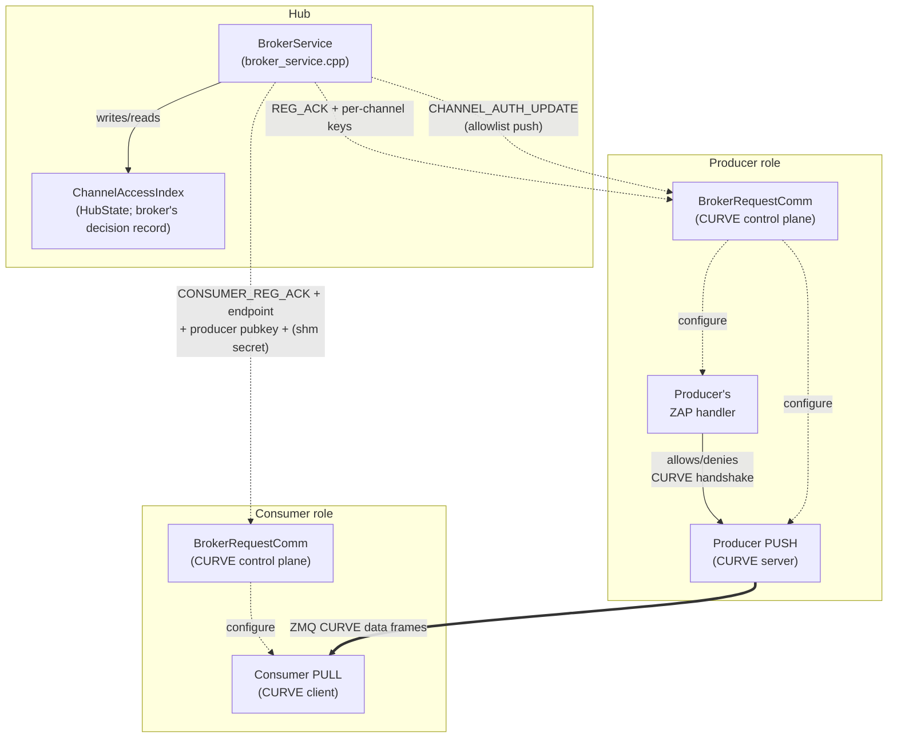
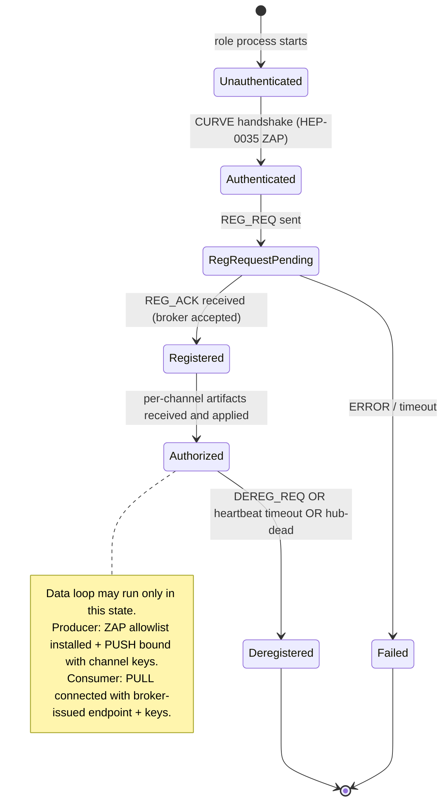
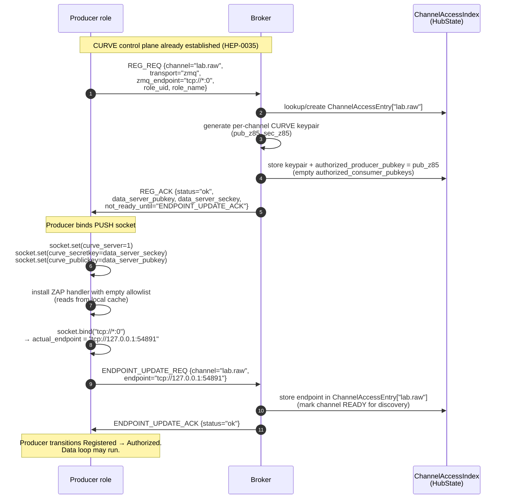
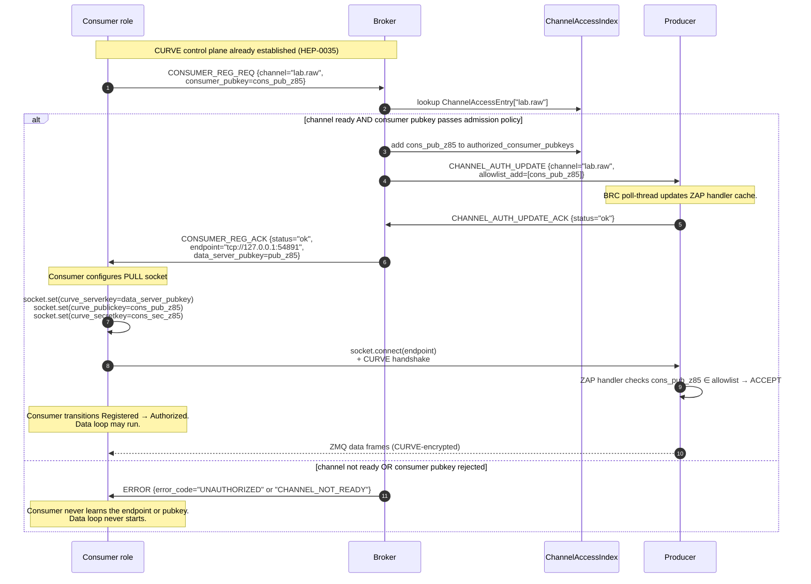
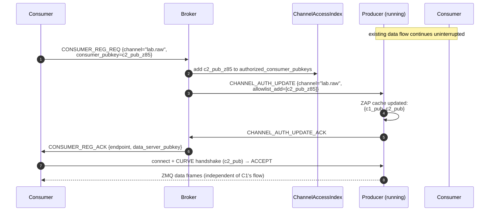

# HEP-CORE-0036: Authenticated Connection Establishment

| Property        | Value                                                                                                       |
|-----------------|-------------------------------------------------------------------------------------------------------------|
| **HEP**         | `HEP-CORE-0036`                                                                                             |
| **Title**       | Authenticated Connection Establishment — Single-Gate Access Control for Control + Data Planes               |
| **Status**     | 🚧 **DRAFT — DESIGN UNDER REVIEW.** Cross-references HEP-CORE-0021, HEP-CORE-0035, HEP-CORE-0023.            |
| **Created**     | 2026-05-26                                                                                                  |
| **Last revised** | 2026-05-27 — two-conditions gate explicit; revocation reframed as passive (no force-close); inbox/bands inheritance; channels-are-dynamic non-goal; manual pubkey distribution MVP. |
| **Area**        | Framework Architecture (broker access control, role-side CURVE wiring, data-plane peer authentication)      |
| **Depends on**  | HEP-CORE-0021 (ZMQ Endpoint Registry — endpoint discovery via broker), HEP-CORE-0035 (Hub-Role Authentication — broker-side ZAP + pubkey index), HEP-CORE-0023 (Startup Coordination — presence FSM) |
| **Blocks**      | Production deployment (data plane currently unauthenticated; see §3 gap analysis)                            |

---

## 1. Status banner

**This HEP is design-only — no part is implemented.**  It exists because
the 2026-05-26 holistic audit revealed that the data plane (PUSH/PULL
between producer ↔ consumer ↔ processor on ZMQ; SHM attach between
producer ↔ consumer on SHM) has no peer-level authentication: any
process able to reach a producer's TCP endpoint can connect and consume
the data stream without involvement from the broker.  HEP-CORE-0021
designed the **broker-mediated endpoint discovery** mechanism;
HEP-CORE-0035 designed the **broker-side admission policy**; neither
covers the **data peer authentication** layer required to make the
broker's access decisions actually enforce.

This HEP completes the picture by establishing the **two-conditions
gate** (I1): the broker authorizes a role only if (1) the role's CURVE
handshake succeeded AND (2) the role's pubkey is in the hub's
`known_roles[]` allowlist.  Every other enforcement point in the system
(producer-side ZAP handler, SHM secret release, consumer-side data-
socket setup) is a **cache** of that decision — they refuse to act on
artifacts they never received from the broker, but they do not make
independent admission decisions.

Lifetime alignment (I3) ties data-plane access to control-plane state:
control link dies → data loop exits.  Revocation (I5) is passive — it
prevents NEW connections, but existing authenticated sessions are
trusted for their lifetime (the consumer's own role host closes its
data socket when the control link tears down).  This collapses what
earlier drafts contemplated as separate "broker-initiated eviction"
machinery into the natural shutdown path that already exists.

---

## 2. Motivation

The 2026-05-26 dual-hub-processor-zmq demo run exposed four concrete gaps,
each verified against the current code:

1. **ZMQ data sockets have zero authentication.** `hub_zmq_queue.cpp:581-584`
   does `socket.bind(endpoint)` / `socket.connect(endpoint)` with no
   CURVE configuration. Grep across `src/utils/hub/` returns zero hits
   for `curve|CURVE` — confirmed exhaustive.
2. **Consumer can receive data even when broker registration fails.**
   The demo's consumer logged `CONSUMER_REG_REQ timed out after 5000ms`
   yet still received 767 of 1000 messages, because the data plane
   (consumer's PULL on tcp:5583) opens during `setup_infrastructure_`
   well before broker handshake is attempted.
3. **Endpoint is in the role's config file**, not in the broker. Any
   process with read access to `consumer.json` (or a port scanner) has
   the endpoint pre-positioned for connection attempts.
4. **Three separate enforcement points without a single source of
   truth.** Per the current sketch: broker decides admission
   (HEP-0035), broker mediates endpoint discovery (HEP-0021), and the
   data-plane peer would need its own ZAP allowlist. Without explicit
   coordination, these can diverge.

The fix is not "wire CURVE on more sockets." The fix is to make the
broker's decisions **load-bearing** — peers act only on broker-issued
artifacts (keys, endpoint, allowlist membership), and any deviation
becomes mechanically impossible (the connection literally cannot
complete).

### 2.1 Non-goals (explicit)

The following are deliberately OUT of HEP-0036 scope:

- **Channel pre-declaration in hub config.** Hubs do NOT manage a
  static `channels[]` list.  Channels are created dynamically when
  a producer's `REG_REQ` arrives carrying a new `out_channel` name.
  Per-channel auth state (`ChannelAccessIndex` entry) is created
  alongside on producer REG; destroyed on producer DEREG.
- **Force-closing existing CURVE sessions on revocation.** ZeroMQ
  has no API for this.  Lifetime alignment (I3) makes it
  unnecessary: when a role loses its control link, the role's own
  data loop exits.  External force-close is incident response, not
  protocol (see I5).
- **Per-consumer ACL enforced inside the data path.** A consumer
  that holds a valid CURVE session OR a valid SHM secret is trusted
  for that session's lifetime.  ACL is enforced at the artifact
  release boundary (broker's CONSUMER_REG_ACK / CHANNEL_AUTH_UPDATE),
  not at every data frame / SHM read.
- **Automated public-key distribution.**  For MVP, hub and role
  public keys are distributed manually by the operator (copy
  `*.pub` files to the appropriate config dirs).  Automated
  distribution (e.g. via a federation control channel) is deferred
  until federation development is further along.
- **Forward secrecy / mid-session key rotation.**  Per-channel keys
  live for the channel's broker lifetime.  Operators who need
  rotation tear down + recreate the channel.
- **Defense against a compromised broker.**  See I8 trust model.

---

## 3. Invariants (the architectural decisions being formalized)

These invariants are non-negotiable for any implementation:

### I1 — Two conditions gate every connection

**Both must hold at the broker before any data-plane artifact
(CURVE keys, endpoint, SHM secret) is released to a role:**

1. **Auth success** — the role's CURVE handshake to the broker's
   ROUTER socket completed successfully (cryptographic proof of
   identity matching a pubkey).
2. **Role known** — that pubkey is in the hub's `known_roles[]`
   configuration (operator-authorized allowlist).

Either condition fails → broker refuses to issue the artifact → the
role cannot establish a data connection.  Both pass → broker issues
the artifact + the role can establish the data connection.

These two conditions are the **single gate**.  Every downstream
enforcement point (producer-side ZAP handler, consumer-side socket
config, SHM attach) is a CACHE of the broker's decision — it
enforces by refusing to act on artifacts it never received, not by
performing an independent authorization check.

> **Note on existing code.** The mechanism for condition (2) already
> exists at `broker_service.cpp:2674`
> (`BrokerServiceImpl::check_role_identity`, with `RoleIdentityPolicy::
> Verified` mode + `KnownRole` allowlist).  Today's HubHost
> deliberately does NOT wire `known_roles` from hub.json into
> `BrokerService::Config` (per `hub_broker_config.hpp:13-14` comment
> referencing HEP-0035).  The check function always sees
> `policy = Open` and returns "no rejection" for every REG_REQ.
> HEP-0036 implementation wires the existing machinery to actual
> config — it doesn't add new admission code.

### I2 — Single source of truth

**The broker's `ChannelAccessIndex` (§4.1) is the canonical decision
record.**  When a consumer's CONSUMER_REG passes both conditions,
broker mutates this index (records artifact issuance + tracks
allowlist for producer's cache).  Producer-side caches are
synchronized via broker push (`CHANNEL_AUTH_UPDATE`) but never make
independent admission decisions.

The producer's ZAP handler reads the cache to **gate new handshakes**
— rejecting incoming CURVE handshakes whose pubkey isn't in the
cached allowlist.  The cache is updated by broker push for the
NEXT handshake; existing CURVE sessions are not affected by cache
updates (see I5).

### I3 — Lifetime alignment (control gates data)

**Data link is downstream of control link.  Control dies → data
dies.**  The role host enforces this on its own side:

- Proactive quit: role stops the data loop FIRST, closes data
  sockets, THEN sends DEREG.  By the time broker ACKs, the role is
  already off the data path.
- Passive failure (BRC heartbeat lost, control disconnect): the
  data loop's outer guard observes `brc_is_connected() == false`
  and exits.  Data sockets close.
- Process crash: TCP cleanup on process death; SHM consumer slot
  is reclaimed by recovery code (PID liveness check).

The data loop's outer guard reads:
```cpp
while (core.is_running() &&
       !core.is_shutdown_requested() &&
       brc_is_connected() &&            // control → data dependency
       any_presence_authorized()) {
  ...
}
```

This is the role's own contract.  A compromised role that ignores
its contract (keeps reading data after losing control) is outside
the auth model's scope — that's incident response, not protocol.

### I4 — No data artifact before authorization

**A peer that has not passed both I1 conditions cannot obtain the
data-plane connection artifacts**, so cannot establish a data
connection:

- ZMQ consumer: doesn't know the producer's data endpoint or the
  channel CURVE pubkey until `CONSUMER_REG_ACK` carries them.
  Without these, no connection attempt is meaningful.
- SHM consumer: doesn't know the channel's `shm_secret` until
  `CONSUMER_REG_ACK` carries it.  Without it, SHM attach fails
  (existing DataBlock secret check, HEP-CORE-0002).

The "artifact issuance gate" mirrors the "two conditions" gate.
This is the architectural symmetry: both ZMQ and SHM transports
go through the SAME broker-side gate; the artifact differs by
transport but the decision is the same.

### I5 — Revocation prevents NEW connections; existing connections are trusted

**Once authenticated, a connection is trusted for its lifetime.**
Revocation removes the role's pubkey from the broker's allowlist
and pushes the removal to the producer's ZAP cache.  This means:

- The next CURVE handshake from that pubkey fails (cache hit ≠ in
  allowlist → ZAP DENY).
- The next CONSUMER_REG_REQ from that pubkey returns ERROR (broker
  doesn't issue secret).
- The next SHM attach attempt by a process that didn't get the
  current secret fails.

Existing CURVE sessions and SHM attaches **continue**.  ZeroMQ does
not provide a mechanism to forcibly close an existing CURVE session
by peer pubkey; the consumer's role host is responsible for closing
the data loop when its own control link signals revocation (via
CHANNEL_CLOSING_NOTIFY or BRC disconnect — both per I3).

This is sufficient for the authentication model.  A consumer that
was authenticated, then later compromised (key leak, malicious code
injection), is outside the auth model's scope — operator response
is to kill the compromised process out-of-band.  The architecture
defends against UNAUTHENTICATED peers, not against trusted peers
that turn malicious mid-session.

### I6 — Per-channel data-plane CURVE keys

**Data-plane CURVE keypairs are per-channel, broker-minted, not
operator-managed.**  Consequences:

- A consumer revoked from channel A does not lose access to channel B
  (separate keypairs).
- A producer's data-plane keys are independent of its control-plane
  identity keypair.
- The keypair lifetime is bound to the channel's existence on the
  broker (created on producer's REG_REQ; destroyed on DEREG).

The role's identity keypair (broker-control-plane CURVE, HEP-0035)
remains long-lived and operator-managed via `plh_role --keygen`.
Operator distributes this once at deployment; broker mints
per-channel data keys on demand.

### I7 — Endpoint disclosure follows authorization

**The data-plane endpoint is broker-state, not role-state.**  Role
configs declare a channel name (`in_channel` / `out_channel`) and
optionally a port range / bind interface hint; the **actual endpoint
string** (`tcp://host:port`) is computed at producer bind time (per
HEP-0021 §16 ephemeral port resolution) and lives only on the broker
+ in the role's runtime memory.  It does not appear in any persisted
config file.

A consumer learns the endpoint only via `CONSUMER_REG_ACK` after
broker authorization.  Pre-authorization port scanning yields a CURVE
socket that rejects all handshakes (empty allowlist + ZAP active).

### I8 — Trust model assumption

**HEP-0036 trusts the broker.**  The broker is the sole admission
authority and the holder of all per-channel CURVE keys at minting
time.  If the broker is compromised:

- Attacker can authorize arbitrary pubkeys.
- Attacker can read per-channel CURVE secret keys from broker memory.
- Historical sessions captured by an observer become decryptable
  (no forward secrecy in MVP).

The threat model HEP-0036 defends against is **unauthenticated +
unknown external peers**, not a compromised broker.  Operator
responsibility: secure the broker host (OS hardening, restricted
access, audit logging).  Beyond-MVP enhancements (HSM-backed keys,
multi-broker quorum, forward secrecy) are tracked as follow-up work
in §13 open questions.

---

## 4. Architecture

### 4.1 `ChannelAccessIndex` — the canonical decision record

A new in-memory structure inside `HubState`, indexed by `channel_name`:

```cpp
struct ChannelAccessEntry
{
    // Per-channel CURVE keypair — broker-minted at producer REG_REQ time.
    std::string  data_server_pubkey_z85;     // Producer's PUSH ZAP server pubkey.
    std::string  data_server_seckey_z85;     // Broker holds; pushed to producer.

    // Per-channel SHM secret — broker-generated; replaces config-supplied secret.
    uint64_t     shm_secret;                 // Used only when transport=shm.

    // Allowed consumer pubkeys — broker-maintained allowlist.
    // Producer's ZAP handler enforces; updated via CHANNEL_AUTH_UPDATE pushes.
    std::unordered_set<std::string>  authorized_consumer_pubkeys;

    // Authorized producer pubkey (always exactly one in MVP; per-producer
    // in multi-producer fan-in — see §9).
    std::string  authorized_producer_pubkey;
};

// In HubState:
std::unordered_map<std::string, ChannelAccessEntry>  channel_access_index_;
```

**Per I2** this is the broker's canonical record of the two-condition
gate decision (I1).  The handlers that read + write it:

- **REG handler** (broker): writes — creates entry on producer REG
  after I1 passes; deletes on DEREG.
- **CONSUMER_REG handler** (broker): reads + writes — gates admission
  via I1, writes the consumer pubkey to the allowlist on accept,
  reads the per-channel keypair + endpoint to return in
  CONSUMER_REG_ACK.
- **`CHANNEL_AUTH_UPDATE` emitter** (broker): reads — computes
  diff vs. producer's cache, sends sync `add` / best-effort `remove`.
- **Heartbeat / hub-dead handler** (broker): writes — removes a
  failed peer from the allowlist; emits `CHANNEL_AUTH_UPDATE remove`.

No producer-side or consumer-side code computes admission decisions
independently; they execute artifacts (keys, endpoint, secret,
cached allowlist) the broker handed them.

### 4.2 Component overview



Every arrow that crosses a process boundary is either:
- **CURVE-authenticated control plane** (BRC ↔ Broker, already CURVE per HEP-0035 control-plane scope), or
- **CURVE-authenticated data plane** (Producer PUSH ↔ Consumer PULL, NEW), or
- **SHM attach gated by broker-issued secret** (NEW for SHM transport).

### 4.3 Lifetime FSM — extends HEP-0023's RegistrationState

HEP-0023 defines a per-presence `RegistrationState` FSM:
`Unregistered → RegRequestPending → Registered → Deregistered`. This
HEP adds the **`Authorized`** state to represent the post-REG window
during which the broker has issued the per-channel artifacts and the
data loop may run:



**Producer transitions:**
- `Registered → Authorized` when the producer has bound its PUSH socket
  with the broker-issued per-channel keypair AND installed its ZAP
  handler with the initial (possibly empty) allowlist.
- `Authorized → Deregistered` on DEREG. ZAP allowlist cleared; PUSH
  socket closed.

**Consumer transitions:**
- `Registered → Authorized` when the consumer has connected its PULL
  socket with the broker-issued endpoint + keys AND completed the
  CURVE handshake (allowlist match confirmed).
- `Authorized → Deregistered` on DEREG or producer-deregistered cascade.

---

## 5. Sequence diagrams

### 5.1 Producer registration (ZMQ, port-0 ephemeral binding)



**Ordering note (R1)**: ZAP handler must be installed on the role's
ZMQ context BEFORE the CURVE-server PUSH socket binds.  ZAP is a
per-context inproc socket (`inproc://zeromq.zap.01`); a CURVE socket
that binds without an installed ZAP handler accepts handshakes by
default (libzmq behavior).  The diagram orders steps 4-6 to enforce
this: CURVE-key config → ZAP install (with empty allowlist) →
bind.  Any incoming handshake between bind and the first allowlist
add is denied by the empty-allowlist ZAP cache.

**Single-gate property**: at step 4 the broker is the sole entity that
generates the per-channel keypair. Producer cannot start its data
socket with any other key. At step 8 the producer's PUSH socket is
CURVE-server configured but allowlist is empty — no consumer can
connect yet. The Authorized transition gates the data loop's start.

### 5.2 Consumer registration + data connect (ZMQ)



**Single-gate property**: the broker is the sole entity that decides
(step 3) whether to admit the consumer AND the sole entity that pushes
the allowlist update to the producer (step 5). If the broker rejects,
the consumer never receives the endpoint or pubkey (step 14) — there
is no way for the consumer to attempt a connection. If the broker
accepts but the push to the producer fails, the broker MUST not
return the endpoint to the consumer until the push succeeds (or it
must roll back the allowlist add).

### 5.3 Multi-consumer fan-out: second consumer joins a running channel



**Property**: producer's existing CURVE session with C1 is unaffected.
The ZAP allowlist add is incremental; no socket re-bind, no key
rotation, no disruption.

### 5.4 Consumer deregistration (cooperative close)

```mermaid
sequenceDiagram
    autonumber
    participant C1 as Consumer #1 (leaving)
    participant B as Broker
    participant AI as ChannelAccessIndex
    participant P as Producer
    participant C2 as Consumer #2 (continuing)

    Note over C1: Per I3, role stops data loop FIRST.
    C1->>C1: data loop exits;<br/>close PULL socket
    C1->>B: CONSUMER_DEREG_REQ {channel="lab.raw"}
    B->>AI: remove c1_pub_z85 from authorized_consumer_pubkeys
    B->>P: CHANNEL_AUTH_UPDATE {channel="lab.raw",<br/>allowlist_remove=[c1_pub_z85]}
    P->>P: ZAP cache updated: {c2_pub}<br/>(future C1 reconnect handshakes → REJECT)
    P->>B: CHANNEL_AUTH_UPDATE_ACK
    B->>C1: CONSUMER_DEREG_ACK
    C1->>C1: transition Authorized → Deregistered

    Note over P,C2: C2's data flow continues uninterrupted
```

**Property** (per I3 + I5): C1 closes its OWN data socket as part of
its proactive quit, BEFORE the broker even ACKs the deregistration.
Allowlist removal on the producer side is forward-looking only —
it prevents any future handshake from C1's pubkey, but does not
need to (and cannot, in ZeroMQ) tear down the now-closed-from-the-
client-side TCP session.  This is the architectural simplification
agreed on review: there is no "broker-initiated eviction" path
because there is no need for one.

### 5.5 Heartbeat timeout — passive deregistration

```mermaid
sequenceDiagram
    autonumber
    participant C as Consumer (crashed / partitioned)
    participant B as Broker
    participant AI as ChannelAccessIndex
    participant P as Producer

    Note over C: process crash OR network partition OR BRC stall

    par On the consumer side (if process still alive)
        Note over C: BRC connection lost (heartbeat fail / TCP RST).
        C->>C: data loop guard observes<br/>brc_is_connected() == false → exit (per I3).
        C->>C: close PULL socket (data session torn down by client side).
    and On the broker side
        B->>B: heartbeat timeout fires for consumer C
        B->>AI: remove C's pubkey; clear C from presence table.
        B->>P: CHANNEL_AUTH_UPDATE {channel,<br/>allowlist_remove=[c_pub_z85]}
        P->>P: ZAP cache updated.
        P->>B: CHANNEL_AUTH_UPDATE_ACK
    end

    Note over C,P: If C process eventually recovers, it must restart from<br/>step 1 of §5.2 (new CURVE handshake → REG_REQ → CONSUMER_REG_REQ).<br/>Mid-incident reconnect of an old session is not supported.
```

**Property**: this is the SAME architecture as §5.4 (cooperative
close), just driven by failure detection on both sides instead of
explicit DEREG.  Per I3 the consumer's data loop tears down its
own end; per I5 the broker side updates the allowlist so any
future handshake from that pubkey is denied.  There is no
broker-initiated force-disconnect.

### 5.6 SHM consumer attach

```mermaid
sequenceDiagram
    autonumber
    participant P as Producer
    participant B as Broker
    participant AI as ChannelAccessIndex
    participant C as Consumer
    participant SHM as DataBlock<br/>(in shared memory)

    P->>B: REG_REQ {channel="lab.raw", transport="shm"}
    B->>AI: lookup/create entry
    B->>B: generate per-channel shm_secret<br/>(uint64 random)
    B->>AI: store shm_secret in ChannelAccessEntry
    B->>P: REG_ACK {status="ok", shm_secret}
    P->>SHM: create DataBlock with shm_secret as the<br/>guard secret (HEP-CORE-0002)

    C->>B: CONSUMER_REG_REQ {channel="lab.raw",<br/>consumer_pubkey=cons_pub_z85}
    B->>AI: lookup; check consumer pubkey ∈ admission policy
    alt authorized
        B->>C: CONSUMER_REG_ACK {transport="shm",<br/>shm_name, shm_secret}
        C->>SHM: attach with shm_secret → ACCEPT
        C-->>SHM: ring buffer reads
    else unauthorized
        B->>C: ERROR {error_code="UNAUTHORIZED"}
        Note over C: Consumer does not receive shm_secret.<br/>Attach attempts without secret → REJECT.
    end
```

**Property**: SHM's existing secret-based attach gate (HEP-CORE-0002)
remains the underlying mechanism. The change is: the secret is
**generated by the broker** (not configured by the producer), and is
**released to consumers conditional on broker authorization**. The
config field `out_shm_secret` is retired; if present in old configs,
it is logged as a warning and ignored.

### 5.7 Producer deregistration — cascading consumer notification

```mermaid
sequenceDiagram
    autonumber
    participant P as Producer
    participant B as Broker
    participant AI as ChannelAccessIndex
    participant C1 as Consumer #1
    participant C2 as Consumer #2

    P->>B: DEREG_REQ {channel="lab.raw"}
    B->>AI: clear ChannelAccessEntry["lab.raw"]<br/>(keys, allowlist, endpoint all gone)
    B->>C1: CHANNEL_CLOSING_NOTIFY {channel="lab.raw"}
    B->>C2: CHANNEL_CLOSING_NOTIFY {channel="lab.raw"}
    B->>P: DEREG_ACK
    P->>P: close PUSH socket
    C1->>C1: transition Authorized → Deregistered;<br/>close PULL; data loop exits
    C2->>C2: same
```

**Property**: cascade is broker-driven; no peer-to-peer signaling
required. Consumers receive a single notification message via the
existing CHANNEL_CLOSING_NOTIFY infrastructure (already implemented
per HEP-CORE-0023). Their data-loop FSM transitions are local
responses to that notification.

---

## 6. Wire format extensions

These extensions add fields to existing message schemas. All additions
are backward-compatible at the protocol level (broker can detect
absence and reject with a typed ERROR), but no production deployment
should run with peers that lack the auth fields once this HEP ships.

### 6.1 `REG_REQ` (producer → broker) — additions

| Field | Type | Description |
|---|---|---|
| `wants_data_keypair` | bool | Producer requests broker to mint a per-channel CURVE keypair. Default: `true` post-HEP-0036. |
| `wants_shm_secret` | bool | (transport=shm only) Producer requests broker to generate a per-channel SHM secret. Default: `true` post-HEP-0036. |
| `endpoint_hint_range` | string | Optional: `tcp://*:49152-65535` or `tcp://0.0.0.0:0`. Specifies bind interface + port range; producer still uses port-0 binding within range. |

The legacy `shm_secret` field is deprecated and ignored when
`wants_shm_secret=true`.

### 6.2 `REG_ACK` (broker → producer) — additions

| Field | Type | Description |
|---|---|---|
| `data_server_pubkey` | string (Z85, 40 chars) | Per-channel CURVE public key the producer must set as `curve_publickey` on its PUSH socket. |
| `data_server_seckey` | string (Z85, 40 chars) | Per-channel CURVE secret key the producer must set as `curve_secretkey` on its PUSH socket. |
| `shm_secret` | uint64 | (transport=shm only) Broker-generated secret for the DataBlock. |
| `initial_allowlist` | array<string> | Pubkeys already authorized for this channel (if any consumers pre-registered). Usually empty on fresh channel. |

### 6.3 `CONSUMER_REG_REQ` (consumer → broker) — additions

| Field | Type | Description |
|---|---|---|
| `consumer_pubkey` | string (Z85, 40 chars) | The consumer's CURVE public key that will be used on its PULL data socket. May equal the consumer's control-plane pubkey or be a per-channel-derived key. |

### 6.4 `CONSUMER_REG_ACK` (broker → consumer) — additions

| Field | Type | Description |
|---|---|---|
| `data_server_pubkey` | string (Z85, 40 chars) | (transport=zmq only) The producer's per-channel public key for CURVE handshake. |
| `shm_secret` | uint64 | (transport=shm only) The per-channel SHM secret. |

The existing `zmq_endpoint` field (already in HEP-0021 §5.2) carries
the producer's endpoint.

### 6.5 `CHANNEL_AUTH_UPDATE` (broker → producer) — NEW message

**Purpose**: keep the producer's local ZAP cache in sync with the
broker's `ChannelAccessIndex.authorized_consumer_pubkeys`.  This
message gates ONLY future CURVE handshakes from the affected pubkeys
(I5).  It does NOT instruct the producer to disconnect any existing
session; existing CURVE sessions are unaffected by allowlist updates.

Sync request-reply per HEP-CORE-0007 §12.2.1 — on `allowlist_add`
the broker MUST receive `CHANNEL_AUTH_UPDATE_ACK` from the producer
BEFORE returning `CONSUMER_REG_ACK` to the consumer, so that the
consumer's first handshake attempt cannot race the cache install
and be denied due to a stale cache.

On `allowlist_remove` the broker may proceed without waiting for
the ACK (the security guarantee is "no NEW handshake from the
removed pubkey"; existing session continues regardless).

| Field | Type | Description |
|---|---|---|
| `channel_name` | string | Channel whose allowlist is updated. |
| `allowlist_add` | array<string> | Consumer pubkeys to add to the producer's ZAP cache.  Producer must install these BEFORE ACKing. |
| `allowlist_remove` | array<string> | Consumer pubkeys to remove from the producer's ZAP cache.  Best-effort; no effect on existing sessions. |

Producer responds with `CHANNEL_AUTH_UPDATE_ACK { status }`.

### 6.6 Error codes

Added to HEP-CORE-0007 §12.4a Error Code Taxonomy:

| Code | When |
|---|---|
| `UNAUTHORIZED_CONSUMER_PUBKEY` | CONSUMER_REG_REQ from a pubkey not in `cfg.known_roles[]` (HEP-0035 L2). |
| `CHANNEL_NOT_READY` | CONSUMER_REG_REQ for a channel whose producer hasn't completed ENDPOINT_UPDATE (HEP-0021 §16.4). |
| `ALLOWLIST_PUSH_FAILED` | Broker tried to push CHANNEL_AUTH_UPDATE to producer but didn't get ACK; consumer's CONSUMER_REG_REQ rolls back. |
| `KEYPAIR_GENERATION_FAILED` | Broker libsodium / CURVE keygen failure on REG_REQ. Operator should check entropy / libsodium installation. |

---

## 7. Producer-side ZAP handler

The ZAP handler is the producer-side enforcement of allowlist
membership.  It is a CACHE of the broker's decision (per I2),
not an independent admission authority.  Its only job: take a
ZAP request, look up the consumer pubkey in the local cache,
return ALLOW or DENY.

### 7.1 Placement and lifetime

- One ZAP socket per ZMQ context (libzmq invariant —
  `inproc://zeromq.zap.01`).  The producer role host installs the
  handler on its existing context **before** any CURVE-server
  socket binds (per the §5.1 ordering note).
- Handler runs on the BRC poll thread.  Rationale: (a) cache reads
  and `CHANNEL_AUTH_UPDATE` writes happen on the same thread, no
  synchronization needed; (b) BRC poll thread already exists.

### 7.2 Cache contract

```cpp
struct PerChannelAllowlist {
    std::unordered_set<std::string>  authorized_consumer_pubkeys_z85;
};
std::unordered_map<std::string, PerChannelAllowlist>  zap_cache_;
```

- Initial population: from `REG_ACK.initial_allowlist`.
- Incremental updates: from `CHANNEL_AUTH_UPDATE` requests.
- Per-channel entry destroyed when the producer DEREGs that channel.

ZAP request → look up by (destination-endpoint → channel-name reverse
map → allowlist set) → ALLOW iff pubkey ∈ set; else DENY.

### 7.3 Failure modes

| Failure | Behavior |
|---|---|
| Pubkey not in allowlist | DENY.  Expected path — keeps unknown peers out. |
| Endpoint not in producer's bind table | DENY.  Defensive; shouldn't happen if broker is sole endpoint authority. |
| Handler thread dead | All CURVE handshakes time out at the peer.  Detectable via libzmq socket monitor; producer transitions to critical-error. |

---

## 8. Lifecycle gating in the data loop

The data loop (`run_data_loop` in `data_loop.hpp:101`) currently checks
only `core.is_running() && !is_shutdown_requested() && !is_critical_error()`.
This HEP adds an Authorized-state gate. **No data-plane operation may
run unless at least one Presence is in `Authorized`.**

### 8.1 Gate function

```cpp
// On RoleAPIBase or HEP-0023's role-handler accessor:
[[nodiscard]] bool any_presence_authorized() const noexcept;
```

Returns `true` iff at least one of the role's presences has
`registration_state.load() == RegistrationState::Authorized`.

### 8.2 Outer-loop guard

```cpp
while (core.is_running() &&
       !core.is_shutdown_requested() &&
       !core.is_critical_error() &&
       any_presence_authorized())   // NEW
{
    // ... existing body ...
}
```

**Relation to I3.**  The `any_presence_authorized()` clause is the
mechanism that implements I3 (control gates data).  When the BRC
loses connection (heartbeat fail / TCP RST / hub-dead), the BRC poll
thread transitions every affected presence out of `Authorized` —
that's the single point where data and control are coupled.  No
separate `brc_is_connected()` check is needed in the guard; the
presence FSM is the bridge.

**Spin vs block:** the loop should not spin-wait pre-Authorized — that
would burn CPU during startup. Implementation: the role host blocks
on a condition variable signaled by the BRC poll thread when ANY
presence reaches Authorized; the data loop wait-and-resume from
there.

### 8.3 Per-presence gating for multi-side roles (processor)

A processor with one Consumer + one Producer presence may be in a
state where the Consumer side is `Authorized` but the Producer side
is `Registered` (because the broker hasn't yet pushed the producer's
allowlist update). The data loop's per-iteration `ops.acquire(ctx)`
should consult the SPECIFIC presence being read/written, not the
aggregate. Per-presence gating is implemented in the `ops` impl
(`ProcessorCycleOps`), which already has per-presence visibility via
the api's `has_tx_side()` / `has_rx_side()` accessors.

---

## 9. Multi-producer / multi-consumer scenarios

Combination matrix from the 2026-05-26 audit, expanded with HEP-0036
auth semantics:

| Scenario | ZMQ behavior under HEP-0036 | SHM behavior under HEP-0036 |
|---|---|---|
| 1 producer, 1 consumer | Standard flow (§5.1 + §5.2). Single CURVE keypair, allowlist size 1. | Single shm_secret. Single consumer in admission allowlist. |
| 1 producer, N consumers (fan-out) | Single keypair; allowlist grows incrementally per §5.3.  Each consumer's PULL socket independently CURVE-authenticated. | All N consumers receive the same shm_secret from broker; broker individually authorizes each via CONSUMER_REG check.  Revocation = broker stops releasing the secret on future REGs and removes the consumer from its presence table; already-attached consumers continue (per I5; trusted once authenticated). |
| N producers, 1 consumer (fan-in) | Per-producer keypair + per-producer allowlist (HEP-0021 §16.3 already established per-producer endpoint scope). Consumer registers separately per producer (current REG protocol); receives N (pubkey, endpoint) pairs in CONSUMER_REG_ACK. | **Not supported on SHM** — already rejected with `MULTI_PRODUCER_NOT_SUPPORTED_FOR_SHM`. No HEP-0036 work needed. |
| N producers, N consumers | ZMQ: cross-product handled — each consumer registers per producer; broker pushes per-producer allowlist updates. M consumers × P producers = M+P registrations + M×P CURVE sessions. | N/A — SHM doesn't support multi-producer. |

### 9.1 Per-producer fan-in nuance

In a Fan-In channel today (HEP-0021 §16.3), each producer registers
its own endpoint via `ENDPOINT_UPDATE_REQ`. Each producer's
`ProducerEntry` carries its own endpoint. Under HEP-0036, each
producer also carries its own per-channel keypair (broker generates
one keypair per `ProducerEntry`, not one per `ChannelEntry`).

`CONSUMER_REG_ACK` returns an ARRAY of `(producer_pubkey, endpoint)`
pairs — one per registered producer. The consumer iterates and opens
one PULL socket per producer.

### 9.2 SHM per-consumer authorization

SHM today: producer creates DataBlock with `shm_secret`; any process
holding the secret can attach.  There is no per-consumer ACL inside
the DataBlock itself.

Under HEP-0036: the broker enforces per-consumer authorization at
**secret release time** (CONSUMER_REG_ACK).  Once a consumer holds
the secret, the existing SHM machinery allows attach — and that
session is trusted for its lifetime per I5.  This matches the ZMQ
side exactly: the cryptographic artifact (CURVE pubkey on the
allowlist; or shm_secret) IS the trust token; once a peer holds a
valid token, the peer is trusted until it tears down its end.

Revocation symmetry with ZMQ:

- Broker removes the consumer from its presence table → no future
  CONSUMER_REG_REQ from that role gets a fresh secret.
- Producer's PUSH socket (ZMQ) / DataBlock (SHM) is unaffected for
  already-attached peers.
- Per I3, a revoked consumer's role host exits its data loop on
  control-link teardown — the same code path that handles process
  exit, so the SHM detach happens naturally.

### 9.3 Inbox messaging — inherits channel auth

The inbox messaging path (HEP-CORE-0027) opens between two roles
that are already connected via a data channel — there is no inbox
without an underlying data channel.  Therefore:

- Inbox CURVE wiring inherits the data channel's per-channel
  keypair + allowlist (same producer-side ZAP cache gates inbox
  socket handshakes as the data socket).
- No separate broker-side admission decision for inbox.  If the
  consumer is in the channel's allowlist, the inbox handshake
  succeeds.
- Inbox lifetime ⊆ data channel lifetime.  When the data channel
  closes (cascade per §5.7 or BRC death per I3), the inbox closes
  with it.

This collapses inbox into the same single-gate model as data:
broker decides (at REG time, for the data channel); inbox enforces
by inheriting that decision.

### 9.4 Bands — inherit hub-level admission

Per the codebase (`src/include/utils/hub_state.hpp:1101`), bands are
**hub-wide**, not channel-scoped — they live alongside roles, peers,
and shm_blocks in `HubState`, not as children of `ChannelEntry`.
Therefore band admission follows the hub-level "role known +
authenticated" gate (I1), not a per-channel gate.

- A role that has reached `Registered` on a hub (passed both I1
  conditions) MAY band-join any band that hub hosts, subject to the
  band's own per-band policy (HEP-CORE-0030 §4 band ownership /
  band creation rules).
- CURVE for band sockets: same per-hub control-plane keys (HEP-0035),
  same allowlist (hub-wide); no per-band CURVE keypairs.
- Band lifetime is independent of any single data channel.  Band
  membership ends when the role deregisters from the hub (DEREG
  cascade clears band memberships per HEP-CORE-0030 §6).

If a future requirement emerges for per-band ACL (subset of
hub-known roles), it can be added on top of this baseline — but
nothing in MVP requires it.

---

## 10. Lifetime alignment — full role lifecycle

Combining HEP-0023's existing startup sequence with HEP-0036's
authorization layer:

```mermaid
sequenceDiagram
    autonumber
    participant R as Role process
    participant B as Broker
    participant DL as Data loop
    participant DS as Data socket

    Note over R: Process start (plh_role binary main)
    R->>R: load config + setup ZMQ context
    R->>B: CURVE handshake (HEP-0035 L1 ZAP)
    Note over R,B: state: Authenticated

    R->>B: REG_REQ
    B->>R: REG_ACK + per-channel keys/secret
    Note over R: state: Registered

    R->>DS: configure socket with broker-issued artifacts
    alt ZMQ producer
        R->>DS: bind PUSH(port=0); ENDPOINT_UPDATE_REQ; install ZAP
    else ZMQ consumer
        R->>DS: configure PULL with received endpoint + key
        R->>DS: connect + CURVE handshake (gated by producer's ZAP)
    else SHM consumer
        R->>DS: attach DataBlock with received shm_secret
    end
    Note over R: state: Authorized<br/>(condvar signaled to data loop)

    R->>DL: signal: enter data loop
    DL->>DL: while (any_presence_authorized()) { ... }
    Note over DL: data flow active

    Note over R: ... role runs for its lifetime ...

    Note over R: Shutdown initiated (SIGTERM, explicit close, or hub-dead cascade)
    R->>B: DEREG_REQ
    B->>R: DEREG_ACK
    B->>B: push CHANNEL_AUTH_UPDATE allowlist_remove to peers
    Note over R: state: Deregistered
    DL->>DL: any_presence_authorized() == false → exit loop
    R->>DS: close socket
    R->>R: process exit
```

**Property**: there is no "data flow without broker awareness" window
in either direction. The data loop starts only after Authorized;
exits when no presence remains Authorized. The data socket is
configured only with broker-issued artifacts (never config-supplied).
The role's identity (control-plane CURVE keypair) is the only
operator-managed long-lived secret.

---

## 11. Backward compatibility and dev-mode

### 11.1 Backward compatibility

There is none. HEP-0036 makes auth required. Roles built against
pre-HEP-0036 configs (e.g., those with `out_shm_secret` set in JSON,
or those without a `keyfile`) MUST be rebuilt against new configs
that omit those fields and provide the role's CURVE keypair via
`plh_role --keygen`.

The codebase explicitly accepts the breaking change because the
pre-HEP-0036 state is a security hole; backward compatibility with an
insecure deployment is not a design goal.

### 11.2 Dev-mode escape hatch

For local development and unit testing:

- `hub.dev_mode = true` in hub.json disables Layer-1 ZAP authentication
  (HEP-0035) AND data-plane CURVE wiring (HEP-0036). Sockets fall back
  to NULL handshake.
- Dev-mode is rejected at config-load time if the broker endpoint is
  not loopback (`127.0.0.1` or `localhost`). Production deployments
  cannot accidentally ship with dev-mode enabled on a routable address.
- Tests that exercise the auth path must run with `dev_mode = false`
  and supply CURVE keypairs.

### 11.3 Deployment workflow (MVP — manual pubkey distribution)

For the MVP, public keys for the control plane (hub identity, role
identities) are distributed manually by the operator.  A typical
deployment workflow:

1. **Hub keygen.**  Operator runs `plh_hub --keygen <hub_uid>`,
   producing `<hub_uid>.pub` (CURVE Z85, distributable) and
   `<hub_uid>.sec` (operator-protected; stays on the hub host).
2. **Role keygen.**  Each role's operator runs
   `plh_role --keygen <role_uid>`, producing `<role_uid>.pub` /
   `<role_uid>.sec`.
3. **Distribute role pubkeys to hub config.**  Copy each
   `<role_uid>.pub` into the hub's `known_roles[]` directory
   (e.g. `hub_keys/known_roles/`).  This wires condition (2) of I1
   (role known by hub).
4. **Distribute hub pubkey to roles.**  Copy `<hub_uid>.pub` into
   each role's config dir; the role uses it as
   `curve_serverkey` on its BRC socket so it can authenticate the
   hub (mutual auth).
5. **Bootstrap.**  Start the hub; start the roles; CURVE handshakes
   succeed using the manually-distributed keys.

Per-channel CURVE data keys and SHM secrets are NOT operator-
distributed — they are broker-minted at REG time and live in
broker memory + transient role memory.  Operators never see them.

**Future (post-federation):** automated public-key distribution
via federation control channels.  Out of MVP scope; tracked as
follow-up.

---

## 12. Implementation phases

Implementation lands as a chained sequence — each phase is small,
testable, and individually shippable.  Drop disconnect_peer / force-
eviction work from earlier draft scope per I5 (revocation is passive).

| Phase | Scope | Notes |
|---|---|---|
| 0 | Wire existing `RoleIdentityPolicy` from hub.json → `BrokerService::Config`.  HubHost reads `hub.known_roles[]`; passes to `BrokerService::Config::known_roles` + `role_identity_policy = Verified`.  No NEW admission code; just connect the unwired machinery at `broker_service.cpp:2674` (`check_role_identity`). | Smallest possible change — closes condition (2) of I1.  Already-existing tests fail at this point if `known_roles` is missing; that's intentional. |
| 1 | `ChannelAccessIndex` skeleton in HubState.  Broker mints per-channel CURVE keypair on REG_REQ; REG_ACK carries it.  **No enforcement** yet — keys are issued but data sockets still plain TCP. | Smallest behavior change; verifies the wire format. |
| 2 | Producer side: install ZAP handler with empty allowlist FIRST (per §5.1 ordering), then bind PUSH socket with CURVE config from REG_ACK.  ZAP DENY by default. | Producers reject all incoming until broker pushes allowlist; intentional. |
| 3 | Broker side: on CONSUMER_REG_REQ, run two-condition gate (auth + known); on pass, add to allowlist; emit `CHANNEL_AUTH_UPDATE add` sync to producer (wait for ACK per §6.5); return CONSUMER_REG_ACK with `data_server_pubkey` + endpoint. | Closes the loop: consumer can now connect after auth.  Per-handshake race resolved by sync-before-ACK ordering. |
| 4 | Consumer side: read `data_server_pubkey` + endpoint from CONSUMER_REG_ACK; configure PULL with CURVE; data-loop gate on Authorized state per §8. | End-to-end ZMQ auth working. |
| 5 | SHM parallel: broker generates `shm_secret` per channel; `CONSUMER_REG_ACK` releases it only on auth.  Retire config-supplied `out_shm_secret`. | SHM secret moves from config to broker. |
| 6 | Passive revocation paths: on CONSUMER_DEREG, on heartbeat timeout, on hub-dead cascade — broker emits `CHANNEL_AUTH_UPDATE remove` (best-effort) and removes from allowlist.  No force-disconnect (per I5). | Closes lifetime-alignment loop; no new socket-level APIs. |
| 7 | Multi-producer fan-in: per-producer keypair generation; `CONSUMER_REG_ACK` returns array of (pubkey, endpoint) pairs; consumer opens N PULL sockets. | Touches HEP-0021 §16.3's per-producer endpoint scope. |
| 8 | Inbox + bands: inbox inherits channel ZAP cache (no new wiring); bands inherit hub control-plane CURVE (already in place via HEP-0035).  Verification only — no new code. | Sanity-check §9.3 + §9.4 hold at runtime. |
| 9 | Dev-mode escape hatch + loopback-enforcement; manual key-distribution workflow doc per §11.3. | Operator-facing surface. |
| 10 | Test coverage: L2 unit tests for ZAP handler cache, broker access index, allowlist update; L3 for end-to-end auth on dual-hub-processor scenarios; demo framework verification (the regression in the 2026-05-26 demo run becomes the regression test). | Sign-off gate. |
| 11 | HEP-0021 + HEP-0035 + HEP-0023 cross-reference updates; retire legacy `RoleIdentityPolicy` placeholder docs; HEP-0009 §2.7 retraction. | Doc closeout. |

---

## 13. Open questions

Several questions from earlier drafts have been resolved through
review; this section keeps only what's still genuinely open.

### 13.1 Still open

1. **Federation (HEP-0022 cross-hub).** When Hub-A's consumer
   registers on a channel hosted by Hub-B, the allowlist push must
   reach Hub-B's producer.  Today HEP-0022 uses `HUB_RELAY_MSG`
   broker↔broker for unsolicited relay; HEP-0036 needs to ensure
   `CHANNEL_AUTH_UPDATE` rides this path.  Cross-hub trust mode
   (HEP-0035 §4.3 `federation_trust_mode`) gates the allowlist
   propagation.  Open question: when federation trust mode is
   "weak," should Hub-A vouch for the consumer to Hub-B or must
   the consumer present its pubkey to Hub-B directly?

2. **Audit log shape.**  HEP-0035 §7 question 4 (audit logging
   policy) covers Layer-1 + Layer-2 decisions; HEP-0036 adds Layer-3
   (data-plane CURVE accept/reject from ZAP).  Same logging policy
   should apply; coordinate with HEP-0035 implementation.

3. **Per-presence vs per-role keypair on consumer side.**  A
   processor with 2 presences (in + out) could use one consumer
   keypair for both REG paths or distinct keypairs per side.
   Default: per-presence (clean teardown — processor's in-side
   revocation doesn't affect out-side).  Open: does the operator
   ever need to override this?

### 13.2 Resolved (kept for traceability)

- **Key generation source.**  Broker mints via libsodium
  `crypto_box_keypair()`.  Accepted for MVP; HSM is post-MVP work.
- **Per-channel key rotation.**  Out of scope (§2.1 non-goals).
  Operator workflow: tear down + recreate channel.
- **`CHANNEL_AUTH_UPDATE` ordering.**  Resolved in §6.5: sync ACK
  required on `allowlist_add` before broker returns
  `CONSUMER_REG_ACK`; `allowlist_remove` is best-effort.
- **SHM revocation of already-attached consumer.**  Resolved per I5:
  trusted for session lifetime; revocation is forward-looking
  (no new attaches from removed pubkey).  Matches ZMQ semantics.
- **Force-closing existing CURVE sessions.**  Resolved per I3 + I5:
  not needed; lifetime alignment makes the consumer's own role
  host close its data socket when control link dies.
- **Per-channel ACL beyond hub-known-role.**  Out of scope (§2.1
  non-goals; hub doesn't manage channels in config).
- **Inbox auth surface.**  Resolved §9.3: inherits channel auth;
  no separate gate.
- **Bands auth surface.**  Resolved §9.4: inherits hub-level
  admission; no per-band CURVE.

---

## 14. Updates to other HEPs

This HEP requires synchronized updates to three sibling HEPs. The
updates are minimal — pointers / scope clarifications, not redesign.

### 14.1 HEP-CORE-0021 (ZMQ Endpoint Registry)

- **§5.1 REG_REQ schema** — add `wants_data_keypair`,
  `wants_shm_secret`, `endpoint_hint_range` (cross-reference HEP-0036
  §6.1).
- **§5.2 CONSUMER_REG_ACK schema** — add `data_server_pubkey`
  (cross-reference HEP-0036 §6.4); note existing `shm_secret` is now
  broker-issued, not echoed from config.
- **§16.5 production path** — note that the auth wiring (HEP-0036
  Phase 1-4) lands together with §16.5 ephemeral-binding completion;
  these were always intended to be the same wire-format change.
- **New §17** — one-paragraph stub pointing to HEP-0036 for the auth
  layer.

### 14.2 HEP-CORE-0035 (Hub-Role Authentication)

- **§4.1 Layered enforcement** — add Layer-3 "Data-plane peer
  authentication," covered by HEP-0036 (cross-reference).
- **§4.2 Pubkey index** — clarify that HEP-0036's `ChannelAccessIndex`
  is a separate per-channel structure consuming the same control-plane
  pubkey index as its foundation.
- **§7 Open questions** — answer question 4 (audit log) coordinated
  with HEP-0036 §13 question 7.
- **§8 Implementation phases** — HEP-0035 Phases 1-5 (broker ZAP +
  federation gate) remain prerequisite; HEP-0036 Phases land after
  HEP-0035 Phase 5.

### 14.3 HEP-CORE-0023 (Startup Coordination)

- **§2 Per-presence FSM** — add `Authorized` state per HEP-0036 §4.3;
  update state diagram; update transition table.
- **§6 Complete Startup Sequence** — integrate HEP-0036 §10 sequence
  diagram into the role's overall startup picture.

---

## 15. References

- HEP-CORE-0021 — ZMQ Endpoint Registry (endpoint discovery; per-producer scope).
- HEP-CORE-0035 — Hub-Role Authentication and Federation Trust (broker ZAP + pubkey index).
- HEP-CORE-0023 — Startup Coordination (presence FSM).
- HEP-CORE-0007 §12 — Wire format / message categories / error code taxonomy.
- HEP-CORE-0002 — DataBlock SHM (existing shared_secret attach mechanism).
- HEP-CORE-0022 — Hub Federation Broadcast (cross-hub relay for allowlist updates).
- ZeroMQ ZAP RFC 27 — http://rfc.zeromq.org/spec:27/ZAP
- ZeroMQ CURVE security — http://api.zeromq.org/master:zmq-curve
