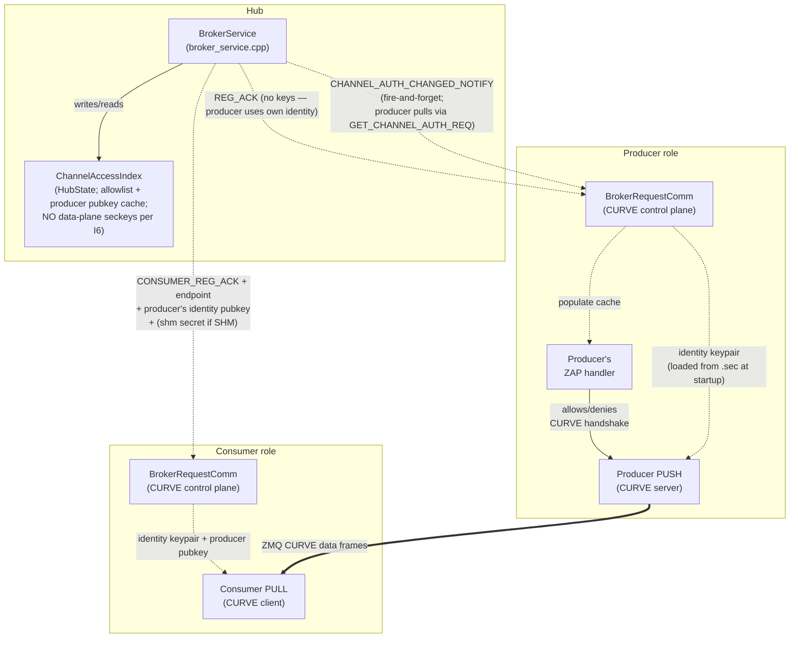
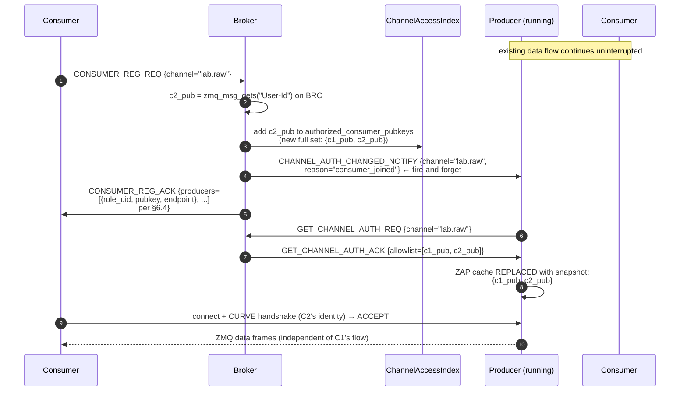

# HEP-CORE-0036: Authenticated Connection Establishment

| Property        | Value                                                                                                       |
|-----------------|-------------------------------------------------------------------------------------------------------------|
| **HEP**         | `HEP-CORE-0036`                                                                                             |
| **Title**       | Authenticated Connection Establishment — Single-Gate Access Control for Control + Data Planes               |
| **Status**     | 🚧 **DESIGN FINAL; IMPLEMENTATION IN FLIGHT** — T1 / T2 / I9 LOCKED 2026-05-28; DP-Q1 (skip-disconnected push) RETRACTED 2026-06-04 along with the snapshot-push-with-ACK design it gated; D1 (`ChannelAccessIndex` in HubState, commit `cacea477`) + D2 (broker CTRL ROUTER ZAP + federation peer pubkey union, commit `d18d2e91` + close-out) shipped 2026-06-03.  §6.5 channel-auth synchronization wire AMENDED 2026-06-04 from snapshot-push-with-ACK to notify-then-pull (`CHANNEL_AUTH_CHANGED_NOTIFY` + `GET_CHANNEL_AUTH_REQ`/`_ACK`); see §6.5 Amendment block.  D3-D7 (channel-auth wire frames + role-side dispatch + `CONSUMER_REG_ACK.producers[]` extension + L3/L4 tests) ⏳; sibling tasks #74 / #94 / #101 ✅ / #102 / #103 + Phase 0-11 in §12.  Open items in §13.1 (federation Q1, audit log Q2) are post-MVP. |
| **Created**     | 2026-05-26                                                                                                  |
| **Last revised** | 2026-06-04 — §6.5 wire-frame **AMENDED: snapshot-push-with-ACK → notify-then-pull.**  The retired design (2026-06-02) had the broker push a full-allowlist snapshot and synchronously wait for `CHANNEL_AUTH_UPDATE_ACK` per producer, making the broker for the first time a sync-request initiator on the same ROUTER socket it serves as responder.  The new design splits into a fire-and-forget `CHANNEL_AUTH_CHANGED_NOTIFY` (broker→producer; same shape as existing `CHANNEL_CLOSING_NOTIFY` etc.) plus a standard `GET_CHANNEL_AUTH_REQ`/`GET_CHANNEL_AUTH_ACK` request-reply (producer pulls when it cares).  No new protocol patterns; broker stays a pure responder; producer-offline becomes the same code path as the existing `REG_ACK.initial_allowlist` reconnect re-sync.  Drift window honestly equivalent.  See §6.5 "Amendment 2026-06-04" block for the full rationale.  Prior revision 2026-06-02 (delta→snapshot; now superseded) preserved in git history.  Prior revision 2026-05-28 — T1 RESOLVED: symmetric identity-keypair design (broker mints nothing on data plane; both sides reuse their identity keys; SHM keeps broker-generated `shm_secret`).  Prior revision 2026-05-27 — two-conditions gate explicit; revocation reframed as passive (no force-close); inbox/bands inheritance; channels-are-dynamic non-goal; manual pubkey distribution MVP. |
| **Area**        | Framework Architecture (broker access control, role-side CURVE wiring, data-plane peer authentication)      |
| **Depends on**  | HEP-CORE-0021 (ZMQ Endpoint Registry — endpoint discovery via broker), HEP-CORE-0035 (Hub-Role Authentication — broker-side ZAP + pubkey index), HEP-CORE-0023 (Startup Coordination — presence FSM) |
| **Blocks**      | Production deployment (data plane currently unauthenticated; see §3 gap analysis)                            |

---

## 1. Status banner

**This HEP is the design contract — implementation is in flight as of
2026-06-03.**  D1 (`ChannelAccessIndex` in HubState — §4.1; commit
`cacea477`) and D2 (broker CTRL ROUTER ZAP with the union of
`known_roles[]` + `peers[].pubkey_z85` — §4.2 Layer-1; commit
`d18d2e91` + close-out) are shipped.  D3-D7 (channel-auth wire
frames per §6.5 — `CHANNEL_AUTH_CHANGED_NOTIFY` +
`GET_CHANNEL_AUTH_REQ`/`_ACK` per the 2026-06-04 notify-then-pull
amendment — role-side dispatch + `CONSUMER_REG_ACK.producers[]`
extension + tests) are tracked in `docs/todo/AUTH_TODO.md`
step-by-step under task #74.

The original 2026-05-26 motivation follows:
the 2026-05-26 holistic audit revealed that the data plane (PUSH/PULL
between producer ↔ consumer ↔ processor on ZMQ; SHM attach between
producer ↔ consumer on SHM) has no peer-level authentication: any
process able to reach a producer's TCP endpoint can connect and consume
the data stream without involvement from the broker.  HEP-CORE-0021
designed the **broker-mediated endpoint discovery** mechanism;
HEP-CORE-0035 designed the **broker-side admission policy**; neither
covers the **data peer authentication** layer required to make the
broker's access decisions actually enforce.

This HEP completes the picture by establishing the **two-conditions
gate** (I1): the broker authorizes a role only if (1) the role's CURVE
handshake succeeded AND (2) the role's pubkey is in the hub's
`known_roles[]` allowlist.  Every other enforcement point in the system
(producer-side ZAP handler, SHM secret release, consumer-side data-
socket setup) is a **cache** of that decision — they refuse to act on
artifacts they never received from the broker, but they do not make
independent admission decisions.

Lifetime alignment (I3) ties data-plane access to control-plane state:
control link dies → data loop exits.  Revocation (I5) is passive — it
prevents NEW connections, but existing authenticated sessions are
trusted for their lifetime (the consumer's own role host closes its
data socket when the control link tears down).  This collapses what
earlier drafts contemplated as separate "broker-initiated eviction"
machinery into the natural shutdown path that already exists.

---

## 2. Motivation

The 2026-05-26 dual-hub-processor-zmq demo run exposed four concrete gaps,
each verified against the current code:

1. **ZMQ data sockets have zero authentication.** `hub_zmq_queue.cpp:581-584`
   does `socket.bind(endpoint)` / `socket.connect(endpoint)` with no
   CURVE configuration. Grep across `src/utils/hub/` returns zero hits
   for `curve|CURVE` — confirmed exhaustive.
2. **Consumer can receive data even when broker registration fails.**
   The demo's consumer logged `CONSUMER_REG_REQ timed out after 5000ms`
   yet still received 767 of 1000 messages, because the data plane
   (consumer's PULL on tcp:5583) opens during `setup_infrastructure_`
   well before broker handshake is attempted.
3. **Endpoint is in the role's config file**, not in the broker. Any
   process with read access to `consumer.json` (or a port scanner) has
   the endpoint pre-positioned for connection attempts.
4. **Three separate enforcement points without a single source of
   truth.** Per the current sketch: broker decides admission
   (HEP-0035), broker mediates endpoint discovery (HEP-0021), and the
   data-plane peer would need its own ZAP allowlist. Without explicit
   coordination, these can diverge.

The fix is not "wire CURVE on more sockets." The fix is to make the
broker's decisions **load-bearing** — peers act only on broker-issued
artifacts (keys, endpoint, allowlist membership), and any deviation
becomes mechanically impossible (the connection literally cannot
complete).

### 2.1 Non-goals (explicit)

The following are deliberately OUT of HEP-0036 scope:

- **Channel pre-declaration in hub config.** Hubs do NOT manage a
  static `channels[]` list.  Channels are created dynamically when
  a producer's `REG_REQ` arrives carrying a new `out_channel` name.
  Per-channel auth state (`ChannelAccessIndex` entry) is created
  alongside on producer REG; destroyed on producer DEREG.
- **Force-closing existing CURVE sessions on revocation.** ZeroMQ
  has no API for this.  Lifetime alignment (I3) makes it
  unnecessary: when a role loses its control link, the role's own
  data loop exits.  External force-close is incident response, not
  protocol (see I5).
- **Per-consumer ACL enforced inside the data path.** A consumer
  that holds a valid CURVE session OR a valid SHM secret is trusted
  for that session's lifetime.  ACL is enforced at the artifact
  release boundary (broker's CONSUMER_REG_ACK + producer-pulled
  `GET_CHANNEL_AUTH_ACK` per §6.5), not at every data frame / SHM
  read.
- **Automated public-key distribution.**  For MVP, hub and role
  public keys are distributed manually by the operator (copy
  `*.pub` files to the appropriate config dirs).  Automated
  distribution (e.g. via a federation control channel) is deferred
  until federation development is further along.
- **Mid-session identity-key rotation.**  Roles' long-term identity
  keys live for the role's deployment lifetime.  Rotation is an
  operator workflow: re-run `plh_role --keygen`, redistribute the
  new `.pub` to every hub's `known_roles/`, restart the role.
  CURVE's per-session ephemeral keys (Curve25519 ECDH) provide
  forward secrecy automatically — past sessions stay
  un-decryptable even if a long-term key is later compromised.
- **Defense against a compromised broker.**  See I8 trust model.

---

## 3. Invariants (the architectural decisions being formalized)

These invariants are non-negotiable for any implementation:

### I1 — Two conditions gate every connection

**Both must hold at the broker before any data-plane artifact
(endpoint, producer's identity pubkey for ZMQ, SHM secret for
SHM, or allowlist-entry push to the producer) is released:**

1. **Auth success** — the role's CURVE handshake to the broker's
   ROUTER socket completed successfully (cryptographic proof of
   identity matching a pubkey).
2. **Role known** — that pubkey is in the hub's `known_roles[]`
   configuration (operator-authorized allowlist).

Either condition fails → broker refuses to issue the artifact → the
role cannot establish a data connection.  Both pass → broker issues
the artifact + the role can establish the data connection.

These two conditions are the **single gate**.  Every downstream
enforcement point (producer-side ZAP handler, consumer-side socket
config, SHM attach) is a CACHE of the broker's decision — it
enforces by refusing to act on artifacts it never received, not by
performing an independent authorization check.

> **Note on existing code + HEP-0035 alignment.**  Today's codebase
> has a string-based placeholder for condition (2) at
> `broker_service.cpp:2674` (`BrokerServiceImpl::check_role_identity`
> with `RoleIdentityPolicy::Verified` mode + `KnownRole` allowlist),
> but HubHost deliberately does NOT wire `known_roles` from hub.json
> into `BrokerService::Config` (per `hub_broker_config.hpp:13-14`
> comment).  Per **HEP-CORE-0035 §4.5**, that string-name machinery
> is being **dropped, not wired** — once HEP-0035 lands, condition (2)
> is enforced at the SOCKET LAYER via the ZAP-pubkey allowlist
> (HEP-0035 §4.1 Layer 1), not by `check_role_identity()`.  HEP-0036
> therefore inherits condition (2) from HEP-0035's Layer-1
> implementation; HEP-0036 itself does NOT add new role-admission
> code — it adds the per-channel data-plane CURVE + allowlist
> management that sits on top of the (then-implemented) broker ZAP.

### I2 — Single source of truth

**The broker's `ChannelAccessIndex` (§4.1) is the canonical decision
record.**  When a consumer's CONSUMER_REG passes both conditions,
broker mutates this index (records artifact issuance + tracks
allowlist for producer's cache).  Producer-side caches are
synchronized via a broker-fired `CHANNEL_AUTH_CHANGED_NOTIFY`
followed by a producer-initiated `GET_CHANNEL_AUTH_REQ` pull (§6.5,
notify-then-pull amended 2026-06-04) but never make independent
admission decisions.

The producer's ZAP handler reads the cache to **gate new handshakes**
— rejecting incoming CURVE handshakes whose pubkey isn't in the
cached allowlist.  The cache is updated by broker push for the
NEXT handshake; existing CURVE sessions are not affected by cache
updates (see I5).

### I3 — Lifetime alignment (control gates data)

**Data link is downstream of control link.  Control dies → data
dies.**  The role host enforces this on its own side:

- Proactive quit: role stops the data loop FIRST, closes data
  sockets, THEN sends DEREG.  By the time broker ACKs, the role is
  already off the data path.
- Passive failure (BRC heartbeat lost, control disconnect): the
  data loop's outer guard observes `brc_is_connected() == false`
  and exits.  Data sockets close.
- Process crash: TCP cleanup on process death; SHM consumer slot
  is reclaimed by recovery code (PID liveness check).

The data loop's outer guard reads:
```cpp
while (core.is_running() &&
       !core.is_shutdown_requested() &&
       any_presence_authorized()) {     // FSM bridges control → data
  ...
}
```

`any_presence_authorized()` IS the control→data dependency: when the
BRC loses connection, the BRC poll thread transitions every affected
presence out of `Authorized`, which makes the guard false on the
next iteration.  No separate `brc_is_connected()` check is needed
(see §8.2 for the full formulation including `is_critical_error()`).

This is the role's own contract.  A compromised role that ignores
its contract (keeps reading data after losing control) is outside
the auth model's scope — that's incident response, not protocol.

### I4 — No data artifact before authorization

**A peer that has not passed both I1 conditions cannot obtain the
data-plane connection artifacts**, so cannot establish a data
connection:

- ZMQ consumer: doesn't know the producer's data endpoint or the
  producer's identity pubkey (which the consumer needs as
  `curve_serverkey`) until `CONSUMER_REG_ACK` carries them.
  Without these, no connection attempt is meaningful.
- SHM consumer: doesn't know the channel's `shm_secret` until
  `CONSUMER_REG_ACK` carries it.  Without it, SHM attach fails
  (existing DataBlock secret check, HEP-CORE-0002).

The "artifact issuance gate" mirrors the "two conditions" gate.
This is the architectural symmetry: both ZMQ and SHM transports
go through the SAME broker-side gate; the artifact differs by
transport but the decision is the same.

### I5 — Revocation prevents NEW connections; existing connections are trusted

**Once authenticated, a connection is trusted for its lifetime.**
Revocation removes the role's pubkey from the broker's allowlist
and pushes the removal to the producer's ZAP cache.  This means:

- The next CURVE handshake from that pubkey fails (cache hit ≠ in
  allowlist → ZAP DENY).
- The next CONSUMER_REG_REQ from that pubkey returns ERROR (broker
  doesn't issue secret).
- The next SHM attach attempt by a process that didn't get the
  current secret fails.

Existing CURVE sessions and SHM attaches **continue**.  ZeroMQ does
not provide a mechanism to forcibly close an existing CURVE session
by peer pubkey; the consumer's role host is responsible for closing
the data loop when its own control link signals revocation (via
CHANNEL_CLOSING_NOTIFY or BRC disconnect — both per I3).

This is sufficient for the authentication model.  A consumer that
was authenticated, then later compromised (key leak, malicious code
injection), is outside the auth model's scope — operator response
is to kill the compromised process out-of-band.  The architecture
defends against UNAUTHENTICATED peers, not against trusted peers
that turn malicious mid-session.

### I6 — Identity keys reused on the data plane; broker mints nothing

**The role's identity keypair (from `plh_role --keygen`, HEP-0035)
is used on BOTH the control plane (BRC DEALER → broker ROUTER) AND
the data plane** (PUSH on the producer side; PULL on the consumer
side).  The broker does NOT generate or hold any data-plane
keypairs.  Its job on the data plane is purely allowlist
management — tracking which consumer pubkeys are authorized to
connect to which channel.

Consequences:

- One keypair per role to manage at deployment.  Operator workflow
  per HEP-0035 §11.3 is the only key-distribution path.
- Producer's PUSH socket binds with the role's identity pubkey
  (curve_server=1, secretkey + publickey both from `<role_uid>.sec`
  / `<role_uid>.pub`).
- Consumer's rx queue (ZmqQueue PULL side; HEP-CORE-0017 §3.3)
  uses the role's identity keypair for CURVE-client config;
  `curve_serverkey` per peer is the producer's identity pubkey
  (cached in the hub's `PubkeyOrigin` index from HEP-0035 §4.2;
  delivered to the consumer via `CONSUMER_REG_ACK.producers[]` per
  §6.4).
- Per-channel revocation works at the **allowlist** layer, not the
  key layer: removing a consumer's pubkey from channel A's allowlist
  prevents future handshakes to A; the consumer keeps its identity
  for any other channel it's authorized on (per-channel scope is
  enforced by what's IN the allowlist, not by separate keypairs).
- Producer/broker restart is recoverable because the producer's
  identity pubkey doesn't change across restarts (it's loaded from
  disk).  Consumers' cached `curve_serverkey` stays valid.

The earlier draft of HEP-0036 specified per-channel broker-minted
keypairs.  Design review (2026-05-28) concluded that the
"isolation" benefit was illusory under HEP-0036's threat model (I8):
both keypairs would live in the same process memory and be exposed
together, so the additional minting and key-distribution machinery
added complexity without measurable security gain.  Identity
reuse is the simpler, sound design.

The ONE exception is SHM: the broker DOES generate a per-channel
`shm_secret` (uint64 token, not a CURVE key) because SHM
authentication uses the existing DataBlock guard-secret mechanism
(HEP-CORE-0002), which is unrelated to CURVE.  See §5.6.

### I7 — Endpoint disclosure follows authorization

**The data-plane endpoint is broker-state, not role-state.**  Role
configs declare a channel name (`in_channel` / `out_channel`) and
optionally a port range / bind interface hint; the **actual endpoint
string** (`tcp://host:port`) is computed at producer bind time (per
HEP-0021 §16 ephemeral port resolution) and lives only on the broker
+ in the role's runtime memory.  It does not appear in any persisted
config file.

A consumer learns the endpoint only via `CONSUMER_REG_ACK` after
broker authorization.  Pre-authorization port scanning yields a CURVE
socket that rejects all handshakes (empty allowlist + ZAP active).

### I8 — Trust model assumption

**HEP-0036 trusts the broker as the sole admission authority.**  The
broker holds no data-plane secret keys (per I6), so a broker
compromise doesn't directly leak any data-plane CURVE seckey.  But a
compromised broker can:

- Authorize arbitrary pubkeys (forge allowlist entries; falsely
  attest a malicious role's identity pubkey is in `known_roles[]`).
- Distribute a malicious "producer's identity pubkey" to consumers
  via CONSUMER_REG_ACK, redirecting traffic to an attacker-controlled
  endpoint.

CURVE's per-session ephemeral keys (Curve25519 ECDH) provide
forward secrecy at the transport layer: traffic captured by a
passive observer cannot be decrypted later even if a long-term
seckey is compromised.  This holds regardless of the broker's
state.

The threat model HEP-0036 defends against is **unauthenticated +
unknown external peers**, not a compromised broker.  Operator
responsibility: secure the broker host (HEP-0035 §4.6 file ACLs +
§4.7 runtime hardening + OS hardening + restricted access + audit
logging).  Beyond-MVP enhancements (HSM-backed identity keys for
the broker, multi-broker quorum) are tracked as follow-up work in
§13 open questions.

### I9 — Three-tier separation: broker → framework → queue → script

**The wire protocol does NOT expose transport-level operations to
roles.**  Producer / consumer connection management, ZAP cache
maintenance, fair-queue accounting, and bind/connect direction
are all handled INSIDE the queue abstraction (HEP-CORE-0017 §3.3 +
§4.6.1).  Roles never call ZMQ socket APIs.

The architecture has four tiers, each with bounded responsibility:

| Tier | Owns | Visible API |
|---|---|---|
| **Broker** (`HubState`) | Authoritative `ChannelEntry::producers[]` / `consumers[]`.  Emits channel-event broadcasts (HEP-CORE-0033 §12 family) on every state change. | REG / DEREG / channel-event wire messages |
| **Role-host framework** | Receives broadcasts via BRC.  Calls queue's `add_producer_peer` / `remove_producer_peer` (HEP-CORE-0017 §3.3) in response. | Internal C++; not script-visible |
| **Queue** (`ZmqQueue` / `ShmQueue`) | All transport plumbing — sockets, bind/connect direction, ZAP cache, fair-queue.  Conceals N-producer fan-in (HEP-CORE-0017 §4.6). | `QueueReader::read_acquire/release` + `add_producer_peer` / `remove_producer_peer` |
| **Script** | Application logic. | `api.rx.acquire()` / commit, band callbacks, inbox via `api.list_producers(channel)` |

**Communication patterns** outside the data-plane queue:

- **Band** — broadcast pattern; routing handles delivery to currently-available roles automatically.  Script does not enumerate target roles.
- **Inbox** — point-to-point pattern; script queries hub for target-role existence via HubAPI (e.g., `api.list_producers(channel)`), then sends to the looked-up role.

Dynamic-topology reactions are script-level decisions for inbox/band.  For the bulk-data queue, the framework auto-reacts to channel-event broadcasts and updates the queue — script sees no churn.

This invariant is load-bearing: HEP-0036 adds NO new wire messages for "consumer's PULL session to producer P died" or "new producer joined."  The channel-event family already broadcasts membership changes; the queue handles the transport reactions.  Wire protocol stays minimal; transport-level dynamism stays inside the queue.

### I10 — One pubkey per role uid (separation of duties)

**Every entry in `known_roles.json` MUST have a `pubkey_z85` value unique across all entries in the file.**  Equivalently: the broker's `KnownRolesStore` enforces an injective mapping `uid → pubkey`.  Two distinct role uids that share the same pubkey is a configuration error and must be rejected at load / insert time.

**Security rationale** — sharing a pubkey across uids breaks four independent guarantees:

1. **Credential blast radius.**  A single seckey compromise grants the attacker every uid mapped to that pubkey.  Each shared-pubkey entry multiplies the impact of one compromise by the count of associated uids.
2. **Privilege confusion.**  The holder of a shared seckey can select which uid to claim at registration time, effectively self-selecting whichever uid carries the most authority for the action they want to take.
3. **Accountability gap.**  Audit logs showing "uid_a did X" and "uid_b did Y" cannot prove these are separate actors when both authenticate with the same pubkey.  The attribution chain collapses; forensic analysis cannot distinguish "one process pretending to be multiple roles" from "multiple processes each acting as one role."
4. **Separation-of-duties violation.**  Roles that should be mutually exclusive by design (e.g., writer / reader, producer / auditor) can be held simultaneously by a single secret holder, defeating the security policy the operator encoded by giving them distinct uids in the first place.

**Enforcement point.**  `pylabhub::utils::security::KnownRolesStore::add()` and `::load_from_file()` validate the invariant.  Insertion of a duplicate-pubkey entry throws; loading a file containing duplicates throws and rejects the entire file (no "skip bad entry and continue" — operator intent must not be silently downgraded, matching the strict validation policy in the same store's existing entry-shape checks).

**Test-fixture bypass — RELEASE BUILDS CANNOT BE CONFIGURED TO ALLOW THIS.**

> ⚠ **WARNING.**  The bypass for this invariant exists ONLY in builds compiled with BOTH `CMAKE_BUILD_TYPE=Debug` AND the CMake option `PYLABHUB_WITH_TEST=ON`.  In RELEASE builds the `NDEBUG` macro is defined and the bypass code is physically absent from the compiled library — no runtime configuration, no environment variable, no admin command can re-enable it.  A binary built with `cmake -DCMAKE_BUILD_TYPE=Release` will reject every shared-pubkey configuration unconditionally.
>
> The bypass exists for the narrow purpose of L3 in-process multi-BRC test fixtures (multiple `BrokerRequestComm` instances within one subprocess sharing one CURVE keypair to test broker fan-out behavior without launching real binaries).  Tests built with `PYLABHUB_WITH_TEST=ON` may legitimately seed `known_roles.json` with multiple `(uid_i, shared_pubkey)` entries — the fixture trades fixture-side keypair-per-process production-mirror for fast wire-protocol coverage, while leaving the LIBRARY API identical between test and production builds.
>
> Operators MUST NOT ship binaries built with `PYLABHUB_WITH_TEST=ON`.  CI is responsible for verifying production builds use RELEASE configuration.  When in doubt: a quick check is that `nm` on the shipped binary should not reveal any symbols related to the bypass code path.

**Cross-references.**
- HEP-CORE-0035 §4.6 (file ACL discipline) — pubkey file integrity is the prerequisite for this invariant; tampering with `known_roles.json` defeats it regardless of code-level enforcement.
- HEP-CORE-0040 §5 (KeyStore) — the *process-private* identity store; orthogonal to this invariant.  KeyStore holds at most one entry per role kind (production constraint); KnownRolesStore enforces the symmetric broker-side constraint that no two role entries share a pubkey.

---

## 4. Architecture

### 4.1 `ChannelAccessIndex` — the canonical decision record

A new in-memory structure inside `HubState`, indexed by `channel_name`.
Under the I6 symmetric design + the existing Wave M2.5 per-producer
state layout (`ChannelEntry::producers[]` already a
`std::vector<ProducerEntry>`, 1..N producers; per-producer pubkeys on
`ProducerEntry::zmq_pubkey`, per-producer endpoints on
`ProducerEntry::zmq_node_endpoint`), `ChannelAccessIndex` holds ONLY
the per-channel scaffolding that doesn't already live somewhere
else.  Concretely two fields:

```cpp
struct ChannelAccessEntry
{
    // Allowed consumer identity-pubkeys for this channel.
    // Producer's ZAP handler enforces; refreshed via GET_CHANNEL_AUTH_REQ
    // pulls triggered by CHANNEL_AUTH_CHANGED_NOTIFY (§6.5 notify-then-pull,
    // amended 2026-06-04).  Per-channel, NOT per-producer — a consumer
    // authorized for a channel can connect to ANY producer of that channel.
    std::unordered_set<std::string>  authorized_consumer_pubkeys;

    // SHM-only: broker-generated guard secret for the DataBlock
    // (HEP-CORE-0002).  Unrelated to CURVE; SHM auth uses this secret
    // token, not pubkey allowlists.  Zero when transport=zmq.
    uint64_t  shm_secret{0};
};

// In HubState:
std::unordered_map<std::string, ChannelAccessEntry>  channel_access_index_;
```

**Producer identity pubkeys are NOT duplicated here.**  Each
producer's identity pubkey is already on
`ChannelEntry::producers[i].zmq_pubkey` (existing per-producer
field, hub_state.hpp:194), populated at REG time by
`zmq_msg_gets("User-Id")` from the BRC socket per HEP-0036's
no-self-claims rule.  All code paths that need a producer's pubkey
look it up there; the broker iterates `channels[name].producers[]`
to enumerate all of them (e.g. when building CONSUMER_REG_ACK's
producer-array per §6.4).

This keeps `ChannelAccessIndex` minimal + future-proof: identical
data path for single-producer and N-producer (fan-in) channels.
No singular-vs-plural special cases anywhere.

**Per I2** this is the broker's canonical record of the two-condition
gate decision (I1).  The handlers that read + write it:

- **REG handler** (broker): writes — creates entry on producer REG
  after I1 passes; deletes on the LAST producer's DEREG (atomic
  teardown per HEP-CORE-0023 §2.1.1).  Note: REG handler also
  writes the producer's identity pubkey into
  `ChannelEntry::producers[i].zmq_pubkey` (NOT into
  ChannelAccessEntry — those live in different structs).
- **CONSUMER_REG handler** (broker): reads + writes — gates admission
  via I1 (using `zmq_msg_gets("User-Id")` to recover the consumer's
  CURVE-proved identity pubkey from the BRC socket — no self-claims),
  writes that pubkey to the allowlist on accept; iterates
  `channels[name].producers[]` to read per-producer (pubkey,
  endpoint) pairs for the CONSUMER_REG_ACK array (§6.4).
- **Channel-auth notify emitter** (broker): on any mutation of
  `authorized_consumer_pubkeys`, fires fire-and-forget
  `CHANNEL_AUTH_CHANGED_NOTIFY { channel_name, reason }` to every
  `kLive` producer of the channel (§6.5 amended 2026-06-04 from
  snapshot-push-with-ACK to notify-then-pull).  No ACK awaited; the
  producer pulls the current allowlist via `GET_CHANNEL_AUTH_REQ`
  when it wants to converge its ZAP cache.  Registration paths
  return CONSUMER_REG_ACK immediately after the mutation + notify
  fires; consumer never waits on producer ZAP-cache convergence.
- **`GET_CHANNEL_AUTH_REQ` handler** (broker): reads
  `authorized_consumer_pubkeys` for the requested channel; returns
  the full current set in `GET_CHANNEL_AUTH_ACK.allowlist`.
  Standard request-reply (no special threading).
- **Heartbeat / hub-dead handler** (broker): writes — removes a
  failed peer from the allowlist via `_on_consumer_revoked`; fires
  `CHANNEL_AUTH_CHANGED_NOTIFY` to all `kLive` producers.

No producer-side or consumer-side code computes admission decisions
independently; they execute artifacts (allowlist entries, endpoint,
producer pubkey enumeration, SHM secret) the broker handed them.

### 4.2 Component overview



Every arrow that crosses a process boundary is either:
- **CURVE-authenticated control plane** (BRC ↔ Broker, already CURVE per HEP-0035 control-plane scope), or
- **CURVE-authenticated data plane** (Producer PUSH ↔ Consumer PULL, NEW; both sides use their identity keys per I6), or
- **SHM attach gated by broker-issued secret** (NEW for SHM transport).

### 4.3 Lifetime FSM — extends HEP-0023's RegistrationState

HEP-0023 defines a per-presence `RegistrationState` enum (today 4
values: `Unregistered`, `RegRequestPending`, `Registered`,
`Deregistered`).  HEP-0036 adds **`Authorized`** between
`Registered` and the heartbeat-tick start.  The data loop may run
only when at least one presence is `Authorized` (§8.2).

The key insight reconciled in design review (2026-05-28): the broker
ALREADY has a "producer is operational" signal via
`first_heartbeat_seen` (HEP-CORE-0023 §2.6 + `hub_state.hpp:107`;
`kRegistering → kLive` observable).  HEP-0036's role-side `Authorized`
transition is the local gate that controls when the role calls
`install_heartbeat`; the first heartbeat tick then drives the broker
into `kLive`.  No new wire message is needed for the broker to learn
that a producer is ready to take consumers.

#### 4.3.1 Per-presence `RegistrationState` (role-side)

```mermaid
stateDiagram-v2
    [*]               --> Unregistered: role process start
    Unregistered      --> RegRequestPending: send REG_REQ<br/>(BRC CURVE handshake to broker<br/>already succeeded — HEP-0035 Layer 1)
    RegRequestPending --> Registered: REG_ACK ok<br/>(producer: initial_allowlist=[];<br/>consumer: producers[] array per §6.4;<br/>SHM consumer: shm_secret)
    RegRequestPending --> Failed: REG_ACK error / timeout<br/>(I1 cond 2 failed → role not in known_roles)
    Registered        --> Authorized: setup_infrastructure_ done<br/>(see entry conditions below)
    Registered        --> Failed: setup_infrastructure_ failure<br/>(bind / ZAP / ENDPOINT_UPDATE)
    Authorized        --> Authorized: brief BRC blip<br/>(within hub_dead_grace — stay)
    Authorized        --> Unregistered: hub-dead detected<br/>(sustained heartbeat loss<br/>→ tear down data infra<br/>→ await BRC reconnect)
    Authorized        --> Deregistered: DEREG_REQ sent + DEREG_ACK<br/>(data loop already exited per I3)
    Deregistered      --> [*]
    Failed            --> [*]
```



#### 4.3.2 Entry conditions for `Authorized` — both sides synchronous

**Producer presence — synchronous trigger:**
- ZAP handler installed on the role's ZMQ context (per-context, not
  per-channel; once before the first CURVE-server bind).
- PUSH socket configured `curve_server=1` with role's IDENTITY
  keypair (loaded from `<role_uid>.sec` at process startup, per
  HEP-0035 §4.6 + §4.7).
- PUSH socket bound (`tcp://*:0` → ephemeral port resolved).
- `ENDPOINT_UPDATE_REQ` sent and ACK'd (sync per HEP-0021 §16.3 +
  audit C2, 2026-05-21).
- After all four: `Registered → Authorized`; then call
  `install_heartbeat`; first heartbeat tick fires; broker
  transitions `kRegistering → kLive` (existing
  `first_heartbeat_seen` mechanism).

**Consumer presence — synchronous trigger:**
- Authorization happens entirely at REG time on the CONTROL plane:
  BRC CURVE handshake (HEP-0035 Layer-1 ZAP) + I1 cond 2
  (User-Id ∈ `known_roles[]`) + broker fires
  `CHANNEL_AUTH_CHANGED_NOTIFY` to each producer of the channel,
  each producer pulls the new allowlist asynchronously via
  `GET_CHANNEL_AUTH_REQ` (§6.5 amended 2026-06-04).
- Endpoints are NOT disclosed before authorization (§5.2 "No
  endpoint disclosure on rejection"): the consumer holding the
  `producers[]` array IS proof that authorization succeeded.
- Therefore `Authorized` fires SYNCHRONOUSLY when:
  1. `CONSUMER_REG_ACK` received with `producers[]` array, AND
  2. Framework constructs the rx queue (`ZmqQueue` for ZMQ
     transport) with consumer's IDENTITY keypair (per I6) and
     feeds `producers[]` into `RxQueueOptions::producer_peers`
     (HEP-CORE-0017 §3.3).  ZmqQueue handles all transport plumbing
     internally (per I9).
- The data-plane CURVE handshake that follows is enforcement at
  the transport layer by the producer's ZAP cache (populated by
  the producer's `GET_CHANNEL_AUTH_REQ` pull per §6.5 notify-then-
  pull), not a separate auth decision.  The handshake is
  transport-internal per I9 — invisible to the FSM.  A brief
  re-handshake window exists between CONSUMER_REG_ACK arrival and
  producer's pull completion; ZeroMQ's reconnect-on-failure
  bridges it transparently (see §5.2 property note).

#### 4.3.3 Recovery path — hub-dead → Unregistered

Per HEP-CORE-0023 §2.6 + task #59 ("Hub-dead must transition
presences out of Registered"), sustained loss of broker heartbeat
ACKs past `hub_dead_grace` triggers presence teardown.  HEP-0036
extends this:

- Close PUSH/PULL data sockets.  Under T1 / I6 the identity keys
  themselves are NOT stale (loaded fresh from `.sec` on every
  startup; survive broker restart), but the broker's view of the
  channel — `ChannelAccessIndex` entry, allowlist, endpoint cache —
  is lost on broker restart and must be re-established from
  scratch via a fresh REG_REQ + CONSUMER_REG_REQ cycle.  Tearing
  down the data sockets is the clean way to drop in-flight CURVE
  sessions whose ZAP allowlist on the producer side is about to
  be re-populated (and may differ from the pre-restart allowlist).
  T3 covers the broker-restart recovery sequence end-to-end.
- Clear the producer-side ZAP cache entry for the channel.
- Stop heartbeat tick.
- Transition `Authorized → Unregistered`.
- On BRC reconnect (TCP recovery + CURVE handshake retry), the
  role re-enters the flow from `Unregistered → RegRequestPending`.

Brief network blips WITHIN `hub_dead_grace` keep the presence in
`Authorized`: data sockets stay open, CURVE sessions are intact,
recovery is invisible to the data loop.

---

## 5. Sequence diagrams

### 5.1 Producer registration (ZMQ, port-0 ephemeral binding)

Under T1's symmetric design, the producer already holds its
identity keypair (loaded from `<role_uid>.sec` at process startup,
per HEP-0035 §4.6 + §4.7).  No broker round-trip is needed before
the PUSH socket can be configured + bound.  The producer's
`worker_main_` ordering can therefore stay close to the existing
code: bind PUSH (with identity keypair + empty ZAP allowlist) →
REG_REQ (carries the resolved endpoint) → install_heartbeat.

The ONE new ordering constraint vs pre-HEP-0036 code: the ZAP
handler must be installed BEFORE the CURVE-server PUSH socket
binds, because a CURVE-server socket bound without a ZAP handler
accepts every handshake by default (libzmq behavior).

```mermaid
sequenceDiagram
    autonumber
    participant P as Producer role<br/>(worker_main_)
    participant B as Broker (handler thread)
    participant AI as ChannelAccessIndex<br/>(HubState)
    participant OBS as Channel observable<br/>(HubState — derived)

    Note over P,B: BRC control plane established<br/>(BRC DEALER ↔ Broker ROUTER, HEP-0035 Layer 1).<br/>I1 cond 1 (CURVE auth) + cond 2 (User-Id ∈ known_roles[])<br/>both already passed for this producer's BRC.<br/>Producer's identity keypair already loaded from .sec.

    rect rgba(220,240,210,0.4)
        Note over P: == worker_main_ step: setup_infrastructure_ ==
        P->>P: install ZAP handler on ZMQ context<br/>(empty allowlist cache; populated by<br/>GET_CHANNEL_AUTH_REQ pulls triggered by<br/>CHANNEL_AUTH_CHANGED_NOTIFY — §6.5)
        P->>P: configure PUSH socket<br/>curve_server=1<br/>curve_secretkey=&lt;producer's identity seckey&gt;<br/>curve_publickey=&lt;producer's identity pubkey&gt;
        P->>P: socket.bind("tcp://*:0")<br/>→ resolved = "tcp://127.0.0.1:54891"
    end

    rect rgba(200,220,255,0.4)
        Note over P: == worker_main_ step: register_producer_channel ==
        P->>B: REG_REQ {channel="lab.raw",<br/>transport="zmq",<br/>zmq_endpoint="tcp://127.0.0.1:54891",<br/>role_uid, role_name}
        Note over B: I1 cond 2 already enforced at ZAP (Layer 1).<br/>Broker reads producer's identity pubkey via<br/>zmq_msg_gets("User-Id") from this REG_REQ frame.
        B->>AI: create ChannelAccessEntry["lab.raw"]<br/>authorized_consumer_pubkeys = {}<br/>(NO key minting — broker holds no data-plane secrets)
        Note over B: Producer's identity pubkey is written to<br/>ChannelEntry::producers[i].zmq_pubkey (existing<br/>per-producer field, hub_state.hpp:194) —<br/>NOT into ChannelAccessEntry.  Same path supports<br/>1..N producers (fan-in per HEP-0023 §2.1.1).
        B->>OBS: kAbsent → kRegistering<br/>(producer REG'd; first_heartbeat_seen=false)
        B->>P: REG_ACK {status="ok",<br/>initial_allowlist=[]}
        Note over P: state Unregistered → RegRequestPending → Registered<br/>→ Authorized<br/>(socket bound + ZAP installed + REG_ACK ok)
    end

    rect rgba(255,235,210,0.4)
        Note over P: == worker_main_ step: install_heartbeat ==
        P->>P: BRC.set_periodic_task(on_heartbeat_tick_, interval)
        Note over P: ... time passes (first tick) ...
        P->>B: HEARTBEAT_REQ {channel="lab.raw",<br/>role_uid, role_type="producer", metrics}
        B->>B: presence.first_heartbeat_seen = true
        B->>OBS: kRegistering → kLive<br/>(channel now admits consumers)
    end

    Note over P,OBS: From this point forward, the broker will admit<br/>CONSUMER_REG_REQ for "lab.raw" (§5.2 picks up here).
```

**Ordering invariants captured by the diagram:**

1. **ZAP install before bind.**  A CURVE-server socket bound
   without ZAP accepts all handshakes by default.  In the diagram:
   `install ZAP` → `configure CURVE on PUSH` → `bind`, in that
   order.  The empty allowlist cache at install time means every
   handshake DENIES until the producer's first
   `GET_CHANNEL_AUTH_REQ` reply lands (triggered by the broker's
   first `CHANNEL_AUTH_CHANGED_NOTIFY` after a consumer registers,
   or by the producer's own setup-time pull — see §6.5 notify-then-
   pull amended 2026-06-04).
2. **Bind before REG_REQ.**  The producer needs the resolved
   port to put in REG_REQ's `zmq_endpoint`.  This matches the
   existing code order and HEP-0021's wire shape.
3. **Broker reads pubkey from socket, not message body.**  See
   the diagram's `Note over B` right after `REG_REQ` arrives.
   I1 cond 2 is enforced cryptographically at the ZAP layer
   (HEP-0035 §4.1 Layer 1); broker uses `zmq_msg_gets("User-Id")`
   to recover the authenticated identity pubkey for the
   per-channel allowlist.
4. **install_heartbeat after Authorized.**  The diagram shows
   `state Registered → Authorized` complete BEFORE the
   `install_heartbeat` block opens.  First heartbeat fires only
   after the data infrastructure is fully wired; the
   `kRegistering → kLive` transition at the end of the
   `install_heartbeat` block is the gating signal for consumer
   admission.

**Single-gate property** (T1 symmetric design): the broker mints
no data-plane keypairs (per I6).  Its admission control on the
data plane is purely allowlist management — the producer's own
identity pubkey is stored on `ChannelEntry::producers[i].zmq_pubkey`
at REG time (the `B->>AI: create ChannelAccessEntry[...]` arrow
in the diagram, plus the adjacent note about
`ProducerEntry::zmq_pubkey`), and `authorized_consumer_pubkeys`
on the per-channel `ChannelAccessEntry` grows/shrinks as
CONSUMER_REG_REQs arrive (§5.2).  The producer's PUSH socket binds
with its identity key + empty allowlist; the ZAP cache is replaced
on each `GET_CHANNEL_AUTH_ACK` reply (per §6.5; full current set
per pull, not deltas — the pull is triggered by the broker's
fire-and-forget `CHANNEL_AUTH_CHANGED_NOTIFY` or by the producer's
own setup / on-demand refresh).  In fan-in channels each producer's
PUSH binds with its OWN identity key + each producer independently
pulls the SAME channel-scoped current set.

### 5.2 Consumer registration + data connect (ZMQ)

Picks up from §5.1's final state: producer is `Authorized` (role-
local), broker's channel observable is `kLive`.

Per T1 lock-in: the consumer's data-plane keypair IS its identity
keypair (same one used on its BRC).  The broker reads the
consumer's CURVE-authenticated identity pubkey via
`zmq_msg_gets("User-Id")` on the BRC socket — there is NO
`consumer_pubkey` field in the wire message (we don't accept
self-claimed identities, same model as SSH `authorized_keys`).

The producer pubkeys distributed to the consumer are the
producers' IDENTITY pubkeys (already in the hub's `PubkeyOrigin`
index from HEP-0035 §4.2; mirrored onto
`ChannelEntry::producers[i].zmq_pubkey` at each producer's REG
time per §5.1).  CONSUMER_REG_ACK returns these as a
`producers[]` array per §6.4 — length 1 for single-producer
channels, length N for fan-in.  The framework feeds the array
into the consumer's rx queue (`RxQueueOptions::producer_peers`
per HEP-CORE-0017 §3.3); ZmqQueue handles per-peer plumbing
internally per I9.

```mermaid
sequenceDiagram
    autonumber
    participant C as Consumer role
    participant B as Broker (handler thread)
    participant AI as ChannelAccessIndex
    participant OBS as Channel observable
    participant P as Producer (running)

    Note over C,B: BRC control plane established<br/>(I1 cond 1 + 2 already passed for consumer on its BRC;<br/>consumer's identity pubkey is the User-Id on the BRC socket).

    C->>B: CONSUMER_REG_REQ {channel="lab.raw"}<br/>(NO pubkey field; broker uses BRC User-Id)
    B->>B: cons_pub = zmq_msg_gets("User-Id")<br/>(CURVE-proved consumer identity pubkey)
    B->>OBS: observe(channel) — kAbsent / kRegistering / kStalled / kLive

    alt kAbsent (channel not registered)
        B->>C: ERROR {error_code="CHANNEL_NOT_FOUND"}
    else kRegistering (producer REG'd, no first heartbeat yet — R6 gate)
        B->>C: CHANNEL_NOT_READY {reason="awaiting_first_heartbeat"}
        Note over C: Consumer retries after backoff.<br/>Endpoint never disclosed.
    else kStalled (producer heartbeat stalled)
        B->>C: CHANNEL_NOT_READY {reason="heartbeat_stalled"}
    else kLive AND cons_pub NOT in known_roles[] (federation policy fail)
        B->>C: ERROR {error_code="UNAUTHORIZED_CONSUMER_PUBKEY"}
        Note over B: I1 cond 2 already enforced at BRC ZAP (Layer 1);<br/>this branch covers federation-trust cases where Layer 1<br/>let the BRC connect but Layer 2 rejects channel-scope.
    else kLive AND cons_pub authorized
        B->>AI: add cons_pub to authorized_consumer_pubkeys<br/>(new full set: { cons_pub })
        B->>P: CHANNEL_AUTH_CHANGED_NOTIFY {channel="lab.raw",<br/>reason="consumer_joined"}  ← fire-and-forget, no ACK
        B->>C: CONSUMER_REG_ACK {status="ok",<br/>producers=[{role_uid, pubkey, endpoint}, ...]<br/>(per §6.4 — length 1 here for single-producer;<br/>length N for fan-in)}
        Note over C: state Unregistered → RegRequestPending → Registered
        Note over P: P's BRC handler receives the notify;<br/>fires GET_CHANNEL_AUTH_REQ → broker replies with<br/>allowlist=[cons_pub]; P's ZAP cache REPLACED with<br/>snapshot { cons_pub } (§6.5 notify-then-pull).
        P->>B: GET_CHANNEL_AUTH_REQ {channel="lab.raw"}
        B->>P: GET_CHANNEL_AUTH_ACK {status="success",<br/>allowlist=[cons_pub]}

        rect rgba(220,240,210,0.4)
            Note over C: == setup_infrastructure_ ==<br/>Framework constructs rx queue with consumer's identity keypair<br/>+ producers[] peer set (HEP-0017 §3.3).<br/>ZmqQueue handles all transport plumbing internally per I9.
            C->>C: rx queue constructed (RxQueueOptions::producer_peers<br/>= CONSUMER_REG_ACK.producers[])
            Note over C: state Registered → Authorized<br/>(synchronous — authorization was completed at REG;<br/>endpoints in CONSUMER_REG_ACK ARE the auth proof)
        end

        rect rgba(255,235,210,0.4)
            Note over C: == install_heartbeat (after Authorized) ==
            C->>C: BRC.set_periodic_task(on_heartbeat_tick_)
            Note over C: first tick fires
            C->>B: HEARTBEAT_REQ {channel, role_uid, role_type="consumer"}
            B->>B: consumer presence.first_heartbeat_seen = true
        end

        P-->>C: ZMQ data frames (CURVE-encrypted)
    end
```

**Gating points (single-gate property)**:

- **Broker observable check** (the `B->>OBS: observe(channel)`
  arrow): if the producer hasn't sent its first heartbeat, the
  channel is `kRegistering` and consumer is told to retry.  This
  is **R6** — the broker's CONSUMER_REG_REQ handler at
  `broker_service.cpp:1959-1971` currently checks
  endpoint-port-not-zero but does NOT check `first_heartbeat_seen`.
  HEP-0036 implementation extends the check to also gate on
  `first_heartbeat_seen` (~5 lines), matching DISC_REQ's behavior
  at `broker_service.cpp:1720`.
- **Broker fires notify, returns CONSUMER_REG_ACK immediately**
  (amended 2026-06-04, §6.5).  The broker does NOT wait for the
  producer's ZAP cache to converge before answering the consumer
  — it fires `CHANNEL_AUTH_CHANGED_NOTIFY` (best-effort) and
  returns `CONSUMER_REG_ACK` in the same handler call.  The
  producer's pull (`GET_CHANNEL_AUTH_REQ`) is asynchronous on
  the producer's side; the producer's ZAP cache converges within
  one BRC round-trip after the notify arrives.
- **Consumer's `Authorized` may briefly race the producer's
  cache.**  Between `CONSUMER_REG_ACK` arrival at the consumer
  and the producer's `GET_CHANNEL_AUTH_ACK` reply, the consumer
  may attempt a CURVE handshake to the producer's PUSH socket.
  If the producer's ZAP cache hasn't pulled yet, the handshake
  DENIES; ZeroMQ's reconnect-on-handshake-failure brings it back
  shortly thereafter, by which time the cache is converged.  This
  is a small re-handshake window (one BRC round-trip), not a
  consistent-state hazard — the producer eventually admits the
  consumer once the pull completes, and existing CURVE sessions
  on other authorized pubkeys are unaffected throughout.  Roles
  that want zero re-handshake jitter can have the consumer add
  a brief delay after CONSUMER_REG_ACK before initiating the
  CURVE handshake; this is a role-side optimization, not a
  protocol requirement.

**No endpoint disclosure on rejection**: in EVERY rejection
branch (`kAbsent`, `kRegistering`, `kStalled`, `kLive` +
`UNAUTHORIZED_CONSUMER_PUBKEY`), the broker returns an error /
`CHANNEL_NOT_READY` with NO `producers[]` field — neither
endpoints nor producer identity pubkeys are revealed for ANY
of the channel's producers (single-producer or fan-in).  A
consumer that guesses random ports + random pubkeys fails at
the producer's ZAP gate (its identity pubkey isn't in the
producer's allowlist → DENY).

### 5.3 Multi-consumer fan-out: second consumer joins a running channel



**Property**: producer's existing CURVE session with C1 is unaffected.
The snapshot replace is in-place at the cache level — no socket
re-bind, no key rotation, no session disruption.  A snapshot whose
set is a superset of the previous (an "addition" event) reuses
every existing entry; the producer's cache pointer atomically
swaps to the new immutable set.

### 5.4 Consumer deregistration (cooperative close)

```mermaid
sequenceDiagram
    autonumber
    participant C1 as Consumer #1 (leaving)
    participant B as Broker
    participant AI as ChannelAccessIndex
    participant P as Producer
    participant C2 as Consumer #2 (continuing)

    Note over C1: Per I3, role stops data loop FIRST.
    C1->>C1: data loop exits;<br/>framework tears down rx queue<br/>(ZmqQueue closes its PULL internally per I9)
    C1->>B: CONSUMER_DEREG_REQ {channel="lab.raw"}
    B->>B: c1_pub = zmq_msg_gets("User-Id") on BRC
    B->>AI: remove c1_pub from authorized_consumer_pubkeys<br/>(new full set: {c2_pub})
    B->>P: CHANNEL_AUTH_CHANGED_NOTIFY {channel="lab.raw",<br/>reason="consumer_left"}  ← fire-and-forget
    B->>C1: CONSUMER_DEREG_ACK
    C1->>C1: transition Authorized → Deregistered
    P->>B: GET_CHANNEL_AUTH_REQ {channel="lab.raw"}
    B->>P: GET_CHANNEL_AUTH_ACK {allowlist=[c2_pub]}
    P->>P: ZAP cache REPLACED with snapshot: {c2_pub}<br/>(future C1 reconnect handshakes → REJECT)

    Note over P,C2: C2's data flow continues uninterrupted
```

**Property** (per I3 + I5): C1 closes its OWN data socket as part of
its proactive quit, BEFORE the broker even ACKs the deregistration.
Allowlist removal on the producer side is forward-looking only —
it prevents any future handshake from C1's pubkey, but does not
need to (and cannot, in ZeroMQ) tear down the now-closed-from-the-
client-side TCP session.  This is the architectural simplification
agreed on review: there is no "broker-initiated eviction" path
because there is no need for one.

### 5.5 Heartbeat timeout — passive deregistration

```mermaid
sequenceDiagram
    autonumber
    participant C as Consumer (crashed / partitioned)
    participant B as Broker
    participant AI as ChannelAccessIndex
    participant P as Producer

    Note over C: process crash OR network partition OR BRC stall

    par On the consumer side (if process still alive)
        Note over C: BRC connection lost (heartbeat fail / TCP RST).
        C->>C: data loop guard observes<br/>brc_is_connected() == false → exit (per I3).
        C->>C: framework tears down rx queue<br/>(ZmqQueue closes its PULL internally per I9; data session torn down).
    and On the broker side
        B->>B: heartbeat timeout fires for consumer C
        B->>AI: remove C's pubkey; clear C from presence table.<br/>(new full set: previous \ {C})
        B->>P: CHANNEL_AUTH_CHANGED_NOTIFY {channel,<br/>reason="consumer_timeout"}  ← fire-and-forget
        P->>B: GET_CHANNEL_AUTH_REQ {channel}
        B->>P: GET_CHANNEL_AUTH_ACK {allowlist=full current set without C}
        P->>P: ZAP cache REPLACED with snapshot.
    end

    Note over C,P: If C process eventually recovers, it must restart from<br/>the beginning of §5.2 (new BRC CURVE handshake → CONSUMER_REG_REQ).<br/>Mid-incident reconnect of an old session is not supported.
```

**Property**: this is the SAME architecture as §5.4 (cooperative
close), just driven by failure detection on both sides instead of
explicit DEREG.  Per I3 the consumer's data loop tears down its
own end; per I5 the broker side updates the allowlist so any
future handshake from that pubkey is denied.  There is no
broker-initiated force-disconnect.

### 5.6 SHM consumer attach

```mermaid
sequenceDiagram
    autonumber
    participant P as Producer
    participant B as Broker
    participant AI as ChannelAccessIndex
    participant C as Consumer
    participant SHM as DataBlock<br/>(in shared memory)

    P->>B: REG_REQ {channel="lab.raw", transport="shm"}
    B->>AI: lookup/create entry
    B->>B: generate per-channel shm_secret<br/>(uint64 random)
    B->>AI: store shm_secret in ChannelAccessEntry
    B->>P: REG_ACK {status="ok", shm_secret}
    P->>SHM: create DataBlock with shm_secret as the<br/>guard secret (HEP-CORE-0002)

    C->>B: CONSUMER_REG_REQ {channel="lab.raw"}
    B->>B: cons_pub = zmq_msg_gets("User-Id") on BRC
    B->>AI: lookup; check cons_pub admission (kLive + known_roles)
    alt authorized
        B->>AI: add cons_pub to authorized_consumer_pubkeys
        B->>C: CONSUMER_REG_ACK {transport="shm",<br/>shm_name, shm_secret}
        C->>SHM: attach with shm_secret → ACCEPT
        C-->>SHM: ring buffer reads
    else unauthorized
        B->>C: ERROR {error_code="UNAUTHORIZED_CONSUMER_PUBKEY"}
        Note over C: Consumer does not receive shm_secret.<br/>Attach attempts without secret → REJECT.
    end
```

**Property**: SHM's existing secret-based attach gate (HEP-CORE-0002)
remains the underlying mechanism. The change is: the secret is
**generated by the broker** (not configured by the producer), and is
**released to consumers conditional on broker authorization**. The
config field `out_shm_secret` is retired; if present in old configs,
it is logged as a warning and ignored.

### 5.7 Producer deregistration — two cases under fan-in

Per HEP-CORE-0023 §2.1.1 atomic-teardown semantics, the channel
exists as long as ≥1 producer is registered.  A producer's DEREG
therefore has two distinct cases depending on whether it is the
LAST producer on the channel.

#### 5.7.1 Per-producer DEREG (channel survives)

When the departing producer is NOT the last, the channel stays
alive.  The broker just removes that producer's `ProducerEntry`
and emits the existing channel-event broadcast (HEP-CORE-0033 §12)
so consumer-side frameworks can update their queues.  No
`CHANNEL_CLOSING_NOTIFY` fires.

```mermaid
sequenceDiagram
    autonumber
    participant P1 as Producer #1 (leaving)
    participant B as Broker
    participant AI as ChannelAccessIndex
    participant P2 as Producer #2 (continuing)
    participant C1 as Consumer #1
    participant C2 as Consumer #2

    Note over P1: Per I3, P1 stops data loop FIRST + closes its PUSH.
    P1->>B: DEREG_REQ {channel="lab.raw"}
    B->>AI: remove P1 from ChannelEntry.producers[]<br/>(channel STAYS alive — P2 remains;<br/>ChannelAccessEntry allowlist unchanged)
    B->>P2: channel-event broadcast: producer P1 left (HEP-0033 §12)
    B->>C1: channel-event broadcast: producer P1 left (HEP-0033 §12)
    B->>C2: channel-event broadcast: producer P1 left
    B->>P1: DEREG_ACK
    C1->>C1: framework calls rx_queue.remove_producer_peer(P1.uid)<br/>(per I9; HEP-0017 §3.3)
    C2->>C2: same
    Note over P2,C1: Data flow from P2 → C1,C2 continues uninterrupted
```

**Property** (per-producer DEREG): no consumer-side cascade.
Existing CURVE sessions from departing producer naturally tear
down via TCP RST; consumer-side frameworks call
`queue.remove_producer_peer(P1.uid)` in response to the channel-
event broadcast (HEP-0033 §12).  Script sees no churn — its data
loop continues reading from the rx queue, which now pulls only
from P2 internally.

#### 5.7.2 Last-producer DEREG (channel teardown)

When the departing producer IS the last (channel becomes empty),
broker atomically tears the channel down per HEP-CORE-0023 §2.1.1
and emits `CHANNEL_CLOSING_NOTIFY` to all consumers (existing
mechanism, not new in HEP-0036).

```mermaid
sequenceDiagram
    autonumber
    participant P as Producer (last)
    participant B as Broker
    participant AI as ChannelAccessIndex
    participant C1 as Consumer #1
    participant C2 as Consumer #2

    Note over P: Per I3, P stops data loop FIRST + closes its PUSH.
    P->>B: DEREG_REQ {channel="lab.raw"}
    B->>AI: clear ChannelAccessEntry["lab.raw"]<br/>(allowlist + shm_secret gone;<br/>ChannelEntry teardown is atomic per HEP-0023 §2.1.1)
    B->>C1: CHANNEL_CLOSING_NOTIFY {channel="lab.raw"}
    B->>C2: CHANNEL_CLOSING_NOTIFY {channel="lab.raw"}
    B->>P: DEREG_ACK
    C1->>C1: transition Authorized → Deregistered;<br/>framework tears down rx queue; data loop exits
    C2->>C2: same
```

**Property** (last-producer DEREG): cascade is broker-driven via
the existing `CHANNEL_CLOSING_NOTIFY` infrastructure (HEP-CORE-0023).
HEP-0036 does NOT add new wire messages for this case.  Consumer-
side teardown is at the rx queue level (per I9); the script sees
its data loop exit normally.

---

## 6. Wire format extensions

These extensions add fields to existing message schemas. All additions
are backward-compatible at the protocol level (broker can detect
absence and reject with a typed ERROR), but no production deployment
should run with peers that lack the auth fields once this HEP ships.

### 6.1 `REG_REQ` (producer → broker) — additions

Per T1 lock-in (I6 symmetric design), there is NO key-minting
request — the producer uses its own identity keypair on the PUSH
socket.  Only one new field is added:

| Field | Type | Description |
|---|---|---|
| `wants_shm_secret` | bool | (transport=shm only) Producer requests broker to generate a per-channel SHM secret (uint64 guard token for the DataBlock).  Default: `true` post-HEP-0036.  Not applicable to ZMQ transport. |

The legacy `shm_secret` field (producer-supplied) is deprecated
and ignored when `wants_shm_secret=true`.

### 6.2 `REG_ACK` (broker → producer) — additions

| Field | Type | Description |
|---|---|---|
| `shm_secret` | uint64 | (transport=shm only) Broker-generated guard secret for the DataBlock.  Unrelated to CURVE (HEP-CORE-0002 mechanism). |
| `initial_allowlist` | array<string> | Consumer identity-pubkeys already authorized for this channel (federation pre-registration scenarios).  Usually empty on a fresh channel. |

No data-plane CURVE keypair appears in `REG_ACK` — the producer
uses its identity keypair, already loaded from `<role_uid>.sec`
at process startup.

### 6.3 `CONSUMER_REG_REQ` (consumer → broker) — additions

**No new fields.**  The consumer's identity pubkey is recovered by
the broker via `zmq_msg_gets("User-Id")` from the BRC socket
(CURVE-proved identity from Layer-1 ZAP authentication, per
HEP-0035 §4.1).  Self-claimed pubkeys in the message body are
NOT accepted — same model as SSH's `authorized_keys`.

### 6.4 `CONSUMER_REG_ACK` (broker → consumer) — additions

Per HEP-CORE-0023 §2.1.1, a ZMQ channel admits 1..N producers
(fan-in).  CONSUMER_REG_ACK MUST return data for ALL admitted
producers so the consumer's framework can feed them into its rx
queue (`RxQueueOptions::producer_peers` per HEP-CORE-0017 §3.3).
Single-producer channels are the N=1 case with no special-cased
wire shape.

| Field | Type | Description |
|---|---|---|
| `producers` | array of objects | (transport=zmq only) One entry per registered producer on the channel.  Length 1 for single-producer; length N for fan-in.  Each element: `{role_uid, pubkey, endpoint}` where `pubkey` is the producer's identity pubkey (Z85, 40 chars; read from `ChannelEntry::producers[i].zmq_pubkey` which was populated at the producer's REG time via `zmq_msg_gets("User-Id")` per I6 / no-self-claims) and `endpoint` is the producer's resolved data-plane TCP endpoint (from `ChannelEntry::producers[i].zmq_node_endpoint` per HEP-0021 §16.3).  The `role_uid` is included so the consumer can correlate logs / per-producer metrics. |
| `shm_secret` | uint64 | (transport=shm only, single-producer by SHM physical constraint) The per-channel SHM guard secret. |

**The legacy single-pubkey `data_server_pubkey` field is NOT
added** — it would have to be one-of-N for fan-in, hiding the
other N-1 producers.  Use `producers[]` instead; for single-
producer just index `[0]`.

The existing `zmq_endpoint` field on REG_REQ (HEP-0021 §5.2) is
the per-producer bind endpoint; HEP-0036 reuses HEP-0021's
per-producer endpoint plumbing without changes.

**How the array is consumed (per I9 three-tier separation).**  The
role-host framework reads `producers[]` from CONSUMER_REG_ACK and
passes it to `RxQueueOptions::producer_peers` (HEP-CORE-0017 §3.3)
at queue construction.  ZmqQueue handles all transport plumbing —
bind/connect direction, per-peer socket operations, ZAP cache,
fair-queue accounting — internally.  Subsequent producer
join/leave events on the channel (HEP-CORE-0033 §12 channel-event
broadcasts) drive `queue.add_producer_peer(...)` /
`queue.remove_producer_peer(role_uid)` calls from the framework.
Scripts never see this array.

**Coordination with task #94 / HEP-CORE-0021 §16.5.**  The DISC_REQ
response in `broker_service.cpp:1745-1794` today returns the FIRST
producer's endpoint + pubkey only (transitional single-producer
wire shape; comment at line 1745 explicitly calls it "step 5 will
lift to per-producer arrays").  HEP-0036's `producers[]` array on
CONSUMER_REG_ACK is the sibling change for the registration path;
both should land coordinated as one wire-format migration.  See
§14.1 for the HEP-0021 update list.

### 6.5 Channel-auth synchronization (notify-then-pull)

**Purpose**: keep EACH producer's local ZAP cache in sync with the
broker's `ChannelAccessIndex.authorized_consumer_pubkeys`.  Under
fan-in channels (HEP-CORE-0023 §2.1.1, HEP-CORE-0017 §4.6), the
broker fires the same notify out to every producer of the channel;
each producer's ZAP independently enforces the shared channel-scope
allowlist.  Updates gate ONLY future CURVE handshakes from the
affected pubkeys (I5).  They do NOT instruct producers to disconnect
any existing session; existing CURVE sessions are unaffected by
allowlist updates.

#### Amendment 2026-06-04 — notify-then-pull (supersedes 2026-06-02 snapshot-push)

**Retired (2026-06-02 snapshot-push-with-ACK).**  The prior design
had the broker push a full-allowlist snapshot to each `kLive`
producer and synchronously wait for `CHANNEL_AUTH_UPDATE_ACK` up to
`push_ack_timeout_ms`, skipping disconnected producers.  This made
the broker — for the first time in the protocol — a *sync-request
initiator* on the same ROUTER socket it uses as a responder,
introducing a "what do we do with other inbound traffic during the
wait" complication that no other broker message has.

**Now (this amendment).**  The broker stays a *pure responder*.  The
mechanism splits into two messages that both reuse existing protocol
patterns:

- **`CHANNEL_AUTH_CHANGED_NOTIFY` (broker → producer)** — a
  fire-and-forget notify, identical in shape to existing
  `CHANNEL_CLOSING_NOTIFY` / `CONSUMER_DIED_NOTIFY` /
  `BAND_LEAVE_NOTIFY`.  Carries `{channel_name, reason}` only.  No
  ACK.  Tells the producer "something changed; pull when you care."

- **`GET_CHANNEL_AUTH_REQ` / `GET_CHANNEL_AUTH_ACK` (producer →
  broker → producer)** — a normal request-reply pair, identical in
  shape to existing `REG_REQ`/`REG_ACK`, `CONSUMER_REG_REQ`/`_ACK`,
  etc.  Producer asks "give me the current allowlist for channel
  X"; broker replies with the full current set.  Producer applies
  via `ZmqQueue::set_peer_allowlist`.

**Why this is simpler and equivalent on every important axis.**

1. **No new protocol pattern.**  Fire-and-forget notify + sync
   request-reply are both established surfaces — the broker has
   five existing notifies (§5.7) and dozens of `_REQ`/`_ACK` pairs.
   The amendment slots one of each into existing dispatch
   machinery.  By contrast, snapshot-push required a new
   "broker-initiates-sync-request" pattern with no precedent in the
   protocol.
2. **Truth-ownership is unambiguous.**  Hub is the source of truth;
   producer is a follower; under notify-then-pull the producer
   *explicitly asks* the source of truth.  Snapshot-push half-asserted
   ("here, take this"), half-asked ("confirm receipt") — muddier.
3. **Producer offline is no longer a special case.**  Snapshot-push
   needed an explicit "skip-disconnected, producer re-syncs via
   `REG_ACK.initial_allowlist` later" subsystem.  Under notify-pull,
   an offline producer simply does not receive the notify; when it
   reconnects (HEP-CORE-0023 §2.5.3: disconnect is terminal, fresh
   BRC, fresh REG_REQ), `REG_ACK.initial_allowlist` (§6.2) carries
   the current snapshot exactly as before — the existing
   reconnect-re-sync mechanism is the *general* recovery path, not a
   special fallback.
4. **Multiple events naturally coalesce.**  If three consumers join
   in quick succession, the broker fires three notifies (cheap).
   The producer pulls *once* on the latest notify and gets the final
   state.  Snapshot-push would have required three full snapshots
   each with a sync-ACK round-trip.
5. **No new threading / dispatch concern.**  The broker keeps its
   single-purpose poll loop: drain inbound, fire notifies as needed
   (each notify is one non-blocking `socket.send`), serve incoming
   requests.  No demultiplexing inbound during outbound waits.

**Drift window — honest scope.**  Same window as the retired design
in the cases that matter:

- *Producer disconnected at notify time.*  Notify lost; producer
  re-syncs via `REG_ACK.initial_allowlist` on its next REG_REQ
  after BRC reconnect.  No change from prior design.
- *Producer connected but ignores notify.*  Producer holds stale
  cache until the next event fires (next notify nudges it again)
  or until it queries explicitly.  Same shape as the prior design's
  "missed ACK then no further event" window.
- *Producer connected, processes notify, sends query, broker mutates
  again before reply arrives.*  Reply carries the current truth at
  reply-time — already ahead of the notify that prompted the query.
  Producer's cache is converged to the *latest* state, not an
  intermediate.

**Closing the residual window cleanly** is deferred to a follow-on
amendment with the same candidate mechanisms as before — periodic
re-fire of the latest notify to every `kLive` producer, or per-
producer last-acked tracking.  Not required for Phase D MVP.

**Producer-side observability.**  Same recommendation as the prior
amendment: the producer SHOULD log a one-line WARN whenever it
applies a non-empty allowlist replacement, including the new set
size and the `reason` from the triggering notify (or `"manual"` if
the pull was operator-driven), so operators can grep for
unexpected drift.

#### Push semantics (fire-and-forget notify)

On any allowlist mutation event — CONSUMER_REG_REQ accept,
CONSUMER_DEREG_REQ accept, consumer heartbeat timeout, federation-
peer death (see §13.1 Q1) — the broker:

1. mutates `ChannelAccessIndex.channels[name].authorized_consumer_pubkeys`
   to its new full state;
2. enumerates `ChannelEntry.producers[]` filtered to `kLive`
   producers (HEP-CORE-0023 §2.6 channel observable);
3. fires `CHANNEL_AUTH_CHANGED_NOTIFY { channel_name, reason }` to
   each filtered producer — one non-blocking send per producer,
   identical in shape to existing `CHANNEL_CLOSING_NOTIFY` fan-out
   (§5.7.2).

There is no ACK to wait for, no skip-disconnected logic, no
per-producer timeout.  The notify is best-effort — if the BRC
buffer is full or the producer is mid-disconnect, the notify is
lost on the wire; recovery is via the next event or via REG_ACK on
reconnect.  Registration paths return CONSUMER_REG_ACK immediately
after the mutation + notify-fire; consumer never waits on producer
ZAP-cache convergence.

#### Pull semantics (request-reply)

The producer fires `GET_CHANNEL_AUTH_REQ` whenever it wants the
current truth.  Typical triggers, all controlled by the role-side
implementation (not protocol contract):

- *Reactive*: on receipt of `CHANNEL_AUTH_CHANGED_NOTIFY`.  Producer
  may coalesce multiple notifies that arrive close together (only
  the latest query result matters).
- *Reconnect re-sync*: as part of `setup_infrastructure_` after a
  hub-dead recovery, in addition to the initial allowlist already
  carried in `REG_ACK.initial_allowlist` (§6.2).  Strictly redundant
  in the normal case but cheap insurance against the rare
  REG_ACK-arrives-but-events-fire-immediately race.
- *Operator-driven*: any role-side script trigger that wants to
  observe the current allowlist (debugging, admin tooling).

Standard request-reply per HEP-CORE-0007 §12.2.1 — uses the
existing `BrokerRequestComm::do_request("GET_CHANNEL_AUTH_REQ",
"GET_CHANNEL_AUTH_ACK", ...)` infrastructure (no new dispatcher);
5000 ms default timeout matching `REG_REQ`.

#### Wire fields

##### `CHANNEL_AUTH_CHANGED_NOTIFY` (broker → producer; fire-and-forget)

| Field | Type | Description |
|---|---|---|
| `type` | string | Literal `"CHANNEL_AUTH_CHANGED_NOTIFY"`. |
| `broker_proto` | integer | Wire version.  Bumped 5 → 6 by this message's introduction. |
| `channel_name` | string | Channel whose allowlist changed.  The producer must own this channel for the notify to be actionable (broker only fans to `kLive` producers of the named channel). |
| `reason` | string | One of `"consumer_joined"`, `"consumer_left"`, `"consumer_timeout"`, `"federation_peer_death"`, `"manual"`.  Informational only (matches the `reason` field on existing notifies — see `CHANNEL_CLOSING_NOTIFY` reason values in §5.7.2).  Producer behavior MUST NOT depend on the value; the role-side handler treats every notify the same way (fetch current allowlist). |

No `allowlist` field — the producer pulls explicitly.  Treat any
extra fields as informational; do not parse them for cache state.

##### `GET_CHANNEL_AUTH_REQ` (producer → broker; request)

| Field | Type | Description |
|---|---|---|
| `type` | string | Literal `"GET_CHANNEL_AUTH_REQ"`. |
| `broker_proto` | integer | Wire version (6). |
| `channel_name` | string | Channel whose allowlist the producer wants. |
| `role_uid` | string | Producer's UID (per the §G2.2.0b RoleUid grammar; mirrors REG_REQ). |
| `corr_id` | string | Correlation id per HEP-CORE-0007 §12.2.1. |

##### `GET_CHANNEL_AUTH_ACK` (broker → producer; reply)

| Field | Type | Description |
|---|---|---|
| `type` | string | Literal `"GET_CHANNEL_AUTH_ACK"`. |
| `broker_proto` | integer | Wire version (6). |
| `corr_id` | string | Echoes the request. |
| `status` | string | `"success"` on a valid query; `"error"` otherwise (per HEP-CORE-0007 §12.3 harmonized shape). |
| `error_code` | string | On error: `"CHANNEL_NOT_FOUND"` (channel does not exist), `"PRODUCER_NOT_AUTHORIZED"` (caller is not a registered producer of the channel), `"INTERNAL_ERROR"`. |
| `allowlist` | array<string> | On success: full current authorized consumer-pubkey set for the channel after any prior mutations.  Each element is a 40-char Z85 string.  Receiving producer REPLACES its local ZAP cache for the channel with this set — no merge.  Empty array `[]` is the legal "deny everyone" state. |

**Same anti-smuggling constraints as the retired 2026-06-02 design
applied to `allowlist`**: no `kind` field per pubkey (CURVE-only
wire — receiver constructs `PeerIdentity{ kind = "curve", data = z85
}`); no `unrestricted` / `wildcard` field (receiver constructs
`PeerAllowlist{ peers = <parsed>, unrestricted = false }`
unconditionally, regardless of any future extension field); no
per-snapshot sequence number (TCP / DEALER-ROUTER preserves
in-order delivery on a single connection; cross-reconnect re-sync
uses `REG_ACK.initial_allowlist`).

#### Race coverage

- **Notify→pull→reply race with later mutation.**  Producer sees
  notify N1 (caused by mutation M1), sends query Q1.  Before Q1's
  reply arrives, broker mutates again (M2) and fires N2.  Reply R1
  carries truth-at-M2 (the broker's state at reply-time, which is
  ≥ M2).  Producer applies R1; R1 is already the latest state.
  N2 then arrives at the producer — Q2 is redundant but harmless;
  the next reply would be ≥ R1.  **Safe**: producer always converges
  to truth-at-most-recent-reply.
- **Multiple notifies coalesce.**  Producer's role-side handler is
  free to debounce: if a query is already in flight, drop the
  notify; otherwise fire one query.  Since every reply is a full
  snapshot, coalescing is observationally identical to
  serial-applying each.
- **Producer in mid-disconnect when notify fires.**  Notify lost on
  the wire (BRC socket buffer drops it).  Producer reconnects with
  fresh BRC + fresh REG_REQ; REG_ACK.initial_allowlist (§6.2)
  carries the current snapshot.  No additional handling needed.
- **Producer connected but slow to query.**  Multiple events
  fire; multiple notifies queue in the producer's BRC inbox.
  Producer drains, sees them all, fires one query, applies the
  reply — same end state as if each notify had triggered its own
  query.

#### Mutator wiring (broker side)

The amendment uses HubState's existing mutator + subscriber
pattern as the architectural seam.  When the broker accepts
CONSUMER_REG_REQ / CONSUMER_DEREG_REQ, or detects a consumer
heartbeat timeout, the handler calls the matching HubState mutator
(`_on_consumer_authorized` / `_on_consumer_revoked`), and a
single auth-notify emitter — registered as a subscriber to those
mutations — fires `CHANNEL_AUTH_CHANGED_NOTIFY` to each `kLive`
producer of the affected channel.  Inline call in the handler is
also acceptable; the subscriber pattern keeps the auth-notify
logic out of the REG/DEREG hot paths.

#### Sequence diagrams

§5.1 / §5.2 / §5.3 / §5.4 / §5.5 / §10 mermaid sequence diagrams
were updated alongside this amendment to show the new wire flow:
`B->>P: CHANNEL_AUTH_CHANGED_NOTIFY {channel, reason}` (fire-and-
forget) followed by `P->>B: GET_CHANNEL_AUTH_REQ {channel}` /
`B->>P: GET_CHANNEL_AUTH_ACK {allowlist}`.  The §5.2 "Sync push
before CONSUMER_REG_ACK" property bullet is rewritten to describe
the asynchronous pull pattern + the brief re-handshake window it
introduces.

### 6.6 Error codes

Added to HEP-CORE-0007 §12.4a Error Code Taxonomy:

| Code | When |
|---|---|
| `UNAUTHORIZED_CONSUMER_PUBKEY` | CONSUMER_REG_REQ from a consumer whose CURVE-proved User-Id pubkey is not in `cfg.known_roles[]` (HEP-0035 §4.1 Layer 2).  Should be unreachable when Layer-1 ZAP is enforcing, but kept as defence-in-depth. |
| `CHANNEL_NOT_READY` | CONSUMER_REG_REQ for a channel that isn't admissible right now.  `reason` field distinguishes the cause: `awaiting_endpoint` (HEP-0021 §16.4 — first producer's port still 0), `awaiting_first_heartbeat` (no producer has reached `kLive`), or `heartbeat_stalled` (producer presence in `kStalled` per HEP-CORE-0023 §2.6). |
| `CHANNEL_NOT_FOUND` | `GET_CHANNEL_AUTH_REQ` for a channel that does not exist in `ChannelAccessIndex`. |
| `PRODUCER_NOT_AUTHORIZED` | `GET_CHANNEL_AUTH_REQ` from a caller that is not a registered producer of the named channel.  Defence-in-depth: the broker should never return another channel's allowlist to a non-producer. |

No `KEYPAIR_GENERATION_FAILED` error — broker mints no data-plane
keys (per I6).  No `ALLOWLIST_PUSH_FAILED` /
`CHANNEL_NOT_READY{reason="no_live_producer"}` errors — the
2026-06-02 snapshot-push-with-ACK design retired 2026-06-04 (see
§6.5 amendment); under notify-then-pull there is no
push-failure mode at the wire layer (fire-and-forget is best-
effort by definition), and consumer-facing REG never gates on
producer ZAP cache convergence.

---

## 7. Producer-side ZAP handler

The ZAP handler is the producer-side enforcement of allowlist
membership.  Each producer of a channel runs its own ZAP handler
on its own ZMQ context; under fan-in (HEP-CORE-0017 §4.6) the N
producers each independently enforce the SAME channel-scope
allowlist that the producer pulls via `GET_CHANNEL_AUTH_REQ`
(triggered by `CHANNEL_AUTH_CHANGED_NOTIFY` from the broker — see
§6.5 notify-then-pull amended 2026-06-04).
The ZAP handler is a CACHE of the broker's decision (per I2),
not an independent admission authority.  Its only job: take a
ZAP request, look up the consumer pubkey in the local cache,
return ALLOW or DENY.

> **Admission is unconditional whenever CURVE is on, and CURVE is
> unconditional everywhere — production and tests alike.** Per
> HEP-CORE-0035 §2 invariant + §4.6.5, there is no "CURVE on,
> admission off" runtime mode, and there is no test-only no-CURVE
> path.  Whenever this § installs a producer-side CURVE-server
> socket, the corresponding `PeerAdmission` handler MUST be
> installed on the same context's ZAP REP before `bind()`.  Tests
> that need a producer-side data ROUTER use real CURVE keys via the
> shared test helper `tests/test_framework/curve_test_setup.h`
> (~100 μs keypair generation; the vault layer is bypassed but the
> wire path is the same as production).

### 7.1 Placement and lifetime

- One ZAP socket per ZMQ context (libzmq invariant —
  `inproc://zeromq.zap.01`).  Both the broker CTRL ROUTER (HEP-0035
  §4.1 Layer-1) and the producer-side data ROUTERs (this §) install
  their respective `PeerAdmission` handlers on the **same** inproc
  REP socket via the shared `ZapRouter` singleton; each registers
  a distinct ZAP domain (`broker.ctrl` for CTRL, channel-name for
  data) and `pump_one(0ms)` drains one request per call regardless
  of which domain it targets.
- The producer role host installs the handler on its context
  **before** any CURVE-server socket binds (per the §5.1 ordering
  note).  The broker installs its CTRL admission **before**
  `router.bind()` for the same reason.
- Two pumping sites, by design:
  - **Broker CTRL ROUTER ZAP** — `ZapRouter::pump_one(0ms)` runs on
    the broker poll thread, called once per `zmq::poll` cycle (D2;
    `broker_service.cpp`).
  - **Producer-side data ROUTER ZAP** — runs on the BRC poll thread
    in the role process (D4+; pending).
  Rationale: (a) cache reads and `GET_CHANNEL_AUTH_ACK`-driven
  writes happen on the same thread per pumping site, no
  synchronization needed;
  (b) those poll threads already exist; (c) the inproc REP socket
  is single-process so one pumper per process is sufficient
  regardless of how many domains are registered.

### 7.2 Cache contract

```cpp
struct PerChannelAllowlist {
    std::unordered_set<std::string>  authorized_consumer_pubkeys_z85;
};
std::unordered_map<std::string, PerChannelAllowlist>  zap_cache_;
```

- Initial population: from `REG_ACK.initial_allowlist`.
- Refresh updates: full snapshot replace on each
  `GET_CHANNEL_AUTH_ACK` (pull triggered by broker's
  `CHANNEL_AUTH_CHANGED_NOTIFY` or by producer's on-demand
  refresh — §6.5 notify-then-pull amended 2026-06-04).
- Per-channel entry destroyed when the producer DEREGs that channel.

ZAP request → look up by (destination-endpoint → channel-name reverse
map → allowlist set) → ALLOW iff pubkey ∈ set; else DENY.

### 7.3 Failure modes

| Failure | Behavior |
|---|---|
| Pubkey not in allowlist | DENY.  Expected path — keeps unknown peers out. |
| Endpoint not in producer's bind table | DENY.  Defensive; shouldn't happen if broker is sole endpoint authority. |
| Handler thread dead | All CURVE handshakes time out at the peer.  Detectable via libzmq socket monitor; producer transitions to critical-error. |

---

## 8. Lifecycle gating in the data loop

The data loop (`run_data_loop` in `data_loop.hpp:101`) currently checks
only `core.is_running() && !is_shutdown_requested() && !is_critical_error()`.
This HEP adds an Authorized-state gate. **No data-plane operation may
run unless at least one Presence is in `Authorized`.**

### 8.1 Gate function

```cpp
// On RoleAPIBase or HEP-0023's role-handler accessor:
[[nodiscard]] bool any_presence_authorized() const noexcept;
```

Returns `true` iff at least one of the role's presences has
`registration_state.load() == RegistrationState::Authorized`.

### 8.2 Outer-loop guard

```cpp
while (core.is_running() &&
       !core.is_shutdown_requested() &&
       !core.is_critical_error() &&
       any_presence_authorized())   // NEW
{
    // ... existing body ...
}
```

**Relation to I3.**  The `any_presence_authorized()` clause is the
mechanism that implements I3 (control gates data).  When the BRC
loses connection (heartbeat fail / TCP RST / hub-dead), the BRC poll
thread transitions every affected presence out of `Authorized` —
that's the single point where data and control are coupled.  No
separate `brc_is_connected()` check is needed in the guard; the
presence FSM is the bridge.

**Spin vs block:** the loop should not spin-wait pre-Authorized — that
would burn CPU during startup. Implementation: the role host blocks
on a condition variable signaled by the BRC poll thread when ANY
presence reaches Authorized; the data loop wait-and-resume from
there.

### 8.3 Per-presence gating for multi-side roles (processor)

A processor has one Consumer presence (its rx side, attached to
channel A) AND one Producer presence (its tx side, attached to
channel B).  The two presences hit `Authorized` via INDEPENDENT
triggers (per §4.3.2):
- The Producer presence (tx): synchronous — PUSH bound + ZAP
  installed + `ENDPOINT_UPDATE_REQ` ACK'd, all within
  `setup_infrastructure_`.
- The Consumer presence (rx): synchronous — fires when
  CONSUMER_REG_ACK is received with `producers[]` and the
  framework constructs the rx queue (auth was done at REG; the
  endpoints in the ACK ARE the auth proof).

These two triggers fire at different times in the role-host
startup sequence (the rx queue can only be constructed AFTER
CONSUMER_REG_ACK arrives, which happens after the producer side
is already kLive), so during startup (and after a recovery
cascade) the processor can briefly be in a state where one
presence is `Authorized` and the other is still `Registered`.  The outer-loop guard `any_presence_authorized()`
admits the loop body as soon as the FIRST presence is `Authorized`;
the data loop's per-iteration `ops.acquire(ctx)` consults the
SPECIFIC presence being read/written, not the aggregate, so
operations on a not-yet-`Authorized` side short-circuit instead
of failing.  Per-presence gating is implemented in the `ops` impl
(`ProcessorCycleOps`), which already has per-presence visibility
via the api's `has_tx_side()` / `has_rx_side()` accessors.

---

## 9. Multi-producer / multi-consumer scenarios

Combination matrix from the 2026-05-26 audit, expanded with HEP-0036
auth semantics:

| Scenario | ZMQ behavior under HEP-0036 | SHM behavior under HEP-0036 |
|---|---|---|
| 1 producer, 1 consumer | Standard flow (§5.1 + §5.2). Single CURVE keypair, allowlist size 1. | Single shm_secret. Single consumer in admission allowlist. |
| 1 producer, N consumers (fan-out) | Single keypair; allowlist grows incrementally per §5.3.  Each consumer's rx queue independently CURVE-authenticated against the producer's identity pubkey (queue handles per-peer plumbing per HEP-CORE-0017 §3.3 / I9). | All N consumers receive the same shm_secret from broker; broker individually authorizes each via CONSUMER_REG check.  Revocation = broker stops releasing the secret on future REGs and removes the consumer from its presence table; already-attached consumers continue (per I5; trusted once authenticated). |
| N producers, 1 consumer (fan-in) | Each producer uses its OWN identity keypair on PUSH (no broker key minting per I6).  Broker stores each producer's identity pubkey on its own `ProducerEntry::zmq_pubkey` (HEP-0021 §16.3 already established per-producer endpoint scope on `ProducerEntry::zmq_node_endpoint`).  Channel-scope allowlist (`authorized_consumer_pubkeys`) gates which consumers can connect; each producer's ZAP independently enforces the same allowlist.  Consumer sends ONE CONSUMER_REG_REQ for the channel; broker returns the `producers[]` array (N elements) per §6.4; **the consumer's framework feeds the array into a SINGLE PULL `ZmqQueue` which handles the N-producer plumbing internally per HEP-CORE-0017 §3.3 / §4.6** (ZMQ PULL is M:1-capable natively; whether ZmqQueue connects-per-peer or binds-once is an internal choice — per I9 not exposed). | **Not supported on SHM** — already rejected with `MULTI_PRODUCER_NOT_SUPPORTED_FOR_SHM`. No HEP-0036 work needed. |
| N producers, N consumers | ZMQ: each consumer sends ONE CONSUMER_REG_REQ per channel and receives the `producers[]` array (N elements) per §6.4.  Each consumer's framework feeds the array into its single rx `ZmqQueue` (per HEP-0017 §3.3 — queue handles N producers internally).  Broker fires `CHANNEL_AUTH_CHANGED_NOTIFY` to EVERY producer; each producer pulls the updated allowlist via `GET_CHANNEL_AUTH_REQ` (§6.5 notify-then-pull amended 2026-06-04).  Each producer's PUSH uses its own identity keypair; consumers use their own identity keypair as PULL CURVE-client.  Totals: M+P broker registrations (M consumer + P producer); on the data plane, ONE queue per consumer presents the aggregated stream from all P producers — internal CURVE sessions are M×P but never exposed above the queue boundary per I9. | N/A — SHM doesn't support multi-producer. |

### 9.1 Per-producer fan-in nuance

In a Fan-In channel today (HEP-0021 §16.3), each producer
registers its own endpoint via `ENDPOINT_UPDATE_REQ`.  Each
producer's `ProducerEntry` carries its own endpoint
(`zmq_node_endpoint`, hub_state.hpp:184) and its own CURVE pubkey
field (`zmq_pubkey`, hub_state.hpp:194).  Under HEP-0036 T1 / I6,
the broker populates `ProducerEntry::zmq_pubkey` at REG time from
`zmq_msg_gets("User-Id")` on the BRC socket — per no-self-claims,
NOT from the wire body's `zmq_pubkey` field (which becomes dead
under HEP-0036 even if a legacy producer still sends it).

**`CONSUMER_REG_ACK` returns a `producers[]` array** per §6.4 —
one element per registered producer, each carrying `{role_uid,
pubkey, endpoint}`.  The consumer's framework feeds the array into
`RxQueueOptions::producer_peers` (HEP-CORE-0017 §3.3) and ZmqQueue
handles the rest — multi-peer ZMQ plumbing, ZAP cache, fair-queue.
Single-producer channels are the N=1 case with no special-cased
wire shape — single uniform code path.

Per I9 (three-tier separation), the script never sees individual
PULL sockets or per-producer endpoints — only `api.rx.acquire()`
returning slots fair-queued across all producers in the queue's
current peer set.  Dynamic membership: framework calls
`queue.add_producer_peer(p)` / `queue.remove_producer_peer(uid)`
in response to channel-event broadcasts (HEP-CORE-0033 §12).

**Existing code status**: `ChannelEntry::add_producer`
(hub_state.hpp:459) already accepts 1..N producers for ZMQ; only
SHM rejects multi-producer (physical constraint).  But today's
DISC_REQ_ACK still returns only the FIRST producer's endpoint +
pubkey (`broker_service.cpp:1745-1794`, transitional shape).
HEP-0036 + task #94 / HEP-0021 §16.5 together complete the
per-producer array migration for BOTH DISC_REQ_ACK AND
CONSUMER_REG_ACK as one coordinated wire change (§14.1).

### 9.2 SHM per-consumer authorization

SHM today: producer creates DataBlock with `shm_secret`; any process
holding the secret can attach.  There is no per-consumer ACL inside
the DataBlock itself.

Under HEP-0036: the broker enforces per-consumer authorization at
**secret release time** (CONSUMER_REG_ACK).  Once a consumer holds
the secret, the existing SHM machinery allows attach — and that
session is trusted for its lifetime per I5.  This matches the ZMQ
side exactly: the cryptographic artifact (CURVE pubkey on the
allowlist; or shm_secret) IS the trust token; once a peer holds a
valid token, the peer is trusted until it tears down its end.

Revocation symmetry with ZMQ:

- Broker removes the consumer from its presence table → no future
  CONSUMER_REG_REQ from that role gets a fresh secret.
- Producer's PUSH socket (ZMQ) / DataBlock (SHM) is unaffected for
  already-attached peers.
- Per I3, a revoked consumer's role host exits its data loop on
  control-link teardown — the same code path that handles process
  exit, so the SHM detach happens naturally.

### 9.3 Inbox messaging — inherits channel auth

The inbox messaging path (HEP-CORE-0027) opens between two roles
that are already connected via a data channel — there is no inbox
without an underlying data channel.  Therefore:

- Inbox CURVE wiring uses the role's identity keypair (same one
  bound on the data socket, per T1 / I6 — there is no separate
  per-channel or per-inbox keypair).  The inbox socket on the
  producer side reuses the SAME process-wide ZAP handler that
  guards the data PUSH; allowlist set defaults to the data
  channel's allowlist (T4 covers whether inbox should have a
  distinct allowlist scope; under MVP they're shared).
- No separate broker-side admission decision for inbox.  If the
  consumer is in the channel's allowlist, the inbox handshake
  succeeds.
- Inbox lifetime ⊆ data channel lifetime.  When the data channel
  closes (last-producer-DEREG cascade per §5.7.2 or BRC death per
  I3), the inbox closes with it.

This collapses inbox into the same single-gate model as data:
broker decides (at REG time, for the data channel); inbox enforces
by inheriting that decision.

### 9.4 Bands — inherit hub-level admission

Per the codebase (`src/include/utils/hub_state.hpp:1101`), bands are
**hub-wide**, not channel-scoped — they live alongside roles, peers,
and shm_blocks in `HubState`, not as children of `ChannelEntry`.
Therefore band admission follows the hub-level "role known +
authenticated" gate (I1), not a per-channel gate.

- A role that has reached `Registered` on a hub (passed both I1
  conditions) MAY band-join any band that hub hosts, subject to the
  band's own per-band policy (HEP-CORE-0030 §4 band ownership /
  band creation rules).
- CURVE for band sockets: role uses its identity keypair (per T1 /
  I6 — the same one bound on the BRC and the data PUSH/PULL); the
  hub-wide allowlist that gates BRC handshakes (HEP-0035 §4.1
  Layer 1 ZAP on the broker ROUTER) ALSO gates band-socket
  handshakes by the same mechanism.  No per-band keypair, no
  per-band allowlist.
- Band lifetime is independent of any single data channel.  Band
  membership ends when the role deregisters from the hub (DEREG
  cascade clears band memberships per HEP-CORE-0030 §6).

If a future requirement emerges for per-band ACL (subset of
hub-known roles), it can be added on top of this baseline — but
nothing in MVP requires it.

---

## 10. Lifetime alignment — full role lifecycle

Combines HEP-0023's startup sequence + HEP-0035 §4.1 Layer-1 ZAP +
§4.6 file ACLs + §4.7 runtime hardening + HEP-0036 T1 symmetric
authorization (LOCKED 2026-05-28: both sides use identity keys;
broker mints nothing on the data plane) + T2 readiness model
(LOCKED 2026-05-28: first-heartbeat-driven `kRegistering →
kLive`; synchronous `Authorized` at end of `setup_infrastructure_`
for both sides since auth was completed at REG;
`hub_dead_grace`-driven recovery).

```mermaid
sequenceDiagram
    autonumber
    participant R as Role process
    participant B as Broker
    participant DL as Data loop
    participant DS as Data socket

    Note over R: Process start (plh_role binary main)
    R->>R: HEP-0035 §4.7: disable_core_dumps()<br/>HEP-0035 §4.6: verify_key_file_acls()<br/>load identity keypair (into SecureKeyBuffer)<br/>setup ZMQ context

    rect rgba(220,210,250,0.4)
        Note over R,B: == BRC control plane (HEP-0035 Layer 1) ==
        R->>R: start_handler_threads → BRC DEALER opens
        R->>B: CURVE handshake using IDENTITY keypair (I1 cond 1)
        B->>B: ZAP handler: User-Id ∈ known_roles[]? (I1 cond 2)
        Note over R,B: Both cond 1 + cond 2 pass → control link authenticated
    end

    rect rgba(220,240,210,0.4)
        Note over R: == setup_infrastructure_ (producer-side; same keypair on data plane) ==
        alt ZMQ producer
            R->>R: install ZAP handler on ZMQ context<br/>(empty allowlist cache)
            R->>DS: PUSH curve_server=1<br/>secretkey + publickey = IDENTITY keypair (per I6)
            R->>DS: bind(port=0) → resolved port
        else ZMQ consumer
            Note over R: rx queue constructed AFTER REG_REQ<br/>(needs producers[] from CONSUMER_REG_ACK)
        else SHM consumer
            Note over R: rx queue / DataBlock attach AFTER REG_REQ<br/>(needs shm_secret from CONSUMER_REG_ACK)
        end
    end

    rect rgba(200,220,255,0.4)
        Note over R: == REG_REQ phase ==
        R->>B: REG_REQ (no self-claimed pubkeys; broker reads<br/>identity via zmq_msg_gets("User-Id"))
        B->>R: REG_ACK<br/>(producer: initial_allowlist=[];<br/>consumer: producers[] array per §6.4;<br/>SHM consumer: shm_secret)
        Note over R: state Unregistered → RegRequestPending → Registered
    end

    rect rgba(220,240,210,0.4)
        Note over R: == setup_infrastructure_ (consumer-side; uses values from REG_ACK) ==
        alt ZMQ consumer
            R->>R: framework builds rx queue with<br/>RxQueueOptions::producer_peers = CONSUMER_REG_ACK.producers[]<br/>(HEP-CORE-0017 §3.3; ZmqQueue handles plumbing per I9)
            Note over R: Authorized (synchronous —<br/>auth was completed at REG; endpoints ARE the proof)
        else SHM consumer
            R->>DS: rx queue attaches DataBlock with shm_secret → ACCEPT
            Note over R: Authorized (sync trigger)
        else ZMQ producer
            Note over R: Authorized (sync trigger, after REG_ACK + earlier bind)
        end
    end

    rect rgba(255,235,210,0.4)
        Note over R: == install_heartbeat (only after Authorized) ==
        R->>R: BRC.set_periodic_task(heartbeat_tick)
        Note over R: ... first tick ...
        R->>B: HEARTBEAT_REQ
        B->>B: presence.first_heartbeat_seen = true
        Note over B: For producer: kRegistering → kLive<br/>(broker can now admit consumers via §5.2)
    end

    R->>DL: condvar signal: any_presence_authorized() == true
    DL->>DL: while (running && !shutdown && !critical_error<br/>        && any_presence_authorized()) { ... }
    Note over DL: data flow active

    Note over R: ... role runs for its lifetime ...

    alt Brief BRC blip (within hub_dead_grace)
        Note over R,B: TCP-level reconnect; CURVE session preserved.<br/>Authorized state retained; data loop continues.
    else Sustained heartbeat loss (hub_dead_grace exceeded)
        R->>R: hub-dead detected
        R->>DL: shutdown_requested = true → loop exits
        R->>DS: close data sockets<br/>(identity keys still valid, but broker's<br/>ChannelAccessIndex + allowlist will be re-built<br/>from scratch on reconnect — clean slate)
        R->>R: state Authorized → Unregistered<br/>(awaiting BRC reconnect for re-REG)
    else Proactive DEREG (SIGTERM / explicit close)
        R->>DL: shutdown_requested = true → loop exits (per I3)
        R->>DS: close data sockets
        R->>B: DEREG_REQ
        B->>R: DEREG_ACK
        B->>B: fire CHANNEL_AUTH_CHANGED_NOTIFY {reason="consumer_left"}<br/>to peers (§6.5; peers pull updated allowlist on receipt)
        Note over R: state Authorized → Deregistered
        R->>R: process exit
    end
```

**Properties guaranteed by this lifecycle**:

1. **No data flow without broker awareness.**  The data loop starts
   only after `Authorized`; the first heartbeat (which broker
   observes as `kLive`) happens AFTER `Authorized`.  Consumers can
   be admitted only AFTER `kLive` (broker R6 gate at CONSUMER_REG_REQ).
2. **No data infrastructure without broker-issued artifacts.**  PUSH
   binds with the role's IDENTITY keypair (per I6) but its ZAP cache
   starts empty — no consumer can handshake until the producer's
   first `GET_CHANNEL_AUTH_REQ` pull populates the cache (triggered
   by the broker's first `CHANNEL_AUTH_CHANGED_NOTIFY` after a
   consumer registers, per §6.5).  Consumer-side
   rx queue is constructed only with broker-issued endpoints +
   producer identity pubkeys delivered as the `producers[]` array
   in CONSUMER_REG_ACK (length 1 for single-producer, length N for
   fan-in; ZmqQueue handles per-peer plumbing internally per I9).
   SHM rx queue attaches only with broker-generated `shm_secret`.
   Self-claimed identities in message bodies are not accepted.
3. **No surprising data loops on partial failure.**  Hub-dead tears
   down data sockets BEFORE the role attempts to re-REG; the ZAP
   cache is cleared so a fresh broker can re-populate it from scratch.
4. **The role's identity keypair is the ONLY long-lived secret
   touching the data plane.**  Broker holds no data-plane CURVE
   secrets (per I6).  HEP-0035 §4.6 file ACLs + §4.7 runtime
   hardening protect the identity keypair at rest and at runtime.

---

## 11. Backward compatibility and dev-mode

### 11.1 Backward compatibility

There is none. HEP-0036 makes auth required. Roles built against
pre-HEP-0036 configs (e.g., those with `out_shm_secret` set in JSON,
or those without a `keyfile`) MUST be rebuilt against new configs
that omit those fields and provide the role's CURVE keypair via
`plh_role --keygen`.

The codebase explicitly accepts the breaking change because the
pre-HEP-0036 state is a security hole; backward compatibility with an
insecure deployment is not a design goal.

### 11.2 Dev-mode escape hatch

For local development and unit testing:

- `hub.dev_mode = true` in hub.json disables Layer-1 ZAP authentication
  (HEP-0035) AND data-plane CURVE wiring (HEP-0036). Sockets fall back
  to NULL handshake.
- Dev-mode is rejected at config-load time if the broker endpoint is
  not loopback (`127.0.0.1` or `localhost`). Production deployments
  cannot accidentally ship with dev-mode enabled on a routable address.
- Tests that exercise the auth path must run with `dev_mode = false`
  and supply CURVE keypairs.

### 11.3 Deployment workflow (MVP — manual pubkey distribution)

For the MVP, public keys (hub identity, role identities) are
distributed manually by the operator.  Per T1 / I6, these same
identity keypairs are used on BOTH the control plane (BRC) AND
the data plane (PUSH / PULL); there is no separate data-plane
key distribution.  A typical deployment workflow:

1. **Hub keygen.**  Operator runs `plh_hub --keygen <hub_uid>`,
   producing `<hub_uid>.pub` (CURVE Z85, distributable) and
   `<hub_uid>.sec` (operator-protected; stays on the hub host).
2. **Role keygen.**  Each role's operator runs
   `plh_role --keygen <role_uid>`, producing `<role_uid>.pub` /
   `<role_uid>.sec`.
3. **Distribute role pubkeys to hub config.**  Copy each
   `<role_uid>.pub` into the hub's `known_roles[]` directory
   (e.g. `hub_keys/known_roles/`).  This wires condition (2) of I1
   (role known by hub).  **Multi-hub role:** a role that connects
   to N hubs has ONE identity keypair from `--keygen`; the same
   `<role_uid>.pub` must be copied into EACH of those N hubs'
   `known_roles[]` directories independently (no automatic
   propagation between hubs in MVP).  Federation-delegated
   propagation is HEP-CORE-0035 §4.4 territory and is deferred to
   the federation effort (task #105).
4. **Distribute hub pubkey to roles.**  Copy `<hub_uid>.pub` into
   each role's config dir; the role uses it as
   `curve_serverkey` on its BRC socket so it can authenticate the
   hub (mutual auth).
5. **Bootstrap.**  Start the hub; start the roles; CURVE handshakes
   succeed using the manually-distributed keys.

**Key-file ACL discipline is mandatory** — all `*.sec`, `*.pub`,
`known_roles/`, and config-directory permissions are set by
`--keygen` / `--init` and verified at every binary startup per
**HEP-CORE-0035 §4.6**.  The binary refuses to start on loose ACLs
with an actionable `chmod` hint in the error message.  The
two-conditions gate in §3 I1 is only as strong as the file-system
trust anchors HEP-0035 §4.6 protects.

Per-channel CURVE data keys do not exist under T1 (I6) — both
sides reuse their identity keypairs on the data plane.  The role's
identity pubkey is operator-distributed (the `.pub` file copied
into each hub's `known_roles/`); the seckey stays local to the
role host.

The ONE broker-generated artifact on the data path is the per-
channel SHM `shm_secret` (uint64 guard token; SHM transport only;
HEP-CORE-0002 mechanism, unrelated to CURVE).  Operators never see
it; it lives in broker memory and is delivered to authorized
consumers in CONSUMER_REG_ACK.

**Future (post-federation):** automated public-key distribution
via federation control channels.  Out of MVP scope; tracked as
follow-up.

---

## 12. Implementation phases

Implementation lands as a chained sequence — each phase is small,
testable, and individually shippable.  Drop disconnect_peer / force-
eviction work from earlier draft scope per I5 (revocation is passive).

| Phase | Scope | Notes |
|---|---|---|
| 0 | **Prerequisites — HEP-0035 §4.1 Layer-1 ZAP + §4.6 file ACLs + §4.7 runtime hardening.**  Broker ROUTER installs a ZAP handler; `hub.known_roles[]` from hub.json populates the pubkey allowlist; ZAP rejects unknown pubkeys at handshake.  Legacy `check_role_identity()` + `RoleIdentityPolicy` enum REMOVED (HEP-0035 §4.5).  Both binaries verify key-file ACLs (§4.6, task #101) and apply runtime hardening (§4.7, task #102).  Tracked under tasks #74 + #101 + #102; HEP-0036 phases below depend on these being live. | Not HEP-0036 work proper, but listed here as the prerequisite that closes I1 condition (2).  HEP-0036's data-plane wiring is meaningless without it. |
| 0.7 | **Add `RegistrationState::Authorized`** (T2).  5th enum value between `Registered` and `Deregistered`.  BOTH producer and consumer presences transition Registered → Authorized SYNCHRONOUSLY at the end of their respective `setup_infrastructure_` — producer's after PUSH bind + ZAP + ENDPOINT_UPDATE_REQ ACK; consumer's after CONSUMER_REG_ACK + rx queue construction (auth was completed at REG, endpoints in the ACK ARE the proof per §5.2).  No socket monitor needed — data-plane CURVE handshakes are transport-internal per I9.  Data loop's outer guard adds `any_presence_authorized()` (HEP-0036 §8.2). | Per-presence FSM is independent across multi-presence roles (processor). |
| 0.8 | **Broker CONSUMER_REG_REQ gates on `first_heartbeat_seen`** (~5 LOC).  Match DISC_REQ's existing check at `broker_service.cpp:1720`.  Return `CHANNEL_NOT_READY{reason="awaiting_first_heartbeat"}` if producer presence hasn't been observed as `kLive`. | Pre-existing inconsistency between DISC_REQ and CONSUMER_REG_REQ becomes symmetric.  Standalone fix; doesn't depend on later phases. |
| 1 | `ChannelAccessIndex` skeleton in HubState.  Broker creates entries on REG_REQ; stores allowlist + producer's identity pubkey (looked up from `PubkeyOrigin` index via `zmq_msg_gets("User-Id")`).  **No data-plane keypair minting** — per T1 / I6, broker holds no data-plane secrets. | Replaces the earlier draft's "broker mints keypair on REG_REQ" with allowlist-only management. |
| 2 | Producer side: install ZAP handler on ZMQ context BEFORE binding PUSH (per §5.1 ordering); PUSH configured `curve_server=1` with ROLE'S IDENTITY KEYPAIR (loaded from `<role>.sec` per HEP-0035 §4.6 + §4.7).  ZAP cache starts empty; all incoming handshakes DENY until the producer's first `GET_CHANNEL_AUTH_REQ` reply populates it (triggered by `CHANNEL_AUTH_CHANGED_NOTIFY` or the producer's setup-time pull). | No new key distribution needed — producer already has its identity keypair from startup. |
| 3 | Broker side: on CONSUMER_REG_REQ, derive consumer pubkey via `zmq_msg_gets("User-Id")` (NOT from message body — no self-claims); check I1 cond 2; on pass, add to the channel's authorized set; fire `CHANNEL_AUTH_CHANGED_NOTIFY {channel, reason="consumer_joined"}` (fire-and-forget per §6.5 amended 2026-06-04) to every `kLive` producer of the channel; return CONSUMER_REG_ACK with `producers[]` array per §6.4 — iterate `ChannelEntry::producers[]` to populate `(role_uid, pubkey, endpoint)` per element. | Closes the loop: consumer can now connect after auth.  Producer's ZAP cache converges within one BRC round-trip after notify (pull-on-demand).  Same wire shape works for single-producer (length 1) and fan-in (length N). |
| 4 | Consumer side: read `producers[]` array from CONSUMER_REG_ACK; framework feeds the array into `RxQueueOptions::producer_peers` (per HEP-CORE-0017 §3.3); ZmqQueue handles per-peer transport plumbing internally (curve config per peer, ZAP enforcement, fair-queue) per I9.  Authorized fires synchronously at queue construction time — auth was completed at REG (control plane), endpoints in CONSUMER_REG_ACK ARE the auth proof.  Data loop gates on `Authorized` per §8.  A brief re-handshake window may exist while the producer's `GET_CHANNEL_AUTH_REQ` pull catches up (§5.2 property note); ZeroMQ's reconnect-on-handshake-failure bridges it.  Uniform shape for single-producer and fan-in — script sees one rx queue regardless. | End-to-end ZMQ auth working for both topologies.  Coordinates with task #94 / HEP-0021 §16.5 (per-producer DISC_REQ_ACK array shape — same migration family) and task #103 (ZmqQueue dynamic peer API). |
| 5 | SHM parallel: broker generates `shm_secret` per channel (uint64 guard token; unrelated to CURVE per I6); `CONSUMER_REG_ACK` releases it only on auth.  Retire config-supplied `out_shm_secret`. | SHM secret stays broker-generated because the DataBlock attach mechanism (HEP-0002) is secret-based, not CURVE-based. |
| 6 | Passive revocation paths: on CONSUMER_DEREG, on heartbeat timeout, on hub-dead cascade — broker mutates the channel's authorized set to remove the failed/leaving consumer, then fires `CHANNEL_AUTH_CHANGED_NOTIFY {reason="consumer_left"\|"consumer_timeout"\|"federation_peer_death"}` to all `kLive` producers (per §6.5 amended 2026-06-04; fire-and-forget; producers pull on receipt to update their caches).  Role-side hub-dead handling: `Authorized → Unregistered` after `hub_dead_grace`; tear down data sockets + clear ZAP cache; await BRC reconnect.  No force-disconnect (per I5). | Closes lifetime-alignment loop; no new socket-level APIs. |
| 7 | **Multi-producer fan-in VERIFICATION** (no new code).  Phases 3-4 already produce the uniform `producers[]` array wire shape that handles 1..N producers identically.  Phase 7 is the L3 end-to-end test for the fan-in case: spawn 2 producers + 1 consumer on the same ZMQ channel; verify consumer receives data from both producers via M×P CURVE sessions.  Validates that the array shape, allowlist propagation to each producer's ZAP cache, and per-PULL handshake monitoring all work for N>1. | Sanity-check, not new functionality.  Coordinates with task #94 / HEP-0021 §16.5 DISC_REQ_ACK array migration (verification scope). |
| 8 | Inbox + bands: inbox inherits the data channel's allowlist (no new wiring on top of §7); bands inherit the hub's `known_roles[]` allowlist (already enforced by HEP-0035 §4.1 Layer-1 ZAP on the broker ROUTER for any CURVE handshake — control plane and data plane alike per T1 / I6).  Verification only — no new code. | Sanity-check §9.3 + §9.4 hold at runtime. |
| 9 | Dev-mode escape hatch + loopback-enforcement; manual key-distribution workflow doc per §11.3. | Operator-facing surface. |
| 10 | Test coverage: L2 unit tests for ZAP handler cache, broker allowlist updates; L3 for end-to-end auth on dual-hub-processor scenarios; demo framework verification (the regression in the 2026-05-26 demo run becomes the regression test). | Sign-off gate. |
| 11 | HEP-0021 + HEP-0035 + HEP-0023 cross-reference updates; retire legacy `RoleIdentityPolicy` placeholder docs; HEP-0009 §2.7 retraction. | Doc closeout. |

---

## 13. Open questions

Several questions from earlier drafts have been resolved through
review; this section keeps only what's still genuinely open.

### 13.1 Still open

No HEP-0036 design questions remain open as of 2026-05-28.  The
following coordination dependency is recorded for traceability; it
is not a HEP-0036 decision:

- **Layer-3 audit logging inherits HEP-0035 §7's eventual policy.**
  HEP-0035 §7 question 4 (audit logging policy) covers Layer-1
  (ZAP) and Layer-2 (federation-trust) decisions.  HEP-0036 adds
  Layer-3 (data-plane CURVE accept/reject by the producer's ZAP
  handler).  When HEP-0035's audit policy is specified, HEP-0036
  inherits it for Layer-3 events without further design.

> **Note on federation (deferred to a separate design effort):**
> The MVP path for cross-hub allowlist propagation reuses the
> existing HEP-0022 `HUB_RELAY_MSG` broker↔broker channel + the
> HEP-0035 §4.3 `federation_trust_mode` gate + HEP-0035 §4.4
> `HUB_PEER_HELLO.roles[]` peer-role augmentation.  Under that
> baseline, Hub-B already knows Hub-A's consumer pubkey at peer-
> handshake time, so the `CHANNEL_AUTH_CHANGED_NOTIFY` Hub-B's
> broker fires to its own producer is locally-formed and the
> producer's pull reply carries the locally-merged allowlist with
> no extra in-band wire field.
>
> However, full cross-hub registration + communication is NOT
> end-to-end verified in the codebase today; the dual-hub processor
> test (L4 task #44) exercises broadcast relay + local-channel
> dual attachment but not consumer-side cross-hub `REG_REQ` →
> remote producer.  Federation needs its own detailed protocol
> design + verification effort (channel-name → owning-hub
> resolution, reverse notify on consumer death — broker mutates the
> channel's allowlist and fires `CHANNEL_AUTH_CHANGED_NOTIFY` per
> §6.5 amended 2026-06-04; downstream producer pulls —
> `CONSUMER_DIED_NOTIFY` relay, multi-peer consistency model,
> retry/backoff under partial peer reachability).  HEP-0036
> deliberately scopes this out and inherits the MVP behavior the
> existing machinery already provides.

### 13.2 Resolved (kept for traceability)

- **T1: Per-presence vs per-role keypair.**  Resolved per T1 / I6:
  a role has ONE identity keypair (from `--keygen`) shared by all
  its presences and all its sockets (BRC + data plane).  Per-
  presence revocation is enforced at the allowlist level (per-
  channel `authorized_consumer_pubkeys`), not by minting separate
  keypairs.
- **T1: Broker-side key generation for the data plane.**
  Resolved per T1 / I6: the broker mints NO data-plane CURVE keys.
  Roles use their identity keypairs on PUSH / PULL.  The broker
  generates ONLY the per-channel `shm_secret` (uint64 SHM guard
  token; HEP-0002 mechanism; not a CURVE key).
- **Identity-key rotation.**  Out of scope for HEP-0036 protocol
  (§2.1 non-goal).  Operator workflow: re-`--keygen`, redistribute
  the new `.pub`, restart the role.  CURVE per-session ephemeral
  keys provide automatic forward secrecy at the transport layer.
- **Channel-auth wire shape + fan-in failure semantics ("Q1").**
  Resolved in §6.5.  Current shape (amended 2026-06-04 to notify-
  then-pull): on any allowlist mutation event the broker fires
  `CHANNEL_AUTH_CHANGED_NOTIFY { channel_name, reason }` fire-and-
  forget to every `kLive` producer of the channel; each producer
  pulls the current snapshot via `GET_CHANNEL_AUTH_REQ` →
  `GET_CHANNEL_AUTH_ACK { allowlist = <full current set> }`.
  Broker returns CONSUMER_REG_ACK immediately after firing the
  notify; no sync-ACK-then-reply ordering required.  Skipped /
  missed notifies re-sync via `REG_ACK.initial_allowlist` on
  reconnect or via the producer's next pull on the next event.
  `ALLOWLIST_PUSH_FAILED` + `CHANNEL_NOT_READY{reason="no_live_producer"}`
  error codes RETIRED — fire-and-forget has no failure mode at
  the wire layer beyond "notify lost in transit"; consumer-facing
  failure is no longer gated on producer ZAP cache convergence.

  Historical notes:
  - 2026-05-28 lock-in carried delta-era field names
    (`allowlist_add` sync, `allowlist_remove` best-effort).  Both
    arrays + the sync/best-effort distinction were retracted on
    2026-06-02 in favor of the single-snapshot shape.
  - 2026-06-02 snapshot-push-with-ACK design (broker sync-initiated
    request-reply on the ROUTER socket; `push_ack_timeout_ms` + skip-
    disconnected) was retracted on 2026-06-04 in favor of notify-
    then-pull.  Rationale: broker stays a pure responder; producer-
    offline becomes the same code path as the existing reconnect
    re-sync.  See §6.5 "Amendment 2026-06-04" for details.
- **SHM revocation of already-attached consumer.**  Resolved per I5:
  trusted for session lifetime; revocation is forward-looking
  (no new attaches from removed pubkey).  Matches ZMQ semantics.
- **Force-closing existing CURVE sessions.**  Resolved per I3 + I5:
  not needed; lifetime alignment makes the consumer's own role
  host close its data socket when control link dies.
- **Per-channel ACL beyond hub-known-role.**  Out of scope (§2.1
  non-goals; hub doesn't manage channels in config).
- **Inbox auth surface.**  Resolved §9.3: inherits channel auth;
  no separate gate.
- **Bands auth surface.**  Resolved §9.4: inherits hub-level
  admission; no per-band CURVE.

---

## 14. Updates to other HEPs

This HEP requires synchronized updates to eight sibling HEPs. The
updates are minimal — pointers / scope clarifications, not redesign.

### 14.1 HEP-CORE-0021 (ZMQ Endpoint Registry)

- **§5.1 REG_REQ schema** — add `wants_shm_secret` (transport=shm
  only) per HEP-0036 §6.1.  No data-plane CURVE keypair fields are
  added — per HEP-0036 T1 / I6 the producer uses its identity
  keypair, broker mints no data-plane keys.
- **§5.2 CONSUMER_REG_ACK schema** — REPLACE the legacy single
  `data_server_pubkey` / `zmq_node_endpoint` shape with a
  `producers[]` array per HEP-0036 §6.4: each element
  `{role_uid, pubkey, endpoint}`, length 1 for single-producer
  channels, length N for fan-in.  This is the SAME per-producer
  array migration that **task #94 / §16.5 ephemeral-binding
  production path** has been tracking for `DISC_REQ_ACK`; both
  responses must land coordinated as ONE wire-format change.  Per
  T1 / I6 the producer pubkey in each element is the producer's
  IDENTITY pubkey (sourced from
  `ChannelEntry::producers[i].zmq_pubkey`, populated at REG time
  via `zmq_msg_gets("User-Id")` per the no-self-claims rule).
- **§5.2 / §16 wire field `shm_secret`** — clarify it is now
  broker-generated (HEP-0036 §6.4), not echoed from config.
- **§16.5 production path (task #94)** — the auth wiring (HEP-0036
  Phase 1-4) AND the per-producer array migration land together;
  they were always intended to be the same wire-format change.
  Specifically: `broker_service.cpp:1745-1794` DISC_REQ handler's
  current "first-producer transitional shape" gets lifted to a
  `producers[]` array; the same array shape is used in
  CONSUMER_REG_ACK; producer identity pubkey lookup is via
  `ProducerEntry::zmq_pubkey` for both code paths.
- **New §17** — one-paragraph stub pointing to HEP-0036 for the auth
  layer.

### 14.2 HEP-CORE-0035 (Hub-Role Authentication)

- **§4.1 Layered enforcement** — add Layer-3 "Data-plane peer
  authentication," covered by HEP-0036 (cross-reference).
- **§4.2 Pubkey index** — clarify that HEP-0036's `ChannelAccessIndex`
  is a separate per-channel structure that consumes the same
  `PubkeyOrigin` index that gates ALL CURVE handshakes (control
  plane via BRC + data plane via PUSH/PULL, per T1 / I6 — there is
  no separate "control-plane index" and "data-plane index").
- **§7 Open questions** — answer question 4 (audit log) coordinated
  with HEP-0036 §13.1 Q2 (the audit log question).
- **§8 Implementation phases** — HEP-0035 Phases 1-5 (broker ZAP +
  federation gate) remain prerequisite; HEP-0036 Phases land after
  HEP-0035 Phase 5.

### 14.3 HEP-CORE-0023 (Startup Coordination)

- **Header — Related** — add reference to HEP-CORE-0036 §4.3 (role-
  side `RegistrationState` FSM with new `Authorized` state).  Note
  that HEP-0023 §2.1's broker-side liveness FSM
  (Connected/Pending/Disconnected) is SEPARATE from the role-side
  FSM — they represent different views of presence.  Do NOT add
  `Authorized` to HEP-0023 §2.1; that's the wrong FSM.
- **§2.1 narrative** — add a short note clarifying the two FSMs
  serve different purposes (already added 2026-05-28).
- **§6 Complete Startup Sequence** — integrate HEP-0036 §10 sequence
  diagram into the role's overall startup picture by cross-reference
  (no duplication).

### 14.4 HEP-CORE-0017 (Pipeline Architecture)

Updated in lock-step with HEP-0036 across two commits:

- **§3.3 ZmqQueue — Dynamic peer membership** (commit `0ade2394`,
  2026-05-28) — new subsection defining `ProducerPeer` struct,
  `RxQueueOptions::producer_peers` vector (replaces single
  `zmq_node_endpoint` for ZMQ transport), and
  `ZmqQueue::add_producer_peer` / `remove_producer_peer` public
  methods.  Pattern-neutral on bind/connect direction (queue-
  internal choice).  Cross-references HEP-0036 §6.4 (`producers[]`
  array) and §3 I9 (three-tier separation).
- **§4.6.1 Dynamic membership under HEP-CORE-0036** (commit
  `0ade2394`) — new subsection documenting the broker → framework
  → queue → script flow.  Broker emits channel-event broadcast
  (HEP-CORE-0033 §12, no new wire messages); framework calls
  `queue.add_producer_peer` / `remove_producer_peer`; ZmqQueue
  handles transport ops; script sees only the queue read API.
- **§3.2 ZMQ-specific note (consumer)** (commit `2b20e7fb`,
  2026-05-28 — sibling-sync) — clarified endpoint discovery is via
  `CONSUMER_REG_ACK.producers[]` (HEP-0036 §6.4), NOT `DISC_ACK`
  (which is for separate channel-observability queries).
- Implementation work tracked under task #103.

### 14.5 HEP-CORE-0027 (Inbox Messaging)

- **Header — Depends on** — added HEP-CORE-0036 §9.3 reference.
- **§3.5 CURVE Wiring (NEW subsection)** — specifies that inbox
  ROUTER + DEALER sockets use the role's identity keypair (per
  HEP-0036 I6); allowlist inherits from the data channel's
  ZAP allowlist (MVP default); inbox lifetime ⊆ data channel
  lifetime.  Notes that current `hub_inbox_queue.cpp` has zero
  CURVE references — implementation gap closed by HEP-0036
  Phase 4+ (task #103 covers rx queue API; same plumbing applies
  to inbox).

### 14.6 HEP-CORE-0030 (Band Messaging Protocol)

- **Header — Depends on** — added HEP-CORE-0036 §9.4 reference.
  Bands inherit the hub-wide `known_roles[]` allowlist (HEP-0035
  Layer 1 ZAP at the broker ROUTER gates band socket handshakes by
  the same mechanism that gates BRC).  Bands use the role's
  identity keypair; no per-band CURVE keypair.

### 14.7 HEP-CORE-0007 (DataHub Protocol and Policy)

Updated 2026-05-28 commit `187c71d9`:

- **§12 CONSUMER_REG_REQ/ACK schema** — added `producers[]` field
  to the CONSUMER_REG_ACK payload definition per HEP-0036 §6.4
  (T1 lock-in) + HEP-0021 §5.2 (sibling-sync).  Each element:
  `{role_uid, pubkey, endpoint}` where `pubkey` is the producer's
  IDENTITY pubkey (HEP-0036 I6 — broker mints NO data-plane CURVE
  keys) and `endpoint` is the producer's bound TCP endpoint (per
  HEP-0021 §16).  Notes that this REPLACES the pre-HEP-0036
  singular `zmq_endpoint` + `producer_zmq_pubkey` shape and that
  SHM transport keeps `shm_name` + `shm_secret` (no `producers[]`).

### 14.8 HEP-CORE-0033 (Hub Character)

Updated 2026-05-28 commit `187c71d9`:

- **§8 HubState entry types** — added `ChannelAccessEntry` row to
  the table.  Notes the struct is NEW per HEP-0036 §4.1; fields are
  `authorized_consumer_pubkeys` (Z85 set) + `shm_secret` (SHM only).
  Explicitly states the producer pubkey is NOT duplicated here —
  lives on `ChannelEntry::producers[i].zmq_pubkey` (existing Wave
  M2.5 per-producer field).  Held in `HubState::channel_access_index_`
  map; owned by the broker handler thread (single-threaded dispatch,
  no external synchronization needed).

---

## 15. References

- HEP-CORE-0017 — Pipeline Architecture (`QueueReader` / `QueueWriter`
  / `ZmqQueue` / `ShmQueue` abstractions; §3.3 dynamic peer
  membership; §4.6 Fan-In Pipeline; §4.6.1 HEP-0036 integration).
- HEP-CORE-0021 — ZMQ Endpoint Registry (endpoint discovery; per-producer scope).
- HEP-CORE-0035 — Hub-Role Authentication and Federation Trust (broker ZAP + pubkey index).
- HEP-CORE-0023 — Startup Coordination (presence FSM; channel-event broadcasts).
- HEP-CORE-0033 — Hub Character (§12 event family).
- HEP-CORE-0007 §12 — Wire format / message categories / error code taxonomy.
- HEP-CORE-0002 — DataBlock SHM (existing shared_secret attach mechanism).
- HEP-CORE-0022 — Hub Federation Broadcast (cross-hub relay for allowlist updates).
- ZeroMQ ZAP RFC 27 — http://rfc.zeromq.org/spec:27/ZAP
- ZeroMQ CURVE security — http://api.zeromq.org/master:zmq-curve
