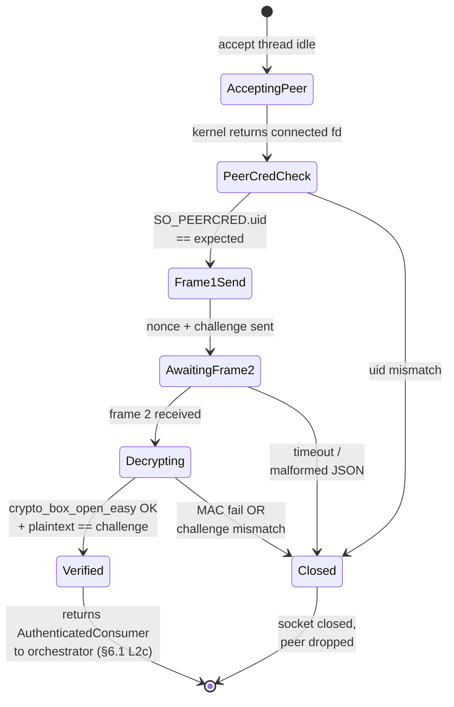
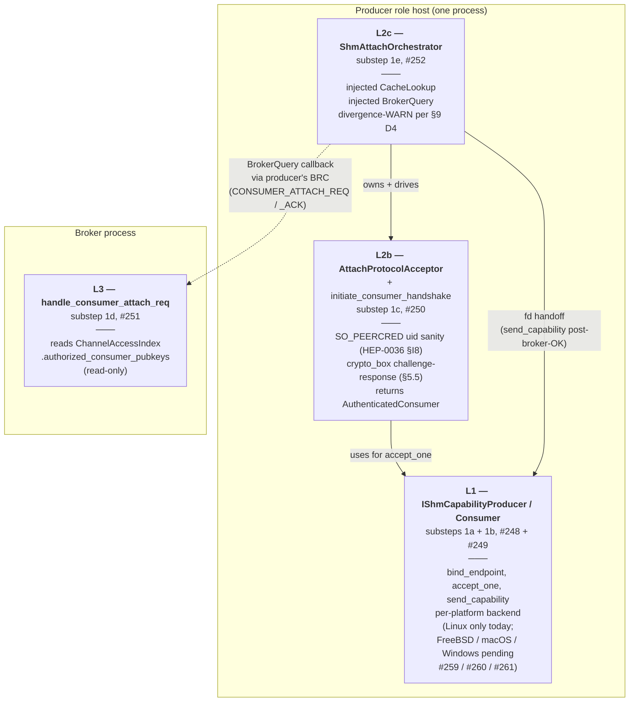
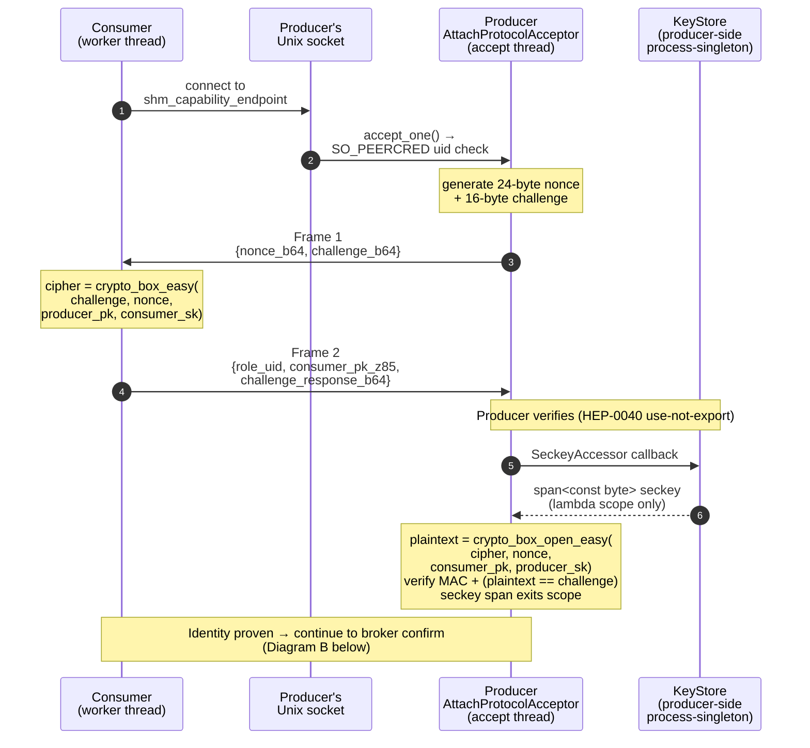
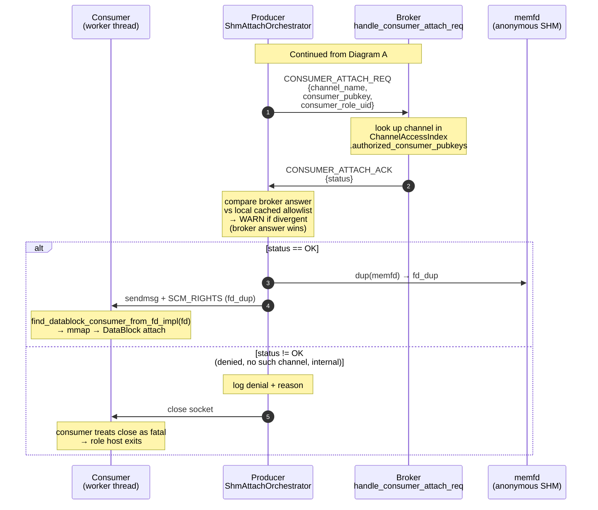

# HEP-CORE-0041: SHM Channel Auth (Cross-Platform)

| Property | Value |
|---|---|
| **HEP** | `HEP-CORE-0041` |
| **Title** | SHM Channel Auth — Capability Transport + Pre-Confirm Admission |
| **Transport scope** | **SHM data plane ONLY.**  ZMQ data plane is HEP-CORE-0036.  A reader hunting for ZMQ-side auth should route to HEP-0036 instead.  Shared concepts (PeerAllowlist, identity keys, broker authorization) are owned by HEP-0036; HEP-0041 reuses them — see §8 authority chain. |
| **Status** | 🟢 **DESIGN FINAL; PHASE 1 IN FLIGHT** — substeps 1a-1h ✅; 1i-mig-1/2a/2b-1/2b-2/2c/M3/3 ✅ (TX side complete on both producer + processor); **pre-REVIEW-A cluster #266/#267/#268/#269/#279 ALL ✅** (M3.5 + doc-sync + producer hardening + consumer_attach scope + Mechanism enum widening — shipped 2026-06-22); **REVIEW-A ✅ closed 2026-06-22** (4 angles parallel review; 4 blockers → close-out commit; 1 HIGH BRC UAF finding tracked as #280 + blocks #272); 1i-mig-4 (consumer dial) ⏸ NEXT (D1-D4 designer decisions locked); 1i-mig-5 + 1i-cleanup + 1j + 1k + #262 ⏸.  Five REVIEW-A..E milestones bracket the remaining chain.  Live tracker at §10.1. |
| **Created** | 2026-06-16 |
| **Last revised** | 2026-06-22 — **§10.1 expanded with live sub-status for 1i-mig + REVIEW-A..E milestone schedule**: 1i-mig-1/2a/2b-1/2b-2/2c review fixes/2c M3/3 shipped with commit shas; new sub-substeps 1i-mig-M3.5 (`prepare_tx_capability_` promotion), 1i-doc-sync, 1i-prod-hardening, 1i-api-scope filed as #266-#269 from the 2026-06-22 systematic review reconciliation; 1i-mig-4 (consumer dial) scope inlined; 1i-cleanup Core-Structure-Change-Protocol note added; five fixed REVIEW-A..E milestones bracketing remaining Phase 1 work.  Prior revision 2026-06-18 — §5 + §6 + §7 + §10 + §11 + §12 + §13 macOS resynced against shipped code: bearer-token model in §5 replaced by the actual `crypto_box` challenge-response + `CONSUMER_ATTACH_REQ` pre-confirm; §6 strawman code replaced by L1/L2 split as shipped (with verbatim interfaces from headers); §7 compatibility list rewritten to match the substep chain; §10 gained substep-level §10.1 status table; §11 + §12 status updated for what's shipped vs pending; §13 macOS corrected (`SHM_ANON` is FreeBSD-only, not macOS — backend uses `shm_open`+immediate-`shm_unlink` trick).  Prior revision 2026-06-17 — §9 D4 attach sequence amended for crypto_box (substep 1c).  Prior revision 2026-06-16 — promoted from tech_draft. |
| **Tracker** | task **#244** (umbrella); per-phase tasks under §10 |
| **Sibling docs** | HEP-CORE-0036 (ZMQ Auth — symmetrizes to pre-confirm via task #246); HEP-CORE-0002 (DataBlock — consumes capability abstraction); HEP-CORE-0040 (Locked Key Memory — backing for any role-level encryption); HEP-CORE-0038 (script vault — sibling for script audience); HEP-CORE-0011 (script-engine parity — applies to #247 follow-up) |
| **Filed by** | discussion 2026-06-16 after AUTH-4 (#164) gap analysis surfaced the structural weakness of "secret as discriminator" + POSIX `0666` default |
| **Cross-platform constraint** | MUST work on Linux + FreeBSD + macOS + Windows |
| **Closes** | **#164** (AUTH-4 — superseded; `shm_secret` retires under D1+D7), **#79** (SHM seed in `--init` — superseded with #164) |
| **Does NOT block** | task **#245** (POSIX 0666 → 0600 interim hardening — can ship independently if needed before Phase 1, becomes moot once capability transport ships) |

> The structure mirrors HEP-CORE-0036 deliberately so a reader can
> compare the SHM model side-by-side with the ZMQ model.  All §9
> design decisions were locked during the 2026-06-16 discussion; the
> `[DECISION:]` markers that previously punctuated the body are now
> answered in the §9 table.

---

## 1. The gap (why this exists)

### 1.0 Glossary (for fresh readers)

Quick definitions of terms that recur throughout this HEP.  A reader
unfamiliar with the codebase can skim this and follow the rest.

- **Capability transport** — sending an OS file descriptor (POSIX) or
  HANDLE (Windows) directly to a peer process so the peer can map the
  same kernel object.  The fd/HANDLE IS the access token: only holders
  can map; non-holders cannot, because there's no name to look up.
  See §3.1.
- **`shm_capability_endpoint`** — the producer's Unix-socket address
  (Linux/FreeBSD/macOS) or named-pipe name (Windows) where consumers
  connect to perform the attach handshake and receive the SHM fd.
  **NOT** the SHM data location (the SHM mapping is anonymous; it has
  no name).  Format on Linux: `unix://${XDG_RUNTIME_DIR}/pylabhub/shmcap-<channel>.sock`.
- **Discriminator** — a token used to detect collisions and stale
  connections.  NOT an access control mechanism.  In §1.2 we explain
  why the retired `shm_secret` was at best a discriminator.
- **SeckeyAccessor** — a callback-of-callback type defined in HEP-0040
  §8.5.1 that lets code USE a secret key without taking a copy of it.
  Caller invokes `accessor(use_seckey)`; the accessor looks up the key
  and invokes `use_seckey(span<bytes>)`; the bytes are valid only inside
  that inner lambda.  See §5.5 + HEP-CORE-0040 §5 + §8.5.1.
- **PeerAllowlist** — the broker-maintained set of consumer pubkeys
  authorized for a channel.  Defined by HEP-0036 §4.1
  (`ChannelAccessIndex.authorized_consumer_pubkeys`); consumed by
  HEP-0041's `CONSUMER_ATTACH_REQ` pre-confirm.  See §8 authority chain.
- **`AttachProtocolAcceptor`** — the per-connection auth state machine
  on the producer side that runs the `crypto_box` challenge-response
  with one consumer.  Per-connection; no broker traffic.  See §5.5 + §6.4.
- **`ShmAttachOrchestrator`** — the producer's per-channel coordinator
  that owns the accept loop, drives the `AttachProtocolAcceptor`,
  queries the broker via `BrokerQuery` callback, and sends the fd on
  approval.  Runs on the role host's `ThreadManager` accept slot.
  See §6.1 + §6.4.
- **Divergence WARN** — the producer compares broker's pre-confirm
  answer against its local cached allowlist; if they disagree, it
  logs a `WARN` (NOT a hard error).  The broker's answer always
  wins.  Divergence rate is a notification-pipeline health metric.
  See §9 D4 "cached-allowlist semantics".
- **`memfd`** — Linux's anonymous SHM primitive.  `memfd_create()`
  returns an fd to a kernel-resident mapping with no filesystem path.
  Other platforms have equivalents (`SHM_ANON` on FreeBSD,
  `shm_open`+immediate-`shm_unlink` trick on macOS, anonymous
  `CreateFileMapping` on Windows).  See §3.1 + §13.

---

### 1.1 What works today on ZMQ transport (HEP-CORE-0036)

- **Layer 1 (control plane)** — BRC CURVE+ZAP authenticates the role to the broker.  Outsider on the wire sees ciphertext; outsider not in `known_roles[]` is rejected at handshake.
- **Layer 2 (channel scope)** — broker validates REG_REQ against channel ACL.  An authenticated role is only admitted to channels it's permitted on.
- **Layer 3 (data plane)** — role's data ROUTER CURVE-server enforces the per-peer allowlist locally.  Even if an outsider somehow learns the data endpoint, the per-peer CURVE handshake against the role's ZAP cache rejects them.

Three layers, each enforced by a kernel-level mechanism that doesn't rely on operator umask or shell hygiene.

### 1.2 What today's SHM does

- **Layers 1+2**: same as ZMQ (broker-side admission).  ✅
- **Layer 3 — DOESN'T EXIST FOR SHM.**

The role's SHM channel data lives at `/dev/shm/<name>` (POSIX) or in a kernel named-object (Windows).  The `shm_secret` was designed as a Layer-3 gate, but it is **not actually one**:

- The secret is stored **plaintext in the first 8 bytes of the SHM header** (`data_block.cpp:445-449`).
- POSIX `kShmModeRw = 0666` defaults the file to `0644` after typical umask → **world-readable on the host**.
- Any non-root user with shell access can `ls /dev/shm/`, `shm_open(name, O_RDONLY)`, `mmap`, and read both the secret AND the channel data.
- The secret is therefore a **discriminator** (helps detect cross-channel name collisions and stale connections), not an access control.

Windows is slightly better by default (DACL inherited from the creator's token, no world-readable equivalent), but cross-user same-host on Windows is still effectively unguarded unless we set an explicit DACL.

### 1.3 Production-readiness gap

> A consumer should be able to read SHM channel data IF AND ONLY IF the
> broker has authorized it for that channel.

Today's code does not enforce this on any platform.  Operator umask is the *only* line of defense on POSIX; default umask makes the data world-readable.  This is unacceptable for a scientific data acquisition framework intended to handle potentially sensitive experiments.

---

## 2. Threat model

Explicitly enumerated so the design choices below can be argued against it.

Reading the "In scope to defeat?" column:
- **YES** — this HEP is designed to defeat this threat.
- **NO** — out of HEP-0041's scope (either always-loses, e.g. root, or different layer's problem, e.g. network).
- **PARTIAL** — defended in some aspects; relies on a sibling subsystem (e.g. script sandboxing) for the rest.
- **OPTIONAL** — operator chooses by selecting a higher option tier
  (e.g. Option C encryption-at-rest defeats T6).  Default ships without it.

| # | Threat | In scope to defeat? | Mechanism |
|---|---|---|---|
| T1 | Network attacker (off-host) | YES | SHM is local; process isolation. Already defeated. |
| T2 | On-host attacker, different EUID, shell access, no privilege escalation | **YES** | The core target of this HEP. |
| T3 | On-host attacker, **same EUID** as the role process | NO | Same-EUID = same trust domain on POSIX. Process isolation can't help; out of scope. |
| T4 | Root / Administrator on the host | NO | Always wins. Out of scope. |
| T5 | Compromised script inside the role process | PARTIAL | Script-side observability rules (HEP-0036 §I11 — scripts never see the secret) apply.  Encryption/capability can't help if the script controls the role; rely on script sandboxing. |
| T6 | Cold-storage attacker who acquires `/dev/shm` contents post-mortem | OPTIONAL | Defeated by Option C (encrypt-at-rest).  Otherwise out of scope. |
| T7 | Kernel-memory snoop | NO | Out of scope; requires kernel-level mitigations. |
| T8 | Side-channel (cache timing, memory contention) | NO | Out of scope. |

**Primary target: T2** — different-EUID outsider on the same host.  This is the threat that the current design fails to defeat.

---

## 3. Mechanism options

Four options, with trade-offs.  **[DECISION needed: which one ships as default?]**

### 3.1 Option A — Capability via anonymous mapping + handle transfer

The producer creates a **nameless** mappable region.  No filename, no kernel-object-name, nothing to enumerate or probe.  The producer then sends the **OS-level handle** to the mapping to authorized consumers via an OS-specific IPC mechanism.  Consumer maps the received handle directly.

- **Outsider cannot enumerate** the region — there's no name.
- **Outsider cannot open** it — without the handle, no access.
- **The handle IS the capability.**  Whoever has it can access; whoever doesn't can't.
- Broker mediates the handle transfer (or authorizes a direct role-to-role handoff).

| OS | Anonymous source | Handle transfer |
|---|---|---|
| Linux | `memfd_create()` | Unix socket + `SCM_RIGHTS` ancillary data |
| FreeBSD (≥13) | `memfd_create()` | Unix socket + `SCM_RIGHTS` |
| FreeBSD (<13) | `shm_open(O_CREAT)` + `shm_unlink` immediately | Unix socket + `SCM_RIGHTS` (the unlinked fd survives) |
| macOS/Darwin | `shm_open(name, O_CREAT\|O_EXCL\|O_RDWR, 0600)` + immediate `shm_unlink(name)` (fd survives the unlink; name disappears from kernel namespace — same trick as FreeBSD <13).  ⚠ `SHM_ANON` is **FreeBSD-only**; macOS lacks it (corrected 2026-06-18 — see §13). | Unix socket + `SCM_RIGHTS` |
| Windows | `CreateFileMapping(INVALID_HANDLE_VALUE, ..., NULL)` — name=NULL → anonymous | Named pipe + `DuplicateHandle` (target process must be reachable for `OpenProcess`) |

**Pros:**
- Cleanest security: capability model, no name to leak, no secret to manage.
- Defeats T2 by construction across all four platforms.

**Cons:**
- Per-consumer handle transfer adds a Unix socket / named pipe step at consumer-register time.
- Broker becomes a handle-passing relay (or authorizes a direct producer-to-consumer Unix socket).
- Windows path is significantly different (needs `OpenProcess` rights between producer and consumer); deployments where producer and consumer are in different Windows desktops or service contexts may need special handling.

> 📌 **Phase 1 ships Option A only** (per §9 D1 decision).  Options B, C,
> and D below were considered during the 2026-06-16 design discussion
> and are documented here for archaeology + as enhancement paths
> available to future phases.  **Do not treat §3.2 / §3.3 / §3.4 as
> the implementation plan.**  The locked decision and the substep
> chain (1a-1k) only address Option A's capability-transport model.

**fd ownership lifecycle (Option A, POSIX).**  Worth visualizing once
because every later section refers to "the fd" as if there's only one
— there are several distinct kernel objects.  The producer's original
fd, the dup'd fd it sends, and the fd the consumer ends up with are
all separate kernel handles pointing at the same anonymous mapping.
The kernel refcounts; the mapping disappears when the last handle
closes.

```mermaid
sequenceDiagram
    participant P as Producer
    participant K as Kernel
    participant C as Consumer

    Note over P,K: 1. Channel open — producer creates anon SHM (once per channel)
    P->>K: memfd_create() → fd_orig
    P->>K: ftruncate(fd_orig, size)
    P->>K: mmap(fd_orig, ...) → ptr_p
    Note over P: producer holds fd_orig + ptr_p<br/>for the channel lifetime

    Note over P,C: 2. Per consumer attach (after §5.5 crypto proof + §9 D4 broker confirm)
    P->>K: dup(fd_orig) → fd_dup
    P->>C: sendmsg + SCM_RIGHTS (fd_dup)
    Note over P: producer closes its copy of fd_dup;<br/>kernel keeps the fd live for the consumer

    C->>K: recvmsg → fd_consumer<br/>(kernel-assigned descriptor)
    C->>K: mmap(fd_consumer, ...) → ptr_c
    Note over C: consumer holds fd_consumer + ptr_c<br/>for the channel lifetime

    Note over P,C: 3. Teardown — each side independently
    C->>K: munmap(ptr_c); close(fd_consumer)
    P->>K: munmap(ptr_p); close(fd_orig)
    Note over K: kernel refcount → 0;<br/>anon mapping freed
```

Each kernel handle is independent — closing one does NOT close another.
The Windows variant has the same shape with `CreateFileMapping(NULL)`
+ `DuplicateHandle` instead of `memfd_create` + `SCM_RIGHTS`.

### 3.2 Option B — Named SHM + 0600 + per-consumer ACL grant

Producer creates `/dev/shm/<random_name>` with mode 0600.  Broker tells producer the consumer's EUID at REG_REQ-accept time.  Producer adds an ACL grant for that EUID.

| OS | Name | Per-consumer grant |
|---|---|---|
| Linux | `shm_open(..., 0600)` | `setfacl -m u:<consumer_uid>:rw` on `/dev/shm/<name>` |
| FreeBSD | `shm_open(..., 0600)` | NFSv4 ACLs (less standardized than Linux POSIX ACLs) |
| macOS/Darwin | `shm_open(..., 0600)` | `chmod` only; no per-user ACL beyond owner/group/other |
| Windows | `CreateFileMapping(...)` with explicit DACL | DACL augmented via `SetSecurityInfo` |

**Pros:**
- Simpler than Option A on Linux + Windows (no fd-passing).
- Named API — familiar.

**Cons:**
- Name is still listed in `/dev/shm/` — outsider can enumerate even if they can't open.  Defeats T2 from *attaching* but not from *probing existence/size*.
- macOS lacks POSIX ACLs in the Linux sense — can only do owner/group/other.  Multi-consumer same-uid-only.
- ACL race: brief window between create + first ACL grant where the file is owner-only-still-readable.
- Dynamic membership: consumer joins/leaves → ACL update → race with consumer's `shm_open` retry.

### 3.3 Option C — Encrypt-at-rest in SHM slots

Data slots are AES-GCM-encrypted with a key derived from a broker-distributed secret.  Producer encrypts before commit; consumer decrypts after acquire.

- **Outsider with `mmap` access sees ciphertext** — defeats T2 AND T6 (cold storage).
- Channel name + size still observable, but data confidentiality holds.

**Pros:**
- True confidentiality.  Survives even if mode bits / DACL fail.
- Defeats T6 (cold-storage attacker) — a unique strength.

**Cons:**
- Per-slot crypto cost.  AES-GCM in software is ~1-3 GB/s on modern x86 with AES-NI.  For DAQ pipelines pushing 100s of MB/s of float32 samples, this is the gating cost.
- Defeats the *zero-copy* premise of SHM (consumer must touch every byte).
- Key management — see §4.

### 3.4 Option D — Hybrid: A as transport, C opt-in per-channel

- Default: Option A.  Capability transport handles access control.  No "secret" to manage, no rotation, just fd ownership.
- Per-channel `confidentiality = "encrypted"` config field: layers Option C on top.  Operator opts in for high-sensitivity channels where T6 matters or where defense-in-depth against same-EUID compromise is wanted.

**Pros:**
- Strong default (A defeats T2 cleanly).
- Opt-in C for high-sensitivity channels — accepts the CPU cost where it matters.
- No "one size fits all" — operators can rate each channel.

**Cons:**
- More moving parts in the codebase.
- Config story is more complex (`shm_secret` retires; new `confidentiality` field).

**[DECISION:]** Default to Option A or Option D?  My read: A for MVP, D as the documented enhancement path.  D's encryption work can be a follow-up HEP without changing A's interface.

---

## 4. Key / secret lifecycle — possibly always real-time

The user explicitly raised this: should the secret be generated and rotated in real time, or is a startup-time key sufficient?

Generation timing options, ranked by strength:

| Strategy | Producer generates… | Distributed via | Rotation | Strength |
|---|---|---|---|---|
| 0. Static-in-config | Once at config-write time | Disk (operator-managed) | Never | Today's broken model |
| 1. Per-process-startup | At producer process start | REG_REQ → REG_ACK over CURVE+ZAP BRC | On producer restart | Better |
| 2. Per-channel-open | At each channel-open | REG_ACK + CONSUMER_REG_ACK | On channel close+reopen | Better; minimizes blast radius of leak |
| 3. Per-consumer-session ephemeral | At each consumer attach | CONSUMER_REG_ACK; one unique key per consumer | Per consumer | Strong — leaked key only affects that one consumer |
| 4. Continuous rotation | Background rotation every N seconds; broker pushes via `CHANNEL_KEY_ROTATION_NOTIFY` | CURVE+ZAP BRC | Continuous | Strongest |

For **Option A (capability)** the "key" is the FD itself — there's no secret to generate.  Rotation = close + reopen the mapping.  The lifecycle questions are answered by FD lifetime semantics.

For **Option C (encryption)** the key matters and lifecycle is a real design choice:

### 4.1 Recommended scheme for Option C (encryption channels)

**[DECISION:]** Pick a level on this lifecycle ladder:

1. **MVP**: Strategy 2 (per-channel-open).  Producer mints a 256-bit AES key at channel-open via libsodium `randombytes_buf`.  Broker stores it in the channel access entry (`ChannelAccessEntry::shm_data_key`, replaces today's `shm_secret`).  Consumers receive it via `CONSUMER_REG_ACK.shm_data_key`.  Rotation only on channel reopen.
   - **Strength**: leaked key from one channel doesn't compromise another channel.
   - **Weakness**: a long-running channel uses one key for its lifetime.

2. **Phase 2**: Add Strategy 4 (continuous rotation) on top.  Background rotation every N seconds; broker pushes new key over `CHANNEL_KEY_ROTATION_NOTIFY` (mirror of the existing `CHANNEL_AUTH_CHANGED_NOTIFY` pattern).  Producer and all consumers switch atomically at the next slot boundary.  Two-key window during transition (slot encrypted with old key OR new key; consumer accepts either).
   - **Strength**: leaked key only compromises N seconds of past data.
   - **Cost**: complex synchronization at slot boundaries.  Worth it for sensitive channels.

3. **High-security mode**: Strategy 3 (per-consumer-session).  Each consumer's `CONSUMER_REG_ACK` carries a UNIQUE wrapped key.  Producer encrypts each slot with a "channel master key" but distributes it wrapped under each consumer's session key.
   - **Cost**: per-consumer key wrapping overhead at consumer-attach time.  Storage cost per consumer.  Probably not warranted for typical DAQ.

**My read**: ship MVP (Strategy 2).  File Phase 2 as a follow-up task.  Strategy 3 only if a specific deployment ever demands it.

### 4.2 Key derivation

Use HKDF (libsodium `crypto_kdf_*`) over the broker-distributed seed to derive:
- Slot-encryption key (AES-GCM)
- Slot-nonce derivation key (deterministic per (slot_index, generation))

**[DECISION:]** AES-GCM or ChaCha20-Poly1305?  AES-GCM is hardware-accelerated on modern x86 (AES-NI) — faster.  ChaCha20-Poly1305 is faster on platforms without AES-NI (some ARM) and constant-time by construction.  pyLabHub deployments are primarily x86 + ARM.  My read: ChaCha20-Poly1305 default; performance is comparable on modern x86 too.

### 4.3 Where the key lives

- **On broker**: `ChannelAccessEntry::shm_data_key` — `LockedKey` (HEP-CORE-0040), mlocked.
- **On producer**: in-memory derived key for the lifetime of the channel.  Should be `LockedKey`.
- **On consumer**: same shape as producer.
- **On disk**: NEVER.  No persistence.  All keys ephemeral.

This is a meaningful escalation from today's plaintext `uint64_t` everywhere.  Worth doing if encryption is in scope; pointless overhead if it isn't.

---

## 5. Wire protocol delta

> **Rewritten 2026-06-18 against shipped code.**  The original §5 described
> a bearer-token model (`consumer_authorization_token` signed by broker)
> that D5 retired under D4's pre-confirm pattern.  Substeps 1c (#250) +
> 1d (#251) shipped the actual wire shape; the description below matches
> what's in the code.  Substep 1g (#254) lands the doc + REG_ACK shape
> cleanup in lockstep with deleting the legacy `shm_secret` field.

If Option A (capability) ships as the default:

### 5.1 REG_REQ — what producer says

`shm_secret` field retires entirely.  Producer adds:

```json
{
  ...,
  "data_transport": "shm",
  "shm_capability_endpoint": "unix:///run/user/1000/pylabhub/shmcap-acquisition.sock"
}
```

**Endpoint URI shape (canonical).**  The producer obtains the
endpoint via `default_shm_capability_endpoint(channel)` which returns
the `unix://` URI form — `unix://${XDG_RUNTIME_DIR}/pylabhub/shmcap-<channel>.sock`
on systemd Linux hosts; `unix:///tmp/pylabhub-shmcap-<uid>-<channel>.sock`
fallback when `XDG_RUNTIME_DIR` is unset.  The URI is what travels
on the wire (REG_REQ above, CONSUMER_REG_ACK in §5.3); both producer
and consumer strip the `unix://` scheme prefix via the
`strip_unix_scheme()` helper before passing the bare filesystem path
to `sockaddr_un::sun_path`.

**`bind_endpoint` responsibilities (1i-mig-2c hardening).**  The L1
backend `MemfdProducer::bind_endpoint`:

1. Strip `unix://` scheme prefix from the URI.
2. `mkdir -p` the parent directory at mode 0700 (e.g.
   `${XDG_RUNTIME_DIR}/pylabhub/`).  Idempotent — no-op when the
   directory already exists.  systemd's `pam_systemd.so` provides
   `${XDG_RUNTIME_DIR}` at mode 0700; the `pylabhub/` subdirectory
   layered under it inherits the same isolation.
2.5. **Probe-then-unlink** (1i-prod-hardening H3d): before unlinking
   any stale socket file, attempt `connect()` to the path.  If a
   live producer is bound, refuse to clobber (return false).  Only
   when connect fails with `ECONNREFUSED` (stale socket) or
   `ENOENT` (no file) is the unlink+bind safe.
3. `socket(AF_UNIX, SOCK_STREAM | SOCK_CLOEXEC, 0)`, then `bind`,
   then `chmod(sock_path, 0700)`, then `listen(sock, 8)`.

**Producer wire-emission contract.**  The producer MUST publish the
endpoint string on REG_REQ for SHM channels.  The broker rejects
REG_REQ with `INVALID_REQUEST` when `data_transport == "shm"` and
`shm_capability_endpoint` is empty (1i-prod-hardening H3c, symmetric
with the `zmq_pubkey` requirement for ZMQ channels at §6.1).

**`data_transport` is REQUIRED (post-#281, 2026-06-23).**  The broker
MUST reject any REG_REQ where the `data_transport` key is missing or
where its value is empty / not one of `{"shm", "zmq"}` — `INVALID_REQUEST`.
This pre-dates and supersedes the §5.1 endpoint check above: the
broker validates `data_transport`'s presence + admissible value FIRST,
then runs the SHM endpoint check.  Pre-#281 the broker silently
defaulted absent `data_transport` to `"shm"`, which then tripped the
§5.1 endpoint check and produced a misleading diagnostic that pointed
at the missing endpoint rather than the actually-missing transport
declaration.  The strict check at the wire boundary routes the
malformed REG_REQ to the right diagnostic and removes a "missing
field" surface that test fixtures could accidentally rely on (the
issue that triggered #281 — Pattern4 fixtures with both transport
flags `false` produced a no-`data_transport`-key payload that the
broker silently mis-classified as SHM).  No `data_transport`-less
"protocol-only registration" mode exists on this wire.

### 5.2 REG_ACK — what broker tells producer

No new fields.  REG_ACK confirms admission; broker does NOT issue any
authorization material at this point (per D5: no bearer tokens).
Authorization happens later, per-attach, via `CONSUMER_ATTACH_REQ`
(§5.4 below).

### 5.3 CONSUMER_REG_ACK — what consumer receives

```json
{
  ...,
  "data_transport": "shm",
  "shm_capability_endpoint": "unix:///var/run/pylabhub/role-acquisition.daq01.prod/shm-cap.sock",
  "producer_pubkey_z85": "<40 Z85 chars>"
}
```

The consumer receives the producer's endpoint + the producer's pubkey
(needed for the consumer-side `crypto_box_easy` encryption in §5.5
frame 2).  No bearer token; the broker is consulted live by the
producer on each attach attempt — see §5.4.

### 5.4 CONSUMER_ATTACH_REQ — producer pre-confirms (HEP-0041 §9 D4)

Per D4's pre-confirm pattern, the producer queries the broker on every
attach attempt before sending the SHM capability fd.  Shipped under
substep 1d (#251); handler at `broker_service.cpp::handle_consumer_attach_req`.

Request from producer to broker:
```json
{
  "channel_name":      "lab.raw",
  "consumer_pubkey":   "<40 Z85 chars>",
  "consumer_role_uid": "consumer.daq01.uid0042",
  "role_uid":          "<producer's own role_uid>",
  "correlation_id":    "<optional>"
}
```

Reply (auth decision; `CONSUMER_ATTACH_ACK` envelope):
```json
{ "status": "success",  "channel_name": "...", "consumer_pubkey": "..." }
{ "status": "denied",   "channel_name": "...", "consumer_pubkey": "...",
  "denial_reason": "consumer_pubkey not in channel allowlist" }
```

Reply (protocol-level errors, `ERROR` envelope):
- `INVALID_REQUEST` — missing field.
- `CHANNEL_NOT_FOUND` — channel doesn't exist on the broker.
- `PRODUCER_NOT_AUTHORIZED` — caller `role_uid` is not a registered
  producer of the channel (defence in depth — never disclose another
  channel's auth state to a non-producer).
- `INTERNAL_ERROR` — HubState invariant broken (broker bug).

**"denied" is distinct from "error"**: producer-side cache-divergence
WARN logic (substep 1e, see §9 D4 cached-allowlist semantics) needs
to distinguish a clean broker "no" from a wire-level transport
failure.  Dispatcher special-case maps `(status=success | denied)` →
`CONSUMER_ATTACH_ACK`, others → `ERROR`.

### 5.5 Attach-time L2 handshake — `crypto_box` challenge-response

Per substep 1c (#250), the producer's Unix socket listener runs a
two-frame challenge-response with the connecting consumer to prove
the consumer holds the seckey for its claimed pubkey.

Frame 1 (producer → consumer, length-prefixed JSON, 4 KiB DoS cap):
```json
{ "protocol_version": "hep-0041-1",
  "nonce_b64":        "<24-byte crypto_box nonce, base64>",
  "challenge_b64":    "<16 random bytes, base64>" }
```

Frame 2 (consumer → producer, same framing):
```json
{ "protocol_version":         "hep-0041-1",
  "role_uid":                 "consumer.daq01.uid0042",
  "pubkey_z85":               "<40 Z85 chars>",
  "challenge_response_b64":   "<crypto_box_easy(challenge, nonce,
                                                 producer_pk,
                                                 consumer_sk), base64>" }
```

Producer verifies via `crypto_box_open_easy(cipher, nonce, consumer_pk,
producer_sk)`; MAC verification + recovered plaintext equality with
the issued challenge → cryptographic proof of `consumer_sk`
possession.  Same security property as ZMQ's CURVE handshake, using
the same Curve25519 keypairs (no separate Ed25519 signing key
needed).

The `crypto_box` model replaced an earlier "sign with CURVE seckey"
strawman that was cryptographically broken (CURVE seckeys are
Curve25519 ECDH keys, not signing keys; libsodium has no such
primitive).  See substep 1c implementation + §9 D4 amendment block.

**Known limitation.**  This handshake is one-way (consumer proves to
producer).  The symmetric direction — producer proves to consumer —
is tracked under task #262 (mutual-auth follow-up) before Phase 1
production-readiness.

**Per-connection state machine (one accept_one() call).**  The
`AttachProtocolAcceptor` runs a tight per-connection state machine
between accepting a socket and returning an `AuthenticatedConsumer` to
the orchestrator above.  Any failed transition closes the socket and
the consumer treats the close as fatal.



The state machine is one connection deep — concurrent attaches each
run their own copy on the same accept thread, serialized by the
single-threaded accept loop.

---

## 6. Cross-platform abstraction

> **Rewritten 2026-06-18 against shipped code.**  The original §6 mixed
> transport (anon shm + fd handoff) with auth (token validation) in a
> single `serve_one(SignedAuthToken)` method.  During substep 1a (#248)
> the design was refactored into an explicit **L1 / L2 split** —
> backends only know transport primitives; the auth orchestration is
> a separate layer that consumes L1 from above.  This eliminates
> per-backend duplication of auth logic when macOS / Windows ship.

### 6.1 Layering

Four layers, split between producer process and broker process.  The
producer owns L1 / L2b / L2c; the broker owns L3.  L2c is the entry
point — it owns + drives L2b, which uses L1, and calls L3 over the
producer's existing BRC channel.



**Ownership note (1i-mig-2c M3 extraction).**  Both `IShmCapabilityProducer`
(L1) and `AttachProtocolAcceptor` (L2b) + `ShmAttachOrchestrator` (L2c)
live as a three-pointer bundle on `RoleHostFrame` (the base class for
ProducerRoleHost + ProcessorRoleHost).  Producer + processor role
hosts inherit the bundle + the `spawn_shm_auth_listener_` helper
that builds L2b+L2c+spawns the accept thread on the role's
`ThreadManager`.  This makes the L2 setup byte-equivalent across
both role types — neither has any inline orchestrator-construction
code.

Reading the diagram: L2c is the orchestrator a developer wires up in
the role host; L2b is the per-connection auth state machine (§5.5);
L1 is the platform-specific transport.  The dashed arrow is a network
hop (ZMQ REQ/REP over the existing BRC channel) — every other arrow
is in-process C++ method dispatch.

### 6.2 Code structure (as shipped)

```
src/include/utils/security/
    shm_capability_channel.hpp       // L1 abstract interface
    attach_protocol.hpp              // L2b handshake (substep 1c)
    shm_attach_orchestrator.hpp      // L2c orchestrator (substep 1e)

src/utils/security/
    shm_capability_channel.cpp       // L1: per-platform backends
                                     //   (Linux working; others #error)
    attach_protocol.cpp              // L2b impl (Linux only)
    shm_attach_orchestrator.cpp      // L2c impl (Linux only)
```

D6 decision (`utils/security/`) ratified by the as-shipped placement
above; the proposed `shm_capability/` subdirectory was not needed —
single-file backends are clearer at current size.

### 6.3 L1 interface (verbatim from shipped header)

```cpp
class IShmCapabilityProducer {
public:
    struct AcceptedPeer {
#if defined(PYLABHUB_IS_WINDOWS)
        void          *peer_pipe_handle{nullptr};  // HANDLE (opaque)
        unsigned long  peer_pid{0};
#else
        int   peer_socket_fd{-1};
        pid_t pid{};
        uid_t uid{};
        gid_t gid{};
#endif
    };

    virtual bool bind_endpoint(const std::string& endpoint)        = 0;
    virtual std::optional<AcceptedPeer>
        accept_one(std::chrono::milliseconds timeout)              = 0;

#if defined(PYLABHUB_IS_WINDOWS)
    virtual bool send_capability(void* peer_pipe_handle,
                                 unsigned long peer_pid)           = 0;
#else
    virtual bool send_capability(int peer_socket_fd)               = 0;
#endif

    virtual std::span<std::byte> data()                            = 0;
    virtual size_t                size() const noexcept             = 0;

    /// Borrow the anonymous-SHM fd (NOT transfer ownership) — the
    /// caller passes this to `ShmQueue::set_shm_capability_fd` /
    /// `create_datablock_producer_from_fd_impl` so the producer-side
    /// DataBlock attaches against the SAME memfd the L1 transport
    /// just created.  The L1 instance keeps owning + closing the fd
    /// at dtor time; consumers of `borrow_fd()` MUST NOT close it.
    /// HEP-0041 §3.1 fd-ownership model.
    [[nodiscard]] virtual int borrow_fd() const noexcept           = 0;
};

class IShmCapabilityConsumer {
public:
    virtual std::span<std::byte> data()                            = 0;
    virtual size_t                size() const noexcept             = 0;

    /// Symmetric to the producer side — consumer borrows the fd it
    /// received via `SCM_RIGHTS` so `ShmQueue::set_shm_capability_fd`
    /// /  `find_datablock_consumer_from_fd_impl` can attach the same
    /// memfd.  Lifetime owned by the L1 consumer instance.
    [[nodiscard]] virtual int borrow_fd() const noexcept           = 0;
};
```

Per-platform `AcceptedPeer` variants: POSIX exposes the kernel-cred
triple; Windows exposes the pipe HANDLE (as `void*` to keep the public
header free of `<windows.h>` — matches `pylabhub::platform::ShmHandle`
in `plh_platform.hpp:152`).  `send_capability` similarly per-platform.

### 6.4 L2 interface (verbatim from shipped headers)

```cpp
struct ConsumerAuthMaterial {
    std::string    role_uid;
    std::string    pubkey_z85;
    SeckeyAccessor seckey_accessor;   // use-not-export per HEP-0040 §5.2
};

struct AuthenticatedConsumer {
    IShmCapabilityProducer::AcceptedPeer raw_peer;
    std::string                          consumer_role_uid;
    std::string                          consumer_pubkey_z85;
};

class AttachProtocolAcceptor {
public:
    AttachProtocolAcceptor(IShmCapabilityProducer& transport,
                           uid_t expected_uid,
                           SeckeyAccessor producer_seckey_accessor);
    std::optional<AuthenticatedConsumer>
        accept_one(std::chrono::milliseconds timeout);
};

std::optional<int>
initiate_consumer_handshake(const std::string& endpoint,
                            const ConsumerAuthMaterial& self,
                            const std::string& producer_pubkey_z85,
                            std::chrono::milliseconds timeout);

class ShmAttachOrchestrator {
public:
    using CacheLookup = std::function<bool(const std::string&)>;
    using BrokerQuery = std::function<std::optional<nlohmann::json>(
        const std::string& consumer_pubkey,
        const std::string& consumer_role_uid)>;
    enum class Outcome { Sent, DeniedByBroker, DeniedTransportFail,
                         HandshakeFailed, Timeout };

    Outcome accept_and_serve_one(std::chrono::milliseconds timeout);
};
```

### 6.5 Per-platform backend status

| Platform | L1 backend | L2b / L2c | Task |
|---|---|---|---|
| Linux     | ✅ Shipped (`memfd_create` + `SO_PEERCRED` + `SCM_RIGHTS`) | ✅ Shipped | #249, #250, #252 |
| FreeBSD   | ⛔ `#error` + design plan in .cpp                          | ⛔ `#error` | #259 |
| macOS     | ⛔ `#error` + design plan in .cpp                          | ⛔ `#error` | #260 |
| Windows   | ⛔ `#error` + design plan in .cpp                          | ⛔ `#error` | #261 |

---

## 7. Compatibility / migration

> **Updated 2026-06-18 against shipped code.**  The original §7 listed
> "renames" that didn't match what ended up being built (e.g.
> `ChannelAccessEntry::shm_secret` did not rename to
> `shm_capability_endpoint`).  The list below reflects what's actually
> happening across the substep chain.

**Substep 1d (#251, shipped):** broker handler for `CONSUMER_ATTACH_REQ`
added.  No fields removed yet — purely additive.

**Substep 1f (#253, in progress):** DataBlock gains an fd-based
producer/consumer ctor variant alongside the existing name-based path.
Both paths coexist briefly so production tests can migrate
incrementally.

**Substep 1g (#254, pending):** wire-shape clean break.
- Remove `shm_secret` from `CONSUMER_REG_ACK` (and from the wire-shape
  conformance helper).
- Finalize `CONSUMER_ATTACH_REQ` / `_ACK` shape in HEP-CORE-0007.
- Add `shm_capability_endpoint` + `producer_pubkey_z85` to
  `CONSUMER_REG_ACK` for SHM channels.

**Substep 1h (#255, pending):** config schema rejection of
`in_shm_secret` / `out_shm_secret`.  Producer init template stops
emitting the field.

**Substep 1i (#256, in flight; split per 2026-06-18 review — see §10.1
row for the live status):**

The original §7 1i description below enumerated DELETIONS only — that
plan was found by the 2026-06-18 pre-1i review to be incomplete: no
production code calls the new fd-source factories or the
`ShmAttachOrchestrator` yet, so a pure-deletion 1i would break SHM
channels.  1i is now split:

- **1i-mig** (production wiring, 5 sub-substeps documented in §10.1) —
  wires `IShmCapabilityProducer` + `ShmAttachOrchestrator` into the
  producer/processor role hosts (orchestrator accept thread owned by
  the role host's own `ThreadManager`, NOT a new lifecycle module);
  adds `ShmQueue` fd-source path; consumer-side dial lives in
  `RoleAPIBase::apply_consumer_reg_ack` (D2=a); switches production
  callers from the legacy name-based factories.
- **1i-cleanup** — then deletes the legacy machinery enumerated below.

The deletion list below stays accurate as the **1i-cleanup** scope:

- `ChannelAccessEntry::shm_secret` field.
- `ShmQueue::set_shm_secret` API + `apply_master_approval` SHM-secret
  branch.
- `broker_service.cpp:1956` hardcoded-zero secret mint.
- `data_block.cpp:445-449` plaintext secret stamp in the header.
- `data_block.cpp:2768-2777` memcmp "auth" check.
- The named-shm `shm_open` code path in `data_block.cpp`.
- `L2 test_hub_state.cpp` assertions pinning the old contract
  (lines 3593-3709).
- The `shared_secret` field in `SharedMemoryHeader`.

Recovery tool (`data_block_recovery.cpp`) is the one exception — it
operates on already-crashed segments offline, where the fd-source
memfd path doesn't apply.  Its legacy name-based callers stay; the
factories they call are moved to a recovery-only namespace as part
of 1i-cleanup so production callers can't accidentally regress to
the legacy path.

§10.1 substep 1i row is the live, authoritative description of the
in-flight scope + the open dependencies (PeerAllowlist availability
for SHM, `BrokerRequestComm::consumer_attach` callback shape for the
orchestrator's `BrokerQuery`, `AttachProtocolAcceptor` seckey access
via KeyStore).

**Substep 1k (#258, pending):** L4 end-to-end test on the new path.

**Backward compat: NONE planned** (per D7 clean-break decision).
Pre-this-HEP SHM channels are insecure by today's definition.
Pre-1.0 framework; clean breaks are accepted.  Coexistence of two
SHM mechanisms is a permanent maintenance liability the design
explicitly rejects.

---

## 8. What stays in HEP-CORE-0036

HEP-CORE-0036 stays as-is.  Cross-references added at:
- §3.5 (AUTH-gate principle) — note that the principle applies to SHM transport via HEP-CORE-0041; layering is symmetric.
- §5.6 (SHM in current diagrams) — replace with cross-reference to HEP-CORE-0041 §5.
- §6.4 (CONSUMER_REG_ACK shape) — SHM-side fields moved to HEP-CORE-0041 §5.3.
- §I6 (T1 resolution) — note SHM transport's HEP-0041 replaces the role of CURVE keypairs for SHM.

**Authority chain (concepts owned by HEP-0036 that HEP-0041
consumes).**  Some things named in this HEP have their definition +
mutation rules in HEP-0036; HEP-0041 reads but does not own them:

- **Control-plane symmetry** — defined in HEP-0036 **§3.6**.  The
  registration + NOTIFY flow is transport-agnostic; HEP-0041 only
  specifies the data-plane attach divergence (the `alt` branch).
  Any new control-plane field, new cache, or new authorization
  decision belongs in HEP-0036, not here.
- **Cache architecture + script-observable contract** — defined in
  HEP-0036 **§I11.1**.  The producer-side `allowlist_cache` is one
  cache, transport-agnostic; the script API + `on_allowlist_changed`
  callback are transport-agnostic.  HEP-0041's `CacheLookup`
  callback (§6.4) reads this same cache for divergence detection
  only — never as a load-bearing authorization signal.
- **`PeerAllowlist` / `ChannelAccessIndex`** — defined in HEP-0036
  §4.1.  Broker is the canonical writer (REG_ACK
  `initial_allowlist`, `CHANNEL_AUTH_CHANGED_NOTIFY`,
  `GET_CHANNEL_AUTH_REQ`).  HEP-0041 §9 D4 consumes it read-only via
  the producer-side `CONSUMER_ATTACH_REQ` pre-confirm.  No new
  mutation paths added in HEP-0041.
- **Identity verification (two-conditions gate)** — defined in
  HEP-0036 §3.5 / §I1.  HEP-0041's SHM attach satisfies the same gate
  via a different artifact (capability transport instead of `shm_secret`).
- **CHANNEL_AUTH_CHANGED_NOTIFY semantics** — defined in HEP-0036
  §6.5.  Producer-side cache update path is the same as for ZMQ;
  HEP-0041 just adds one new reader (the orchestrator's
  `CacheLookup` callback).
- **Role identity keypair semantics + KeyStore lookup name
  (`kRoleIdentityName`)** — defined in HEP-CORE-0040 §5.  HEP-0041's
  `crypto_box` handshake reuses the same Curve25519 keypair; no
  separate signing key is introduced.

---

## 9. Designer decisions

| # | Question | Decision (locked 2026-06-16) |
|---|---|---|
| **D1** | Which mechanism ships at framework level? | ✅ **Option A** (capability via anonymous mapping + handle transfer).  Encryption (Option C) is a ROLE-level concern; framework exposes uniform crypto primitives (key gen, mlocked key storage, AEAD encrypt/decrypt of memory block, HKDF) so any role that wants per-slot encryption can layer it on top of the capability transport.  Framework never manages encryption keys for channel data. |
| **D2** | Lifecycle strategy for encryption keys? | ⏭️ **Out of scope** — see D1.  Role decides its own key lifecycle using framework primitives.  Recommended patterns documented separately (e.g., per-channel-open key, optional continuous rotation) but the framework does not enforce. |
| **D3** | AES-GCM vs ChaCha20-Poly1305? | ⏭️ **Out of scope** — see D1.  Framework's AEAD primitive defaults to ChaCha20-Poly1305 (libsodium `crypto_aead_chacha20poly1305_*`) since it's constant-time without hardware support; a single helper, roles choose to use it or not. |
| **D4** | How does the producer admit a consumer? | ✅ **Pre-attach broker confirmation on every attempt.  No cached fast-path.  Cached allowlist becomes observability only.** Producer ALWAYS queries broker via BRC before sending the fd; broker checks `authorized_consumer_pubkeys` against current state and replies success/denied.  Cache + broker answer COMPARED — divergence → WARN log, broker's answer always wins.  Drift window is eliminated; revocation of established connections retains HEP-0036 §3 "no force-close" semantic (entry gate is the tight control point).  **ZMQ symmetrizes via task #246** (HEP-CORE-0036 amendment). |
| **D5** | Bearer-token format? | ⏭️ **Moot under D4** — pre-confirm pattern replaces bearer tokens.  Producer queries broker by `consumer_pubkey` directly; broker is the live authority.  No token signing, no expiration logic needed. |
| **D6** | Module home for new code? | ✅ **`utils/security/shm_capability/`** — sits alongside `key_store`, `zap_router`, `peer_admission`, `curve_keypair`, etc.  Communicates the security-mechanism role; physical-layer SHM (DataBlock, slot ops) stays in `utils/shm/` and consumes the capability abstraction. |
| **D7** | Backward compat with existing `shm_secret` configs? | ✅ **Clean break.**  Single unified mechanism, no parallel paths.  `in_shm_secret` / `out_shm_secret` config fields retire (schema validation rejects them as unknown).  `ChannelAccessEntry::shm_secret` field removed; replaced by capability endpoint registration.  Demo configs under `share/` updated.  No deprecation period.  Framework is pre-1.0; clean breaks are accepted; coexistence of two SHM mechanisms is a permanent maintenance liability we explicitly reject. |
| **D8** | Public-API exposure of framework crypto primitives (AEAD / KDF / random / LockedKey)? | ✅ **Yes for native (C++) consumers via `PYLABHUB_UTILS_EXPORT`.**  New AEAD + KDF wrappers added to `crypto_utils.hpp` next to existing `generate_random_*` exports.  Costs nothing extra over internal-use scope; benefits native plugin developers and external tooling that links `pylabhub-utils`.  Script-accessible variant (Python / Lua / Native plugin engines via `api.crypto.*`) deferred to a sibling task — see §13. |

### D4 attach sequence (detail)

> **Amended 2026-06-17 (substep 1c implementation).** Steps 2 and 7's "signed_nonce" mechanism was cryptographically broken — CURVE keypairs are Curve25519 (for ECDH), not Ed25519 (for signing), so "signature over a nonce with a CURVE seckey" is not a standard libsodium operation.  Replaced with a two-frame `crypto_box`-based challenge-response using the same CURVE keys (Curve25519 + xsalsa20poly1305 — `crypto_box_easy` / `crypto_box_open_easy`).  The MAC of `crypto_box_easy(challenge, nonce, producer_pk, consumer_sk)` is keyed by `ECDH(consumer_sk, producer_pk)`; successful `crypto_box_open_easy` under `(consumer_pk_from_hello, producer_sk)` proves the cipher was produced by the holder of `consumer_sk` corresponding to `consumer_pk`.  Same security property as ZMQ's CURVE handshake.  See `src/utils/security/attach_protocol.cpp` + `tests/test_layer2_service/test_attach_protocol.cpp::RejectsConsumerWithWrongSeckey`.

1. Consumer connects to producer's Unix socket / named pipe.
2. Producer sends frame 1 (length-prefixed JSON): `{protocol_version, nonce_b64, challenge_b64}` — 24-byte `crypto_box` nonce + 16 random challenge bytes.
3. Consumer encrypts the challenge under its seckey targeting the producer's pubkey:
   `cipher = crypto_box_easy(challenge, nonce, producer_pk, consumer_sk)`.
   Sends frame 2 (length-prefixed JSON): `{protocol_version, role_uid, pubkey_z85, challenge_response_b64}`.
4. Producer reads `SO_PEERCRED` (POSIX) / `GetNamedPipeClientProcessId` (Windows) as a defence-in-depth sanity check (peer must be in the expected trust domain).  Validates the hello shape, decodes the consumer's claimed pubkey from Z85, decrypts:
   `plaintext = crypto_box_open_easy(cipher, nonce, consumer_pk_from_hello, producer_sk)`.
   MAC verification + `plaintext == challenge` → cryptographic proof complete.
5. **Producer sends `CONSUMER_ATTACH_REQ {channel_name, consumer_pubkey, consumer_role_uid}` to broker over its BRC.**
6. Broker checks `authorized_consumer_pubkeys` for the channel.  Replies `CONSUMER_ATTACH_ACK {status: success | denied}`.
7. Producer compares broker's answer against its local cached allowlist:
   - **Agree (success+in-cache, OR denied+not-in-cache)**: silent.  Normal path.
   - **Diverge (success+not-in-cache OR denied+in-cache)**: log `WARN` — broker comm health signal — broker's answer wins.
8. Success → producer sends fd via `SCM_RIGHTS` (POSIX) or `DuplicateHandle` (Windows).  Denied → producer drops the connection.

#### D4 — Diagram A: crypto handshake (steps 1-4)

The first half of an attach event — the producer and consumer prove
identity to each other (consumer→producer only in Phase 1; mutual
follow-up in #262).  No broker traffic yet.  No fd transfer yet.



#### D4 — Diagram B: broker pre-confirm + fd handoff (steps 5-8)

The second half — the producer asks the broker whether this consumer
is authorized for this channel, compares the answer against its local
cache (observability, not load-bearing), then sends the fd via
`SCM_RIGHTS` on approval or drops the connection on denial.



For the per-status error vocabulary (`INVALID_REQUEST`,
`CHANNEL_NOT_FOUND`, `PRODUCER_NOT_AUTHORIZED`, `INTERNAL_ERROR`) and
the L3 logging contract, see `docs/IMPLEMENTATION_GUIDANCE.md` §"SHM
Channel Auth attach errors".

**Mutual-auth gap.**  The current flow proves consumer→producer identity but does NOT prove producer→consumer (a same-UID process could bind the published endpoint and impersonate the producer to a connecting consumer).  Task #262 tracks adding producer-side proof-of-possession (likely as a 3rd frame: producer echoes a consumer-supplied challenge encrypted under producer_sk) before declaring Phase 1 production-ready.

### D4 cached-allowlist semantics

> **Cache identity + write paths are defined in HEP-CORE-0036 §I11.1.**
> This section only adds the divergence-WARN semantics that are
> specific to SHM's BrokerQuery-per-attempt enforcement model.  The
> cache the orchestrator's `CacheLookup` callback reads IS the
> `RoleAPIBase::allowlist_cache` that `api.allowed_peers(channel)`
> returns to scripts — same source of truth, observability only on
> the SHM path.

The producer's cache is maintained by the same `CHANNEL_AUTH_CHANGED_NOTIFY` doorbell + `GET_CHANNEL_AUTH_REQ`/`_ACK` pull pattern as ZMQ today, but its role flips from **load-bearing** to **observability**:

| Cache vs broker | Meaning | Action |
|---|---|---|
| Both say allowed | Healthy | No log |
| Both say denied | Healthy | No log |
| Broker allowed, cache says no | Producer missed a NOTIFY add | WARN; admit; investigate NOTIFY pipeline if frequent |
| Broker denied, cache says yes | Producer missed a NOTIFY remove | WARN; deny; investigate NOTIFY pipeline if frequent |

Sustained divergence rate = broker-NOTIFY-pipeline health metric.  Operators monitor this one signal.

---

## 10. Implementation phasing (locked at D1 + D4)

1. **Phase 1 — Abstract interface + Linux `memfd_create` backend + broker `CONSUMER_ATTACH_REQ` handler.** Strongest platform first.  Production roles on Linux can use capability transport with pre-confirm.  Tests pin the divergence-WARN behavior.
2. **Phase 2 — macOS backend** (anon shm via `shm_open` + immediate `shm_unlink` trick + `SCM_RIGHTS`; see §13).
3. **Phase 3 — Windows backend** (`CreateFileMapping(NULL) + DuplicateHandle` via named pipe).
4. **Phase 4 — Framework AEAD/KDF/key-storage primitives.** Cross-platform via libsodium.  No SHM-specific work — these are general crypto primitives that roles can use for any purpose (channel data encryption being one such use case).
5. **Phase 5 — HEP-CORE-0036 amendment (task #246):** retrofit ZMQ to the same pre-confirm pattern.  Lands AFTER Phase 1 establishes the pattern.

Each phase is its own task and commit cluster.  Phase 1 is the production-readiness gate.

### 10.1 Phase 1 substep chain (live tracker in `docs/todo/AUTH_TODO.md`)

Phase 1 ships as 11 substeps + cross-platform structural + follow-ups:

| Substep | Task | Status | Brief |
|---|---|---|---|
| 1a | #248 | ✅ | Abstract `IShmCapabilityProducer`/`Consumer` skeleton |
| 1b | #249 | ✅ | Linux `memfd_create` + `SCM_RIGHTS` backend |
| 1c | #250 | ✅ | `AttachProtocol` `crypto_box` challenge-response |
| 1d | #251 | ✅ | Broker `CONSUMER_ATTACH_REQ` / `_ACK` handler |
| 1e | #252 | ✅ | `ShmAttachOrchestrator` + divergence-WARN |
| 1f | #253 | ✅ | DataBlock fd-source ctors + `create_datablock_producer_from_fd_impl` / `find_datablock_consumer_from_fd_impl` factories + `datablock_layout_total_size` public sizing accessor; producer/consumer `IShmCapability*::borrow_fd()`; L2 test pin (in-process round-trip + ShmCapability end-to-end + under-sized fd throw); post-ship review fixed an fd-leak (try/catch around `init_producer_state_` in fd-source Create ctor), the `dup → 0` edge case (`F_DUPFD_CLOEXEC` minimum-fd-1), and a stale L3 log-pin |
| 1g | #254 | ✅ | Wire-shape additive (no removal — `shm_secret` was never on the wire): `default_shm_capability_endpoint(channel)` helper (Linux XDG_RUNTIME_DIR → `/tmp` fallback); `ProducerEntry::shm_capability_endpoint` field + `set_producer_shm_capability_endpoint` setter; `ProducerRegInputs::shm_capability_endpoint` field; `build_producer_reg_payload` emits `data_transport="shm"` + `shm_capability_endpoint` for SHM channels; producer + processor role hosts populate the field; broker REG_REQ handler extracts and stores it; broker `CONSUMER_REG_ACK` builder echoes `shm_capability_endpoint` + `producer_pubkey_z85` (sourced from `ProducerEntry::zmq_pubkey`) for SHM channels; consumer-side `apply_consumer_reg_ack` logs `ShmCapabilityFieldsReceived` (plumb-only — actual dial happens in 1i when the legacy named-shm path retires); `hub_state_json.cpp` includes the new field in the admin dump; cross-factory mixing-hazard docstring on the fd-source factories |
| 1h | #255 | ✅ | Config schema rejection — `reject_retired_keys` in `role_config.cpp` fires BEFORE the generic unknown-key check with a HEP-CORE-0041-referenced migration message; producer init template comment updated; L2 `RetiredShmSecretKeysRejected` test pins the throw + message shape; 6 demo configs scrubbed (`py-demo-single-processor-shm/{processor,producer}.json`, `py-demo-lua-single-hub/processor.json`, `py-demo-dual-hub-processor/{producer,consumer,processor}.json`); the 4 prior L2 translation tests that pinned the non-zero round-trip have been converted to ignore the now-rejected field.  Runtime residue (`shm_config.hpp:41` reader, `hub_shm_queue.cpp:379-389` artifact extractor, `ChannelAccessEntry::shm_secret` field, `data_block.cpp` plaintext-stamp + memcmp) is dead code post-rejection and deleted in 1i (#256) |
| 1i | #256 | 🚧 | **In progress; split into 1i-mig (production wiring) + 1i-cleanup (delete legacy).**  Original §7 1i description (delete `ChannelAccessEntry::shm_secret` + `set_shm_secret` API + memcmp checks + named-shm path + etc.) is correct in spirit but enumerates DELETIONS only — would break SHM channels unless the new path is wired first.  See sub-status table below + REVIEW-MILESTONES schedule. |
|  | | | **Sub-status (live as of 2026-06-22):** |
|  | | ✅ | **1i-mig-1** (`e283a4ac`): `ShmQueue` fd plumbing — `set_shm_capability_fd` setter + `start()` fd-source branch + Standby-mode reader factory + secret/capability mutex guards.  L2 sweep green. |
|  | | ✅ | **1i-mig-2a** (`e5575329`): `TxQueueOptions::shm_capability_fd` field + `build_tx_queue` capability dispatch (Standby factory + fd plumbing + start). |
|  | | ✅ | **1i-mig-2b-1** (`31072b3e`): producer role host owns `IShmCapabilityProducer` L1 via `prepare_tx_capability_` hook; populates `tx_opts.shm_capability_fd` via `borrow_fd()`. |
|  | | ✅ | **1i-mig-2b-2** (`4bae7cfb`): producer wires `AttachProtocolAcceptor` + `ShmAttachOrchestrator` + accept thread on `api().thread_manager()` (peer slot per HEP-CORE-0031 §2 categorization; orchestrator runs the §9 D4 sequence). |
|  | | ✅ | **1i-mig-2c review fixes** (`78fc6b9d`): `strip_unix_scheme` helper (was missing; helper docstring referenced it as the bind-side contract); `bind_endpoint` creates parent dir at mode 0700 (helper's own docstring promised this; nobody did it); accept-loop per-iteration `try/catch` so one bad attach doesn't kill the listener.  +2 L2 regression pins (`BindAndDialAcceptUnixSchemeURI`, `BindCreatesMissingParentDirectory`). |
|  | | ✅ | **1i-mig-2c M3** (`8e05a821`): extracted SHM auth listener wiring onto `RoleHostFrame` — moved `shm_transport_/shm_acceptor_/shm_orchestrator_` (3-pointer bundle) + `cleanup_tx_capability_` default impl + new `spawn_shm_auth_listener_()` helper.  Producer drops the ~130 LOC orchestrator-setup block; reduced to one call.  Unblocks processor 1i-mig-3 as a small additive commit. |
|  | | ✅ | **1i-mig-3** (`6f31a346`): processor OUT-side SHM auth wiring — `prepare_tx_capability_` override (byte-equivalent to producer's; M3.5 candidate per #266 below) + single `spawn_shm_auth_listener_()` call in worker_main_.  No new SHM auth boilerplate. |
|  | | ✅ `e8e10738` | **1i-mig-M3.5** (#266): promoted `prepare_tx_capability_` to `RoleHostFrame` default impl; producer + processor both inherit; ~92 LOC saved net. |
|  | | ✅ `47fe4806` + this commit | **1i-doc-sync** (#267 + REVIEW-A close-out): HEP §5.1 (`strip_unix_scheme` + mkdir + probe-then-unlink contract), §6.1 (L2c→L1.send_capability edge + M3 3-pointer bundle note), §6.3 (`borrow_fd` interface), §9 D4 diagram `_RSP→_ACK`, sibling HEP-0036 §3.6/§I11.1 diagram rename, §4.1 ChannelAccessEntry historical annotation, NEW §I8.1 SO_PEERCRED anchor, HEP-0031 §4.3.2/§4.3.5 `shm_accept_loop` thread inventory.  Code-side: stale AUTH-4 comment scrubs (3 sites), non-Linux `#error` symmetry for L2c. |
|  | | ✅ `9c0947f1` | **1i-prod-hardening** (#268): H3a defer accept-thread spawn until after `wait_for_roles` + before `set_value(true)`; H3b `teardown_infrastructure_` on all 8 Step 6 early-returns (producer + processor); H3c broker REG_REQ rejects empty `shm_capability_endpoint` for SHM (1517 L2 + new test pin); H3d `bind_endpoint` probe-then-unlink (live-peer detection via connect probe, ECONNREFUSED/ENOENT-only stale-unlink — 2 new L2 regression pins). |
|  | | ✅ `0533102e` | **1i-api-scope** (#269): `RoleAPIBase::consumer_attach` annotated as FRAMEWORK-INTERNAL with 25-line doc block + audit pin (zero hits in `src/scripting/` verified 2026-06-22).  Option B — annotate not restructure — adopted per established RoleAPIBase convention. |
|  | | ✅ `56deb3ac` | **Mechanism enum widening** (#279): Option A — enum moved from `hub_zmq_queue.hpp` to `hub_queue.hpp`; `ShmCapability` added; `QueueReader::mechanism()` virtualized with `Uninitialized` default; `ZmqQueue::mechanism()` + `ShmQueue::mechanism()` override; `RoleAPIBase::queue_mechanism` uses polymorphic dispatch (no more `dynamic_cast<ZmqQueue*>`); Native ABI gains `PLH_MECHANISM_SHM_CAPABILITY 2` (additive — no version bump).  Cross-engine string "ShmCapability" reachable via Lua `api.queue_mechanism(side)`.  Sibling leak `is_shm_backed()` stays C++-internal (not script-visible). |
|  | | ✅ this commit | **REVIEW-A — milestone A.**  4-angle parallel multi-agent review fired 2026-06-22 after #266/#267/#268/#269/#279 landed.  Verified-OK: M3/M3.5 extractions zero residual copies; Mechanism enum fully wired; 8 H3b sites correct; §5.1/§6.1/§6.3/§9 D4 contracts match code; consumer_attach not script-bound.  4 blockers closed in this commit (B1 §10.1 status table flip, B3 Windows macro typo, B4 demo configs scrub × 10, EDGE-9 H3c empty-string tighten, DOC-CODE-3 L1 signed-nonce → crypto_box scrub).  1 HIGH finding deferred to its own commit: **EDGE-2 BRC UAF window in shm_accept_loop** (tracked as #280 — adds `ctx.with_active_loop` bracket; blocks 1i-mig-4 #272).  Designer decisions D1-D4 for 1i-mig-4 captured in #272 description: fd ownership = `RoleAPIBase::Impl`; explicit SHM dispatch in apply_consumer_reg_ack (don't reuse apply_master_approval no-op); bounded retry on ECONNREFUSED (~10×100ms; closes H3a race); discrete-steps dial structure for #262 mutual auth 3rd-frame insertion. |
|  | | ⏸ | **1i-mig-4 (#256 sub-task)**: consumer dial in `RoleAPIBase::apply_consumer_reg_ack` — receive `shm_capability_endpoint` + `producer_pubkey_z85` from CONSUMER_REG_ACK; build `IShmCapabilityConsumer` via `attach_shm_capability_consumer`; run consumer half of §5.5 handshake; receive fd via SCM_RIGHTS; populate `RxQueueOptions::shm_capability_fd` (new field); add `build_rx_queue` capability-fd dispatch branch; decide fd-ownership site (designer call: RoleAPIBase Impl member vs ConsumerRoleHost member analogous to producer's `shm_transport_`).  ~150 LOC main change. |
|  | | ⏸ | **1i-mig-5 (#256 sub-task)**: cutover + test fixups — L3 worker fixtures that set `cfg.shared_secret` migrate to capability path; L2 mutex tests retire; verify all reachable production callers use capability. |
|  | | ⏸ | **REVIEW-B — milestone B.**  Full systematic review after 1i-mig-4+5 land.  Consumer dial is the largest single piece; this is the critical gate before legacy deletion. |
|  | | ⏸ | **1i-cleanup (#256 sub-task)**: delete the legacy machinery per the original §7 list + 2026-06-22 audit (`shm_config.hpp` dead reader + field, `hub_shm_queue.cpp` `set_shm_secret`/`apply_master_approval` SHM extractor/legacy `start()` branches/legacy factories, `data_block.cpp` plaintext stamp + memcmp + named-shm `find_datablock_*_impl`, `hub_state.hpp` `ChannelAccessEntry::shm_secret` field + `_on_channel_access_opened` 2nd param, `broker_service.cpp` hardcoded-zero call, L2 test fixtures pinning the dead field).  **MUST follow `docs/IMPLEMENTATION_GUIDANCE.md` § "Core Structure Change Protocol" for removing `SharedMemoryHeader::shared_secret[64]` — this triggers a layout-hash bump.**  Designer call on whether `data_block_recovery.cpp` keeps the field-shaped recovery roundtrip. |
|  | | ⏸ | **REVIEW-C — milestone C.**  Full systematic review after 1i-cleanup lands.  Confirms deletion is complete + nothing reachable from production + layout-hash bump consequences caught + recovery path still intact. |
|  | | ⏭ | **1i-coverage** (#270): **LAYER PIVOT 2026-06-25 — L2 contract verifications EMBEDDED inside #258 L4** (NOT dropped — only the test layer moved).  Initial implementation tried L2 coverage via `RoleHostFrameTestShim` (subclass of `RoleHostFrame` exposing protected `prepare_tx_capability_` + `spawn_shm_auth_listener_` + `cleanup_tx_capability_` as one-line forwards).  Shipped as `8716d91a` + `31b1d2af`; reverted same day as `e8ca91b5` after designer review surfaced the layering smell: the shim's `worker_main_` mirrored production's `teardown_infrastructure_` ordering, making it a **parallel production scaffold** rather than a test of production.  **Critical clarification:** the contracts these L2 tests were going to pin (transport bind, accept-loop spawn, LIFO teardown, no thread leak) are still required — they were dropped from the L2 layer because they can only be invoked correctly inside an L4 environment, NOT because they're unnecessary.  See #258 task description for the embedded L2 contract checklist with production marker names + source lines; #258 must grep each listed marker via `expect_log_sequence` against captured stderr.  Lessons captured: (i) deliberate producer-side asymmetry (RoleHostFrame owns SHM transport vs. RoleAPIBase owns consumer dial) is correct architecture, not a half-finished consolidation; (ii) "build a parallel production scaffold to test protected methods" is a test-faithfulness antipattern even when the scaffold is one-line forwards; (iii) for multi-process production code, the natural test unit IS the multi-process scenario, but **layer migration ≠ contract drop** — every contract the lower layer was going to test must be explicitly embedded as marker pins at the upper layer. |
| 1j | #257 | ⏸ | L3 broker tests (success / denied / divergence-WARN) |
| 1k | #258 | 🟡 scaffold | L4 end-to-end SHM auth-gated data flow — **MUST also embed the L2 contract verifications folded in from #270** (transport bind / accept-loop spawn / LIFO teardown / no thread leak via production marker grepping).  Full marker checklist with source lines in #258 task description.  **Scaffold landed 2026-06-25 as `tests/test_layer4_plh_hub/test_plh_hub_role_shm_e2e.cpp`** — helper infrastructure (`read_role_log` + `wait_for_role_marker` with file→stderr fallback), L4 SHM producer + consumer config writers (mirrors `share/py-demo-single-processor-shm` shape), Python scripts using production API (`api.log('info',...)`, `tx.slot.<field>`, `rx.slot.<field>`).  Producer's `event=ShmCapabilityTransportBound` (L2 marker contract #1) observed.  Two `TEST_F`s prefixed `DISABLED_` because REG_REQ flow not yet reaching broker — see file header `STATUS` block for the blocker analysis + next-step culprits to investigate. |
| REVIEW-D | — | ⏸ | **Milestone D.**  Full systematic review after 1j + 1k land.  Confirms test coverage actually pins the §9 D4 sequence + divergence-WARN semantics + end-to-end auth-gating.  Last review before mutual auth. |
| Cross-platform structural | #259/#260/#261 | ✅ | Per-platform `AcceptedPeer` variant + `#error` blocks for FreeBSD/macOS/Windows backends.  L2c `ShmAttachOrchestrator` is currently `#if defined(PYLABHUB_PLATFORM_LINUX)` with no `#error` fallback (silent class-doesn't-exist on non-Linux); add `#error` block symmetric with L1+L2b in **1i-doc-sync** (#267). |
| Mutual-auth follow-up | #262 | ⏸ | Producer→consumer proof-of-possession (closes one-way auth gap from 1c).  3rd handshake frame: producer signs consumer's challenge under producer_sk; consumer verifies via `producer_pubkey_z85` from CONSUMER_REG_ACK (already on the wire per 1g #254). |
| REVIEW-E | — | ⏸ | **Milestone E.**  Full systematic review after #262 lands.  **This is the Phase 1 production-readiness final gate.**  Confirms mutual auth closes the impersonation window + threat model statement matches actual code + no residual one-way-auth assumptions in callers. |

Substeps are reviewed and committed individually; ✅ items are
production-ready as of their commit (sub-tree green; full L2/L3
sweeps green where applicable).

**Review milestones rationale.**  Five fixed review points (REVIEW-A
through REVIEW-E) bracket the remaining Phase 1 chain.  Each fires a
parallel multi-agent review (doc-vs-code + dead-code + gaps +
edge-case) and gates progression to the next sub-substep cluster.
Cadence chosen so that:

  - the cost of review (~5-15 min wall-clock per pass) amortises over
    the next batch of commits;
  - the cost of MISSING an error is bounded — at most one milestone's
    worth of work needs revisit;
  - the cleanup chain (1i-cleanup → 1j/1k → #262) has explicit gates
    where the production-readiness statement is re-verified against
    the doc.

Don't compress the milestones — each catches a different class of
error (REVIEW-A: drift from rapid sequential commits; REVIEW-B:
consumer-side correctness before legacy retires; REVIEW-C: deletion
completeness; REVIEW-D: test contract pins reality; REVIEW-E:
threat-model alignment).

### 10.2 Phase 1 blockers (must resolve before 1i-mig-2)

Three open dependencies were surfaced by the 2026-06-18 pre-1i review.
Each is tracked as its own task so a developer starting 1i-mig can
verify readiness at a glance instead of decoding a §10.1 cell comment.
All three must close before the producer/processor role hosts wire the
`ShmAttachOrchestrator` (1i-mig-2 / 1i-mig-3).

| Blocker | Task | What needs to be true | How to verify |
|---|---|---|---|
| **PeerAllowlist populated for SHM channels** | #263 | ✅ **CLOSED 2026-06-20.**  The producer-side cache snapshot read by `RoleAPIBase::allowed_peers(channel)` is now populated for SHM channels.  Two bugs found + fixed in the verification: (a) `handle_channel_auth_notifies` skipped the cache update inside the failed `dynamic_cast<PeerAdmission *>` branch — restructured to make the `allowlist_cache.put` unconditional (queue-side `set_peer_allowlist` still ZMQ-only); (b) `apply_producer_reg_ack` never seeded the cache from `REG_ACK.initial_allowlist` — now does, so consumers attaching before the first `CHANNEL_AUTH_CHANGED_NOTIFY` see the broker's current list.  L2 sweep 1506/1506 green.  Note: under HEP-CORE-0041 §9 D4 the broker pre-confirm is the authoritative gate — the cache is observability-only, so neither bug affected SHM auth correctness, only the divergence-WARN signal usefulness + the script `api.allowed_peers` surface. |
| **`BrokerRequestComm::consumer_attach` callback shape** | #264 | The producer's `ShmAttachOrchestrator` uses an injected `BrokerQuery` callback whose shape must match BRC's existing `consumer_attach(channel, consumer_pubkey, consumer_role_uid, producer_role_uid, timeout_ms)` returning `std::optional<nlohmann::json>` (sync REQ/REP). | Pre-flight confirmed: API already exists at `src/utils/network_comm/broker_request_comm.cpp:885-898`, shipped under substep 1d (#251).  Wiring is one lambda in the role-host setup. |
| **`AttachProtocolAcceptor` seckey access via KeyStore** | #265 | The acceptor's `SeckeyAccessor` callback (HEP-CORE-0040 §8.5.1 use-not-export pattern) must resolve to `key_store().with_seckey(kRoleIdentityName, cb)` at role-host construction. | Pre-flight confirmed: mirrors the exact shape used in `BrokerService` CTRL bind + `BrokerRequestComm` DEALER connect.  Thread-safe via `std::shared_mutex` per HEP-0040 §5.5. |

All three blockers are GREEN as of 2026-06-20.  #263 closed by
unconditional cache update + REG_ACK initial_allowlist seed (see row
above).  #264 + #265 confirmed via pre-flight reads only — no code
change needed.  1i-mig-1 (ShmQueue fd plumbing) is unblocked.

---

## 11. Next steps

All §9 decisions locked.  Original promotion + early-task items
shipped 2026-06-16 / 2026-06-17; the remaining live work is in §10.1's
substep chain.  Phase-level remaining work:

1. Close out Phase 1 by completing substeps 1i-mig → 1k (1a-1h shipped per §10.1; live work is the 1i-mig wiring, 1i-cleanup deletions, 1j L3 tests, 1k L4 end-to-end).
2. Close out #262 (mutual auth) before declaring Phase 1 production-ready.
3. Phase 2/3 implementation under #260 / #261 (per-platform L1 + L2 ports).
4. Phase 4 — public `PYLABHUB_UTILS_EXPORT` AEAD + KDF wrappers (D8) under #247.
5. Per task #246, retrofit ZMQ to pre-confirm pattern after Phase 1 lands.

---

## 12. Related tasks + cross-references

| Task | Purpose | Status relative to this HEP |
|---|---|---|
| **#244** | Tracker for this HEP | This HEP IS #244's deliverable; promoted 2026-06-16 |
| **#164 AUTH-4** | Original broker-mint-shm_secret design | ✅ Closed as **SUPERSEDED** by D1+D7 — `shm_secret` retires entirely |
| **#79** | `plh_role --init` non-zero `shm_secret` seed | ✅ Closed as **SUPERSEDED** with #164 |
| **#245** | Interim POSIX `kShmModeRw 0666 → 0600` tightening | ✅ Closed as **KILLED** — named-shm path deleted under 1i; interim hardening would have been throwaway work |
| **#246** | HEP-CORE-0036 ZMQ retrofit to pre-confirm pattern | ⏸ Downstream — lands after Phase 1 establishes the pattern |
| **#248-#258** | Phase 1 substeps 1a-1k | See §10.1 status table |
| **#259-#261** | Cross-platform backends (FreeBSD/macOS/Windows) | ⏸ Structural shipped (#error placeholders); implementations pending |
| **#262** | Mutual auth (producer→consumer proof-of-possession) | ⏸ Phase 1 production-readiness gate |
| **#106 (HEP-CORE-0038)** | Script-accessible vault keystore | ↔ Sibling — script audience for secret-at-rest side of crypto |
| **#247** | Script-accessible crypto primitives | ↔ Sibling to #106; consumer of D8 |

## 13. Appendix: per-platform primitive references

For implementers / reviewers.  Sources to cite when this becomes a real HEP.

### Linux

- `memfd_create(2)` — Linux 3.17+.  Anonymous file in tmpfs, no name in `/dev/shm`, no listing.
- `SCM_RIGHTS` — `man 7 unix` — passes file descriptors over Unix sockets.

### FreeBSD

- `memfd_create(2)` — FreeBSD 13+.
- Earlier: `shm_open(SHM_ANON, ...)` — FreeBSD-specific anon SHM.

### macOS / Darwin

> **Corrected 2026-06-18.**  Earlier text claimed `shm_open(SHM_ANON, ...)` works on
> macOS; that is **wrong** — `SHM_ANON` is a FreeBSD-specific extension.
> macOS does NOT have it.  The macOS backend uses the
> `shm_open`+immediate-`shm_unlink` trick instead (create a named SHM,
> unlink the name immediately while keeping the fd, mmap the now-anonymous
> fd).  See task #260 plan block in `shm_capability_channel.cpp`.

- `shm_open(name, O_CREAT|O_EXCL|O_RDWR, 0600)` + `shm_unlink(name)` immediately
  — emulates an anonymous SHM via the unlink-once-open trick.  Standard portable
  pattern; macOS has no native anonymous-SHM primitive.
- `SCM_RIGHTS` over Unix socket — supported (BSD-derived).
- No `accept4()` — use `accept()` + `fcntl(F_SETFD, FD_CLOEXEC)`.
- `getpeereid(fd, *uid, *gid)` — replaces Linux `SO_PEERCRED`; carries no PID.

### Windows

- `CreateFileMapping(INVALID_HANDLE_VALUE, sa, PAGE_READWRITE, hi, lo, NULL)` — `NULL` name = unnamed mapping object.  Handle is local to the creating process.
- `DuplicateHandle(GetCurrentProcess(), src, target_process_handle, &dup, ..., FALSE, DUPLICATE_SAME_ACCESS)` — replicates handle into the target process's handle table.  Requires `OpenProcess(PROCESS_DUP_HANDLE, ...)` on the target — which requires same-user-session OR explicit security context.
- Named pipes for the "Unix socket equivalent" rendezvous between producer and consumer for the duplicate handshake.

---

*End of draft.  Comments welcome.  Promote to permanent HEP after §9 decisions land.*
