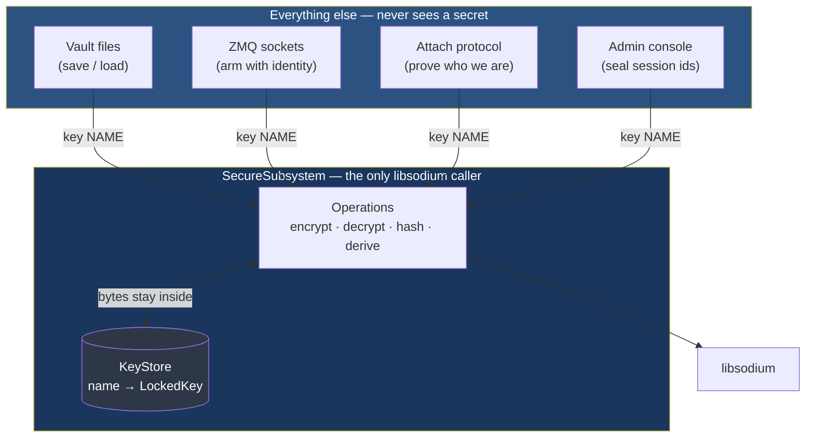
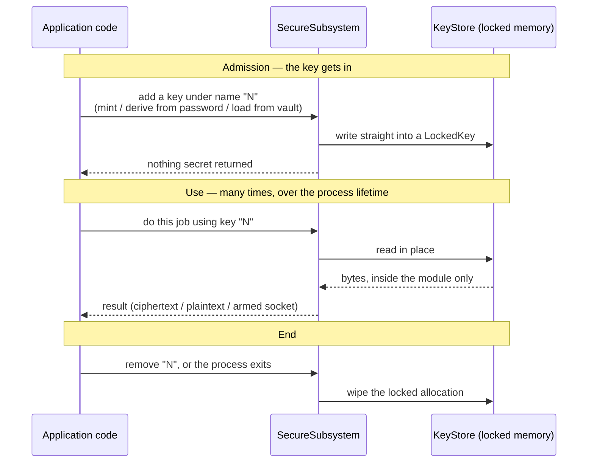

# HEP-CORE-0043: Security Subsystem

| Property        | Value |
|-----------------|-------|
| **HEP**         | `HEP-CORE-0043` |
| **Title**       | Security Subsystem — unified module + HEP consolidation |
| **Status**      | 🚀 **§0-§7 + §11-§13 AUTHORITATIVE (SEC-Fold-2 complete 2026-07-07; HEP-0044/0045 promoted 2026-07-08)** — §0-§2 architecture + two-category facade shipped; §3 random+hash shipped; §4 pwhash shipped; §5 secretbox shipped; §6 asymmetric box shipped (`box_encrypt_using` / `box_decrypt_using` with name-based key citation, primary consumer is HEP-CORE-0044); §7 KeyStore submodule shipped as member of `SecureSubsystem::Impl`.  **§8-§10 are INDEX sections that name owners and forbid migration — not stubs awaiting content** (see §13): §8 vault → HEP-CORE-0024 §3.4 + HEP-CORE-0033 §7.1 (placement, finalized) and HEP-CORE-0035 §4.6/§4.8 (format, payload, CLI); §9.1 → HEP-CORE-0036, which is **current and authoritative, not superseded**; §9.2 → HEP-CORE-0044 (AttachProtocol) + HEP-CORE-0041 (SHM binding) + HEP-CORE-0042 (attach coordination); §9.3 → ⛔ retired with HEP-CORE-0045; §10 → the binding-layer sandboxing rule, plus open questions for a script secret store that is neither designed nor built. |
| **Created**     | 2026-07-04 |
| **Area**        | Framework Architecture (security module, libsodium ownership, key management, wire auth) |
| **Depends on**  | HEP-CORE-0001 (Hybrid Lifecycle Model), HEP-CORE-0031 (ThreadManager pattern) |
| **Related**     | HEP-CORE-0035 (Hub-Role Auth + Federation Trust — NOT folded; stays independent per SEC-Fold R5), HEP-CORE-0042 (Channel Attach Coordination — NOT folded; stays independent per SEC-Fold R5) |
| **Supersedes**  | **HEP-CORE-0036** (Authenticated Connection Establishment) — status pointer only; wire content authoritative until further §9.1 migration; **HEP-CORE-0038** (Script-Accessible Vault Keystore) → §8 + §10 (content authoritative in HEP-0038); **HEP-CORE-0040** (Locked Key Memory) → §2 + §7 (raw-32-byte seckey contract in HEP-0040 §8.5.2 still authoritative). |
| **Splits from** | **HEP-CORE-0041 §5.5 / §D4.5 / §10.5** — application-layer AttachProtocol + Frame 3 mutual auth hoisted to **HEP-CORE-0044** (2026-07-08); observer path hoisted to **HEP-CORE-0045** (2026-07-08). |

---

## 0. Status + scope

### 0.1 Why this HEP exists

2026-07-04 triage of a CI failure (sodium_init gate missing on a
test worker path) exposed the underlying design smell — libsodium
is called from 9 files, security concerns are spread across 6 HEPs,
and no single module owns the crypto surface.  Runtime bugs
(startup ordering assumptions), design questions requiring 3-HEP
paging, and no compile-time guarantee that consumers use sodium
correctly.  All three problems close STRUCTURALLY (compile-time,
not runtime-checked) after this HEP + SEC-Fold-2's C++ refactor
lands.

Full triage narrative + design self-review R1-R8 was drafted in
`docs/tech_draft/DRAFT_security_module_and_hep_consolidation_2026-07.md`
and archived to `docs/archive/transient-2026-07-06/` after §0-§2
of this HEP absorbed the authoritative content.  Refer to this HEP
directly for shipped design; consult the archived draft only for
historical R1-R8 reasoning trace.

### 0.2 What this HEP covers

- **§1 The contract** — three load-bearing statements plus three
  supporting principles.  §1.1-§1.3 are the headline: **Nature**
  (what the module IS), the **init flag/gate** (how sodium_init
  is enforced), and the **singularity model** (exactly one
  instance per process, five enforcement mechanisms).  §1.4-§1.6
  are supporting: use-not-export, rotation & lifetime, cross-
  platform layering.
- **§2 Module surface** — the C++ class shape (`SecureSubsystem`),
  lifecycle registration, cross-platform layering.  This section
  is the SEC-Fold-2 refactor spec.
- **§1.0 The contract in plain language** — the four promises, how the
  pieces fit, what a stored key is, and a key's life from admission to
  wipe.  **Start here.**
- **§2.5 Named-key operations** — the surface a caller actually uses:
  jobs identified by key *name*, never keys.  Includes what is shipped
  and what is designed but unbuilt.
- **§3-§7 Cryptographic primitives** — random, hash, KDF,
  symmetric AEAD, asymmetric box, and the `KeyStore` submodule.
- **§8 Vault at rest** — an INDEX naming the owners (the directory
  HEPs and HEP-0035); the vault is not specified here.
- **§9 Wire authentication protocols** — an INDEX to HEP-0036,
  HEP-0041, HEP-0044, HEP-0042; the protocols are not specified
  here.  §9.3 is a tombstone for the retired broker observer.
- **§10 Script-facing crypto API** — the binding-layer sandboxing
  rule (settled), plus the open questions for a script secret
  store (not designed, not built).
- **§11 Cross-platform status** — per-OS backend matrix.
- **§13 Ownership map** — what is owned here and what is not.
  **Nothing is superseded by this HEP and nothing is scheduled to
  migrate into it.**

### 0.3 What this HEP does NOT cover

- **HEP-CORE-0035 (Hub-Role Auth + Federation Trust)** — stays
  independent.  It's about multi-hub federation identity + trust
  policy, not security primitives.  §9.1 cross-references it.
- **HEP-CORE-0042 (Channel Attach Coordination Protocol)** —
  stays independent.  It's about wire ordering and instance-epoch
  guards, not security.  §9.2 cross-references it.
- **Federation crypto**, **hub-to-hub trust chains** — future
  work, will land in HEP-0035 amendments.

### 0.4 Migration status (2026-07-08)

- **§0-§2** — authoritative; describes the shipped design.
- **§2.1 (SecureSubsystem class — two-category facade) — SHIPPED
  2026-07-07** — the prior `Crypto` sub-container was collapsed;
  encryption verbs live flat on `SecureSubsystem` alongside sodium
  primitives.
- **§2.2 (KeyStore submodule) — SHIPPED 2026-07-06** — KeyStore is a
  member of `SecureSubsystem::Impl`.  Present-tense authoritative.
- **§2.3 (Lifecycle registration) — SHIPPED 2026-07-06** — describes
  the Logger-shape static module currently registered.
- **§3 (Random + hash) — SHIPPED 2026-07-07** — Category 1a + 1b
  methods on `SecureSubsystem`.  The `pylabhub::crypto` namespace
  and its `GetLifecycleModule` are DELETED.
- **§4 (KDF pwhash_argon2id) — SHIPPED 2026-07-07** — Category 1b.
- **§5 (Symmetric secretbox) — SHIPPED 2026-07-07** — Category 1c;
  `vault_crypto.cpp` migrated.
- **§6 (Asymmetric box) — SHIPPED 2026-07-07** — Category 1c on
  `SecureSubsystem`: `box_encrypt_using(name, peer_pk, nonce, pt, out)`
  / `box_decrypt_using(...)` cite the seckey by KeyStore entry name
  (use-not-export, §1.4).  `attach_protocol.cpp` migrated
  (Frame 2 verify + Frame 3 mutual-auth signing).
- **§7 (KeyStore API surface) — SHIPPED 2026-07-06** — carries the
  full API surface preserved from HEP-CORE-0040 §5.2.  Now the
  primary reference.
- **§8–§10** — INDEX sections, not stubs awaiting content.  §8 vault
  → HEP-CORE-0024 §3.4 + HEP-CORE-0033 §7.1 (placement, finalized)
  and HEP-CORE-0035 §4.6/§4.8 (format, payload, CLI).  §9.1 →
  HEP-CORE-0036 (current and authoritative — *not* superseded).
  §9.2 → HEP-CORE-0044 (AttachProtocol) + HEP-CORE-0041 (SHM
  capability transport) + HEP-CORE-0042 (attach coordination).
  §9.3 → ⛔ retired with HEP-CORE-0045; tombstone only.  §10 →
  binding-layer sandboxing rule, plus open questions for a script
  secret store that is neither designed nor built.
- **§11-§13** — supporting.  §13 is the ownership map.

**Retired frameworks (deleted from the codebase):**
- `pylabhub::crypto` namespace + its `"CryptoUtils"` lifecycle module
  — folded into `SecureSubsystem` Category 1a/1b methods (2026-07-07).
- `pylabhub::utils::security::Crypto` scaffolding class — collapsed
  into `SecureSubsystem` Category 1c methods (2026-07-07).
- `pylabhub::utils::security::key_store()` / `key_store_ready()`
  free-function shims — deleted; access is `secure().keys()` /
  `sodium_ready()` (2026-07-06 Phase D).
- `SecureMemorySubsystem` class name + `"SecureMemory"` lifecycle
  module name — renamed to `SecureSubsystem` (2026-07-06 Phase E).
- `CurveKeyStoreFixture` test class — replaced by free function
  `seed_curve_identities(setup)` (2026-07-06).
- `g_sms` file-scope rendezvous pointer — deleted; every accessor
  routes through `SecureSubsystem::instance()` (2026-07-06 Phase E).

---

## 1. The contract

### 1.0 In plain language — read this before the rest

If you remember nothing else from this document, remember this:

> **Secrets live in one place, and they do not come out.  Code asks for
> a job to be done *by the name of a key*; it never receives the key.**

Everything below is machinery serving that one sentence.

**The four promises.** These are what "invariant" means here — code
elsewhere is written assuming they hold, so breaking one silently breaks
callers that never mentioned security:

| # | Promise | What breaks if it stops being true |
|---|---|---|
| **P1** | One module owns libsodium. Nothing else calls it or includes its header. | Two crypto surfaces with different init assumptions. This already happened once and took down CI. |
| **P2** | There is exactly one security module per process, brought up before anything uses it. | A second instance with an empty key store; or a key lookup against a store that does not exist yet. |
| **P3** | Secret bytes do not leave the module. Callers name a key; the module does the work. | Copies of private keys in ordinary memory, which the OS can write to swap and a crash dump can capture. |
| **P4** | A stored key sits in locked memory: not swappable, absent from core dumps, wiped when removed. | The key reaches disk without anyone doing anything wrong. |

**How the pieces fit.** Three layers, and the boundary is the point:



The arrows into the module carry a **name**. No arrow carries key bytes
outward. That is P3, drawn.

**What a stored key is.** Each entry is a name pointing at one locked
allocation. `sodium_malloc` gives it guard pages either side and a canary,
so an overrun is caught rather than silently corrupting a neighbour, and
the pages are locked so the OS cannot page them to disk:

```
KeyStore
 ├── "hub_identity"        → LockedKey [ pub_raw(32) ‖ sec_raw(32) ]   64 bytes
 ├── "role_identity"       → LockedKey [ pub_raw(32) ‖ sec_raw(32) ]   64 bytes
 └── "admin.session.seal"  → LockedKey [ raw(32) ]                     32 bytes

          guard page │ canary │ ...key bytes... │ canary │ guard page
                     └── mlocked: never written to swap ──┘
```

**Raw inside, Z85 outside — and the boundary is exactly here.**  Keys are
stored as raw binary, never as text.  The 40-character Z85 form exists
only where a key has to survive outside memory: in a vault file, on the
wire, or printed for an operator.  Conversion happens at admission
(`add_identity_from_z85`) and nowhere else, so no code downstream has to
know or care which representation it holds.

```
   vault file / wire / operator display        inside the module
   ─────────────────────────────────────       ─────────────────
   40-char Z85 text            ──admit──►      32 raw bytes
```

This is a hard rule, not a convention: a mixed codebase where some paths
carry Z85 and some carry raw invites a length check that passes on the
wrong thing.

Two kinds of entry: an **identity** (a keypair — the public half is
freely readable, the secret half is not) and a **raw secret** (a symmetric
key with no public half). Asking for the wrong kind throws rather than
reinterpreting bytes.

**A key's life, start to finish.** The important thing is that no arrow
leaves the shaded region:



**The one honest exception.** libzmq's socket options take raw key bytes,
so arming a CURVE socket has to hand the secret over. It is narrowed to
the smallest possible window — read inside a callback and written directly
into the socket option, never copied to a variable — but it is a genuine
export, and this document does not pretend otherwise. See §2.2
(`with_seckey`) and `curve_socket.hpp`.

**A worked example, showing where P3 is not yet reached.**  Sealing an
admin session id.  This is the honest comparison — the left is what the
code does today, the right is what §2.5 designs and has **not yet built**:

```cpp
// TODAY — the caller fetches the key and drives the primitive itself.
auto keyspan = secure().keys().lookup_raw(kAdminSessionSealKeyName);
if (keyspan.size() != 32) { /* handle */ }
std::array<std::uint8_t, 24> nonce{};
secure().random_bytes(nonce);                       // must not ever repeat
std::vector<std::uint8_t> ct(plaintext.size() + 16);
const auto n = secure().secretbox_encrypt(
    ct.data(), ct.size(), plaintext.data(), plaintext.size(),
    nonce, std::span<const std::uint8_t, 32>(
        reinterpret_cast<const std::uint8_t *>(keyspan.data()), 32));
// ...then the caller assembles [nonce ‖ ct] itself.
```

```cpp
// DESIGNED (§2.5) — not implemented yet.  The caller names a key.
std::vector<std::uint8_t> sealed(plaintext.size() + 40);  // nonce 24 + tag 16
const auto n = secure().secretbox_encrypt_using(
    kAdminSessionSealKeyName, plaintext, sealed);
```

Count what the left-hand version asks of every caller: hold a span into
key memory for the duration; check the key length yourself; produce a
nonce that has never been used with this key; get the reinterpret-cast
right; assemble the output framing consistently with whoever will read
it.  Five chances to be wrong, and **every one of them fails silently** —
wrong-length key, reused nonce and mismatched framing all produce bytes
that look fine until something cannot be decrypted, or worse, until the
encryption is broken and nothing says so.

The right-hand version has none of them, because none of those decisions
belongs to the caller.  That is what P3 buys, and the gap between these
two blocks is the work listed in §2.5.6 — with the three holes in §2.5.5
to settle first.

---

The three load-bearing statements about `SecureSubsystem`.  Every
subsequent section — the API sketch (§2), primitives (§3-§7),
protocols (§9) — is downstream of these three.

### 1.1 Nature — what SecureSubsystem IS

**`SecureSubsystem` is the one C++ subsystem in the codebase that
owns and mediates every access to libsodium.**  It is:

- **The libsodium boundary.**  The only place in production code that
  `#include <sodium.h>`.  The boundary is the **module directory**, not
  a single file: the include is permitted anywhere under
  `src/include/utils/security/` or `src/utils/security/`, and nowhere
  else in `src/`.  Every raw sodium primitive
  (`sodium_malloc`, `sodium_memzero`, `randombytes_buf`,
  `crypto_box_*`, `crypto_secretbox_*`, `crypto_pwhash`,
  `crypto_generichash`, `sodium_memcmp`, ...) is exposed through a
  typed C++ wrapper method on this module.

  *Enforcement.*  This is a checked invariant, not a convention.
  `SecurityGuardrail_SodiumConfinedToModule` runs under the CTest
  `guardrail` label and fails the sweep if any file under `src/`
  outside a `security/` directory includes the header —
  `tools/check_sodium_module_boundary.sh` (Unix) and
  `tools/check_sodium_module_boundary.ps1` (Windows), hand-mirrored,
  sub-second, wired as a `FIXTURES_SETUP Guardrails` test so it runs
  before anything else.  It is exclusion-shaped — it scans all of
  `src/` and subtracts the module — so code added in a new directory
  is covered without anyone remembering to update a list.  Test code
  is deliberately out of scope: a handful of L2 tests include
  `<sodium.h>` directly to construct raw inputs the module is designed
  to reject, and tests are not the production boundary.

  A consumer that needs an operation with no wrapper adds the wrapper
  to the module rather than including the header at the call site —
  `vault_crypto` is the worked example, reaching `pwhash_argon2id`,
  `secretbox_encrypt`, `random_bytes` and `memzero` entirely through
  `secure()`.
- **The keystore.**  Owns the `KeyStore` submodule that holds
  every long-term identity keypair and every ephemeral runtime
  key in mlocked memory (via `sodium_malloc`).  Enforces the
  use-not-export contract (§1.4).
- **The platform hardening layer.**  Disables core dumps,
  configures RLIMIT_MEMLOCK, sets PR_SET_DUMPABLE on Linux,
  excludes the binary from Windows Error Reporting.
- **The single lifecycle-registered security module.**  Registers
  itself as `"SecureSubsystem"` with the LifecycleManager,
  depends on Logger.  No other security-related lifecycle module
  exists (KeyStore is a member, not a peer).

What it is NOT:
- Not a wire protocol implementation — AttachProtocol, ZapRouter,
  vault_crypto, hub_vault continue to exist as their own layers.
  They USE `secure().*` for the crypto steps; they own their own
  framing/state/file-format logic.
- Not a script binding surface — language bindings (Python, Lua,
  Native) live in the script layer; they call `secure().*` for
  crypto but own their own name-translation sandboxing (§10).
- Not a federation trust layer — HEP-CORE-0035 owns hub-role
  federation trust, cross-references `secure().*` for crypto.

### 1.2 The init flag/gate

**libsodium requires `sodium_init()` to have completed successfully
before any other libsodium function is called.**  `SecureSubsystem`
owns this init exclusively and gates all consumer access to
libsodium behind it.

Mechanism, four layers deep:

1. **Init happens exactly once, in the constructor.**
   `SecureSubsystem::SecureSubsystem()` calls `::sodium_init()`
   as its first step.  A successful return (>= 0) sets
   `pImpl->sodium_initialized = true`.  Failure throws
   `std::runtime_error` — the process cannot proceed.
2. **The state atomic is exposed as two probes.**  Static method
   `SecureSubsystem::lifecycle_initialized() noexcept` returns
   `true` iff the state is NOT `Uninitialized`.  Free function
   `pylabhub::utils::security::sodium_ready() noexcept` returns
   `true` iff the state is exactly `Initialized`.  Both non-
   throwing, safe to call from any context including test
   fixtures and unrelated startup code.  The two agree once
   bringup completes; they can diverge during shutdown
   (`ShuttingDown`/`Shutdown` → `sodium_ready() == false` but
   `lifecycle_initialized() == true`).
3. **The state gate protects OUR state (KeyStore), not
   libsodium's.**  Softened 2026-07-07 after the original
   "gate every wrapper" policy proved over-defensive: gating
   `random_bytes`, `compute_blake2b`, etc. on SMS state added
   an artificial failure surface without buying real security
   (libsodium self-initializes those primitives on first call,
   and production processes always run under the mod pack
   anyway).  The gate now applies to:
   - **`keys()`** — accesses SMS's `KeyStore` state; PANICs on
     non-`Initialized` state (bypass path
     `SecureSubsystem::instance().keys()` also PANICs).
   - **`box_encrypt_using` / `box_decrypt_using`** — reach
     through `keys().with_seckey(name, ...)` internally to
     resolve the seckey; inherit the `keys()` gate transitively.

   Everything else on `SecureSubsystem` (Category 1a byte
   primitives, 1b hash/KDF, 1c `secretbox_*`) is a stateless
   wrapper that libsodium self-initializes.  These succeed
   without SMS bringup.  Full rationale + failure modes closed
   by this softening (Layer 0 UUID tests, vault-file unit
   tests) documented in `secure_subsystem.cpp` "Gate policy"
   block.  Reaching a gated accessor before SMS is up remains
   a **programmer error** — the program aborts via `PLH_PANIC`.
4. **Enforced by a test, not by convention.**  `<sodium.h>` is
   included only inside a `security/` directory — six files, all
   in the module.  `SecurityGuardrail_SodiumConfinedToModule`
   fails the sweep if any file under `src/` outside that
   directory includes it, in either the angle or the quoted
   spelling.  It runs under the `guardrail` label as a setup
   fixture, so it executes before any other test in the suite.
   Scope is `src/` deliberately: a few L2 tests include the
   header directly to build the malformed inputs the module is
   designed to reject, and tests are not the production
   boundary.  See §1.1 "Enforcement".

Consequence: the 2026-07-04 CI failure class (sodium primitives
called before `sodium_init`) cannot recur.  Even in Debug/pre-
refactor state, calling `secure().random_bytes(...)` before
constructing `SecureSubsystem` throws a clear runtime error, not
libsodium's inscrutable internal assertion.

Historical: prior to 2026-07-04 the codebase had FIVE independent
sodium_init call sites (`uuid_utils.cpp`, `crypto_utils.cpp`,
`vault_crypto.cpp`, `attach_protocol.cpp`, `SecureSubsystem`)
plus two in tests.  None was authoritative.  A test worker that
skipped all five paths hit an uninitialized libsodium and aborted
with a guard-page pointer-arithmetic assertion.  Every self-init was
then ripped out and centralized on the SMS constructor; this HEP
formalizes that as the permanent contract.

### 1.3 Singularity — exactly one instance per process

**There is exactly one `SecureSubsystem` instance per OS process.**
No process can have zero, no process can have two.

Enforced by five mechanisms (updated 2026-07-06 post-SEC-Fold-2
Phase E — stack-local sites deleted, `g_sms` rendezvous pointer
deleted):

1. **Function-local static singleton.**
   `SecureSubsystem::instance()` returns a reference to
   `static SecureSubsystem sole;` — C++11 guarantees thread-
   safe once-only initialization.  Matches `Logger::instance()`
   (`src/utils/logging/logger.cpp:883-890`).  Ctor is `private`;
   the ONLY construction path is `instance()` (called by the
   startup thunk and the free-function accessor `secure()`).
2. **Bringup CAS on `g_state`.**  `Impl::bringup()`'s first step
   is a compare-exchange from `Uninitialized → InitCalled`.  Any
   second construction — from any thread, any code path — sees a
   non-`Uninitialized` state and PANICs via `PLH_PANIC` (matches
   FileLock / Logger discipline; not a recoverable exception).
   The CAS is the load-bearing singularity enforcer.
3. **Non-copyable, non-movable.**  Explicit `= delete` on copy
   ctor, copy assign, move ctor, move assign.  There is one
   object, no way to duplicate it.
4. **Static lifecycle module registered via mod pack.**
   `SecureSubsystem::GetLifecycleModule()` returns a
   `ModuleDef("SecureSubsystem")` with dependency on
   `"pylabhub::utils::Logger"`.  Callers add it to their
   `LifecycleGuard` mods pack (production `main()`, test workers
   via `run_gtest_worker(..., mods...)`).  LifecycleManager
   rejects a second registration of the same name.  Matches
   Logger + FileLock static-module discipline — NOT dynamic
   ctor-side self-registration.
5. **KeyStore and Crypto are members of `SecureSubsystem::Impl`.**
   Neither is a separate lifecycle module (SHIPPED 2026-07-06 per
   §2.2).  Both ctors are private + friend `SecureSubsystem::Impl`
   — no external construction site is possible at compile time.
   Their lifetime is bound to SMS's — same singleton guarantee,
   same bringup ordering.  Access is `secure().keys()`.
   *(An earlier revision also named `secure().crypto()`.  That
   accessor and the `Crypto` scaffolding class behind it were
   collapsed into `SecureSubsystem`'s own methods and no longer
   exist — encryption verbs sit flat on the module.)*

Standard construction site: `SecureSubsystem::GetLifecycleModule()`
in the mods pack of `plh_hub_main` / `plh_role_main`, immediately
after `Logger::GetLifecycleModule()`.  Tests do the same in their
subprocess worker's mods pack (Pattern 3) or in
`PLH_BINARY_LIFECYCLE_MODULES` (parent-lifecycle tests).  No
stack-local `SMS sms;` or `KeyStore ks(...)` sites remain anywhere
in `src/` or `tests/` (grep-enforced 2026-07-06; Phase 5 CI lint
gates this invariant).

Consequence: the codebase can rely on `secure()` always returning
the same object; state (KeyStore contents, sodium_initialized
flag) is process-global.  No coordination needed across
subsystems that all touch security.

### 1.4 Use-not-export for secret bytes

**Secret bytes never leave `KeyStore`'s mlocked memory region as
data.**  Consumers pass a `KeyStore` entry NAME and a use-callback;
the callback runs against a `std::span<const std::byte>` view whose
lifetime ends when the callback returns.  Bytes are never
materialized into a `std::string` copy, a heap buffer, or any
storage the module doesn't own.

Established as NORMATIVE in HEP-CORE-0040 §5.2 for
`KeyStore::with_seckey`.  Extends to `SecureSubsystem`'s
asymmetric operations (§6): `box_seal_using` and `box_open_using`
take a name, not a raw seckey.  The seckey is dereferenced INSIDE
the module, used INSIDE the module, never crosses the module
boundary.

API design consequence: no `SecureSubsystem` method takes a raw
`std::span<const std::byte, 32>` seckey argument.  If a future
feature needs to encrypt with a caller-owned seckey, the seckey
enters the module via `KeyStore::add_raw` first.

### 1.5 Rotation & lifetime

Two classes of keys with different lifetime semantics:

- **Long-term identity keys.**  Loaded from vault at process
  startup, live for the process's lifetime, never rotated during
  a session.  Rotation happens by re-running `plh-cli keygen` +
  redistributing vaults.  Examples: hub identity, role identity.
- **Ephemeral keys.**  Generated on-the-fly at process startup or
  during runtime, no vault persistence, wiped at process shutdown
  or removal.  Examples: broker's observer keypair (regenerated
  every broker restart), future ephemeral session keys, script-
  generated keypairs.

Both live in `KeyStore` under distinct name prefixes (see §7 for
naming convention).  The module doesn't distinguish at the storage
level; the distinction is who OWNS the naming: framework
(identity) vs runtime code (ephemeral).

The broker observer keypair was the original ephemeral key, per
HEP-0041 §D1(d).  **Its consumer has since been retired (§9.3), but
the mechanism was kept** — so the ephemeral-key path currently has
no live caller and no owning abstraction.  Treat it as a capability
looking for a home, not as a worked example to copy.

### 1.6 Cross-platform layering

Sodium primitives are available identically on Linux, FreeBSD,
macOS, and Windows.  Sodium doesn't need per-OS abstraction; the
module wraps once.

Platform-specific concerns concentrate at TWO other layers:

- **`SecureSubsystem` startup platform hardening** — core dumps,
  PR_SET_DUMPABLE, RLIMIT_MEMLOCK, SeLockMemoryPrivilege.  Per-OS
  logic in `secure_subsystem.cpp` `disable_core_dumps_or_panic`
  + `inspect_memlock_capability`.
- **Wire protocols (§9)** — SHM channel auth uses AF_UNIX +
  SCM_RIGHTS on Linux; kqueue on BSD; Windows AF_UNIX or named
  pipes.  See per-protocol subsections + HEP-0041 for Linux
  reference implementation.

The `SecureSubsystem` class itself is portable; per-OS code lives
in the two layers above.

---

## 2. Module surface

**SEC-Fold-2 refactor spec.**  This section is the authoritative
design for the C++ class shape and lifecycle registration.
Implementers of SEC-Fold-2 build to this contract.

### 2.1 The `SecureSubsystem` class — two-category facade

**Name.**  `SecureSubsystem`.  Header: `src/include/utils/security/
secure_subsystem.hpp`.  Namespace-scope accessor `secure()`; the
class ctor is `private` (singleton via `instance()`).

**Design shape (SHIPPED 2026-07-06, revised 2026-07-07).**
`SecureSubsystem` is a facade over TWO service categories.  All
sodium operations — from stateless byte primitives to protocol-level
encryption verbs — live as FLAT methods on the class (Category 1).
Key management is the ONE nested sub-container (Category 2), because
`KeyStore` genuinely encapsulates state (the map, `shared_mutex`,
`LockedKey` machinery).

| Category | What it does | Access pattern |
|---|---|---|
| **1a. Byte primitives** | Stateless wrappers on single sodium functions — random, memcmp_ct, memzero, bin2hex | `secure().random_bytes(out)` |
| **1b. Hash + KDF** | BLAKE2b + verify + Argon2id | `secure().compute_blake2b(...)` |
| **1c. Encryption / decryption** | Higher-level protocol operations — secretbox (shipped), future box/aead/sealed_box | `secure().secretbox_encrypt(...)` |
| **2. Key management** | KeyStore — long-term identities + ephemeral keys under use-not-export | `secure().keys().add_identity(...)` |

Categories 1a/1b/1c are DOCUMENTATION groupings — all their methods
are flat on `SecureSubsystem`.  Encryption verbs live flat because
they have no state to encapsulate: `secretbox_encrypt(plaintext,
key, nonce)` is a stateless call.  Grouping them by concept lives in
header section markers, not class boundaries.

The prior `Crypto` nested sub-container (introduced as scaffolding
in the initial 2b design) was collapsed 2026-07-07 after realizing
its `Impl` was empty and every method was stateless — the class
provided false symmetry with `KeyStore` (which encapsulates real
state).  `KeyStore` stays nested; encryption verbs go flat.

**Public surface (shipped shape):**

```cpp
namespace pylabhub::utils::security {

inline constexpr std::size_t BLAKE2B_HASH_BYTES = 32;

class PYLABHUB_UTILS_EXPORT SecureSubsystem
{
public:
    // ── Lifecycle ─────────────────────────────────────────────
    static SecureSubsystem      &instance();
    static ModuleDef             GetLifecycleModule();
    static bool                  lifecycle_initialized() noexcept;
    ~SecureSubsystem();
    // ... deleted copy/move ctors ...

    // ── Category 2: key management (nested) ───────────────────
    KeyStore &keys();

    // ── Category 1a: byte primitives ──────────────────────────
    void          random_bytes(std::span<std::uint8_t> out);
    void          random_bytes(std::uint8_t *out, std::size_t len);
    std::uint64_t random_u64();
    std::array<std::uint8_t, 64> generate_shared_secret();
    bool          memcmp_ct(std::span<const std::uint8_t>,
                            std::span<const std::uint8_t>);
    void          memzero(std::span<std::uint8_t>);
    void          bin2hex(char *hex, std::size_t hex_max_len,
                          const std::uint8_t *bin, std::size_t bin_len);

    // ── Category 1b: hash + KDF ───────────────────────────────
    bool          compute_blake2b(std::uint8_t *out, const void *data,
                                   std::size_t len);
    std::array<std::uint8_t, 32>
                  compute_blake2b_array(const void *data, std::size_t len);
    bool          verify_blake2b(const std::uint8_t *stored,
                                  const void *data, std::size_t len);
    bool          verify_blake2b(const std::array<std::uint8_t, 32> &stored,
                                  const void *data, std::size_t len);
    bool          derive_pwhash_salt(std::uint8_t *salt_out,
                                       std::string_view domain);
    bool          pwhash_argon2id(std::uint8_t *out, std::size_t out_len,
                                   const char *password, std::size_t password_len,
                                   const std::uint8_t *salt);
    static constexpr std::size_t kPwhashSaltBytes = 16;

    // ── Category 1c: encryption / decryption ──────────────────
    // Symmetric authenticated (XSalsa20-Poly1305):
    std::size_t   secretbox_encrypt(std::uint8_t *out, std::size_t out_max_len,
                                     const std::uint8_t *plaintext, std::size_t plaintext_len,
                                     const std::uint8_t *nonce,
                                     const std::uint8_t *key);
    std::size_t   secretbox_decrypt(std::uint8_t *out, std::size_t out_max_len,
                                     const std::uint8_t *ciphertext, std::size_t ciphertext_len,
                                     const std::uint8_t *nonce,
                                     const std::uint8_t *key);
    static constexpr std::size_t kSecretboxKeyBytes   = 32;
    static constexpr std::size_t kSecretboxNonceBytes = 24;
    static constexpr std::size_t kSecretboxMacBytes   = 16;
    // Asymmetric authenticated (Curve25519 + XSalsa20-Poly1305);
    // seckey cited by KeyStore entry name (use-not-export, §1.4).
    // These methods transitively gate on `keys()` — PANIC if SMS
    // not `Initialized`.
    std::size_t   box_encrypt_using(std::string_view own_seckey_name,
                                     std::span<const std::uint8_t, 32> peer_pubkey_raw,
                                     std::span<const std::uint8_t, 24> nonce,
                                     std::span<const std::uint8_t>     plaintext,
                                     std::span<std::uint8_t>           out);
    std::size_t   box_decrypt_using(std::string_view own_seckey_name,
                                     std::span<const std::uint8_t, 32> peer_pubkey_raw,
                                     std::span<const std::uint8_t, 24> nonce,
                                     std::span<const std::uint8_t>     ciphertext,
                                     std::span<std::uint8_t>           out);
    static constexpr std::size_t kBoxPubkeyBytes = 32;
    static constexpr std::size_t kBoxSeckeyBytes = 32;
    static constexpr std::size_t kBoxNonceBytes  = 24;
    static constexpr std::size_t kBoxMacBytes    = 16;

    // Future encryption verbs (crypto_aead_*, sealed_box) will land as
    // additional flat methods on this class.

    struct Impl;                 // opaque, defined in .cpp

private:
    SecureSubsystem();           // singleton; only `instance()` calls
    std::unique_ptr<Impl> pImpl;
};

// Namespace-scope free functions:
[[nodiscard]] SecureSubsystem &secure();        // PANICs on gate
[[nodiscard]] bool             sodium_ready() noexcept;

} // namespace pylabhub::utils::security
```

`KeyStore` is declared in its own header (`key_store.hpp`),
pImpl-owned, private ctor + `friend struct SecureSubsystem::Impl` —
the only construction site is Impl's member-init list.

**Gate discipline.**  Every accessor (`secure()`, `keys()`, and
every Category 1 method) routes through one helper
`panic_if_not_ready(context)` which PANICs when
`g_state != Initialized`.  The `keys()` gate is defensive against
`SecureSubsystem::instance().keys()` bypass paths.  `sodium_ready()`
and `lifecycle_initialized()` are the non-throwing probes.

**R2 (naming) resolution.**  `SecureSubsystem` chosen (not `Secure`
which was too generic, not `Security` which collides with narrower
Authentication scope).  Accessor `secure()` matches the tightness
of `thread_manager()` conventions elsewhere.

**R7 (LockedKey) resolution.**  `LockedKey` is an implementation
detail of `KeyStore`, never exposed at `SecureSubsystem`'s public
surface.  Its declaration stays in `key_store.cpp` (anonymous
namespace).

**R8 (Z85PublicKey) resolution.**  Future `box_*` methods on SMS
accept `Z85PublicKey` directly, matching the strong-type discipline
already used for CURVE keys elsewhere.  The Z85 → raw decode happens
once inside the module.

### 2.2 `KeyStore` submodule (SHIPPED 2026-07-06)

**Ownership.**  `KeyStore` is a MEMBER of `SecureSubsystem::Impl`
(field `keys_`).  Access is via `secure().keys()` exclusively —
the old `key_store()` / `key_store_ready()` inline shims were
deleted in Phase D (2026-07-06); all ~200 caller sites migrated
grep-mechanically.  There is no separate KeyStore lifecycle
module — LifecycleManager sees exactly one module
(`"SecureSubsystem"`), not two.  `KeyStore()` ctor is `private`
with `friend struct SecureSubsystem::Impl` — external construction
is a compile error.

**R1 (static vs dynamic) resolution — SHIPPED.**  `SecureSubsystem`
is STATIC (constructed once at LifecycleGuard init).  `KeyStore`
INSIDE it is logically DYNAMIC (key inserts happen at arbitrary
runtime moments) — but its DYNAMISM is now internal state on the
KeyStore map, not a separate lifecycle module.  KeyStore's ctor
is trivial (`pImpl = make_unique<Impl>()`); the map is empty at
SMS bringup and populated as consumers call `secure().keys().
add_identity(...)`.  KeyStore's dtor drains the reader-writer lock
then destructs the map (each Entry's `LockedKey` runs
`sodium_memzero` + `sodium_free`).

**Public API** (surface preserved from HEP-CORE-0040 §5.2, methods
now on `KeyStore` accessed via `secure().keys()`):

- `add_identity(name, packed_pub_sec)` — 64 raw bytes.
- `add_identity_from_z85(name, pub_z85, sec_z85)` — Z85 pair.
- `add_raw(name, plaintext)` — HEP-0038 script-vault-shaped raw
  secret.
- `generate_and_add_identity(name)` — on-the-fly keypair.
- `remove(name)` — idempotent.
- `pubkey(name)` — Z85, non-secret.
- `with_seckey(name, callback)` — raw 32 bytes, use-not-export.
- `with_seckey_z85(name, callback)` — Z85 40 chars, use-not-export.
- `with_keypair_z85(name, callback)` — both halves.
- `lookup_raw(name)` — HEP-0038 raw span.
- `has(name)`, `size()`.

Full contract: HEP-CORE-0040 §5.2 (API surface preserved verbatim
through the merger).  Sections of HEP-0040 SUPERSEDED by the
2026-07-06 merger: §5.1 (singularity — now enforced by SMS's
singleton), §5.6 (namespace accessor — deleted; access is
`secure().keys()`), §5.4 (dynamic-module registration — deleted).
§5.3 (canonical entry names), §5.5 (thread-safety contract),
§6 (LockedKey RAII), §8.5.2 (raw-32 seckey contract) remain
authoritative.

### 2.3 Lifecycle registration

**One lifecycle module: `"SecureSubsystem"`** (renamed from
`"SecureMemory"`).  Dependency: `"pylabhub::utils::Logger"`.
STATIC module — registered via a `LifecycleGuard` mods pack
(NOT dynamic ctor-side self-registration).  Same shape as
`Logger::GetLifecycleModule()` + `FileLock::GetLifecycleModule()`.

**Startup thunk (`do_secure_subsystem_startup`)** triggers
construction of the function-local static `sole` inside
`SecureSubsystem::instance()`.  It then calls
`instance().pImpl->bringup()`, which does the singularity CAS,
calls `sodium_init()`, disables core dumps, inspects mlock
capability, and publishes `g_state = Initialized` under a
release fence.
The thunk is a friend of `SecureSubsystem` so it can drive
`pImpl` — same discipline as Logger's `do_logger_startup`
(`src/utils/logging/logger.cpp:1272-1295`).

**Shutdown thunk (`do_secure_subsystem_shutdown`)** compare-
exchanges the state gate from `Initialized → ShuttingDown`, then
calls `pImpl->shutdown_module()` which publishes the terminal
`Shutdown` state.  Sodium is stateless and core-dump disable is
irreversible (HEP-CORE-0043 §1.5) — there is nothing to unwind,
just gate-close via state transitions so late accessors PANIC.

**Singleton lifetime** is program-lifetime.  `sole` is a function-
local static → atexit-destructed.  The shutdown thunk closes the
gate but does NOT delete the outer object; that avoids any
`new`/`delete` of `SecureSubsystem` crossing the shared-lib
boundary.  Matches Logger.

Post-SEC-Fold-2 the old `"KeyStore"` dynamic module is DELETED —
its work is absorbed into `SecureSubsystem`.

Ordering invariant (unchanged from HEP-CORE-0040 §4.5):
`SecureSubsystem` must be constructed BEFORE any consumer of
`secure()`.  Standard call site: `SecureSubsystem::
GetLifecycleModule()` in the mods pack of `plh_hub` / `plh_role`
`main()`, immediately after `Logger::GetLifecycleModule()`.

### 2.4 Cross-platform stubs

Platform hardening steps in `SecureSubsystem::SecureSubsystem()`
retain per-OS logic:

| Step | Linux | FreeBSD | macOS | Windows |
|---|---|---|---|---|
| `sodium_init` | ✅ | ✅ | ✅ | ✅ |
| Disable core dumps | `setrlimit` + `prctl(PR_SET_DUMPABLE)` | `setrlimit` | `setrlimit` | `SetErrorMode` + `WerAddExcludedApplication` |
| Inspect memlock | `getrlimit(RLIMIT_MEMLOCK)` | same | same | `SeLockMemoryPrivilege` probe (Windows follow-on) |
| KeyStore `sodium_malloc` | ✅ (mlock + guard pages) | ✅ | ✅ | ✅ (requires `SeLockMemoryPrivilege`) |

Sodium is the SAME library across all four; wrapper API is
identical.  Only the startup hardening + wire-protocol backends
(§9) differ per OS.

---

## 2.5 Named-key operations — the surface callers actually use

Sections §3-§7 list primitives.  This section lists **jobs**, which is
what a caller comes here wanting done.  The distinction matters: a
primitive takes a key, a job takes a key *name*.  P3 says callers get
jobs, not primitives.

### 2.5.1 Why the surface is shaped this way

A caller that must fetch a key in order to use it becomes a courier: it
holds secret bytes, in memory it chose, for a duration it controls, and
it must remember to wipe them on every exit path.  Every promise in §1.0
then depends on that caller getting it right.

Making the *operation* the unit, rather than the key, removes the courier.
The caller says what it wants done and which key to do it with; nothing
secret crosses the boundary in either direction.

The ZMQ socket case is the worked proof — `arm_curve_server(sock, name)`
takes a name and returns an armed socket, and no caller of it has ever
held a key.  The rest of this section extends that shape to the
operations that still lack it.

### 2.5.2 The operations

**Getting a key in.**  None of these return key material.

| Operation | What it does |
|---|---|
| `keys().generate_and_add_identity(name)` | Mint a fresh keypair inside the module.  Returns the **public** half only. |
| `keys().add_identity_from_z85(name, pub, sec)` | Admit a keypair that already exists (e.g. read from a vault file). |
| `keys().add_random_key(name, byte_count)` | Mint N random bytes straight into locked memory.  For symmetric keys with no public half. |
| `keys().add_key_from_password(name, password, scope)` | Turn a password into a key (Argon2id) and keep it.  `scope` is what makes the same password yield a different key per vault — today, the role or hub uid.  Without it, one leaked password opens every vault on the machine. |
| `keys().replace_key_from_password(name, password, scope)` | Same, but for a name that already exists.  Separate from `add_` on purpose: `add_` throws on a duplicate, so an identity key cannot be overwritten by accident.  Replacement has to say so. |
| `keys().remove(name)` | Forget a key and wipe its memory. |
| `RoleVault::load_identity_into(name)` / `HubVault::load_identity_into(name)` | Open the vault file and deposit the identity into the key store directly.  **This method is on the vault, not on this module** — it is listed here because it exists to satisfy P3.  Without it, the caller reads `secret_key()` and forwards it, which makes the caller a courier for no reason.  When it lands, `secret_key()` leaves the public surface. |

**Doing a job with a key.**

| Operation | What it does |
|---|---|
| `secretbox_encrypt_using(name, plaintext, out)` | Encrypt under a symmetric key.  **The nonce is generated inside and written into the output** — see §2.5.3. |
| `secretbox_decrypt_using(name, sealed, out)` | Reverse.  Returns 0 if the data was tampered with or the key is wrong; callers must check. |
| `box_encrypt_using(name, peer_pubkey, nonce, plaintext, out)` | Encrypt to a specific peer.  Keeps an explicit nonce — the attach protocol owns its frame layout and needs to control it. |
| `box_decrypt_using(name, peer_pubkey, nonce, ciphertext, out)` | Reverse. |
| `arm_curve_server(sock, name)` / `arm_curve_client(sock, name, peer)` | Configure a socket with our identity.  Free functions in `curve_socket.hpp`, not methods on this module — but the same shape, and the proof it works.  These are where the §1.0 export exception lives. |

**Whole-file jobs.**  A file is a job, not a primitive, and treating it
as one is what keeps the key out of the caller:

| Operation | What it does |
|---|---|
| `save_encrypted_file(path, payload, key_name)` | Encrypt and write, at the right permissions, without following symlinks, replacing atomically. |
| `load_encrypted_file(path, key_name)` | Read and decrypt. |
| `open_file_with_password(path, password, scope, key_name)` | Derive the key, decrypt the file, and **on success keep the key** under `key_name`.  Later saves need no password. |

That last one is deliberately one call and not two.  **A successful
decrypt is the password check** — the authentication tag either verifies
or it does not.  Splitting it into "check the password" and "derive the
key" would invite deriving twice, and would invite someone to treat a
check that passed a moment ago as still true.

### 2.5.3 Why the symmetric operations do not take a nonce

A nonce must never repeat for a given key.  Repeat one with XSalsa20 and
the encryption fails catastrophically — not degrades, fails.

Callers have no reason to choose one.  The sealed output already carries
its nonce (`[nonce ‖ tag ‖ ciphertext]`), so the value is an internal
detail of the format.  Generating it inside means **a caller cannot reuse
a nonce, because a caller cannot supply one.**

`box_*_using` keeps its explicit nonce and that is not an inconsistency:
there the bytes are a protocol frame whose layout another implementation
must agree with, so the protocol owns the nonce.  Here the bytes are an
opaque blob only we ever open.

### 2.5.4 How a caller composes these

Reading a vault at startup and writing it later, end to end:

```mermaid
sequenceDiagram
    participant R as Role startup
    participant S as SecureSubsystem
    participant D as Disk

    R->>S: open_file_with_password(path, pw, uid, "role.vault.key")
    S->>D: read bytes
    S->>S: derive key (Argon2id) into locked memory
    S->>S: decrypt — tag verifies, so the password was right
    S-->>R: payload  (key retained under "role.vault.key")
    Note over R,S: password is now gone; the key stays for the process

    R->>S: save_encrypted_file(path, new_payload, "role.vault.key")
    S->>S: encrypt using the retained key, fresh nonce
    S->>D: atomic write, 0600
    S-->>R: ok
```

The password appears exactly once, at the top.  The key appears nowhere
in the caller at all.

### 2.5.5 What this design does not cover — read before implementing

Three holes, found by attacking the design rather than re-reading it.
None is hypothetical; each has a concrete path to a real secret.

**1. The output side is half-solved, and the unsolved half is the one
the new API would enshrine.**

Reading a vault was fixed already: `vault_read_secure` decrypts into a
caller-supplied `SecureBuffer` span, and its own comment says *"no
`std::string` materializes."* Both callers use it. That is the right
shape and it exists.

Writing was not.  `vault_write` takes `const std::string &json_payload`,
and all three call sites pass `payload.dump()` — which materialises the
role's or hub's **private key** in an ordinary heap string that nothing
wipes.  The read path is careful and the write path, three lines away,
is not.

This lands directly on `save_encrypted_file(path, payload, key_name)`:
**if `payload` is a `std::string`, the new API inherits the leak and
blesses it.**  It must take a span, matching `vault_read_secure`.

That is not free, and the difficulty should not be glossed: JSON
serialisation naturally produces a `std::string`, so the caller needs a
way to serialise into locked storage rather than dumping and copying.
Wiping the temporary afterwards is not a fix — small-string optimisation
and reallocation mean the bytes may have already been elsewhere.  **This
needs deciding before the file operations are written, not after.**

**2. Nothing in this design constrains which *file* a caller may touch.**

§10 places sandboxing in the binding layer, and it namespaces the **key
name**.  It says nothing about the **path**.  `save_encrypted_file` and
`open_file_with_password` both take an arbitrary path.

If a script-facing store is ever built on these calls, a script that can
influence a path can address another role's vault, or the hub's.  The
key-name sandbox does not help: the caller supplies the file, and the
file is where the secrets are.

Whatever exposes these operations to scripts must confine the path — the
store owns its directory and the caller names an entry within it, never
a path.  Stated here because the constraint belongs with the operation,
not with whichever binding is written first and remembered second.

**3. `replace_key_from_password` is unrestricted, and it is a
replacement primitive pointed at the key store.**

`add_` throws on an existing name, so it cannot clobber anything.
`replace_` exists precisely to overwrite — and nothing in this design
says *which* names it may target.  Called with `"hub_identity"` it would
swap the hub's identity for one derived from an attacker-chosen password.

No caller does this and no path reaches it from untrusted input today.
It is recorded because the primitive is new, its whole purpose is
overwriting, and "no caller does this yet" is the weakest guarantee in
the codebase.  The obvious constraint — `replace_` refuses the framework
identity names — costs a few lines and closes the question permanently.

### 2.5.6 Status

Shipped: `generate_and_add_identity`, `add_identity_from_z85`,
`box_encrypt_using`, `box_decrypt_using`, `remove`, and the socket-arming
helpers.

Designed here, not yet built — **nine**: `add_random_key`,
`add_key_from_password`, `replace_key_from_password`,
`secretbox_encrypt_using`, `secretbox_decrypt_using`,
`save_encrypted_file`, `load_encrypted_file`,
`open_file_with_password`, and `load_identity_into` on the two vault
types.

Until they exist, the callers that need them fetch keys instead — which
is why `vault_crypto` derives a key onto the stack and the two config
loaders pass a secret through a `string_view`.  Those are consequences of
the gap, not independent defects.

**The end state is that the raw-key door is shut, not merely unused.**
There is no public raw-key `box_encrypt` — the asymmetric side only ever
exposed `box_*_using`, and that is why it never grew a courier.  The
symmetric side still exposes `secretbox_encrypt` / `secretbox_decrypt`
taking a key span, and *that* is what made every symptom above possible.
Once the `_using` variants exist and callers move, those two become
private — implementation detail of the named form, mirroring `box_*`.

This matters more than it sounds.  Migrating callers removes today's
couriers; **removing the entry point is what stops tomorrow's.** An API
that still offers the unsafe door has not consolidated anything — it has
two ways to do one job, and the unsafe one is the shorter to type.

`keys().lookup_raw` is in the same position and is the harder call: after
the migration it has no production consumer, but it is also the only way
to read a raw secret at all, and retiring it is a contract handoff rather
than a deletion.  Decide it deliberately; do not let it drift.

**A scope-bound key handle** (`ScopedKey` — removes its key on
destruction) is a natural companion for keys that must not outlive a
scope.  It is not needed for anything described above, all of which is
process-lifetime.  The real customer is the ephemeral capability grant,
and it should be designed there rather than speculatively here.

---

## 3. Random + hash (Category 1a + 1b — SHIPPED 2026-07-07)

Category 1a byte primitives + Category 1b hash/KDF on
`SecureSubsystem` (§2.1).  All formerly `pylabhub::crypto::*` free
functions folded here 2026-07-07:

| SMS method | Replaces | Callers migrated |
|---|---|---|
| `random_bytes(out)` / `random_bytes(ptr, len)` | `randombytes_buf` + `pylabhub::crypto::generate_random_bytes` | uuid_utils, hub_vault, vault_crypto, attach_protocol, tests |
| `random_u64()` | `pylabhub::crypto::generate_random_u64` | native_engine, tests |
| `generate_shared_secret()` | `pylabhub::crypto::generate_shared_secret` | data_block startup |
| `compute_blake2b(out, data, len)` | `pylabhub::crypto::compute_blake2b` | data_block (checksums) + schema_utils + schema_blds |
| `compute_blake2b_array(data, len)` | `pylabhub::crypto::compute_blake2b_array` | schema_utils + native_engine |
| `verify_blake2b(stored, data, len)` | `pylabhub::crypto::verify_blake2b` | data_block (slot integrity) |
| `derive_pwhash_salt(out, domain)` | (new — replaces inline `crypto_generichash(salt, 16, uid, ...)` in vault_crypto) | vault_crypto (Argon2 salt) |
| `bin2hex(hex, hex_max_len, bin, bin_len)` | `sodium_bin2hex` | hub_vault (admin token) |
| `secretbox_encrypt` / `secretbox_decrypt` | `crypto_secretbox_easy` / `_open_easy` | vault_crypto (file-at-rest AEAD) |
| `box_encrypt_using(name, peer_pk, nonce, pt, out)` | `crypto_box_easy` under a name-cited seckey (Phase 4 SEC-Fold-2, 2026-07-07) | attach_protocol (Frame 2 encrypt, Frame 3 sign) |
| `box_decrypt_using(name, peer_pk, nonce, ct, out)` | `crypto_box_open_easy` under a name-cited seckey | attach_protocol (Frame 2 verify, Frame 3 verify) |

The `pylabhub::crypto` namespace + its `GetLifecycleModule()` are
DELETED (2026-07-07).  Consumer files are grep-verifiable: zero
`#include <sodium.h>` outside `src/utils/security/*` (HEP-CORE-0043
§1.2 mechanism 4 SHIPPED).

### 3.1 BLAKE2b output length — purpose-specific methods, not variable-length

**Design rule (2026-07-07):** the SMS BLAKE2b surface exposes
**purpose-specific methods with a FIXED output length each**, not a
single variable-length method with an `out_len` parameter.  Every
production BLAKE2b use case has a known, fixed size mandated by its
consumer.  Exposing "pick your own length" invites bugs — the
migration to SMS actually hit one (a stack smash during vault
decryption) when the caller's intended 16-byte call was silently
turned into a 32-byte write into a 16-byte stack buffer.

Two purposes, two methods:

| Purpose | Method | Size | Consumer |
|---|---|---|---|
| **Content addressing** (checksums, schema hashes, integrity verify) | `compute_blake2b(out, data, len)` | 32 (`BLAKE2B_HASH_BYTES`) | data_block, schema_utils, schema_blds, native_engine |
| **Argon2id KDF salt** | `derive_pwhash_salt(salt_out, domain)` | 16 (`kPwhashSaltBytes` = `crypto_pwhash_SALTBYTES`) | vault_crypto |

If a third purpose ever emerges (e.g. a 64-byte MAC key, or a
domain-specific short digest for a wire format), it lands as a
THIRD purpose-specific method (`derive_mac_key(...)`,
`compute_digest_short(...)`, ...) — NOT as a fourth position on an
`out_len` parameter.  Reader intent stays encoded in the method name.

### 3.2 BLAKE2b-16 is a genuine hash, not a truncation of BLAKE2b-32

**Cryptographic detail worth pinning explicitly.**  BLAKE2b's
digest_length is a **parameter of the algorithm**, not a
post-truncation length.  Per RFC 7693 §3.1, the digest_length is
placed in byte 0 of the parameter block P (a 64-byte structure).
Before ANY compression round runs, the initial hash state H₀ is
computed as:

```
H₀ = IV XOR P
```

The digest_length is therefore XOR'd into `H₀[0]`.  This means:

- `BLAKE2b("hello", outlen=16)` and `BLAKE2b("hello", outlen=32)`
  start with **different H₀ values**, run compression through
  **different states**, and produce **completely different bytes**.
- `BLAKE2b("hello", outlen=32)[0..16]` is a truncation of a
  different hash and is **NOT** equal to `BLAKE2b("hello", outlen=16)`.
- The two are cryptographically distinct primitives.

Concrete illustration:
```
BLAKE2b-16("hello") =                          e7d1acfa9dfffce02d9c8b93a01ecfa5
BLAKE2b-32("hello") = 324dcf027dd4a30a932c441f365a25e86b173defa4b8e58948253471b81b72cf
BLAKE2b-32("hello")[0..16] =                   324dcf027dd4a30a932c441f365a25e8   ← different from BLAKE2b-16
```

`derive_pwhash_salt` therefore calls `crypto_generichash(salt, 16,
domain, ...)` — invoking BLAKE2b in genuine 16-byte mode.  It does
NOT compute a 32-byte hash and truncate.  This matches the vault
format's pre-existing derivation (`crypto_generichash(salt,
kVaultSaltBytes=16, uid, ...)`); changing to any other scheme would
silently invalidate every existing vault file (different salt →
different derived key → MAC verify fails on decrypt).

## 4. KDF (pwhash — argon2id, Category 1b — SHIPPED 2026-07-07)

### 4.1 Provenance — upstream, not our implementation

Argon2id is **not implemented in pyLabHub**.  Ownership chain:

- **Argon2 reference implementation** — `github.com/P-H-C/phc-winner-argon2`,
  the winning entry of the 2015 Password Hashing Competition
  (Biryukov, Dinu, Khovratovich).
- **libsodium** vendors the reference impl and wraps it as
  `crypto_pwhash(...)` with algorithm selector
  `crypto_pwhash_ALG_ARGON2ID13` (the "13" is Argon2's own spec
  version v1.3).
- **pyLabHub SMS** wraps libsodium's `crypto_pwhash` as
  `secure().pwhash_argon2id(...)`.

We do not modify the cryptographic implementation, do not maintain
our own Argon2, and do not select any non-standard parameters
beyond the ops/mem-limit tuple (which libsodium exposes as
`INTERACTIVE` / `SENSITIVE` / `MIN` presets).

### 4.2 Salt-size ABI

`crypto_pwhash`'s salt parameter has **NO length argument**:

```c
int crypto_pwhash(unsigned char *out, unsigned long long outlen,
                  const char *passwd, unsigned long long passwdlen,
                  const unsigned char *salt,   // ← reads exactly SALTBYTES from this pointer
                  unsigned long long opslimit, size_t memlimit, int alg);
```

libsodium reads exactly `crypto_pwhash_SALTBYTES = 16` bytes from
that pointer.  This is an ABI, not a configurable parameter.
Passing a longer buffer wastes bytes silently; a shorter buffer
reads past the buffer (undefined behaviour).

The `derive_pwhash_salt` method above produces the correct 16-byte
input.  The static_assert in `secure_subsystem.cpp` verifies
`SecureSubsystem::kPwhashSaltBytes == crypto_pwhash_SALTBYTES` at
build time — if libsodium ever changes the constant (they haven't
in 10 years), the build fails loud with a clear message.

### 4.3 SMS surface

- `pwhash_argon2id(out, out_len, password, password_len, salt)` —
  wrapper around `crypto_pwhash(...)` with algorithm hardcoded to
  `crypto_pwhash_ALG_ARGON2ID13`.  `salt` MUST be exactly
  `kPwhashSaltBytes` (16) bytes; typically produced by
  `derive_pwhash_salt(salt, domain)` (§3.1).  Uses INTERACTIVE
  ops/mem-limit constants — appropriate for vault-file unlock; NOT
  for password-storage KDF (the SENSITIVE preset would be needed
  there, and we don't currently expose it — vault decryption is our
  only Argon2 use case).
- `derive_pwhash_salt(salt_out, domain)` — produces the 16-byte
  Argon2 salt from a domain string.  See §3.1.
- `kPwhashSaltBytes` — public constexpr, value 16.

Only caller today: `vault_crypto::vault_derive_key`.

## 5. Symmetric encryption (secretbox — Category 1c — SHIPPED 2026-07-07)

Surface (§2.1):
- `secretbox_encrypt(out, out_max_len, plaintext, plaintext_len, nonce, key)`
  — replaces `crypto_secretbox_easy`.  Returns bytes written on
  success, 0 on failure.  Ciphertext includes MAC as 16-byte prefix.
- `secretbox_decrypt(out, out_max_len, ciphertext, ciphertext_len, nonce, key)`
  — replaces `crypto_secretbox_open_easy`.  Returns bytes written on
  success, 0 on MAC failure or bad input.  Callers MUST check
  return value.
- Constants: `kSecretboxKeyBytes` (32), `kSecretboxNonceBytes` (24),
  `kSecretboxMacBytes` (16).
- Callers: `vault_crypto::vault_write` / `vault_read_secure`.

**Use-case boundary.**  Symmetric encryption is appropriate when
the SAME party (or same process instance) is on both sides — e.g.
file-at-rest with a password-derived key.  For two-party mutual
auth (broker ↔ role, hub ↔ hub), use `box_*` methods (§6).

## 6. Asymmetric box (crypto_box — wire + observer, Category 1c — SHIPPED 2026-07-07)

**Shipped surface** (Category 1c on `SecureSubsystem`):

- `box_encrypt_using(own_seckey_name, peer_pubkey_raw, nonce, plaintext, out)` —
  wrapper that reads the seckey via `KeyStore::with_seckey` (inside SMS)
  and calls `crypto_box_easy` inside the callback.  Seckey bytes never
  leave the LockedKey region and never cross the API boundary
  (use-not-export, §1.4).  Returns bytes written on success (==
  `plaintext.size() + kBoxMacBytes`), 0 on failure.
- `box_decrypt_using(own_seckey_name, peer_pubkey_raw, nonce, ciphertext, out)` —
  same pattern for `crypto_box_open_easy`.  Returns bytes written on
  MAC-verify success, 0 on failure — callers MUST check the return
  value; a 0 return is the SOLE authentication signal.

**Constants** exposed as public `static constexpr` on `SecureSubsystem`:
`kBoxPubkeyBytes` (32), `kBoxSeckeyBytes` (32), `kBoxNonceBytes` (24),
`kBoxMacBytes` (16).  Static_asserts in `secure_subsystem.cpp` pin them
to sodium's `crypto_box_*BYTES` at build time.

**Gate.**  Both methods reach through `keys()` internally — they
inherit the `keys()` gate transitively (PANIC if SMS not
`Initialized`).  All other Category 1 methods are ungated per §1.2
mechanism 3.

**Primary consumer.**  `HEP-CORE-0044 (AttachProtocol)` uses
`box_encrypt_using` / `box_decrypt_using` as its cryptographic
contract at every frame (see HEP-0044 §4.1).  Both the consumer-attach
path (HEP-0041 §5) and the broker-observer path (HEP-0045 §3.4) route
through HEP-0044, which routes through the SMS surface here.

**Callers migrated (2026-07-07):**
- `attach_protocol.cpp` — Frame 2 consumer response verify (producer
  side calls `box_decrypt_using`) and Frame 2 challenge encrypt
  (consumer side calls `box_encrypt_using`); Frame 3 mutual-auth
  producer proof calls `box_encrypt_using` on the acceptor side and
  `box_decrypt_using` on the consumer side.
- Test suite — `SecureSubsystemTest.BoxEncryptDecrypt_Roundtrip`
  covers happy path + MAC tamper + wrong sender pubkey.

**Use-case boundary.**  Asymmetric box is appropriate for two-party
mutual authentication where both parties have their own long-term
identity keypair and know the other's PUBKEY through the KeyStore.
Broker ↔ role authentication (`AttachProtocol`), hub ↔ hub
federation (HEP-CORE-0033) are the canonical use cases.

**R3 (AttachProtocol scope) resolution.**  `AttachProtocol` is
NOT a crypto primitive; it's a 1000+ LOC protocol (framing, poll,
EINTR, Frame 3, observer verify, SCM_RIGHTS handover).
`AttachProtocol` continues to exist as its own subsystem; when Cat
1c box methods land, `AttachProtocol` USES them for the crypto
steps.  No `secure().attach()` method.

## 7. `KeyStore` submodule (SHIPPED 2026-07-06)

**Shipped state.**  KeyStore is a MEMBER of `SecureSubsystem::Impl`
per §2.2.  Access via `secure().keys()` throughout production +
tests.  No separate lifecycle module.  No stack-local ctor sites
anywhere in the codebase (grep-enforced).

**API surface (SHIPPED unchanged from HEP-CORE-0040 §5.2).**  All
methods accessible via `secure().keys()`:

| Method | Semantics |
|---|---|
| `add_identity(name, packed_pub_sec)` | Insert 64-byte identity (pub_raw[32] ‖ sec_raw[32]).  Source span zeroed on return.  Throws on duplicate name. |
| `add_identity_from_z85(name, pub_z85, sec_z85)` | Convenience: Z85 pair → raw 64 bytes via `SecureBuffer<64>` (zero-on-destruct) → `add_identity`.  Single site for Z85→raw decode at the module boundary. |
| `generate_and_add_identity(name) → std::string` | Generate fresh CURVE keypair in-memory; return Z85 pubkey; seckey accessible only via `with_seckey`. |
| `add_raw(name, plaintext)` | HEP-CORE-0038 vault_save: opaque bytes.  Source span zeroed on return. |
| `remove(name)` | Delete a stored secret; blocks until in-flight `with_seckey` callbacks return. |
| `pubkey(name) → string_view` | Z85 pubkey (40 chars).  Non-secret; view lifetime = KeyStore lifetime. |
| `with_seckey(name, callback)` | Raw 32-byte seckey via callback; view valid only inside callback (use-not-export). |
| `with_seckey_z85(name, callback)` | Z85 seckey (40 ASCII) via callback; encoded on-the-fly, buffer sodium_memzero'd on return. |
| `with_keypair_z85(name, callback)` | Both halves Z85 via callback. |
| `lookup_raw(name) → span<const byte>` | HEP-CORE-0038 vault_load: raw bytes span. |
| `has(name)` / `size()` | Existence + count probes. |

**LockedKey (HEP-CORE-0040 §6).**  Each entry owns a
`sodium_malloc`'d region: mlock'd + guard-paged + canaried +
`sodium_memzero` on dtor.  `LockedKey` is an implementation detail
of KeyStore's `.cpp`; never exposed publicly (R7 resolution).

**Concurrency (HEP-CORE-0040 §5.5).**  `pubkey` / `with_seckey` /
`lookup_raw` / `has` / `size` take a shared lock (parallel reads
OK); `add_identity` / `add_raw` / `remove` take exclusive.
Callbacks must be prompt (µs) — no blocking I/O.

**Naming convention** (from `DRAFT_keystore_ephemeral_and_script_
crypto_2026-07.md`):
- No naming rules enforced by `KeyStore` itself.
- Callers pick their own names (framework: `"hub_identity"`,
  `"role_identity"`, `"broker.observer"`; scripts: whatever the
  binding layer decides).
- Script binding layer TRANSLATES script-provided names into
  sandboxed storage names before calling `add_*` (see §10).

## 8. Vault at rest — owned elsewhere, by design

**This section is an index, not a stub.  Do not migrate vault
content into this HEP.**  The vault is a file on disk; its
placement is a directory-layout concern and its format is an
authentication concern.  Both have settled owners, and moving
either here would strip a finalized contract out of the document
that reasoned about it.

| Aspect | Owner |
|---|---|
| Where the vault lives, filename convention, placement security — role side | **HEP-CORE-0024 §3.4, §3.4.1** |
| Where the vault lives, keygen, path resolution, placement security — hub side | **HEP-CORE-0033 §6.5, §7.1, §7.2** |
| On-disk file ACLs protecting the container | **HEP-CORE-0035 §4.6** — and *only* this; §4.6 states that cipher details are out of its scope |
| Encrypted file format — layout, KDF, AEAD, parameters | **No HEP owns this.**  It is specified in the file-level comment of `src/utils/service/vault_crypto.hpp`: `[nonce 24][MAC 16 ‖ ciphertext]`, key = Argon2id(password, salt=BLAKE2b-16(uid), opslimit, memlimit) |
| Payload contents (the `known_roles` allowlist) + the operator CLI that edits them | **HEP-CORE-0035 §4.8** |
| The keys once loaded OUT of the vault and into memory | **§7 of this HEP** |

What this HEP owns is only the last row: the moment a secret stops
being a file and becomes bytes in a process.  `vault_crypto` is the
file layer and calls into §4 (`pwhash_argon2id`) and §5
(`secretbox_encrypt`/`_decrypt`) for its crypto steps — a consumer
of this module, not part of it.

**Write-back asymmetry, recorded here because it constrains any
future design.**  `HubVault` can be mutated and re-saved
(`set_known_roles` + `save`).  `RoleVault` cannot: it exposes
`create`, `open`, and read accessors only.  A role vault is
write-once.  Anything proposing to store additional material in a
role's vault must first answer how write-back works — see §10.

**The at-rest format has no design-authority owner.**  Noted rather
than dramatised: the format is documented *thoroughly*, but only in
a source-file comment, and the dangerous knob is build-gated.  The
KDF cost parameters are selected at COMPILE TIME — INTERACTIVE by
default, SENSITIVE under `-DPYLABHUB_VAULT_HIGH_SECURITY`, MIN under
`-DPYLABHUB_VAULT_TEST_KDF` (which `tests/CMakeLists.txt` sets only
when `BUILD_TESTS=ON` *and* CI is detected, so production builds
cannot reach it).  A vault written under one parameter set **cannot
be opened under another**, and the file carries no marker recording
which set wrote it — so a mismatch surfaces as a MAC failure that is
indistinguishable from a wrong password.  The source header warns
operators explicitly; the format simply cannot self-diagnose.
Two things follow, neither urgent: an at-rest compatibility contract
should have a design owner rather than living only beside the code
that implements it, and a self-describing header would turn a
confusing failure into a clear one.

## 9. Wire authentication protocols

Three wire protocols, each with its own security posture.

### 9.1 ZMQ CURVE + ZAP

**Owner: HEP-CORE-0036, which is current and authoritative.**  It is
not superseded by this HEP and must not be marked so.  An earlier
revision of this section carried a "SUPERSEDED-STATUS-ONLY — content
authoritative until migrated" banner, which is a contradiction: it
told the reader to distrust the only document that specifies the
protocol.  HEP-0036 has since grown by roughly a thousand lines,
which is what an active contract does and a retired one does not.

Interaction with this module:
- `ZapRouter` and `ZmqQueue` are protocol implementations owned by
  HEP-0036; they are consumers of this module, not part of it.
- Their crypto goes through `secure().box_*_using(name, ...)` (§6),
  citing the key by KeyStore name so the use-not-export contract
  (§1.4) holds across the call.
- `KnownRolesStore` (the allowlist) is HEP-0035's; unchanged here.

### 9.2 SHM channel handshake

**AttachProtocol primitive:** `HEP-CORE-0044` (application-layer
challenge-response; frames, state machine, `IAttachChannel` seam,
Frame 3 mutual auth).  Uses SMS Category 1c `box_encrypt_using` /
`box_decrypt_using` (§6).

**SHM binding + capability transport:** `HEP-CORE-0041` (memfd +
`SCM_RIGHTS` handover, `ShmCapabilityChannel`, per-platform L1
backend matrix).  §5 in HEP-0041 uses HEP-0044's protocol as its
Layer-2b handshake.

**Broker mediation for attach timing:** `HEP-CORE-0042` (Channel
Attach Coordination — `CONSUMER_ATTACH_REQ_SHM` and per-transport
version tracking).

### 9.3 Broker SHM observer — RETIRED

The broker SHM observer is **⛔ retired, not deferred** — see
HEP-CORE-0045, which records the retirement and the reason: the role
already holds the SHM counters and already ships them to the hub on
every heartbeat, so the observer bought nothing and cost a privilege
surface (the broker mapping another process's memory).

This subsection previously carried a live build plan for it —
remaining slices, an observer keypair mechanism, and a wire field —
which is why it is left here as an explicit tombstone rather than
deleted outright.  **Do not reintroduce it.**  Nothing in this HEP
depends on the observer, and no crypto surface exists solely to
serve it.

## 10. Script-facing crypto API

**Sandboxing lives in the language binding layer, not in this
module.**  This is the load-bearing rule of the section and the only
part of it that is settled.  The bindings (Python, Lua, Native)
translate a script-supplied name into a namespaced storage name
before calling into the module; `SecureSubsystem` only ever sees a
fully-qualified name and applies no per-script policy of its own:

```
Script:   api.crypto.new_keypair("mykey")
Binding:  secure().keys().generate_and_add_identity(
            "script." + role_uid + "." + "mykey")
```

Stated explicitly because the tempting shortcut — teaching the
module about roles so it can sandbox centrally — would put policy
inside a mechanism module and give it a reason to know who is
calling it.  It must not learn that.

**Persistent script secrets are NOT designed and NOT built.**  No
`vault_save` / `vault_load` surface exists anywhere in the tree.
Two things must be settled before any of it is:

1. *Naming.*  A script-facing secret store is not the vault.  The
   word "vault" denotes the file on disk and the directory holding
   it, and that meaning is load-bearing across the codebase, the
   configs and the operator CLI.  A script store needs its own name.
2. *Write-back.*  `RoleVault` is write-once — `create`, `open`, and
   read accessors, with no `save` (contrast `HubVault`, which has
   `set_known_roles` + `save`).  Storing script material in a role's
   vault therefore is not a payload change; it requires a write path
   that does not exist, on the same file that holds the role's
   identity key.  Re-encryption without retaining the password,
   atomic replace, crash-mid-save, and whether a script can compel
   rewrites of its own identity file are all open.

Tracked as its own design item; do not treat either question as
settled by this section.

## 11. Cross-platform status

| Feature | Linux | FreeBSD | macOS | Windows |
|---|---|---|---|---|
| `SecureSubsystem` ctor | ✅ | ✅ | ✅ | ⏸ SeLockMemoryPrivilege probe |
| `KeyStore` | ✅ | ✅ | ✅ | ✅ (with privilege) |
| ZMQ CURVE (§9.1) | ✅ | ✅ | ✅ | ✅ |
| Vault encryption at rest (§8) | ✅ | ✅ | ✅ | ✅ |
| Vault file-permission enforcement (§8) | ✅ | ✅ | ✅ | ⚠ partial — see below |
| SHM channel (§9.2) | ✅ | 🚧 planned | 🚧 planned | 🚧 planned |
| Script secret store (§10) | ⛔ not designed | ⛔ | ⛔ | ⛔ |

**Vault at rest is two capabilities and they do not have the same
platform story**, so they get separate rows.  The *encryption* —
argon2id KDF plus secretbox AEAD — is portable and holds everywhere.
The *permission enforcement* does not: on Windows `set_keyfile_mode`
is a no-op returning `Applied`, permission verification returns
`ok = true` with a platform-skip diagnostic rather than checking
anything, and exclusive-create is an existence check before the write
rather than an atomic `O_EXCL`, so a racing creator is not detected
(closing that needs `CreateFileW(CREATE_NEW)`).  All three are
documented at the call site in `key_file_acl.hpp`; none is hidden.
The consequence worth stating plainly: on Windows a vault file is
encrypted but its ACL is not enforced by us.

The script-store row read `✅ ✅ ✅ ✅` until 2026-08-08.  That was
false on every platform — there is no such feature in the tree, on
any OS.  A support matrix is the table a reader checks before
promising a capability to a user, so a wrong ✅ here is worse than a
missing row.  The broker-observer row was dropped with the feature
(§9.3).

## 12. Change log

- **Initial landing** — §0-§2 authoritative, §3-§10 stubs, with a
  plan to migrate four other HEPs' content into those stubs.
- **Correction.**  §3-§7 filled and are authoritative.  §8-§10 are
  now INDEX sections and the migration plan is withdrawn — see §13.

## 13. What this HEP owns, and what it does not

**No HEP is superseded by this one.  Nothing is scheduled to be
migrated into it.**  An earlier revision listed four HEPs as folding
in and instructed that each be banner-marked
"SUPERSEDED-STATUS-ONLY — content authoritative until migration."
That instruction was withdrawn, for three reasons worth keeping:

1. **The status was self-contradicting.**  "Superseded but
   authoritative" tells a reader to distrust the only document that
   specifies the thing they are reading about.
2. **The premise did not hold.**  The bug that motivated the fold —
   `sodium_init` ordering, where each HEP assumed another established
   the discipline — was fixed by this HEP *existing* and giving that
   one decision one owner (§1.2).  That is the whole benefit, and it
   was already banked.  The rest of the fold was grouping documents
   by topic word, which is not what a HEP boundary is for.
3. **The stubs never behaved as promised.**  Of the three, none was
   ever filled by migration; two instead fissioned outward into new
   HEPs.  A stub reads as "this document intends to own this," which
   invites exactly the migration that should not happen.

| Concern | Owner | Relationship to this HEP |
|---|---|---|
| libsodium access, init gate, singularity, key memory | **this HEP §1-§7** | owned here |
| Vault on disk — placement, format, payload, CLI | **0024 §3.4 · 0033 §7.1 · 0035 §4.6/§4.8** | indexed by §8 |
| ZMQ CURVE + ZAP | **HEP-CORE-0036** | indexed by §9.1; current, not superseded |
| SHM capability transport | **HEP-CORE-0041** | indexed by §9.2 |
| Peer auth for non-CURVE transports | **HEP-CORE-0044** | indexed by §9.2 |
| Attach choreography | **HEP-CORE-0042** | indexed by §9.2 |
| Hub-role admission + federation trust | **HEP-CORE-0035** | policy, not crypto |
| Script secret store | **not designed** | §10 states the open questions |

The right intervention when one of those documents is wrong is to
fix the statement where it lives — not to move the subject here.

## Related documents

- `docs/archive/transient-2026-07-06/DRAFT_security_module_and_hep_consolidation_2026-07.md`
  — the original consolidation triage (archived).  Its Part 2
  structure proposal is the plan withdrawn in §13; read it as
  history, not as a backlog.
- `docs/tech_draft/DRAFT_keystore_ephemeral_and_script_crypto_2026-07.md`
  — ephemeral-key + script crypto sketch; input to §10's open
  questions, not a design.
- `docs/todo/AUTH_TODO.md` — security work tracking.
