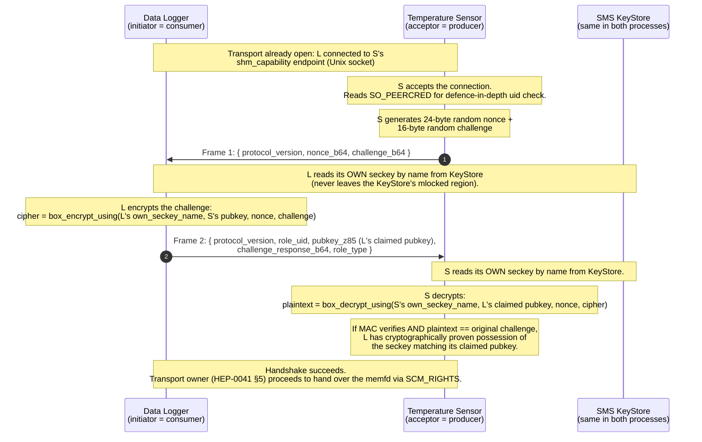
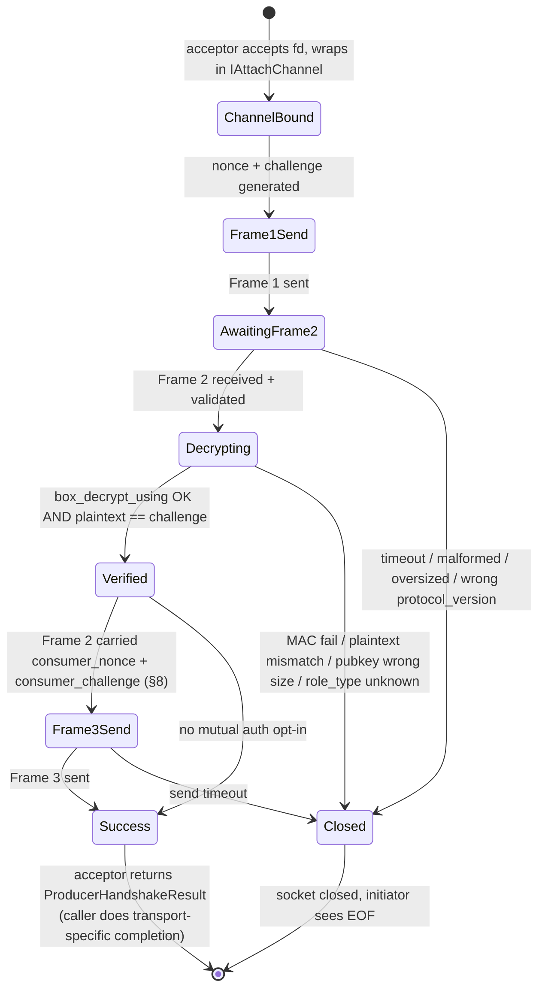
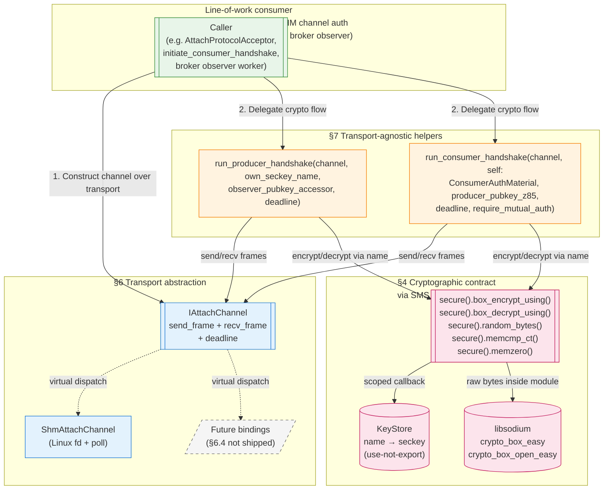
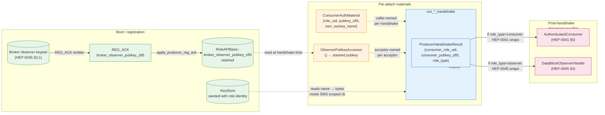

# HEP-CORE-0044: AttachProtocol — Application-Layer Peer Authentication

| Property | Value |
|---|---|
| **HEP** | `HEP-CORE-0044` |
| **Title** | AttachProtocol — Application-Layer Peer Authentication for Non-CURVE Transports |
| **Status** | 🟢 **DESIGN AUTHORITATIVE.**  Wire spec + state machine + transport-abstraction seam + Frame 3 mutual auth all shipped.  Content hoisted from HEP-CORE-0041 §5.5 / §D4 / §D4.5 / §10.5 (2026-07-08) — HEP-0041 sections replaced with pointers to this HEP. |
| **Transport scope** | **Application-layer primitive over an arbitrary framed byte stream.**  Only shipped binding is `ShmAttachChannel` (Linux AF_UNIX SOCK_STREAM fd — HEP-CORE-0041 §5).  ZMQ has its own transport-layer authentication (CURVE + ZAP, HEP-CORE-0036); AttachProtocol does not run over ZMQ.  See §10 for why. |
| **Created** | 2026-07-08 |
| **Depends on** | HEP-CORE-0040 §8.5.2 (raw-32-byte seckey representation at security-module boundary), HEP-CORE-0043 §6 (SMS asymmetric box surface — `box_encrypt_using` / `box_decrypt_using`) |
| **Consumers** | HEP-CORE-0041 §5 (SHM channel authentication — consumer↔producer attach), HEP-CORE-0045 (broker SHM observer — broker→producer metrics probe) |
| **Related** | HEP-CORE-0036 (ZMQ CURVE + ZAP — parallel primitive for the ZMQ transport, see §10), HEP-CORE-0042 (Channel Attach Coordination — transport-agnostic broker mediation that composes with AttachProtocol) |
| **Trackers** | #244 (HEP-0041 umbrella; §5.5 substep 1c shipped `b6e8faa1`, §D4.5 mutual auth shipped `b6914077`), #262 (mutual auth wire mechanism), transport-abstraction seam shipped `5a24b410` (2026-07-07) |

> **Amendment (2026-07-08 evening) — topology migration field-name unification.**
> The wire fields that this HEP reads from `CONSUMER_REG_ACK` unify
> under the coordinated topology migration:
>
> - `shm_capability_endpoint` → `data_endpoint` (topology-agnostic
>   scalar; HEP-CORE-0007 §12.3 authoritative schema).
> - `producer_pubkey_z85`     → `data_pubkey` (dialing side's
>   `curve_serverkey` under the binding/dialing model).
>
> **No changes to AttachProtocol's internal protocol** (Frame 1 /
> Frame 2 / Frame 3 crypto_box challenge-response) — only the wire
> fields that consumer role hosts + broker observer workers read
> from CONSUMER_REG_ACK to LOCATE the acceptor's endpoint + pubkey.
> The `producer_pubkey_z85` argument to `run_consumer_handshake`
> becomes semantically "the acceptor's identity pubkey" — under
> fan-out / 1-to-1 SHM that's still the producer, so no meaning
> shift, only source-field rename.
>
> Rationale: HEP-CORE-0007 §12.3 amendment (Phase A step 1)
> retired the per-producer `CONSUMER_REG_ACK.producers[]` array in
> favor of scalar `data_endpoint` + `data_pubkey`.  HEP-0044's
> SHM-attach helpers were the last readers of the old field names;
> this amendment closes the loop.
>
> Coordinated with the nine-HEP topology migration amendment
> package.  Design authority:
> `docs/tech_draft/DRAFT_topology_singular_side_2026-07.md` (status:
> DESIGN LOCKED, rev 10; earlier bump to rev-9 preserved a
> field-collapse from `bool data_endpoint_resolved` into
> `std::optional<std::string>::has_value()` — see tech draft rev
> history for the migration note).  See tech draft §11.4 for the coordination
> table.

---

## 0. Status + scope

### 0.1 What this HEP covers

`AttachProtocol` is a **stateless, per-connection application-layer handshake** that proves a peer holds the secret key matching a claimed public key.  It runs over any transport that can carry a framed JSON byte stream.  It uses the same cryptographic primitives as libzmq's CURVE handshake (Curve25519 ECDH + XSalsa20-Poly1305 authenticated encryption via libsodium's `crypto_box_easy`), but at the application layer.

This HEP defines:

- The three-frame wire protocol (§3).
- The cryptographic contract (§4).
- The per-connection state machine (§5).
- The transport-abstraction seam `IAttachChannel` (§6).
- The transport-agnostic protocol helpers `run_producer_handshake` /
  `run_consumer_handshake` (§7).
- The optional Frame 3 mutual-auth extension (§8).
- The `role_type` extension for observer-style consumers (§9).

### 0.2 What this HEP does NOT cover

- **Post-authentication data flow.**  Once the handshake succeeds, the transport carries whatever payload the transport's owner needs.  For SHM the payload is a memfd delivered via `SCM_RIGHTS`; see HEP-CORE-0041 §5 for that end-to-end flow.  For the observer path the payload is a header-page-only memfd; see HEP-CORE-0045 §4.
- **Trust anchor management.**  This HEP describes how a peer PROVES seckey ownership; it does not describe how the accepting side KNOWS which pubkey to trust.  Consumer path defers to the broker's `ChannelAccessIndex` (HEP-CORE-0036 §4.1); observer path defers to the broker's ephemeral observer pubkey stashed on `PRODUCER_REG_ACK` (HEP-CORE-0045 §3).
- **Coordination between the broker's allowlist state and the producer's local cache.**  That is HEP-CORE-0042 (Channel Attach Coordination Protocol).
- **ZMQ authentication.**  ZMQ transport-layer authentication is CURVE + ZAP (HEP-CORE-0036).  §10 explains why AttachProtocol is not deployed on ZMQ.

### 0.3 Where the code lives

| Layer | Public header | Implementation |
|---|---|---|
| Interface | `src/include/utils/security/attach_channel.hpp` | (none — pure interface) |
| SHM channel binding | `src/include/utils/security/attach_channel_shm.hpp` | `src/utils/security/attach_channel_shm.cpp` |
| Protocol (transport-agnostic) | `src/include/utils/security/attach_protocol.hpp` | `src/utils/security/attach_protocol.cpp` |

---

## 1. Plain-language overview

**What it does.**  Two processes want to exchange sensitive data over a Unix socket.  The socket alone gives no identity: any process on the same machine could connect.  AttachProtocol lets one side (the acceptor) demand cryptographic proof from the other side (the initiator) that the initiator holds the secret key matching the public key it claims.

**Why it exists.**  ZMQ has CURVE — the ZMTP handshake inside libzmq runs the same kind of proof automatically, invisibly.  Unix sockets have no CURVE.  We had to build the same guarantee at the application layer for the SHM data path.

**The bouncer analogy.**  CURVE and AttachProtocol are two bouncers at two different doors of the same building.  Both ask the same question ("do you hold the secret key for the public key on my guest list?"), both use the same math to verify the answer, both consult the same guest list (the broker's allowlist).  They cannot substitute for each other because they guard different doors.

**Failure mode.**  Every failure closes the connection.  There is no partial success.  If the wrong seckey is used, if the MAC fails, if a frame is malformed, if the peer stalls past the deadline — the acceptor closes the socket and the initiator sees EOF.  No error frames on the wire.

---

## 2. Worked example

Concrete scenario: a **temperature sensor role** (`prod.sensor01`) is running.  A **data logger role** (`cons.logger01`) has just registered with the broker and received the sensor's `data_endpoint` (post-2026-07-08 field name; historically `shm_capability_endpoint`) via `CONSUMER_REG_ACK`.  The logger now needs to attach to the sensor's SHM channel.

### 2.1 High-level flow



### 2.2 What each side proves

- **What Frame 2 proves to S:** whoever sent this frame holds the seckey corresponding to `pubkey_z85`.  The MAC on `challenge_response_b64` is keyed by the ECDH product of that seckey and S's pubkey; only the holder of the correct seckey can produce a MAC that S can verify.
- **What Frame 2 does NOT prove:** that S itself is the intended peer.  For that, see §8 (Frame 3 mutual auth).

### 2.3 A concrete failure

Same scenario, but with a wrong claim by an impersonator:

```
L' (impersonator) sends Frame 2:
{
  role_uid: "cons.logger01",
  pubkey_z85: <cons.logger01's real pubkey>,        ← STOLEN from a public directory
  challenge_response_b64: crypto_box_easy(challenge, nonce,
                                          S's pubkey, L'_own_seckey)
                                                     ← wrong seckey
}
```

S's decrypt path:
```
plaintext = crypto_box_open_easy(cipher, nonce,
                                  cons.logger01's-real-pubkey,   ← what S looks up
                                  S's-own-seckey)
```

The ECDH product `(cons.logger01's-real-pubkey × S's-seckey)` is different from `(S's-pubkey × L'_own_seckey)`, so the MAC verify fails.  S's `run_producer_handshake` throws `AttachProtocol::producer: challenge-response verification failed`, closes the socket, and L' sees EOF with no leaked information about why.

---

## 3. Wire format

### 3.1 Framing

- **Byte-stream framing:** each frame is a 32-bit little-endian unsigned length prefix followed by exactly that many bytes of UTF-8 JSON body.
- **Maximum frame size:** `kMaxAttachFrameBytes = 4096`.  Larger frames are rejected before any bytes hit the wire (send side) or before the body is parsed (receive side).  Prevents JSON-parse DoS.
- **Empty frames:** length prefix `0` is a protocol violation; receiver rejects.
- **JSON parse errors, length overflow, or wrong-typed fields:** all raise `std::runtime_error`.  Never `AttachProtocolTimeout` — parse errors are distinct from stall errors.

### 3.2 Frame 1 — challenge (acceptor → initiator)

```json
{
  "protocol_version": "hep-0041-1",
  "nonce_b64":        "<24 bytes of getrandom, base64>",
  "challenge_b64":    "<16 bytes of getrandom, base64>"
}
```

Field contract:

| Field | Type | Required | Meaning |
|---|---|---|---|
| `protocol_version` | string | YES | Protocol tag.  Wire-version pinned at `hep-0041-1`; any mismatch closes the connection.  Kept in the `hep-0041-` namespace for historical continuity; a future revision would bump the tail. |
| `nonce_b64` | base64 string | YES | Fresh per-attach 24-byte nonce (`crypto_box_NONCEBYTES` = SMS `kBoxNonceBytes`).  Uses `SecureSubsystem::random_bytes`.  Never reused under the same key. |
| `challenge_b64` | base64 string | YES | Fresh per-attach 16-byte random.  The value the initiator must prove it can encrypt-and-return. |

### 3.3 Frame 2 — proof + identity (initiator → acceptor)

```json
{
  "protocol_version":        "hep-0041-1",
  "role_uid":                "cons.logger01",
  "pubkey_z85":              "<40 Z85 characters>",
  "challenge_response_b64":  "<base64 of crypto_box_easy(challenge, nonce, acceptor_pk, initiator_sk)>",
  "role_type":               "consumer",
  "consumer_nonce_b64":      "<optional — see §8>",
  "consumer_challenge_b64":  "<optional — see §8>"
}
```

Field contract:

| Field | Type | Required | Meaning |
|---|---|---|---|
| `protocol_version` | string | YES | Must equal Frame 1's `protocol_version`. |
| `role_uid` | string | YES | Initiator's role uid.  Non-empty.  Used by the acceptor for downstream authorization (allowlist match, log correlation). |
| `pubkey_z85` | 40-char Z85 string | YES | Initiator's CLAIMED public key.  Acceptor decodes to raw 32 bytes via libzmq's `zmq_z85_decode`. |
| `challenge_response_b64` | base64 string | YES | `crypto_box_easy(challenge, nonce, acceptor_pk, initiator_sk)`.  Size: `16 + 16` = 32 bytes (MAC prefix + ciphertext).  Any other size closes the connection. |
| `role_type` | string | Optional (default `"consumer"`) | See §9.  Legal values: `"consumer"`, `"observer"`.  Empty / absent normalized to `"consumer"` for pre-#317 initiator compatibility. |
| `consumer_nonce_b64` / `consumer_challenge_b64` | base64 strings | Optional | Mutual-auth Frame 3 extension; see §8. |

### 3.4 Frame 3 — mutual-auth producer proof (acceptor → initiator, opt-in)

Sent ONLY when Frame 2 carries both `consumer_nonce_b64` and `consumer_challenge_b64`.  See §8 for the opt-in mechanism.

```json
{
  "producer_pubkey_z85":  "<40 Z85 characters, acceptor's OWN pubkey>",
  "proof_response_b64":   "<base64 of crypto_box_easy(consumer_challenge, consumer_nonce, initiator_pk, acceptor_sk)>"
}
```

Field contract:

| Field | Type | Required | Meaning |
|---|---|---|---|
| `producer_pubkey_z85` | 40-char Z85 string | YES | Acceptor's own pubkey.  Read from `secure().keys().pubkey(own_seckey_name)`.  Consumer compares against the pubkey the broker told it to expect (`CONSUMER_REG_ACK.data_pubkey` post-2026-07-08; historically `CONSUMER_REG_ACK.producers[i].pubkey_z85`); mismatch → `attach_producer_not_authenticated`. |
| `proof_response_b64` | base64 string | YES | `crypto_box_easy(consumer_challenge, consumer_nonce, initiator_pk, acceptor_sk)`.  Size: 32 bytes. |

---

## 4. Cryptographic contract

### 4.1 Primitives

All crypto goes through the SMS Category 1c asymmetric box surface (HEP-CORE-0043 §6).  AttachProtocol calls:

- `SecureSubsystem::box_encrypt_using(own_seckey_name, peer_pubkey_raw, nonce, plaintext, out)` — wraps `crypto_box_easy` (X25519 ECDH + XSalsa20-Poly1305).
- `SecureSubsystem::box_decrypt_using(own_seckey_name, peer_pubkey_raw, nonce, ciphertext, out)` — wraps `crypto_box_open_easy`.
- `SecureSubsystem::random_bytes(...)` for nonces and challenges.
- `SecureSubsystem::memcmp_ct(...)` for constant-time challenge equality.
- `SecureSubsystem::memzero(...)` for wiping decrypted plaintext buffers before return.

**Name-based key citation** (HEP-CORE-0040 §8.5.2 + HEP-CORE-0043 §1.4).  AttachProtocol never handles raw seckey bytes.  Seckeys are cited by KeyStore entry name (`std::string`); SMS resolves the name via `keys().with_seckey` internally, reads the bytes inside a scoped callback, and never exposes them at the API boundary.

### 4.2 What Frame 2's MAC verify proves

Successful `box_decrypt_using(own_seckey_name = acceptor's, peer_pubkey_raw = Frame 2's pubkey_z85, nonce = Frame 1's nonce, ciphertext = challenge_response_b64)` with plaintext equal to Frame 1's challenge proves:

- Whoever produced `challenge_response_b64` held the seckey corresponding to `pubkey_z85`.

The MAC on `crypto_box_easy(...)` is keyed by the ECDH product of the sender's seckey and the recipient's pubkey.  Only the holder of the correct seckey can produce a MAC that verifies under the reverse pairing.

**Same security property as CURVE's authenticated handshake.**  Same primitive (X25519 + XSalsa20-Poly1305), same math, same guarantee.  The difference is the delivery vehicle (JSON at the app layer vs ZMTP CURVE frames inside libzmq).

### 4.3 Nonce discipline

- **Per-attach randomness.**  Frame 1's `nonce_b64` and Frame 3's mutual-auth pairing both use fresh 24-byte random from `SecureSubsystem::random_bytes`.  No counters, no time-based derivation.
- **No cross-connection reuse.**  Every accepted connection generates its own nonce.  A single (key, nonce) collision under XSalsa20 is a catastrophic authentication break; fresh randomness per attach eliminates the collision surface.

### 4.4 Constant-time equality

Challenge equality (Frame 2's decrypted plaintext against the acceptor's original challenge) is checked with `SecureSubsystem::memcmp_ct`.  Same for Frame 3's proof plaintext against `consumer_challenge`.  Even though the challenges are 16 bytes and timing attacks over a Unix socket are unrealistic in the current threat model, constant-time compare costs nothing and eliminates a class of latent regressions.

### 4.5 Plaintext scrub

After Frame 2's MAC verify (successful or not), the acceptor calls `SecureSubsystem::memzero` on the decrypted plaintext buffer before returning.  Same for Frame 3.  Protects against subsequent stack reuse leaking the challenge (which is not secret per se but is a small piece of freshly-generated random that other code paths shouldn't observe).

---

## 5. Per-connection state machine

Each accepted connection runs one instance of this state machine.  Any failed transition closes the socket; the initiator sees EOF.



### 5.1 State machine notes

- The state machine is **transport-agnostic** — the ChannelBound → Success path is what `run_producer_handshake` (§7) drives; `IAttachChannel` provides send/recv.
- The **PeerCredCheck** step from HEP-0041 §5.5's original state machine (SO_PEERCRED uid check) is **transport-specific** and lives OUTSIDE this state machine, in the SHM binding (`AttachProtocolAcceptor::accept_one` before it constructs the `ShmAttachChannel`).
- **One connection deep.**  Concurrent attaches to the same acceptor each run their own state machine on their own connection; a single-threaded accept loop serializes them.

---

## 6. Transport abstraction — `IAttachChannel`

### 6.1 Interface

```cpp
namespace pylabhub::utils::security {

class IAttachChannel
{
public:
    static constexpr std::size_t kMaxAttachFrameBytes = 4096;

    virtual ~IAttachChannel() = default;

    virtual void
    send_frame(const nlohmann::json                 &frame,
               std::chrono::steady_clock::time_point deadline) = 0;

    virtual nlohmann::json
    recv_frame(std::chrono::steady_clock::time_point deadline) = 0;
};

// Deadline helpers (used by every conforming implementation):
[[nodiscard]] std::chrono::milliseconds
attach_remaining_ms(std::chrono::steady_clock::time_point deadline) noexcept;

[[nodiscard]] std::runtime_error
attach_make_errno_error(const char *side, const char *what, int captured_errno);

} // namespace pylabhub::utils::security
```

Header: `src/include/utils/security/attach_channel.hpp`.

### 6.2 Contract

- **Non-copyable, non-movable.**  A channel binds to a specific fd or socket that outlives it; moving would dangle the reference.  All four special member functions are `= delete`.
- **Non-thread-safe.**  A single peer's frames flow through one call site sequentially; no synchronization inside the channel.
- **Absolute-deadline discipline.**  Both `send_frame` and `recv_frame` respect a caller-supplied `steady_clock::time_point`.  The whole multi-call handshake (Frame 1 send + Frame 2 recv + optional Frame 3 send) is bounded by ONE deadline, not by `N × timeout`.
- **Exception taxonomy:**
  - `AttachProtocolTimeout` (subclass of `std::runtime_error`) on deadline expiry — a distinct type so callers can catch "peer stalled" separately from "peer misbehaved."
  - `std::runtime_error` on framing error, JSON parse failure, oversized frame, peer disconnect mid-frame, transport error.
- **DoS cap.**  `kMaxAttachFrameBytes = 4096`.  Every implementation enforces this on both send and recv.

### 6.3 Shipped binding — `ShmAttachChannel`

Length-prefixed JSON over an AF_UNIX SOCK_STREAM fd (Linux).  Headers: `attach_channel_shm.hpp` + `attach_channel_shm.cpp`.

**Wire format** (recall §3.1):

```
┌────────────────────────┬─────────────────────────────┐
│  4 bytes little-endian │  <length> bytes UTF-8 JSON  │
│  frame length          │                             │
└────────────────────────┴─────────────────────────────┘
```

**Ownership contract.**  `ShmAttachChannel` does NOT own the fd.  The caller retains close responsibility via an `FdGuard` RAII wrapper.  This matches the SHM AttachProtocol's post-handshake fd-handoff semantic — the same fd is reused for `sendmsg(SCM_RIGHTS)` to deliver the memfd (HEP-0041 §5).  Making the channel own the fd would force a `.release()` dance across the handshake/handover boundary.

**Deadline discipline.**  Uses `poll(POLLIN | POLLOUT)` with remaining budget before each `recv` / `send` syscall.  A stalled peer cannot burn more than the caller's declared budget.  See `attach_channel_shm.cpp` for the exact code.

### 6.4 No ZMQ binding

There is no `ZmqAttachChannel` in this HEP or in the shipped code.  A previous session (2026-07-07) authored one as speculative foundation, then deleted it (2026-07-08) when this HEP formalized the transport-scope contract.  See §10 for the design rationale.

Any future ZMQ or non-Unix-socket binding MUST:
- Preserve the frame semantics (each `send_frame` transmits exactly one JSON body, each `recv_frame` receives exactly one).
- Preserve the deadline contract (both methods respect an absolute `time_point`).
- Preserve the DoS cap.
- Land alongside a HEP amendment or a new HEP that specifies which downstream consumer needs it.

---

## 7. Transport-agnostic protocol helpers

### 7.1 Result type

```cpp
struct ProducerHandshakeResult {
    std::string consumer_role_uid;      // from Frame 2
    std::string consumer_pubkey_z85;    // from Frame 2 (verified: peer holds matching seckey)
    std::string role_type;              // "consumer" (default) | "observer"
};
```

### 7.2 Acceptor side — `run_producer_handshake`

```cpp
ProducerHandshakeResult
run_producer_handshake(IAttachChannel                       &channel,
                       const std::string                    &own_seckey_name,
                       const ObserverPubkeyAccessor         &observer_pubkey_accessor,
                       std::chrono::steady_clock::time_point deadline);
```

Behaviour:
1. Generate nonce + challenge via `SecureSubsystem::random_bytes`.
2. Send Frame 1.
3. Recv Frame 2.
4. Validate `protocol_version`, `role_uid`, `pubkey_z85` length, `role_type` (normalize empty/absent to `"consumer"`).
5. If `role_type == "observer"`, check the claimed pubkey against `observer_pubkey_accessor()` — see §9.  If the accessor is null or returns empty, reject.
6. Decode Frame 2's `challenge_response_b64`, decrypt via `SecureSubsystem::box_decrypt_using`, verify MAC + plaintext equals the original challenge (constant-time compare).  On failure, `throw std::runtime_error("challenge-response verification failed")`.
7. If Frame 2 carried mutual-auth fields, run §8 Frame 3 send.
8. Return `ProducerHandshakeResult`.

Exceptions bubble as documented in §6.2.

### 7.3 Initiator side — `run_consumer_handshake`

```cpp
void
run_consumer_handshake(IAttachChannel                       &channel,
                       const ConsumerAuthMaterial           &self,
                       const std::string                    &producer_pubkey_z85,
                       std::chrono::steady_clock::time_point deadline,
                       bool                                  require_mutual_auth);
```

`ConsumerAuthMaterial` is the initiator's identity bundle:

```cpp
struct ConsumerAuthMaterial {
    std::string role_uid;         // becomes Frame 2 role_uid
    std::string pubkey_z85;       // becomes Frame 2 pubkey_z85
    std::string own_seckey_name;  // KeyStore entry name for signing
};
```

Behaviour:
1. Recv Frame 1, validate shape.
2. Encrypt Frame 1's challenge via `SecureSubsystem::box_encrypt_using(self.own_seckey_name, producer_pubkey_z85 raw, nonce, challenge)`.
3. If `require_mutual_auth`, generate consumer_nonce + consumer_challenge.
4. Send Frame 2 with the produced fields.
5. If `require_mutual_auth`, recv Frame 3, verify `producer_pubkey_z85` field matches the caller-supplied expectation, decrypt + verify proof.  On failure, `throw std::runtime_error("... attach_producer_not_authenticated ...")` (marker string that callers grep for).
6. Return.

**Timeout semantics.**  Frame 1 recv timeout AND Frame 2 send timeout bubble up as `AttachProtocolTimeout` — signals the H3a race (see HEP-CORE-0041 §5.1 for the SHM-specific instance).  Frame 3 recv timeout is caught inside `run_consumer_handshake` and rethrown as `std::runtime_error` with the `attach_producer_not_authenticated` marker.  Why the asymmetry: Frame 1/2 timeout means "peer is not yet ready" (retryable); Frame 3 timeout means "peer authenticated Frame 2 but refuses to prove itself back" (affirmative refusal, not retryable).

Headers: `src/include/utils/security/attach_protocol.hpp`.

### 7.4 Information flow through the layers

The API is a stack.  Callers compose the stack in one direction; information flows through it in the other.



**Reading the diagram (top-down = composition; bottom-up = information flow):**

1. Caller (green) picks a transport, constructs the appropriate channel binding.
2. Caller hands the channel + the identity material into one of the two `run_*_handshake` helpers (orange).
3. The helper drives the Frame 1/2/3 crypto flow through `IAttachChannel` (blue) — pure `send_frame` / `recv_frame` calls.
4. The helper's cryptographic operations route through SMS (pink) — never touches libsodium directly.  Seckeys stay inside the KeyStore's LockedKey region; only `raw bytes inside the security module` reach libsodium.

### 7.5 Usage example 1 — SHM channel auth (HEP-CORE-0041 §5)

Consumer-attach case, producer side.  Composed inside `AttachProtocolAcceptor::accept_one` (SHM binding wrapper):

```cpp
// SHM-specific: accept AF_UNIX connection + SO_PEERCRED uid check
auto peer = transport_.accept_one(timeout);
if (!peer.has_value()) return std::nullopt;
if (peer->uid != expected_uid_) throw ...;

// Construct the channel binding from the fd
ShmAttachChannel channel(peer->peer_socket_fd, "producer");

// Delegate the whole Frame 1/2/3 crypto flow to the transport-agnostic
// helper.  own_seckey_name_ = "role_identity" (or "broker.observer"
// for HEP-CORE-0045 usage).  broker_observer_pubkey_accessor_ closes
// over RoleAPIBase::get_broker_observer_pubkey_z85().
ProducerHandshakeResult phr = run_producer_handshake(
    channel,
    own_seckey_name_,
    broker_observer_pubkey_accessor_,
    steady_clock::now() + timeout);

// SHM-specific: proceed to SCM_RIGHTS memfd handover
// (HEP-CORE-0041 §5).
AuthenticatedConsumer ac;
ac.consumer_role_uid   = phr.consumer_role_uid;
ac.consumer_pubkey_z85 = phr.consumer_pubkey_z85;
// ...
```

Consumer-attach case, consumer side.  Composed inside `initiate_consumer_handshake`:

```cpp
// SHM-specific: connect to producer's data_endpoint (post-2026-07-08; historically shm_capability_endpoint)
int fd = ::socket(AF_UNIX, SOCK_STREAM | SOCK_CLOEXEC, 0);
::connect(fd, &addr, sizeof(addr));

// Construct the channel binding
ShmAttachChannel channel(fd, "consumer");

// Delegate to the transport-agnostic helper
try {
    run_consumer_handshake(
        channel,
        self,                      // {role_uid, pubkey_z85, own_seckey_name}
        producer_pubkey_z85,       // from CONSUMER_REG_ACK.data_pubkey (post-2026-07-08; historically producers[i].pubkey_z85)
        steady_clock::now() + timeout,
        require_mutual_auth);      // opt-in per §8
}
catch (const AttachProtocolTimeout &) {
    // H3a race — retry per HEP-CORE-0041 §5.1
    return std::nullopt;
}

// SHM-specific: recv memfd via SCM_RIGHTS
```

### 7.6 Usage example 2 — Broker SHM observer (HEP-CORE-0045)

The broker acts as an initiator (like a consumer), but with `role_type="observer"`.  Composed inside the broker's observer worker (HEP-CORE-0045 §5.2):

```cpp
// Broker's worker connects to producer's data_endpoint (post-2026-07-08 field name)
int fd = ::socket(AF_UNIX, SOCK_STREAM | SOCK_CLOEXEC, 0);
::connect(fd, &producer_addr, sizeof(producer_addr));

// SAME channel binding used by consumer-attach
ShmAttachChannel channel(fd, "broker.observer");

// Broker's identity material — role_type="observer" is what makes
// the producer route to the observer trust-anchor check (§9.3).
ConsumerAuthMaterial broker_self;
broker_self.role_uid        = "broker.observer";
broker_self.pubkey_z85      = broker_observer_pubkey_z85_;  // stored at startup
broker_self.own_seckey_name = "broker.observer";            // KeyStore entry

// Run the observer variant of run_consumer_handshake — sends
// role_type="observer" on Frame 2 so the producer's acceptor
// routes to the observer trust-anchor check per §9.3.
//
// (Implementation detail: today's run_consumer_handshake hardcodes
// role_type="consumer".  HEP-CORE-0045 §5.2 tracks the tiny surface
// change to expose the role_type field on ConsumerAuthMaterial or
// as an extra parameter, so the same helper covers both paths.)
run_consumer_handshake(channel, broker_self, /*producer_pk=*/producer_pk_z85,
                       deadline, /*require_mutual_auth=*/false);

// Producer's acceptor:
//   - Sees role_type="observer" on Frame 2.
//   - Calls observer_pubkey_accessor() → returns stashed
//     broker_observer_pubkey_z85.
//   - Compares against Frame 2's pubkey_z85 (constant-time).
//   - On match, runs the standard MAC verify per §4.2.
//
// Result on the broker side: memfd received via SCM_RIGHTS,
// wrapped in DataBlockObserverHandle (header-page-only mmap).
```

### 7.7 Data structure life cycle



**Reading the diagram (left → right = data lifetime):**

- **Boot / registration.**  KeyStore is seeded once per role at startup.  Broker's ephemeral observer keypair is minted once per broker lifetime; its pubkey travels on `PRODUCER_REG_ACK` and is stashed on the producer's `RoleAPIBase`.
- **Per-attach materials.**  Each handshake instance owns a `ConsumerAuthMaterial` (on the initiator side) and reads the acceptor's `ObserverPubkeyAccessor` (on the acceptor side).  Seckeys are cited by name; SMS resolves them inside a scoped callback per handshake (never at rest in caller memory).
- **Helper output.**  `run_producer_handshake` returns `ProducerHandshakeResult`.  `run_consumer_handshake` returns `void` — success is "did not throw."
- **Post-handshake.**  Transport-specific completion wraps the result and (for SHM) the delivered memfd into either an `AuthenticatedConsumer` (consumer path, HEP-0041 §5) or a `DataBlockObserverHandle` (observer path, HEP-0045 §4).

---

## 8. Mutual-auth extension — Frame 3 (opt-in, task #262)

### 8.1 Threat closed

Baseline AttachProtocol proves consumer → producer only.  A hostile process at the same uid as the producer can `bind()` the well-known `shm_capability_endpoint` after the real producer crashes and impersonate the producer to a connecting consumer.  Under the baseline flow the consumer has no cryptographic evidence that its peer is the producer the broker authorized — just `SO_PEERCRED.uid` + the broker's allowlist naming.  Same-uid squatting defeats both.

Frame 3 closes this: the acceptor also proves seckey ownership to the initiator.

### 8.2 Wire mechanism

**Opt-in signaling** (initiator side):

The initiator adds `consumer_nonce_b64` (24 bytes random) + `consumer_challenge_b64` (16 bytes random) to Frame 2.  Pre-#262 acceptors ignore extra fields; #262 acceptors detect the presence of both fields and reply with Frame 3.

**Frame 3 shape** (repeated from §3.4):

```json
{
  "producer_pubkey_z85":  "<acceptor's own pubkey>",
  "proof_response_b64":   "<crypto_box_easy(consumer_challenge,
                                             consumer_nonce,
                                             initiator_pk,
                                             acceptor_sk)>"
}
```

### 8.3 Initiator verification

1. Recv Frame 3 within the deadline.  Timeout → `attach_producer_not_authenticated`.
2. Compare `producer_pubkey_z85` field against the caller-supplied `producer_pubkey_z85` (from `CONSUMER_REG_ACK.producers[i].pubkey_z85`).  Mismatch → `attach_producer_not_authenticated` (squatter attempted to substitute a different pubkey).
3. Decrypt `proof_response_b64` via `SecureSubsystem::box_decrypt_using(self.own_seckey_name, producer_pubkey_z85, consumer_nonce, cipher)`.
4. Verify MAC + plaintext equals the original `consumer_challenge` (constant-time compare).  Failure → `attach_producer_not_authenticated`.

### 8.4 Opt-in policy

The initiator's `require_mutual_auth` flag is derived from the role's config knob `startup.shm_require_mutual_auth`.  Default: `false` (backward compatibility with pre-#262 acceptors, plus tests that don't need mutual auth).

**Planned default flip.**  Once L4 squatter-attack coverage lands (task #262 remaining), the default becomes `true`.  A `broker_proto` MINOR bump lets old acceptors coexist during rollout.

### 8.5 What the marker string means

The token `attach_producer_not_authenticated` appears in every Frame 3 failure path's error message.  Callers of `run_consumer_handshake` MAY grep for this marker to distinguish "producer refused/failed to prove identity" from "protocol wire error."  It is not a status code — it is a search-friendly string in a human-readable `std::runtime_error::what()`.

---

## 9. Role type extension

### 9.1 `role_type` field

Frame 2 carries a `role_type` field.  Legal values:

| Value | Meaning | Trust anchor for Frame 2 pubkey verification |
|---|---|---|
| `"consumer"` (or empty / absent) | Ordinary data consumer.  Producer's `AttachProtocolAcceptor` proceeds to the standard MAC verify (§4.2) against the initiator's claimed pubkey. | Broker's `ChannelAccessIndex[K].authorized_consumer_pubkeys` (checked outside this HEP, downstream of `CONSUMER_ATTACH_REQ_SHM`). |
| `"observer"` | Broker's SHM observer client.  Producer accepts iff the claimed pubkey matches the ephemeral broker observer pubkey the producer stashed at `PRODUCER_REG_ACK` time. | Producer-local `broker_observer_pubkey_z85`, injected via `ObserverPubkeyAccessor` at acceptor construction. |

Any other value → protocol violation, close.

Empty or absent field is treated as `"consumer"` for pre-#317 initiator compatibility.

### 9.2 `ObserverPubkeyAccessor`

```cpp
using ObserverPubkeyAccessor = std::function<std::string()>;
```

Callable returning the current observer pubkey Z85, or empty string if unavailable.  Injected into `AttachProtocolAcceptor` at construction.  If the accessor is null or returns empty, the observer path is rejected outright.

### 9.3 Observer verify path (§9.1 row 2 elaborated)

Steps 5-6 of §7.2 for the observer branch:

1. Consult `observer_pubkey_accessor()`.  If null callable OR empty return, reject with `role_type="observer" received but no broker observer pubkey known`.
2. Compare the initiator's claimed `pubkey_z85` against the accessor's return.  Constant-time equality check.  Mismatch → reject with `role_type="observer" hello pubkey_z85 does not match the broker observer pubkey`.
3. On success, fall through to the standard MAC verify (§4.2).  The initiator MUST also hold the seckey corresponding to the pubkey, so identity check + crypto verify BOTH pass for a legitimate broker observer.

This design puts the observer inside the standard AttachProtocol crypto flow — the crypto is unchanged; only the trust anchor is different.  See HEP-CORE-0045 §3 for how the broker's ephemeral observer keypair is generated and published to the producer.

---

## 10. Relationship to CURVE (why AttachProtocol is not on ZMQ)

### 10.1 Comparison

| Aspect | CURVE (HEP-CORE-0036) | AttachProtocol (this HEP) | Common ground |
|---|---|---|---|
| What it proves | Peer holds seckey for claimed pubkey | Same | ✅ Same guarantee |
| Crypto primitive | X25519 + XSalsa20-Poly1305 | X25519 + XSalsa20-Poly1305 (via SMS `box_*_using`) | ✅ Same math |
| Trust source | Broker's `ChannelAccessIndex` + `known_roles` (§9.1: observer path uses broker's ephemeral pubkey) | Same | ✅ Same authority |
| Where the code lives | Inside libzmq (third-party) | `src/utils/security/attach_protocol.cpp` | ❌ Different code base |
| Wire format | ZMTP CURVE binary frames (defined by ZMTP RFC) | Length-prefixed JSON, 4 KiB DoS cap | ❌ Different wire |
| Runs at | ZMTP handshake — transport layer | Application layer, on top of a framed byte stream | ❌ Different layer |
| Ongoing protection | Every subsequent packet is encrypted with session keys | Attach-time proof only; no ongoing message encryption | ❌ Different scope |
| Visible to app code? | No — happens inside libzmq | Yes — JSON frames flow through our code | ❌ Different observability |
| Deployed on | ZMQ transport (BRC DEALER↔ROUTER control plane, PUSH/PULL data plane) | SHM transport (AF_UNIX SOCK_STREAM capability channel) | Complementary, non-overlapping |

### 10.2 Why the two are separate — the door analogy

CURVE and AttachProtocol are two bouncers at two different doors of the same building.  Both ask the same question ("do you hold the secret key for the pubkey on my guest list?").  Both use the same math.  Both consult the same guest list.  They CANNOT substitute for each other because they guard different doors:

- CURVE guards the ZMQ door.  It is baked into libzmq's ZMTP handshake.  We could not run CURVE over a Unix socket even if we wanted to — Unix sockets have no ZMTP.
- AttachProtocol guards the SHM Unix-socket door.  It is our code.  We could not replace libzmq's CURVE with AttachProtocol on the ZMQ door — that would require patching libzmq and re-implementing session-key encryption.

### 10.3 Why we do NOT run AttachProtocol as an EXTRA layer on top of CURVE

For a ZMQ transport already running CURVE + ZAP, adding an app-layer AttachProtocol handshake on top would be running the same identity check twice, on top of a socket where the transport-layer check already ran.  This is not defense-in-depth — it is defense-in-duplicate.  It doubles the handshake latency, doubles the code paths that can drift, doubles the log surface, and adds a JSON parser to a code path that ZMTP's binary frames already covered securely.  HEP-CORE-0036 explicitly makes CURVE + ZAP + broker allowlist the whole ZMQ authentication story; nothing sits on top.

### 10.4 When a future ZMQ binding could make sense

Legitimate scenarios that could justify an `IAttachChannel` binding over ZMQ, none of which is spec'd today:

- **Application-visible audit trail** for a compliance regime that requires the identity handshake to be logged by application code, not just libzmq internals.
- **Session-key binding to an application-visible session identifier** distinct from ZMTP's ephemeral session keys.
- **Observer-style role over ZMQ** — analog of HEP-CORE-0045's SHM observer, if we ever need a broker→role probe on a ZMQ transport.

Any of these would require:
- A HEP amendment (to this HEP or a new one) specifying the wire framing over ZMQ and the identity semantics.
- The corresponding `ZmqAttachChannel` binding in `src/utils/security/` with the same contract as §6.2.
- Test coverage per §11.

Absent a specification-backed downstream, no ZMQ binding exists in the code base.

---

## 11. Test surface

### 11.1 L2 unit tests (shipped)

- `tests/test_layer2_service/test_attach_protocol.cpp` — SHM AttachProtocol wire tests using bare Unix sockets.  Covers:
  - Happy round-trip (Frame 1 + Frame 2, no mutual auth).
  - Cryptographic-proof negative: consumer encrypts under the wrong seckey (impersonator holding a claimed pubkey they don't own).
  - Cryptographic-proof negative: ciphertext byte tampered after encryption.
  - Cryptographic-proof negative: nonce byte tampered.
  - Producer `accept_one` returns nullopt on timeout.
  - Hello-shape validation: wrong `protocol_version`, missing `role_uid`, oversized frame, malformed JSON.
  - Consumer connect-failure on non-existent endpoint returns nullopt (no throw).

- `tests/test_layer2_service/test_shm_attach_orchestrator.cpp` — L2 tests for the `ShmAttachOrchestrator` (HEP-CORE-0041 §9 D4 divergence-WARN + fail-closed paths).

- `tests/test_layer2_service/test_key_store.cpp::SecureSubsystemTest.BoxEncryptDecrypt_Roundtrip` — L2 coverage of the SMS `box_encrypt_using` / `box_decrypt_using` primitives AttachProtocol depends on.

### 11.2 L4 e2e (shipped)

- `tests/test_layer4_plh_hub/test_plh_hub_role_shm_e2e.cpp` — SHM e2e (task #258, HEP-0041 substep 1k).  Uses real `plh_role` binaries, real CURVE control plane, real SHM AttachProtocol on the data plane.

### 11.3 Observer-path L4 (pending, HEP-CORE-0045 §9)

The observer path (`role_type="observer"`) is exercised end-to-end by the observer HEP's L4 tests (HEP-CORE-0045 §9), pending under task #317 C.4.

### 11.4 Contract for future bindings

Any future `IAttachChannel` binding MUST land with:
- Round-trip test at L2.
- Deadline / timeout test at L2.
- DoS-cap test (oversized frame both directions) at L2.
- Malformed / oversized / truncated-length recovery test at L2.
- If the binding has cross-talk potential (shared socket, routing identity, etc.), cross-talk rejection test.

---

## 12. Cross-references

- **HEP-CORE-0040 §8.5.2** — Normative raw-32-byte seckey representation at the security-module API boundary.  AttachProtocol's name-based citation via `box_encrypt_using` / `box_decrypt_using` is the current form of that contract at the security-module boundary.
- **HEP-CORE-0043 §6** — SMS asymmetric box surface (`box_encrypt_using`, `box_decrypt_using`, `kBoxPubkeyBytes`, `kBoxSeckeyBytes`, `kBoxNonceBytes`, `kBoxMacBytes`).  AttachProtocol is the primary consumer.
- **HEP-CORE-0043 §9.2** — Points at this HEP for the SHM-side application-layer handshake detail.
- **HEP-CORE-0041 §5** — SHM channel authentication — capability-transport model.  Uses AttachProtocol as its Layer-2b handshake.  §5.5 / §D4 / §D4.5 previously carried the wire spec; those sections now point at this HEP.
- **HEP-CORE-0045** — Broker SHM observer path.  Uses AttachProtocol with `role_type="observer"` and a distinct trust anchor.
- **HEP-CORE-0042** — Channel Attach Coordination.  Transport-agnostic broker mediation.  For SHM, `CONSUMER_ATTACH_REQ_SHM` (§6.1) runs BETWEEN Frame 2 verification and memfd handover — the AttachProtocol handshake proves peer identity, then HEP-0042 confirms broker allowlist membership, then the transport owner delivers the memfd.  See HEP-0041 §D4 for the composed sequence.
- **HEP-CORE-0036** — ZMQ CURVE + ZAP.  Parallel primitive at a different transport layer.  See §10 for why the two do not overlap.

---

## 13. Change log

- **2026-07-08 — HEP created.**  Content hoisted from HEP-CORE-0041 §5.5 (Frame 1/2 wire spec, per-connection state machine), §D4 (attach sequence steps 2-4), §D4.5 (Frame 3 mutual auth), §10.5 (`role_type` extension).  Added §6 transport abstraction (`IAttachChannel`, shipped `5a24b410` 2026-07-07) and §7 transport-agnostic protocol helpers (`run_producer_handshake` / `run_consumer_handshake`, shipped in the same commit).  §10 clarifies the relationship to CURVE and formalizes why no ZMQ binding exists in the current design.
