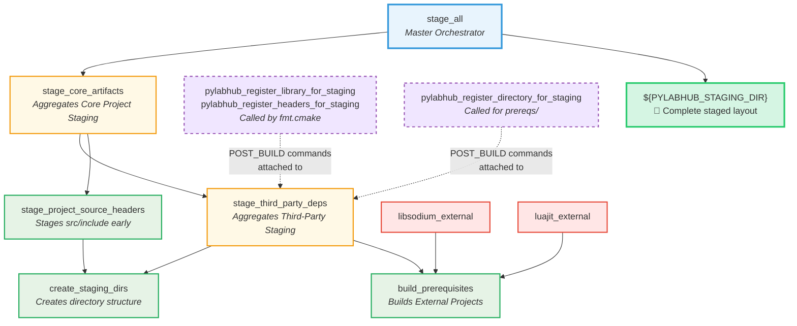
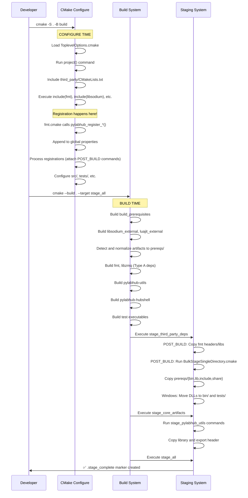

# pyLabHub C++ Build System: Architecture and Developer's Guide

This document provides a definitive overview of the CMake build system for the pyLabHub C++ project. It outlines the core design principles and includes a practical guide for developers to perform common tasks.

## Table of Contents

| § | Section | What you'll find |
|---|---------|-----------------|
| 0 | [Quick Start](#quick-start) | Configure, build, test, install commands |
| 1 | [File Inventory](#1-file-inventory) | Every `cmake/` and `third_party/cmake/` file with purpose |
| 2 | [Top-Level Walkthrough](#2-top-level-cmakeliststxt-walkthrough) | Phase-by-phase build orchestration |
| 3 | [Core Design Principles](#3-core-design-principles) | Staging architecture, dual strategy, isolation |
| 4 | [Target Architecture](#4-target-architecture) | INTERFACE vs IMPORTED, dependency chains, cross-strategy deps |
| 5 | [System Diagrams](#5-system-diagrams) | Mermaid graphs: dependencies, staging targets |
| 6 | [Build & Staging Flow](#6-build-and-staging-execution-flow) | Configure-time vs build-time sequence diagram |
| 7 | [Critical Design Rules](#7-critical-design-rules-and-gotchas) | 10 hard-won rules from CI debugging |
| 8 | [Developer's Cookbook](#8-developers-cookbook-common-tasks) | Recipes: executables, libraries, third-party, tests |
| 9 | [Troubleshooting](#9-troubleshooting-common-issues) | Common errors and their solutions |
| 10 | [Function Reference](#10-cmake-function-quick-reference) | Staging functions, platform vars, global properties |

## Quick Start

### Building the Project

```bash
# Configure (from project root)
cmake -S . -B build -DCMAKE_BUILD_TYPE=Debug

# Build everything
cmake --build build

# Stage all artifacts (creates runnable layout)
cmake --build build --target stage_all

# Run tests
cd build
ctest

# Install (optional)
cmake --install build --prefix /path/to/install
```

### Key Build Options

Configure with `-D<OPTION>=<VALUE>`:

| Option | Default | Description |
|--------|---------|-------------|
| `BUILD_TESTS` | `ON` | Build the test suite |
| `BUILD_XOP` | `ON` | Build Igor Pro XOP module |
| `THIRD_PARTY_INSTALL` | `ON` | Stage third-party dependencies |
| `PYLABHUB_STAGE_ON_BUILD` | `ON` | Run staging automatically on build |
| `PYLABHUB_USE_SANITIZER` | `"None"` | Enable sanitizers (Address, Thread, etc.) |
| `CMAKE_BUILD_TYPE` | `Debug` | Build configuration (Debug, Release, etc.) |

Example:
```bash
cmake -S . -B build -DCMAKE_BUILD_TYPE=Release -DBUILD_TESTS=OFF
```

## 1. File Inventory

Understanding what each CMake file does and where it lives is essential before making changes.

### `cmake/` — Project-Wide Build Helpers

| File | Purpose |
|------|---------|
| `ToplevelOptions.cmake` | All user-facing `-D` options: `BUILD_TESTS`, `BUILD_XOP`, `PYLABHUB_USE_SANITIZER`, `THIRD_PARTY_INSTALL`, Python/Lua embedding options, vault security, clang-tidy, logger compile levels, recursion guard depth |
| `PlatformAndCompiler.cmake` | Platform detection (`PYLABHUB_IS_WINDOWS`, `PYLABHUB_IS_POSIX`), compiler flags, MSVC runtime enforcement, Clang-Tidy integration, `PLATFORM_*` compile definitions |
| `Version.cmake` | Computes `PYLABHUB_VERSION_{MAJOR,MINOR,ROLLING,STRING}` from `project(VERSION ...)` + `git rev-list --count HEAD` |
| `StageHelpers.cmake` | All staging helper functions: `pylabhub_stage_executable`, `pylabhub_register_headers_for_staging`, `pylabhub_register_library_for_staging`, `pylabhub_register_test_for_staging`, `pylabhub_get_library_staging_commands`, `pylabhub_attach_library_staging_commands`, `pylabhub_attach_headers_staging_commands`, `pylabhub_register_directory_for_staging` |
| `SanitizerHelper.cmake` | `pylabhub_apply_sanitizer_to_target()` — applies ASan/TSan/UBSan flags per target type (shared lib vs executable, static vs dynamic runtime) |
| `FindSanitizerRuntime.cmake` | Locates and stages sanitizer runtime libraries (platform-specific runtime paths) |
| `SanitizeDebugInformation.cmake` | Strips/optimizes debug info in release binaries |
| `MsvcHelper.cmake` | MSVC-specific configuration (runtime library, compiler options) |
| `ProjectToolChainSetup.cmake` | Pre-`project()` toolchain setup (runs before project command) |
| `PreInstallCheck.cmake.in` | Template for the pre-install validation script; `configure_file` bakes in the staging directory path at configure time |
| `pylabhub_version.h.in` | C++ version header template (generates `#define PYLABHUB_VERSION_*`) |
| `pylabhub_utils_version.rc.in` | Windows VERSIONINFO resource template for DLL metadata |
| `BulkStageSingleDirectory.cmake.in` | Template script for bulk directory staging (Type B prereqs → staging dir) |
| `CleanPrereqResidue.cmake.in` | Template script to remove autotools residue (Makefile.in, etc.) before bulk staging |

### `third_party/cmake/` — Third-Party Wrapper Scripts

| File | Type | Purpose |
|------|------|---------|
| `ThirdPartyPolicyAndHelper.cmake` | Framework | Policy options (`THIRD_PARTY_DISABLE_TESTS`, etc.) + helper functions (`pylabhub_add_external_prerequisite`, `snapshot_cache_var`/`restore_cache_var`, `pylabhub_sanitize_compiler_flags`, `_resolve_alias_to_concrete`) |
| `fmt.cmake` | Type A | `fmt` formatting library — `add_subdirectory`, snapshot/restore cache isolation, stages headers + library |
| `libzmq.cmake` | Type A | ZeroMQ core — `add_subdirectory`, pre-populates `SODIUM_*` CACHE vars for configure-time `find_package(sodium)`, multi-target `add_dependencies` on `objects`/`libzmq`/`libzmq-static` |
| `cppzmq.cmake` | Type A | Header-only C++ ZMQ bindings (thin INTERFACE wrapper) |
| `nlohmann_json.cmake` | Type A | Header-only JSON library (pure INTERFACE target) |
| `msgpack.cmake` | Type A | Header-only msgpack-c — sets `MSGPACK_NO_BOOST` to avoid Boost dependency |
| `libsodium.cmake` | Type B | Crypto library — Autotools (POSIX) / MSBuild (Windows); uses `pylabhub_add_external_prerequisite` |
| `luajit.cmake` | Type B | LuaJIT — Makefile build; uses `find_program(gmake make)` for Ninja compatibility; custom install script |
| `luajit_install.cmake` | Type B | LuaJIT post-build install helper (normalizes output layout) |
| `python.cmake` | Type B | python-build-standalone download/extraction; pip wheel integration |
| `XOPToolKit.cmake` | Tooling | Igor Pro XOP development kit (Windows only) |
| `googletest.cmake` | Type A | GoogleTest framework configuration |
| `detect_external_project.cmake.in` | Template | Post-build detection script — scans for and renames library artifacts to stable names (e.g., `libsodium.a` → `libsodium-stable.a`) |

### CMakeLists.txt Files

| File | Purpose |
|------|---------|
| `CMakeLists.txt` (root) | Top-level orchestrator: options, project definition, version, platform config, staging infrastructure, sub-project inclusion, install rules |
| `third_party/CMakeLists.txt` | Includes all third-party wrappers, creates `build_prerequisites` target, defines INTERFACE/ALIAS targets for ExternalProject prereqs, processes staging registrations |
| `src/CMakeLists.txt` | Includes `utils/`, `scripting/`, `plh_role/`; defines `pylabhub-hubshell` executable (currently disabled pending HEP-CORE-0033) |
| `src/utils/CMakeLists.txt` | Builds `pylabhub-utils` shared library (70+ .cpp files including the role-side role_host/init sources under `src/{producer,consumer,processor}/`), links all third-party deps, generates export header, applies sanitizers/clang-tidy, stages to lib/ |
| `src/scripting/CMakeLists.txt` | Builds `pylabhub-scripting` (script engines, pybind11 modules, including role APIs under `src/{producer,consumer,processor}/*_api.cpp`) |
| `src/plh_role/CMakeLists.txt` | Builds `plh_role` unified executable — dispatches on `--role <tag>` to producer/consumer/processor runtime registered in `pylabhub-utils` |
| `src/{producer,consumer,processor}/` | Role-specific library code (role_host, init, api, fields) — no per-role CMakeLists; sources are pulled into `pylabhub-utils` / `pylabhub-scripting` by absolute paths in the above |
| `tests/CMakeLists.txt` | Includes all test sub-projects (layer0–layer4), collects test executables for staging |

## 2. Top-Level CMakeLists.txt Walkthrough

The root `CMakeLists.txt` orchestrates the entire build in distinct phases:

### Phase 1: Pre-Project Setup
```cmake
cmake_minimum_required(VERSION 3.29)
list(APPEND CMAKE_MODULE_PATH "${CMAKE_CURRENT_SOURCE_DIR}/cmake")
include(ToplevelOptions)          # User-facing -D options
include(ProjectToolChainSetup)    # Compiler selection before project()
```

### Phase 2: Project Definition & Version
```cmake
project(pylabhub-cpp VERSION 0.1 LANGUAGES C CXX)
include(Version)                  # Computes PYLABHUB_VERSION_STRING from git
```

### Phase 3: Global Configuration
- **Symbol visibility**: `set(CMAKE_CXX_VISIBILITY_PRESET hidden)` — only symbols marked with `PYLABHUB_UTILS_EXPORT` are visible in the shared library
- **RPATH**: `set(CMAKE_INSTALL_RPATH "$ORIGIN/../lib:$ORIGIN/../opt/python/lib")` on Linux, `@loader_path/../lib` on macOS — executables find shared libs relative to themselves
- **Global compile definitions**: `LOGGER_COMPILE_LEVEL`, timeout constants, recursion guard depth
- **Platform and compiler detection**: `include(PlatformAndCompiler)`
- **Staging helpers**: `include(StageHelpers)`
- **System libraries**: `find_package(Threads REQUIRED)`

### Phase 4: Staging Infrastructure
```cmake
set(PYLABHUB_STAGING_DIR "${CMAKE_BINARY_DIR}/stage-${lower_build_type}")
```
Creates a hierarchy of custom targets:
1. `create_staging_dirs` — makes `bin/`, `lib/`, `include/`, `tests/`, `opt/`, `share/`, `config/`, `data/`, `docs/`
2. `stage_project_source_headers` — copies `src/include/` early (depends on `create_staging_dirs`)
3. `stage_core_artifacts` — aggregator for all project staging (depends on `create_staging_dirs` + `stage_project_source_headers`)
4. `stage_all` — master target; prints completion message + creates `.stage_complete` marker

### Phase 5: Sub-Project Inclusion
```cmake
add_subdirectory(third_party)     # Third-party deps (build + stage)
add_subdirectory(src)             # Main library + executables
add_subdirectory(tests)           # Test suites (conditional on BUILD_TESTS)
add_subdirectory(examples)        # Examples (conditional)
add_subdirectory(add-ons)         # Optional add-ons (conditional on BUILD_XOP, etc.)
```

### Phase 6: Finalize Staging Dependencies
Collects all `CORE_STAGE_TARGETS` from global property and wires them as dependencies of `stage_core_artifacts`. Ensures `stage_core_artifacts` depends on `stage_third_party_deps` (third-party must be staged before core), and `stage_all` depends on `stage_core_artifacts`.

### Phase 7: Installation & Packaging
If `PYLABHUB_CREATE_INSTALL_TARGET` is ON:
- `configure_file` generates `PreInstallCheck.cmake` from `PreInstallCheck.cmake.in`, baking in the staging directory path
- `install(SCRIPT ...)` runs the pre-install check to verify staging is complete
- `install(DIRECTORY "${PYLABHUB_STAGING_DIR}/" DESTINATION ".")` copies the staged layout as-is
- In SKBUILD (wheel) mode, `.a` files, tests, and pkgconfig are excluded from the install

No CMake export/target machinery is used — no `pylabhubTargets.cmake`, `pylabhubConfig.cmake`, or `find_package(pylabhub)` support is generated. The installation is a direct copy of the staging directory.

## 3. Core Design Principles

Our architecture is built on modern CMake practices, emphasizing **clarity, robustness, and maintainability**. The key pillars of the design are detailed below.

### 3.1. Unified Staging Architecture

The cornerstone of the design is the **unified staging directory**. All build artifacts—executables, libraries, headers, bundles, etc.—are copied into this single location within the build directory. This creates a self-contained, runnable version of the project that mirrors the final installation layout, making local development and testing simple and reliable.

*   **Staging Directory Naming**: The staging directory name consistently includes the build configuration (e.g., `build/stage-debug`, `build/stage-release`). The root is defined by the `PYLABHUB_STAGING_DIR` variable.

*   **Installation via Staging**: The final `install` step is a direct copy of the fully-populated staging directory. This provides a clean separation between development builds and distributable packages. To ensure correctness, the installation process is protected by a pre-install check that verifies the staging process has completed successfully.

*   **Orchestrated Staging Targets**: The staging process is controlled by a hierarchy of custom targets. The master `stage_all` target depends on aggregator targets like `stage_core_artifacts` and `stage_third_party_deps`. A foundational target, `create_staging_dirs`, ensures the directory structure is created before any files are copied, preventing race conditions in parallel builds.

### 3.1.1. Header Staging Mechanics

The `pylabhub_register_headers_for_staging` function provides a flexible way to stage header files into the unified staging directory. Understanding how the `DIRECTORIES` and `SUBDIR` arguments interact is crucial:

*   **`DIRECTORIES <path_to_source_headers>`**: This argument specifies one or more source directories containing headers. When copied, the *contents* of each specified source directory are copied into the destination, preserving their internal subdirectory structure.
*   **`SUBDIR <relative_path>`**: This argument specifies a subdirectory *within* `${PYLABHUB_STAGING_DIR}/include/` where the headers will be placed.

**How it works:**
The staging process creates a destination path: `${PYLABHUB_STAGING_DIR}/include/<SUBDIR_value>`.
Then, for each `DIRECTORIES` argument, it recursively copies the *contents* of that directory into the calculated destination path.

**Examples:**

1.  **Staging `src/include` to `include/` (no extra subdirectory):**
    ```cmake
    pylabhub_register_headers_for_staging(
      DIRECTORIES "${CMAKE_SOURCE_DIR}/src/include"
      SUBDIR "" # Headers go directly into ${PYLABHUB_STAGING_DIR}/include/
    )
    # If src/include/my_lib/header.h, it becomes ${PYLABHUB_STAGING_DIR}/include/my_lib/header.h
    ```

2.  **Staging a third-party library's namespaced headers:**
    ```cmake
    # Assume the library's headers are located at `${CMAKE_CURRENT_SOURCE_DIR}/fmt/include/fmt/format.h`.
    # To make them available as `${PYLABHUB_STAGING_DIR}/include/fmt/format.h` for consumers,
    # you would point DIRECTORIES to the root that *contains* the 'fmt' subdirectory.
    pylabhub_register_headers_for_staging(
      DIRECTORIES "${CMAKE_CURRENT_SOURCE_DIR}/fmt/include"
      SUBDIR "" # Headers go directly into ${PYLABHUB_STAGING_DIR}/include/
    )
    # This results in: ${PYLABHUB_STAGING_DIR}/include/fmt/format.h
    ```
    **Clarification:** If the source directory already contains the desired top-level namespace, then `SUBDIR ""` is usually appropriate. If the source directory *itself* needs to become a new namespace, then `SUBDIR "my_namespace"` is suitable.

3.  **Staging individual files:**
    ```cmake
    pylabhub_register_headers_for_staging(
      FILES "${CMAKE_CURRENT_BINARY_DIR}/my_lib_export.h"
      SUBDIR "" # Stages directly into ${PYLABHUB_STAGING_DIR}/include/
    )
    # This results in ${PYLABHUB_STAGING_DIR}/include/my_lib_export.h
    ```

### 3.2. Staging Architecture: A Dual-Strategy Approach

To robustly handle both our internal code and the varied build systems of external dependencies, the project uses a dual-strategy staging architecture. The strategy used depends on the type of dependency.

#### Dependency Types

There are two classes of third-party dependencies:

1.  **Type A: Native CMake Projects**: These are libraries that have a well-behaved CMake build system (e.g., `fmt`, `libzmq`). They are integrated directly into our build graph via `add_subdirectory`.
2.  **Type B: External Prerequisites**: These are libraries that use non-CMake build systems (`make`, `msbuild`, etc.) or require a more complex, isolated build process (e.g., `luajit`, `libsodium`). They are built using `ExternalProject_Add` and installed into an intermediate `prereqs` directory within the build tree.

#### Staging Strategies

Corresponding to these dependency types are two staging strategies:

**Strategy 1: Per-Target Staging (for Internal Code & Type A Dependencies)**

This pattern provides fine-grained control and is used for all internal libraries and native CMake third-party projects.

1.  **Registration**: A component's `CMakeLists.txt` calls `pylabhub_register_library_for_staging(TARGET ...)` or `pylabhub_register_headers_for_staging(DIRECTORIES ...)` at **configure-time**. This records the staging request in a global property.
2.  **Processing & Execution**: At the end of the configuration, loops iterate through all registrations and attach `POST_BUILD` custom commands to the `stage_third_party_deps` or `stage_core_artifacts` targets. These commands perform the actual file copying at **build-time**.
3.  **Result**: This decouples the declaration of "what to stage" from the execution of "how to stage," and correctly handles dependencies for targets that CMake has full introspection into.

**Strategy 2: Bulk Staging (for Type B Dependencies)**

This pattern is designed to reliably capture all artifacts from External Prerequisites, which CMake cannot introspect directly.

1.  **Build & Install to Prereqs**: The `pylabhub_add_external_prerequisite` function builds the library and installs its *entire output*—including libraries, headers, and any other runtime assets (e.g., Lua scripts)—into the `${PREREQ_INSTALL_DIR}` directory (`build/prereqs`).
2.  **Bulk Copy**: The `pylabhub_register_directory_for_staging` function is called from the top-level `third_party/CMakeLists.txt`. This registers a request to stage the entire `prereqs` directory.
3.  **Execution**: At build time, for each build configuration, a custom command is generated and executed via `cmake -P` (using `cmake/BulkStageSingleDirectory.cmake.in` as a template). This custom command performs a complete, directory-level copy of specified subdirectories (e.g., `bin/`, `lib/`, `include/`, `share/`) from the `prereqs` directory to the final staging directory. It then intelligently handles platform-specific needs, such as moving Windows `.dll` files from `lib/` to `bin/` and `tests/`.
4.  **Result**: This ensures that all required files from complex external builds are staged reliably, even if they are not standard library or header files.

### 3.3. Modular & Stable Target Interfaces

*   **Internal Libraries**: The project's main internal library is `pylabhub::utils`, a shared library for high-level utilities.
*   **Alias Targets**: Consumers **must** link against namespaced `ALIAS` or `IMPORTED` targets (e.g., `pylabhub::utils`, `pylabhub::third_party::fmt`, `pylabhub::third_party::libsodium`) rather than raw target names. This provides a stable public API for all dependencies.
*   **Third-Party Isolation**: Third-party dependencies built via `add_subdirectory` are configured in isolated scopes using wrapper scripts in `third_party/cmake/`. This prevents their build options from "leaking" and affecting other parts of the project, thanks to the `snapshot_cache_var`/`restore_cache_var` helpers.

### 3.4. Prerequisite Build System (Unified Framework)

For third-party libraries that do not use CMake (Type B dependencies), the project uses a robust, unified framework encapsulated in the `pylabhub_add_external_prerequisite` helper function.

The core principle is to **separate platform-specific build knowledge from the underlying `ExternalProject_Add` boilerplate**.

1.  **Wrapper Script (`third_party/cmake/<pkg>.cmake`)**: For each prerequisite, a wrapper script defines *how* to build the library on different platforms by constructing the appropriate command lists (e.g., for `msbuild` on Windows or `make` on Linux).

2.  **Generic Helper Function (`pylabhub_add_external_prerequisite`)**: The wrapper script passes its command lists to this central function, which creates the `ExternalProject_Add` target and appends a post-build detection and normalization step.

3.  **Post-Build Detection & Normalization**: The key to this pattern is the script that runs *after* the external build installs files into the `prereqs` directory.
    *   **Discover**: It scans for the library file using patterns provided by the wrapper script.
    *   **Stabilize**: It copies this file to a **stable, predictable path** (e.g., `build/prereqs/lib/libsodium-stable.a`). The rest of our build system can now rely on this stable artifact.

4.  **Dependency Chaining**: Each prerequisite gets an `INTERFACE` wrapper target that links the stable library path directly and carries an `add_dependencies` call to the `ExternalProject` target. The chain is:
    *   `pylabhub::third_party::libsodium` (ALIAS) → `pylabhub_libsodium` (INTERFACE, links `libsodium-stable.a`) → `libsodium_external` (ExternalProject).
    *   **Why INTERFACE?** `add_dependencies` on an INTERFACE target propagates transitively through `target_link_libraries` chains, ensuring build ordering.
    *   `pylabhub-utils` links these targets as **PRIVATE** so the `.a` is not propagated to downstream executables — only internal `.cpp` files use libsodium and luajit.
    *   The master `build_prerequisites` target also depends on the `ExternalProject` target, providing a convenient way to build all prerequisites at once.

This framework makes adding complex prerequisites declarative and consistent. Their artifacts are then staged using the **Bulk Staging** strategy described above.

### 3.5. Notes on Specific Libraries & Workarounds

*   **`libzmq` / `libsodium` Cross-Strategy Dependency**: `libzmq` (Type A, `add_subdirectory`) depends on `libsodium` (Type B, `ExternalProject_Add`). This creates a configure-time vs build-time ordering problem: `libzmq`'s `find_package(sodium)` runs at configure time, but `libsodium` isn't built yet.

    The solution uses three techniques:
    1.  **CACHE pre-population**: `SODIUM_INCLUDE_DIRS` and `SODIUM_LIBRARIES` are set as CACHE variables pointing to the stable prereq paths (`prereqs/lib/libsodium-stable.a`). This bypasses `find_path`/`find_library` searches at configure time.
    2.  **Multi-target `add_dependencies`**: `libzmq` creates an OBJECT library (`objects`) whose `.o` compilation is independent of `libzmq-static`. Dependencies must be added to all compilation targets: `libzmq-static`, `objects`, and `libzmq` (shared).
    3.  **Stable artifact naming**: The `libsodium-stable.a` name avoids version-dependent paths.

*   **`msgpack-c` Boost avoidance**: `msgpack-c` defaults to `boost/predef` for endian detection. Since we don't bundle Boost, the `MSGPACK_NO_BOOST` compile definition is set on the wrapper target, making `msgpack-c` use its own bundled predef headers.

*   **LuaJIT and Ninja**: LuaJIT uses a Makefile-based build system. When the project is configured with `-G Ninja`, `CMAKE_MAKE_PROGRAM` resolves to `ninja`, not `make`. The LuaJIT wrapper script uses `find_program(NAMES gmake make)` to locate a POSIX make program independently.

## 4. Target Architecture

Understanding how CMake targets are structured is critical to avoid subtle build-order bugs.

### 4.1. Target Layers for Type A Dependencies (CMake Subprojects)

Type A dependencies (fmt, libzmq, nlohmann_json, cppzmq, msgpack) use a 3-layer or 2-layer approach depending on whether they have a compiled library:

**Compiled library (e.g., fmt, libzmq):**
```
Consumer → pylabhub::third_party::fmt (ALIAS)
             → pylabhub_fmt (INTERFACE wrapper)
                → fmt (concrete target from add_subdirectory)
```

**Header-only library (e.g., nlohmann_json, msgpack, cppzmq):**
```
Consumer → pylabhub::third_party::nlohmann_json (ALIAS)
             → pylabhub_nlohmann_json (INTERFACE, include dirs only)
```

The INTERFACE wrapper provides **stable naming**: the wrapper name (`pylabhub_fmt`) is deterministic even if upstream changes their target name. It also enables consistent dependency propagation within the build graph.

### 4.2. Target Layers for Type B Dependencies (External Prerequisites)

Type B dependencies (libsodium, luajit) use a 2-layer approach:

```
Consumer → pylabhub::third_party::libsodium (ALIAS)
             → pylabhub_libsodium (INTERFACE)
                → links: "${PREREQ_INSTALL_DIR}/lib/libsodium-stable.a" (file path)
                → add_dependencies: libsodium_external (ExternalProject)
```

**Key design decisions:**

1. **INTERFACE targets** for reliable dependency propagation: `add_dependencies` on INTERFACE
   targets propagates transitively through `target_link_libraries` chains.

2. **PRIVATE linkage**: `pylabhub-utils` links these targets as `PRIVATE` (see `src/utils/CMakeLists.txt`).
   Only internal `.cpp` files use libsodium and luajit — no public headers expose their types.
   PRIVATE prevents the `.a` from propagating to downstream executables.

3. **C linkage for LuaJIT**: LuaJIT headers do not include `extern "C"` guards. The include site
   (`lua_script_host.hpp`) wraps them in `extern "C" {}` to ensure correct C linkage.
   Without this, C++ mangled symbol names won't match the C symbols in `libluajit.a`.

### 4.3. The libzmq Cross-Strategy Dependency

`libzmq` (Type A) depends on `libsodium` (Type B). This creates a unique challenge because `add_subdirectory(libzmq)` calls `find_package(sodium)` at **configure time**, but `libsodium` isn't built until **build time**.

**Solution (3 techniques combined):**

1. **CACHE pre-population** — Before `add_subdirectory(libzmq)`, set:
   ```cmake
   set(SODIUM_INCLUDE_DIRS "${PREREQ_INSTALL_DIR}/include" CACHE PATH "..." FORCE)
   set(SODIUM_LIBRARIES "${PREREQ_INSTALL_DIR}/lib/libsodium-stable.a" CACHE FILEPATH "..." FORCE)
   ```
   This makes libzmq's `find_package(sodium)` succeed at configure time by bypassing the `find_path`/`find_library` search (CMake skips the search when the result variable is already in CACHE).

2. **Multi-target `add_dependencies`** — libzmq creates an OBJECT library (`objects`) whose `.o` compilation is independent of `libzmq-static`. We must add dependencies to ALL compilation targets:
   ```cmake
   add_dependencies(libzmq-static libsodium_external)
   add_dependencies(objects libsodium_external)       # ← This is the easy-to-miss one
   add_dependencies(libzmq libsodium_external)        # shared target
   ```

3. **Stable artifact naming** — CACHE points to `libsodium-stable.a` (the post-rename artifact), not `libsodium.a`, ensuring consistency between configure-time paths and build-time outputs.

### 4.4. Complete Target Map

| Consumer Target | Target Type | Underlying | Staging |
|----------------|-------------|------------|---------|
| `pylabhub::third_party::libsodium` | ALIAS → INTERFACE | Links `libsodium-stable.a`; PRIVATE on `pylabhub-utils` | Bulk (prereqs dir) |
| `pylabhub::third_party::luajit` | ALIAS → INTERFACE | Links `luajit-stable.a`; PRIVATE on `pylabhub-utils` | Bulk (prereqs dir) |
| `pylabhub::third_party::libzmq` | ALIAS → INTERFACE | Links `libzmq-static` (concrete) | Per-target registration |
| `pylabhub::third_party::fmt` | ALIAS → INTERFACE | Links `fmt` (concrete) | Per-target registration |
| `pylabhub::third_party::nlohmann_json` | ALIAS → INTERFACE | Include dirs only | Header registration |
| `pylabhub::third_party::msgpack` | ALIAS → INTERFACE | Include dirs + `MSGPACK_NO_BOOST` | Header registration |
| `pylabhub::third_party::cppzmq` | ALIAS → INTERFACE | Include dirs only | Header registration |
| `pylabhub::third_party::pybind11_module` | ALIAS → INTERFACE | Python extension module config | N/A |
| `pylabhub::utils` | ALIAS → SHARED | `pylabhub-utils` (70+ .cpp files) | Core staging |
| `pylabhub::hubshell` | ALIAS → EXECUTABLE | Hub broker shell | Core staging |

Installation is handled by copying the entire staging directory to the install prefix — no per-target `install(TARGETS ... EXPORT ...)` rules are needed.

## 5. System Diagrams

### Internal Project Dependencies

This diagram illustrates how the executables and internal library depend on each other and on third-party libraries. The nodes represent **CMake alias targets**.

```mermaid
graph TD
    %% Executables
    A[pylabhub::hubshell<br/><i>Hub Broker Shell</i>]
    A2[pylabhub::producer<br/><i>Producer Binary</i>]
    A3[pylabhub::consumer<br/><i>Consumer Binary</i>]
    A4[pylabhub::processor<br/><i>Processor Binary</i>]

    %% Internal Library
    B[pylabhub::utils<br/><i>Core Utilities Library</i>]

    %% Type A: Native CMake Third-Party
    C[pylabhub::third_party::fmt<br/><i>Formatting Library</i>]
    D[pylabhub::third_party::cppzmq<br/><i>ZeroMQ C++ Bindings</i>]
    E[pylabhub::third_party::nlohmann_json<br/><i>JSON Library</i>]
    F[pylabhub::third_party::libzmq<br/><i>ZeroMQ Core</i>]
    I[pylabhub::third_party::msgpack<br/><i>MessagePack (header-only)</i>]

    %% Type B: External Prerequisites
    G[pylabhub::third_party::libsodium<br/><i>Crypto Library</i>]
    H[pylabhub::third_party::luajit<br/><i>Lua JIT Compiler</i>]

    %% Dependencies
    A -->|links to| B
    A2 -->|links to| B
    A3 -->|links to| B
    A4 -->|links to| B
    B -->|PUBLIC| C
    B -->|PUBLIC| D
    B -->|PUBLIC| E
    B -->|PUBLIC| G
    B -->|PUBLIC| H
    B -->|PRIVATE| I
    D -->|depends on| F
    F -->|depends on| G

    %% Styling
    classDef executable fill:#D5F5E3,stroke:#27AE60,stroke-width:3px,color:#000
    classDef internal fill:#E8F4FD,stroke:#3498DB,stroke-width:3px,color:#000
    classDef typeA fill:#FFF9E6,stroke:#F39C12,stroke-width:2px,color:#000
    classDef typeB fill:#FFE6E6,stroke:#E74C3C,stroke-width:2px,color:#000

    class A,A2,A3,A4 executable
    class B internal
    class C,D,E,F,I typeA
    class G,H typeB
```

### Staging Target Dependencies

This diagram clarifies how the two different staging strategies are orchestrated by the aggregator targets, detailing their inputs and mechanisms.




## 6. Build and Staging Execution Flow

Understanding when things happen during the build is crucial for debugging CMake issues.



**Key Insight**: Registration functions (like `pylabhub_register_library_for_staging`) are called at **configure time** but attach commands that execute at **build time**.

## 7. Critical Design Rules and Gotchas

These are hard-won lessons from debugging CI failures. Violating any of these will cause subtle, hard-to-diagnose build failures.

### Rule 1: Never use IMPORTED targets for ExternalProject wrappers

See §4.2 for the full explanation. `add_dependencies` on IMPORTED targets does not propagate transitively through `target_link_libraries`. Always use INTERFACE targets for ExternalProject prerequisites.

### Rule 2: ExternalProject dependencies must cover ALL compilation targets

When a library creates OBJECT libraries (like libzmq's `objects` target), adding `add_dependencies` only on the final link target (e.g., `libzmq-static`) is insufficient. The OBJECT library compiles independently. You must add dependencies to every target that compiles source files:
```cmake
add_dependencies(libzmq-static libsodium_external)   # Final link
add_dependencies(objects libsodium_external)           # Object compilation
add_dependencies(libzmq libsodium_external)            # Shared variant
```

### Rule 3: BUILD_BYPRODUCTS must match the post-rename artifact

The `detect_external_project.cmake.in` script renames artifacts to stable names (e.g., `libsodium.a` → `libsodium-stable.a`). Ninja uses `BUILD_BYPRODUCTS` to know what files an ExternalProject produces. If you declare `libsodium.a` as the byproduct but the file is renamed to `libsodium-stable.a`, Ninja will report "missing and no known rule to make it."

```cmake
# ❌ WRONG — declares the pre-rename artifact
BUILD_BYPRODUCTS "${_install_dir}/lib/libsodium.a"

# ✅ CORRECT — declares the post-rename artifact
BUILD_BYPRODUCTS "${_install_dir}/lib/libsodium-stable.a"
```

### Rule 4: Use find_program for non-CMake build tools

When using `-G Ninja`, `CMAKE_MAKE_PROGRAM` is set to `ninja`, not `make`. External prerequisites that use Makefiles (luajit, libsodium) need explicit `find_program`:
```cmake
find_program(_MAKE_PROG NAMES gmake make REQUIRED)
# Use ${_MAKE_PROG} instead of ${CMAKE_MAKE_PROGRAM}
```

### Rule 5: CACHE pre-population for cross-strategy dependencies

When a Type A dependency (add_subdirectory) needs a Type B dependency (ExternalProject) at configure time, pre-populate the CACHE variables that the Type A's `find_package` uses. This bypasses the search:
```cmake
set(SODIUM_INCLUDE_DIRS "${PREREQ_INSTALL_DIR}/include" CACHE PATH "..." FORCE)
set(SODIUM_LIBRARIES "${PREREQ_INSTALL_DIR}/lib/libsodium-stable.a" CACHE FILEPATH "..." FORCE)
```

### Rule 6: Use snapshot/restore for all add_subdirectory calls

Third-party libraries may modify CACHE variables that affect other parts of the build. Always snapshot before and restore after:
```cmake
snapshot_cache_var(BUILD_SHARED_LIBS)
add_subdirectory(mylib EXCLUDE_FROM_ALL)
restore_cache_var(BUILD_SHARED_LIBS BOOL)
```

### Rule 7: Header-only libraries may still need compile definitions

`msgpack-c` compiles fine but includes `boost/predef/other/endian.h` by default. Without `MSGPACK_NO_BOOST`, the build fails on systems without Boost:
```cmake
target_compile_definitions(pylabhub_msgpack INTERFACE MSGPACK_NO_BOOST)
```
Always check if header-only libraries have optional macro-controlled dependencies.

### Rule 8: Autoconf 2.71+ rejects unrecognized options

Ubuntu 24.04 ships autoconf 2.71+ which treats unrecognized `--disable-*` / `--enable-*` options as errors (older versions only warned). Only pass configure flags that the specific library actually supports. Check the library's `configure --help` output.

### Rule 9: Registration must happen before processing

`pylabhub_register_*()` calls append to global properties. The processing loops at the end of `third_party/CMakeLists.txt` iterate these properties to attach staging commands. If you call a registration function AFTER the processing loop, the registration will be silently ignored.

### Rule 10: EXCLUDE_FROM_ALL for all add_subdirectory calls

Always use `add_subdirectory(mylib EXCLUDE_FROM_ALL)` for third-party projects. Without it, `cmake --build build` will build ALL targets defined by the subproject (including its tests, examples, benchmarks, etc.), significantly increasing build time.

## 8. Developer's Cookbook: Common Tasks

This section provides practical recipes for common development tasks.

### Recipe 1: How to Add a New Add-On Executable

This recipe uses the **Direct Staging** pattern, suitable for simple, native executables.

1.  **Create the source file and `CMakeLists.txt` in the `add-ons` directory.**
2.  **Edit `add-ons/my-tool/CMakeLists.txt`:**
    ```cmake
    # add-ons/my-tool/CMakeLists.txt
    add_executable(my-tool main.cpp)
    add_executable(pylabhub::my-tool ALIAS my-tool)
    target_link_libraries(my-tool PRIVATE pylabhub::utils)

    # --- Staging (Pattern A: Direct) ---
    pylabhub_stage_executable(TARGET my-tool DESTINATION bin)
    set_property(GLOBAL APPEND PROPERTY CORE_STAGE_TARGETS my-tool)
    ```
3.  **Include the new subdirectory in `add-ons/CMakeLists.txt`:**
    ```cmake
    add_subdirectory(my-tool)
    ```

### Recipe 2: How to Add a New Internal Shared Library

This recipe shows the actual pattern used in the project (based on `src/utils/CMakeLists.txt`). This creates a proper shared library with export headers and platform-aware staging.

1.  **Create directory structure:**
    ```
    src/networking/
    ├── CMakeLists.txt
    ├── NetworkManager.cpp
    └── HttpClient.cpp
    src/include/networking/
    ├── NetworkManager.hpp
    └── HttpClient.hpp
    ```

2.  **Edit `src/networking/CMakeLists.txt`:**
    ```cmake
    # Define source files explicitly (avoid GLOB for maintainability)
    set(NETWORKING_SOURCES
      NetworkManager.cpp
      HttpClient.cpp
    )

    # Create the shared library
    add_library(pylabhub-networking SHARED ${NETWORKING_SOURCES})
    add_library(pylabhub::networking ALIAS pylabhub-networking)
    
    # Modern C++ standard
    target_compile_features(pylabhub-networking PUBLIC cxx_std_20)
    
    # Platform-specific visibility
    if(NOT MSVC)
      target_compile_options(pylabhub-networking PRIVATE -fvisibility=hidden)
    endif()

    # Generate export header for DLL/shared library symbols
    include(GenerateExportHeader)
    generate_export_header(pylabhub-networking
      BASE_NAME "pylabhub_networking"
      EXPORT_MACRO_NAME "PYLABHUB_NETWORKING_EXPORT"
      EXPORT_FILE_NAME "${CMAKE_CURRENT_BINARY_DIR}/pylabhub_networking_export.h"
    )

    # Set up include directories
    target_include_directories(pylabhub-networking
      PUBLIC
        $<BUILD_INTERFACE:${CMAKE_SOURCE_DIR}/src/include>
        $<BUILD_INTERFACE:${CMAKE_CURRENT_BINARY_DIR}>
        $<INSTALL_INTERFACE:include>
    )

    # Link dependencies
    target_link_libraries(pylabhub-networking
      PUBLIC
        pylabhub::third_party::fmt
        Threads::Threads
    )

    # Define export symbol when building this library
    target_compile_definitions(pylabhub-networking PRIVATE pylabhub_networking_EXPORTS)

    # MSVC-specific options
    if(MSVC)
      target_compile_options(pylabhub-networking PRIVATE /EHsc /wd5105 /Zc:preprocessor)
    endif()

    # --- Staging (Platform-Aware Pattern) ---
    include(StageHelpers)
    
    if(PYLABHUB_IS_WINDOWS)
      # Windows: DLLs go to bin/ and tests/ directories
      pylabhub_get_library_staging_commands(
        TARGET pylabhub-networking 
        DESTINATION bin 
        OUT_COMMANDS stage_commands
      )
      pylabhub_get_library_staging_commands(
        TARGET pylabhub-networking 
        DESTINATION tests 
        OUT_COMMANDS stage_commands_tests
      )
      list(APPEND stage_commands ${stage_commands_tests})
    else()
      # POSIX: shared libraries go to lib/ directory
      pylabhub_get_library_staging_commands(
        TARGET pylabhub-networking 
        DESTINATION lib 
        OUT_COMMANDS stage_commands
      )
    endif()

    # Create local staging target
    add_custom_target(stage_pylabhub_networking ${stage_commands}
      COMMENT "Staging pylabhub-networking library"
    )
    add_dependencies(stage_pylabhub_networking pylabhub-networking create_staging_dirs)

    # Stage the generated export header
    add_custom_command(TARGET stage_pylabhub_networking POST_BUILD
      COMMAND ${CMAKE_COMMAND} -E copy_if_different
              "${CMAKE_CURRENT_BINARY_DIR}/pylabhub_networking_export.h"
              "${PYLABHUB_STAGING_DIR}/include/"
      COMMENT "Staging export header for pylabhub-networking"
    )

    # Register with global staging system
    set_property(GLOBAL APPEND PROPERTY CORE_STAGE_TARGETS stage_pylabhub_networking)
    ```

    **Note:** No per-target `install()` rules are needed. The staging directory is copied as-is during `cmake --install`.

3.  **Add to `src/CMakeLists.txt`:**
    ```cmake
    add_subdirectory(networking)
    ```

4.  **Use in other targets:**
    ```cmake
    target_link_libraries(my-target PRIVATE pylabhub::networking)
    ```

5.  **Use in your code:**
    ```cpp
    #include "networking/NetworkManager.hpp"
    #include "pylabhub_networking_export.h"  // For PYLABHUB_NETWORKING_EXPORT macro
    
    class PYLABHUB_NETWORKING_EXPORT MyClass {
        // ...
    };
    ```

### Recipe 3: How to Add a New Third-Party Library (CMake Subproject)

This recipe is for libraries that have a CMake build system and can be integrated via `add_subdirectory`. It uses the **Registration-Based Staging** pattern.

**Scenario**: Add a new library `new-lib` built with CMake.

1.  **Add the Submodule**: Add `new-lib` as a git submodule in `third_party/`.

2.  **Create the Wrapper Script**: Create `third_party/cmake/new-lib.cmake`.

3.  **Edit the Wrapper Script `new-lib.cmake`**:
    ```cmake
    # third_party/cmake/new-lib.cmake
    include(ThirdPartyPolicyAndHelper)
    include(StageHelpers)
    message(STATUS "[pylabhub-third-party] Configuring new-lib...")

    # 1. Snapshot any cache variables the subproject might modify.
    snapshot_cache_var(BUILD_SHARED_LIBS)
    snapshot_cache_var(BUILD_TESTS) # A common upstream option

    # 2. Set options for the isolated build scope, respecting global policies.
    set(BUILD_SHARED_LIBS OFF CACHE BOOL "Build new-lib as a static lib" FORCE)
    if(THIRD_PARTY_DISABLE_TESTS)
      set(BUILD_TESTS OFF CACHE BOOL "Disable new-lib tests via global policy" FORCE)
    endif()

    # 3. Add the subdirectory.
    add_subdirectory(${CMAKE_CURRENT_SOURCE_DIR}/new-lib EXCLUDE_FROM_ALL)

    # 4. Find the canonical target created by the library.
    _resolve_alias_to_concrete("new-lib::new-lib" _canonical_target)

    # 5. Create our stable, namespaced wrapper target.
    add_library(pylabhub_new-lib INTERFACE)
    add_library(pylabhub::third_party::new-lib ALIAS pylabhub_new-lib)
    target_link_libraries(pylabhub_new-lib INTERFACE ${_canonical_target})

    # 6. Register its artifacts for staging.
    if(THIRD_PARTY_INSTALL)
      pylabhub_register_headers_for_staging(
        DIRECTORIES "${CMAKE_CURRENT_SOURCE_DIR}/new-lib/include"
        SUBDIR "new-lib" # Stage into include/new-lib/
      )
      pylabhub_register_library_for_staging(TARGET ${_canonical_target})
    endif()
    
    # 7. Restore the cache variables to prevent leakage.
    restore_cache_var(BUILD_SHARED_LIBS BOOL)
    restore_cache_var(BUILD_TESTS BOOL)
    ```
4.  **Include the Wrapper**: Add `include(new-lib)` to `third_party/CMakeLists.txt`.

### Recipe 4: How to Add a New Third-Party Library (External Build)

This is the pattern for "Type B" libraries (e.g., `luajit`, `libsodium`) that require `ExternalProject_Add`. It uses the unified `pylabhub_add_external_prerequisite` function.

**Scenario**: Add `libexternal`, a non-CMake library, to the project.

1.  **Add Submodule**: Add `libexternal` source to `third_party/`.

2.  **Create Prerequisite Build Script**: Create `third_party/cmake/libexternal.cmake`.

3.  **Edit the Build Script `libexternal.cmake`**: The script's only job is to define the platform-specific build commands and call the generic helper.
    ```cmake
    # third_party/cmake/libexternal.cmake
    include(ThirdPartyPolicyAndHelper)

    # 1. Define paths
    set(_source_dir "${CMAKE_CURRENT_SOURCE_DIR}/libexternal")
    set(_build_dir "${CMAKE_BINARY_DIR}/third_party/libexternal-build")
    set(_install_dir "${PREREQ_INSTALL_DIR}")

    # 2. Define platform-specific build commands
    if(MSVC)
        # MSVC uses msbuild
        find_program(_MSBUILD_EXE msbuild REQUIRED)
        set(_build_command ${_MSBUILD_EXE} libexternal.sln /p:Configuration=Release)
        set(_install_command "") # Let post-build detection handle copying
        set(_byproducts "${_install_dir}/lib/libexternal.lib")
    else()
        # POSIX systems use Makefiles
        find_program(_MAKE_PROG make REQUIRED)
        
        # CONFIGURE_COMMAND: Copy source to build directory then run configure from there.
        set(_configure_command
          COMMAND ${CMAKE_COMMAND} -E copy_directory "${_source_dir}" "${_build_dir}"
          COMMAND ${CMAKE_COMMAND} -E chdir "${_build_dir}" "./configure" --prefix="${_install_dir}" --disable-shared --enable-static --disable-tests
        )
        set(_build_command ${CMAKE_COMMAND} -E chdir "${_build_dir}" ${_MAKE_PROG})
        set(_install_command ${CMAKE_COMMAND} -E chdir "${_build_dir}" ${_MAKE_PROG} install)
        set(_byproducts "${_install_dir}/lib/libexternal.a")
    endif()

    # 3. Call the generic helper function
    pylabhub_add_external_prerequisite(
      NAME              libexternal
      SOURCE_DIR        "${_source_dir}"
      BINARY_DIR        "${_build_dir}"
      INSTALL_DIR       "${_install_dir}"
      # ... pass commands and patterns ...
    )
    ```
4.  **Include the Wrapper**: Add `include(libexternal)` to `third_party/CMakeLists.txt`.

5.  **Create the INTERFACE Wrapper Target**: In `third_party/CMakeLists.txt`, create an `INTERFACE` target that links the stable library path, add the build-order dependency, and create the `pylabhub::third_party::libexternal` alias:
    ```cmake
    # --- libexternal ---
    add_library(pylabhub_libexternal INTERFACE)
    target_link_libraries(pylabhub_libexternal INTERFACE
      "${PREREQ_INSTALL_DIR}/lib/libexternal-stable${CMAKE_STATIC_LIBRARY_SUFFIX}"
    )
    target_include_directories(pylabhub_libexternal INTERFACE
      $<BUILD_INTERFACE:${PREREQ_INSTALL_DIR}/include>
      $<INSTALL_INTERFACE:include>
    )
    add_dependencies(pylabhub_libexternal libexternal_external)
    add_library(pylabhub::third_party::libexternal ALIAS pylabhub_libexternal)
    ```
    **Important**: Use `INTERFACE` (not `IMPORTED`) so that `add_dependencies` propagates transitively to all consumers via `target_link_libraries`.

The helper function automatically wires the new external project into the `build_prerequisites` master target. **Crucially, do not call any `pylabhub_register_*` functions for this library.** Its artifacts will be staged automatically by the global bulk-staging process that copies the entire `prereqs` directory.

### Recipe 5: How to Add a New Test Suite

This recipe explains how to add a new test executable and ensure its dependencies are correctly staged.

1.  **Create `tests/my_new_test/CMakeLists.txt`:**
    ```cmake
    # tests/my_new_test/CMakeLists.txt
    
    # 1. Define the test executable
    add_executable(my_new_test test_main.cpp)
    
    # 2. Link against gtest and the library being tested
    target_link_libraries(my_new_test PRIVATE
      pylabhub::third_party::gtest_main
      pylabhub::utils
      # Add other dependencies as needed, e.g., pylabhub::third_party::luajit
    )
    
    # 3. Register the test with CTest
    add_test(NAME MyNewTest COMMAND my_new_test)
    
    # 4. Register the executable for staging
    pylabhub_register_test_for_staging(TARGET my_new_test)
    ```
2.  **Add to `tests/CMakeLists.txt`:**
    ```cmake
    add_subdirectory(my_new_test)
    ```

**Windows DLL handling for tests:**

On Windows, an executable needs to be able to find its dependent DLLs at runtime. The project uses a robust, automated approach:

1.  **Staging Internal DLLs**: For internal libraries like `pylabhub-utils`, the per-target staging logic (`pylabhub_get_library_staging_commands`) copies the `.dll` file to the `tests/` directory.

2.  **Staging External DLLs**: With the new bulk-staging system, this is now even simpler for external prerequisites. **Any `.dll` files from libraries like `libsodium` or `luajit` are now automatically found in the staged `lib/` directory and copied to `tests/`**, requiring no extra configuration for the test target.

3.  **Result**: Test executables will find all their required DLLs—both internal and external—in the same directory, allowing them to run "out of the box" without needing to modify the system `PATH`.

## 9. Troubleshooting Common Issues

### Issue: "error while loading shared libraries" (Linux/macOS)

**Symptom:** `error while loading shared libraries: libpylabhub-utils.so: cannot open shared object file`

**Cause:** RPATH not set correctly or library not staged properly.

**Solution:**
1. Verify RPATH is set:
   ```bash
   readelf -d build/stage-debug/bin/pylabhub-hubshell | grep RPATH
   # Should show: (RUNPATH)  Library runpath: [$ORIGIN/../lib]
   ```

2. Verify library exists:
   ```bash
   ls -la build/stage-debug/lib/libpylabhub-utils.so
   ```

3. Check that `CMAKE_BUILD_WITH_INSTALL_RPATH` is `ON` in top-level `CMakeLists.txt` (line 55).

### Issue: Missing DLL on Windows

**Symptom:** Application fails to start with "The code execution cannot proceed because X.dll was not found"

**Cause:** DLL not copied to executable directory.

**For internal shared libraries:** Verify `pylabhub_get_library_staging_commands()` is called with `DESTINATION bin` for Windows.

**For external prerequisites:** Check that bulk staging copied DLLs:
```powershell
ls build\stage-debug\bin\*.dll
ls build\stage-debug\tests\*.dll
```

The `BulkStageSingleDirectory.cmake` script should automatically move DLLs from `lib/` to `bin/` and `tests/` on Windows.

### Issue: Headers not found during compilation

**Symptom:** `fatal error: 'fmt/format.h' file not found`

**Cause:** Headers not staged or include directories not set correctly.

**Solution:**
1. Check if headers were staged:
   ```bash
   ls build/stage-debug/include/fmt/
   ```

2. For source headers: Verify `stage_project_source_headers` ran (check `build/stage-debug/include/utils/`)

3. For third-party headers: Check the wrapper's `pylabhub_register_headers_for_staging()` call

4. Verify target includes staging directory:
   ```cmake
   target_include_directories(my-target PRIVATE
     $<BUILD_INTERFACE:${PYLABHUB_STAGING_DIR}/include>
   )
   ```

### Issue: Staging commands not executing

**Symptom:** Build succeeds but `build/stage-debug/` is empty or missing files.

**Possible causes:**

1. **Forgot to run staging target:**
   ```bash
   # Don't just build:
   cmake --build build
   
   # Run staging explicitly:
   cmake --build build --target stage_all
   ```
   Or enable automatic staging with `-DPYLABHUB_STAGE_ON_BUILD=ON`.

2. **Registration after finalization:** Ensure `pylabhub_register_*()` functions are called BEFORE the global property processing in `third_party/CMakeLists.txt` (lines 142-186).

3. **Target doesn't exist:** If you registered a target name that doesn't exist, staging will be skipped with a warning.

### Issue: "Circular dependency" during build

**Symptom:** CMake configuration fails with "Circular dependency detected involving: X, Y, Z"

**Cause:** Module dependencies form a cycle in the dependency graph.

**Solution:** Review your `target_link_libraries()` calls and `add_dependencies()` statements. Draw out the dependency graph to identify the cycle. You may need to:
- Use forward declarations instead of including headers
- Split a large module into smaller, more focused ones
- Use dependency inversion (interfaces/abstract classes)

### Issue: Tests pass individually but fail when run together

**Symptom:** `ctest -R MyTest.Specific` passes, but `ctest` fails.

**Cause:** Test order dependency or shared state pollution.

**Solution:**
1. Use GoogleTest fixtures with proper setup/teardown:
   ```cpp
   class MyTestFixture : public ::testing::Test {
   protected:
       void SetUp() override { /* clean state */ }
       void TearDown() override { /* cleanup */ }
   };
   ```

2. Avoid static/global state in tests

3. For multi-process tests, ensure child processes clean up resources (locks, temp files)

## 10. CMake Function Quick Reference

### Staging Functions

| Function | Purpose | Where to Call | Example |
|----------|---------|---------------|---------|
| `pylabhub_register_headers_for_staging()` | Register headers to stage | Third-party wrapper or library CMakeLists | `pylabhub_register_headers_for_staging(DIRECTORIES "${CMAKE_CURRENT_SOURCE_DIR}/fmt/include" SUBDIR "")` |
| `pylabhub_register_library_for_staging()` | Register library to stage | Third-party wrapper | `pylabhub_register_library_for_staging(TARGET fmt)` |
| `pylabhub_stage_executable()` | Stage executable directly to output dir | Executable's CMakeLists.txt | `pylabhub_stage_executable(TARGET my-tool DESTINATION bin)` |
| `pylabhub_register_test_for_staging()` | Register test executable | Test's CMakeLists.txt | `pylabhub_register_test_for_staging(TARGET my_test)` |
| `pylabhub_get_library_staging_commands()` | Generate staging commands for library | Internal library CMakeLists.txt | `pylabhub_get_library_staging_commands(TARGET mylib DESTINATION lib OUT_COMMANDS cmds)` |
| `pylabhub_register_directory_for_staging()` | Bulk-stage directory tree | third_party/CMakeLists.txt | `pylabhub_register_directory_for_staging(SOURCE_DIR "${PREREQ_INSTALL_DIR}" ATTACH_TO stage_third_party_deps SUBDIRS "bin;lib;include")` |

### Platform Detection Variables

Set by `cmake/PlatformAndCompiler.cmake`:

| Variable | When Set | Usage |
|----------|----------|-------|
| `PYLABHUB_IS_WINDOWS` | Windows platform | `if(PYLABHUB_IS_WINDOWS) ... endif()` |
| `PYLABHUB_IS_POSIX` | Linux, macOS, FreeBSD | `if(PYLABHUB_IS_POSIX) ... endif()` |
| `PLATFORM_WIN64` | 64-bit Windows | Compile-time macro |
| `PLATFORM_LINUX` | Linux | Compile-time macro |
| `PLATFORM_APPLE` | macOS | Compile-time macro |
| `PLATFORM_FREEBSD` | FreeBSD | Compile-time macro |

### Global Properties

| Property | Purpose | Set By | Read By |
|----------|---------|--------|---------|
| `PYLABHUB_LIBRARIES_TO_STAGE` | List of library targets to stage | `pylabhub_register_library_for_staging()` | `third_party/CMakeLists.txt` (line 152) |
| `PYLABHUB_HEADERS_TO_STAGE` | Serialized header staging requests | `pylabhub_register_headers_for_staging()` | `third_party/CMakeLists.txt` (line 168) |
| `CORE_STAGE_TARGETS` | Local staging targets from src/ | Individual CMakeLists.txt | Top-level CMakeLists.txt (line 235) |
| `PYLABHUB_TEST_EXECUTABLES_TO_STAGE` | Test executables | `pylabhub_register_test_for_staging()` | `tests/CMakeLists.txt` (line 37) |

### Common CMake Variables

| Variable | Set By | Purpose |
|----------|--------|---------|
| `PYLABHUB_STAGING_DIR` | Top-level CMakeLists.txt | Path to unified staging directory |
| `PREREQ_INSTALL_DIR` | third_party/CMakeLists.txt | Path to external prerequisites install dir |
| `CMAKE_SOURCE_DIR` | CMake | Project root directory |
| `CMAKE_BINARY_DIR` | CMake | Build directory |
| `CMAKE_CURRENT_SOURCE_DIR` | CMake | Current CMakeLists.txt directory |
| `CMAKE_BUILD_TYPE` | User/CMake | Debug, Release, RelWithDebInfo, MinSizeRel |

### Version Variables

Set by `cmake/Version.cmake` (see [README_Versioning.md](README_Versioning.md)):

| Variable | Description |
|----------|-------------|
| `PYLABHUB_VERSION_MAJOR` | Major version from `project()` |
| `PYLABHUB_VERSION_MINOR` | Minor version from `project()` |
| `PYLABHUB_VERSION_ROLLING` | Rolling version from git or override |
| `PYLABHUB_VERSION_STRING` | Full string `major.minor.rolling` |

---

## Related Documents

- [README_Versioning.md](README_Versioning.md) — Version scheme, C++ API, and library naming
- [README_ThirdParty_CMake.md](README_ThirdParty_CMake.md) — Third-party dependency management
- [README_testing.md](README_testing.md) — Test suite architecture