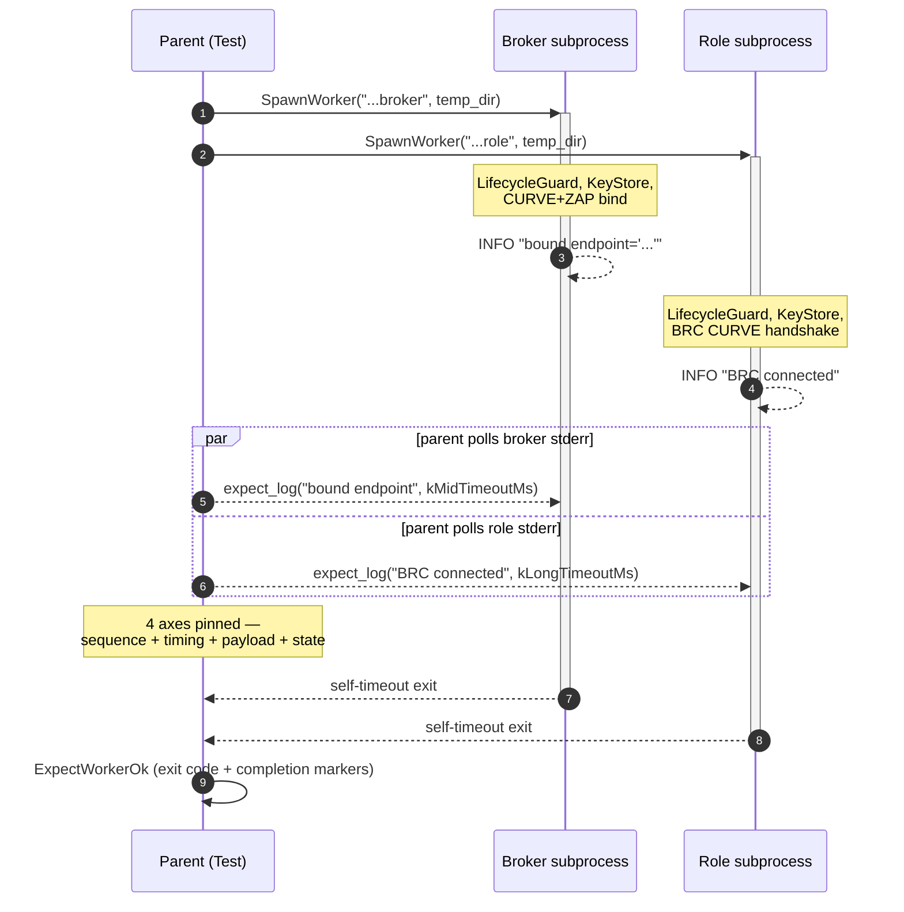
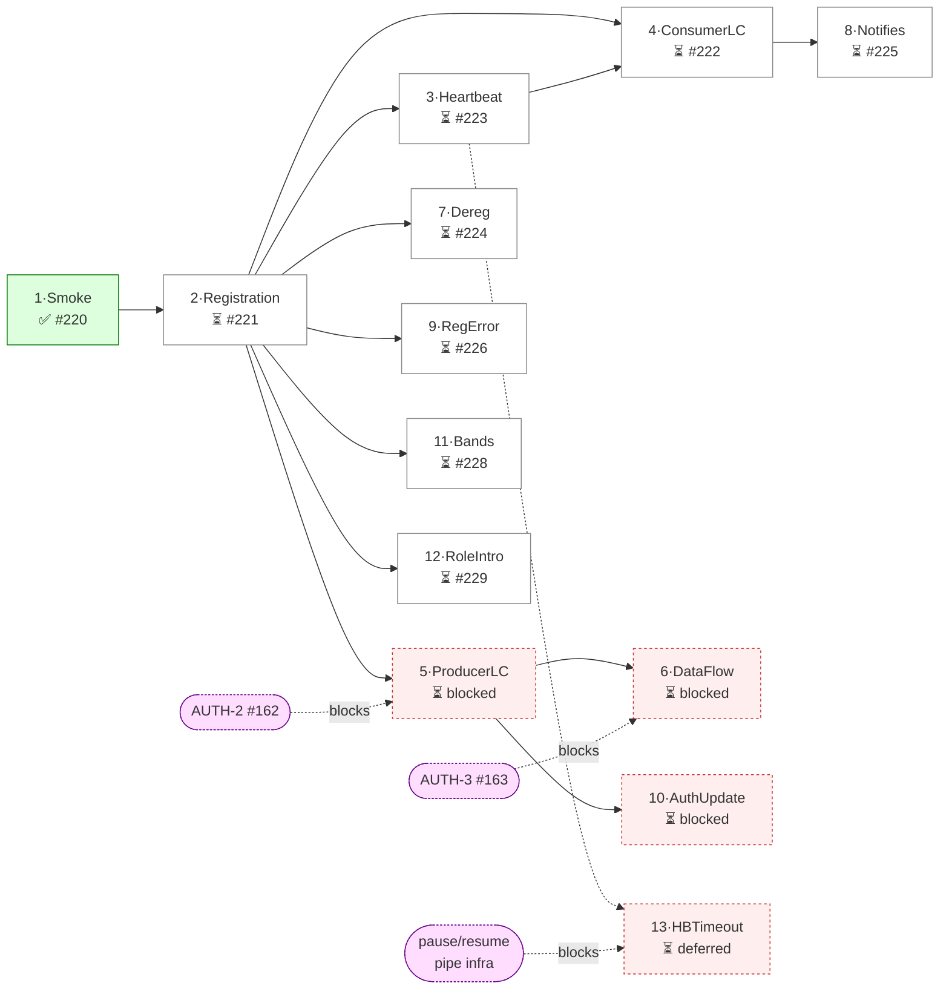

# C++ Test Suite Architecture

This document outlines the architecture of the pyLabHub C++ test suite. Its goal is to ensure that tests are organized, scalable, and easy for developers to write and run.

## Table of Contents
1. [High-Level Philosophy](#high-level-philosophy)
2. [Test Suite Structure](#test-suite-structure)
3. [Quick Start: Running Tests](#quick-start-running-tests)
4. [How to Add a New Test](#how-to-add-a-new-test)
5. [Multi-Process Testing Deep Dive](#a-deep-dive-how-multi-process-testing-works)
6. [Test Staging and Dependencies](#test-staging-and-dependencies)
7. [Platform-Specific Behavior](#platform-specific-behavior-and-gotchas)

## Related Documents

- [README_Versioning.md](README_Versioning.md) — Version scheme; version API tests live in `test_platform.cpp`
- **`docs/TODO_MASTER.md`** — Execution order and priorities for DataHub; test checklist and Phase C/D items live there.
- **`docs/IMPLEMENTATION_GUIDANCE.md`** — Testing strategy, test patterns, and **MessageHub code review** (DataHub integration).

---

## 1. High-Level Philosophy

Our test suite is built on four core principles:

1.  **Clarity**: Test code should be as readable and well-organized as the production code it validates.
2.  **Dependency Isolation**: Tests for base utilities (Layer 1) should not depend on full `pylabhub-utils` when testing foundational types (e.g. spin state/SpinGuard, `recursion_guard`, `scope_guard`).
3.  **Speed**: A fast "inner loop" is critical. Developers must be able to run only the tests relevant to their changes without waiting for a full suite build.
4.  **Assertion rigor (silent-failure prevention)**: Every load-bearing assertion must distinguish *which* path produced the outcome — not just whether the outcome was reached. **The full policy lives in `docs/IMPLEMENTATION_GUIDANCE.md` § "Assertion Design — silent-failure prevention"** (path discrimination, timing bounds, structural payload, sensitivity-check via mutation sweep, failure-mode catalog). README_testing.md does not duplicate that policy; this principle is the pointer.

To achieve this, we use a **multiple-executable model**, where different test categories have their own dedicated test executables.

### 1.1 Multi-process / subprocess test design principles

These apply whenever a test spawns subprocess workers — Pattern 3, Pattern 4, or any other multi-process scenario. Discovered the hard way during multiple test bring-ups; codified here so the lessons don't have to be relearned.

1. **Telemetry stays on the production data; the test reads it on demand.** When verifying state that's owned by production code, the test worker subprocess polls that state (e.g. snapshot of an entry, an atomic counter on a struct) and emits *test-only* log lines reporting the current value. Do NOT add production-side logging just because tests want to assert on a count — the production lifecycle (shutdown order, presence reaping, cleanup races) is hostile to "snapshot at end" patterns.

2. **Shutdown-summary log lines should report BOTH the count AND the elapsed window.** A line like `counter: sent=42 over 5000ms` is one parse away from a rate (`8.4 Hz`); a line like `counter: sent=42` is useless without a separate elapsed reading. Bake the window into the marker.

3. **Multi-process tests assert on RATES, not COUNTS.** The parent test cannot reliably control wall-clock windows for subprocesses — scheduling, lifecycle setup, signal propagation, and OS jitter all stretch the actual window. Compute the rate (`count / elapsed`) from observable state and assert on the rate. Rate is intrinsic; count requires window control the test framework cannot guarantee.

4. **Heavy subprocesses should self-detect "done" and exit autonomously.** Parent-driven shutdown signals (pipe-EOF, signal flags, etc.) are unreliable for subprocesses that have done significant lifecycle setup (multiple modules, thread pools, FD inheritance). Instead, the subprocess watches its own observable state (e.g. counter stable for N ticks, all peers disconnected, a single piece of work completed) and exits when the condition is met. The parent merely reaps. Simple subprocesses (no heavy lifecycle setup) can still rely on a parent quit-signal; reserve self-exit for the heavyweight cases.

5. **CI tolerance is wider than local tolerance.** Use the `PYLABHUB_CI_BUILD` compile-time flag (defined in `tests/test_framework/CMakeLists.txt`) to widen rate-band / timing tolerances on CI. Local mutation-discipline assertions stay tight; CI absorbs scheduling jitter without false-tripping.

6. **Iteration-count gates need explicit drivers in tests.** Some production code uses iteration-count predicates as gates for periodic work (e.g. periodic tasks that fire only when the host's main-loop iteration counter has advanced). Tests that bypass the production main loop must drive the iteration counter explicitly (e.g. a small background thread that calls `inc_iteration_count()`). When in doubt, grep for `iteration_count` against the production code your test exercises.

7. **Run the FULL L1+L2+L3+L4 sweep before committing any lib-side change.** A filtered sweep is for iteration; closure requires the unfiltered sweep. A change to a log marker, a struct field, a lifecycle step, or a helper signature can break tests in a layer you didn't touch. (Reinforces `feedback_lib_change_full_sweep.md`.)

8. **Subprocess "auto" behaviors should be observable in the log.** When the subprocess self-detects "done" (principle 4) or applies a workaround (e.g. fallback to a shorter timeout), it should log WHY it took that branch. Future test-failure investigations rely on the log explaining what the subprocess decided.

## 2. Test Suite Structure

The test suite is composed of several distinct **CMake targets** located in the `tests/` directory:

| Target | Type | Contents | Purpose |
|--------|------|----------|---------|
| `pylabhub-test-framework` | Static Library | Shared test infrastructure (`test_entrypoint.cpp`, `test_process_utils.cpp`, `shared_test_helpers.cpp`) | Common functionality for all test executables |
| **Layer 0** `test_layer0_platform` | Executable | Platform: `get_pid`, `monotonic_time_ns`, `is_process_alive`, `shm_*`, debug | Platform and version API |
| **Layer 1** `test_layer1_*` | Executables | `test_spinlock`, `test_recursion_guard`, `test_scope_guard`, `test_formattable` (spin state, SpinGuard, RecursionGuard, ScopeGuard, format tools) | Base utilities; depend only on staged utils |
| **Layer 2** `test_layer2_*` | Executables | Lifecycle, FileLock, Logger, JsonConfig, SharedSpinLock, CryptoUtils, Backoff, etc. (each test links only the workers it uses) | Service-layer tests; multi-process workers for FileLock, Logger, etc. |
| **Layer 3** `test_layer3_datahub` | Executable | DataHub: schema BLDS/validation, recovery API, slot protocol, phase A, error handling, MessageHub, DataBlockMutex (single executable, multiple worker files) | DataBlock/MessageHub tests; acts as worker process for multi-process tests |

This structure lets you build and run only the layer you need (e.g. `test_layer1_spinlock` or `test_layer3_datahub`) for a faster development cycle.

## 3. Quick Start: Running Tests

### Build and Stage Tests

```bash
# From project root
cd build

# Build and stage all tests (requires staged dependencies)
cmake --build . --target stage_tests

# Or if PYLABHUB_STAGE_ON_BUILD=ON (default), just build:
cmake --build .
```

Tests are staged to `build/stage-debug/tests/` along with all required DLLs and shared libraries.

### Run All Tests

```bash
# From build directory
ctest

# With output
ctest --output-on-failure

# Verbose
ctest -V
```

### Run Specific Test Suites

```bash
# Run all tests in InProcessSpinStateTest suite (spin state + SpinGuard)
ctest -R "^InProcessSpinStateTest"

# Run a single test case
ctest -R "^InProcessSpinStateTest.BasicAcquireRelease$"

# Run all Lifecycle tests
ctest -R "^LifecycleTest"

# Run all DataHub tests (Layer 3)
ctest -R "test_layer3_datahub"

# Run all multi-process tests
ctest -R "MultiProcess"
```

### Run Tests from Staged Directory

```bash
# Navigate to staged test directory
cd build/stage-debug/tests

# Run Layer 0 (platform)
./test_layer0_platform

# Run Layer 2 service tests with filter
./test_layer2_filelock --gtest_filter=FileLockTest.*

# Run Layer 3 DataHub tests
./test_layer3_datahub --gtest_filter=SlotProtocolTest.*

# List available tests
./test_layer3_datahub --gtest_list_tests

# Run with repeat for stress testing
./test_layer1_spinlock --gtest_repeat=100 --gtest_filter=InProcessSpinStateTest.*
```

### Closing a lib-contract change — full sweep required

When a lib-side change alters a contract (function requirements, what
the function throws, what it expects from its environment), filtered
test runs are NOT sufficient to declare the migration done.  Filtered
runs are for iteration; closure requires an unfiltered sweep by label:

```bash
# Required before claiming a lib-contract change is done.
ctest --test-dir build -L "layer2|layer3" --output-on-failure -j 1
```

Filtered runs (`--gtest_filter=*Pattern*`) only verify the test
surfaces the developer thought about.  Lib-contract changes can break
unrelated test surfaces that depend on the changed contract through
indirect call paths.  Examples seen in this repo:

- A `validate_auth_options` semantic tightening rejected empty
  `keystore_name` and broke 3 `ZmqQueueTest::*ProducerPeer*` tests
  that used the legacy `*_with_auth` factories (which existed pre-C2,
  #158) with empty options for non-CURVE reasons.  Both `_with_auth`
  factories and `ZmqAuthOptions` are now gone — the CURVE factories
  spell `pull_from` / `push_to` (the canonical names HEP-CORE-0040
  §8.4 always wanted).
- A `build_tx_queue` requirement change (now needs `"role_identity"`
  in KeyStore) broke `RoleApiFlexzoneTest.ZmqTxNull` which constructs
  a `RoleAPIBase` directly without the new setup.

Neither test file was edited as part of the lib change; both depended
on the lib contract.  The "I didn't touch that file" defense is
invalid — the right reasoning is "what depends on what I changed?"

Companion practice: when changing a lib contract, **grep its
downstream callers** before claiming done:

```bash
# Example: when the ZmqQueue CURVE factory contract changes, audit
# every direct caller (production + tests).  Post-C4 (#160) the
# canonical names are `pull_from` / `push_to`; pre-C4 transitional
# names `pull_from_curve` / `push_to_curve` no longer exist.
grep -rn "ZmqQueue::pull_from\b\|ZmqQueue::push_to\b" src/ tests/
```

For each downstream caller, audit the surrounding setup against the
new contract.  If a caller relies on the old behavior, either update
its setup or update the contract change itself.

### Practical Testing Workflows

**Workflow 1: Test-Driven Development**
```bash
# Edit code in src/utils/file_lock.cpp
# Edit test in tests/test_layer2_service/test_filelock.cpp

# Quick rebuild and test
cmake --build build --target test_layer2_service
cd build/stage-debug/tests
./test_layer2_filelock --gtest_filter=FileLockTest.BasicLocking
```

**Workflow 2: Debugging Test Failures**
```bash
# Run single test with debugger
cd build/stage-debug/tests
gdb ./test_layer2_filelock
(gdb) run --gtest_filter=FileLockTest.FailingTest
```

**Workflow 3: Continuous Integration**
```bash
# Build everything
cmake --build build

# Run all tests with XML output
cd build
ctest --output-junit results.xml --output-on-failure
```

## 9. A Deep Dive: How Multi-Process Testing Works

The multi-process testing logic is used for components like `pylabhub::utils::FileLock`, `JsonConfig`, and DataBlock. A test executable (e.g. `test_layer2_filelock` or `test_layer3_datahub`) can act as both a **"Parent"** (the test runner) and a **"Worker"** (a child process spawned to perform a specific task).

**FileLock tests and `.lock` files:** Tests use `clear_lock_file()` to remove lock files *before* each test run, ensuring isolation. In production, `.lock` files are harmless if left on disk; the library does not remove them on shutdown. If cleanup is desired (e.g., after a crash), use an external script when nothing is running.

This is managed by three key components in the `pylabhub-test-framework`:
1.  **`test_entrypoint.cpp`**: Provides the `main()` function for test executables. It checks command-line arguments. If a "worker mode" argument is present, it calls a registered dispatcher. Otherwise, it runs GoogleTest (`RUN_ALL_TESTS()`).
2.  **`test_process_utils.h`**: Provides the `WorkerProcess` RAII class, which is the primary tool for spawning and managing child processes. It handles argument passing, redirects the worker's stdout/stderr to files for inspection, and ensures the worker is terminated.
3.  **Worker dispatcher** (e.g. in each layer’s `workers/` and the test executable’s `main()`): Maps worker mode strings (e.g. `"filelock.nonblocking_acquire"`) to C++ worker functions so the child process runs the right code.

### Step-by-Step Execution Flow

This sequence diagram illustrates the flow for a multi-process `FileLock` test.

```mermaid
sequenceDiagram
    participant CTest
    participant Parent as test_layer2_filelock (Parent)
    participant Child as test_layer2_filelock (Worker)

    Note over CTest, Parent: Step 1: CTest runs the test executable.
    CTest->>Parent: ./test_layer2_filelock

    Note over Parent: Step 2: Parent process starts.
    Parent->>Parent: main() in 'test_entrypoint.cpp' is called.<br/>No worker args found, so it calls RUN_ALL_TESTS().

    Note over Parent: Step 3: GoogleTest runs a specific test case.
    Parent->>Parent: Executes TEST_F(FileLockTest, MultiProcessNonBlocking).

    Note over Parent, Child: Step 4: The Parent spawns a worker process (same executable).
    Parent->>Child: Creates WorkerProcess("filelock.nonblocking_acquire").<br/>fork/CreateProcess with worker argument.

    Note over Child: Step 5: Worker process starts.
    Child->>Child: main() in 'test_entrypoint.cpp' is called.<br/>Sees worker arg "filelock.nonblocking_acquire".

    Note over Child: Step 6: Worker dispatches to the correct function.
    Child->>Child: main() sees worker arg; dispatcher calls worker::filelock::nonblocking_acquire().

    Note over Child: Step 7: Worker executes test logic & exits.
    Child->>Child: The worker function runs its assertions and returns an exit code.

    Note over Parent: Step 8: Parent waits and verifies results.
    Parent->>Parent: proc.wait_for_exit() is called.<br/>Parent checks worker's exit code, stdout, and stderr.
```

## 4. How to Add a New Test

### Example 1: Simple Unit Test

Let's add tests for a new `StringUtils` class in `pylabhub-utils`.

1.  **Create the test file:** `tests/test_layer2_service/test_stringutils.cpp`
    ```cpp
    #include <gtest/gtest.h>
    #include "utils/StringUtils.hpp"  // Your new header

    using namespace pylabhub::utils;

    // Test suite name should match the class/component being tested
    TEST(StringUtilsTest, TrimWhitespace) {
        EXPECT_EQ(StringUtils::trim("  hello  "), "hello");
        EXPECT_EQ(StringUtils::trim(""), "");
        EXPECT_EQ(StringUtils::trim("   "), "");
    }

    TEST(StringUtilsTest, SplitString) {
        auto result = StringUtils::split("a,b,c", ',');
        ASSERT_EQ(result.size(), 3);
        EXPECT_EQ(result[0], "a");
        EXPECT_EQ(result[1], "b");
        EXPECT_EQ(result[2], "c");
    }

    TEST(StringUtilsTest, EdgeCases) {
        EXPECT_THROW(StringUtils::parse_int("not-a-number"), std::invalid_argument);
        EXPECT_NO_THROW(StringUtils::parse_int("42"));
    }
    ```

2.  **Update `tests/test_layer2_service/CMakeLists.txt`:**
    ```cmake
    add_executable(test_layer2_service
      # ... existing test files
      test_stringutils.cpp  # <-- Add your new test file here
    )
    ```

3.  **Build and run:**
    ```bash
    cmake --build build --target test_layer2_service
    ctest -R "^StringUtilsTest"
    ```

### Example 2: Test with Fixtures (Setup/Teardown)

For tests that need common setup:

```cpp
// tests/test_layer2_service/test_database.cpp
#include <gtest/gtest.h>
#include "utils/Database.hpp"

using namespace pylabhub::utils;

// Fixture provides setup/teardown for each test
class DatabaseTest : public ::testing::Test {
protected:
    void SetUp() override {
        // Runs before each TEST_F
        temp_db_path = "/tmp/test_db.sqlite";
        db = std::make_unique<Database>(temp_db_path);
        db->init();
    }
    
    void TearDown() override {
        // Runs after each TEST_F
        db.reset();  // Close database
        std::remove(temp_db_path.c_str());  // Clean up
    }
    
    std::string temp_db_path;
    std::unique_ptr<Database> db;
};

// Use TEST_F (not TEST) to access fixture members
TEST_F(DatabaseTest, InitialState) {
    EXPECT_TRUE(db->is_open());
    EXPECT_EQ(db->count_rows("users"), 0);
}

TEST_F(DatabaseTest, InsertAndQuery) {
    db->insert_user("Alice", 30);
    EXPECT_EQ(db->count_rows("users"), 1);
    
    auto user = db->get_user("Alice");
    EXPECT_EQ(user.age, 30);
}
```

### Choosing a test pattern

Every new test must be one of three sanctioned patterns, defined in
`tests/test_framework/test_patterns.h`. There is no fourth pattern, and no
hybrids.

| Pattern | Base class | When to use | Process model |
|---------|-----------|-------------|----------------|
| **Pattern 1 — `PureApiTest`** | `pylabhub::tests::PureApiTest` (or plain `::testing::Test`) | Pure functions, data structures, algorithms, compile-time traits — **no `LOGGER_*`, no `FileLock`, no `JsonConfig`, no module ctor that hits a lifecycle check** | In-process; runs in the main gtest runner |
| **Pattern 2 — in-process thread-racer** | plain `::testing::Test` with `ThreadRacer` | Concurrency tests that touch **no** lifecycle module | In-process; still no guard |
| **Pattern 3 — `IsolatedProcessTest`** | `pylabhub::tests::IsolatedProcessTest` | **Any** test whose body transitively reaches a lifecycle module (`Logger`, `FileLock`, `JsonConfig`, `CryptoUtils`, `ZMQContext`, `HubConfig`, `SchemaStore`, hub `DataBlock`); crash/abort tests; finalize/shutdown tests; IPC tests | Parent spawns a subprocess per `TEST_F`; worker owns its own `LifecycleGuard` |
| **Pattern 4 — multi-process wire protocol** | `pylabhub::tests::IsolatedProcessTest` (parent) + one Pattern-3 worker per role | Tests that drive a wire protocol between two or more processes that each independently claim a process-global resource (canonical case: HEP-CORE-0036 §7.4 single-pumper invariant — broker + role cannot share a process). Mirrors the production single-role-per-process deployment shape. | Parent spawns N worker subprocesses (one broker + N−1 roles). Each subprocess owns its own `LifecycleGuard` and runs production code for its role. Parent is a pure observer — log-driven sequence assertions + `ExpectWorkerOk` per subprocess. |

#### The framework contract (absolute)

> **Any test whose body transitively requires a lifecycle module MUST run
> inside a spawned worker subprocess.** The test-runner process owns no
> lifecycle. No exceptions.

Root-cause reasoning is documented in **`docs/HEP/HEP-CORE-0001-hybrid-lifecycle-model.md` § "Testing implications"**. In short:

- `LifecycleManager` is a process-global singleton; reconstructing the guard
  per-`TEST_F` breaks the initialize-exactly-once invariant relied on by
  `ModuleDef::startup` callbacks (most visibly `ThreadManager`, which registers
  a dynamic module on first init).
- Library-global destructors for `libzmq`, `luajit`, and `libsodium` can hang
  indefinitely on program exit. Worker subprocesses call `_exit()` after their
  `LifecycleGuard` teardown to skip these — a path only available if the
  subprocess owns the lifecycle. See the comment block at
  `tests/test_framework/shared_test_helpers.h:303-322`.

  **Important: `_exit()` does NOT bypass our `LifecycleGuard` finalize.**
  The execution order in `run_gtest_worker` is:

  1. Test body runs (constructs/uses lifecycle-backed objects).
  2. `LifecycleGuard` destructor runs `LifecycleManager::finalize()`, which
     invokes every registered module's `shutdown` callback in reverse
     topological order — `ZMQContext::shutdown` → `zmq_ctx_term`,
     `Logger::shutdown` → flush + worker-thread join, `FileLock::shutdown`
     → release pending locks, etc. **This is the contract any module test
     under Pattern 3 actually verifies.**
  3. `ThreadManager` leak check (any detached threads → exit code 4).
  4. `_exit(N)` — skips only library-global static destructors that are
     *outside* our lifecycle graph (libzmq's own cleanup hooks, libsodium's
     `__attribute__((destructor))`, luajit GC finalizers). Those are owned
     by the third-party libraries; they are not part of any contract a
     pylabhub module registered with `LifecycleManager`.

  So a worker that exercises `hub::ZMQContext` does validate that our
  init/finalize correctly drives `zmq_ctx_term`. What it does not validate
  is whether libzmq's *own* destructors run cleanly afterwards — and that
  is intentional, since those are not our contract. If a future test needs
  to verify clean process exit including third-party static destructors,
  use `run_worker_bare` (no implicit `_exit`) and assert the subprocess
  returns within a tight ctest TIMEOUT.

#### Worker completion milestones (silent-shortcircuit catch)

`run_gtest_worker` and `run_worker_bare` automatically emit three
markers to stderr around the test body:

| Marker | When emitted | What it proves if present |
|---|---|---|
| `[WORKER_BEGIN] <test_name>` | Before `LifecycleGuard` is constructed | The dispatcher routed correctly and the worker function entered |
| `[WORKER_END_OK] <test_name>` | After `test_logic()` returns without throwing | The body ran end-to-end (no failed `EXPECT_*`/`ASSERT_*`, no escaped exception) |
| `[WORKER_FINALIZED] <test_name>` | After `LifecycleGuard`'s destructor returns | Module finalize completed without hanging or aborting |

`expect_worker_ok` (and `IsolatedProcessTest::ExpectWorkerOk`) require
all three by default. This closes the failure mode where a body
short-circuits before reaching its asserts (early return, GTEST_SKIP,
unreachable lambda) but the worker still exits 0 — exit-code-only
checking would mark that as passing.

When a test legitimately bypasses `run_gtest_worker` (process-shared
mutex / FileLock workers that *must* die holding a resource), the
parent uses `ExpectLegacyWorkerOk` (or passes
`require_completion_markers=false` to `helper::expect_worker_ok`).
This opt-out should be reserved for genuine multi-process IPC tests;
new tests must always go through `run_gtest_worker` so the catch
applies.

The "abort" workers (e.g. `RoleHostBase` dtor-contract tests that
deliberately trigger `PLH_PANIC` → `std::abort`) do not call
`ExpectWorkerOk` at all — they have a dedicated checker that asserts
`exit_code != 0` plus the panic substring in stderr.
- A panic/`abort()`/clean-`finalize()` inside one test must not corrupt the
  singleton state observed by the next test. Per-test subprocesses are the
  only enforcement mechanism.

#### Decision checklist

Before writing a new test, answer these in order. If you get to "yes" before
"no", you are on Pattern 3:

1. Does my test call any `LOGGER_*` macro? (Logger is lifecycle-backed.)
2. Does my test construct any class that lists `GetLifecycleModule()` in its
   public API, or any class that takes a `FileLock`/`JsonConfig` in its ctor?
3. Does my test call `RoleConfig::load_from_directory`, `JsonConfig::load`,
   `FileLock(...)`, or anything in `src/scripting/`?
4. Does my test construct a `Messenger`, `BrokerService`, `hub::Producer`,
   `hub::Consumer`, `hub::Processor`, `ShmQueue`, `ZmqQueue`, `ThreadManager`,
   `RoleHostBase`, or a script engine?

If any of the above is **yes**, the test body goes into a worker subprocess.
If **all are no**, Pattern 1 or 2 is allowed.

5. **Does my test drive a wire protocol between two or more processes
   that each claim a process-global resource the library enforces
   single-owner per process?** Canonical case: HEP-CORE-0036 §7.4
   forbids broker + role co-existing in one process (single-pumper
   invariant on the inproc ZAP REP socket).  Tests of the broker
   ↔ role wire protocol must mirror the production deployment — one
   role per process — so each side has its own pumper claim.  If
   yes → Pattern 4.

#### Antipatterns (forbidden)

| Antipattern | Why it breaks | Correct approach |
|-------------|---------------|-------------------|
| `std::unique_ptr<LifecycleGuard> guard_` owned by a test fixture and (re)constructed in `SetUp()` | Re-runs `initialize()` per test; half-registers dynamic modules; may look fine in isolation but corrupts state across tests | Move the test body into a worker function that wraps in `run_gtest_worker` |
| `SetUpTestSuite() { static LifecycleGuard g(...); }` as a "compromise" | Still in-process; still runs pylabhub static-dtor order at program exit; hides the 60s hang behind "it passed on my machine" | Same — spawn a worker per `TEST_F` |
| `EXPECT_DEATH(...)` inside a lifecycle-backed body | Death-test fork inherits half-initialized state; flakes under load | Spawn a worker that deliberately aborts; parent asserts `exit_code != 0` + panic text |
| Linking the test binary against both `pylabhub::test_framework` and `GTest::gtest_main` | Two `main()` definitions → link error | Link `pylabhub::test_framework` only — it provides `main()` via `test_entrypoint.cpp` |
| Worker body returning normally (falling off the end) | Runs pylabhub-utils + libzmq + luajit static dtors → potential 60s hang on CI | Call `run_gtest_worker(...)` and let it `_exit()` |
| **In-process broker + role co-host** (e.g., the retired `HubHostBrokerHandle` pattern that owned a `BrokerService` while the same process also ran a `BrokerRequestComm`) | Violates HEP-CORE-0036 §7.4 single-pumper invariant — both the broker poll thread and the BRC poll thread try to drain the same inproc ZAP REP socket, and the `PumpScope` counter PANICs (exit 134) when their `pump_one` calls race.  Under `-j 2` the race fires probabilistically and looks like flake on the surface; under isolation it doesn't fire and looks like the test passed.  **Treat the PANIC as the bug it actually is, not as flake.** | Pattern 4 — subprocess per role.  Broker runs in its own subprocess; the role's BRC runs in another.  They communicate over the production wire protocol — same as `plh_hub` + `plh_role` in production. |

> **Migration history (2026-05-14, closed).** The Pattern-3 migration
> wave converted all 23 then-noncompliant files off the
> `SetUpTestSuite`-owned `LifecycleGuard` antipattern.  Closure
> record: `docs/todo/TESTING_TODO.md` § "✅ Closed 2026-05-14:
> Pattern-3 migration debt wave — all 23 files migrated" +
> commits `6dfb86d`..`1ed9cc8` (also in `TODO_MASTER.md`
> § "Side-arc cleanup waves completed").  A grep across `tests/`
> for `SetUpTestSuite` today returns only migration-history doc
> comments (`"Migrated 2026-05-14 from the in-process ...
> antipattern"`); no actual antipattern code remains.  Rule above
> applies to all new tests.

#### gtest-spi macros are NOT usable in Pattern-3 worker bodies

`EXPECT_NONFATAL_FAILURE`, `EXPECT_FATAL_FAILURE`, and
`EXPECT_FATAL_FAILURE_ON_ALL_THREADS` (from
`<gtest/gtest-spi.h>`) **do not work** inside `run_gtest_worker` /
`run_worker_bare` bodies.  These macros are gtest's mechanism for
testing assertion-emitting code: they install a
`TestPartResultReporter` that intercepts failures going through the
reporter chain, then assert the captured failure matches an expected
substring.

`run_gtest_worker` enables `GTEST_FLAG(throw_on_failure) = true` at
entry (`shared_test_helpers.h:246`) so any `ADD_FAILURE` /
`ASSERT_*` / `EXPECT_*` failure **throws** `::testing::internal::
GoogleTestFailureException` instead of going through the reporter
chain.  This is the silent-shortcircuit guard described in
§"Worker completion milestones" above (it's what makes a body that
short-circuits via early `return` from gtest's macro internals
surface as a worker failure rather than a false pass).

The throw mechanism **bypasses** gtest-spi's reporter — the
exception escapes the macro entirely, lands in `run_gtest_worker`'s
catch block, and the worker exits non-zero with a `[WORKER FAILURE]`
marker.  The substring-match logic inside `EXPECT_NONFATAL_FAILURE`
never executes.

**Correct pattern for worker bodies that need to verify "this inner
code emits an assertion failure":** plain try/catch on
`GoogleTestFailureException`, inspect `e.what()` for the expected
substring.  The exception's what() string includes the full
`ADD_FAILURE` message (line + the streamed `<<` context), so the
substring pin is equivalent.

```cpp
LOGGER_WARN("[test] this WARN was not declared");

bool threw = false;
std::string msg;
try {
    cap.AssertNoUnexpectedLogWarnError();   // expected to ADD_FAILURE
}
catch (const ::testing::internal::GoogleTestFailureException &e) {
    threw = true;
    msg = e.what();
}
EXPECT_TRUE(threw)
    << "AssertNoUnexpectedLogWarnError() should have thrown on an "
       "undeclared WARN line";
EXPECT_NE(msg.find("unexpected WARN"), std::string::npos)
    << "failure message did not pin 'unexpected WARN'; got:\n" << msg;
```

The pattern pins both that the inner code **did** fail (`threw`) AND
that the failure message **named the right contract violation**
(`find(needle)`) — same depth as the gtest-spi version, no
mechanism mismatch.

**Reference implementation**:
`tests/test_layer2_service/workers/log_capture_fixture_workers.cpp`
(the migration of `LogCaptureFixture`'s own self-tests).  The file's
header comment documents the deviation in full.

**Compile-time enforcement**: not currently enforced via static
assertion.  If you see `EXPECT_NONFATAL_FAILURE` / `EXPECT_FATAL_FAILURE`
in a file under `tests/.../workers/`, it is a bug.  Layer 1 tests
running in the main gtest runner (no `run_gtest_worker`) may use
these macros normally — the flag is `false` there.

**Note on `EXPECT_NO_FATAL_FAILURE`**: that's a *different* macro
(standard gtest, not gtest-spi) which checks that the wrapped
statement did NOT trigger a fatal failure.  It works fine in either
context.

---

### Pattern 1+ — binary-wide `LifecycleGuard` for in-process tests

> Added 2026-05-14 with the `BinaryLifecycleEnvironment` framework
> hook.  Use this **only after careful examination** — see the
> decision criteria below.

Some lifecycle-touching tests are pure-logic at the test level (no
cross-test interference, no init-once invariant being re-violated,
no library-global static-dtor hang risk at exit) but the subject
under test emits `LOGGER_*`.  Forcing Pattern 3 subprocess isolation
for these adds ~50 ms fork overhead per test with **no isolation
gain**.

`BinaryLifecycleEnvironment` (declared via the
`PLH_BINARY_LIFECYCLE_MODULES` macro from `binary_lifecycle.h`)
initializes the lifecycle modules **once for the binary's
`RUN_ALL_TESTS` scope** — registered as a gtest
`::testing::Environment`, so gtest's main runner calls SetUp/TearDown
around `RUN_ALL_TESTS`.  Tests run in-process and use
`LogCaptureFixture` per-test as usual.

**Scope, vs. the other lifecycle mechanisms:**

| Mechanism | Owner | Scope | Use case |
|---|---|---|---|
| `run_gtest_worker` / `run_worker_bare` | subprocess body | one subprocess test | Pattern 3 — lifecycle-touching tests with isolation |
| `SetUpTestSuite` LifecycleGuard | test fixture (static) | one fixture's tests | **Antipattern** — migration target |
| `BinaryLifecycleEnvironment` | gtest Environment | binary `RUN_ALL_TESTS` | **Pattern 1+** — in-process lifecycle-touching tests with no cross-test interference |

`BinaryLifecycleEnvironment` is mutually compatible with Pattern 3
in the same binary: subprocess workers spawn fresh, install their
own guard via `run_gtest_worker`, and never see the parent's
environment.

#### Decision checklist — when to use binary-wide vs. subprocess

Before adopting `BinaryLifecycleEnvironment`, **examine the
interference vectors** for the tests in question:

1. **Static state in the subject class(es).**  Are there any
   `static` members, global state, or process singletons the tests
   write that future tests in the same binary would see?  Examine
   the source.  If yes → Pattern 3.
2. **Init-once invariant violations.**  Does any test re-run
   `initialize()` per TEST_F (e.g., construct multiple
   `LifecycleGuard`s in a single binary scope)?  If yes → either
   redesign or Pattern 3.
3. **Library-global static-dtor hang risk at program exit.**
   Does the binary leave libzmq / luajit / libsodium state alive
   at `main()` return?  Per-test contexts that are destroyed in
   TearDown are typically fine; long-lived contexts kept beyond
   `RUN_ALL_TESTS` are not.  If unsure → Pattern 3.
4. **Crash isolation needs.**  Do the tests deliberately panic /
   abort / call `finalize()`?  If yes → Pattern 3 is the only
   safe choice.

If all four examinations come back clean, `BinaryLifecycleEnvironment`
is appropriate.  When in doubt, use Pattern 3 — it's strictly safer.

#### Usage

In any TU of the test binary, at file scope:

```cpp
#include "binary_lifecycle.h"
#include "utils/logger.hpp"

PLH_BINARY_LIFECYCLE_MODULES(
    pylabhub::utils::Logger::GetLifecycleModule()
)
```

Then write tests as plain `::testing::Test` fixtures (with or
without the `LogCaptureFixture` mixin).  No `SetUpTestSuite`-owned
LifecycleGuard.  No subprocess workers.

#### Reference implementations

- `tests/test_layer1_base/test_periodic_task.cpp` — pure Pattern 1
  (PureApiTest); no Logger, no LogCaptureFixture.  Tests a
  stack-local struct's `tick()` logic.
- `tests/test_layer2_service/test_zmq_poll_loop.cpp` — Pattern 1+
  with a one-module guard (Logger only).  Subject emits
  `LOGGER_INFO`/`LOGGER_WARN`, so binary-wide Logger via
  `PLH_BINARY_LIFECYCLE_MODULES` + per-test `LogCaptureFixture`.
- `tests/test_layer2_service/test_admin_service.cpp` — Pattern 1+
  with a five-module guard (Logger + FileLock + JsonConfig +
  crypto + ZMQContext).  Demonstrates Pattern 1+ for tests that
  drive real `HubHost` + `AdminService` in-process — the full
  set of lifecycle modules a service-layer test needs.

---

### Pattern 4 — Multi-process wire protocol test (subprocess-per-role + observing parent)

> Added 2026-06-13 as the structural answer to the L3 test
> regression surfaced by AUTH-2 (task #220 ↔ #162).  Pattern 4
> formalises what production already did informally — one role per
> process — and brings test harnesses into alignment with the
> single-pumper invariant the library enforces at runtime
> (HEP-CORE-0036 §7.4).

Some tests verify the **wire protocol** between two processes that
each independently own a process-global resource: the broker owns
the inproc ZAP REP socket's pumper in `plh_hub`; the BRC owns it
in `plh_role`.  The library forbids both from claiming the role
in the same OS process (§7.4 invariant 3 — `PumpScope` PANICs on
concurrent pumper entry).  This invariant is **production
behaviour**, not test infrastructure, so tests must respect it
rather than ask the library to bend.

Pattern 4 mirrors production: each role gets its own subprocess
(Pattern 3 worker); they talk to each other over the actual
network wire; the parent test process is a pure observer that
verifies the expected sequence of events by reading each
subprocess's live stderr stream.

#### Process model

| Process | Role |
|---|---|
| Parent (the `TEST_F` itself) | Spawns N subprocesses (one broker + N−1 roles).  Pure observer — never drives, signals, or coordinates state.  Picks the broker's TCP port up-front, writes a production-shaped `hub.json` to a per-test temp dir, then spawns each subprocess with the temp dir as a CLI arg. |
| Broker subprocess | A Pattern-3 worker.  Owns its own `LifecycleGuard`, constructs `BrokerService` from the parent's `hub.json`, retries `EADDRINUSE` on bind, runs the broker until told to quit. |
| Role subprocess(es) | A Pattern-3 worker per role.  Owns its own `LifecycleGuard`, constructs `BrokerRequestComm` from the same `hub.json`, connects to the broker over TCP using the production retry-on-connect behaviour, registers, runs the role's behaviour until told to quit. |

The parent does **no logic**.  It does not send "now do X" commands;
it does not synthesise the broker's view of state; it does not
verify cross-process invariants by reaching into either side's
memory (it can't — they're different processes).  Its only
responsibilities are setup-plumbing (pick a port, write `hub.json`,
launch subprocesses) and verdict-rendering (read each subprocess's
stderr for the expected event sequence, then call
`ExpectWorkerOk`).

#### Bootstrap (parent setup)

The parent calls a small helper that:

1. **Picks an unused TCP port** with retry — binds to `tcp://127.0.0.1:0`,
   captures the OS-assigned port, closes the socket, retries up to N
   times if anything fails.  This is best-effort under `-j 2` load;
   the broker's bind-side retry (next subsection) catches the small
   race window where another process grabs the port between close
   and the broker's bind.
2. **Writes a production-shaped hub directory** to a per-test temp
   dir — `hub.json` containing the chosen endpoint + broker's pubkey,
   plus `vault/known_roles.json` listing every role uid the test
   uses.  The format is identical to what `plh_hub init` emits in
   production, so subprocesses read it via `HubConfig::load_from_directory`
   with no test-only code path.
3. **Spawns each subprocess** with the temp dir path as its CLI arg.

There is no broker-side "ready signal" the parent has to wait for.
The role's BRC has connect-retry built into its production
behaviour (it retries connect for `kMidTimeoutMs` before giving up);
so even if the role subprocess starts before the broker has
finished binding, the role naturally waits.

#### Bind robustness (broker subprocess)

In CI, TCP ports can be transiently unavailable (port churn,
`TIME_WAIT` from prior tests, races between parent's
find-unused-port helper closing the socket and the broker's bind
opening it).  The broker subprocess wraps its bind step in a
retry-on-`EADDRINUSE` loop with exponential backoff:

```cpp
auto backoff = std::chrono::milliseconds{10};
for (int attempt = 0; attempt < 4; ++attempt) {
    try {
        broker = std::make_unique<BrokerService>(cfg, ...);
        break;
    } catch (const zmq::error_t &e) {
        if (e.num() == EADDRINUSE && attempt < 3) {
            LOGGER_WARN("broker bind EADDRINUSE — retry in {}ms "
                        "(attempt {}/4)", backoff.count(), attempt + 1);
            std::this_thread::sleep_for(backoff);
            backoff *= 5;  // 10 → 50 → 250 → fail
            continue;
        }
        throw;  // last attempt or non-EADDRINUSE — surface clearly
    }
}
```

**This retry lives in the test wrapper, not in `BrokerService::bind`.**
Production `plh_hub` operators bind to an explicitly-configured port;
if that port is unavailable, they deserve to see `EADDRINUSE`
immediately so they can fix the config.  Silent retries would mask
a real operator-facing problem.  The test-side retry is scoped to
the test harness, where transient CI noise is a known concern.

#### Coordination between subprocesses

**The only coordination channel between subprocesses is the
production wire protocol they are testing.**  No back-channel
pipes; no shared files; no parent-mediated step-by-step
synchronisation; no test-specific RPC.

Concretely:
- The role's BRC connects to the broker's TCP endpoint and goes
  through the production REG_REQ / REG_ACK handshake.
- Heartbeats flow per HEP-CORE-0023 §2.5; if either side dies, the
  surviving side's existing hub-dead / heartbeat-timeout machinery
  fires.
- Channel notifications, allowlist updates, federation messages —
  whatever the production protocol says — happen normally.
- The test exercises the wire protocol by **using the wire protocol**.

The parent test does not orchestrate any of this.  It only
observes the resulting log output.

#### Termination via quit-signal pipe (canonical Pattern 4 pattern)

Subprocesses cannot run forever; the test framework needs a clean
way to tell them "you're done."  Pattern 4 uses a parent-to-child
back-channel pipe — a mirror of the existing `with_ready_signal`
pipe but in the opposite direction.

**Implementation surface** (POSIX as of task #221; Windows TBD):

| Component | Where | Role |
|---|---|---|
| `SpawnWorkerWithQuitSignal(scenario, args)` | `test_patterns.h` | Parent spawns subprocess + creates pipe; child sees `PLH_TEST_QUIT_FD` env var pointing at read end. |
| `WorkerProcess::signal_quit()` | `test_process_utils.h` | Parent closes its write end → child's `read()` returns EOF.  Idempotent. |
| `wait_for_quit_or_safety_timeout(seconds)` | `shared_test_helpers.h` | Worker-side: blocks on `poll(PLH_TEST_QUIT_FD)` until parent signals (`QuitSignal`), safety timeout fires (`SafetyTimeout`), or env var missing (`NoQuitPipe`). |

**Parent-side flow** (mirrors what a careful production deploy does):

```cpp
auto broker = SpawnWorkerWithQuitSignal("...broker", {temp_dir.string()});
// Pin assertions on the shared log (or per-subprocess stderr) here.
expect_log_sequence(shared_log, {...}, kLongTimeoutMs);
// Tell broker it's done — read() returns EOF in the worker.
broker.signal_quit();
ExpectWorkerOk(broker);  // wait_for_exit() + completion-marker check
```

**Worker-side flow** (in the lambda passed to `run_gtest_worker`):

```cpp
// ... build BrokerService / RoleAPIBase, run main work ...
const auto wait_result =
    pylabhub::tests::helper::wait_for_quit_or_safety_timeout(
        std::chrono::seconds{60});  // safety covers parent crash
switch (wait_result) {
case QuitWaitResult::QuitSignal:    /* parent done — normal exit */ break;
case QuitWaitResult::SafetyTimeout: LOGGER_WARN(...); break;
case QuitWaitResult::NoQuitPipe:    std::this_thread::sleep_for(3s); break;
}
broker->stop();
broker_thread.join();
```

**Why this matters** (task #221 measurement):

| Termination pattern | Smoke test wall time | Registration test wall time |
|---|---|---|
| Fixed self-timeout (the legacy placeholder) | 5.0 s | 10.0 s |
| Quit-signal pipe (this section) | ~0.4 s | ~0.4 s |

The 23× speedup matters: Pattern 4 has 12 in-scope rungs; at 10 s
per rung the family adds 2 minutes to every L3 sweep.  At 0.4 s it
adds 5 s.  Future rungs MUST use this pattern — the legacy
self-timeout is preserved only as the `NoQuitPipe` fallback in the
helper, and any new Pattern-4 test that doesn't use the quit-signal
flow is a code-review red flag.

The safety timeout (60 s by convention) covers the only failure
mode the pattern doesn't handle directly: a parent process that
crashes mid-test before calling `signal_quit()`.  In that case the
worker eventually wakes and exits with a `LOGGER_WARN` so CI logs
make the leak visible.

#### Verification — log-driven sequence assertion

The parent verifies test outcome by reading each subprocess's
captured stderr file (`WorkerProcess::stderr_path()`) and asserting
on the presence and order of specific log lines:

```cpp
expect_log(role_proc,   "BRC: connected to broker",
           pylabhub::kShortTimeoutMs);
expect_log(role_proc,   "sending REG_REQ role=role.x",
           pylabhub::kShortTimeoutMs);
expect_log(broker_proc, "received REG_REQ from role.x",
           pylabhub::kShortTimeoutMs);
// ... etc ...
```

`expect_log(proc, substring, timeout)` polls the subprocess's
stderr file with millisecond granularity until either:
- the substring is found in any line written since the previous
  `expect_log` returned (success — continues to the next assertion),
- or the timeout elapses with no match (failure — gtest assertion
  fires with the message *"expected log line containing '...' in
  `<scenario>` worker stderr within Xms — last 5 lines were ..."*).

**Timeout values come from canonical library constants** —
`kShortTimeoutMs`, `kMidTimeoutMs`, `kLongTimeoutMs` in
`utils/timeout_constants.hpp` — or HEP-defined intervals such as
the heartbeat cadence per HEP-CORE-0023 §2.5.  **Hardcoded numbers
like `2s` or `100ms` are forbidden** — they drift from the actual
library timing the test is supposed to verify.

When all expected events have appeared, the parent sends the quit
signal to each subprocess and calls `ExpectWorkerOk` on each.  The
standard worker-completion markers
(`[WORKER_BEGIN]` / `[WORKER_END_OK]` / `[WORKER_FINALIZED]`)
plus exit code 0 are the final verdict.

#### Verification rigor — four axes + mutation discipline

A Pattern-4 test that only asserts "marker X appears somewhere"
is too weak — it can pass when the contract is subtly broken.
Every test under `tests/test_layer3_pattern4/` must pin **four
axes**:

| Axis | What this pins | Loose form (don't) | Tight form (do) |
|---|---|---|---|
| **Sequence** | events happen in the right order | three `expect_log` calls in arbitrary order | `expect_log_sequence({m1, m2, m3})` — fails if m2 appears before m1 |
| **Timing** | the next event happens within a bounded window | timeout = 30 s for every call | per-step bound from canonical constants (REG_ACK within `kMidTimeoutMs` of REG_REQ; first heartbeat within `kShortTimeoutMs * 2`) |
| **Payload** | wire content matches contract | `expect_log(role, "REG_ACK received")` | `expect_log(role, "REG_ACK received producers=[role.y@tcp://...]")` — pin the bracketed payload |
| **State** | every transition is observable, not just the end state | only pin the final `Active` state | pin `Connecting→Pending`, `Pending→Registered`, `Standby→Active` as separate markers |

And one **mutation discipline** rule that subsumes the rest:

> Every assertion must be sabotage-verifiable: if you remove the
> one line of production code that makes the marker fire, the
> test must fail.  If the test still passes, the assertion is
> too loose — tighten it before merging.

The smoke test (rung 1 of the test ladder below) demonstrates the
floor: a single log-content assertion verified by deliberate
sabotage of the expected substring.  Richer rungs build on the
same floor and add sequence + payload + state axes per the table
above.

What a Pattern-4 test looks like in motion — parent observer,
two subprocesses, log markers as the only verification surface:



The diagram pins three structural facts: (1) subprocesses
COMMUNICATE only over the production wire (CURVE handshake),
never out-of-band; (2) the parent OBSERVES through captured
stderr only — no shared memory, no test-only IPC; (3) log
markers are the verification surface — every test rigour axis
applies to those markers, nothing else.

#### Timestamp precision

Production's `LOGGER_*` macros emit lines like:

```
[LOGGER] [INFO  ] [2026-06-14 03:09:41.890661] [PID:240812 TID:240815] ...
```

The microsecond-precision wall-clock timestamp lets a Pattern-4
parent assert relative ordering across subprocesses even when their
stderr files are merged out-of-order.  If a test cares about
"event X happened after event Y by less than Z ms," it can parse
both files post-hoc and assert on the timestamp delta — though in
practice most Pattern-4 tests get all the rigour they need from
the in-order `expect_log` polling alone.

#### Subprocess responsibilities

Each Pattern-4 subprocess:

1. **Runs production code** — `BrokerService` for the broker
   subprocess, `BrokerRequestComm` (and any `RoleHost` shells) for
   the role subprocess.  No test-only code paths inside the wire
   protocol layer.
2. **Emits detailed logs** — production logging already covers
   every event a Pattern-4 test typically needs: connect / register
   / heartbeat / notification / disconnect.  Tests should pin
   against the production log lines, **not** demand custom test-only
   log emissions.  If a wire-relevant event lacks a production log
   line that a test wants to pin, the fix is a small additive log
   to the library (which production diagnostics also benefits from)
   — **not** a test-only debug print.
3. **Honours the quit signal** — polls `PLH_TEST_QUIT_FD` on every
   cycle of its poll loop; on quit byte, performs clean shutdown.
4. **Exits cleanly** — runs `LifecycleGuard` finalize via
   `run_gtest_worker`'s standard tail, emits the three completion
   markers, calls `_exit(0)` on success.
5. **Runs per-scenario assertions on locally-owned state** via
   direct C++ access — each subprocess owns its lifecycle, so
   tests that need to peek at broker-internal state (channel
   snapshot, registry contents, etc.) do so from inside the broker
   subprocess via `gtest`'s `EXPECT_*` macros.  If an assertion
   fails inside a subprocess, the subprocess exits non-zero and
   the parent's `ExpectWorkerOk` surfaces the failure.

#### Logging discipline — what subprocesses log and what they DON'T

Pattern 4 verification depends on log markers, but those markers
live in production code paths.  Bad logging discipline either
(a) makes the test impossible to write (no marker to pin) or
(b) pollutes production logs (per-tick INFO floods the journal).
The rules below apply to **any** production code change driven
by a Pattern-4 test.

**INFO is one-shot only.**  Acceptable INFO call sites:

- **State transitions** — `Connecting→Pending`,
  `Pending→Registered`, `Standby→Active`, `→Authorized`.  Fire
  exactly once per presence / channel per state edge.
- **One-time events** — REG_REQ sent, REG_ACK received,
  heartbeat tracker installed, channel registered, broker bind
  succeeded, first tick received per role.
- **Lifecycle** — subprocess `[WORKER_BEGIN]` / `[WORKER_END_OK]`
  / `[WORKER_FINALIZED]` (framework-provided).

**Hot paths get counters, not per-event INFO.**  Per-heartbeat
tick (every ~250 ms × per channel × per role), per-poll iteration,
per-message pump, per-ZAP request — these fire hundreds to
thousands of times per second.  Logging INFO at any of them
would (a) flood production journals and (b) make CI logs
unreadable.  Two acceptable patterns instead:

- **Consequence-pinning (preferred default).**  Instead of
  verifying "heartbeats ticked," pin the consequence: e.g.
  `Standby→Active` only fires after heartbeat establishment +
  master/peer approval.  If that transition appears within a
  bounded window, heartbeat is implicitly working.  **Use this
  by default**; only fall back to counters when the consequence
  is too indirect.
- **Counter + shutdown-summary INFO.**  The module keeps atomics
  (`heartbeats_sent_`, `heartbeats_received_`) and emits **one**
  INFO at shutdown summarising the count and rate band:
  `"role.x: heartbeats_sent=42 over 5.0 s (~8.4 Hz, expected ~4 Hz)"`.
  The test pins the rate band.  No per-tick logging anywhere.

**Anti-pattern (do NOT do this):**

```cpp
// in heartbeat_tick() — fires every 250 ms forever
LOGGER_INFO("Heartbeat tick fired for role.x");  // ✗ floods journal
```

**Right pattern (one-shot guard):**

```cpp
// in BrokerService — fires once per role on first tick received
if (!presence.first_tick_logged_) {
    LOGGER_INFO("BrokerService: role '{}' heartbeat established "
                "(first tick at T+{}ms)",
                uid, since_reg.count());
    presence.first_tick_logged_ = true;
}
```

The rule extends transitively: when a production change makes a
hot path eligible for INFO, ask "could this fire >10× in any
realistic deployment?" — if yes, demote to DEBUG or replace with
a counter + shutdown summary.

#### Example skeleton

```cpp
// tests/test_layer3_datahub/test_role_register_smoke.cpp

TEST_F(RoleRegisterSmokeTest, RegisterAndHeartbeat)
{
    // ── 1. Parent-side setup: temp hub directory + free port ──
    pylabhub::tests::CurveSetup setup = make_curve_setup({"role.x"});
    pylabhub::tests::TempHubDir hub = pylabhub::tests::make_temp_hub_dir(setup);

    // ── 2. Spawn one subprocess per role ──
    auto broker = SpawnWorker("broker.run_until_signal",
                              {hub.path().string()});
    auto role   = SpawnWorker("role.run_until_signal_producer",
                              {hub.path().string(), "role.x"});

    // ── 3. Verify expected wire sequence (timeouts from lib constants) ──
    using namespace std::chrono_literals;
    using pylabhub::kShortTimeoutMs;

    expect_log(role,   "BRC: connected to broker",       kShortTimeoutMs);
    expect_log(role,   "sending REG_REQ role=role.x",    kShortTimeoutMs);
    expect_log(broker, "received REG_REQ from role.x",   kShortTimeoutMs);
    expect_log(broker, "sending REG_ACK to role.x",      kShortTimeoutMs);
    expect_log(role,   "received REG_ACK",               kShortTimeoutMs);
    expect_log(role,   "starting heartbeat",             kShortTimeoutMs);
    expect_log(role,   "sending HEARTBEAT_REQ",
               heartbeat_interval(hub.config()) + kShortTimeoutMs);
    expect_log(broker, "received HEARTBEAT_REQ role=role.x",
               kShortTimeoutMs);
    expect_log(role,   "received HEARTBEAT_ACK",         kShortTimeoutMs);

    // ── 4. Tell everyone to quit cleanly + render verdict ──
    role.signal_quit();
    broker.signal_quit();
    ExpectWorkerOk(role);
    ExpectWorkerOk(broker);
}
```

And the two subprocess worker functions:

```cpp
// tests/test_framework/workers/broker_run_until_signal.cpp

int broker_run_until_signal(const char *hub_dir_path)
{
    return pylabhub::tests::helper::run_gtest_worker(
        [&]() {
            auto cfg = pylabhub::hub::HubConfig::load_from_directory(
                hub_dir_path);

            // Retry-on-EADDRINUSE wrapper — see Pattern 4 doc.
            auto broker = bind_broker_with_retry(cfg);

            // Run until parent's quit byte arrives.
            broker->start();
            wait_for_quit_signal_or_self_timeout();
            broker->stop();
        },
        "broker.run_until_signal",
        pylabhub::utils::Logger::GetLifecycleModule(),
        pylabhub::utils::FileLock::GetLifecycleModule(),
        pylabhub::utils::JsonConfig::GetLifecycleModule(),
        pylabhub::hub::GetZMQContextModule());
}

// tests/test_framework/workers/role_run_until_signal_producer.cpp

int role_run_until_signal_producer(const char *hub_dir_path,
                                    const char *role_uid)
{
    return pylabhub::tests::helper::run_gtest_worker(
        [&]() {
            auto cfg = pylabhub::hub::HubConfig::load_from_directory(
                hub_dir_path);

            // Production behaviour — connect-retry built into BRC.
            pylabhub::hub::BrokerRequestComm brc(make_brc_config(cfg, role_uid));
            brc.connect();
            brc.send_REG_REQ();
            // (Heartbeat starts automatically after REG_ACK arrives.)

            wait_for_quit_signal_or_self_timeout();
            brc.stop();
        },
        "role.run_until_signal_producer",
        pylabhub::utils::Logger::GetLifecycleModule(),
        pylabhub::utils::FileLock::GetLifecycleModule(),
        pylabhub::utils::JsonConfig::GetLifecycleModule(),
        pylabhub::hub::GetZMQContextModule());
}
```

The subprocess workers are generic — same broker scenario serves
every test that exercises the broker side; same role scenario
serves every producer test.  The per-test scenario lives entirely
in the parent's `expect_log` sequence list.

#### What this pattern is NOT for

| Don't use Pattern 4 if … | Use this instead |
|---|---|
| The test does not cross a process boundary | Pattern 3 or Pattern 1+ |
| The test exercises a pure function or data structure | Pattern 1 |
| The test wants to share a process-global resource between two competing in-process claimants (e.g., second BRC in same process as broker) | The library forbids this; **respect the invariant**.  If you have a real need for multi-claimant coordination, raise it as a design discussion, not a test-only workaround. |
| You want to "speed up" a Pattern-3 test by avoiding the subprocess fork | Subprocess fork is ~50 ms; the cost is paid once per `TEST_F`.  Pattern 4 is the right choice when you need multi-process semantics, not when you want to save fork overhead. |

#### Doc cross-references

- **HEP-CORE-0036 §7.1** — single-pumper-per-process invariant; the
  architectural reason Pattern 4 exists at all.
- **HEP-CORE-0036 §7.4** — runtime-enforced invariants (`PumpScope`
  PANIC) that surface when a test violates the single-role-per-process
  rule.
- **HEP-CORE-0001** (hybrid-lifecycle-model) — process-wide
  lifecycle invariants Pattern-3 / Pattern-4 subprocesses rely on.
- **HEP-CORE-0018** (Producer-Consumer-Binaries) +
  **HEP-CORE-0015** (Processor-Binary) — the production binaries
  Pattern 4 mirrors (one role per process).
- **`tests/test_framework/test_patterns.h`** — where the patterns
  are encoded in the C++ test framework.
- **Task #220** — the L3 broker-test migration that introduced
  Pattern 4 and retired the in-process broker+role co-host
  antipattern.

#### Reference implementations

The first reference implementation is the **smoke test** at
`tests/test_layer3_pattern4/test_pattern4_smoke.cpp` — it
proves the Pattern 4 infrastructure end-to-end:

- Parent picks an unused TCP port, writes `setup.json`
  (broker endpoint + CURVE keys for hub + `role.x`) to a
  per-test temp directory.
- Broker subprocess (`pattern4_smoke.broker` worker) binds
  CTRL ROUTER with CURVE + ZAP, retries on `EADDRINUSE`, logs
  `Pattern4Broker: bound endpoint='tcp://...' pubkey='...'`.
- Role subprocess (`pattern4_smoke.role_x` worker) builds a
  `BrokerRequestComm`, performs the CURVE handshake against
  the broker, logs `Pattern4Role[role.x]: BRC connected`.
- Parent live-polls each subprocess's captured stderr via
  `expect_log` with canonical timeouts (`kMidTimeoutMs`,
  `kLongTimeoutMs`).
- Parent calls `signal_quit()` on each subprocess after the
  `expect_log` assertions pass; both subprocesses exit within ~hundreds
  of ms (Logger flush + LifecycleGuard finalize), parent then calls
  `ExpectWorkerOk` on each.  Wall time ~0.4 s.

What the smoke does NOT yet verify: REG_REQ / REG_ACK wire
shape, heartbeat install, channel lifecycle.  That coverage
is deliberately split into separate rungs of the test ladder
below — each rung pins one HEP contract clause, with failure
diagnostics focused on that clause alone.

The Pattern 4 helpers (port allocation, temp dir, `setup.json`
serialization, `expect_log`, `wait_for_log`) live in
`tests/test_framework/pattern4_helpers.{h,cpp}`.

#### Test ladder

Each rung is a separate `TEST_F` (or test file) under
`tests/test_layer3_pattern4/`.  The ladder is layered so
failure diagnostics stay focused per rung — a
heartbeat-related failure cannot be confused with a
registration-related failure.

| # | Test | HEP contract pinned | Status | Tracker |
|---|---|---|---|---|
| 1 | `Pattern4SmokeTest` | broker CURVE bind + role CURVE connect (HEP-CORE-0036 §I1 two-conditions gate + §I8 trust model) | ✅ shipped | task #220 |
| 2 | `Pattern4RegistrationTest` | `REG_REQ` wire shape + `REG_ACK` payload + Presence FSM `Unregistered → RegRequestPending → Registered` (HEP-CORE-0036 §5; `RegistrationState` defined in `role_presence.hpp`) | ⏳ in-progress | task #221 |
| 3 | `Pattern4HeartbeatTest` | `HEARTBEAT_REQ` cadence negotiation + first-tick latency + steady-state rate band (HEP-CORE-0023 §2.5 cadence; per "Logging discipline" → atomic counter + shutdown-summary INFO, no per-tick log) | ⏳ pending | task #223 |
| 4 | `Pattern4ConsumerLifecycleTest` | `CONSUMER_REG_REQ`/`CONSUMER_REG_ACK` + consumer channel FSM `Standby → Configured → Active`, both transitions driven by `apply_master_approval(CONSUMER_REG_ACK)` (HEP-CORE-0017 §3.3 channel FSM; AUTH-1 path) | ⏳ pending | task #222 |
| 5 | `Pattern4ProducerLifecycleTest` | producer channel FSM `Standby → Configured → Active`, driven by `apply_master_approval(REG_ACK)`; plus ZAP-authorized consumer connections to producer-side ROUTER (HEP-CORE-0036 §7.4 single-pumper invariant) | ⏳ blocked | task #162 (AUTH-2) |
| 6 | `Pattern4DataFlowTest` | `Authorized` state + data-loop outer guard + payload across wire (HEP-CORE-0036 authorization-gated data path) | ⏳ blocked | task #163 (AUTH-3) |
| 7 | `Pattern4DeregistrationTest` | `DEREG_REQ`/`DEREG_ACK`, `CONSUMER_DEREG_REQ`/`CONSUMER_DEREG_ACK`, `DISC_REQ`/`DISC_ACK`/`DISC_PENDING` (HEP-CORE-0023 §2.2 disconnect protocol); Presence FSM `Registered → Deregistered` | ⏳ pending | task #224 |
| 8 | `Pattern4ChannelNotifiesTest` | `CHANNEL_CLOSING_NOTIFY` + `CHANNEL_ERROR_NOTIFY` + `CONSUMER_DIED_NOTIFY` + `CHANNEL_EVENT_NOTIFY` + `CHANNEL_PRODUCERS_CHANGED_NOTIFY` (fire-and-forget broker → role notify family) | ⏳ pending | task #225 |
| 9 | `Pattern4RegistrationErrorTest` | `REG_REQ` rejected — bad pubkey, bad uid claim, length violation (HEP-CORE-0036 §I10 one-pubkey-per-uid invariant; §I1 admission gating; negative paths in `broker_service.cpp` REG_REQ handler) | ⏳ pending | task #226 |
| 10 | `Pattern4AuthUpdateTest` | `CHANNEL_AUTH_CHANGED_NOTIFY` → `GET_CHANNEL_AUTH_REQ`/`GET_CHANNEL_AUTH_ACK` (HEP-CORE-0036 §6.5 notify-then-pull amendment, 2026-06-04) | ⏳ blocked | task #227 (needs producer channel `Active` from rung 5) |
| 11 | `Pattern4BandsTest` | `BAND_*_REQ`/`ACK`/`NOTIFY` family — join, leave, members, broadcast (HEP-CORE-0033 §12 Hub Character) | ⏳ pending | task #228 |
| 12 | `Pattern4RoleIntrospectionTest` | `ROLE_PRESENCE_REQ`/`ACK` (HEP-CORE-0007) + `ROLE_INFO_REQ`/`ACK` + `SHM_BLOCK_QUERY_REQ`/`ACK` (hub-tooling introspection surface) | ⏳ pending | task #229 |
| 13 | `Pattern4HeartbeatTimeoutTest` | dead-detection FSM `Connected → Pending → Disconnected` + recovery `Pending → Connected` (HEP-CORE-0023 §2 timeout tracker) | ⏳ deferred | needs back-channel pipe infra (pause/resume signal) |

Rung dependency graph — most rungs build on the registration
contract pinned at rung 2; AUTH-2/3 blockers cut into rungs
5/6/10; the back-channel pipe infrastructure unlocks rung 13.



Why heartbeat gets its OWN rung (rung 3) rather than being
consequence-pinned at rung 4 (see "Logging discipline" §
"Consequence-pinning" above for the term): heartbeat has
multiple independent contract facets — cadence (sender
HEP-0023 §2.5), first-tick latency, steady-state rate band,
dead-detection (broker tracker HEP-0023 §2) — and
consequence-pinning at the channel-lifecycle rung would only
verify that *some* heartbeat was working, not that the rate
matches the negotiated cadence or that drift is bounded.  Rung 3 pins those directly using
the **counter + shutdown-summary INFO** pattern from "Logging
discipline" (no per-tick logging anywhere in production code).
Rung 13 is the timeout/recovery half of HEP-0023 §2; it stays
deferred until a back-channel pause/resume signal lands in the
Pattern 4 helpers (`WorkerProcess::with_quit_signal` extension).

**Not yet on the ladder** (revisit when blockers clear):

- **Federation** — `HUB_PEER_HELLO_ACK`, `HUB_RELAY_MSG`,
  `HUB_TARGETED_MSG`.  Blocked on task #105 (federation impl)
  + task #75 (HUB_TARGETED_ACK wire frame).
- **Reserved / undecided** — `SCHEMA_REQ`/`SCHEMA_ACK`,
  `METRICS_REQ`/`METRICS_ACK`.  Gated on task #95
  (KEEP-RESERVED or DELETE decision); test only if KEEP.
- **Endpoint update** — `ENDPOINT_UPDATE_REQ`/`ACK` already has
  L3 coverage via the `EndpointUpdate_*` test family (happy-path
  from task #90; error-path branches added 2026-05-21).  Add a
  Pattern-4 rung only if a multi-process gap surfaces.

**Production-side log markers** required by each rung (REG_REQ
send, REG_ACK receive, Presence FSM transitions, channel
Standby/Active transitions, heartbeat-tracker install +
first-tick-received, counter+summary on shutdown, etc.) are
added when that rung's task lands — not in task #220.  Adding
them must satisfy the "Logging discipline" subsection above
(INFO one-shot only; hot paths use counters + consequence
pinning).

---

### Example 3: Lifecycle-backed test (Pattern 3)

For any test that reaches a lifecycle module (here: a fictional `FileCache`
that requires `Logger` + `FileLock`), the test body runs in a worker subprocess.

**Parent** — `tests/test_layer2_service/test_file_cache.cpp`:

```cpp
#include "test_patterns.h"
#include <gtest/gtest.h>
#include <filesystem>
#include <string>

using pylabhub::tests::IsolatedProcessTest;
namespace fs = std::filesystem;

class FileCacheTest : public IsolatedProcessTest
{
  protected:
    void TearDown() override
    {
        for (const auto &p : paths_to_clean_) {
            std::error_code ec;
            fs::remove_all(p, ec);
        }
    }

    std::string unique_dir(const char *label)
    {
        auto p = fs::temp_directory_path() /
                 ("plh_l2_fc_" + std::string(label));
        paths_to_clean_.push_back(p);
        return p.string();
    }

    std::vector<fs::path> paths_to_clean_;
};

TEST_F(FileCacheTest, Roundtrip)
{
    auto dir = unique_dir("roundtrip");
    auto w = SpawnWorker("file_cache.roundtrip", {dir, "the-key", "the-value"});
    ExpectWorkerOk(w);
}
```

**Worker** — `tests/test_layer2_service/workers/file_cache_workers.cpp`:

```cpp
#include "file_cache_workers.h"
#include "shared_test_helpers.h"
#include "test_entrypoint.h"
#include "plh_service.hpp"
#include "utils/file_cache.hpp"
#include <gtest/gtest.h>

using pylabhub::tests::helper::run_gtest_worker;
using pylabhub::utils::FileLock;
using pylabhub::utils::Logger;
using pylabhub::utils::FileCache;

namespace pylabhub::tests::worker
{
namespace file_cache
{

int roundtrip(const std::string &dir, const std::string &key,
              const std::string &value)
{
    return run_gtest_worker(
        [&]() {
            FileCache cache(dir);              // ctor may need Logger/FileLock
            ASSERT_TRUE(cache.put(key, value));
            EXPECT_EQ(cache.get(key), value);
        },
        "file_cache::roundtrip",
        Logger::GetLifecycleModule(),           // modules the body needs
        FileLock::GetLifecycleModule());
}

} // namespace file_cache
} // namespace pylabhub::tests::worker

// Self-registering dispatcher — required so test_entrypoint main() can route.
namespace {
struct FileCacheRegistrar {
    FileCacheRegistrar() {
        register_worker_dispatcher([](int argc, char **argv) -> int {
            if (argc < 2) return -1;
            std::string_view mode = argv[1];
            auto dot = mode.find('.');
            if (dot == std::string_view::npos ||
                mode.substr(0, dot) != "file_cache")
                return -1;
            std::string sc(mode.substr(dot + 1));
            using namespace pylabhub::tests::worker::file_cache;
            if (sc == "roundtrip" && argc >= 5)
                return roundtrip(argv[2], argv[3], argv[4]);
            return 1;
        });
    }
};
static FileCacheRegistrar g_registrar;
}
```

**CMake** — `tests/test_layer2_service/CMakeLists.txt`:

```cmake
add_executable(test_layer2_file_cache
    test_file_cache.cpp
    workers/file_cache_workers.cpp)
target_include_directories(test_layer2_file_cache PRIVATE workers)
target_link_libraries(test_layer2_file_cache PRIVATE
    pylabhub::utils
    pylabhub::test_framework         # provides main() + IsolatedProcessTest
    GTest::gtest                     # NOT GTest::gtest_main
    GTest::gmock)                    # optional, for HasSubstr etc.
layer2_require_staged_utils(test_layer2_file_cache)
gtest_discover_tests(test_layer2_file_cache
    PROPERTIES LABELS "layer2;service;file_cache" TIMEOUT 60)
```

**Live references** (read these alongside the example above):

- `tests/test_layer2_service/test_role_logging_roundtrip.cpp` — parent
- `tests/test_layer2_service/workers/role_logging_workers.cpp` — worker
- `tests/test_layer2_service/test_role_host_base.cpp` — parent with abort tests
- `tests/test_layer2_service/workers/role_host_base_workers.cpp` — worker with
  both `run_gtest_worker` paths and manual-guard abort paths
- `tests/test_layer2_service/test_logger.cpp` / `workers/logger_workers.cpp`
  — long-established reference implementation

For the design-level *why* behind the contract, see
**`docs/HEP/HEP-CORE-0001-hybrid-lifecycle-model.md` § "Testing implications"**.
For an inventory of compliance violations currently being swept, see
**`docs/tech_draft/test_compliance_audit.md`**.

---

### Key Testing Patterns

1. **Use descriptive test names:** `TEST(ComponentTest, WhatIsBeingTested)`
2. **One assertion per test (when practical):** Makes failures clear
3. **Use ASSERT_* for prerequisites:** Test stops if assertion fails
4. **Use EXPECT_* for checks:** Test continues even if expectation fails
5. **Test edge cases:** Empty inputs, null pointers, boundary values
6. **Clean up resources:** Use fixtures for proper setup/teardown

### Concurrent ordering — `sleep_for` is NOT a synchronization primitive

When a test must wait for an asynchronous side effect (a thread published
a value, a signal arrived, a queue has a message, a state machine
transitioned), use a **condition-based wait**, NOT `std::this_thread::sleep_for`.

- **Canonical helper**: `pylabhub::tests::poll_until(pred, timeout)` in
  `tests/test_framework/test_sync_utils.h`. It polls `pred` at fine
  granularity, returns true as soon as `pred()` is true, and returns
  false on timeout. Pair every use with an `ASSERT_TRUE`/`EXPECT_TRUE`
  on the return so a regression that fails to satisfy `pred()` within
  the bound fails the test loudly.
- **Why this rule**: `sleep_for(N ms)` either over-waits (slow CI gets
  the test, fast CI wastes N ms × thousands of tests), under-waits and
  flakes, or both. A condition wait completes the moment the actual
  condition holds — it's both faster on average and free of races.
- **The one acceptable use**: `sleep_for(100 ms)` after `zmq::socket::bind()`
  or `socket::connect()` is acceptable as a workaround for TCP-stack
  establishment timing. This is a libzmq-internal concern that has no
  user-visible condition to poll; document it inline at the call site
  so a future reader knows why a `sleep_for` is there. Anywhere else,
  introduce a flag/CV/atomic and `poll_until` against it.


### Naming conventions (MANDATORY)

Future enhancement and revision of tests depends on grep-ability and
a stable mapping between file names, fixture classes, and test names.
These conventions are enforced across all L1-L4 test code; violations
from prior sprints are tracked in `docs/todo/TESTING_TODO.md` and
should be corrected, not propagated.

1. **Source file**: `tests/test_layer<N>_<area>/test_<subject>.cpp`
   where `<subject>` matches the class or subsystem under test. One
   file per subject. Examples: `test_role_config.cpp` (class
   `RoleConfig`), `test_filelock.cpp` (class `FileLock`),
   `test_role_data_loop.cpp` (function `run_data_loop`).

2. **Fixture class name**: `<Subject>Test` — matches the file name's
   `<subject>` in CamelCase. Example: `test_zmq_context.cpp` →
   `ZmqContextTest`. For Pattern-3 tests the fixture inherits
   `pylabhub::tests::IsolatedProcessTest`; Pattern-1 uses
   `pylabhub::tests::PureApiTest` or plain `::testing::Test`.

3. **Multiple fixtures in one file**: allowed when the file covers
   legitimately separate topics. Each fixture's name includes a
   qualifier identifying its sub-topic. Examples:
     - `test_metrics_api.cpp` → `MetricsApiTest` + `MetricsApiPyDictTest`
       (the PyDict tests need a `py::scoped_interpreter`)
     - `test_role_data_loop.cpp` → `RunDataLoopTest` + `ThreadManagerTest`
       (two function-scoped topics in one file)
     - `test_interactive_signal_handler.cpp` →
       `InteractiveSignalHandlerLifecycleTest` (the lifecycle-integration
       subtree; the pure-API subtree uses bare `TEST()`)

4. **Do NOT let transient labels leak into fixture names**. Chunks,
   sprints, phases, ticket IDs, and sweep iterations are temporary
   context; they become misleading the moment their scope moves on.
   If a grouping aid is genuinely useful while tests are being
   written in batches, use source-level comments or gtest's
   `SCOPED_TRACE`, not fixture names. The sweep that produced this
   README rule had to rename `LuaEngineChunk1Test` →
   `LuaEngineIsolatedTest` once chunks 2-5 accumulated under the
   misnamed fixture; the rename propagated to three documentation
   files and touched 30+ lines for what should have been a 0-line
   commit.

5. **Test name inside `TEST_F(...)`**: `Subject_Qualifier_Behavior`
   form, CamelCase parts separated by underscores. The underscores
   act as grep boundaries so `grep '^TEST_F.*LoadProducer'` finds
   every producer-loading test across every fixture. Avoid pure
   CamelCase (`FullLifecycleBehavior`) and pure snake_case.
   Examples: `LoadProducer_Identity`, `ChecksumInvalid_Throws`,
   `RegisterSlotType_Packed_vs_Aligned`.

6. **Renames require**: a single focused rename commit; before
   editing, run `git grep '<OldFixtureOrTestName>'` to find external
   script filters (CI, dashboards, release notes) that may break
   silently when the name changes.

Conventions are minimum requirements — richer names are fine as long
as they're grep-compatible. If a future test author needs an
exception (e.g. a fixture that legitimately cuts across multiple
subjects), document the reason in a file-level comment.

## 5. Test Staging and Dependencies

Understanding how test executables are staged and how they find their dependencies is crucial for debugging build issues.

### The Staging Process

When you build tests, the CMake system performs these steps:

1. **Build third-party dependencies** (`stage_third_party_deps`)
   - Builds `libsodium`, `luajit`, `fmt`, `libzmq`, etc.
   - Stages libraries to `build/stage-debug/lib/`
   - Stages headers to `build/stage-debug/include/`

2. **Build internal libraries** (`stage_core_artifacts`)
   - Builds `pylabhub-utils` shared library
   - Stages to `build/stage-debug/lib/` (POSIX) or `build/stage-debug/bin/` (Windows)

3. **Build test framework** (`pylabhub-test-framework`)
   - Static library linked by all test executables

4. **Build test executables** (`stage_tests`)
   - Executables output directly to `build/stage-debug/tests/`
   - On Windows: DLLs are automatically copied to `tests/` directory

### Dependency Resolution

**On Linux/macOS:**
- Test executables use `RPATH` set to `$ORIGIN/../lib`
- When `./test_layer2_filelock` runs, it looks for `.so` files in `../lib/`
- Example: `tests/test_layer2_filelock` finds `lib/libpylabhub-utils.so`

**On Windows:**
- Test executables look for `.dll` files in the same directory
- The `stage_tests` target ensures DLLs are copied to `tests/`
- Example: `tests/test_layer2_filelock.exe` finds `tests/pylabhub-utils.dll`

### Viewing Dependencies

**Linux:**
```bash
cd build/stage-debug/tests
ldd ./test_layer2_filelock
# Shows:
#   libpylabhub-utils.so => ../lib/libpylabhub-utils.so
#   libfmt.so.10 => ../lib/libfmt.so.10
```

**macOS:**
```bash
cd build/stage-debug/tests
otool -L ./test_layer2_filelock
# Shows:
#   @rpath/libpylabhub-utils.dylib
#   @rpath/libfmt.10.dylib
```

**Windows:**
```powershell
cd build\stage-debug\tests
dumpbin /DEPENDENTS test_layer2_filelock.exe
# Shows:
#   pylabhub-utils.dll
#   fmt.dll
```

### Troubleshooting Staging Issues

**Issue: Test fails with "shared library not found"**

Check staging:
```bash
# Are libraries staged?
ls -la build/stage-debug/lib/*.so
ls -la build/stage-debug/lib/*.dylib
ls -la build/stage-debug/tests/*.dll  # Windows

# Does test have correct RPATH? (Linux)
readelf -d build/stage-debug/tests/test_layer2_filelock | grep RPATH

# Check what libraries test is looking for
ldd build/stage-debug/tests/test_layer2_filelock  # Linux
otool -L build/stage-debug/tests/test_layer2_filelock  # macOS
```

**Issue: Test executable not staged**

Check registration:
```bash
# Did CMake find the test?
cd build
cmake .. | grep "test_layer"

# Is it in the staging target dependencies?
cmake --build . --target help | grep stage
```

## 7. Advanced CTest Usage

All tests are managed by CTest. The `gtest_discover_tests` function registers each test with CTest using the format `TestSuiteName.TestName`.

### Useful CTest Commands

```bash
# List all discovered tests (doesn't run them)
ctest -N

# List tests matching pattern
ctest -N -R "^LifecycleTest"

# Run tests with verbose output
ctest -V

# Run tests showing only failures
ctest --output-on-failure

# Run tests in parallel (4 jobs)
ctest -j4

# Run specific test by exact name
ctest -R "^LifecycleTest.InitializeAndFinalize$"

# Exclude tests by pattern
ctest -E "MultiProcess"

# Run tests and generate XML report
ctest --output-junit results.xml

# Run tests with timeout
ctest --timeout 60

# Rerun only failed tests
ctest --rerun-failed

# Run tests in random order (good for finding order dependencies)
ctest --schedule-random
```

### GoogleTest Direct Execution

For more control, run test executables directly:

```bash
cd build/stage-debug/tests

# Run all tests in an executable (replace with the layer executable you want)
./test_layer2_filelock

# Filter by test suite
./test_layer2_filelock --gtest_filter=FileLockTest.*

# Filter by specific test
./test_layer2_filelock --gtest_filter=FileLockTest.BasicLocking

# Exclude tests
./test_layer3_datahub --gtest_filter=-*MultiProcess*

# List available tests
./test_layer3_datahub --gtest_list_tests

# Run with repeat (stress testing)
./test_layer1_spinlock --gtest_repeat=100

# Break on first failure
./test_layer2_filelock --gtest_break_on_failure

# Shuffle test order
./test_layer3_datahub --gtest_shuffle

# Run with specific random seed (for reproducibility)
./test_layer3_datahub --gtest_shuffle --gtest_random_seed=12345
```

### Integration with IDEs

**Visual Studio Code:**
Configure in `.vscode/settings.json`:
```json
{
    "cmake.ctestArgs": [
        "--output-on-failure"
    ],
    "testMate.cpp.test.executables": "build/stage-*/tests/*{test,Test,TEST}*"
}
```

**CLion:**
1. Go to Run → Edit Configurations
2. Add "Google Test" configuration
3. Set Target: `test_layer2_filelock` (or whichever layer executable you want)
4. Set Test filter: `FileLockTest.*`

## 8. Platform-Specific Behavior and Gotchas

### Deadlock on Windows When Capturing `stderr`

When writing tests, a common pattern is to capture standard output or standard error to verify what a function writes to the console. The `StringCapture` helper in `pylabhub-test-framework` is designed for this purpose.

However, there is a significant gotcha on **Windows** when testing functions that use the `DbgHelp` library, such as `pylabhub::debug::print_stack_trace`.

**The Problem:**

- The `StringCapture` helper works by redirecting `stderr` to a **pipe** (a fixed-size in-memory buffer).
- The `print_stack_trace` function, on its first use, initializes the `DbgHelp` library (`DbgHelp.dll`).
- This initialization process (`SymInitialize`) is complex and may write its own status messages or errors to `stderr`.
- If the `DbgHelp` output is large enough to fill the pipe's buffer, the call to `print_stack_trace` will **block** (freeze), waiting for the pipe to be read.
- However, the test framework is also blocked, waiting for `print_stack_trace` to finish before it can read the pipe. This creates a **deadlock**.

**Solution:**

For any test that validates the output of `pylabhub::debug::print_stack_trace`, do **not** use `StringCapture`. Instead, redirect `stderr` to a temporary file for the duration of the test. This avoids the blocking behavior of pipes and makes the test robust.

See `PlatformTest.PrintStackTrace` in `tests/test_layer0_platform/test_platform.cpp` for a canonical example of this file-based redirection.

---

## DataHub and MessageHub test plan (Phase A–D)

**Purpose:** (1) Plan the tests required for DataBlock/DataHub implementation and protocol. (2) MessageHub code review for C++20, abstraction, and DataHub integration lives in **`docs/IMPLEMENTATION_GUIDANCE.md`** § MessageHub code review.

**Execution order and priorities** are in **`docs/TODO_MASTER.md`**. This section provides test rationale and Phase A–D detail; do not use it as a competing roadmap.

**Cross-platform:** All tests must be runnable on every supported platform (Windows, Linux, macOS, FreeBSD). Avoid “skip on platform X” unless justified and documented.

### Part 0: Foundational APIs used by DataBlock

DataBlock depends on these; their correctness must be covered before relying on DataBlock behavior.

| Foundation | Used by DataBlock for | Coverage |
|------------|------------------------|----------|
| Platform (get_pid, monotonic_time_ns, is_process_alive) | Writer/reader ownership, heartbeat, zombie reclaim | test_platform_core, test_platform_shm |
| shm_create / shm_attach / shm_close / shm_unlink | Segment create/attach | test_platform_shm |
| Backoff, Crypto (BLAKE2b), SharedSpinLock, Lifecycle, Schema BLDS | Spin loops, checksums, zone locking, header hash | test_backoff_strategy, test_crypto_utils, test_shared_memory_spinlock, test_schema_blds |

### Part 1: DataBlock/DataHub test plan

**Scope:** DataBlock core (layout, header, slot coordination, writer/reader acquire/commit/release, flexible zone); Producer/Consumer API (create/find, flexible_zone_span, checksum, acquire/release); protocol and agreement (config, expected_config, schema); integrity and diagnostics; MessageHub (connect, register_producer, discover_producer).

**Phase A – Protocol/API correctness (no broker):** Flexible zone empty/non-empty (producer, consumer, slot handles); checksum false when no zones / true when valid; consumer with/without expected_config; schema store/validate and mismatch fails.

**Phase B – Slot protocol in one process:** Create producer and consumer (same process); acquire write slot, write+commit; acquire consume slot, read; checksum update/verify; optional diagnostic handle.

**Phase C – MessageHub and broker:** No-broker behavior (connect/disconnect, send/receive when disconnected, parse errors); with-broker: register_producer, discover_producer, one write/read; broker error/timeout paths; schema metadata contract.

**Phase D – Concurrency and multi-process:** Writer acquisition timeout and eventual success; reader TOCTTOU and wrap-around; concurrent readers; zombie writer reclaim; DataBlockMutex; cross-process basic exchange and high load.

### Phase D checklist (path to completion)

| # | Item | Priority | Status |
|---|------|----------|--------|
| D1 | Writer acquisition – timeout when readers hold; success when readers drain | P1 | ✅ Done (in-process) |
| D2 | Zombie writer reclaim | P2 | ✅ Done |
| D3 | DataBlockMutex cross-process | P2 | ✅ Done |
| D4 | Cross-process basic exchange (one write, one read) | P1 | ✅ Done |
| D5 | Reader TOCTTOU retry path | P1 | ✅ Done |
| D6 | Reader wrap-around (generation mismatch) | P1 | ⚠️ Partial |
| D7 | Concurrent readers same slot | P1 | ✅ Done |
| D8 | Cross-process high load (many write/read rounds) | P1 | ❌ Not done |
| D9 | Cross-process writer blocks on reader | P1 | ❌ Not done |
| D10 | Cross-process multiple rounds | P2 | ❌ Not done |

**Remaining:** D6 (generation mismatch assertion), D8–D10 (cross-process). See **`docs/TODO_MASTER.md`** for current priorities.

### Test infrastructure needs

- **DataBlockTestFixture (or equivalent):** Create producer/consumer with given config (and optional schema); cleanup shm/handles.
- **Broker for tests:** In-process mock or small broker for REG_REQ/DISC_REQ with shm_name, schema_hash, schema_version.
- **Schema tests:** validate_header_layout_hash and consumer schema mismatch (test_schema_validation enabled in CMake).

### Current test coverage (Layer 3 DataHub) — as of 2026-04-22

| Plan area | Covered | Notes |
|-----------|---------|--------|
| Part 0 (foundations) | Yes | Platform shm, SharedSpinLock, Backoff, Crypto, Lifecycle, Schema BLDS |
| Phase A – Protocol/API | Yes | Slot rw coordinator, datahub_hub_queue (SHM), datahub_hub_zmq_queue, datahub_hub_inbox_queue; schema validation |
| Phase B – Slot protocol | Yes | datahub_primitive_api, datahub_transaction_api, datahub_policy_enforcement, datahub_handle_semantics, datahub_exception_safety |
| Phase C – MessageHub + broker | Yes | Eight broker test files (`datahub_broker*.cpp`): protocol, consumer, admin, health, schema, shutdown, request_comm, plus hub_federation and hub_inbox_queue. Covers REG_REQ/DISC_REQ/metrics/admin/cleanup/shutdown paths. |
| Phase D – Concurrency / multi-process | Yes | datahub_stress_raii (multi-process ring stress), datahub_e2e, broker integration, filelock multi-proc. Extended soak (hours) and slot-id wraparound remain deferred. |
| Error handling | Yes | Integrated into each phase's tests (Cat1/Cat2 broker errors, schema mismatch, checksum fail, write errors) |
| Recovery/diagnostics | Yes | datahub_recovery_scenarios, datahub_integrity_repair (facility-level); broker-coordinated cross-process recovery deferred to HEP-CORE-0033 |
| Role-API integration | Yes | role_api_flexzone, role_api_loop_policy, role_api_raii (SHM round-trip, checksum corrupt detect, loop metrics) |

### Scenario coverage matrix (summary)

Coverage exists for: **ConsumerSyncPolicy** (Latest_only, Sequential, Sequential_sync); **DataBlockPolicy** (Single, DoubleBuffer, RingBuffer); ring capacity 1–4; **Physical page size** (Size4K, Size4M); logical unit size 0 and custom; **Flexible zone** (no zones, single zone, zone with spinlock, bidirectional user-managed, checksum round-trip + corrupt-detect); **ChecksumPolicy** (None, Manual, Enforced for both SHM and ZMQ transports); **Packing** (aligned vs packed round-trip bit-exact). Optional gaps: ring capacity >4, Size16M.

### Summary

Layer 3 coverage is essentially complete for in-process broker scenarios (broker lives in `pylabhub-utils` shared library and is tested directly via `BrokerService`). System-level L4 tests that require a hub *binary* (`plh_hub`) are deferred to HEP-CORE-0033 and tracked in `docs/todo/MESSAGEHUB_TODO.md`. For MessageHub code review (header/impl alignment, C++20, abstraction, broker contract), see **`docs/IMPLEMENTATION_GUIDANCE.md`** § MessageHub code review.

---

## Quick Reference

### Common Commands

| Task | Command |
|------|---------|
| Build tests | `cmake --build build --target stage_tests` |
| Run all tests | `ctest` (from `build/` directory) |
| Run tests with output | `ctest --output-on-failure` |
| Run specific suite | `ctest -R "^MyTestSuite"` |
| Run single test | `ctest -R "^MyTestSuite.SpecificTest$"` |
| Run test executable directly | `./build/stage-debug/tests/test_layer3_datahub` (or `test_layer2_*`, etc.) |
| Filter tests in executable | `./test_layer3_datahub --gtest_filter=MyTest.*` |
| List available tests | `./test_layer3_datahub --gtest_list_tests` |
| Debug a test | `gdb ./test_layer3_datahub` |

### Test File Locations

| Component | Test File Location | Test Executable(s) |
|-----------|-------------------|---------------------|
| Platform (version, shm, is_process_alive, debug) | `tests/test_layer0_platform/` | `test_layer0_platform` |
| SpinGuard, InProcessSpinState, RecursionGuard, ScopeGuard, format tools | `tests/test_layer1_base/` | `test_layer1_spinlock`, `test_layer1_recursion_guard`, `test_layer1_scope_guard`, `test_layer1_format_tools` |
| Lifecycle, FileLock, Logger, JsonConfig, SharedSpinLock, CryptoUtils | `tests/test_layer2_service/` | `test_layer2_lifecycle`, `test_layer2_filelock`, `test_layer2_logger`, `test_layer2_shared_memory_spinlock`, etc. |
| DataBlock, MessageHub, schema, recovery, slot protocol, error handling | `tests/test_layer3_datahub/` | `test_layer3_datahub` (single executable; use `--gtest_filter=*` to select suites) |

### GoogleTest Assertions

| Assertion | Behavior | Use When |
|-----------|----------|----------|
| `ASSERT_*` | Stops test on failure | Checking prerequisites |
| `EXPECT_*` | Continues test on failure | Testing outcomes |
| `ASSERT_TRUE(cond)` | Fatal if false | Must be true to continue |
| `EXPECT_EQ(a, b)` | Non-fatal equality | Comparing values |
| `EXPECT_THROW(stmt, exception)` | Expects exception | Testing error handling |
| `EXPECT_NO_THROW(stmt)` | Expects no exception | Testing success path |

### Multi-Process Testing Pattern

```cpp
// Spawn worker process
WorkerProcess proc("worker.function_name", {"arg1", "arg2"});
proc.spawn();

// Wait and check result
int exit_code = proc.wait_for_exit(std::chrono::seconds(5));
EXPECT_EQ(exit_code, 0);

// Check worker output
std::string stdout_content = proc.read_stdout();
EXPECT_THAT(stdout_content, ::testing::HasSubstr("expected output"));
```

### Staging Directory Structure

```
build/stage-debug/
├── bin/                    # Executables and DLLs (Windows)
├── lib/                    # Shared libraries (POSIX)
├── include/                # Headers
├── tests/                  # Test executables + DLLs (Windows)
│   ├── test_layer0_platform
│   ├── test_layer1_spinlock
│   ├── test_layer2_filelock
│   ├── test_layer2_logger
│   ├── test_layer3_datahub
│   ├── test_layer4_producer
│   ├── test_layer4_consumer
│   ├── test_layer4_processor
│   ├── test_layer4_integration
│   └── *.dll (Windows only)
└── .stage_complete         # Marker file
```
