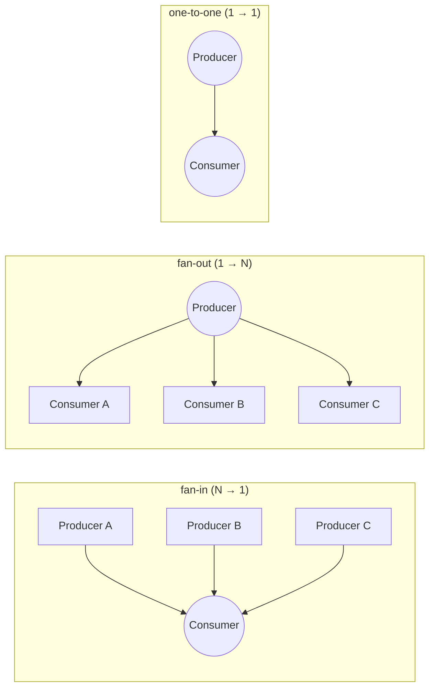
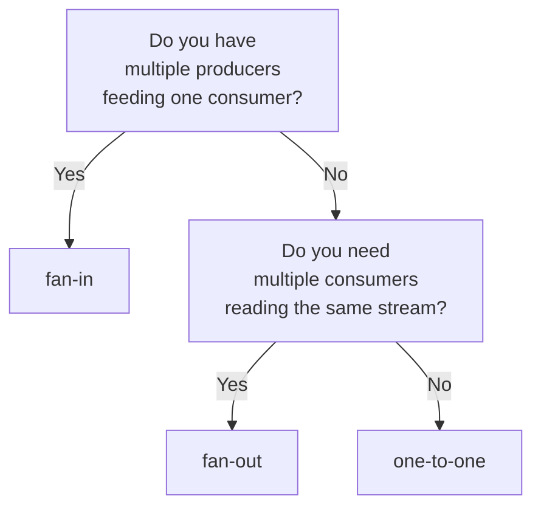

# README — Topology-parameterized data channels

**Status:** Living document, updated with the 2026-07 topology migration.
**Audience:** Operators writing role JSON configs; script authors; framework
contributors touching queue/broker code.
**Authoritative design:** HEP-CORE-0017 §3.3.0 (abstraction layer),
§3.3.0.1 (dispatch), §4.5–§4.6 (per-topology descriptions), §4.7
(end-to-end walkthroughs).

---

## 1. What is a channel topology?

A **channel topology** declares how many producers and how many
consumers a channel admits, and — as a consequence — which side
"owns" the wire (binds a socket that the other side connects to).
The framework supports three topologies:

| Topology     | Cardinality       | Binding side | Typical use |
|--------------|-------------------|--------------|-------------|
| `fan-in`     | N producers → 1 consumer | Consumer  | Aggregator / sink — many sensors, one storage |
| `fan-out`    | 1 producer → N consumers | Producer  | Broadcast — one source, many parallel consumers |
| `one-to-one` | 1 producer → 1 consumer   | Producer  | Point-to-point — cardinality enforced by broker |

The broker enforces cardinality at REG_REQ time; violations return
error codes (`FAN_IN_IS_SINGLE_CONSUMER`,
`FAN_OUT_IS_SINGLE_PRODUCER`, `ONE_TO_ONE_CARDINALITY_VIOLATED`) per
HEP-CORE-0007 §12.4a.

**Diagram — the three topologies:**



The double circles above mark the **binding side** — the side that
owns the wire endpoint.  Under `fan-in` that's the consumer; under
`fan-out` and `one-to-one` that's the producer.  Dialing-side roles
receive the endpoint on their REG_ACK and connect.

---

## 2. Choosing a topology

Decision flow — answer three questions:



**Trade-offs:**

- **fan-in** is ZMQ-only. Shared-memory is physically single-producer
  (one writer owns the ring), so SHM + fan-in is refused at both
  broker admission and the `hub::Queue` legality gate (HEP-CORE-0017
  §3.3.0 gate 1).  If you need fan-in over host-local transport,
  configure ZMQ over `tcp://127.0.0.1:*`.
- **fan-out** works on both transports. Under ZMQ it's PUB/SUB (drops
  messages sent before subscribe — see §5 pitfalls); under SHM it's
  one DataBlock with per-consumer capability-transport attach.
- **one-to-one** works on both transports.  Under ZMQ it's PUSH/PULL
  (lower overhead than PUB/SUB for a single subscriber); under SHM
  it's the same DataBlock model as fan-out but with a cardinality-1
  broker guard.

If in doubt, `one-to-one` is the safest default — the broker's
cardinality guard prevents accidental fan-out later if someone adds
a second consumer to the config.

---

## 3. Configuring a channel — role JSON examples

Every role config declares topology + transport per direction
(`in_channel_topology` for input side, `out_channel_topology` for
output side).  Wire strings: `"fan-in"`, `"fan-out"`, `"one-to-one"`.
An empty string means "default" and currently maps to `"one-to-one"`
(matches the pre-migration hardcoded shape).

Common transport strings: `"zmq"`, `"shm"`.

JSON fields are FLAT (no nested `in_transport` object) — the parser
lives in `src/include/utils/config/transport_config.hpp` and reads
`in_transport`, `in_zmq_endpoint`, `in_shm_enabled`, etc. as
sibling top-level keys.  Legal `in_transport` / `out_transport`
values: `"zmq"`, `"shm"` (Linux only for Phase 1 — HEP-CORE-0041).

### 3.1 Fan-in ZMQ — aggregator

Two producers emit into one consumer over `tcp://127.0.0.1:*`.

**Consumer config** (`aggregator.json`):

```json
{
  "role_type": "consumer",
  "role_uid": "aggregator",
  "channel_name": "sensors.raw",
  "in_channel_topology": "fan-in",
  "in_transport": "zmq",
  "in_zmq_endpoint": "tcp://127.0.0.1:0",
  "in_slot_schema": "sensor_reading_v1"
}
```

**Producer config** (`sensor_a.json`):

```json
{
  "role_type": "producer",
  "role_uid": "sensor_a",
  "channel_name": "sensors.raw",
  "out_channel_topology": "fan-in",
  "out_transport": "zmq",
  "out_zmq_endpoint": "tcp://127.0.0.1:0",
  "out_slot_schema": "sensor_reading_v1"
}
```

Notes:
- Consumer sets `in_zmq_endpoint: "tcp://127.0.0.1:0"` — port 0 means
  "pick any free port"; the framework publishes the resolved port to
  the broker after bind.
- Producer currently MUST also set `out_zmq_endpoint` because the
  live config parser at `transport_config.hpp:96-99` enforces
  "`zmq_endpoint` required when transport is `zmq`" regardless of
  side.  The value is IGNORED for dialing side — the endpoint that
  matters arrives on REG_ACK from the broker.  Phase C step 6 of
  the topology migration will drop the required-on-dialing-side
  requirement (per `docs/todo/TOPOLOGY_TODO.md`); until then the
  simplest safe value is `"tcp://127.0.0.1:0"` (parses as valid,
  never used).
- Producer B's config is identical to sensor_a except for `role_uid`.

### 3.2 Fan-out SHM — broadcast to local processors

One producer, two local processors read the same stream.

**Producer config** (`sensor.json`):

```json
{
  "role_type": "producer",
  "role_uid": "sensor",
  "channel_name": "raw.stream",
  "out_channel_topology": "fan-out",
  "out_transport": "shm",
  "out_shm_enabled": true,
  "out_shm_slot_count": 256,
  "out_slot_schema": "sample_v1"
}
```

**Processor config** (`analyzer.json`):

```json
{
  "role_type": "processor",
  "role_uid": "analyzer",
  "channel_name": "raw.stream",
  "in_channel_topology": "fan-out",
  "in_transport": "shm",
  "in_slot_schema": "sample_v1",
  "out_channel_topology": "one-to-one",
  "out_transport": "shm",
  "out_shm_enabled": true,
  "out_shm_slot_count": 64,
  "out_slot_schema": "analysis_v1"
}
```

Notes:
- Producer's `out_shm_slot_count` sizes the shared ring; consumers
  attach non-owning.
- `shm` transport is Linux-only in Phase 1 (memfd_create +
  SCM_RIGHTS); the config parser rejects `shm` at load-time on
  other platforms.  FreeBSD/macOS/Windows backends tracked as
  #259/#260/#261.
- Second processor's config is identical to `analyzer` except for
  `role_uid`, its `out_*` fields, and script.

### 3.3 One-to-one ZMQ across a network

Simple point-to-point.

```json
// producer side
{ "role_uid": "sensor",
  "channel_name": "stream",
  "out_channel_topology": "one-to-one",
  "out_transport": "zmq",
  "out_zmq_endpoint": "tcp://*:0" }

// consumer side (may be a different machine)
{ "role_uid": "collector",
  "channel_name": "stream",
  "in_channel_topology": "one-to-one",
  "in_transport": "zmq",
  "in_zmq_endpoint": "tcp://127.0.0.1:0" }
```

The consumer's `in_zmq_endpoint` is a placeholder (dialing side; the
endpoint arrives on REG_ACK).  See the fan-in ZMQ notes above — the
config parser currently requires the field regardless of side;
Phase C step 6 will relax it.

Broker rejects a second producer or a second consumer with
`ONE_TO_ONE_CARDINALITY_VIOLATED`.

---

## 4. How the framework realizes each topology

Role code does NOT open sockets or make bind/connect decisions —
those live behind the queue abstraction.  Every queue is constructed
through the unified factory in `hub_queue_factory.hpp`:

```cpp
namespace pylabhub::hub {

std::unique_ptr<QueueReader>
Queue::create_reader(ChannelTopology topology,
                     Transport       transport,
                     RxOptions       opts);

std::unique_ptr<QueueWriter>
Queue::create_writer(ChannelTopology topology,
                     Transport       transport,
                     TxOptions       opts);

} // namespace pylabhub::hub
```

Three facts — side (from role kind) + topology + transport — uniquely
determine the socket configuration.  The queue picks the matching
row from the §3.3.0 decision matrix:

| Side               | Topology   | Transport | Socket / mechanism            | Direction    |
|--------------------|------------|-----------|-------------------------------|--------------|
| Reader (consumer)  | fan-in     | ZMQ       | PULL                          | **bind**     |
| Reader (consumer)  | fan-out    | ZMQ       | SUB (empty topic filter)      | connect      |
| Reader (consumer)  | fan-out    | SHM       | capability socket             | connect      |
| Reader (consumer)  | one-to-one | ZMQ       | PULL                          | connect      |
| Reader (consumer)  | one-to-one | SHM       | capability socket             | connect      |
| Writer (producer)  | fan-in     | ZMQ       | PUSH                          | connect      |
| Writer (producer)  | fan-out    | ZMQ       | PUB                           | **bind**     |
| Writer (producer)  | fan-out    | SHM       | DataBlock create + cap socket | **bind**     |
| Writer (producer)  | one-to-one | ZMQ       | PUSH                          | **bind**     |
| Writer (producer)  | one-to-one | SHM       | DataBlock create + cap socket | **bind**     |

"bind" rows are the binding side; "connect" rows are the dialing
side.  Full decision matrix with CURVE role + endpoint owner
columns: HEP-CORE-0017 §3.3.0.  Sequence diagrams for each of the
five legal transport-topology cells: HEP-CORE-0017 §4.7.

**Two-level dispatch** inside the factory:

```
hub::Queue::create_writer(topology, transport, opts)
  │
  ├─ Gate 1: reject (fan-in, SHM) — nullptr + LOGGER_ERROR
  ├─ Gate 4: reject non-empty endpoint_hint on dialing side
  │
  └─ Dispatch by transport:
      Transport::Zmq → ZmqQueue::create_writer(topology, zmq_opts)
      Transport::Shm → ShmQueue::create_writer(topology, shm_opts)
```

The concrete transport class reads the matrix row for its transport
and picks socket type + bind/connect + CURVE role + endpoint owner
accordingly.  Adding a new transport in the future adds one enum
value, one switch case, and one translation helper — no changes to
role code, no changes to the broker.

---

## 5. Using topology from scripts

Scripts see topology indirectly through four symmetric accessors
that report the broker's Live-peer view:

```
api.consumer_count(channel_name)  ->  int         # Live consumers of the channel
api.producer_count(channel_name)  ->  int         # Live producers of the channel
api.consumers(channel_name)       ->  list[str]   # role_uids of Live consumers
api.producers(channel_name)       ->  list[str]   # role_uids of Live producers
```

Available in Lua (`api.consumer_count("ch")`), Python (same), and the
native C++ engine (via `PlhNativeContext::consumer_count(ctx, "ch")`).

**Semantics.**  "Live" means the broker has received the peer's first
heartbeat; per HEP-CORE-0036 §3.5.5 the heartbeat fires AFTER the
peer's data-plane socket is set up.  So Live ≈ "wire is ready to
deliver."

### 5.1 The fan-out ZMQ slow-joiner pattern (mandatory)

ZMQ's PUB socket drops messages sent before SUB subscribes.  Under
fan-out ZMQ, the producer's script MUST gate `on_produce` on
`consumer_count()`:

```python
def on_produce(tx, msgs, api):
    if api.consumer_count("data.stream") == 0:
        return   # nobody to send to; skip iteration
    # produce as normal
    slot = tx.acquire()
    slot.value = read_sensor()
    tx.commit()
```

The framework's job is to deliver accurate signals; the script
decides when the channel is "ready enough" to push data.  There is
**no framework-level auto-hold, auto-retry, or auto-fallback** — this
is deliberate per session memory `feedback_framework_mechanism_not_policy.md`.

The same pattern applies to fan-in consumers gating upstream-triggered
work on `producer_count()`, and to one-to-one both sides.

### 5.2 Listing peers by role_uid

To take role-uid-specific action:

```python
def on_produce(tx, msgs, api):
    live = api.consumers("data.stream")
    if "archive" not in live:
        api.log_warn("archive consumer offline — skipping heavy snapshot")
        return
    # archive is Live; safe to emit the snapshot record
    ...
```

---

## 6. Common pitfalls

1. **Setting `zmq_endpoint` on the dialing side.**
   Rejected as `CONFIG_INVALID_ENDPOINT_HINT_ON_DIALING_SIDE` at
   queue construction.  Dialing side receives the endpoint on
   REG_ACK; setting it in config is a caller error.
   - Fan-in: producer is dialing → don't set `out_transport.zmq_endpoint`.
   - Fan-out / 1-to-1: consumer is dialing → don't set `in_transport.zmq_endpoint`.

2. **`fan-in` + `shm`.**
   Broker rejects at REG_REQ with `TOPOLOGY_NOT_SUPPORTED_FOR_TRANSPORT`;
   `hub::Queue::create_*` gate 1 also refuses.  SHM is physically
   single-producer.  Use ZMQ over `tcp://127.0.0.1:*` if you need
   fan-in on the same host.

3. **Forgetting the fan-out slow-joiner gate.**
   PUB drops pre-subscribe messages.  Data sent before
   `consumer_count() > 0` returns 0 is silently lost.  §5.1 above is
   the required pattern.

4. **Mismatched topology across producer and consumer configs.**
   Broker rejects the second party's REG_REQ with `TOPOLOGY_MISMATCH`
   (HEP-CORE-0007 §12.4a).  Every role that touches the same
   `channel_name` MUST declare the same topology.

5. **Trying to migrate a running one-to-one to fan-out.**
   Broker takes topology at channel creation from the binding-side
   REG_REQ; a later dialing-side REG_REQ with a different value is
   rejected.  To reshape, the binding-side role must DEREG (channel
   dies, `CHANNEL_CLOSING_NOTIFY` fans out to peers) and re-REG with
   the new topology.

6. **Relying on the `one-to-one` default silently.**
   `channel_topology` is optional in role config and on the wire; an
   unset value defaults to `one-to-one` (tech draft §5.1 Rev-10 Q3a
   resolution — matches the pre-migration "one producer binds, one
   consumer connects" shape).  This is safe when both sides really
   intend point-to-point, but a fan-in aggregator or a fan-out
   broadcast that forgets the topology field silently gets 1-to-1
   semantics and then the second peer's REG_REQ is rejected with
   `ONE_TO_ONE_CARDINALITY_VIOLATED`.  Declare the topology
   explicitly whenever you intend anything other than 1-to-1.

---

## 7. Where to look next

| Question | Doc |
|---|---|
| **Factory API contract** (`hub::Queue::create_*`, decision matrix, legality gates, options structs) | HEP-CORE-0017 §3.3.0 + §3.3.0.1 |
| **Sequence diagrams + Tier 2 pseudocode per topology** | HEP-CORE-0017 §4.7 (all five (topology × transport) cells) |
| **Wire schema** — REG_REQ topology field, REG_ACK data_endpoint/data_pubkey, CHANNEL_AUTH_CHANGED_NOTIFY phase field | HEP-CORE-0007 §12.3 (REG_ACK), §12.5 (NOTIFY) |
| **Broker state model + admission rules** | HEP-CORE-0036 §3.5, §6.4, §6.5, §6.7 |
| **SHM capability handshake** (used by fan-out SHM + 1-to-1 SHM) | HEP-CORE-0041 §5.5, HEP-CORE-0044 AttachProtocol |
| **Script API — accessor bindings** | HEP-CORE-0028 §6a (native ABI); HEP-CORE-0011 § "Cross-Engine Surface Parity" (Lua/Python/native parity) |
| **Migration history / open items** | `docs/todo/TOPOLOGY_TODO.md`, `docs/tech_draft/DRAFT_topology_singular_side_2026-07.md` (design authority during migration; retires into permanent HEPs post-C step 7) |

---

## Document status

- **2026-07-09** — Initial version, consolidated from
  `docs/tech_draft/DRAFT_topology_singular_side_2026-07.md` §7 + §10
  and HEP-CORE-0017 §3.3.0 factory spec.  Written mid-migration
  (Phase C step 5 shipped, step 6 upcoming); role JSON examples
  reflect target configs post-migration.
