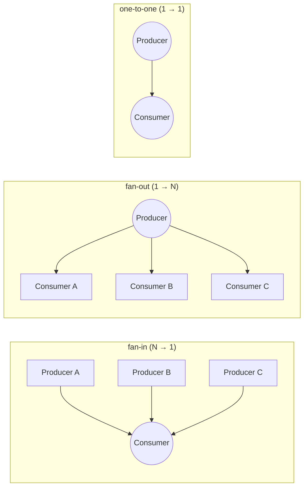
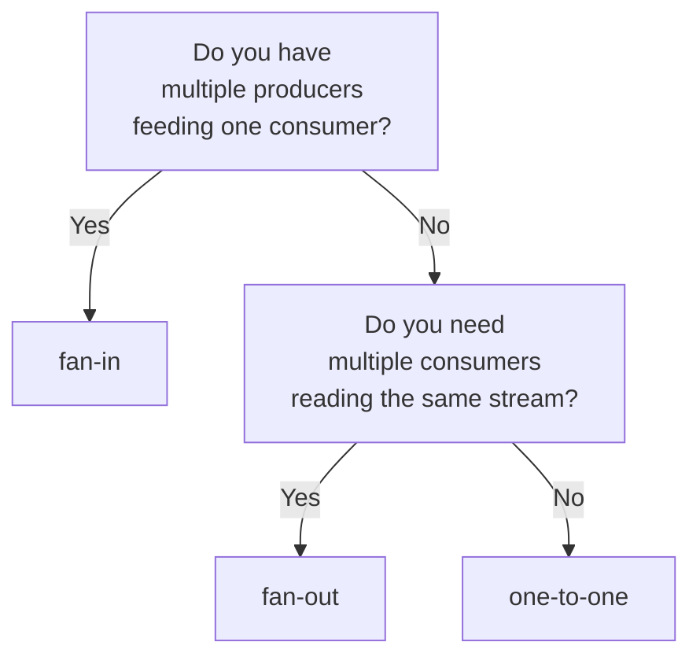

# Topology channels — a plain-language guide

**Who this is for.**  You're writing a role config, or a script, or
touching queue/broker code, and you want to know how the three
channel shapes work — what they mean, when to use which, what shows
up in your JSON, and what your script can ask about the running
channel.

**Where the design lives.**  The permanent design and full sequence
diagrams live in `HEP-CORE-0017 §3.3.0` (the factory) and `§4.7`
(the walkthroughs).  This guide summarizes them in plain language
for day-to-day use.

---

## 1. What is a "topology"?

A channel connects producers to consumers.  How many of each, and
which side "owns" the connection point, is what the topology
decides.  There are three:

| Name         | Shape                     | Who owns the address |
|--------------|---------------------------|----------------------|
| `fan-in`     | Many producers → 1 consumer | The consumer         |
| `fan-out`    | 1 producer → many consumers | The producer         |
| `one-to-one` | 1 producer → 1 consumer     | The producer         |

"Owns the address" means:  that side picks a network endpoint (or
opens a shared-memory segment), publishes it, and stays put.  The
other side asks the broker for it and connects.

Why does it matter?  Because that decides everything downstream:
which side binds a socket, which side dials in, which side keeps a
list of who's currently connected, and which side dies first when
things go wrong.

**Picture the three shapes:**



The double circles are the side that owns the address.  The broker
keeps count and refuses extra parties that would break the shape:
a second consumer arriving at a fan-in channel gets rejected, a
second producer arriving at a fan-out channel gets rejected, and
either kind of second party arriving at a one-to-one channel gets
rejected.  The rejection error names are `FAN_IN_IS_SINGLE_CONSUMER`,
`FAN_OUT_IS_SINGLE_PRODUCER`, and `ONE_TO_ONE_CARDINALITY_VIOLATED`.

---

## 2. Which one do I want?

Ask yourself:



**Some things to keep in mind:**

- **`fan-in` only works over ZMQ (network).**  Shared memory has one
  writer by construction — the ring buffer belongs to whoever
  created the segment — so "many producers into one consumer over
  SHM" doesn't make physical sense.  If you need fan-in on a single
  host, use ZMQ over `tcp://127.0.0.1:*`.
- **`fan-out` over ZMQ has a quirk:**  ZMQ's PUB socket throws away
  messages sent before any subscriber has connected.  So your
  producer script has to check "is anyone listening yet?" before it
  emits data.  See §5.1 below.
- **`one-to-one` is the safest default.**  If a second consumer
  shows up someday when it shouldn't, the broker catches it.  With
  `fan-out` a stray second consumer would silently attach and start
  reading.

---

## 3. Setting it up in role JSON

You declare the topology per direction — the input side has
`in_channel_topology`, the output side has `out_channel_topology`.
Valid values: `"fan-in"`, `"fan-out"`, `"one-to-one"`.  If you leave
it out entirely, it defaults to `"one-to-one"`.

You also declare the transport per direction: `"zmq"` for network,
`"shm"` for shared memory.  All JSON fields sit flat at the root of
the config — no nested objects.  The parser lives in
`src/include/utils/config/transport_config.hpp`.

### 3.1 Fan-in over ZMQ — one aggregator, many sensors

Two producers, one consumer.

**Consumer config** (`aggregator.json`):

```json
{
  "role_type": "consumer",
  "role_uid": "aggregator",
  "channel_name": "sensors.raw",
  "in_channel_topology": "fan-in",
  "in_transport": "zmq",
  "in_zmq_endpoint": "tcp://127.0.0.1:0",
  "in_slot_schema": "sensor_reading_v1"
}
```

`"tcp://127.0.0.1:0"` means "any free port on loopback."  The
framework binds, gets the actual port from the OS, and tells the
broker.  Producers get the resolved address from the broker.

**Producer config** (`sensor_a.json`):

```json
{
  "role_type": "producer",
  "role_uid": "sensor_a",
  "channel_name": "sensors.raw",
  "out_channel_topology": "fan-in",
  "out_transport": "zmq",
  "out_slot_schema": "sensor_reading_v1"
}
```

Notice the producer does NOT set `out_zmq_endpoint` — it doesn't
own an address under fan-in.  The consumer owns the address; the
producer asks the broker for it and dials in.  Producer B looks
identical except for `role_uid: "sensor_b"`.

> **Current parser limitation.**  As of today, the config parser at
> `src/include/utils/config/transport_config.hpp:96-99` insists you
> set `<direction>_zmq_endpoint` whenever the matching transport is
> `"zmq"`, without distinguishing which side is dialing.  The
> design says the dialing side must leave it empty; the parser
> doesn't know that yet.  Until the parser is fixed, put a throwaway
> value in the dialing side's config (`"out_zmq_endpoint":
> "tcp://127.0.0.1:0"` for a fan-in producer, similarly for a
> fan-out or one-to-one consumer's `in_zmq_endpoint`).  Downstream
> code ignores the value on the dialing side.

### 3.2 Fan-out over shared memory — one source, several local readers

Producer streams into shared memory; two processors read from it.

**Producer config** (`sensor.json`):

```json
{
  "role_type": "producer",
  "role_uid": "sensor",
  "channel_name": "raw.stream",
  "out_channel_topology": "fan-out",
  "out_transport": "shm",
  "out_shm_enabled": true,
  "out_shm_slot_count": 256,
  "out_slot_schema": "sample_v1"
}
```

`out_shm_slot_count` is the ring size.  Consumers don't allocate
anything; they attach to the producer's ring.

**Processor config** (`analyzer.json`):

```json
{
  "role_type": "processor",
  "role_uid": "analyzer",
  "channel_name": "raw.stream",
  "in_channel_topology": "fan-out",
  "in_transport": "shm",
  "in_slot_schema": "sample_v1",
  "out_channel_topology": "one-to-one",
  "out_transport": "shm",
  "out_shm_enabled": true,
  "out_shm_slot_count": 64,
  "out_slot_schema": "analysis_v1"
}
```

A processor reads on the input side and produces on the output
side.  This one takes the `fan-out` stream and emits its own
`one-to-one` output.

Note: `"shm"` transport is Linux-only right now (it uses
`memfd_create` + `SCM_RIGHTS` fd-passing).  Configs with `"shm"`
fail to load on macOS/Windows/FreeBSD; cross-platform backends
are on the roadmap.

### 3.3 One-to-one over ZMQ — point-to-point across a network

```json
// producer side (this side owns the address)
{ "role_uid": "sensor",
  "channel_name": "stream",
  "out_channel_topology": "one-to-one",
  "out_transport": "zmq",
  "out_zmq_endpoint": "tcp://*:0" }

// consumer side (asks broker for address, dials in)
{ "role_uid": "collector",
  "channel_name": "stream",
  "in_channel_topology": "one-to-one",
  "in_transport": "zmq" }
```

Same parser workaround applies to the consumer as in §3.1: today
you need `"in_zmq_endpoint": "tcp://127.0.0.1:0"` as a placeholder
even though it's ignored on the dialing side.

If a second producer or a second consumer with the same
`channel_name` starts up, the broker rejects it with
`ONE_TO_ONE_CARDINALITY_VIOLATED`.

---

## 4. How the framework makes each topology happen

You don't call sockets, and you don't decide bind vs connect.  The
role code makes one function call — "build the reader for this
channel" or "build the writer" — and passes three pieces of
information: which side you are (from your role kind), the topology,
and the transport.  The framework figures out everything else.

That one function lives in `hub_queue_factory.hpp`:

```cpp
// From role code — you never call libzmq or open a socket directly.
auto reader = hub::Queue::create_reader(topology, transport, opts);
auto writer = hub::Queue::create_writer(topology, transport, opts);
```

Inside, the framework consults a decision table.  Every combination
of (side × topology × transport) has exactly one right answer for
"what socket do I open, do I bind or connect, who is the CURVE
server?"  Here's the table:

| I'm the...        | Topology   | Transport | Socket used                   | Bind or connect? |
|-------------------|------------|-----------|-------------------------------|------------------|
| Reader (consumer) | fan-in     | ZMQ       | PULL                          | **bind**         |
| Reader (consumer) | fan-out    | ZMQ       | SUB (subscribes to everything)| connect          |
| Reader (consumer) | fan-out    | SHM       | capability socket             | connect          |
| Reader (consumer) | one-to-one | ZMQ       | PULL                          | connect          |
| Reader (consumer) | one-to-one | SHM       | capability socket             | connect          |
| Writer (producer) | fan-in     | ZMQ       | PUSH                          | connect          |
| Writer (producer) | fan-out    | ZMQ       | PUB                           | **bind**         |
| Writer (producer) | fan-out    | SHM       | Creates shared segment        | **bind**         |
| Writer (producer) | one-to-one | ZMQ       | PUSH                          | **bind**         |
| Writer (producer) | one-to-one | SHM       | Creates shared segment        | **bind**         |

"bind" means "I own this address."  "connect" means "I dial into
somebody else's address."  The full table with CURVE role and
endpoint-owner columns lives at HEP-CORE-0017 §3.3.0.  The
end-to-end sequence diagrams (what messages fly between broker,
producer, and consumer during startup) live at HEP-CORE-0017 §4.7.

**What the factory does before it hands you the queue:**

1. Refuses fan-in over SHM (that combination doesn't physically
   work — see §2).  Returns null with a clear error in the log.
2. Refuses if you tried to hand-declare an endpoint on the dialing
   side.  Only the binding side owns the address.
3. Picks the socket + bind/connect + CURVE role from the table.
4. Under the hood, calls the transport-specific factory
   (`ZmqQueue::create_writer` or `ShmQueue::create_writer`) with a
   translated options bundle.

Role code never sees libzmq, never opens a socket, never decides
who binds.  Add a new transport in the future?  Add one enum value,
one case in the switch, one translation helper.  Nothing in role
code or broker code changes.

---

## 5. Asking about the channel from your script

Your script has four ways to ask "who else is on this channel
right now?"  They live on every role's `api` object:

```
api.consumer_count(channel_name)  ->  int         # how many consumers are live
api.producer_count(channel_name)  ->  int         # how many producers are live
api.consumers(channel_name)       ->  list[str]   # role_uids of live consumers
api.producers(channel_name)       ->  list[str]   # role_uids of live producers
```

All four work in Lua, Python, and the native C++ engine.

**What "live" means.**  A peer is "live" once the broker has
received its first heartbeat.  The framework only sends that
heartbeat AFTER the peer has finished setting up its data-plane
socket (bind or connect + subscribe).  So "live" ≈ "data is ready
to flow."

**Count includes yourself.**  If you ARE the consumer of the
channel, `consumer_count()` counts you too.  Under fan-in that
means it's always 1 (there's only one consumer, and if you're
asking, that's you).  Under fan-out the producer isn't a consumer
of its own channel, so `consumer_count()` on the producer counts
only the *other* processes.

### 5.1 The fan-out ZMQ slow-joiner rule

ZMQ's PUB socket doesn't buffer for absent subscribers — anything
you write before a consumer has connected + subscribed is silently
thrown on the floor.  So under fan-out ZMQ, your producer script
must check that at least one consumer is ready before it emits:

```python
def on_produce(tx, msgs, api):
    if api.consumer_count("data.stream") == 0:
        return   # nobody listening yet — skip this iteration
    slot = tx.acquire()
    slot.value = read_sensor()
    tx.commit()
```

The framework will not do this for you.  It exposes the count
truthfully; you decide when the channel is ready enough to push
data.  No auto-hold, no auto-retry — those would be policy, and
policy belongs in your script.

The same idea applies to fan-in consumers waiting on
`producer_count()`, and to both sides of one-to-one.

### 5.2 Doing something specific per peer

If you want to react to which specific peers are up:

```python
def on_produce(tx, msgs, api):
    live = api.consumers("data.stream")
    if "archive" not in live:
        api.log_warn("archive consumer offline — skipping snapshot")
        return
    ...
```

---

## 6. Common mistakes

1. **Setting `out_zmq_endpoint` on a fan-in producer, or
   `in_zmq_endpoint` on a fan-out / one-to-one consumer.**  Those
   roles are the dialing side — they don't own an address; they
   ask the broker for one.  The finished framework rejects the
   config with `CONFIG_INVALID_ENDPOINT_HINT_ON_DIALING_SIDE`.
   Today the parser is too permissive and forces you to set it
   anyway — see §3.1 workaround.

2. **Trying to use `"fan-in"` with `"shm"`.**  Doesn't work — shared
   memory has exactly one writer by construction.  The broker
   refuses the REG_REQ with `TOPOLOGY_NOT_SUPPORTED_FOR_TRANSPORT`,
   and the factory refuses to build the queue.  Use ZMQ over
   `tcp://127.0.0.1:*` if you need fan-in on one host.

3. **Forgetting the fan-out slow-joiner check.**  Under fan-out
   ZMQ, `PUB` drops messages sent before any consumer has
   subscribed.  Data goes to `/dev/null`.  Always gate `on_produce`
   on `api.consumer_count() > 0` (see §5.1).

4. **Producer and consumer configs disagree about topology.**  Both
   sides must declare the same topology for the same
   `channel_name`.  If they don't, the second party's REG_REQ gets
   rejected with `TOPOLOGY_MISMATCH`.

5. **Trying to change a running channel's topology.**  The broker
   locks in the topology when the binding-side role first
   registers.  You can't upgrade a one-to-one to a fan-out on the
   fly.  To reshape, the binding-side role has to deregister
   entirely (which tears the channel down — other parties get
   `CHANNEL_CLOSING_NOTIFY`) and register again with the new
   topology.

6. **Not declaring topology and getting silently one-to-one.**  If
   `in_channel_topology` / `out_channel_topology` is missing, the
   framework treats it as `"one-to-one"`.  That's safe for genuine
   1-to-1 use but silently wrong for aggregators (fan-in) and
   broadcasters (fan-out) — the second party will get
   `ONE_TO_ONE_CARDINALITY_VIOLATED` and you'll wonder why.
   Always spell out the topology unless you really mean 1-to-1.

---

## 7. Where to look next

| I want to understand... | Read this |
|---|---|
| The factory function and full decision table | HEP-CORE-0017 §3.3.0 + §3.3.0.1 |
| The exact wire messages for each topology, step by step | HEP-CORE-0017 §4.7 |
| The wire schema (what REG_REQ, REG_ACK, and the NOTIFY messages carry) | HEP-CORE-0007 §12.3 + §12.5 |
| How the broker keeps track of channels, peers, and lifetime | HEP-CORE-0036 §3.5, §6.4, §6.5, §6.7 |
| How the SHM handshake actually works (fd-passing) | HEP-CORE-0041 §5.5, HEP-CORE-0044 |
| Bindings for the script-side accessors | HEP-CORE-0028 §6a (native ABI); HEP-CORE-0011 § "Cross-Engine Surface Parity" |
