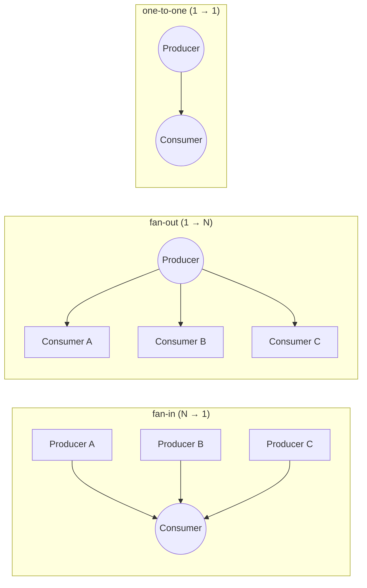
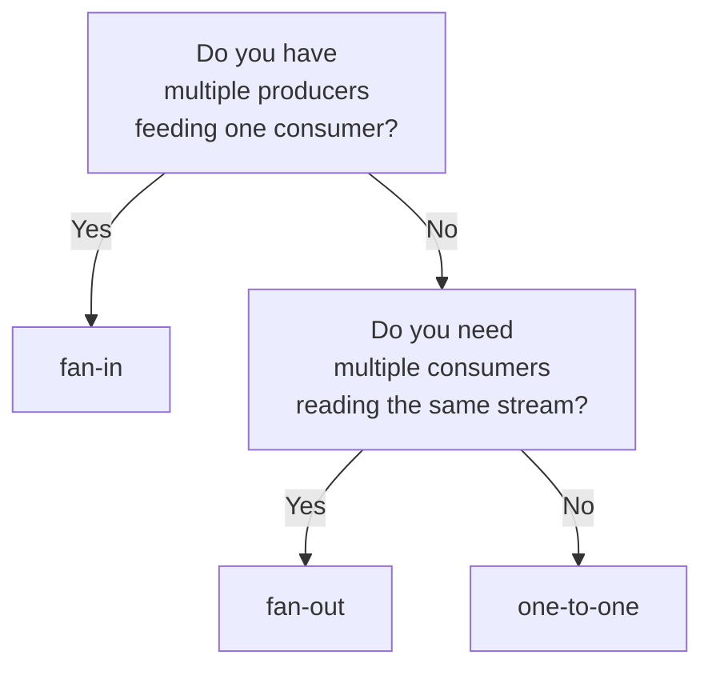
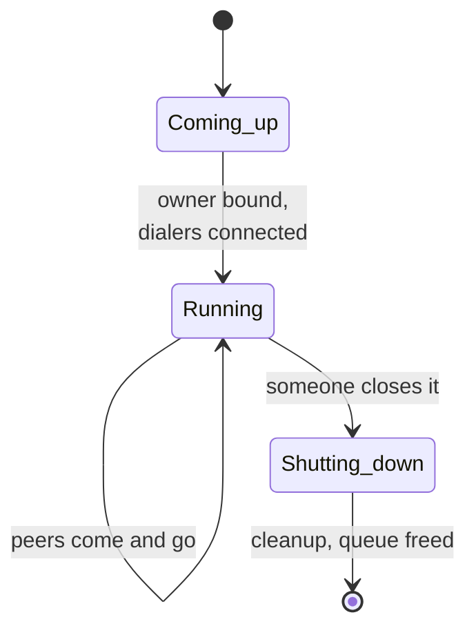
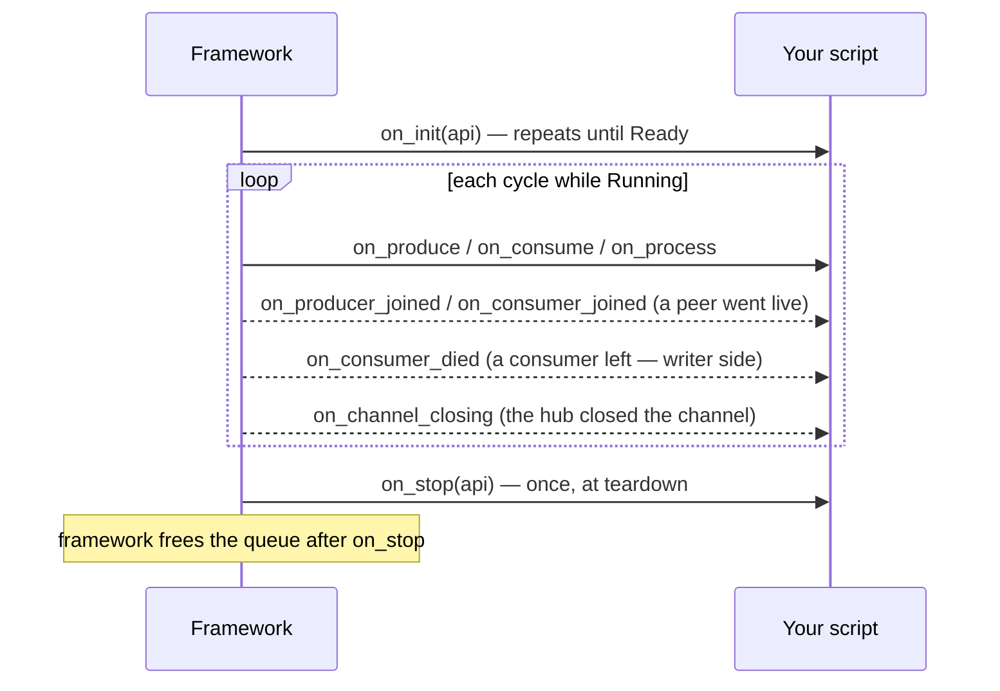

# Topology channels — a plain-language guide

**Who this is for.**  You're writing a role config, or a script, or
touching queue/broker code, and you want the whole picture in one
place: how the three channel shapes work (§1–§4), what your script
can ask about the running channel (§5), the life of a channel from
startup to shutdown (§6), the callbacks you can define (§7), and how
to shut down cleanly (§8).

**Where the design lives.**  This guide is the day-to-day *user
reference*; the precise, per-aspect design lives in the HEPs it
cites.  The big ones: `HEP-CORE-0017 §3.3.0` (the factory) and `§4.7`
(the walkthroughs + the establishment/teardown contracts);
`HEP-CORE-0011 § "Notification dispatch"` (the callback table).  Each
section below points at the exact HEP for the mechanics — see §10 for
the full map.

---

## 1. What is a "topology"?

A channel connects producers to consumers.  How many of each, and
which side "owns" the connection point, is what the topology
decides.  There are three:

| Name         | Shape                     | Who owns the address |
|--------------|---------------------------|----------------------|
| `fan-in`     | Many producers → 1 consumer | The consumer         |
| `fan-out`    | 1 producer → many consumers | The producer         |
| `one-to-one` | 1 producer → 1 consumer     | The producer         |

"Owns the address" means:  that side picks a network endpoint (or
opens a shared-memory segment), publishes it, and stays put.  The
other side asks the broker for it and connects.

Why does it matter?  Because that decides everything downstream:
which side binds a socket, which side dials in, which side keeps a
list of who's currently connected, and which side dies first when
things go wrong.

**Picture the three shapes:**


```mermaid
graph LR
    subgraph "fan-in (N → 1)"
        P1[Producer A] --> C1((Consumer))
        P2[Producer B] --> C1
        P3[Producer C] --> C1
    end
    subgraph "fan-out (1 → N)"
        P4((Producer)) --> C2[Consumer A]
        P4 --> C3[Consumer B]
        P4 --> C4[Consumer C]
    end
    subgraph "one-to-one (1 → 1)"
        P5((Producer)) --> C5((Consumer))
    end
```

The double circles are the side that owns the address.  The broker
keeps count and refuses extra parties that would break the shape:
a second consumer arriving at a fan-in channel gets rejected, a
second producer arriving at a fan-out channel gets rejected, and
either kind of second party arriving at a one-to-one channel gets
rejected.  The rejection error names are `FAN_IN_IS_SINGLE_CONSUMER`,
`FAN_OUT_IS_SINGLE_PRODUCER`, and `ONE_TO_ONE_CARDINALITY_VIOLATED`.

---

## 2. Which one do I want?

Ask yourself:


```mermaid
graph TD
    Q1["Do you have <br/>multiple producers <br/>feeding one consumer?"] -->|Yes| A1["fan-in"]
    Q1 -->|No| Q2["Do you need <br/>multiple consumers <br/>reading the same stream?"]
    Q2 -->|Yes| A2["fan-out"]
    Q2 -->|No| A3["one-to-one"]
```

**Some things to keep in mind:**

- **`fan-in` only works over ZMQ (network).**  Shared memory has one
  writer by construction — the ring buffer belongs to whoever
  created the segment — so "many producers into one consumer over
  SHM" doesn't make physical sense.  If you need fan-in on a single
  host, use ZMQ over `tcp://127.0.0.1:*`.
- **`fan-out` over ZMQ has a quirk:**  ZMQ's PUB socket throws away
  messages sent before any subscriber has connected.  So your
  producer script has to check "is anyone listening yet?" before it
  emits data.  See §5.1 below.
- **`one-to-one` is the safest default.**  If a second consumer
  shows up someday when it shouldn't, the broker catches it.  With
  `fan-out` a stray second consumer would silently attach and start
  reading.

---

## 3. Setting it up in role JSON

You declare the topology per direction — the input side has
`in_channel_topology`, the output side has `out_channel_topology`.
Valid values: `"fan-in"`, `"fan-out"`, `"one-to-one"`.  If you leave
it out entirely, it defaults to `"one-to-one"`.

You also declare the transport per direction: `"zmq"` for network,
`"shm"` for shared memory.  All JSON fields sit flat at the root of
the config — no nested objects.  The parser lives in
`src/include/utils/config/transport_config.hpp`.

### 3.1 Fan-in over ZMQ — one aggregator, many sensors

Two producers, one consumer.

**Consumer config** (`aggregator.json`):

```json
{
  "role_type": "consumer",
  "role_uid": "aggregator",
  "channel_name": "sensors.raw",
  "in_channel_topology": "fan-in",
  "in_transport": "zmq",
  "in_zmq_endpoint": "tcp://127.0.0.1:0",
  "in_slot_schema": "sensor_reading_v1"
}
```

`"tcp://127.0.0.1:0"` means "any free port on loopback."  The
framework binds, gets the actual port from the OS, and tells the
broker.  Producers get the resolved address from the broker.

**Producer config** (`sensor_a.json`):

```json
{
  "role_type": "producer",
  "role_uid": "sensor_a",
  "channel_name": "sensors.raw",
  "out_channel_topology": "fan-in",
  "out_transport": "zmq",
  "out_slot_schema": "sensor_reading_v1"
}
```

Notice the producer does NOT set `out_zmq_endpoint` — it doesn't
own an address under fan-in.  The consumer owns the address; the
producer asks the broker for it and dials in.  Producer B looks
identical except for `role_uid: "sensor_b"`.

> **Current parser limitation.**  As of today, the config parser at
> `src/include/utils/config/transport_config.hpp:96-99` insists you
> set `<direction>_zmq_endpoint` whenever the matching transport is
> `"zmq"`, without distinguishing which side is dialing.  The
> design says the dialing side must leave it empty; the parser
> doesn't know that yet.  Until the parser is fixed, put a throwaway
> value in the dialing side's config (`"out_zmq_endpoint":
> "tcp://127.0.0.1:0"` for a fan-in producer, similarly for a
> fan-out or one-to-one consumer's `in_zmq_endpoint`).  Downstream
> code ignores the value on the dialing side.

### 3.2 Fan-out over shared memory — one source, several local readers

Producer streams into shared memory; two processors read from it.

**Producer config** (`sensor.json`):

```json
{
  "role_type": "producer",
  "role_uid": "sensor",
  "channel_name": "raw.stream",
  "out_channel_topology": "fan-out",
  "out_transport": "shm",
  "out_shm_enabled": true,
  "out_shm_slot_count": 256,
  "out_slot_schema": "sample_v1"
}
```

`out_shm_slot_count` is the ring size.  Consumers don't allocate
anything; they attach to the producer's ring.

**Processor config** (`analyzer.json`):

```json
{
  "role_type": "processor",
  "role_uid": "analyzer",
  "channel_name": "raw.stream",
  "in_channel_topology": "fan-out",
  "in_transport": "shm",
  "in_slot_schema": "sample_v1",
  "out_channel_topology": "one-to-one",
  "out_transport": "shm",
  "out_shm_enabled": true,
  "out_shm_slot_count": 64,
  "out_slot_schema": "analysis_v1"
}
```

A processor reads on the input side and produces on the output
side.  This one takes the `fan-out` stream and emits its own
`one-to-one` output.

Note: `"shm"` transport is Linux-only right now (it uses
`memfd_create` + `SCM_RIGHTS` fd-passing).  Configs with `"shm"`
fail to load on macOS/Windows/FreeBSD; cross-platform backends
are on the roadmap.

### 3.3 One-to-one over ZMQ — point-to-point across a network

```json
// producer side (this side owns the address)
{ "role_uid": "sensor",
  "channel_name": "stream",
  "out_channel_topology": "one-to-one",
  "out_transport": "zmq",
  "out_zmq_endpoint": "tcp://*:0" }

// consumer side (asks broker for address, dials in)
{ "role_uid": "collector",
  "channel_name": "stream",
  "in_channel_topology": "one-to-one",
  "in_transport": "zmq" }
```

Same parser workaround applies to the consumer as in §3.1: today
you need `"in_zmq_endpoint": "tcp://127.0.0.1:0"` as a placeholder
even though it's ignored on the dialing side.

If a second producer or a second consumer with the same
`channel_name` starts up, the broker rejects it with
`ONE_TO_ONE_CARDINALITY_VIOLATED`.

---

## 4. How the framework makes each topology happen

You don't call sockets, and you don't decide bind vs connect.  The
role code makes one function call — "build the reader for this
channel" or "build the writer" — and passes three pieces of
information: which side you are (from your role kind), the topology,
and the transport.  The framework figures out everything else.

That one function lives in `hub_queue_factory.hpp`:

```cpp
// From role code — you never call libzmq or open a socket directly.
auto reader = hub::Queue::create_reader(topology, transport, opts);
auto writer = hub::Queue::create_writer(topology, transport, opts);
```

Inside, the framework consults a decision table.  Every combination
of (side × topology × transport) has exactly one right answer for
"what socket do I open, do I bind or connect, who is the CURVE
server?"  Here's the table:

| I'm the...        | Topology   | Transport | Socket used                   | Bind or connect? |
|-------------------|------------|-----------|-------------------------------|------------------|
| Reader (consumer) | fan-in     | ZMQ       | PULL                          | **bind**         |
| Reader (consumer) | fan-out    | ZMQ       | SUB (subscribes to everything)| connect          |
| Reader (consumer) | fan-out    | SHM       | capability socket             | connect          |
| Reader (consumer) | one-to-one | ZMQ       | PULL                          | connect          |
| Reader (consumer) | one-to-one | SHM       | capability socket             | connect          |
| Writer (producer) | fan-in     | ZMQ       | PUSH                          | connect          |
| Writer (producer) | fan-out    | ZMQ       | PUB                           | **bind**         |
| Writer (producer) | fan-out    | SHM       | Creates shared segment        | **bind**         |
| Writer (producer) | one-to-one | ZMQ       | PUSH                          | **bind**         |
| Writer (producer) | one-to-one | SHM       | Creates shared segment        | **bind**         |

"bind" means "I own this address."  "connect" means "I dial into
somebody else's address."  The full table with CURVE role and
endpoint-owner columns lives at HEP-CORE-0017 §3.3.0.  The
end-to-end sequence diagrams (what messages fly between broker,
producer, and consumer during startup) live at HEP-CORE-0017 §4.7.

**What the factory does before it hands you the queue:**

1. Refuses fan-in over SHM (that combination doesn't physically
   work — see §2).  Returns null with a clear error in the log.
2. Refuses if you tried to hand-declare an endpoint on the dialing
   side.  Only the binding side owns the address.
3. Picks the socket + bind/connect + CURVE role from the table.
4. Under the hood, calls the transport-specific factory
   (`ZmqQueue::create_writer` or `ShmQueue::create_writer`) with a
   translated options bundle.

Role code never sees libzmq, never opens a socket, never decides
who binds.  Add a new transport in the future?  Add one enum value,
one case in the switch, one translation helper.  Nothing in role
code or broker code changes.

---

## 5. Asking about the channel from your script

Your script has four ways to ask "who else is on this channel
right now?"  They live on every role's `api` object:

```
api.consumer_count(channel_name)  ->  int         # how many consumers are live
api.producer_count(channel_name)  ->  int         # how many producers are live
api.consumers(channel_name)       ->  list[str]   # role_uids of live consumers
api.producers(channel_name)       ->  list[str]   # role_uids of live producers
```

All four work in Lua, Python, and the native C++ engine.

Three more let a script ask the broker about a channel's FORMAT and
its live METRICS (added 2026-07-26; HEP-CORE-0034 §10.3):

```
api.get_schema(owner, schema_id)      # registry schema record by key
api.get_channel_schema(channel_name)  # the channel's stored schema
api.get_channel_metrics(channel_name) # live per-member metrics + SHM info
```

Each returns the FULL broker reply as a table/dict (native: a JSON
string via `ctx->get_*_json`) — check `status` and `error_code`
yourself, exactly like native code does; you get `nil`/`None`/`NULL`
only when the broker could not be reached.  (Native has one extra
`NULL` case: null/empty arguments — a `const char *` return carries a
single sentinel.  Lua raises on empty arguments instead; Python passes
them through and the broker's typed error comes back as data.)  The
channel forms answer channel MEMBERS only (`NOT_A_ROLE_OF_CHANNEL`
otherwise); metrics freshness is the members' heartbeat cadence.

**What "live" means.**  A peer is "live" once the broker has
received its first heartbeat.  The framework only sends that
heartbeat AFTER the peer has finished setting up its data-plane
socket (bind or connect + subscribe).  So "live" ≈ "data is ready
to flow."

**Count includes yourself (by design).**  The count is objective —
`consumer_count()` reflects every live consumer on the channel,
including you if you're one, and every role on the channel reads the
same numbers whoever asks (owner or dialer alike).  The broker keeps
everyone in sync by broadcasting the channel's live counts to all
members whenever they change (HEP-CORE-0028 §6a.2).

### 5.1 The fan-out ZMQ slow-joiner rule

ZMQ's PUB socket doesn't buffer for absent subscribers — anything
you write before a consumer has connected + subscribed is silently
thrown on the floor.  So under fan-out ZMQ, your producer script
must check that at least one consumer is ready before it emits:

```python
def on_produce(tx, msgs, api):
    if api.consumer_count("data.stream") == 0:
        return   # nobody listening yet — skip this iteration
    slot = tx.acquire()
    slot.value = read_sensor()
    tx.commit()
```

The framework will not do this for you.  It exposes the count
truthfully; you decide when the channel is ready enough to push
data.  No auto-hold, no auto-retry — those would be policy, and
policy belongs in your script.

The same idea applies to fan-in consumers waiting on
`producer_count()`, and to both sides of one-to-one.

### 5.2 Doing something specific per peer

If you want to react to which specific peers are up:

```python
def on_produce(tx, msgs, api):
    live = api.consumers("data.stream")
    if "archive" not in live:
        api.log_warn("archive consumer offline — skipping snapshot")
        return
    ...
```

---

## 6. The life of a channel

A channel has three phases, and your script only ever touches the
middle one directly.


```mermaid
stateDiagram-v2
    [*] --> Coming_up
    Coming_up --> Running : owner bound,<br/>dialers connected
    Running --> Running : peers come and go
    Running --> Shutting_down : someone closes it
    Shutting_down --> [*] : cleanup, queue freed
```

**Coming up.**  One side "owns the address" (§1) and binds; the
other side asks the broker for it and dials in.  You write none of
this — and you may start your roles **in any order**.  The channel
only comes into being when its owner registers; a dialing role that
starts earlier isn't an error — its registration is answered "owner
isn't up yet, try again" and its role host quietly retries until the
owner appears, all before your script's `on_init` ever runs.  If the
owner never shows up within the init budget, the role aborts with a
clear timeout instead of hanging forever.  The full rules are the
**establishment contract**, HEP-CORE-0017 §4.7.0.1 (and the
state-machine view behind it, §4.7.0.3).

**Running.**  Your `on_produce` / `on_consume` / `on_process` fires
each cycle.  Peers may join or leave while you run; the framework
keeps the counts accurate and — if you ask — calls you when they
change (§7).  This is the only phase your script really lives in.

**Shutting down.**  Something ends the channel — you call
`api.stop()`, the owner leaves, or the hub dies.  Whatever the cause,
the framework runs *one* cleanup path: it tells the broker you're
leaving, calls your `on_stop` so you can flush and release your own
things, then frees the queue.  You never free the queue yourself.
The rules are the **teardown contract**, HEP-CORE-0017 §4.7.0.2.

**One rule worth remembering: the owner's exit is the channel's
exit.**  The side that owns the address (fan-in consumer, fan-out /
one-to-one producer) is load-bearing — if it leaves, the whole
channel closes and everyone else is told.  A dialing side leaving
just drops that one peer; the channel and everyone else keep going.

---

## 7. Your script's callbacks

You write only the callbacks you need.  Everything you don't define
has a sensible framework default, so a minimal role stays tiny.

### 7.1 The one you must define

Each role kind requires exactly one data callback.  Leave it out and
the role refuses to start ("the role requires this callback").

| Role      | Required callback                    |
|-----------|--------------------------------------|
| producer  | `on_produce(tx, msgs, api)`          |
| consumer  | `on_consume(rx, msgs, api)`          |
| processor | `on_process(rx, tx, msgs, api)`      |

### 7.2 Optional — gate your own startup with `on_init`

If you define `on_init(api)`, the framework calls it every cycle
until it says it's ready, then never again — your data loop doesn't
start streaming until then.  **Return a truthy value for ready, falsy
for not-ready** (a missing `on_init`, or returning `None` / `nil`,
counts as ready).  Don't return the *strings* `"Ready"` / `"NotReady"`
— a non-empty string is truthy, so `"NotReady"` would read as ready.
(Under the hood the framework ANDs your answer with its own readiness
default — e.g. a consumer waits for at least one admitted producer
regardless.  HEP-CORE-0011 § "Loop-ready gate".)

```python
def on_init(api):
    # don't start until at least one consumer is subscribed
    return api.consumer_count("data.stream") >= 1
```

### 7.3 Optional — react when peers come and go

The framework always tracks who's live (that's what powers
`consumer_count()` / `producer_count()`).  If you want to be *told*
instead of polling, define the matching callback:

| You're a...                          | Peer joins                                  | Peer leaves                                        |
|--------------------------------------|---------------------------------------------|----------------------------------------------------|
| consumer / processor-input (you read)| `on_producer_joined(channel, producer_uid, api)` | *(poll `producer_count` — see note)*          |
| producer / processor-output (you write)| `on_consumer_joined(channel, consumer_uid, api)` | `on_consumer_died(channel, consumer_uid, reason, api)` |

You only ever get the side you can see: a consumer hears about
producers, a producer hears about consumers.  A processor, having
both sides, may define both.  **The count updates either way** — the
framework tracks live peers itself, before it ever looks at your
script.  Defining `on_producer_joined` / `on_consumer_joined` just
lets you *react* on top; leaving it undefined does nothing extra (the
count still moves).  It's not a "default behavior you're replacing" —
it's a pure add-on.

**These fire on the side that *owns* the channel** — the same side
whose peer count is meaningful (§5).  That's the fan-in consumer
(`on_producer_joined`) and the fan-out / one-to-one producer
(`on_consumer_joined`).  A *dialing* side (a fan-out consumer, a
fan-in producer) gets no join callback — the callback fires only on the
owner (§I11 binding-side rule).  (Its live-peer counts currently read 0
as well — the same known limitation noted in §5, being completed.)  If
you're not sure which you are: you own the channel if you set the
endpoint in your config (§1).

```python
# A producer that logs subscribers as they arrive, and stops
# streaming once its last consumer is gone.
def on_consumer_joined(channel, consumer_uid, api):
    api.log_info(f"{consumer_uid} joined {channel}; now {api.consumer_count(channel)}")

def on_consumer_died(channel, consumer_uid, reason, api):
    if api.consumer_count(channel) == 0:
        api.log_warn("last consumer gone")
        api.stop()          # our decision — see §8
```

> **Note on "peer leaves" for a reader.**  A consumer losing a
> producer today shows up only as a drop in `producer_count()` (poll
> it) — there is no reader-side *leave callback* yet, only the count.
> The writer side has the richer `on_consumer_died`.  This asymmetry
> is deliberate and documented in HEP-CORE-0017 §4.7.6.

### 7.4 Optional — the shutdown callbacks

| Callback                                  | When it fires                                  | Default if you don't define it |
|-------------------------------------------|------------------------------------------------|--------------------------------|
| `on_channel_closing(channel, reason, api)`| the hub tells you a channel is being torn down | stop this role cleanly         |
| `on_stop(api)`                            | your role is shutting down, for any reason     | nothing — teardown proceeds    |

`on_channel_closing` is your chance to *react* to the channel going
away; its default is simply to stop.  `on_stop` is your universal
cleanup hook — it runs on **every** shutdown, whatever caused it,
while you can still do final I/O (flush metrics, send a goodbye,
close your own files).  Neither one frees the queue; the framework
does that after `on_stop`.

### 7.5 The mental model

**A role with no optional callbacks at all is still correct** — the
framework already does the right thing.  You add a callback only to
customize, and there are two flavors of "customize":

- **Replace a decision.**  For something like "the channel is
  closing," the framework's default is to stop; your
  `on_channel_closing` *replaces* that decision with your own.
- **Add on to bookkeeping.**  For something like a peer joining or
  leaving, the framework updates its own state (the live-peer counts)
  no matter what — your `on_producer_joined` / `on_consumer_died` just
  runs *in addition*.  There's nothing to replace; if you don't define
  it, the counts still move, you just don't get told.

You never have to define a callback to keep the system healthy — only
to do something extra.

Here's where each callback fires across the channel's life:


```mermaid
sequenceDiagram
    participant F as Framework
    participant Y as Your script
    F->>Y: on_init(api)  — repeats until Ready
    loop each cycle while Running
        F->>Y: on_produce / on_consume / on_process
        F-->>Y: on_producer_joined / on_consumer_joined  (a peer went live)
        F-->>Y: on_consumer_died  (a consumer left — writer side)
        F-->>Y: on_channel_closing  (the hub closed the channel)
    end
    F->>Y: on_stop(api)  — once, at teardown
    Note over F: framework frees the queue after on_stop
```

---

## 8. Shutting a channel down cleanly

Two things can end a channel, and they behave differently.

**The owner leaves → the whole channel closes.**  The side that owns
the address is load-bearing.  When it deregisters, times out, or
crashes, the hub closes the channel and sends everyone else
`CHANNEL_CLOSING_NOTIFY` (which fires their `on_channel_closing`,
whose default is to stop).  Nobody waits for the owner to come back —
roles restart and re-establish.

**A dialing peer leaves → just that peer drops.**  The channel and
everyone else keep running; the owner's peer count ticks down and the
relevant leave signal fires.

**You never free the queue — you ask to stop, and the framework frees
it.**  When your script decides to shut down (say, in
`on_consumer_died` because your last consumer left), you don't tear
anything down by hand.  You call `api.stop()`.  That makes your data
loop exit, and the framework runs the cleanup path:

```
your api.stop()   (or the owner left, or the hub died)
        │
        ▼
   data loop exits
        │
        ▼
   deregister from the broker
        │
        ▼
   on_stop(api)      ← your final cleanup runs here
        │
        ▼
   framework closes the queue + sockets
        │
        ▼
   role process ends
```

So the division of labor is: **you decide *whether* and *when* to
stop (policy); the framework decides *how* to release everything
(mechanism).**  A peer leaving never auto-closes your channel — that
decision is always yours, inside your callback.  The exact sequence
and guarantees are the teardown contract (HEP-CORE-0017 §4.7.0.2);
the broker-side owner-death rule is HEP-CORE-0023 §2.1.1.

```python
# Full pattern: react to a peer leaving, decide to close, clean up.
def on_consumer_died(channel, consumer_uid, reason, api):
    if api.consumer_count(channel) == 0:
        api.stop()                      # decide to shut down

def on_stop(api):
    flush_local_buffers()               # your cleanup; queue freed after this
    api.log_info("producer stopped cleanly")
```

---

## 9. Common mistakes

1. **Setting `out_zmq_endpoint` on a fan-in producer, or
   `in_zmq_endpoint` on a fan-out / one-to-one consumer.**  Those
   roles are the dialing side — they don't own an address; they
   ask the broker for one.  The finished framework rejects the
   config with `CONFIG_INVALID_ENDPOINT_HINT_ON_DIALING_SIDE`.
   Today the parser is too permissive and forces you to set it
   anyway — see §3.1 workaround.

2. **Trying to use `"fan-in"` with `"shm"`.**  Doesn't work — shared
   memory has exactly one writer by construction.  The broker
   refuses the REG_REQ with `TOPOLOGY_NOT_SUPPORTED_FOR_TRANSPORT`,
   and the factory refuses to build the queue.  Use ZMQ over
   `tcp://127.0.0.1:*` if you need fan-in on one host.

3. **Forgetting the fan-out slow-joiner check.**  Under fan-out
   ZMQ, `PUB` drops messages sent before any consumer has
   subscribed.  Data goes to `/dev/null`.  Always gate `on_produce`
   on `api.consumer_count() > 0` (see §5.1).

4. **Producer and consumer configs disagree about topology.**  Both
   sides must declare the same topology for the same
   `channel_name`.  If they don't, the second party's REG_REQ gets
   rejected with `TOPOLOGY_MISMATCH`.

5. **Trying to change a running channel's topology.**  The broker
   locks in the topology when the binding-side role first
   registers.  You can't upgrade a one-to-one to a fan-out on the
   fly.  To reshape, the binding-side role has to deregister
   entirely (which tears the channel down — other parties get
   `CHANNEL_CLOSING_NOTIFY`) and register again with the new
   topology.

6. **Not declaring topology and getting silently one-to-one.**  If
   `in_channel_topology` / `out_channel_topology` is missing, the
   framework treats it as `"one-to-one"`.  That's safe for genuine
   1-to-1 use but silently wrong for aggregators (fan-in) and
   broadcasters (fan-out) — the second party will get
   `ONE_TO_ONE_CARDINALITY_VIOLATED` and you'll wonder why.
   Always spell out the topology unless you really mean 1-to-1.

---

## 10. Where to look next

| I want to understand... | Read this |
|---|---|
| The factory function and full decision table | HEP-CORE-0017 §3.3.0 + §3.3.0.1 |
| The exact wire messages for each topology, step by step | HEP-CORE-0017 §4.7 |
| The rules for how a channel comes up (who binds, who dials, when a peer is reachable) | HEP-CORE-0017 §4.7.0.1 (establishment contract) |
| The rules for how a channel is torn down (who frees the queue, `on_stop`, owner-death) | HEP-CORE-0017 §4.7.0.2 (teardown contract) |
| What each callback does, defaults vs. overrides, the dispatch table | HEP-CORE-0011 § "Notification dispatch"; HEP-CORE-0017 §4.7.6 |
| The broker's owner-death / channel-teardown rule | HEP-CORE-0023 §2.1.1, §2.5 |
| The wire schema (what REG_REQ, REG_ACK, and the NOTIFY messages carry) | HEP-CORE-0007 §12.3 + §12.5 |
| How the broker keeps track of channels, peers, and lifetime | HEP-CORE-0036 §3.5, §6.4, §6.5, §6.7 |
| How the SHM handshake actually works (fd-passing) | HEP-CORE-0041 §5.5, HEP-CORE-0044 |
| Bindings for the script-side accessors | HEP-CORE-0028 §6a (native ABI); HEP-CORE-0011 § "Cross-Engine Surface Parity" |
