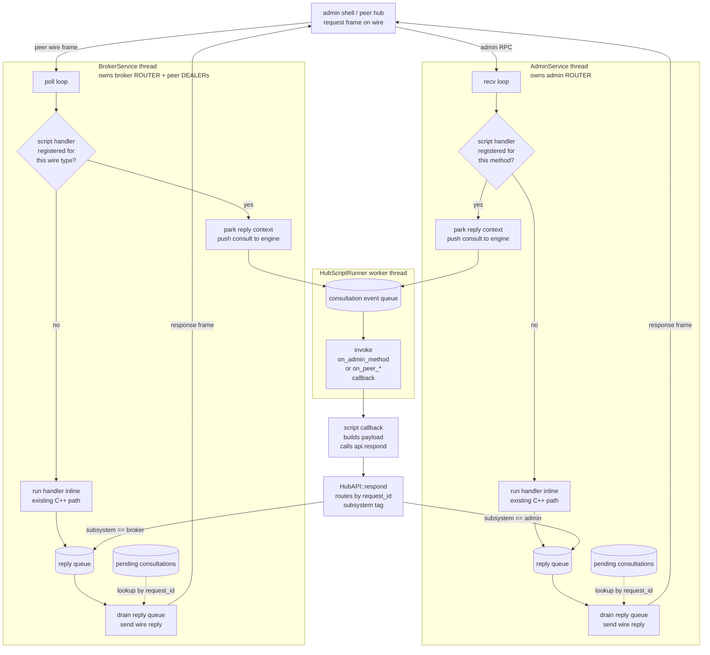
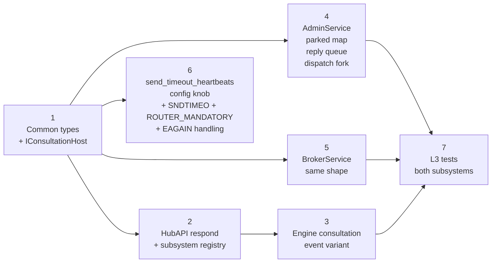

# HEP-CORE-0033 Phase 8c — Script-Mediated Request/Response

**Draft, 2026-05-04. Not yet ratified. Hub/broker scope only — no role-side surface change.**

This draft proposes the design for HEP-CORE-0033 §15 Phase 8c: a generic
"script-mediated request/response" mechanism that lets hub scripts
intercept selected admin RPCs and broker peer wire requests, produce the
response payload programmatically, and ship it back to the originator
through the existing wire paths.

The mechanism is selectively applied per-method.  Methods that do not
register a script handler keep their current C++ inline path unchanged.

---

## 1. Motivation

Today every admin RPC and most broker peer wire requests are
request/response on the wire (envelope `{method, token, params}` →
`{status, result|error}`; broker `*_REQ` → `*_ACK`).  The response is
built synchronously on the receiving thread (admin recv loop / broker
poll loop), reading shared state and returning JSON.

Many of these methods would benefit from script-side processing:

- `query_metrics` — script computes custom aggregations, applies
  domain-specific filters before returning.
- `list_roles` / `get_channel` — script decorates entries with
  hub-specific context, redacts fields by caller identity.
- `close_channel` — script policy gate (allow/deny with reason carried
  in the response).
- `HUB_TARGETED_MSG` — peer sends a message expecting a structured
  reply; the script is the natural place to compute it.

This phase builds the infrastructure once, on top of the existing
per-type queue + dispatch pattern that broker and admin both already
use.  No new threads, no socket-ownership changes, no async send
infrastructure invented.

---

## 2. Architecture overview



Legend:
- Solid edges = synchronous flow on the owning thread.
- Dotted edges = same-thread map lookup.
- Engine pushes only; never reads from reply queues.  Each subsystem
  drains its own reply queue on its own thread, where its socket lives.

---

## 3. Common abstraction

New tiny header `src/include/utils/script_consultation.hpp`:

```cpp
namespace pylabhub::hub_host {

/// Subsystem identifier — encoded in high bits of request_id so
/// `HubAPI::respond` can route a script's reply to the correct
/// subsystem without a separate registry lookup.
enum class ConsultationSubsystem : uint8_t {
    Admin  = 1,
    Broker = 2,
};

/// Inbound (broker/admin → engine).
struct ConsultationRequest {
    uint64_t       request_id;   // subsystem-tagged (see encode_request_id)
    std::string    method;       // "list_roles", "HUB_TARGETED_MSG", etc.
    nlohmann::json params;       // request body (post-validation)
};

/// Outbound (engine → broker/admin).  `body` is one of:
///   {"result": <anything>}                                — success
///   {"error": {"code": "<token>", "message": "<text>"}}   — error
/// Subsystem reads the top-level key when shipping; malformed bodies
/// (neither / both / missing required fields) are replaced with a
/// synthetic {error: {code: "internal", message: "..."}} envelope.
struct ConsultationReply {
    uint64_t       request_id;
    nlohmann::json body;
};

/// Subsystem-side contract.  AdminService::Impl + BrokerService::Impl
/// each implement this and register with HubAPI at startup.
class IConsultationHost {
public:
    virtual ~IConsultationHost() = default;
    /// Thread-safe push.  Called from the engine worker thread.
    virtual void enqueue_reply(ConsultationReply reply) noexcept = 0;
};

/// request_id encoding: top 8 bits = ConsultationSubsystem, low 56 bits =
/// per-subsystem monotonic counter.  Plenty of bits both directions; no
/// overflow concerns within a hub instance lifetime.
constexpr uint64_t encode_request_id(ConsultationSubsystem s, uint64_t counter) {
    return (uint64_t(s) << 56) | (counter & 0x00FFFFFFFFFFFFFFull);
}
constexpr ConsultationSubsystem decode_subsystem(uint64_t request_id) {
    return ConsultationSubsystem(uint8_t(request_id >> 56));
}

} // namespace pylabhub::hub_host
```

The encoding choice is simple and adequate:
- **No central request-id registry needed.**  HubAPI decodes the
  subsystem tag from request_id and routes directly to the registered
  `IConsultationHost*`.
- Same primitive scales naturally to a third subsystem (federation
  manager, etc.) without restructuring.

---

## 4. AdminService changes

### 4.1 New private members (`admin_service.cpp` `Impl`)

```cpp
class AdminService::Impl : public hub_host::IConsultationHost {
    // ...existing members...

    /// Methods present in this map have a script handler registered;
    /// inbound dispatch forks to consultation path instead of inline.
    /// Populated at startup by HubScriptRunner after script load
    /// (callback name introspection: e.g. script defined
    /// `on_admin_query_metrics` ⇒ map["query_metrics"] = "on_admin_query_metrics").
    std::unordered_map<std::string, std::string> method_to_script_callback_;

    /// Reply queue — engine pushes; recv loop drains per iteration.
    std::mutex                                   reply_mu_;
    std::deque<hub_host::ConsultationReply>      reply_queue_;

    /// Parked reply routing — admin-thread-only (no locking).
    struct ParkedAdmin {
        zmq::message_t                          peer_identity;  // ROUTER identity copy
        std::string                             correlation_id; // from request envelope
        std::chrono::steady_clock::time_point   t_dispatch;
    };
    std::unordered_map<uint64_t, ParkedAdmin>   pending_consultations_;
    uint64_t                                    next_consult_counter_{1};

    /// IConsultationHost — engine calls into this from worker thread.
    void enqueue_reply(hub_host::ConsultationReply r) noexcept override {
        std::lock_guard lk(reply_mu_);
        reply_queue_.push_back(std::move(r));
        // No CV wake — admin recv loop polls on its own cadence.
    }
};
```

### 4.2 Dispatch fork (existing `dispatch_method`)

```cpp
DispatchOutcome dispatch_method(const json &request, zmq::message_t identity) {
    // existing envelope check + token gate unchanged

    const std::string method = request["method"].get<std::string>();

    auto cb_it = method_to_script_callback_.find(method);
    if (cb_it != method_to_script_callback_.end()) {
        return park_and_dispatch_consultation(method, cb_it->second,
                                              request, std::move(identity));
    }

    // Existing inline path for methods without script handlers.
    return existing_inline_dispatch(method, request);
}

/// Sentinel the recv loop uses to decide whether to send the response
/// now or wait for the engine to push one onto reply_queue_.
enum class DispatchOutcome { ReplyNow, ConsultationParked };
```

### 4.3 Park + dispatch + drain in recv loop

```cpp
DispatchOutcome park_and_dispatch_consultation(const std::string &method,
                                                const std::string &callback,
                                                const json        &request,
                                                zmq::message_t   &&identity) {
    const uint64_t rid = hub_host::encode_request_id(
        hub_host::ConsultationSubsystem::Admin,
        next_consult_counter_++);

    pending_consultations_.emplace(rid, ParkedAdmin{
        std::move(identity),
        request.value("correlation_id", ""),
        std::chrono::steady_clock::now()
    });

    host_.script_runner().dispatch_consultation(hub_host::ConsultationRequest{
        rid, method, request.value("params", json::object())
    });

    return DispatchOutcome::ConsultationParked;
}

void recv_loop_iteration() {
    // 1. Drain reply queue — send any responses the engine produced.
    drain_reply_queue();

    // 2. Walk pending_consultations_ for timeouts.
    expire_stale_consultations();

    // 3. Recv next request frame (existing code path).
    if (!socket.recv(msg, zmq::recv_flags::dontwait)) return;
    auto outcome = dispatch_method(...);
    if (outcome == DispatchOutcome::ReplyNow) {
        // existing reply path — send outcome.result frame
    }
    // ConsultationParked → no reply now; will be sent when engine
    //                      pushes onto reply_queue_
}
```

### 4.4 Drain implementation

```cpp
void drain_reply_queue() {
    std::deque<ConsultationReply> local;
    {
        std::lock_guard lk(reply_mu_);
        local.swap(reply_queue_);
    }
    for (auto &r : local) {
        auto it = pending_consultations_.find(r.request_id);
        if (it == pending_consultations_.end()) {
            LOGGER_WARN("AdminService: reply for unknown request_id {} — dropped "
                        "(double-respond or stale)", r.request_id);
            continue;
        }
        send_response_envelope(it->second, r.body);
        pending_consultations_.erase(it);
    }
}

/// Read top-level "result" or "error" key from body and ship the
/// corresponding wire envelope.  Malformed body produces a synthetic
/// error so the originator never blocks on a missing reply.
void send_response_envelope(const ParkedAdmin &parked, const json &body) {
    json envelope;
    if (body.contains("result") && !body.contains("error")) {
        envelope = {{"status", "ok"}, {"result", body["result"]}};
    } else if (body.contains("error") && !body.contains("result")) {
        const auto &e = body["error"];
        if (!e.is_object() ||
            !e.contains("code")    || !e["code"].is_string()    ||
            !e.contains("message") || !e["message"].is_string()) {
            envelope = {{"status", "error"},
                        {"error", {{"code", "internal"},
                                   {"message", "script error body missing required "
                                               "code/message fields"}}}};
        } else {
            envelope = {{"status", "error"}, {"error", e}};
        }
    } else {
        envelope = {{"status", "error"},
                    {"error", {{"code", "internal"},
                               {"message", "script respond body must contain "
                                           "exactly one of 'result' or 'error'"}}}};
    }
    if (!parked.correlation_id.empty()) {
        envelope["correlation_id"] = parked.correlation_id;
    }
    send_reply(socket_, parked.peer_identity, envelope);
}

void expire_stale_consultations() {
    const auto now      = std::chrono::steady_clock::now();
    const auto deadline = host_.config().broker().effective_ready_timeout();

    for (auto it = pending_consultations_.begin();
         it != pending_consultations_.end(); ) {
        if (now - it->second.t_dispatch > deadline) {
            json env = {{"status", "error"},
                        {"error", {{"code", "timeout"},
                                   {"message",
                                    "script handler did not respond within deadline"}}}};
            if (!it->second.correlation_id.empty()) {
                env["correlation_id"] = it->second.correlation_id;
            }
            send_reply(socket_, it->second.peer_identity, env);
            it = pending_consultations_.erase(it);
        } else {
            ++it;
        }
    }
}
```

### 4.5 Idempotency — double-respond protection

If the script calls `api.respond(rid, ...)` twice for the same
`request_id`, the second call's body reaches `enqueue_reply` and gets
pushed.  When the drain loop processes it, the corresponding
`pending_consultations_` entry is already erased — the second body is
silently dropped with a `LOGGER_WARN` ("reply for unknown request_id").
The unknown-id path is the natural double-respond guard.

---

## 5. BrokerService changes

Mirrors the admin pattern.  Reuses the existing per-type queue +
post-poll drain idiom (the broker already has this pattern three times
over — `close_request_queue_`, `broadcast_request_queue_`,
`hub_targeted_queue_`).

### 5.1 New private members (`broker_service.cpp` `Impl`)

```cpp
class BrokerServiceImpl : public hub_host::IConsultationHost {
    // ...existing members...

    /// Wire-msg-type → script callback name.  Populated at startup.
    /// Example: "HUB_TARGETED_MSG" → "on_peer_targeted_msg",
    /// "METRICS_REQ" → "on_metrics_req".
    std::unordered_map<std::string, std::string> wire_to_script_callback_;

    /// Reply queue — engine pushes; broker poll drains.  Same shape
    /// as the existing close_request_queue_ etc.
    std::mutex                              consultation_reply_mu_;
    std::deque<hub_host::ConsultationReply> consultation_reply_queue_;

    /// Parked reply routing — broker-thread-only (no locking).
    struct ParkedBroker {
        zmq::message_t                          peer_identity;
        std::string                             correlation_id;
        std::string                             ack_msg_type;   // e.g. "HUB_TARGETED_ACK"
        std::chrono::steady_clock::time_point   t_dispatch;
    };
    std::unordered_map<uint64_t, ParkedBroker> pending_consultations_;
    uint64_t                                   next_consult_counter_{1};

    void enqueue_reply(hub_host::ConsultationReply r) noexcept override {
        std::lock_guard lk(consultation_reply_mu_);
        consultation_reply_queue_.push_back(std::move(r));
    }
};
```

### 5.2 Dispatch fork in `process_message`

For each wire `*_REQ` type that opts into script-mediation, the
existing inline dispatch branch checks the registry first:

```cpp
else if (msg_type == "HUB_TARGETED_MSG") {
    auto cb = wire_to_script_callback_.find(msg_type);
    if (cb != wire_to_script_callback_.end()) {
        park_and_dispatch_broker_consultation(
            msg_type, cb->second, payload, identity, "HUB_TARGETED_ACK");
        // No inline reply — handled async via consultation_reply_queue_
    } else {
        handle_hub_targeted_msg(payload);  // existing inline path
    }
}
```

`park_and_dispatch_broker_consultation` is the broker-side mirror of
admin's variant; same encoding (`ConsultationSubsystem::Broker`),
same engine handoff via `HubScriptRunner::dispatch_consultation`.

### 5.3 Drain in poll loop post-poll phase

Mirrors the existing `pending_closes` / `pending_broadcasts` /
`pending_targeted` drain blocks (`broker_service.cpp:537-595`).  Adds
one more block:

```cpp
// After existing drain of close_request_queue_, broadcast_request_queue_,
// hub_targeted_queue_ — same pattern, one more queue:
{
    std::deque<ConsultationReply> pending_replies;
    {
        std::lock_guard lk(consultation_reply_mu_);
        pending_replies.swap(consultation_reply_queue_);
    }
    for (auto &r : pending_replies) {
        deliver_consultation_reply(router, r);
    }
    expire_stale_consultations(router);
}
```

`deliver_consultation_reply` is the broker mirror of admin's drain — looks
up parked routing, builds the wire frame (using the parked `ack_msg_type`
for the wire envelope, mapping `body.result` to ack and `body.error` to
the wire ERROR type per HEP-0033 §11.1), calls the existing `send_reply`
helper.

---

## 6. HubAPI surface addition

One new method on `HubAPI`:

```cpp
class HubAPI {
public:
    // ...existing surface (read accessors, control delegates) unchanged...

    /// Send a response for a parked consultation.  `request_id` is the
    /// value passed into the script's consultation callback (e.g.
    /// `on_admin_query_metrics(api, request_id, params)`).
    ///
    /// `body` MUST contain exactly one of:
    ///   {"result": <anything>}                                — success
    ///   {"error": {"code": "<token>", "message": "<text>"}}   — error
    /// Anything else is replaced with a synthetic
    ///   {"error": {"code": "internal", "message": "..."}}
    /// so the originator always receives a well-formed envelope.
    ///
    /// Idempotent: a second call with the same request_id is logged +
    /// dropped.  Cross-thread-safe (engine worker calls this; routes
    /// to the correct subsystem's reply queue via subsystem tag in
    /// request_id).
    void respond(uint64_t request_id, nlohmann::json body);

    /// Subsystem registration — called at HubHost startup, not from
    /// scripts.  HubAPI keeps a fixed-size table indexed by
    /// ConsultationSubsystem enum value.
    void register_consultation_host(hub_host::ConsultationSubsystem,
                                     hub_host::IConsultationHost*);
};
```

Implementation:

```cpp
void HubAPI::respond(uint64_t request_id, nlohmann::json body) {
    auto sub = hub_host::decode_subsystem(request_id);
    auto *host = impl_->consultation_hosts[uint8_t(sub)];
    if (!host) {
        LOGGER_WARN("HubAPI::respond: no host registered for subsystem {}",
                    uint8_t(sub));
        return;
    }
    host->enqueue_reply({request_id, std::move(body)});
}
```

### 6.1 Pybind11 + Lua bindings

Both engines bind `respond` as a plain method on the existing `HubAPI`
binding.  No special dispatch — the cross-thread safety is purely in
the C++ side (lock + push).

`request_id` crosses Python as `int` (64-bit) and Lua as `cdata
uint64_t` under LuaJIT.  We pass it back as opaque — script doesn't
compute on it.

---

## 7. Engine changes

### 7.1 Consultation event variant

`HubScriptRunner` exposes a new dispatch entry point:

```cpp
class HubScriptRunner {
public:
    // ...existing dispatch_event / dispatch_tick...

    /// Thread-safe.  Pushes a consultation event onto the engine's
    /// internal event queue.  Engine worker pops, invokes the
    /// per-subsystem callback (looked up from the script's exported
    /// callback names), passes (api, request_id, params).  Engine
    /// IGNORES the script's return value — script must call
    /// api.respond explicitly.
    void dispatch_consultation(hub_host::ConsultationRequest req);
};
```

### 7.2 Script callback shape

```python
# Python hub script
def on_admin_query_metrics(api, request_id, params):
    base = api.query_metrics(params.get("categories", []))
    base["custom_aggregate"] = compute_aggregate(base)
    api.respond(request_id, {"result": base})

def on_admin_close_channel(api, request_id, params):
    name = params.get("channel", "")
    if name in api.config()["protected_channels"]:
        api.respond(request_id, {"error": {
            "code":    "policy_rejected",
            "message": f"channel '{name}' is protected"
        }})
        return
    api.close_channel(name)
    api.respond(request_id, {"result": {"closed": name}})

def on_peer_targeted_msg(api, request_id, params):
    peer_uid = params.get("from_hub_uid", "")
    payload  = params.get("payload", {})
    response = compute_peer_response(peer_uid, payload)
    api.respond(request_id, {"result": response})
```

```lua
-- Lua hub script (same shape, request_id is a cdata uint64_t under LuaJIT)
function on_admin_query_metrics(api, request_id, params)
    local base = api:query_metrics(params.categories or {})
    base.custom_aggregate = compute_aggregate(base)
    api:respond(request_id, {result = base})
end
```

### 7.3 Deferred reply across callbacks

The script may stash `request_id` in script-side state and respond from
a later callback.  Engine maintains no per-request state; broker/admin
parked map is the only timeout authority.

```python
# Python hub script — defer reply across ticks
_deferred = {}

def on_admin_query_metrics(api, request_id, params):
    _deferred[request_id] = params       # remember; respond later

def on_tick(api):
    for rid, params in list(_deferred.items()):
        if expensive_aggregate_ready(params):
            api.respond(rid, {"result": expensive_aggregate(params)})
            del _deferred[rid]
```

If the script never responds, the broker/admin timeout walk sends a
default timeout error response after `effective_ready_timeout()`
(default 5 s).

### 7.4 Engine ignores return value

This is a deliberate departure from the per-event dispatch path
(`dispatch_event` returns void anyway, but `dispatch_consultation`
explicitly does not capture or use any return).  Reasoning:

- Synchronous return-of-bool is a poor fit for deferred reply (script
  returning false from one call would then conflict with a later
  `api.respond`).
- `respond` carries the body — making the script call it explicitly
  removes ambiguity about timing and content of the reply.

---

## 8. Send-path hardening

Required so a slow consulting peer can't block the broker / admin
thread indefinitely (and starve every other peer's reply).

### 8.1 New config knob

The send timeout has its own knob with a heartbeat-derived default.
Same numeric value as the dead-peer threshold by default, but tunable
independently — ready/pending miss-counts govern liveness reaping;
send timeout governs per-frame send blocking.  Tying them with `==`
removes operational flexibility.

Add to `HubBrokerConfig` (`src/include/utils/config/hub_broker_config.hpp`):

```cpp
struct HubBrokerConfig {
    // ...existing heartbeat fields...
    int32_t  heartbeat_interval_ms{::pylabhub::kDefaultHeartbeatIntervalMs};
    uint32_t ready_miss_heartbeats{::pylabhub::kDefaultReadyMissHeartbeats};
    uint32_t pending_miss_heartbeats{::pylabhub::kDefaultPendingMissHeartbeats};
    uint32_t grace_heartbeats{::pylabhub::kDefaultGraceHeartbeats};

    /// Multiplier for ZMQ_SNDTIMEO on broker / admin sockets.
    /// Effective send timeout = heartbeat_interval_ms × send_timeout_heartbeats.
    /// Default 10 → 5 s on default heartbeat interval (matches the
    /// dead-peer threshold by default but tunable independently).
    /// Floored at 1 — one heartbeat is the minimum sensible bound.
    uint32_t send_timeout_heartbeats{::pylabhub::kDefaultSendTimeoutHeartbeats};

    [[nodiscard]] std::chrono::milliseconds effective_send_timeout() const noexcept {
        const auto v = std::chrono::milliseconds(heartbeat_interval_ms) *
                       std::max(uint32_t{1}, send_timeout_heartbeats);
        return v;
    }
};
```

And the constant in `timeout_constants.hpp`:

```cpp
#ifndef PYLABHUB_DEFAULT_SEND_TIMEOUT_HEARTBEATS
#  define PYLABHUB_DEFAULT_SEND_TIMEOUT_HEARTBEATS 10  // 10 × 500ms = 5s default
#endif
inline constexpr uint32_t kDefaultSendTimeoutHeartbeats =
    PYLABHUB_DEFAULT_SEND_TIMEOUT_HEARTBEATS;
```

JSON key `"send_timeout_heartbeats"` added to the `HubBrokerConfig`
strict-key whitelist (`hub_broker_config.hpp:73-75`).

### 8.2 Socket option setup

Apply on broker ROUTER, broker peer DEALERs, and admin ROUTER:

```cpp
const auto send_timeout = cfg.broker().effective_send_timeout();
socket.set(zmq::sockopt::sndtimeo, int(send_timeout.count()));
socket.set(zmq::sockopt::router_mandatory, 1);  // surface dead peers as EHOSTUNREACH
```

### 8.3 Send wrapper

Existing `send_reply` / `send_to_identity` wrap each `socket.send` call:

```cpp
static bool try_send_frame(zmq::socket_t &socket,
                            zmq::message_t &&msg,
                            zmq::send_flags flags,
                            const char *context_for_log) {
    try {
        socket.send(std::move(msg), flags);
        return true;
    } catch (const zmq::error_t &e) {
        if (e.num() == EAGAIN) {
            // SNDTIMEO expired — peer is too slow / stuck.
            LOGGER_WARN("{}: send timed out (peer slow/dead)", context_for_log);
            // Increment slow_peer_send_timeouts metric; broker's existing
            // heartbeat-timeout walk will reap on its own schedule.
            return false;
        }
        if (e.num() == EHOSTUNREACH) {
            LOGGER_WARN("{}: send to non-existent peer (ROUTER_MANDATORY)",
                        context_for_log);
            return false;
        }
        throw;  // any other ZMQ error stays an exception
    }
}
```

`send_reply` / `send_to_identity` use `try_send_frame` for every frame.
Returning false from any frame in a multi-frame envelope aborts the
remaining frames (ROUTER socket handles partial-frame cleanup).

### 8.4 New metric

`slow_peer_send_timeouts_total` — exported via existing broker metrics
path.  Surfaces the failure mode for ops visibility.

### 8.5 Why send-path hardening is part of this work

Script-mediated request/response materially increases reply-path
traffic (broker's `HUB_TARGETED_MSG` and similar wire types now produce
a richer reply class than today's inline acks).  Without the timeout,
a single slow peer consulting via script could stall the broker thread
for the full TCP keepalive window (~924 s default on Linux), backing
up every other peer's reply.  The hardening cost is ~30 LOC across 4
send sites + 2 socket setup blocks.

---

## 9. Failure modes + invariants

| Failure | Detection | Behavior |
|---|---|---|
| Script never calls `respond` | Subsystem timeout walk (`>effective_ready_timeout()`) | Subsystem sends timeout error envelope to originator + erases parked entry |
| Script calls `respond` twice for same request_id | Drain loop sees no parked entry on second drain | Logged + dropped silently |
| Script body has neither `result` nor `error` key | Drain handler `send_response_envelope` validation | Synthetic `{error: {code: internal, message: "..."}}` shipped instead |
| Script body has both `result` AND `error` keys | Same | Same — synthetic internal error |
| Script `error` body missing `code`/`message` fields or wrong types | Same | Same — synthetic internal error |
| Engine worker dies between consult dispatch and reply | Subsystem timeout walk fires (engine never produced reply) | Same as "never responded" — timeout error |
| Slow consulting peer (HWM exhaustion on its outbound) | `SNDTIMEO` expires in `try_send_frame` | Reply dropped + `slow_peer_send_timeouts_total++` + `LOGGER_WARN`.  Heartbeat walk reaps peer on schedule. |
| Script calls `respond` for a request_id that isn't from this hub instance (forged or stale) | `decode_subsystem` returns valid token, but parked map has no entry | Drop + warn (same path as double-respond) |
| Script raises exception inside consultation callback | Engine catches per existing contract; `script_error_count` bumped | No `respond` happens → subsystem timeout walk handles |

Invariants (each must be tested with a sensitivity check per
`CLAUDE.md` "Tests must pin path"):

1. **At-most-once reply.** Subsystem sends exactly zero or one
   response per parked request_id.
2. **Engine never replies on its own.**  Engine's invocation of the
   script callback returns void from the subsystem's perspective —
   only `respond` produces a reply.
3. **Subsystem owns its socket end-to-end.**  No reply ever leaves a
   socket the originating subsystem doesn't own.
4. **Timeout deadline = effective_ready_timeout.**  Same threshold the
   broker uses for declaring peers dead — single tuning knob.
5. **Send-path bounded.**  No `socket.send` call blocks longer than
   `effective_send_timeout()`.

---

## 10. Implementation phases



### Step 1 — Common types
- New header `src/include/utils/script_consultation.hpp`
- ~50 LOC: enum, structs, encode/decode helpers, `IConsultationHost`

### Step 2 — HubAPI respond
- `src/include/utils/hub_api.hpp` + `src/utils/service/hub_api.cpp`:
  one new method, subsystem registry (3-slot fixed array indexed by
  enum)
- Both engine bindings: `pybind11` `.def` for both, Lua closure for both

### Step 3 — Engine consultation event variant
- `HubScriptRunner::dispatch_consultation` thread-safe entry
- Worker thread pops consultation event, invokes per-method callback
- No return-value capture — explicit comment + test

### Step 4 — AdminService
- `Impl` gains: method-to-callback map, reply queue + mu, parked map,
  `IConsultationHost` impl
- Recv loop: drain reply queue, expire stale consultations, dispatch
  fork in `dispatch_method`

### Step 5 — BrokerService
- Same shape as Step 4
- First wire-type wired in: `HUB_TARGETED_MSG` (best fit — already
  designed as a script extension point per HEP-0033 §3 functions)
- Other wire types (`METRICS_REQ`, role-side requests, etc.) stay on
  inline path until explicitly opted in

### Step 6 — Send-path hardening
- `HubBrokerConfig::send_timeout_heartbeats` field +
  `effective_send_timeout()` accessor + JSON whitelist update
- `kDefaultSendTimeoutHeartbeats` constant in `timeout_constants.hpp`
- 4 send sites wrap with `try_send_frame`
- 2 setup blocks set `SNDTIMEO` + `ROUTER_MANDATORY`
- 1 new metric exposed via existing broker metrics path

### Step 7 — L3 tests
Test plan per the §11 Test plan section below.

---

## 11. Test plan

L3 tests live under `tests/test_layer3_datahub/`.  All tests:
- Pin specific exception types AND message substrings (no
  `EXPECT_THROW(..., std::exception)` — see CLAUDE.md "Tests must pin
  path").
- Pin timing bounds where speed is part of the contract.
- Pin structural payload shape (envelope `+` result/error fields).
- Sensitivity check: each new assertion is verified by mutation —
  break the production code, confirm test fails, restore.

| Test | What it pins |
|---|---|
| `AdminConsultation_QueryMetrics_ScriptBuildsResultBody` | Admin RPC → script `on_admin_query_metrics` runs → `api.respond(rid, {result: payload})` → admin client receives `{status: ok, result: payload}`.  Pin: payload field admin-side ≡ payload script-side; correlation_id round-trips. |
| `AdminConsultation_CloseChannel_ScriptDeniesWithErrorBody` | Script calls `api.respond(rid, {error: {code, message}})` → admin client receives `{status: error, error: {code, message}}`.  Pin: code + substring of message. |
| `AdminConsultation_DeferredReply_AcrossOnTickCallbacks` | Script stashes request_id in `on_admin_*`, returns; calls `api.respond` from `on_tick` later.  Pin: admin client blocks on recv until reply arrives; elapsed time falls in [tick_period, 2×tick_period]. |
| `AdminConsultation_ScriptNeverResponds_TimeoutErrorEmitted` | Script defines callback that ignores `request_id` entirely.  Pin: admin client receives `{status: error, error: {code: "timeout", ...}}` after ~`effective_ready_timeout()` ± 1 tick. |
| `AdminConsultation_DoubleRespond_SecondCallSilentlyDropped` | Script calls `api.respond(rid, a)` then `api.respond(rid, b)`.  Pin: admin client sees `a`, never sees `b`; LOGGER_WARN captured for the second call. |
| `AdminConsultation_MalformedBody_SyntheticInternalError` | Script calls `api.respond(rid, {})` (neither result nor error), and `api.respond(rid, {result: ..., error: ...})` (both).  Pin: both produce `{status: error, error: {code: "internal", ...}}` admin-side. |
| `BrokerConsultation_HubTargetedMsg_ScriptHandlesPeerQuery` | Peer hub sends `HUB_TARGETED_MSG` → script callback computes response → broker sends `HUB_TARGETED_ACK` with payload.  Pin: peer-side recv contains script's payload. |
| `BrokerConsultation_TimeoutBehavior` | Mirror of admin timeout test on broker wire. |
| `SendTimeout_ConfigOverride_FiresAtConfiguredBound` | Override `send_timeout_heartbeats` to 2 (= 1 s on default heartbeat interval).  Cap one peer's outbound HWM=1, send 5 frames; observe SNDTIMEO fires within `[1s, 1.5s]` per send (NOT default 5 s).  Pin: timing bound. |
| `SlowPeer_DoesNotStallBroker` | Two clients: A (slow — its outbound socket capped HWM=1, doesn't recv); B (responsive).  Send A many replies; observe SNDTIMEO triggers on A; B's request still gets answered within `effective_ready_timeout()`.  Pin: B's recv timestamp < A's send_timeout × 2.  Verify `slow_peer_send_timeouts_total` metric increments. |
| `IdempotentRespond_OnDeadEngine` | Engine worker terminated mid-consult; verify subsystem timeout fires; verify subsequent forced engine restart doesn't deliver stale reply.  Pin: only one envelope on wire. |

L4 plh_hub tests (deferred to the cross-process binary work — once the
binary lands) will exercise the cross-process variant.

---

## 12. Proposed HEP-CORE-0033 edits

The following edits land WITH the implementation, not before.

### 12.1 §11.2 — Methods (v1)

Add a sub-section **§11.2.1 Script-mediated dispatch** (new):

```markdown
### 11.2.1 Script-mediated dispatch

A method may register a script-side handler.  When present, AdminService
forks dispatch:
- No script handler → inline C++ path (existing behavior, unchanged).
- Script handler registered → consultation path: admin parks reply
  context, dispatches a `ConsultationRequest` to the engine, continues
  recv loop.  Script callback (`on_admin_<method>(api, request_id,
  params)`) computes the response and calls `api.respond(request_id,
  body)` where `body` is `{"result": <anything>}` for success or
  `{"error": {"code", "message"}}` for error.  Admin's recv loop
  drains the resulting reply queue and ships the wire envelope.

Timeout: subsystem walks parked consultations on each iteration; entries
older than `effective_ready_timeout()` (= `heartbeat_interval ×
ready_miss_heartbeats`, default 5 s) are auto-replied with `{code:
timeout}` and erased.

Idempotency: a second `respond` for the same request_id is silently
dropped.

See `docs/tech_draft/HEP_0033_PHASE_8C_SCRIPT_RESPONSE.md` for the design
and `src/include/utils/script_consultation.hpp` for the common types.
```

### 12.2 §12.2 — Veto hooks (replace)

Replace the `**Veto hooks**` paragraph with:

```markdown
**Script-mediated request/response** (see §11.2.1):
A script may declare `on_admin_<method>` (admin RPC) or
`on_peer_<wire_type>` (broker peer wire) callback to intercept the
corresponding request and produce the response payload programmatically.
The callback receives `(api, request_id, params)` and explicitly calls
`api.respond(request_id, body)` with `body = {"result": ...}` or
`body = {"error": {"code", "message"}}`.  There is no return-value
channel.  Replies may be deferred across callbacks (script stashes
`request_id`, replies later from `on_tick` or another consultation).
```

The earlier `on_channel_close_request` / `on_role_register_request`
"veto" naming is dropped — those are now `on_admin_close_channel` and
(future) the role-registration wire equivalent under the unified
mechanism.

### 12.3 §12.3 — `HubAPI` surface

Add `respond(request_id, body)` to the surface list.  No
`respond_error` — error responses are signaled by the body shape.

### 12.4 §15 — Phase 8c entry

Add new bullet under Phase 8 in the phase narrative:

```markdown
- **Phase 8c** — Script-mediated request/response infrastructure
  (`docs/tech_draft/HEP_0033_PHASE_8C_SCRIPT_RESPONSE.md`).
  Common types in `script_consultation.hpp`; HubAPI gains `respond`;
  AdminService + BrokerService each gain reply queue + parked map +
  dispatch fork; new `send_timeout_heartbeats` knob in HubBrokerConfig;
  ZMQ send-path hardened with SNDTIMEO + ROUTER_MANDATORY + EAGAIN
  handling; first wired callbacks are `on_admin_*` (any of §11.2
  methods) and `on_peer_*` (initial: `HUB_TARGETED_MSG`).  L3 test
  sweep covers admin + broker paths, deferred reply, timeout,
  double-respond, malformed body, slow-peer isolation, configurable
  send timeout.
```

### 12.5 §11.5 — Error code catalog

Add row:

| Code | When | Per-method |
|---|---|---|
| `timeout` | Script consultation handler did not respond within `effective_ready_timeout()` | Any method that registered a script handler |

### 12.6 §6.2 — `hub.json` schema

Add to the `broker` block schema:

```json
{
  "broker": {
    "heartbeat_interval_ms": 500,
    "ready_miss_heartbeats": 10,
    "send_timeout_heartbeats": 10
  }
}
```

Field doc: "Multiplier for ZMQ_SNDTIMEO on broker / admin sockets.
Effective send timeout = `heartbeat_interval_ms × send_timeout_heartbeats`.
Defaults to 10 (≡ 5 s on default heartbeat interval); floored at 1."

### 12.7 §17 — Out of scope

No changes — the mechanism remains within HEP-0033's "policy enforcement
+ script extension" remit.

---

## 13. Out of scope for this work

- **Role-side equivalent.**  No role-side script-mediated
  request/response.  Role API surface is unchanged.
- **Federation-manager subsystem.**  Encoding allows for it (subsystem
  enum value 3+), but only Admin (1) + Broker (2) are wired here.
- **Async send infrastructure.**  Sends remain synchronous in broker /
  admin thread; `SNDTIMEO` + EAGAIN handling is the bound, not a
  redesign.
- **Out-of-process script engine.**  Engine remains in-process.
  Cross-process consultation is a future HEP if needed.
- **Versioned wire-protocol changes.**  The consultation `request_id`
  is internal to the hub; never leaves the hub on the wire.  Wire
  frames remain unchanged shape; only the C++ side has new
  infrastructure.

---

## 14. Open questions (none blocking)

1. **Namespace placement of common types.**  `pylabhub::hub_host`
   (where `HubAPI` lives) vs `pylabhub::scripting` (where engine
   lives).  Slight preference for `hub_host` since both subsystems
   consume the types and only HubAPI happens to live in scripting
   today.  Final choice during Step 1.

2. **Per-method timeout override.**  Default is global
   (`effective_ready_timeout()`).  Scripts may want longer for
   genuinely expensive `query_metrics` aggregations.  Defer to a
   follow-up enhancement: optional per-method timeout in
   `method_to_script_callback_` map.

3. **Auto-discovery of `on_admin_*` / `on_peer_*` callbacks.**
   Introspects script's exported names at load time.  Adding a new
   method later requires script reload.  Deferred — operationally
   acceptable since hub script reload is by design.

---

## 15. References

- HEP-CORE-0033 §11 (AdminService), §12 (HubAPI), §15 (phases)
- HEP-CORE-0023 §2.5 (heartbeat semantics — source of `effective_ready_timeout`)
- `src/utils/ipc/broker_service.cpp` (existing per-type queue + dispatch pattern)
- `src/utils/ipc/admin_service.cpp` (existing method dispatch table)
- `src/utils/service/hub_api.cpp` + `hub_api.hpp` (existing read accessor / control delegate surface)
- `src/utils/service/hub_script_runner.cpp` (existing dispatch model)
- `CLAUDE.md` § "Testing Practice (Mandatory)" (test rigor requirements)
