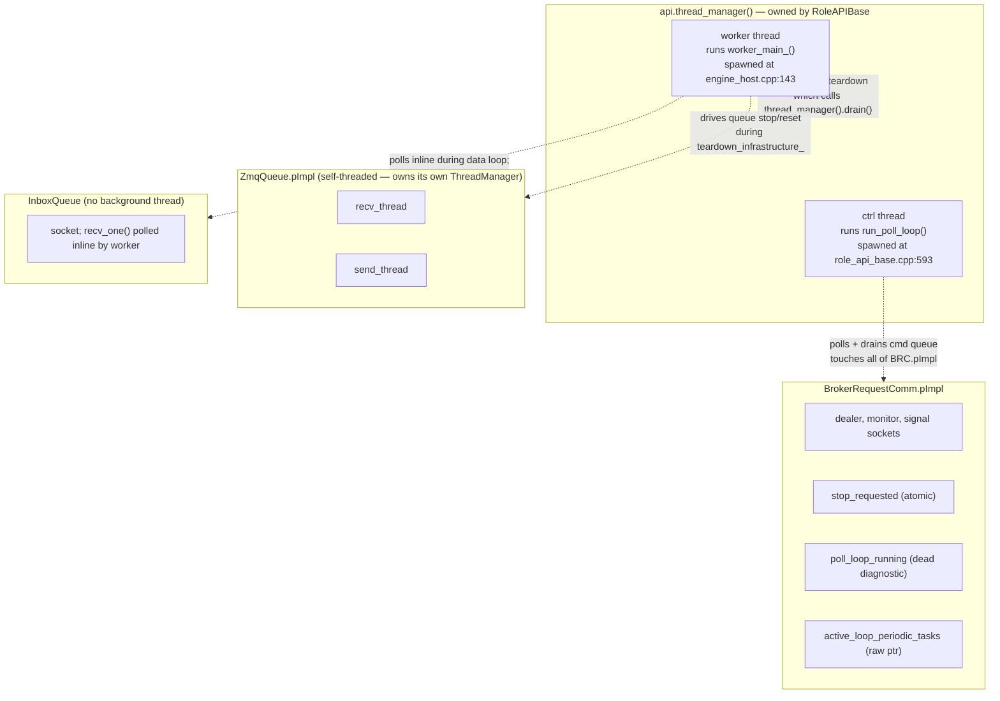

# Wave MD1 — Role teardown thread-shutdown contract (use-after-free fix)

| | |
|---|---|
| **Status**       | Draft — design phase. All §6 decisions LOCKED via 2026-05-12 user Q&A. No code changes yet. |
| **Created**      | 2026-05-12 |
| **Drives**       | Eliminating the gdb-confirmed use-after-free race in role teardown (`PlhHubCliTest.RoundTrip_PlhHubKeygenAndRunPlhRoleRegisters` SIGSEGV exit 139, 1/13 under `-j2`). |
| **Wave**         | MD1 (precedes M1.5 per chain reordering 2026-05-12 — stabilize teardown before adding `on_channel_closing` auto-stop on top). |
| **Resume point** | If interrupted, return to §5 implementation plan; all design decisions in §6 are locked. |

---

## 1. Why this exists

The captured gdb stack trace (preserved in `docs/todo/TESTING_TODO.md` §9):

```
Thread 9 (BRC ctrl thread) SIGSEGV:
  #0  std::atomic<bool>::store        on freed memory
  #2  BrokerRequestComm::run_poll_loop ← broker_request_comm.cpp:594
  #3  RoleAPIBase::start_ctrl_thread lambda

Thread 5 (worker, concurrent teardown):
  ZmqQueue::stop
  RoleAPIBase::close_queues             ← role_api_base.cpp:321
  scripting::do_role_teardown           ← role_host_lifecycle.cpp:52
  ProducerRoleHost::worker_main_
```

Re-verified 2026-05-12: the race is real and the diagnosis correct.

The fix is not "reorder operations until the race goes away."  It is to make explicit, for each thread, the **contract** about what shared state that thread depends on during its own shutdown — and to give the thread a primitive to *signal when its dependencies are released*.  Then the teardown caller honors the contract per thread.

---

## 2. Root cause — thread's contract is implicit and the thread breaks it

The BRC ctrl thread runs `BrokerRequestComm::run_poll_loop`:

```cpp
// broker_request_comm.cpp:552-596 (excerpt)
void BrokerRequestComm::run_poll_loop(should_run) {
    // ... build loop, register sockets ...
    pImpl->active_loop_periodic_tasks = &loop.periodic_tasks;
    pImpl->poll_loop_running.store(true, ...);     // line 590

    loop.run();                                     // ← the active loop

    pImpl->poll_loop_running.store(false, ...);     // line 594 — SIGSEGV site
    pImpl->active_loop_periodic_tasks = nullptr;    // line 595
}
```

The thread's IMPLICIT contract is "I depend on `pImpl` while my body executes."  The caller's IMPLICIT assumption is "after I signal stop, the thread exits its loop promptly and I can free `pImpl`."  Both are imprecise — they overlap on a few instructions.

Three independent observations make this fixable cleanly:

1. **The two post-loop stores are dead code.**  Verified 2026-05-12: `poll_loop_running` is *never read* anywhere in `src/` or `tests/` (`grep -rn poll_loop_running` returns three lines: declaration + two writes).  `active_loop_periodic_tasks = nullptr` is also unreachable as a load — it's only read by `handle_command`, which only runs on the poll loop thread, and only while `loop.run()` is executing.  These post-loop pImpl touches achieve nothing.

2. **The flag the thread is *trying* to express belongs on the ThreadManager, not on the owner's pImpl.**  "Is the active loop still running?" is a thread-lifecycle property; it should live with the thread metadata, not with the application object the thread happens to be polling on behalf of.

3. **The teardown caller has no primitive for "wait until the thread's active loop has exited, but don't necessarily wait for body to fully return."**  `ThreadManager::drain()` waits for body return.  `done` is set by the wrapper after body return.  There's no primitive that says "wait until the thread itself signals that its external dependencies are released."  Adding one makes the thread's contract first-class.

---

## 3. Architecture — threads, ownership, and the current race



**Two threads live in `api.thread_manager()`** — the WORKER (current thread running teardown) and the CTRL (BRC poll loop).  All other threads (ZmqQueue's recv/send, InboxQueue is unthreaded) are managed elsewhere.

**Current `do_role_teardown` sequence (the bug):**

```
Step 11: engine.finalize()
Step 12: broker_comm->stop()  +  core.set_running(false)  +  core.notify_incoming()
         [ ctrl thread observes stop on next poll iteration ]
         [ but ctrl thread may still be executing post-loop stores at lines 594-595 ]
Step 13: teardown_infrastructure_()    ← INCLUDES broker_comm_.reset()
         [ pImpl freed HERE while ctrl thread is at line 594 ]    ⚠️ RACE
Step 14: api.thread_manager().drain()  ← TOO LATE
```

The race is not about "destroy before drain" or "destroy after drain" as a global rule.  It is specifically about a *thread that touches pImpl after its loop exits* and a *caller that destroys pImpl without waiting for the thread to actually release pImpl*.

---

## 3.5 Thread Shutdown Contracts (the principle)

> User directive 2026-05-12 (verbatim): *"we should think about the principle of what thread should know that would be destroyed when shutdown flag is set to true, and what can be guaranteed to be still functional. and the thread should work with that. then the post-joining teardown can properly finalize that process."*

The teardown bug class is fundamentally about *each thread's contract with the caller about what state remains valid during its own shutdown*.  Sequencing is a CONSEQUENCE of the contracts, not the design itself.

### 3.5.1 The principle

For each long-running thread `T` in a role host (or any host), there is a **shutdown contract**:

- `T` declares (in code) which external resources it touches between two well-defined moments:
  - **Stop-observation point:** the first instant `T` notices that shutdown is requested (e.g., its loop predicate flipping false).
  - **Loop-exit point:** the moment `T`'s active loop function returns.  After this, `T` has released its dependencies on shared state and is on a bounded countdown to body return.
- Between these two points, `T` may touch the resources it depends on (sockets it polls, atomic flags, command queues).  The caller MUST keep those resources alive through `T`'s loop-exit point.
- **After `T`'s loop-exit point**, `T` MUST NOT touch any external state the caller might tear down — only its own stack frame and its own ThreadManager handle.
- The teardown caller's job: signal `T` to stop, wait for `T`'s loop-exit signal, then destroy the resources `T` had been touching.

**This generalises across threads.**  The principle does not single out any particular thread; it tells every thread the same story.  For threads with no external dependencies, the contract is trivially satisfied.  For threads with substantial external dependencies (like BRC's ctrl thread), the contract requires that the thread COOPERATE: do not touch shared state after loop exit.

### 3.5.2 Per-thread contracts in the role-side teardown

| Thread | Where it lives | Active-loop body | External state it touches during shutdown | Contract |
|---|---|---|---|---|
| **Worker** | `api.thread_manager()` (spawned `engine_host.cpp:143`) | `worker_main_()` (which includes `do_role_teardown`) | Itself drives the teardown; releases its own resources via `teardown_infrastructure_` | Self-managed; no external-join contract.  After `worker_main_` returns, `ApiT::~ApiT` (via main thread's `EngineHost::shutdown_()` drain) joins it.  Resources the worker uses are all released by the worker itself before returning. |
| **BRC ctrl** | `api.thread_manager()` (spawned `role_api_base.cpp:593`) | `BrokerRequestComm::run_poll_loop` → `loop.run()` | `pImpl` (sockets, atomic flags, cmd queue) — throughout `loop.run()` | After `loop.run()` returns, MUST NOT touch `pImpl`.  Caller MUST keep `pImpl` alive until the ctrl thread has reached its loop-exit point. |
| **ZmqQueue recv/send** | Private `thread_mgr_` inside each `ZmqQueue` | `recv_thread_body` / `send_thread_body` | Queue's own `pImpl` only | Self-contained: `ZmqQueue::stop()` synchronously signals + joins its own threads + closes its socket.  No external contract — the caller treats `ZmqQueue::stop()` as one atomic step. |
| **InboxQueue** | (no background thread) | n/a — polled inline by the worker from `data_loop.hpp` | n/a | No shutdown contract because there is no thread.  By the time `teardown_infrastructure_` runs, the worker has exited the data loop and no one polls the inbox. |

The only non-trivial contract in the table is the **BRC ctrl thread's**.  MD1's fix is the explicit machinery to honor it.

### 3.5.3 New ThreadManager primitive — `active_loop_exited`

The flag belongs with the thread, not with the application object.  `ThreadManager` gains a per-slot atomic flag that the thread sets when it exits its active loop:

```cpp
// Sketch — final API TBD during P1a implementation.

namespace pylabhub::utils {

class ThreadManager {
public:
    /// Handle passed into the spawned body.  Lets the body call back into
    /// ThreadManager to mark its own progress without depending on the
    /// application's pImpl.
    struct SlotContext {
        void mark_active_loop_exited() noexcept;
    private:
        std::shared_ptr<std::atomic<bool>> active_loop_exited_;
        friend class ThreadManager;
    };

    bool spawn(const std::string &name,
               std::function<void(SlotContext &)> body,
               SpawnOptions opts = {});

    /// Any-thread query.
    bool is_active_loop_exited(std::string_view name) const noexcept;

    /// Bounded sync — block until the named slot's active_loop_exited
    /// flag becomes true, or timeout.  Returns true iff flag became true.
    bool wait_for_active_loop_exit(std::string_view name,
                                   std::chrono::milliseconds timeout) noexcept;
};

} // namespace
```

**Distinction from existing `done` flag:**
- `done = true` — set by the spawn wrapper AFTER the body returns.  Means "thread is gone; safe to `join()`."
- `active_loop_exited = true` — set by the THREAD ITSELF, from inside its body, at the point where the thread has finished touching external shared state.  Means "external dependencies released; safe for caller to destroy them, even though the thread body has not yet returned."

The two flags answer different questions and are STRICTLY ORDERED: `active_loop_exited` is always set BEFORE `done` (because the thread sets it before returning, and `done` is set after the return).  The teardown caller chooses which to wait on:

| Caller wants… | Wait on… | Why |
|---|---|---|
| "Safe to destroy state the thread was using" | `active_loop_exited` | Earliest point at which the contract is honored.  Used by Step 12.5 of `do_role_teardown`. |
| "Thread is fully gone; safe to `join()`/reset its slot" | `done` (via `drain()` / `join_named()`) | Used by Step 14's final `drain()` and by `EngineHost::shutdown_()`. |

**How `drain()` and `join_named()` interact with `active_loop_exited`** (this is the user's question):

The primary signal each consumes is still `done` — they need the body to have returned before they can `std::thread::join()`.  However:

- **Two-stage wait with better diagnostics.**  `drain()` can split its bounded timeout into two halves: first wait up to T/2 for `active_loop_exited` (this is the contract-honoring deadline), then wait up to T/2 for `done` (post-loop cleanup deadline).  On detach-timeout, the slot reports which stage timed out: "stuck in active loop" vs "stuck in post-loop cleanup."  Currently `drain` reports only "did not exit in {N}ms" with no clue which.
- **Fast path for already-exited slots.**  If `active_loop_exited` is already true when `drain()` starts polling a slot, drain knows body return is imminent (post-loop is by definition cheap) and can skip its 10ms polling cadence in favor of a tight wait.
- **Symmetric with `wait_for_active_loop_exit`.**  Adding `active_loop_exited` to the drain logic means there's one consistent state machine: signal → active_loop_exit → done → joined.  Any waiter can latch onto whichever transition matches its contract.

For MD1 scope, the drain enhancement is OPTIONAL.  Step 12.5 already uses the new primitive directly via `wait_for_active_loop_exit`; Step 14's `drain()` doesn't need the two-stage refinement for correctness — it only sees the worker (which doesn't mark, because it self-manages teardown).  But P1a should include the drain enhancement because:
- It's a small additional change (~10 LOC inside `drain`)
- It improves diagnostics universally
- It establishes the consistent state machine for future thread additions

**Slot-handle plumbing (locked 2026-05-12):** `SlotContext &` passed into the body via the spawn lambda's first parameter.  Type-safe, no thread_local; the only churn is at the spawn call sites (worker, ctrl, future spawns) — each takes a `SlotContext &ctx` parameter and forwards.

### 3.5.4 Applying the contract — the MD1 fix

The fix has THREE parts, each from the contract:

**(a) BRC ctrl thread's body honors its own contract.**

```cpp
// broker_request_comm.cpp — sketch of corrected run_poll_loop body

void BrokerRequestComm::run_poll_loop(ThreadManager::SlotContext &ctx,
                                       std::function<bool()> should_run)
{
    // ... build loop, register sockets ...
    pImpl->active_loop_periodic_tasks = &loop.periodic_tasks;

    loop.run();   // <— the entire active loop; touches pImpl freely

    // CONTRACT: after loop.run() returns, this thread MUST NOT touch pImpl.
    // Mark active-loop-exit BEFORE returning so the teardown caller can
    // safely release pImpl.
    ctx.mark_active_loop_exited();

    // Dead post-loop stores REMOVED:
    //   pImpl->poll_loop_running.store(false, ...);    // had zero readers
    //   pImpl->active_loop_periodic_tasks = nullptr;   // unreachable consumer
    // The `poll_loop_running` member is removed from Impl entirely
    // (replaced by ThreadManager's slot-level flag).
}
```

**(b) BRC's pImpl loses the dead diagnostic.**

`std::atomic<bool> poll_loop_running` is deleted from `BrokerRequestComm::Impl`.  Whatever questions a future reader had about "is the active loop running?" are now answered by `tm.is_active_loop_exited("ctrl")` (inverted: true means NO, not running).

**(c) Teardown caller honors the contract by waiting for the loop-exit flag.**

```cpp
// role_host_lifecycle.cpp — corrected do_role_teardown

// Step 12: signal stop (unchanged — Phase-A-style signaling)
if (broker_comm) broker_comm->stop();
core.set_running(false);
core.notify_incoming();

// Step 12.5 NEW: honor BRC ctrl thread's contract before destroying pImpl.
//
// The ctrl thread will: observe stop_requested → loop predicate fails →
// loop.run() returns → mark_active_loop_exited() runs → body returns.
// We wait for the loop-exit mark, not for body return — the difference
// is precisely the dead-store window we eliminated above.
if (broker_comm)
{
    const auto kCtrlExitTimeout = std::chrono::milliseconds(500);
    if (!api.thread_manager().wait_for_active_loop_exit("ctrl",
                                                         kCtrlExitTimeout))
    {
        LOGGER_WARN("[{}] do_role_teardown: ctrl thread did not exit its "
                    "active loop within {}ms — proceeding anyway; teardown "
                    "may race", api.role_tag(), kCtrlExitTimeout.count());
    }
}

// Step 13 (UNCHANGED in shape and position): teardown_infrastructure_
// runs the historical resource-handover sequence.  All four of its
// internal steps were always meant to be safe at this point in the
// sequence; what changed is that BRC ctrl thread's contract is now
// PROVABLY HONORED (Step 12.5), so reset() on broker_comm_ at the
// step-3 sub-step does not race.
if (teardown_infrastructure)
    teardown_infrastructure();

// Step 14 (UNCHANGED): final drain — safety net for any other spawned
// threads (worker is in here; it self-detaches because it's the caller,
// joined later by main-thread shutdown_).
api.thread_manager().drain();
```

### 3.5.5 Why `teardown_infrastructure_` stays at Step 13 — historical reasoning preserved

The current ordering (teardown_infrastructure before final drain) is intentional and predates MD1:

- **Resource handover.**  Release role-owned resources (broker_comm, inbox_queue, queues) BEFORE the framework synchronously waits for thread exits.  If a thread eventually hangs and is detached, at least sockets/SHM/queues have been released cleanly — partial cleanup beats none.
- **Drain at end is a safety net.**  The author's intent was that Step 12's signal makes the ctrl thread exit promptly; drain confirms.  Comment at `role_host_lifecycle.cpp:54-56`: *"Step 14: drain all managed threads — last.  Ctrl thread has already exited its poll loop (signaled in step 12), so join is immediate."*
- **Symmetry with startup.**  Startup is framework-then-role (`spawn threads → setup_infrastructure`); teardown reverses (`teardown_infrastructure → drain`).

MD1 does NOT invert this ordering.  It inserts a single new step (Step 12.5: `wait_for_active_loop_exit`) that makes the BRC ctrl thread's contract explicit.  `teardown_infrastructure_` runs at its historical position with the same internal sequence.

### 3.5.6 What this primitive buys beyond MD1

Once `active_loop_exited` is in ThreadManager:

- **Future externally-threaded objects.**  Any class that runs on a caller-owned thread can adopt the same pattern: mark `active_loop_exited()` after the loop body; caller waits for the flag before destruction.  No new race patterns possible if the pattern is followed.
- **Diagnostic without pImpl coupling.**  Liveness queries ("is the ctrl thread still in its active loop?") now route through ThreadManager rather than each application object owning its own flag.  No application-side races between flag write and pImpl free.
- **Setup-failure paths trivially correct.**  If setup fails partway and the ctrl thread was never spawned, `wait_for_active_loop_exit("ctrl")` returns immediately (slot doesn't exist).  No special case needed.
- **Hub-side adoption later.**  `HubHost`'s broker thread has the same pattern (broker.stop() is fire-and-forget; broker thread is in HubHost::thread_mgr).  HubHost already does the right thing via its current shutdown_ sequence, but adopting `active_loop_exited` for `BrokerService::run` would make the contract explicit there too.

---

## 4. Scope — what changes vs what doesn't

### Changes

1. **`src/include/utils/thread_manager.hpp` + `src/utils/service/thread_manager.cpp`** — add `SlotContext`, `active_loop_exited` per-slot atomic, three new methods (`mark_active_loop_exited` on `SlotContext`, `is_active_loop_exited` + `wait_for_active_loop_exit` on `ThreadManager`).  `spawn()` signature changes to take `std::function<void(SlotContext &)>`.

2. **`src/utils/network_comm/broker_request_comm.cpp`** — `run_poll_loop` takes `SlotContext &` as a parameter, calls `mark_active_loop_exited()` after `loop.run()` returns.  Remove dead `pImpl->poll_loop_running` member entirely and the post-loop assignments.

3. **`src/utils/service/role_api_base.cpp`** — `start_ctrl_thread` updated for the new spawn-body signature; forwards `SlotContext &` to `bc->run_poll_loop(ctx, should_run)`.

4. **`src/utils/service/engine_host.cpp`** — `spawn("worker", ...)` updated for the new spawn-body signature.  Worker doesn't need `mark_active_loop_exited()` (it self-manages teardown), but spawn API requires `SlotContext &` parameter.

5. **`src/utils/service/role_host_lifecycle.cpp` — `do_role_teardown`** — insert Step 12.5 (`wait_for_active_loop_exit("ctrl", timeout)`) between current Step 12 and Step 13.  Update docstring to declare ctrl thread's contract as the precondition for Step 13.

6. **`src/include/utils/role_host_lifecycle.hpp`** — docstring update.

7. **`src/producer/producer_role_host.cpp` / `consumer_role_host.cpp` / `processor_role_host.cpp`** — `teardown_infrastructure_` comment reworded from "Broker and comm threads already joined" to "PRECONDITION: BRC ctrl thread's active loop has exited (signaled via ThreadManager::wait_for_active_loop_exit in role_host_lifecycle Step 12.5)."

### Does NOT change

- `BrokerRequestComm::stop()` — stays as fire-and-forget signal.  Correct given BRC doesn't own its ctrl thread.
- `BrokerRequestComm::disconnect()` — stays as protocol teardown.
- `teardown_infrastructure_` position in the sequence (Step 13) — preserved.
- `teardown_infrastructure_` internal sequence (clear_inbox_cache → inbox stop+reset → broker_comm disconnect+reset → close_queues) — preserved.
- `ZmqQueue::stop()` — already synchronous (owns its threads).
- `InboxQueue::stop()` — no background thread; polled inline from worker thread.
- `BrokerService` (hub side) — different lifecycle; not affected by MD1.  Adopting `active_loop_exited` for the broker thread is a future improvement, not in MD1 scope.

---

## 5. Implementation phases

| Phase | Scope | LOC | Files |
|---|---|---|---|
| **P0 — Pre-flight audit** | DONE 2026-05-12.  Per-thread contracts derived from code reading; ThreadManager primitive shape locked via user Q&A. | 0 | This doc §3.5 |
| **P1a — ThreadManager primitive** | Add `SlotContext` struct + `active_loop_exited` atomic in `ThreadSlot` + three methods (`SlotContext::mark_active_loop_exited`, `ThreadManager::is_active_loop_exited`, `ThreadManager::wait_for_active_loop_exit`).  Modify `spawn()` to take `std::function<void(SlotContext &)>` and wire context into wrapper.  **Also**: enhance `drain()` and `join_named()` to use two-stage wait (first `active_loop_exited`, then `done`) so detach-timeouts can distinguish "stuck in active loop" from "stuck in post-loop cleanup."  L1 unit tests for the primitive in isolation + drain two-stage behavior. | ~100 LOC + ~150 LOC tests | `thread_manager.hpp/.cpp`, new `tests/test_layer2_service/test_thread_manager_active_loop.cpp` |
| **P1b — BRC ctrl thread body honors contract** | `run_poll_loop` takes `SlotContext &`, calls `ctx.mark_active_loop_exited()` after `loop.run()` returns.  Remove `poll_loop_running` member from `Impl` entirely.  Remove dead post-loop assignments. | ~15 LOC | `broker_request_comm.cpp` + `broker_request_comm.hpp` |
| **P1c — Spawn-site updates** | `RoleAPIBase::start_ctrl_thread` and `EngineHost::startup_`'s worker spawn updated for new spawn signature.  Worker body wrapped to ignore `SlotContext &` (worker doesn't need to mark exit). | ~10 LOC | `role_api_base.cpp`, `engine_host.cpp` |
| **P1d — Teardown caller honors contract** | Insert Step 12.5 in `do_role_teardown`: `wait_for_active_loop_exit("ctrl", kBoundedTimeout)`.  Update docstring comments in lifecycle + 3 role hosts to declare contract precondition. | ~15 LOC + ~60 lines comments | `role_host_lifecycle.cpp/.hpp`, `producer/consumer/processor_role_host.cpp` |
| **P2 — L3 production-scenario test** | Real RoleHost (producer first) driven through register → stop → teardown.  Asserts: clean exit, no SIGSEGV under `-j2`, bounded teardown latency, no stale "ctrl thread did not exit" log warnings.  Mutation sweep: revert P1d → test fails under -j2 stress. | ~250 LOC | new `tests/test_layer3_datahub/test_datahub_role_teardown.cpp` |
| **P3 — Regression-gate L4** | Confirm `PlhHubCliTest.RoundTrip_PlhHubKeygenAndRunPlhRoleRegisters` passes 30/30 under `-j2`.  Lift any `Wave-M2-deferred` skip tag. | 0 LOC + runs | existing `tests/test_layer4_plh_hub/` |
| **P4 — Doc sync** | Update HEP-CORE-0031 §4 with the new primitive + the thread-shutdown contract principle (including the explicit "thread must not touch pImpl after observing shutdown / after active loop exit" rule).  Update IG "Teardown Ordering Contract" section to reflect contract-centric framing.  Update HEP-CORE-0011 step list for the new Step 12.5.  Update TODO_MASTER MD1 row → CLOSED.  Update TESTING_TODO §9.  Update M1.5 design doc §11 cross-ref. | ~150 lines docs | HEP-CORE-0031, IMPLEMENTATION_GUIDANCE, HEP-CORE-0011, various TODOs |

**Total:** ~120 LOC code + ~350 LOC tests + ~210 lines docs.  Estimated effort: 1 day.

---

## 6. Locked decisions (2026-05-12 user Q&A)

| # | Question | Decision | Reasoning |
|---|---|---|---|
| **D1** | Initial fix shape | (Superseded by D5) — initial Q&A picked "Option B: split teardown into pre/post drain"; corrected to D5 after user pushback on sequence-centric framing. | The split framing was still operation-ordering-centric.  D5 reframes around per-thread contracts. |
| **D2** | Audit scope for other lifecycle objects | Verify ZmqQueue + InboxQueue stop/close patterns upfront | ZmqQueue confirmed safe (self-threaded synchronous).  InboxQueue confirmed safe (no background thread; polled inline).  MD1 scope stays at BRC ctrl thread only. |
| **D3** | API axis: stop() vs disconnect() | KEEP separate — different conceptual axes (thread vs protocol).  No API change to BRC. | Captured as memory `feedback_api_conflation_connection_vs_lifecycle`. |
| **D4** | Test strategy | Both: L3 in-process test (P2) + L4 existing PlhHubCliTest under `-j2` (P3) | No synthetic stress harnesses; production-scenario coverage only.  Captured as memory `feedback_tests_replicate_production_scenarios`. |
| **D5** | Principle of MD1 | **Per-thread shutdown contracts** — each long-running thread declares what shared state it touches between observing stop and exiting its active loop; caller honors contract via a per-thread synchronization primitive.  The MD1 code change is one application of the principle. | User directive 2026-05-12: *"we should think about the principle of what thread should know that would be destroyed when shutdown flag is set to true, and what can be guaranteed to be still functional."* |
| **D6** | New ThreadManager primitive needed? | YES — `active_loop_exited` per-slot atomic + 3 APIs (mark / is / wait).  Lives on ThreadManager (where thread metadata belongs), not on each application object's pImpl. | User directive 2026-05-12: *"we should add a local state variable in the thread manager which exposes a api or a way to the thread that it manages."* |
| **D7** | Slot-handle mechanism for thread to call `mark_active_loop_exited` | `SlotContext &` passed as first parameter of the spawn lambda body | Type-safe; no thread_local; minor spawn-signature churn (only at worker + ctrl spawn sites today). |
| **D8** | `teardown_infrastructure_` position | UNCHANGED — stays at Step 13 (the historical resource-handover position).  Only new addition is Step 12.5 (`wait_for_active_loop_exit("ctrl")`). | User correction 2026-05-12: *"we decided to do teardown before thread joining for a reason historically.  you need to carefully evaluate this."*  Historical reasons (resource handover before potential thread hangs; drain as safety net) remain valid; MD1 doesn't disturb them. |
| **D9** | Do `drain()` / `join_named()` consult `active_loop_exited`? | YES — two-stage wait inside drain (active_loop_exited deadline, then done deadline) for richer diagnostics + fast path for already-exited slots.  Included in P1a scope. | User question 2026-05-12: *"and thread joining operation may need to wait/pending on the state flag?"*  `done` alone tells drain "thread is gone."  Adding `active_loop_exited` tells drain "where the thread is in its shutdown" — distinguishes hung-in-active-loop from hung-in-post-loop on detach. |

---

## 7. Test plan — production-scenario coverage matrix

Per `feedback_tests_replicate_production_scenarios` (2026-05-12): tests must mirror real production teardown triggers, not synthetic stress.

| Trigger | Where it lives in production | Covered by |
|---|---|---|
| `api.stop()` from script | Script-driven; main loop sees `core->request_stop()`; `worker_main_` runs teardown | **P2** (drives via real role host) |
| SIGINT/SIGTERM | Signal handler sets `g_shutdown`; main loop notices; teardown runs | **P3** (PlhHubCliTest issues SIGTERM to plh_role binary) |
| Hub-dead callback | BRC's `on_hub_dead` fires; `core->set_stop_reason(HubDead); request_stop()` | **P2 variant** (drop the test broker mid-flight) |
| Critical script error | Engine exception → `core->request_stop()` | Out of MD1 scope; same teardown path; opportunistic future coverage |
| Setup-failure cleanup | `producer_role_host.cpp:181, 239` call `teardown_infrastructure_` after partial setup | **P2 variant** (force setup failure; assert no race because `wait_for_active_loop_exit` returns immediately on missing slot) |

### P2 — assertion shape

```cpp
TEST(RoleTeardownTest, Producer_HonorsCtrlThreadContract_NoUseAfterFree) {
    LogCaptureFixture lc;
    auto host = make_producer_host(...);
    auto stop_token = host.run_async();
    wait_for_registered(host, std::chrono::seconds(2));

    const auto t0 = std::chrono::steady_clock::now();
    host.request_stop();
    stop_token.join();
    const auto elapsed = std::chrono::steady_clock::now() - t0;

    EXPECT_LT(elapsed, std::chrono::milliseconds(500))
        << "Teardown promptly honors ctrl thread contract via wait_for_active_loop_exit";

    EXPECT_EQ(host.exit_code(), 0)
        << "Clean exit (no SIGSEGV — ctrl thread's pImpl access bounded by contract)";

    EXPECT_EQ(lc.count_warns_matching("ctrl thread did not exit"), 0)
        << "wait_for_active_loop_exit returned before timeout";
}
```

**Mutation sweep:**
- Disable `mark_active_loop_exited()` in `run_poll_loop` → `wait_for_active_loop_exit` times out → warning fires → test fails on the warning-count assertion AND likely on the SIGSEGV under `-j2`.
- Remove Step 12.5 from `do_role_teardown` → race window restored → test fails under `-j2` stress.

### P3 — L4 regression-gate

`PlhHubCliTest.RoundTrip_PlhHubKeygenAndRunPlhRoleRegisters` passes 30/30 under `ctest -j2`.

---

## 8. Risks / open observations (NOT blockers, but worth noting)

1. **`teardown_infrastructure_` is called from setup-failure paths too** (`producer_role_host.cpp:181, 239`).  Setup failure means ctrl thread may have never been spawned.  `wait_for_active_loop_exit("ctrl")` must handle "named slot does not exist" cleanly — return immediately, no error.  P2 covers this path.

2. **MD1 chains to M1.5.**  M1.5's auto-stop on `on_channel_closing` triggers teardown.  The new contract auto-applies — no separate effort for M1.5.  P2 should include an `auto_stop_on_channel_close=true` variant once M1.5 lands.

3. **Hub-side adoption later.**  `BrokerService::run` has the same externally-threaded shape as BRC ctrl thread.  Adopting `active_loop_exited` for the broker thread is a future improvement; HubHost's current `broker.stop()` + `thread_mgr.drain()` sequence works because the broker thread doesn't have dead post-loop pImpl access.  Still, propagating the primitive for uniformity is a candidate post-MD1 cleanup.

---

## 9. Doc + record updates triggered by MD1 closure

When P4 lands, update atomically:

1. **`docs/HEP/HEP-CORE-0031-ThreadManager.md`** — add §4.x documenting the new `SlotContext` + `active_loop_exited` API; replace §4.1 framing from "Teardown Ordering Contract" to "**Thread Shutdown Contract — what a managed thread must not touch after observing shutdown**."  The explicit rule: *"a thread MUST NOT access shared state owned by another object (e.g., the application's pImpl) after observing the shutdown flag / after its active loop returns.  Use `SlotContext::mark_active_loop_exited()` to signal the loop-exit point; the teardown caller waits for that flag via `wait_for_active_loop_exit` before destroying the shared state."*

2. **`docs/IMPLEMENTATION_GUIDANCE.md`** — rewrite the "Teardown Ordering Contract" section as "**Thread Shutdown Contracts**" with the per-thread-contract framing.  Cross-reference HEP-CORE-0031 §4.x as the canonical home for the ThreadManager primitive.

3. **`docs/HEP/HEP-CORE-0011-ScriptHost-Abstraction-Framework.md`** — update the §"Role Host worker_main_() Steps" enumeration with the new Step 12.5.

4. **`docs/TODO_MASTER.md`** — MD1 row: status → CLOSED with commit ref + suite-passing count.

5. **`docs/todo/TESTING_TODO.md`** §9 — mark MD1 race as fixed; retain the gdb stack trace as historical evidence + reference the contract test that pins the fix.

6. **`docs/tech_draft/M1.5_channel_closing_redesign_2026-05-12.md`** §11 — update "MD1 status" subsection to reference closed fix.

7. **`docs/todo/MESSAGEHUB_TODO.md`** — chain pointer "MD1 → M1.5" updated to indicate MD1 closed; M1.5 unblocked.

8. **This tech_draft** — promote §3.5 content to HEP-CORE-0031 + IG; once permanently homed, this draft becomes an archive candidate per DOC_STRUCTURE.md §2.2.
