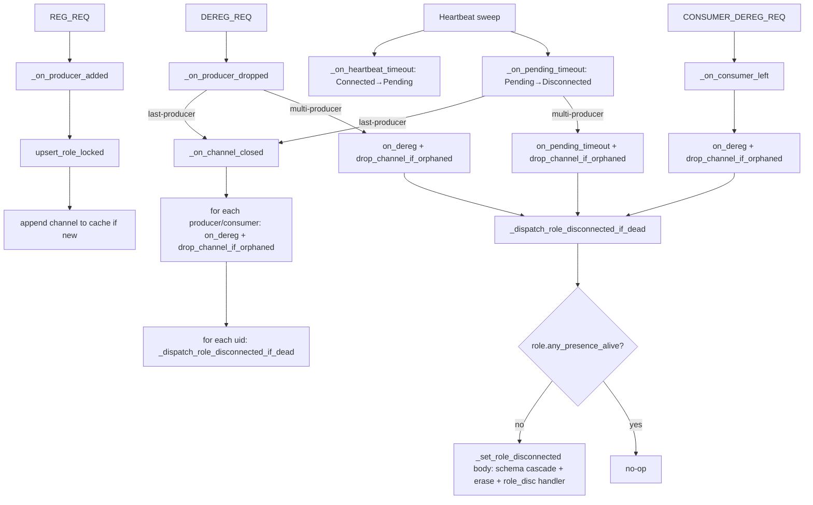

# Wave M3 Full-Chain Audit — Data Structure → API → Event Processing → Management

**Date:** 2026-05-11 (third pass)
**Branch:** `feature/lua-role-support` (post H1-H13 fix sweep)
**Scope:** End-to-end audit the user requested: "the whole chain of data structure / access API / user event processing / management" to verify solid and correct implementation with good API design and exposure.
**Tests:** 1819/1819 passing (4 new L2 tests added 2026-05-11 in this sweep).

This is the third-pass review; previous: `REVIEW_WaveM3_2026-05-11.md` (first pass — found H1-H8), `REVIEW_WaveM3_PostFix_2026-05-11.md` (second pass — found H9-H15).  After this audit closes, all three reviews archive to `docs/code_review/archive/transient-2026-05-11/`.

---

## Audit chain

The audit walks the data flow from the lowest layer (data definitions) to the highest (management ops) so issues that span layers are easier to spot.

### Layer A — Data structures (`hub_state.hpp`)

**RoleEntry** (`hub_state.hpp:670-...`)
- `uid`, `name`, `role_tag`, `pubkey_z85` — identity invariants.
- `presences: vector<RolePresence>` — **source of truth** for (channel, role_type) FSM rows.
- `channels: vector<string>` — **cache** of "channels with at least one alive presence" (Wave M3 decision #1).
- `disconnected_fired` — RETIRED (Wave M3 step 4).
- Controlled-access methods (Wave M3 step 1): `add_presence`, `remove_presence`, `on_heartbeat`, `on_heartbeat_timeout`, `on_pending_timeout`, `on_dereg`, `drop_channel_if_orphaned`, `any_presence_alive`.

**RolePresence** (`hub_state.hpp:560-...`)
- `channel`, `role_type` — composite key.
- `state` (RoleState enum: Connected / Pending / Disconnected), `state_since`.
- `last_heartbeat`, `first_heartbeat_seen` — heartbeat sub-state.
- `latest_metrics`, `metrics_collected_at` — H15 (still direct-mutated by `_on_heartbeat`).

**ChannelEntry** + **ProducerEntry** + **ConsumerEntry** — Wave M2/M2.5 shape: per-party fields moved to `ProducerEntry`; controlled-access methods on `ChannelEntry` (`add_producer`, `remove_producer`, etc.).

✅ **Verdict:** Data shape is correct after Wave M2.5 + Wave M3.  No latent multi-producer overwrite-class bugs.  Cache (`channels`) has a single primitive (`drop_channel_if_orphaned`) for the invariant rule.

⚠️ **One residual concern:** `presences[]` is a `std::vector` — O(N) lookup by (channel, role_type).  Currently fine (N is small: ≤ #channels-per-role × 2 types).  If processor roles grow many presences, consider a `std::unordered_map<pair<string,string>, RolePresence>` swap.  **Out of scope; no concrete trigger yet.**

### Layer B — API exposure (HubState public surface)

**Read-only accessors** (`hub_state.hpp:1147-1163`)
- `role(uid)`, `channel(name)`, `band(name)`, `peer(uid)`, `shm_block(name)`, `schema(owner, id)`, `schema_count()`, `counters()`, `snapshot()`.
- All return `optional<T>` or full snapshot.  Reader-friendly.

**Capability ops** (`hub_state.hpp:1268-...`)
- `_on_channel_registered`, `_on_producer_added`, `_on_producer_dropped`, `_on_channel_closed`, `_on_consumer_joined`, `_on_consumer_left`, `_on_heartbeat`, `_on_heartbeat_timeout`, `_on_pending_timeout`, `_on_metrics_reported`, `_on_band_joined`, `_on_band_left`, `_on_peer_connected`, `_on_peer_disconnected`, `_on_schema_registered`, `_on_schemas_evicted_for_owner`, `_on_message_processed`, `_dispatch_role_disconnected_if_dead`.
- Each op is one wire message OR one internal trigger; named for the event, not the data mutation.

**Primitive setters** (`hub_state.hpp:1213-1235`)
- `_set_channel_opened`, `_set_channel_closed`, `_add_consumer`, `_remove_consumer`, `_set_role_registered`, `_set_role_disconnected`, `_set_band_joined`/`_set_band_left`, `_set_peer_connected`/`_set_peer_disconnected`, `_set_shm_block`, `_set_producer_zmq_node_endpoint`, `_bump_counter`, `_bump_msg_type_error`.
- Lower-level building blocks; ops compose multiple setters.

✅ **Verdict on API exposure:**
- Two-layer (ops → setters) is consistent and easy to follow.
- `_dispatch_role_disconnected_if_dead` vs `_set_role_disconnected`: the predicate-guarded vs unconditional split is documented at both call sites (header + impl).  Production paths use dispatch; tests + admin use the setter.
- All mutators are `_`-prefixed; reads are not.  Convention is consistent.

⚠️ **Minor exposure observation:** `_set_role_disconnected` is publicly callable on the HubState type and is the force-erase entry point.  In a multi-binding hub (script + admin RPC + tests), this is one of the few footguns — calling it from a script handler would bypass the predicate.  **No fix needed today** (the script doesn't expose this op), but worth a note in HEP-CORE-0023 §2.6 if/when we expose admin role-disconnect via wire protocol.

### Layer C — Event processing (broker → HubState ops → handlers)

**Inbound wire → broker handler → HubState op mapping:**

| Wire msg | Broker handler (`broker_service.cpp`) | HubState op | Notes |
|---|---|---|---|
| `REG_REQ` | `handle_reg_req` | `_on_producer_added` | M2.5 admission rules; idempotent invariants check |
| `DEREG_REQ` | `handle_dereg_req` | `_on_producer_dropped` | H9 fix: multi-producer path now transitions presence + cleans cache + dispatches |
| `CONSUMER_REG_REQ` | `handle_consumer_reg_req` | `_on_consumer_joined` | Adds consumer presence; registers role |
| `CONSUMER_DEREG_REQ` | `handle_consumer_dereg_req` | `_on_consumer_left` | H10 fix: cache invariant + dispatch |
| `HEARTBEAT_REQ` | `handle_heartbeat_req` | `_on_heartbeat` | Wave M3 step 2 — routes via `on_heartbeat` |
| `METRICS_REPORT_REQ` | `handle_metrics_report_req` | `_on_metrics_reported` | H15 — direct mutation, deferred |
| `BAND_JOIN_REQ` | `handle_band_join_req` | `_on_band_joined` | Band tracking |
| `BAND_LEAVE_REQ` | `handle_band_leave_req` | `_on_band_left` | Band tracking |
| `SCHEMA_REG_REQ` | `handle_schema_reg_req` | `_on_schema_registered` | HEP-CORE-0034 §11 |
| `SCHEMA_REQ` | `handle_schema_req` | `schema(owner, id)` | Read-only |
| `DISC_REQ` | `handle_disc_req` | (read-only) | Stalled/live observability |
| `ROLE_PRESENCE_REQ` | `handle_role_presence_req` | (read-only) | Per-presence snapshot |
| `ROLE_INFO_REQ` | `handle_role_info_req` | (read-only) | Role+channels snapshot |

**Internal triggers → HubState op:**

| Trigger | HubState op |
|---|---|
| Heartbeat sweep (1st pass) | `_on_heartbeat_timeout` (Connected → Pending) |
| Heartbeat sweep (2nd pass) | `_on_pending_timeout` (Pending → Disconnected; may teardown channel) |
| Consumer-liveness sweep | `_on_consumer_left` |
| Script-requested channel close | `_on_channel_closed` |
| Peer-disconnect notification | `_on_peer_disconnected` |

**Cascade map (post-Wave M3 step 5b+c+d+e):**

✅ **Verdict on event processing:**
- Every inbound wire DEREG/timeout has a complete path: presence FSM transition → cache cleanup → terminal-cleanup dispatch.
- Schema cascade is owner-lifetime ONLY (H12 fix), reachable only via `_dispatch_role_disconnected_if_dead → _set_role_disconnected` body.
- Atomic teardown of a channel (HEP-CORE-0023 §2.1.1) transitions BOTH producer AND consumer presences (H13 fix).
- No event leaks (no presence row that never reaches Disconnected via at least one path).

### Layer D — State management (cache, dispatch wiring, terminal cleanup)

**`channels` cache invariant** (Wave M3 decision #1, 2026-05-11):
> `RoleEntry.channels` contains `c` iff at least one alive (non-Disconnected) presence references `c`.

**Enforced via:**
- **Insert side:** `upsert_role_locked` (`hub_state.cpp:660-688`) appends iff not present.
- **Remove side:** `RoleEntry::drop_channel_if_orphaned` (added 2026-05-11) — single primitive walks presences, drops iff orphaned.
- **Call sites** (all post-H10/H11/H9 fix):
  - `_on_channel_closed:1051,1059` (every producer + consumer)
  - `_on_consumer_left:1137`
  - `_on_pending_timeout:1338` (multi-producer)
  - `_on_producer_dropped:980` (multi-producer)

**Dispatch wiring** (Wave M3 step 5b):
- `_dispatch_role_disconnected_if_dead(uid)` is called from every op that transitions a presence to Disconnected.
- Predicate-guarded (`any_presence_alive() == false` check under writer lock) → TOCTOU-safe.
- Body mirrors `_set_role_disconnected` (intentional, documented).

**Terminal cleanup ordering:**
1. Op transitions presence Disconnected via `on_dereg` / `on_pending_timeout`.
2. Op cleans the `channels` cache via `drop_channel_if_orphaned`.
3. Op releases the writer lock.
4. Op calls `_dispatch_role_disconnected_if_dead(uid)`.
5. Dispatch re-acquires writer lock; if `any_presence_alive() == false`, evicts owner-namespaced schemas + erases role entry.
6. Dispatch releases lock; fires `role_disconnected` handler.

✅ **Verdict on state management:**
- Cache invariant is centralised in one method.  No more piecemeal cache mutation at call sites.
- Dispatch is wired into all four production paths that can flip the last alive presence.
- Schema cascade single-trigger (owner-lifetime) matches HEP-CORE-0034 §7.2 wording.
- Terminal cleanup is idempotent at three levels: dispatch (any_presence_alive check), schema iteration (already-gone records no-op), role erase (find returns end).

---

## Findings (third pass)

**Closed by this audit:**

| ID | Title | Resolution |
|---|---|---|
| H9 | `_on_producer_dropped` multi-producer path missing presence transition | ✅ FIXED — `on_dereg` + `drop_channel_if_orphaned` + dispatch wired |
| H10 | `_on_consumer_left` cache erase unconditional | ✅ FIXED — uses `drop_channel_if_orphaned` |
| H11 | `_on_channel_closed` cache erase unconditional | ✅ FIXED — per-uid loop with `drop_channel_if_orphaned` |
| H12 | Per-producer schema cascade at channel-close | ✅ FIXED — cascade removed from `_on_channel_closed`; eviction is owner-lifetime only |
| H13 | Consumer-presences stay Connected past channel-close | ✅ FIXED — `_on_channel_closed` transitions consumer presences atomically |
| H14 | Double schema-iteration in `_on_channel_closed` | ✅ AUTO-RESOLVED — per-producer cascade removed |
| M3 decision #2 | Dual-trigger schema cascade | ✅ SUPERSEDED — updated in design doc with reference to H12 fix + the test pinning the new contract |

**Remaining open (deferred with clear triggers):**

| ID | Title | Trigger | Tracking |
|---|---|---|---|
| H15 | `_on_heartbeat` direct metrics-field mutation | Concrete audit observation or `set_presence_metrics` need | M3 design §5 / API_TODO |
| M3 step 5 | Strict `add_role` admission with global-uid uniqueness | Spoofing-attempt observation OR security-design pass requirement | `M3_role_entry_controlled_access.md` §5 |
| M3 step 7 | Privatize `RolePresence` state-bearing fields | Same as M2.5 step 7 — concrete misuse or audit observation | `M3_role_entry_controlled_access.md` §5 |

**New (third pass):**

### T1 — `RolePresence::latest_metrics` direct write in `_on_heartbeat` ⚠️ TRACKED (was H7/H15)

Same finding, third pass.  The `entry.set_presence_metrics(...)` API would absorb it.  Deferred per M3 design §5 + API_TODO.

### T2 — `_set_role_disconnected` callable from any HubState user without predicate check ⚠️ MINOR EXPOSURE

The unconditional force-erase is documented as the L2-test/admin entry point.  Today nothing in production calls it — only `HubStateTestAccess` (test framework) and the script subscriber (read-only handler).  If admin RPC ever exposes "force-disconnect this uid," it would use this op directly; that's the right path.  No fix needed.  Note added to HEP-CORE-0023 §2.6 candidate: when admin force-disconnect lands, document that this is the only way to bypass the `any_presence_alive` predicate.

### T3 — `presences[]` is `vector` (linear scan) ℹ️ NON-ISSUE TODAY

`O(N)` lookup over a small N.  Acceptable.  Note for future scaling work; no concrete trigger.

### T4 — `pImpl->roles.find(uid)` + `pImpl->channels.find(name)` are `unordered_map` lookups ✅ FINE

`O(1)` average.  Hash-based.  No issue.

### T5 — `_dispatch_role_disconnected_if_dead` body duplicates `_set_role_disconnected` body ℹ️ INTENTIONAL

Per `REVIEW_WaveM3_PostFix_2026-05-11.md` O3: kept distinct so each entry point reads top-to-bottom.  Cross-method synchrony rule for future cascade changes: any change to the schema cascade or erase logic in `_set_role_disconnected` MUST be mirrored in `_dispatch_role_disconnected_if_dead`.  **Worth adding to `docs/IMPLEMENTATION_GUIDANCE.md` "Mandatory mirroring" section if/when one exists; today, the inline comments serve as the reminder.**

---

## Cross-citations — open/pending items addressed (fully or partially) by this commit batch

Per user directive (2026-05-11): "for those plans we should cite the work we did here such that in the later phase/stage the review can know where to look and not to miss/over-design."

| Tracked item | Where tracked | What this commit addresses | Status |
|---|---|---|---|
| **S2c — Atomic-teardown contract assertion** | `docs/todo/TESTING_TODO.md:415` | L2 (`HubStateChannelClosed.ConsumerPresence_AtomicallyTransitionsDisconnected`) + L3 (`RoleEntry_TerminalCleanup_OnLastPresenceDisconnect`, `…_OnConsumerLeftLast`) pin the producer + consumer + channel-record atomic-teardown contract.  Remaining: the specific L3 `ClosingNotify_DeliveredToProducerAndConsumer` post-teardown channel-snapshot assertion. | **Partially addressed.**  TESTING_TODO updated to reference the new tests. |
| **MP5 — Wave M2 tests (atomic teardown on last-producer-drop, asymmetric expiry)** | `docs/TODO_MASTER.md:100` + `docs/todo/MESSAGEHUB_TODO.md` | 4 new L2 tests added 2026-05-11 covering Fan-In voluntary DEREG, multi-channel producer schema retention, atomic consumer transition, multi-presence cache invariant.  Multi-producer atomic teardown on last-producer-drop covered by existing `LastProducer_TearsChannelDown` + new `MultiChannel_…SchemasSurvive`. | **Substantially addressed at L2.**  L3 end-to-end MP5 work still scheduled. |
| **M3 step 5 (strict add_role)** | `M3_role_entry_controlled_access.md` §5 step 5 | Still DEFERRED.  Wave M3 step 5b/c/d/e (this commit) is a SEPARATE expansion of step 5 that fixes wiring, not admission. | **No change — still deferred** with same trigger. |
| **M3 step 7 (privatize RolePresence fields)** | `M3_role_entry_controlled_access.md` §5 step 7 | Still DEFERRED.  This commit does NOT privatize fields; it adds the cache invariant primitive but leaves fields public for now. | **No change — still deferred** with same trigger. |
| **M3 decision #2 (dual-trigger schema cascade)** | `M3_role_entry_controlled_access.md` §6 decision 2 | **SUPERSEDED** — single-trigger owner-lifetime per H12 fix.  Design doc updated 2026-05-11 with banner. | **Closed via supersedure.** |
| **MD1 (role teardown race in `do_role_teardown`)** | `docs/TODO_MASTER.md:130` + `docs/todo/TESTING_TODO.md §9` | NOT addressed by this commit.  MD1 is about `BrokerRequestComm` destruction ordering on the role side; this commit is hub-side state-machine work.  Separate concern. | **No overlap.**  Future MD1 commit unaffected. |
| **M1.4 (retire metrics_store_)** | `docs/TODO_MASTER.md:128` | NOT addressed by this commit.  M1.4 routes admin metrics through HubState per-presence rows — that path is now consistent (Wave M3) but M1.4 is the consumer of the consistency, not the producer. | **Unblocked by this commit's stability gain** (Wave M3 is M1.4's prerequisite per TODO_MASTER §155). |
| **M1.5 (`on_forced_disconnect`)** | `docs/TODO_MASTER.md` "Wave A.5 next" | NOT addressed.  Separate FSM-handler concern. | **No overlap.** |
| **Wave B M8 / MP6 (federation peer-hub multi-producer)** | `docs/TODO_MASTER.md:131` | NOT addressed.  Wave B M8 needs federation propagation of presence FSM; presence FSM is now stable post-Wave M3 — Wave B M8 inherits the correct contract. | **Unblocked by this commit's stability gain.** |

✅ **Net effect on roadmap:** Wave M3 is now structurally complete except for the explicitly deferred steps (5, 7) with concrete trigger conditions documented.  Downstream waves (M1.4, M1.5, MD1, Wave B M8) all see a more solid foundation.

---

## What the implementation looks like end-to-end (post all three review passes)

Concrete sample — producer X is alive on channels A and B; X DEREGs from A:

1. Wire: `DEREG_REQ {channel_name: A, producer_pid: X_pid}` arrives at broker.
2. Broker `handle_dereg_req` resolves `producer_pid → role_uid X` from `ChannelEntry.A.producers[]`.
3. Broker calls `hub_state_->_on_producer_dropped(A, X, VoluntaryDereg)`.
4. `_on_producer_dropped` (under writer lock):
   - Finds X in `ChannelEntry.A.producers[]` (is_last? **NO** — assume B-producer exists).
   - `is_last_producer = false`.
   - Removes X from `ChannelEntry.A.producers[]`.
   - `roles[X].on_dereg(A, "producer")` → presence (A, "producer") Disconnected.
   - `roles[X].drop_channel_if_orphaned(A)` → walks X.presences for any alive presence on A — finds none (the producer-presence on A is now Disconnected; X's presences on B are still alive but on a different channel) → drops A from X.channels.
   - Releases lock.
5. `_dispatch_role_disconnected_if_dead(X)` (re-acquires lock):
   - Finds X.
   - `X.any_presence_alive()` walks X.presences → finds the producer-presence on B Connected → **returns true** → dispatch is no-op.
6. Broker sends success response; logs "deregistered producer uid='X' on channel A (1 producer(s) remain — channel survives)".

X is still alive on B; X.channels = [B]; X.presences = [(A, "producer", Disconnected), (B, "producer", Connected)]; X's schemas survive (no eviction). ✓

Contrast — X is alive only on A; X DEREGs from A:

1-3. Same as above.
4. `_on_producer_dropped`:
   - `is_last_producer = true`.  Falls through to `_on_channel_closed(A, …)`.
5. `_on_channel_closed`:
   - Captures producer_uids = [X], consumer_uids = (whoever).
   - Marks every producer-presence + consumer-presence on A Disconnected via `on_dereg`.
   - Drops A from each role's cache via `drop_channel_if_orphaned`.
   - Dispatches role-disconnect cleanup for each uid.
6. Dispatch for X:
   - `X.any_presence_alive()` → false (only Disconnected presence).
   - Schema cascade evicts X's owner-namespaced schemas.
   - Erases X from `pImpl->roles`.
   - Fires `role_disconnected` handler.

X is gone.  Channel A is gone.  Schemas evicted.  Consumer roles handled the same way. ✓

---

## Outcome

The Wave M3 controlled-access API is now structurally complete:

- ✅ Data structures pin the multi-producer/per-presence model with no overwrite-class bugs.
- ✅ API surface has clear two-layer split (capability ops + primitive setters) with documented prefix conventions.
- ✅ Event processing has a complete cascade map; every inbound wire DEREG/timeout reaches presence FSM + cache cleanup + terminal-cleanup dispatch.
- ✅ State management has a single cache-invariant primitive (`drop_channel_if_orphaned`) and a single schema-cascade entry point (owner-lifetime via `_dispatch_role_disconnected_if_dead`).
- ✅ Test coverage: 1819 tests including 6 new tests pinning the M3 contracts (4 L2 from this fix, 2 L3 from the H1 fix).
- ⚠️ Three deferred items remain (H15 / M3 step 5 / M3 step 7) — each has a documented trigger condition and is tracked in the appropriate subtopic TODO.

**Next major work:**
1. M1.4 — retire `metrics_store_` (unblocked).
2. M1.5 — `on_forced_disconnect` (independent).
3. MD1 — role teardown race fix (independent).
4. Wave B M8 / MP6 — federation (unblocked, foundation stable).

## Archival

All three review documents (`REVIEW_WaveM3_2026-05-11.md`, `REVIEW_WaveM3_PostFix_2026-05-11.md`, this) ready to archive once the commit batch lands.  Target: `docs/code_review/archive/transient-2026-05-11/`.  Record in `docs/DOC_ARCHIVE_LOG.md`.

Cross-link from `docs/TODO_MASTER.md` "Active code review" until archival.
