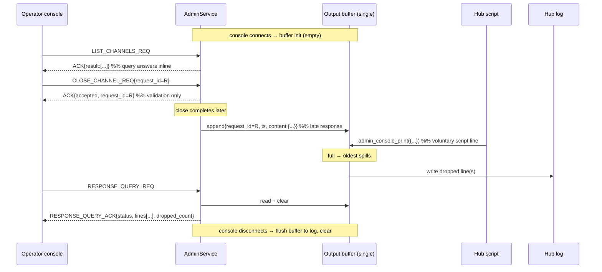

# DRAFT — Admin console: pull-based output buffer

**Status:** MERGED into **HEP-CORE-0033 §11** on 2026-07-22 (design-of-record);
this note is archived. The live design lives in the HEP — §11.0.1 layer 6 +
diagram, §11.0.4 output-poll wire + queue record, §11.2 `response_query`, and the
§11.0.2/§11.0.3/§11.1 rejustification. Retained for the rationale (why pull over
push, the decision reasoning). Remaining IMPL is tracked in `AUTH_TODO.md` Line E.
Scope: only how the hub returns output to the operator console.

---

## The problem, plainly

The admin console today is one-way. The operator sends a command, gets one
immediate "accepted" back, and hears nothing more — not the result of what it
asked for, not anything else the hub wants to tell it. We want the operator to be
able to *pull* that output on its own schedule, without the hub having to push.

## The design

There is **one admin console connected at a time** (no multiple consoles).
Requests still get a **direct response when the hub can answer immediately** — a
query returns its result inline; a command returns *accepted* or a validation
*rejected*. On top of that, the hub keeps **one output buffer** for everything that
arrives *later* or *unprompted*, and the console pulls it by polling. Three things
land in the buffer:

- **Late responses** — a request whose result isn't ready at ACK time; the real
  result is appended later, tagged with its `request_id`, so the client matches it
  back to the original request.
- **Voluntary hub messages** — anything the hub itself decides to show the operator.
- **Script output** — a hub script calls `admin_console_print({...})` to append
  a line.

Buffer lifecycle and polling:

- **Console connects** → the buffer is initialized empty.
- **Console disconnects** → **if the buffer is non-empty**, remaining contents are
  written to the hub log, then the buffer is cleared.
- The console **polls** with `RESPONSE_QUERY_REQ` to drain everything accumulated.
  **Every poll returns a well-formed JSON response**; an empty buffer returns
  `status:"empty"` explicitly, never silence.
- The buffer is **capped** (line count + total bytes). When full, the **oldest
  lines go to the log** and are dropped, and the next poll reports `dropped_count`.

**The log is only touched in those two cases** — overflow, and a non-empty buffer
at shutdown/disconnect. It is not a per-line audit trail; lines pulled by a normal
poll are never logged. (Consequence: a lost poll reply loses those lines — accepted
for a single human console.)

Because a poll **removes** what it returns, a healthy poll cadence keeps the buffer
near-empty and overflow never fires. The cap is therefore a **safety valve for the
abnormal path only** — a hung or uncleanly-gone console that stops polling, or a
script flooding `admin_console_print` faster than polls drain it. The hub cannot
assume the client keeps polling, so the cap must exist; it just rarely triggers.

No push, no notification socket, no per-recipient state. Every hub→console message
is either a direct reply to a request or a line pulled by a poll, and **every
response is JSON**.



## What one output line carries

- `ts` — hub wall-clock time (human-facing, and lets the client order lines).
- `request_id` — the id of the earlier request this line answers, when it *is* an
  answer to a request. Left empty for lines the hub emits on its own.
- `content` — **itself a JSON object**, never a bare string, so everything stays
  structured and parseable. A command's completion result is its structured result
  object; a plain hub message is `{"message":"xxxx"}`.

So the whole response is JSON at every level: a JSON envelope of metadata + lines,
and each line's `content` is JSON too. The client matches answers to its earlier
requests by `request_id`; lines with no `request_id` are just hub output to
display.

## Decisions (settled)

1. **Direct response when ready; buffer when late.** A query returns its result
   inline; a command returns *accepted*, or a validation *rejected* —
   `handle_close_channel` already checks existence and can reply `not_found`
   (`admin_service.cpp:681`), and that immediate-error UX + its test stay. When a
   result can't be produced at ACK time, the ACK is *accepted* and the real result
   is appended to the buffer later, tagged with the same `request_id`. Only what
   genuinely can't answer now is deferred.

2. **A poll returns the current lines and clears them** (return-and-clear). Each
   `RESPONSE_QUERY_REQ` drains what's there.

3. **The log is a spill/flush sink, not an audit trail.** It is written only on
   overflow (oldest lines dropped to stay under the cap) and at shutdown/disconnect
   when the buffer is non-empty. Overflow is **reported, never silent** — the next
   `RESPONSE_QUERY_ACK` carries `dropped_count`.

4. **One buffer, one console, one lock.** The buffer is written by hub-side work
   and read by the poll handler under a single lock — no keying, no eviction logic
   beyond connect/disconnect.

5. **Script source of lines: `admin_console_print({...})`** — a `HubAPI` method
   that appends a structured `content` line (`request_id` empty), mirrored across
   Lua / Python / native.

6. **The poll is authenticated + skew-checked, but carries no replay nonce.**
   `RESPONSE_QUERY_REQ` passes the session-id check (proves it is the real console,
   hijack-proof) and the wall-clock skew gate (rejects stale frames), but is exempt
   from the per-command nonce dedup. A poll performs no re-executable action; the
   only party who can issue it is the authenticated single console, so nonce dedup
   buys nothing — and requiring it would forbid safely retrying a dropped poll
   (same nonce → rejected as replay) and grow the nonce set with poll frequency.
   The full nonce machinery stays on **commands**, where re-execution matters.

## Wire shape

The request/ack is a typed `wire_bodies` body (matching the existing
`Admin*ReqBody` / `*AckBody` classes, so session-gating and the typed envelope are
unchanged), and its **payload is a JSON document** — the same shape the existing
query acks already use (`AdminResultAckBody` carries a `json result`). So "always
JSON" is consistent with today's admin query responses, not a new scatter surface.
Names illustrative, finalized on promotion:

```
kAdminResponseQueryReq = "ADMIN_RESPONSE_QUERY_REQ"
kAdminResponseQueryAck = "ADMIN_RESPONSE_QUERY_ACK"

AdminResponseQueryReqBody { session_id; }

AdminOutputLine { ts; request_id?; content; }     // content is a JSON object,
                                                  // e.g. {"message":"xxxx"} or a
                                                  // structured command result

AdminResponseQueryAckBody {                        // the JSON result document
    status;         // "ok" | "empty"  — "empty" when the buffer had no lines
    lines[];        // AdminOutputLine, JSON; [] when status == "empty"
    dropped_count;  // lines spilled to the log since the last poll
}
```

`RESPONSE_QUERY_REQ` is a read: session-id check + skew gate, no replay nonce
(decision 6).

## Open questions to lock

1. **Cap sizes** — line-count, total-byte, and per-line-byte caps, operator-tunable
   via hub config. Suggested defaults: 1000 lines / 1 MiB / 64 KiB per line (an
   over-size line is truncated in the buffer with `{"truncated":true}`, and — being
   an overflow-adjacent drop — its full form goes to the log). OK to defer the
   numbers.
2. **`admin_console_print` exact signature** — structured arg → line `content`;
   confirm the Lua / Python / native shapes match (multi-engine parity).

## Promotion path

Once locked, this replaces the §11.0.1 reverse-path wording in HEP-CORE-0033 §11,
adds the buffer lifecycle + the `RESPONSE_QUERY` wire bodies, and restates §11.0.4
(immediate ACK = validation; completion is a deferred buffer line). It also
rewrites AUTH_TODO Line E item (3) to "the pull output buffer" and keeps item (4)
(`origin_uid` on a line's provenance) as a smaller follow-on.
