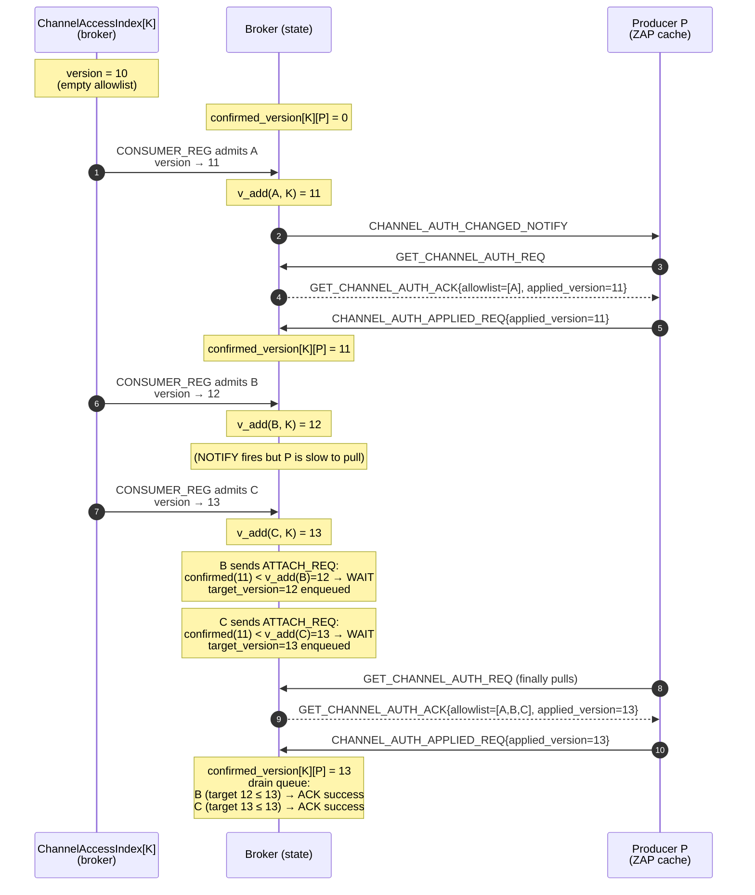
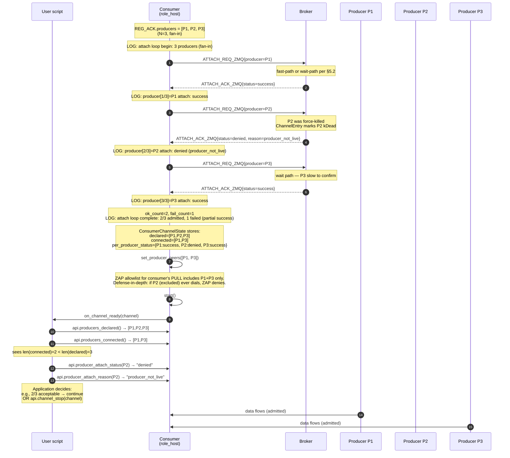

# DRAFT — HEP-CORE-0036 §6.5 amendment: ZMQ pre-attach broker confirmation

| Attribute | Value |
|---|---|
| **Status** | 🟡 DESIGN DRAFT — under designer review; no code changes yet |
| **Tracker** | [#246](../todo/AUTH_TODO.md#-246-hep-core-0036-amendment) |
| **Sibling** | HEP-CORE-0041 Phase 5 (ZMQ retrofit to symmetric capability semantics) |
| **Drafted** | 2026-06-30 |
| **Chain position** | Follows #275 (1i-cleanup arc complete); precedes REVIEW-D + #262 mutual auth |

---

## 1. Motivation

Today's ZMQ auth flow has an observed race that skips a fresh consumer's data. The L4 test `PlhHubCliTest.ZmqE2E_AuthorizedConsumerReceivesAllSlots` skips under this task, with the following captured evidence (inline test-file comment):

> "the broker sends `CONSUMER_REG_ACK` to the consumer (consumer dials producer) BEFORE the producer's `CHANNEL_AUTH_CHANGED_NOTIFY` → `GET_CHANNEL_AUTH` chain seeds the producer's PUSH allowlist with the new consumer's pubkey. libzmq's initial CURVE handshake fails on the empty allowlist and the consumer never receives data (observed: producer allowlist update fires ~110 ms AFTER consumer PULL goes Active)."

The race is a real production-readiness gap. HEP-CORE-0041 §5.5 already solved the symmetric problem on SHM via a pre-attach broker confirmation (the `CONSUMER_ATTACH_REQ`/`_ACK` wire, `broker_service.cpp:1212`). This amendment retrofits ZMQ to the same shape so both transports have deterministic pre-authorization: broker confirms admission before consumer dials producer. Post-amendment, the difference between ZMQ and SHM collapses to just the byte-transport (bind + push vs SCM_RIGHTS handoff).

---

## 2. Design goal

**Symmetric pre-confirm on both transports.** The wire pattern SHM uses (consumer sends `CONSUMER_ATTACH_REQ` to broker, broker confirms admission, consumer proceeds) applies to ZMQ verbatim. Any residual asymmetry lives in the byte-transport layer, not the auth layer.

**Preserve the discipline established by the 2026-06-04 retraction.** The broker MUST NOT re-become a "sync-request initiator" on its ROUTER. Any new pattern that holds a response pending an external event must be justified against §6.5's retraction rationale.

**Preserve revocation semantics.** HEP-CORE-0035 §I5 requires that a revoked consumer stop being able to complete new CURVE handshakes. The producer's ZAP handler stays the enforcement point for both admission and revocation; the pre-confirm just closes the admit-side race.

---

## 3. Design decisions (locked)

- **D1-A: Consumer initiates a new `CONSUMER_ATTACH_REQ_ZMQ` wire** after receiving `CONSUMER_REG_ACK`, before dialing producer.  This mirrors SHM's `CONSUMER_ATTACH_REQ` shape exactly.
- **D2-X: Broker synchronously holds the consumer's ATTACH REQ** until the producer's `GET_CHANNEL_AUTH_REQ` arrives (proof-of-cache-populated).  Adds one broker-side RTT to the consumer-attach path.  See §5 for how this differs from the 2026-06-04 retracted pattern.
- **D3-corrected (locked 2026-06-30): Cache is the producer's SINGLE reference for allow/deny.**  Producer's ZAP handler always reads the cache — no fallback, no consult-the-broker-at-handshake-time.  Both admit AND revoke are propagated via **explicit bidirectional confirmation**: broker → producer notify+pull delivers the update, and producer → broker `CHANNEL_AUTH_APPLIED_REQ` confirms application before the broker treats the operation as committed.  Under this shape, cache-in-sync is an observable invariant (broker knows definitively what each producer's cache holds), not a hope.  See §4.2 for the new wire and §5 for the updated broker handler flow.  This corrects the initial "cache as observability" framing — see §7.1 for the reasoning.

---

## 4. Wire spec

### 4.1 New wire: `CONSUMER_ATTACH_REQ_ZMQ` / `CONSUMER_ATTACH_ACK_ZMQ`

Direction: consumer → broker.  Sent by the consumer after successful `CONSUMER_REG_ACK`, before dialing producer's endpoint.

**Request payload (`CONSUMER_ATTACH_REQ_ZMQ`):**

```json
{
  "channel_name":       "lab.sensors.temperature",
  "consumer_role_uid":  "cons.logger.uid00000001",
  "producer_role_uid":  "prod.mysensor.uid00000001"
}
```

- `channel_name` — Same string carried on prior `CONSUMER_REG_REQ`; disambiguates in the fan-in case.
- `consumer_role_uid` — Consumer's own role_uid (already known to broker via `CONSUMER_REG`; redundant but included for symmetry with existing broker request payloads that echo identity).
- `producer_role_uid` — Which producer the consumer intends to dial.  For fan-in channels the consumer picks one of `CONSUMER_REG_ACK.producers[]`; the broker gates admission per-producer since each producer runs its own ZAP handler with a channel-scoped allowlist (HEP-CORE-0036 §I3).

**Success reply (`CONSUMER_ATTACH_ACK_ZMQ`) — `status="success"`:**

```json
{
  "status":            "success",
  "channel_name":      "lab.sensors.temperature",
  "producer_role_uid": "prod.mysensor.uid00000001"
}
```

Broker has confirmed the producer's allowlist has been populated with the consumer's pubkey; consumer may now dial safely.

**Denied reply — `status="denied"`:**

```json
{
  "status":            "denied",
  "channel_name":      "lab.sensors.temperature",
  "producer_role_uid": "prod.mysensor.uid00000001",
  "reason":            "consumer_not_in_channel_allowlist"
}
```

Same pattern as HEP-CORE-0041 SHM `CONSUMER_ATTACH_ACK.status="denied"` (`broker_service.cpp:1216-1226`) — "denied" is a normal auth decision, not a wire error.

**Timeout reply — `status="timeout"`:**

```json
{
  "status":            "timeout",
  "channel_name":      "lab.sensors.temperature",
  "producer_role_uid": "prod.mysensor.uid00000001",
  "reason":            "producer_did_not_confirm_within_budget"
}
```

Producer did not send `CHANNEL_AUTH_APPLIED_REQ` within the timeout budget (see §6.3).  From the broker's view this covers both "producer never pulled" and "producer pulled but never confirmed apply" — same wire outcome, distinct producer-side failure modes.  Consumer treats as attach failure; can retry.

**Success reply extension (observability):** the SUCCESS payload MAY include `"applied_version": <int>` — the broker-side `confirmed_version[K][P]` that gated this admission.  Useful for consumer-side log lines that need to correlate with the producer's applied-version log.  Non-normative; broker MAY omit if unavailable.

### 4.2 New wire: `CHANNEL_AUTH_APPLIED_REQ` / `CHANNEL_AUTH_APPLIED_ACK`

Direction: producer → broker.  Sent by the producer AFTER `ZmqQueue::set_peer_allowlist` successfully applies the freshly-pulled allowlist to the cache.  This is the **bidirectional confirmation** locked in D3-corrected (§3) — the broker now knows *definitively* that the producer's cache reflects the broker's authoritative state.

**Request payload (`CHANNEL_AUTH_APPLIED_REQ`):**

```json
{
  "channel_name":       "lab.sensors.temperature",
  "producer_role_uid":  "prod.mysensor.uid00000001",
  "applied_version":    42
}
```

- `channel_name` — Which channel's allowlist was applied.
- `producer_role_uid` — Producer's own role_uid (for broker-side per-producer tracking).
- `applied_version` — Monotonic snapshot version carried on the just-received `GET_CHANNEL_AUTH_ACK`, echoed back here.  Lets the broker distinguish "producer applied THIS pull" from stale confirmations under NOTIFY-storm conditions.

**Reply (`CHANNEL_AUTH_APPLIED_ACK`):**

```json
{
  "status":           "ok",
  "channel_name":     "lab.sensors.temperature",
  "applied_version":  42
}
```

Ack is not fire-and-forget — it lets the producer detect broker-side failure and log accordingly (e.g., broker restart clearing the pending queue).  If ack doesn't arrive within budget, producer logs a WARN but does NOT roll back the cache; the applied cache remains authoritative locally.

**Broker's use of `_REQ`:**
1. Marks per-producer-per-channel "cache in sync at version X" state.  Feeds the pending-ATTACH-drain step (§5.2).
2. For revoke operations: broker now has explicit proof that the revoked pubkey is no longer accepted at the producer's ZAP handler.  Feeds any revocation audit trail / retry decisions.

**Broker MUST NOT** treat an admit or revoke as globally committed until `CHANNEL_AUTH_APPLIED_REQ` arrives for the version that carried that change.  Two failure modes when APPLIED_REQ never arrives:

- **Broker detects producer disconnect** (ROUTER socket event, presence transition to kDead): closes any pending consumer ATTACH REQ with `status="denied"`, reason `producer_disconnected` per §5.5.
- **Broker cannot detect disconnect within budget** (silent TCP drop, producer alive but stuck): `producer_apply_wait_ms` timer expires; broker closes pending consumer ATTACH REQ with `status="timeout"`.

Revoke path: broker re-NOTIFYs on the next update cycle; producer catches up when reachable again.

### 4.3 Reused wires — one payload extension, otherwise unchanged

- `CHANNEL_AUTH_CHANGED_NOTIFY` — HEP-0036 §6.5.0.  Broker → producer fire-and-forget doorbell.  No change.
- `GET_CHANNEL_AUTH_REQ` — HEP-0036 §6.5.  Producer → broker request.  No change.
- `GET_CHANNEL_AUTH_ACK` — HEP-0036 §6.5.  Broker → producer reply.  **Extended:** payload gains an `applied_version` field carrying the snapshot version the allowlist was taken from.  Producer echoes this back on the follow-up `CHANNEL_AUTH_APPLIED_REQ` (§4.2).

**Extended `GET_CHANNEL_AUTH_ACK` payload (extension shown in bold):**

```json
{
  "channel_name":  "lab.sensors.temperature",
  "allowlist":     ["pubkey1_z85", "pubkey2_z85", "..."],
  "applied_version": 42                                    ← NEW under D3
}
```

Older producers that don't send `CHANNEL_AUTH_APPLIED_REQ` (pre-amendment binaries) can ignore `applied_version` — it's additive.  For strict version enforcement, the wire-protocol bump lands with the amendment (see Phase 2 in §9).

The pre-confirm reuses these existing surfaces for the pull leg; the consumer-broker leg (§4.1) and the producer→broker confirmation leg (§4.2) are new.

---

## 5. Broker handler shape (async response holding)

### 5.1 Handler placement

`handle_consumer_attach_req_zmq` — new method on `BrokerServiceImpl`.  Dispatched from the ROUTER poll loop parallel to the existing SHM `handle_consumer_attach_req` at `broker_service.cpp:1212`.

### 5.2 Handler flow (normative)

**Notation used throughout this section (defined once, applied consistently):**

- `ChannelAccessIndex[K]` — the broker's authoritative allowlist for channel K.  Versioned: every add or remove bumps a monotonic counter.
- `v_add(C, K)` — the version at which consumer C's pubkey was ADDED to `ChannelAccessIndex[K]`.  Fixed per (C, K) once assigned; recorded by broker when the CONSUMER_REG handler admits C.
- `confirmed_version[K][P]` — the highest version producer P has confirmed applying to its ZAP cache, via `CHANNEL_AUTH_APPLIED_REQ`.  Grows over time.  Zero if never confirmed.  **This is the only version-tracking state the broker needs** for pre-confirm decisions; `served_version[K][P]` (what broker sent) is intentionally NOT tracked (§5.4).

**Fast-path invariant:** `confirmed_version[K][P] >= v_add(C, K)` ⇒ C.pubkey is in P's ZAP cache.  (Any snapshot at or after C's addition contains C.)

**Handler steps:**

```
CONSUMER_ATTACH_REQ_ZMQ arrives from consumer C for channel K + producer P:

1. Validate payload shape + identity.
2. Look up ChannelAccessIndex[K].
   - If C.pubkey ∉ allowlist → reply status="denied", reason="consumer_not_in_channel_allowlist". Done.
   - Otherwise capture v_add(C, K) from ChannelAccessIndex[K] metadata.
3. Look up ChannelEntry[K].producers to find P.
   - If P not present or not kLive → reply status="denied", reason="producer_not_live". Done.
4. Fast-path check: if confirmed_version[K][P] >= v_add(C, K)
   → reply status="success" immediately. Done.
5. Wait path (confirmed_version[K][P] < v_add(C, K)):
   a. Enqueue this ATTACH REQ into ChannelEntry[K].producer[P].pending_attach_queue with
      target_version = v_add(C, K)  (the version we need P to catch up to).
   b. Fire CHANNEL_AUTH_CHANGED_NOTIFY to P (fire-and-forget, existing wire).
      Nudges P to send GET_CHANNEL_AUTH_REQ if it hasn't already.
   c. Do NOT send an ATTACH_ACK yet. Handler returns to the ROUTER loop.

When P's GET_CHANNEL_AUTH_REQ arrives:
   a. Snapshot ChannelAccessIndex[K], stamp its current version W.
   b. Reply GET_CHANNEL_AUTH_ACK{allowlist, applied_version=W}.
   c. Do NOT touch pending_attach_queue or confirmed_version yet — P hasn't
      confirmed application.  W travels back on the ACK; broker will see it
      again on P's subsequent APPLIED_REQ.

When P's CHANNEL_AUTH_APPLIED_REQ{channel=K, applied_version=W} arrives (D3 bidirectional confirmation):
   a. Reply CHANNEL_AUTH_APPLIED_ACK{status="ok", channel_name=K, applied_version=W}.
   b. Advance broker state: confirmed_version[K][P] = max(confirmed_version[K][P], W).
      P's ZAP cache now enforces the allowlist at version W.
   c. Walk pending_attach_queue.  For each pending REQ with target_version ≤ W:
        → reply status="success". Remove from queue.
   d. Leave entries with target_version > W (a NEWER consumer joined while W was in flight);
      they drain on the NEXT APPLIED_REQ from P.
```

**Worked example — why the two invariants matter.**  Timeline of a fan-in channel K with producer P and three consumers A, B, C admitted in order:



Why `target_version = v_add(C, K)` and NOT "current snapshot version at time of REQ": suppose when B's ATTACH_REQ arrives, C has also joined, so the current snapshot is at version 13.  If we stored `target_version=13` for B, B would wait until producer catches up to version 13 — but B's pubkey exists at version 12.  Any producer confirmation ≥ 12 already covers B; requiring ≥ 13 forces B to wait for changes B doesn't care about (say, C's admission), delaying B's dial for no security or correctness reason.  `target_version = v_add(B, K) = 12` is minimally correct.

### 5.3 Why this is NOT the retracted "broker as sync-request initiator" pattern

The 2026-06-04 amendment (§6.5) retracted having the broker be a sync-request INITIATOR — i.e., broker sends first, then waits for reply on the same ROUTER it responds on.  That created "how do we serve inbound during outbound wait" complications with no precedent.

This amendment has the broker be a sync-response HOLDER for a specific inbound REQ, waiting for a subsequent producer-initiated REQ (`CHANNEL_AUTH_APPLIED_REQ`) that confirms cache-in-sync.  Between the consumer's ATTACH REQ arriving and the producer's APPLIED REQ arriving, the broker's ROUTER poll loop handles the intermediate `GET_CHANNEL_AUTH_REQ/ACK` exchange (and any other unrelated traffic) normally.  Distinctions from the retracted design:

- Broker never initiates.  Every wire event on the broker's ROUTER is either an inbound REQ or an outbound REP.
- Broker doesn't fan-out or wait for fan-in.  ONE consumer's REQ waits for ONE TERMINAL producer's REQ (APPLIED_REQ).  The intervening pull chain is not the wait — it's routine ROUTER traffic.
- Broker's poll loop keeps draining normally — the pending REQ just doesn't get replied-to yet.  No new demultiplexing logic; the ROUTER's socket identity/routing already lets the reply-later step work via the recorded identity.
- Existing dispatch machinery.  `GET_CHANNEL_AUTH_REQ` handler already exists; the NEW handlers are the pre-confirm ATTACH REQ (§4.1) and the APPLIED confirmation REQ (§4.2) — both first-class inbound REQ patterns, not initiated-by-broker.

**Why the D3 confirmation wire strengthens the case further:** the `CHANNEL_AUTH_APPLIED_REQ` the broker waits for is a NORMAL producer→broker request that the producer sends unconditionally after every successful `set_peer_allowlist`.  The broker isn't polling or asking; it's just noting arrival.  Same discipline as HEARTBEAT_REQ: a producer-initiated REQ the broker records receipt of.

### 5.4 Broker-side cache-in-sync tracking (under D3 bidirectional confirmation)

Notation is defined in §5.2 preamble.  Recap: `confirmed_version[K][P]` = highest allowlist snapshot version P has confirmed applying via `CHANNEL_AUTH_APPLIED_REQ`; `v_add(C, K)` = version at which C's pubkey was added.

**Fast-path invariant:** `confirmed_version[K][P] >= v_add(C, K)` ⇒ C.pubkey is in P's ZAP cache.  Broker replies success without waiting.

**Why `confirmed_version` and not "what broker sent"?**  My initial draft proposed tracking what the broker *sent* to producers (call it `served_cache`) — advisory, optimistic.  Under D3 that's replaced by `confirmed_version`, which records what the producer *confirmed applying*.  Difference: served is optimistic ("I told them"); confirmed is deterministic ("they told me they applied it").  Simpler mental model; no self-correcting drift path when a NOTIFY drops or an apply fails silently.

**Memory cost:** O(channels × producers) — just an integer version per (K, P) pair.  Much smaller than the earlier "set of pubkeys per pair" option.

**On producer disconnect:** clear `confirmed_version[K][P]` for the disconnected producer P.  Any subsequent ATTACH REQ against P goes through the wait path; a re-authenticated producer instance's `confirmed_version` rebuilds on its next pull + APPLIED_REQ.

**On broker restart:** all `confirmed_version` state is lost.  First post-restart ATTACH REQ against any producer takes the wait path; on that producer's next pull + APPLIED_REQ, `confirmed_version` reconstitutes.  Self-healing without special-casing.

### 5.5 Timeout + failure modes

- **Timeout budget**: `producer_apply_wait_ms` (config, default proposed: 3000 ms).  Broker-side timer on each pending ATTACH REQ.  Named for what it actually bounds — the round-trip from broker firing `CHANNEL_AUTH_CHANGED_NOTIFY` to receiving `CHANNEL_AUTH_APPLIED_REQ`.  Producer might have pulled but failed to confirm apply; from the broker's view they're indistinguishable and treated as one timeout.
- **On timeout**: broker replies `status="timeout"`, reason `producer_did_not_confirm_within_budget`; consumer treats as attach failure.
- **On producer disconnect while REQ pending**: broker replies `status="denied"`, reason `producer_disconnected`.  Consumer can retry with a fresh REG_ACK.
- **On channel closing while REQ pending**: broker replies `status="denied"`, reason `channel_closing`.

**Failure mode taxonomy — status vs reason** (referenced by §10.5 script surface):

| status | reason(s) | source | consumer action |
|---|---|---|---|
| `success` | (none) | Fast-path or drained-from-queue | Proceed to dial |
| `denied` | `consumer_not_in_channel_allowlist` | ChannelAccessIndex check | Non-retryable |
| `denied` | `producer_not_live` | ChannelEntry check at REQ time | Retry may succeed if P revives |
| `denied` | `producer_disconnected` | ChannelEntry change while REQ pending | Retry may succeed if P revives |
| `denied` | `channel_closing` | Channel-close raced with attach | Non-retryable for this channel |
| `timeout` | `producer_did_not_confirm_within_budget` | `producer_apply_wait_ms` elapsed | Retry may succeed |

Wire-level statuses are the fixed three (`success` / `denied` / `timeout`); reason strings are broker-defined and enumerated here.  §10.5 script surface exposes these as separate fields.

---

## 6. Consumer + producer side flows

### 6.1 Consumer role side (`RoleAPIBase::apply_consumer_reg_ack`, ZMQ branch)

Current shape (pseudo):
```
apply_consumer_reg_ack(REG_ACK ack):
  if ack.data_transport == "zmq":
    ZmqQueue::pull_from(ack.producers[0].endpoint, ack.producers[0].pubkey_z85)   ← dials immediately (RACE)
    set_producer_peers(ack.producers)
    start()
```

Post-amendment shape (**best-effort partial success — see §7.5 for policy rationale**):
```
apply_consumer_reg_ack(REG_ACK ack):
  if ack.data_transport == "zmq":
    N = ack.producers.size()
    LOGGER_INFO("[{}] channel={} attach loop begin: {} producer{} ({})",
                short_tag, ack.channel_name, N, N==1?"":"s", N>1?"fan-in":"single")
    per_producer_outcome = {}                                                       ← (status, reason) pair per uid
    connected = []
    for i, producer in enumerate(ack.producers):                                   ← 1-based position for logs
      attach_ack = brc.request(CONSUMER_ATTACH_REQ_ZMQ{
        channel_name: ack.channel_name,
        consumer_role_uid: pImpl->uid,
        producer_role_uid: producer.role_uid
      }, timeout_ms=attach_ack_wait_ms)
      # Capture BOTH status AND reason — api.producer_attach_status() reads
      # status; api.producer_attach_reason() reads reason (§10.5 accessors).
      per_producer_outcome[producer.role_uid] = {
        status: attach_ack.status,
        reason: attach_ack.reason ?? ""    ← empty when status="success"
      }
      if attach_ack.status == "success":
        LOGGER_INFO("[{}] channel={} producer[{}/{}]={} attach: success",
                    short_tag, ack.channel_name, i+1, N, producer.role_uid)
        connected.push_back(producer)
      else:
        LOGGER_WARN("[{}] channel={} producer[{}/{}]={} attach: {} ({})",
                    short_tag, ack.channel_name, i+1, N,
                    producer.role_uid, attach_ack.status, attach_ack.reason)
        # continue loop regardless of individual failure

    ok_count = connected.size()
    fail_count = N - ok_count
    if ok_count == 0:
      LOGGER_ERROR("[{}] channel={} attach loop complete: 0/{} admitted, channel unusable",
                   short_tag, ack.channel_name, N)
      return false                                                                  ← only fail if ZERO admitted
    if fail_count > 0:
      LOGGER_WARN("[{}] channel={} attach loop complete: {}/{} admitted, {} failed (partial success)",
                  short_tag, ack.channel_name, ok_count, N, fail_count)
    else:
      LOGGER_INFO("[{}] channel={} attach loop complete: {}/{} admitted (full success)",
                  short_tag, ack.channel_name, ok_count, N)

    # per_producer_outcome stored on ConsumerChannelState so both accessors
    # (api.producer_attach_status + api.producer_attach_reason) can read
    # from the ready callback.  api.producers_declared() reads REG_ACK
    # producer list verbatim; api.producers_connected() reads `connected`.
    ConsumerChannelState[ack.channel_name].producer_attach_outcome = per_producer_outcome
    ConsumerChannelState[ack.channel_name].producers_declared     = ack.producers
    set_producer_peers(connected)                                                   ← only the admitted set
    start()                                                                          ← channel-ready callback
                                                                                    #  fires with partial state
                                                                                    #  observable to script
```

**Fan-in policy (see §7.5):** loop always runs to completion; attach fails only when ZERO producers admitted; script inspects per-producer outcome via `api.producer_attach_status(channel, uid)` and decides acceptability from the channel-ready callback.  For MVP the consumer serializes the ATTACH REQ across producers; total budget scales linearly (§7.2 discusses concurrent alternative deferral).

### 6.2 Producer role side

**One code change required under D3 bidirectional confirmation.** The producer's `GET_CHANNEL_AUTH_ACK` handler currently applies the allowlist and returns.  Under this amendment it must additionally send `CHANNEL_AUTH_APPLIED_REQ` back to the broker after `set_peer_allowlist` succeeds.

Current shape (pseudo):
```
on GET_CHANNEL_AUTH_ACK(ack):
  ZmqQueue::set_peer_allowlist(ack.allowlist)      ← updates producer's ZAP cache
  # done
```

Post-amendment shape:
```
on GET_CHANNEL_AUTH_ACK(ack):
  ok = ZmqQueue::set_peer_allowlist(ack.allowlist)
  if not ok:
    # MVP: silent to broker — broker will observe as timeout on any pending ATTACH REQ.
    #       Distinct negative-confirm wire (APPLIED_REQ{status="failed"}) deferred
    #       as follow-on (§13 [me] item).
    LOGGER_ERROR("[{}] set_peer_allowlist failed for channel {}", short_tag, ack.channel_name)
    return

  # D3 bidirectional confirmation
  applied_ack = brc.request(CHANNEL_AUTH_APPLIED_REQ{
    channel_name: ack.channel_name,
    producer_role_uid: pImpl->uid,
    applied_version: ack.applied_version
  }, timeout_ms=applied_ack_wait_ms)

  if applied_ack.status == "ok":
    LOGGER_INFO("[{}] pre-attach: applied allowlist v{} (size={}, channel={})",
                short_tag, ack.applied_version, ack.allowlist.size(), ack.channel_name)
  else:
    # timeout, transport error, or broker error — cache STAYS applied locally;
    # only observability lost.  Broker will re-drive on the next NOTIFY cycle.
    LOGGER_WARN("[{}] applied confirmation not acknowledged by broker for channel {} v{} — cache remains applied",
                short_tag, ack.channel_name, ack.applied_version)
```

Rationale: broker MUST know when the producer's ZAP cache has actually reflected each snapshot.  Without APPLIED_REQ, broker would treat GET_CHANNEL_AUTH_ACK-delivered as proof — but that only proves libzmq delivered the ACK bytes, not that `set_peer_allowlist` succeeded or that the ZAP cache is now enforcing the new snapshot.

**Producer-side observability** (existing, retained): producer logs `[{}] pre-attach: applied allowlist v{} (size={}, channel={})` on every successful `set_peer_allowlist`.

### 6.3 Budget shape

- Consumer's `CONSUMER_ATTACH_REQ_ZMQ` timeout (client-side): `attach_ack_wait_ms`, default 5000 ms.
- Broker's producer-apply wait (server-side): `producer_apply_wait_ms`, default 3000 ms.  Covers the round-trip from `CHANNEL_AUTH_CHANGED_NOTIFY` fired → producer's `CHANNEL_AUTH_APPLIED_REQ` received.  Renamed from earlier draft's `producer_pull_wait_ms` — the wait now bounds the WHOLE apply cycle (pull + apply + confirm), not just the pull.
- Producer's `CHANNEL_AUTH_APPLIED_REQ` timeout (producer-side): `applied_ack_wait_ms`, default 1000 ms.  Producer WARN-logs on missed ack; cache stays applied locally.
- Budget ordering: consumer's timeout MUST be > broker's timeout so the consumer always gets a real ACK (success/denied/timeout) rather than transport-level timeout.  Default (5000 > 3000) satisfies this.  Producer's applied_ack timeout is independent (not on the consumer's critical path).

### 6.4 Log discipline for multi-role attach (normative)

The attach-loop log lines above (§6.1) MUST use this format for grep-able, test-contract-stable markers.  Existing `[{short_tag}] channel={K} ...` prefix per HEP-CORE-0036 §log-format applies.

**Required log events per attach cycle:**

| Event | Level | Format | Trigger |
|---|---|---|---|
| Loop begin | INFO | `channel={K} attach loop begin: {N} producer[s] ({single|fan-in})` | Consumer enters apply_consumer_reg_ack ZMQ branch |
| Per-producer success | INFO | `channel={K} producer[{i}/{N}]={uid} attach: success` | ATTACH_ACK_ZMQ status=success |
| Per-producer failure | WARN | `channel={K} producer[{i}/{N}]={uid} attach: {status} ({reason})` | ATTACH_ACK_ZMQ status ≠ success — status is one of {denied, timeout}; reason is per §5.5 taxonomy |
| Loop complete (partial) | WARN | `channel={K} attach loop complete: {ok}/{N} admitted, {fail} failed (partial success)` | Loop end, some failed, ≥1 admitted |
| Loop complete (full) | INFO | `channel={K} attach loop complete: {ok}/{N} admitted (full success)` — with ok == N in this case | Loop end, all admitted |
| Loop complete (all fail) | ERROR | `channel={K} attach loop complete: 0/{N} admitted, channel unusable` | Loop end, zero admitted |

**Why these specific markers:**

- `producer[{i}/{N}]` — position within batch + total count in one token.  Operator grepping a single line knows "this is the 3rd of 10" without needing surrounding context.
- `(single|fan-in)` — makes fan-in explicitly greppable at the batch-begin line.  Reminds operator / test reviewer that this is a multi-role acknowledgement, not a single-producer flow.
- `{ok}/{N} admitted, {fail} failed` — final tally is a single line, single grep target.  Distinguishes partial from full success without follow-up parsing.
- Level per event (INFO for progress + full success, WARN for per-producer failure + partial, ERROR for zero-admitted) — lets operators tune log-filter thresholds without losing signal on partial-success cases that scripts might still accept.

**Broker-side complement (non-normative for MVP; nice-to-have):**

Broker logs per attach REQ include the pending-queue depth per (channel, producer) so a broker-side grep shows fan-in aggregation:

`broker: channel={K} producer={P} attach REQ received (pending_depth={D}, awaiting confirm at version={V})`

Adds one integer per log line; deferred to Phase 6 REVIEW-D polish if not already there.

---

## 7. Design decisions — remaining questions for you

These are the items I flagged where the initial three-decision framing needs refinement.  Please confirm or redirect.

### 7.1 D3 revocation semantics ✅ RESOLVED 2026-06-30

Corrected D3 locked (§3): cache is producer's SINGLE reference for allow/deny; both admit AND revoke propagate via explicit bidirectional confirmation (§4.2 new `CHANNEL_AUTH_APPLIED_REQ`).  Cache is enforcement-authoritative AND observable.

### 7.2 Fan-in serialization

Consumer serializes per-producer ATTACH REQ (§6.1).  Worst-case consumer-attach for a 10-producer fan-in channel:

- If broker replies at server-side budget (`producer_apply_wait_ms` = 3 s) per producer: ~30 s total.
- If broker fails to reply at all and consumer's client-side budget expires (`attach_ack_wait_ms` = 5 s) per producer: ~50 s total.

Both bounds should inform any operator-facing overall-attach budget.  Acceptable for MVP, or want concurrency an MVP requirement?

### 7.3 Which HEP owns the amendment?

Two options:
- **HEP-0036 §6.5 amendment** (this doc's default).  Extends the doorbell-then-pull framework with a new pre-confirm.
- **HEP-0041 Phase 5 spec**, cross-referenced from HEP-0036.  HEP-0041 is where the SHM version already lives; putting the ZMQ retrofit in HEP-0041 keeps both transports' pre-confirm designs in one document.

My recommendation: **HEP-0041 Phase 5** with a §6.5.2 pointer from HEP-0036.  Reason: the pre-confirm pattern IS HEP-0041's central design; HEP-0036 §6.5 is about post-attach runtime sync (doorbell-then-pull), not pre-attach admission.

### 7.4 Revocation retry policy

Under D3 bidirectional confirmation the broker knows when a revoke has propagated to each producer.  If a producer's `CHANNEL_AUTH_APPLIED_REQ` never arrives within budget for a revoke-triggered NOTIFY (producer offline, network drop), what should the broker do?

Options:
- **(a)** Re-fire `CHANNEL_AUTH_CHANGED_NOTIFY` on a periodic retry schedule until confirmed or producer marked kDead.
- **(b)** One-shot: log the revoke as "not confirmed at P" and rely on the next producer heartbeat cycle to catch up (via a heartbeat-piggybacked "latest_confirmed_version" field).
- **(c)** Producer's re-registration includes its `applied_version[K]` (producer-side state — the highest snapshot the producer has applied) per channel; broker reconciles by setting `confirmed_version[K][P] = producer.applied_version[K]` on re-reg.

My recommendation: **(c)** — cheapest, no timer state, and re-registration IS the resynchronization point.  For (a)-style aggressive retry we'd want it as a follow-on ticket, not MVP.

### 7.5 Fan-in partial-success policy (NEW 2026-07-01)

**Proposed contract (recommend LOCK):**

- Attach loop always runs to completion for every entry in `REG_ACK.producers[]`, regardless of individual failures.
- Loop-level failure returns `false` from `apply_consumer_reg_ack` ONLY when ZERO producers were admitted.  Any single admission ⇒ loop-level success ⇒ channel becomes usable with the admitted subset.
- Individual per-producer outcome is recorded on the ConsumerChannelState as a (status, reason) pair — status is one of `success` / `denied` / `timeout` (wire values per §4.1); reason is one of the enumerated strings from §5.5 taxonomy.  Both fields observable from the script's channel-ready callback via §10.5 accessors.
- `set_producer_peers()` is called with the ADMITTED subset only — the rejected producers are excluded from the consumer's PULL peer list.  Consumer never initiates a CURVE dial toward a rejected producer, so no admission attempt is even made.  (Note: unlike the producer side, the consumer is the CURVE CLIENT and has no ZAP handler; the defense here is "no endpoint registered → no dial" rather than "ZAP denies late dial.")
- No automatic retry within the loop.  A per-producer failure is terminal for this attach cycle.  If the failed producer later becomes healthy, admission happens on the next consumer restart OR via a producer-late-join notification path (deferred as follow-on task, out of scope for this amendment).

**Rejected alternatives:**
- Fail-fast on any error → wrong for fan-in; blackholes N-1 healthy producers due to one bad one.
- Retry-within-loop → mixes retry policy with attach; deferred.
- Silent-partial without loop-end tally log → operator visibility gap; loop-end log line is normative under §6.4.

Please confirm or redirect.

### 7.6 Per-failure callback — MVP or follow-on?

Two shapes for exposing per-producer attach failures to the script:

- **Query-only (MVP recommend):** `api.producer_attach_status(channel, uid) → enum` returns the recorded outcome.  Script queries from within its channel-ready callback (or later, on demand).  No new callback wiring.
- **Callback-per-failure (follow-on):** `on_producer_attach_failed(channel, uid, reason)` fires once per failed producer during the attach loop.  Nice for logging/alerting from scripts that want to react per-failure.  Adds callback surface + engine-parity work across Lua/Python/Native (per your `feedback_multi_engine_parity_audit` discipline).

My recommendation: **query-only for MVP.**  If real users want per-failure hooks after AUTH-7 ships, file as follow-on with cross-engine parity in scope from day 1.

### 7.7 Script observation surface — shape

Two candidate shapes for the query-side API:

- **Shape A (decomposed, chosen — see §10.5 for full API):**
  - `api.producers_declared(channel) → list<uid>` — REG_ACK-declared set.
  - `api.producers_connected(channel) → list<uid>` — pre-confirm-admitted subset.
  - `api.producer_attach_status(channel, uid) → enum` — {success, denied, timeout, not_declared}.
  - `api.producer_attach_reason(channel, uid) → string` — reason enumerated in §5.5.
- **Shape B (composite):**
  - `api.channel_status(channel) → {producers: {uid: {status: enum, reason: str}}}` — one call, full state.

Shape A is closer to existing `api.producers()` / `api.allowed_peers()` conventions (per Stage 1A + your #234 gap-audit).  Shape B is fewer round-trips for scripts wanting full state but a new shape convention.

My recommendation: **Shape A** — matches existing observation-surface conventions; smaller cross-engine surface (each engine binds four scalar functions vs one composite dict/table).  Status and reason are kept separate to mirror the wire (§4.1 status is 3 values; §5.5 reasons are broker-defined strings) — flattening them into one enum forces the API to grow every time we add a reason string.

### 7.8 Log discipline — locking as normative

§6.4 defines the log-line format for attach-loop events.  Because these lines double as test-contract markers (per `feedback_test_outcome_vs_path` + #238 discipline), they need to be locked in the HEP promotion, not left to per-commit drift.

Recommend: promote §6.4 verbatim to HEP-CORE-0041 §Phase 5.log-format as a normative table.  Any change to marker format thereafter is a HEP amendment, not a code commit.

Confirm this locking?

### 7.9 Which callback surfaces the "channel-ready with per-producer status"?

§6.1 pseudo-code ends with `start()  # channel-ready callback fires with partial state observable to script`.  §10.4 draft HEP-0011 addition uses `on_channel_ready(channel)` as the hook name.  **Neither is verified to exist in the current HEP-0011 callback table.**

Stage 1A (task #190) added `api.is_channel_ready()` as a POLL API for scripts — no callback was added there.  Three candidate resolutions:

**(a) Verify `on_channel_ready` already exists** in `docs/HEP/HEP-CORE-0011-Consumer-Lifecycle.md` (or its current equivalent).  If yes, use it as-is.  Preferred if it exists.

**(b) Add a new `on_channel_ready(channel)` callback** in this amendment's scope.  Cross-engine parity work (Lua/Python/Native binding) required per HEP-0028.  Adds ~1 day to Phase 4.

**(c) Hook into `on_start` + polling `api.is_channel_ready()` and the new `api.producer_attach_status()`**.  No new callback; script uses existing hooks.  Slightly awkward — script must poll or spin — but zero new binding surface.

My recommendation: **(a) first, (c) fallback.**  I'll verify against HEP-0011 at Phase 1 promotion time.  If `on_channel_ready` exists, use it; if not, fall back to (c) and file (b) as a follow-on for cleaner ergonomics.

Please confirm the resolution order (a → c → b) or redirect.

---

## 8. Test plan

**L2 broker unit tests** (extend `test_broker_service.cpp` or add new file):
- `HandlesConsumerAttachReqZmq_FastPath_WhenConfirmedVersionCovers` — `confirmed_version[K][P] >= V` → immediate ACK.
- `HandlesConsumerAttachReqZmq_WaitPath_WhenProducerNeedsPull` — no fresh confirmed version → fires NOTIFY, holds REQ.
- `HandlesConsumerAttachReqZmq_DrainsPendingOnAppliedReq` — after producer's `CHANNEL_AUTH_APPLIED_REQ`, pending consumers drain (NOT drained after `GET_CHANNEL_AUTH_REQ` alone).
- `HandlesConsumerAttachReqZmq_TimeoutReplyWhenProducerSilent` — timeout budget → status="timeout".
- `HandlesConsumerAttachReqZmq_DeniedWhenNotInAllowlist` — pubkey not in ChannelAccessIndex → status="denied".
- `HandlesConsumerAttachReqZmq_DeniedWhenProducerDisconnectedWhileWaiting` — producer disconnect during wait → status="denied", reason="producer_disconnected".
- `HandlesChannelAuthAppliedReq_UpdatesConfirmedVersion` — receives APPLIED_REQ, `confirmed_version` advances.
- `HandlesChannelAuthAppliedReq_StaleVersionIgnored` — APPLIED_REQ with older version than current confirmed_version → no state change, ack OK.
- `RevokePath_ConfirmedVersionAdvancesOnAppliedReq` — revoke NOTIFY → pull → APPLIED_REQ → confirmed_version reflects post-revoke state.

**L3 sequence pin + fan-in coverage** (extend `test_datahub_broker_protocol.cpp` or add new worker):
- `PreConfirmSequenceEliminatesRace_ZmqConsumerDialsAfterProducerCacheReady` — full sequence pin.  Verify producer's `set_peer_allowlist` fires BEFORE consumer's `pull_from` dial via log-marker sequencing.
- `AttachLoop_PartialSuccess_FanIn3Producers1Timeout` — 3-producer fan-in with 1 producer forced to skip pull.  Verify: 2 producers admitted; consumer's `api.producers_connected(channel)` returns the 2 uids; failed producer's `api.producer_attach_status` returns `timeout`; `set_producer_peers` receives 2-element set only.
- `AttachLoop_AllFail_FanIn3ProducersAllTimeout` — 3-producer fan-in with all forced to skip pull.  Verify: `apply_consumer_reg_ack` returns false; channel unusable; ERROR-level "0/3 admitted" log line emitted.
- `AttachLoop_LogMarkers_FanInLoopBeginContainsCountAndModality` — assert on the exact log-line strings from §6.4 (loop-begin + per-producer + loop-complete markers).  Pin as contract per `feedback_test_outcome_vs_path`.

**L4 e2e unskip:**
- Remove `GTEST_SKIP` from `PlhHubCliTest.ZmqE2E_AuthorizedConsumerReceivesAllSlots`.  Verify the deferred scenario passes green.

**L4 e2e negative (assertion targets must update):**
- `ZmqE2E_UnauthorizedConsumerDeniedByBroker` — post-amendment, denial arrives as `CONSUMER_ATTACH_ACK_ZMQ{status="denied"}` from the broker BEFORE the consumer would have dialed.  Any assertion pinning the pre-amendment failure mode (empty read, timeout on data, ZAP-side denial log) must be updated to the new pre-attach-denial log line + wire response.  Pre-existing test is not truly untouched; expect ~5-10 line assertion adjustments.

**L4 e2e fan-in partial-success:**
- `ZmqE2E_FanIn_PartialSuccessDataFlowsFromAdmittedSubset` — 3-producer fan-in, 1 producer's ZAP handler forced to fail apply, consumer script continues on partial success.  Verify: data flows from 2 admitted producers; the failed producer's dial attempts are ZAP-rejected (confirms `set_producer_peers` correctly excluded it from the allowlist per §7.5 defense-in-depth).

---

## 9. Phased implementation

Each phase is a single commit; ships green before the next starts.

- **Phase 1: HEP promotion.** Merge this tech_draft into `docs/HEP/HEP-CORE-0041-SHM-Channel-Auth.md` (§Phase 5 section) + cross-ref stub in HEP-CORE-0036 §6.5.2.  No code changes.  Reviewers can gate here.
- **Phase 2: Broker side.** Two handlers + version tracking:
  - `handle_consumer_attach_req_zmq` — enqueues on wait-path.
  - `handle_channel_auth_applied_req` — records `confirmed_version[K][P]`, drains pending queue.
  - `GET_CHANNEL_AUTH_ACK` extended with `applied_version` field.
  - L2 tests pin the state machine including bidirectional confirmation.
- **Phase 3: Producer side.** Extend `GET_CHANNEL_AUTH_ACK` handler with post-`set_peer_allowlist` `CHANNEL_AUTH_APPLIED_REQ` send.  BRC layer gains the helper.
- **Phase 4: Consumer side.** Extend `RoleAPIBase::apply_consumer_reg_ack` ZMQ branch with the per-producer pre-confirm loop.  BRC layer gains the `CONSUMER_ATTACH_REQ_ZMQ` helper if not already present.
- **Phase 5: Test unskip + L3 sequence pin.** Remove `GTEST_SKIP` in AUTH-7 L4 ZMQ test; add L3 sequence-pin worker for both admit and revoke paths.
- **Phase 6: REVIEW-D gate.** Full systematic review of the pre-confirm arc.  Any residual §6.5 amendment doc-drift closes here.

---

## 10. Sibling doc updates — contract-text enumeration for Phase 1 promotion

Phase 1 promotion is NOT a pointer-only cross-ref update.  Each of these HEPs needs SPECIFIC contract text merged in so a future implementer or script author reading the permanent doc gets the full picture without needing to open this tech_draft (which will be archived at Phase 1 close).

### 10.1 HEP-CORE-0041 (authoritative home — new §Phase 5)

Merge §4-§6 substance verbatim into new subsections of HEP-CORE-0041.  §7 (open questions) and §13 (open discussion items) do NOT promote — those are pre-promotion review artifacts.  §11.1 revocation guarantee (NOT the §11 scope-discipline list) lands as §Phase 5.6.

- **§Phase 5.1 — Wire spec.** §4.1 CONSUMER_ATTACH_REQ_ZMQ / _ACK + §4.2 CHANNEL_AUTH_APPLIED_REQ / _ACK + §4.3 GET_CHANNEL_AUTH_ACK `applied_version` extension.
- **§Phase 5.2 — Broker handler.** §5.2 flow + §5.3 discipline explainer + §5.4 confirmed_version state + §5.5 timeout/failure taxonomy table.
- **§Phase 5.3 — Consumer contract (NORMATIVE — resolves §7.5 fan-in partial-success policy).**  Explicit:
  > "The consumer's `apply_consumer_reg_ack` ZMQ branch MUST attempt attach for every producer in `REG_ACK.producers[]`, record per-producer (status, reason) outcome, and treat the channel as usable if ≥1 producer was admitted.  Zero-admitted is the only loop-level failure.  Failed producers MUST be excluded from `set_producer_peers()` so the consumer never initiates a CURVE dial toward them.  (Note: consumer is CURVE client — no consumer-side ZAP handler exists; the exclusion prevents any dial attempt, not a ZAP-side rejection.)"
- **§Phase 5.4 — Producer contract.**  §6.2 CHANNEL_AUTH_APPLIED_REQ send after every successful `set_peer_allowlist`.
- **§Phase 5.5 — Log format (NORMATIVE — §6.4 table verbatim).**  Locked-in marker format; downstream test contracts depend on these strings.
- **§Phase 5.6 — Revocation contract.** §11.1 bidirectional guarantee for revoke.

**Explicit non-merge list** (stays in tech_draft archive, does not enter permanent HEP):
- §7 subsections (open questions, all resolutions to be inlined into §Phase 5.x normative text before merge).
- §13 discussion items list.
- §12 sequence diagrams — MAY promote if they clarify the normative flow; check if HEP-0041's existing diagram style accommodates.

### 10.2 HEP-CORE-0036 §6.5.2 (cross-reference stub)

Two paragraphs:
- "Pre-attach admission for ZMQ is specified in HEP-CORE-0041 §Phase 5.  §6.5 covers post-attach runtime doorbell-then-pull sync; pre-attach admission gating (which prevents new consumers from dialing before the producer's ZAP cache is populated) is a separate concern owned by HEP-CORE-0041."
- Restate the D3-corrected invariant: "Cache is the producer's SINGLE reference for allow/deny.  Both admit and revoke propagate via bidirectional confirmation (see HEP-CORE-0041 §Phase 5.1).  The doorbell-then-pull chain here is the transport mechanism the pre-attach handshake reuses."

### 10.3 HEP-CORE-0035 §I5 (revocation semantics)

Amendment paragraph:
- "Revocation propagation is confirmed via `CHANNEL_AUTH_APPLIED_REQ` (HEP-CORE-0041 §Phase 5.1).  Broker maintains `confirmed_version[K][P]` = highest applied snapshot at each producer.  A revoke is considered committed at producer P only when `confirmed_version[K][P]` covers the revoke's snapshot version.  Existing CURVE sessions per §I5 still stay up on revoke; the confirmation covers ZAP-cache-in-sync so subsequent fresh handshakes deny correctly."

### 10.4 HEP-CORE-0011 (script callback contract — NORMATIVE addition)

**⚠️ Phase 1 promotion is gated on §7.9 resolution.**  This subsection assumes an `on_channel_ready(channel)` callback exists in HEP-CORE-0011.  Resolution outcomes:
- **§7.9 (a)** — callback already exists → text merges as-is.
- **§7.9 (b)** — new callback added under this amendment → text stays; Phase 4 (consumer side code) grows to include the callback surface + cross-engine bindings.
- **§7.9 (c)** — no callback; hook `on_start` + poll `api.is_channel_ready()` → the how-to below MUST be rewritten with the polling pattern before it merges.

DO NOT merge this text verbatim without confirming the callback name.

Proposed insert:

> **Fan-in channels — script responsibility.**
> When the channel-ready callback fires for a consumer, the channel may have partial producer admission (fan-in).  The script is RESPONSIBLE for querying `api.producers_declared(channel)`, `api.producers_connected(channel)`, and `api.producer_attach_status(channel, uid)` (see HEP-CORE-0028 §script-surface) to decide whether the admitted subset is acceptable.  The framework does not encode a policy — a script that requires all-N producers must check and either continue with degraded coverage or stop the channel.
>
> **Storage semantics.** `api.producers_declared(channel)` returns the full REG_ACK-declared producer list.  `api.producers_connected(channel)` returns the subset that succeeded pre-confirm (== what was passed to `set_producer_peers`).  Difference between the two is the failed set.
>
> **How-to (Lua — Python + Native follow the same shape):**
> ```lua
> function on_channel_ready(channel)
>   local declared  = api.producers_declared(channel)      -- what broker told us to expect
>   local connected = api.producers_connected(channel)     -- what pre-confirm admitted
>   if #connected < #declared then
>     for _, uid in ipairs(declared) do
>       local status = api.producer_attach_status(channel, uid)
>       if status ~= "success" then
>         local reason = api.producer_attach_reason(channel, uid)
>         logger.warn("producer " .. uid .. " attach: " .. status .. " (" .. reason .. ")")
>       end
>     end
>     -- application decides: continue with partial, or api.channel_stop(channel)
>   end
> end
> ```
>
> ```python
> # Python equivalent
> def on_channel_ready(channel):
>     declared  = api.producers_declared(channel)
>     connected = api.producers_connected(channel)
>     if len(connected) < len(declared):
>         for uid in declared:
>             status = api.producer_attach_status(channel, uid)
>             if status != "success":
>                 reason = api.producer_attach_reason(channel, uid)
>                 logger.warning(f"producer {uid} attach: {status} ({reason})")
>         # application decides: continue with partial, or api.channel_stop(channel)
> ```
>
> The observation surfaces are read-only; there is no `api.retry_producer_attach()`.  A failed producer's admission retries only on consumer restart or (deferred) explicit late-join notification.

### 10.5 HEP-CORE-0028 (Native ABI + script-surface parity — cross-engine bindings)

Three new API entries need parity across Lua / Python / Native.  Status + reason are SEPARATE fields to match the wire (§5.5 taxonomy), not flattened into one enum:

| API | Return type | Values |
|---|---|---|
| `api.producers_declared(channel)` | `list<string>` | Full REG_ACK-declared producer role_uids |
| `api.producers_connected(channel)` | `list<string>` | Subset that succeeded pre-confirm |
| `api.producer_attach_status(channel, uid)` | `string` (enum) | `success` \| `denied` \| `timeout` \| `not_declared` |
| `api.producer_attach_reason(channel, uid)` | `string` | Free-form; when status = `success`, empty.  When status = `denied` or `timeout`, one of the reason strings enumerated in §5.5 (e.g., `consumer_not_in_channel_allowlist`, `producer_not_live`, `producer_disconnected`, `channel_closing`, `producer_did_not_confirm_within_budget`). |

- `not_declared` — returned when queried uid isn't in the REG_ACK.producers[] set.  Defensive; distinguishes "never tried" from "tried and failed."
- Status enum values map directly to wire (§4.1); disconnect / not-live conditions are REASONS under `denied` (see §5.5), not top-level status values.

Native C ABI version bump per HEP-0028 policy.  Ties to existing #234 (producers_contains / producers_count gap) — resolve together.

### 10.6 HEP-CORE-0017 (channel model — no normative change)

Fan-in geometry is unchanged; the new observability just makes per-producer state queryable.  Add a one-line pointer to HEP-0041 §Phase 5.3 for the partial-success contract.

### 10.7 HEP-CORE-0023 (BRC — no normative change)

BRC synchronous REQ/REP contract absorbs `CONSUMER_ATTACH_REQ_ZMQ` + `CHANNEL_AUTH_APPLIED_REQ` transparently — same shape as existing HEARTBEAT_REQ / GET_CHANNEL_AUTH_REQ.  No new BRC-layer contract text.  If a concurrent coalesced `ATTACH_REQ{producers[]}` follow-on is ever picked up (the fan-in optimization alternative floated in §7.2), HEP-0023 would need multi-outstanding contract; deferred.

### 10.8 docs/todo/AUTH_TODO.md + docs/todo/MESSAGEHUB_TODO.md

Task #246 moves from "amendment retrofit" wording to "HEP-CORE-0041 Phase 5 shipped" with links to the new §Phase 5.x subsections.  Task #234 (engine-parity gap) gains scope: `producer_attach_status` binding parity.

---

## 11. What this amendment does NOT do (scope discipline)

- **Does not touch #262 (mutual auth).** Producer→consumer proof-of-possession is a separate wire (3rd handshake frame) on the SHM capability path.  Orthogonal.
- **Does not add a broker-hosted ZAP handler.** libzmq supports it but the re-arch cost is unjustified — cache-based ZAP with pre-confirm covers the race without new architecture.
- **Does not eliminate the producer's ZAP allowlist cache.** Under D3-corrected, cache is the producer's SINGLE reference for allow/deny.  Pre-confirm + bidirectional APPLIED_REQ just guarantees the cache is populated + confirmed-in-sync at handshake time.
- **Does not change SHM's pre-attach protocol.** SHM's `CONSUMER_ATTACH_REQ` stays exactly as HEP-0041 §5.5 specifies.  This amendment mirrors the shape onto ZMQ.

## 11.1 What this amendment DOES do for the revocation path

Revocation gets the same bidirectional treatment as admission — this is a NEW guarantee under D3-corrected, not just a rename of existing behavior:

- **Today (pre-amendment):** broker updates ChannelAccessIndex on revoke, fires `CHANNEL_AUTH_CHANGED_NOTIFY` fire-and-forget.  If NOTIFY is dropped or the producer errors during apply, broker never knows; revoked pubkey may remain in producer's ZAP cache indefinitely.  Silent security hole.
- **Post-amendment:** broker updates index, fires NOTIFY, producer pulls, applies, sends `CHANNEL_AUTH_APPLIED_REQ` with the new version.  Broker records `confirmed_version[K][P] = W`.  If confirmation doesn't arrive within budget, broker knows the revoke didn't propagate to P and can log an audit event or retry per §7.4 policy.  Note: the fast-path check at §5.2 step 4 naturally prevents new consumers from being admitted against P (since `confirmed_version[K][P]` stays stale until re-sync), so refusal is emergent from the wait-path mechanics, not a distinct explicit refuse branch.

---

## 12. Sequence diagram (Mermaid)

```mermaid
sequenceDiagram
    autonumber
    participant C as Consumer<br/>(role_host)
    participant B as Broker
    participant P as Producer<br/>(role_host)

    C->>B: CONSUMER_REG_REQ
    B-->>C: CONSUMER_REG_ACK{producers[]}
    Note over C,P: Pre-amendment: consumer would dial P now (RACE)

    rect rgba(220,240,255,0.5)
        Note over C,B: This amendment (§4.1 + §4.2)
        C->>B: CONSUMER_ATTACH_REQ_ZMQ{channel, C.uid, P.uid}
        alt fast path (confirmed_version[K][P] >= v_add(C, K))
            B-->>C: CONSUMER_ATTACH_ACK_ZMQ{status="success"}
        else wait path
            B->>P: CHANNEL_AUTH_CHANGED_NOTIFY{channel}
            Note over B: (consumer just joined)<br/>enqueues C's REQ, target_version=v_add(C, K)
            P->>B: GET_CHANNEL_AUTH_REQ
            B-->>P: GET_CHANNEL_AUTH_ACK{allowlist, applied_version=W}
            Note over P: applies via set_peer_allowlist(v=W)
            P->>B: CHANNEL_AUTH_APPLIED_REQ{channel, applied_version=W}
            B-->>P: CHANNEL_AUTH_APPLIED_ACK{status="ok"}
            Note over B: confirmed_version[K][P] = W;<br/>drain queue: ACK consumers with target_version ≤ W
            B-->>C: CONSUMER_ATTACH_ACK_ZMQ{status="success"}
        end
    end

    C->>P: ZMQ PULL dial (CURVE handshake — cache is confirmed-in-sync)
    P-->>C: CURVE handshake succeeds; data flows

    Note over C,P: For fan-in (N > 1 producers in REG_ACK.producers[]):<br/>C repeats §4.1 REQ per producer in serial loop.<br/>Per-producer outcome recorded; partial success is loop-level success.<br/>See §12.1 for the fan-in flow.

    Note over C,P: --- REVOCATION PATH (D3 bidirectional; §11.1) ---
    Note over B: broker revokes C.pubkey from ChannelAccessIndex[K]
    B->>P: CHANNEL_AUTH_CHANGED_NOTIFY{channel}
    Note over B: (revoke triggered)
    P->>B: GET_CHANNEL_AUTH_REQ
    B-->>P: GET_CHANNEL_AUTH_ACK{allowlist(without C), applied_version=W+1}
    Note over P: applies; cache no longer has C.pubkey
    P->>B: CHANNEL_AUTH_APPLIED_REQ{channel, applied_version=W+1}
    B-->>P: CHANNEL_AUTH_APPLIED_ACK{status="ok"}
    Note over B: confirmed_version[K][P] = W+1;<br/>revoke known to be enforced at P
```

### 12.1 Fan-in partial-success flow

Illustrates §7.5 policy and §6.1 loop: consumer attempts each producer in serial; per-producer outcome recorded; script decides on partial success from the channel-ready callback.



---

## 13. Open discussion items

Tag `[user]` = your call; tag `[me]` = I'll resolve during Phase 1 promotion.

**Resolved:**
- ✅ §7.1: D3-corrected LOCKED 2026-06-30 — cache is producer's SINGLE reference; admit + revoke both use bidirectional confirmation (§4.2 `CHANNEL_AUTH_APPLIED_REQ`).

**Awaiting your call:**
- `[user]` §7.2: fan-in serialization — MVP serial + linear-scaling budget acceptable, or want concurrent-per-producer?  Recommendation: MVP serial; Option C (coalesced ATTACH_REQ with `producers[]`) as future follow-on.
- `[user]` §7.3: HEP-0041 Phase 5 vs HEP-0036 §6.5 amendment as authoritative home.  Recommendation: HEP-0041 Phase 5.
- `[user]` §7.4: revocation retry policy on missed APPLIED_REQ.  Recommendation: option (c) re-registration reconciliation.
- `[user]` §7.5: fan-in partial-success policy — confirm best-effort continue + fail-only-if-zero-admitted.
- `[user]` §7.6: per-failure callback — MVP query-only OR add `on_producer_attach_failed`?  Recommendation: query-only for MVP.
- `[user]` §7.7: script observation surface — Shape A (decomposed 4 accessors) vs Shape B (composite).  Recommendation: Shape A.
- `[user]` §7.8: lock §6.4 log-line format as normative in HEP-CORE-0041 §Phase 5.log-format.  Confirm.
- `[user]` §7.9 (NEW post-review): channel-ready callback wiring — (a) verify `on_channel_ready` already exists in HEP-0011, (b) add new callback, or (c) hook `on_start` + poll?  Recommendation: (a) → (c) fallback.

**I'll resolve at Phase 1 promotion:**
- `[me]` §5.5: timeout defaults proposed; align with HEP-0041 SHM prior-art if any.
- `[me]` §4.1 + §4.2: payload field-name choices (`consumer_role_uid` vs `role_uid`, `applied_version` naming) — align with existing HEP-0036 §6.4 shapes.
- `[me]` §5.4: `confirmed_version` state is just an integer per (K, P); no memory bound question.
- `[me]` §6.2 + §10.5: negative-confirm on `set_peer_allowlist` failure — MVP treats as timeout (silent).  Add `APPLIED_REQ{status="failed"}` as follow-on if post-mortem visibility becomes an issue.
- `[me]` §10: contract-text enumeration per permanent HEP — I'll produce a Phase 1 merge-plan diff for you to review before actual HEP files change.
