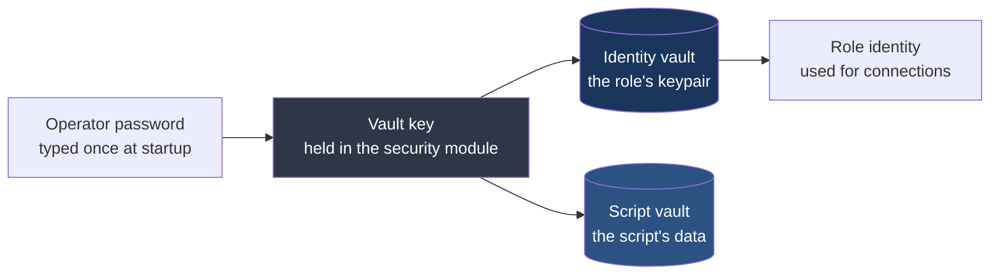
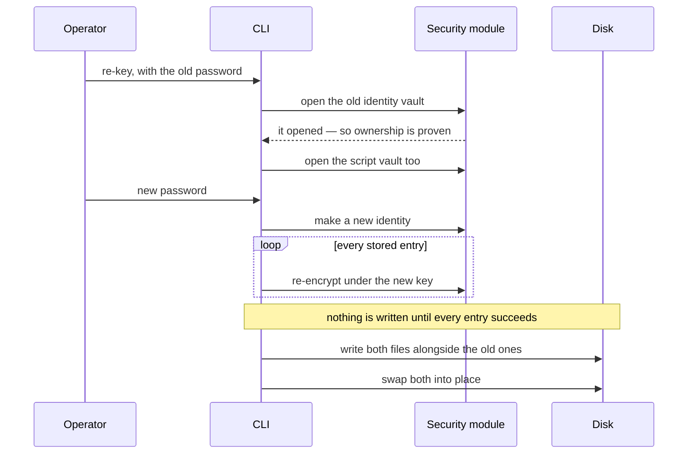

# Script-facing security and vault access — design draft

> **Status:** DRAFT, 2026-08-10.  Tracked as task **#136**.
> Three decisions are open (§8); everything else is settled.
>
> **Replaces:** `HEP-CORE-0038` (§7), and the script-crypto half of
> `DRAFT_keystore_ephemeral_and_script_crypto_2026-07.md` — whose other
> half describes the broker SHM observer, retired by HEP-CORE-0045.
>
> **A discarded excursion, recorded so it is not retried.**  An earlier
> revision proposed a "script API layer": a compiled table describing
> every script member, a shape vocabulary, and a dispatch path with
> per-engine adapters.  **Withdrawn 2026-08-10.**  The problem it
> addressed was real but small — the three engines had drifted by a
> handful of names — and that is bookkeeping, not architecture.  It also
> began re-describing the peer, band and inbox surfaces in a vocabulary
> of its own, which would have created a second description of contracts
> that already have careful ones.  Across three review passes the
> vocabulary never stabilised; an abstraction that will not hold still
> has no natural shape.  Placement is now a contract in HEP-CORE-0011
> § "Cross-Engine Binding Discipline", where it belongs.

---

## 1. What a script needs, and what it has

A script running inside a role needs three things from the security
side.  It has one of them.

| Need | Today |
|---|---|
| Know who it is allowed to talk to | ✅ has it |
| Talk privately to someone | ❌ missing |
| Remember something between runs | ❌ missing |

One rule makes the missing two safe to add:

> **A script may name things.  It may never hand over a file path, and
> it may never receive key material — not even for a key it asked for.**

---

## 2. Why a script never touches key material

The security module keeps every secret in one place and does the work
itself.  Code asks for a job **by the name of a key**; it never receives
the key.  That is promise **P3** in HEP-CORE-0043 §1.0.

This binds a script *harder* than it binds framework code, for a reason
worth stating plainly: framework code is reviewed against the contract,
user script code is not reviewed at all, and it runs in a language whose
strings cannot be wiped.  A secret handed to a script sits in memory the
interpreter may copy, keep, or write to disk, and nothing can take it
back.

**One consequence, recorded because this design got it wrong once:** an
encrypted file that hands a script back the plain text of a *password*
is not protected storage.  It is protected on disk and unprotected
everywhere else.  Calling it a vault invites exactly the trust it cannot
carry.  §5.1 draws the line that follows.

---

## 3. Two kinds of key, and why they must not be mixed

|  | Session key | Role identity |
|---|---|---|
| How long it lives | one run of the process | the role, across restarts |
| What it is for | messages **in flight** | data **at rest** |
| Public half | the script publishes it to anyone | the role's identity |
| Who chooses the name | the script | nobody — the framework owns it |
| Survives a restart | no, deliberately | yes |
| Can a script name it | yes, inside its own namespace | **never** |

The separation is not tidiness.  If a script sealed its saved data with a
session key, that data would be unreadable after the next restart —
guaranteed, silently.  Making the choice belong to the framework puts
that mistake out of reach instead of merely warning against it.

A useful side effect of a session key dying with the process: traffic
captured during one run cannot be reopened afterwards, because the key
no longer exists anywhere.

---

## 4. What a script can do

| Job | Which key | Script picks the name |
|---|---|---|
| Read my own public key | role identity, public half | — |
| Make a session key, get its public half | session | yes |
| Encrypt to a peer, decrypt from one | session | yes |
| Check a credential someone presented | either | yes |
| Get random bytes, hash something | none | — |
| Read and write my own saved data | role identity's vault | **no** — it names an entry |

### A worked example

Two roles that want a private side-channel of their own, on top of
whatever the framework already gives them.

```lua
-- Role A, at startup: make a key and tell everyone the public half.
function on_init(api)
  local my_pub = api.crypto_new_keypair("session")   -- returns ONLY the public half
  api.channel_broadcast("ctrl", "my_pubkey", my_pub) -- publish it however you like
  return true
end

-- Role A, later: read something a peer sealed for us.
function on_inbox(msg, api)
  local plain = api.crypto_decrypt("session", peer_pub, msg.data)
  api.log("info", "peer said: " .. plain)
end
```

The secret half of `"session"` never appears in that script.  It is made
inside the security module, lives in locked memory, and is gone when the
process exits.  The script only ever holds a public key, a ciphertext,
and a plain text it decrypted itself.

`api.crypto_new_keypair("session")` is not the name the module sees.  The
binding puts the script in its own namespace first:

```
  script says          →   "session"
  binding turns it into →  "script.<role_uid>.session"
  module sees           →  "script.<role_uid>.session"
```

That prefix is why a script cannot reach `role_identity` by guessing.

### Why randomness is on the list

It costs nothing and prevents a real mistake.  A Lua script that needs an
unpredictable value today finds `math.random`, which is not suitable and
does not look unsuitable.

---

## 5. Keeping data between runs

### 5.1 What belongs in it

The store holds **the script's own data** and hands it straight back.
Encrypting it on disk is honest protection against someone who takes the
disk.  It is no protection at all against anything running in the same
process, because the script holds the plain text at both ends.

| | Examples |
|---|---|
| **Belongs** | calibration constants, run counters, device serial numbers, last-known stage position, cached instrument state |
| **Does not belong** | passwords, API tokens, any credential |
| **Never** | keys — a session key lives in the security module and dies there |

### 5.2 It is not a new mechanism

**The vault machinery is already general.**  A vault file records what
*kind* it is in its header, and each kind declares how many raw secret
bytes it carries.  Hub and role are two kinds today.  Script data becomes
a third:

```
  ┌─────────────────────────────────────────────┐
  │ HEADER — readable without the password,     │
  │   but protected against tampering           │
  │     kind = ScriptData                       │
  ├─────────────────────────────────────────────┤
  │ ENCRYPTED BODY                              │
  │   raw secret section  ── length 0 here      │
  │   the script's data   ── all of it          │
  └─────────────────────────────────────────────┘
```

A secret section of length zero means the whole body is the script's
data — already encrypted, already tamper-checked, with no new format and
no new cryptography.

| | |
|---|---|
| New file format | none — HEP-CORE-0035 §4.6.6 unchanged |
| New cryptography | none — the same encryption the other vaults use |
| Separate file | yes — script writes never touch the identity file |
| Password prompts | still one, at startup |

That last row matters.  A role opens its identity vault at startup with
the operator's password, and the derived key stays in the security
module afterwards.  A second vault opens in the same moment, and every
later save reuses that key.  `HubVault` already works exactly this way —
open with the password, save with the retained key.

**Withdrawn from an earlier revision of this document:** a bespoke file
layout and a new sealed-box operation.  Both were reinventing the vault
next to the vault.

### 5.3 How the pieces connect



Two files, one password, one derived key.  Which gives two operations
with sensibly different costs:

| Operation | What gets rewritten | Script data affected |
|---|---|---|
| Change the password | both vaults | re-saved, contents unchanged |
| Replace the role's identity | the identity vault | untouched |

**Worth flagging:** this anchors the script vault on the password, not on
the role's keypair.  The requirement — one anchor, everything migrates
together — still holds, but the expensive operation is now a password
change rather than an identity change.

### 5.4 What the script sees

Read and write.  What the data looks like inside is the script's
business — this is not a key-value store with a quota per entry, it is a
vault the script opens and saves.

```python
state = api.vault_read()            # a dict; empty on first run
state["runs"] = state.get("runs", 0) + 1
state["last_position"] = 12.4
api.vault_write(state)
```

Because it genuinely is a vault file, `api.vault_*` is the accurate name
rather than a clash with the on-disk meaning.

### 5.5 Size limit

A store that grows without limit, driven by user code, will eventually
fill a disk.  A total size cap is the obvious answer; the number is not
chosen (§8).

---

## 6. Replacing the role's identity later

Creating a key over an existing vault **already refuses**, and that is
right: a vault holds the only copy of an identity, so overwriting one
cannot be undone.  What is missing is the sanctioned way through.



Four things this must get right:

| Requirement | Why |
|---|---|
| Opening the old vault **is** the ownership proof | the file either opens or it does not; a separate check would invite trusting a stale answer |
| **One** command, never two steps | the halfway state — new identity saved, data still locked to the old one — is the unrecoverable one |
| Nothing commits until everything re-encrypts | partial success is the same disaster in slow motion |
| A crash leaves the old pair working | the property to test directly |

No stored data means no ceremony: make the key and finish.

---

## 7. What a script can never do

The first two need tests where a script deliberately tries and is
refused — not a comment saying it shouldn't.

| Not allowed | What stops it |
|---|---|
| Name a framework key such as the role or hub identity | the binding prefixes every script-supplied name first |
| Hand over a file path | the store owns its directory; the script names an entry inside it |
| Get the secret half of any key, including one it made | the module never returns key material |
| Read or write the identity vault | no path is accepted, so no file can be addressed |
| Change who is allowed on a channel | scripts observe; the framework decides |

**The path rule matters as much as the name rule.**  Prefixing the *name*
is only half a sandbox — nothing yet constrains which *file* a caller may
open, and the file is where secrets live.  This is not hypothetical on
the hub side: a hub script can already read the whole configuration,
including where the vault lives.  No key material leaks today, but the
one ingredient a bypass would need is already within reach.

**HEP-CORE-0038 is withdrawn, not repaired.**  It exists to give scripts
somewhere to keep external API tokens and broker passwords — a credential
store, which §2 forbids.  A document whose purpose the design rejects
should be closed.  What carries forward is its isolation intent and the
rule that sandboxing happens in the binding layer.

---

## 8. Decisions still open

| # | Question | Notes |
|---|---|---|
| 1 | Does the script vault ship at all? | Useful for operational state.  The cost is that someone will eventually put a password in it. |
| 2 | What size cap? | Or defer it explicitly. |
| 3 | Where does this land? | HEP-CORE-0011 owns the script surface and says nothing about its security side.  Least urgent. |

---

## 9. Related

- **Cross-engine drift** found while auditing this — recorded in
  HEP-CORE-0011 § "Cross-Engine Binding Discipline" and tracked as task
  #141.  Not restated here; one description is enough.
- `HEP-CORE-0043` — the security module: what it promises, and the
  named-key operations.
- `HEP-CORE-0035` §4.6.6 — the vault file format this reuses unchanged.
- `HEP-CORE-0040` — how keys are held in locked memory.
- `HEP-CORE-0011` — the script surface and where a member belongs.
