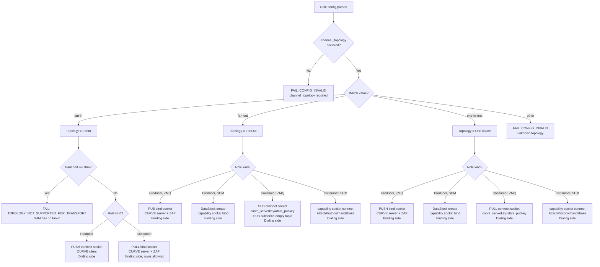
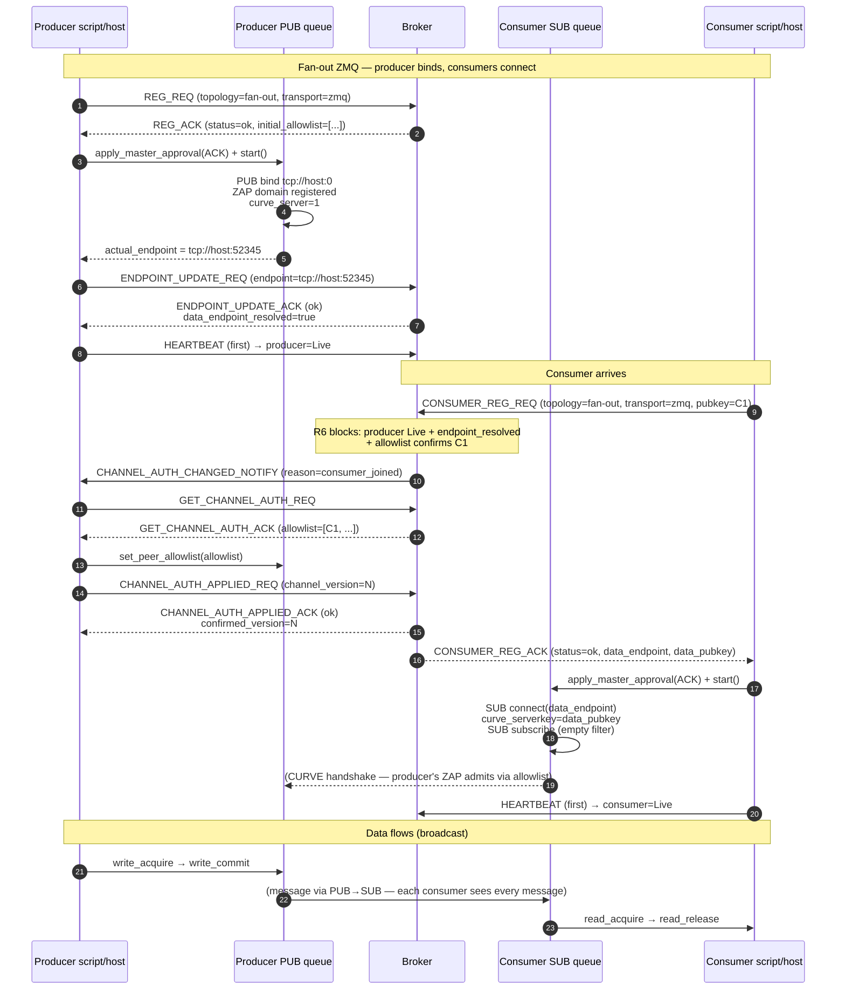
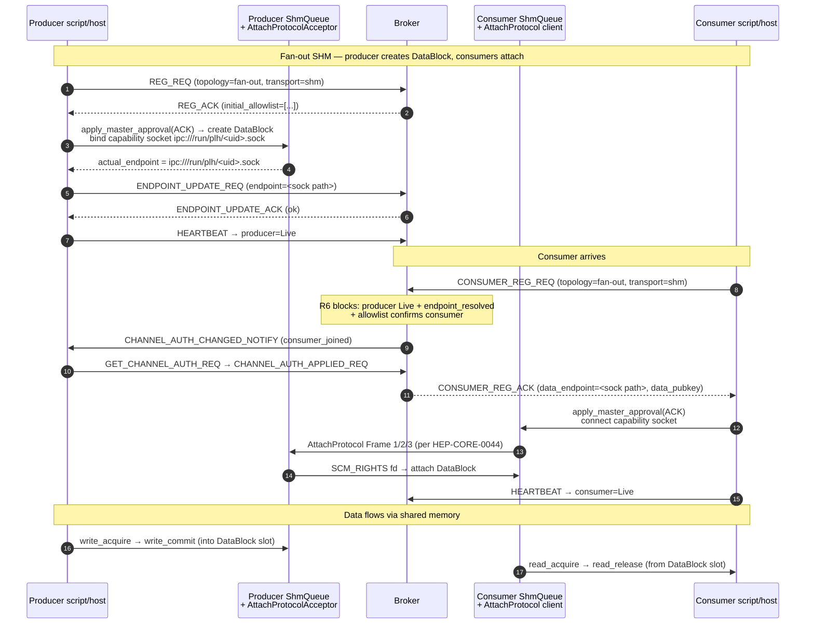
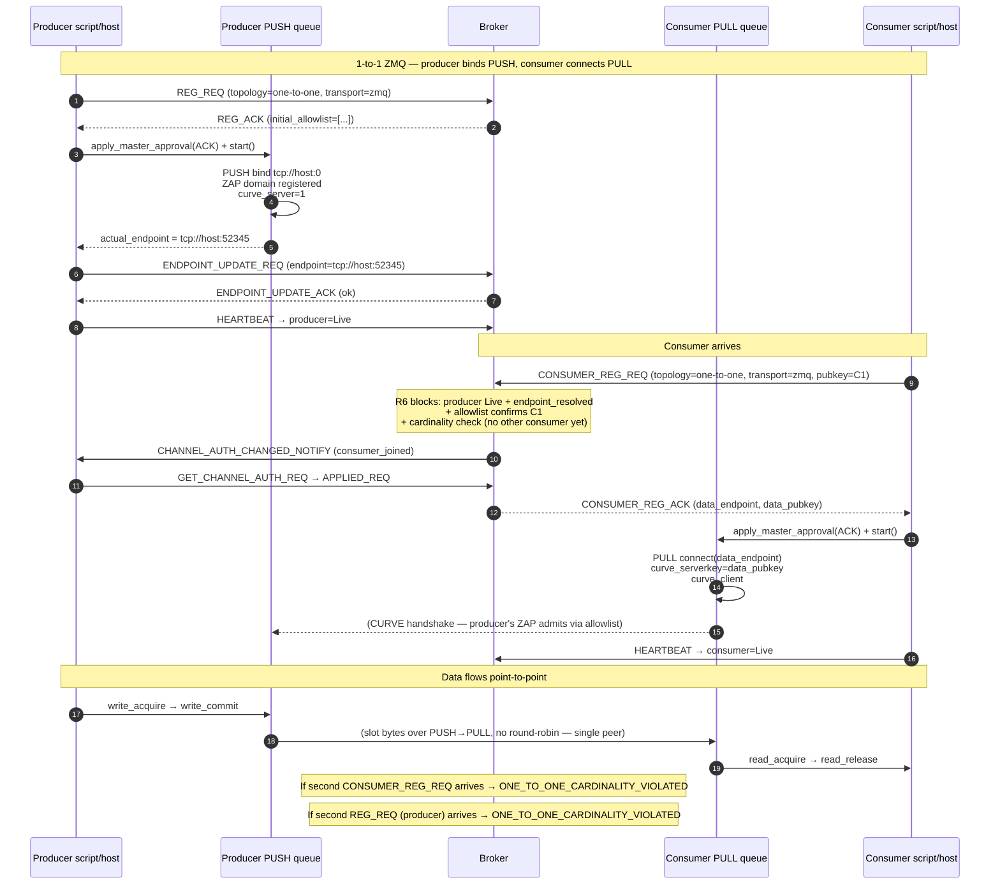
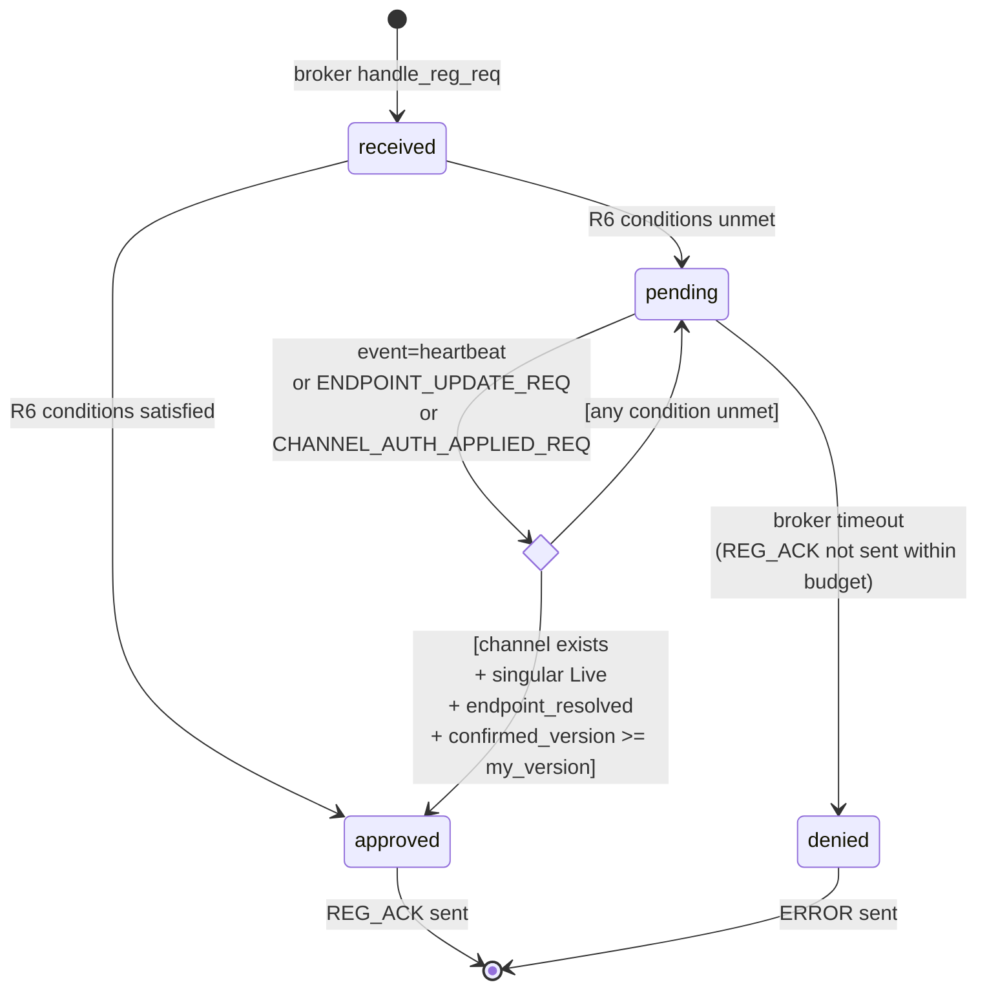

# Singular-side ownership: topology-parameterized data-plane design

## 0. Status

Draft revision 3 (2026-07-08 evening).  Not adopted.  Awaiting user
review and approval.  If approved, this document becomes the design
authority for a coordinated multi-HEP amendment package.

Revision history:
- **Rev 1** (`bdc30116`) — initial design; fan-in + fan-out only.
- **Rev 2** (`54177894`) — added 1-to-1 topology; Q1/Q2/Q3 answers locked.
- **Rev 3** (this) — folded fresh-eye review findings + code-scan agent
  results.  Fixes: enum + wire lists updated for 1-to-1; §7 adds full
  1-to-1 ZMQ sequence + upgraded fan-out SHM diagram; §6.0 new topology
  decision flowchart; §10 gains tier-boundary preamble + all-3-topology
  broker pseudocode + R6 wake handler + stale-pubkey cleanup; §5 gains
  singular-side restart rule (§5.11a) + plural-side ENDPOINT_UPDATE
  rejection rule; §11 substantially expanded (12 additional code sites,
  6 additional test files, script API sites, corrected LOC estimates);
  §12 Phase G no longer "optional"; §14 aligned with §13.3 XPUB
  discussion; §11.4 gains HEP-CORE-0028 + HEP-CORE-0044.

The draft supersedes two recent commits that need to be re-evaluated in
light of this design:

- **`2c604280`** — HEP-CORE-0017 §3.3 multi-endpoint PULL fix.  Under this
  design, consumer's PULL binds once; the per-peer connect loop retires.
- **`9d0ca4c8`** — HEP-CORE-0021 §16 amendment as drafted.  The state
  machine and mid-life rules stay valid but reparametrize by which side of
  the topology is singular.

## 1. Executive summary (plain language)

Each data channel has exactly **one side** that is stable and singular, and
one side that is plural and dynamic.  For a channel where many producers
feed into one consumer (fan-in), the consumer is singular.  For a channel
where one producer feeds many consumers (fan-out), the producer is
singular.  The current framework mixes these — producer always binds
regardless of topology — and that mismatch is the root cause of a stack of
complexity we've been accumulating (multi-endpoint PULL, per-producer
attach coordination, N-endpoint tracking on the broker).

The design principle: **the singular side of the topology owns the
channel's data endpoint and binds; the plural side dials in.**  Everything
else — state model, wire messages, queue internals — follows from that
one fact.

Consequence: significantly less code, one fewer coordination protocol, and
a state model that generalizes to both fan-in and fan-out with the same
mechanism.

## 2. Scope

Three topologies, each with an explicit declaration on every REG_REQ.  The
transport × topology matrix is checked upfront at broker's REG_REQ time —
invalid combos rejected before any channel state mutation.

| Topology | Wire value | Transport | Supported? | Binding side | Socket pair |
|---|---|---|---|---|---|
| Fan-in (N → 1) | `"fan-in"` | ZMQ | Yes | Consumer | PULL (bind) ← PUSH (connect) |
| Fan-in (N → 1) | `"fan-in"` | SHM | **No** — physically single-producer per HEP-CORE-0023 §2.1.1 | — | — |
| Fan-out (1 → N) | `"fan-out"` | ZMQ | Yes | Producer | PUB (bind) → SUB (connect) |
| Fan-out (1 → N) | `"fan-out"` | SHM | Yes | Producer | DataBlock via capability transport (HEP-CORE-0041) |
| 1-to-1 (1 → 1) | `"one-to-one"` | ZMQ | Yes | Producer | PUSH (bind) → PULL (connect) |
| 1-to-1 (1 → 1) | `"one-to-one"` | SHM | Yes | Producer | DataBlock via capability transport (HEP-CORE-0041) |

**Cardinality rules** (broker enforces at REG_REQ time):

| Topology | Producers | Consumers |
|---|---|---|
| Fan-in | 1..N | exactly 1 |
| Fan-out | exactly 1 | 1..N |
| 1-to-1 | exactly 1 | exactly 1 |

**N×M topologies are explicitly out of scope.**  Every channel is one of
the three above.  Under this constraint, at least one side of any channel
is singular; that's the side that owns the endpoint.

**Design rule for 1-to-1:** the producer binds (same as fan-out).  Even
though both sides are singular, the producer is conceptually the "source"
that owns the data endpoint — parallel to SHM (producer creates the
DataBlock).  Under ZMQ, 1-to-1 uses PUSH/PULL (not PUB/SUB), which is
lighter-weight for a single-consumer stream.  1-to-1 exists as a distinct
topology (not degenerate fan-out) because the CARDINALITY GUARANTEE at
the broker is stricter — a second consumer's REG_REQ is rejected.

### 2.1 Compatibility matrix — upfront broker check

Every REG_REQ / CONSUMER_REG_REQ MUST carry `channel_topology`.  Missing
field → `INVALID_REQUEST`.  At handler entry, before any state mutation,
broker validates the pair against this matrix:

```
if transport == "shm" and topology == "fan-in":
    reject TOPOLOGY_NOT_SUPPORTED_FOR_TRANSPORT
    // SHM cannot support multi-producer per HEP-CORE-0023 §2.1.1
```

All other transport × topology pairs are valid at this gate.  Downstream
cardinality checks (see §5.4) enforce the per-role-side counts.

## 3. Core design principle

> The channel has exactly one data-plane endpoint, owned by the singular
> side of its topology.

Consequences:

- Broker state model: one `data_endpoint` field per channel, on
  `ChannelEntry`.  Not per-producer, not per-consumer.  The owner is
  determined by topology.
- Wire simplifies: no per-producer array shape, no per-producer attach
  coordination.  Registration + heartbeat + endpoint update cover
  everything.
- Queue abstraction stays clean: role layer never sees bind/connect
  decisions.  Queue picks socket type and bind direction from topology +
  side + transport.

## 4. Broker state model

### 4.1 `ChannelEntry` — before vs after

**Before (current):**

```cpp
struct ChannelEntry {
    std::string data_transport;                 // "shm" | "zmq"
    std::string schema_hash;
    // ...
    std::vector<ProducerEntry> producers;       // per-producer records
    std::vector<ConsumerEntry> consumers;
};

struct ProducerEntry {
    // ...
    std::string zmq_node_endpoint;   // per-producer TCP endpoint (retires)
};
```

**After (this design):**

```cpp
enum class ChannelTopology { FanIn, FanOut, OneToOne };

struct ChannelEntry {
    ChannelTopology topology;                   // NEW — declared at creation
    std::string     transport;                  // "shm" | "zmq"
    std::string     schema_hash;
    // ...

    // Binding side's bound data-plane endpoint.
    //   Fan-In     ZMQ: consumer's PULL bind endpoint  (tcp://...)
    //   Fan-Out    ZMQ: producer's PUB  bind endpoint  (tcp://...)
    //   Fan-Out    SHM: producer's capability endpoint (ipc://...)
    //   1-to-1     ZMQ: producer's PUSH bind endpoint  (tcp://...)
    //   1-to-1     SHM: producer's capability endpoint (ipc://...)
    std::string     data_endpoint;
    bool            data_endpoint_resolved{false};

    // Per-role identity + pubkey rows (needed for ZAP allowlist).
    // ProducerEntry.zmq_node_endpoint field retires.
    std::vector<ProducerEntry> producers;
    std::vector<ConsumerEntry> consumers;

    // HEP-CORE-0042 confirmed_version bookkeeping (reparametrized —
    // now scalar per channel because there's exactly one binding side
    // that applies allowlist updates).
    uint64_t channel_version{0};
    uint64_t confirmed_version{0};
};
```

### 4.2 Channel ownership + cardinality

The singular side owns the channel's existence:

- **Fan-in:** consumer dies → channel dies → `CHANNEL_CLOSING_NOTIFY` fans out to all producers.
- **Fan-out:** producer dies → channel dies → `CHANNEL_CLOSING_NOTIFY` fans out to all consumers.
- **1-to-1:** producer dies → channel dies → `CHANNEL_CLOSING_NOTIFY` to the consumer.  Consumer dies → channel dies → `CHANNEL_CLOSING_NOTIFY` to the producer (symmetric because both are singular).

This generalizes HEP-CORE-0023 §2.1.1's current rule ("channel exists as
long as at least one producer-presence is alive") into the symmetric form.

**Semantic shift acknowledged (user-confirmed 2026-07-08).**  Under this
design, a fan-in channel dies when its consumer dies — even if all N
producers are healthy.  This is a deliberate consequence of "singular
side owns channel life": without a consumer, a fan-in has no purpose.
Deployments that need multi-consumer resilience with data-source
redundancy should model that as fan-out (single-source producer with
multiple redundant consumers), not fan-in.

**Cardinality enforcement (broker rejects at REG_REQ time):**

| Topology | Extra producer arrives | Extra consumer arrives |
|---|---|---|
| Fan-in | Accepted (adds to `producers[]`, allowlist bump) | Rejected: `FAN_IN_IS_SINGLE_CONSUMER` |
| Fan-out | Rejected: `FAN_OUT_IS_SINGLE_PRODUCER` | Accepted (adds to allowlist) |
| 1-to-1 | Rejected: `ONE_TO_ONE_CARDINALITY_VIOLATED` | Rejected: `ONE_TO_ONE_CARDINALITY_VIOLATED` |

These rejections happen synchronously in the REG_REQ handler — no channel
mutation, no NOTIFY, no side effects.

## 5. Wire changes

### 5.1 `REG_REQ` / `CONSUMER_REG_REQ` — add `channel_topology`

```json
{
  "role_uid": "prod.temp01.uid12345",
  "channel_name": "lab.sensor.temp",
  "data_transport": "zmq",
  "channel_topology": "fan-in",           // NEW — one of "fan-in" | "fan-out" | "one-to-one"
  "zmq_pubkey": "...",
  "schema_hash": "...",
  ...
}
```

Broker rules (all evaluated under the channel-state mutex, atomically):

1. `channel_topology` is **REQUIRED** on every REG_REQ.  Missing field →
   `INVALID_REQUEST`.  No lenient default.
2. Compatibility matrix check (§2.1) fires first — invalid transport ×
   topology combo → `TOPOLOGY_NOT_SUPPORTED_FOR_TRANSPORT`.
3. Cardinality pre-check (§4.2 table): if this REG_REQ would violate the
   topology's cardinality, reject with the topology-specific error code
   (`FAN_IN_IS_SINGLE_CONSUMER` / `FAN_OUT_IS_SINGLE_PRODUCER` /
   `ONE_TO_ONE_CARDINALITY_VIOLATED`).
4. Channel-lookup:
   - Channel does not exist: broker creates `ChannelEntry` with the
     declared topology + transport.  No "first REG_REQ" ordering
     ambiguity because all state mutations are under the mutex — the
     losing side of a race sees the channel already-existing and
     proceeds to rule 5.
   - Channel exists: `channel_topology` MUST match the recorded value,
     else `TOPOLOGY_MISMATCH`.
5. All other REG_REQ validation (schema, known_roles, etc.) unchanged.

**Channel creation is topology-driven, not side-driven.**  The broker
extracts a shared internal `create_or_join_channel(topology, transport,
schema, ...)` called from both `handle_reg_req` and
`handle_consumer_reg_req`.  Whichever side's REG_REQ arrives first wins
the create race; the other joins the existing entry.

### 5.2 Plural-side REG_ACK — carry `data_endpoint` + `data_pubkey`

Plural side needs to know where and how to dial.  Its REG_ACK gains:

```json
{
  "status": "success",
  "channel_name": "lab.sensor.temp",
  ...
  "data_endpoint": "tcp://192.168.1.10:51234",    // singular side's bound endpoint
  "data_pubkey":   "...40-char Z85..."            // singular side's identity pubkey
                                                  // (curve_serverkey for the dial)
}
```

Singular-side REG_ACK stays lean — the singular side already has its own
pubkey and hasn't bound yet at ACK time.  Its endpoint is published via
`ENDPOINT_UPDATE_REQ` at S3.

### 5.3 `ENDPOINT_UPDATE_REQ` — reparametrize

The wire and handler stay as-is.  What changes: the sender is the
BINDING side of the channel (§6.2 decision matrix).

| Topology | Transport | Sender | After |
|---|---|---|---|
| Fan-in    | ZMQ | Consumer | PULL bind |
| Fan-out   | ZMQ | Producer | PUB bind |
| Fan-out   | SHM | Producer | Capability socket bind (Unix socket) |
| 1-to-1    | ZMQ | Producer | PUSH bind |
| 1-to-1    | SHM | Producer | Capability socket bind (Unix socket) |

**Plural-side ENDPOINT_UPDATE_REQ is rejected.**  The broker's handler
resolves the sender via ZMTP identity and checks whether the sender is
the binding side of the target channel.  A dialing-side role that sends
`ENDPOINT_UPDATE_REQ` gets `NOT_CHANNEL_OWNER` — dialing-side roles have
no data-plane endpoint to publish.

The broker's handler already resolves the sender via ZMTP identity, so
the mechanism doesn't change.  What DOES change: the previously-drafted
HEP-CORE-0021 §16 amendment reparametrizes — replace "producer" with
"binding side of the channel's topology" everywhere.  State machine,
mid-life rules, R6 extension all carry over unchanged in mechanism, just
aimed at the right side.

### 5.4 R6 gate — symmetric

Today R6 blocks consumer REG_REQ until producer is Live.  Under this
design, R6 becomes symmetric:

**Plural-side REG_REQ (or 1-to-1's second-side REG_REQ) pends iff any of:**

- Channel doesn't exist yet (singular side hasn't registered).
- Singular side's presence != Live.
- Singular side's `data_endpoint_resolved == false`.
- Singular side's `confirmed_version < this_role_registration_version`
  (see §5.6 — allowlist propagation must complete before dial-safe).

Same mechanism (pend the REQ, re-evaluate on relevant events, ACK on
first satisfaction).  Parameterized by "dialing side waits for binding
side."

**Definition — `role_registration_version`.**  When broker receives a
plural-side REG_REQ that passes the cardinality + compatibility gates
(§4.2), broker atomically:

1. Adds the role's pubkey to `ChannelEntry`'s ZAP allowlist.
2. Bumps `channel_version` to `V_new`.
3. Assigns `role_registration_version = V_new` for this REG_REQ.
4. Fires ONE `CHANNEL_AUTH_CHANGED_NOTIFY` to the binding side (see §5.5
   direction rule) — the notify covers the aggregate allowlist state at
   `V_new`, not per-role.
5. Pends the REG_REQ waiting for `confirmed_version >= V_new`.

**Concurrent REG_REQs (multiple producers under fan-in arriving at once).**
Each REG_REQ locks the state mutex serially, so version assignments are
strictly ordered.  If producers A, B, C arrive nearly simultaneously:

- A locks → allowlist gains A → `channel_version = 1` → A's
  `role_registration_version = 1` → NOTIFY(v=1) fired.
- B locks (after A releases) → allowlist gains B → `channel_version = 2`
  → B's `role_registration_version = 2` → NOTIFY(v=2) fired.
- C locks similarly → `channel_version = 3` → NOTIFY(v=3) fired.

Consumer receives 3 NOTIFYs.  It may pull the aggregate allowlist once
and send `CHANNEL_AUTH_APPLIED_REQ(applied_version=3)`.  That single
APPLIED_REQ wakes all 3 pending producer REG_REQs simultaneously
(all three `V >= their_role_registration_version` conditions become
true).  Broker sends all 3 REG_ACKs.

Consumer MAY coalesce NOTIFYs (apply once for the aggregate) or apply
per-notify (three round-trips).  The wire allows either; the framework's
role host SHOULD coalesce for efficiency but is not required to.

### 5.4a DEREG / channel death mid-pending

If the binding side dies (heartbeat timeout, DEREG_REQ, or crash) while
plural-side REG_REQs are pending in R6, broker:

1. Tears down the channel (per §4.2 ownership rule).
2. Resolves ALL pending REG_REQs with `error_code = CHANNEL_CLOSED`,
   `message = "channel died before your REG_REQ could be admitted"`.
3. Fires no NOTIFYs for the pending ones (they never joined the
   allowlist).

Plural-side clients treat `CHANNEL_CLOSED` as a transient error and MAY
retry after a backoff (same class as pre-first-heartbeat REG_REQs today).

### 5.5 `CHANNEL_AUTH_CHANGED_NOTIFY` — direction inverts by topology

Today: broker → producer (informs of consumer joins/leaves).

Under this design, broker's NOTIFY is aimed at the BINDING side for
this channel (§6.2 decision matrix):

| Topology | Transport | NOTIFY target | Reason values |
|---|---|---|---|
| Fan-in    | ZMQ | Consumer | `producer_joined`, `producer_left` |
| Fan-out   | ZMQ | Producer | `consumer_joined`, `consumer_left` |
| Fan-out   | SHM | Producer | `consumer_joined`, `consumer_left` |
| 1-to-1    | ZMQ | Producer | `consumer_joined`, `consumer_left` |
| 1-to-1    | SHM | Producer | `consumer_joined`, `consumer_left` |

Mechanically identical to today's flow; direction generalizes.

### 5.6 `GET_CHANNEL_AUTH_REQ` + `CHANNEL_AUTH_APPLIED_REQ` — direction inverts

Today: producer pulls allowlist and confirms applied.  Under this design:
the BINDING side pulls and confirms.

| Topology | Transport | Puller / Confirmer |
|---|---|---|
| Fan-in    | ZMQ | Consumer (pulls producer pubkeys) |
| Fan-out   | ZMQ | Producer (pulls consumer pubkeys, as today) |
| Fan-out   | SHM | Producer (pulls consumer pubkeys, as today) |
| 1-to-1    | ZMQ | Producer (pulls consumer pubkeys) |
| 1-to-1    | SHM | Producer (pulls consumer pubkeys) |

The `confirmed_version` versioning stays; it now tracks the **binding
side's** applied snapshot per channel.  Because there's exactly one
binding side per channel, `confirmed_version[K][P]` collapses to
`confirmed_version[K]` — a scalar per channel.

### 5.7 `CONSUMER_ATTACH_REQ_ZMQ` — retires entirely

HEP-CORE-0042 §5 + §7.1 pre-attach coordination existed because the
consumer needed confidence that producer's ZAP allowlist had consumer's
pubkey before the consumer dialed the producer.  Under Pattern A fan-in,
consumer BINDS; consumer OWNS the allowlist.  The whole coordination
collapses into the REG_REQ path:

1. Producer REG_REQ arrives → broker blocks at R6.
2. Broker fires `CHANNEL_AUTH_CHANGED_NOTIFY` → consumer.
3. Consumer pulls, applies to ZAP, sends `CHANNEL_AUTH_APPLIED_REQ`.
4. Broker's R6 wake — pending producer REG_REQs drain.
5. Producer REG_ACK carries `data_endpoint` + `data_pubkey`.
6. Producer dials.  Consumer's ZAP admits.

**No CONSUMER_ATTACH_REQ_ZMQ.**  No `attach:begin` / `attach:success` /
`attach:complete` log markers.  No pre-attach loop.  ~400 LOC of broker
code + ~500 LOC of L3 tests retire.

### 5.8 `CHANNEL_PRODUCERS_CHANGED_NOTIFY` + `GET_CHANNEL_PRODUCERS_REQ` — retire for fan-in

Under fan-in Pattern A, consumer doesn't dial producers.  It doesn't need
to be informed of producer endpoints.  Allowlist changes flow through
`CHANNEL_AUTH_CHANGED_NOTIFY`, which delivers the pubkey set the ZAP
needs.  The `CHANNEL_PRODUCERS_CHANGED_NOTIFY` chain becomes dead code
for fan-in ZMQ.  (Fan-out ZMQ has one producer, so it's moot there too.)

### 5.9 `CONSUMER_REG_ACK.producers[]` — retires; per-topology shape

The per-producer `producers[]` array retires entirely.  Every topology
converges on a scalar `data_endpoint` + `data_pubkey` (or empty) on the
CONSUMER_REG_ACK:

| Topology | Transport | `CONSUMER_REG_ACK` shape |
|---|---|---|
| Fan-in    | ZMQ | Success flag only.  Consumer is BINDING side; already has its own endpoint locally. |
| Fan-out   | ZMQ | Scalar `data_endpoint` (producer's PUB address) + `data_pubkey`. |
| Fan-out   | SHM | Scalar `data_endpoint` (producer's capability socket) + `data_pubkey`. |
| 1-to-1    | ZMQ | Scalar `data_endpoint` (producer's PUSH address) + `data_pubkey`. |
| 1-to-1    | SHM | Scalar `data_endpoint` (producer's capability socket) + `data_pubkey`. |

The plural-side REG_ACK always carries the scalar; the binding-side ACK
never does.  Symmetric for PRODUCER_REG_ACK under fan-in (producer is
plural → REG_ACK carries the consumer's endpoint + pubkey).

### 5.10 `DISC_REQ` / `DISC_REQ_ACK` — simplify

Response returns transport + topology + `data_endpoint` (single string,
not array).  The pending per-producer array migration retires trivially —
there is no per-producer array anymore.

### 5.11 `DEREG_REQ` — wire unchanged; semantics parameterize

Channel-death rule generalizes: **binding side dies → channel dies**.

| Topology | Whose death kills the channel | Recipients of `CHANNEL_CLOSING_NOTIFY` |
|---|---|---|
| Fan-in    | Consumer (binding side) | All producers |
| Fan-out   | Producer (binding side) | All consumers |
| 1-to-1    | Either side (both are singular) | The other side |

Plural-side DEREG (fan-in producer, fan-out consumer) removes that role
from the allowlist and fires `CHANNEL_AUTH_CHANGED_NOTIFY` to the binding
side (§5.5); the channel survives.

### 5.11a Singular-side restart under fan-in (post-crash)

When a fan-in consumer crashes, the channel dies (§4.2, §5.11).  All
producers receive `CHANNEL_CLOSING_NOTIFY` and — per HEP-CORE-0036
§3.5.1 fatal-on-registration-failure principle — SHOULD exit cleanly.
No auto-re-registration in the current design.

A subsequent consumer with the same channel name creates a FRESH channel
(new `ChannelEntry`, new `channel_version` starting at 0, empty
allowlist).  This is not "consumer re-registration for the same channel"
— the identity is a name reuse, not a state carry-over.

Deployments that need consumer restart to preserve channel state should
supervise the consumer at a higher layer (process-supervisor with
restart-in-place) so from the framework's perspective the consumer
never dies.  Framework does not baby-sit restart semantics
([[feedback_framework_mechanism_not_policy]]).

### 5.12 Retirement summary

| Wire | Retires for | Why |
|---|---|---|
| `CONSUMER_ATTACH_REQ_ZMQ` / `_ACK` (HEP-0042 §5, §7.1) | All ZMQ topologies | Coordination collapses into REG_REQ under Pattern A. |
| `CHANNEL_PRODUCERS_CHANGED_NOTIFY` | Fan-in ZMQ (moot elsewhere) | Consumer doesn't dial producers; allowlist updates suffice. |
| `GET_CHANNEL_PRODUCERS_REQ / _ACK` | Fan-in ZMQ (moot elsewhere) | Same reason. |
| Per-producer `CONSUMER_REG_ACK.producers[]` array | Fan-in ZMQ | Single `data_endpoint` replaces it. |
| Per-producer `ProducerEntry.zmq_node_endpoint` | Whole framework | Moves to `ChannelEntry.data_endpoint`. |

## 6. Queue abstraction — how it's smart

### 6.0 Topology decision flowchart



### 6.1 Factory API

The `QueueReader` / `QueueWriter` API surface (as used by scripts and role
hosts) stays exactly the same.  The factory signature changes:

```cpp
// Consumer side (reader).
std::unique_ptr<QueueReader>
Queue::create_reader(ChannelTopology topology,
                     Transport       transport,      // "zmq" | "shm"
                     RxOptions       opts);

// Producer side (writer).
std::unique_ptr<QueueWriter>
Queue::create_writer(ChannelTopology topology,
                     Transport       transport,
                     TxOptions       opts);
```

The queue picks the concrete implementation + configures it from a small
decision matrix.

### 6.2 Decision matrix

| Side | Topology | Transport | Socket type | Bind or Connect | Post-connect step | CURVE role | Endpoint owner |
|---|---|---|---|---|---|---|---|
| Reader (consumer) | Fan-In     | ZMQ | PULL | **bind**    | — | server | self |
| Reader (consumer) | Fan-Out    | ZMQ | SUB  | connect     | `setsockopt(ZMQ_SUBSCRIBE, "")` — subscribe to full stream | client | peer |
| Reader (consumer) | Fan-Out    | SHM | (capability transport) | connect | — | (peer identity via crypto_box) | peer |
| Reader (consumer) | 1-to-1     | ZMQ | PULL | connect     | — | client | peer |
| Reader (consumer) | 1-to-1     | SHM | (capability transport) | connect | — | (peer identity via crypto_box) | peer |
| Writer (producer) | Fan-In     | ZMQ | PUSH | connect     | — | client | peer |
| Writer (producer) | Fan-Out    | ZMQ | PUB  | **bind**    | — | server | self |
| Writer (producer) | Fan-Out    | SHM | DataBlock write | (creates DataBlock) | — | (owner of capability socket) | self |
| Writer (producer) | 1-to-1     | ZMQ | PUSH | **bind**    | — | server | self |
| Writer (producer) | 1-to-1     | SHM | DataBlock write | (creates DataBlock) | — | (owner of capability socket) | self |

Two facts (side + topology) uniquely determine everything below.  The
role never sees these decisions.

**SUB empty-topic subscribe.**  Under fan-out ZMQ, a SUB socket receives
NOTHING until it calls `setsockopt(ZMQ_SUBSCRIBE, <topic>)`.  The
framework subscribes with the empty topic string (`""`) which matches all
messages — the "receive full stream" semantic.  Topic filtering is not
part of this design; adding it would be a separate future extension.

### 6.3 What the role provides

The role passes:

- **`side`** — implicit from the role kind (producer role or consumer role).
- **`topology`** — from config: `channel_topology: "fan-in" | "fan-out" | "one-to-one"`.
- **`transport`** — from config: `"zmq" | "shm"`.
- **`endpoint_hint`** — for the binding side, may be `tcp://host:0` (ephemeral).  For the dialing side, this field is REJECTED at config-load with `CONFIG_INVALID` — the dialing side must not pre-declare an endpoint (the endpoint comes from the ACK).

**Abstraction contract preserved.**  Nothing in the role code touches
sockets.  The role passes strings + enums; the queue owns all libzmq /
DataBlock interaction.  See §10 for concrete examples respecting this
boundary.

### 6.4 CURVE + ZAP fit cleanly

The binding side is always CURVE server (has one identity keypair; sets
`curve_publickey` + `curve_secretkey` + `curve_server=1`, registers ZAP
domain).  The connecting side is always CURVE client (sets
`curve_serverkey = data_pubkey from ACK` + `curve_publickey` +
`curve_secretkey`).  No per-peer serverkey mutation because on the connect
side, the "peer" is the singular side — one entity.

The ZAP allowlist lives on the binding side, mutated via the
`CHANNEL_AUTH_CHANGED_NOTIFY` chain aimed at the binding side.

## 7. Producer / consumer S3 flows

### 7.1 Fan-in ZMQ — full startup sequence

```mermaid
sequenceDiagram
    autonumber
    participant CS as Consumer script/host
    participant CQ as Consumer PULL queue
    participant B  as Broker
    participant PQ as Producer PUSH queue
    participant PS as Producer script/host

    Note over CS,PS: Fan-in ZMQ — consumer binds, producers connect
    CS->>B: CONSUMER_REG_REQ (topology=fan-in, transport=zmq)
    B-->>CS: CONSUMER_REG_ACK (status=ok; no producers[] array)
    CS->>CQ: apply_master_approval(ACK) + start()
    CQ->>CQ: PULL bind tcp://host:0<br/>ZAP domain registered<br/>curve_server=1
    CQ-->>CS: actual_endpoint = tcp://host:51234
    CS->>B: ENDPOINT_UPDATE_REQ (endpoint=tcp://host:51234)
    B-->>CS: ENDPOINT_UPDATE_ACK (ok)<br/>data_endpoint_resolved=true
    CS->>B: HEARTBEAT (first) → consumer=Live

    Note over PS,B: Producer arrives (any time after or before consumer Live)
    PS->>B: REG_REQ (topology=fan-in, transport=zmq, pubkey=P1)
    Note over B: R6 blocks: needs consumer Live<br/>+ endpoint_resolved<br/>+ allowlist confirms P1
    B->>CS: CHANNEL_AUTH_CHANGED_NOTIFY (reason=producer_joined)
    CS->>B: GET_CHANNEL_AUTH_REQ
    B-->>CS: GET_CHANNEL_AUTH_ACK (allowlist=[P1, ...])
    CS->>CQ: set_peer_allowlist(allowlist)
    CS->>B: CHANNEL_AUTH_APPLIED_REQ (channel_version=N)
    B-->>CS: CHANNEL_AUTH_APPLIED_ACK (ok)<br/>confirmed_version=N
    Note over B: R6 wakes for producer REG_REQ
    B-->>PS: REG_ACK (status=ok, data_endpoint, data_pubkey)
    PS->>PQ: apply_master_approval(ACK) + start()
    PQ->>PQ: PUSH connect(data_endpoint)<br/>curve_serverkey=data_pubkey<br/>curve_client
    PQ-->>CQ: (CURVE handshake — consumer's ZAP admits via allowlist)
    PS->>B: HEARTBEAT (first) → producer=Live
    Note over PS,CS: Data flows
    PS->>PQ: write_acquire → write_commit
    PQ->>CQ: (slot bytes over PUSH→PULL)
    CQ->>CS: read_acquire → read_release
```

### 7.2 Fan-out ZMQ — full startup sequence (symmetric)



### 7.3 Fan-out SHM — sequence

The AttachProtocol / capability transport (Unix socket dial → crypto_box
handshake → SCM_RIGHTS fd) is inherited from HEP-CORE-0041 unchanged at
the transport layer.  What DOES change: the WIRE — configs now declare
`channel_topology: "fan-out"` explicitly, and `CONSUMER_REG_ACK` carries
the scalar `data_endpoint` (capability socket path) + `data_pubkey`
instead of the retired per-producer array.



### 7.4 1-to-1 ZMQ — full startup sequence



### 7.5 1-to-1 SHM — sequence

Identical to fan-out SHM (§7.3) with two broker-side additions:

- REG_REQ / CONSUMER_REG_REQ MUST declare `channel_topology: "one-to-one"`.
- Broker rejects a second consumer CONSUMER_REG_REQ with `ONE_TO_ONE_CARDINALITY_VIOLATED` (fan-out SHM would accept it).

Wire and transport layer are identical to fan-out SHM.  Only the
cardinality-guard differs.

### 7.6 Note on producer-side readiness signal (Q2 answered)

When a plural-side peer joins (fan-out consumer, fan-in producer), the
broker fires `CHANNEL_AUTH_CHANGED_NOTIFY` with `reason="consumer_joined"`
or `"producer_joined"` to the binding side.  The binding side's role host
tracks the aggregate peer set and exposes it via script API accessors:

- `api.peer_count(channel_name) -> int` — current count of peers whose
  auth handshake completed.
- `api.peers(channel_name) -> list[str]` — role_uid list.

**The framework does NOT auto-hold the data loop.**  Under fan-out ZMQ
specifically (PUB drops messages sent before SUB subscribes), the
producer's script is expected to consult `api.peer_count()` in
`on_produce` and return early if no consumers are subscribed yet.  The
framework's job is to deliver accurate signals; the script's job is to
decide when the channel is "ready enough" to push data.  This applies
symmetrically to:

- fan-in consumers (may check producer count before invoking upstream-triggered work),
- 1-to-1 both sides (either can check that the other has connected).

Rationale for this delegation: the framework has no way to know what
"ready enough" means for a given deployment.  A control loop that must
run at fixed cadence regardless of consumer state has different needs
from a sensor that suppresses expensive computation until at least one
consumer is subscribed.  See [[feedback_framework_mechanism_not_policy]]
in session memory.

Script API accessor names + cross-engine parity land under HEP-CORE-0028;
exact naming settled in Phase A.

## 8. State diagrams

### 8.1 `data_endpoint_resolved` on `ChannelEntry`

```mermaid
stateDiagram-v2
    [*] --> unset: singular side REG_REQ<br/>(broker creates ChannelEntry)

    unset --> resolved: singular side<br/>ENDPOINT_UPDATE_REQ(X)<br/>[X valid, port != 0]

    resolved --> resolved: singular side<br/>ENDPOINT_UPDATE_REQ(X)<br/>[same X — idempotent]

    resolved --> resolved: singular side<br/>ENDPOINT_UPDATE_REQ(Y ≠ X)<br/>[no consumers attached]<br/>data_endpoint = Y

    resolved --> resolved: singular side<br/>ENDPOINT_UPDATE_REQ(Y ≠ X)<br/>[consumers attached]<br/>REJECTED: ENDPOINT_CHANGE_FORBIDDEN

    unset --> [*]: singular side DEREG / heartbeat-timeout / crash<br/>(channel teardown; CHANNEL_CLOSING fans out; pending REGs get CHANNEL_CLOSED)
    resolved --> [*]: singular side DEREG / heartbeat-timeout / crash<br/>(same teardown path)
```



### 8.2 Plural-side REG_REQ pending state (R6 extended)



## 9. Auth-door compliance (§3.5.1)

The HEP-CORE-0036 §3.5.1 principle ("no data-plane footprint before
auth") is preserved on both sides:

- **Singular side:** binds at S3 (post-REG_ACK), publishes endpoint via
  `ENDPOINT_UPDATE_REQ` BEFORE heartbeat.  Bind is the data-plane
  footprint, and it exists only after registration is approved.
- **Plural side:** connects at S3 (post-REG_ACK) using `data_endpoint` +
  `data_pubkey` from the ACK.  Connect is the data-plane footprint;
  exists only after ACK.  R6 gate ensures the ACK only arrives when the
  singular side's allowlist admits this plural-side pubkey — so the
  first CURVE handshake succeeds.

The retired pre-REG bind design (2026-06-12) stays retired.  Neither side
binds nor connects before its own REG_ACK.

## 10. Example code — tier-boundary discipline

Every example below respects a **three-tier separation**:

```
┌──────────────────────────────────────────────────────────────┐
│ Tier 1 — Script                                              │
│   sees: api.read_acquire() / write_acquire() / peer_count()  │
│   does NOT see: sockets, wire, topology values               │
├──────────────────────────────────────────────────────────────┤
│ Tier 2 — Role host (role_api_base.cpp)                       │
│   sees: RxOptions / TxOptions, BRC client, queue accessors   │
│   does NOT see: libzmq calls, ZAP handler internals          │
├──────────────────────────────────────────────────────────────┤
│ Tier 3 — Queue + BRC                                         │
│   sees: sockets, allowlists, CURVE keys, wire frames         │
└──────────────────────────────────────────────────────────────┘
```

Role-host code (Tier 2) NEVER calls libzmq directly.  All transport
decisions live in the queue (Tier 3) behind the factory.

### 10.1 Consumer role — fan-in ZMQ (post-migration)

```cpp
// In role_api_base.cpp — consumer's setup_infrastructure_ + S3 flow
// for fan-in ZMQ topology.

// S1: build rx queue in Standby.
opts.channel_topology = ChannelTopology::FanIn;
opts.transport        = "zmq";
opts.zmq_endpoint     = cfg.in_zmq_endpoint;   // may be tcp://host:0
auto reader = Queue::create_reader(opts.channel_topology,
                                    opts.transport,
                                    std::move(opts));
// Queue picks: PULL socket + bind + CURVE server + ZAP domain.
// Standby until apply_master_approval.

// After CONSUMER_REG_REQ / _ACK round-trip:
brc.consumer_reg_req(...);   // returns CONSUMER_REG_ACK
reader->apply_master_approval(reg_ack);
// Queue transitions Standby → Configured → Active:
//   - PULL binds tcp://host:0
//   - ZAP handler registers
//   - Empty allowlist initially (deny-all)

// Publish resolved endpoint to broker.
const std::string endpoint = reader->actual_endpoint();

// Defensive: verify last_endpoint returned a real port before
// publishing.  Libzmq's ZMQ_LAST_ENDPOINT normally returns a fully
// resolved endpoint after a successful bind, but this is an
// implementation detail we don't want to silently trust.
if (endpoint.empty() || endpoint.find(":0") != std::string::npos) {
    LOGGER_ERROR("[{}] actual_endpoint returned unresolved '{}' — "
                 "bind may have failed; aborting", short_tag, endpoint);
    std::exit(1);
}

if (auto res = brc.send_endpoint_update(channel, "zmq_node", endpoint);
    !res.ok()) {
    LOGGER_ERROR("[{}] endpoint publish failed: {}", short_tag, res.error());
    std::exit(1);
}

// Start heartbeat.  Broker's R6 unblocks pending producer REG_REQs.
start_heartbeat_task();

// Data loop — script sees regular reader API.
while (running) {
    auto slot = reader->read_acquire(period_ms);
    if (slot) {
        script.on_consume(rx, msgs, api);
        reader->read_release();
    }
}
```

### 10.2 Producer role — fan-in ZMQ (post-migration)

```cpp
// In role_api_base.cpp — producer's setup_infrastructure_ + S3 flow
// for fan-in ZMQ topology.

// S1: build tx queue in Standby.  No endpoint hint needed — producer
// won't bind.
opts.channel_topology = ChannelTopology::FanIn;
opts.transport        = "zmq";
auto writer = Queue::create_writer(opts.channel_topology,
                                    opts.transport,
                                    std::move(opts));
// Queue picks: PUSH socket + connect + CURVE client.
// Standby until apply_master_approval.

// REG_REQ.  Broker's R6 may block until consumer's allowlist is
// synced with this pubkey.  brc.send_reg_req blocks until REG_ACK
// arrives (or the request times out at broker's REG_REQ budget).
auto reg_ack = brc.send_reg_req(channel, topology=FanIn, transport="zmq");
// reg_ack now carries data_endpoint + data_pubkey.

writer->apply_master_approval(reg_ack);
// Queue transitions Standby → Configured → Active:
//   - PUSH sets curve_serverkey = data_pubkey
//   - PUSH connects tcp://consumer_host:consumer_port
//   - Consumer's ZAP admits (pubkey already in consumer's allowlist)

// Start heartbeat + data loop.  No further coordination — CURVE
// handshake already succeeded because R6 waited for allowlist sync.
start_heartbeat_task();
while (running) {
    auto slot = writer->write_acquire(period_ms);
    if (slot) {
        script.on_produce(tx, msgs, api);
        writer->write_commit();
    }
}
```

### 10.3 Broker — `handle_reg_req` covering all three topologies

Pseudocode below shows the producer-side REG_REQ handler.  The
consumer-side (`handle_consumer_reg_req`) is structurally identical
with the "producer / consumer" labels flipped.  Both handlers call
the shared `create_or_join_channel` internal.

```cpp
// In broker_service.cpp — post-migration REG_REQ handler for producer.
// State mutex held throughout the atomic section.

nlohmann::json BrokerServiceImpl::handle_reg_req(
    const nlohmann::json &req, const zmq::message_t &identity)
{
    const std::string corr_id       = req.value("correlation_id", "");
    const std::string channel_name  = req.value("channel_name", "");
    const std::string role_uid      = req.value("role_uid", "");
    const std::string transport     = req.value("data_transport", "");

    // ── 1. Standard validation (known_roles, pubkey, schema) ───
    if (auto err = validate_reg_req_basics(req); !err.empty())
        return err;

    // ── 2. channel_topology is REQUIRED ───────────────────────
    if (!req.contains("channel_topology"))
        return make_error(corr_id, "INVALID_REQUEST",
                          "channel_topology field is required");
    auto topology_opt = parse_topology(req.value("channel_topology", ""));
    if (!topology_opt)
        return make_error(corr_id, "INVALID_REQUEST",
                          "channel_topology must be one of: "
                          "\"fan-in\", \"fan-out\", \"one-to-one\"");
    const ChannelTopology topology = *topology_opt;

    // ── 3. Transport × topology compatibility check ───────────
    if (transport == "shm" && topology == ChannelTopology::FanIn)
        return make_error(corr_id, "TOPOLOGY_NOT_SUPPORTED_FOR_TRANSPORT",
                          "SHM does not support fan-in");

    // ── 4. Enter state mutex; all following steps atomic ──────
    std::lock_guard<std::mutex> lock(hub_state_mutex_);

    auto entry = hub_state_->channel(channel_name);

    // ── 5. Cardinality pre-check ──────────────────────────────
    if (entry.has_value()) {
        if (entry->topology != topology)
            return make_error(corr_id, "TOPOLOGY_MISMATCH",
                              "existing channel declared different topology");
        if (auto err = check_producer_cardinality(*entry, topology, corr_id);
            !err.empty()) return err;
    }

    // ── 6. Branch by "am I singular or plural side" for this topology ──
    const bool producer_is_binding =
        (topology == ChannelTopology::FanOut) ||
        (topology == ChannelTopology::OneToOne);
    // Fan-in: producer is plural (dialing side).
    // Fan-out / 1-to-1: producer is singular (binding side).

    if (producer_is_binding) {
        // Producer creates the channel (or joins fan-out with extra
        // consumers already present, though that shape is rare —
        // typically consumers arrive later).
        create_or_join_channel(topology, transport, req);
        return build_reg_ack_binding_side();   // no data_endpoint yet
    }

    // Producer is DIALING side (fan-in).  R6 gate.
    if (!entry.has_value())
        return pend_reg_req(identity, req, PendReason::ChannelNotYetCreated);
    if (!binding_side_live_and_resolved(*entry))
        return pend_reg_req(identity, req, PendReason::AwaitingBindingSide);

    // Add pubkey to allowlist; bump channel_version; assign my_version.
    // NOTIFY fires to the binding side.
    const uint64_t my_version = admit_dialing_side(*entry, req);

    // If not yet confirmed, pend waiting for confirmed_version >= my_version.
    if (entry->confirmed_version < my_version)
        return pend_reg_req(identity, req,
                             PendReason::AwaitingConfirmedVersion, my_version);

    // Fast path: allowlist already confirmed for this version.
    return build_reg_ack_dialing_side(entry->data_endpoint,
                                      entry->data_pubkey);
}
```

**Where `handle_consumer_reg_req` differs:** producer / consumer labels
flip; the "producer_is_binding" check becomes "consumer_is_binding =
(topology == FanIn)"; cardinality checks route through
`check_consumer_cardinality`.  Everything else is structurally identical
including R6 gate + allowlist admission + `create_or_join_channel`.

### 10.4 Broker — R6 wake on ENDPOINT_UPDATE_REQ ACK

Every mechanism that can satisfy an R6 pending condition must wake the
pending REG_REQ queue:

```cpp
// In broker_service.cpp handle_endpoint_update_req, after ACK sent.

// Wake any REG_REQs that were pending on binding_side_live_and_resolved
// or endpoint_resolved for this channel.
wake_pending_regs_for(channel_name, WakeReason::EndpointResolved);

// In handle_channel_auth_applied_req, after confirmed_version bump:
wake_pending_regs_for(channel_name, WakeReason::AllowlistApplied);

// In handle_heartbeat, if this is the first heartbeat from binding side:
if (first_heartbeat_arrived) {
    wake_pending_regs_for(channel_name, WakeReason::BindingSideLive);
}
```

The wake function scans pending REG_REQs for the channel and re-evaluates
each; those whose R6 conditions are now satisfied receive their REG_ACK.

### 10.5 Stale-pubkey cleanup on R6 timeout

If a dialing-side REG_REQ pends and the client times out (BRC gives up),
broker's pending-queue sweep eventually expires the entry.  The
allowlist pubkey added in step 6 above must be REMOVED at expiry to
avoid stale-admission of a dead client's future connection:

```cpp
// In broker_service.cpp sweep_pending_reg_timeouts_, periodically.

for (auto &pending : pending_regs_) {
    if (pending.expired()) {
        // Remove the pubkey we added when admit_dialing_side ran.
        revoke_dialing_side(pending.channel, pending.role_uid);
        // This bumps channel_version and fires NOTIFY to binding side.
        pending_regs_.erase(pending);
    }
}
```

Reason: broker's admit_dialing_side added the pubkey optimistically to
close the auth-door race (§9).  If the REG_REQ never completes, that
optimism becomes a security hole.  Sweep closes it.

## 11. File-by-file impact

Estimates below are informed by a 2026-07-08 code-scan pass; several
files and LOC targets are revised upward vs the previous draft
revision.

### 11.1 Code changes

**Core state + wire:**

| File | Change | LOC est. |
|---|---|---|
| `src/include/utils/hub_state.hpp` | Add `ChannelTopology` enum (`FanIn`/`FanOut`/`OneToOne`) + `topology` + `data_endpoint` + `data_endpoint_resolved` on `ChannelEntry`; retire `ProducerEntry.zmq_node_endpoint`; collapse `confirmed_version` to scalar. | ~60 change / ~30 delete |
| `src/utils/hub/hub_state.cpp` | `add_producer` / `add_consumer` cardinality checks; `set_channel_data_endpoint` / `channel_data_endpoint` accessors replace per-producer variants. | ~80 change |
| `src/utils/ipc/hub_state_json.cpp` | JSON (de)serialization of new + retired fields. | ~30 change / ~15 delete |
| `src/include/utils/role_reg_payload.hpp` | Wire schema doc: retire `zmq_node_endpoint`; add `channel_topology`. | ~15 change |

**Queue:**

| File | Change | LOC est. |
|---|---|---|
| `src/include/utils/hub_zmq_queue.hpp` | New factories `create_reader/writer(topology, transport, opts)`.  Retire `pull_from` / `push_to` legacy factories.  Retire `add_producer_peer` / `remove_producer_peer` / `set_producer_peers`. | ~50 change / ~50 delete |
| `src/utils/hub/hub_zmq_queue.cpp` | Rewrite `start()` for all 6 (side × topology × transport) combos: fan-in PULL bind / PUSH connect; fan-out PUB bind / SUB connect + `SUBSCRIBE ""`; 1-to-1 PUSH bind / PULL connect.  Remove multi-endpoint PULL loop from `2c604280`.  Update stale block comments (lines 184-215, 199-200) referencing HEP-0036 §6.5.1 chain. | ~230 change / ~140 delete |

**Role layer:**

| File | Change | LOC est. |
|---|---|---|
| `src/utils/service/role_api_base.cpp` | Rewire `build_rx_queue` + `build_tx_queue` for the new factory + topology.  Producer's `apply_producer_reg_ack` receives `data_endpoint` + `data_pubkey` under fan-in (dialing) or none under fan-out/1-to-1 (binding).  Retire HEP-0042 §7.1 consumer attach loop (~255 LOC in `apply_consumer_reg_ack`).  Add `ENDPOINT_UPDATE_REQ` call for binding side.  Add `api.peer_count()` / `api.peers()` state tracking. | ~300 change / ~400 delete |
| `src/include/utils/role_api_base.hpp` | Options struct: add `channel_topology`; remove `producer_peers` field. | ~40 change / ~10 delete |
| `src/utils/service/role_config_translation.cpp` | Parse `channel_topology` from config; validate + reject dialing-side `endpoint` hints; retire `zmq_node_endpoint`. | ~40 change / ~20 delete |
| `src/include/utils/role_config_translation.hpp` | Config-struct shape updates. | ~15 change |
| `src/producer/producer_role_host.cpp` (line 349) | Retire `reg_in.zmq_node_endpoint` assignment; route through translation. | ~10 change / ~5 delete |
| `src/processor/processor_role_host.cpp` (line 377) | Same. | ~10 change / ~5 delete |
| `src/utils/service/cycle_ops.hpp` (lines 498, 656) | Update stale comment references to retired `CHANNEL_PRODUCERS_CHANGED_NOTIFY`. | ~10 change |

**Broker:**

| File | Change | LOC est. |
|---|---|---|
| `src/utils/ipc/broker_service.cpp` | New topology validation + cardinality check + R6 gating in `handle_reg_req` / `handle_consumer_reg_req`.  Retire `handle_consumer_attach_req_zmq` (~213 LOC) + `drain_pending_attach_queue_*` (~150 LOC) + `sweep_pending_attach_timeouts_` (~70 LOC).  Extract shared `create_or_join_channel(topology, transport, ...)`.  Invert `CHANNEL_AUTH_CHANGED_NOTIFY` direction.  Retire `handle_channel_producers_changed_notify` + `handle_get_channel_producers_req`.  Update `CONSUMER_REG_ACK` builder for scalar `data_endpoint` + `data_pubkey`.  Add stale-pubkey cleanup on R6 timeout (§10.5).  Update R6 rejection sites (lines 2731, 2966, 3022, 3034). | ~500 change / ~700 delete |
| `src/include/utils/broker_request_comm.hpp` + `.cpp` | Retire `consumer_attach_zmq` client method (~55 LOC).  `send_endpoint_update` unchanged but callable from binding side of any topology (add cross-ref comment). | ~20 change / ~80 delete |

**Script API (for `api.peer_count()` per HEP-CORE-0028 amendment):**

| File | Change | LOC est. |
|---|---|---|
| `src/scripting/lua_engine.cpp` (line 384, 2607, 2630) | Bind `peer_count` / `peers` accessors to Lua. | ~30 change |
| `src/scripting/hub_api_python.cpp` + `python_helpers.hpp` | Bind to Python (pybind). | ~30 change |
| `src/producer/producer_api.cpp` (line 388), `src/consumer/consumer_api.cpp` (line 354), `src/processor/processor_api.cpp` (line 333) | Expose accessors on each role's api object. | ~60 change |
| `src/utils/service/native_engine.cpp` + `src/include/utils/native_invoke_types.h` (line 147) | Native C++ accessor + type entry. | ~40 change |

**Estimated net code delta:** ~+1600 changed, ~−1500 deleted → **~+100 LOC net** (up from the earlier ~50 estimate).  Architecturally significantly simpler despite the near-flat line count because ONE coordination protocol retires entirely (HEP-0042 §7.1) and multiple parallel state models collapse to one.

### 11.2 Test changes

**L4 (subprocess end-to-end):**

| File | Change |
|---|---|
| `tests/test_layer4_plh_hub/test_plh_hub_role_zmq_e2e.cpp` | Flip Scenario A + Scenario C to consumer-binds fan-in pattern.  Add `channel_topology: "fan-in"` to configs.  Retire pid-based port workaround.  Distinguisher-value protocol carries over.  Add new tests: `ZmqE2E_FanOut_OneProducerTwoConsumers`, `ZmqE2E_OneToOne_ProducerBinds`, `ZmqE2E_FanIn_SecondConsumerRejected`, `ZmqE2E_FanOut_SecondProducerRejected`, `ZmqE2E_OneToOne_SecondSideRejected`. |
| `tests/test_layer4_plh_hub/test_plh_hub_role_shm_e2e.cpp` | Add `channel_topology: "fan-out"` to existing configs (unchanged transport behavior).  Add new tests: `ShmE2E_OneToOne_SingleConsumer`, `ShmE2E_OneToOne_SecondConsumerRejected`. |

**L3 (in-process pattern4 + datahub):**

| File | Change |
|---|---|
| `tests/test_layer3_pattern4/test_pattern4_attach_coordination.cpp` | **RETIRES ENTIRELY** — HEP-0042 §5/§7.1 wire removed.  **~1002 LOC deleted** (measured, not estimated). |
| `tests/test_layer3_pattern4/CMakeLists.txt` (line 27) | Remove `test_pattern4_attach_coordination.cpp` from build list. |
| `tests/test_layer3_pattern4/test_pattern4_consumer_lifecycle.cpp` (lines 112, 158, 273, 310) | Delete or rewrite — sends/asserts `CONSUMER_ATTACH_REQ_ZMQ` / `_ACK`. |
| `tests/test_layer3_pattern4/test_pattern4_broker_wire_smoke.cpp` (line 18) | Update comment header; may retire wire-shape tests around attach. |
| `tests/test_layer3_pattern4/test_pattern4_registration.cpp` (~175 LOC) | Update for R6 gate direction inversion. |
| `tests/test_layer3_pattern4/test_pattern4_heartbeat.cpp` (~331 LOC) | Update for symmetric R6. |
| `tests/test_layer3_datahub/test_datahub_broker_consumer.cpp:64` + `workers/broker_consumer_workers.cpp:440-510` | Retire `consumer_reg_ack_emits_producers_zmq` — array shape gone. |
| `tests/test_layer3_datahub/test_role_api_flexzone.cpp` + `workers/role_api_flexzone_workers.cpp:568` | Rewrite paths depending on `CONSUMER_ATTACH_REQ_ZMQ`. |
| `tests/test_layer3_datahub/test_datahub_zmq_endpoint_registry.cpp` | Update to `ChannelEntry.data_endpoint` scalar form.  Add fan-in / 1-to-1 variants.  Add plural-side `ENDPOINT_UPDATE_REQ` rejection test. |

**L2 (in-process broker + queue unit):**

| File | Change |
|---|---|
| `tests/test_layer2_service/test_broker_service.cpp` | Add: topology validation (SHM+fan-in reject `TOPOLOGY_NOT_SUPPORTED_FOR_TRANSPORT`), topology mismatch (`TOPOLOGY_MISMATCH`), missing-field (`INVALID_REQUEST`), cardinality violations × 3 error codes, R6 pending/drain, `CHANNEL_CLOSED` on channel teardown, cardinality-rejected doesn't bump `channel_version`, stale-pubkey cleanup on R6 timeout, cross-topology same-channel-name collision, `data_transport` mismatch handling. |
| `tests/test_layer2_service/test_zmq_queue_auth.cpp` | Update factory calls to new signature.  Add PUB/SUB + XPUB/XSUB (if adopted) coverage.  Add 1-to-1 PUSH/PULL coverage. |
| `tests/test_layer2_service/test_role_reg_payload.cpp` | Update for retired `zmq_node_endpoint` + new `channel_topology` field. |
| `tests/test_layer2_service/test_setup_infrastructure_translation.cpp` (lines 17, 389, 493) | Rewrite for scalar `data_endpoint` on `CONSUMER_REG_ACK` (no per-producer array). |

**Test framework:**

| File | Change |
|---|---|
| `tests/test_framework/broker_wire_client.h` (lines 10-13) | Update helper doc header referencing HEP-0042. |
| `tests/test_framework/hub_state_test_access.h` | Retire per-producer endpoint accessors; add scalar `data_endpoint` accessor. |
| `tests/test_framework/broker_test_harness.cpp` | Same. |

### 11.3 Demo configs to flip

| File | Change |
|---|---|
| `share/py-demo-single-processor-zmq/producer/producer.json` | `out_zmq_bind: true → false`.  Add `channel_topology: "fan-in"`. |
| `share/py-demo-single-processor-zmq/consumer/consumer.json` | `in_zmq_bind: false → true`.  Add `channel_topology: "fan-in"`. |
| `share/py-demo-single-processor-zmq/processor/processor.json` | Flip in-side bind + add topology. |
| `share/py-demo-dual-hub-processor-zmq/{producer,processor,consumer}/*.json` | Same pattern. |
| `share/py-demo-dual-processor-bridge/run_demo.sh` (line 9) | Update ASCII diagram in comments. |
| All SHM demos under `share/py-demo-*-shm*/` | Add `channel_topology: "fan-out"` (or `"one-to-one"` for single-consumer demos) explicitly. |

### 11.4 HEP files affected

| HEP | Sections affected | Change type |
|---|---|---|
| **HEP-CORE-0017** | §3.3, §4.6, §4.6.1 | **Major rewrite** — replace per-peer connect model with binding-side-single-endpoint. |
| **HEP-CORE-0021** | §16 | **Reparametrize** — "producer" → "binding side" throughout. |
| **HEP-CORE-0023** | §2.1.1 | **Generalize** — channel-death rule "binding side dies → channel dies." |
| **HEP-CORE-0028** | Script API surface | **Amend** — add `api.peer_count(channel)` + `api.peers(channel)` accessors; cross-engine parity (Lua + Python + Native). |
| **HEP-CORE-0033** | §2994 wire catalog + §1247 code catalog + `ChannelEntry` description | **Update** — `topology` + `data_endpoint` + `data_endpoint_resolved` fields; ATTACH_REQ family retires; `CHANNEL_PRODUCERS_CHANGED_NOTIFY` chain retires. |
| **HEP-CORE-0036** | §3.5.3, §6.4, §6.5, §6.5.1, §I7, §5.2 R6, §14 | **Symmetrize** — R6 gate direction generalizes; NOTIFY chain aims at binding side; §I7 endpoint disclosure section reflects topology-parametric shape. |
| **HEP-CORE-0042** | Entire HEP | **Major scope narrowing** — retire §5 dispatch + §7.1 pre-attach loop.  Preserve `confirmed_version` bookkeeping (now scalar per channel).  Preserve HEP-0044 AttachProtocol reference. |
| **HEP-CORE-0007** | §12 wire catalog + REG_REQ / CONSUMER_REG_REQ schema + CONSUMER_REG_ACK schema + error-code catalog | **Update** — add `channel_topology` (REQUIRED); add scalar `data_endpoint` + `data_pubkey` to plural-side ACKs; retire per-producer array; add error codes: `TOPOLOGY_MISMATCH`, `TOPOLOGY_NOT_SUPPORTED_FOR_TRANSPORT`, `FAN_IN_IS_SINGLE_CONSUMER`, `FAN_OUT_IS_SINGLE_PRODUCER`, `ONE_TO_ONE_CARDINALITY_VIOLATED`, `CHANNEL_CLOSED`. |
| **HEP-CORE-0044** | §5 wire consumers | **Small update** — SHM-attach helpers read `data_endpoint` / `data_pubkey` (renamed from `shm_capability_endpoint` / `producer_pubkey_z85` on the wire). |

## 12. Migration ordering (phased)

The migration MUST land in phases to keep the tree green.  Each phase
should be one commit (or a small tight batch).

1. **Phase A — HEP amendments (docs only).**  Draft coordinated
   amendments for the 7 HEPs above.  Get user approval on the design
   before touching any code.
2. **Phase B — Broker state field + wire schema + confirmed_version collapse.**
   Add `ChannelEntry.topology` + `data_endpoint` + `data_endpoint_resolved`
   + scalar `confirmed_version` (collapsed from `[K][P]` map per Q3b
   answer, 2026-07-08).  Retire `ProducerEntry.zmq_node_endpoint` in a
   coordinated sub-slice with all its readers, OR add a mirror-and-mark-
   read-only guard so per-producer + scalar don't diverge.  Add
   `channel_topology` field parsing + validation to REG_REQ handlers —
   REQUIRED, no lenient default (per user answer to Q3a).  All existing
   tests + demos MUST be updated in the same commit that requires the
   field.
3. **Phase C — Queue factory rewire.**  Add
   `Queue::create_reader/writer(topology, transport, opts)`.  Both
   fan-in ZMQ and fan-out ZMQ paths work under new factory.  Keep old
   factories transitionally.
4. **Phase D — R6 gate symmetrization.**  Add plural-side pending logic
   + wake events.  Redirect `CHANNEL_AUTH_CHANGED_NOTIFY` based on
   topology.
5. **Phase E — Retirements.**  Delete `handle_consumer_attach_req_zmq`,
   the pre-attach queue, `CHANNEL_PRODUCERS_CHANGED_NOTIFY`, per-producer
   endpoint tracking.  Retire `test_pattern4_attach_coordination.cpp`.
6. **Phase F — Demo + L4 flip.**  Update every ZMQ demo config to use
   fan-in explicitly with the new bind direction.  Update L4 tests.
7. **Phase G — Fan-out ZMQ implementation.**  Add PUB/SUB (or XPUB/XSUB
   per §13.3 open question) socket paths in ZmqQueue.  Add L4 test
   `ZmqE2E_FanOut_OneProducerTwoConsumers`.  NOT optional — fan-out ZMQ
   is a first-class supported topology per §2.  Phase E's factory
   retirement assumes this phase has landed.
8. **Phase H — Verification.**  Full ctest sweep.  Verify HEP-0044 (SHM
   AttachProtocol) + HEP-0045 (broker observer) unaffected.  Verify
   HEP-0041 SHM fan-out unaffected.

## 13. Answered sub-questions + open items

### Answered 2026-07-08 (user):

1. **Q1 — Fan-in channel-death semantics.**  Consumer death tears down
   the whole fan-in channel; producers get `CHANNEL_CLOSING`.  Confirmed
   as intended: "no consumer, what's the point of fan-in?"  §4.2 states
   this explicitly.
2. **Q2 — PUB/SUB slow joiner for fan-out ZMQ.**  Framework does NOT
   auto-hold the data loop.  Producer receives
   `CHANNEL_AUTH_CHANGED_NOTIFY(reason=consumer_joined)` and exposes
   peer state to script via accessors (`api.peer_count()` /
   `api.peers()`).  Script decides when to produce.  See §7.6.
   Underlying principle: framework provides mechanisms, script decides
   policy.
3. **Q3a — `channel_topology` requirement.**  REQUIRED on every REG_REQ.
   Missing → `INVALID_REQUEST`.  No lenient default during transition.
   Consequence: Phase B is a bigger atomic change (broker + all tests +
   all demos in one commit), but the resulting state is unambiguous
   from day one.
4. **Q3b — `confirmed_version` collapse timing.**  Collapse in Phase B
   (early), not Phase E.  Explicit single source of truth avoids the
   parallel-state disagreement class of bug.

### Still open:

1. **Recent commits — clean revert or forward migration?**
   - Commit `2c604280` HEP-0017 §3.3 multi-endpoint PULL: forward
     migration — code stays until Phase E, then deletes as part of
     retirement.
   - Commit `9d0ca4c8` HEP-0021 §16 amendment: forward reparametrization
     — doc rewritten in Phase A, not reverted.
   Draft lean: forward migration for both.  Confirm before Phase E.
2. **Script API accessor naming.**  `api.peer_count()` vs
   `api.consumer_count()` + `api.producer_count()` vs
   something else.  Deferred to Phase A HEP-CORE-0028 amendment; not
   design-blocking.
3. **XPUB vs PUB for fan-out ZMQ binding side.**  XPUB emits
   subscription-state events on its read side (which we could bubble to
   the role host as authoritative "consumers subscribed" signal, better
   than trusting the allowlist NOTIFY count).  Plain PUB does not.  If
   we adopt XPUB, script accessor updates automatically when SUB
   subscribes / unsubscribes at the socket layer, not just when broker
   observes CONSUMER_REG_REQ / DEREG.  Draft lean: **use XPUB** because
   it makes the script API's `peer_count` reflect wire-level truth, not
   just broker-level bookkeeping.  Confirm during Phase A.

## 14. What this design does NOT do

- Does not add new socket types beyond PUSH/PULL/PUB/SUB (see §13.3 for
  the XPUB open question — if adopted, add XPUB/XSUB to the set).
- Does not change SHM's transport-layer behavior (HEP-0041 capability
  socket + AttachProtocol handshake unchanged); only the wire around it
  changes (topology declaration + scalar `data_endpoint`).
- Does not touch AttachProtocol (HEP-0044) internal protocol.  Field
  naming on `CONSUMER_REG_ACK` shifts from
  `shm_capability_endpoint` / `producer_pubkey_z85` to unified
  `data_endpoint` / `data_pubkey`; HEP-0044's SHM-attach helpers read
  the new names in Phase B.
- Does not touch broker SHM observer (HEP-0045) — orthogonal Line 3.
- Does not introduce dynamic runtime peer add/remove wire — the
  `CHANNEL_AUTH_CHANGED_NOTIFY` chain covers it via allowlist updates.
- Does not solve the DISC_REQ per-producer array migration — that goes
  away entirely (no per-producer array anymore).
- Does not preserve federated-broker cross-version compatibility —
  federation trust (HEP-0035) requires all federated brokers migrate in
  lockstep.  Rolling-upgrade of federated deployments is not supported
  by this migration.

## 15. Interaction with existing code

- **Recent multi-endpoint PULL work (`2c604280`)** — becomes vestigial.
  Removed in Phase E.
- **HEP-CORE-0021 §16 amendment (`9d0ca4c8`)** — rewritten in Phase A;
  mechanism preserved, parameterization changes.
- **`test_pattern4_attach_coordination.cpp`** — retires in Phase E.
- **`ZmqE2E_MultiProducer_TwoAuthorized` L4 test** — flips in Phase F.
  Configuration change (bind direction).  Distinguisher-value assertion
  transfers unchanged.
- **HEP-0041 SHM capability transport** — unaffected.  Fan-out SHM
  already fits the singular-side model.
- **HEP-0044 AttachProtocol** — unaffected.
- **HEP-0045 broker SHM observer** — unaffected.

## 16. Design rejection criteria

If any of the following surfaces during review, this design should be
rejected or reworked:

- N×M topology becomes a real deployment requirement.  This design
  assumes N→1, 1→N, or 1→1 only.  N×M would require a different model.
- Producer identity is expected to include its data endpoint (i.e., "the
  sensor is at IP X port Y" is a stable operator claim).  Under this
  design, producers under fan-in don't own endpoints.  This is a
  significant conceptual shift.
- Broker's per-producer bookkeeping is expected to include endpoints for
  discovery via mechanisms other than CONSUMER_REG_ACK.  Under this
  design, endpoint discovery goes through CONSUMER_REG_ACK only for
  fan-out and 1-to-1 (where the singular side has an endpoint).
- Consumer is expected to be significantly less stable than producers in
  real deployments (e.g., aggregator on flaky WiFi with wired sensors).
  User confirmed 2026-07-08 this is not a concern — deployments are
  expected to keep consumer stability commensurate with the channel's
  criticality.

## 17. Next step

If approved, the plan lands in `docs/todo/TOPOLOGY_TODO.md` as a phased
work item, and Phase A (HEP amendment drafting) begins in a subsequent
session.  Nothing here is code-committed until that phase.
