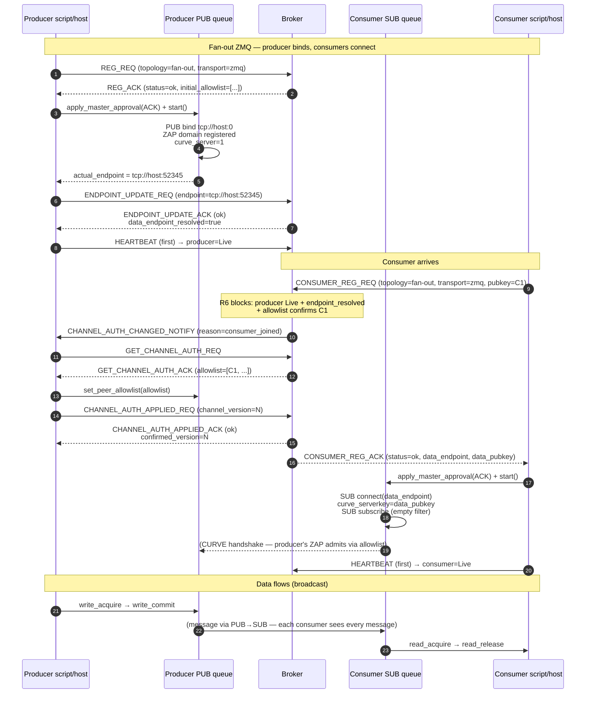
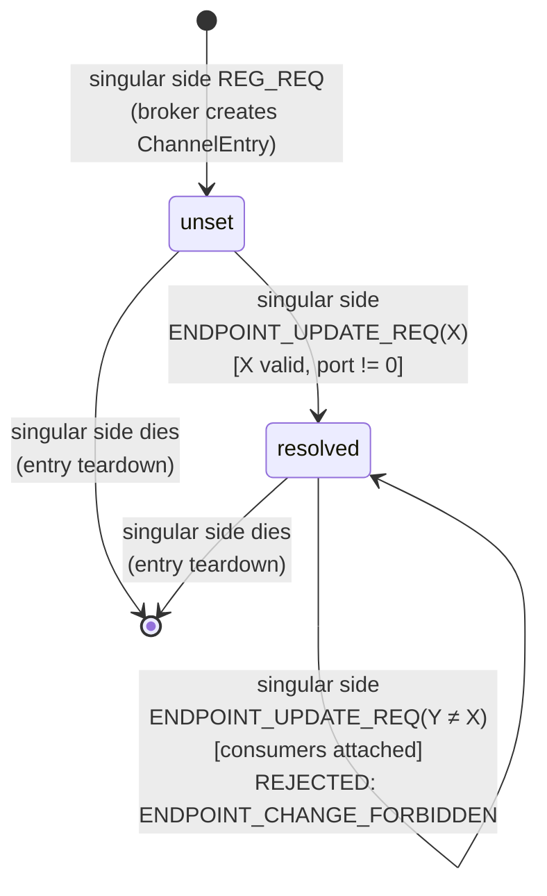
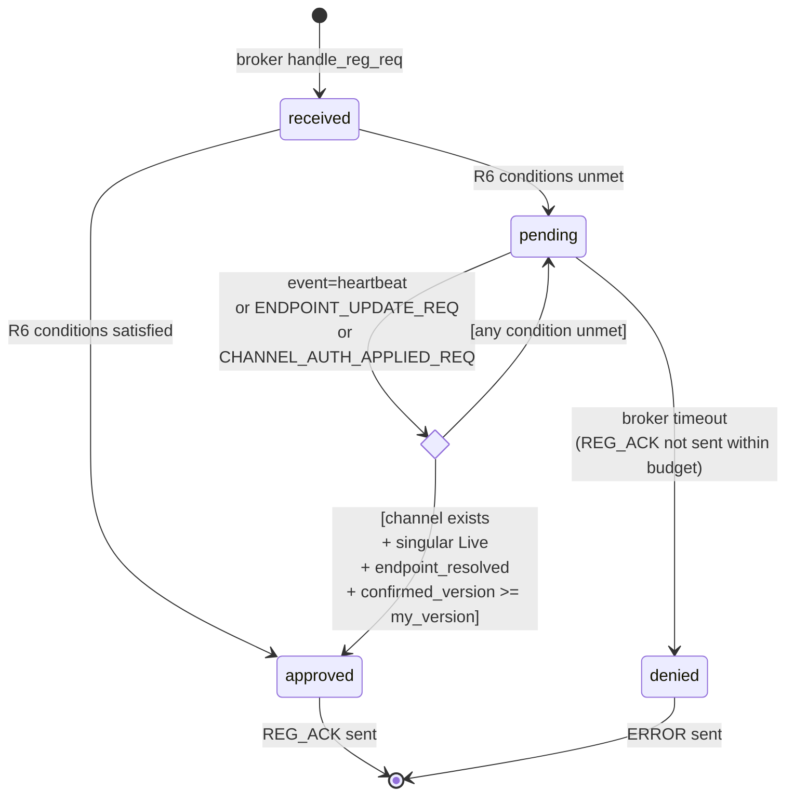

# Singular-side ownership: topology-parameterized data-plane design

## 0. Status

Draft.  Not adopted.  Awaiting user review and approval.  If approved, this
document becomes the design authority for a coordinated multi-HEP amendment
package.

The draft supersedes two recent commits that need to be re-evaluated in
light of this design:

- **`2c604280`** — HEP-CORE-0017 §3.3 multi-endpoint PULL fix.  Under this
  design, consumer's PULL binds once; the per-peer connect loop retires.
- **`9d0ca4c8`** — HEP-CORE-0021 §16 amendment as drafted.  The state
  machine and mid-life rules stay valid but reparametrize by which side of
  the topology is singular.

## 1. Executive summary (plain language)

Each data channel has exactly **one side** that is stable and singular, and
one side that is plural and dynamic.  For a channel where many producers
feed into one consumer (fan-in), the consumer is singular.  For a channel
where one producer feeds many consumers (fan-out), the producer is
singular.  The current framework mixes these — producer always binds
regardless of topology — and that mismatch is the root cause of a stack of
complexity we've been accumulating (multi-endpoint PULL, per-producer
attach coordination, N-endpoint tracking on the broker).

The design principle: **the singular side of the topology owns the
channel's data endpoint and binds; the plural side dials in.**  Everything
else — state model, wire messages, queue internals — follows from that
one fact.

Consequence: significantly less code, one fewer coordination protocol, and
a state model that generalizes to both fan-in and fan-out with the same
mechanism.

## 2. Scope

| Topology | Transport | Supported? | Singular side |
|---|---|---|---|
| Fan-in (N→1) | ZMQ | Yes | Consumer |
| Fan-in (N→1) | SHM | **No** — SHM is physically single-producer per HEP-CORE-0023 §2.1.1 | — |
| Fan-out (1→N) | ZMQ | Yes | Producer |
| Fan-out (1→N) | SHM | Yes (existing) | Producer |

**N×M topologies are explicitly out of scope.**  Every channel is either
fan-in (N producers → 1 consumer) or fan-out (1 producer → N consumers).
Under this constraint, exactly one side of any channel is singular.

## 3. Core design principle

> The channel has exactly one data-plane endpoint, owned by the singular
> side of its topology.

Consequences:

- Broker state model: one `data_endpoint` field per channel, on
  `ChannelEntry`.  Not per-producer, not per-consumer.  The owner is
  determined by topology.
- Wire simplifies: no per-producer array shape, no per-producer attach
  coordination.  Registration + heartbeat + endpoint update cover
  everything.
- Queue abstraction stays clean: role layer never sees bind/connect
  decisions.  Queue picks socket type and bind direction from topology +
  side + transport.

## 4. Broker state model

### 4.1 `ChannelEntry` — before vs after

**Before (current):**

```cpp
struct ChannelEntry {
    std::string data_transport;                 // "shm" | "zmq"
    std::string schema_hash;
    // ...
    std::vector<ProducerEntry> producers;       // per-producer records
    std::vector<ConsumerEntry> consumers;
};

struct ProducerEntry {
    // ...
    std::string zmq_node_endpoint;   // per-producer TCP endpoint (retires)
};
```

**After (this design):**

```cpp
enum class ChannelTopology { FanIn, FanOut };

struct ChannelEntry {
    ChannelTopology topology;                   // NEW — declared at creation
    std::string     transport;                  // "shm" | "zmq"
    std::string     schema_hash;
    // ...

    // Singular side's bound data-plane endpoint.
    //   Fan-In  ZMQ: consumer's PULL bind endpoint  (tcp://...)
    //   Fan-Out ZMQ: producer's PUB  bind endpoint  (tcp://...)
    //   Fan-Out SHM: producer's capability endpoint (ipc://...)
    std::string     data_endpoint;
    bool            data_endpoint_resolved{false};

    // Per-role identity + pubkey rows (needed for ZAP allowlist).
    // ProducerEntry.zmq_node_endpoint field retires.
    std::vector<ProducerEntry> producers;
    std::vector<ConsumerEntry> consumers;

    // HEP-CORE-0042 confirmed_version bookkeeping (reparametrized —
    // now scalar per channel because there's exactly one binding side
    // that applies allowlist updates).
    uint64_t channel_version{0};
    uint64_t confirmed_version{0};
};
```

### 4.2 Channel ownership

The singular side owns the channel's existence:

- **Fan-in:** consumer dies → channel dies → `CHANNEL_CLOSING_NOTIFY` fans out to all producers.
- **Fan-out:** producer dies → channel dies → `CHANNEL_CLOSING_NOTIFY` fans out to all consumers.

This generalizes HEP-CORE-0023 §2.1.1's current rule ("channel exists as
long as at least one producer-presence is alive") into the symmetric form.

## 5. Wire changes

### 5.1 `REG_REQ` / `CONSUMER_REG_REQ` — add `channel_topology`

```json
{
  "role_uid": "prod.temp01.uid12345",
  "channel_name": "lab.sensor.temp",
  "data_transport": "zmq",
  "channel_topology": "fan-in",           // NEW — one of "fan-in" | "fan-out"
  "zmq_pubkey": "...",
  "schema_hash": "...",
  ...
}
```

Broker rules:

1. First REG_REQ for a channel: broker records the declared topology on
   `ChannelEntry`.
2. Subsequent REG_REQ for same channel: `channel_topology` MUST match, else
   error `TOPOLOGY_MISMATCH`.
3. Broker validates transport × topology matrix (§2): rejects SHM+fan-in
   with `TOPOLOGY_NOT_SUPPORTED_FOR_TRANSPORT`.
4. **Channel creation now flows from whichever side arrives first with a
   matching declaration** — no longer coupled to `handle_reg_req`
   specifically.  Refactor: extract shared internal
   `create_or_join_channel(topology, transport, ...)`.

### 5.2 Plural-side REG_ACK — carry `data_endpoint` + `data_pubkey`

Plural side needs to know where and how to dial.  Its REG_ACK gains:

```json
{
  "status": "success",
  "channel_name": "lab.sensor.temp",
  ...
  "data_endpoint": "tcp://192.168.1.10:51234",    // singular side's bound endpoint
  "data_pubkey":   "...40-char Z85..."            // singular side's identity pubkey
                                                  // (curve_serverkey for the dial)
}
```

Singular-side REG_ACK stays lean — the singular side already has its own
pubkey and hasn't bound yet at ACK time.  Its endpoint is published via
`ENDPOINT_UPDATE_REQ` at S3.

### 5.3 `ENDPOINT_UPDATE_REQ` — reparametrize

The wire and handler stay as-is.  What changes: the sender is
whichever side is singular for the channel's topology.

- Fan-in ZMQ: consumer sends after PULL bind.
- Fan-out ZMQ: producer sends after PUB bind.
- Fan-out SHM: producer sends after capability socket bind (Unix socket).

The broker's handler already resolves the sender via ZMTP identity, so the
mechanism doesn't change.  What DOES change: the previously-drafted
HEP-CORE-0021 §16 amendment reparametrizes — replace "producer" with
"singular side of the channel's topology" everywhere.  State machine,
mid-life rules, R6 extension all carry over unchanged in mechanism, just
aimed at the right side.

### 5.4 R6 gate — symmetric

Today R6 blocks consumer REG_REQ until producer is Live.  Under this
design, R6 becomes symmetric:

**Plural-side REG_REQ pends iff any of:**

- Channel doesn't exist yet (singular side hasn't registered).
- Singular side's presence != Live.
- Singular side's `data_endpoint_resolved == false`.
- Singular side's `confirmed_version < this_producer_registration_version`
  (see §5.6 — allowlist propagation must complete before dial-safe).

Same mechanism (pend the REQ, re-evaluate on relevant events, ACK on
first satisfaction).  Parameterized by "plural side waits for singular
side."

### 5.5 `CHANNEL_AUTH_CHANGED_NOTIFY` — direction inverts by topology

Today: broker → producer (informs of consumer joins/leaves).

Under this design:

- **Fan-in ZMQ:** broker → consumer (informs of producer joins/leaves).
- **Fan-out ZMQ:** broker → producer (unchanged direction).
- **Fan-out SHM:** broker → producer (unchanged direction).

Mechanically: broker's NOTIFY is aimed at **whoever binds** for this
channel.

### 5.6 `GET_CHANNEL_AUTH_REQ` + `CHANNEL_AUTH_APPLIED_REQ` — direction inverts

Today: producer pulls allowlist and confirms applied.  Under this design:
whoever binds pulls and confirms.

- Fan-in ZMQ: consumer pulls consumer-side allowlist (producer pubkeys),
  applies to PULL's ZAP, confirms via APPLIED_REQ.
- Fan-out (both transports): producer pulls consumer allowlist (as today).

The `confirmed_version` versioning stays; it now tracks the **binding
side's** applied snapshot per channel.  Because there's exactly one
binding side per channel, `confirmed_version[K][P]` collapses to
`confirmed_version[K]` — a scalar per channel.

### 5.7 `CONSUMER_ATTACH_REQ_ZMQ` — retires entirely

HEP-CORE-0042 §5 + §7.1 pre-attach coordination existed because the
consumer needed confidence that producer's ZAP allowlist had consumer's
pubkey before the consumer dialed the producer.  Under Pattern A fan-in,
consumer BINDS; consumer OWNS the allowlist.  The whole coordination
collapses into the REG_REQ path:

1. Producer REG_REQ arrives → broker blocks at R6.
2. Broker fires `CHANNEL_AUTH_CHANGED_NOTIFY` → consumer.
3. Consumer pulls, applies to ZAP, sends `CHANNEL_AUTH_APPLIED_REQ`.
4. Broker's R6 wake — pending producer REG_REQs drain.
5. Producer REG_ACK carries `data_endpoint` + `data_pubkey`.
6. Producer dials.  Consumer's ZAP admits.

**No CONSUMER_ATTACH_REQ_ZMQ.**  No `attach:begin` / `attach:success` /
`attach:complete` log markers.  No pre-attach loop.  ~400 LOC of broker
code + ~500 LOC of L3 tests retire.

### 5.8 `CHANNEL_PRODUCERS_CHANGED_NOTIFY` + `GET_CHANNEL_PRODUCERS_REQ` — retire for fan-in

Under fan-in Pattern A, consumer doesn't dial producers.  It doesn't need
to be informed of producer endpoints.  Allowlist changes flow through
`CHANNEL_AUTH_CHANGED_NOTIFY`, which delivers the pubkey set the ZAP
needs.  The `CHANNEL_PRODUCERS_CHANGED_NOTIFY` chain becomes dead code
for fan-in ZMQ.  (Fan-out ZMQ has one producer, so it's moot there too.)

### 5.9 `CONSUMER_REG_ACK.producers[]` — retires for fan-in ZMQ

Under fan-in, consumer doesn't need per-producer endpoints — producers
dial in.  The per-producer array collapses to a plain success response.

For fan-out SHM, `CONSUMER_REG_ACK` continues to carry the producer's
capability endpoint + pubkey (single-producer, so a scalar `data_endpoint`
+ `data_pubkey` suffices).

For fan-out ZMQ, `CONSUMER_REG_ACK` carries the producer's PUB endpoint +
pubkey (same scalar shape).

### 5.10 `DISC_REQ` / `DISC_REQ_ACK` — simplify

Response returns transport + topology + `data_endpoint` (single string,
not array).  The pending per-producer array migration retires trivially —
there is no per-producer array anymore.

### 5.11 `DEREG_REQ` — wire unchanged; semantics parameterize

Channel-death rule generalizes: **singular side dies → channel dies**.
- Fan-in: consumer's DEREG or heartbeat-timeout → all producers get `CHANNEL_CLOSING_NOTIFY`.
- Fan-out: producer's DEREG or heartbeat-timeout → all consumers get `CHANNEL_CLOSING_NOTIFY`.

### 5.12 Retirement summary

| Wire | Retires for | Why |
|---|---|---|
| `CONSUMER_ATTACH_REQ_ZMQ` / `_ACK` (HEP-0042 §5, §7.1) | All ZMQ topologies | Coordination collapses into REG_REQ under Pattern A. |
| `CHANNEL_PRODUCERS_CHANGED_NOTIFY` | Fan-in ZMQ (moot elsewhere) | Consumer doesn't dial producers; allowlist updates suffice. |
| `GET_CHANNEL_PRODUCERS_REQ / _ACK` | Fan-in ZMQ (moot elsewhere) | Same reason. |
| Per-producer `CONSUMER_REG_ACK.producers[]` array | Fan-in ZMQ | Single `data_endpoint` replaces it. |
| Per-producer `ProducerEntry.zmq_node_endpoint` | Whole framework | Moves to `ChannelEntry.data_endpoint`. |

## 6. Queue abstraction — how it's smart

### 6.1 Factory API

The `QueueReader` / `QueueWriter` API surface (as used by scripts and role
hosts) stays exactly the same.  The factory signature changes:

```cpp
// Consumer side (reader).
std::unique_ptr<QueueReader>
Queue::create_reader(ChannelTopology topology,
                     Transport       transport,      // "zmq" | "shm"
                     RxOptions       opts);

// Producer side (writer).
std::unique_ptr<QueueWriter>
Queue::create_writer(ChannelTopology topology,
                     Transport       transport,
                     TxOptions       opts);
```

The queue picks the concrete implementation + configures it from a small
decision matrix.

### 6.2 Decision matrix

| Side | Topology | Transport | Socket type | Bind or Connect | CURVE role | Endpoint owner |
|---|---|---|---|---|---|---|
| Reader (consumer) | Fan-In  | ZMQ | PULL | **bind**    | server | self         |
| Reader (consumer) | Fan-Out | ZMQ | SUB  | connect     | client | peer         |
| Reader (consumer) | Fan-Out | SHM | (capability transport) | connect | (peer identity via crypto_box) | peer |
| Writer (producer) | Fan-In  | ZMQ | PUSH | connect     | client | peer         |
| Writer (producer) | Fan-Out | ZMQ | PUB  | **bind**    | server | self         |
| Writer (producer) | Fan-Out | SHM | DataBlock write | (creates DataBlock) | (owner of capability socket) | self |

Two facts (side + topology) uniquely determine everything below.  The
role never sees these decisions.

### 6.3 What the role provides

The role passes:

- **`side`** — implicit from the role kind (producer role or consumer role).
- **`topology`** — from config (`channel_topology: "fan-in" | "fan-out"`).
- **`transport`** — from config.
- **`endpoint_hint`** — for the binding side, may be `tcp://host:0` (ephemeral).  For the connecting side, this is retired — the endpoint comes from the ACK.

Nothing in the role code touches sockets.

### 6.4 CURVE + ZAP fit cleanly

The binding side is always CURVE server (has one identity keypair; sets
`curve_publickey` + `curve_secretkey` + `curve_server=1`, registers ZAP
domain).  The connecting side is always CURVE client (sets
`curve_serverkey = data_pubkey from ACK` + `curve_publickey` +
`curve_secretkey`).  No per-peer serverkey mutation because on the connect
side, the "peer" is the singular side — one entity.

The ZAP allowlist lives on the binding side, mutated via the
`CHANNEL_AUTH_CHANGED_NOTIFY` chain aimed at the binding side.

## 7. Producer / consumer S3 flows

### 7.1 Fan-in ZMQ — full startup sequence

```mermaid
sequenceDiagram
    autonumber
    participant CS as Consumer script/host
    participant CQ as Consumer PULL queue
    participant B  as Broker
    participant PQ as Producer PUSH queue
    participant PS as Producer script/host

    Note over CS,PS: Fan-in ZMQ — consumer binds, producers connect
    CS->>B: CONSUMER_REG_REQ (topology=fan-in, transport=zmq)
    B-->>CS: CONSUMER_REG_ACK (status=ok; no producers[] array)
    CS->>CQ: apply_master_approval(ACK) + start()
    CQ->>CQ: PULL bind tcp://host:0<br/>ZAP domain registered<br/>curve_server=1
    CQ-->>CS: actual_endpoint = tcp://host:51234
    CS->>B: ENDPOINT_UPDATE_REQ (endpoint=tcp://host:51234)
    B-->>CS: ENDPOINT_UPDATE_ACK (ok)<br/>data_endpoint_resolved=true
    CS->>B: HEARTBEAT (first) → consumer=Live

    Note over PS,B: Producer arrives (any time after or before consumer Live)
    PS->>B: REG_REQ (topology=fan-in, transport=zmq, pubkey=P1)
    Note over B: R6 blocks: needs consumer Live<br/>+ endpoint_resolved<br/>+ allowlist confirms P1
    B->>CS: CHANNEL_AUTH_CHANGED_NOTIFY (reason=producer_joined)
    CS->>B: GET_CHANNEL_AUTH_REQ
    B-->>CS: GET_CHANNEL_AUTH_ACK (allowlist=[P1, ...])
    CS->>CQ: set_peer_allowlist(allowlist)
    CS->>B: CHANNEL_AUTH_APPLIED_REQ (channel_version=N)
    B-->>CS: CHANNEL_AUTH_APPLIED_ACK (ok)<br/>confirmed_version=N
    Note over B: R6 wakes for producer REG_REQ
    B-->>PS: REG_ACK (status=ok, data_endpoint, data_pubkey)
    PS->>PQ: apply_master_approval(ACK) + start()
    PQ->>PQ: PUSH connect(data_endpoint)<br/>curve_serverkey=data_pubkey<br/>curve_client
    PQ-->>CQ: (CURVE handshake — consumer's ZAP admits via allowlist)
    PS->>B: HEARTBEAT (first) → producer=Live
    Note over PS,CS: Data flows
    PS->>PQ: write_acquire → write_commit
    PQ->>CQ: (slot bytes over PUSH→PULL)
    CQ->>CS: read_acquire → read_release
```

### 7.2 Fan-out ZMQ — full startup sequence (symmetric)



### 7.3 Fan-out SHM — unchanged from HEP-CORE-0041

The capability-transport flow (Unix socket dial → crypto_box handshake →
SCM_RIGHTS fd) is orthogonal to this design.  The only touchpoint: the
producer's capability socket is `data_endpoint` on `ChannelEntry`, and
consumer's `CONSUMER_REG_ACK` carries it as `data_endpoint` +
`data_pubkey`.  No sequence change; the wire field naming aligns with
ZMQ.

## 8. State diagrams

### 8.1 `data_endpoint_resolved` on `ChannelEntry`



### 8.2 Plural-side REG_REQ pending state (R6 extended)



## 9. Auth-door compliance (§3.5.1)

The HEP-CORE-0036 §3.5.1 principle ("no data-plane footprint before
auth") is preserved on both sides:

- **Singular side:** binds at S3 (post-REG_ACK), publishes endpoint via
  `ENDPOINT_UPDATE_REQ` BEFORE heartbeat.  Bind is the data-plane
  footprint, and it exists only after registration is approved.
- **Plural side:** connects at S3 (post-REG_ACK) using `data_endpoint` +
  `data_pubkey` from the ACK.  Connect is the data-plane footprint;
  exists only after ACK.  R6 gate ensures the ACK only arrives when the
  singular side's allowlist admits this plural-side pubkey — so the
  first CURVE handshake succeeds.

The retired pre-REG bind design (2026-06-12) stays retired.  Neither side
binds nor connects before its own REG_ACK.

## 10. Example code snippets

### 10.1 Consumer role — fan-in ZMQ (post-migration)

```cpp
// In role_api_base.cpp — consumer's setup_infrastructure_ + S3 flow
// for fan-in ZMQ topology.

// S1: build rx queue in Standby.
opts.channel_topology = ChannelTopology::FanIn;
opts.transport        = "zmq";
opts.zmq_endpoint     = cfg.in_zmq_endpoint;   // may be tcp://host:0
auto reader = Queue::create_reader(opts.channel_topology,
                                    opts.transport,
                                    std::move(opts));
// Queue picks: PULL socket + bind + CURVE server + ZAP domain.
// Standby until apply_master_approval.

// After CONSUMER_REG_REQ / _ACK round-trip:
brc.consumer_reg_req(...);   // returns CONSUMER_REG_ACK
reader->apply_master_approval(reg_ack);
// Queue transitions Standby → Configured → Active:
//   - PULL binds tcp://host:0
//   - ZAP handler registers
//   - Empty allowlist initially (deny-all)

// Publish resolved endpoint to broker.
const std::string endpoint = reader->actual_endpoint();
if (auto res = brc.send_endpoint_update(channel, "zmq_node", endpoint);
    !res.ok()) {
    LOGGER_ERROR("[{}] endpoint publish failed: {}", short_tag, res.error());
    std::exit(1);
}

// Start heartbeat.  Broker's R6 unblocks pending producer REG_REQs.
start_heartbeat_task();

// Data loop — script sees regular reader API.
while (running) {
    auto slot = reader->read_acquire(period_ms);
    if (slot) {
        script.on_consume(rx, msgs, api);
        reader->read_release();
    }
}
```

### 10.2 Producer role — fan-in ZMQ (post-migration)

```cpp
// In role_api_base.cpp — producer's setup_infrastructure_ + S3 flow
// for fan-in ZMQ topology.

// S1: build tx queue in Standby.  No endpoint hint needed — producer
// won't bind.
opts.channel_topology = ChannelTopology::FanIn;
opts.transport        = "zmq";
auto writer = Queue::create_writer(opts.channel_topology,
                                    opts.transport,
                                    std::move(opts));
// Queue picks: PUSH socket + connect + CURVE client.
// Standby until apply_master_approval.

// REG_REQ.  Broker's R6 may block until consumer's allowlist is
// synced with this pubkey.  brc.send_reg_req blocks until REG_ACK
// arrives (or the request times out at broker's REG_REQ budget).
auto reg_ack = brc.send_reg_req(channel, topology=FanIn, transport="zmq");
// reg_ack now carries data_endpoint + data_pubkey.

writer->apply_master_approval(reg_ack);
// Queue transitions Standby → Configured → Active:
//   - PUSH sets curve_serverkey = data_pubkey
//   - PUSH connects tcp://consumer_host:consumer_port
//   - Consumer's ZAP admits (pubkey already in consumer's allowlist)

// Start heartbeat + data loop.  No further coordination — CURVE
// handshake already succeeded because R6 waited for allowlist sync.
start_heartbeat_task();
while (running) {
    auto slot = writer->write_acquire(period_ms);
    if (slot) {
        script.on_produce(tx, msgs, api);
        writer->write_commit();
    }
}
```

### 10.3 Broker — REG_REQ handler for fan-in producer (post-migration)

```cpp
// In broker_service.cpp — pseudocode for the R6-gated REG_REQ path.

nlohmann::json BrokerServiceImpl::handle_reg_req(
    const nlohmann::json &req, const zmq::message_t &identity)
{
    // Standard validation (known_roles, pubkey, schema)...
    // ...

    // Extract topology + transport.
    const auto topology = parse_topology(req);       // FanIn | FanOut
    const auto transport = req.value("data_transport", "");

    // Validate transport × topology matrix.
    if (transport == "shm" && topology == FanIn)
        return make_error(corr_id, "TOPOLOGY_NOT_SUPPORTED_FOR_TRANSPORT",
                          "SHM does not support fan-in");

    // Under fan-in, producer is the PLURAL side — its REG_REQ is
    // R6-gated.  Under fan-out, producer is the singular side — its
    // REG_REQ creates the channel (or joins an existing one with a
    // matching declaration).
    auto entry = hub_state_->channel(req.value("channel_name", ""));

    if (topology == FanIn) {
        // Producer is plural.  Check R6 gate.
        if (!entry.has_value()
            || !singular_side_live_and_resolved(*entry)
            || !confirmed_version_covers(*entry, my_version)) {
            // Pend the REQ.  Broker's request-queue mechanism will
            // re-evaluate on each of the wake events (heartbeat,
            // endpoint_update, applied_req).
            pend_reg_req(identity, req, PendReason::AwaitingSingularSide);
            return {};  // No immediate reply.
        }
        // R6 satisfied.
        auto producer_id = add_producer_to_channel(*entry, req);
        auto reg_ack = build_reg_ack(entry->data_endpoint,
                                      entry->data_pubkey);
        return reg_ack;
    }

    // Under fan-out, producer is singular.  Create channel (or reject
    // if this producer is second — fan-out is 1-producer).
    if (entry.has_value() && !entry->producers.empty()) {
        return make_error(corr_id, "FAN_OUT_IS_SINGLE_PRODUCER",
                          "Channel already has a producer");
    }
    create_or_join_channel(topology, transport, req);
    auto reg_ack = build_reg_ack_singular();  // no data_endpoint yet
    return reg_ack;
}
```

## 11. File-by-file impact

### 11.1 Code changes

| File | Change | LOC estimate |
|---|---|---|
| `src/include/utils/hub_state.hpp` | Add `ChannelTopology` enum + `topology` + `data_endpoint` + `data_endpoint_resolved` fields on `ChannelEntry`; retire `ProducerEntry.zmq_node_endpoint`; simplify `confirmed_version` to scalar. | ~50 change / ~30 delete |
| `src/utils/hub/hub_state.cpp` | Adjust `add_producer`, `set_producer_zmq_node_endpoint` → `set_channel_data_endpoint`, `producer_zmq_node_endpoint` → `channel_data_endpoint`. | ~80 change |
| `src/include/utils/hub_zmq_queue.hpp` | New factory signatures: `Queue::create_reader(topology, transport, opts)` + `create_writer`.  Retire `pull_from(endpoint, key, ...)` legacy factory.  Retire `add_producer_peer` / `remove_producer_peer` / `set_producer_peers` (peer set is scalar now). | ~40 change / ~40 delete |
| `src/utils/hub/hub_zmq_queue.cpp` | Rewrite `start()` PULL branch: single-bind for fan-in, single-connect for fan-out ZMQ SUB.  Rewrite PUSH: single-connect for fan-in, single-bind for fan-out ZMQ PUB.  New socket types: `zmq::socket_type::pub`, `zmq::socket_type::sub`.  Remove multi-endpoint PULL loop from commit `2c604280`. | ~200 change / ~120 delete |
| `src/utils/service/role_api_base.cpp` | Rewire `build_rx_queue` + `build_tx_queue` for the factory.  Producer's `apply_producer_reg_ack` receives `data_endpoint` + `data_pubkey` from REG_ACK (fan-in) or none (fan-out).  Consumer's `apply_consumer_reg_ack` similar.  Retire HEP-0042 §7.1 consumer attach loop.  Add ENDPOINT_UPDATE_REQ call for singular side. | ~250 change / ~350 delete |
| `src/include/utils/role_api_base.hpp` | Options struct additions: `channel_topology`.  Remove `producer_peers` field (peer set is scalar). | ~30 change |
| `src/utils/ipc/broker_service.cpp` | Add `handle_reg_req` topology validation + R6 gating for plural-side.  Retire `handle_consumer_attach_req_zmq`.  Retire pre-attach queue draining logic.  Invert `CHANNEL_AUTH_CHANGED_NOTIFY` direction based on topology.  Retire `handle_channel_producers_changed` broadcast.  Add `create_or_join_channel(topology, transport, ...)`.  Update `CONSUMER_REG_ACK` to carry `data_endpoint` + `data_pubkey` scalar (no producers[] array for fan-in). | ~400 change / ~500 delete |
| `src/include/utils/broker_request_comm.hpp` + `.cpp` | Retire `consumer_attach_zmq` client method.  Add `send_reg_req_with_topology` (or extend existing).  `send_endpoint_update` unchanged. | ~20 change / ~80 delete |

**Estimated net code delta:** +~1070 changed, −~1120 deleted → **~50 LOC net simpler**, but architecturally much cleaner.

### 11.2 Test changes

| File | Change |
|---|---|
| `tests/test_layer4_plh_hub/test_plh_hub_role_zmq_e2e.cpp` | Flip Scenario A (single-producer) + Scenario C (multi-producer) to consumer-binds pattern.  Add `channel_topology: "fan-in"` to configs.  Retire pid-based port workaround.  Distinguisher-value protocol carries over unchanged.  Add new `ZmqE2E_FanOut_OneProducerTwoConsumers` test. |
| `tests/test_layer3_pattern4/test_pattern4_attach_coordination.cpp` | **RETIRES ENTIRELY** — HEP-0042 §5/§7.1 wire removed.  ~500 LOC deleted. |
| `tests/test_layer3_pattern4/test_pattern4_registration.cpp` | Update for R6 gate direction (producer waits for consumer under fan-in). |
| `tests/test_layer3_pattern4/test_pattern4_heartbeat.cpp` | Update for symmetric R6 waits. |
| `tests/test_layer2_service/test_zmq_queue_auth.cpp` | Update factory calls for new signature.  Add fan-out ZMQ (PUB/SUB) coverage. |
| `tests/test_layer2_service/test_broker_service.cpp` | Add topology validation tests (SHM+fan-in rejection).  Add topology mismatch test.  Add fan-in producer R6 pending/drain tests. |
| `tests/test_layer3_datahub/test_datahub_zmq_endpoint_registry.cpp` | Update — `data_endpoint` moves to ChannelEntry.  Add fan-in variant tests. |

### 11.3 Demo configs to flip

| File | Change |
|---|---|
| `share/py-demo-single-processor-zmq/producer/producer.json` | `out_zmq_bind: true → false` (fan-in default).  Add `channel_topology: "fan-in"`. |
| `share/py-demo-single-processor-zmq/consumer/consumer.json` | `in_zmq_bind: false → true`.  Add `channel_topology: "fan-in"`. |
| `share/py-demo-single-processor-zmq/processor/processor.json` | For its in-side (consumer of upstream channel): flip bind.  Add topology. |
| Other ZMQ demos | Same pattern. |

### 11.4 HEP files affected

| HEP | Sections affected | Change type |
|---|---|---|
| **HEP-CORE-0017** | §3.3, §4.6, §4.6.1 | **Major rewrite** — replace per-peer connect model with singular-binds-plural-dials model. |
| **HEP-CORE-0021** | §16 | **Reparametrize** — the previously drafted amendment stays valid conceptually; replace "producer" with "singular side" throughout. |
| **HEP-CORE-0033** | §2994 (wire catalog) + §1247 (code catalog) + ChannelEntry description | **Update** — `data_endpoint` on ChannelEntry; retirement of ATTACH_REQ family. |
| **HEP-CORE-0036** | §3.5.3, §6.4, §6.5, §6.5.1, §I7, §5.2 R6, §14 (rollout tables) | **Symmetrize** — R6 direction generalizes; NOTIFY chain direction parameterizes by topology. |
| **HEP-CORE-0042** | Entire HEP | **Narrow scope** — retire §5 dispatch + §7.1 pre-attach loop.  Preserve confirmed_version bookkeeping (now scalar).  Preserve HEP-0044 AttachProtocol reference (that's SHM, orthogonal). |
| **HEP-CORE-0023** | §2.1.1 channel-existence rule | **Generalize** — "last producer dies → channel dies" → "singular side dies → channel dies." |
| **HEP-CORE-0007** | §12 wire catalog + REG_REQ schema + CONSUMER_REG_ACK schema + error codes | **Update** — add `channel_topology` to REG_REQs; add `data_endpoint`/`data_pubkey` to plural-side ACKs; retire per-producer array; add `TOPOLOGY_MISMATCH` + `TOPOLOGY_NOT_SUPPORTED_FOR_TRANSPORT`. |

## 12. Migration ordering (phased)

The migration MUST land in phases to keep the tree green.  Each phase
should be one commit (or a small tight batch).

1. **Phase A — HEP amendments (docs only).**  Draft coordinated
   amendments for the 7 HEPs above.  Get user approval on the design
   before touching any code.
2. **Phase B — Broker state field + wire schema.**  Add
   `ChannelEntry.topology` + `data_endpoint` + `data_endpoint_resolved`
   (keep `ProducerEntry.zmq_node_endpoint` transitionally).  Add
   `channel_topology` field parsing + validation to REG_REQ handlers.
   Backward-compatible: old REG_REQs without topology default to fan-in
   (matches current L4 fan-in test intent) — safe transition.
3. **Phase C — Queue factory rewire.**  Add
   `Queue::create_reader/writer(topology, transport, opts)`.  Both
   fan-in ZMQ and fan-out ZMQ paths work under new factory.  Keep old
   factories transitionally.
4. **Phase D — R6 gate symmetrization.**  Add plural-side pending logic
   + wake events.  Redirect `CHANNEL_AUTH_CHANGED_NOTIFY` based on
   topology.
5. **Phase E — Retirements.**  Delete `handle_consumer_attach_req_zmq`,
   the pre-attach queue, `CHANNEL_PRODUCERS_CHANGED_NOTIFY`, per-producer
   endpoint tracking.  Retire `test_pattern4_attach_coordination.cpp`.
6. **Phase F — Demo + L4 flip.**  Update every ZMQ demo config to use
   fan-in explicitly with the new bind direction.  Update L4 tests.
7. **Phase G — Fan-out ZMQ implementation.**  Add PUB/SUB socket paths
   in ZmqQueue.  Add L4 test `ZmqE2E_FanOut_OneProducerTwoConsumers`.
   (Optional — may defer if not immediately needed.)
8. **Phase H — Verification.**  Full ctest sweep.  Verify HEP-0044 (SHM
   AttachProtocol) + HEP-0045 (broker observer) unaffected.  Verify
   HEP-0041 SHM fan-out unaffected.

## 13. Open sub-questions

1. **PUB/SUB "slow joiner" problem for fan-out ZMQ.**  ZMQ PUB drops
   messages sent before SUB is connected + subscribed.  Under R6 gating,
   producer becomes Live before any consumer connects, so the data loop
   could push into a void.  Three options:
   - (a) Producer's data loop starts only after first `CONSUMER_JOINED`
     notify.  Simplest, matches SHM fan-out semantics.
   - (b) Producer's `on_produce` runs but messages are discarded until a
     subscriber exists.  Native ZMQ behavior.
   - (c) XPUB/XSUB with subscription tracking.  More complex.
   - **Draft lean: (a).**
2. **Backwards-compatible default for `channel_topology`.**  A REG_REQ
   without `channel_topology` — accept as fan-in (matches current test
   intent) or reject as `INVALID_REQUEST`?  Adopting fan-in as default
   during transition minimizes churn.  Post-migration, make it required.
3. **`confirmed_version` scalar collapse timing.**  Do we collapse in
   Phase B (state field) or defer to Phase E (retirements)?  Deferring
   keeps HEP-0042 §5.4 test surface transitional.  Draft lean: **defer to
   Phase E**.
4. **Recent commits — clean revert or forward migration?**
   - Commit `2c604280` HEP-0017 §3.3 multi-endpoint PULL: forward migration
     — code stays until Phase E, then deletes as part of retirement.
   - Commit `9d0ca4c8` HEP-0021 §16 amendment: forward reparametrization
     — the doc gets rewritten in Phase A, not reverted.

## 14. What this design does NOT do

- Does not add new socket types beyond PUSH/PULL/PUB/SUB.
- Does not touch SHM (HEP-0041) — fan-out SHM already fits.
- Does not touch AttachProtocol (HEP-0044) or broker SHM observer (HEP-0045).
- Does not introduce dynamic runtime peer add/remove wire — the
  `CHANNEL_AUTH_CHANGED_NOTIFY` chain covers it via allowlist updates,
  no separate producer-endpoint-notification wire needed.
- Does not solve the DISC_REQ per-producer array migration — that goes
  away entirely (no per-producer array anymore).

## 15. Interaction with existing code

- **Recent multi-endpoint PULL work (`2c604280`)** — becomes vestigial.
  Removed in Phase E.
- **HEP-CORE-0021 §16 amendment (`9d0ca4c8`)** — rewritten in Phase A;
  mechanism preserved, parameterization changes.
- **`test_pattern4_attach_coordination.cpp`** — retires in Phase E.
- **`ZmqE2E_MultiProducer_TwoAuthorized` L4 test** — flips in Phase F.
  Configuration change (bind direction).  Distinguisher-value assertion
  transfers unchanged.
- **HEP-0041 SHM capability transport** — unaffected.  Fan-out SHM
  already fits the singular-side model.
- **HEP-0044 AttachProtocol** — unaffected.
- **HEP-0045 broker SHM observer** — unaffected.

## 16. Design rejection criteria

If any of the following surfaces during review, this design should be
rejected or reworked:

- N×M topology becomes a real deployment requirement.  This design
  assumes N→1 or 1→N only.  N×M would require a different model.
- Producer identity is expected to include its data endpoint (i.e., "the
  sensor is at IP X port Y" is a stable operator claim).  Under this
  design, producers under fan-in don't own endpoints.  This is a
  significant conceptual shift.
- Broker's per-producer bookkeeping is expected to include endpoints for
  discovery via mechanisms other than CONSUMER_REG_ACK.  Under this
  design, endpoint discovery goes through CONSUMER_REG_ACK only for
  fan-out (where the singular side has an endpoint).

## 17. Next step

If approved, the plan lands in `docs/todo/TOPOLOGY_TODO.md` as a phased
work item, and Phase A (HEP amendment drafting) begins in a subsequent
session.  Nothing here is code-committed until that phase.
