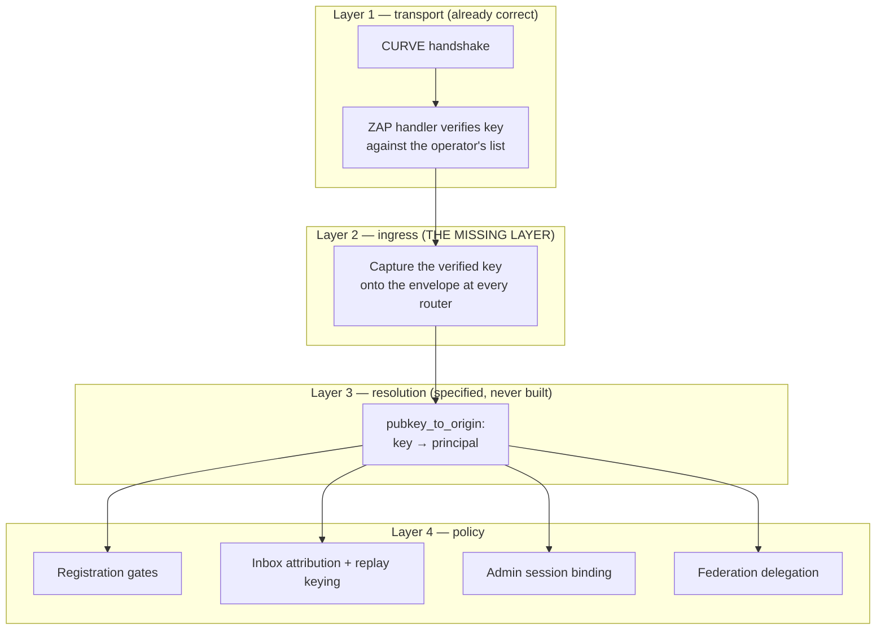

# DRAFT — Verified peer identity: closing the gap between the CURVE handshake and the admission gates

**Status:** design proposal, awaiting owner ratification. No code written.
**Scope:** the control planes that accept authenticated connections —
role registration, inbox messaging, admin console, federation ingress.
The data plane is already correct and is not modified.
**Governing docs this affects:** HEP-CORE-0035 §4.1–§4.5, HEP-CORE-0036
§6.1/§6.3/§6.6.1, HEP-CORE-0027 §3.6/§8, HEP-CORE-0046 §14.5,
HEP-CORE-0033 §11.

---

## 1. The problem in plain language

When a role connects to the hub, it proves — cryptographically — that it
holds the private key matching one of the public keys the operator put in
the vault. That proof is real and it works.

Then the role sends a registration message that says "I am
`daq.sensor.temp`, my public key is P_temp." The broker checks that claim
against the vault: is that role known, and is that the key recorded for
it? Both pass.

**What the broker never does is compare the claim against the proof.**

It knows which key opened the connection. ZeroMQ hands that key to the
application as message metadata after every successful handshake. No code
above the socket has ever read it.

The consequence: the handshake proves *you are one of the roles the
operator trusts*. The registration check proves *the name and key you
typed are a legitimate pair*. Neither proves *the pair you typed is
yours*. Any holder of any vault key can register, deregister, or
re-endpoint any other role. Other roles' public keys are not secret —
the hub distributes them by design so peers can authenticate each other.

### Why this is not one bad gate

Four different values in this system look like "who sent this," and each
plane picked a different one:

| Value | Trustworthy | Where it is used today |
|---|---|---|
| CURVE key verified by the handshake | **Yes** | Nowhere above the socket |
| Frame-0 routing id (set by the client at connect) | No | Registration treats it as a trust claim; inbox keys replay defence, sequence tracking, and application-visible attribution on it |
| Body fields `role_uid` / `zmq_pubkey` (written by the client) | No | Registration admission gates |
| Peer network address | Weak | Admin console, as an "anti-hijack fact" |

The two planes contradict each other in writing. `hub_inbox_queue.cpp`
states correctly that under CURVE the router admits by key, "not by this
self-asserted routing_id — the id is only the ACK-return address, no
longer a trust claim." The registration gate `gate_identity_match` binds
`role_uid` to that same routing id and treats the match as meaningful.
Same field, opposite meanings, one codebase.

Every plane reached for a weak proxy **because the strong one was never
carried above the socket.** That is a missing layer, not a missing check,
and it is why this proposal does not add a gate.

---

## 2. What the design already says (and what got built instead)

This is the part that determines whether the fix is a patch or a
completion. It is a completion.

**HEP-CORE-0035 §4.2 already specifies the mechanism**, under the heading
"Pubkey index — single source of truth":

```cpp
struct PubkeyOrigin
{
    enum class Kind { LocalRole, FederationPeer };
    Kind        kind;
    std::string subject_uid;     // role uid OR peer hub uid
    std::string subject_name;
};
std::unordered_map<std::string, PubkeyOrigin> pubkey_to_origin;
```

with the normative sentence: *"Both the ZAP handler (Layer 1) and the
federation-trust gate (Layer 2) read from this single index. There is
exactly one structure that answers 'what does this pubkey mean to this
hub.'"*

`PubkeyOrigin` and `pubkey_to_origin` **do not exist anywhere in the
source tree.** Neither does `federation_trust_mode` or any of the three
policy modes §4.3 defines. Layer 1 was built (the ZAP allowlist). Layer 2
was built differently — as body-claim verification — and the index that
was supposed to join them was never built.

HEP-CORE-0036 §6.3 then justified the substitution after the fact:

> "The verification model (body carries the claim; broker checks
> `known_roles`) accepts the same security property without adding a
> second identity-recovery path."

It does not accept the same security property, for the reason in §1. Its
stated objection — that deriving identity would need a reverse index —
is answered by §4.2 of the *other* HEP, which already specifies exactly
that index as the single source of truth.

And HEP-CORE-0036 contradicts itself internally. §6.6.1 rule 1 states as
fact:

> "the `caller_uid` in the request body is not self-claimed but derived
> from the CURVE-verified identity. (Same as any other broker REQ.)"

That is the property this proposal implements. One of these two sections
has to go regardless of what is decided about the code.

**Reading of the archaeology.** §4.1's Layer-2 box still describes
classification by origin ("If the pubkey matches a local known_roles
entry → local role; accept. If the pubkey matches a federation peer's hub
pubkey → apply the federation-trust policy"). That is origin-index
language. The body-claim sentences were edited in around it. The original
design was key-classification; the implementation drifted to claim-
checking; the docs were patched to match the implementation in one place
and left describing the design in another.

---

## 3. The layer model



The property that makes this a layer rather than a gate: **layer 4 never
sees a raw claim again.** A handler cannot accidentally trust the wrong
field, because the trustworthy one is the only identity on the envelope.

---

## 4. The mechanism

Four steps, each in exactly one place.

**Capture.** At every router ingress, read the verified key from the
message metadata and attach it to the `WireEnvelope` at parse time.
`WireEnvelope::parse_router_recv` already receives the raw frames and
already owns its buffers, so this is one field on an existing type. The
admin service already reads `Peer-Address` off frame 0 this way, so the
access pattern is proven in this codebase.

**Resolve.** Build `pubkey_to_origin` as HEP-0035 §4.2 specifies, at
vault load, from the same source that already produces the ZAP allowlist.
One structure answers "what does this key mean to this hub."

**Consume.** Each plane asks the resolved principal, not the wire:

- Registration: the claimed `role_uid` must equal the principal's
  `subject_uid`.
- Inbox: the sender identity handed to the application, the replay-guard
  key, and the sequence-tracking key all come from the principal.
- Admin: the session binds to the connection's verified key. Note this
  plane consumes *capture* without *resolution* — the admin plane is
  deliberately not key-gated (HEP-0033 §11: "any well-formed CURVE
  client may connect"), so an operator resolves to no index entry. That
  is precisely why capture and resolution are separate layers: a plane
  may need to know *which key* without needing to know *which
  registered subject*.
- Federation: see §5.

**Demote.** Frame-0 routing id becomes what the inbox comment already
says it is — a reply address — on every plane, with no gate reading it as
a trust claim.

### Types this composes (nothing new is invented)

| Need | Existing type | Source |
|---|---|---|
| A verified key with its mechanism | `PeerIdentity{mechanism, key}` | `security/peer_admission.hpp` |
| Key → principal | `PubkeyOrigin` | HEP-0035 §4.2, specified, to be built |
| Carrier to the handlers | `WireEnvelope` | `wire_envelope.hpp` |
| Gate context | `AdmissionContext` + callbacks | `admission_gates.hpp` |
| Vault-backed source of truth | `KnownRolesStore` | `security/known_roles.hpp` |

---

## 5. Two principal classes, so federation composes

A strict "claimed identity must equal the connection's identity" rule is
wrong as a universal, and a per-gate patch would have shipped it wrong.
There are two legitimate kinds of caller, and HEP-0035 §4.2 already names
both:

- **`LocalRole`** — a role acting for itself. Strict rule: the claim must
  resolve to this connection's key.
- **`FederationPeer`** — a peer hub relaying messages authored by roles on
  *its* side (`sender_uid` / `originator_uid` in the relay handlers). The
  carried identity belongs to someone else by design and *cannot* equal
  the connection key. What governs it is delegation policy, which
  HEP-0035 §4.3 already defines as three modes (`local_only` default,
  `peer_delegated`, `peer_announced`), none of them built.

Stating the distinction at the resolution layer means the strict rule is
written once and delegation is a declared, auditable property of a link
rather than a hole. Today federation gets its exemption by accident,
because nothing checks anything.

This also gives task #69 a defined trust model instead of an open
question — one of its blockers, resolved as a by-product rather than by a
separate design pass.

---

## 6. What this replaces, retires, or unifies

The proposal is mostly subtraction. That is the test of whether it is a
mechanism or a patch.

| # | Component | Disposition |
|---|---|---|
| 1 | `PubkeyOrigin` / `pubkey_to_origin` (HEP-0035 §4.2) | **Specified, never built** — build it; it is the centre of this design |
| 2 | `gate_identity_match` — routing id vs `role_uid` | Obsolete as a trust gate; both sides are client-chosen. Routing id keeps only its reply-address role |
| 3 | Body field `zmq_pubkey` on registration | **Redundant** once the key is derived from the connection — same value, better provenance. Retire from the wire or demote to a cross-check (decision D2) |
| 4 | Inbox `sender_id` taken from routing id | Replaced by the resolved principal — fixes attribution, replay keying, and sequence tracking in one change |
| 5 | Admin `Peer-Address` "anti-hijack fact" | Redundant — it was a proxy for the property we would now have properly |
| 6 | Three separate projections of the same vault data — `KnownRolesStore::as_peer_allowlist`, the broker's inline loop building `BrokerCtrlAdmission`'s list, and the linear scan in `lookup_known_role` | Collapse to one index that yields both the allowlist and the origin map. The linear scan per registration also disappears |
| 7 | HEP-0036 §6.3 "why body fields and not a User-Id recovery" | Obsolete rationale — replace with the layered model |
| 8 | HEP-0035 §4.1 Layer-2 box | Restore to origin-based language; the body-claim edits are the drift |
| 9 | `federation_trust_mode` + §4.3 modes | Specified, never built — this design is their prerequisite |
| 10 | `role_identity_policy.hpp` filename | Residue from the deleted string gate; already has an in-file rename note |

Items 2, 3, 4, 5, 6 are live code that gets simpler. Items 1 and 9 are
design debt that gets paid. Items 7 and 8 are documentation that is
currently wrong in a way that misleads security work.

---

## 7. Conflicts found in the existing HEP corpus

| Conflict | Detail | Resolution |
|---|---|---|
| HEP-0036 §6.3 vs §6.6.1 | One says body-claim verification is equivalent; the other says caller identity *is* derived from the verified handshake, "same as any other broker REQ" | §6.6.1 is correct and becomes the general rule; §6.3's rationale paragraph is deleted |
| HEP-0035 §4.1 vs §4.2 | The Layer-2 box describes body-claim checking; §4.2 describes an origin index read by Layer 2 | §4.2 is the design; §4.1's box is restored |
| HEP-0035 §4.2 vs shipped code | Index specified as "single source of truth," never built; three ad-hoc projections exist instead | Build the index; retire the projections |
| HEP-0027 vs registration plane | Inbox documents routing id as "no longer a trust claim" while using it for replay keying and attribution; registration treats it as a trust claim | One meaning: reply address. Identity comes from the principal |
| HEP-0035 §4.3 vs federation code | Three trust modes defined; none exist; relay accepts third-party identities unconditionally | Modes become implementable once origin classification exists |

No conflict was found between this design and HEP-0041/0044 (SHM attach),
HEP-0042 (channel attach), or HEP-0043 (security subsystem). The data
plane authenticates by key directly and carries no identity claims — it
is already the model this proposal brings to the control planes.

---

## 8. Open decisions for the owner

- **D1 — resolution strategy.** Reverse index (HEP-0035 §4.2 as
  specified) versus claim-and-compare. Analysis in §9.
- **D2 — the `zmq_pubkey` wire field. ✅ DECIDED 2026-07-27: keep it.**
  The registration request stays explicit about the key it believes it
  is using, and the broker checks that belief against the key the
  connection actually authenticated with. The field is not load-bearing
  for security — the connection is — but an explicit request is easier
  to read and the mismatch it catches produces a precise diagnostic
  instead of a generic identity rejection.
- **D3 — reject-code taxonomy.** With D2 decided, two distinct failures
  are now separately detectable, and each has a different owner and a
  different fix. See §9.1.
- **D4 — scope of the first landing.** All three control planes at once,
  or registration first? A half-landing leaves the inbox trusting a
  self-asserted sender, which is hard to document honestly.

---

## 9. D1 — reverse index versus claim-and-compare

**Claim-and-compare:** on a registration, look up `known_roles[claimed_uid]`
(already done today) and additionally require the stored key to equal the
connection's verified key.

**Reverse index:** build key → principal once at vault load; every plane
resolves the connection's key to a principal and uses that.

| | Claim-and-compare | Reverse index |
|---|---|---|
| Registration plane | Works | Works |
| Inbox plane | **Cannot work** — an inbox frame carries no claimed uid, so there is nothing to compare against; the sender's identity has to be *derived* | Works — derivation is what the index does |
| Federation classification | **Cannot work** — "is this connection a peer hub or a role?" is a property of the key, not of any claim | Works — it is the `Kind` field |
| Admin plane | Partial — needs an operator identity that today does not exist as a claim | Works |
| Matches the design of record | No — HEP-0035 §4.2 specifies the index | Yes |
| Cost | One comparison per registration | One map built at vault load; one lookup per message |
| Number of mechanisms | Two (compare here, something else for the inbox) | One |

The decisive point is not cost, it is coverage: claim-and-compare cannot
serve the two planes that have no claim to compare — inbox attribution
and federation classification. Choosing it would fix registration and
leave the inbox needing a second, different mechanism, which recreates
the per-plane divergence this proposal exists to remove.

**Recommendation: reverse index**, because it is the specified design, it
is the only option that covers all four planes with one mechanism, and it
is the prerequisite for the federation trust modes that are already
written down.

---

### 9.1 D3 — two failures, two owners, two codes

Because D2 keeps the announced key on the request, three facts meet at
the gate, and comparing them pairwise separates two genuinely different
problems.

The three facts:

- **K** — the key this connection actually authenticated with. Proven.
- **U**, **P** — the role uid and key the request announces. Claims.
- **S** — the role the hub's known-roles list says key K belongs to.

Two checks, each with a distinct meaning:

| Check | Fails when | What it means | Who fixes it |
|---|---|---|---|
| `U == S` | A caller authenticated as one role and registered as another | Impersonation, or a role deployment whose identity file and uid belong to different roles | Whoever deployed the role |
| `P == K` | The request announces a key that is not the one the connection is using | The role's own belief about its identity is internally inconsistent — announcement and key file disagree | Whoever configured the role |

**No new reject codes are needed, and neither existing code changes
meaning:**

- `IDENTITY_MISMATCH` already exists and already means "you are not who
  you claim." It currently guards the routing-id comparison, which this
  design retires; the code survives its gate and takes the `U == S`
  check, which is what it always should have guarded.
- `PUBKEY_MISMATCH` keeps the `P == K` check — an announced key that
  disagrees with the key in use. This is close to its present-day
  wording and stays actionable.

Note what disappears: the current gate compares the *announced* key
against the hub's stored entry for the *announced* uid — two claims
checked against a list, with the live connection ignored. Under this
design every comparison has the proven key on one side.

## 10. Implementation sequence (after ratification)

Each slice is independently testable and leaves the tree green.

1. **Index.** Build `pubkey_to_origin` from the vault at load; collapse
   the three existing projections onto it. No behaviour change yet —
   pure consolidation, provable by existing tests.
2. **Capture.** Carry the verified key on `WireEnvelope` at every router
   ingress. Still no enforcement; add observability so a mismatch is
   *visible* in logs before it is fatal.
3. **Registration enforcement.** Resolve, compare, reject. Retire
   `gate_identity_match` as a trust gate.
4. **Inbox.** Principal replaces routing id for attribution, replay
   keying, and sequence tracking.
5. **Admin.** Session binds to the principal; retire the peer-address
   proxy.
6. **Federation.** Origin classification + the §4.3 modes — lands with
   task #69 rather than before it.

Slice 2 deliberately lands observation before enforcement: it turns "does
anything in this system legitimately speak for another identity?" from a
question into log evidence, before any rejection can break a real
deployment.

### Test-harness consequence

`BrokerWireClient` carries a field documented as *"the role_uid this wire
client masquerades as."* Masquerading is precisely what this change makes
impossible. Every such test needs a real provisioned key per identity —
which is exactly what task #66 already asks for. The two merge: the
security fix makes the test anti-pattern structurally unavailable rather
than merely discouraged.

---

## 11. Invariants this design establishes

- **I-IDENTITY-FROM-HANDSHAKE.** Every identity a control-plane handler
  acts on is derived from the connection's verified CURVE key, never from
  a wire field or routing id.
- **I-ONE-ORIGIN-INDEX.** Exactly one structure answers "what does this
  key mean to this hub," and both the ZAP handler and the admission gates
  read it.
- **I-ROUTING-ID-IS-AN-ADDRESS.** The frame-0 routing id is a reply
  address on every plane. No gate may read it as a trust claim.
- **I-DELEGATION-IS-DECLARED.** An identity that differs from the
  connection's principal is accepted only across a link explicitly
  classified as a federation peer, under a declared trust mode.
