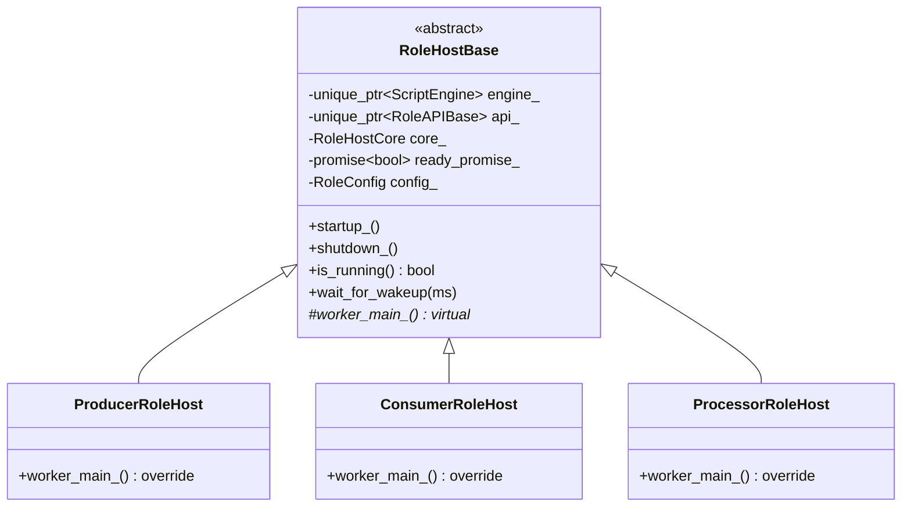
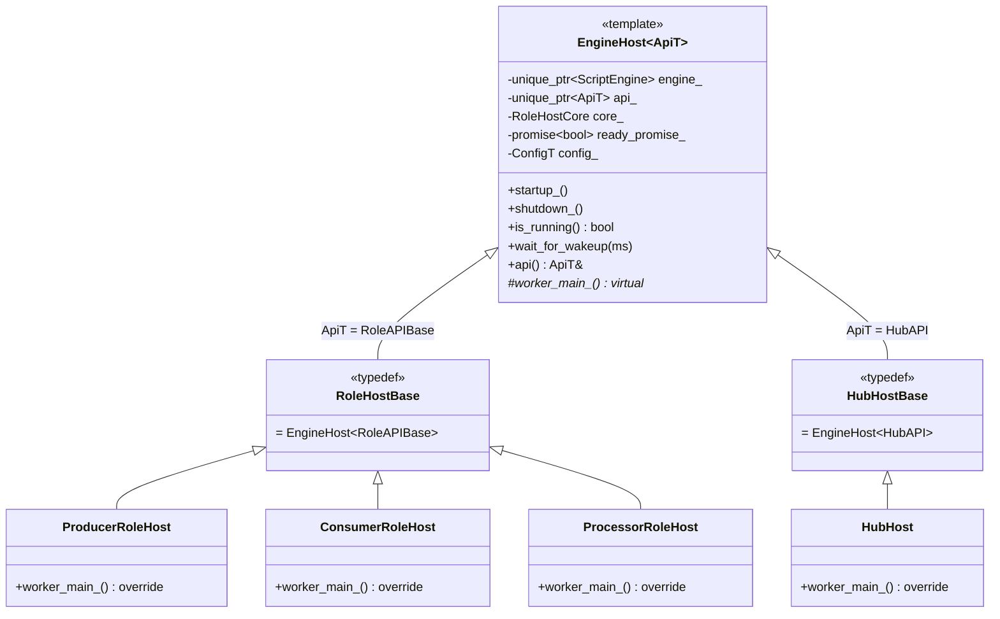
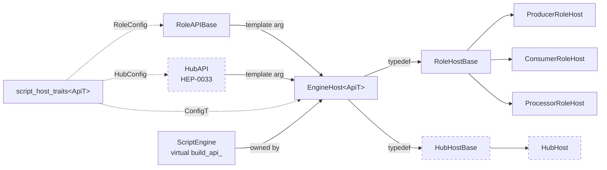
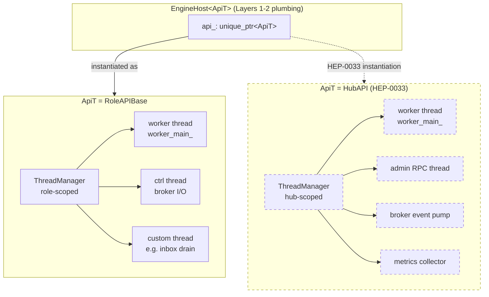
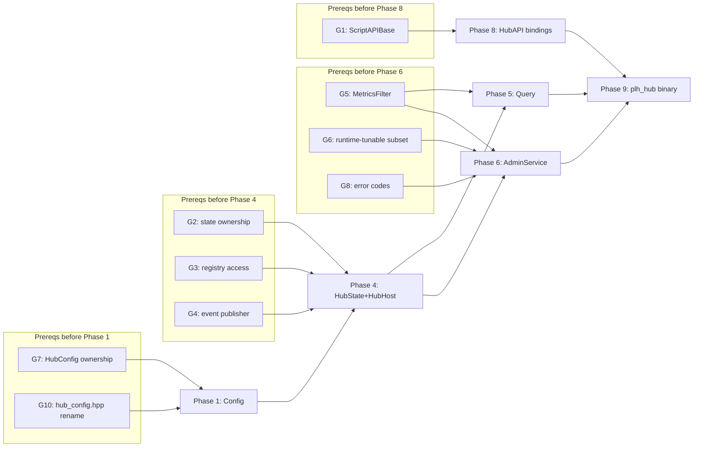

# HEP-CORE-0033 Hub Character — Prerequisites / Gap Analysis

**Status**: 🔵 Design reference (no code yet).
**Created**: 2026-04-21.
**Purpose**: Catalog gaps, conflicts, and open spec items that must be
resolved before HEP-CORE-0033 implementation phases can begin. Each gap has
a sequencing note (which HEP-0033 phase it blocks) so prerequisite work can
be batched.
**Companion to**: `docs/HEP/HEP-CORE-0033-Hub-Character.md`.
**Lifecycle**: Items here are absorbed back into HEP-0033 (inline decisions)
or into specific sub-HEPs as they resolve. Document archives once empty.

---

## 1. Confirmed non-gaps

These were suspected gaps but verified against code:

- **`ScriptEngine::has_callback(name)` + `invoke(name[, args])`** are generic
  — arbitrary callback names (`on_role_registered`, `on_channel_opened`, …)
  work without engine modification. No change needed for callback-name
  dispatch.
- **`HubVault` already stores the admin token** (see
  `src/include/utils/hub_vault.hpp:89` — `admin_token()` accessor;
  `create()` generates a 64-char hex token alongside the broker keypair).
  No vault extension needed.

---

## 2. HIGH-priority prerequisites (block implementation)

### G1. Host + Engine — prepare for both role and hub in one template

**Discussion 2026-04-23 supersedes the earlier ScriptAPIBase framing.**
The earlier plan proposed a common `ScriptAPIBase` from which both
`RoleAPIBase` and `HubAPI` would inherit.  Analysis showed that the
right layer for unification is **not** the API class — it's the **host**
class.

#### Current shape (role side)



Three-layer loop structure:
- **Layer 1** — `run_role_main_loop<Host>(g_shutdown, host, tag)` in
  `role_main_helpers.hpp` — shutdown watchdog on main thread.  Already
  a template on `Host`; any class with `is_running()` +
  `wait_for_wakeup(int)` plugs in.  Shared trivially with any future
  host kind (hub included).  No change needed.
- **Layer 2** — `virtual worker_main_()` on `RoleHostBase`, overridden
  per role — orchestrates schema resolve → engine startup → on_init
  → broker register → ready_promise → data loop → on_stop → teardown.
  Worker-thread entry point.
- **Layer 3** — `run_data_loop<Ops>(api, core, cfg, ops)` in
  `data_loop.hpp` + three `CycleOps` strategies
  (`ProducerCycleOps`/`ConsumerCycleOps`/`ProcessorCycleOps`).  The
  actual per-iteration produce/consume/process body.  Already a
  template parameterized on `CycleOps`.  **Used only by role
  worker_main_()'s; hub does not use Layer 3 at all** — hub's
  "iteration body" is admin RPC dispatch + broker event dispatch,
  not slot-based data flow.

Sequence of control across layers:

```mermaid
sequenceDiagram
    participant M as main thread
    participant W as worker thread
    participant L1 as run_role_main_loop&lt;Host&gt;
    participant L2 as host.worker_main_()
    participant L3 as run_data_loop&lt;Ops&gt;

    M->>L1: invoke with host
    L1->>M: wait_for_wakeup / check is_running
    Note over W,L2: worker spawned by host.startup_()
    W->>L2: schema resolve
    W->>L2: engine startup + on_init
    W->>L2: broker register + ready_promise
    L2->>L3: run_data_loop(ops)
    loop per iteration
        L3->>L3: invoke_produce / _consume / _process
    end
    L3-->>L2: loop exit (shutdown or critical)
    W->>L2: on_stop + teardown
    L1-->>M: exit on shutdown or host.is_running() false
```

#### Where the hub diverges

The hub reuses Layers 1 and 2 structurally (shutdown watchdog,
worker-thread lifecycle, engine ownership, ready_promise, signal
handler wiring, LifecycleGuard interplay) but replaces Layer 3 with
its own loop body (admin socket poller + broker event pump + script
callbacks).

So the unification target is the **Layer 1-2 plumbing** (owned today
by `RoleHostBase`), generalized over the API class type.

#### The refactor: promote `RoleHostBase` → `template <typename ApiT> EngineHost<ApiT>`

```cpp
template <typename ApiT>
class EngineHost {
    // Everything RoleHostBase does today — retyped.
    std::unique_ptr<ScriptEngine>  engine_;
    RoleHostCore                   core_;
    std::unique_ptr<ApiT>          api_;        // was: RoleAPIBase *
    std::promise<bool>             ready_promise_;
    // config member — see note below on traits

    bool is_running() const noexcept { return core_.is_running(); }
    void wait_for_wakeup(int ms)    { core_.wait_for_incoming(ms); }
    ApiT &api() noexcept            { return *api_; }

    bool startup_()
    {
        api_ = std::make_unique<ApiT>(core_, role_tag_, uid_);
        api_->thread_manager().spawn("worker",
                                      [this] { worker_main_(); });
        return ready_promise_.get_future().get();
    }

    virtual void worker_main_() = 0;   // derived provides body
};

// Role side — existing names stay.
using RoleHostBase = EngineHost<RoleAPIBase>;
class ProducerRoleHost  : public RoleHostBase { void worker_main_() override; };
class ConsumerRoleHost  : public RoleHostBase { ... };
class ProcessorRoleHost : public RoleHostBase { ... };

// Hub side — HEP-0033 drops in.
using HubHostBase = EngineHost<HubAPI>;
class HubHost : public HubHostBase { void worker_main_() override; };
```

**Two template instantiations total** (`EngineHost<RoleAPIBase>` and
`EngineHost<HubAPI>`).  The producer/consumer/processor distinction is
NOT a template parameter — it remains a virtual `worker_main_()` override
within `EngineHost<RoleAPIBase>`.

Class hierarchy after the refactor:



Dependency graph (template parameter flow):



Dashed nodes indicate HEP-0033-phase-8 additions.  All other boxes
exist today (after the refactor) and are source-compatible via the
`RoleHostBase` typedef.

#### ThreadManager placement

`ThreadManager` is owned by the **API class**, not the host.
`RoleAPIBase` currently holds a `ThreadManager` member; `RoleHostBase`
spawns its worker via `api_->thread_manager().spawn(...)`.  This pattern
survives the refactor uniformly:

- Base template calls `api_->thread_manager().spawn(...)` — works for
  any `ApiT` that satisfies the "provides `thread_manager()`" contract.
- HEP-0033 `HubAPI` must also own a `ThreadManager` member and expose
  `thread_manager()` (~5 LOC in the class body).
- Any extra threads a host needs (role-side custom threads, or hub-side
  admin/event/metrics threads) are spawned from inside `worker_main_()`
  via `api().thread_manager().spawn(...)`.  Bounded-join on shutdown is
  uniform — `api_.reset()` → `ApiT::~ApiT()` → `ThreadManager::~ThreadManager()`
  → joins every spawned thread.

So the template base **delegates ThreadManager access through ApiT**
but does not itself own the ThreadManager.  Adding new thread kinds
(per hub feature) is a per-instantiation choice, not a template change.

ThreadManager ownership + lifecycle:



On `api_.reset()` during shutdown, `ApiT::~ApiT()` runs which in turn
destroys its `ThreadManager`.  The destructor bounded-joins every
thread spawned under that manager — whether it's the primary worker,
the ctrl thread, or any extra hub-side pumps.  Shutdown semantics are
uniform regardless of how many threads the concrete host spawned.

#### Config parameterization

`RoleHostBase` today holds a `config::RoleConfig` member.  The hub needs
a `config::HubConfig`.  Options:

- **(a)** Two-parameter template `EngineHost<ApiT, ConfigT>`.  Cluttered.
- **(b)** Traits specialisation:
  ```cpp
  template <typename ApiT> struct script_host_traits;
  template <> struct script_host_traits<RoleAPIBase>
      { using ConfigT = config::RoleConfig; };
  template <> struct script_host_traits<HubAPI>
      { using ConfigT = config::HubConfig; };
  ```
  `EngineHost<ApiT>` uses `typename script_host_traits<ApiT>::ConfigT`
  internally.  Single-parameter from caller's view.
- **(c)** Config not a member of `EngineHost` — passed into `startup_()`
  or stored in `ApiT`.  Messier; breaks current `host.config()` accessor.

**Recommendation**: (b).  Standard C++ idiom, preserves single-parameter
instantiation, scales cleanly if a third host kind ever appears.

#### Engine contract

Each concrete engine gets a sibling virtual overload:

```cpp
class ScriptEngine {
    virtual bool build_api_(RoleAPIBase &) = 0;       // existing
    virtual bool build_api_(HubAPI &) { return false; }  // new default
    // All other virtuals unchanged.
};
```

`LuaEngine`/`PythonEngine`/`NativeEngine` continue implementing
`build_api_(RoleAPIBase &)` as today.  Each adds `build_api_(HubAPI &)`
when HEP-0033 Phase 8 (HubAPI bindings) lands; until then the base
default (no-op returning false) is used, and no code path reaches it
because nothing instantiates `EngineHost<HubAPI>` yet.

**No pImpl change needed.**  ScriptEngine's data members stay as-is;
the two typed overloads are a vtable addition tracked by the
`script_engine` axis in HEP-CORE-0032 `ComponentVersions`.

#### Refactor scope — outer shell only

**Touched**:
- `RoleHostBase` class becomes `template EngineHost<ApiT>`.  Promoted
  to a header-resident template with explicit instantiation for
  `RoleAPIBase`.
- `script_host_traits<ApiT>` introduced with role-side specialisation.
- `ScriptEngine::build_api_(HubAPI &)` sibling virtual added with
  no-op default body.
- `using RoleHostBase = EngineHost<RoleAPIBase>;` keeps source-level
  compatibility for the three role host derived classes.

**Not touched**:
- Producer/Consumer/Processor subclass bodies.
- `worker_main_()` implementations in role hosts.
- `run_role_main_loop` (already a template).
- `run_data_loop<Ops>` + the three `CycleOps` classes (already
  template-parameterized; used only by role worker_main_()'s).
- `RoleAPIBase` public API methods.
- `RoleHostCore`.
- Engine internals (LuaState, pybind11 bindings, FFI cdef registry,
  msgpack frame handling).
- `invoke_produce`/`invoke_consume`/`invoke_process`/`invoke_on_inbox`
  paths.
- Slot management, flexzone, schema, queue, broker protocol, SHM,
  ZMQ wire.

**Semantic neutrality claim**: all existing tests pass unchanged.  The
refactor is a behavior-preserving restructuring of host ownership.

**Estimated LOC delta**: ~100 LOC changed, ~30 LOC net reduction
(removes `RoleAPIBase *` + accessor duplication, adds trait
specialisation + typed template body).

**Runtime cost**: zero on hot path.  `engine_->invoke_produce(...)`
still virtual through `ScriptEngine` vtable.  API accesses
(`api_->something()`) are direct non-virtual calls, identical to
today after `-O2` inlining.

#### Sequencing vs HEP-0033

**Do the refactor now**, before HEP-0033 Phase 1 begins.  Reasons:

1. **Behavior-neutral**: standalone commit, tests pass unchanged,
   reviewable in isolation.
2. **Unblocks HEP-0033 Phase 6 (HubHost)**: collapses that phase from
   "copy-adapt RoleHostBase into a parallel HubHostBase hierarchy
   (~300 LOC)" to "instantiate the existing template + write
   hub-specific worker_main_() override (~50 LOC)".
3. **Cleaner merge story**: HEP-0033 commits become purely additive
   (new Hub* classes, new engine overloads) rather than "new hub code
   + simultaneous role-code refactor".
4. **Rollback safety**: if the refactor uncovers an unforeseen issue,
   it reverts independently from any HEP-0033 work.

**Blocks**: none — this IS the unblocker for HEP-0033 Phase 6, 8.

**Recommendation**: land as its own commit (or small commit series)
before starting HEP-0033 Phase 1.

### G2. `BrokerService` / `HubState` integration model
Today `BrokerService` privately owns `metrics_store_`, `ChannelRegistry`,
`BandRegistry`, federation peer map. HEP-0033 §8 says `HubState` aggregates
these. Three implementation patterns:
- (a) **Refactor (move)**: maps move out of `BrokerService` into `HubState`;
      `BrokerService` gets a `HubState *` and writes directly.
- (b) **Wrap (reference)**: `HubState` is a view; references broker-internal
      maps. Simpler but couples lifetime + locking.
- (c) **Mirror (sync)**: `BrokerService` keeps its maps; `HubState` holds
      copies updated via events. Doubled state + update paths.

**Blocks**: HEP-0033 Phase 4 (HubState + HubHost).
**Recommendation**: (a) — one source of truth, no duplication, mirrors how
`RoleHostCore` absorbed state from per-role mains. Requires G3/G4 decisions
to follow.

### G3. `ChannelRegistry` / `BandRegistry` are private-to-broker
`src/utils/ipc/channel_registry.hpp` and `band_registry.hpp` are internal
headers (inside `src/utils/ipc/`, not under `src/include/utils/`). HEP-0033
needs external access for `HubState`. Resolved by G2:
- If G2=(a): registries are **absorbed** into `HubState` public types.
- If G2=(b)/(c): registries get **promoted** to public headers with
  accessor APIs.

**Blocks**: HEP-0033 Phase 4.

### G4. `BrokerService` event-publisher interface
HEP-0033 §12.3 says "BrokerService gains internal callbacks that push events
into HubHost". Today there are ad-hoc `on_channel_closed` / `on_consumer_closed`
hooks for federation + band cleanup. Need a first-class publisher:
- Add/remove-listener pattern (BrokerService knows N listeners).
- Direct `HubState *` handle (simplest if G2=(a)).
- Typed event struct + single dispatcher callback.

**Blocks**: HEP-0033 Phase 4.
**Recommendation**: collapses into G2=(a) — `BrokerService` holds
`HubState *` and writes state+events directly; `HubState` in turn fans out
to script callbacks via its own event notifier.

---

## 3. MEDIUM-priority spec gaps in HEP-0033

### G5. `MetricsFilter` schema is not concretely defined
HEP §9.3 lists filter dimensions (role uids, channels, bands, peers, category
tags: `"channel"`, `"role"`, `"band"`, `"peer"`, `"broker"`, `"shm"`, `"all"`)
but not the C++ struct or JSON wire shape for the admin RPC.

**Blocks**: HEP-0033 Phase 5 (query engine) and Phase 6 (AdminService).

### G6. `reload_config` runtime-tunable subset unspecified
`reload_config` admin method is listed (§10.2) but most config fields can't
change at runtime (endpoints, auth keyfile). Need an explicit
runtime-tunable whitelist: heartbeat timeouts, known_roles,
default_channel_policy, state retention — tunable. Endpoints, vault, admin
port — not.

**Blocks**: HEP-0033 Phase 6.

### G7. HubConfig — lifecycle module vs main-owned object
HEP-0033 §4 lifecycle ordering list includes `HubConfig` as a module. §6.1
shows it as a plain class with `load()` / `load_from_directory()` factories
(parallel to `RoleConfig`, which is main-owned, not a lifecycle module).

**Blocks**: HEP-0033 Phase 1 (Config) and §4 is internally inconsistent.
**Recommendation**: main-owned, parallel to `RoleConfig`. Update HEP §4.

### G8. Admin RPC error code catalog
§10.2 shows `{status, error: {code, message}}` response shape but no
enumerated code list. Need: `unauthorized`, `unknown_method`, `invalid_params`,
`not_found`, `conflict`, `internal`, `script_error`, `policy_rejected` (for
veto-hook refusal).

**Blocks**: HEP-0033 Phase 6.

---

## 4. LOW-priority ripple effects

### G9. `HubConfig` strict key whitelist verification
HEP §6.3 mandates strict-whitelist parsing. Since we're creating a new
`HubConfig` composite, built in from the start — not a gap in design, just
a reminder at Phase 1.

### G10. Rename `src/include/utils/config/hub_config.hpp` → `hub_ref_config.hpp`
Existing file is role-facing (`in_hub_dir`/`out_hub_dir`). Frees the
`HubConfig` name for hub-side composite. Rename affects every role `#include`
— mechanical `sed` with CMake rebuild. Land with Phase 1.

### G11. `--init` template content
`HubDirectory::init_directory()` needs actual `hub.json` template text
(probably inline C++ raw string). Flag for Phase 3.

### G12. L4 test infrastructure for hub
`tests/test_layer4_plh_hub/` dir paralleling `test_layer4_plh_role/`. Reuses
the fixture patterns; needs its own `plh_hub_fixture.h`. Flag for Phase 9.

### G13. Script tick cadence storage location
Where to put `tick_interval_ms`:
- (a) Extend `ScriptConfig` with optional field — roles ignore it.
- (b) Add new `HubScriptConfig` wrapping `ScriptConfig` + `tick_interval_ms`.

**Recommendation**: (b) — hub-only concern; keeps `ScriptConfig` clean for
roles.

---

## 5. Sequencing — what must land before which HEP-0033 phase



Independent groups can land in parallel; ordering within a group matches
HEP-0033 §14.

---

## 6. Suggested strategy

Three paths forward, ordered by how much up-front design they require:

1. **Batch all prereqs, then implement HEP-0033 straight through.**
   Resolve G1–G13 in a single design pass (amend HEP-0033 inline), then
   start Phase 1. Lowest total risk; slowest start.

2. **Resolve per-phase-group, implement incrementally.**
   Resolve G7/G10 → Phase 1; resolve G2/G3/G4 → Phase 4; etc. Code and
   design alternate. Fastest progress start; risks drift if early decisions
   conflict with later ones.

3. **Resolve HIGH prereqs only, defer MEDIUM/LOW until their phase.**
   Settle G1–G4 up front (they're entangled). Defer G5–G13 — they're
   lower-stakes and can be decided close to the phase that needs them.
   Balanced; my lean.

---

## 7. Open meta-question

**Does HEP-0033 need to change direction** anywhere given these gaps? My
current read: no — the gaps are implementation-shape decisions within the
HEP's existing design envelope. None of them require re-opening Q1–Q5.

If during resolution of G1–G8 something forces a change in the HEP's
ratified design, that gets flagged for user review before amendment.
