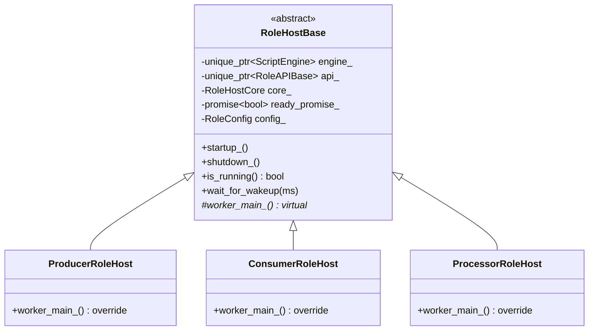
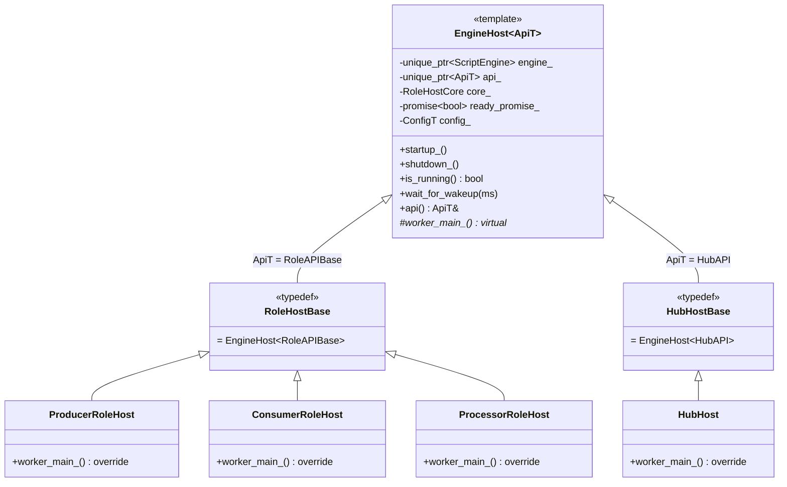
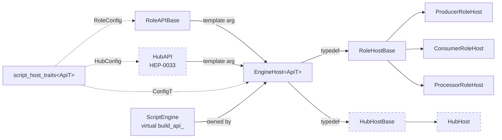
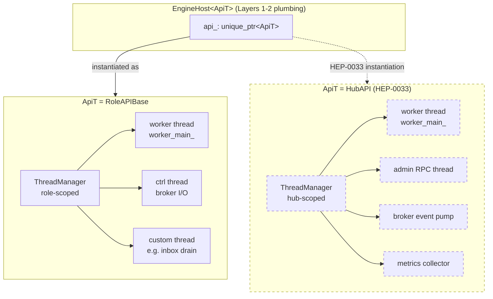
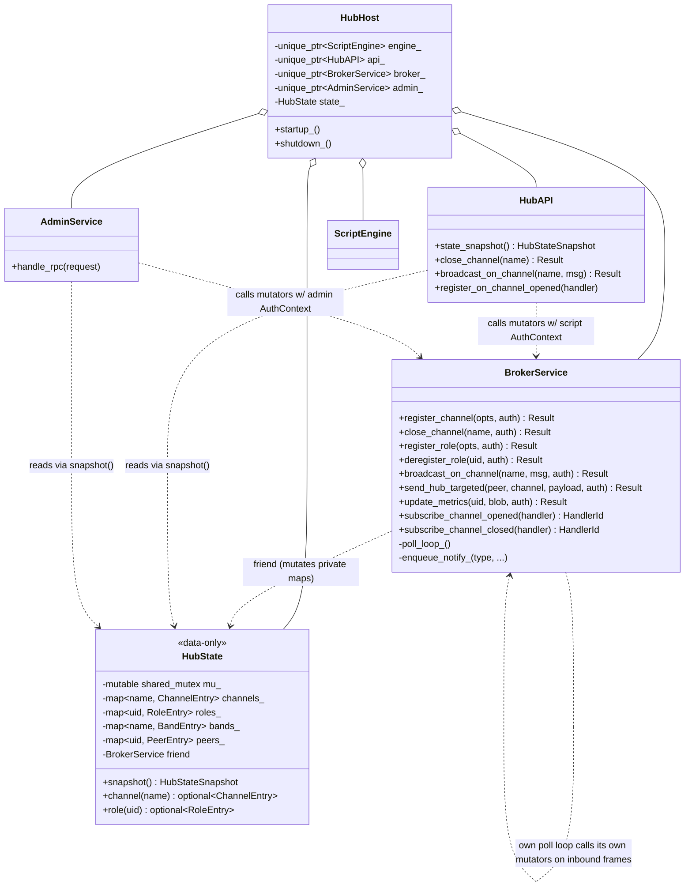
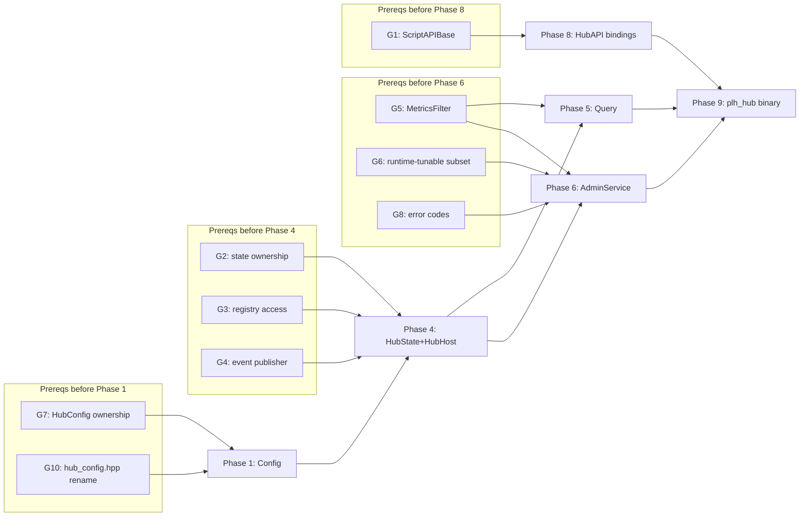

# HEP-CORE-0033 Hub Character — Prerequisites / Gap Analysis

**Status**: 🔵 Design reference (no code yet).
**Created**: 2026-04-21.
**Purpose**: Catalog gaps, conflicts, and open spec items that must be
resolved before HEP-CORE-0033 implementation phases can begin. Each gap has
a sequencing note (which HEP-0033 phase it blocks) so prerequisite work can
be batched.
**Companion to**: `docs/HEP/HEP-CORE-0033-Hub-Character.md`.
**Lifecycle**: Items here are absorbed back into HEP-0033 (inline decisions)
or into specific sub-HEPs as they resolve. Document archives once empty.

---

## 1. Confirmed non-gaps

These were suspected gaps but verified against code:

- **`ScriptEngine::has_callback(name)` + `invoke(name[, args])`** are generic
  — arbitrary callback names (`on_role_registered`, `on_channel_opened`, …)
  work without engine modification. No change needed for callback-name
  dispatch.
- **`HubVault` already stores the admin token** (see
  `src/include/utils/hub_vault.hpp:89` — `admin_token()` accessor;
  `create()` generates a 64-char hex token alongside the broker keypair).
  No vault extension needed.

---

## 2. HIGH-priority prerequisites (block implementation)

### G1. Host + Engine — prepare for both role and hub in one template

**Discussion 2026-04-23 supersedes the earlier ScriptAPIBase framing.**
The earlier plan proposed a common `ScriptAPIBase` from which both
`RoleAPIBase` and `HubAPI` would inherit.  Analysis showed that the
right layer for unification is **not** the API class — it's the **host**
class.

#### Current shape (role side)



Three-layer loop structure:
- **Layer 1** — `run_role_main_loop<Host>(g_shutdown, host, tag)` in
  `role_main_helpers.hpp` — shutdown watchdog on main thread.  Already
  a template on `Host`; any class with `is_running()` +
  `wait_for_wakeup(int)` plugs in.  Shared trivially with any future
  host kind (hub included).  No change needed.
- **Layer 2** — `virtual worker_main_()` on `RoleHostBase`, overridden
  per role — orchestrates schema resolve → engine startup → on_init
  → broker register → ready_promise → data loop → on_stop → teardown.
  Worker-thread entry point.
- **Layer 3** — `run_data_loop<Ops>(api, core, cfg, ops)` in
  `data_loop.hpp` + three `CycleOps` strategies
  (`ProducerCycleOps`/`ConsumerCycleOps`/`ProcessorCycleOps`).  The
  actual per-iteration produce/consume/process body.  Already a
  template parameterized on `CycleOps`.  **Used only by role
  worker_main_()'s; hub does not use Layer 3 at all** — hub's
  "iteration body" is admin RPC dispatch + broker event dispatch,
  not slot-based data flow.

Sequence of control across layers:

```mermaid
sequenceDiagram
    participant M as main thread
    participant W as worker thread
    participant L1 as run_role_main_loop&lt;Host&gt;
    participant L2 as host.worker_main_()
    participant L3 as run_data_loop&lt;Ops&gt;

    M->>L1: invoke with host
    L1->>M: wait_for_wakeup / check is_running
    Note over W,L2: worker spawned by host.startup_()
    W->>L2: schema resolve
    W->>L2: engine startup + on_init
    W->>L2: broker register + ready_promise
    L2->>L3: run_data_loop(ops)
    loop per iteration
        L3->>L3: invoke_produce / _consume / _process
    end
    L3-->>L2: loop exit (shutdown or critical)
    W->>L2: on_stop + teardown
    L1-->>M: exit on shutdown or host.is_running() false
```

#### Where the hub diverges

The hub reuses Layers 1 and 2 structurally (shutdown watchdog,
worker-thread lifecycle, engine ownership, ready_promise, signal
handler wiring, LifecycleGuard interplay) but replaces Layer 3 with
its own loop body (admin socket poller + broker event pump + script
callbacks).

So the unification target is the **Layer 1-2 plumbing** (owned today
by `RoleHostBase`), generalized over the API class type.

#### The refactor: promote `RoleHostBase` → `template <typename ApiT> EngineHost<ApiT>`

```cpp
template <typename ApiT>
class EngineHost {
    // Everything RoleHostBase does today — retyped.
    std::unique_ptr<ScriptEngine>  engine_;
    RoleHostCore                   core_;
    std::unique_ptr<ApiT>          api_;        // was: RoleAPIBase *
    std::promise<bool>             ready_promise_;
    // config member — see note below on traits

    bool is_running() const noexcept { return core_.is_running(); }
    void wait_for_wakeup(int ms)    { core_.wait_for_incoming(ms); }
    ApiT &api() noexcept            { return *api_; }

    bool startup_()
    {
        api_ = std::make_unique<ApiT>(core_, role_tag_, uid_);
        api_->thread_manager().spawn("worker",
                                      [this] { worker_main_(); });
        return ready_promise_.get_future().get();
    }

    virtual void worker_main_() = 0;   // derived provides body
};

// Role side — existing names stay.
using RoleHostBase = EngineHost<RoleAPIBase>;
class ProducerRoleHost  : public RoleHostBase { void worker_main_() override; };
class ConsumerRoleHost  : public RoleHostBase { ... };
class ProcessorRoleHost : public RoleHostBase { ... };

// Hub side — HEP-0033 drops in.
using HubHostBase = EngineHost<HubAPI>;
class HubHost : public HubHostBase { void worker_main_() override; };
```

**Two template instantiations total** (`EngineHost<RoleAPIBase>` and
`EngineHost<HubAPI>`).  The producer/consumer/processor distinction is
NOT a template parameter — it remains a virtual `worker_main_()` override
within `EngineHost<RoleAPIBase>`.

Class hierarchy after the refactor:



Dependency graph (template parameter flow):



Dashed nodes indicate HEP-0033-phase-8 additions.  All other boxes
exist today (after the refactor) and are source-compatible via the
`RoleHostBase` typedef.

#### ThreadManager placement

`ThreadManager` is owned by the **API class**, not the host.
`RoleAPIBase` currently holds a `ThreadManager` member; `RoleHostBase`
spawns its worker via `api_->thread_manager().spawn(...)`.  This pattern
survives the refactor uniformly:

- Base template calls `api_->thread_manager().spawn(...)` — works for
  any `ApiT` that satisfies the "provides `thread_manager()`" contract.
- HEP-0033 `HubAPI` must also own a `ThreadManager` member and expose
  `thread_manager()` (~5 LOC in the class body).
- Any extra threads a host needs (role-side custom threads, or hub-side
  admin/event/metrics threads) are spawned from inside `worker_main_()`
  via `api().thread_manager().spawn(...)`.  Bounded-join on shutdown is
  uniform — `api_.reset()` → `ApiT::~ApiT()` → `ThreadManager::~ThreadManager()`
  → joins every spawned thread.

So the template base **delegates ThreadManager access through ApiT**
but does not itself own the ThreadManager.  Adding new thread kinds
(per hub feature) is a per-instantiation choice, not a template change.

ThreadManager ownership + lifecycle:



On `api_.reset()` during shutdown, `ApiT::~ApiT()` runs which in turn
destroys its `ThreadManager`.  The destructor bounded-joins every
thread spawned under that manager — whether it's the primary worker,
the ctrl thread, or any extra hub-side pumps.  Shutdown semantics are
uniform regardless of how many threads the concrete host spawned.

#### Config parameterization

`RoleHostBase` today holds a `config::RoleConfig` member.  The hub needs
a `config::HubConfig`.  Options:

- **(a)** Two-parameter template `EngineHost<ApiT, ConfigT>`.  Cluttered.
- **(b)** Traits specialisation:
  ```cpp
  template <typename ApiT> struct script_host_traits;
  template <> struct script_host_traits<RoleAPIBase>
      { using ConfigT = config::RoleConfig; };
  template <> struct script_host_traits<HubAPI>
      { using ConfigT = config::HubConfig; };
  ```
  `EngineHost<ApiT>` uses `typename script_host_traits<ApiT>::ConfigT`
  internally.  Single-parameter from caller's view.
- **(c)** Config not a member of `EngineHost` — passed into `startup_()`
  or stored in `ApiT`.  Messier; breaks current `host.config()` accessor.

**Recommendation**: (b).  Standard C++ idiom, preserves single-parameter
instantiation, scales cleanly if a third host kind ever appears.

#### Engine contract

Each concrete engine gets a sibling virtual overload:

```cpp
class ScriptEngine {
    virtual bool build_api_(RoleAPIBase &) = 0;       // existing
    virtual bool build_api_(HubAPI &) { return false; }  // new default
    // All other virtuals unchanged.
};
```

`LuaEngine`/`PythonEngine`/`NativeEngine` continue implementing
`build_api_(RoleAPIBase &)` as today.  Each adds `build_api_(HubAPI &)`
when HEP-0033 Phase 8 (HubAPI bindings) lands; until then the base
default (no-op returning false) is used, and no code path reaches it
because nothing instantiates `EngineHost<HubAPI>` yet.

**No pImpl change needed.**  ScriptEngine's data members stay as-is;
the two typed overloads are a vtable addition tracked by the
`script_engine` axis in HEP-CORE-0032 `ComponentVersions`.

#### Refactor scope — outer shell only

**Touched**:
- `RoleHostBase` class becomes `template EngineHost<ApiT>`.  Promoted
  to a header-resident template with explicit instantiation for
  `RoleAPIBase`.
- `script_host_traits<ApiT>` introduced with role-side specialisation.
- `ScriptEngine::build_api_(HubAPI &)` sibling virtual added with
  no-op default body.
- `using RoleHostBase = EngineHost<RoleAPIBase>;` keeps source-level
  compatibility for the three role host derived classes.

**Not touched**:
- Producer/Consumer/Processor subclass bodies.
- `worker_main_()` implementations in role hosts.
- `run_role_main_loop` (already a template).
- `run_data_loop<Ops>` + the three `CycleOps` classes (already
  template-parameterized; used only by role worker_main_()'s).
- `RoleAPIBase` public API methods.
- `RoleHostCore`.
- Engine internals (LuaState, pybind11 bindings, FFI cdef registry,
  msgpack frame handling).
- `invoke_produce`/`invoke_consume`/`invoke_process`/`invoke_on_inbox`
  paths.
- Slot management, flexzone, schema, queue, broker protocol, SHM,
  ZMQ wire.

**Semantic neutrality claim**: all existing tests pass unchanged.  The
refactor is a behavior-preserving restructuring of host ownership.

**Estimated LOC delta**: ~100 LOC changed, ~30 LOC net reduction
(removes `RoleAPIBase *` + accessor duplication, adds trait
specialisation + typed template body).

**Runtime cost**: zero on hot path.  `engine_->invoke_produce(...)`
still virtual through `ScriptEngine` vtable.  API accesses
(`api_->something()`) are direct non-virtual calls, identical to
today after `-O2` inlining.

#### Sequencing vs HEP-0033

**Do the refactor now**, before HEP-0033 Phase 1 begins.  Reasons:

1. **Behavior-neutral**: standalone commit, tests pass unchanged,
   reviewable in isolation.
2. **Unblocks HEP-0033 Phase 6 (HubHost)**: collapses that phase from
   "copy-adapt RoleHostBase into a parallel HubHostBase hierarchy
   (~300 LOC)" to "instantiate the existing template + write
   hub-specific worker_main_() override (~50 LOC)".
3. **Cleaner merge story**: HEP-0033 commits become purely additive
   (new Hub* classes, new engine overloads) rather than "new hub code
   + simultaneous role-code refactor".
4. **Rollback safety**: if the refactor uncovers an unforeseen issue,
   it reverts independently from any HEP-0033 work.

**Blocks**: none — this IS the unblocker for HEP-0033 Phase 6, 8.

**Recommendation**: land as its own commit (or small commit series)
before starting HEP-0033 Phase 1.

### G2. Hub composition — broker as the single mutator of `HubState`

**Discussion 2026-04-23 ratified the following model.**  Broker is not a
peer of the hub — broker is the **network-protocol-dispatching component
of the hub**, and also the **single authoritative mutator of hub state**.
All mutation paths (network inbound, admin RPC, user script) converge
on `BrokerService`'s public mutator methods.  This is a chokepoint for
protocol consistency: state mutation and NOTIFY emission are one atomic
operation, and only the broker knows the NOTIFY protocol.

Blocks: HEP-0033 Phase 4 (HubState + HubHost).  Also absorbs G3 and G4 —
their questions fall out of this model naturally.

#### Conceptual picture

Hub character (following HEP-0033 §2 premises):
- Hub is a **process with state, scripts, admin surface, and a broker**.
- Broker is **one component** of the hub, not the hub itself.
- All state that scripts/admins/peers care about lives in one place
  (`HubState`), mutated through one interface (broker public methods),
  with mutation and network-notification coupled.

#### Component ownership



#### Mutation flow — three sources converge on broker

```mermaid
flowchart LR
    subgraph Sources
        S[user script<br/>api.close_channel]
        A[admin RPC<br/>admin.close_channel]
        N[network peer<br/>DISC_REQ frame]
    end
    S -->|AuthContext{Script, uid}| M[BrokerService::close_channel]
    A -->|AuthContext{Admin, token.owner}| M
    N -->|AuthContext{Network, peer_identity}| M
    M --> V[authorize + validate]
    V -->|OK| L1[lock HubState mutex]
    L1 --> U[update private maps]
    U --> L2[unlock]
    L2 --> Q[enqueue CHANNEL_CLOSING_NOTIFY]
    Q --> E[fire typed event to subscribers]
    E --> E1[HubAPI on_channel_closed script callback]
    E --> E2[AdminService audit log optional]
    Q -.drained by.-> P[poll thread]
    P --> Net[send NOTIFY frames via ZMQ socket]
```

Every mutation caller ends up in the same broker method, atomically:
1. Authorizes the caller against a policy that depends on the caller's
   `AuthContext::Source`.
2. Validates the request against current `HubState`.
3. Mutates `HubState` under its shared_mutex (writer lock).
4. Enqueues outbound NOTIFY messages to a thread-safe send queue
   (drained by the broker's poll thread outside the HubState lock).
5. Fires typed events (e.g., `ChannelClosedEvent`) to subscribers
   — the script's `on_channel_closed` callback, admin audit log, etc.

#### Why "always through broker"

Four reasons this model beats the earlier "all three call HubState
directly" proposal:

1. **Protocol consistency by construction.**  You cannot close a channel
   without peers being told — the mutation and the NOTIFY are in the
   same broker method.  A script has no path to mutate `HubState`
   without triggering NOTIFY.  No silent divergence between "hub view"
   and "peer view" of channel status.

2. **Single place owning the hard question "who needs to know?"**
   Answering "which peers get CHANNEL_CLOSING_NOTIFY for channel X" is
   broker-internal knowledge (tracks producer, consumers, federation
   peers).  Scripts shouldn't learn the NOTIFY protocol; AdminService
   shouldn't either.  Broker is the only component that has to.

3. **Automatic serialization.**  A script calling `api.close_channel()`
   while a network `DISC_REQ` arrives for the same channel — both
   paths go through the same broker mutex and the same mutator.  Last
   one wins with atomic semantics.  No cross-path race is possible.

4. **Audit for free.**  Every mutation passes through one method entry
   point with `AuthContext`.  Logging "what changed + who asked" is a
   single hook point, not a sweep across three call sites.

#### HubState — data-only, private mutators, friend BrokerService

`HubState` is a pure data store.  No public mutators.  `BrokerService`
is a friend class; only it can call the private setters.  Public API:
const accessors returning snapshot structs by value.

```cpp
class HubState {
    friend class BrokerService;

public:
    // Read-only public surface.
    HubStateSnapshot                snapshot() const;
    std::optional<ChannelEntry>     channel(const std::string &name) const;
    std::optional<RoleEntry>        role(const std::string &uid) const;
    std::optional<BandEntry>        band(const std::string &name) const;
    std::optional<PeerEntry>        peer(const std::string &hub_uid) const;
    BrokerCounters                  counters() const;

    // Event subscription — subscribers called on broker's mutator
    // thread after the HubState lock is released.  Handlers must not
    // call back into HubState mutators (would re-enter the broker's
    // lock chain).
    using ChannelOpenedHandler = std::function<void(const ChannelOpenedEvent &)>;
    using ChannelClosedHandler = std::function<void(const ChannelClosedEvent &)>;
    HandlerId subscribe_channel_opened(ChannelOpenedHandler);
    HandlerId subscribe_channel_closed(ChannelClosedHandler);
    // ... one per event type
    void unsubscribe(HandlerId);

private:
    // Accessible only via friend BrokerService.  Each setter takes the
    // writer lock, updates the relevant map, and appends to a pending
    // events list that BrokerService drains after releasing the lock.
    Result<void> _set_channel_opened(const ChannelEntry &);
    Result<void> _set_channel_status(const std::string &name, ChannelStatus);
    Result<void> _set_channel_closed(const std::string &name);
    Result<void> _add_consumer(const std::string &ch, const std::string &uid);
    // ...

    mutable std::shared_mutex                       mu_;
    std::unordered_map<std::string, ChannelEntry>   channels_;
    std::unordered_map<std::string, RoleEntry>      roles_;
    std::unordered_map<std::string, BandEntry>      bands_;
    std::unordered_map<std::string, PeerEntry>      peers_;
    BrokerCounters                                  counters_;

    // Event machinery
    std::unordered_map<HandlerId, ChannelOpenedHandler> on_channel_opened_;
    // ...
};
```

Design choices captured:
- **Mutex model**: `std::shared_mutex`.  Reads (snapshot + single-entry
  lookups) are very frequent from HubAPI + AdminService + broker poll
  thread self-reads; writes are less frequent.  Reader-writer lock
  keeps the common case unserialized.
- **Accessor return shape**: snapshot-by-value (copy out under shared
  lock, return to caller holding no lock).  No references into private
  maps escape.  Matches HEP-0033 §8 "accessors return snapshot structs."
- **Event callbacks fire on the broker's mutator thread**, outside the
  HubState lock.  Handler execution is not time-critical; holding the
  state lock during handler execution would serialize every inbound
  frame behind every handler callback.

#### BrokerService — sole mutator + network I/O

BrokerService after the refactor is **smaller** than today.  What it
loses (absorbed into HubState):

- `ChannelRegistry       registry;`
- `BandRegistry          band_registry;`
- `unordered_map<std::string, InboundPeer> inbound_peers_;`
- `unordered_map<std::string, std::vector<std::string>> channel_to_peer_identities_;`
- `unordered_set<std::string> hub_connected_notified_;`
- `unordered_map<std::string, ChannelMetrics> metrics_store_;`

What it keeps (legitimate broker-internal machinery):

- ZMQ sockets + poll-thread state.
- `BrokerService::Config cfg;`
- `server_public_z85 / server_secret_z85` — auth keys.
- `atomic<bool> stop_requested;` — thread control.
- Thread-safe outbound **send queue** (renamed from today's ad-hoc
  request queues — now a single multi-producer single-consumer queue
  of outbound NOTIFY messages; drained by the poll thread).
- Relay dedup (`relay_dedup_queue_ / relay_dedup_set_ / relay_seq_`) —
  protocol-level optimisation, invisible to scripts/admin.

What it gains:

- Public thread-safe mutator methods, one per operation HubState
  supports.  Each method: authorize → lock HubState (writer) → apply
  via private setters → unlock → enqueue NOTIFYs → fire events.
- Private `AuthContext authorize_<op>(opts, auth)` policy helpers that
  encode "who can do what" per mutation kind.
- Subscribe/unsubscribe method pass-through to `HubState` event
  subscribers (or HubState owns the subscription registry directly
  — see decision 2 below).

Gone entirely: `close_request_queue_`, `broadcast_request_queue_`,
`hub_targeted_queue_`.  These existed because script thread couldn't
touch broker state.  Under the new model, the script thread calls
broker mutators directly (with thread-safe internal locking).  No
cross-thread queue needed for the mutation itself; the poll thread
still drains outbound NOTIFYs from the send queue, but that's a
socket-threading concern, not a mutation-request-queue concern.

#### HubAPI / AdminService — thin wrappers

```cpp
class HubAPI {
public:
    HubAPI(const HubState &state, BrokerService &broker,
           std::string script_uid);

    // Read accessors — delegate to HubState.
    HubStateSnapshot state_snapshot() const { return state_.snapshot(); }
    // ...

    // Mutation wrappers — call broker with script AuthContext.
    Result<void> close_channel(const std::string &name) {
        return broker_.close_channel(name,
            AuthContext{AuthSource::Script, script_uid_});
    }
    // ...

    // Event subscription — delegate to HubState (or broker's pass-through).
    // Script's on_channel_closed callback routes through this subscription.

private:
    const HubState  &state_;
    BrokerService   &broker_;
    std::string      script_uid_;
};
```

`AdminService::handle_close_channel_rpc(name, token)` looks identical,
with `AuthContext{AuthSource::Admin, token.owner_uid}`.

#### Authorization policy examples

`AuthContext` is the audit-carrying caller identity:

```cpp
enum class AuthSource { Script, Admin, Network };

struct AuthContext {
    AuthSource   source;
    std::string  uid;        // script uid / admin token owner / network peer identity
    // (more fields can be added as policy needs grow)
};
```

Per-mutation authorization:
- `close_channel(name, auth)`:
  - `Network`: only the channel's registered producer peer can close
    its own channel (today's DISC_REQ semantics).
  - `Admin`: any channel (admin is fully privileged).
  - `Script`: default-deny; policy can be "only channels the script's
    owning role produced" or "only if config explicitly grants script
    admin rights."  Starts restrictive, relaxes per deployment.
- `broadcast_on_channel(name, msg, auth)`: similar — network from
  producer; admin unrestricted; script from owning role only.
- `register_channel(opts, auth)`: `Network` only today; admin could be
  allowed to pre-register; script path currently doesn't exist.

Policy lives in `BrokerService::authorize_<op>()` methods; tests can
cover each case independently.

#### Resolves G3 and G4 (they collapse)

**G3 was**: "ChannelRegistry / BandRegistry are private-to-broker;
HEP-0033 needs external access."  Under the new model those registries
**do not become external** — they're absorbed into `HubState` as
private maps (`channels_`, `bands_`).  External access is via
`HubState`'s public const snapshot accessors.  The `channel_registry.hpp`
and `band_registry.hpp` internal headers are either removed entirely
(if the current classes weren't worth preserving) or reduced to thin
adapter types used only at the network-message-parsing boundary.

**G4 was**: "BrokerService needs a first-class event-publisher."
Under the new model the event publisher is `HubState`, and
`BrokerService` is both the sole producer of state-change events
(fires after each successful mutation) and — for its own internal
NOTIFY-emission path — one of the subscribers.  No separate
add-listener pattern on BrokerService needed; the subscription
machinery lives on HubState and is uniform for all subscribers
(broker, script callbacks, admin audit).

#### Design decisions ratified

1. **Broker as concrete class, not interface.**
   `BrokerService` public methods ARE the mutation interface.  No
   abstract `BrokerInterface` base class for now.  If tests later
   need to stub the broker for isolation, introduce the abstract at
   that time.  (Deferred until justified.)

2. **`HubState` owned by `HubHost`.**  Broker holds `HubState &` (or
   `HubState *` if lifetime ordering requires it).  Separation of
   "data store" from "mutator+network I/O" is valuable for reasoning
   about ownership and for future unit testing.

3. **Events via `HubState` subscription registry**, not via broker
   subscription.  Broker fires events by calling `HubState`'s
   internal `_fire_*` after each successful mutation; subscribers
   registered with `HubState::subscribe_*` receive the call.
   Uniform path for all subscriber kinds.

4. **Mutex model**: `std::shared_mutex` on `HubState`; broker's
   mutator methods take the writer lock; read accessors take the
   reader lock.  Broker's own poll-thread reads (e.g., deciding
   whom to NOTIFY) also take the reader lock, not the writer.

5. **Internal mutation API shape**: `HubState` has `friend class
   BrokerService` + private `_set_*` methods.  Scripts/admin cannot
   name the private mutators; only broker can reach them.

#### Refactor scope estimate

| Area | LOC est. | Notes |
|---|---|---|
| `HubState` class (header + .cpp) | ~400 | New files; maps + mutex + typed snapshot structs + event registry |
| Entry structs (`ChannelEntry`, `RoleEntry`, `BandEntry`, `PeerEntry`, `BrokerCounters`) | ~200 | New; HEP-0033 §8 shapes |
| Capability-operation mutator layer on `HubState` | ~250 | `_on_*` methods composing primitive `_set_*` setters (§ below) |
| `BrokerService` inbound handlers refactor | ~200 | Each handler collapses to "authorize → `hub_state_._on_*()` → emit NOTIFY" |
| `BrokerService` dead-code removal | −600 | Remove private maps (ChannelRegistry, BandRegistry, inbound_peers_, metrics_store_), per-mutation request queues, ad-hoc callbacks |
| `HubAPI` (new) | ~300 | Read accessors + mutation wrappers + subscribe pass-through |
| `AdminService` (new) | ~400 | RPC dispatcher using broker mutators; not fully in G2 scope but receives the design |
| Tests | ~800 | HubState concurrency + mutation authorization + event dispatch + broker integration |
| Touches to existing tests | ~200 | Replace direct registry access with `state.snapshot()` / `state.channel()` |

**Total**: ~1850 new LOC, −600 LOC removed; net +1250 LOC.  Medium-risk
refactor — touches every broker inbound handler.  Phased so each commit
is behavior-neutral or strictly additive and the full suite stays green.

#### Capability-operation mutator layer

**Design reframe** (ratified 2026-04-23 after G2.1 landed).  G2.1 shipped
`HubState` with 16 primitive `_set_*` setters, one per field the broker
touches (`_set_channel_opened`, `_set_role_registered`, `_set_shm_block`,
`_bump_counter`, …).  Usable but *mechanical* — a `REG_REQ` handler has
to call 4 setters in sequence and remember which ones go together.
HubState ends up a bag of setters, not an abstraction.

**The reframe**: on top of the primitives, add a capability-operation
layer whose methods represent what *the hub does*, not what field is
being touched.  Each operation composes several primitives atomically:

```cpp
// Primitives (from G2.1 — kept, still useful for unit tests):
void _set_channel_opened(ChannelEntry);
void _set_role_registered(RoleEntry);
void _set_shm_block(ShmBlockRef);
void _bump_counter(std::string, uint64_t);
// ... 12 more

// Capability operations (G2.2.0 — new, layered on top):
void _on_channel_registered(ChannelEntry entry);
    // = _set_channel_opened(entry)
    //   + _set_role_registered(derive_role_from_producer(entry))
    //   + if (entry.has_shared_memory) _set_shm_block(derive_shm_ref(entry))
    //   + _bump_counter("REG_REQ")
    //   + fire events

void _on_channel_closed(std::string name, ChannelCloseReason why);
void _on_consumer_joined(std::string channel, ConsumerEntry consumer);
void _on_consumer_left(std::string channel, std::string role_uid);
void _on_heartbeat(std::string channel, std::string role_uid,
                   std::chrono::steady_clock::time_point when,
                   std::optional<nlohmann::json> metrics);
void _on_heartbeat_timeout(std::string channel, std::string role_uid);
void _on_pending_timeout(std::string channel);
void _on_band_joined(std::string band, BandMember member);
void _on_band_left(std::string band, std::string role_uid);
void _on_peer_connected(PeerEntry peer);
void _on_peer_disconnected(std::string hub_uid);
void _on_message_processed(std::string msg_type,
                           std::size_t bytes_in, std::size_t bytes_out);
```

Why this shape:
- **One inbound wire message = one operation call.**  `REG_REQ` →
  `_on_channel_registered`, `HEARTBEAT_REQ` → `_on_heartbeat`, etc.
  The broker no longer knows which maps back each operation.
- **Cross-cutting concerns are encapsulated.**  Upserting the producer's
  `RoleEntry` on REG_REQ, recording `ShmBlockRef`, bumping counters —
  all invisible to the broker.  If a new HubState field is added
  later, the op changes; the broker doesn't.
- **The operation list maps 1:1 to what the hub *does*.**  Registration
  lifecycle (4 ops), liveness (3 ops), membership routing (4 ops),
  observability (1 op).  That's the hub's public behavior vocabulary.
- **Primitives remain**.  Unit tests (like the existing
  `Layer2_HubState` suite) continue to drive individual primitives
  for fine-grained coverage; broker integration tests drive the ops.

Operations live on `HubState` (not `BrokerService`) because they belong
to the *state's* contract — "here's what can happen to me, told
atomically."  `friend class BrokerService` already grants broker the
ability to call them.  `HubAPI` / `AdminService` will call the same
ops (via `BrokerService` wrappers that attach `AuthContext`) in G2.4.

#### Phasing proposal (revised 2026-04-23)

**G2.1 — HubState skeleton + entry types** ✅ landed (`8e1eadc`).
   Primitive `_set_*` mutators only; not yet wired into BrokerService.
   1500/1500 tests green.

**G2.2 — Broker absorption, grouped by capability.**  Each sub-commit
is behavior-neutral and lands with the full suite green.

   **G2.2.0 — Plumbing + capability-operation layer.**  Add
   `hub::HubState hub_state_` field to `BrokerServiceImpl`.  Add the
   `_on_*` operation layer on top of G2.1's primitives.  Public
   `const HubState& hub_state() const` accessor on BrokerService so
   HubAPI/AdminService/tests can subscribe.  No broker handler touches
   yet.  (~150 LOC)

   **G2.2.1 — Registration lifecycle capability.**  Inbound handlers
   for `REG_REQ` / `DEREG_REQ` / `CONSUMER_REG_REQ` /
   `CONSUMER_DEREG_REQ` migrate to `_on_channel_registered` /
   `_on_channel_closed` / `_on_consumer_joined` / `_on_consumer_left`.
   Delete `ChannelRegistry` (`channel_registry.hpp/.cpp`).
   `RoleEntry` and `ShmBlockRef` populated automatically inside the
   operations.  Readers (`query_channel_snapshot`, `list_channels_json_str`,
   `collect_shm_info_json`) switch to `hub_state_.snapshot()` /
   `hub_state_.channel(name)`.  (~300 LOC, −250 removed)

   **G2.2.2 — Liveness capability.**  `HEARTBEAT_REQ` handler +
   heartbeat-timeout sweep migrate to `_on_heartbeat` /
   `_on_heartbeat_timeout` / `_on_pending_timeout`.  Counter bumps
   (`m_metric_ready_to_pending`, etc.) move into `_on_*` and read
   back through `hub_state_.counters()`.  (~200 LOC)

   **G2.2.3 — Membership routing capability.**  `BAND_JOIN_REQ` /
   `BAND_LEAVE_REQ` → `_on_band_joined` / `_on_band_left`.
   `HUB_PEER_HELLO` / `HUB_PEER_BYE` → `_on_peer_connected` /
   `_on_peer_disconnected`.  Delete `BandRegistry` and
   `inbound_peers_`.  `channel_to_peer_identities_` (reverse index
   for relay fan-out) and `hub_connected_notified_` (session flag)
   stay broker-private — they're transport-layer optimizations, not
   state the hub exposes.  (~250 LOC, −300 removed)

   **G2.2.4 — Observability capability.**  `_on_message_processed`
   replaces per-msg-type `++metric` lines scattered through
   `process_message`.  `metrics_store_` absorption is deferred
   until the data-model question is decided (role-centric
   last-writer-wins per HEP §8, a secondary channel-metrics map, or
   leave broker-private until G5's `MetricsFilter` schema is concrete).
   (~100 LOC for counters; metrics TBD)

**G2.3 — HubAPI read-only.**  Scripts can subscribe to events and
   query state via `HubAPI` (pybind11 + Lua bindings).  No
   mutation path yet.

**G2.4 — HubAPI mutation wrappers + request-queue removal.**  Scripts
   can `hub.close_channel(name)`, `hub.broadcast(channel, msg)` etc.
   Calls route through `BrokerService` wrappers that attach
   `AuthContext{Script, script_uid}`.  Delete `close_request_queue_`,
   `broadcast_request_queue_`, `hub_targeted_queue_`.

**G2.5 — AdminService.**  RPC dispatcher on top of the same
   `BrokerService` mutators, with `AuthContext{Admin, token_owner}`.
   May overlap with HEP-0033 Phase 6.

### G3. `ChannelRegistry` / `BandRegistry` (absorbed into G2)

**Resolved by G2's ratified model.**  The internal registry types are
**absorbed into `HubState` as private maps** (`channels_`, `bands_`).
External access is via `HubState`'s public const snapshot accessors.
The headers `src/utils/ipc/channel_registry.hpp` and `band_registry.hpp`
become either thin adapter types (at the network-message-parsing
boundary) or are retired entirely during Phase G2.2 — concrete
fate decided during implementation based on what non-storage logic
they still hold.

### G4. `BrokerService` event-publisher interface (absorbed into G2)

**Resolved by G2's ratified model.**  The event publisher is
**`HubState`**, and broker is both the sole producer of state-change
events (via post-mutation `_fire_*` hooks) and one of the subscribers
(for internal NOTIFY-emission).  No separate add-listener pattern
lives on BrokerService.  Subscribe/unsubscribe lives on HubState;
HubAPI exposes subscription pass-through so scripts can register
`on_channel_*` callbacks.

---

## 3. MEDIUM-priority spec gaps in HEP-0033

### G5. `MetricsFilter` schema is not concretely defined
HEP §9.3 lists filter dimensions (role uids, channels, bands, peers, category
tags: `"channel"`, `"role"`, `"band"`, `"peer"`, `"broker"`, `"shm"`, `"all"`)
but not the C++ struct or JSON wire shape for the admin RPC.

**Blocks**: HEP-0033 Phase 5 (query engine) and Phase 6 (AdminService).

### G6. `reload_config` runtime-tunable subset unspecified
`reload_config` admin method is listed (§10.2) but most config fields can't
change at runtime (endpoints, auth keyfile). Need an explicit
runtime-tunable whitelist: heartbeat timeouts, known_roles,
default_channel_policy, state retention — tunable. Endpoints, vault, admin
port — not.

**Blocks**: HEP-0033 Phase 6.

### G7. HubConfig — lifecycle module vs main-owned object
HEP-0033 §4 lifecycle ordering list includes `HubConfig` as a module. §6.1
shows it as a plain class with `load()` / `load_from_directory()` factories
(parallel to `RoleConfig`, which is main-owned, not a lifecycle module).

**Blocks**: HEP-0033 Phase 1 (Config) and §4 is internally inconsistent.
**Recommendation**: main-owned, parallel to `RoleConfig`. Update HEP §4.

### G8. Admin RPC error code catalog
§10.2 shows `{status, error: {code, message}}` response shape but no
enumerated code list. Need: `unauthorized`, `unknown_method`, `invalid_params`,
`not_found`, `conflict`, `internal`, `script_error`, `policy_rejected` (for
veto-hook refusal).

**Blocks**: HEP-0033 Phase 6.

---

## 4. LOW-priority ripple effects

### G9. `HubConfig` strict key whitelist verification
HEP §6.3 mandates strict-whitelist parsing. Since we're creating a new
`HubConfig` composite, built in from the start — not a gap in design, just
a reminder at Phase 1.

### G10. Rename `src/include/utils/config/hub_config.hpp` → `hub_ref_config.hpp`
Existing file is role-facing (`in_hub_dir`/`out_hub_dir`). Frees the
`HubConfig` name for hub-side composite. Rename affects every role `#include`
— mechanical `sed` with CMake rebuild. Land with Phase 1.

### G11. `--init` template content
`HubDirectory::init_directory()` needs actual `hub.json` template text
(probably inline C++ raw string). Flag for Phase 3.

### G12. L4 test infrastructure for hub
`tests/test_layer4_plh_hub/` dir paralleling `test_layer4_plh_role/`. Reuses
the fixture patterns; needs its own `plh_hub_fixture.h`. Flag for Phase 9.

### G13. Script tick cadence storage location
Where to put `tick_interval_ms`:
- (a) Extend `ScriptConfig` with optional field — roles ignore it.
- (b) Add new `HubScriptConfig` wrapping `ScriptConfig` + `tick_interval_ms`.

**Recommendation**: (b) — hub-only concern; keeps `ScriptConfig` clean for
roles.

---

## 5. Sequencing — what must land before which HEP-0033 phase



Independent groups can land in parallel; ordering within a group matches
HEP-0033 §14.

---

## 6. Suggested strategy

Three paths forward, ordered by how much up-front design they require:

1. **Batch all prereqs, then implement HEP-0033 straight through.**
   Resolve G1–G13 in a single design pass (amend HEP-0033 inline), then
   start Phase 1. Lowest total risk; slowest start.

2. **Resolve per-phase-group, implement incrementally.**
   Resolve G7/G10 → Phase 1; resolve G2/G3/G4 → Phase 4; etc. Code and
   design alternate. Fastest progress start; risks drift if early decisions
   conflict with later ones.

3. **Resolve HIGH prereqs only, defer MEDIUM/LOW until their phase.**
   Settle G1–G4 up front (they're entangled). Defer G5–G13 — they're
   lower-stakes and can be decided close to the phase that needs them.
   Balanced; my lean.

---

## 7. Open meta-question

**Does HEP-0033 need to change direction** anywhere given these gaps? My
current read: no — the gaps are implementation-shape decisions within the
HEP's existing design envelope. None of them require re-opening Q1–Q5.

If during resolution of G1–G8 something forces a change in the HEP's
ratified design, that gets flagged for user review before amendment.
