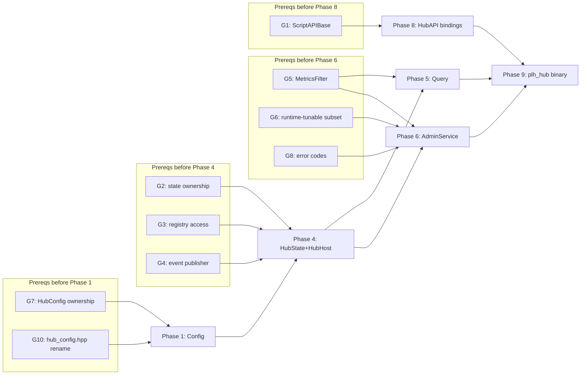

# HEP-CORE-0033 Hub Character — Prerequisites / Gap Analysis

**Status**: 🔵 Design reference (no code yet).
**Created**: 2026-04-21.
**Purpose**: Catalog gaps, conflicts, and open spec items that must be
resolved before HEP-CORE-0033 implementation phases can begin. Each gap has
a sequencing note (which HEP-0033 phase it blocks) so prerequisite work can
be batched.
**Companion to**: `docs/HEP/HEP-CORE-0033-Hub-Character.md`.
**Lifecycle**: Items here are absorbed back into HEP-0033 (inline decisions)
or into specific sub-HEPs as they resolve. Document archives once empty.

---

## 1. Confirmed non-gaps

These were suspected gaps but verified against code:

- **`ScriptEngine::has_callback(name)` + `invoke(name[, args])`** are generic
  — arbitrary callback names (`on_role_registered`, `on_channel_opened`, …)
  work without engine modification. No change needed for callback-name
  dispatch.
- **`HubVault` already stores the admin token** (see
  `src/include/utils/hub_vault.hpp:89` — `admin_token()` accessor;
  `create()` generates a 64-char hex token alongside the broker keypair).
  No vault extension needed.

---

## 2. HIGH-priority prerequisites (block implementation)

### G1. `ScriptEngine::build_api_` is role-specific
`LuaEngine::build_api_(RoleAPIBase &)` and `PythonEngine::build_api_(RoleAPIBase &)`
both take a `RoleAPIBase &`. `HubAPI` cannot be passed in without one of:
- (a) Common base `ScriptAPIBase` both `RoleAPIBase` and `HubAPI` inherit
      from; engines take `ScriptAPIBase &`.
- (b) Parallel `build_hub_api_(HubAPI &)` methods on each engine.
- (c) Template on the API type; changes virtual-interface shape.

**Blocks**: HEP-0033 Phase 8 (HubAPI bindings).
**Recommendation**: (a) — parallels how `RoleHostCore` unified the role side.
Small refactor; can land before Phase 1.

### G2. `BrokerService` / `HubState` integration model
Today `BrokerService` privately owns `metrics_store_`, `ChannelRegistry`,
`BandRegistry`, federation peer map. HEP-0033 §8 says `HubState` aggregates
these. Three implementation patterns:
- (a) **Refactor (move)**: maps move out of `BrokerService` into `HubState`;
      `BrokerService` gets a `HubState *` and writes directly.
- (b) **Wrap (reference)**: `HubState` is a view; references broker-internal
      maps. Simpler but couples lifetime + locking.
- (c) **Mirror (sync)**: `BrokerService` keeps its maps; `HubState` holds
      copies updated via events. Doubled state + update paths.

**Blocks**: HEP-0033 Phase 4 (HubState + HubHost).
**Recommendation**: (a) — one source of truth, no duplication, mirrors how
`RoleHostCore` absorbed state from per-role mains. Requires G3/G4 decisions
to follow.

### G3. `ChannelRegistry` / `BandRegistry` are private-to-broker
`src/utils/ipc/channel_registry.hpp` and `band_registry.hpp` are internal
headers (inside `src/utils/ipc/`, not under `src/include/utils/`). HEP-0033
needs external access for `HubState`. Resolved by G2:
- If G2=(a): registries are **absorbed** into `HubState` public types.
- If G2=(b)/(c): registries get **promoted** to public headers with
  accessor APIs.

**Blocks**: HEP-0033 Phase 4.

### G4. `BrokerService` event-publisher interface
HEP-0033 §12.3 says "BrokerService gains internal callbacks that push events
into HubHost". Today there are ad-hoc `on_channel_closed` / `on_consumer_closed`
hooks for federation + band cleanup. Need a first-class publisher:
- Add/remove-listener pattern (BrokerService knows N listeners).
- Direct `HubState *` handle (simplest if G2=(a)).
- Typed event struct + single dispatcher callback.

**Blocks**: HEP-0033 Phase 4.
**Recommendation**: collapses into G2=(a) — `BrokerService` holds
`HubState *` and writes state+events directly; `HubState` in turn fans out
to script callbacks via its own event notifier.

---

## 3. MEDIUM-priority spec gaps in HEP-0033

### G5. `MetricsFilter` schema is not concretely defined
HEP §9.3 lists filter dimensions (role uids, channels, bands, peers, category
tags: `"channel"`, `"role"`, `"band"`, `"peer"`, `"broker"`, `"shm"`, `"all"`)
but not the C++ struct or JSON wire shape for the admin RPC.

**Blocks**: HEP-0033 Phase 5 (query engine) and Phase 6 (AdminService).

### G6. `reload_config` runtime-tunable subset unspecified
`reload_config` admin method is listed (§10.2) but most config fields can't
change at runtime (endpoints, auth keyfile). Need an explicit
runtime-tunable whitelist: heartbeat timeouts, known_roles,
default_channel_policy, state retention — tunable. Endpoints, vault, admin
port — not.

**Blocks**: HEP-0033 Phase 6.

### G7. HubConfig — lifecycle module vs main-owned object
HEP-0033 §4 lifecycle ordering list includes `HubConfig` as a module. §6.1
shows it as a plain class with `load()` / `load_from_directory()` factories
(parallel to `RoleConfig`, which is main-owned, not a lifecycle module).

**Blocks**: HEP-0033 Phase 1 (Config) and §4 is internally inconsistent.
**Recommendation**: main-owned, parallel to `RoleConfig`. Update HEP §4.

### G8. Admin RPC error code catalog
§10.2 shows `{status, error: {code, message}}` response shape but no
enumerated code list. Need: `unauthorized`, `unknown_method`, `invalid_params`,
`not_found`, `conflict`, `internal`, `script_error`, `policy_rejected` (for
veto-hook refusal).

**Blocks**: HEP-0033 Phase 6.

---

## 4. LOW-priority ripple effects

### G9. `HubConfig` strict key whitelist verification
HEP §6.3 mandates strict-whitelist parsing. Since we're creating a new
`HubConfig` composite, built in from the start — not a gap in design, just
a reminder at Phase 1.

### G10. Rename `src/include/utils/config/hub_config.hpp` → `hub_ref_config.hpp`
Existing file is role-facing (`in_hub_dir`/`out_hub_dir`). Frees the
`HubConfig` name for hub-side composite. Rename affects every role `#include`
— mechanical `sed` with CMake rebuild. Land with Phase 1.

### G11. `--init` template content
`HubDirectory::init_directory()` needs actual `hub.json` template text
(probably inline C++ raw string). Flag for Phase 3.

### G12. L4 test infrastructure for hub
`tests/test_layer4_plh_hub/` dir paralleling `test_layer4_plh_role/`. Reuses
the fixture patterns; needs its own `plh_hub_fixture.h`. Flag for Phase 9.

### G13. Script tick cadence storage location
Where to put `tick_interval_ms`:
- (a) Extend `ScriptConfig` with optional field — roles ignore it.
- (b) Add new `HubScriptConfig` wrapping `ScriptConfig` + `tick_interval_ms`.

**Recommendation**: (b) — hub-only concern; keeps `ScriptConfig` clean for
roles.

---

## 5. Sequencing — what must land before which HEP-0033 phase

Independent groups can land in parallel; ordering within a group matches
HEP-0033 §14.

---

## 6. Suggested strategy

Three paths forward, ordered by how much up-front design they require:

1. **Batch all prereqs, then implement HEP-0033 straight through.**
   Resolve G1–G13 in a single design pass (amend HEP-0033 inline), then
   start Phase 1. Lowest total risk; slowest start.

2. **Resolve per-phase-group, implement incrementally.**
   Resolve G7/G10 → Phase 1; resolve G2/G3/G4 → Phase 4; etc. Code and
   design alternate. Fastest progress start; risks drift if early decisions
   conflict with later ones.

3. **Resolve HIGH prereqs only, defer MEDIUM/LOW until their phase.**
   Settle G1–G4 up front (they're entangled). Defer G5–G13 — they're
   lower-stakes and can be decided close to the phase that needs them.
   Balanced; my lean.

---

## 7. Open meta-question

**Does HEP-0033 need to change direction** anywhere given these gaps? My
current read: no — the gaps are implementation-shape decisions within the
HEP's existing design envelope. None of them require re-opening Q1–Q5.

If during resolution of G1–G8 something forces a change in the HEP's
ratified design, that gets flagged for user review before amendment.
