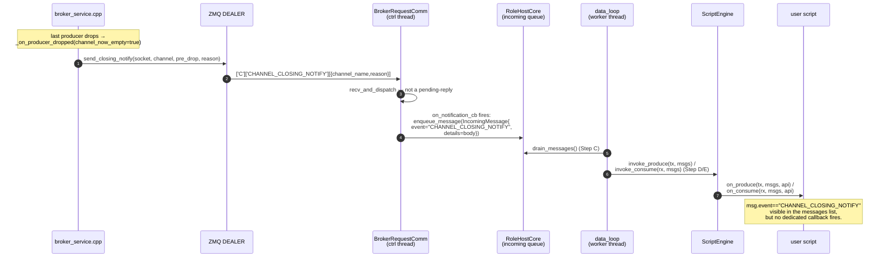
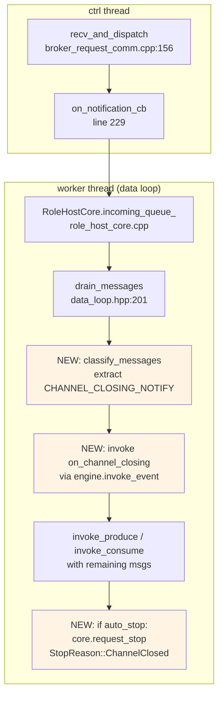

# Wave M1.5 — `on_channel_closing` script callback + auto-stop policy

| | |
|---|---|
| **Status**       | Draft — design phase. **No code changes yet.** Awaiting user lock-in on §6 open decisions. |
| **Created**      | 2026-05-12 |
| **Supersedes**   | `docs/tech_draft/M1_FSM_consolidation_handoff_2026-05-09.md` §M1.5 (which framed M1.5 as a "role-side `FORCE_SHUTDOWN` handler" — that wire message was wholly removed by M1.2 commit `a41ce71`). |
| **Wave**         | M1.5 (final closure of the M1.x FSM consolidation series). |
| **Drives**       | Closing the role-side ergonomics gap left by M1.2's atomic-teardown design — scripts currently must walk the generic per-cycle messages list to detect channel close, and never receive an explicit "your channel is gone" signal at the API surface. |
| **Resume point** | If interrupted, return to §7 implementation plan; §6 design decisions must be locked first. |

---

## 1. Why this exists — what changed

Pre-2026-05-07, the channel teardown protocol had two steps:

```
broker  → CHANNEL_CLOSING_NOTIFY (informational; grace timer starts)
        ↓ (grace window expires)
broker  → FORCE_SHUTDOWN          (consumers SHOULD shut down)
```

Three things were broken about this:
1. **`FORCE_SHUTDOWN` had no role-side handler.** Grep confirmed: roles silently dropped the frame.
2. **The grace window was indeterminate state** — channel in `Closing` while the FSM waited for FORCE_SHUTDOWN escalation.
3. **Split-brain FSM** — HubState tracked per-presence states, the protocol layer carried a per-channel `Closing` state; the two had to be kept in sync by hand.

M1.2 (commit `a41ce71`, 2026-05-10) **removed `FORCE_SHUTDOWN` entirely** along with the `Closing` state, `grace_*` config, and the channel-FSM. Channel observability became *derived* from producer-presence (`ChannelObservable` per HEP-CORE-0023 §2.2). Channel teardown became *atomic*: on last producer-presence Disconnected, one synchronous broker action erases the `ChannelEntry`, fans out one `CHANNEL_CLOSING_NOTIFY` to every party, and triggers the role-disconnect cascade.

**`CHANNEL_CLOSING_NOTIFY` is the substitute**, but semantically shifted:
- **Before:** "informational; FORCE_SHUTDOWN will follow if you don't comply."
- **After:** "the channel is gone *right now* — atomic teardown already happened. Decide what your role should do."

The old M1.5 plan (add a `FORCE_SHUTDOWN` handler) is stale residue. The *spirit* — "scripts should get a first-class signal when a channel they care about goes away, with optional auto-shutdown" — survives. The wire message and the handler shape both need to be re-framed against the actual current protocol.

---

## 2. Current code path — what already works



**File-line breadcrumbs (verified 2026-05-12):**

| Step | File | Line |
|---|---|---|
| Broker emits | `src/utils/ipc/broker_service.cpp` | `send_closing_notify` @ 2747; fan-out to consumers @ 2765, producers @ 2782 |
| Atomic teardown sites | `broker_service.cpp` | `handle_dereg_req` @ 1805; sweep `_on_pending_timeout` callsite @ 2676; admin `request_close_channel` @ 599 |
| BRC ctrl-thread dispatch | `src/utils/network_comm/broker_request_comm.cpp` | `recv_and_dispatch` @ 156; `on_notification_cb` route @ 229 |
| Role-side wiring | `src/utils/service/role_api_base.cpp` | callback registration @ 566 (lambda enqueues `IncomingMessage` into core) |
| Data-loop drain | `src/utils/service/data_loop.hpp` | `drain_messages` @ 201; `invoke_and_commit` @ 205 |
| Engine packs messages | `src/scripting/python_engine.cpp` | `build_messages_list_` @ 1325; passed to `on_produce` @ 1134, `on_consume` @ 1180 |
| Same on Lua | `src/scripting/lua_engine.cpp` | `push_messages_table_` @ 1103, 1174 |

**What's missing:** the script never sees an explicit `on_channel_closing(channel, reason)` callback. Every user must write boilerplate inside `on_produce` / `on_consume` to scan `msgs` for the event and decide what to do. And no role auto-stops when its data source / sink disappears — the script must call `api.stop()` itself.

---

## 3. Goal — what M1.5 ships

Two-line statement:
1. **A dedicated `on_channel_closing(channel: str, reason: str)` script callback** — fires before the next `on_produce` / `on_consume` whenever a `CHANNEL_CLOSING_NOTIFY` arrives.
2. **Optional auto-stop policy** — per-role config; when true, after `on_channel_closing` returns the role host sets a terminal stop reason and exits cleanly. Default: TBD per §6.

What this is **not**:
- Not a new wire message. CHANNEL_CLOSING_NOTIFY stays.
- Not a behavior change for the broker side. M1.2's atomic-teardown protocol is the contract; M1.5 only adds a role-side ergonomic surface for it.
- Not a hub-side change. Hub scripts already get `on_channel_closed` per `hub_api.cpp:145`; this is for **role** scripts.

---

## 4. Naming — why not `on_forced_disconnect`?

The 2026-05-09 handoff doc proposed `on_forced_disconnect`. Two reasons to reject that name now:

1. **There is no "force" anymore.** M1.2 removed the FORCE_SHUTDOWN escalation. The notification is post-fact: "the channel is gone." Calling it `on_forced_disconnect` carries the obsolete grace-window mental model.
2. **The event is channel-scoped, not role-scoped.** A role with multiple channels (e.g., a processor with two inputs) gets `CHANNEL_CLOSING_NOTIFY` per channel. The callback name should carry the channel scope.

Proposed: **`on_channel_closing(channel: str, reason: str)`** — matches the wire-message name (`CHANNEL_CLOSING_NOTIFY`), matches the broker-side helper (`on_channel_closed` for federation peers), and HEP-CORE-0007 already uses this verb.

---

## 5. Architecture — where the hook lands



**Single seam.** All three additions land in `data_loop.hpp` Step C → D between `drain_messages` and `invoke_produce` / `invoke_consume`:
1. **Classify:** pull `CHANNEL_CLOSING_NOTIFY` entries out of `msgs` into a separate list (call them `lifecycle_msgs`); leave the rest of `msgs` alone for legacy `on_produce` / `on_consume` delivery.
2. **Dispatch:** for each lifecycle msg, call `engine.invoke_lifecycle_event("on_channel_closing", {channel, reason})` — new `ScriptEngine` method, mirrors `invoke_on_stop` shape.
3. **Auto-stop:** if `cfg.auto_stop_on_channel_close == true` and any lifecycle msg fired, set `core.set_stop_reason(StopReason::ChannelClosed); core.request_stop()` — terminates cleanly after the current cycle.

**Backward-compatibility window:** keep delivering `CHANNEL_CLOSING_NOTIFY` in the generic messages list during the M1.5 transition window (existing scripts that scan for it keep working). Drop dual-delivery in a follow-up sweep once the audit confirms no production scripts rely on the generic path.

---

## 6. Open design decisions — awaiting user lock-in

### D1. Default auto-stop policy

When config doesn't specify, what does the role do on `CHANNEL_CLOSING_NOTIFY`?

| Option | Behavior | Risk |
|---|---|---|
| **D1a — `auto_stop=true` by default** | Role stops cleanly on any of its channels closing | Surprising for scripts that have fallback channels or want to retry |
| **D1b — `auto_stop=false` by default; opt-in** | Script must explicitly opt in or call `api.stop()` from the callback | Easier to forget → role keeps running with no data source |
| **D1c — Per-role-type defaults** | producer=false (can survive if `out_channel` closes; the broker re-creates it on next REG_REQ); consumer=true (no point reading from a gone channel); processor=true (no point processing without inputs) | More moving parts; users must learn three defaults |

My lean: **D1c** — it captures the intent ("does the role's purpose survive losing this channel?") and matches what a careful user would write by hand. But D1b is the most conservative.

### D2. Auto-stop scope: which channel?

A processor reads `in1` + `in2`, writes `out`. If `in1` closes, does the processor stop, or keep running on `in2` alone (and the `out` channel)?

| Option | Behavior |
|---|---|
| **D2a — Stop if *any* registered channel closes** | Conservative; matches D1c lean for consumer/processor |
| **D2b — Stop if *all* my-side input channels close** | A processor with `in1` gone but `in2` live keeps running |
| **D2c — Defer to the script entirely** | Script reads `reason` + `channel` in the callback and decides |

My lean: **D2a** for simplicity (consistent with D1c). D2c is more flexible but multiplies test surface.

### D3. Exception policy in the callback

If the script's `on_channel_closing` throws, what does the role host do?

| Option | Behavior |
|---|---|
| **D3a — Log + auto-stop anyway** | Exception doesn't veto the close; role exits |
| **D3b — Log + downgrade to "no auto-stop"** | Treat exception as "script wants to handle this another way" |
| **D3c — Promote to critical error → role fails** | Symmetric with engine-error policy elsewhere |

My lean: **D3a** — the channel is *already* gone (post-fact notification); the script can't veto that fact. Auto-stop is the safe default if the script crashes mid-handler.

---

## 7. Implementation plan — 5 phases

| Phase | Scope | LOC | Files |
|---|---|---|---|
| **P1 — Config + types** | Add `StopReason::ChannelClosed` to `RoleHostCore`; add `auto_stop_on_channel_close` (or D1c-shaped triple) to per-role config; thread through CLI/JSON parse with strict-key whitelist. | ~30 | `role_host_core.hpp`, `role_config.hpp`, `*_role_config.cpp` |
| **P2 — Engine API** | Add `ScriptEngine::invoke_lifecycle_event(name, body)` — mirror of `invoke_on_stop`; Python + Lua + Native implementations; Python: looks up `on_channel_closing` attr, calls with `(channel, reason)` kwargs; Lua: `pcall` on `on_channel_closing`. | ~120 | `script_engine.hpp`, `python_engine.cpp`, `lua_engine.cpp`, `native_engine.cpp` |
| **P3 — Data loop wiring** | In `data_loop.hpp` Step C: split `msgs` into `lifecycle_msgs` + `data_msgs`; dispatch lifecycle msgs via `engine.invoke_lifecycle_event`; auto-stop per locked policy. **Keep dual-delivery** in `data_msgs` for transition. | ~40 | `data_loop.hpp` |
| **P4 — Tests** | L2: classifier unit test (one CHANNEL_CLOSING_NOTIFY + two regular msgs → correct split). L3: end-to-end consumer + producer + processor get CHANNEL_CLOSING_NOTIFY, callback fires with right `(channel, reason)`, auto-stop terminates the role within bounded time, exit code clean. Mutation sweep: disable classifier → tests fail; disable auto-stop → tests fail. | ~250 | `tests/test_layer2_service/test_data_loop.cpp` (new), `tests/test_layer3_datahub/test_datahub_channel_closing.cpp` (new) |
| **P5 — Doc sync** | HEP-CORE-0007 §12.4: add `on_channel_closing` callback row to client-API table. HEP-CORE-0023 §2.5: cross-ref M1.5 callback. HEP-CORE-0011: lifecycle callbacks table gains the new entry. README_EmbeddedAPI: script-side `on_channel_closing` example. | ~150 lines docs | `docs/HEP/HEP-CORE-0007.md`, `docs/HEP/HEP-CORE-0023.md`, `docs/HEP/HEP-CORE-0011.md`, `README_EmbeddedAPI.md` |

**Total:** ~440 LOC code + 250 LOC tests + 150 lines docs. Estimated effort: 1–2 days once §6 decisions are locked.

---

## 8. Test plan — coverage matrix

| Test class | What it pins | Mutation that should be caught |
|---|---|---|
| L2 `DataLoopClassifierTest.SplitsLifecycleFromDataMsgs` | Classifier separates `CHANNEL_CLOSING_NOTIFY` from regular msgs in the same drain batch | Disable classifier → both arrive in `data_msgs`; user-script tests in L3 still fire callback (dual-delivery), but L2 directly probes the split |
| L2 `DataLoopAutoStopTest.AutoStopFiresOnChannelClose` | Auto-stop sets `StopReason::ChannelClosed` and calls `request_stop` | Disable auto-stop → `request_stop` not called; role keeps running |
| L3 `ChannelClosingCallbackTest.Producer_ReceivesCallback_WithCorrectArgs` | End-to-end: broker emits NOTIFY → script `on_channel_closing(ch, reason)` called with broker-emitted strings | Wrong reason string mapping → test catches via direct callback-arg assertion |
| L3 `ChannelClosingCallbackTest.Consumer_AutoStopWithinBoundedTime` | Consumer with `auto_stop=true` exits within N ms of NOTIFY; pinpins both latency and exit code | Slow auto-stop loop → bounded-time assertion fails |
| L3 `ChannelClosingCallbackTest.Processor_PartialInputClose_BehaviorMatchesD2Decision` | Encodes the D2 policy decision (D2a = stop on any; D2b = stop on all-inputs-closed) | If D2b: stopping after only `in1` closes → test fails |
| L3 `ChannelClosingCallbackTest.ScriptException_AutoStopStillFires` | Encodes D3 — script `raise`s in callback, role still exits cleanly | If D3b/c shape chosen: test asserts that path instead |

**Per CLAUDE.md test-rigor rule:** every assertion pins path + timing + structural payload. Run a mutation sweep before commit.

---

## 9. Doc + record updates triggered by M1.5

When M1.5 lands, the following records need to be updated *atomically with the implementation commit* (not after):

1. **`docs/TODO_MASTER.md`** — M1.5 row updated (already pre-flagged in this audit pass; see §10 below); dependency graph re-labeled.
2. **`docs/todo/MESSAGEHUB_TODO.md`** — `M1.5 (on_forced_disconnect)` reference replaced with `M1.5 (on_channel_closing)`.
3. **`docs/todo/TESTING_TODO.md`** — §9 MD1 entry refreshed (still real, see §11 below); §M1.5 coverage section added under "Current Focus".
4. **`docs/tech_draft/M1_FSM_consolidation_handoff_2026-05-09.md`** — §M1.5 marked Superseded with a one-liner pointing here.
5. **HEP-CORE-0007 §12.4** — wire-message section adds note: "CHANNEL_CLOSING_NOTIFY triggers `on_channel_closing` script callback per HEP-CORE-0011 lifecycle table."
6. **HEP-CORE-0023 §2.5** — role-side cleanup section adds the callback.
7. **HEP-CORE-0011** — lifecycle callbacks table gains `on_channel_closing` row.

---

## 10. Audit findings — stale plan/TODO residues found 2026-05-12

These are independent of M1.5 implementation; they should be **fixed in a separate housekeeping commit** before M1.5 starts, so plan records aren't lying.

| File | Line(s) | Stale | Truth | Suggested fix |
|---|---|---|---|---|
| `docs/TODO_MASTER.md` | 129 (M1.5 row) | "Role-side `FORCE_SHUTDOWN` handler + `on_forced_disconnect`" | FORCE_SHUTDOWN removed by M1.2; substitute is CHANNEL_CLOSING_NOTIFY; callback name re-framed | Replace row with M1.5 = `on_channel_closing` callback; link to this design doc |
| `docs/TODO_MASTER.md` | 159 (graph) | `M1.5 (FORCE_SHUTDOWN handler)` | same | Re-label graph node |
| `docs/todo/MESSAGEHUB_TODO.md` | 88 | `M1.5 (`on_forced_disconnect`)` | same | Re-label callback name |
| `docs/todo/TESTING_TODO.md` | 98–100 | `pinning the grace-escalation shutdown protocol that M1.3 retires … will be designed when M1.5 lands.` | M1.3 already shipped (part of M1.2 atomic sweep); M1.5 re-scoped | Update wording + cross-ref this doc |
| `docs/todo/TESTING_TODO.md` | 140 | `CONSUMER_REG_REQ / FORCE_SHUTDOWN / HUB_PEER_HELLO / ...` (wire-message coverage list) | FORCE_SHUTDOWN no longer on the wire | Remove FORCE_SHUTDOWN from the list |
| `docs/todo/TESTING_TODO.md` | 502–513 | `Phase 7 (M1.3) — retire FORCE_SHUTDOWN-as-grace-escalation` checklist | Phase 7 / M1.3 shipped in M1.2 commit a41ce71 | Mark all checklist items ✅ and date-stamp closure |
| `docs/tech_draft/M1_FSM_consolidation_handoff_2026-05-09.md` | banner + §M1.5 | "Phases 5-8 + M1.3 + M1.4 + M1.5 still pending" | Phases 5-8, M1.3, M1.4 all shipped; M1.5 redesigned (this doc) | Mark Superseded with date stamp; preserve as historical handoff |
| `docs/tech_draft/controlled_access_api_design.md` | Status banner | "Draft — design phase. No code changes yet." | All 8 steps shipped through commit `416cbec`; suite 1801/1801 | Either flip status to "Shipped 2026-05-11" or archive per DOC_STRUCTURE §2.2 |
| `docs/tech_draft/M3_role_entry_controlled_access.md` | Status banner | "Stub. No code changes yet." | Wave M3 closed 2026-05-11 (commit 0fc942f); six review passes archived | Flip status to "Shipped 2026-05-11" or archive |
| `docs/tech_draft/M3_role_entry_controlled_access.md` | "Resume point" line | mentions M1.5 still uses FORCE_SHUTDOWN framing | same as above | Update cross-ref |

---

## 11. MD1 status — refreshed against current code

MD1 is **still a real, captured bug** as of 2026-05-12 (gdb stack trace preserved in `docs/todo/TESTING_TODO.md` §9). Verified:

- `do_role_teardown` (Step 12) calls `broker_comm->stop()` which is fire-and-forget — sets `stop_requested = true` and sends a wake-up signal, returns immediately (`src/utils/network_comm/broker_request_comm.cpp:598-620`).
- The ctrl thread's `run_poll_loop` may still be mid-iteration. After `loop.run()` returns, it stores `poll_loop_running = false` at line 594 — but if `teardown_infrastructure` (Step 13) has already destroyed `broker_comm_`, that store dereferences freed memory.
- Step 14's `thread_manager().drain()` joins the ctrl thread, but by then the SIGSEGV is already filed.

**Chain currently in TODO_MASTER:** M1.5 → MD1 → Wave B M8. Reasonable, but MD1 should arguably move **before** M1.5 since (a) it has a captured crash, (b) it's small (~50 LOC), (c) M1.5's new auto-stop path increases pressure on the teardown sequence — adding the M1.5 lifecycle hook on top of a known-buggy teardown is asking for new failure modes to mask each other.

Suggestion: **swap MD1 and M1.5** in the dependency graph. Lock the teardown contract first, then add the M1.5 callback on a stable substrate.

---

## 12. Decision-block summary — what's required from the user

Before M1.5 P1 starts, lock:
1. **D1** — auto-stop default policy (D1a / D1b / D1c)
2. **D2** — auto-stop scope (D2a / D2b / D2c)
3. **D3** — exception policy in callback (D3a / D3b / D3c)
4. **MD1 ordering** — swap MD1 to land before M1.5, or keep current chain?
5. **Audit-housekeeping commit** — apply the §10 record updates as a single pre-M1.5 commit?

Once locked, P1-P5 proceed without further structural questions.
