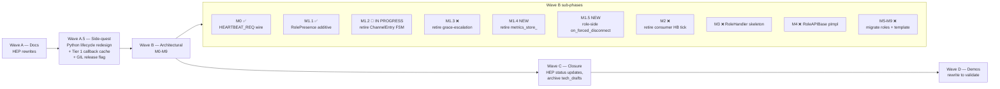

# M1.2 + M1.3 (and beyond) — handoff document

> **NAMING CLARIFICATION (added 2026-05-11):** The labels `M1`/`M2`/`M3`
> below refer to **Wave B** sub-phases (architectural role-side
> refactor; see §1 Mermaid).  They are DISTINCT from the labels used
> elsewhere in the project:
> - **Wave M2 / MP1-MP6** = multi-producer channel bookkeeping (see
>   `docs/TODO_MASTER.md` "Wave M2").
> - **Wave M2.5** = controlled-access API on `ChannelEntry`
>   (see `docs/tech_draft/controlled_access_api_design.md`).
> - **Wave M3** = controlled-access API on `RoleEntry` (see
>   `docs/tech_draft/M3_role_entry_controlled_access.md`).
> - **Wave B M1-M9** (this doc) = RoleHandler skeleton + RoleAPIBase
>   pImpl + per-role migrations + template-based role-host frame.
>
> When citing `M3` in this doc, mean **Wave B M3** (RoleHandler
> skeleton).  When citing `M3` elsewhere, mean **Wave M3** (RoleEntry
> API).  Use the full prefix in new docs and commit messages.

> **Status:** Phase 4 + L3 broker test migration COMPLETE 2026-05-10;
>   Phases 5-8 + M1.3 + M1.4 + M1.5 still pending.
> **As of:** 2026-05-10 — Phase 4 + 4 follow-on commits landed
>   (HEP-0007 unification, BrokerRequestComm error surfacing,
>   Bucket C harmonization, full broker test cluster migration).
> **Authoritative design:** `docs/HEP/HEP-CORE-0023-Startup-Coordination.md` §2,
> `docs/HEP/HEP-CORE-0019-Metrics-Plane.md` §2-3 (Phase 6), `docs/HEP/HEP-CORE-0033-Hub-Character.md` §18-19
> **Wave plan reference:** `docs/tech_draft/role_host_template_design.md` §14
> **Strand plan (next-step direction):** `docs/todo/TESTING_TODO.md` §7
>   "Code review findings (2026-05-10) — strand plan"
> **Tests baseline:** 1782/1782 passing at HEAD (`4e30618`)

This document originally handed off in-flight Phase 4 work; that work
is now closed and committed.  The remaining wave-plan steps (Phases
5-8, M1.3, M1.4, M1.5) are the foundation for the next session.
Read §3 for closed work, §4 for what's next; the consolidated
strand plan lives in `docs/todo/TESTING_TODO.md` §7 and the
high-level snapshot in `docs/TODO_MASTER.md` "Snapshot — 2026-05-10".

## Status update — 2026-05-10

**Closed since the original 2026-05-09 handoff was written:**

- **Phase 4** committed (`4fa5f32`).  All 7 reader sites migrated;
  `observe_channel(c, snap)` helper landed; `channel_to_json` two-arg
  overload emits both `status` (legacy) + `observable` (protocol)
  during the transition.
- **HEP-CORE-0007 protocol-doc unification** (`6972696`).  5 severe
  + 7 moderate + 1 minor doc/code drift fixed.  ROLE_*_REQ wire field
  unified to `role_uid`; ERROR field is `error_code`; DISC_PENDING
  reasons enumerate both values; CHANNEL_LIST_ACK uses `observable`;
  new §12.4a Error Code Taxonomy.
- **Stage 2 — BrokerRequestComm surfaces ERROR body** (`5755ebe`).
  Information-loss bug in `recv_and_dispatch` fixed; `optional<json>`
  now carries the broker's response (success or error);
  `correlation_id` echoed by 4 previously-asymmetric handlers.
- **Bucket C — `optional<json>` harmonization** (`22b2d8a`).  Every
  request-reply method on `BrokerRequestComm` and `RoleAPIBase`
  returns `optional<json>` uniformly; bool returns retired.
- **L3 broker test cluster migration** off mock-host scaffolding
  (`f472e4c`, `62ca573`, `4e30618`).  All 7 surviving broker test
  files migrated to real `HubHost`; `test_datahub_broker_shutdown.cpp`
  deleted (its 6 grace-escalation tests are slated for M1.3 deletion
  anyway).  Two production gaps surfaced and fixed:
  - `HubHost` wires `<hub_dir>/schemas/` to broker's
    `schema_search_dirs` per HEP-CORE-0034 §12.
  - `HubBrokerConfig::checksum_repair_policy` field exposed per
    HEP-CORE-0007 §12.4 (broker had it; HubConfig didn't surface it).

**Open per the wave plan + 2026-05-10 review:** see Phase 5 onward
below + the strand plan in `docs/todo/TESTING_TODO.md` §7.

---

## 1. Where this work fits in the bigger picture

The branch `feature/lua-role-support` carries the long-running
**role-host template + per-presence heartbeat + dual-hub processor**
refactor.  The wave plan (in `docs/tech_draft/role_host_template_design.md`
§14) is:



### How we forked from the main thread

Wave A was completed earlier (HEP rewrites for per-presence model).
M0 + M1.1 were committed (`f353e1a` + part of `49b65e5`).  M1.2
was about to start when test runs uncovered a ~25 % flake on
`PlhHubCliTest.RoundTrip_PlhHubKeygenAndRunPlhRoleRegisters` —
a `pybind11::handle::inc_ref()` GIL violation.

Investigation (gdb-traced, not speculation) showed two distinct
defects:

1. The embedded CPython interpreter was being constructed at
   process startup BEFORE the worker thread came up, so
   PythonEngine's class-level `py::object{py::none()}` initialisers
   ran without a held GIL.
2. `has_callback()` was being called from the broker control thread
   without holding the GIL because its impl reached into pybind11.

Wave A.5 was the side-quest to fix both: PythonInterpreter became a
dynamic lifecycle module, engines moved to worker-thread
construction, Tier 1 callback presence cache made `has_callback`
truly any-thread-safe.  The opt-in **GIL-release-during-wait** flag
(for Flask/asyncio compat in scripts) was added at the same time
because the user opted to address the broader category.

**Commits:** `49b65e5` (Wave A.5 in one).

After Wave A.5 landed, work returned to M1.2.  Three M1.2 sub-phases
have been committed in this session.  This document covers what's
done, what's left, and how the larger pathway resumes.

---

## 2. Why M1.2 + M1.3 exist — the design rationale

### Pre-M1.2 state (M1.1 transitional)

```
ChannelEntry holds:           RoleEntry holds:                  RolePresence holds:
  status (PendingReady/         state (Connected/Pending/         state
          Ready/Closing)              Disconnected)               first_heartbeat_seen
  last_heartbeat              last_heartbeat                       last_heartbeat
  state_since                 latest_metrics                       state_since
  closing_deadline            metrics_collected_at                 latest_metrics
                                                                   metrics_collected_at
   ↑ legacy channel-FSM         ↑ legacy per-uid FSM               ↑ new authoritative
   ↑ duplicates info            ↑ duplicates info                  per-presence FSM
```

Same data lived in three places.  Heartbeats fired three writes;
readers picked one of three versions.  This is the
"consumer-heartbeat-corrupts-channel-status" bug class
(HEP-CORE-0019 §2.3) writ structural.

### Target state (M1.2 + M1.3 complete)

```
ChannelEntry: topology only        RoleEntry: identity + presences      RolePresence: SOLE FSM
  name, schema_*, producer_*,        uid, name, role_tag, channels,       state
  consumers, endpoints                first_seen, pubkey_z85,               first_heartbeat_seen
                                      presences[]                          last_heartbeat
  observe(presence) → enum                                                  state_since
                                     any_presence_alive()                  latest_metrics
                                     find_presence(channel, role_type)     metrics_collected_at
```

- `RolePresence` is the ONE place state, last_heartbeat, and metrics live.
- `ChannelEntry::observe(producer_presence)` derives the four-value
  observability (`kAbsent/kRegistering/kStalled/kLive`) per HEP-0023 §2.2.
- `RoleEntry::any_presence_alive()` answers "is this uid still around?"
- `enum ChannelStatus`, `_set_channel_status`, `_set_channel_closing_deadline`,
  `_update_role_heartbeat`, `_update_role_metrics` are all gone.

### Why M1.2 and M1.3 are bundled

`ChannelEntry.status` and `ChannelEntry.closing_deadline` are inputs to
the FORCE_SHUTDOWN grace-escalation machinery
(`check_closing_deadlines()`).  Deleting them forces deletion of that
machinery in the same conceptual change.  The user explicitly chose
"bundled" earlier in this session.

### What FORCE_SHUTDOWN means in the new design

Per the user's clarification (this session):

- The wire message **stays**.  But its role changes.
- It is no longer a grace-escalation step (no Closing intermediate state).
- It becomes a **best-effort "you have been forcibly removed by the
  broker, here's why" notification** sent to the role being reaped.
- Sent on producer-presence pending_timeout (recipient: producer
  whose heartbeat lapsed) and consumer-presence pending_timeout
  (recipient: that consumer).  Future use cases: admin kick, hub
  shutdown.
- Role-side handler + script callback (`on_forced_disconnect(reason,
  channel)`) + automatic shutdown after the callback returns — this
  is **M1.5** (separate, not in M1.3).

---

## 3. State at handoff

### Three commits this session (in order)

| SHA | Title | Net LOC |
|---|---|---|
| `f2e3bd7` | M1.2 Phase 1 — `ChannelObservable` + `observe()` + `any_presence_alive()` + eager presence creation at REG_REQ / CONSUMER_REG_REQ | +120 |
| `128bb39` | M1.2 Phase 2 — `ChannelStatusChangedHandler` callback signature widened to `void(const ChannelEntry&, ChannelObservable)`; subscribers updated; transitional `observable_from_legacy_status()` helper | +40 |
| `2d3271a` | M1.2 Phase 3 — heartbeat sweep migrated to read presence; `_on_heartbeat_timeout` + `_on_pending_timeout` write presence as authoritative source; counters now bump on presence transitions | +130 |

### What works now

- Eager `RolePresence` rows on REG_REQ / CONSUMER_REG_REQ
- Heartbeat sweep iterates channels and resolves the producer-presence
  via `RoleEntry::find_presence(channel, "producer")` for state checks
- FSM transitions write the presence row authoritatively + the legacy
  `ChannelEntry.status` for back-compat reads
- Channel-status-changed event fires with both `ChannelEntry` and
  derived `ChannelObservable`

### What's still in the M1.1 transitional shape

- `ChannelEntry.{status, last_heartbeat, state_since, closing_deadline}`
  fields still exist and are still written
- `RoleEntry.{state, last_heartbeat, latest_metrics, metrics_collected_at}`
  fields still exist and are still written
- `enum ChannelStatus` still exists (PendingReady, Ready, Closing)
- `_set_channel_status`, `_set_channel_closing_deadline`,
  `_update_role_heartbeat`, `_update_role_metrics` mutators still exist
- Several broker readers still consult `entry.status` (DISC_REQ branch
  at `broker_service.cpp:1455`, `was_pending` at 1832, admin
  serializers at 2747-2751 and 3046)
- `channel_to_json` at `hub_state_json.cpp:45` still reads `c.status`
- `check_closing_deadlines()` and the FORCE_SHUTDOWN grace-escalation
  path still exist
- `cfg.grace_heartbeats`, `effective_grace()`, `kDefaultGraceHeartbeats`,
  `closing_deadline` config and field still exist

---

## 4. Remaining work — phase by phase

Each phase ends in a clean build + 1788/1788 tests passing.  Resume
in this order.  Estimated cumulative LOC: ~250–300 net deletions.

### Phase 4 — migrate remaining readers (~80 LOC)

**Goal:** every reader of `ChannelEntry.status` / `ChannelEntry.last_heartbeat` /
`RoleEntry.state` / `RoleEntry.last_heartbeat` / etc. resolves through
the presence row instead.

**Files + sites:**

| File | Line | Site | Redirect |
|---|---|---|---|
| `src/utils/ipc/broker_service.cpp` | 547 | `hub_entry->status != ChannelStatus::Closing` (script-requested-close guard) | After M1.3 the Closing state is gone — replace with `hub_entry.has_value()` (atomic teardown removes the entry). For Phase 4, leave alone (read goes via legacy field still); Phase 7 replaces it during the script-close rewrite |
| `src/utils/ipc/broker_service.cpp` | 1455 | `entry->status == ChannelStatus::PendingReady` (DISC_REQ branch returning DISC_PENDING) | Lookup producer-presence via snapshot. If `presence == nullptr` or `state == Disconnected` → CHANNEL_NOT_FOUND. Else if `!first_heartbeat_seen || state == Pending` → DISC_PENDING (with reason `"awaiting_first_heartbeat"` vs `"heartbeat_stalled"` derived from which condition matched). Else → DISC_ACK |
| `src/utils/ipc/broker_service.cpp` | 1832 | `was_pending = (pre->status == PendingReady)` (in heartbeat path, used to detect Ready transitions for counter bumps) | Replace with `was_pending = (presence->state == RoleState::Pending) \|\| !presence->first_heartbeat_seen` |
| `src/utils/ipc/broker_service.cpp` | 2747-2751 | Admin metrics serialize: emits `ch["status"] = to_string(entry.status)` | Look up producer-presence; emit `ch["observable"] = to_string(observe(presence))` |
| `src/utils/ipc/broker_service.cpp` | 3046 | Admin event: `e.status = to_string(entry.status)` | Same redirect |
| `src/utils/ipc/hub_state_json.cpp` | 45 | `j["status"] = to_string(c.status)` in `channel_to_json` | The serializer takes only `const ChannelEntry&`. Add an overload that takes `(const ChannelEntry&, ChannelObservable)`; existing single-arg overload either retains legacy mapping or is removed in Phase 6 |
| `src/utils/ipc/broker_service.cpp` | 2272, 2274, 2290, 2292 | timeout sweep | **Already done in Phase 3** |
| `src/utils/ipc/broker_service.cpp` | 2414, 2421 | FORCE_SHUTDOWN sweep + closing_deadline | M1.3 (Phase 7) — leave alone for Phase 4 |

**Watch for:**
- `was_pending` semantics: today `PendingReady` covers both
  "no first heartbeat" and "heartbeat stalled" (the legacy enum
  conflated them). After M1.2 these are presence-level
  `!first_heartbeat_seen` (state still Connected) vs `state==Pending`.
  Use `\|\|` of both.

### Phase 5 — drop legacy writes from `_on_heartbeat`; refit `_set_role_disconnected` (~50 LOC)

**Goal:** `_on_heartbeat` writes ONLY presence rows.  No more
`ChannelEntry.last_heartbeat`/`status` updates, no more
`_update_role_heartbeat`/`_update_role_metrics` calls from this method.

**`_set_role_disconnected` body refit:** today sets `RoleEntry.state =
Disconnected` (a field that's about to disappear).  New body: walk
`role.presences` and mark each `RoleState::Disconnected`.  Single
caller in `hub_state.cpp` for HEP-0034 schema cascade-evict (line 13
in `schema_record.hpp`).

**Files:**
- `src/utils/ipc/hub_state.cpp:828-984` (`_on_heartbeat` body — drop steps 1-3, keep step 4)
- `src/utils/ipc/hub_state.cpp:446` (`_set_role_disconnected` body refit)

**Watch for:**
- The legacy `_update_role_heartbeat` / `_update_role_metrics` calls
  inside `_on_heartbeat` write to `RoleEntry.last_heartbeat` /
  `latest_metrics`.  After Phase 5 these mutators have NO callers and
  should be removable in Phase 6.
- The lazy presence-creation branch in `_on_heartbeat` (lines 894-915)
  is now also redundant — Phase 2 made creation eager.  Removable
  in Phase 6.

### Phase 6 — delete legacy fields, enum, mutators (~120 LOC net deletion)

**Delete from `src/include/utils/hub_state.hpp`:**
- `enum class ChannelStatus { ... }` (lines 65-70)
- `ChannelEntry.status`, `.last_heartbeat`, `.state_since`,
  `.closing_deadline` (lines 158-163; closing_deadline goes in M1.3
  but the others can go here)
- `RoleEntry.state`, `.last_heartbeat`, `.latest_metrics`,
  `.metrics_collected_at` (lines 252, 256-257, 259-260)
- `to_string(ChannelStatus)` declaration (line 104)
- `_set_channel_status`, `_set_channel_closing_deadline`,
  `_update_role_heartbeat`, `_update_role_metrics` declarations

**Delete from `src/utils/ipc/hub_state.cpp`:**
- All four mutator implementations
- `to_string(ChannelStatus)` impl
- `observable_from_legacy_status` helper (no longer needed —
  fire sites now compute observable from presence directly)
- The lazy presence-creation branch in `_on_heartbeat`
- All "M1.1 transitional" / "M1.2 will retire" comments (~25 of them)

**Then in remaining fire sites:** stop using
`observable_from_legacy_status`; compute observable from the
presence directly.  Pattern:

```cpp
ChannelObservable obs;
{
    auto rit = pImpl->roles.find(producer_uid);
    obs = (rit == pImpl->roles.end())
              ? ChannelObservable::kAbsent
              : fired_entry.observe(rit->second.find_presence(
                    fired_entry.name, "producer"));
}
for (auto &h : ...) h(fired_entry, obs);
```

**Watch for:**
- Tests will break.  Look for any test asserting
  `e.status == ChannelStatus::Ready` or
  `r.last_heartbeat == ...` and rewrite against the presence row.
- `RoleEntry.channels` (the vector of channel names) is redundant
  with `presences[*].channel` but is NOT being deleted in M1.2 —
  it's referenced from admin queries.  Optional follow-up cleanup;
  **do not include in M1.2**.
- Schema-record cascade-evict in `_set_role_disconnected` (HEP-0034
  §7.2) must continue to work — verify the cascade still fires when
  the new body marks all presences Disconnected.

### Phase 7 (M1.3) — retire FORCE_SHUTDOWN grace; rewire as best-effort notification (~150 LOC net deletion)

**Goal:** the wire message stays.  The grace-escalation machinery is
retired.  Atomic teardown becomes the only path.

**Delete:**
- `BrokerServiceImpl::check_closing_deadlines()` (~50 lines at
  `broker_service.cpp:2403-2444`)
- `cfg.effective_grace()`, `cfg.grace_heartbeats` from
  `src/include/utils/broker_service.hpp:150,186`
- `kDefaultGraceHeartbeats`, `PYLABHUB_DEFAULT_GRACE_HEARTBEATS`
  from `src/include/utils/timeout_constants.hpp:54,90`
- `grace_heartbeats`, `grace_ms` config fields + parsing from
  `src/include/utils/config/hub_broker_config.hpp:48,58,76,89,90`
- `bcfg.grace_heartbeats = ...` line in `src/utils/service/hub_host.cpp:177`
- `kDefaultGraceHeartbeats` reference in
  `src/utils/config/hub_directory.cpp:164`
- `ChannelEntry.closing_deadline` (now unused)
- `_set_channel_closing_deadline` mutator (now unused)
- `cfg.grace_heartbeats` emission in `hb` JSON at
  `broker_service.cpp:2245`
- `case ChannelStatus::Closing:` arms in switch statements (the
  enum is gone)

**Rewire:**
- The script-requested-close path at `broker_service.cpp:543-558`:
  replace the "set status=Closing + closing_deadline" with atomic
  teardown.  Pattern:
  ```cpp
  for (const auto& ch : pending_closes) {
      auto hub_entry = hub_state_->channel(ch);
      if (!hub_entry.has_value()) continue;
      LOGGER_INFO("Broker: script-requested close for channel '{}'", ch);
      send_closing_notify(router, ch, *hub_entry, "script_requested");
      // M1.5 future: also send_force_shutdown to producer with reason "script_close"
      on_channel_closed(router, ch, *hub_entry, "script_requested");
      hub_state_->_on_channel_closed(ch, ChannelCloseReason::AdminClose);
  }
  ```
- `BrokerServiceImpl::send_force_shutdown` keeps the same wire
  shape (`{channel_name, reason}`) but its callers change.  Wire
  it into:
  - producer-presence pending_timeout in `_on_pending_timeout`'s
    caller path with reason `"heartbeat_timeout"` (best-effort
    notification to the now-disconnected producer)
  - consumer-presence pending_timeout (currently no consumer-side
    timeout sweep — adding that is **M2 territory**, not M1.3.
    Defer the consumer-side wire-up to M2)

**Update tests** that pinned grace-escalation behavior:
- `broker_health` workers that test FORCE_SHUTDOWN grace path —
  rewrite or delete (the path is gone)
- Anything pinning `closing_deadline` or `Closing` state

### Phase 8 — new tests + tidy ups (~80 LOC additions)

**Add:**

1. **`ConsumerHeartbeat_DoesNotRefreshProducerPresence`** — the
   canonical regression test for the original cross-presence
   bookkeeping bug (HEP-0019 §2.3).  Setup: producer registered,
   consumer registered, both alive.  Stop producer heartbeats but
   keep consumer heartbeats.  Assert: producer-presence
   transitions Connected → Pending → Disconnected as if consumer
   heartbeats didn't exist.  Should be in `test_layer3_datahub`.

2. **`ChannelEntry_HasNoStoredFSMFields`** — structural test.
   `static_assert` (or runtime equivalent) that `ChannelEntry`
   has no `status`, `last_heartbeat`, `state_since`,
   `closing_deadline` members.  Catches a regression where
   someone re-adds them.  Should be in `test_layer2_service/test_hub_state`.

**Update:**
- Any test pinning `entry.status == ChannelStatus::PendingReady|Ready`
  expectations needs a rewrite using
  `observe(presence) == ChannelObservable::...`.
- Tests that asserted exact `ChannelEntry.last_heartbeat` values
  switch to `RolePresence.last_heartbeat`.

---

## 5. Critical design invariants (must not violate)

### Counter-bump semantics

- `ready_to_pending_total` bumps when a producer-presence
  transitions `Connected → Pending`, **regardless** of legacy
  `ChannelEntry.status`.  Phase 3 already implemented this.
- `pending_to_deregistered_total` bumps when a producer-presence
  transitions `Pending → Disconnected` (atomic teardown follows).
- `pending_to_ready_total` (alias `pending_to_connected_total`)
  bumps when a presence transitions `Pending → Connected` via a
  recovering heartbeat — currently a TODO comment at
  `hub_state.cpp:969`; wire up in Phase 5 or Phase 6.

### Timeout semantics (HEP-CORE-0023 §2.1)

- `last_heartbeat` is the timeout anchor for `Connected → Pending`
  regardless of `first_heartbeat_seen`.  Eagerly-created presences
  stamp `last_heartbeat = now` at REG_REQ; if no heartbeat ever
  arrives, the standard `ready_timeout` fires the demotion.
- `state_since` is the timeout anchor for `Pending → Disconnected`.
- `first_heartbeat_seen` is **only** consulted by
  `ChannelEntry::observe()` to differentiate the "registering"
  sub-state of Connected from "live".  Not a timeout gate.

### Atomic-teardown contract (HEP-CORE-0023 §2.1)

- When a producer-presence transitions to `Disconnected`:
  1. Send `CHANNEL_CLOSING_NOTIFY` to all consumers (best-effort)
  2. (Future M1.5) Send `FORCE_SHUTDOWN` to the producer with reason
  3. Remove the channel atomically (`_on_channel_closed`)
  4. Mark / remove the presence row
- No intermediate `Closing` state.  No grace window.  No
  `closing_deadline`.

### Library-boundary invariants (unchanged from earlier work)

- `pylabhub-utils` cannot include `pybind11/embed.h` (would pull
  libpython into every consumer).  Engine plumbing goes through
  the registry pattern (`script_engine_factory.hpp`).
- `EngineGlobalLockRelease` (already shipped 2026-05-08) honors
  the registry pattern — don't break it.

---

## 6. Bigger picture — pathway back

When M1.2 + M1.3 are committed, the wave plan resumes here:

### M1.4 (NEW — identified in this session's static review)

**Title:** retire `metrics_store_` + `METRICS_REPORT_REQ`

**Why it's a phase:** the static review uncovered a second metrics
storage path — `BrokerServiceImpl::metrics_store_` (a
`ChannelMetrics` map) — that survives alongside the per-presence
store.  HEP-CORE-0019 §2.3 (Phase 6) explicitly marks this as
superseded.  Code at `broker_service.cpp:1892` flags it as
transitional ("keep the legacy metrics_store_ in sync until [...]").

**Scope:**
- Add `HubState::channel_metrics_snapshot(channel)` → returns a
  `ChannelMetricsSnapshot` aggregating producer-presence +
  consumer-presence rows for the named channel.  Replaces what
  `query_metrics()` does today.
- Redirect `handle_metrics_req` to use the new helper.
- Delete `BrokerServiceImpl::metrics_store_`,
  `ChannelMetrics`/`ParticipantMetrics` structs,
  `update_producer_metrics`, `update_consumer_metrics`,
  `query_metrics`.
- Verify no role still emits `METRICS_REPORT_REQ` (HEP-0019 Phase 6
  says metrics piggyback on heartbeat).  If confirmed, delete
  `handle_metrics_report_req` + the wire-msg known-list entry.
- Update HEP-0019 §9 to mark "Phase 6: per-presence keying" ✅ shipped.

**Estimated LOC:** ~200 net deletion + ~50 helper additions.

### M1.5 (NEW — clarified in this session)

**Title:** role-side `FORCE_SHUTDOWN` handler + `on_forced_disconnect`
script callback + automatic shutdown

**Why it's a phase:** today the broker sends `FORCE_SHUTDOWN` but
**no role-side handler exists** — verified by `grep -rn
"FORCE_SHUTDOWN" src/`.  Roles silently drop the frame.  M1.3 keeps
the wire message but doesn't add a handler.  M1.5 closes the loop.

**Scope:**
- Role-side handler in `BrokerRequestComm` (or wherever
  channel-targeted broker frames are dispatched today): receives
  `{channel_name, reason}`, logs at info/warn level, invokes a
  registered callback.
- Role host wires the callback to invoke the user-script callback
  if defined.
- Script binding `on_forced_disconnect(reason: str, channel: str)`
  on `ProducerAPI`, `ConsumerAPI`, `ProcessorAPI`.
- After the callback returns, the role host triggers automatic
  shutdown (set `StopReason::ForceDisconnected`, exit cleanly).
- Tests: a role gets `FORCE_SHUTDOWN`, callback fires with correct
  args, role exits.

**User-confirmed names:**
- Callback: `on_forced_disconnect`
- Auto-shutdown after callback: yes

**Estimated LOC:** ~150 additions.

### M2 — retire consumer heartbeat tick

Existed pre-A.5; deferred during the FSM consolidation.  Once
M1.4/M1.5 land, M2 picks up.  Scope is in
`docs/tech_draft/role_host_template_design.md` §14.2.

### M3-M9 — RoleHandler + presence-list + RoleHostFrame template

The architectural refactor that the FSM consolidation was preparing
for.  These are the dual-hub processor scenario fixes (B3-B5 from
the design draft §1) plus the template-based role-host frame.
Scope: `role_host_template_design.md` §14.2 + §10-§13.

### Wave C — closure

After Wave B M0-M9 complete: HEP status updates (mark Phase 6 ✅,
mark M1.x phases ✅ in HEP-CORE-0023), archive
`role_host_template_design.md` to `docs/archive/`, refresh
`MEMORY.md`, close M0-M9 in `docs/todo/MESSAGEHUB_TODO.md`.

### Wave D — demos rewrite

Last.  Rewrites the demo scripts in `examples/` against the now-
stable architecture.  Validates the whole pipeline end-to-end.

---

## 7. How to resume on a fresh session

### Step 0 — verify state

```bash
cd /home/qqing/Work/pylabhub
git log --oneline -5
# Should show:
#   2d3271a M1.2 Phase 3 — sweep + transitions read/write RolePresence
#   128bb39 M1.2 Phase 2 — extend ChannelStatusChangedHandler...
#   f2e3bd7 M1.2 Phase 1 — ChannelObservable + eager presence creation...
#   49b65e5 Wave A.5 — Python lifecycle redesign + Tier 1 ...
git status   # should be clean

cmake --build build -j2 2>&1 | tail -3   # should be clean
ctest --test-dir build -j2 --output-on-failure 2>&1 | tail -3   # should be 1788/1788 (rerun any flake)
```

### Step 1 — load context

Read in order:
1. **This document** (top-to-bottom)
2. `docs/HEP/HEP-CORE-0023-Startup-Coordination.md` §2 — authoritative FSM design
3. `docs/HEP/HEP-CORE-0019-Metrics-Plane.md` §2-3 — Phase 6 keying
4. `src/include/utils/hub_state.hpp` — current data structures (with
   M1.1 transitional fields + new helpers)
5. `src/utils/ipc/hub_state.cpp` lines 828-1100 — FSM transition methods
6. `src/utils/ipc/broker_service.cpp` lines 2240-2460 — sweep + grace machinery

### Step 2 — pick up Phase 4

Start with the simplest reader: `channel_to_json` in
`hub_state_json.cpp` (or extend it with an observable parameter).
Then move to broker_service.cpp's reader sites in numerical order.

### Step 3 — proceed phase by phase

After each phase:
- Build clean
- Full suite passes (1788 + N as new tests are added)
- Commit with a tight focused message
- Update this handoff doc OR mark phase complete in
  `docs/TODO_MASTER.md`

### Open design decisions before starting Phase 4

None — every decision needed is locked.  All the user-input
questions are resolved:
- Slicing: bundled M1.2 + M1.3 (with M1.5 separate as a new phase)
- Callback name: `on_forced_disconnect`
- Auto-shutdown after callback: yes
- `RoleEntry.channels` redundancy: leave for now

If new design questions emerge during implementation, follow the
project's STOP-on-structural-questions rule
(`feedback_decision_authority.md`).

---

## 8. Pending TODOs being parked here so they don't dangle

The following exist independently of the Wave B M-series and must
not be lost:

| ID | Item | Where it lives |
|---|---|---|
| **HEP-0034** | Schema Registry Phase 1+ implementation (canonical-form fingerprint with packing; cite/register protocol; HubState capability ops) — pre-1.0 wire-incompatible change | `docs/HEP/HEP-CORE-0034-Schema-Registry.md` §13 |
| **Tier 2 callback registration** | Capability flag in place (`supports_dynamic_callbacks`); reserved for when a real consumer materialises (admin RPC custom commands, hot-loadable script extensions) | `docs/tech_draft/engine_callback_tiers.md` §"Tier 2" |
| **Heap-alloc cost of `EngineGlobalLockRelease`** | ~60–100 ns/cycle today; profiler-driven optimization to TLS storage if it ever shows up | `src/scripting/engine_factory.cpp` cost note (function `release_engine_global_lock_impl`) |
| **Global process-config (replaces `pylabhub.json`)** | Consolidate cross-cutting platform settings (python_home, etc.) | `MEMORY.md` "Deferred TODO" |
| **HEP-0033 Hub Character implementation backlog** | G1-G13 prereqs; G2.2.x already shipped on branch; rest is post-M-series | `docs/tech_draft/HUB_CHARACTER_PREREQUISITES.md` |
| **`RoleEntry.channels` vector** | Redundant with `presences[*].channel`; minor optimization, not urgent | static review O-10 |

When M1.x is fully done and Wave C archives this doc, these TODOs
go to `docs/TODO_MASTER.md` priority-2 backlog.

---

## 9. Reference — pre-existing key facts (preserve through any session boundary)

- Branch: `feature/lua-role-support`, ~5 commits ahead of `origin`.
- Test baseline: `1788/1788` at the latest commit.
- Build: `cmake --build build -j2`. Tests: `ctest --test-dir build -j2`. User preference: `-j2`.
- Two L4 tests (`PlhRoleInitTest.CreatesDirectoryStructure/producer`,
  `PlhHubCliTest.RoundTrip_PlhHubKeygenAndRunPlhRoleRegisters`) are
  occasionally flaky under parallel load — retry the failed ones once before
  treating as a regression.
- `PortableAtomicSharedPtr<T>` lives at
  `src/utils/portable_atomic_shared_ptr.hpp`.
- Logger has levels TRACE, DEBUG, INFO, WARN, ERROR, SYSTEM (no
  CRITICAL).  For shutdown-time critical messages use
  `LOGGER_SYSTEM_SYNC` (bypasses async queue).

---

End of handoff document.  Update or supersede when M1.2 + M1.3 land.
