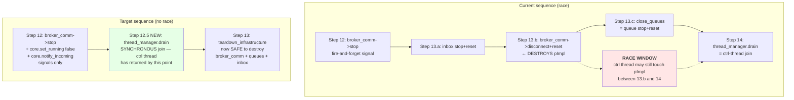

# MD1 — Role teardown ordering fix (use-after-free race in `do_role_teardown`)

| | |
|---|---|
| **Status**       | Draft — design phase. All §6 decisions LOCKED via 2026-05-12 user Q&A. No code changes yet. |
| **Created**      | 2026-05-12 |
| **Drives**       | Eliminating the gdb-confirmed use-after-free race in role teardown (`PlhHubCliTest.RoundTrip_PlhHubKeygenAndRunPlhRoleRegisters` SIGSEGV exit 139, 1/13 under `-j2`). |
| **Wave**         | MD1 (precedes M1.5 per chain reordering 2026-05-12 — stabilize teardown before adding `on_channel_closing` auto-stop on top). |
| **Resume point** | If interrupted, return to §7 implementation plan; all design decisions in §6 are locked. |

---

## 1. Why this exists

The captured gdb stack trace (preserved in `docs/todo/TESTING_TODO.md` §9):

```
Thread 9 (BRC ctrl thread) SIGSEGV:
  #0  std::atomic<bool>::store        on freed memory
  #2  BrokerRequestComm::run_poll_loop ← broker_request_comm.cpp:594
  #3  RoleAPIBase::start_ctrl_thread lambda

Thread 5 (worker, concurrent teardown):
  ZmqQueue::stop
  RoleAPIBase::close_queues             ← role_api_base.cpp:321
  scripting::do_role_teardown           ← role_host_lifecycle.cpp:52
  ProducerRoleHost::worker_main_
```

Re-verified 2026-05-12: the race is real and the diagnosis correct.

**Design principle (locked 2026-05-10, restated):** "**Stop the machine before disassembling it.**  No object may be destroyed while another thread is still using it.  The owning side must guarantee that all in-flight uses have observed stop *and returned* before destruction proceeds."

---

## 2. Root cause

`BrokerRequestComm` does NOT own its ctrl thread.  The thread is spawned by `RoleAPIBase::start_ctrl_thread` (`role_api_base.cpp:593-608`) into `api.thread_manager()`.  BRC therefore can't synchronously join — `BrokerRequestComm::stop()` is necessarily fire-and-forget:

```cpp
// broker_request_comm.cpp:598-620
void BrokerRequestComm::stop() noexcept {
    pImpl->stop_requested.store(true, std::memory_order_release);
    if (pImpl->signal_write) {
        pImpl->signal_write->send(zmq::message_t("S", 1), zmq::send_flags::dontwait);
    }
    // returns immediately; ctrl thread may still be mid-iteration
}
```

The ctrl thread's `run_poll_loop` exits the inner `loop.run()` and then stores `poll_loop_running = false` at line 594:

```cpp
loop.run();
pImpl->poll_loop_running.store(false, std::memory_order_release);  // ← SIGSEGV site
```

`do_role_teardown` currently runs Step 12 (`stop()`) → Step 13 (`teardown_infrastructure_()` which destroys `broker_comm_`) → Step 14 (`thread_manager().drain()`).  Between Step 13's BRC destruction and Step 14's join, the ctrl thread may dereference freed `pImpl` at line 594 → SIGSEGV.

The comment in `producer_role_host.cpp:449-450` already claims *"Broker and comm threads already joined via api_->thread_manager().drain()"* — currently a lie, since Step 14 hasn't run when `teardown_infrastructure_` runs.  The fix makes the comment true.

---

## 3. Architecture — current vs target



The fix is conceptually simple: **move drain from Step 14 to between Step 12 and Step 13**, then Step 13 (which the role host owns) is guaranteed quiescent.

---

## 3.5 The teardown-ordering contract (CRITICAL — primary content of MD1)

> User directive 2026-05-12 (verbatim): *"the most critical consideration is what should be torn down in the infrastructure before thread-joining and what should be after.  this is the most important explicitly documented fact we should nail down.  with this contract, we can clarify a lot of racing conditions and correctly ask thread to do the right thing."*

The bug exists because the **pre-drain / post-drain classification** of every teardown action has been implicit.  MD1 makes it explicit and tests against it.

### 3.5.1 The classification question

For every resource `R` that a thread `T` interacts with, ask:

> **Does `T` DEPEND on `R` being alive to make progress toward exit?  Or does `T` USE `R` while running?**

- **DEPEND** (R is `T`'s wake-up channel / stop-signal mechanism): destroying `R` pre-drain leaves `T` stuck forever.  R must stay alive *through* drain.  Destroy R **POST-DRAIN**.
- **USE** (R is `T`'s working state / poll target / data structure): destroying `R` pre-drain races with `T`'s last access.  Destroy R **POST-DRAIN**.
- **NEITHER** (R is independent of any thread `T` we're draining): order doesn't matter; either phase is fine.

For most resources the answer is "destroy POST-DRAIN."  The interesting pre-drain action is *signaling*, not destruction.

### 3.5.2 Three phases — the contract

```
┌─────────────────────────────────────────────────────────────────┐
│ PHASE A — SIGNAL (pre-drain)                                    │
│ • Set stop flags / running=false                                │
│ • Send wake-up signals (signal sockets, condition variables)    │
│ • Do NOT destroy anything that a live thread holds a reference  │
│   to or polls on.                                                │
│ Goal: every spawned thread is now guaranteed to OBSERVE stop    │
│ on its next iteration AND have a path to return.                │
└─────────────────────────────────────────────────────────────────┘
                              ↓
┌─────────────────────────────────────────────────────────────────┐
│ PHASE B — DRAIN (the synchronization point)                     │
│ • thread_manager().drain() — synchronous join.                  │
│ Goal: when this returns, NO spawned thread is running, AND      │
│ every spawned thread has completed its post-loop store/cleanup. │
└─────────────────────────────────────────────────────────────────┘
                              ↓
┌─────────────────────────────────────────────────────────────────┐
│ PHASE C — DESTROY (post-drain)                                  │
│ • Close sockets the threads were polling.                        │
│ • Reset unique_ptrs holding pImpl that threads were accessing.  │
│ • Run all `*::disconnect()` / `*::reset()` / `*::~Dtor()`        │
│   for resources that ANY drained thread used or depended on.    │
│ Goal: free everything; no thread can possibly touch any         │
│ destroyed resource (proven by Phase B).                          │
└─────────────────────────────────────────────────────────────────┘
```

### 3.5.3 API conventions (no code change — just naming consistency)

Each lifecycle-managed class falls into one of three patterns:

| Pattern | Owns its threads? | API shape | Example |
|---|---|---|---|
| **Externally-threaded** | No — caller's ThreadManager owns the thread(s) | `stop()` is a PHASE A signal; `disconnect()` / `reset()` are PHASE C | `BrokerRequestComm` |
| **Self-threaded** | Yes — class owns a private ThreadManager | `stop()` is *both* signal AND drain (self-contained); call site treats it as a leaf | `ZmqQueue` |
| **Inline / no thread** | No threads of its own | `stop()` just closes resources; ordering only matters relative to whatever external thread USES it | `InboxQueue` |

Critical: **an externally-threaded class's `stop()` MUST be fire-and-forget.**  It cannot synchronously drain because it doesn't own the thread.  This is a feature, not a bug.

### 3.5.4 Classification of every teardown action in `do_role_teardown`

| Step | Action | Phase | Why |
|---|---|---|---|
| 9 | `engine.stop_accepting()` | A (signal) | Tells non-owner threads to stop submitting invoke requests; doesn't destroy anything |
| 9a | `api.deregister_from_broker()` | A (signal — protocol-layer) | Sends DEREG_REQ; broker-side cleanup happens.  Network round-trip, but doesn't destroy local resources.  **This DEPENDS on BRC ctrl thread being alive to process the reply** — must run before BRC stop. |
| 10 | `engine.invoke_on_stop()` | A (script callback) | Last script call.  Engine still alive; ctrl thread still alive.  No destruction. |
| 11 | `engine.finalize()` | A→ borderline | Engine releases Python/Lua state.  Other threads must not be invoking after this.  Currently runs before drain — implies engine-using threads are already in a no-invoke state (Step 9 + script return).  OK. |
| 12 | `broker_comm->stop()` + `core.set_running(false)` + `core.notify_incoming()` | A (signal) | Pure signaling — sets flags, sends wake-ups.  Does NOT destroy. |
| **13 (NEW)** | `api.thread_manager().drain()` | **B (drain)** | Synchronous join.  Currently happens at the end (Step 14) — MD1 moves it here. |
| 14 (was 13) | `teardown_infrastructure_()` — destructive part: `broker_comm->disconnect()`, `broker_comm_.reset()`, `inbox_queue_.reset()`, `api.close_queues()` | **C (destroy)** | All threads quiescent (proven by Step 13's drain return).  Safe to free. |

The **explicit invariant** that emerges:

> **Phase A actions never destroy anything.  Phase C actions never run before Phase B returns.**

This is checkable at code-review time.  Any future addition to `do_role_teardown` must be classified A / B / C; reviewers reject mis-classifications.

### 3.5.5 Inside `teardown_infrastructure_` — step-by-step classification

The role host's `teardown_infrastructure_` callback is identical in
all three role kinds (producer / consumer / processor — verified
2026-05-12 against `producer_role_host.cpp:447-472`,
`consumer_role_host.cpp:406-428`, `processor_role_host.cpp:495-518`).
Its four steps, today and post-MD1:

```cpp
void <RoleKind>RoleHost::teardown_infrastructure_()
{
    // 1.
    core().clear_inbox_cache();

    // 2.
    if (inbox_queue_) {
        inbox_queue_->stop();
        inbox_queue_.reset();
    }

    // 3.
    if (broker_comm_) {
        broker_comm_->disconnect();
        broker_comm_.reset();
    }

    // 4.
    if (has_api())
        api().close_queues();
}
```

Classification of each step under the A/B/C contract (no step
changes — only its surrounding context does):

| # | Action | Phase | What it does | Why it's safe post-MD1 |
|---|---|---|---|---|
| **1** | `core().clear_inbox_cache()` | C | Drops the in-memory cache of inbox-message Python/Lua views held by `RoleHostCore`. | No threads access the cache except the worker thread; the worker is the one running `teardown_infrastructure_`. Always safe. |
| **2a** | `inbox_queue_->stop()` | C | InboxQueue is the **inline / no-thread** pattern (no background reader; polled inline by `RoleAPIBase::drain_inbox_sync` from the worker thread). `stop()` just closes the ZMQ socket. | The worker is past the data loop; no one is polling the inbox. Closing the socket is safe. |
| **2b** | `inbox_queue_.reset()` | C | Destroys the InboxQueue object. | Same — no thread holds a reference. |
| **3a** | `broker_comm_->disconnect()` | C (with vestigial Phase A inside) | Closes BRC's monitor socket, signal-PAIR sockets, DEALER socket; marks `connected = false`. | Pre-MD1: the ctrl thread might still be polling these sockets → undefined ZMQ behaviour. **Post-MD1**: drain has returned → ctrl thread has exited `run_poll_loop` → sockets have no users → close is safe. |
| **3b** | `broker_comm_.reset()` | C | Destroys `BrokerRequestComm` (frees `pImpl`). | **THIS IS THE BUG SITE PRE-MD1.** The ctrl thread's post-loop `pImpl->poll_loop_running.store(false, ...)` at `broker_request_comm.cpp:594` runs *after* `loop.run()` returns. Pre-MD1, drain happens AFTER this `reset()` — so the store hits freed memory. Post-MD1, drain has already joined the ctrl thread, guaranteeing its post-loop store has completed before `reset()` runs. |
| **4** | `api().close_queues()` → for each queue: `stop()` then `reset()` | C (internally A+B+C) | ZmqQueue and ShmQueue are the **self-threaded** pattern: their own `stop()` synchronously joins their own private ThreadManager before closing the socket. Each queue therefore self-contains Phase A (signal own recv/send threads) + Phase B (join them) + Phase C (close socket). | Always safe — these queues never had the MD1 bug class because their threads live inside the object. Including this step in `teardown_infrastructure_` is for clean ordering only, not for race safety. |

**Critical: nothing inside `teardown_infrastructure_` needs to
change.**  The MD1 fix is *external* — it changes the ordering of
the three things bracketing this callback:

```
Before MD1 (BUG):
  Step 12: broker_comm->stop()   ← Phase A signal (BRC ctrl thread)
  Step 13: teardown_infrastructure_()   ← Phase C — RUNS WHILE CTRL THREAD STILL ALIVE
  Step 14: thread_manager.drain()   ← Phase B — TOO LATE

After MD1 (FIXED):
  Step 12: broker_comm->stop()   ← Phase A signal (BRC ctrl thread)
  Step 13: thread_manager.drain()   ← Phase B — synchronization point
  Step 14: teardown_infrastructure_()   ← Phase C — all internal steps now provably safe
```

The four steps inside `teardown_infrastructure_` keep their relative
order; the order INSIDE is fine.  The fix is the position of the
whole callback relative to drain.

**Stale comment to update.**  All three role hosts have a comment
"Broker and comm threads already joined via api_->thread_manager().drain()"
at the top of their `teardown_infrastructure_` (line 449, 408, 497
respectively).  Pre-MD1 this comment is a lie (drain hasn't run yet);
post-MD1 it becomes accurate.  P1 should reword each to a stronger
*precondition* claim:

```cpp
// PRECONDITION (Teardown Ordering Contract): caller has already
// run thread_manager().drain() — every spawned thread under
// api.thread_manager() has returned.  All steps below are
// PHASE C (destroy) and rely on this precondition for safety.
```

**Dead-code observation (not a fix, just an audit note).**
`BrokerRequestComm::disconnect()` itself sets
`pImpl->stop_requested.store(true)` at line 496 — that's a Phase A
signal inside what is otherwise a Phase C method.  Pre-MD1 the flip
was meaningful because Step 12's `stop()` and Step 13.3a's
`disconnect()` were both signaling against a live ctrl thread.
Post-MD1, by the time `disconnect()` runs the ctrl thread is already
joined; the flip becomes dead code.  Not load-bearing in either
case (Step 12 sets the same flag earlier), but worth knowing —
leaves the BRC API self-consistent without depending on the caller's
ordering.

### 3.5.6 What this contract buys us beyond MD1

Once explicit, the contract clarifies a class of related races:

- **Setup-failure paths.**  `producer_role_host.cpp:181` and `:239` call `teardown_infrastructure_` after a partial setup failure.  Under the contract, those paths must ALSO run Phase A → B → C ordering — even if Phase A is trivial (no threads to signal because nothing was spawned).  Verified safe (drain on empty thread set is a no-op).
- **M1.5 auto-stop path.**  When `on_channel_closing` triggers auto-stop, it sets a stop reason then lets the main loop run `do_role_teardown` normally.  The contract automatically extends — no new ordering questions.
- **Future lifecycle objects.**  Any new role-side thread (e.g., a metrics-flush thread, a future watchdog) plugs in by: register with `thread_manager()`, provide a Phase A signal, let `thread_manager().drain()` handle Phase B.  No new race patterns possible if the contract is followed.
- **Concurrent teardown vs registration.**  If a script calls `api.stop()` during the initial REG_REQ wait, the same Phase A → B → C applies — no special case.

This contract is the durable artifact of MD1; the code change is the smallest expression of it.

---

## 4. Scope — what changes vs what doesn't

### Changes

1. **`src/utils/service/role_host_lifecycle.cpp` — `do_role_teardown`** (only file with semantic change):
   - Renumber Steps 12 / 13 / 14 → 12 / 13 / 14 with semantics:
     - Step 12 (unchanged): signal stop on all things owned by RoleAPIBase
     - **Step 13 (NEW): `api.thread_manager().drain()`** — synchronous join, all spawned threads have returned
     - Step 14 (was 13): `teardown_infrastructure_()` — now safe to destroy
   - Old Step 14 (`thread_manager.drain` at end) is removed — drain has moved up.

2. **`src/utils/service/role_host_lifecycle.hpp`** — update the docstring comment block (Steps 9-14 enumeration) to match the new ordering.

3. **`src/producer/producer_role_host.cpp` — `teardown_infrastructure_`** (lines 444-472): the comment at lines 449-450 ("Broker and comm threads already joined via api_->thread_manager().drain()") is now factually true — keep it, but reword to make the ordering invariant explicit (e.g. "PRECONDITION: `api.thread_manager().drain()` has returned").

4. **`src/consumer/consumer_role_host.cpp` — `teardown_infrastructure_`**: same comment/precondition update.

5. **`src/processor/processor_role_host.cpp` — `teardown_infrastructure_`**: same.

### Does NOT change

- `BrokerRequestComm::stop()` — stays as fire-and-forget signal. Correct given BRC doesn't own its ctrl thread.
- `BrokerRequestComm::disconnect()` — stays as protocol teardown.
- `ZmqQueue::stop()` — already synchronous (owns its threads).
- `InboxQueue::stop()` — no background thread; polled inline from worker thread.
- `BrokerService` (hub side) — different lifecycle (not affected by this race; it owns its own threads).

### Why not change `BrokerRequestComm::stop()` to also drain?

Because BRC doesn't own the ctrl thread.  The thread lives in `RoleAPIBase::thread_manager()`.  Making `stop()` "synchronous" would require passing in the ThreadManager pointer or asking `RoleAPIBase` to drain externally — exactly what Step 13 (NEW) does.  The current API split is correct; only the call-site ordering was wrong.

---

## 5. Implementation phases

| Phase | Scope | LOC | Files |
|---|---|---|---|
| **P0 — Pre-flight audit** | Confirm InboxQueue + ZmqQueue audit findings (done 2026-05-12; ZmqQueue stop synchronous, InboxQueue inline-polled).  Document in this section before P1 starts. | 0 (verification only) | This doc §4 |
| **P1 — Reorder `do_role_teardown`** | Insert drain between Step 12 and Step 13.  Remove the old Step 14 drain.  Update docstring comments in lifecycle.cpp + 3 role-host teardown_infrastructure_ functions. | ~20 LOC + ~50 lines comments | `role_host_lifecycle.cpp/.hpp`, `producer/consumer/processor_role_host.cpp` |
| **P2 — L3 in-process test** | New test file driving real RoleHost (producer first; consumer + processor follow same shape) through register → stop → teardown.  Asserts: clean exit, no SIGSEGV, no leaked threads.  Mutation sweep: revert P1 reordering → test fails. | ~250 LOC | `tests/test_layer3_datahub/test_datahub_role_teardown_ordering.cpp` (new) |
| **P3 — Regression-gate the L4 test** | Confirm `PlhHubCliTest.RoundTrip_PlhHubKeygenAndRunPlhRoleRegisters` passes 30/30 (or higher N for confidence) under `-j2`.  This is the test that originally caught the bug; no new code needed, just verification + lift any `Wave-M2-deferred` skip tag if present. | 0 LOC + verification runs | `tests/test_layer4_plh_hub/test_plh_hub.cpp` |
| **P4 — Doc sync** | `docs/todo/TESTING_TODO.md` §9: mark MD1 CLOSED with commit ref + test-pass evidence.  `docs/TODO_MASTER.md` MD1 row: status → CLOSED.  Update `docs/tech_draft/M1.5_channel_closing_redesign_2026-05-12.md` §11 to reference the closed fix. | ~40 lines docs | various TODO files |

**Total:** ~20 LOC code + 250 LOC tests + 90 lines comments/docs. Estimated effort: 0.5–1 day.

---

## 6. Locked decisions (2026-05-12 user Q&A)

| Question | Decision | Reasoning |
|---|---|---|
| **D1 — Fix shape** | Option B: split teardown ordering (drain between signal and destroy) | Smaller blast radius than API changes to BRC; doesn't conflate the thread-lifecycle axis with the protocol-teardown axis. |
| **D2 — Audit scope** | Verify ZmqQueue + InboxQueue stop/close patterns upfront | ZmqQueue confirmed safe (synchronous self-owned).  InboxQueue confirmed safe (no background thread).  Fix scope stays at BRC ordering only. |
| **D3 — API axis** | KEEP `stop()` and `disconnect()` separate. They live on different conceptual axes (thread vs protocol).  No API change to BRC. | User pushback during 2026-05-12 Q&A: "disconnect is about things between roles/hubs, while stop is completely about managing threads/status... they have very different purpose." Captured as memory `feedback_api_conflation_connection_vs_lifecycle`. |
| **D4 — Test strategy** | Both: L3 in-process test (P2) + L4 existing PlhHubCliTest under `-j2` (P3) | L3 for fast feedback during development; L4 for regression protection in CI.  No synthetic stress harnesses (per memory `feedback_tests_replicate_production_scenarios`). |
| **D5 — Primary artifact is the contract, not the code change** | The PHASE A (signal) → PHASE B (drain) → PHASE C (destroy) classification in §3.5 is the durable output of MD1.  The 20-LOC code reorder is just the smallest expression of that contract.  Code reviews must reject teardown additions that don't classify against this contract. | User directive 2026-05-12: "with this contract, we can clarify a lot of racing conditions and correctly ask thread to do the right thing."  Without making the contract explicit, the bug class returns the next time someone adds a lifecycle object. |

---

## 7. Test plan — production-scenario coverage matrix

Per `feedback_tests_replicate_production_scenarios` (2026-05-12): tests must mirror real production teardown triggers, not synthetic stress.

| Trigger | Where it lives in production | L3 test exists? | Notes |
|---|---|---|---|
| `api.stop()` from script | Script-driven; main loop sees `core->request_stop()`; `worker_main_` runs Steps 9-14 | **P2 covers** | Most common production exit path |
| SIGINT/SIGTERM | Signal handler sets g_shutdown; main loop notices; teardown runs | **P3 covers** (PlhHubCliTest issues SIGTERM to plh_role binary) | The path the captured crash came from |
| Hub-dead callback | BRC's `on_hub_dead` fires; `core->set_stop_reason(HubDead); request_stop()` | **P2 can cover** (drop the test broker mid-flight) | Less critical for MD1; same teardown path |
| Critical script error | Engine exception → `core->request_stop()` | Not in P2 scope | Same teardown path; opportunistic future coverage |

P2 (L3) drives at least one of `api.stop()` and `hub-dead`; P3 (L4) covers SIGTERM.  Together they exercise the two production triggers most likely to expose teardown bugs.

### P2 assertion shape

For each tested role kind (producer / consumer / processor):

```cpp
TEST(RoleTeardownOrderingTest, Producer_CleanExit_NoCtrlThreadRace) {
    // Spin up a real producer role host with a real broker.
    auto host = make_producer_host(...);
    auto stop_token = host.run_async();  // worker_main_ on background thread

    // Wait for registration to complete.
    wait_for_registered(host, std::chrono::seconds(2));

    // Trigger production-shape teardown.
    host.request_stop();   // = api.stop()

    // Assert: teardown completes within bounded time, exit clean.
    const auto t0 = std::chrono::steady_clock::now();
    stop_token.join();
    const auto elapsed = std::chrono::steady_clock::now() - t0;
    EXPECT_LT(elapsed, std::chrono::milliseconds(500))
        << "Teardown must complete promptly";

    EXPECT_EQ(host.exit_code(), 0) << "Clean exit (no SIGSEGV)";
    EXPECT_EQ(host.last_log_warn_count_for("BRC ctrl thread"), 0)
        << "No 'thread did not exit in time' warnings";
}
```

**Path discrimination per CLAUDE.md test-rigor rule:** test fails if exit code is non-zero, OR teardown takes >500ms (suggests blocked drain), OR any ctrl-thread-related warning appears in the LogCaptureFixture.

### P2b — direct contract assertion (the PHASE A/B/C invariant)

The above test asserts the OUTCOME (no SIGSEGV).  A complementary test
asserts the CONTRACT directly: no Phase C action runs before Phase B
returns.

Achievable via the existing `LogCaptureFixture` + temporary `LOGGER_TRACE`
instrumentation at each phase boundary in `do_role_teardown`:

```cpp
// Add (kept after MD1 ships) — minimal trace logs at phase boundaries:
LOGGER_TRACE("teardown: phase-A signal complete (uid={})", uid);
api.thread_manager().drain();
LOGGER_TRACE("teardown: phase-B drain complete (uid={})", uid);
teardown_infrastructure_();
LOGGER_TRACE("teardown: phase-C destroy complete (uid={})", uid);
```

Then the contract test asserts the captured log order:

```cpp
TEST(RoleTeardownOrderingTest, ContractInvariant_PhaseOrderingHolds) {
    LogCaptureFixture lc;
    // ... spin up + tear down a role ...
    const auto traces = lc.lines_matching("teardown: phase-");
    ASSERT_EQ(traces.size(), 3u);
    EXPECT_TRUE(traces[0].contains("phase-A signal complete"));
    EXPECT_TRUE(traces[1].contains("phase-B drain complete"));
    EXPECT_TRUE(traces[2].contains("phase-C destroy complete"));
}
```

**Mutation sweep:** swap the order of two phase markers in
`do_role_teardown` (e.g., emit phase-C trace before drain returns) →
this test fails directly on the contract, independently of whether
the underlying race manifests as a crash.  The contract test is more
sensitive than the crash test — it catches mis-classification *before*
it shows up under load.

---

## 8. Risks / open observations (NOT blockers, but worth noting)

1. **`teardown_infrastructure_` is called from MORE than just `do_role_teardown`.** Check `producer_role_host.cpp:181` and `:239` — those are setup-failure paths.  If setup fails partway, `teardown_infrastructure_` runs *without* a ctrl thread ever having been spawned.  P1 must verify the new ordering is correct in setup-failure paths too (probably trivial — drain on empty thread set is a no-op — but worth a test).

2. **MD1 is part of a chain (MD1 → M1.5 → Wave B M8).** M1.5 adds `on_channel_closing` callback + auto-stop, which itself triggers teardown.  P2 should include an `auto_stop_on_channel_close = true` variant once M1.5 lands, but for MD1 alone the script-driven `api.stop()` and SIGTERM cases are sufficient.

3. **No new public API surface.** P1 only touches private/internal teardown ordering.  No HEP doc updates needed beyond TODO/TESTING bookkeeping.

---

## 9. Doc + record updates triggered by MD1 closure

When P4 lands, update atomically:
1. **`docs/IMPLEMENTATION_GUIDANCE.md`** — promote §3.5 of this doc (the PHASE A/B/C teardown contract) into a permanent IG section: "**Teardown Ordering Contract — Phase A (signal) → B (drain) → C (destroy)**".  This is the *durable artifact* of MD1; future role-side lifecycle additions must classify against it.  Cross-reference from CLAUDE.md project-rules so reviewers cite it explicitly.
2. `docs/TODO_MASTER.md` — MD1 row: status → CLOSED with commit ref + suite-passing count + pointer to the new IG section.
3. `docs/todo/TESTING_TODO.md` §9 — mark MD1 race as fixed, retain the gdb stack trace as historical evidence + reference the contract test that pins the fix.
4. `docs/tech_draft/M1.5_channel_closing_redesign_2026-05-12.md` §11 — update "MD1 status" subsection to reference closed fix; note that M1.5's auto-stop path inherits the contract automatically.
5. `docs/todo/MESSAGEHUB_TODO.md` — chain pointer "MD1 → M1.5" updated to indicate MD1 is closed; M1.5 unblocked.
6. **This tech_draft** — once §3.5 is promoted to IG, this doc becomes archive candidate per DOC_STRUCTURE.md §2.2.  Move to `docs/archive/transient-YYYY-MM-DD/` and log in `DOC_ARCHIVE_LOG.md`.

No HEP changes (this is a teardown-ordering bug fix, not a protocol or API change).  But the contract is broad enough that several existing HEPs (HEP-CORE-0011 lifecycle, HEP-CORE-0023 role-close cleanup, HEP-CORE-0034 owner-managed teardown) can cite it as the canonical reference for "when is it safe to destroy resource X?"
