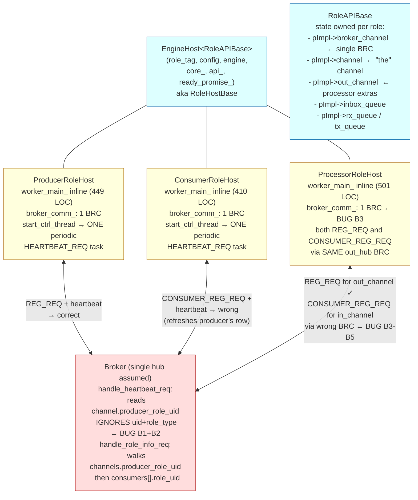
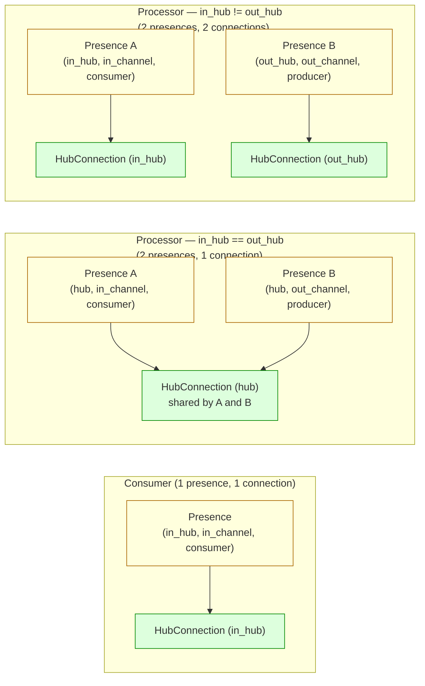
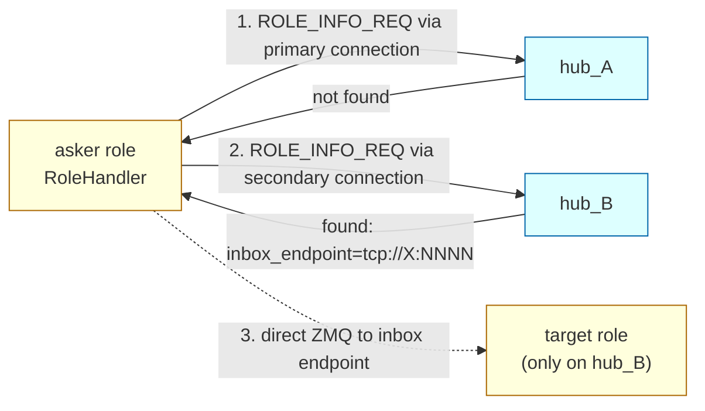
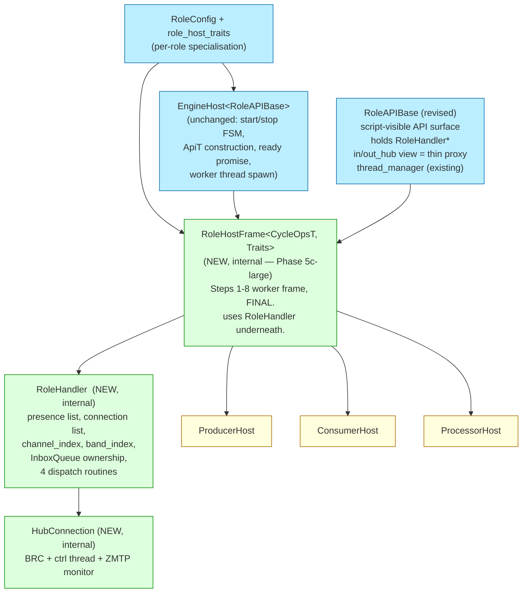
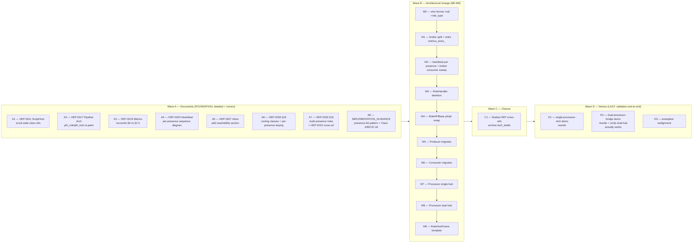

# Role Host & Hub-Control Plane — consolidated design

> **Status:** draft, not ratified.  Supersedes the earlier draft of
> 2026-05-06 (which only covered the 5c-large template absorption and
> assumed single-BRC-per-role).
>
> **Scope:** the role-side control plane against the hub.  Covers (1)
> the presence model that replaces the single-`broker_channel`
> assumption, (2) the four routing classes that classify every broker
> message, (3) the per-presence heartbeat + metrics protocol that
> resolves the consumer-heartbeat / dual-hub / metrics-misattribution
> bugs, (4) the templated `RoleHandler` abstraction that lets the
> existing 3 role kinds (and any future kind) sit on top of one
> well-defined frame, (5) the migration sequence that ships these
> changes safely.
>
> **Authoring session:** 2026-05-06.  **Branch:**
> `feature/lua-role-support`.
>
> When ratified, content lands in canonical HEP/IMPLEMENTATION_GUIDANCE
> per §15; the draft archives per `docs/DOC_STRUCTURE.md §2.2`.

---

## 1. Motivation — five concrete bugs, one root cause

Investigation surfaced five distinct bugs in the role-host control
plane.  They all stem from one architectural assumption:

> "Each role talks to **one** broker via a single `BrokerRequestComm`,
> identified implicitly by the channel it registers on."

That assumption was unstated, undocumented, and became wrong the moment
the design committed to dual-hub processors (HEP-CORE-0015 §83-84).

The five bugs:

| # | Symptom | Today's behaviour | Root cause |
|---|---|---|---|
| **B1** | Consumer's heartbeat masks the actual producer's death | Consumer's HEARTBEAT_REQ refreshes `channel(in_channel).last_heartbeat`, preventing the broker from demoting the channel even when the real producer is gone | HEARTBEAT_REQ wire payload omits `(uid, role_type)`; broker derives uid from `channel.producer_role_uid` |
| **B2** | Consumer's metrics are attributed to the producer's `RoleEntry` | Same root cause — broker writes consumer-side metrics into the producer's role row | same |
| **B3** | Dual-hub processor is invisible on its in_hub | Today's processor sends CONSUMER_REG_REQ via the **out_hub** BRC, going to the wrong hub.  In_hub never sees the processor as a consumer | Single-BRC assumption: only one ctrl thread, only one hub |
| **B4** | Dual-hub processor cannot discover its in_channel via DISC_REQ | `discover_channel` uses `pImpl->broker_channel` (the out_hub BRC); in_hub holds in_channel | same |
| **B5** | Dual-hub processor never receives `CHANNEL_*_NOTIFY` for in_channel | Processor's BRC isn't connected to in_hub; in_hub fan-outs to consumer-DEALERs that aren't there | same |

**Consequence**: even single-hub processor is silently broken (B1+B2);
dual-hub deployment of a processor doesn't work end-to-end (B3+B4+B5).
None of these surfaces as a test failure today because:

- B1/B2 require a producer-death scenario with an active consumer; no
  test exercises that.
- B3-B5 require dual-hub deployment with cross-hub registration
  semantics; the one demo (`share/py-demo-dual-processor-bridge`)
  works around them via `in_transport: zmq` with a hardcoded endpoint,
  bypassing the in_hub control path entirely.

The fix is one architectural change with one wire-protocol addendum:

1. **Architectural:** replace the implicit "one BRC per role" with an
   explicit *presence list*.  A role declares which `(hub, channel,
   role_kind)` triples it participates in; the runtime materialises
   the right number of BRCs.
2. **Protocol:** HEARTBEAT_REQ gains `uid` and `role_type` fields.  The
   broker keys per-presence metrics on `(channel, uid, role_type)`
   and refreshes only the matching presence row in `RoleEntry`.
   Channel observability is derived from the producer-presence's
   state — there is no separate channel-side FSM (HEP-CORE-0023 §2.6).

These two changes resolve all five bugs.  HEP-CORE-0019 §2.3 already
documented the per-presence heartbeat shape but never landed; this
draft makes it normative.

---

## 2. Non-goals

- **Hub federation (HEP-CORE-0022).**  Cross-hub queries (`asker on
  hub-A` → `target on hub-B`) are out of scope.  Each presence
  registers locally; admin tools aggregate across hubs externally.
- **Per-presence threading multiplicity.**  Each `HubConnection` still
  runs one ctrl thread.  Two presences sharing one connection share
  one ctrl thread.  We do not introduce per-presence threads.
- **CycleOps redesign.**  The data-loop layer (`run_data_loop` +
  `*CycleOps` classes) is unchanged.  This work is purely the
  control plane.
- **HubScriptRunner / hub-side script host.**  HEP-0033 Phase 7's
  `EngineHost<HubAPI>` instantiation is independent and unchanged.
- **`RoleHostCore` core state.**  The state container (atomics,
  message queue, metrics counters, inbox cache) is unchanged.
- **Removing the `METRICS_REPORT_REQ` wire message.**  Originally
  planned as deprecate-then-remove-next-release.  **Wave M1.4
  (2026-05-11) RETIRED in full** — wire message + role-side sender
  + broker handler + `metrics_store_` all deleted in one step.
  `broker_proto_major` bumped 1 → 2.

---

## 3. Current architecture (post-Phase 5c, pre-this-design)



**Key facts:**

- `RoleAPIBase::pImpl` holds **one** `broker_channel` pointer (`role_api_base.cpp:102`).
- `start_ctrl_thread` installs **one** heartbeat periodic task (`role_api_base.cpp:664-667`), regardless of how many presences the role has.
- HEARTBEAT_REQ wire payload (`broker_request_comm.cpp:617-625`):
  ```json
  { "channel_name": "...", "producer_pid": <pid>, "metrics": {...} }
  ```
  No `uid`.  No `role_type`.
- `handle_heartbeat_req` (`broker_service.cpp:1815-1869`) reads
  `producer_role_uid` from the channel, NOT from the heartbeat
  payload.  Whoever sends a heartbeat for channel X is treated as
  X's producer.

This is the surface every bug in §1 sits on.

---

## 4. The four routing classes — one principle for every broker message

Every broker message classifies into exactly one of four routing
classes.  The class determines how the abstraction routes the message
in both directions.

```
Class A — Channel-bound:    bound by channel_name
                            → route to/from BRC owning that channel.
Class B — Role-bound:       ask "is uid X alive / where's its inbox"
                            → fall-through over connections; first hit wins.
Class C — Hub-bound:        ask "what does THIS hub know"
                            → caller picks hub explicitly.
Class D — Band-bound:       bound by band_name; one hub per band
                            → route via the connection where the band was joined.
```

Full classification (pulled from `broker_service.cpp::kRequestReplyTypes`
+ `kFireAndForgetTypes` + `send_to_identity(...)` notification sites):

### Class A — Channel-bound

| Message | Direction | Notes |
|---|---|---|
| `REG_REQ` / `REG_ACK` | role → hub / hub → role | Producer presence. |
| `CONSUMER_REG_REQ` / `CONSUMER_REG_ACK` | role → hub / hub → role | Consumer presence. |
| `DEREG_REQ` / `DEREG_ACK` | role → hub / hub → role | Producer presence (shutdown). |
| `CONSUMER_DEREG_REQ` / `CONSUMER_DEREG_ACK` | role → hub / hub → role | Consumer presence (shutdown). |
| `DISC_REQ` / `DISC_ACK` / `DISC_PENDING` / `CHANNEL_NOT_FOUND` | role → hub / hub → role | Any caller wanting the channel's connection info. |
| `ENDPOINT_UPDATE_REQ` | role → hub | Producer presence (port-0 → resolved port). |
| `SCHEMA_REQ` / `SCHEMA_ACK` | role → hub | Owner-bound; routes via the connection where the owning record lives. |
| `CHANNEL_NOTIFY_REQ` | role → hub | Fire-and-forget; targets a channel. |
| `CHANNEL_BROADCAST_REQ` | role → hub | Fire-and-forget; broadcast on a channel. |
| `CHECKSUM_ERROR_REPORT` | role → hub | Consumer-detected; routes by channel. |
| **`HEARTBEAT_REQ` (per-presence variant)** | role → hub | **Both producer AND consumer presences send (revised)**; channel-bound. |
| `CHANNEL_CLOSING_NOTIFY` | hub → role | To every member; routes by channel. |
| `CHANNEL_EVENT_NOTIFY` | hub → role | To producer (and members for broadcast events). |
| `CHANNEL_BROADCAST_NOTIFY` | hub → role | Fan-out from BROADCAST_REQ. |
| `CHANNEL_ERROR_NOTIFY` | hub → role | Schema mismatch, etc. |
| `CONSUMER_DIED_NOTIFY` | hub → role | To producer. |
| ~~`FORCE_SHUTDOWN`~~ | — | **Removed 2026-05-07** along with the `Closing` channel state and `grace_heartbeats` (HEP-CORE-0023 §2.1).  Channel teardown is atomic on producer-presence Disconnected; consumers learn via `CHANNEL_CLOSING_NOTIFY` and any later `DISC_REQ` returns `CHANNEL_NOT_FOUND`. |

### Class B — Role-bound

| Message | Direction | Notes |
|---|---|---|
| `ROLE_PRESENCE_REQ` / `ROLE_PRESENCE_ACK` | role → hub | "Is uid X alive?" — fall through connections. |
| `ROLE_INFO_REQ` / `ROLE_INFO_ACK` | role → hub | Inbox metadata for uid; same fall-through. |

### Class C — Hub-bound

| Message | Direction | Notes |
|---|---|---|
| `CHANNEL_LIST_REQ` / `CHANNEL_LIST_ACK` | role → hub | Single hub's local view. |
| `METRICS_REQ` / `METRICS_ACK` | role → hub | Single hub's `MetricsStore`. |
| `SHM_BLOCK_QUERY_REQ` / `SHM_BLOCK_QUERY_ACK` | role → hub | Diagnostic. |

### Class D — Band-bound

| Message | Direction | Notes |
|---|---|---|
| `BAND_JOIN_REQ` / `BAND_LEAVE_REQ` / `BAND_BROADCAST_REQ` / `BAND_MEMBERS_REQ` | role → hub | Bands are per-hub (HEP-CORE-0030). |
| `BAND_JOIN_NOTIFY` / `BAND_LEAVE_NOTIFY` / `BAND_BROADCAST_NOTIFY` | hub → role | To band members. |

### Deprecated

| Message | Status |
|---|---|
| `METRICS_REPORT_REQ` | Deprecated; the consumer-only periodic task is removed; metrics ride per-presence HEARTBEAT_REQ payloads.  Wire handler stays for one release. |

---

## 5. Presence model + HubConnection abstraction

### 5.1 Definitions

```
Presence = a single (hub, channel, role_kind, schemas, inbox metadata)
           tuple identifying ONE registration this role maintains.

HubConnection = a single (BrokerRequestComm, ctrl thread, ZMTP socket
                monitor) identifying ONE physical connection to a
                broker.

A role declares its presence list at startup.  HubConnections are
materialised by deduplicating presences by their (broker_endpoint,
broker_pubkey) pair.  Multiple presences MAY share one connection.
```

### 5.2 Per-role presence-list shape

```
Producer:                              [{ out_hub, out_channel, producer }]
Consumer:                              [{ in_hub,  in_channel,  consumer }]
Processor (single-hub: in==out):       [{ hub,     in_channel,  consumer },
                                         { hub,     out_channel, producer }]   ← 2 presences, 1 BRC
Processor (dual-hub: in!=out):         [{ in_hub,  in_channel,  consumer },
                                         { out_hub, out_channel, producer }]   ← 2 presences, 2 BRCs
Future N-input router:                 [{ hubA, chA, consumer },
                                         { hubB, chB, consumer },
                                         { hubC, chC, producer }]              ← 3 presences, 1-3 BRCs
```

### 5.3 Lookup indexes

The `RoleHandler` builds three indexes at startup, all O(1) at dispatch:

```
channel_index : map<channel_name, Presence*>     ← Class A routing
band_index    : map<band_name,    Presence*>     ← Class D routing
                                                   (populated lazily on band_join)
connections   : vector<HubConnection>            ← deduplicated; Class B fall-through
```

A role's `RoleHandler` lifetime owns the presence vector + the
connection vector + both maps.  Each `Presence` holds a non-owning
pointer to its `HubConnection`.

### 5.4 Deduplication rule

Two presences collapse to one connection iff their resolved
`(broker_endpoint, broker_pubkey)` pair is bitwise-equal.  Same broker
process, same identity → one DEALER socket.

This makes the optimisation operator-invisible:

- Single-hub deployment (`hub_dir` only, OR `in_hub_dir` ==
  `out_hub_dir`): one connection, one DEALER, two heartbeats over the
  same socket.
- Dual-hub deployment: two connections, two DEALERs, one heartbeat per
  hub.
- Mixed-resolved-same: e.g. `in_hub_dir` and `out_hub_dir` happen to
  point at the same broker — runtime detects via endpoint+pubkey match
  and collapses.

### 5.5 Diagram — three topologies, one model



The presence list is identical between the two processor topologies.
Only the dedup result differs.

### 5.6 New data structures (sketch)

```cpp
// Internal — header in src/include/utils/role_presence.hpp
//            (PYLABHUB_UTILS_EXPORT not needed; per-binary use only)

namespace pylabhub::scripting
{

enum class RoleKind : uint8_t { Producer = 1, Consumer = 2 };

struct Presence
{
    config::HubRefConfig hub;            ///< Resolved (broker, pubkey).
    std::string          channel;        ///< Channel name on `hub`.
    RoleKind             role_kind;
    hub::SchemaSpec      slot_spec;      ///< Set during schema-resolve step.
    hub::SchemaSpec      fz_spec;
    nlohmann::json       inbox_meta;     ///< Same per-role copy on every presence.
    HubConnection       *connection{nullptr};   ///< Set during dedup.
};

class HubConnection
{
public:
    std::unique_ptr<hub::BrokerRequestComm> brc;
    // ctrl thread spawned via ThreadManager::spawn — owned by RoleAPIBase::thread_manager
    // hub-dead callback wired once at construction
    // on_notification routes inbound by inspecting body channel_name / band_name
    // and tagging IncomingMessage with originating Presence*

    // Identity for dedup
    std::string broker_endpoint;
    std::string broker_pubkey;
};

class RoleHandler
{
    std::vector<Presence>             presences_;
    std::vector<HubConnection>        connections_;
    std::unordered_map<std::string, Presence*> channel_index_;
    std::unordered_map<std::string, Presence*> band_index_;        // populated lazily
    std::unique_ptr<hub::InboxQueue>  inbox_queue_;                // one per role

public:
    bool start();         // build connections, register each presence, install ticks
    void shutdown();      // reverse

    // ── Dispatch (4 classes; each is O(1) after maps are built) ─────────
    // Class A
    void send_class_A(const std::string &channel, std::string_view msg_type,
                      nlohmann::json body);
    // Class B
    std::optional<nlohmann::json> query_role(const std::string &uid,
                                             std::string_view msg_type,
                                             nlohmann::json body);
    // Class C
    std::optional<nlohmann::json> query_hub(const std::string &hub_side,
                                            std::string_view msg_type,
                                            nlohmann::json body);
    // Class D
    void send_class_D(const std::string &band_name, std::string_view msg_type,
                      nlohmann::json body);
};
} // namespace
```

`HubConnection` is value-typed in the connections vector; presences
hold raw `HubConnection*` (vector contents are stable for the
RoleHandler's lifetime — connections are not added/removed mid-flight).

---

## 6. Per-presence heartbeats — the protocol fix

### 6.1 Wire-format addition (HEARTBEAT_REQ)

Today (`broker_request_comm.cpp:617-625`):

```json
{
  "channel_name": "<channel>",
  "producer_pid": <pid>,
  "metrics":      { ... }       // optional
}
```

Revised:

```json
{
  "channel_name": "<channel>",
  "uid":          "<role uid>",     // NEW — required
  "role_type":    "producer" | "consumer" | "processor",   // NEW — required
  "producer_pid": <pid>,            // legacy; retained for back-compat audit
  "metrics":      { ... }           // optional, scoped to this presence
}
```

`uid` and `role_type` are required post-fix.  Old broker handlers
silently ignore the new fields; new broker handlers require them and
LOGGER_ERROR if missing.

### 6.2 Broker-side handler revision

`handle_heartbeat_req` looks up the matching presence row keyed on
`(uid, role_type)` and refreshes only that row:

```
read channel_name, uid, role_type from payload

presence = RoleEntry(uid).find_presence(channel_name, role_type)
if not presence: LOGGER_WARN("HEARTBEAT_REQ for unknown presence"); return

refresh presence.last_heartbeat
advance presence FSM:
    if was Pending: transition to Connected (bump pending_to_connected_total)
    else: stay Connected (refresh state_since unchanged)

if payload has metrics:
    write MetricsStore[(channel_name, uid, role_type)] = metrics
```

There is no `role_type`-conditional branch.  Both producer and
consumer presences run through the **same** lookup-and-refresh code
path.  The asymmetry only appears when a presence later transitions
to `Disconnected` (via heartbeat timeout or `DEREG_REQ`): the
`on_role_disconnected` hook checks `role_type == "producer"` and, if
so, removes the matching `ChannelEntry` and emits
`CHANNEL_CLOSING_NOTIFY`.

The metrics store is keyed on `(channel_name, uid, role_type)`.  Two
distinct rows for a processor's two presences, even on the same hub.

### 6.3 Heartbeat tick count (table)

| Topology | Presences | Heartbeats sent / cycle | Distinct presence rows refreshed | Distinct metric rows updated |
|---|---|---|---|---|
| Producer | 1P | 1 | 1 | 1 |
| Consumer | 1C | 1 | 1 | 1 |
| Processor, single-hub (in==out) | 1C + 1P | 2 (over same DEALER) | 2 | 2 |
| Processor, dual-hub | 1C + 1P | 1 to in_hub + 1 to out_hub | 2 (one per hub) | 2 (one per hub) |
| Future N-input router | k consumers + 1 producer | k+1 | k+1 | k+1 |

Heartbeat-cadence math (HEP-CORE-0023 §2.5) is unchanged: each
presence's tick fires every `effective_interval_ms`.  Multiple presences
sharing a connection emit multiple frames per tick interval over one
DEALER — same socket, multiple wire frames.

### 6.4 Rationale: why per-presence

Each presence has its own liveness state AND its own metrics view
(consumer's input-queue metrics ≠ producer's output-queue metrics);
they need distinct rows in the broker's store to be queryable AND
distinct FSM rows so that one presence going silent does not affect
the other.

Per-presence heartbeats give:

- Per-presence liveness state — a processor's silent consumer-side
  is reaped without disturbing its producer-side
- Per-presence metrics rows — admin queryable by `(channel, uid, role_type)`
- Consumer's heartbeat no longer corrupts producer state (B1+B2 fixed)
- One protocol covers both the liveness and the metrics flows
- Channel observability falls out for free — query the producer-
  presence's state for that channel

---

## 7. Inbox placement (per-role, not per-presence)

### 7.1 InboxQueue lifetime

The `InboxQueue` is **per role**, not per presence.  Reasons:

- Inbox is a direct ZMQ ROUTER socket bound at one endpoint.  One
  socket, one endpoint, one schema, one buffer.  A role doesn't gain
  a new inbox by gaining a presence.
- Inbox messages don't traverse any hub (HEP-0027 §1).  No hub-side
  routing involved on the data path.
- Sender info (`sender_uid`) is in the message header — origin tag
  is intrinsic.

### 7.2 Inbox metadata advertisement

The same inbox endpoint, schema, packing, checksum is advertised on
**every** presence's registration payload (REG_REQ or
CONSUMER_REG_REQ).  Today's `append_inbox` lambda
(`role_api_base.cpp:576-585`) already does this correctly for the
single-BRC case; the revised abstraction repeats the same append on
every per-presence registration.

### 7.3 Reachability requirement

For dual-hub deployment, the operator MUST bind the inbox endpoint to
an address routable from senders on **all** hubs the role registers
with.  E.g. binding to `tcp://127.0.0.1:NNNN` is fine for same-host
deployment but breaks cross-host inbox messaging.  HEP-CORE-0027 needs
a binding-guidance section added (§14).

### 7.4 Discovery

`open_inbox(target_uid)` issues `ROLE_INFO_REQ` (Class B, fall-through)
to find the target's inbox.  In a dual-hub deployment where the role
asking and the target are on different hubs, the asker's
`RoleHandler::query_role(target_uid, ...)` falls through to its
secondary connection if the primary returns "not found".



---

## 8. Class C — explicit hub-bound API surface

Hub-bound queries (CHANNEL_LIST, METRICS, SHM_BLOCK_QUERY) cannot be
auto-routed because the question is "what does THIS hub know".  The
script-side API needs explicit hub-side selection:

```
api.in_hub.list_channels()
api.in_hub.query_metrics(channel?)
api.in_hub.query_shm_blocks()
api.out_hub.list_channels()
...
```

Single-hub roles have only one hub-handle; idiomatic shorthand
`api.hub` resolves to it.  In dual-hub roles, scripts MUST specify
which side; calling `api.hub.list_channels()` is a programming
error and the framework rejects it (compile-time if possible,
runtime ERROR otherwise).

This matches HEP-CORE-0015 §408's documented `api.in_hub.*` /
`api.out_hub.*` API surface.

---

## 9. Class D — band routing

Bands live entirely on one hub (HEP-CORE-0030).  When a role joins a
band, the handler picks (or the script specifies) which presence's
connection holds it.  Subsequent band ops route via the recorded
connection.

```
api.band("foo").join()                    // ambiguous → use primary presence
api.in_hub.band("foo").join()             // explicit
api.out_hub.band("foo").join()            // explicit on the other side
```

Single-hub roles: only one valid choice; `api.band(...)` works.

Dual-hub processor: script must pick a side.  If the same band name
is joined on both hubs, those are two separate bands (two `band_index_`
entries in the handler).  The framework permits this but logs INFO at
join time.

---

## 10. Module / class structure

### 10.1 Layered view



### 10.2 What RoleAPIBase becomes

Today `RoleAPIBase::pImpl` holds `broker_channel` directly.  Revised:

```cpp
class RoleAPIBase
{
    // ... existing fields ...

    // REPLACED:
    //   hub::BrokerRequestComm *broker_channel;     ← deleted
    // WITH:
    RoleHandler *handler;         ///< Set by EngineHost during startup_().

    // Existing pImpl members reach the right BRC via handler:
    //   - discover_channel(name)        → handler->dispatch_class_A(name, "DISC_REQ", ...)
    //   - register_consumer(opts)       → handler->register_for_presence_with_kind(Consumer)
    //   - send_heartbeat (period task)  → handler installs per-presence ticks
    //   - …
};
```

The pImpl gains a `RoleHandler*` and loses `broker_channel`.  Public
methods that used to read `pImpl->broker_channel` directly become
delegations to the handler.

This is the surface change derived classes (and tests) see.  The
`thread_manager()`, the api setters (set_name, set_log_level, …),
the script-API methods (log, metrics, uid, channel) are all unchanged.

### 10.3 What EngineHost knows

`EngineHost<RoleAPIBase>` continues to:
- Own the role-tag, config, engine, RoleHostCore.
- Construct `RoleAPIBase` lazily in `startup_()`.
- Spawn the worker thread.

It additionally owns the `RoleHandler` (created in `startup_()`,
destroyed in `shutdown_()`).  The `RoleAPIBase` gets a pointer to the
handler at construction.

### 10.4 What changes inside the worker thread

The worker frame's Step 6 (broker register + ctrl thread launch)
calls `handler.start()` instead of `api_.start_ctrl_thread(...)`.
`handler.start()` does:

```
handler.start():
  1. for each Presence p in presences_:
       resolve (broker_endpoint, broker_pubkey) from p.hub
  2. dedupe → connections_
  3. for each HubConnection c:
       c.brc.connect(...)
       spawn ctrl thread via api_.thread_manager().spawn(...)
       wire c.brc.on_hub_dead → core_.set_stop_reason(HubDead)
       wire c.brc.on_notification → tag-and-enqueue-with-presence
  4. for each Presence p:
       payload = build_registration(p)         ← presence-aware
       append inbox metadata if inbox_queue_ is configured
       p.connection.brc.register_*(payload)
       install per-presence heartbeat tick on p.connection.brc
  5. negotiate effective heartbeat_interval_ms (per HEP-0023 §2.5)
  6. (optional) startup coordination — wait_for_required_roles
```

The frame's Steps 1-5, 7-8, 9-14 are unchanged — they touch shared
per-role state that doesn't depend on which hub.

### 10.5 What CycleOps and the data loop do

Unchanged.  `run_data_loop` reads `IncomingMessage` from
`RoleHostCore::incoming_queue_` regardless of which BRC enqueued it.
Each `IncomingMessage` carries an originating-presence tag for scripts
that care; scripts that don't ignore it.

---

## 11. Template abstraction shape (5c-large + presence model)

The `RoleHostFrame<CycleOpsT, Traits>` template absorbs Steps 1-8 of
the worker thread.  Variations between roles are captured by:

- `Traits` (compile-time constants + extractor function pointers)
- `CycleOpsT` (template parameter for the data-loop's role-specific
  cycle ops; already exists)

### 11.1 Traits shape

```cpp
template <typename HostT> struct role_host_traits;

template <> struct role_host_traits<ProducerHost>
{
    static constexpr const char *role_tag      = "prod";
    static constexpr const char *role_label    = "producer";
    static constexpr const char *required_cb   = "on_produce";
    using CycleOps                             = ProducerCycleOps;
    static auto presences(const config::RoleConfig &c)
        -> std::vector<PresenceInputs>
    {
        return { { c.out_hub(), c.out_channel(), RoleKind::Producer,
                   c.role_data<ProducerFields>().out_slot_schema_json,
                   c.role_data<ProducerFields>().out_flexzone_schema_json } };
    }
};

template <> struct role_host_traits<ConsumerHost>
{
    static constexpr const char *role_tag      = "cons";
    static constexpr const char *role_label    = "consumer";
    static constexpr const char *required_cb   = "on_consume";
    using CycleOps                             = ConsumerCycleOps;
    static auto presences(const config::RoleConfig &c)
        -> std::vector<PresenceInputs>
    { ...one consumer presence on in_hub... }
};

template <> struct role_host_traits<ProcessorHost>
{
    static constexpr const char *role_tag      = "proc";
    static constexpr const char *role_label    = "processor";
    static constexpr const char *required_cb   = "on_process";
    using CycleOps                             = ProcessorCycleOps;
    static auto presences(const config::RoleConfig &c)
        -> std::vector<PresenceInputs>
    {
        return {
          { c.in_hub(),  c.in_channel(),  RoleKind::Consumer, ... },
          { c.out_hub(), c.out_channel(), RoleKind::Producer, ... },
        };
    }
};
```

### 11.2 Frame skeleton

```cpp
template <typename HostT>
class RoleHostFrame : public scripting::RoleHostBase
{
    using Traits   = role_host_traits<HostT>;
    using CycleOps = typename Traits::CycleOps;

public:
    using RoleHostBase::RoleHostBase;

protected:
    // Hooks derived classes override.  These are the per-role-specific
    // queue construction details that don't belong in the frame.
    virtual bool build_data_queues_(const PresenceVec &presences) = 0;
    virtual void teardown_data_queues_() = 0;
    virtual CycleOps build_cycle_ops_() = 0;

private:
    void worker_main_() final;   // Steps 1-8 + epilogue, FINAL — no derived override

    RoleHandler handler_;        // owns presences, connections, inbox
};
```

### 11.3 Why FINAL on `worker_main_`

The 8-step sequence has tight ordering invariants (engine before
on_init, on_init before broker register, broker register before ready
promise, ready promise before data loop, data loop before teardown).
Marking the function `final` makes the type system enforce that no
derived class can reorder steps — the only way to vary behaviour is
via the three protected hooks.

### 11.4 Runtime cost analysis

| Operation | Cost | Notes |
|---|---|---|
| Startup: build presence list from traits | O(N) where N = presences (1, 2, or 3) | once at startup |
| Startup: dedupe to connections | O(N²) | N ≤ 3; ~9 comparisons; negligible |
| Startup: register each presence | O(N) round-trips to broker | unavoidable |
| Per-cycle: heartbeat ticks | O(N) (one tick per presence) | small JSON+wire work, multiplied by N |
| Per-cycle: data-loop drain → script | O(1) | unchanged from today |
| Class A dispatch (e.g. DISC_REQ from script) | O(1) hashmap lookup | `channel_index_` |
| Class B dispatch (e.g. ROLE_INFO_REQ) | O(connections) fall-through | typically 1-2 connections |
| Class C dispatch | O(1) once `hub_side` arg picks the connection | |
| Class D dispatch | O(1) `band_index_` lookup | |
| Notification inbound (BRC → IncomingMessage) | O(1) lookup of originating presence | by `body.channel_name` |
| Template instantiation | compile-time | 3 instantiations today |
| Virtual dispatch | only `build_data_queues_` / `teardown_data_queues_` / `build_cycle_ops_` (cold path) | hot data-loop path uses CycleOps duck typing |

**No additional virtual dispatch on hot paths.**  Heartbeat ticks are
already a periodic task (existing `set_periodic_task` machinery);
adding more presences just installs more periodic tasks.  Data-loop
inner loop is unchanged.

The single cost increase is **per-cycle heartbeat work proportional to
N**.  For producer/consumer (N=1) → identical to today.  For
processor (N=2) → one extra HEARTBEAT_REQ frame per cycle, which is
tiny compared to data-frame traffic.

### 11.5 ABI stability

`RoleHostFrame<HostT>` is a template; instantiations are per-binary
(only `plh_role` consumes them).  No new symbols on `pylabhub-utils.so`'s
public ABI.

`RoleAPIBase`'s pImpl change (replacing `broker_channel` with
`RoleHandler*`) is internal — pImpl is opaque to consumers.  `RoleAPIBase`'s
public method signatures don't change.  The C-API surface (the only
public surface per project policy) is untouched.

Backward compatibility for derived classes that today inherit
`RoleHostBase` directly: the alias becomes a less-direct base
class, but inheritance still works.  Source-compatible.  Symbol
mangling will change for the new template instantiations (they get
new mangled names) — pre-refactor binaries linking against the new
library hit unresolved-symbol.  The build_id strict check
(`PYLABHUB_STRICT_ABI_CHECK`) catches stale-binary cases; bump the
`script_engine` axis minor as the declared signal.

---

## 12. Sequence-preservation contract

The migration MUST execute the same observable sequence as today's
correct paths AND fix the bug paths.  The "same observable sequence"
contract has two halves:

### 12.1 Steps that MUST behave identically

| Today's behaviour | Template behaviour |
|---|---|
| Step 1 schema resolve | identical (per-presence inputs from traits) |
| Step 1.5 size store on core_ | identical |
| Step 2 setup_data_queues_ failure → teardown + promise(false) + return | identical |
| Step 3 wire api_ (set_name, set_log_level, set_script_dir, set_role_dir, set_inbox_queue, set_engine, set_checksum_policy, set_stop_on_script_error) | identical |
| Step 4 engine_lifecycle_startup try-catch + validate-only early-exit | identical |
| Step 5 invoke_on_init + sync_tx_flexzone_checksum | identical |
| Step 6b wait_for_required_roles | identical, but uses Class B fall-through (so dual-hub processor's wait can find roles on either hub) |
| Step 7 promise(true) | identical |
| Step 8 run_data_loop with CycleOps | identical |
| Steps 9-14 do_role_teardown | identical |

### 12.2 Steps that intentionally CHANGE (bug fixes)

| Today's (buggy) behaviour | Template (fixed) behaviour |
|---|---|
| Single ctrl thread, single BRC, both REG_REQ + CONSUMER_REG_REQ via same connection | Per-presence ctrl thread + BRC; each registration via its own connection |
| Single heartbeat tick per cycle | Per-presence heartbeat tick |
| HEARTBEAT_REQ wire payload omits `uid`, `role_type` | Wire payload includes both |
| Broker derives uid from `channel.producer_role_uid` | Broker reads `(uid, role_type)` from payload; looks up the matching presence row in `RoleEntry`; refreshes only that presence; keys metrics on `(channel, uid, role_type)` |
| `ChannelEntry.status` and `ChannelEntry.last_heartbeat` carry the FSM, refreshed by any heartbeat for the channel | `ChannelEntry` holds no FSM fields; channel observability is derived from the producer-presence's state in `RoleEntry` (HEP-CORE-0023 §2.6) |
| Consumer's heartbeat refreshes the producer's bookkeeping (masking producer death) | Consumer's heartbeat refreshes only its own consumer-presence row |
| `discover_channel` always uses `pImpl->broker_channel` (single BRC) | Routes by channel name to the right presence's connection |
| `api.broadcast_channel(...)` always uses primary BRC | Class A routing by target channel |

The bug fixes are observable:
- Producer death no longer masked by consumer heartbeats (B1).
- Consumer metrics no longer attributed to producer (B2).
- Dual-hub processor visible on both hubs (B3-B5).

These cannot be tested via "the same sequence" mutation sweep —
they're behaviour CHANGES.  The §13 test plan covers them with new
tests.

### 12.3 Mutation sweep (preservation half)

Same approach as the earlier draft: for each step that should NOT
change behaviour, mutate or stub a step in the new template; build;
run the suite; confirm at least one existing test fails.

| Mutation target | Expected failure |
|---|---|
| Skip `engine.invoke_on_init()` | role_host_base lifecycle test |
| Reorder `core_.set_running(true)` after data loop entry | L4 producer round-trip — never enters loop |
| Skip `sync_tx_flexzone_checksum` | L3 flexzone checksum test |
| Reorder ready_promise(true) before broker register | L4 wait_for_roles tests |
| Skip `do_role_teardown` finalize | role_host shutdown test |
| Reorder validate-only early-exit | --validate L4 test |
| Skip schema-resolve try-catch | L4 plh_role validate test |

Run before producer/consumer wrappers collapse to template form so
both code paths are present for direct A/B.

---

## 13. Test rigor — preservation + bug-fix coverage

### 13.1 Preservation tests (run on every migration phase)

The existing 12 RoleHostBase lifecycle tests + 71 plh_role L4 tests
+ L3 broker round-trip tests stay green at every commit.  No tests
weakened or deleted.

### 13.2 New tests for the bug fixes

**B1 — Producer-death visibility:**
- L4 test spawns plh_hub + plh_role producer + plh_role consumer.
- SIGKILL the producer.
- Assert: hub log shows channel demoted Ready → Pending within
  `heartbeat_interval × ready_miss_heartbeats`.
- (Without the fix, consumer's heartbeats keep refreshing the
  channel; the demotion never fires.)

**B2 — Consumer metrics attribution:**
- L3 broker test: register a producer + consumer.  Consumer reports
  custom metric `{"foo": 42}` via `api.report_metric`.  Producer
  reports `{"bar": 99}`.
- Assert: METRICS_REQ for the channel returns rows for BOTH
  `(channel, prod_uid, "producer")` with `bar=99` AND
  `(channel, cons_uid, "consumer")` with `foo=42`.  No cross-attribution.

**B3-B5 — Dual-hub processor end-to-end:**
- L4 test spawns 2 plh_hubs, plh_role producer on hub-A, plh_role
  processor with `in_hub_dir=A`, `out_hub_dir=B`, plh_role consumer
  on hub-B.
- Assert via hub logs:
  - hub-A shows processor registered as consumer of in_channel
  - hub-A shows processor's heartbeats arriving (consumer-side)
  - hub-B shows processor registered as producer of out_channel
  - hub-B shows processor's heartbeats arriving (producer-side)
  - data flows end-to-end (consumer's log shows processed values).
- Class-D ERROR-log gate.

**Per-presence metrics on single-hub processor:**
- L3 test: spawn processor on a single hub, drive a few iterations,
  query METRICS_REQ for the processor's uid.
- Assert: TWO rows returned — `(in_channel, proc_uid, "consumer")`
  AND `(out_channel, proc_uid, "producer")` — each carrying the
  appropriate direction-specific queue metrics.

**Class B fall-through:**
- L4 test: dual-hub processor + a role on in_hub.  Processor's
  `wait_for_roles([in_hub_role_uid])` succeeds.  Then a role on
  out_hub.  Processor's `wait_for_roles([out_hub_role_uid])` succeeds.
- Pre-fix the second wait_for_roles would have queried the wrong hub.

### 13.3 Mutation sweep (bug-fix half)

For each bug fix, deliberately re-introduce the bug in the broker
or role-host code; confirm the new B1/B2/B3-B5 tests fail.  Restore
before commit.

---

## 14. Migration plan (revised — docs first, demos last)

The §17 audit surfaced four categories of staleness; the user's
direction (2026-05-06 session) sets the priority order:

> **Documents must be detailed and correct — that's the key.  Tests
> must be revised and added to actively cover the revised design,
> not just preserve old behaviour.  Demos can wait until the very
> last.**

The migration is therefore four waves:



**Priority and sequencing:**

- Wave A goes first because **a correct understanding of the design comes from correct documents**.  Implementing against contradictory HEPs propagates the contradiction into code.  Wave A items can land in parallel within Wave A but Wave A as a whole precedes Wave B.
- Wave B is the architectural work.  Tests are **actively revised + added** at every phase to cover the revised design — not merely preservation.
- Wave C closes by ratifying any HEP language that depended on Wave B verifying the design.
- Wave D rewrites the demos LAST.  By that point the architecture is correct, tests pass, HEPs are normative.  Rewriting demos earlier risks chasing a moving target; rewriting last gives a final integration validation against a known-good substrate.

### 14.1 Wave A — Documents (foundation)

Wave A is **detailed work**, not "just text edits".  Every section
referenced must be rewritten to match the design in this draft —
sentence by sentence, diagram by diagram, table by table.  Where a
HEP has a contradiction, it must be resolved with a clear "this
supersedes that" note and the obsolete content removed (not crossed
out, not commented out).

| ID | File + sections | Specific changes | Audit cross-ref |
|---|---|---|---|
| **A1** | `HEP-CORE-0011-ScriptHost-Abstraction-Framework.md` lines 44, 70, 447 + threading-model deferral note | Replace `hub::Producer/Consumer` references with the actual current architecture: `RoleAPIBase` owns Tx/Rx queues internally; the role host owns `BrokerRequestComm` (or after Wave B: a `RoleHandler` with N hub connections).  Reframe the threading-model section now that HEP-0024 has shipped — describe what's actually current, not what was deferred.  Add a §"Status of this HEP after HEP-0024" subsection if the doc's scope materially shifted. | A1 |
| **A2** | `HEP-CORE-0017-Pipeline-Architecture.md` body + diagrams + binaries-table (§11/§12/§13) | Replace every occurrence of `pylabhub-{producer,consumer,processor,hubshell}` with the current launch form: `plh_role --role <tag>` for the three role kinds, `plh_hub` for the hub binary.  Update the binaries table to reflect actual binaries.  Update Mermaid diagrams.  The status note already acknowledges this — make the body match. | A2 |
| **A3** | `HEP-CORE-0019-Metrics-Plane.md` §9 (Implementation Phases) vs §2.3 (Phase 2 architecture) | Two contradictory truths in one HEP.  §9 still shows old "Phase 1-5" with `METRICS_REPORT_REQ ✅ shipped`; §2.3 says it's removed.  Resolution: rewrite §9 to mark Phase 1-5 as "historical (Phase-1 design, 2026-03-05)" — these LANDED but the architecture they implement was REPLACED by §2.3.  Add explicit "Phase 6: per-presence keying" entry pointing to this draft.  After Wave B+C, the per-presence keying becomes ✅ in §9. | A3 |
| **A4** | `HEP-CORE-0023-Startup-Coordination.md` §2 entire FSM section | Rewrite §2.1 from "Channel Lifecycle States" to "Role Lifecycle States" with three role states (Connected/Pending/Disconnected) and two timeouts (ready_miss/pending_miss).  Drop `Closing`/`grace_heartbeats`/`FORCE_SHUTDOWN`.  Drop `ChannelEntry.status` and `ChannelEntry.last_heartbeat` from §2.6 (channel observability is derived from the producer-presence's state).  Update Mermaid + transition tables to attribute transitions to per-presence FSM rows.  Cross-reference HEP-0019 §2.3.  Done 2026-05-07. | A4 |
| **A5** | `HEP-CORE-0027-Inbox-Messaging.md` (new §13 — Reachability and Multi-Hub Advertisement) | New section: when a role registers on N hubs (typically processor with N=2), the inbox endpoint MUST be bind-routable from senders connected to ALL N hubs.  Loopback (`tcp://127.0.0.1:NNNN`) is fine for same-host; cross-host requires `tcp://0.0.0.0:NNNN` or a specific routable NIC.  Document that inbox metadata is independently advertised on each presence's registration, so cross-hub `ROLE_INFO_REQ` finds the role via either hub. | A6 |
| **A6** | `HEP-CORE-0033-Hub-Character.md` — add new top-level **§18 "Broker message routing classes"** | Document the four-class taxonomy (A/B/C/D) with the full message-type table from §4 of this draft.  Update §8 (HubState entry-types) and §9 (Message-Processing Contract) so the role-table description matches the per-presence keying `(channel, uid, role_type)` introduced by HEP-CORE-0019 Phase 6.  This is the canonical home for the classification — once landed, all other docs reference HEP-0033 §18 rather than re-stating it.  Top-level §18 is chosen because the existing G2.x naming (G2.0/G2.1/G2.2 absorption phases + Appendix G2.2.0b naming-grammar) is already taken. | A7 |
| **A7** | `HEP-CORE-0033-Hub-Character.md` — add new top-level **§19 "Multi-presence roles"** + cross-ref from `HEP-CORE-0015 §83-84` | §19 absorbs the dual-broker design that lives only in HEP-CORE-0015 §83-84 (which is SUPERSEDED).  Defines presence list, HubConnection, dedup rule, per-presence-heartbeat semantics; canonical home for the multi-hub processor architecture.  Then HEP-CORE-0015 §83-84 gets a one-line replacement: "Dual-broker processor design previously documented here is now in HEP-CORE-0033 §19."  HEP-CORE-0015 stays SUPERSEDED for the binary-naming part. | A5 |
| **A8** | `IMPLEMENTATION_GUIDANCE.md` (new section) | Add: "Presence-list pattern for multi-hub roles" — pattern reference with code-snippet showing trait specialisation.  Add: "Broker message routing classes — quick-reference table" — short table linking each Class A/B/C/D message to the relevant code path.  These are short reference snippets pointing at HEP-0033 §18+§19 for full design. | (new — supports A6+A7) |

**Wave A acceptance criteria:**

- Each canonical HEP that this design touches reads correctly **standalone** — a reader can understand the current design without cross-referencing this tech_draft.
- No HEP claims an obsolete design as current.
- All cross-references between HEPs are exact (HEP-X §Y notation, with §Y existing).
- Mermaid diagrams render the current shape, not a historical one.

### 14.2 Wave B — Architectural change (M0-M9)

Each phase has three deliverables, all required:

1. **Code change** (the implementation).
2. **Test additions for the revised design** — new tests that pass against the revised behaviour AND would FAIL against the pre-revised behaviour (mutation-tested).
3. **Test revisions** — existing tests that pinned legacy behaviour are updated explicitly (not blindly retained).

Tests are not afterthoughts.  A phase is not done until its tests prove the new design is what's running.

| Phase | Code change | Test changes (revised design coverage) | Audit cross-ref |
|---|---|---|---|
| **M0** | `BrokerRequestComm::send_heartbeat(channel, uid, role_type, metrics)` API.  Wire payload gains `uid`, `role_type`.  All 14+ call sites in tests updated explicitly (no defaults). | **NEW**: `BrokerProtocolTest::Heartbeat_WirePayloadIncludesUidAndRoleType` — pin the new wire fields.  **REVISED**: every `bh.brc.send_heartbeat(channel, ...)` call site.  Mutation: omit `uid` from wire → test fails. | C2 |
| **M1** | `handle_heartbeat_req` keyed lookup over `RoleEntry(uid).find_presence(channel, role_type)`; per-`(channel, uid, role_type)` metrics keying.  Move FSM state from `ChannelEntry` (delete `status` + `last_heartbeat`) to per-presence rows on `RoleEntry`.  Retire `metrics_store_` legacy map. | **NEW**: `BrokerProtocolTest::HeartbeatKeying_ProducerVsConsumer_DistinctRows` — register P + C, both heartbeat with metrics, query returns 2 distinct rows.  **NEW**: `BrokerProtocolTest::ConsumerHeartbeat_DoesNotRefreshProducerPresence` — consumer heartbeats with producer absent; producer-presence demotes Connected→Pending→Disconnected on schedule (channel torn down on producer-presence Disconnected).  **NEW**: `BrokerProtocolTest::ChannelEntry_HasNoStoredFSMFields` — assert `ChannelEntry` no longer carries `status` / `last_heartbeat`; channel observability is derived.  **REVISED**: `MetricsReport_ConsumerStoredByBroker` confirmed still passing on the unified store. | B5 |
| **M2** ✅ shipped 2026-05-15 | Reframed during implementation: heartbeat is per-presence (HEP-CORE-0019 §2.3 Phase 6 + HEP-CORE-0033 §19), so the consumer's tick is NOT removed — every presence the role holds (producer, consumer, or both for a processor) emits one heartbeat per cycle.  The bug the original M2 description tried to capture was the OTHER side of the same gap: broker only swept producer-presences, so consumer-presence FSM mechanics never fired.  Shipped as a 3-commit sequence: (1) `RoleAPIBase::on_heartbeat_tick_` enumerates the role's presences and emits one heartbeat per `(channel, role_type)` — processor emits 2; `out_channel.empty() ? ...` hack gone; (2) HubState `_on_heartbeat_timeout` / `_on_pending_timeout` take `role_type` and branch on it — consumer path erases the `ChannelEntry.consumers[]` slot and runs `_dispatch_role_disconnected_if_dead`, with NO channel teardown; (3) broker sweep iterates `entry.consumers` in both passes and fires `CONSUMER_DIED_NOTIFY` with `reason="heartbeat_timeout"` to producers (symmetric with the PID-death path's `reason="process_dead"`). | **NEW** (L2, `tests/test_layer2_service/test_hub_state.cpp`): `HubStateConsumerHeartbeatTimeout::TransitionsConsumerPresenceToPending` (consumer Connected→Pending, producer untouched, channel-status handler MUST NOT fire); `HubStateConsumerPendingTimeout::TransitionsToDisconnected_ChannelSurvives` (consumer Pending→Disconnected, channel still alive, `channel_now_empty==false`); `HubStateConsumerPendingTimeout::LastPresence_TriggersRoleDisconnected` (last-presence consumer disconnect erases the RoleEntry).  **NEW** (L3, `tests/test_layer3_datahub/test_datahub_role_state_machine.cpp`): `DatahubRoleStateMachineTest::ConsumerHeartbeatTimeout_FiresConsumerDiedNotify` (real broker + producer-BRC + consumer-BRC; consumer stops heartbeating, producer's notification callback captures `CONSUMER_DIED_NOTIFY` with `reason="heartbeat_timeout"`; channel survives; consumer role entry erased).  Mutation: reverting the producer-only sweep iteration → L3 test fails (no notify arrives). | B1+B2, C3 |
| **M3** ✅ shipped 2026-05-15 | Headers for `Presence`, `HubConnection`, `RoleHandler`. Build-only. | **SHIPPED**: 13 L2 tests (`test_layer2_role_handler`, Pattern 1+) covering wire-string conversion, single/dual-hub topologies, dedup correctness, lookup edges, duplicate-channel LOGGER_ERROR path, pointer stability. | none |
| **M4** ⏳ in progress (M4a-d shipped; M4e/M4f pending) | `RoleAPIBase::pImpl` swap.  All `pImpl->broker_channel` sites delegate via handler.  Sub-shipped leaf-first per user direction:  **M4a ✅** (2026-05-15) ships `RoleHandler::start_connections(owner)` / `stop_connections()` — STATE-only.  Allocates BRC per HubConnection + connects DEALER socket.  NO thread spawning by the handler (RoleHandler is a state holder + routing helper; threads stay with RoleHost per the action-taker/state-holder separation).  See HEP-CORE-0031 §4.3.6 for the M4 thread transition plan.  **M4b ✅** (2026-05-15) adds routing primitives on `RoleHandler` — `brc_for_channel(ch)` / `brc_for_role(uid)` / `brc_for_band(band)` / `on_band_joined(band, ch)` / `on_band_left(band)` / `find_presence_from_notification(notify_json)`.  **M4c ✅** (2026-05-15) adds `RoleAPIBase::start_handler_threads(unique_ptr<RoleHandler>)` + `stop_handler_threads()` — spawns one ctrl thread per `handler.connections()` (first = MASTER per HEP-CORE-0031 §4.2.1, rest = peers), atomicity guard rejects mixing legacy `start_ctrl_thread` with handler-mode, sets `pImpl->broker_channel` to `connections()[0].brc.get()` as a legacy fallback view so unmigrated callers keep working.  **M4d ✅** (2026-05-15) migrates the Class A call sites (HEP-CORE-0033 §18 channel-bound) to route via `pImpl->resolve_bc_for_channel(channel)` — `register_producer_channel`, `discover_channel`, `register_consumer`, `deregister_producer_channel`, `deregister_consumer`, `on_heartbeat_tick_` lambda.  The helper falls back to `broker_channel` (legacy view) when handler-mode is inactive OR when the channel isn't in our presence list (e.g., DISC_REQ asking about a peer).  **M4e** (next) migrates Class B/C/D — `query_role_info` / `query_role_presence` / `open_inbox` (Class B), `band_join` / `band_leave` / `band_members` (Class C), `band_broadcast` (Class D).  **M4f** removes `pImpl->broker_channel`. | **SHIPPED M4a**: 3 L3 tests (`test_datahub_role_state_machine.cpp`, Pattern 3 IsolatedProcessTest) — `RoleHandler_Connections_StartStop_Smoke` (single producer), `RoleHandler_Connections_DualHub` (M8-payoff data shape), `RoleHandler_Connections_DoubleStart_Rejected` (idempotency).  All state-only — no thread assertions.  **SHIPPED M4b**: 16 L2 routing tests in `tests/test_layer2_service/test_role_handler.cpp` (RoleHandlerRouting suite) + 1 L3 test `RoleHandler_BrcForX_PostStart_PointerIdentity`.  **SHIPPED M4c**: 2 L3 tests `RoleAPIBase_StartHandlerThreads_E2E` (single-hub) + `RoleAPIBase_StartHandlerThreads_DualHub_E2E` (dual-hub, exercises `brc_for_channel` routing into both BRCs).  **SHIPPED M4d**: existing tests pass unchanged (1613/1613 L2+L3); M4d is a routing-helper migration where single-hub behaviour is byte-identical (handler returns same BRC as fallback view). | B3 |
| **M5** | `ProducerRoleHost::worker_main_()` builds 1-presence list and calls `handler.start()`. | **REVISED**: existing producer L4 tests pass unchanged (preservation).  **NEW**: `ProducerRoleHostTest::PresenceList_ContainsOneProducer` (L3) — observable via debug accessor on `RoleHandler`. | B1 |
| **M6** | `ConsumerRoleHost` same shape. | **REVISED**: existing consumer L4 tests pass.  **NEW**: `ConsumerRoleHostTest::PresenceList_ContainsOneConsumer`.  **NEW**: `ConsumerRoleHostTest::Consumer_NoHeartbeatTickInstalled` (verify M2 fix held through M6's restructure). | none |
| **M7** | `ProcessorRoleHost` 2-presence list.  Single-hub: dedup → 1 connection. | **REVISED**: existing processor L4 tests pass.  **NEW**: `ProcessorRoleHostTest::SingleHub_TwoPresences_DedupTo OneConnection` (L3).  **NEW**: `ProcessorMetrics_SingleHub_TwoDistinctRows` (L3 broker test) — single-hub processor, query metrics, returns rows for both `(in_channel, proc_uid, "consumer")` AND `(out_channel, proc_uid, "producer")`.  Mutation: send only one heartbeat → only one row appears, test fails. | B1 + partial B3-B5 |
| **M8** | Dual-hub processor: 2 presences → 2 connections. | **NEW**: `DualHubProcessor_BothHubsSeeProcessor` (L4) — spawn 2 plh_hubs + producer (hub-A) + processor (in=A, out=B) + consumer (hub-B); verify hub-A's role table has processor as consumer of in_channel; hub-B's role table has processor as producer of out_channel; data flows end-to-end.  **NEW**: `DualHubProcessor_HubADead_RoleExits` (L4) — kill hub-A; verify processor exits with `StopReason::HubDead`.  **NEW**: `DualHubProcessor_InboxReachableFromBothHubs` (L4) — sender on hub-A and sender on hub-B both `open_inbox(processor_uid)` and successfully send a message (verify A5 reachability section's contract). | resolves B3-B5, validates A5 |
| **M9** | Roles inherit `RoleHostFrame<HostT>`. `worker_main_` becomes `final` in template.  Trait specialisations land. | **REVISED**: every role host test fixture continues to spawn the host the same way.  **NEW**: full §12.3 mutation sweep on the new template body.  **NEW**: `RoleHostFrameTest::WorkerMainSequence_StepsExecuteInDocumentedOrder` (L2) — instrument the engine to record the call sequence, assert it matches §12.1 step-for-step. | 5c-large complete |

**Wave B test rigor — explicit:**

- Every "NEW" test is mutation-verified (write-failing → fix → green; or break the production code → confirm test goes red).
- Every "REVISED" test gets a comment explaining what changed and why.
- No test is silently retained when its premise changed.  If a test was pinning buggy behaviour (e.g., consumer's HEARTBEAT_REQ refreshing the producer's presence row), it gets explicitly REPLACED by a test that pins the corrected behaviour.

### 14.3 Wave C — Closure

| ID | Touches |
|---|---|
| **C1** | Finalise any HEP cross-references that depended on Wave B verifying the design (e.g., HEP-0033 §18's table now references the actual implementation files; HEP-0019 §9 marks "Phase 6: per-presence keying" as ✅ shipped).  Archive this tech_draft to `docs/archive/transient-YYYY-MM-DD/` per `DOC_STRUCTURE.md §2.2` with a one-line entry in `DOC_ARCHIVE_LOG.md`.  Archive `HUB_TEST_COVERAGE_PLAN.md` (work it tracked is closed by Wave B).  Refresh `MEMORY.md`.  Close the M0-M9 block in `MESSAGEHUB_TODO.md`. |

### 14.4 Wave D — Demos (LAST)

Demos are non-functional today (D1-D3 in §17.4) and can wait.
Rewriting them at the end gives:

- A known-good runtime substrate to validate against (Wave B+C complete).
- The dual-processor-bridge demo can actually verify dual-hub
  end-to-end works (M8's contract).
- No risk of demos being rewritten then re-broken by ongoing work.

| ID | Touches |
|---|---|
| **D1** | `share/py-demo-single-processor-shm/run_demo.sh` rewritten for `plh_hub` + `plh_role --role <tag>`.  `--dev` references removed (the flag is gone).  Demo runs end-to-end; consumer prints throughput; on Ctrl-C all processes exit cleanly with no [ERROR] log lines. |
| **D2** | `share/py-demo-dual-processor-bridge/run_demo.sh` rewritten for the new binary names.  Verifies the dual-hub processor case actually works post-M8 (this is the first end-to-end exercise of B3-B5 fixes outside the L4 test).  Both hubs see processor in their role tables (visible via admin shell or hub log). |
| **D3** | `examples/README.md` realigned with the 4 surviving cpp examples.  Decision: either delete the README's references to non-existent files OR rewrite the missing examples.  This is a separate sub-decision the user makes when D3 starts. |

**Wave D acceptance criteria:**

- Both demos run successfully on a fresh checkout, producing observable
  end-to-end data flow.
- No `[ERROR]` lines in any role's log under normal operation.
- Demo logs serve as the operator-facing cross-check that the design
  works as documented.

### 14.5 Roll-back semantics

- **Wave A** items are doc-only.  Pure revert if anything is wrong.
- **Wave B M0+M1** are the wire/broker change pair.  After M1, pre-M0 binaries cannot talk to the new broker (wire fields are required).  Bump `kBrokerProtoMinor` (or `kScriptApiMinor`) in `plh_version_registry.hpp` as the declared signal.
- **Wave B M2-M8** each independently revertible; later phases standing on earlier ones unwind in reverse order.
- **Wave C** is doc + cleanup; revert is trivial.
- **Wave D** is demo-only; revert is trivial.

### 14.6 Step-equivalence proof obligation

M5/M6/M7 commit messages must each include a side-by-side diff
showing the `RoleHandler`-driven worker thread emits the same call
sequence as the inline version (modulo the §12.2 intentional
changes).  This is mechanical but non-negotiable; the only way to
be sure no fold loses a step.

### 14.7 Tracking

`docs/todo/MESSAGEHUB_TODO.md` gets a new section listing the four
waves.  Each line records the commit hash on landing.  Closure entry
on Wave C C1 references this draft (soon-to-be-archived).

---

## 15. HEP / canonical-doc update map

The map below splits into two phases:

- **Wave A doc edits** — done BEFORE Wave B starts.  These are the
  staleness fixes that bring HEPs into alignment with current code +
  this design.  They include the substantive design content (routing
  classes, presence model, per-presence keying) so that Wave B
  implementation has a correct spec to build against.
- **Wave C closure** — done AFTER Wave B completes.  These finalise
  any "implementation status" / cross-reference details that depended
  on Wave B verifying the design.

### 15.1 Wave A — substantive design + staleness scrub (BEFORE M0)

| Canonical doc | Section | Wave A edit |
|---|---|---|
| `HEP-CORE-0011` lines 44, 70, 447 + threading-model note | A1 | Scrub `hub::Producer/Consumer`; describe current architecture; reframe deferred-rewrite note. |
| `HEP-CORE-0017` body, §11/§12/§13 | A2 | Replace all `pylabhub-{role}` / `pylabhub-hubshell` with `plh_role --role <tag>` / `plh_hub`.  Update Mermaid diagrams + binaries-table. |
| `HEP-CORE-0019` §2.3 | A3 | Make normative (currently aspirational).  Document `uid` + `role_type` wire fields.  State that each heartbeat refreshes only its own `(uid, role_type)` presence row in `RoleEntry` — no heartbeat touches another presence's bookkeeping. |
| `HEP-CORE-0019` §3.3 | A3 | Reframe `METRICS_REPORT_REQ` as deprecated; consumer-only periodic task removed; wire handler stays one release for backward compat. |
| `HEP-CORE-0019` §9 | A3 | Mark Phase 1-5 as historical; add Phase 6: per-presence keying — points to HEP-0033 §18 implementation. |
| `HEP-CORE-0023` §2 entire FSM rewrite | A4 | Replace channel-FSM with per-presence role FSM (Connected/Pending/Disconnected); drop `Closing`/`grace_heartbeats`/`FORCE_SHUTDOWN`; drop `ChannelEntry.status`/`last_heartbeat` (channel observability is derived).  Done 2026-05-07. |
| `HEP-CORE-0027` new §13 (Reachability) | A5 | Add binding-guidance for dual-hub deployments (loopback only same-host; cross-host needs routable bind).  Document per-presence inbox-metadata advertisement. |
| `HEP-CORE-0033` new top-level §18 (Routing Classes) | A6 | Full four-class taxonomy (A/B/C/D) with the message-type table from §4 of this draft.  This is the canonical home. |
| `HEP-CORE-0033` §8 + §9 keying description | A6 | Update from single-uid to `(channel, uid, role_type)` keying for `MetricsStore` and per-presence row description. |
| `HEP-CORE-0033` new top-level §19 (Multi-Presence Roles) | A7 | Absorb the dual-broker design from HEP-0015 §83-84.  Define presence list, HubConnection, dedup rule, per-presence-heartbeat semantics. |
| `HEP-CORE-0015` §83-84 + status banner | A7 | Replace dual-broker design body with cross-reference: "moved to HEP-CORE-0033 §19".  HEP-0015 stays SUPERSEDED for the binary naming part. |
| `IMPLEMENTATION_GUIDANCE.md` new section | A8 | "Presence-list pattern for multi-hub roles" — short reference snippet + cross-link to HEP-0033 §18+§19. |

### 15.2 Wave C — implementation-status closure (AFTER M9)

| Canonical doc | Section | Wave C edit |
|---|---|---|
| `HEP-CORE-0019` §9 "Phase 6" | C1 | Mark ✅ shipped; record commit hash; reference `RoleHandler` impl. |
| `HEP-CORE-0033` §18+§19 implementation links | C1 | Add file references (`src/include/utils/role_presence.hpp`, `RoleHandler` in `src/utils/service/role_handler.cpp`, etc.). |
| `HEP-CORE-0023` implementation status | C1 | Mark per-presence heartbeat protocol implemented. |
| `HEP-CORE-0015` cross-ref to HEP-0033 | C1 | Verify the cross-ref points to the actual location of the absorbed design. |
| `docs/todo/MESSAGEHUB_TODO.md` | C1 | Close the four-wave phase block. |
| `docs/todo/API_TODO.md` RAII layer | C1 | Note that typed RAII addon (5d) is smaller now that the presence-list abstraction is in place. |
| `MEMORY.md` | C1 | Update test count + sprint pointer + any obsolete entries about role-host architecture. |
| Tech_drafts to archive | C1 | This draft → `docs/archive/transient-YYYY-MM-DD/role_host_template_design.md`.  `HUB_TEST_COVERAGE_PLAN.md` → same archive (work it tracked is now closed by Wave B + new dual-hub L4 tests). |

---

## 16. Risks + open questions

| # | Risk / question | Mitigation / answer |
|---|---|---|
| R1 | Wire format addition breaks pre-M0 brokers? | No — `uid` and `role_type` are additive; pre-M0 broker `handle_heartbeat_req` ignores unknown keys.  M1 (handler split) is the breaking moment; gate with rollout discipline. |
| R2 | Per-presence heartbeats double the heartbeat frame count for processor | Negligible vs data-frame traffic.  Same DEALER socket.  Hub processes 2 frames per cycle instead of 1.  Pre-existing test cadence (1 Hz default) means 2 vs 1 fps. |
| R3 | Class B fall-through cost when target uid is on the second-asked hub | One extra round-trip per query.  `wait_for_roles` already polls; one extra poll cycle adds `retry_interval_ms` (200 ms default).  Acceptable. |
| R4 | RoleHandler hides what's currently visible (dual ctrl threads, dual heartbeats) — debuggability | Document explicitly in the new IMPLEMENTATION_GUIDANCE section.  Add LOGGER_INFO at HubConnection construction listing the resolved (endpoint, pubkey).  Each ctrl thread is named `prod-ctrl-A` / `prod-ctrl-B` etc. for log correlation. |
| R5 | Cross-host consumer eviction gap (pre-existing — `is_process_alive` doesn't work for remote PIDs) | Out of scope.  Filed in MESSAGEHUB_TODO as a separate liveness-protocol item. |
| R6 | Dual-hub bands (anti-pattern) | Document explicitly; framework permits with INFO log. |
| Q1 | Should `RoleHandler` be in the public ABI surface? | No — internal to `pylabhub-utils`.  Per-binary template usage; no public C-API consumer touches it. |
| Q2 | Should we extend M0's wire change to also carry `uid`/`role_type` on REG_REQ / CONSUMER_REG_REQ? | They're already there (REG_REQ has `role_uid`; CONSUMER_REG_REQ has `consumer_uid`).  No further wire work. |
| Q3 | Should `report_metrics` (deprecated periodic task) stay one release? | Yes — wire-format compatibility for older clients.  Mark deprecated; remove in next minor version. |
| Q4 | Should we audit other places that read `pImpl->broker_channel` directly? | Mandatory part of M4.  Grep `pImpl->broker_channel` ahead of M4; every site becomes a `handler_->...` delegation. |

---

## 17. Audit findings — obsolete content the migration must not preserve

This section records what a systematic audit (HEPs + code + tests +
demos + tech_drafts) surfaced beyond the five core bugs (§1).  Each
finding is referenced from the migration plan (§14.1-§14.2) so the
audit is enforcing, not advisory.

### 17.1 HEP staleness

| ID | HEP | Issue | Migration cross-ref |
|---|---|---|---|
| **A1** | `HEP-CORE-0011 §Architecture Overview` (lines 44, 70, 447) | Says `RoleHost owns Infrastructure (BrokerRequestComm, hub::Producer/Consumer, InboxQueue)`. `hub::Producer/Consumer` were eliminated 2026-03-01 (L3.γ A6.3).  Threading-model rewrite "deferred until role-host unification lands" — HEP-0024 has shipped. | ✅ Wave A item A1 shipped |
| **A2** | `HEP-CORE-0017` extensive | Diagrams + binaries-table + prose use `pylabhub-{producer,consumer,processor,hubshell}` as primary names.  All retired (HEP-0024 + post-G2 cleanup).  Status note acknowledges this but the doc body still misleads. | ✅ Wave A item A2 shipped |
| **A3** | `HEP-CORE-0019` internal | §2.3 (new "Phase 2", 2026-03-25) says all roles heartbeat with `(channel_name, uid, role_type)`; §3.3 says METRICS_REPORT_REQ is "removed"; §9 still marks Phase 1-5 ✅ shipped including "Phase 3 = METRICS_REPORT_REQ shipped".  Three contradictory truths. | ✅ Wave A item A3 + A.5.2 shipped (3-layer history added; Phase 6 normative); Wave C C1 marks Phase 6 ✅ post-M9 |
| **A4** | `HEP-CORE-0023 §2.2` sequence diagram | Shows producer-only heartbeat (`P->>B: HEARTBEAT_REQ`).  Conflicts with HEP-0019 §2.3's "all roles heartbeat".  No reconciliation note. | ✅ Wave A.5.1 shipped 2026-05-07 — §2 fully rewritten as per-presence role FSM (Connected/Pending/Disconnected); `Closing`/`grace_heartbeats`/`FORCE_SHUTDOWN` removed; `ChannelEntry.status`/`last_heartbeat` removed (channel observability is derived) |
| **A5** | `HEP-CORE-0015 §83-84` | Documents dual-broker processor; HEP marked SUPERSEDED but the dual-broker design lives nowhere else canonically; current code doesn't implement it (B3-B5). | ✅ Wave A item A7 shipped (design body moved to HEP-0033 §19; HEP-0015 §83-84 holds the cross-ref) |
| **A6** | `HEP-CORE-0027` | No reachability section for dual-hub deployment.  No per-presence advertisement note. | ✅ Wave A item A5 shipped (§4.5 added) |
| **A7** | `HEP-CORE-0033` (resolved 2026-05-06 — top-level §18 + §19 added) | Doesn't document the four-class routing principle; doesn't describe per-presence role-table keying.  Existing G2.x naming refers to absorption phases — new content landed at top-level §18 + §19 to avoid the collision. | ✅ Wave A items A6 (§18) + A7 (§19) + A.5.3 (§8 + §15 + §18.2 corrections) shipped |
| **A8** | Cross-doc cascade from §2 rewrite (added 2026-05-07) | The 2026-05-07 §2 rewrite of HEP-0023 cascaded into HEP-0007 (FORCE_SHUTDOWN section + Sequence B + HEARTBEAT_REQ + CHANNEL_LIST_ACK), HEP-0019 (broker handler description + Phase 6 phase list), HEP-0021 (channel-lifecycle reference list), HEP-0034 (schema-eviction trigger phrasing), HEP-0011 (notification-type list), HEP-0022 (config example), README_Deployment (config table + JSON example), TODO_MASTER + MESSAGEHUB_TODO + HUB_TEST_COVERAGE_PLAN + raii_layer_redesign. | ✅ Wave A.5.5 shipped 2026-05-07 |

### 17.2 Code / comment staleness

| ID | Site | Issue | Migration cross-ref |
|---|---|---|---|
| **B1** | `processor_role_host.cpp:266-270` | Comment claims input-side hub is reached "via a separate connection" — none exists | M5 + M7 (deletes the comment as part of presence migration) |
| **B2** | `role_api_base.cpp:475` | `out_channel.empty() ? channel : out_channel` heartbeat-channel-pick hack | M2 (deletion) |
| **B3** | `role_api_base.cpp` (24 sites) | Direct `pImpl->broker_channel` reads / writes; assumes single BRC | M4 (delegate all to handler) |
| **B4** | `broker_request_comm.cpp:617-625` | HEARTBEAT_REQ wire payload carries `producer_pid` field; broker uses it only for an ERROR log when missing.  Vestigial. | M0 (consider removing alongside the additive fields) |
| **B5** | `broker_service.cpp:1861` | Comment: "keep the legacy `metrics_store_` in sync until G2.2.4 absorbs metrics."  G2.2.4 = the area we're now redesigning. | M1 (retire `metrics_store_`; one storage path) |
| **B6** | `HEP-CORE-0011` architecture box | Lines 44 + 70 + 447 list `hub::Producer/Consumer` as part of "Infrastructure" — same staleness as A1; doc-side dup of B3 | A1 |

### 17.3 Test pinning of legacy / buggy behaviour

| ID | Test | Issue | Migration cross-ref |
|---|---|---|---|
| **C1** | `test_datahub_metrics.cpp::MetricsReport_ConsumerStoredByBroker` | Pins consumer metrics arriving via `send_metrics_report`; pins storage shape `metrics.consumers[uid]` | M1 — test continues to pass on the unified path; consumer metrics now arrive via consumer's HEARTBEAT_REQ and land at the same storage key.  No test deletion; storage shape is preserved by design. |
| **C2** | 14+ test sites calling `bh.brc.send_heartbeat(channel, ...)` (across `test_datahub_metrics.cpp`, `test_datahub_zmq_endpoint_registry.cpp`, `test_datahub_broker_admin.cpp`, `workers/datahub_broker_workers.cpp`, `workers/datahub_broker_consumer_workers.cpp`, `workers/datahub_broker_health_workers.cpp`) | Existing API: `send_heartbeat(channel, metrics)`.  After M0: requires `(channel, uid, role_type, metrics)`.  All sites must be updated explicitly — defaults would hide intent. | M0 — every site updated as part of the API change commit. |
| **C3** | No existing test fails B1 / B2 / B3 / B4 / B5 today | All five bugs latent; the migration must add failing tests BEFORE behavior changes (write-fail-then-fix). | M2 (B1+B2 tests), M8 (B3-B5 tests).  Mutation sweep §12.3 catches preservation regressions; bug-fix tests catch the new behavior. |

### 17.4 Demo + example staleness (handled in Wave D — last)

| ID | Path | Issue | Migration cross-ref |
|---|---|---|---|
| **D1-demo** | `share/py-demo-single-processor-shm/run_demo.sh` | Lines 5-8, 91-94, 180-222: invokes `pylabhub-{hubshell,producer,processor,consumer}` (deleted) with `--dev` flag (removed in F1+F2).  Demo non-functional. | Wave D item D1 |
| **D2-demo** | `share/py-demo-dual-processor-bridge/run_demo.sh` | Lines 48, 117-180: same set of dead binaries + `--dev`.  Bridge demo doubly non-functional: even with binary names fixed, dual-hub processor has B3-B5 (CONSUMER_REG_REQ goes to wrong hub). | Wave D item D2 — runs AFTER M8 fixes B3-B5, so the demo actually works end-to-end |
| **D3-demo** | `examples/README.md` | Lists `hub_active_service_example.cpp`, `hub_health_example.cpp`, `cpp_processor_template.cpp`.  None exist.  `examples/CMakeLists.txt:14-17` admits `cpp_processor_template` "will be rewritten in L3.ζ" — L3.ζ shipped weeks ago. | Wave D item D3 |

### 17.5 tech_draft inventory

| ID | File | Status | Action |
|---|---|---|---|
| **E1** | `docs/tech_draft/role_host_template_design.md` | Active draft (this document) | Archive in Wave C C1 after migration completes |
| **E2** | `docs/tech_draft/HUB_TEST_COVERAGE_PLAN.md` | Recent (2026-05-05); the F1/F2 audit it tracked is closed.  Slice 7 plumbing was abandoned per user direction. | Archive in Wave C C1 |
| **E3** | `docs/tech_draft/test_compliance_audit.md` | Active reference; the test-pattern contract is still applicable; Pattern 3 work tracked in `21.L4`/`21.L5` | Keep — not blocked or affected by this work |
| **E4** | `docs/tech_draft/SRC_STRUCTURE_PLAN.md` | Deferred design draft (2026-04-21); not blocked by anything | Keep — independent work track |
| **E5** | `docs/tech_draft/raii_layer_redesign.md` | §6.15 is the canonical Phase 5d spec; depends on M9 completion for the typed addon | Keep — picks up after Wave C |
| **E6** | `docs/tech_draft/abi_check_facility_design.md` | HEP-0032 implementation done | Archive (separate small commit, not in this migration) |

### 17.6 Audit summary

| Category | Findings | Resolution wave |
|---|---|---|
| HEP staleness / contradictions | 7 (A1-A7) | All in Wave A (substantive design + scrub).  Wave C C1 closes implementation-status notes after M9. |
| Code/comment staleness | 6 (B1-B6) | All in Wave B (B1, B2 → M2; B3 → M4; B4 → M0; B5 → M1; B6 carried by A1) |
| Test pinning of legacy | 3 (C1-C3) | C1 preserved by design (storage shape unchanged) — verified at M1; C2 explicit migration in M0; C3 driven by flip-test pattern in M2/M7/M8 |
| Demo/example staleness | 3 (D1-D3 demos) | Wave D — last (after architecture is verified working) |
| tech_draft inventory | 6 (E1-E6) | E1+E2 archive in Wave C; E3+E4+E5 keep; E6 separate small commit |

Nothing is silently inherited from the old design.  Every stale
artifact is either updated in a planned wave or explicitly retained
with a reason.

---

## 18. Status checklist

- [x] User reads §1-§17.
- [x] Open questions Q1-Q4 (§16) confirmed (no objections raised; all recommendations adopted).
- [x] **Wave A** complete (2026-05-06):
   - [x] **A1** — `HEP-CORE-0011` stale class refs scrubbed; `EngineHost<RoleAPIBase>` hierarchy added.
   - [x] **A2** — `HEP-CORE-0017` binary names re-painted (`plh_role` / `plh_hub`); diagrams + tables current.
   - [x] **A3** — `HEP-CORE-0019` design-layer history clarified; §2.3 normative; §9 Phase 6 added.
   - [x] **A4** — `HEP-CORE-0023` per-presence heartbeat contract (§2.5.2); §2.6 data structures match current code.
   - [x] **A5** — `HEP-CORE-0027` reachability section (§4.5) + per-presence advertisement made explicit.
   - [x] **A6** — `HEP-CORE-0033 §18` Broker message routing classes (canonical home for the four-class taxonomy).
   - [x] **A7** — `HEP-CORE-0033 §19` Multi-presence roles + `HEP-CORE-0015 §83-84` cross-ref.
   - [x] **A8** — `IMPLEMENTATION_GUIDANCE.md` presence-list pattern + Class A/B/C/D quick-reference.
- [ ] **Wave B** phase scope (M0-M9) sanity-checked, with explicit per-phase test additions in §14.2.
- [ ] **Wave C** closure (C1) acceptable as the post-M9 implementation-status closure.
- [ ] **Wave D** demos (D1-D3) acceptable as last wave, validating against verified architecture.
- [ ] Test rigor §13 + per-phase additions in §14.2 acceptable.
- [x] Audit findings §17 acknowledged + post-A1-A4 static review issues (E4, R1, R2/R3, S1) all resolved.
- [ ] Ratified → start Wave B (M0).

**Execution order** (revised after Wave A completion):

1. ~~Wave A in full (all HEP edits + IMPLEMENTATION_GUIDANCE entry)~~. ✅ Done 2026-05-06.
2. **Wave B** M0 → M1 → ... → M9, each with its own tests.
3. Wave C C1 (HEP status closure + tech_draft archival).
4. Wave D D1 → D2 → D3 (demos rewritten against the verified system).

After Wave D ships, this draft archives to
`docs/archive/transient-YYYY-MM-DD/role_host_template_design.md` with a
one-line entry in `docs/DOC_ARCHIVE_LOG.md`.

